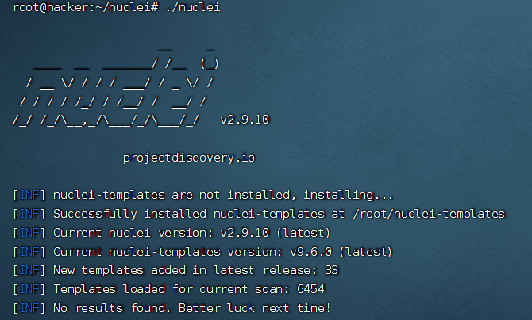
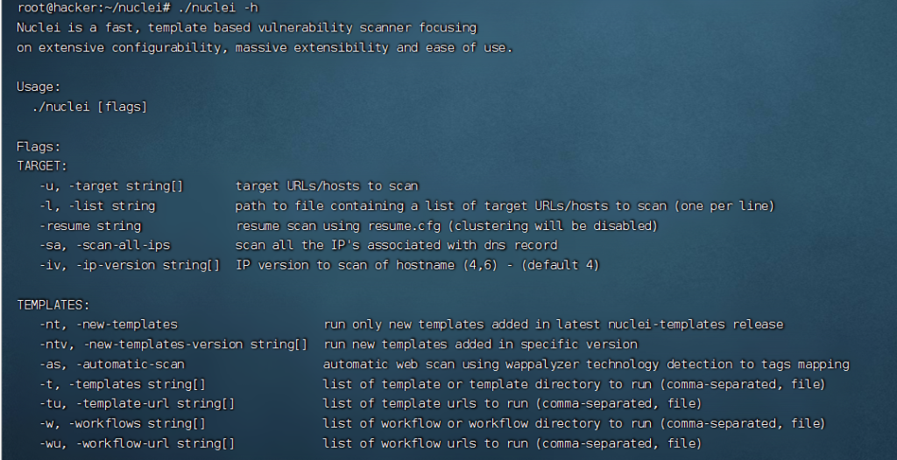

# Nuclei-漏洞扫描器 – 张三blog

本文最后更新于 144 天前，其中的信息可能已经过时

## Nuclei 介绍

Nuclei 使用基于模板的跨目标发送请求，从而实现零误报并提供对大量主机的快速扫描。 Nuclei 提供对各种协议的扫描，包括 TCP、DNS、HTTP、SSL、File、Whois、Websocket、Headless 等借助强大而灵活的模板，Nuclei 可用于对各种安全检查进行建模。

github 项目地址：[https://github.com/projectdiscovery/nuclei](https://github.com/projectdiscovery/nuclei)

## Linux 二进制安装教程

### 1\. 下载安装包

```plain
wget https://github.com/projectdiscovery/nuclei/releases/download/v2.9.10/nuclei_2.9.10_linux_amd64.zip
```

### 2\. 解压安装包

```plain
unzip nuclei_2.9.10_linux_amd64.zip
```

### 3\. 安装 nuclei

```plain
./nuclei
```

[](https://www.zsblog.org/wp-content/uploads/2023/07/image-24.png)

## 使用教程

### 1\. 帮助

```plain
./nuclei -h
```

[](https://www.zsblog.org/wp-content/uploads/2023/07/image-25.png)

### 2\. 单个扫描

```css
./nuclei -u https://www.target.com
```

### 3\. 多个扫描

```plain
nuclei -list urls.txt
```

### 4\. 使用指定模板扫描

```coffeescript
./nuclei -u http://172.16.10.3 -t ./POC/ECOLORY_9.0_DESER.yaml -p http://127.0.0.1:8080
```

-   \-u 指定扫描目标
-   \-t 指定使用的扫描模板
-   \-p 指定使用的代理

### 5\. 更多使用参数

```
      Nuclei is a fast, template based vulnerability scanner focusingon extensive configurability, massive extensibility and ease of use. Usage:  ./nuclei [flags] Flags:TARGET:   -u, -target string[]       target URLs/hosts to scan   -l, -list string           path to file containing a list of target URLs/hosts to scan (one per line)   -resume string             resume scan using resume.cfg (clustering will be disabled)   -sa, -scan-all-ips         scan all the IP's associated with dns record   -iv, -ip-version string[]  IP version to scan of hostname (4,6) - (default 4) TEMPLATES:   -nt, -new-templates                    run only new templates added in latest nuclei-templates release   -ntv, -new-templates-version string[]  run new templates added in specific version   -as, -automatic-scan                   automatic web scan using wappalyzer technology detection to tags mapping   -t, -templates string[]                list of template or template directory to run (comma-separated, file)   -tu, -template-url string[]            list of template urls to run (comma-separated, file)   -w, -workflows string[]                list of workflow or workflow directory to run (comma-separated, file)   -wu, -workflow-url string[]            list of workflow urls to run (comma-separated, file)   -validate                              validate the passed templates to nuclei   -nss, -no-strict-syntax                disable strict syntax check on templates   -td, -template-display                 displays the templates content   -tl                                    list all available templates FILTERING:   -a, -author string[]               templates to run based on authors (comma-separated, file)   -tags string[]                     templates to run based on tags (comma-separated, file)   -etags, -exclude-tags string[]     templates to exclude based on tags (comma-separated, file)   -itags, -include-tags string[]     tags to be executed even if they are excluded either by default or configuration   -id, -template-id string[]         templates to run based on template ids (comma-separated, file, allow-wildcard)   -eid, -exclude-id string[]         templates to exclude based on template ids (comma-separated, file)   -it, -include-templates string[]   templates to be executed even if they are excluded either by default or configuration   -et, -exclude-templates string[]   template or template directory to exclude (comma-separated, file)   -em, -exclude-matchers string[]    template matchers to exclude in result   -s, -severity value[]              templates to run based on severity. Possible values: info, low, medium, high, critical, unknown   -es, -exclude-severity value[]     templates to exclude based on severity. Possible values: info, low, medium, high, critical, unknown   -pt, -type value[]                 templates to run based on protocol type. Possible values: dns, file, http, headless, tcp, workflow, ssl, websocket, whois   -ept, -exclude-type value[]        templates to exclude based on protocol type. Possible values: dns, file, http, headless, tcp, workflow, ssl, websocket, whois   -tc, -template-condition string[]  templates to run based on expression condition OUTPUT:   -o, -output string            output file to write found issues/vulnerabilities   -sresp, -store-resp           store all request/response passed through nuclei to output directory   -srd, -store-resp-dir string  store all request/response passed through nuclei to custom directory (default "output")   -silent                       display findings only   -nc, -no-color                disable output content coloring (ANSI escape codes)   -j, -jsonl                    write output in JSONL(ines) format   -irr, -include-rr             include request/response pairs in the JSON, JSONL, and Markdown outputs (for findings only) [DEPRECATED use -omit-raw] (default true)   -or, -omit-raw                omit request/response pairs in the JSON, JSONL, and Markdown outputs (for findings only)   -nm, -no-meta                 disable printing result metadata in cli output   -ts, -timestamp               enables printing timestamp in cli output   -rdb, -report-db string       nuclei reporting database (always use this to persist report data)   -ms, -matcher-status          display match failure status   -me, -markdown-export string  directory to export results in markdown format   -se, -sarif-export string     file to export results in SARIF format   -je, -json-export string      file to export results in JSON format   -jle, -jsonl-export string    file to export results in JSONL(ine) format CONFIGURATIONS:   -config string                        path to the nuclei configuration file   -fr, -follow-redirects                enable following redirects for http templates   -fhr, -follow-host-redirects          follow redirects on the same host   -mr, -max-redirects int               max number of redirects to follow for http templates (default 10)   -dr, -disable-redirects               disable redirects for http templates   -rc, -report-config string            nuclei reporting module configuration file   -H, -header string[]                  custom header/cookie to include in all http request in header:value format (cli, file)   -V, -var value                        custom vars in key=value format   -r, -resolvers string                 file containing resolver list for nuclei   -sr, -system-resolvers                use system DNS resolving as error fallback   -dc, -disable-clustering              disable clustering of requests   -passive                              enable passive HTTP response processing mode   -fh2, -force-http2                    force http2 connection on requests   -ev, -env-vars                        enable environment variables to be used in template   -cc, -client-cert string              client certificate file (PEM-encoded) used for authenticating against scanned hosts   -ck, -client-key string               client key file (PEM-encoded) used for authenticating against scanned hosts   -ca, -client-ca string                client certificate authority file (PEM-encoded) used for authenticating against scanned hosts   -sml, -show-match-line                show match lines for file templates, works with extractors only   -ztls                                 use ztls library with autofallback to standard one for tls13 [Deprecated] autofallback to ztls is enabled by default   -sni string                           tls sni hostname to use (default: input domain name)   -lfa, -allow-local-file-access        allows file (payload) access anywhere on the system   -lna, -restrict-local-network-access  blocks connections to the local / private network   -i, -interface string                 network interface to use for network scan   -at, -attack-type string              type of payload combinations to perform (batteringram,pitchfork,clusterbomb)   -sip, -source-ip string               source ip address to use for network scan   -config-directory string              override the default config path ($home/.config)   -rsr, -response-size-read int         max response size to read in bytes (default 10485760)   -rss, -response-size-save int         max response size to read in bytes (default 1048576)   -reset                                reset removes all nuclei configuration and data files (including nuclei-templates)   -tlsi, -tls-impersonate               enable experimental client hello (ja3) tls randomization INTERACTSH:   -iserver, -interactsh-server string  interactsh server url for self-hosted instance (default: oast.pro,oast.live,oast.site,oast.online,oast.fun,oast.me)   -itoken, -interactsh-token string    authentication token for self-hosted interactsh server   -interactions-cache-size int         number of requests to keep in the interactions cache (default 5000)   -interactions-eviction int           number of seconds to wait before evicting requests from cache (default 60)   -interactions-poll-duration int      number of seconds to wait before each interaction poll request (default 5)   -interactions-cooldown-period int    extra time for interaction polling before exiting (default 5)   -ni, -no-interactsh                  disable interactsh server for OAST testing, exclude OAST based templates FUZZING:   -ft, -fuzzing-type string  overrides fuzzing type set in template (replace, prefix, postfix, infix)   -fm, -fuzzing-mode string  overrides fuzzing mode set in template (multiple, single) UNCOVER:   -uc, -uncover                  enable uncover engine   -uq, -uncover-query string[]   uncover search query   -ue, -uncover-engine string[]  uncover search engine (shodan,censys,fofa,shodan-idb,quake,hunter,zoomeye,netlas,criminalip,publicwww,hunterhow) (default shodan)   -uf, -uncover-field string     uncover fields to return (ip,port,host) (default "ip:port")   -ul, -uncover-limit int        uncover results to return (default 100)   -ur, -uncover-ratelimit int    override ratelimit of engines with unknown ratelimit (default 60 req/min) (default 60) RATE-LIMIT:   -rl, -rate-limit int               maximum number of requests to send per second (default 150)   -rlm, -rate-limit-minute int       maximum number of requests to send per minute   -bs, -bulk-size int                maximum number of hosts to be analyzed in parallel per template (default 25)   -c, -concurrency int               maximum number of templates to be executed in parallel (default 25)   -hbs, -headless-bulk-size int      maximum number of headless hosts to be analyzed in parallel per template (default 10)   -headc, -headless-concurrency int  maximum number of headless templates to be executed in parallel (default 10) OPTIMIZATIONS:   -timeout int                        time to wait in seconds before timeout (default 10)   -retries int                        number of times to retry a failed request (default 1)   -ldp, -leave-default-ports          leave default HTTP/HTTPS ports (eg. host:80,host:443)   -mhe, -max-host-error int           max errors for a host before skipping from scan (default 30)   -te, -track-error string[]          adds given error to max-host-error watchlist (standard, file)   -nmhe, -no-mhe                      disable skipping host from scan based on errors   -project                            use a project folder to avoid sending same request multiple times   -project-path string                set a specific project path (default "/tmp")   -spm, -stop-at-first-match          stop processing HTTP requests after the first match (may break template/workflow logic)   -stream                             stream mode - start elaborating without sorting the input   -ss, -scan-strategy value           strategy to use while scanning(auto/host-spray/template-spray) (default auto)   -irt, -input-read-timeout duration  timeout on input read (default 3m0s)   -nh, -no-httpx                      disable httpx probing for non-url input   -no-stdin                           disable stdin processing HEADLESS:   -headless                        enable templates that require headless browser support (root user on Linux will disable sandbox)   -page-timeout int                seconds to wait for each page in headless mode (default 20)   -sb, -show-browser               show the browser on the screen when running templates with headless mode   -ho, -headless-options string[]  start headless chrome with additional options   -sc, -system-chrome              use local installed Chrome browser instead of nuclei installed   -lha, -list-headless-action      list available headless actions DEBUG:   -debug                    show all requests and responses   -dreq, -debug-req         show all sent requests   -dresp, -debug-resp       show all received responses   -p, -proxy string[]       list of http/socks5 proxy to use (comma separated or file input)   -pi, -proxy-internal      proxy all internal requests   -ldf, -list-dsl-function  list all supported DSL function signatures   -tlog, -trace-log string  file to write sent requests trace log   -elog, -error-log string  file to write sent requests error log   -version                  show nuclei version   -hm, -hang-monitor        enable nuclei hang monitoring   -v, -verbose              show verbose output   -profile-mem string       optional nuclei memory profile dump file   -vv                       display templates loaded for scan   -svd, -show-var-dump      show variables dump for debugging   -ep, -enable-pprof        enable pprof debugging server   -tv, -templates-version   shows the version of the installed nuclei-templates   -hc, -health-check        run diagnostic check up UPDATE:   -up, -update                      update nuclei engine to the latest released version   -ut, -update-templates            update nuclei-templates to latest released version   -ud, -update-template-dir string  custom directory to install / update nuclei-templates   -duc, -disable-update-check       disable automatic nuclei/templates update check STATISTICS:   -stats                    display statistics about the running scan   -sj, -stats-json          display statistics in JSONL(ines) format   -si, -stats-interval int  number of seconds to wait between showing a statistics update (default 5)   -m, -metrics              expose nuclei metrics on a port   -mp, -metrics-port int    port to expose nuclei metrics on (default 9092)
```
