# PHP代码审计-IBOS - 先知社区

PHP代码审计-IBOS

- - -

# 一、项目介绍及部署

## 1.项目介绍

IIBOS 是一个基于PHP开发、Yii框架、免费开源的，快速、高效的协同办公管理系统 ，从2012年研发以来，是为了简化企业协同应用开发而诞生的。IBOS从诞生以来一直秉承简洁实用的设计原则，在保持出色的功能和的优秀的用户体验同时，也注重易用性。并且拥有众多的原创功能和特性，在社区团队的积极参与下，在易用性、扩展性和性能方面不断优化和改进，已经成长为国内用户体验最好和最具影响力的协同办公管理系统，众多的典型案例确保可以稳定用于商业以及门户级的开发。

## 2.框架介绍

通过前面的介绍以及阅读官网帮助文档，我们初步发现该系统后端使用了YII框架。我们可以简单的了解  
一下他这里用到的框架，这有利于我们后续的代码审计，我们在代码中插入 yii::getVersion() 查看  
当前使用的YII版本，Yii目前有两个主要的版本: 2.0 和 1.1。Yii 最先发布稳定版本为：1.1.14 (2013年8月 11日发布),Yii 最新发布稳定版本为：2.0.0 (发布于 2014年10月12日发布)。  
通过前面的介绍以及阅读官网帮助文档，我们初步发现该系统后端使用了YII框架。我们可以简单的了解  
一下他这里用到的框架，这有利于我们后续的代码审计，我们在代码中插入 yii::getVersion() 查看  
当前使用的YII版本，Yii目前有两个主要的版本: 2.0 和 1.1。Yii 最先发布稳定  
例如1.X中存在一些SQL注入，XSS漏洞。  
且该框架完全面向对象(OOP)，坚持严格的面向对象编程范式。它没有定义任何全局函数或变量。而  
且，它定义的类层次结构允许最大的可重用性和定制。  
YII框架实现了MVC设计模式，models 目录包含了所有模型类，views 目录包含了所有视图脚本，  
controllers 目录包含了所有控制器类，这一点在后续的目录结构会有所体现。

[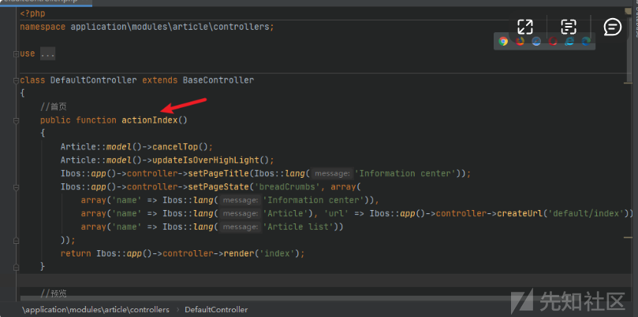](https://xzfile.aliyuncs.com/media/upload/picture/20231127110401-9d6ade7a-8cd1-1.png)

# 二、代码审计

## 1.命令执行：

在进行功能点测试的时候发现该系统管理后台存在一个数据库备份的功能点，然后进入更多选项功能处。  
[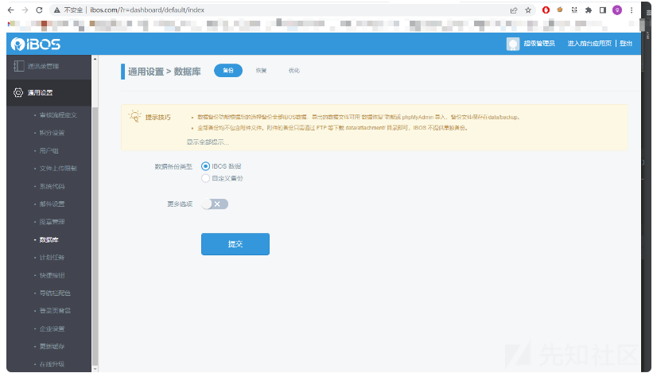](https://xzfile.aliyuncs.com/media/upload/picture/20231127110413-a471a118-8cd1-1.png)  
发现只有最后备份文件名处内容可能可控，我们根据路径去定位源代码。

[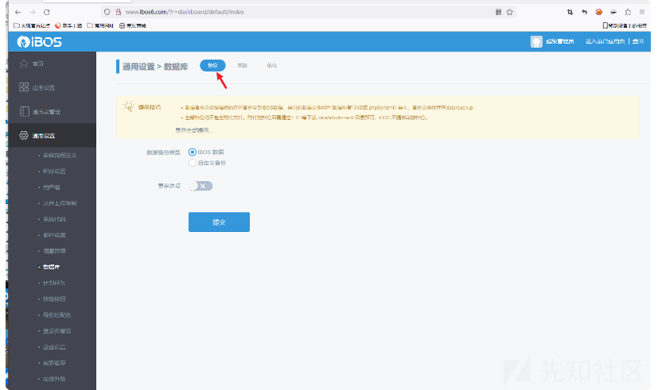](https://xzfile.aliyuncs.com/media/upload/picture/20231127110505-c373dcca-8cd1-1.png)

[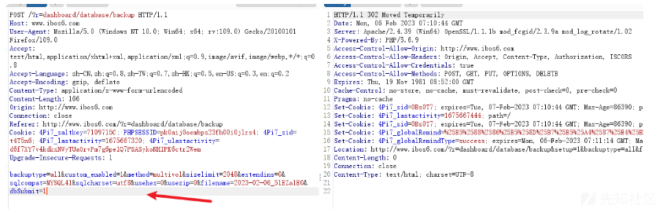](https://xzfile.aliyuncs.com/media/upload/picture/20231127110510-c6ae3156-8cd1-1.png)

该处调用了 actionBackup() 方法，然后进行判断。  
在33行代码处调用了database类下的 databaseBackup() 方法，从这个方法名来看该方法可能是用来进行数据库备份的，跟进该方法。

[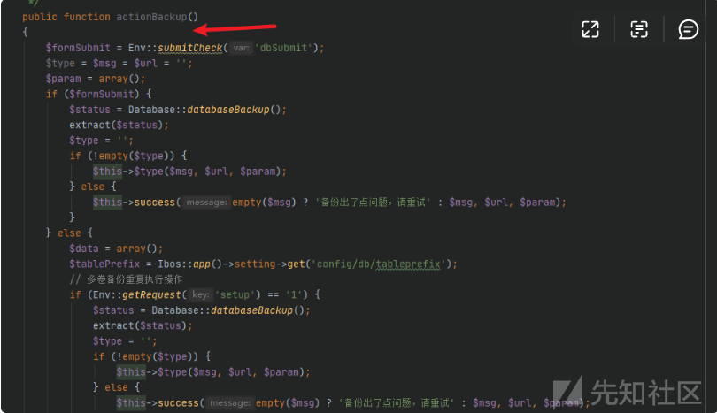](https://xzfile.aliyuncs.com/media/upload/picture/20231127110528-d1a74c6e-8cd1-1.png)

通过 Env::getRequest 方法，filename参数来传入我们上传的文件名，发现这里对一些后缀进行了过滤。

[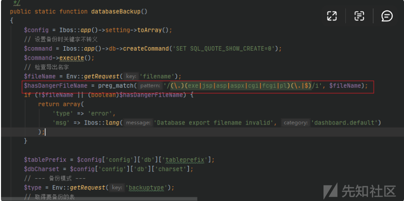](https://xzfile.aliyuncs.com/media/upload/picture/20231127110546-dc3beea0-8cd1-1.png)

getRequest()方法则是获取我们不同类型的请求参数。

[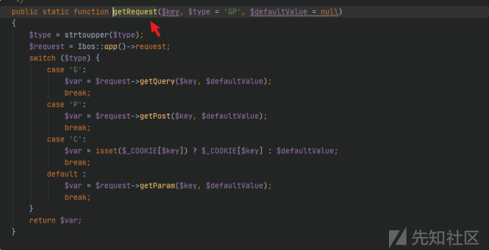](https://xzfile.aliyuncs.com/media/upload/picture/20231127110601-e50de556-8cd1-1.png)

首先在 $method == 'multivol' 这个if分支中将 $backupFileName 参数进行拼接并赋值给$dumpfile ，经过分析发现在该if分支中 $dumpfile 在传递的过程中并未有危险函数。

[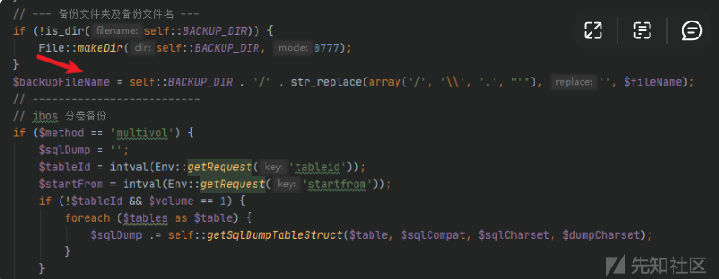](https://xzfile.aliyuncs.com/media/upload/picture/20231127110611-ead9ef98-8cd1-1.png)

[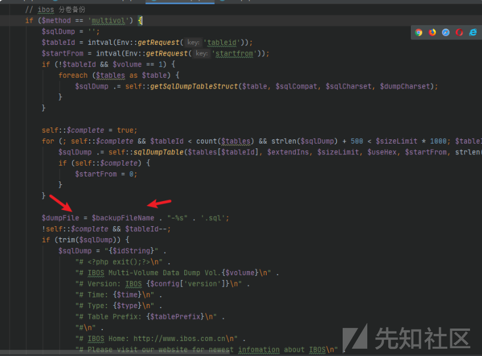](https://xzfile.aliyuncs.com/media/upload/picture/20231127110618-ef11095c-8cd1-1.png)

而在else分支中 $backupFileName 经过拼接传递到了 $dumpFile 参数中。

[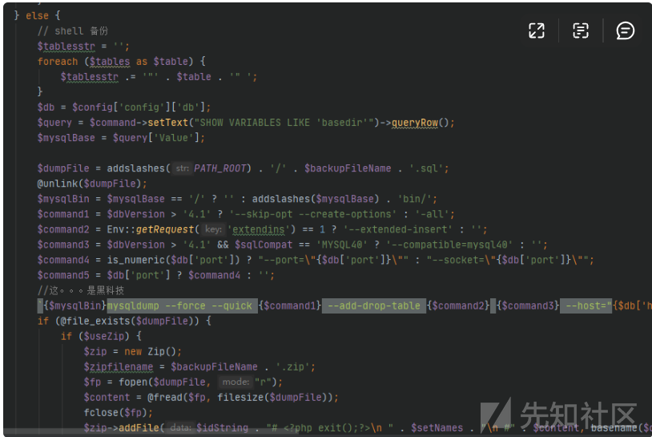](https://xzfile.aliyuncs.com/media/upload/picture/20231127110627-f4e82cfc-8cd1-1.png)

我们继续向下分析。  
上述的 $dumpFile 参数最终被拼接到了453行的代码中，在这里的$dumpFile参数是可控的。

[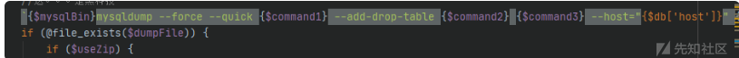](https://xzfile.aliyuncs.com/media/upload/picture/20231127110638-faff567e-8cd1-1.png)

## 漏洞复现：

[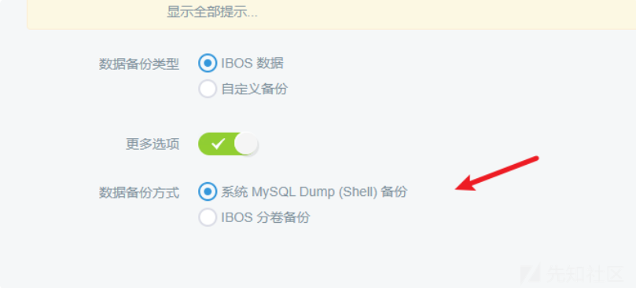](https://xzfile.aliyuncs.com/media/upload/picture/20231127110654-047ce658-8cd2-1.png)

[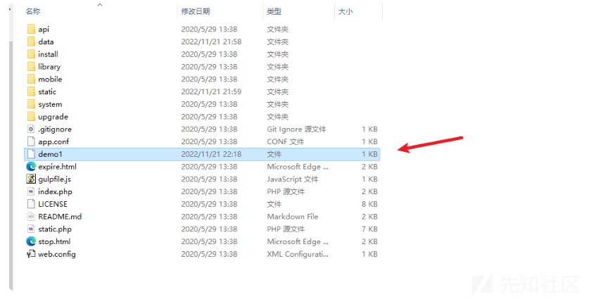](https://xzfile.aliyuncs.com/media/upload/picture/20231127110700-0819409a-8cd2-1.png)

成功rce。

[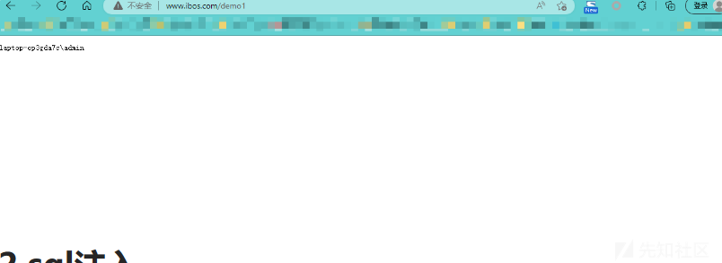](https://xzfile.aliyuncs.com/media/upload/picture/20231127110706-0c0c846e-8cd2-1.png)

## 2.sql注入

在常规黑盒测试的时候发现该处功能点在添加特殊字符时存在报错

[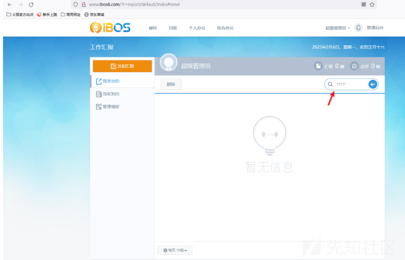](https://xzfile.aliyuncs.com/media/upload/picture/20231127110714-10838d26-8cd2-1.png)

[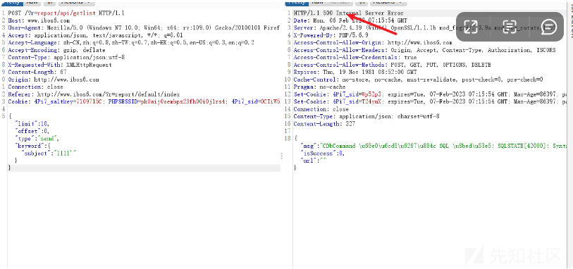](https://xzfile.aliyuncs.com/media/upload/picture/20231127110720-13f6f68c-8cd2-1.png)

[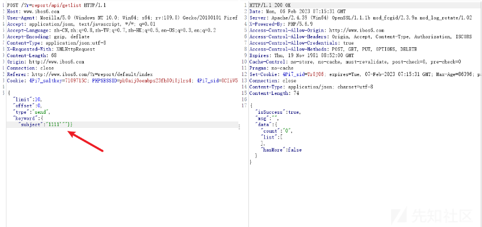](https://xzfile.aliyuncs.com/media/upload/picture/20231127110727-18605416-8cd2-1.png)

功能点通过Api控制器调用了module层的 GetList 类，我们跟进该类进行查看

[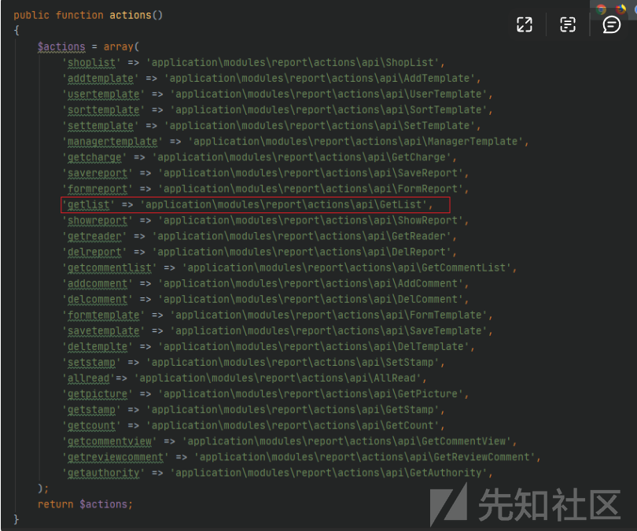](https://xzfile.aliyuncs.com/media/upload/picture/20231127110736-1dc0fc58-8cd2-1.png)

在 getListCondition() 方法中最后返回分支选择后的部分SQL语句。

[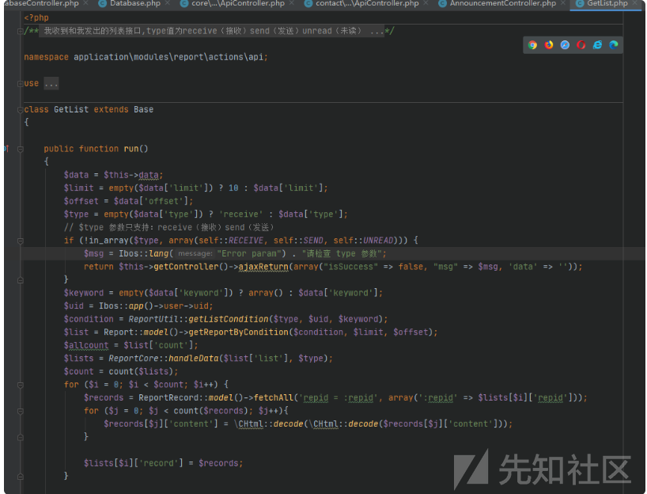](https://xzfile.aliyuncs.com/media/upload/picture/20231127110844-46319332-8cd2-1.png)

在 getReportByCondition() 方法中，经过一系列的跟踪调试，得到了完整的SQL语句，在参数传递的过程中代码层没有对特殊字符进行过滤导致SQL注入的产生。

[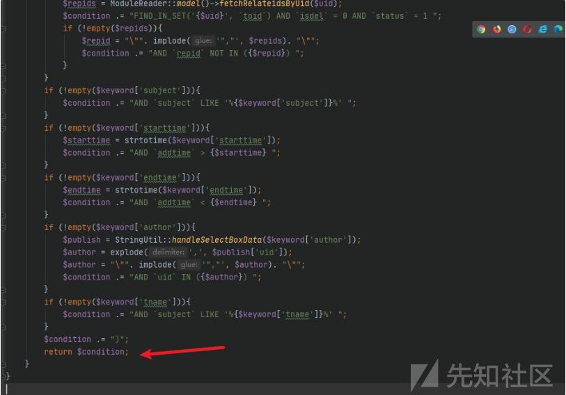](https://xzfile.aliyuncs.com/media/upload/picture/20231127111030-8564ce16-8cd2-1.png)

[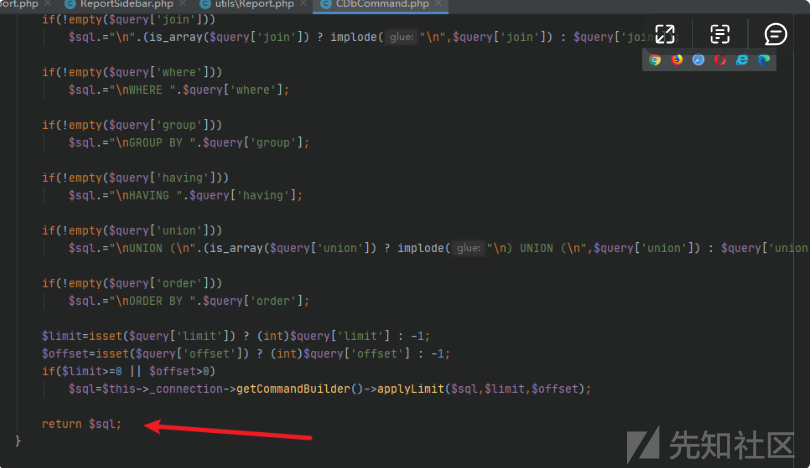](https://xzfile.aliyuncs.com/media/upload/picture/20231127111037-89ac2ab4-8cd2-1.png)

在后期二次开发的过程中对报错没有进行及时的异常捕获处理导致报错注入的产生。

[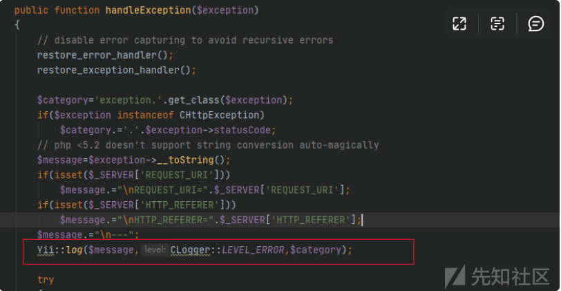](https://xzfile.aliyuncs.com/media/upload/picture/20231127111044-8dad9918-8cd2-1.png)

## 漏洞复现：

[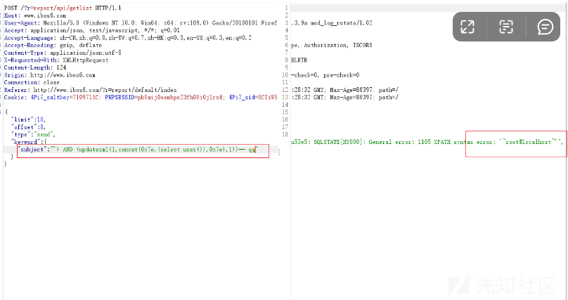](https://xzfile.aliyuncs.com/media/upload/picture/20231127111050-91316ea2-8cd2-1.png)

[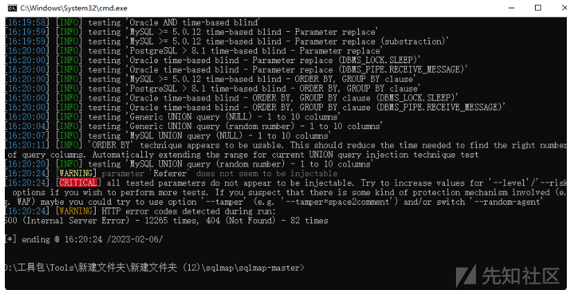](https://xzfile.aliyuncs.com/media/upload/picture/20231127111058-965ddeb0-8cd2-1.png)

## 3.sql注入2

在功能点文件柜处存在一处下载功能点，该功能点通过参数值来下载文件.

[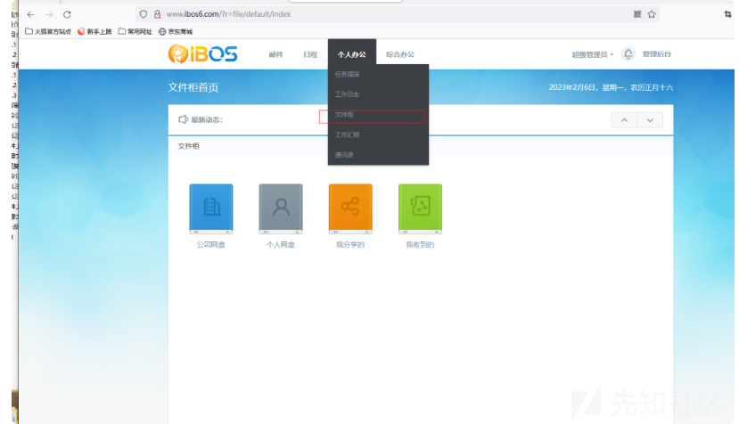](https://xzfile.aliyuncs.com/media/upload/picture/20231127111105-9a637e20-8cd2-1.png)

输入单引号，发现报错。经过测试之后，发现此处也存在注入。  
通过路由发现该处调用了 actionAjaxEnt() 方法并接收一个op参数进行功能的选择。

[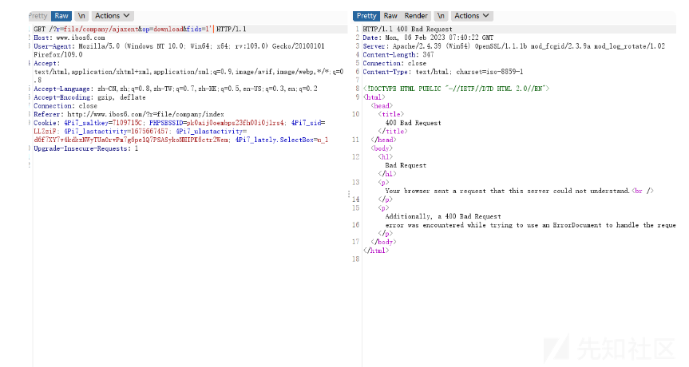](https://xzfile.aliyuncs.com/media/upload/picture/20231127111128-a839232e-8cd2-1.png)

通过路由发现该处调用了 actionAjaxEnt() 方法并接收一个op参数进行功能的选择，在代码中调用了 BaseController 类下的 download() 方法。通过框架的db类库下的 buildQuery() 方法跟踪得到完整的SQL语句

[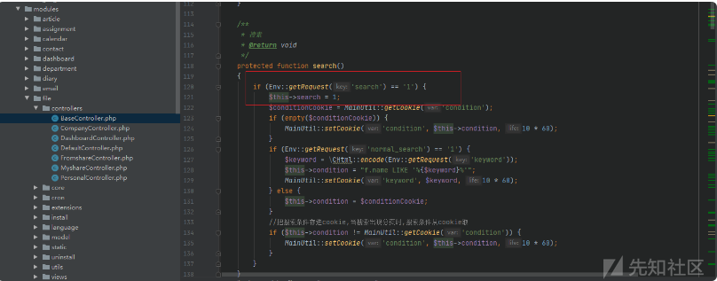](https://xzfile.aliyuncs.com/media/upload/picture/20231127111135-ac77d25a-8cd2-1.png)

[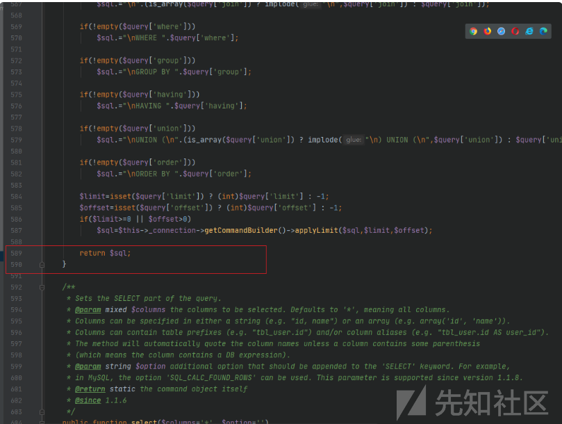](https://xzfile.aliyuncs.com/media/upload/picture/20231127111145-b2469004-8cd2-1.png)

[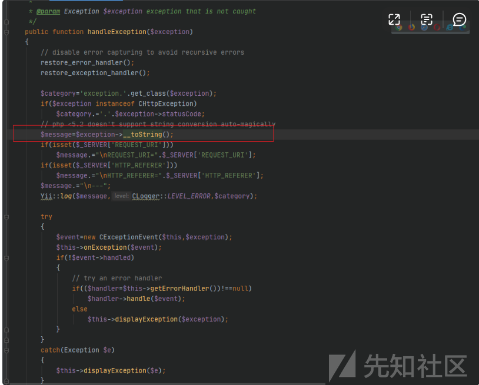](https://xzfile.aliyuncs.com/media/upload/picture/20231127111153-b6c8c2e6-8cd2-1.png)

## 漏洞复现：

在fied参数后面，输入sql注入的payload，成功注入出数据库名。

[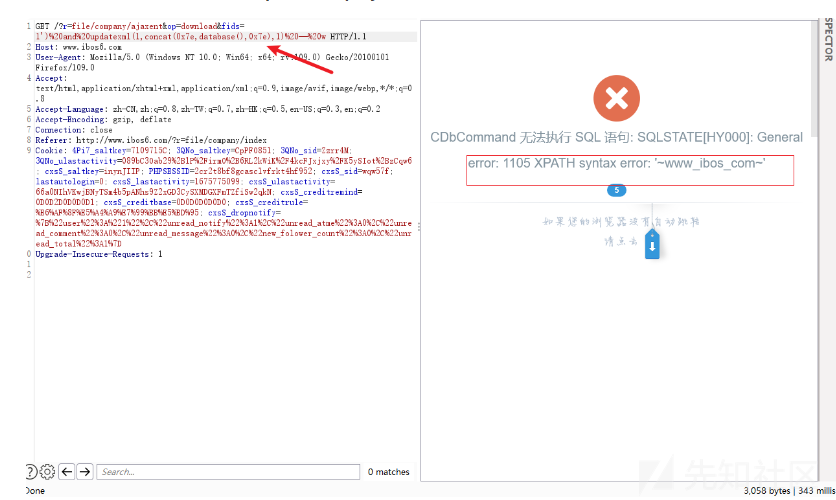](https://xzfile.aliyuncs.com/media/upload/picture/20231127111200-bb143880-8cd2-1.png)

## 4.文件上传绕过

在测试过程中发现一处上传点，然后我们接着将构造好的.php文件进行上传。

[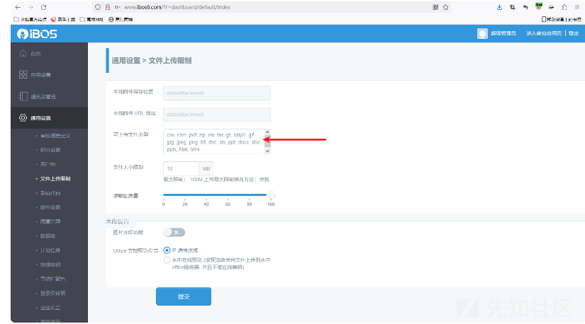](https://xzfile.aliyuncs.com/media/upload/picture/20231127111226-caad27a2-8cd2-1.png)

发现定义.php后不还是不能成功上传通过该处功能点找到相应代码进行分析

[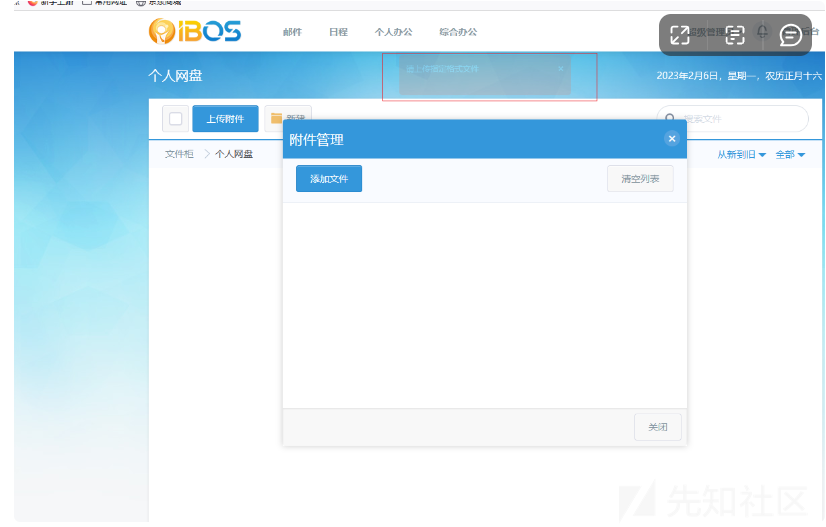](https://xzfile.aliyuncs.com/media/upload/picture/20231127111220-c6f10c14-8cd2-1.png)

[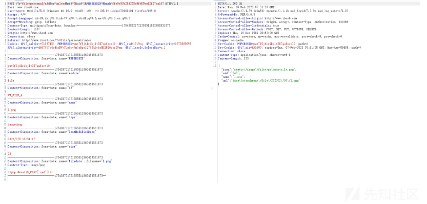](https://xzfile.aliyuncs.com/media/upload/picture/20231127111235-cfced870-8cd2-1.png)

发现这里调用了 actionadd() 这个方法，其实该方法通过op参数帮助我们进行功能定位，但在执行该方法前会先执行该类下的 actionIndex() 方法获取后台的配置参数。

[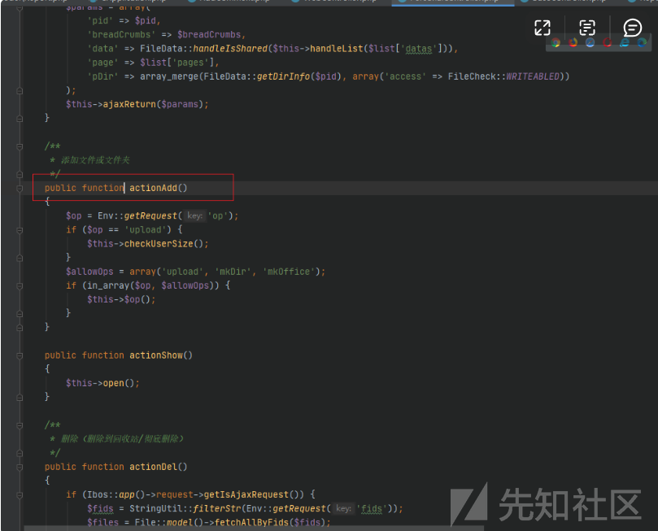](https://xzfile.aliyuncs.com/media/upload/picture/20231127111329-f06ae128-8cd2-1.png)

在 actionIndex() 方法中调用了getUploadConfig()获取上传配置参数

[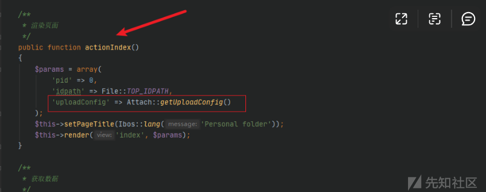](https://xzfile.aliyuncs.com/media/upload/picture/20231127111335-f3c4e328-8cd2-1.png)

在self::$dangerTags 变量中则unset掉。

[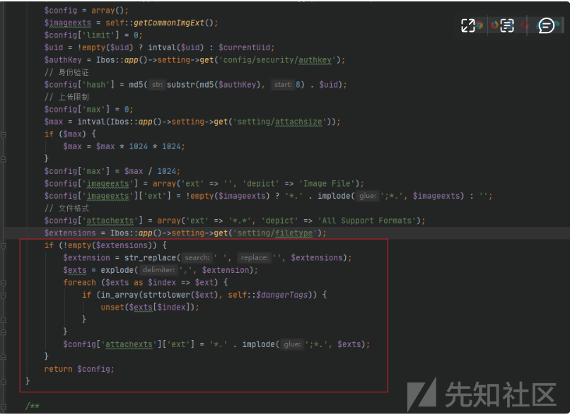](https://xzfile.aliyuncs.com/media/upload/picture/20231127111343-f85ad41a-8cd2-1.png)

在后台设置中设置了php后缀，在这里也不会生效，.php后缀也不自然不会上传成功

[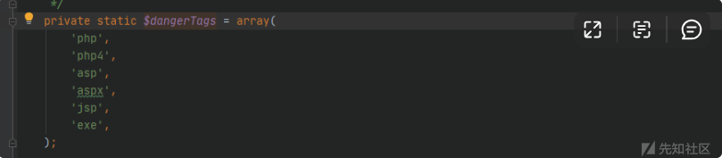](https://xzfile.aliyuncs.com/media/upload/picture/20231127111349-fbe7bc06-8cd2-1.png)

接着来看upload()方法，在该方法中调用了CommonAttach() 类下的方法，该类下封装了所有用于上传的方法。

[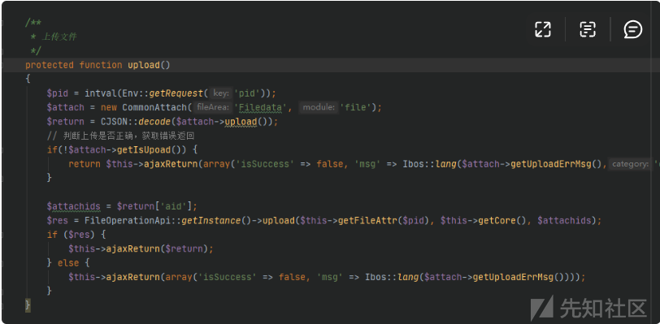](https://xzfile.aliyuncs.com/media/upload/picture/20231127111356-006e8e08-8cd3-1.png)

在通过上传方法中28行的 chechExt() 方法就是另一处过滤的地方。

[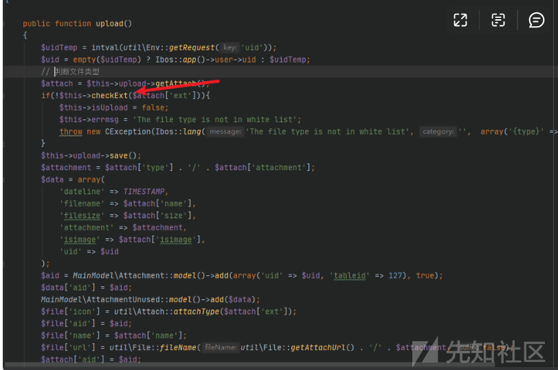](https://xzfile.aliyuncs.com/media/upload/picture/20231127111404-04ce39bc-8cd3-1.png)

[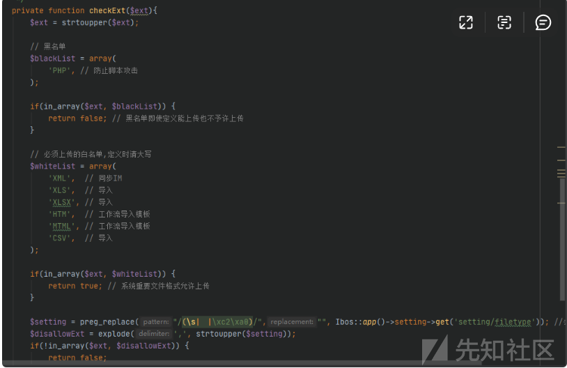](https://xzfile.aliyuncs.com/media/upload/picture/20231127111411-08ed0e56-8cd3-1.png)

## 漏洞复现：

[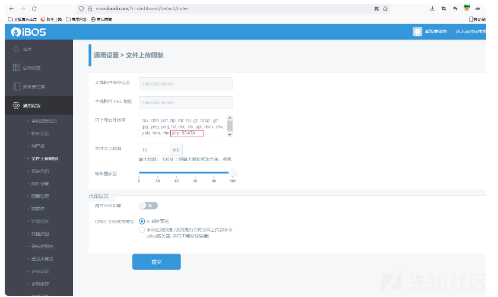](https://xzfile.aliyuncs.com/media/upload/picture/20231127111418-0d29551a-8cd3-1.png)

[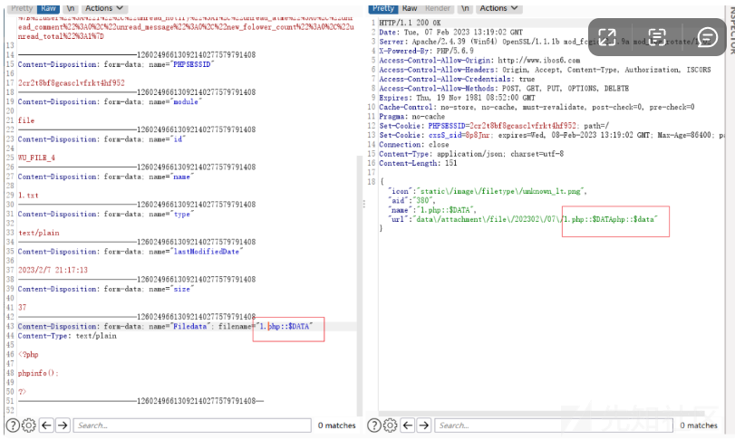](https://xzfile.aliyuncs.com/media/upload/picture/20231127111424-10e585ac-8cd3-1.png)

[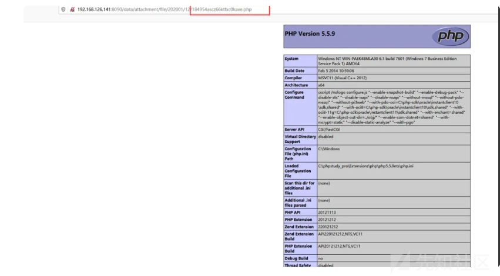](https://xzfile.aliyuncs.com/media/upload/picture/20231127111430-147bc442-8cd3-1.png)

## 5.任意文件删除

在system目录中搜索unlink函数，在 DatabaseController.php 中发现一处很明显的参数可控造成的任  
意文件删除。这里通过post方式接收参数key，在代码72行进行简单判断是否是文件就进行了删除。

[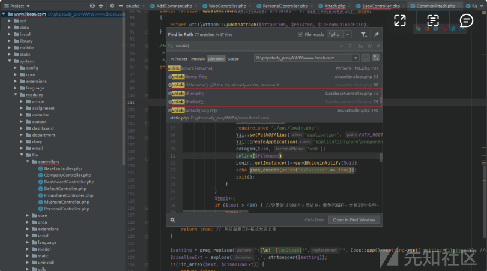](https://xzfile.aliyuncs.com/media/upload/picture/20231127111444-1d0ba406-8cd3-1.png)

[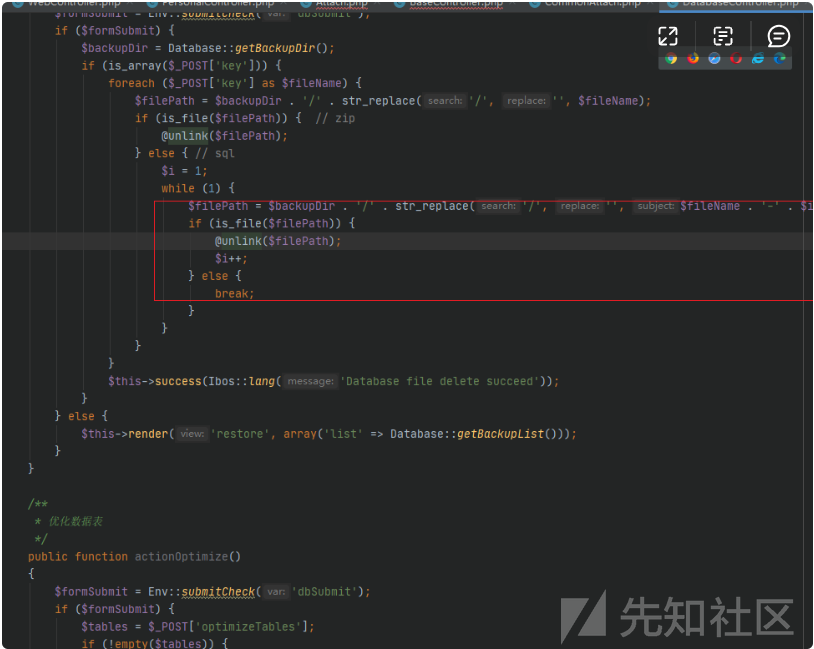](https://xzfile.aliyuncs.com/media/upload/picture/20231127111456-240d3b84-8cd3-1.png)

在代码中可以清除的看到我们传入的路径被带到unlink()函数中

[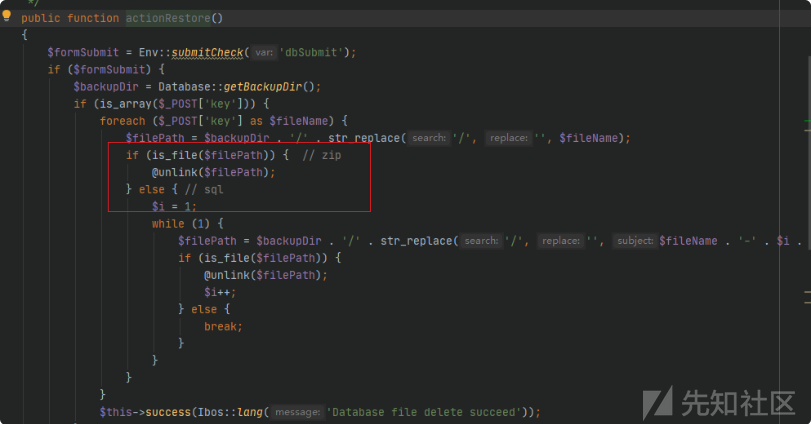](https://xzfile.aliyuncs.com/media/upload/picture/20231127111506-2a0aa22e-8cd3-1.png)

## 漏洞复现：

[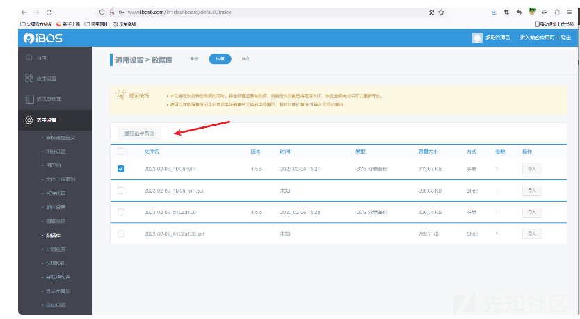](https://xzfile.aliyuncs.com/media/upload/picture/20231127111512-2da5cdb4-8cd3-1.png)

[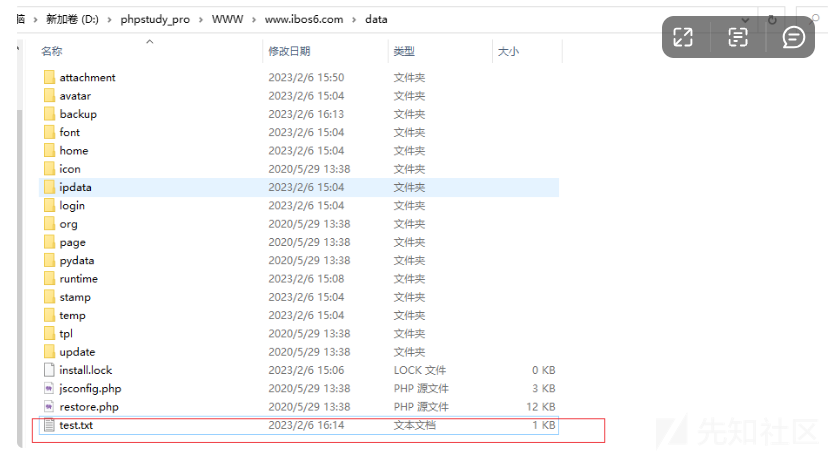](https://xzfile.aliyuncs.com/media/upload/picture/20231127111518-312b439c-8cd3-1.png)

[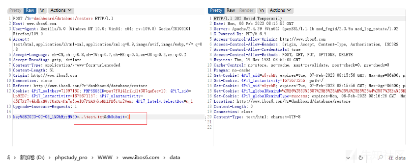](https://xzfile.aliyuncs.com/media/upload/picture/20231127111527-367ca9da-8cd3-1.png)

[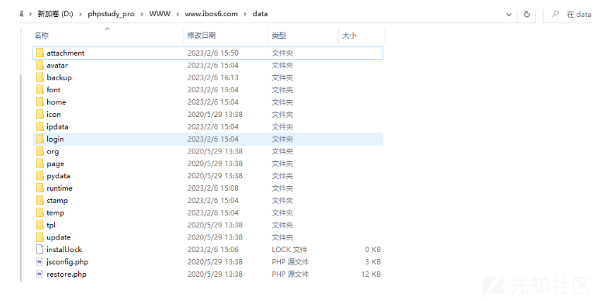](https://xzfile.aliyuncs.com/media/upload/picture/20231127111536-3bb99412-8cd3-1.png)

## 6.命令执行漏洞getshell

在/system/modules/dashboard/controllers/CronController.php  
有问题的函数在actionIndex()第 16 行。  
看第40行getRealCronFile()函数会形成一个完整的文件路径，第41行到第47行，这是用来过滤修改计划任务的文件名的字符串。

[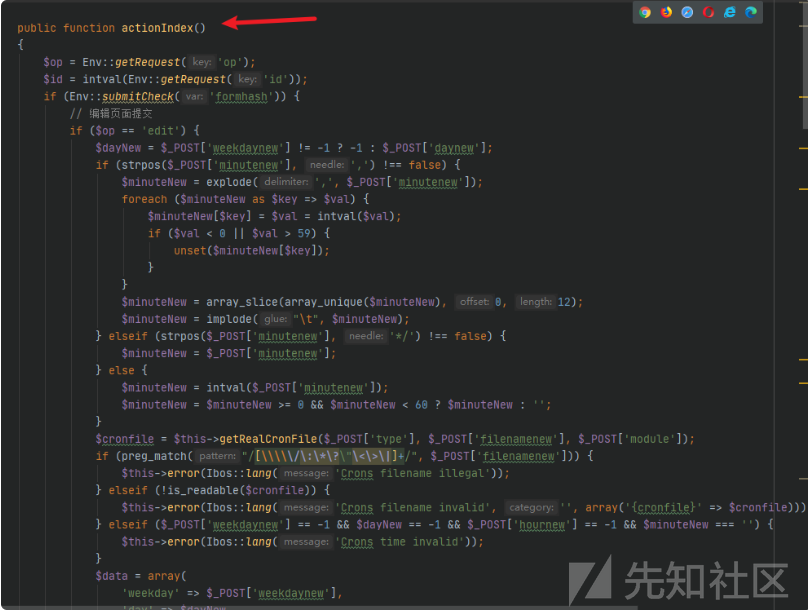](https://xzfile.aliyuncs.com/media/upload/picture/20231127111546-4196fb36-8cd3-1.png)

[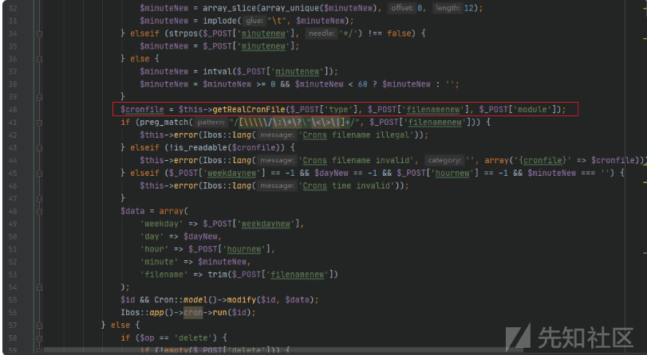](https://xzfile.aliyuncs.com/media/upload/picture/20231127111553-460c1dea-8cd3-1.png)

getRealCronFile()功能代码。

[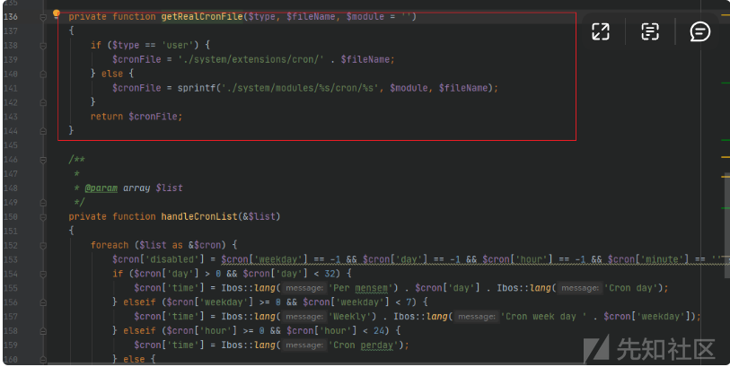](https://xzfile.aliyuncs.com/media/upload/picture/20231127111604-4ca222b2-8cd3-1.png)

## 漏洞复现：

[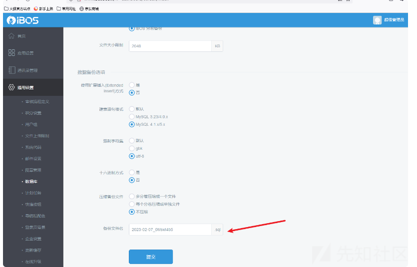](https://xzfile.aliyuncs.com/media/upload/picture/20231127111619-55ac0cf6-8cd3-1.png)

[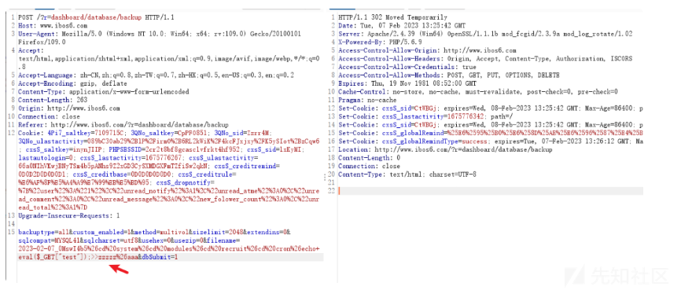](https://xzfile.aliyuncs.com/media/upload/picture/20231127111627-59fce906-8cd3-1.png)

[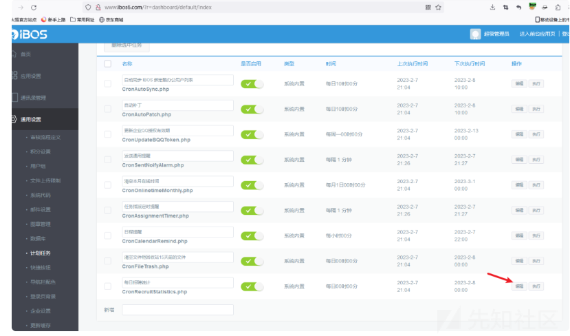](https://xzfile.aliyuncs.com/media/upload/picture/20231127111637-6027afa0-8cd3-1.png)

[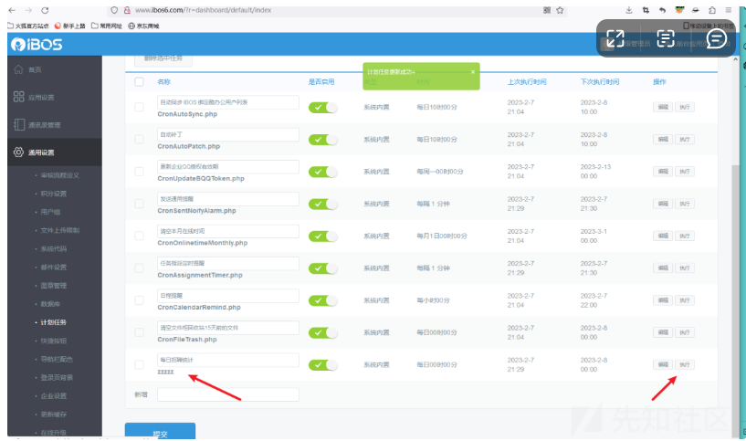](https://xzfile.aliyuncs.com/media/upload/picture/20231127111658-6cb50cd6-8cd3-1.png)

成功进行执行命令。  
[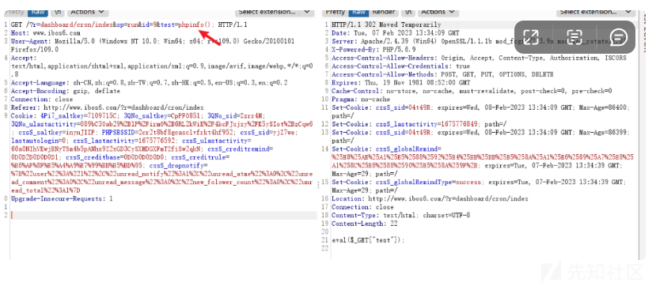](https://xzfile.aliyuncs.com/media/upload/picture/20231127111704-7039bf3c-8cd3-1.png)

## 7.xss漏洞

通过漏洞点，去定位源码。  
接着发现使用creaturl这个方法。

[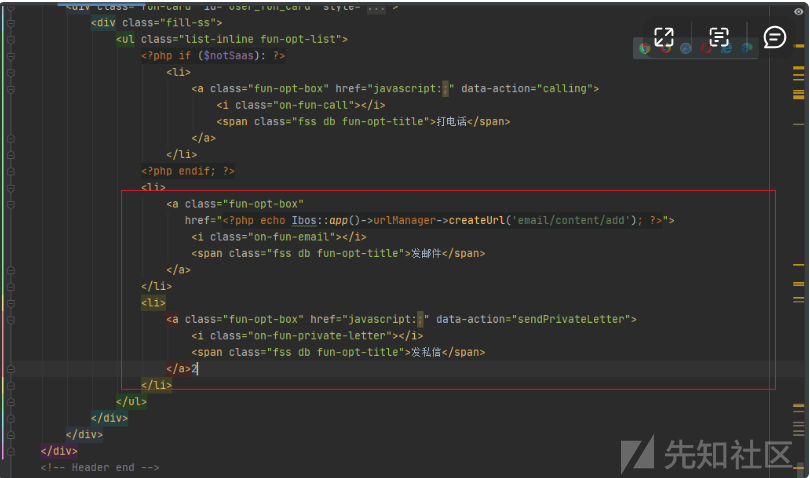](https://xzfile.aliyuncs.com/media/upload/picture/20231127111721-7aac0308-8cd3-1.png)

跟进这个方法。

[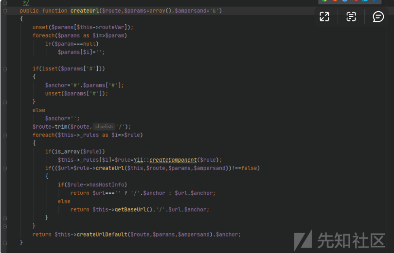](https://xzfile.aliyuncs.com/media/upload/picture/20231127111726-7d8235fc-8cd3-1.png)

在代码中发现，没有对用户的输入内容进行过滤。导致可以在发送邮件的过程中产生xss漏洞。

[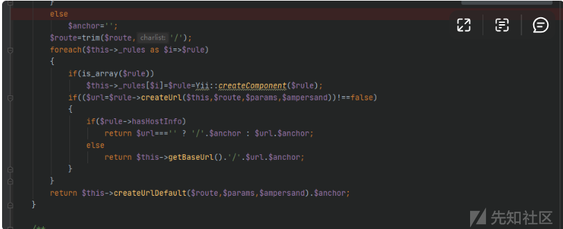](https://xzfile.aliyuncs.com/media/upload/picture/20231127111734-822cc0cc-8cd3-1.png)

[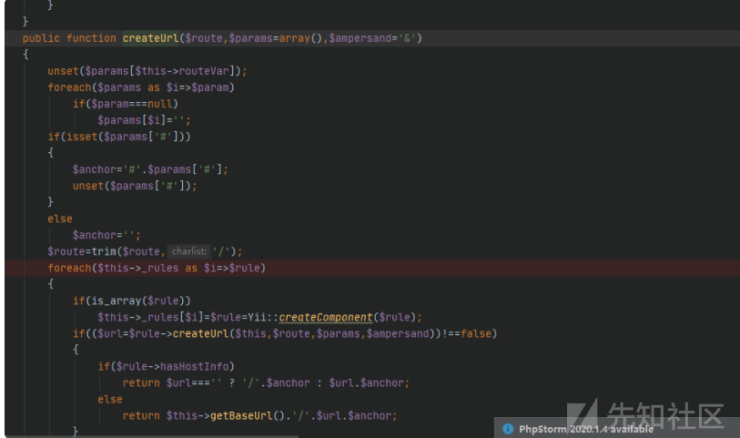](https://xzfile.aliyuncs.com/media/upload/picture/20231127111740-85910c00-8cd3-1.png)

## 漏洞复现：

[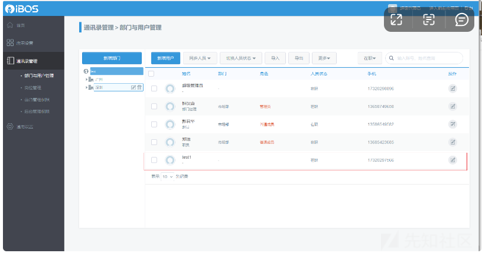](https://xzfile.aliyuncs.com/media/upload/picture/20231127111748-8a47a146-8cd3-1.png)

[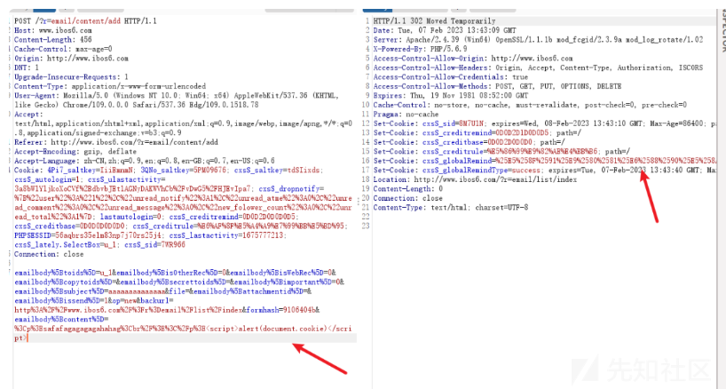](https://xzfile.aliyuncs.com/media/upload/picture/20231127111755-8eb16276-8cd3-1.png)

[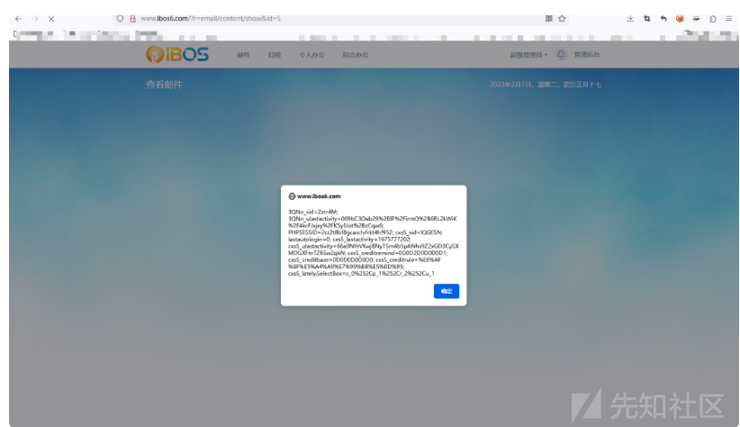](https://xzfile.aliyuncs.com/media/upload/picture/20231127111800-91eee45e-8cd3-1.png)

REF  
[https://www.skrskr.me/index.php/posts/open-source-version-of-IBOS-oa-system-getshell.html](https://www.skrskr.me/index.php/posts/open-source-version-of-IBOS-oa-system-getshell.html)  
[https://gitee.com/ibos/IBOS/issues/I189ZF](https://gitee.com/ibos/IBOS/issues/I189ZF)  
[https://gitee.com/ibos/IBOS/issues/I18JRG](https://gitee.com/ibos/IBOS/issues/I18JRG)
