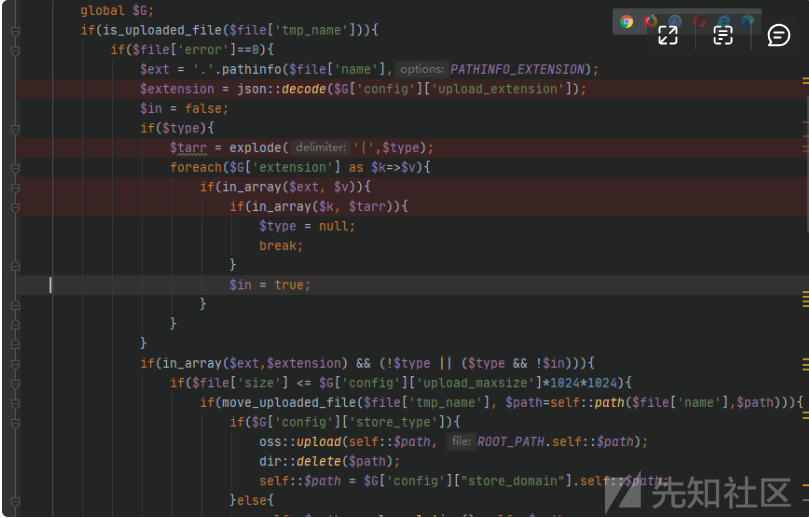
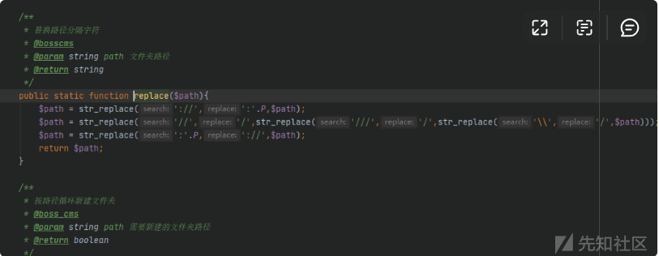
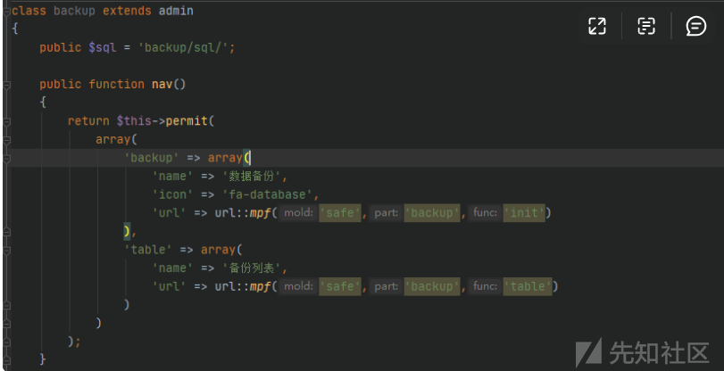
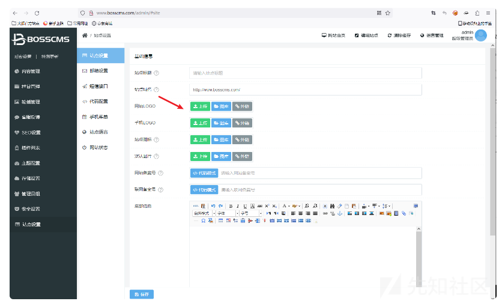

# PHP代码审计-某cms - 先知社区

PHP代码审计-某cms

- - -

# 一、环境搭建

[](https://xzfile.aliyuncs.com/media/upload/picture/20231127181225-7674e716-8d0d-1.png)

[](https://xzfile.aliyuncs.com/media/upload/picture/20231127181232-7a9358e6-8d0d-1.png)

[](https://xzfile.aliyuncs.com/media/upload/picture/20231127181242-805bbbce-8d0d-1.png)  
搭建完成。  
[](https://xzfile.aliyuncs.com/media/upload/picture/20231127181251-860074fc-8d0d-1.png)

# 二、代码审计

## 路由分析：

第一步首先去找到index.php文件，上面定义了一些常量，这里的常量决定了该index.php路由。  
我们接着去看enter.php文件。  
[](https://xzfile.aliyuncs.com/media/upload/picture/20231127181304-8dc3a538-8d0d-1.png)

我们继续跟进该方法。

[](https://xzfile.aliyuncs.com/media/upload/picture/20231127181317-952b858e-8d0d-1.png)

跟进 load\_class() 方法

[](https://xzfile.aliyuncs.com/media/upload/picture/20231127181326-9aff399c-8d0d-1.png)

在load\_class()方法中需要传入四个参数，第一个参数 $type 是判断该功能点是前台功能点还是后台功能  
点，也就是决定代码19行的$type路径是在哪个文件夹下，由于SYSTEM\_PATH常量定义为system目录

[](https://xzfile.aliyuncs.com/media/upload/picture/20231127181338-a1e1ec32-8d0d-1.png)

$mold 参数定位功能目录， $part 决定调用目录下哪个php文件，  
$func 则是定位文件下调用的方法。

[](https://xzfile.aliyuncs.com/media/upload/picture/20231127181346-a6670210-8d0d-1.png)

## 1.ueditor编辑器文件上传漏洞

我们在后台查看功能点的时候，发现一处可以编辑上传类型的地方，这里添加一个允许上传后缀.php，  
这里可以添加成功。

[](https://xzfile.aliyuncs.com/media/upload/picture/20231127181357-ad00c71e-8d0d-1.png)

进行.php文件的上传，但这里提示后缀名不允许上传，  
这里我们去抓包查看。

[](https://xzfile.aliyuncs.com/media/upload/picture/20231127181406-b2dd3172-8d0d-1.png)

通过路由找到对应源码

[](https://xzfile.aliyuncs.com/media/upload/picture/20231127181416-b85808de-8d0d-1.png)

这里调用了controller.php，6-10行定义了常量也就是路由的走向，通过包含 enter.php 调用路由文件  
进行路由选择，也就是我们上面分析的路由。

[](https://xzfile.aliyuncs.com/media/upload/picture/20231127181427-bef5f412-8d0d-1.png)

通过路由找到功能点文件ueditor.php下ueditor类下的init()方法,上面的路由中传入了  
uploadimage ,分支的选择是通过读取config\[\]来进行选择的，config的内容是从哪里获取的

[](https://xzfile.aliyuncs.com/media/upload/picture/20231127181443-c8a6ab50-8d0d-1.png)

在类的最上面通过 \_\_construct() 调用 load\_json() 方法进行 config 内容的获取，跟进load\_json()方法

[](https://xzfile.aliyuncs.com/media/upload/picture/20231127181454-cf262f78-8d0d-1.png)

通过前面传入的config.json获取该json文件中的文件内容。

[](https://xzfile.aliyuncs.com/media/upload/picture/20231127181508-d73a3fce-8d0d-1.png)

前面action中传入了uploadimage，所以进入了该分支，并调用了上面的uploadimage()方法

[](https://xzfile.aliyuncs.com/media/upload/picture/20231127181517-dcb34dba-8d0d-1.png)

我们接着上面继续跟进分支中的uploadimage()方法。在 uploadimage() 方法中使用$FILES接上上传文件，而这里调用的upload::files()方法才是上传的关键，我们继续跟进files()方法。

[](https://xzfile.aliyuncs.com/media/upload/picture/20231127181528-e350ba4a-8d0d-1.png)

在files()方法中的60行看到了我们刚开始的提示信息，那我们从下往上去追是什么情况导致条件不满足。  
[](https://xzfile.aliyuncs.com/media/upload/picture/20231127181543-ec1964f6-8d0d-1.png)

向上追溯我们发现这里需要满足两个条件：in\_array($ext,$extension) , (!$type || ($type  
&& !$in) 。我们首先去看第一个条件 $ext 在 $extension 数组中，我们继续向上追溯

[](https://xzfile.aliyuncs.com/media/upload/picture/20231127181556-f3d8580a-8d0d-1.png)

从这里我们发现 $ext 是获取我们上传的后缀名，而这里的 $extension 是从哪里获取到的呢  
全局搜索 upload\_extension 可以发现该处正是我们上面通过自定义设置的.php后缀，所以  
第一个条件是满足的。

[](https://xzfile.aliyuncs.com/media/upload/picture/20231127181609-fbb1c034-8d0d-1.png)

[](https://xzfile.aliyuncs.com/media/upload/picture/20231127181615-ffb042e6-8d0d-1.png)

而第二个条件 (!$type || ($type && !$in) 我们只需满足一个条件即可 !$type=true 或者  
($type=true && !$in=true) ， !$type=true 那么$type的值为NULL即可。

[](https://xzfile.aliyuncs.com/media/upload/picture/20231127181626-061277da-8d0e-1.png)

全局搜索extension中定义的类型，发现extension.json文件中定义了我们上传的类型

[](https://xzfile.aliyuncs.com/media/upload/picture/20231127181634-0af4e92c-8d0e-1.png)

想要实现php文件的上传，传入的type类型为code才行

[](https://xzfile.aliyuncs.com/media/upload/picture/20231127181706-1db4b65a-8d0e-1.png)

我们全局查看files()方法调用，发现该处功能点传入的类型中有code，我们跟进该方法进行查看。

[](https://xzfile.aliyuncs.com/media/upload/picture/20231127181716-2390fae8-8d0e-1.png)

在uploadfile()方法中就一目了然了，该处调用files()方法并且可以上传code类型下的后缀文件，而  
code下包含我们想要上传的.php后缀。功能点满足上面的两个条件可以实现任意文件上传。

[](https://xzfile.aliyuncs.com/media/upload/picture/20231127181725-28e41ac0-8d0e-1.png)

## 漏洞复现：

在编辑器上传附件的地方，找到一个使用编辑器的地方，通过附  
件上传.php文件，这也就满足了第二个条件此处调用了uploadfile()方法。

[](https://xzfile.aliyuncs.com/media/upload/picture/20231127181734-2ea4360c-8d0e-1.png)

[](https://xzfile.aliyuncs.com/media/upload/picture/20231127181740-31f4af80-8d0e-1.png)

[](https://xzfile.aliyuncs.com/media/upload/picture/20231127181746-3584a9ca-8d0e-1.png)

## 2.任意文件删除漏洞

我们继续查看ueditor.class.php文件时发现该文件下还存在一个delete()方法，这个是编辑  
器中删除文件的一个方法，我们去分析一下该方法。

[](https://xzfile.aliyuncs.com/media/upload/picture/20231127181755-3ac3b912-8d0e-1.png)

全局搜索store\_type发现该处功能为设置存储方式，默认为0，所以上面默认会走dir类下的delete()方法。  
[](https://xzfile.aliyuncs.com/media/upload/picture/20231127181806-419bbcf8-8d0e-1.png)

[](https://xzfile.aliyuncs.com/media/upload/picture/20231127181822-4b6e03f8-8d0e-1.png)

[](https://xzfile.aliyuncs.com/media/upload/picture/20231127181830-4fcaf0e6-8d0e-1.png)

跟进dir类下的delete()方法查看该方法：传入的path参数经过replace()方法后直接进行了unlink()删除，所以我们继续跟进replace()方法查看该方法是否存在过滤

[](https://xzfile.aliyuncs.com/media/upload/picture/20231127181949-7f28b620-8d0e-1.png)

这里的replace()方法并未做过滤,这里的path就可以控制造成任意文件删除。

[](https://xzfile.aliyuncs.com/media/upload/picture/20231127181955-82d63612-8d0e-1.png)

## 漏洞复现：

构造出该方法的路由

[](https://xzfile.aliyuncs.com/media/upload/picture/20231127182006-890a3cfe-8d0e-1.png)

[](https://xzfile.aliyuncs.com/media/upload/picture/20231127182011-8c446bd8-8d0e-1.png)

[](https://xzfile.aliyuncs.com/media/upload/picture/20231127182017-8fa25c68-8d0e-1.png)

## 3.目录遍历漏洞

我们接着翻找 ueditor.class.php 文件下的方法时，找到一处 lists() 方法，在代码327行处  
$folder 参数是通过GET传入且没有进行任何过滤就拼接到$path路径中。

[](https://xzfile.aliyuncs.com/media/upload/picture/20231127182026-9552bcd4-8d0e-1.png)

在read()方法中我们可以看到代码129-130行通过opendir()、readdir()打开目录并读取目录中的内容，  
而上面的replace()方法我们在上面任意文件删除也进行了分析，是做路径优化的。

[](https://xzfile.aliyuncs.com/media/upload/picture/20231127182036-9adfec12-8d0e-1.png)

我们在回到lists()方法中，由于该方法通过路由不能直接调用，所以我们去查看lists()的调用情况，我们发现有三处调用了lists()方法

[](https://xzfile.aliyuncs.com/media/upload/picture/20231127182048-a2364ca4-8d0e-1.png)

我们找到一处 listfile() 方法进行分析，在该方法的312行处调用了lists()方法。

[](https://xzfile.aliyuncs.com/media/upload/picture/20231127182058-a84d908e-8d0e-1.png)

我们去全局搜索 fileManagerListPath ，找到该值是upload/路径，也就是说上面要读取的文件是upload目录下的文件，我们从上面的分析中可以知道lists()方法中传入的 $folder 参数没有进行过滤就拼接到 $path 中是存在目录遍历的。

[](https://xzfile.aliyuncs.com/media/upload/picture/20231127182109-ae6eeefe-8d0e-1.png)

对调用 listfile() 方法实现目录遍历.

[](https://xzfile.aliyuncs.com/media/upload/picture/20231127182120-b55eeec6-8d0e-1.png)

对路由分析，要调用这里的init()方法，在该方法中通过传入action参数实现类中方法的调用。

[](https://xzfile.aliyuncs.com/media/upload/picture/20231127182131-bbcbfae2-8d0e-1.png)

## 漏洞复现：

使用这个接口进行漏洞复现  
GET /system/extend/ueditor/php/controller.php?action=listfile&folder=../../../ HTTP/1.1

[](https://xzfile.aliyuncs.com/media/upload/picture/20231127182139-c0618c98-8d0e-1.png)

[](https://xzfile.aliyuncs.com/media/upload/picture/20231127182145-c45a447a-8d0e-1.png)

## 4.任意文件下载漏洞

进入安全设置- 数据备份- 备份列表- 下载处存在一处任意文件下载，抓包去分析该处下载功能点。

[](https://xzfile.aliyuncs.com/media/upload/picture/20231127182155-ca109536-8d0e-1.png)

[](https://xzfile.aliyuncs.com/media/upload/picture/20231127182203-ce973218-8d0e-1.png)

在这里id参数没有进行任何过滤就进行了拼接，所以造成任意文件下载。

[](https://xzfile.aliyuncs.com/media/upload/picture/20231127182210-d349f700-8d0e-1.png)

[](https://xzfile.aliyuncs.com/media/upload/picture/20231127182218-d7ac8920-8d0e-1.png)

## 漏洞复现：

通过 ../ 实现目录跳转，读取mysql配置文件。

[](https://xzfile.aliyuncs.com/media/upload/picture/20231127182225-dbf60588-8d0e-1.png)

## 5.权限校验处存在逻辑缺陷

我们从第一处编辑器任意文件上传来分析，我们发现在ueditor类中继承了一个admin类，而在文件的最  
上面通过 basic\_class() 来加载 admin.class.php 文件，我们去跟进这个方法看看该方法是如何进行  
加载的。

[](https://xzfile.aliyuncs.com/media/upload/picture/20231128161531-4c10dbd8-8dc6-1.png)

在代码85行处判断是否设置 $func 参数，如果没有则将 $func 默认设置为 init ，然后在最下面调用  
load\_class() 加载类文件，然后加载admin类文件下的 init() 方法。

[](https://xzfile.aliyuncs.com/media/upload/picture/20231128161541-51d81cac-8dc6-1.png)

在调用admin类下的 init() 方法中通过session类下的 get() 方法获取登录后的session，如果读取不到session的话get()方法则返回false，那么这里就会进入到16行的if条件，在17行判断是否定义IS\_LOGIN 常量，如果未定义则通过header()进行跳转，在跳转后代码仍然会继续向下执行而没有使用die()函数结束下面语句的执行。

[](https://xzfile.aliyuncs.com/media/upload/picture/20231128161553-58fd386e-8dc6-1.png)

那么会继续走ueditor类下的 init() 方法，实现文件上传

[](https://xzfile.aliyuncs.com/media/upload/picture/20231128161617-679b5acc-8dc6-1.png)

如果在代码中加入 die() 函数，那么获取不到session后直接退出而不会向下执行后面的代码。

[](https://xzfile.aliyuncs.com/media/upload/picture/20231128161625-6c1a49fa-8dc6-1.png)

## 漏洞复现：

[](https://xzfile.aliyuncs.com/media/upload/picture/20231128161633-70f01d74-8dc6-1.png)

在后台中发现允许上传类型中出现了.php文件类型  
[](https://xzfile.aliyuncs.com/media/upload/picture/20231128161642-76432ab4-8dc6-1.png)  
最后通过编辑器的文件上传功能进行文件上传，从下图可以看到文件上传已经成功然后进行302跳转。

[](https://xzfile.aliyuncs.com/media/upload/picture/20231128161654-7da29646-8dc6-1.png)

## 6.任意文件上传漏洞

进入站点设置，然后进行文件上传。

[](https://xzfile.aliyuncs.com/media/upload/picture/20231128161709-86b4ff62-8dc6-1.png)

[](https://xzfile.aliyuncs.com/media/upload/picture/20231128161715-8a010a12-8dc6-1.png)

在/system/basic/class/upload.class.php下

[](https://xzfile.aliyuncs.com/media/upload/picture/20231128161722-8e214b48-8dc6-1.png)

[](https://xzfile.aliyuncs.com/media/upload/picture/20231128161728-91968720-8dc6-1.png)

上传php文件开始调试  
发现两个条件都不满足

1.  php后缀名不在$extension中
2.  !$type!=true也就是$type不为null  
    第一个条件  
    首先解决第一个问题，在文件29行处可以看到$extension变量值的获取

[](https://xzfile.aliyuncs.com/media/upload/picture/20231128161735-95dd93b4-8dc6-1.png)

全局搜索upload\_extension

[](https://xzfile.aliyuncs.com/media/upload/picture/20231128161744-9b755640-8dc6-1.png)

[](https://xzfile.aliyuncs.com/media/upload/picture/20231128161750-9f028eb8-8dc6-1.png)

存在允许上传类型，那么直接添加.php然后保存，回到源码继续上传.php调试

[](https://xzfile.aliyuncs.com/media/upload/picture/20231128161844-bf4f97ce-8dc6-1.png)

可以看出这时候$extension数组中多了一个值即.php，成功满足第一个要求  
第二个条件  
要让!$type!=true，也就是让$type=null即可，也就是执行到函数的35行

[](https://xzfile.aliyuncs.com/media/upload/picture/20231128161852-c3d943e4-8dc6-1.png)

$t是遍历$arrary获得的，而$array是分割$type获得的，可以看到files函数调用时$type默认值是null，那么就是调用时指定code值

[](https://xzfile.aliyuncs.com/media/upload/picture/20231128161902-c9ea7fbe-8dc6-1.png)

在code键值中看到了我们想要上传的.php

[](https://xzfile.aliyuncs.com/media/upload/picture/20231128161909-ce246f40-8dc6-1.png)

所以的我们的$t应该为code，再回到upload.class.php

[](https://xzfile.aliyuncs.com/media/upload/picture/20231128161917-d2e2caf4-8dc6-1.png)

跟踪函数，定位到/system/extend/ueditor/php/ueditor.class.php中第246行，调用files函数并且指定了code值

[](https://xzfile.aliyuncs.com/media/upload/picture/20231128161925-d76b1b62-8dc6-1.png)

## 漏洞复现：

[](https://xzfile.aliyuncs.com/media/upload/picture/20231128161932-dbf48e8e-8dc6-1.png)

[](https://xzfile.aliyuncs.com/media/upload/picture/20231128161939-dfa531c8-8dc6-1.png)

## 7.未授取任意文件删除

对用户是否登录的验证在system/basic/class/admin.class.php文件init函数中

[](https://xzfile.aliyuncs.com/media/upload/picture/20231128161946-e41c48c2-8dc6-1.png)

当判断未登录时通过header进行页面跳转，但是没有exit()或者die()终止程序运行  
所以还是能够得到自己的结果后才跳转（这一点可以在BP中体现）

在未登录状态下  
先执行删除，成功执行得到结果

## 漏洞复现

[](https://xzfile.aliyuncs.com/media/upload/picture/20231128161954-e90d660e-8dc6-1.png)

[](https://xzfile.aliyuncs.com/media/upload/picture/20231128162000-ec60709e-8dc6-1.png)

[](https://xzfile.aliyuncs.com/media/upload/picture/20231128162006-efe0a4be-8dc6-1.png)

[](https://xzfile.aliyuncs.com/media/upload/picture/20231128162011-f3463bbe-8dc6-1.png)

## 8.未授权用户操作

定位到/system/admin/manager/manager.class.php  
其中的add,edit,delete三个函数参数都是由请求获得的（可控的）

[](https://xzfile.aliyuncs.com/media/upload/picture/20231128162033-0028678a-8dc7-1.png)

## 漏洞复现

构造请求包：

[](https://xzfile.aliyuncs.com/media/upload/picture/20231128162041-04f72f8a-8dc7-1.png)

```plain
POST /admin/?mold=manager&part=manager&func=add HTTP/1.1
Host: bosscms
Content-Length: 1959
Cache-Control: max-age=0
Upgrade-Insecure-Requests: 1
Origin: http://bosscms
Content-Type: multipart/form-data; boundary=----WebKitFormBoundaryB067fgIWBKtHI4Gy
User-Agent: Mozilla/5.0 (Windows NT 10.0; Win64; x64) AppleWebKit/537.36 (KHTML, like Gecko) Chrome/96.0.4664.110 Safari/537.36
Accept: text/html,application/xhtml+xml,application/xml;q=0.9,image/avif,image/webp,image/apng,*/*;q=0.8,application/signed-exchange;v=b3;q=0.9
Referer: http://bosscms/admin/?mold=manager&part=manager&func=edit
Accept-Encoding: gzip, deflate
Accept-Language: zh-CN,zh;q=0.9
Connection: close

------WebKitFormBoundaryB067fgIWBKtHI4Gy
Content-Disposition: form-data; name="username"

123
------WebKitFormBoundaryB067fgIWBKtHI4Gy
Content-Disposition: form-data; name="password"

123
------WebKitFormBoundaryB067fgIWBKtHI4Gy
Content-Disposition: form-data; name="passwords"

123
------WebKitFormBoundaryB067fgIWBKtHI4Gy
Content-Disposition: form-data; name="level"

2
------WebKitFormBoundaryB067fgIWBKtHI4Gy
Content-Disposition: form-data; name="department"


------WebKitFormBoundaryB067fgIWBKtHI4Gy
Content-Disposition: form-data; name="open"

1
------WebKitFormBoundaryB067fgIWBKtHI4Gy
Content-Disposition: form-data; name="permit1"


------WebKitFormBoundaryB067fgIWBKtHI4Gy
Content-Disposition: form-data; name="permit2"

["content&content","items&items","banner&banner","consult&consult","feedback&feedback","search&search","seo&seo","seo&violation","seo&rewrite","anchor&anchor","link&link","plugin&plugin","plugin&market","template&template","template&market","store&store","manager&manager","safe&safe","safe&backup","site&site","site&email","site&sms","site&code","menu&menu","language&language","site&state"]
------WebKitFormBoundaryB067fgIWBKtHI4Gy
Content-Disposition: form-data; name="permit3"

["content&content","items&items","banner&banner","consult&consult","feedback&feedback","search&search","plugin&plugin","safe&backup","site&site","site&code","menu&menu","language&language","site&state"]
------WebKitFormBoundaryB067fgIWBKtHI4Gy
Content-Disposition: form-data; name="permit4"


------WebKitFormBoundaryB067fgIWBKtHI4Gy
Content-Disposition: form-data; name="image"


------WebKitFormBoundaryB067fgIWBKtHI4Gy
Content-Disposition: form-data; name="alias"


------WebKitFormBoundaryB067fgIWBKtHI4Gy
Content-Disposition: form-data; name="email"


------WebKitFormBoundaryB067fgIWBKtHI4Gy
Content-Disposition: form-data; name="phone"


------WebKitFormBoundaryB067fgIWBKtHI4Gy--
```

然后去添加新用户。  
成功添加管理员用户

[](https://xzfile.aliyuncs.com/media/upload/picture/20231128162052-0b483758-8dc7-1.png)

成功登录，且为管理员权限

[](https://xzfile.aliyuncs.com/media/upload/picture/20231128162100-102da14a-8dc7-1.png)  
REF：  
[https://blog.csdn.net/qq\_31812157/article/details/130013554](https://blog.csdn.net/qq_31812157/article/details/130013554)  
[http://www.hackdig.com/?tag=CMS&p=1](http://www.hackdig.com/?tag=CMS&p=1)
