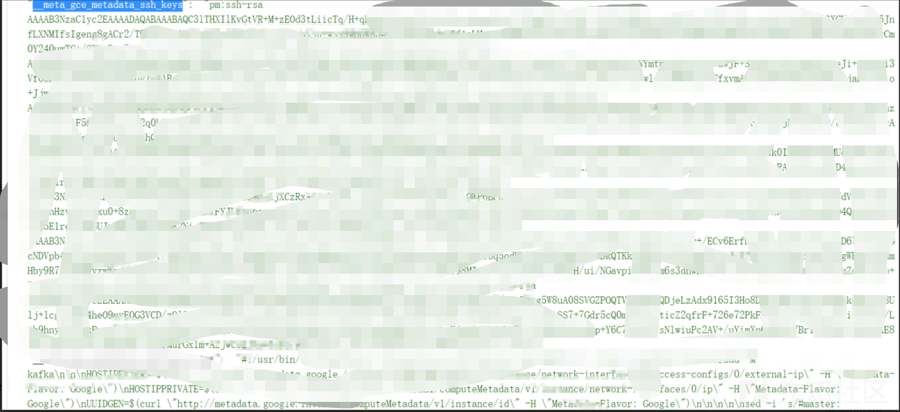

# Prometheus云原生监控系统攻击面 - 先知社区

Prometheus云原生监控系统攻击面

- - -

#### Prometheus 简介

Prometheus 受启发于 Google 的 Brogmon 监控系统（相似的 Kubernetes 是从 Google 的 Brog 系统演变而来），从 2012 年开始由前 Google 工程师在 Soundcloud 以开源软件的形式进行研发，并且于 2015 年早期对外发布早期版本。 2016 年 5 月继 Kubernetes 之后成为第二个正式加入 CNCF 基金会的项目，同年 6 月正式发布 1.0 版本。2017 年底发布了基于全新存储层的 2.0 版本，能更好地与容器平台、云平台配合。 Prometheus 作为新一代的云原生监控系统，目前已经有超过 650+ 位贡献者参与到 Prometheus 的研发工作上，并且超过 120+ 项的第三方集成  
[](https://xzfile.aliyuncs.com/media/upload/picture/20231116160333-a34ef82c-8456-1.png)

由于之前开发者认为 Prometheus 捕获的数字指标不被视为敏感数据，所以开发者采取了一种策略，即内置没有对身份验证和加密等安全功能的支持，直到在 2.24.0 版本中引入了传输层安全性 (TLS) 和基本身份验证支持。  
相关issues：[https://github.com/juice-shop/juice-shop/issues/1275](https://github.com/juice-shop/juice-shop/issues/1275)  
但是很多 Prometheus 的使用者并未启用这些功能，因此许多 Prometheus 完全暴露在 互联网上。

#### 漏洞利用面

下面是Prometheus 的简易架构  
[](https://xzfile.aliyuncs.com/media/upload/picture/20231116160417-bd94bf28-8456-1.png)  
Prometheus 从目标服务中提取数据，将其聚合，然后将其传递到数据库  
/graph 节点提供了以一个简单的可视化界面，主要使用表达式进行临时查询和调试  
查询语法参考：[https://prometheus.io/docs/prometheus/latest/querying/basics/](https://prometheus.io/docs/prometheus/latest/querying/basics/)  
[](https://xzfile.aliyuncs.com/media/upload/picture/20231116160450-d11291ec-8456-1.png)  
Kubernetes 云原生集群监控主要涉及到如下三类指标：node 物理节点指标、pod & container 容器资源指标和Kubernetes 云原生集群资源指标,下面是抓取指标列表：

```plain
kube_limitrange{}
kube_replicaset_created{}
kube_persistentvolumeclaim_status_phase{}
kube_pod_container_status_terminated{}
kube_secret_info{}
kube_service_info{}
kube_daemonset_status_observed_generation{}
kube_node_role{}
kube_persistentvolume_claim_ref{}
kube_pod_start_time{}
kube_configmap_info{}
kube_daemonset_created{}
kube_endpoint_address_not_ready{}
kube_node_created{}
kube_pod_init_container_status_waiting{}
kube_secret_metadata_resource_version{}
kube_pod_container_resource_requests{}
kube_pod_status_ready{}
kube_secret_created{}
kube_persistentvolume_capacity_bytes{}
kube_persistentvolumeclaim_info{}
kube_pod_status_reason{}
kube_secret_type{}
kube_deployment_spec_strategy_rollingupdate_max_unavailable{}
kube_deployment_status_condition{}
kube_pod_container_status_ready{}
kube_pod_created{}
kube_deployment_spec_replicas{}
kube_ingress_metadata_resource_version{}
kube_ingress_tls{}
kube_persistentvolumeclaim_resource_requests_storage_bytes{}
kube_deployment_status_replicas{}
kube_limitrange_created{}
kube_namespace_status_phase{}
kube_node_info{}
kube_endpoint_address_available{}
kube_ingress_labels{}
kube_pod_init_container_status_restarts_total{}
kube_daemonset_status_number_unavailable{}
kube_endpoint_created{}
kube_pod_status_phase{}
kube_deployment_spec_strategy_rollingupdate_max_surge{}
kube_deployment_status_replicas_available{}
kube_node_spec_unschedulable{}
kube_deployment_metadata_generation{}
kube_lease_renew_time{}
kube_node_status_capacity{}
kube_persistentvolumeclaim_access_mode{}
kube_daemonset_status_updated_number_scheduled{}
kube_namespace_created{}
kube_persistentvolume_status_phase{}
kube_pod_container_status_running{}
kube_daemonset_metadata_generation{}
kube_node_status_allocatable{}
kube_pod_container_resource_limits{}
kube_pod_init_container_status_terminated_reason{}
kube_configmap_created{}
kube_ingress_path{}
kube_pod_restart_policy{}
kube_replicaset_status_ready_replicas{}
kube_namespace_labels{}
kube_pod_status_scheduled_time{}
kube_configmap_metadata_resource_version{}
kube_pod_info{}
kube_pod_spec_volumes_persistentvolumeclaims_info{}
kube_replicaset_owner{}
kube_pod_owner{}
kube_pod_status_scheduled{}
kube_daemonset_labels{}
kube_deployment_created{}
kube_deployment_spec_paused{}
kube_persistentvolume_info{}
kube_pod_container_status_restarts_total{}
kube_pod_init_container_status_ready{}
kube_service_created{}
kube_persistentvolume_labels{}
kube_daemonset_status_number_available{}
kube_node_spec_taint{}
kube_pod_completion_time{}
kube_pod_container_info{}
kube_pod_init_container_status_running{}
kube_replicaset_labels{}
kube_daemonset_status_number_ready{}
kube_deployment_status_observed_generation{}
kube_ingress_info{}
kube_node_labels{}
kube_pod_container_status_terminated_reason{}
kube_pod_init_container_info{}
kube_daemonset_status_number_misscheduled{}
kube_deployment_status_replicas_updated{}
kube_endpoint_info{}
kube_endpoint_labels{}
kube_secret_labels{}
kube_deployment_status_replicas_unavailable{}
kube_lease_owner{}
kube_pod_container_status_waiting{}
kube_daemonset_status_current_number_scheduled{}
kube_ingress_created{}
kube_replicaset_metadata_generation{}
kube_deployment_labels{}
kube_node_status_condition{}
kube_pod_container_status_last_terminated_reason{}
kube_pod_init_container_status_terminated{}
kube_service_spec_type{}
kube_persistentvolumeclaim_labels{}
kube_pod_container_state_started{}
kube_pod_labels{}
kube_replicaset_status_observed_generation{}
kube_service_labels{}
kube_daemonset_status_desired_number_scheduled{}
kube_pod_spec_volumes_persistentvolumeclaims_readonly{}
kube_replicaset_status_replicas{}
kube_replicaset_spec_replicas{}
kube_replicaset_status_fully_labeled_replicas{}
```

#### API端点泄露敏感信息

参考文档：[https://prometheus.io/docs/prometheus/latest/querying/api/](https://prometheus.io/docs/prometheus/latest/querying/api/)  
/api/v1/status/config接口返回加载的 (YAML) 配置文件。  
该文件还包含目标地址和警报/发现服务以及访问它们所需的凭据。通常，Prometheus 会用占位符替换凭据配置配置字段中的密码`<secret>`（拿到一些认证的用户名用来后续爆破等操作）：  
[](https://xzfile.aliyuncs.com/media/upload/picture/20231116160542-f00bfa2a-8456-1.png)  
但是一些 Prometheus 不直接监控的应用的用户名和密码，认证信息等可能会被泄露，例如gitlab：  
[](https://xzfile.aliyuncs.com/media/upload/picture/20231116160627-0abc572a-8457-1.png)  
/api/v1/targets接口会以json的形式返回目标机器地址、元数据标签、及其它敏感信息。  
UI界面  
[](https://xzfile.aliyuncs.com/media/upload/picture/20231116160721-2b5233a6-8457-1.png)

当返回信息包含  
\_meta\_gce\_metadata\_startup\_script的标签可能会泄露凭据，许多开发人员选择这样初始化服务器，例如下面图中就泄露了大量凭据：  
[](https://xzfile.aliyuncs.com/media/upload/picture/20231116171416-83ed2ea4-8460-1.png)  
\_\_meta\_gce\_metadata\_ssh\_keys标签会泄露SSH密钥  
[](https://xzfile.aliyuncs.com/media/upload/picture/20231116171446-965f3e6a-8460-1.png)  
Kubernetes 服务发现机制在某些情况下可以直接暴露用户名和密码  
[](https://xzfile.aliyuncs.com/media/upload/picture/20231116171510-a46c04b6-8460-1.png)  
[](https://xzfile.aliyuncs.com/media/upload/picture/20231116171536-b4284aa4-8460-1.png)  
[](https://xzfile.aliyuncs.com/media/upload/picture/20231116171600-c20031aa-8460-1.png)  
[](https://xzfile.aliyuncs.com/media/upload/picture/20231116172442-f90af9b8-8461-1.png)

#### 管理员接口未授权

Prometheus 提供了一个可选的管理 API，可以通过标志web.enable-admin-api和web.enable-lifecycle. 这些端点分别允许删除所有保存的指标和关闭监控服务器。  
默认情况下这个接口是禁用的，但在一些不安全的部署中，使用者可能开启这些选项，攻击者可以从 API 端点 /api/v1/status/flags 查询这些设置的状态，以检查它们是否已手动启用：  
[](https://xzfile.aliyuncs.com/media/upload/picture/20231116172012-587cd1d8-8461-1.png)

```plain
{
    "status": "success",
        "data": {
            "web.enable-admin-api": "true",
            "web.enable-lifecycle": "false",
        }
}
```

[](https://xzfile.aliyuncs.com/media/upload/picture/20231116172159-9820f7a6-8461-1.png)  
[](https://xzfile.aliyuncs.com/media/upload/picture/20231116172106-784cddb4-8461-1.png)  
可成功调用接口将所有当前数据的快照创建到`snapshots/<datetime>-<rand>`TSDB 的数据目录下，并返回该目录作为响应。  
[](https://xzfile.aliyuncs.com/media/upload/picture/20231116172252-b8050d6e-8461-1.png)  
还有删除等接口，可以产生进一步的危害  
[](https://xzfile.aliyuncs.com/media/upload/picture/20231116172319-c7a163e4-8461-1.png)
