# Python+Flask打造属于自己的Rss安全信息流 - 先知社区

Python+Flask打造属于自己的Rss安全信息流

- - -

# 前言：

最近看了一些师傅搭建的Rss信息流网站，可以很好的汇总自己经常看的网站文章，虽然可以我们收藏网站放到一个分类，然后全部打开一个一个去看，但是总结的Rss可以更方便的输出最新文章去学习，也收藏了一些师傅搭建的Rss，但是缺点就是只能看师傅想看的，和自身想看的学习内容会产生偏差，所以就想到了用Python+Flask打造属于自己的Rss安全信息流。

# 部分Rss订阅地址

```plain
先知社区　https://xz.aliyun.com/feed
Freebuf　http://www.freebuf.com/feed
Seebug　 https://www.seebug.org/rss/new/
SecWiki　https://www.sec-wiki.com/news/rss
安全客　　https://api.anquanke.com/data/v1/rss
安全牛　　https://www.aqniu.com/feed
安全脉搏　https://www.secpulse.com/feed
ctftime　https://ctftime.org/event/list/upcoming/rss/
Exploit-DB　https://www.exploit-db.com/rss.xml
微信公众号RSS列表　https://wechat2rss.xlab.app/posts/list/
```

# Flask相关知识

Flask是一个Python编写的Web 微框架，让我们可以使用Python语言快速实现一个网站或Web服务，在介绍Flask之前首先来聊下它和Django的联系以及区别，django个大而全的web框架，它内置许多模块，flask是一个小而精的轻量级框架，Django功能大而全，Flask只包含基本的配置, Django的一站式解决的思路，能让开发者不用在开发之前就在选择应用的基础设施上花费大量时间。Django有模板，表单，路由，基本的数据库管理等等内建功能。与之相反，Flask只是一个内核，默认依赖于2个外部库： Jinja2 模板引擎和 WSGI工具集--Werkzeug , flask的使用特点是基本所有的工具使用都依赖于导入的形式去扩展，flask只保留了web开发的核心功能，你可以简单理解为一个简单的web框架。

## Flask生成网页

一个基础的Flask创建的网页

```plain
from flask import Flask
app = Flask(__name__)

@app.route('/')
def hello_world():
    return 'Hello World!'

if __name__ == '__main__':
    app.run()
```

[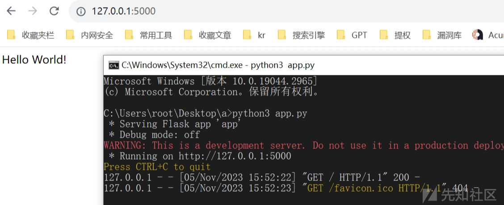](https://xzfile.aliyuncs.com/media/upload/picture/20231105155255-54386092-7bb0-1.png)

```plain
from flask import Flask
app = Flask(__name__)
```

导入我们安装好的flask包，通过flask包导入Flask类，Flask类即为Flask的核心，实例化这个Flask类的到一个实例化对象app。**name**这个特殊的参数：Python会根据所处的模块来赋予**name**变量相应的值，对于我们的程序来说（app.py），这个值为app。

```plain
@app.route('/')
def hello_world():
    return 'Hello World!'
```

如果有过对其他web框架的了解，相信看见这个已经看出了一些门道。没错这个 @app.route('/')就是用来匹配url的，在我们的flask里面是以装饰器来实现的，装饰器引用的也是我们上面实例化核心类出来的对象。如果匹配到了路由就会触发我们的视图函数执行，并且return回具体的数据给前端或者移动端。

```plain
if __name__ == '__main__':
    app.run()
```

app.run()实现了flask程序在开发环境下运行起来,并且默认ip和端口是127.0.0.1:5000

app.run(host='0.0.0.0', port=80) 同时可以设置host参数可port端口

```plain
app = Flask(__name__, static_folder='static')
app.config['APPLICATION_ROOT'] = '/'
app.config['PREFERRED_URL_SCHEME'] = 'http'
```

上面代码给Flask设置各种属性，static\_folder表示指定静态文件的路径，后面的各位师傅一看也知道怎么回事了，设置了静态文件夹路径、服务器名称、应用程序根目录和 URL 协议。

说白了，其实就是一个框架，知道怎么使用就可以了，实践能力远比理论更重要！

## 项目目录详解：

一个Flask项目由 static文件夹，templates文件夹，app.py主文件组成

-   static文件夹 用于存放各种静态文件 css、js、图片等等
-   templates文件夹 用于存放html模板文件
-   app.py 为我们的主文件 ，启动项目需要启动该文件
-   注意 app.py 文件的名字我们可以自由命名，但是除了flask.py 这种和Flask库相冲突的名字

**Flask如何导入css**

```plain
<link rel="stylesheet" type="text/css" href="{{ url_for('static', filename='css/my.css') }}">
```

使用{{ url\_for('static', filename='css/my.css') }} 即可导入，后面指定的路径要放到static目录下

# 对接Rss订阅

有了上面的基础知识，那么接下来就是核心功能的实现

-   requests请求rss订阅，爬取文章标题和文章url地址储存为txt
-   然后再写一个函数请求txt，输出文章标题和文章url地址到网页

**先知社区**

```plain
def xianzhi():
    url = 'https://xz.aliyun.com/feed'
    response = requests.get(url,headers=headers)
    html = response.text
    rtitle = r'<entry><title>(.*?)</title><link href="'
    title = re.findall(rtitle, html,re.DOTALL)

    rurl = r'<link href="(.*?)" rel="alternate">'
    url = re.findall(rurl, html,re.DOTALL)

    with open("./rss_hackxc/xianzhi.txt", "w",encoding='utf-8') as f:
        for x, y in zip(url, title):
            f.write(str(x) + ',' + str(y) + '\n')
```

[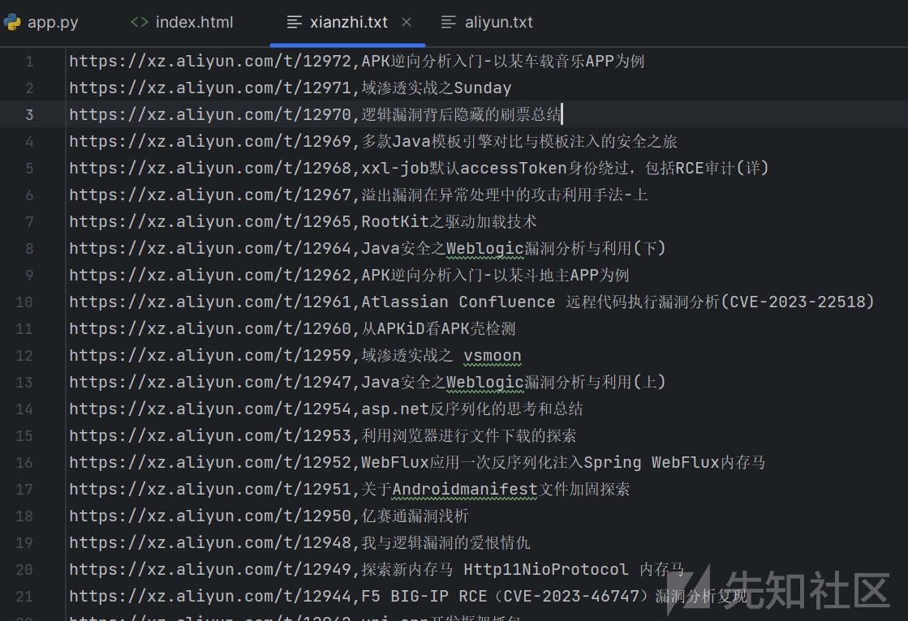](https://xzfile.aliyuncs.com/media/upload/picture/20231105161612-950934b8-7bb3-1.png)  
当然如果没有rss订阅也是同理，直接requests加上re正则匹配爬取即可，下面为**火线社区**例子：

```plain
def huoxian():
    url = 'https://zone.huoxian.cn/?sort=newest'
    response = requests.get(url, headers=headers)
    html = response.text
    rtitle = r'<a href="https://zone.huoxian.cn/d(.*?)">(.*?)</a>'
    title = re.findall(rtitle, html, re.DOTALL)
    #print(title)
    count = 0  # 删除第一行置顶信息
    with open('./rss_hackxc/huoxian.txt', 'w', encoding='utf-8') as f:
        for t in title:
            t = str(t).strip().replace("'", "").replace("(", "").replace(")", "").replace(' ','').replace('\\n','')
            #print(t)
            if count < 1:
                count += 1
            else:
                f.write(t+"\n")
                count += 1
```

[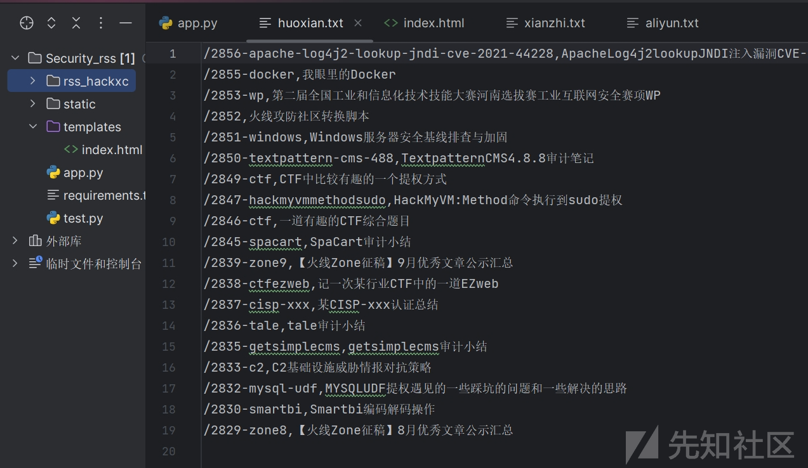](https://xzfile.aliyuncs.com/media/upload/picture/20231105161901-f9e02d2e-7bb3-1.png)

# Rss安全文章返回给网页

已经抓取到文章标题和文章url了，接下来就是要返回给网页，让用户可以看到内容  
**app.py**

```plain
def index():
    with open("./rss_hackxc/xianzhi.txt", "r",encoding='utf-8') as f:
        content = f.readlines()
        body1 = [(line.strip().split(',')[0], line.strip().split(',')[1]) for line in content] #读取文件再放到html
        return render_template('index.html', body1=body1)
```

**index.html**

```plain

    {{ loop.index }}
    {{ xianzhi[0] }}"{{ xianzhi[1] }}

```

采用遍历的方式，因为采集的内容为多行，如果直接输出可以使用{{body1}}直接输出到网页，for循环的格式如上，因为文章内容格式为\[url,标题\]所以用xianzhi\[0\]和xianzhi\[1\]分别输出，{{ loop.index }}的作用是输出数量，表示第几个，其他内容为html标签  
[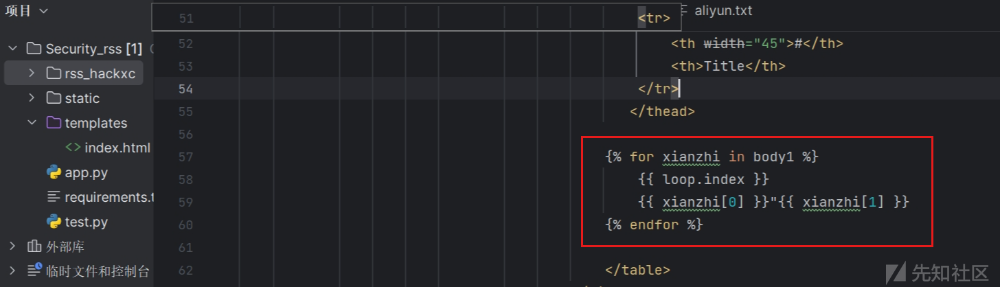](https://xzfile.aliyuncs.com/media/upload/picture/20231105164417-8151eb0a-7bb7-1.png)

既然核心功能已经有了，接下来我们就要对网页进行美化了【**选择模板**】，本文以hacking8为例子，首先ctrl+s前端页面全部脱下来，稍微处理下格式，以及文件内的路径，如果师傅们看到了其他好看的前端同样可以模仿打造出自己的Rss文章合集  
**原前端样式**  
[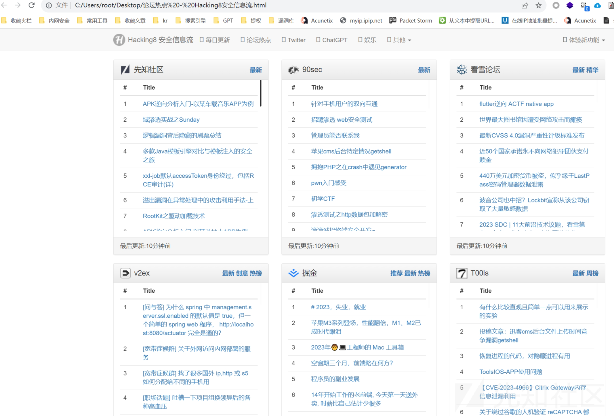](https://xzfile.aliyuncs.com/media/upload/picture/20231105163245-e4b1b6aa-7bb5-1.png)  
**修改后**  
去除最顶部多余栏目，仅输出与安全相关的最新文章  
[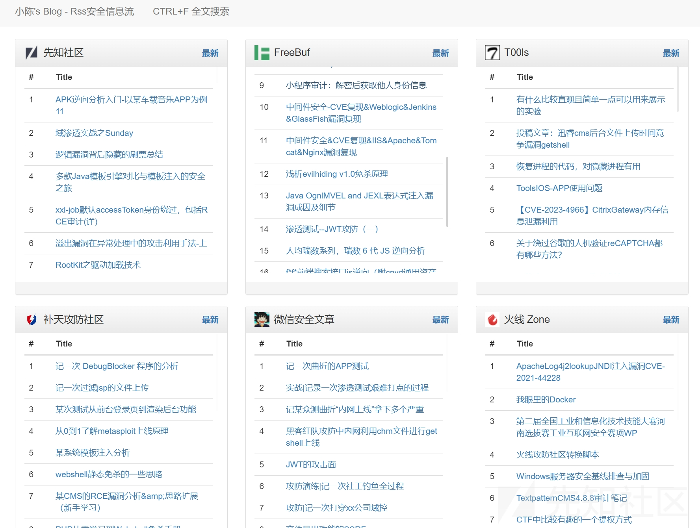](https://xzfile.aliyuncs.com/media/upload/picture/20231105164531-adc3274e-7bb7-1.png)  
同时底部删除多余空白，输出最新漏洞，简洁为主  
[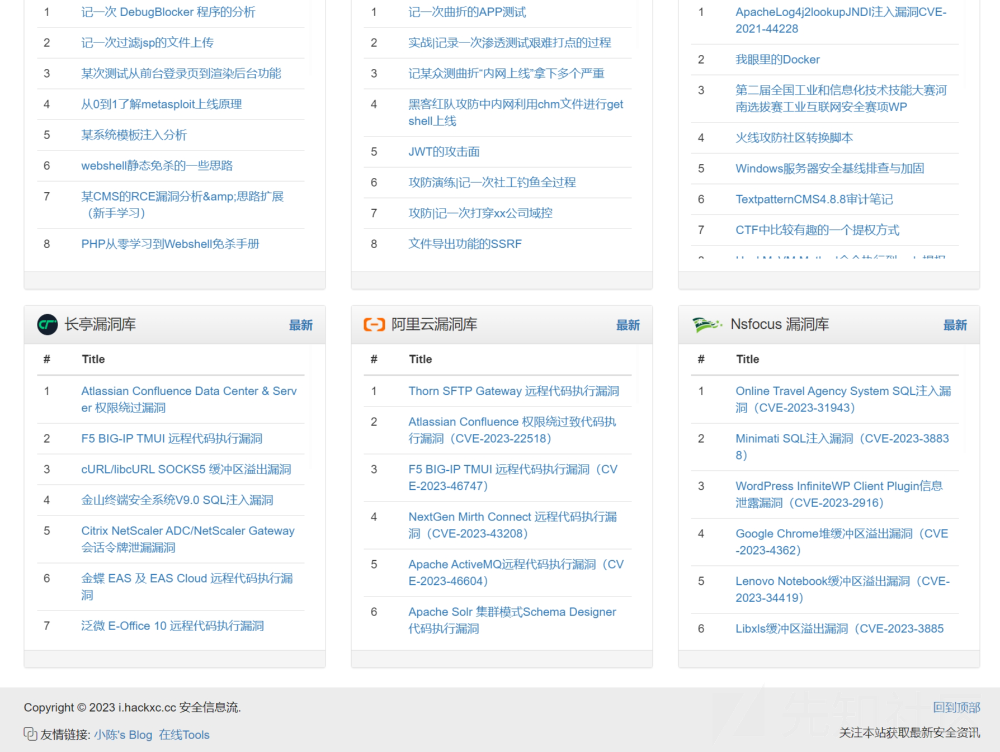](https://xzfile.aliyuncs.com/media/upload/picture/20231105163528-46470a50-7bb6-1.png)

观察前端样式可以看到文章输出都是在tbody标签中  
[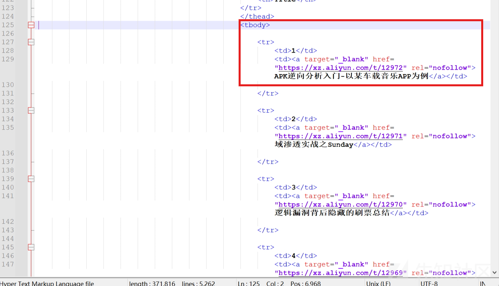](https://xzfile.aliyuncs.com/media/upload/picture/20231105164718-ed2f5092-7bb7-1.png)

```plain
<tbody>
<tr>
    <td>第几个</td>
    <td><a target="_blank" href="url地址" rel="nofollow">标题</a></td>
</tr>
</tbody>
```

**修改后**

```plain
<tbody>

    <tr>
        <td>{{ loop.index }}</td>
        <td><a target="_blank" href="{{ xianzhi[0] }}" rel="nofollow">{{ xianzhi[1] }}</a></td>
    </tr>

</tbody>
```

# Flask实现自动更新网页内容

修改完后网站已经成型，但是还要考虑一个问题，那就是如何实现自动更新，最开始写的想法是每隔10-30分钟程序结束掉再运行，因为已经生成了Flask网页后函数就无法运行了，后来找到了一个模块APScheduler，可以实现定时执行任务

安装APScheduler模块：

```plain
pip install apscheduler
```

在Flask应用中，导入APScheduler模块并创建一个scheduler对象：

```plain
from apscheduler.schedulers.background import BackgroundScheduler
scheduler = BackgroundScheduler()
```

创建一个函数，用于执行body1函数并返回结果：

```plain
def update_body1():
    body1 = # 调用body1函数生成新的内容
    return body1
```

使用scheduler对象的add\_job方法来添加一个定时任务：

```plain
scheduler.add_job(func=update_page, trigger='interval', seconds=10)
```

上述代码表示每隔10秒执行一次update\_body1函数

在Flask应用中，启动scheduler：

```plain
scheduler.start()
```

**修改后的核心代码** **(实现执行函数自动更新网页)**

```plain
from fake_useragent import UserAgent
from apscheduler.schedulers.background import BackgroundScheduler
scheduler = BackgroundScheduler()

def generate_new_body():
    with app.app_context():
        with open("./rss_hackxc/xianzhi.txt", "r",encoding='utf-8') as f:
            content = f.readlines()
        body1 = [(line.strip().split(',')[0], line.strip().split(',')[1]) for line in content] #读取文件再放到html
        return render_template('index.html', body1=body1)

def update_page(): # 生成新的网页内容，实现自动更新flask
    xianzhi()  # 先知文章

    new_body = generate_new_body()
    # 将新的网页内容更新到网页中
    with app.app_context():
        global body
        body = new_body

def index():
    return body #返回最新网页内容

scheduler.add_job(func=update_page, trigger='interval', seconds=10)
scheduler.start()

if __name__ == '__main__':
    headers = {'User-Agent': UserAgent().random}
    app.run(host='0.0.0.0', port=80)  # 启动Flask应用程序
```

**完整代码如下：**

```plain
import requests,re
from flask import Flask,render_template
from fake_useragent import UserAgent
from apscheduler.schedulers.background import BackgroundScheduler

app = Flask(__name__, static_folder='static')
app.config['APPLICATION_ROOT'] = '/'
app.config['PREFERRED_URL_SCHEME'] = 'http'
scheduler = BackgroundScheduler()
@app.route('/')

def generate_new_body():
    with app.app_context():
        with open("./rss_hackxc/xianzhi.txt", "r",encoding='utf-8') as f:
            content = f.readlines()
        body1 = [(line.strip().split(',')[0], line.strip().split(',')[1]) for line in content] #读取文件再放到html

        with open("./rss_hackxc/freebuf.txt", "r",encoding='utf-8') as f:
            content = f.readlines()
        body2 = [(line.strip().split(',')[0], line.strip().split(',')[1]) for line in content] #读取文件再放到html

        with open("./rss_hackxc/t00ls.txt", "r",encoding='utf-8') as f:
            content = f.readlines()
        body3 = [(line.strip().split(',')[0], line.strip().split(',')[1]) for line in content] #读取文件再放到html

        with open("./rss_hackxc/butian.txt", "r",encoding='utf-8') as f:
            content = f.readlines()
        body4 = [(line.strip().split(',')[0], line.strip().split(',')[1]) for line in content] #读取文件再放到html

        with open("./rss_hackxc/weixin.txt", "r",encoding='utf-8') as f:
            content = f.readlines()
        body5 = [(line.strip().split(',')[0], line.strip().split(',')[1]) for line in content] #读取文件再放到html

        with open("./rss_hackxc/huoxian.txt", "r",encoding='utf-8') as f:
            content = f.readlines()
        body6 = [(line.strip().split(',')[0], line.strip().split(',')[1]) for line in content] #读取文件再放到html

        with open("./rss_hackxc/changting.txt", "r",encoding='utf-8') as f:
            content = f.readlines()
        body7 = [(line.strip().split(',')[0], line.strip().split(',')[1]) for line in content] #读取文件再放到html

        with open("./rss_hackxc/aliyun.txt", "r",encoding='utf-8') as f:
            content = f.readlines()
        body8 = [(line.strip().split(',')[0], line.strip().split(',')[1]) for line in content] #读取文件再放到html

        with open("./rss_hackxc/nsfocus.txt", "r",encoding='utf-8') as f:
            content = f.readlines()
        body9 = [(line.strip().split(',')[0], line.strip().split(',')[1]) for line in content] #读取文件再放到html

        return render_template('index.html', body1=body1, body2=body2, body3=body3, body4=body4, body5=body5, body6=body6, body7=body7, body8=body8,body9=body9)

def update_page(): # 生成新的网页内容，实现自动更新flask
    xianzhi()  # 先知文章
    freebuf()  # Freebuf文章
    t00ls()    # T00ls文章
    butian()   # 补天文章
    weixin()   # 微信文章
    huoxian()  # 火线文章
    changting()# 长亭漏洞库
    aliyun()   # 阿里云漏洞库
    nsfocus()  # 绿盟漏洞预警

    new_body = generate_new_body()
    # 将新的网页内容更新到网页中
    with app.app_context():
        global body
        body = new_body

def index():
    return body #返回最新网页内容

scheduler.add_job(func=update_page, trigger='interval', seconds=600)
scheduler.start()

def xianzhi():
    url = 'https://xz.aliyun.com/feed'
    response = requests.get(url,headers=headers)
    html = response.text
    #print(response.request.headers['User-Agent'])
    rtitle = r'<entry><title>(.*?)</title><link href="'
    title = re.findall(rtitle, html,re.DOTALL)

    rurl = r'<link href="(.*?)" rel="alternate">'
    url = re.findall(rurl, html,re.DOTALL)

    with open("./rss_hackxc/xianzhi.txt", "w",encoding='utf-8') as f:
        for x, y in zip(url, title):
            f.write(str(x) + ',' + str(y) + '\n')

def freebuf():
    url = 'https://www.freebuf.com/articles/web'
    response = requests.get(url,headers=headers)
    html = response.text
    #print(html)
    #print(response.request.headers['User-Agent'])
    rtitle = r'" target="_blank" class="img-view" data-v-8bdd825c> <p data-v-8bdd825c><span class="ant-tag ant-tag-has-color" style="background-color:#262626;opacity:.7;font-size:12px;border-radius:0" data-v-8bdd825c>'
    title = re.findall(rtitle, html,re.DOTALL)

    rurl = r'<div class="item-content" data-v-8bdd825c><a href="(/articles.*?)" target="_blank" class="img-view" data-v-8bdd825c>(.*?)</a></td>'
    title = re.findall(rtitle, html,re.DOTALL)

    rurl = r'<div class="item-content" data-v-8bdd825c><a href="(/articles.*?)" target="_blank" class="img-view" data-v-8bdd825c>= 35:
                break
def butian():
    titles = []
    url = 'https://forum.butian.net/community/all/newest'
    response = requests.get(url,headers=headers)
    html = response.text
    #print(response.request.headers['User-Agent'])
    rtitle = r'data-source-id=".*?"(.*?)</a></h2>'
    title = re.findall(rtitle, html,re.DOTALL)
    for t in title:
        t = t.replace('>', '').strip()
        titles.append(t)
        # print(titles)

    rurl = r'<a.*?href="https://forum.butian.net/share/(\d+)".*?>'
    url = re.findall(rurl, html,re.DOTALL)
    #print(url)

    with open('./rss_hackxc/butian.txt', 'w',encoding='utf-8') as f:
        for x, y in zip(url, titles):
            f.write(str(x) + ',' + str(y) + '\n')

def weixin():
    titles = []
    url = 'http://www.nmd5.com/test/index.php'
    response = requests.get(url, headers=headers)
    html = response.text
    # print(response.request.headers['User-Agent'])
    rtitle = r'<a href="https://mp.weixin.qq.com(.*?)" target="_blank">(.*?)</a>'
    title = re.findall(rtitle, html, re.DOTALL)
    #print(title)

    count = 0  # 只写入28条数据
    with open('./rss_hackxc/weixin.txt', 'w',encoding='utf-8') as f:
        for item in title:
            item = str(item).replace("'", "").replace("(", "").replace(")", "").replace(' ','')#处理格式
            f.write(item.strip()  + '\n')
            count += 1
            if count >= 28:
                break
def huoxian():
    url = 'https://zone.huoxian.cn/?sort=newest'
    response = requests.get(url, headers=headers)
    html = response.text
    # print(response.request.headers['User-Agent'])
    rtitle = r'<a href="https://zone.huoxian.cn/d(.*?)">(.*?)</a>'
    title = re.findall(rtitle, html, re.DOTALL)
    #print(title)
    count = 0  # 删除第一行置顶信息
    with open('./rss_hackxc/huoxian.txt', 'w', encoding='utf-8') as f:
        for t in title:
            t = str(t).strip().replace("'", "").replace("(", "").replace(")", "").replace(' ','').replace('\\n','')
            #print(t)
            if count < 1:
                count += 1
            else:
                f.write(t+"\n")
                count += 1

def changting():
    url = 'https://stack.chaitin.com/api/v2/vuln/list/?limit=25&offset=0&search='
    response = requests.get(url, headers=headers)
    html = response.json()
    html = html['data']['list']

    with open('./rss_hackxc/changting.txt', 'w', encoding='utf-8') as f:
        for item in html:
            f.write(item['id']+","+item['title']+"\n")

def aliyun():
    url = 'https://avd.aliyun.com/'
    response = requests.get(url, headers=headers)
    html = response.text
    rtitle = r'<td>(.*?)</td>'
    title = re.findall(rtitle, html, re.DOTALL)
    #print(title)

    rurl = r'<a href="(.*?)"'
    url = re.findall(rurl, html,re.DOTALL)
    #print(url)

    pairs = zip(url, title)#合并输出
    with open('./rss_hackxc/aliyun.txt', 'w', encoding='utf-8') as f:
        for pair in pairs:
            u, t = pair
            f.write(u+","+t+"\n")

def nsfocus():
    url = 'http://www.nsfocus.net/index.php?act=sec_bug'
    response = requests.get(url, headers=headers)
    content = response.content.decode('utf-8')

    rtitle = r"<li><span>.*?</span> <a href='(.*?)'>(.*?)</a></li>"
    title = re.findall(rtitle, content, re.DOTALL)
    with open('./rss_hackxc/nsfocus.txt', 'w', encoding='utf-8') as f:
        for t in title:
            f.write(t[0]+","+t[1]+"\n")


if __name__ == '__main__':
    headers = {'User-Agent': UserAgent().random}
    app.run(host='0.0.0.0', port=80)  # 启动Flask应用程序
```

# 部署上线

最后一步当然是如何部署到服务器去上线，上线肯定不建议在生成环境，所以建议使用虚拟环境，或者使用普通用户去操作

安装虚拟环境

```plain
sudo pip install virtualenv
```

生成文件夹ENV\_flask，进入其中

```plain
sudo virtualenv ENV_flask
```

激活虚拟环境

```plain
source bin/activate
```

虚拟环境安装pip

```plain
sudo pip install flask
```

在虚拟环境中安装uwsgi

```plain
sudo pip install uwsgi
```

在虚拟环境中编写uwsgi的配置文件flask\_uwsgi.ini，文件名可随意  
vim flask\_uwsgi.ini

```plain
[uwsgi]
master = true
wsgi-file = app.py
callable = app
http = :8001
processes = 4
threads = 2
buffer-size = 32768
```

**执行命令：**

```plain
uwsgi --ini flask_uwsgi.ini #测试运行
nohup uwsgi --ini flask_uwsgi.ini &  #后台运行
```

[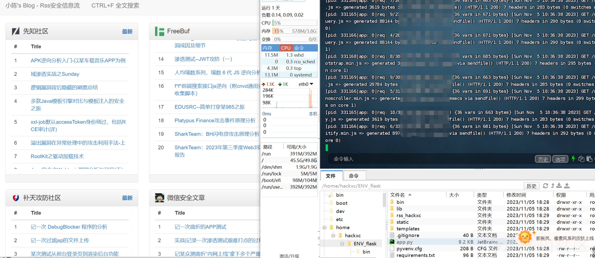](https://xzfile.aliyuncs.com/media/upload/picture/20231105183747-5c91ecf6-7bc7-1.png)

# Nginx对项目进行反向代理

安装nginx

```plain
sudo apt-get install nginx
```

修改nginx的配置文件**vim /etc/nginx/sites-available/default**

```plain
server {
        # listen 80 default_server;
        # listen [::]:80 default_server ipv6only=on;
        listen 80;  # 监听端口，http默认80

        # root /usr/share/nginx/html;
        root /home/hackxc/ENV_flask;      # flask项目根路径
        # index index.html index.htm;

        # Make site accessible from http://localhost/
        # server_name localhost;
        server_name 你的外网ip;    # 公网ip或已解析ip的域名

        location / {
           proxy_pass http://127.0.0.1:8001; #内网端口
           proxy_set_header Host $host;
           proxy_set_header X-Real-IP $remote_addr;
           proxy_set_header X-Forwarded-For $proxy_add_x_forwarded_for;
        }
}
```

[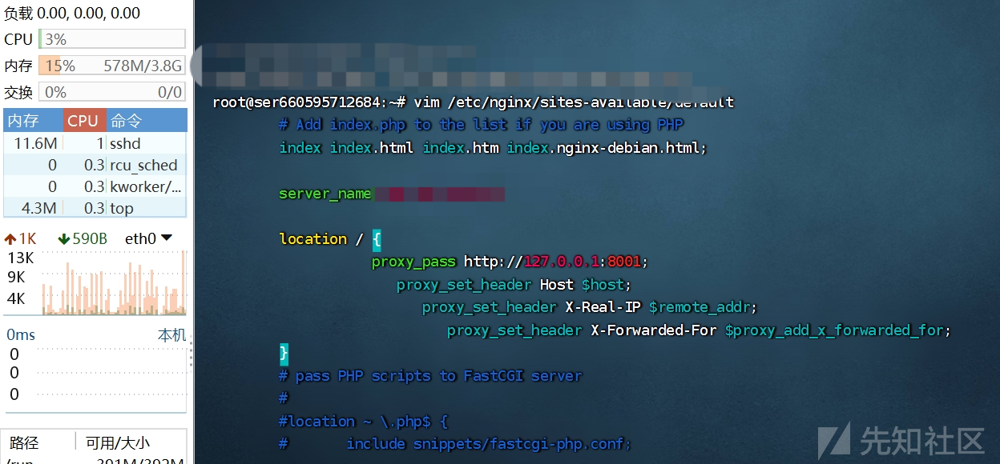](https://xzfile.aliyuncs.com/media/upload/picture/20231105235102-1f541ea0-7bf3-1.png)  
重启服务即可

```plain
sudo service nginx restart
```

[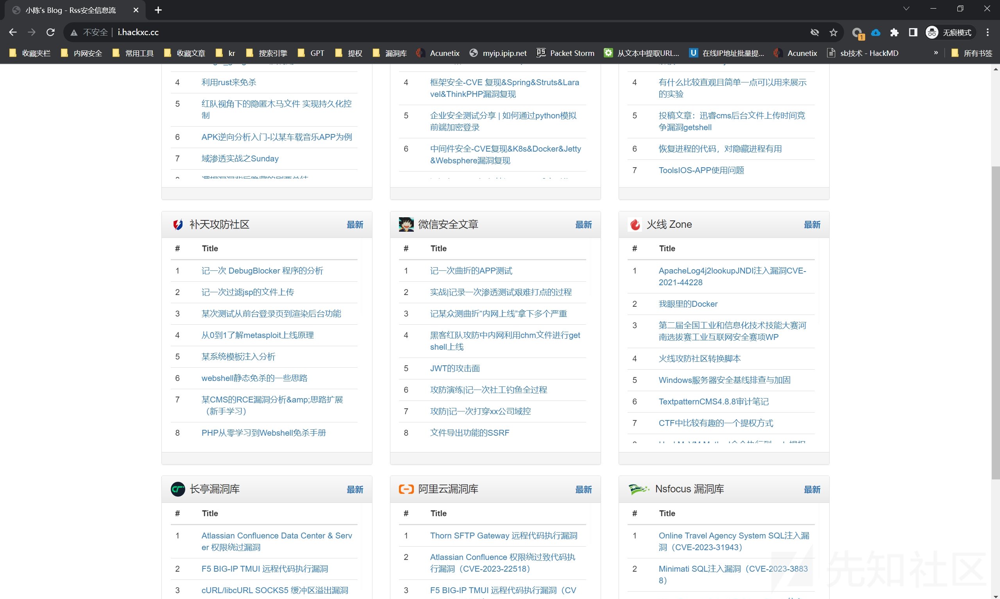](https://xzfile.aliyuncs.com/media/upload/picture/20231105235154-3e695774-7bf3-1.png)

上面进行了反向代理，最后设置防火墙后本地就只能访问8001端口，本地的8001端口映射到80端口

```plain
sudo iptables -A INPUT -i lo -j ACCEPT  #添加允许本地回环访问的规则
sudo iptables -A INPUT -p tcp --dport 8001 -s 0.0.0.0/0 -j DROP #添加规则以拒绝所有外部访问8001端口
sudo iptables -L #查看配置是否生效
```

[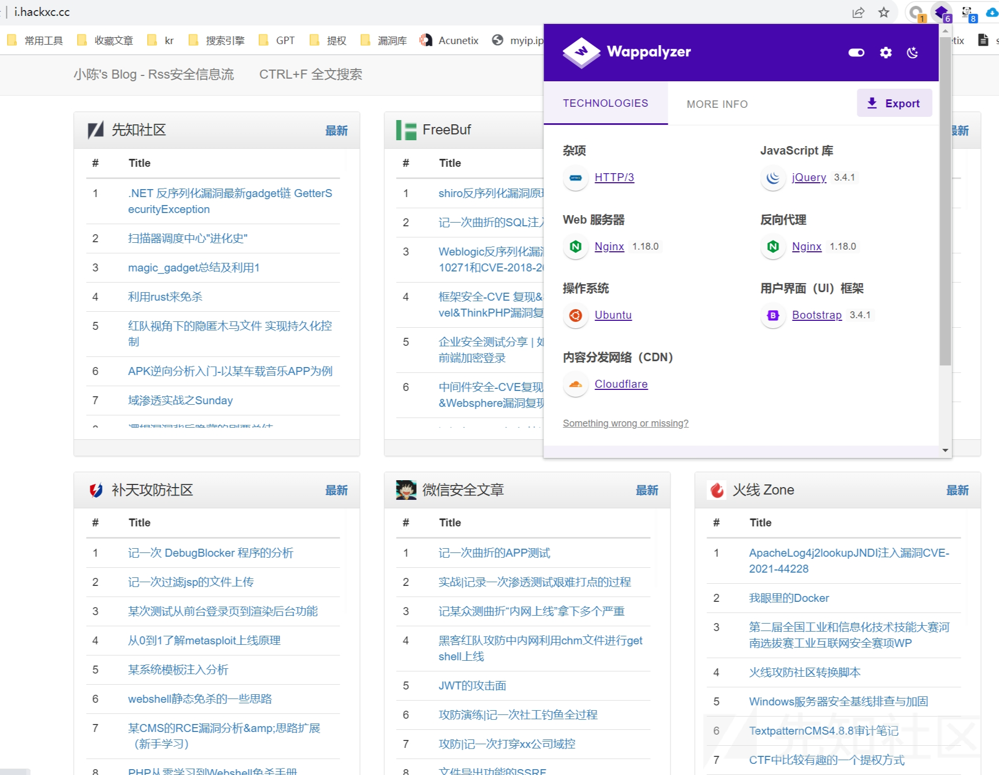](https://xzfile.aliyuncs.com/media/upload/picture/20231106012744-a134221e-7c00-1.png)

**完整项目：[https://github.com/hackxc/Security\_Rss/](https://github.com/hackxc/Security_Rss/)**
