# [](#rsac%E8%AE%AE%E9%A2%98%E8%A7%A3%E8%AF%BB-%E4%BA%91%E4%B8%8A%E8%B7%A8%E7%A7%9F%E6%88%B7%E6%BC%8F%E6%B4%9E%E6%94%BB%E5%87%BB%E9%9D%A2%E5%88%86%E6%9E%90)RSAC议题解读-云上跨租户漏洞攻击面分析

> 2023 年的 RSAC 会议上两位来自 Wiz 的安全研究员，分享了名为《Tackling the Recent Rise of Cross-Tenant Vulnerabilities》的议题。两位研究员提出一个新兴的攻击方向，即跨租户漏洞，介绍相关概念，并在现网环境中挖掘 Google Cloud、AWS、Alibaba Cloud 等跨租户漏洞，影响巨大。

## [](#1-%E7%9B%B8%E5%85%B3%E6%A6%82%E5%BF%B5)1 相关概念

### [](#11-%E5%A4%9A%E7%A7%9F%E6%88%B7%E6%8A%80%E6%9C%AF)1.1 多租户技术

多租户技术是一种在云计算环境中广泛使用的架构设计方法，用于在单个应用程序或服务中同时支持多个独立的租户或用户。

在传统的单租户架构中，每个应用程序或服务只为一个租户提供服务。而在多租户架构中，应用程序或服务被设计成可以同时为多个租户提供服务，而且每个租户都被隔离在彼此之间，彼此独立且互不干扰。

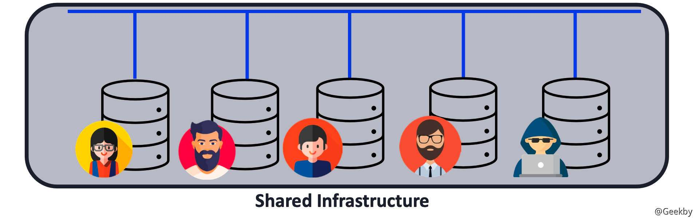

多租户技术的关键特点是资源共享和隔离。多个租户共享相同的基础设施，包括硬件、网络和软件组件等，从而实现资源的高效利用。同时，每个租户之间的数据和运行环境是相互隔离的，确保租户之间的安全性和隐私性。

多租户架构通常在平台即服务（PaaS）和软件即服务（SaaS）等云服务模型中得到广泛应用。在这些模型中，云提供商为多个租户提供相同的应用程序或服务实例，而每个租户都可以定制和管理自己的数据和配置。

### [](#12-%E8%B7%A8%E7%A7%9F%E6%88%B7%E6%BC%8F%E6%B4%9E)1.2 跨租户漏洞

在云上多租户技术广泛应用的场景下，跨租户漏洞应运而生。跨租户漏洞是指存在于多租户环境中的安全漏洞，可能导致一个租户能够访问或干扰其他租户的数据或资源。这种漏洞可能会引起严重的安全问题，攻击者可以通过跨租户漏洞获取租户的数据或系统控制权，严重破坏了租户之间的隔离性和安全性。

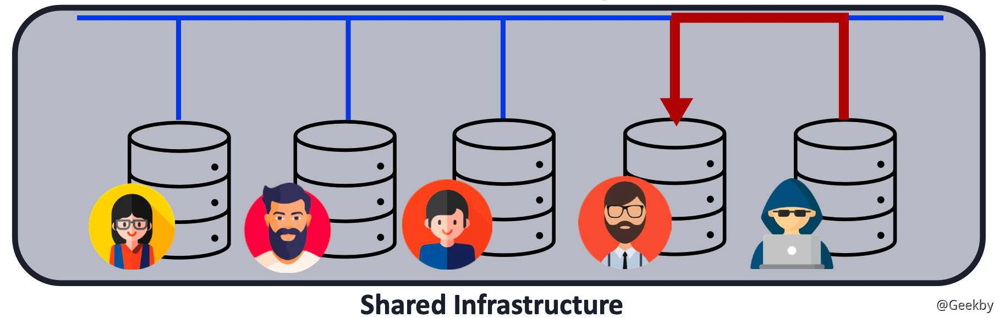

## [](#2-%E7%A7%9F%E6%88%B7%E9%9A%94%E7%A6%BB%E7%9A%84%E5%AE%9E%E7%8E%B0%E6%96%B9%E5%BC%8F)2 租户隔离的实现方式

### [](#21-%E9%80%BB%E8%BE%91%E9%9A%94%E7%A6%BB)2.1 逻辑隔离

逻辑隔离是一种十分简单的租户隔离方式，租户在共享数据库实例中拥有一个专用数据库。但是每个客户都拥有自己的凭据，来保证不同用户之间的隔离。

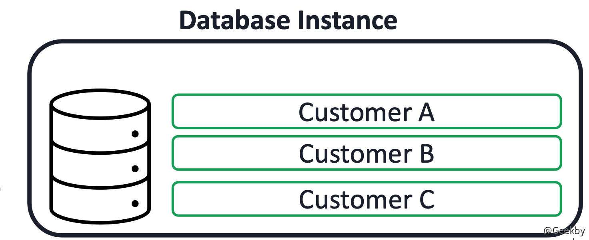

这种隔离方式在工业实践中有良好的可操作性，软件架构简单且易于实现，成本较低。但是一旦出现单点故障，将影响数据库实例下的所有租户。

此外，当一个数据库被攻击者攻破后，比如攻击者从当前租户权限提升到管理员权限，攻击者就可以访问其它租户的数据。此外，对于一些运维人员来说，在配置数据库实例的时候，很容易出现配置不当的问题。在这种情况下，攻击者甚至不必利用 0-day 提升权限，通过只是滥用某些错误配置，就可以达到访问其它用户数据的目的。

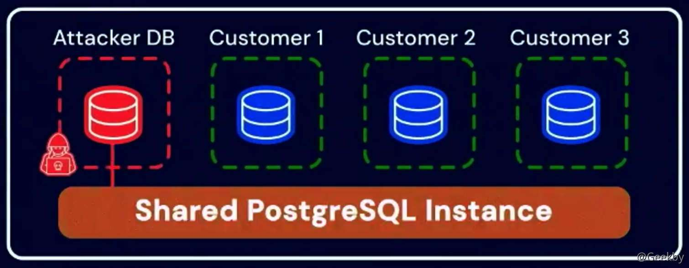

### [](#22-%E5%9F%BA%E4%BA%8E%E5%AE%B9%E5%99%A8%E7%9A%84%E9%9A%94%E7%A6%BB)2.2 基于容器的隔离

基于容器的隔离相比于上面的隔离方法具有一定优势。在这种隔离方法中，不再是多个客户共享同一个数据库实例，每个客户都有自己的数据库实例，在相对独立的容器内运行， 并且多个客户可能共享同一个虚拟机。

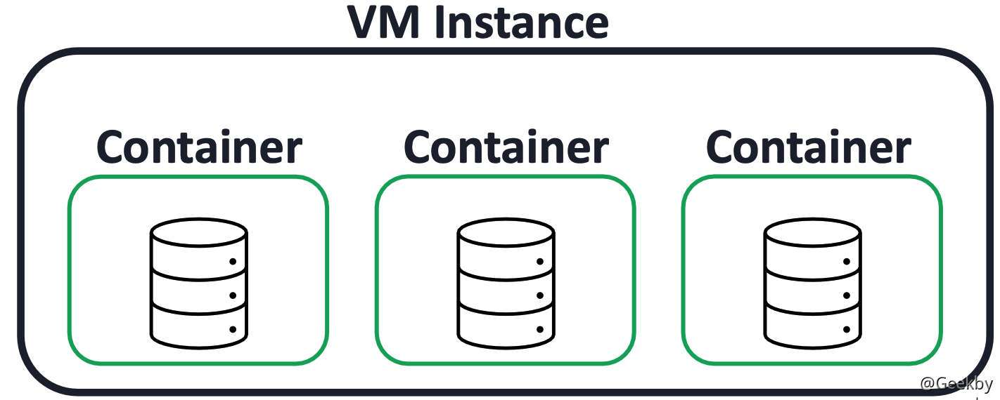

这种隔离方式同样相对便宜且易于实施。当攻击者想要突破隔离时，需要打破两层安全边界，即：第一层数据库，与上一种方式相同；第二层容器。一旦攻击者从容器中逃逸出来，就可以在虚拟机上执行任意代码，在虚拟机中，可以看到其它租户的容器，并能够访问他们的数据。

虽然这种隔离方式看上去是一个更好的方法，与前面的方法相比，它仍有其缺点。正如一些安全研究人员所认为的那样，容器不被认为是一个非常强大的安全屏障，每隔一段时间 Linux 都会发布一些内核漏洞，部分漏洞通过武器化，可以被用来容器逃逸。

Wiz 团队针对阿里云数据库披露了一个报告，具体细节在第三章节进行阐述。

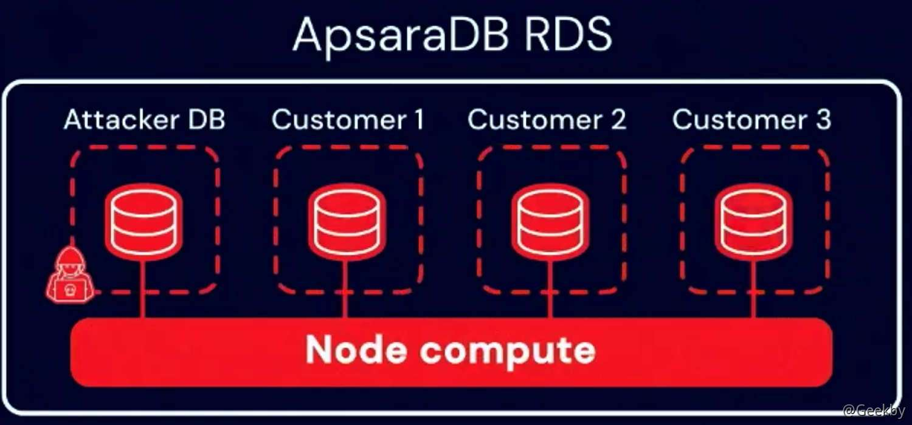

### [](#23-%E5%9F%BA%E4%BA%8E%E8%99%9A%E6%8B%9F%E6%9C%BA%E7%9A%84%E9%9A%94%E7%A6%BB)2.3 基于虚拟机的隔离

第三种隔离租户的方法，也是大多数服务提供商倾向于做的，即：基于虚拟机的隔离。在这种隔离方法中，每个租户都有自己的数据库实例，在单独的专用虚拟机中运行。因此，客户现在共享的是物理计算资源，而不是像之前的隔离方法那样，共享一个虚拟机。

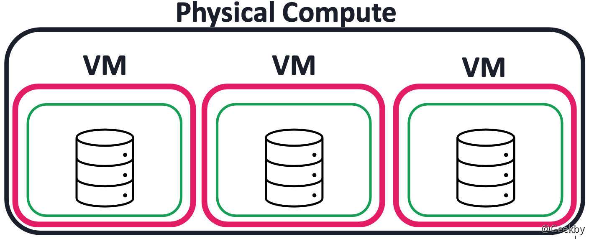

如图所示，攻击者想要打破这种隔离方式，需要打破两到三层安全边界，第一层然需要数据库漏洞，能够执行任意代码。第二层可能需要进行容器逃逸，第三层虚拟机漏洞。通常来说，VM 逃逸漏洞更难挖掘。

当每一个租户都有自己专用的虚拟机，云服务提供商的成本变得相当昂贵。与此同时，架构也开始变得很难维护，隔离服务越强，越难实际调试服务，并解决服务中的问题。

## [](#3-%E7%9C%9F%E5%AE%9E%E7%8E%AF%E5%A2%83%E4%B8%AD%E7%9A%84%E6%BC%8F%E6%B4%9E%E6%A1%88%E4%BE%8B)3 真实环境中的漏洞案例

租户隔离不仅仅是要实现隔离计算资源。还有有其它资源和其它资产。首先来看，在一个常见的租户隔离系统中，有哪些风险暴露面：

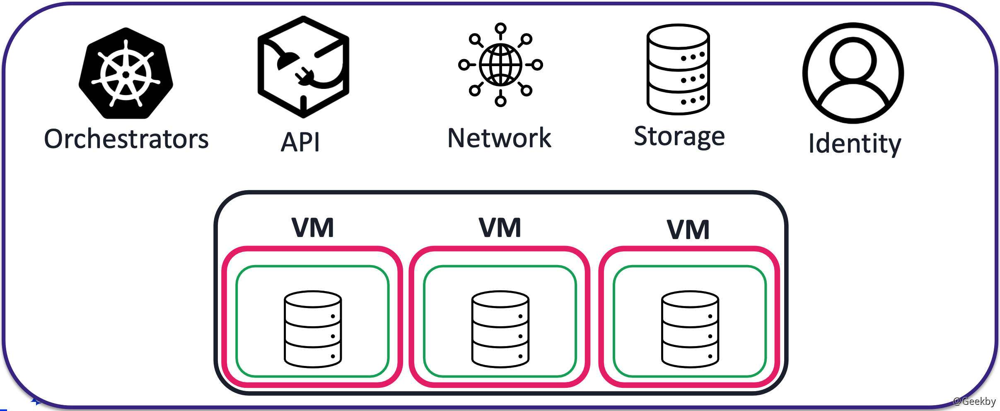

比如像 Kubernetes 或 service Fabric 这样的编排器、内部 API。此外通常托管服务运行在共享网络环境中，数据可以通过共享网络进行交互。另外存储、身份认证设施等也同样需要考虑隔离。

### [](#31-%E9%98%BF%E9%87%8C%E4%BA%91-analyticdb-for-postgresql)3.1 阿里云 AnalyticDB for PostgreSQL

云原生数据仓库AnalyticDB PostgreSQL版是一种大规模并行处理（MPP）数据仓库服务，可提供海量数据在线分析服务。

针对 AnalyticDB for PostgreSQL 的攻击链大致如下：

1.  利用 cronjob 定时任务提权至容器内的 root 权限。
2.  利用 Pod 内容器共享 PID 命名空间的特性横向移动到 Pod 中的相邻特权容器。
3.  利用特权容器逃逸至宿主机。
4.  利用宿主机上的 kubelet 凭证访问敏感资源，包括密钥、serviceaccount 和 Pod。
5.  利用收集到的凭证访问阿里云私有容器镜像仓库，查看凭证权限。
6.  经测试发现凭据具有容器镜像仓库的读取和写入权限，允许发起供应链攻击。

已有相关文章分析该漏洞，在此不做赘述。

### [](#32-azure-database-for-postgresql)3.2 Azure Database for PostgreSQL

在 Azure Database for PostgreSQL 中，不同租户间的数据库并没有做网络隔离，也就是说两个租户间是有网络联通的。Wiz 的研究人员首先通过漏洞获得了对自己数据库的访问权，又因为当前机器能够与其它数据库通信，并通过伪造 SSL 证书，并绕过对其它数据库的身份验证，获取对其它租户数据的完全读取权限。微软对此漏洞的修复是对租户间的网络进行隔离，来保证租户间的相对独立。

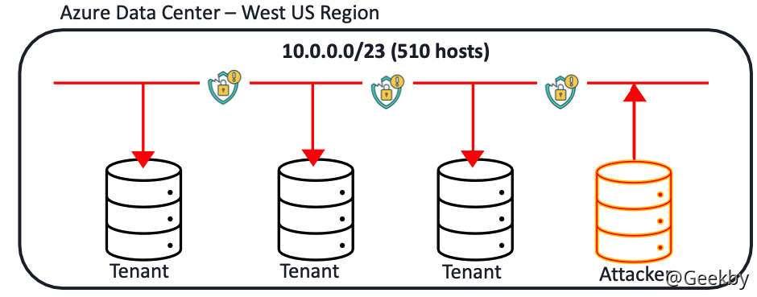

### [](#33-ibm-managed-databases)3.3 IBM Managed Databases

IBM Managed Databases 这个案例比较有趣，在这个案例中，IBM 服务的架构比较完善，资源分离也设计得很好，每个租户有专门的 Kubernetes 命名空间：

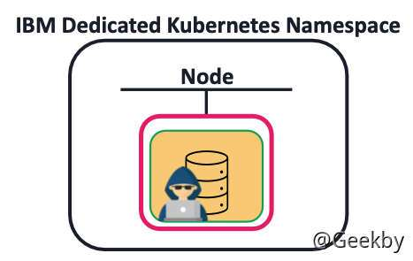

但是研究人员在容器中发现了 K8S API 的网络连接，同时，由于 K8S 本身配置不当，将高权限 service account 挂在到当前 pod 中，因此可以利用该 Token 向 K8S API 直接发送请求，执行 K8S 相关操作。经过研究人员的测试，该 Token 有在私有仓库拉取镜像的权限：

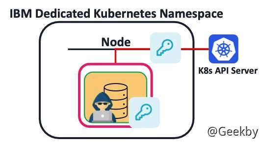

因此，攻击者可以拿到镜像仓库的所有镜像：

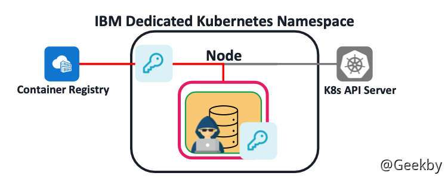

镜像中包含大量数据，包括源码、配置等。通过对镜像内容进行分析，找到内部 CI/CD 服务器凭证，具有读写权限，可以实施供应链攻击。

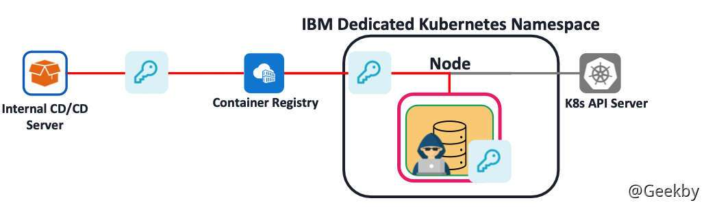

### [](#34-%E5%85%B6%E5%AE%83%E6%A1%88%E4%BE%8B)3.4 其它案例

笔者在公司内部某产品线做安全测试时，也曾遇到过类似的安全问题，由于租户间未做好隔离，导致获取大量租户权限与数据的问题。

以其中一个为例：

在某站点创建远程计算资源（在线 IDE）时，用户会收到一封接入内网的 VPN 配置连接邮件，在拨入 VPN 后，发现内网并未做隔离，租户间网络互通。

直接在内网申请的资源主机上扫 `10.208.0.0/16` 网段，发现做了隔离。但是，尝试在本机上对 VPN 网段 `172.36.0.0/16` 进行扫描，发现未做隔离，结果如下：

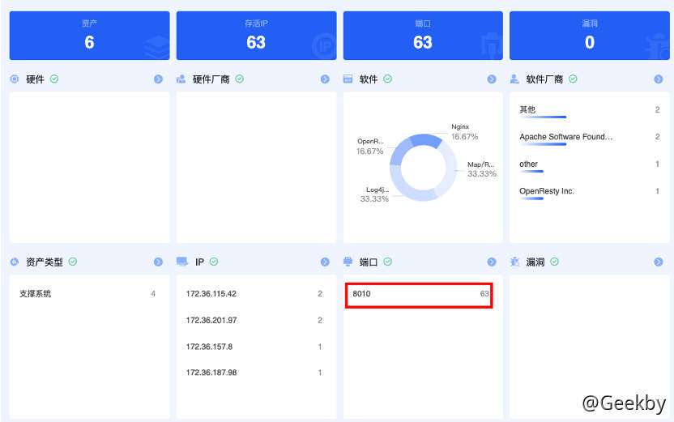

以内网一台租户申请的机器为例，由于在线 IDE 具有 Terminal 功能，且未对用户权限做校验，因此可以执行命令，在线 IDE 中的用户为 devkit 普通用户：


经过信息收集，发现此类主机均为云上统一下发的机器，查看查询 ECS 的用户自定义数据找到初始化 SSH 登录密钥：

|     |     |     |
| --- | --- | --- |
| ```plain<br>1<br>``` | ```bash<br>curl http://169.254.169.254/openstack/latest/user_data<br>``` |

在 `user_data` 记录了 SSH 的明文密码，可以直接利用该密码切换到 `root`:

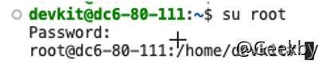

通过这种方式，可以批量横向到各个租户，获取大量租户资源机器的 root 权限，并登录 SSH，获取机器内存放的各种资源文件。
