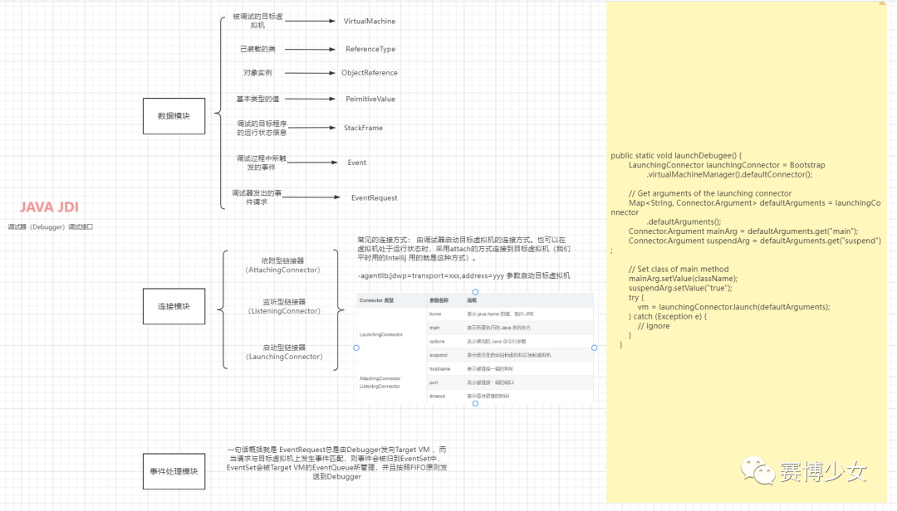
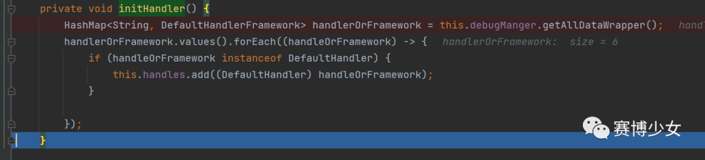
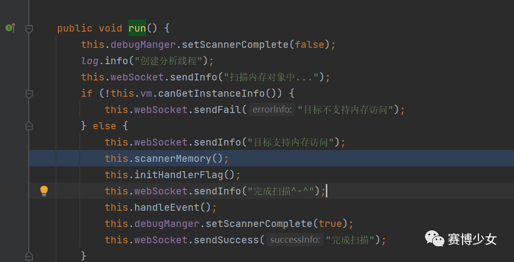
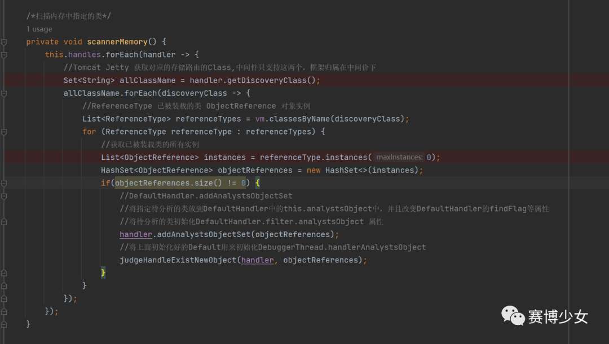
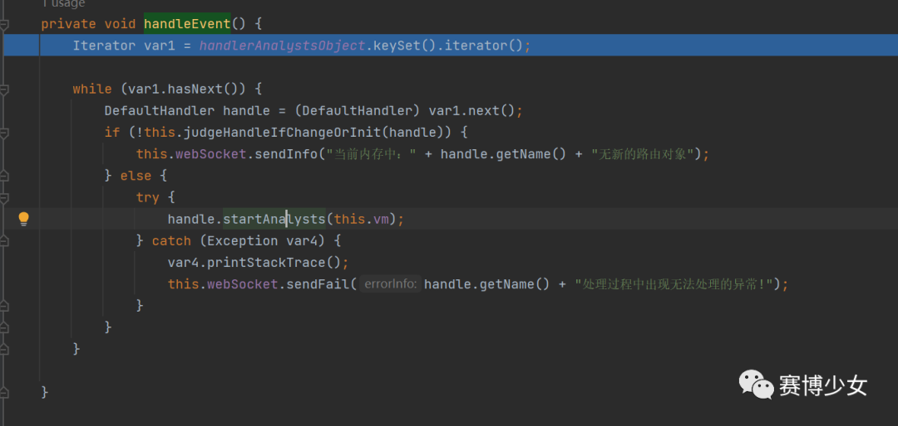
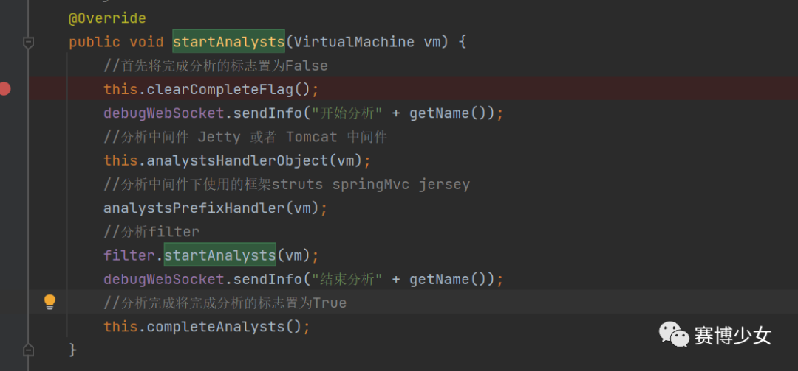

# Router4 -- 应用路由扫描基础知识及核心代码浅析

原创 Skay

[↓↓↓](javascript:)  
  
赛博少女  
  
[↑↑↑](javascript:)

*2023-12-21 17:21* *发表于北京*

Github发现一个很棒的工具，通过JDI实现了Tomcat 各个版本 Jetty，Spring，Struts，Jersey等中间价框架的路由扫描。写文章的时候已经更新到Router5了

https://github.com/kyo-w/router-router

## JDI基础知识



JDI属于JPDA中最上层接口。定义了调试器（Debugger）所需要的一些调试接口。基于这些接口，调试器可以及时地了解目标虚拟机的状态，例如查看目标虚拟机上有哪些类和实例等。另外，调试者还可以控制目标虚拟机的执行，例如挂起和恢复目标虚拟机上的线程，设置断点等。

### 工作方式

      首先，调试器（Debuuger）通过 Bootstrap 获取唯一的虚拟机管理器。

虚拟机管理器将在第一次被调用时初始化可用的链接器。一般地，调试器会默认地采用启动型链接器进行链接。

      然后，调试器调用链接器的 launch () 来启动目标程序，并完成调试器与目标虚拟机的链接。

      当链接完成后，调试器与目标虚拟机便可以进行双向通信了。调试器将用户的操作转化为调试命令，命令通过链接被发送到前端运行目标程序的虚拟机上；然后，目标虚拟机根据接受的命令做出相应的操作，将调试的结果发回给后端的调试器；最后，调试器可视化数据信息反馈给用户。

### 模块划分

      通过上面的描述，我们可以将jdi分成3部分：数据模块、连接模块、事件处理模块。

#### 1 数据模块

      jdi的数据模块，主要就是Mirror机制。Mirror 接口是JDI最底层的接口，JDI中几乎所有其他接口都继承于它。Mirror 机制是将目标虚拟机上的所有数据、类型、域、方法、事件、状态和资源，以及调试器发向目标虚拟机的事件请求等都映射成 Mirror 对象。

> 例如，在目标虚拟机上，已装载的类被映射成 ReferenceType 镜像，对象实例被映射成 ObjectReference 镜像，基本类型的值（如 float 等）被映射成 PrimitiveValue（如 FloatValue 等）。被调试的目标程序的运行状态信息被映射到 StackFrame 镜像中，在调试过程中所触发的事件被映射成 Event 镜像（如 StepEvent 等），调试器发出的事件请求被映射成 EventRequest 镜像（如 StepRequest 等），被调试的目标虚拟机则被映射成 VirtualMachine 镜像。但是，JDI 并不保证目标虚拟机上的每份信息和资源都只有唯一的镜像与之对应，这是由 JDI 的具体实现所决定的。例如，目标虚拟机上的某个事件有可能存在多个 Event 镜像与之对应，例如 BreakpointEvent 等。      Mirror 实例或是由调试器创建，或是由目标虚拟机创建，调用 Mirror 实例 virtualMachine() 可以获取其虚拟机信息。该接口提供了一套方法，可以用来直接或间接地获取目标虚拟机上所有的数据和状态信息，也可以挂起、恢复、终止目标虚拟机。

#### 2 连接模块

      连接是调试器与目标虚拟机之间交互的渠道，一次连接可以由调试器发起，也可以由被调试的目标虚拟机发起。一个调试器可以连接多个目标虚拟机，但一个目标虚拟机最多只能连接一个调试器。下面的例子中就讲了一种常见的连接方式：由调试器启动目标虚拟机的连接方式。也可以在虚拟机处于运行状态时，采用attach的方式连接到目标虚拟机（我们平时用的Intellij 用的就是这种方式）。

#### 3 事件处理模块

      主要在com.sun.jdi.event 和 com.sun.jdi.request 包中。

-   事件集是事件发送的最小单位，并且事件集一旦被创建，则不可以被修改。
    
-   事件请求：Event接口定义了request方法，该方法会返回由调试器Debugger发出的针对该事件的事件请求（EventRequest）。事件请求是由调试器向目标虚拟机发出的，目的是请求目标虚拟机在发生指定的事件后通知调试器。只有当调试器发出的请求与目标虚拟机上发生的事件匹配时，这些事件才会被分发到各个事件集，进而等待发送至调试器端。
    

      当然了，Debugger发送给Target VM的所有事件请求，不一定Target VM 都感兴趣。因此JDI提供了事件的过滤机制，来删选出最终真正要发送给Target VM的事件。

-   对事件请求的管理：在JDI中，事件请求的管理是通过EventRequestManager来完成的。它有许多createXXXRequest方法来创建不同类型的事件请求，也有许多deleteXXXRequest方法来删除不同类型的事件请求，还有xxxRequests方法来列出各种类型的事件请求。有一点需要注意的是，这里由EventRequestManager创建的createXXXRequest的事件都是非激活的，因此这些事件请求当发送给Target VM不会起任何作用，除非调用EventRequest的setEnable(true)使得该事件进入激活状态。
    
-   事件队列：事件队列(EventQueue)的拥有者是目标虚拟机，EventQueue 将这些事件集以“先进先出”策略依次地发送到调试器端。EventQueue 负责管理来自目标虚拟机的事件，一个被调试的目标虚拟机上有且仅有一个 EventQueue实例。
    
-   Debugger 跟 targetVM之间的事件交互：
    

> Debugger调用Target VM的 eventQueue() 和 eventRequestManager() 分别获取唯一的 EventQueue 实例和 EventRequestManager 实例. Debugger通过 EventRequestManager 的 createXXXRequest() 创建需要的事件请求，并添加过滤器和设置挂起策略. targetVM 上某个事件触发且匹配上eventRequest ， 则将event放入对应的eventSet. targetVM 上的EventQueue 管理这些eventSet, 按照FIFO原则发送给Debugger. Debugger通过第一步获取到的EventQueue实例 获取来自Target VM的事件响应。

**一句话概括就是 EventRequest总是由Debugger发向Target VM ，而当请求与目标虚拟机上发生事件匹配，则事件会被归到EventSet中，EventSet会被Target VM的EventQueue所管理，并且按照FIFO原则发送到Debugger**

### Demo

被测试类

```plain
public class HelloWorld {
    public static void main(String[] args) {
        String str = "Hello world!";
        System.out.println(str);
    }
}
```

测试类

```plain
import java.util.List;
import java.util.Map;
import com.sun.jdi.*;
import com.sun.jdi.connect.*;
import com.sun.jdi.event.*;
import com.sun.jdi.request.*;
/**
 * Created by zhangpeng48 on 2018/7/16.
 */
public class MethodTrace {
    private static VirtualMachine vm;
    private static Process process;
    private static EventRequestManager eventRequestManager;
    private static EventQueue eventQueue;
    private static EventSet eventSet;
    private static boolean vmExit = false;
    //write your own testclass
    private static String className = "HelloWorld";

    public static void main(String[] args) throws Exception {
        System.out.println("begin....");
        launchDebugee();
        registerEvent();

        processDebuggeeVM();

        // Enter event loop
        eventLoop();

        destroyDebuggeeVM();

    }

    public static void launchDebugee() {
        LaunchingConnector launchingConnector = Bootstrap
                .virtualMachineManager().defaultConnector();

        // Get arguments of the launching connector
        Map<String, Connector.Argument> defaultArguments = launchingConnector
                .defaultArguments();
        Connector.Argument mainArg = defaultArguments.get("main");
        Connector.Argument suspendArg = defaultArguments.get("suspend");

        // Set class of main method
        mainArg.setValue(className);
        suspendArg.setValue("true");
        try {
            vm = launchingConnector.launch(defaultArguments);
        } catch (Exception e) {
            // ignore
        }
    }

    public static void processDebuggeeVM() {
        process = vm.process();
    }

    public static void destroyDebuggeeVM() {
        process.destroy();
    }

    public static void registerEvent() {
        // Register ClassPrepareRequest
        eventRequestManager = vm.eventRequestManager();
        MethodEntryRequest entryReq = eventRequestManager.createMethodEntryRequest();

        entryReq.setSuspendPolicy(EventRequest.SUSPEND_EVENT_THREAD);
        entryReq.addClassFilter(className);
        entryReq.enable();

        MethodExitRequest exitReq = eventRequestManager.createMethodExitRequest();
        exitReq.addClassFilter(className);
        exitReq.setSuspendPolicy(EventRequest.SUSPEND_EVENT_THREAD);
        exitReq.enable();
    }

    private static void eventLoop() throws Exception {
        eventQueue = vm.eventQueue();
        while (true) {
            Thread.sleep(10000);
            if (vmExit == true) {
                System.out.println("vmexit");
                break;
            }
            eventSet = eventQueue.remove();
            EventIterator eventIterator = eventSet.eventIterator();
            while (eventIterator.hasNext()) {
                Event event = (Event) eventIterator.next();
                execute(event);
                if (!vmExit) {
                    eventSet.resume();
                }
            }
        }
    }

    private static void execute(Event event) throws Exception {
        if (event instanceof VMStartEvent) {
            System.out.println("VM started");
        } else if (event instanceof MethodEntryEvent) {
            Method method = ((MethodEntryEvent) event).method();
            System.out.printf("Enter -> Method: %s, Signature:%s\n",method.name(),method.signature());
            System.out.printf("\t ReturnType:%s\n", method.returnTypeName());
        } else if (event instanceof MethodExitEvent) {
            Method method = ((MethodExitEvent) event).method();
            System.out.printf("Exit -> method: %s\n",method.name());
        } else if (event instanceof VMDisconnectEvent) {
            vmExit = true;
        }
    }
}
```

## Router4 核心功能代码分析

com.kyodream.debugger.core.DebugManger#startAnalysts

初始化DebuggerThread

com.kyodream.debugger.core.thread.DebuggerThread#initHandler

首先获取handlerOrFramework 但是只将handler加入this.handles中，也就是这里只获取中间件



com.kyodream.debugger.core.DebugManger#startAnalysts 中开启分析线程也就是

com.kyodream.debugger.core.thread.DebuggerThread#run



首先是scannerMemory，内存扫描



com.kyodream.debugger.core.thread.DebuggerThread#initHandler，初始化一些flag值

com.kyodream.debugger.core.thread.DebuggerThread#handleEvent，真正处理事件，分析内存，首先获取handler也就是中间件，再判断内存是否是初次分析以及有没有改变，然后进入分析逻辑DefaultHandler#startAnalysts，根据中间件不同，进入不同子类



DefaultHandler#startAnalysts



对于不同中间件、框架是有不同的获取路由获取方式，例如Tomcat等，根据版本不同，也有不同获取路由方式

Jetty：com.kyodream.debugger.core.category.Jetty#handleWebAppContextOrServletContext

Tomcat：

com.kyodream.debugger.core.category.Tomcat#handleTomcat98

com.kyodream.debugger.core.category.Tomcat#handleTomcat76

Strusts：

com.kyodream.debugger.core.category.Struts#analystsStruts1

com.kyodream.debugger.core.category.Struts#analystsStruts2

SpringMVC：

com.kyodream.debugger.core.category.SpringMvc#handlerRequestMappingHandlerMapping

com.kyodream.debugger.core.category.SpringMvc#handleRequestMappingHandlerMappingLt4\_0

Jersey

com.kyodream.debugger.core.category.Jersey#handleUrlMapping

Filter：

com.kyodream.debugger.core.category.Filter#handlerWebAppContextOrServletContext

com.kyodream.debugger.core.category.Filter#registryStruts2Prefix

com.kyodream.debugger.core.category.Filter#handleTomcat98

PS：过滤器的分析同时提供了对不同中间件及框架的支持

  
  

> 原文链接https://skay.rce.la/Router4/
> 
> https://skay.rce.la/Router4/
