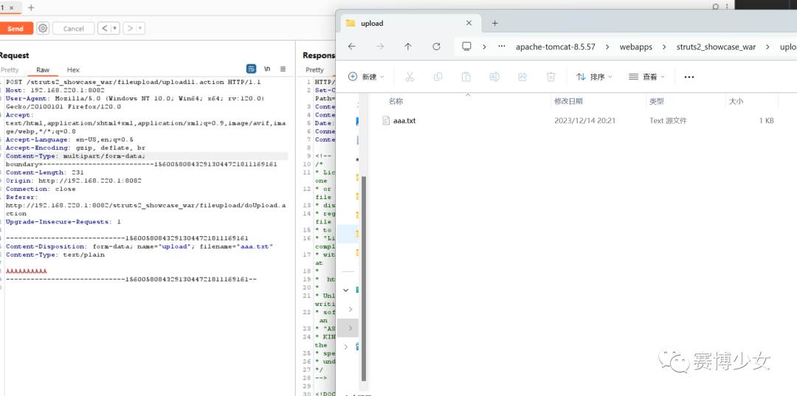
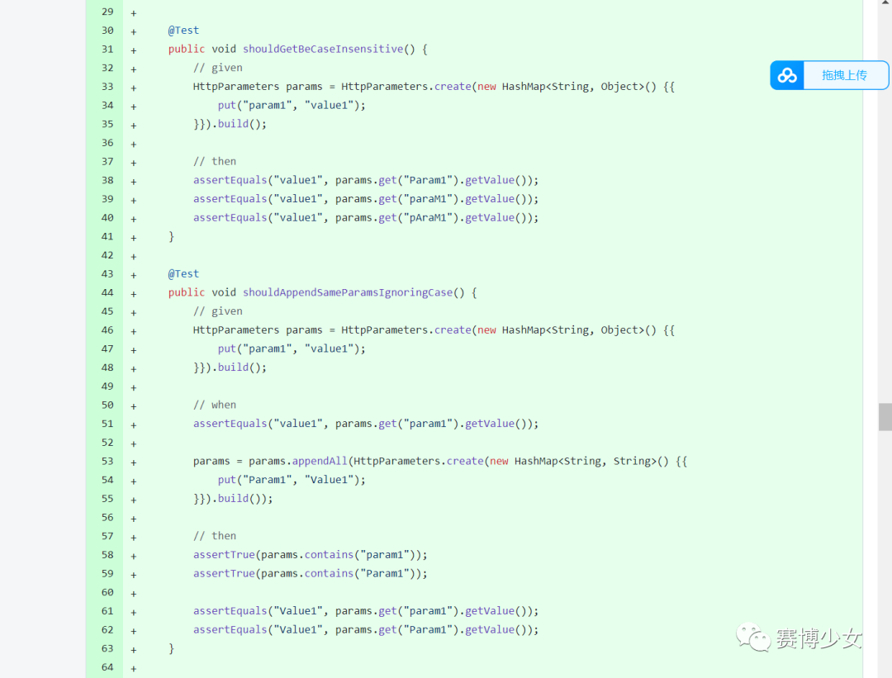
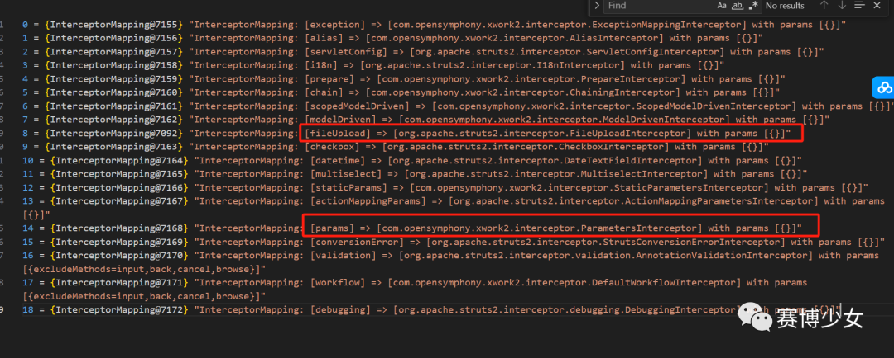
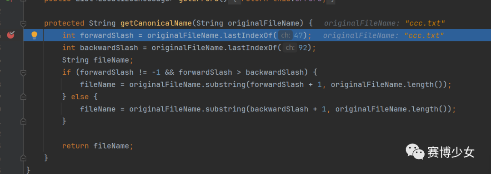
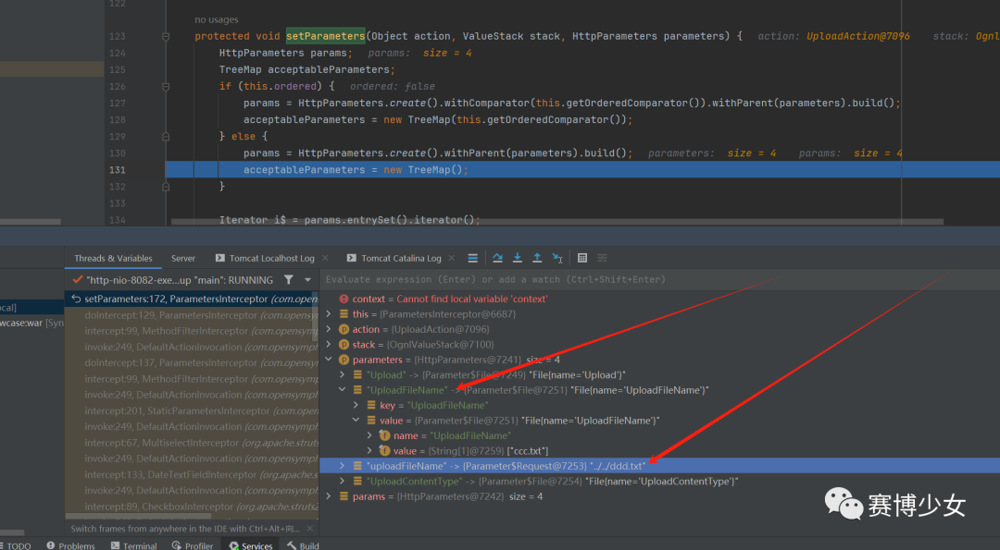
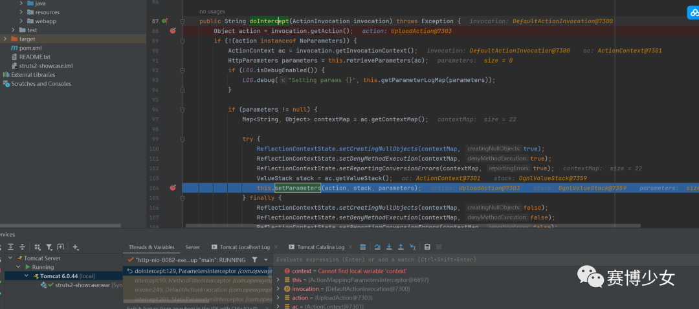
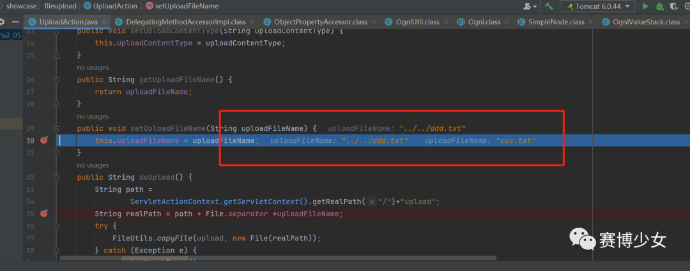
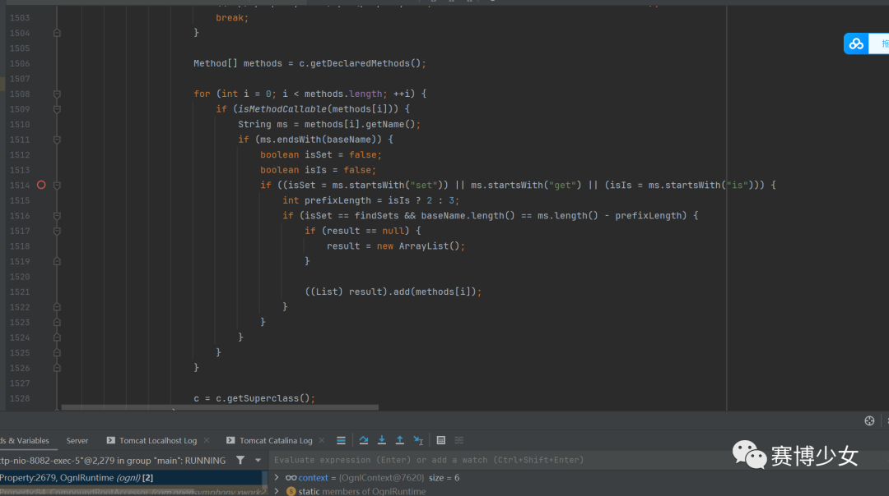
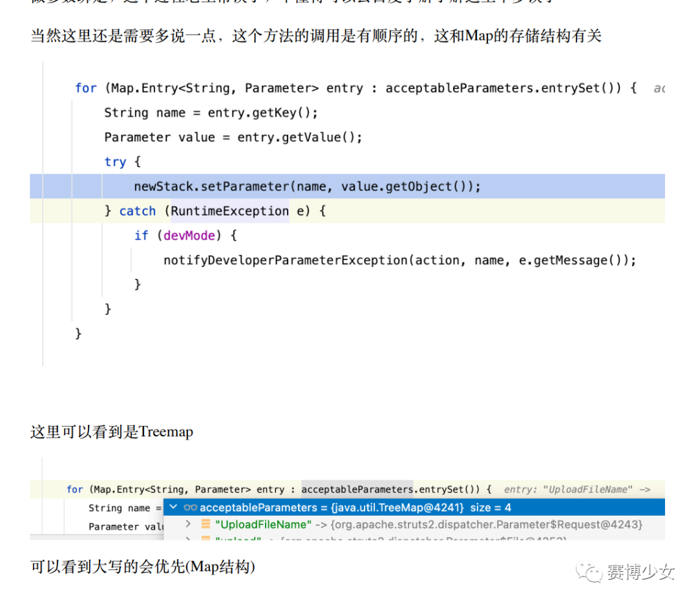

# S2-066 浅析

原创 Skay

[↓↓↓](javascript:)  
  
赛博少女  
  
[↑↑↑](javascript:)

*2023-12-15 22:28* *发表于北京*

## 一、环境搭建

直接在showcase的基础上搭建

src/main/resources/struts-fileupload.xml添加如下：

```plain
<!--       s2-066 test-->
       <action name="upload11" class="org.apache.struts2.showcase.fileupload.UploadAction"
             method="doUpload">
          <result name="success" type="">//WEB-INF/fileupload/skay.jsp</result>
       </action>
```

自定义uploadAction实现文件上传逻辑 org.apache.struts2.showcase.fileupload.UploadAction 这里直接放y4tacker的demo

```plain
package org.apache.struts2.showcase.fileupload;

import com.opensymphony.xwork2.ActionSupport;
import org.apache.commons.io.FileUtils;
import org.apache.struts2.ServletActionContext;
import java.io.*;
public class UploadAction extends ActionSupport {
    private static final long serialVersionUID = 1L;
    private File upload;
    // ⽂件类型，为name属性值 + ContentType
    private String uploadContentType;
    // ⽂件名称，为name属性值 + FileName
    private String uploadFileName;
    public File getUpload() {
        return upload;
    }
    public void setUpload(File upload) {
        this.upload = upload;
    }
    public String getUploadContentType() {
        return uploadContentType;
    }
    public void setUploadContentType(String uploadContentType) {
        this.uploadContentType = uploadContentType;
    }
    public String getUploadFileName() {
        return uploadFileName;
    }
    public void setUploadFileName(String uploadFileName) {
        this.uploadFileName = uploadFileName;
    }
    public String doUpload() {
        String path =
                ServletActionContext.getServletContext().getRealPath("/")+"upload";
        String realPath = path + File.separator +uploadFileName;
        try {
            FileUtils.copyFile(upload, new File(realPath));
        } catch (Exception e) {
            e.printStackTrace();
        }
        return SUCCESS;
    }
}
```

上传测试demo 

## 二、漏洞分析

先来compare一下看看更改了什么

https://github.com/apache/struts/compare/STRUTS\_6\_3\_0...STRUTS\_6\_3\_0\_2

除了版本号以外只有core/src/main/java/org/apache/struts2/dispatcher/HttpParameters.java 做了更改以及测试文件，添加了大小写的检查



有点懵逼，让我们跟着y4tacker的脚步来学习，Struts 框架默认加入了很多拦截器，定义在 struts-default.xml 中。使用的是递归调用，因为在 Interceptor 中为了实现分别在 action 之前和之后执行代码，会调用 ActionInvocation.invoke()，即 intercept() 的第一个参数，用于调用下一个拦截器或者是 Action。

debug中获取到了文件上传操作中这些拦截器：



此漏洞主要涉及FileUploadInterceptor以及 ParametersInterceptor两个拦截器

### 1.FileUploadInterceptor

从顺序来看，首先走到的是FileUploadInterceptor，在这里通过 String\[\] fileName = multiWrapper.getFileNames(inputName); 获取到filename并存储到 ActionContext.HttpParameters当中，这里的文件名获取做了严格的校验,

org.apache.struts2.dispatcher.multipart.AbstractMultiPartRequest#getCanonicalName



当走完FileUploadInterceptor时，可以看到当前的参数表是这样的



### 2.ParametersInterceptor

接下来看ParametersInterceptor ，

复习一下：ParametersInterceptor ，其继承自 MethodFilterInterceptor，最终会调用到下述 doIntercept 方法:

com.opensymphony.xwork2.interceptor.ParametersInterceptor#doIntercept



setParameters 经过一系列调用，最终使用 ognl.Ognl#setValue 对请求上下文进行赋值，即通过请求参数实现调用 Action 中定义的 setter 设置对应 POJO 对象的值，从而完成从 HTTP 到 Java 的参数绑定

也就是说我们可以通过控制传入参数来绑定Action中对应的属性

可以看到，当setUploadFileName被调用了两次，且第二次被重新赋值为目录穿越值



具体的赋值逻辑在OGNL中

ognl.OgnlRuntime#getDeclaredMethods



这里涉及到赋值顺序的问题，参考

https://y4tacker.github.io/2023/12/09/year/2023/12/Apache-Struts2-%E6%96%87%E4%BB%B6%E4%B8%8A%E4%BC%A0%E5%88%86%E6%9E%90-S2-066/



## 三、参考链接

https://y4tacker.github.io/2023/12/09/year/2023/12/Apache-Struts2-%E6%96%87%E4%BB%B6%E4%B8%8A%E4%BC%A0%E5%88%86%E6%9E%90-S2-066/

  

> 原文发表至：
> 
> https://skay.rce.la/s2\_066/
