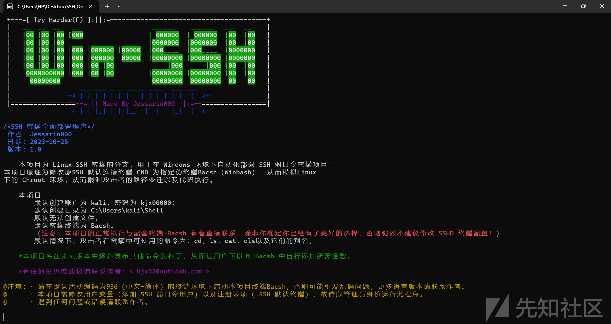
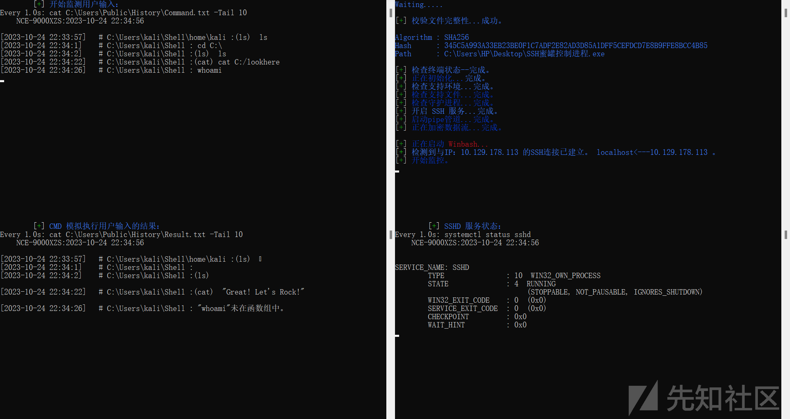
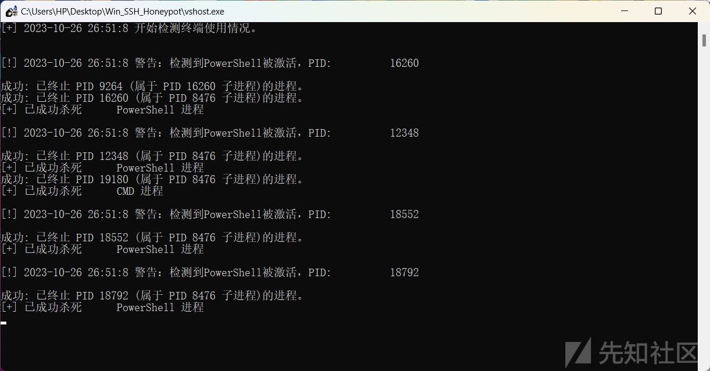
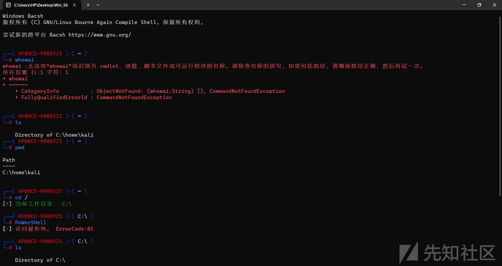

# SSH-Honeypot For Windows - 先知社区

SSH-Honeypot For Windows

- - -

# Win SSH 蜜罐/SSH-Honeypot For Windows

- - -

## 简介：

### 原 Linux SSH蜜罐项目的分支，基于 Windows-OpenSSH。

#### 链接：[https://github.com/kjx52/ssh-honeypot-new/tree/Win-SSH-Honeypot](https://github.com/kjx52/ssh-honeypot-new/tree/Win-SSH-Honeypot)

本项目为原 Linux SSH 蜜罐的分支，用于在 Windows 环境下自动化部署并运行 SSH 弱口令蜜罐项目，基于 Windows-OpenSSH，无前置项目。  
本项目完全由 C 族语言开发。

*作者 ： Jessarin000 ，本名 Kjx52 ，现名 Skiner。*

有任何意见或建议请联系作者：< kjx52@outlook.com >

本项目为开源特种类项目，作者尽力确保其普遍的适用性，但用户最好应根据开源源代码针对特定情形加以修改。  
同样，作者尽力确保其安全性，但因水平有限，若是百密之中有所纰漏，还望各位告知本人。

*任何将本项目全部或部分内容修改或直接用于非法违规行为的情况（包括社会工程类攻击以及跨站伪造等行为），作者均不承担任何责任。*

**本项目默认安装目录为 C:\\Users\\Public\\SSHShell 。若需更改目录，请修改源代码。**

- - -

## 一.原理

### 它是怎么实现的？

本项目首先新建拥有弱口令的 SSH 服务账户，诱导攻击者进行网络攻击。

考虑到 Windows-OpenSSH 拥有以下限制：

-   Windows-OpenSSH 配置文件中的 Chroot 选项仅在 sftp 会话中受支持，到 cmd.exe 的远程会话不会遵循 ChrootDirectory 。
-   可以通过将 shell 可执行文件的完整路径添加到 Windows 注册表 HKEY\_LOCAL\_MACHINE\\SOFTWARE\\OpenSSH 项下的 DefaultShell 字符串值来配置默认 ssh shell 。

本程序提出自定义一个可以满足要求的第三方伪终端 Bacsh（Winbash）程序来代替原 SSH 默认终端 CMD ，用于模拟 Linux 下的 Chroot 隔离环境，从而限制攻击者的路径变迁以及代码执行。

**Update.exe** 是使用 NSIS 完成封装的安装程序，用于初步解压所需文件。运行后即可将所有部件添加至 C:\\Users\\Public\\SSHShell 文件夹及桌面。

**SSH\_Deployment\_Program.exe（全面部署程序）** 可以完成后续安装步骤，它会自动地创建和设置各文件的权限，初始化工具。  
由于其中有修改用户变量以及读取程序进程的步骤，所以须以管理员身份运行此程序。  
在运行 Update.exe 后，它将添加至您的桌面上。

**SSH蜜罐控制进程.exe** 是本项目配套的启动器，可以自动化整个流程，包括实时监测 SSH 连接、启动以及关闭 SSH 服务、启动守护进程、启动监视器等。  
在运行 Update.exe 后，它将添加至您的桌面上。

**vshost.exe** 作为在 SSH 连接建立后防止攻击者进行容器逃逸的最后一道红线，这款守护进程被设计用来监测 Windows OS\_Shell （如PowerShell和CMD。） 状态并在其被激活后第一时间将其杀死。  
它默认与 Bacsh 同时启动，由 SSH蜜罐控制进程.exe 控制。  
这也代表在蜜罐运行过程中，用户不应使用任何 Windows OS\_Shell ，否则会导致 Shell 进程意外被杀死。  
在运行 Update.exe 后，它将添加至 C:\\Users\\Public\\SSHShell 文件夹中。  
在运行 Update.exe 后，它的快捷方式 SHUT.lnk 将添加至您的桌面上。

**Winbacsh.exe** 是整个项目的核心，也是隔离环境本身。  
这款伪终端可以识别并过滤用户输入，具体过滤规则和命令执行结果请见 本文 第三节 “Bacsh 终端”。  
同时，它也可以记录用户输入并模拟执行结果，供系统监视器（SysMonitor）读取。  
在运行 Update.exe 后，它将添加至 C:\\Users\\Public\\SSHShell 文件夹中。

***%注意：本项目的正常执行与配套终端 Bacsh 有着直接联系，除非你确定你已经有了更好的选择，否则强烈不建议修改 SSHD 终端配置！%***

**SysMonitor** 用于监控 *用户输入* 、 *用户输入的模拟执行结果* 和 *系统 SSHD 服务状态* 。  
它们默认与 Bacsh 同时启动，由 SSH蜜罐控制进程.exe 控制。  
监控界面刷新率为：

> *用户输入* ：： CommandMonitor.exe ：： 刷新次数： 1次 / 1秒 。  
> *用户输入的模拟执行结果* ：： ResultMonitor.exe ：： 刷新次数： 1次 / 1秒 。  
> *系统 SSHD 服务状态* ：： SSHDMonitor.exe ：： 刷新次数： 1次 / 5秒 。

在运行 Update.exe 后，它们将添加至 C:\\Users\\Public\\SSHShell 文件夹中。

其他信息：

-   本项目于 2023-10-25 完成，使用 C 族语言实现。
-   本项目搭建环境为 Windows 11。
-   本项目已测试架构 ：
    
    > 1.  x86\_64
    > 2.  x86
    
-   本项目已测试平台 ：
    
    > 1.  Windows 11
    > 2.  Windows 10
    

以下是一些截图：

> SSH 蜜罐全面部署程序  
> 

&

> SSH蜜罐控制进程\[右上\]、系统监视器\[右下\]、监视攻击者输入\[左上\]和模拟已输入命令的执行结果\[左下\]  
> 

&

> 守护进程 vshost.exe  
> 

&

> Bacsh 终端  
> 

&

> \*使用集成启动器时请注意，此脚本默认计算机屏幕分辨率为 1920\*1080 。其他分辨率或许会出现窗口无法正确排序或堆叠的情况。

- - -

## 二.获取

### 如何部署/启动它？

在 Github 的 *Win\_Deployment\_Program* 目录下有使用 NSIS 完成封装的安装程序 Update.exe，运行后即可将所有部件添加至C:\\Users\\Public\\SSHShell 文件夹及桌面。  
由于本项目特殊性，请在运行安装程序后以管理员的身份运行 SSH\_Deployment\_Program.exe ，以自动化设置文件权限以及添加弱口令用户。

如果需要手动配置，可以从 *The included exe* 目录下找到所有已编译好的 exe 可执行文件。

如果需要源码，可以 *main code* 目录下找到主要程序源码，从 *monitor code* 目录下找到监控程序源码。

-   注意：
    1.  请在默认活动编码为936（中文-简体）的终端环境下启动本项目终端Bacsh，否则可能引发乱码问题，更多语言版本请联系作者。
    2.  本项目需修改用户变量（添加 SSH 弱口令用户）以及注册表项（ SSH 默认终端），故请以管理员身份运行此程序。
    3.  遇到任何问题或错误请联系作者。

- - -

## 三.Bacsh 终端

### 它的规则是什么？

Bacsh 为防止容器逃逸以及任意代码执行做了两方面工作：动态字符过滤 和 整体语句识别。

#### 1.字符过滤

首先，Bacsh 使用 C 库函数 getch() 来读取用户输入，在输入过程中输入任何可以触发过滤机制的字符都会导致整个命令数组被立即清空，甚至直接停止运行。详细字符过滤机制如下：

1.  **可打印字符字符**  
    Bacsh 可以过滤除 **字母**、**数字**、**“:”**、**“-”**和**“/”**之外的所有可打印字符。  
    在输入过程中，若检测到其它字符则会立即清空命令数组、清零计数器并删除屏幕上已打印的字段部分。
    
2.  **控制字符**  
    对于大部分控制字符，Bacsh 均会直接丢弃并清空命令数组。  
    对于字符 **“\\033\[D”**（左移光标） 和 **“\\033\[C”**（右移光标） ，Bacsh 可以将它们的效果打印出来并在数组中切换对应地址，但不会将这些字符本身记入命令数组。  
    对于任何 Ascii 码等于零的字符（如 “Ctrl+1”）， Bacsh 将会直接停止运行。
    
3.  **Z**  
    **用于退出 Bacsh 程序。**  
    \**这一点是很有必要强调的，因为 exit 命令并不在 Bacsh 的内置函数组中。而即使是在之前 Bacsh 项目没有加入 SSH 蜜罐项目的时候（那时叫 WinBash 项目，启动界面有提示语），在当时的内测过程中，就有很多同志问我怎么退出程序，他们试了 “Ctrl+C” 和 “Ctrl+D” 都无济于事。而在把提示语删除后我想这可能会变成一个更大的问题，后续我会根据反馈决定是否还原提示语。*
    

#### 2.语句识别

Bacsh 在接受用户输入的 **“\\r”**（ ENTER 键\[1\]）后，若命令数组非空，则会进入语句识别阶段。此阶段中，若触发识别机制，则 Bacsh 仅会截取有关**文件路径**的字段并丢弃其他部分。详细语句识别机制如下：

1.  **内置函数**  
    Bacsh 内置函数组包括：**“cat”**、**“cd”**、**“cls”**、**“ls”** 和 **“pwd”** 以及它们的**别名**。  
    若识别到内置函数 **“cd”**、**“pwd”** ，则会打印指定提示语。  
    若识别到其它内置函数，Bacsh 会将其与指定语句拼接后交给系统 Shell 执行。  
    若内置函数组中的函数名前后有任意**数字**或**字母**，则不会出触发识别机制。

> 当识别到函数 **“cd”** 时，Bacsh 会截取并识别 cd 后的路径，若不为 C 盘下的绝对路径则丢弃。确认无误后 Bacsh 会将路径前的 “C:\\” 去掉，并将后面的路径拼接在字段 “C:\\Users\\kali\\Shell\\” 后面，使用 C 库函数 chdir() 进行目录变迁，从而确保不会发生目录遍历的情况。

1.  **OS\_Shell**  
    Bacsh OS\_Shell 组包括：**“cmd”**、**“powershell”**、**“exe”**以及他们的任意大小写组合。  
    若识别到 OS\_Shell 组，则会打印指定提示语（访问被拒绝）。  
    若 OS\_Shell 组中的函数名前后有任意**数字**或**字母**，则不会出触发识别机制。  
    \**这个组是备用选项。可能会有部分用户认为预装版的 Bacsh 内置函数组的函数过少或是不合适，进而取消内置函数的识别机制。*
    
2.  **其他任何语句都被视为无效语句，返回 PowerShell 错误信息。**
    

- - -

### 杂项/后记

在部署脚本中：

-   默认创建账户为 kali，密码为 kjx00000 ；
-   默认创建目录为 C:\\Users\\kali\\Shell；
-   默认无法创建文件；
-   默认蜜罐终端为 Bacsh ；
-   默认情况下，攻击者在蜜罐中可使用的命令为：cd，ls，cat，cls，pwd 以及它们的别名；

本项目的 Bacsh 终端原是作者为学校 CTF 比赛出的题目（也没用上，但不能因为这就让他失去光芒\[doge\]），“去其糟粕，取其精华”修改为曾经的伪终端项目 Win\_Bash 用于模拟 Linux 终端。后来将 Win\_Bash 并入 SSH\_Honeypot 项目进行开发，最终经一系列修改变为现在的 Bacsh 终端。

限于作者水平，本项目存在诸多不足，有任何意见或建议请联系作者< kjx52@outlook.com >。

> \*本项目将在未来版本中逐步发布其他命令的补丁，从而让用户可以向 Bacsh 中自行添加所需函数。

\\

> \*将在未来版本中试着加入客户端攻击。

作者： Jessarin000  
日期： 2023.10.26

\[1\]. 由于使用 getch() 函数，故在 ENTER 键的 ‘\\r\\n’ 中仅能识别 “\\r” 。 ↩
