# SSRF安全指北

# 前言

SSRF(Server-Side Request Forgery:服务器端请求伪造) 是一种由攻击者构造形成，由服务端发起请求的一个安全漏洞。SSRF是笔者比较喜欢的一个漏洞，因为它见证了攻防两端的对抗过程。本篇文章详细介绍了SSRF的原理，在不同语言中的危害及利用方式，常见的绕过手段，新的攻击手法以及修复方案。

# 1\. SSRF介绍

SSRF是Server-side Request Forge的缩写，中文翻译为服务端请求伪造。产生的原因是由于服务端提供了从其他服务器应用获取数据的功能且没有对地址和协议等做过滤和限制。常见的一个场景就是，通过用户输入的URL来获取图片。这个功能如果被恶意使用，可以利用存在缺陷的web应用作为代理攻击远程和本地的服务器。这种形式的攻击称为服务端请求伪造攻击。

以PHP为例，常见的缺陷代码如下：

1.  `function curl($url){`  
2.      `$ch = curl_init();`
3.      `curl_setopt($ch, CURLOPT_URL, $url);`
4.      `curl_setopt($ch, CURLOPT_HEADER, 0);`
5.      `curl_exec($ch);`
6.      `curl_close($ch);`
7.  `}`
9.  `$url = $_GET['url'];`
10.  `curl($url);`

# 2\. SSRF危害

从上面的示例代码可以看出，请求是从服务器发出的，那么攻击者可以通过构造恶意的url来访问原本访问不到的内网信息，攻击内网或者本地其他服务。这里根据后续处理逻辑不同，还会分为回显型ssrf和非回显型ssrf，所谓的回显型的ssrf就是会将访问到的信息返回给攻击者，而非回显的ssrf则不会，但是可以通过dns log或者访问开放/未开放的端口导致的延时来判断。

SSRF的最大的危害在于穿透了网络边界，但具体能做到哪种程度还需要根据业务环境来判断。例如我们在SSRF的利用中，如果需要更深一步扩展，第一反应通常是去攻击可利用的redis或者memcache等内网服务拿shell，但需要注意的是操作redis，memcache的数据包中是需要换行的，而http/https协议一般无法满足我们要求，所以即使内网存在可利用的redis，也并非所有的ssrf都能利用成功的。但是，对于memcache来说，即使只能使用https协议，利用memcache来getshell却并非不可能，本文会详细介绍一种新型的攻击方式。

## 2.1 SSRF在PHP中的利用

在PHP中，经常出现SSRF的函数有cURL、file\_get\_contents等。

cURL支持http、https、ftp、gopher、telnet、dict、file 和 ldap 等协议，其中gopher协议和dict协议就是我们需要的。利用gopher,dict协议，我们可以构造出相应payload直接攻击内网的redis服务。


需要注意的是：

1\. file\_get\_contents的gopher协议不能 UrlEncode

2\. file\_get\_contents关于Gopher的302跳转有bug，导致利用失败

3\. curl/libcurl 7.43上gopher协议存在bug（截断），7.45以上无此bug

4\. curl\_exec()默认不跟踪跳转

5\. file\_get\_contents() 支持php://input协议

  

## 2.2 SSRF在Python中的利用

在Python中，常用的函数有urllib(urllib2)和requests库。以urllib(urllib2)为例， urllib并不支持gopher,dict协议，所以按照常理来讲ssrf在python中的危害也应该不大，但是当SSRF遇到CRLF，奇妙的事情就发生了。

urllib曾爆出CVE-2019-9740、CVE-2019-9947两个漏洞，这两个漏洞都是urllib(urllib2)的CRLF漏洞，只是触发点不一样，其影响范围都在urllib2 in Python 2.x through 2.7.16 and urllib in Python 3.x through 3.7.3之间，目前大部分服务器的python2版本都在2.7.10以下，python3都在3.6.x，这两个CRLF漏洞的影响力就非常可观了。其实之前还有一个CVE-2016-5699，同样的urllib（urllib2）的CRLF问题，但是由于时间比较早，影响范围没有这两个大，这里也不再赘叙

python2代码如下：

1.  `import sys`
2.  `import urllib2`
3.  `host = "127.0.0.1:7777?a=1 HTTP/1.1\r\nCRLF-injection: test\r\nTEST: 123"`
4.  `url = "http://"+ host + ":8080/test/?test=a"`
5.  `try:`
6.    `info = urllib2.urlopen(url).info()`
7.    `print(info)`
8.  `except Exception as e:`
9.  `print(e)`


可以看到我们成功注入了一个header头，利用CLRF漏洞，我们可以实现换行对redis的攻击

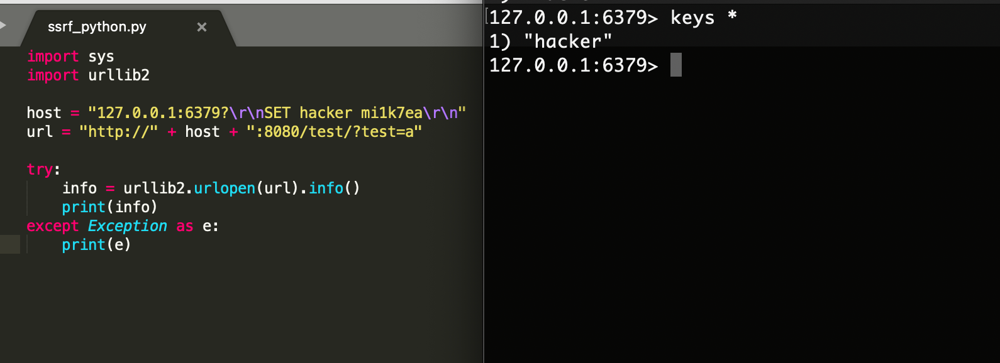

除开CRLF之外，urllib还有一个鲜有人知的漏洞CVE-2019-9948，该漏洞只影响urllib，范围在Python 2.x到2.7.16，这个版本间的urllib支持local\_file/local-file协议，可以读取任意文件，如果file协议被禁止后，不妨试试这个协议来读取文件。

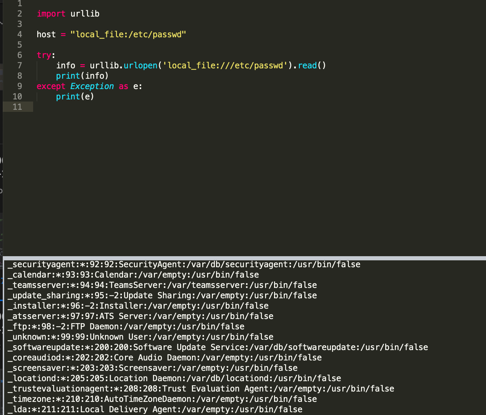

## 2.3 SSRF在JAVA中的利用

相对于php，在java中SSRF的利用局限较大，一般利用http协议来探测端口，利用file协议读取任意文件。常见的类中如HttpURLConnection，URLConnection，HttpClients中只支持sun.net.www.protocol (java 1.8)里的所有协议:http，https，file，ftp，mailto，jar，netdoc。

但这里需要注意一个漏洞，那就是weblogic的ssrf，这个ssrf是可以攻击可利用的redis拿shell的。在开始看到这个漏洞的时候，笔者感到很奇怪，因为一般java中的ssrf是无法攻击redis的，但是网上并没有找到太多的分析文章，所以特地看了下weblogic的实现代码。

详细的分析细节就不说了，只挑重点说下过程，调用栈如下


我们跟进sendMessage函数（UDDISoapMessage.java）

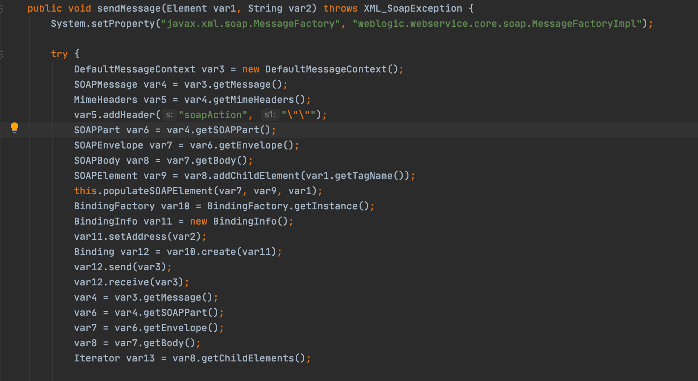

sendMessage将传入的url赋值给BindingInfo的实例，然后通过BindingFactory工厂类，来创建一个Binding实例，该实例会通过传入的url决定使用哪个接口。

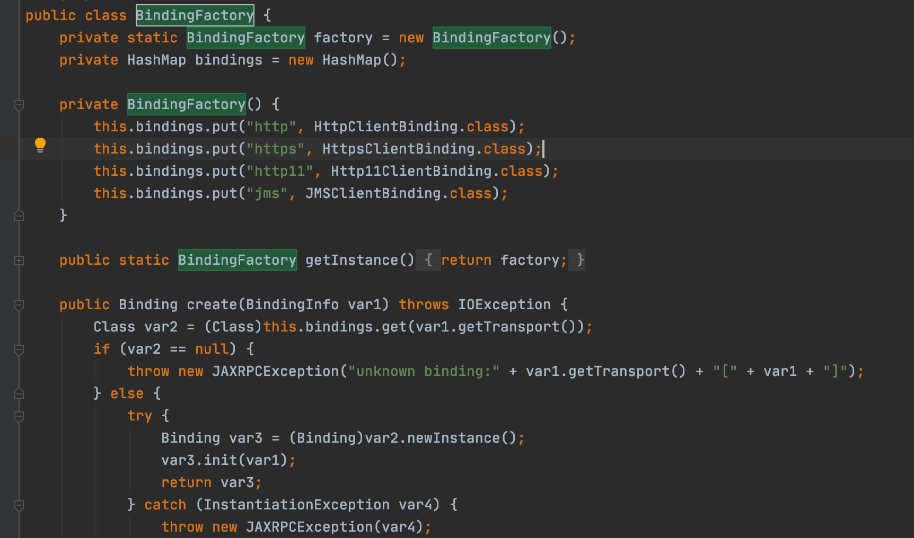

这里使用HttpClientBinding来调用send方法，


send方法使用createSocket来发送请求，这里可以看到直接将传入的url代入到了socket接口中

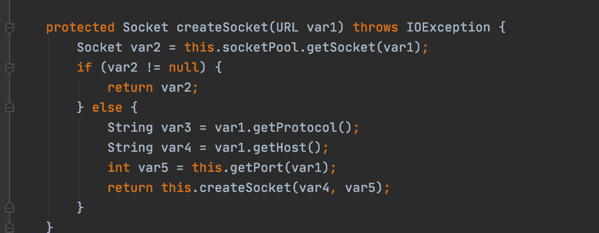

这里的逻辑就很清晰了,weblogic并没有采用常见的网络库，而是自己实现了一套socket方法，将用户传入的url直接带入到socket接口,而且并没有校验url中的CRLF。

# 3\. SSRF的攻防

SSRF的攻防过程也是人们对SSRF漏洞认知不断提升的一个过程，从开始各大厂商不认可SSRF漏洞->攻击者通过SSRF拿到服务器的权限->厂商开始重视这个问题，开始使用各种方法防御->被攻击者绕过->更新防御手段，在这个过程中，攻击者和防御者的手段呈螺旋式上升的趋势，也涌现了大量绕过方案。

常见的修复方案如下：


用伪代码来表示的话就是

1.  `if check_ssrf(url):`
2.      `do_curl(url)`
3.  `else:`
4.      `print(“error”)`

图中的获取IP地址和判断IP地址即是check\_ssrf的检验，所有的攻防都是针对check\_ssrf这个函数的绕过与更新，限于篇幅原因，这里取几个经典绕过方案讲解一下

## 3.1 30x跳转

30x跳转也是SSRF漏洞利用中的一个经典绕过方式，当防御方限制只允许http(s)访问或者对请求的host做了正确的校验后，可以通过30x方式跳转进行绕过。

针对只允许http(s)协议的情况，我们可以通过  
Location: dict://127.0.0.1:6379跳转到dict协议，从而扩大我们攻击面，来进行更深入的利用

针对没有禁止url跳转，但是对请求host做了正确判断的情况，我们则可以通过Location: [http://127.0.0.1:6379的方式来绕过限制](http://127.0.0.1:6379的方式来绕过限制)

## 3.2 URL解析绕过

其实在ssrf利用的过程中也零星有利用url解析导致绕过check\_ssrf的payload，但大部分利用payload之所以能成功是因为防御者在编写代码时使用的正则匹配不当。第一个正式的深入利用是orange在blackhat大会上提出的[A-New-Era-Of-SSRF-Exploiting](https://www.blackhat.com/docs/us-17/thursday/us-17-Tsai-A-New-Era-Of-SSRF-Exploiting-URL-Parser-In-Trending-Programming-Languages.pdf "A-New-Era-Of-SSRF-Exploiting")，利用语言本身自带的解析函数差异来绕过检测，在该ppt中举例了大量不同编程语言的url解析函数对url解析的差异，从而导致check\_ssrf和do\_curl解析不同导致的绕过，有兴趣的同学可以参看附录一，这里以笔者发现的一个例子作为讲解。

在python3中，笔者发现对于同一个url:http://baidu.com\\@qq.com，urllib和urllib3的解析就不一致。   

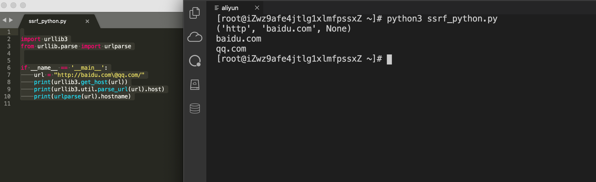

  

可以看到，对于[http://baidu.com\\](http://baidu.com/)[@qq](https://github.com/qq "@qq").com 来说，urllib3取到的host是baidu.com，而urllib取到的host是qq.com。笔者曾就此问题与python官方联系过，但是官方并不认为这是一个安全问题，表示urllib3与chrome浏览器的解析保持一致（将\\视为/），所以这个问题会一直存在。如果在check\_ssrf中解析url函数用的是urllib3，而业务代码发送请时采用的是urllib，两者之间的解析差异就会导致绕过的情况。

这里多说一句，其实url解析问题涉及到了web安全的底层逻辑，不仅仅是在ssrf中有利用，其危害范围很广，包括不限于url跳转，oauth认证，同源策略（如postMessage中origin的判断）等一切会涉及到host判断的场景。   

  

## 3.3 DNS rebinding

  

从SSRF修复方案来看，这里流程中进行了两次DNS解析，第一次在check\_ssrf的时候会对URL的host进行DNS解析，第二次在do\_curl请求时进行解析。这两次DNS解析是有时间差的，我们可以使用这个时间差进行绕过。  

   
时间差对应DNS中的机制是TTL。TTL表示DNS里面域名和IP绑定关系的Cache在DNS上存活的最长时间。即请求了域名与iP的关系后，请求方会缓存这个关系，缓存保持的时间就是TTL。而缓存失效后就会删除，这时候如果重新访问域名指定的IP的话会重新建立匹配关系及cache。  
  

当我们设置TTL为0时，当第一次解析域名后，第二次会重新请求DNS服务器获取新的ip。DNS重绑定攻击的原理是：利用服务器两次解析同一域名的短暂间隙，更换域名背后的ip达到突破同源策略或过waf进行ssrf的目的。  
  

这里利用方法如下：  
  

1\. 在网站 SSRF 漏洞处访问精心构造的域名。网站第一次解析域名，获取到的IP地址为A；  
2\. 经过网站后端服务器的检查，判定此IP为合法IP。  
3\. 网站获取URL对应的资源（在一次网络请求中，先根据域名服务器获取IP地址，再向IP地址请求资源），第二次解析域名。此时已经过了ttl的时间，解析记录缓存IP被删除。第二次解析到的域名为被修改后的 IP 即为内网IP B；  
4\. 攻击者访问到了内网IP。   

  

当然，上述情况是最理想的情况，在不同的语言，不同服务器中也存在差异

   
1\. java中DNS请求成功的话默认缓存30s(字段为networkaddress.cache.ttl，默认情况下没有设置)，失败的默认缓存10s。（缓存时间在 /Library/Java/JavaVirtualMachines/jdk /Contents/Home/jre/lib/security/java.security 中配置）  
2\. 在php中则默认没有缓存。  
3\. Linux默认不会进行DNS缓存，mac和windows会缓存(所以复现的时候不要在mac、windows上尝试)  
4\. 有些公共DNS服务器，比如114.114.114.114还是会把记录进行缓存，但是8.8.8.8是严格按照DNS协议去管理缓存的，如果设置TTL为0，则不会进行缓存。   

  

在传统的ssrf修复方案中，由于java会存在默认的dns缓存，所以一般认为java不存在DNS rebinding问题。但是试想这么一个场景，如果刚刚好到了DNS缓存时间，此时更新DNS缓存，那些已经过了SSRF Check而又没有正式发起业务请求的request，是否使用的是新的DNS解析结果。其实理论上只要在发起第一次请求后等到30秒之前的时候再请求即可，但为了保证效果，可以在28s左右，开始以一个较短的时间间隔去发送请求，以达到时间竞争的效果。相关示例代码可参考附录三。  
  

Dns rebinding常见方案除了自建dns服务器之外，还可以通过绑定两个A记录，一个绑定外网ip，一个绑定内网ip。当然这种情况访问顺序是随机的，无法保证成功率。  
  

自建dns服务器需要将域名的dns服务指向自己的vps，然后在vps上运行dns\_server脚本，dns\_server.py内容如下   

  

```python
from twisted.internet import reactor, defer
from twisted.names import client, dns, error, server


record={}
class DynamicResolver(object):
    def _doDynamicResponse(self, query):
        name = query.name.name
        if name not in record or record[name]<1:
            # 随意一个 IP，绕过检查即可
            ip="104.160.43.154"
        else:
            ip="127.0.0.1"
        if name not in record:
            record[name]=0
        record[name]+=1
        print name+" ===> "+ip
        answer = dns.RRHeader(
            name=name,
            type=dns.A,
            cls=dns.IN,
            ttl=0,
            payload=dns.Record_A(address=b'%s'%ip,ttl=0)
        )
        answers = [answer]
        authority = []
        additional = []
        return answers, authority, additional
    def query(self, query, timeout=None):
        return defer.succeed(self._doDynamicResponse(query))

def main():
    factory = server.DNSServerFactory(
        clients=[DynamicResolver(), client.Resolver(resolv='/etc/resolv.conf')]
    )
    protocol = dns.DNSDatagramProtocol(controller=factory)
    reactor.listenUDP(53, protocol)
    reactor.run()

if __name__ == '__main__':
    raise SystemExit(main())
```

  

效果如下：

  

  

  

当第一次访问时，解析为外网ip通过ssrf检测，  
第二次访问时，也即业务访问时，ip会指向127.0.0.1，从而达到了绕过目的。  
  
除此之外，还有一些绕过技巧，例如利用IPv6,  
有些服务没有考虑IPv6的情况，但是内网又支持IPv6，则可以使用IPv6的本地IP如::1或IPv6的内网域名--x.1.ip6.name来绕过过滤

  

# 4\. SSRF新型攻击手法—When TLS Hacks You

   
如果只支持https协议是否存在深入利用的可能？答案是存在的，2020年的blackhat大会上有一个议题When TLS hacks you，这篇文章利用tls对ssrf进行深入利用。该手法是将ssrf+dns rebinding+tls session完美结合在一起的利用链，能够在不依赖其他漏洞（如CRLF）的情况下，攻击内网中的memcache、SMTP服务。  
  
**这里介绍一下相关原理：**

  
当客户端和服务器端初次建立TLS握手时（例如浏览器访问HTTPS网站），需要双方建立一个完整的TLS连接，该过程为了保证数据的传输具有完整性和机密性，需要做很多事情，如密钥协商出会话密钥，数字签名身份验证，消息验证码MAC等。这个过程是非常消耗资源的，而且当下一次客户端访问同一个HTTPS网站时，这个过程需要再重复一次，这无疑会造成大量的资源消耗。

   
为了提高性能，TLS/SSL提供了会话恢复的方式，允许客户端和服务端在某次关闭连接后，下一次客户端访问时恢复上一次的会话连接。会话恢复有两种，一种是基于session ID恢复，一种是使用Session Ticket的TLS扩展。这里主要介绍一下session ID。  
  

每一个会话都由一个Session ID标识符标识，当建立一个TLS连接时，服务器会生成一个session ID给客户端，服务端保留会话记录，重新连接的客户端可以在clientHello消息期间提供此会话ID，并重新使用此前建立的会话密钥，而不需要再次经历秘钥协商等过程。TLS session id在RFC-5077中有着详细描述，基本所有数据都可以用作会话标志符，包括换行符。

   
Session ticket和session id作用类似，在客户端和服务端建立了一次完整的握手后，服务端会将本次的会话数据加密，但是session ticket将会话记录保存在客户端，而且与session id 32字节的大小不同，session ticket可提供65k的空间，这就能为我们的payload提供足够的空间。  
  

在讲完这些细节之后，攻击的思路就会很清晰了，session id是服务器提供给客户端的，如果我们构建一个恶意的tls服务器，然后将我们的恶意session id发送给客户端，然后通过dns rebinding，将服务器域名的地址指向内网ip应用，例如memcache，客户端在恢复会话时就会带上恶意的session id去请求内网的memcache，从而攻击了内网应用。  
  

**大致流程如下：**  
  

1.利用服务器发起一个 HTTPS 请求。  
2.请求时会发起一个 DNS 解析请求，DNS 服务器回应一个 TTL 为 0 的结果，指向攻击者的服务器。  
3.攻击者服务器响应请求，并返回一个精心构造过的 SessionID，并延迟几秒后回应一个跳转。  
4.客户端接收到这个回应之后会进行跳转，这次跳转时由于前面那一次 DNS 解析的结果为 TTL 0，则会再次发起一次解析请求，这次返回的结果则会指向 SSRF 攻击的目标（例如本地的memcache数据库）。  
5.因为请求和跳转时的域名都没有变更，本次跳转会带着之前服务端返回的精心构造过的 SessionID 进行，发送到目标的那个端口上。  
6.则达到目的，成功对目标端口发送构造过的数据，成功 SSRF。  
  
可以看到当请求同一个https站点时，curl会re-use之前的session Id，  

   

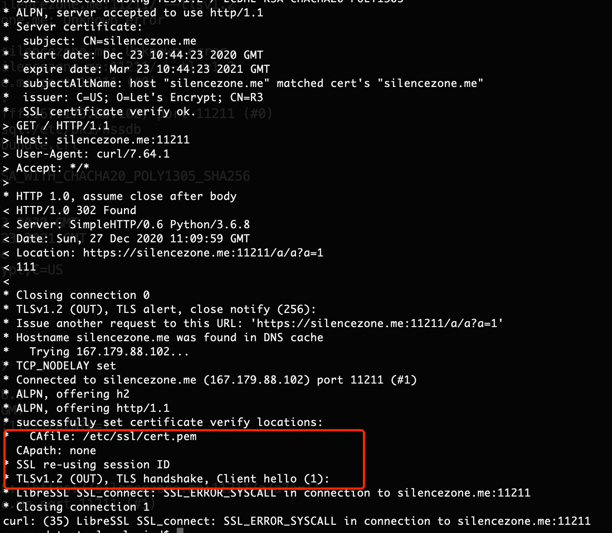  

  

  

我们使用恶意的https服务器设置session id，可以看到当跳转到本地时，客户端会带着恶意的session id请求本地的11211端口  

  

  

  

  

可以看到memcache已经被写入了数据  

  

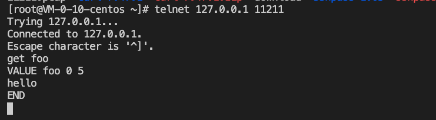  

  

通过wireshark抓包来查看整个流程  

  

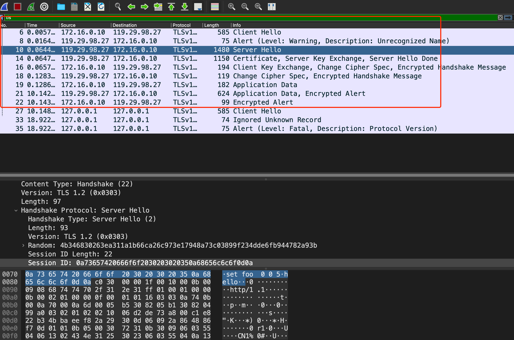  

  

在红框部分是客户端与恶意HTTPS服务器建立了一个完整的TLS连接，Server Hello中恶意服务器返回了一个恶意的session ID，然后进行了一个跳转，利用DNS rebinding将域名指向了本地127.0.0.1，  

  

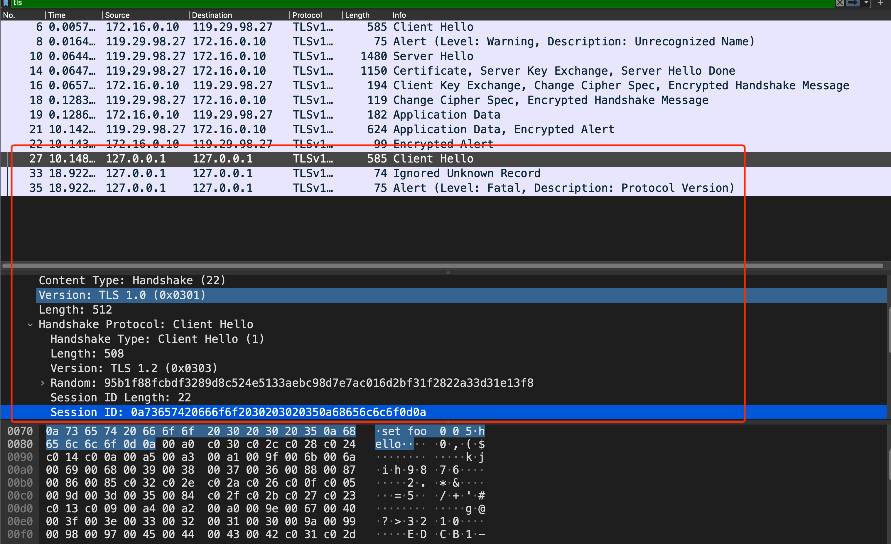  

  

可以看到客户端向本地发送了一个client hello数据包，数据包中的session id就是恶意服务器设置的session id，从而攻击了客户端本地的memcache。

   
当然，这种攻击存在一定的局限性，除了依赖于发起请求的客户端外（客户端是否实现TLS缓存），由于TLS协议带有各种字符，例如\\0x00，可能会导致一些应用解析失败，例如就无法通过该方式来攻击redis。以下是议题作者给出的受影响的HTTPS client列表以及可以攻击的应用   

  

  

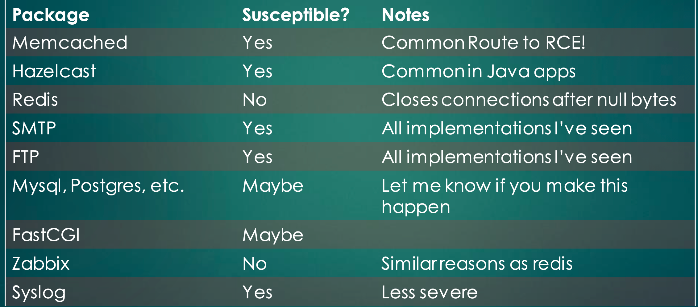  

  

除此之外在复现过程中，笔者还发现了一些其他的限制条件，例如在某些curl版本中会无法复用session id，而且在tls1.3版本中，也会出现复现失败的问题。

   
整体来讲，虽然复现起来存在一些限制，但是并不妨碍这个议题的思路的独到之处，笔者认为这是2020年web端最厉害的议题。拆开来讲，发起请求的客户端如curl，tls协议都不存在任何问题，议题作者曾表示curl在判断同源时，只判断了协议，域名，端口，但是没有判断ip，这里在笔者看来并非是curl问题，由于负载均衡等问题，域名可能对应多个ip，这种修复方式应该是不会被采纳的;而session id/ticket更是tls为了提高性能而提出的机制，这个机制本身不存在问题，但是这两个组合起来加上ssrf就达到了意想不到的效果。  
  

# SSRF修复

  

SSRF的修复比较复杂，需要根据业务实际场景来采取不同的方案，例如前面说到的python中不同url库对url的解析就不一致，所以对于有条件的公司，建立一个代理集群是比较可靠的方案，将类似请求外部url的需求整理出来，分为纯外网集群和内网集群进行代理请求。

   
如果需要从代码层面来修复的话，需要注意一下几点：  
  

1\. 去除url中的特殊字符  
2\. 判断是否属于内网ip  
3\. 如果是域名的话，将url中的域名改为ip  
4\. 请求的url为3中返回的url  
5\. 请求时设置host header为ip  
6\. 不跟随30x跳转（跟随跳转需要从1开始重新检测）

   
其中第一步是为了防止利用url parse的特性造成url解析差异，第三步是为了防止dns rebinding，第5步是为了防止以ip请求时，某些网站无法访问的问题，第6步是为了防止30x跳转进行绕过。   

  

# 结语

  

在笔者看来，安全问题从某种程度来讲，其实是攻击者与防御者对同一事物的认知问题，当攻击者的认知超出防御者时，就会找到新的绕过方式，而当防御者的认知跟上之后，又会促使攻击者寻找新的方式，这一点在ssrf漏洞上体现得淋漓尽致。安全上的攻防，其实就是人与人之间的博弈，这也是安全的魅力所在。  
附录

   
1\. SSRF利用新纪元：https://www.blackhat.com/docs/us-17/thursday/us-17-Tsai-A-New-Era-Of-SSRF-Exploiting-URL-Parser-In-Trending-Programming-Languages.pdf  
2\. When TLS Hacks You:https://i.blackhat.com/USA-20/Wednesday/us-20-Maddux-When-TLS-Hacks-You.pdf  
3\. Java环境下通过时间竞争实现DNS rebinding绕过ssrf防御限制: https://mp.weixin.qq.com/s/dA40CUinwaitZDx6X89TKw   

  

# 团队介绍

  

腾讯蓝军（Tencent Force）由腾讯TEG安全平台部于2006年组建，十余年专注前沿安全攻防技术研究、实战演练、渗透测试、安全评估、培训赋能等，采用APT攻击者视角在真实网络环境开展实战演习，全方位检验安全防护策略、响应机制的充分性与有效性，最大程度发现业务系统的潜在安全风险，并推动优化提升，助力企业领先于攻击者，防患于未然。
