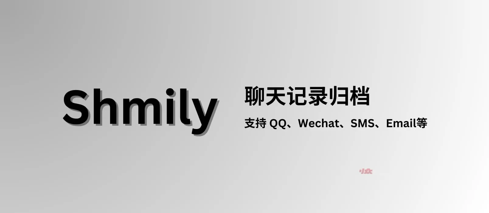
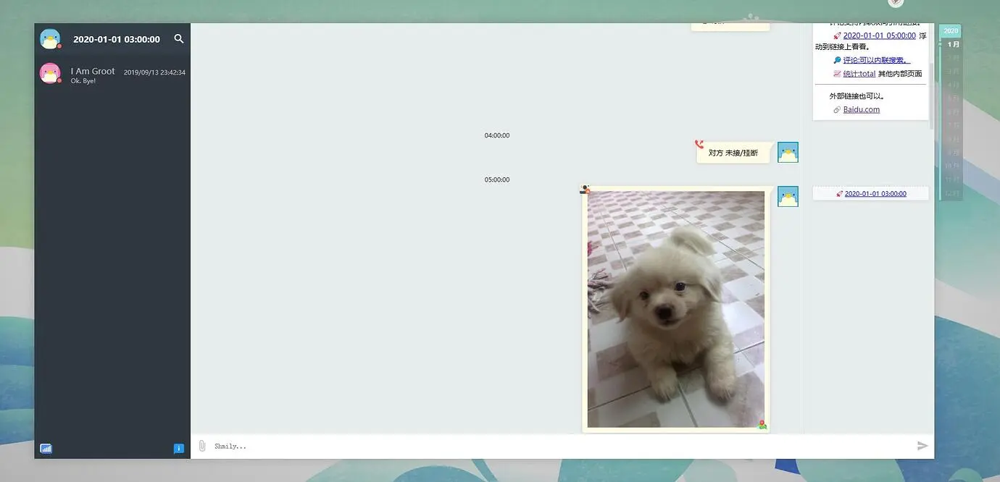
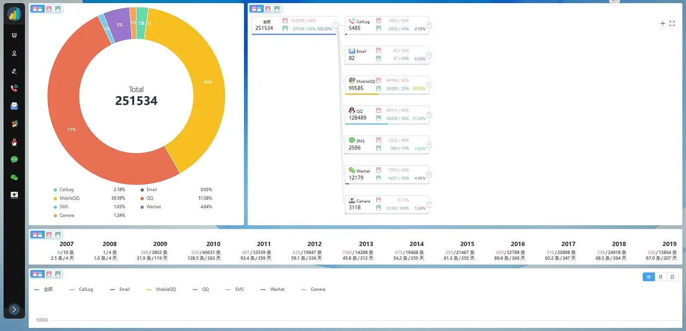

# Shmily - 聊天记录归档，支持 QQ、WeChat、SMS、Email 等 - 小众软件

**Shmily** 是一个将各种个人数据从各种软件中导出，并按时间线显示的工具，真正让用户数据掌握在自己手中并能永久保存。@[Appinn](https://www.appinn.com/shmily/)

来自

[↓↓↓](https://meta.appinn.net/c/faxian/10)  
  
**发现频道**  
  
[↑↑↑](https://meta.appinn.net/c/faxian/10)

，开发者 @lqzh 自荐：

[↓↓↓](https://meta.appinn.net/t/topic/47386)  
  
https://meta.appinn.net/t/topic/47386  
  
[↑↑↑](https://meta.appinn.net/t/topic/47386)

## 这是啥 / 一句话简介

一个将各种个人数据从各种软件中导出，并按时间线显示的工具，真正让用户数据掌握在自己手中并能永久保存

-   支持 QQ 、MobileQQ 、Wechat 、SMS 、CallLog 、Camera 、Email 等各种来源
    -   甚至 Nokia Symbian S60v3 的 MobileQQ 和 短信都可以！
-   支持筛选、搜索、评论、图表统计分析等功能。

## 

[↓↓↓](https://meta.appinn.net/t/topic/47386#demo-3)  
  
  
  
[↑↑↑](https://meta.appinn.net/t/topic/47386#demo-3)

 Demo

少啰嗦，先看 Demo 

[↓↓↓](http://demo.shmily.lqzh.me/)  
  
http://demo.shmily.lqzh.me/  
  
[↑↑↑](http://demo.shmily.lqzh.me/)

 （托管在 Github ，访问可能略慢）

// 只支持 PC，没人会在手机上看自己的历史吧……

##  亮点

我看过 **现有** 的聊天记录归档项目大都有以下问题

-   使用上
    -   大都为 HTML 模板直出，无分页，几百兆的 HTML 不可用
    -   导出的归档数据无法查询，筛选、评论等，失去了归档数据的意义
    -   没有图表统计，数据未体现额外价值
    -   显示数据单一，无法多项目如 QQ Wechat 按时间线合并查看
    -   多次导出的数据 (如 2020 年导出的数据和 2021 年导出的数据) 不能累计查看并分析
-   程序上
    -   获取数据不完整，获取的数据取决于作者用到的，无法拿到数据库中完整的额外字段
    -   全流程耦合，如果对产物不满意，只能从头开始造轮子，难以从中间(如解密后的数据库)开始

`基于以上问题，Shimly 的亮点在于`

-   使用上
    -   支持筛选、搜索（支持正则）、评论（支持双向引用链接）
    -   支持我能想到所有维度的数据图表统计 （连表情的使用频率都有）
    -   支持多种类、多批次数据合并显示与统计
-   程序上
    -   架构（详见 
        
        [↓↓↓](https://lqzh.me/Shmily/guide/concept.html)  
          
        文档  
          
        [↑↑↑](https://lqzh.me/Shmily/guide/concept.html)
        
        ）我将架构分为 `数据获取-Get`(ExportDB 、ToMsg) 和 `数据展示-Show`(Modify 、Web) 4 个部分，中间使用 `<JSON>${Shimly-Msg}` 标准格式进行融合
        -   你可以只使用 `ExportDB`、`ToMsg` 部分，做自己的数据导出与分析
        -   也可以写自己需要的 `Get`，而不再担心前端的编写
        -   在 `Show` 的基础上也可以更简单的自定义显示
    -   完整的数据导出、不管是否 显示(Show) 有使用，能导尽导，万一别人需要呢
    -   `Show` 基于组件化开发，纯前端实现，人脑智能榨汁级优化 /:dog （ 240M 数据文件浏览搜索
        
        [↓↓↓](https://github.com/lqzhgood/Shmily-Show/blob/main/docs/Q_A.md#%E6%80%A7%E8%83%BD%E5%A6%82%E4%BD%95)  
          
        无压力  
          
        [↑↑↑](https://github.com/lqzhgood/Shmily-Show/blob/main/docs/Q_A.md#%E6%80%A7%E8%83%BD%E5%A6%82%E4%BD%95)
        
         ）

总结： 没看过这么完整且好用的数据归档工具

## 获取

-   [↓↓↓](https://github.com/lqzhgood/Shmily)  
      
    https://github.com/lqzhgood/Shmily  
      
    [↑↑↑](https://github.com/lqzhgood/Shmily)
    

##  爱发电

都到这了

-    
    
    [↓↓↓](https://github.com/lqzhgood/Shmily)  
      
    Github  
      
    [↑↑↑](https://github.com/lqzhgood/Shmily)
    
     点个 Star 呗
-    也可以 
    
    [↓↓↓](https://lqzh.me/Shmily/guide/other/donation.html)  
      
    这里  
      
    [↑↑↑](https://lqzh.me/Shmily/guide/other/donation.html)
    
     看看 `世界上最可爱的动物` ，顺便投个币 X ）
-    聊聊酷工作，
    
    [↓↓↓](https://netcut.cn/p/e8b0d71721e85527)  
      
    简历  
      
    [↑↑↑](https://netcut.cn/p/e8b0d71721e85527)
    

## 

[↓↓↓](https://meta.appinn.net/t/topic/47386#h-7)  
  
  
  
[↑↑↑](https://meta.appinn.net/t/topic/47386#h-7)

自荐理由

我感觉这是最符合 **小众软件精神** 的软件了。就是那种对大部分人没用，又看起来很重要，平时几乎不用，点一颗收藏的红心就再也不管的应用。

之前的BOSS说人生的意义在于能给这个世界留下一点痕迹。我觉得成为 Ph.D. 去突破人类的边界太难，保存自己的数字模样更加简单

各大互联网App中的数据就形成了我的模样，但他们几乎都不支持用户数据的完整导出。  
花了很多心思（3年）做这个，应该会有人需要吧~  
如果觉得有帮助，在 Github 上点个 star 应该能帮我更快找到好工作吧，要是投个币就更好了。

## 

[↓↓↓](https://meta.appinn.net/t/topic/47386#tips-8)  
  
  
  
[↑↑↑](https://meta.appinn.net/t/topic/47386#tips-8)

Tips

如遇程序上的问题请去对应的 Github 仓库中提交 issue，此贴仅作讨论，不处理问题。

- - -

最后，开发者在发现频道：

[↓↓↓](https://meta.appinn.net/t/topic/47386)  
  
https://meta.appinn.net/t/topic/47386  
  
[↑↑↑](https://meta.appinn.net/t/topic/47386)
