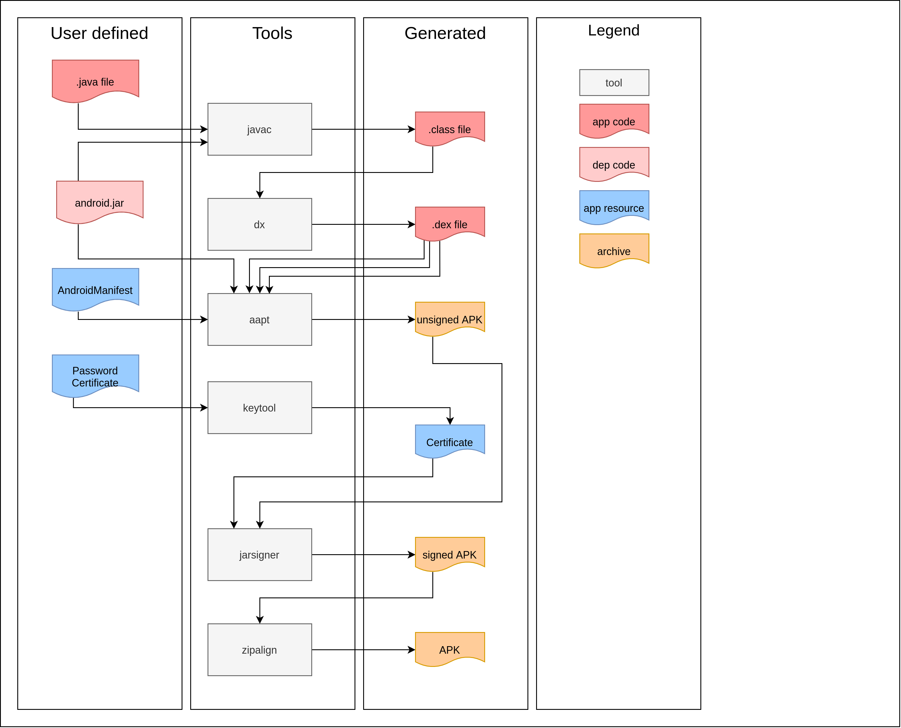
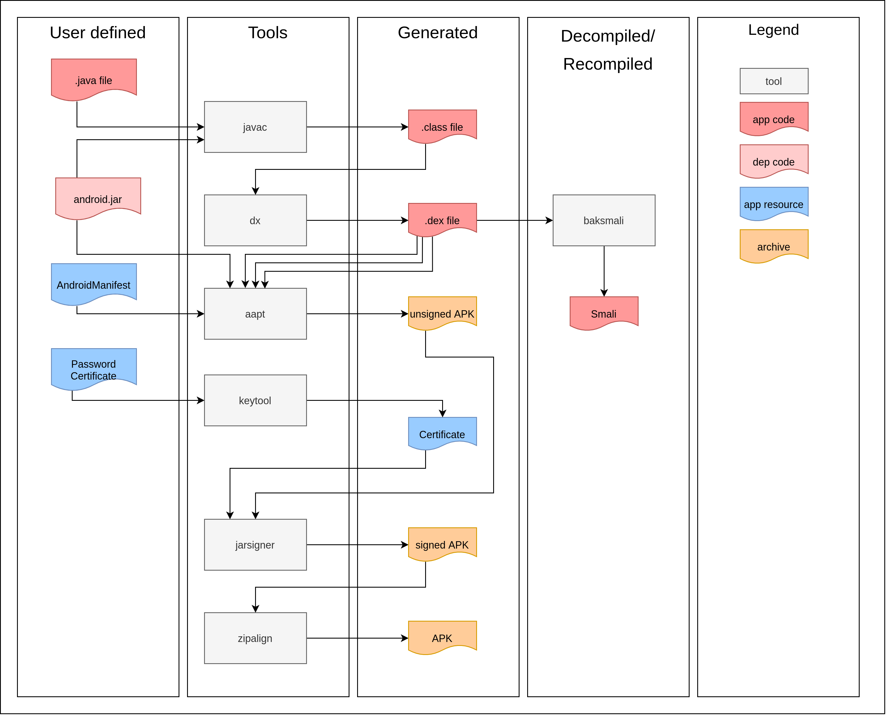

# Smali the Parseltongue Language

Date 日期 Thu 03 February 2022  
2022年2月03日 星期四 By

[↓↓↓](https://blog.quarkslab.com/author/benoit-forgette.html)  
  
Benoît Forgette 贝努瓦·福吉特  
  
[↑↑↑](https://blog.quarkslab.com/author/benoit-forgette.html)

Category 类别

[↓↓↓](https://blog.quarkslab.com/category/android.html)  
  
Android 人造人  
  
[↑↑↑](https://blog.quarkslab.com/category/android.html)

. Tags 标签

[↓↓↓](https://blog.quarkslab.com/tag/android.html)  
  
Android 人造人  
  
[↑↑↑](https://blog.quarkslab.com/tag/android.html)

[↓↓↓](https://blog.quarkslab.com/tag/binary-patching.html)  
  
binary patching 二进制修补  
  
[↑↑↑](https://blog.quarkslab.com/tag/binary-patching.html)

[↓↓↓](https://blog.quarkslab.com/tag/programming.html)  
  
programming 编程  
  
[↑↑↑](https://blog.quarkslab.com/tag/programming.html)

When analyzing an Android application, we often end up playing with the Smali intermediate representation... Way more human readable than the binary DEX code itself, but still not that user friendly. This blog post gives some guidelines on how to read Smali, and start writing you own Smali code!  
在分析 Android 应用程序时，我们经常会使用 Smali 中间表示......比二进制 DEX 代码本身更具人类可读性，但仍然不是那么用户友好。这篇博文提供了一些关于如何阅读 Smali 的指南，并开始编写你自己的 Smali 代码！

Most of the time, we prefer to read Java code, but when analyzing an Android application, we often need to read or write in Smali. After reading this blogpost, you will be able to understand and speak Parseltongue... aka *Smali*. In addition, you should be able to repackage an APK after having altered the content without errors.  
大多数时候，我们更喜欢阅读 Java 代码，但在分析 Android 应用程序时，我们经常需要在 Smali 中读取或写入。阅读这篇博文后，您将能够理解和说蛇佬腔......又名 Smali。此外，您应该能够在更改内容后重新打包 APK，而不会出现错误。

## What is Smali 什么是 Smali


Android applications run inside the Dalvik Virtual machine, and that binary needs to read DEX (Dalvik EXecutable) format in order to execute the application.  
Android 应用程序在 Dalvik 虚拟机内运行，该二进制文件需要读取 DEX （Dalvik EXecutable） 格式才能执行应用程序。

In this article, I will only focus on Smali, the intermediate representation (IR) for DEX files.  
在本文中，我将只关注 Smali，即 DEX 文件的中间表示 （IR）。

The syntax for Smali is loosely based on Jasmin's/dedexer's syntax. As this is just a quick introduction, for a more detailed guide of the full language, readers can follow the white rabbit here: [🐇](http://jasmin.sourceforge.net/guide.html) [\[JASMIN\]](#jasmin)  
Smali 的语法松散地基于 Jasmin 的 / dedexer 的语法。由于这只是一个简短的介绍，如需更详细的完整语言指南，读者可以在这里关注小白兔：🐇\[JASMIN\]

To contextualize Smali within the production pipeline of an APK, the following graphic shows a global represention of how an APK is produced:  
为了在 APK 的生产管道中对 Smali 进行上下文化，下图显示了 APK 生成方式的全局表示形式：



However, if we add the intermediate representation on the same figure we get:  
但是，如果我们在同一张图上添加中间表示，我们会得到：



## Why write in Smali  
为什么要用 Smali 写作

The first question we can ask ourselves is: why would we want to program in Smali, a difficult language where every mistake is an unforgivable curse?  
我们可以问自己的第一个问题是：为什么我们要用 Smali 编程，这是一种困难的语言，每个错误都是不可饶恕的诅咒？

Actually, several motivations can be the answers to this question, and I list some of those below.  
实际上，有几个动机可以成为这个问题的答案，我在下面列出了其中的一些。

Sometimes, it is necessary to modify the code of an application even when we do not have the source code, in order to:  
有时，即使我们没有源代码，也有必要修改应用程序的代码，以便：

-   improve its features; 改进其功能;
-   falsify its behaviors; 伪造其行为;
-   inject code to better understand how it works.  
    注入代码以更好地了解其工作原理。

Indeed, when an application has anti-debug features such as:  
事实上，当应用程序具有反调试功能时，例如：

-   the verification of the debug flag: getApplicationInfo().flags & ApplicationInfo.FLAG\_DEBUGGABLE;  
    调试标志的验证： getApplicationInfo().flags & ApplicationInfo.FLAG\_DEBUGGABLE ;
-   the parameters inside the Manifest to avoid extraction of native library [\[NATIVE\_EXTRACTION\]](#native-extraction) (this parameters can be automatically patched by some tools like [\[APKPATCHER\]](#apkpatcher));  
    Manifest 中的参数，以避免提取原生库 \[NATIVE\_EXTRACTION\]（此参数可以通过一些工具自动修补，例如 \[APKPATCHER\]）;
-   a routine to check if extra libs have been added;  
    检查是否添加了额外库的例程;
-   etc. 等。

As such, it is sometimes easier to edit the application's code to, for example, log the values of a variable.  
因此，有时更容易编辑应用程序的代码，例如，记录变量的值。

For instance, here is a code snippet I used to log a simple String:  
例如，这是我用来记录一个简单的 String 代码片段：

```plain
# Use an unused register, v8 and v9
# the trick here is to expand the number size of register with `locals X`
const-string v8, "MY_TAG"

invoke-static {v8, v9}, Landroid/util/Log;->d(Ljava/lang/String;Ljava/lang/String;)I
```

Another classical way to use Smali is to remove x509 certificate pinning from the application to be able to carry a Man In The Middle (MITM) [\[SSLPINNING\]](#sslpinning). Or, we can add a code to load a library such as [\[FRIDA\]](#frida) near the entrypoint of the application, to be able to instrument the application as the [\[APKPATCHER\]](#apkpatcher) tool does.  
使用 Smali 的另一种经典方法是从应用程序中删除 x509 证书固定，以便能够携带中间人 （MITM） \[SSLPINNING\]。或者，我们可以添加一个代码来加载一个库，例如 \[FRIDA\] 在应用程序的入口点附近，以便能够像 \[APKPATCHER\] 工具一样检测应用程序。

A more specific experience where I needed to modify the Smali code of an application was during an audit of IoT devices, which ran on an Android system. I found a vulnerability that let me have a restricted access on the bootloader of the device.  
我需要修改应用程序的 Smali 代码的更具体的经历是在审核在 Android 系统上运行的 IoT 设备期间。我发现了一个漏洞，让我对设备的引导加载程序的访问受到限制。

Using this, I was able to alter some applications that got *privileged access* on the system. Then, I used this vulnerability to patch one of the applications and insert a backdoor to gain full access after a reboot of the device.  
使用它，我能够更改一些在系统上获得特权访问的应用程序。然后，我利用这个漏洞修补了其中一个应用程序，并插入了一个后门，以便在重新启动设备后获得完全访问权限。

In other cases, when you program in Smali, you probably don't follow the same code generation patterns that a classical compiler would use. These patterns are usually used by Java decompilers such as [\[CFR\]](#cfr), [\[PROCYON\]](#procyon), [\[FERNFLOWER\]](#fernflower), [\[JADX\]](#jadx), or [\[JDCORE\]](#jdcore) to rebuild the DEX bytecode into Java code. It is common to simply see some decompiled methods vanish when writing Smali code. When we know these rules, it is easier to eliminate methods we do not want to see on the decompiled code. Note that this "feature" could be used to obfuscate the application, but maybe that will be the subject of another blogpost...  
在其他情况下，当您使用 Smali 进行编程时，您可能不会遵循经典编译器使用的相同代码生成模式。Java 反编译器（如 \[CFR\]、\[PROCYON\]、\[FERNFLOWER\]、\[JADX\] 或 \[JDCORE\]）通常使用这些模式将 DEX 字节码重建为 Java 代码。在编写 Smali 代码时，通常会看到一些反编译方法消失。当我们知道这些规则时，就更容易消除我们不想在反编译代码中看到的方法。请注意，这个“功能”可以用来混淆应用程序，但也许这将是另一篇博文的主题......

## Write directly in Smali  
直接用 Smali 编写

When you want to modify the Smali code of an APK, you should follow certain rules to avoid getting incomprehensible issues that will make you tear your hair out.  
当您想修改 APK 的 Smali 代码时，您应该遵循某些规则，以避免出现难以理解的问题，这些问题会让您头晕目眩。

When you compile a Java program, you give the compiler the architecture of your code:  
编译 Java 程序时，需要为编译器提供代码的体系结构：

```plain
java/
└── exploit
    └── intent
        └── exploit.java
```

This architecture is kept in Java compiled code and is given to the DEX compiler:  
此体系结构保存在 Java 编译代码中，并提供给 DEX 编译器：

```plain
class/
└── exploit
    └── intent
        └── exploit.class
```

Smali keeps the same architecture as Java with class files:  
Smali 使用类文件保持与 Java 相同的架构：

```plain
smali/
└── exploit
    └── intent
        └── exploit.smali
```

But when you decompile a more recent APK, you will find multiples folders such as: smali, smali\\\_classes2, ..., smali\\\_classesXX. These folders have the same architecture as the Java class folder, but they seem to be incomplete. In fact, DEX files cannot contain a number of methods exceeding 64K (as in Kilo), in other words, no more than 65,536 methods. Since Android 5.0, it is possible to configure your APK to have more than one DEX file with the library multidex, and if your Android SDK level is greater than 21, multidex is natively integrated.  
但是，当您反编译较新的APK时，您会发现多个文件夹，例如： smali 、、...、 smali\\\_classes2 smali\\\_classesXX 。这些文件夹具有与 Java 类文件夹相同的体系结构，但它们似乎不完整。事实上，DEX 文件不能包含超过 64K（如 Kilo）的方法数量，换句话说，不超过 65,536 个方法。从 Android 5.0 开始，可以将 APK 配置为具有多个带有库 multidex 的 DEX 文件，如果您的 Android SDK 级别大于 21，则 multidex 是原生集成的。

> Another limitation that can come up when playing with DEX files is the size of the classes: the size of classesN-1.dex should always be larger than classesN.dex. Otherwise, the application may not respond. In fact, you can launch the application, but in some cases it will crash and in some others it will not respond and no interaction will be possible.  
> 使用 DEX 文件时可能出现的另一个限制是类的大小：的大小 classesN-1.dex 应始终大于 classesN.dex .否则，应用程序可能不会响应。实际上，您可以启动应用程序，但在某些情况下它会崩溃，而在其他一些情况下，它不会响应，也无法进行交互。

However, if your DEX file has more than 64K methods, you could move the excess number of methods to another DEX. Note that all the classes and nested classes which contain those excess methods should be moved too.  
但是，如果您的 DEX 文件具有超过 64K 个方法，则可以将多余的方法移动到另一个 DEX。请注意，所有包含这些多余方法的类和嵌套类也应移动。

If you want more informations about [\[MULTIDEX\]](#multidex)  
如果您想了解有关 \[MULTIDEX\] 的更多信息

### Let's take an example  
让我们举个例子

First of all, if you want to reproduce what follows, verify that you use the appropriate version of Java.  
首先，如果要重现以下内容，请验证是否使用了适当的 Java 版本。

```plain
apktool b [redacted]/ -o output.apk
I: Using Apktool 2.5.0-dirty
I: Checking whether sources has changed...
I: Smaling smali folder into classes.dex...
Exception in thread "main" java.lang.NoSuchMethodError: java.nio.ByteBuffer.clear()Ljava/nio/ByteBuffer;
    at org.jf.dexlib2.writer.DexWriter.writeAnnotationDirectories(DexWriter.java:919)
    at org.jf.dexlib2.writer.DexWriter.writeTo(DexWriter.java:344)
    at org.jf.dexlib2.writer.DexWriter.writeTo(DexWriter.java:300)
    at brut.androlib.src.SmaliBuilder.build(SmaliBuilder.java:61)
    at brut.androlib.src.SmaliBuilder.build(SmaliBuilder.java:36)
    at brut.androlib.Androlib.buildSourcesSmali(Androlib.java:420)
    at brut.androlib.Androlib.buildSources(Androlib.java:351)
    at brut.androlib.Androlib.build(Androlib.java:303)
    at brut.androlib.Androlib.build(Androlib.java:270)
    at brut.apktool.Main.cmdBuild(Main.java:259)
    at brut.apktool.Main.main(Main.java:85)
```

If you have this error, then you probably do not have the correct version of Java for your Apktool. In the following example, I use openjdk-17.  
如果您遇到此错误，那么您的 Apktool 可能没有正确的 Java 版本。在以下示例中，我使用 openjdk-17。

First, I decompile the application with Apktool:  
首先，我用 Apktool 反编译应用程序：

```plain
apktool d ~/git/asthook/misc/[redacted].apk
I: Using Apktool 2.5.0-dirty on [redacted].apk
I: Loading resource table...
I: Decoding AndroidManifest.xml with resources...
I: Loading resource table from file: /home/madsquirrel/.local/share/apktool/framework/1.apk
I: Regular manifest package...
I: Decoding file-resources...
I: Decoding values */* XMLs...
I: Baksmaling classes.dex...
I: Baksmaling classes2.dex...
I: Baksmaling classes3.dex...
I: Copying assets and libs...
I: Copying unknown files...
I: Copying original files...
I: Copying META-INF/services directory
```

Then, I get a folder \[redacted\] with 3 subfolders which contain Smali code smali, smali\\\_classes2, smali\\\_classes3.  
然后，我得到一个文件夹 \[已编辑\]，其中包含 3 个子文件夹，其中包含 Smali 代码 smali ， smali\\\_classes2 ， smali\\\_classes3 .

If I rebuild it directly, there is no error:  
如果我直接重建它，则没有错误：

```plain
apktool b -f -o output.apk [redacted]/
I: Using Apktool 2.5.0-dirty
I: Smaling smali folder into classes.dex...
I: Smaling smali_classes3 folder into classes3.dex...
I: Smaling smali_classes2 folder into classes2.dex...
I: Copying raw resources...
I: Copying libs... (/lib)
I: Copying libs... (/kotlin)
I: Copying libs... (/META-INF/services)
I: Building apk file...
I: Copying unknown files/dir...
I: Built apk...
```

At this point, if I modify a Smali file in the first directory \[redacted\]/smali/com/\[redacted\]/\[redacted\]/appUpgrade/AppUpgrade.smali and add a simple method toto:  
此时，如果我修改第一个目录中 \[redacted\]/smali/com/\[redacted\]/\[redacted\]/appUpgrade/AppUpgrade.smali 的 Smali 文件并添加一个简单的方法 toto ：

```plain
.method public static toto()V
    locals 0
    return-void
.end method
```

And try to recompile:  
并尝试重新编译：

```plain
apktool b -f -o output.apk [redacted]/
I: Using Apktool 2.5.0-dirty
I: Smaling smali folder into classes.dex...
Exception in thread "main" org.jf.util.ExceptionWithContext: Exception occurred while writing code_item for method Landroidx/collection/LongSparseArray;->clone()Landroidx/collection/LongSparseArray;
    at org.jf.dexlib2.writer.DexWriter.writeDebugAndCodeItems(DexWriter.java:1046)
    at org.jf.dexlib2.writer.DexWriter.writeTo(DexWriter.java:345)
    at org.jf.dexlib2.writer.DexWriter.writeTo(DexWriter.java:300)
    at brut.androlib.src.SmaliBuilder.build(SmaliBuilder.java:61)
    at brut.androlib.src.SmaliBuilder.build(SmaliBuilder.java:36)
    at brut.androlib.Androlib.buildSourcesSmali(Androlib.java:420)
    at brut.androlib.Androlib.buildSources(Androlib.java:351)
    at brut.androlib.Androlib.build(Androlib.java:303)
    at brut.androlib.Androlib.build(Androlib.java:270)
    at brut.apktool.Main.cmdBuild(Main.java:259)
    at brut.apktool.Main.main(Main.java:85)
Caused by: org.jf.util.ExceptionWithContext: Error while writing instruction at code offset 0x12
    at org.jf.dexlib2.writer.DexWriter.writeCodeItem(DexWriter.java:1319)
    at org.jf.dexlib2.writer.DexWriter.writeDebugAndCodeItems(DexWriter.java:1042)
    ... 10 more
Caused by: org.jf.util.ExceptionWithContext: Unsigned short value out of range: 65536
    at org.jf.dexlib2.writer.DexDataWriter.writeUshort(DexDataWriter.java:116)
    at org.jf.dexlib2.writer.InstructionWriter.write(InstructionWriter.java:356)
    at org.jf.dexlib2.writer.DexWriter.writeCodeItem(DexWriter.java:1279)
    ... 11 more
```

The error occurs randomly in the method Landroidx/collection/LongSparseArray;->clone()Landroidx/collection/LongSparseArray;, but we can clearly understand what happens when we see this error "Caused by: org.jf.util.ExceptionWithContext: Unsigned short value out of range: 65536". Indeed, 65536 is the limit for the allowed number of methods.  
错误在方法 Landroidx/collection/LongSparseArray;->clone()Landroidx/collection/LongSparseArray; 中随机发生，但是我们可以清楚地了解当我们看到这个错误时会发生什么“ Caused by: org.jf.util.ExceptionWithContext: Unsigned short value out of range: 65536 ”。实际上，65536 是允许的方法数量的限制。

*Warning: if during the recompilation step you did not get the above-mentioned error, this probably means that the number of methods did not go over the authorized limit.  
警告：如果在重新编译步骤中没有收到上述错误，这可能意味着方法的数量没有超过授权限制。*

### Repackage the APK 重新打包APK

We still need to sign our APK to finalize the repackaging. We can use a quick'n'dirty script to do this, as follows:  
我们仍然需要签署我们的 APK 以完成重新打包。我们可以使用 quick'n'dirty 脚本来执行此操作，如下所示：

```plain
#!/bin/bash

folder="$1"
app="$2"

# genkey
keytool -genkey -keyalg RSA -keysize 2048 -validity 700 -noprompt -alias apkpatcheralias1 -dname "CN=apk.patcher.com, OU=ID, O=APK, L=Patcher, S=Patch, C=BR" -keystore apkpatcherkeystore -storepass password -keypass password 2> /dev/null

# repackage apk
apktool b -f -o "$app" "$folder"

# sign apk
jarsigner -sigalg SHA1withRSA -digestalg SHA1 -keystore apkpatcherkeystore -storepass password "$app" apkpatcheralias1 >/dev/null 2>&1

# zipalign
zipalign -c 4 "$app"
```

Now, you have all the clues to easily repackage an APK. However, be careful if you repackage an APK: I invite you to remove the build/ folder after each rebuild since some modifications may not be correctly set, thus, at runtime, the application may not open the DEX, as illustrated in the following example:  
现在，您拥有了轻松重新打包 APK 的所有线索。但是，如果您重新打包 APK，请小心：我邀请您在每次重新构建后删除该 build/ 文件夹，因为某些修改可能未正确设置，因此，在运行时，应用程序可能无法打开 DEX，如以下示例所示：

```plain
10-27 05:04:36.359 11241 11241 E AndroidRuntime: FATAL EXCEPTION: main
10-27 05:04:36.359 11241 11241 E AndroidRuntime: Process: com.example.myapplication, PID: 11241
10-27 05:04:36.359 11241 11241 E AndroidRuntime: java.lang.RuntimeException: Unable to instantiate activity ComponentInfo{com.example.myapplication/com.example.myapplication.MainActivity}: java.lang.ClassNotFoundException: Didn't find class "com.example.myapplication.MainActivity" on path: DexPathList[[zip file "/data/app/com.example.myapplication-1/base.apk"],nativeLibraryDirectories=[/data/app/com.example.myapplication-1/lib/x86_64, /system/lib64, /vendor/lib64]]
10-27 05:04:36.359 11241 11241 E AndroidRuntime:      at android.app.ActivityThread.performLaunchActivity(ActivityThread.java:2567)
10-27 05:04:36.359 11241 11241 E AndroidRuntime:      at android.app.ActivityThread.handleLaunchActivity(ActivityThread.java:2726)
10-27 05:04:36.359 11241 11241 E AndroidRuntime:      at android.app.ActivityThread.-wrap12(ActivityThread.java)
10-27 05:04:36.359 11241 11241 E AndroidRuntime:      at android.app.ActivityThread$H.handleMessage(ActivityThread.java:1477)
10-27 05:04:36.359 11241 11241 E AndroidRuntime:      at android.os.Handler.dispatchMessage(Handler.java:102)
10-27 05:04:36.359 11241 11241 E AndroidRuntime:      at android.os.Looper.loop(Looper.java:154)
10-27 05:04:36.359 11241 11241 E AndroidRuntime:      at android.app.ActivityThread.main(ActivityThread.java:6119)
10-27 05:04:36.359 11241 11241 E AndroidRuntime:      at java.lang.reflect.Method.invoke(Native Method)
10-27 05:04:36.359 11241 11241 E AndroidRuntime:      at com.android.internal.os.ZygoteInit$MethodAndArgsCaller.run(ZygoteInit.java:886)
10-27 05:04:36.359 11241 11241 E AndroidRuntime:      at com.android.internal.os.ZygoteInit.main(ZygoteInit.java:776)
10-27 05:04:36.359 11241 11241 E AndroidRuntime: Caused by: java.lang.ClassNotFoundException: Didn't find class "com.example.myapplication.MainActivity" on path: DexPathList[[zip file "/data/app/com.example.myapplication-1/base.apk"],nativeLibraryDirectories=[/data/app/com.example.myapplication-1/lib/x86_64, /system/lib64, /vendor/lib64]]
10-27 05:04:36.359 11241 11241 E AndroidRuntime:      at dalvik.system.BaseDexClassLoader.findClass(BaseDexClassLoader.java:56)
10-27 05:04:36.359 11241 11241 E AndroidRuntime:      at java.lang.ClassLoader.loadClass(ClassLoader.java:380)
10-27 05:04:36.359 11241 11241 E AndroidRuntime:      at java.lang.ClassLoader.loadClass(ClassLoader.java:312)
10-27 05:04:36.359 11241 11241 E AndroidRuntime:      at android.app.Instrumentation.newActivity(Instrumentation.java:1078)
10-27 05:04:36.359 11241 11241 E AndroidRuntime:      at android.app.ActivityThread.performLaunchActivity(ActivityThread.java:2557)
10-27 05:04:36.359 11241 11241 E AndroidRuntime:      ... 9 more
10-27 05:04:36.359 11241 11241 E AndroidRuntime:      Suppressed: java.io.IOException: Failed to open dex files from /data/app/com.example.myapplication-1/base.apk because: Failed to open dex file '/data/app/com.example.myapplication-1/base.apk' from memory: Unrecognized magic number in /data/app/com.example.myapplication-1/base.apk:
10-27 05:04:36.359 11241 11241 E AndroidRuntime:              at dalvik.system.DexFile.openDexFileNative(Native Method)
10-27 05:04:36.359 11241 11241 E AndroidRuntime:              at dalvik.system.DexFile.openDexFile(DexFile.java:367)
10-27 05:04:36.359 11241 11241 E AndroidRuntime:              at dalvik.system.DexFile.<init>(DexFile.java:112)
10-27 05:04:36.359 11241 11241 E AndroidRuntime:              at dalvik.system.DexFile.<init>(DexFile.java:77)
10-27 05:04:36.359 11241 11241 E AndroidRuntime:              at dalvik.system.DexPathList.loadDexFile(DexPathList.java:359)
10-27 05:04:36.359 11241 11241 E AndroidRuntime:              at dalvik.system.DexPathList.makeElements(DexPathList.java:323)
10-27 05:04:36.359 11241 11241 E AndroidRuntime:              at dalvik.system.DexPathList.makeDexElements(DexPathList.java:263)
10-27 05:04:36.359 11241 11241 E AndroidRuntime:              at dalvik.system.DexPathList.<init>(DexPathList.java:126)
10-27 05:04:36.359 11241 11241 E AndroidRuntime:              at dalvik.system.BaseDexClassLoader.<init>(BaseDexClassLoader.java:48)
10-27 05:04:36.359 11241 11241 E AndroidRuntime:              at dalvik.system.PathClassLoader.<init>(PathClassLoader.java:64)
10-27 05:04:36.359 11241 11241 E AndroidRuntime:              at com.android.internal.os.PathClassLoaderFactory.createClassLoader(PathClassLoaderFactory.java:43)
10-27 05:04:36.359 11241 11241 E AndroidRuntime:              at android.app.ApplicationLoaders.getClassLoader(ApplicationLoaders.java:58)
10-27 05:04:36.359 11241 11241 E AndroidRuntime:              at android.app.LoadedApk.createOrUpdateClassLoaderLocked(LoadedApk.java:520)
10-27 05:04:36.359 11241 11241 E AndroidRuntime:              at android.app.LoadedApk.getClassLoader(LoadedApk.java:553)
10-27 05:04:36.359 11241 11241 E AndroidRuntime:              at android.app.ActivityThread.getTopLevelResources(ActivityThread.java:1866)
10-27 05:04:36.359 11241 11241 E AndroidRuntime:              at android.app.LoadedApk.getResources(LoadedApk.java:766)
10-27 05:04:36.359 11241 11241 E AndroidRuntime:              at android.app.ContextImpl.<init>(ContextImpl.java:2038)
10-27 05:04:36.359 11241 11241 E AndroidRuntime:              at android.app.ContextImpl.createAppContext(ContextImpl.java:1983)
10-27 05:04:36.359 11241 11241 E AndroidRuntime:              at android.app.ActivityThread.handleBindApplication(ActivityThread.java:5294)
10-27 05:04:36.359 11241 11241 E AndroidRuntime:              at android.app.ActivityThread.-wrap2(ActivityThread.java)
10-27 05:04:36.359 11241 11241 E AndroidRuntime:              at android.app.ActivityThread$H.handleMessage(ActivityThread.java:1545)
10-27 05:04:36.359 11241 11241 E AndroidRuntime:              ... 6 more
```

### Let me introduce you to Smali programming  
让我向您介绍 Smali 编程

This tutorial is not exhaustive, but will help you with where to begin.  
本教程并不详尽，但将帮助您从何处开始。

To start, Smali files follow a nomenclature.  
首先，Smali 文件遵循命名法。

#### Naming nomenclature of file  
文件的命名命名法

A file is named with Class Name, as in Java, but the code of the Class is not always located in a single file.  
文件以类名命名，就像在 Java 中一样，但类的代码并不总是位于单个文件中。

For each nested Class (or other artefacts such as Thread, Anonymous, etc.), the code of these artefacts is on another file with the nomenclature <class\_name>$<nested\_class>.smali. For all Thread objects, they are called like this: <class\_name>$N.smali where N is an integer number (greater than 0).  
对于每个嵌套类（或其他工件，如 Thread、Anonymous 等），这些工件的代码位于另一个文件中，其命名法 <class\_name>$<nested\_class>.smali 为 。对于所有 Thread 对象，它们的调用方式如下： <class\_name>$N.smali 其中 N 是整数（大于 0）。

Each Smali file begins with the definition of the Class, as follow:  
每个 Smali 文件都以类的定义开头，如下所示：

```plain
.class <public|private|synthetic> <static?> L<path>/<class_name>;
# class name could be: "Test" for the file Test.smali
# If Test have a nested class "nestedTest" the name could be "Test$nestedTest"

.super L<parent_class>;
# As in Java, the mother of all classes is java/lang/Object;
```

Then, to introduce what follows, we talk about types as defined in Smali.  
然后，为了介绍以下内容，我们将讨论 Smali 中定义的类型。

#### Types 类型

Native types are the following:  
本机类型如下：

-   V void, which can only be used for return value types  
    V void，只能用于返回值类型
-   Z boolean Z 布尔值
-   B byte B 字节
-   S short S 短
-   C char C 字符
-   I int 我 int
-   J long (64 bit)  
    J long（64 位）
-   F float F 浮点
-   D double (64 bit)  
    D double （64 位）

For reference types (classes and arrays), we have:  
对于引用类型（类和数组），我们有：

-   L<object> which is an Object type used as follow Lpackage/ObjectName; is equivalent to package.ObjectName; in Java;  
    L<object> 它是如下所示的 Lpackage/ObjectName; Object 类型，相当于 Java package.ObjectName; 中的对象类型;
-   \\\[<type> which is an simple Array for an integer one-dimensional array we should have \\\[I equivalent to Java int\\\[\\\];  
    \\\[<type> 这是一个整数一维数组的简单数组，我们应该等 \\\[I 价于 Java int\\\[\\\] ;
-   more complexe case where type can be concatenate as \\\[\\\[I which is equivalent to int\\\[\\\]\\\[\\\] in Java;  
    更复杂的情况，类型可以连接为 \\\[\\\[I 等价于 Java int\\\[\\\]\\\[\\\] 中;

So now if you want to define some fields in the class:  
所以现在如果你想在类中定义一些字段：

```plain
.field <public|private> <field_name>:<type>
```

Examples: 例子：

```plain
# define a public field named defaultLeftPad, which is an Integer
.field public defaultLeftPad:I
# define a public field named defaultLongOptPrefix, which is an array of String
.field public defaultLongOptPrefix:Ljava/lang/String;
```

Now to define a method:  
现在定义一个方法：

```plain
# definition of a method:
# the method can be private / protected / public
# Can be call static or need to be instanciate, if the method is static the class should be static
.method <public|private> <static?> <function_name>(<type>)<return_type>
# .locals will define the number of registers use
# .locals 3 allow you to use v0, v1 and v2
.locals <X>

# In function of return type the method could be end:
# If the return type is V (void)
return-void

# If the return type is natives types:
return <register>
# Where register contain the correct type of return

# If the return type is an object
return-object <register>

# Finally a method always finish with:
.end method
```

## Full example of patching an APK  
修补 APK 的完整示例

Now, let me show you a full example of Smali modification.  
现在，让我向您展示一个完整的 Smali 修改示例。

Here, we want to inject Frida to use it on a non-rooted phone. Frida provided a shared library (frida-gadget) meant to be loaded by programs to be instrumented.  
在这里，我们想注入 Frida 以在无根手机上使用它。Frida 提供了一个共享库 （frida-gadget），旨在由要检测的程序加载。

To instrument the application as soon as the it starts, I first look for the entrypoint of this application, i.e., the launchable activity.  
为了在应用程序启动后立即对其进行检测，我首先查找此应用程序的入口点，即可启动活动。

To find it, I enumerate the list of labels declared on the appplication and filter it to get the launchable activity.  
为了找到它，我枚举了在应用程序上声明的标签列表，并对其进行筛选以获取可启动的活动。

```plain
$ aapt dump badging [redacted].apk | grep launchable-activity
launchable-activity: name='com.[redacted].[redacted].SplashActivity'  label='' icon=''
```

I find the class in the Smali code ~/.asthook/\[redacted\].apk/decompiled\_app/apktools/smali/com/\[redacted\]/\[redacted\]/SplashActivity.smali. Inside this class, I look for the entrypoint function <clinit> as defined in documentation [\[JVM\]](#jvm). In this class, this function is implicitly created by the JVM, so I will create this function *explicitly*.  
我在 Smali 代码 ~/.asthook/\[redacted\].apk/decompiled\_app/apktools/smali/com/\[redacted\]/\[redacted\]/SplashActivity.smali 中找到该类。在此类中，我查找文档 \[JVM\] 中定义的入口点函数 <clinit> 。在此类中，此函数由 JVM 隐式创建，因此我将显式创建此函数。

When this function is present in the code, you should add the following portion of code at the beginning of the function without the preamble and postamble.  
当代码中存在此函数时，应在函数的开头添加以下代码部分，而不带前导码和后导码。

```plain
# define a static constructor of the class SplashActivity called clinit
.method static constructor <clinit>()V
  # define 1 local variable
  .locals 1

  # define to the JVM that function begin here
  .prologue
  # store the string "frida-gadget" to register v0
  const-string v0, "frida-gadget"

  # call the method System.loadLibrary(v0)
  invoke-static {v0}, Ljava/lang/System;->loadLibrary(Ljava/lang/String;)V

  return-void
.end method
```

After the declarion of \# direct methods I put this portion of code: it defines a static constructor called <clinit> and returns a Void.  
\# direct methods 在声明 I 之后，把这部分代码：它定义了一个静态构造函数，称为 <clinit> 并返回一个 Void .

1.  I defined only one register, so it will be v0;  
    我只定义了一个寄存器，所以它将是 v0 ;
2.  I set .prologue to indicate the beginning of the code of the application (it is only needed for this special method);  
    我设置为 .prologue 指示应用程序代码的开头（只有这种特殊方法才需要）;
3.  I put the String "frida-gadget" in the register v0;  
    我把 String “frida-gadget”放在寄存器 v0 里;
4.  I call the method System.loadLibrary(v0);  
    我调用方法 System.loadLibrary(v0) ;
5.  I return Void. 我回来了 Void .

Finally, we need to add the library libfrida-gadget.so inside ~/.asthook/\[redacted\].apk/decompiled\_app/apktools/lib/<arch>/ and rebuild, as explain here: [repackage](#repackage)  
最后，我们需要在里面 ~/.asthook/\[redacted\].apk/decompiled\_app/apktools/lib/<arch>/ 添加库 libfrida-gadget.so 并重新构建，解释如下： 重新打包

## Conclusion 结论

Now you should be able to become a perfect Smali Parselmouth! To analyse Smali in more depth, I encourage you to decompile code extracts that you would have written in Java. You will learn a lot about building Smali code from Java code.  
现在你应该能够成为一个完美的斯马里蛇佬嘴！为了更深入地分析 Smali，我鼓励您反编译用 Java 编写的代码摘录。您将学到很多关于从 Java 代码构建 Smali 代码的知识。

Finally I would like to give a big thank you for all the quarkslab team who took the time to review this article.  
最后，我要衷心感谢所有抽出宝贵时间审阅本文的夸克斯实验室团队。

## Bibliography 书目

|     |     |
| --- | --- |
| [↓↓↓](#citation-reference-1)  <br>  <br>\[JASMIN\] \[茉莉\]  <br>  <br>[↑↑↑](#citation-reference-1) | Jasmin syntax to learn how to program in Smali [http://jasmin.sourceforge.net/guide.html](http://jasmin.sourceforge.net/guide.html)  <br>Jasmin 语法学习如何用 Smali http://jasmin.sourceforge.net/guide.html 编程 |

|     |     |
| --- | --- |
| [\[NATIVE\_EXTRACTION\]](#citation-reference-2) | the line that patches the parameter that blocks the extraction of native lib [https://gitlab.com/MadSquirrels/mobile/apkpatcher/-/blob/master/apkpatcher/\_\_init\_\_.py#L602](https://gitlab.com/MadSquirrels/mobile/apkpatcher/-/blob/master/apkpatcher/__init__.py#L602)  <br>修补阻止提取本机 lib https://gitlab.com/MadSquirrels/mobile/apkpatcher/-/blob/master/apkpatcher/\_\_init\_\_.py#L602 的参数的行 |

|     |     |
| --- | --- |
| [\[CFR\]](#citation-reference-7) | CFR java decompiler [http://www.benf.org/other/cfr/](http://www.benf.org/other/cfr/)  <br>CFR java 反编译器 http://www.benf.org/other/cfr/ |

|     |     |
| --- | --- |
| [↓↓↓](#citation-reference-8)  <br>  <br>\[PROCYON\] \[普罗西恩\]  <br>  <br>[↑↑↑](#citation-reference-8) | procyon java decompiler [https://bitbucket.org/mstrobel/procyon/src/master/](https://bitbucket.org/mstrobel/procyon/src/master/)  <br>Procyon Java 反编译器 https://bitbucket.org/mstrobel/procyon/src/master/ |

|     |     |
| --- | --- |
| [↓↓↓](#citation-reference-9)  <br>  <br>\[FERNFLOWER\] \[蕨花\]  <br>  <br>[↑↑↑](#citation-reference-9) | fernflower java decompiler [https://github.com/fesh0r/fernflower](https://github.com/fesh0r/fernflower)  <br>Fernflower Java 反编译器 https://github.com/fesh0r/fernflower |

|     |     |
| --- | --- |
| [↓↓↓](#citation-reference-10)  <br>  <br>\[JADX\] \[贾德克斯\]  <br>  <br>[↑↑↑](#citation-reference-10) | jadx jave decompiler [https://github.com/skylot/jadx](https://github.com/skylot/jadx)  <br>Jadx Jave 反编译器 https://github.com/skylot/jadx |

|     |     |
| --- | --- |
| [↓↓↓](#citation-reference-11)  <br>  <br>\[JDCORE\] \[JDCORE核心\]  <br>  <br>[↑↑↑](#citation-reference-11) | jd-core java decompiler [https://github.com/java-decompiler/jd-core](https://github.com/java-decompiler/jd-core) To use it directly on an APK in command line or in python, I suggest to use [https://gitlab.com/MadSquirrels/mobile/apk2java](https://gitlab.com/MadSquirrels/mobile/apk2java)  <br>jd-core java 反编译器 https://github.com/java-decompiler/jd-core 要在命令行或 python 中直接在 APK 上使用它，我建议使用 https://gitlab.com/MadSquirrels/mobile/apk2java |

|     |     |
| --- | --- |
| [↓↓↓](#citation-reference-4)  <br>  <br>\[SSLPINNING\] \[SSLPINNING的\]  <br>  <br>[↑↑↑](#citation-reference-4) | The snippet to patch an APK to be able to MITM [https://github.com/shroudedcode/apk-mitm/blob/main/src/tasks/smali/patches.ts](https://github.com/shroudedcode/apk-mitm/blob/main/src/tasks/smali/patches.ts)  <br>用于修补 APK 以便能够 MITM https://github.com/shroudedcode/apk-mitm/blob/main/src/tasks/smali/patches.ts 的代码片段 |

|     |     |
| --- | --- |
| [↓↓↓](#citation-reference-5)  <br>  <br>\[FRIDA\] \[弗里达\]  <br>  <br>[↑↑↑](#citation-reference-5) | A powerful tools to instrument an application [https://frida.re/](https://frida.re/)  <br>用于检测应用程序的强大工具 https://frida.re/ |

|     |     |
| --- | --- |
| \[APKPATCHER\] | *([1](#citation-reference-3), [2](#citation-reference-6))* apkpatcher is a tool to inject library inside the application and load it at startup [https://gitlab.com/MadSquirrels/mobile/apkpatcher](https://gitlab.com/MadSquirrels/mobile/apkpatcher)  <br>（ 1， 2） apkpatcher 是一个工具，用于在应用程序内部注入库并在启动时加载它 https://gitlab.com/MadSquirrels/mobile/apkpatcher |

|     |     |
| --- | --- |
| [↓↓↓](#citation-reference-12)  <br>  <br>\[MULTIDEX\] \[多德克斯\]  <br>  <br>[↑↑↑](#citation-reference-12) | Information about multidex [https://developer.android.com/studio/build/multidex](https://developer.android.com/studio/build/multidex).  <br>有关 multidex https://developer.android.com/studio/build/multidex 的信息。 |

|     |     |
| --- | --- |
| [↓↓↓](#citation-reference-13)  <br>  <br>\[JVM\] \[JVM格式\]  <br>  <br>[↑↑↑](#citation-reference-13) | JVM documentation [https://docs.oracle.com/javase/specs/jvms/se7/html/jvms-2.html](https://docs.oracle.com/javase/specs/jvms/se7/html/jvms-2.html)  <br>JVM 文档 https://docs.oracle.com/javase/specs/jvms/se7/html/jvms-2.html |

- - -

If you would like to learn more about our security audits and explore how we can help you, [get in touch with us](https://content.quarkslab.com/talk-to-our-experts-blog)!  
如果您想了解更多关于我们的安全审计的信息，并探索我们如何为您提供帮助，请与我们联系！
