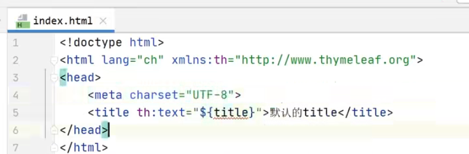
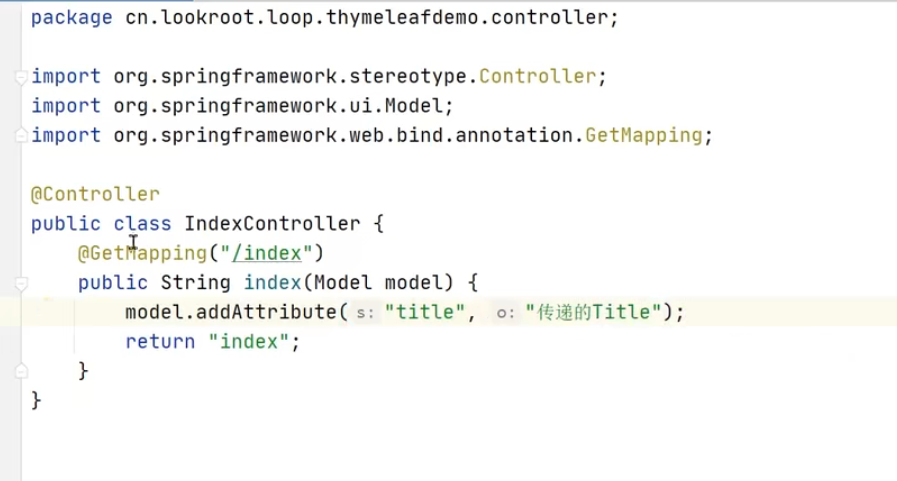
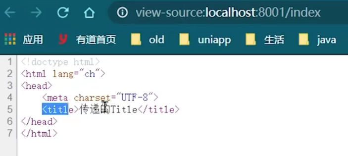
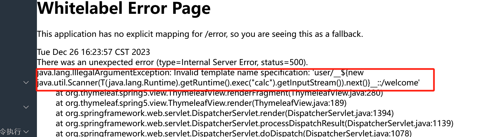
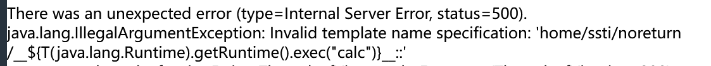
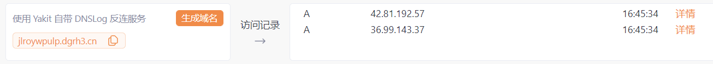

# SpringBoot审计基础知识 - 先知社区

SpringBoot审计基础知识

- - -

# 注入

## JDBC

```plain
public String int_based(String id, Model model) {

    StringBuilder result = new StringBuilder();

    try {
        Class.forName("com.mysql.cj.jdbc.Driver");
        Connection conn = DriverManager.getConnection(db_url, db_user, db_pass);

        String sql = "select * from users where id = " + id;
        result.append("执行SQL语句: ").append(sql).append(System.lineSeparator());
        result.append("查询结果: ").append(System.lineSeparator());
        PreparedStatement st = conn.prepareStatement(sql);
        ResultSet rs = st.executeQuery();

        while (rs.next()) {
            String res_name = rs.getString("username");
            String res_pass = rs.getString("password");
            String info = String.format("%s : %s%n", res_name, res_pass);
            result.append(info).append(System.lineSeparator());
        }
        rs.close();
        st.close();
        conn.close();
        model.addAttribute("results", result.toString());
    } catch (Exception e) {
        model.addAttribute("results", e.toString());
    }
    return "basevul/sqli/jdbc_int_based";
}
```

`String sql = "select * from users where id = " + id;`  
可以直接拼接

## Mybatis

### like

MyBatis支持两种参数符号，一种是#，另一种是$，#使用预编译，$使用拼接SQL。  
Mybatis模糊查询: `Select * from users where username like '%#{username}%'`  
在这种情况下使用 # 程序会报错,把 # 号改成 $ 可以解决  
但是如果java代码层面没有对用户输入的内容做处理，那么将会产生SQL注入漏洞。  
正确写法: `Select * from users where username like concat('%',#{username}, '%') POC: xxx%' union select database(),user(),@@version,4,5 -- -`

### Order by

MyBatis支持两种参数符号，一种是#，另一种是$，#使用预编译，$使用拼接SQL。  
由于使用 #{} 会将对象转成字符串，形成 order by \\"user\\" desc 造成错误  
因此很多研发会采用${}来解决，从而造成SQL注入  
POC: id and (updatexml(1,concat(0x7e,(select user())),0))-- -

### In

MyBatis支持两种参数符号，一种是#，另一种是$，#使用预编译，$使用拼接SQL。  
in之后多个id查询时使用 # 同样会报错，  
因此很多研发会采用${}来解决，从而造成SQL注入,例如：Select \* from users where id in (${ids})  
POC: 1,2,3) and (updatexml(1,concat(0x7e,(select user())),0))-- -

# 鉴权类

## 未授权访问

在项目javasec中

```plain
public class LoginHandlerInterceptor implements HandlerInterceptor {
    @Override
    public boolean preHandle(HttpServletRequest request, HttpServletResponse response, Object handler) throws Exception {
        HttpSession session = request.getSession();
        String username = (String) session.getAttribute("username");
        String path = request.getRequestURI();

        if (username == null) {
            //            request.setAttribute("msg", "请先登录！！！");
            response.sendRedirect("/admin/login?path=" + path);
            //            request.getRequestDispatcher("/index").forward(request, response);
            return false;
        } else {
            return true;
        }

    }
}
```

可以看到对用户进行了鉴权处理，对sesson进行了判断  
其mvcConfig类中写了如下代码

```plain
@Configuration
public class MvcConfig implements WebMvcConfigurer {
    @Override
    public void addInterceptors(InterceptorRegistry registry) {
        registry.addInterceptor(new LoginHandlerInterceptor())
        .addPathPatterns("/**")
        .excludePathPatterns("/", "/error", "/login", "/index", "/captcha", "/admin/login", "/admin/logout", "/api/*", "/css/*", "/images/*", "/upload/*", "/js/*", "/lib/*", "/page/*", "/unauth/*", "/shiro", "/home/shiro/*");
    }
```

其中excludePathPatterns写出了不被保护的资源

## 登录验证

```plain
public String login(String username, String password,
                    //                        @RequestParam(name = "password", required = true) String password,
                    String captcha, String path,
                    HttpSession session, HttpServletRequest request, Model model) {

    if (request.getMethod().equals("GET"))
        return "login";

    if (!CaptchaUtil.ver(captcha, request)) {
        CaptchaUtil.clear(request);
        model.addAttribute("msg", "验证码不正确");
        return "login";
    }
    Admin admin = adminService.login(username, password);
    if (admin != null) {
        session.setAttribute("username", username);
        if (path != null) {
            return "redirect:" + path;
        }
        return "redirect:/home";
    } else {
        model.addAttribute("msg", "用户名或密码错误");
        return "login";
    }
}
```

在如上方法里 调用了Admin admin = adminService.login(username, password);  
但是adminService是一个接口 这里调用的实际上市adminServiceImpl 接口实现对象的login方法

## springboot的 session示例

```plain
@Controller
public class SessionController {

    @GetMapping("/set")
    public String set(HttpSession session) {
        // 将用户名存储到 Session 中
        session.setAttribute("username", "admin");

        return "index";
    }

    @GetMapping("/get")
    public String get(HttpSession session) {
        // 从 Session 中获取用户名
        String username = (String) session.getAttribute("username");

        return "index";
    }

    @GetMapping("/invalidate")
    public String invalidate(HttpSession session) {
        // 使 Session 失效
        session.invalidate();

        return "index";
    }
}
```

# 文件操作

## 文件上传

```plain
@RequestMapping("/upload")
public String upload(MultipartFile file, Model model) throws IOException {

    // 获取文件的名称
    String fileName = file.getOriginalFilename();

    // 保存文件到磁盘
    FileOutputStream fos = new FileOutputStream(new File("/tmp/" + fileName));
    file.transferTo(fos);
    fos.close();

    // 将文件名添加到模型
    model.addAttribute("fileName", fileName);

    return "upload";
}
```

MultipartFile file 是 Spring MVC 提供的一个类，用于表示来自 HTTP 表单的文件上传。它提供了文件的名称、大小、类型等信息。  
Model model 是 Spring MVC 提供的一个类，用于将数据传递到视图。它可以包含任何类型的数据，包括基本类型、对象、集合等。  
后缀白名单

```plain
String Suffix = fileName.substring(fileName.lastIndexOf("."));
String[] SuffixSafe = {".jpg", ".png", ".jpeg", ".gif", ".bmp", ".ico"};
```

文件类型白名单

```plain
private static final String[] ALLOWED_IMAGE_TYPES = {
    "image/jpeg",
    "image/png",
    "image/gif",
    "image/bmp"
};

public static boolean isAllowed(File file) throws IOException {
    String contentType = getContentType(file);
    return Arrays.asList(ALLOWED_IMAGE_TYPES).contains(contentType);
}

private static String getContentType(File file) throws IOException {
    byte[] bytes = new byte[1024];
    int len = file.getInputStream().read(bytes);
    return Files.probeContentType(bytes, 0, len);
}
```

## 下载

```plain
public static boolean checkTraversal(String content) {
return content.contains("..") || content.contains("/");
}
//在下载的时候防止目录穿越
Security.checkTraversal(filename)
```

# 命令执行/代码执行

## RuntimeExec

命令执行

```plain
public String RuntimeExec(String cmd, Model model) {
    StringBuilder sb = new StringBuilder();
    String line;

    try {
        Process proc = Runtime.getRuntime().exec(cmd);

        InputStream fis = proc.getInputStream();
        InputStreamReader isr = new InputStreamReader(fis, "GBK");
        BufferedReader br = new BufferedReader(isr);
        while ((line = br.readLine()) != null) {
            sb.append(line).append(System.lineSeparator());
        }

    } catch (IOException e) {
        e.printStackTrace();
        sb.append(e);
    }
    model.addAttribute("results", sb.toString());
    return "basevul/rce/runtime";
}
```

## ScriptEngineManager

代码执行

> 在Java 8之后ScriptEngineManager的eval函数就没有了  
> windows: var a = mainOutput(); function mainOutput() { var x=java.lang.Runtime.getRuntime().exec("calc")};  
> Payload绕过: var a = mainOutput(); function mainOutput() { var x=java.lang.\\/*\*\**\\/Runtime.getRuntime().exec("calc");}

```plain
public String loadJsExec(String url, Model model) {
    try {
        ScriptEngine engine = new ScriptEngineManager().getEngineByExtension("js");

        // Bindings：用来存放数据的容器
        Bindings bindings = engine.getBindings(ScriptContext.ENGINE_SCOPE);
        String payload = String.format("load('%s')", url);
        engine.eval(payload, bindings);
        model.addAttribute("results", "远程脚本: " + HtmlUtils.htmlEscape(url) + " 执行成功!");
    } catch (Exception e) {
        e.printStackTrace();
        model.addAttribute("results", e.toString());
    }
    return "basevul/rce/loadjs";
}
```

> 该代码首先通过 ScriptEngineManager 类获取一个支持 JavaScript 的 ScriptEngine 对象。然后，它创建一个 Bindings 对象，用于存放数据。接着，它构造一个包含远程脚本 URL 的字符串，并将该字符串传递给 eval() 方法执行。最后，它将执行结果存储在 model 对象中。

## Groovy

代码执行

-   windows: "calc".execute()
-   macos: "open -a Calculator".execute()
    
    ```plain
    public String groovyExec(String cmd, Model model) {
     GroovyShell shell = new GroovyShell();
     try {
         shell.evaluate(cmd);
         model.addAttribute("results", "执行成功！！！");
     } catch (Exception e) {
         e.printStackTrace();
         model.addAttribute("results", e.toString());
     }
     return "basevul/rce/groovy";
    }
    ```
    
    \## ProcessBuilder
    
    > Process类是一个抽象类（所有的方法均是抽象的），封装了一个进程（即一个执行程序）。  
    > Process 类提供了执行从进程输入、执行输出到进程、等待进程完成、检查进程的退出状态以及销毁（杀掉）进程的方法。  
    > ProcessBuilder.start() 和 Runtime.exec 方法创建一个本机进程，并返回 Process 子类的一个实例，该实例可用来控制进程并获取相关信息。  
    > 创建的子进程没有自己的终端或控制台。它的所有标准 io（即 stdin，stdout，stderr）操作都将通过三个流 (getOutputStream()，getInputStream()，getErrorStream()) 重定向到父进程，通过流的形式进行读取。
    

```plain
public class ProcessBuilderExec {
    @RequestMapping("/processbuilder")
    public String ProcessBuilderExec(String ip, String safe, Model model) {
        if (safe != null) {
            if (Security.checkOs(ip)) {
                model.addAttribute("results", "检测到非法命令注入");
                return "basevul/rce/processbuilder";
            }
        }
        //        String[] cmdList = {"sh", "-c", "ping -c 1 " + ip};
        String[] cmdList = {"cmd", "/c", "ping -n 1 " + ip};
        StringBuilder sb = new StringBuilder();
        String line;
        String results;

        // 利用指定的操作系统程序和参数构造一个进程生成器
        ProcessBuilder pb = new ProcessBuilder(cmdList);
        pb.redirectErrorStream(true);

        // 使用此进程生成器的属性启动一个新进程
        Process process = null;
        try {
            process = pb.start();
            // 取得命令结果的输出流
            InputStream fis = process.getInputStream();
            // 用一个读输出流类去读
            InputStreamReader isr = new InputStreamReader(fis, "GBK");
            // 用缓存器读行
            BufferedReader br = new BufferedReader(isr);
            //直到读完为止
            while ((line = br.readLine()) != null) {
                sb.append(line).append(System.lineSeparator());
            }
            results = sb.toString();
        } catch (IOException e) {
            e.printStackTrace();
            results = e.toString();
        }
        model.addAttribute("results", results);
        return "basevul/rce/processbuilder";
    }
}
```

这里其中调用了 checkOs

```plain
public static boolean checkOs(String content) {
String black = "|,&,&&,;,||";
String[] black_list = black.split(",");
for (String s : black_list) {
    if (content.contains(s)) {
        return true;
    }
}
return false;
}
```

对输入的命令进行过滤，禁止使用管道符进行拼接。

## ProcessImpl

对于ProcessImpl类不能直接调用，但可以通过反射来间接调用ProcessImpl来达到执行命令的目的  
该类非Public修饰，所以在不同包下只能通过反射的方式去调用执行。

```plain
public String processImplExec(String cmd, Model model) {
    CharArrayWriter infoStream = null;
    try {
        Class<?> clazz = Class.forName("java.lang.ProcessImpl");
        Method method = clazz.getDeclaredMethod("start", String[].class, Map.class, String.class, ProcessBuilder.Redirect[].class, boolean.class);
        method.setAccessible(true);
        Process e = (Process) method.invoke(null, new String[]{cmd}, null, null, null, false);

        char[] bs = new char[2048];
        int readSize = 0;
        infoStream = new CharArrayWriter();
        InputStream inputStream = e.getInputStream();
        InputStreamReader inputStreamReader = new InputStreamReader(inputStream, "GBK");
        while ((readSize = inputStreamReader.read(bs)) > 0) {
            infoStream.write(bs, 0, readSize);
        }
        model.addAttribute("results", infoStream.toString());
    } catch (Exception ex) {
        ex.printStackTrace();
        model.addAttribute("results", ex.toString());
    }
    return "basevul/rce/processimpl";
}
```

# SSRF

## URLConnection

> SSRF(Server-side Request Forge, 服务端请求伪造)  
> SSRF漏洞形成的原因大部分是因为服务端提供了可以从其他服务器获取资源的功能，然而并没有对用户的输入以及发起请求的url进行过滤&限制，从而导致了ssrf的漏洞。  
> Java抽象出来了一个URLConnection类，它用来表示应用程序以及与URL建立通信连接的所有类的超类，通过URL类中的openConnection方法获取到URLConnection的类对象。  
> 支持的协议有 http、https、file、ftp、mailto、jar、netdoc、gopher(jdk8版本以后被阉割了)  
> Windows: file:///C:\\windows\\win.ini

Demo 代码

```plain
public String urlConnection(@RequestParam String url, String isHttp, String isIntranet) {
    if (url.equals("")) {
        return "请输入url";
    }

    if (isHttp != null && isHttp.equals("true")) {
        if (!Security.isHttp(url)) {
            return "不允许非http/https协议!!!";
        }
    }
    if (isIntranet != null && isIntranet.equals("true")) {
        if (Security.isIntranet(url)) {
            return "不允许访问内网!!!";
        }
    }

    String results = HTTP.URLConnection(url);

    return results;
}
}
```

```plain
public static boolean isHttp(String url) {
return url.startsWith("http://") || url.startsWith("https://");
}
```

```plain
public static boolean isIntranet(String url) {
Pattern reg = Pattern.compile("^(127\\.0\\.0\\.1)|(localhost)|(10\\.\\d{1,3}\\.\\d{1,3}\\.\\d{1,3})|(172\\.((1[6-9])|(2\\d)|(3[01]))\\.\\d{1,3}\\.\\d{1,3})|(192\\.168\\.\\d{1,3}\\.\\d{1,3})$");
Matcher match = reg.matcher(url);
boolean a = match.find();
return a;
}
```

# spel

> SpEL表达式注入  
> 漏洞描述  
> Spring Expression Language（简称 SpEL）是一种功能强大的表达式语言、用于在运行时查询和操作对象图；语法上类似于 Unified EL，但提供了更多的特性，特别是方法调用和基本字符串模板函数。  
> SpEL 的诞生是为了给 Spring 社区提供一种能够与 Spring 生态系统所有产品无缝对接，能提供一站式支持的表达式语言。  
> POC: T(java.lang.Runtime).getRuntime().exec("calc.exe")

```plain
public String spelVul(String exp, Model model) {
    try {
        // 1. 创建解析器：SpEL使用ExpressionParser接口表示解析器，提供SpelExpressionParser默认实现
        ExpressionParser parser = new SpelExpressionParser();
        // StandardEvaluationContext权限过大，可以执行任意代码
        EvaluationContext evaluationContext = new StandardEvaluationContext();

        // 2. 解析表达式: 使用ExpressionParser的parseExpression来解析相应的表达式为Expression对象
        // 3. 求值：通过 Expression 接口的 getValue 方法根据上下文获得表达式值
        String result = parser.parseExpression(exp).getValue(evaluationContext).toString();
        model.addAttribute("results", result);
    } catch (ParseException e) {
        e.printStackTrace();
        model.addAttribute("results", e.toString());
    }
    return "basevul/spel/spel";
}
```

# SSTI

前置 thymeleaf 开发知识  
设置一个index.html  
[](https://cdn.nlark.com/yuque/0/2023/png/21762749/1703576980970-3e45e367-d741-44ed-8374-d618efd81879.png#averageHue=%23f8f8f2&clientId=u5b490a61-0d9a-4&from=paste&height=173&id=u73a45d84&originHeight=259&originWidth=790&originalType=binary&ratio=1.5&rotation=0&showTitle=false&size=113294&status=done&style=none&taskId=u92d69ff7-11e7-4744-be2d-d9d17361c2d&title=&width=526.6666666666666)  
写一个控制器  
[](https://cdn.nlark.com/yuque/0/2023/png/21762749/1703577001366-6cb2f6bb-5052-44b7-9c6c-3a007916a531.png#averageHue=%23fafaf9&clientId=u5b490a61-0d9a-4&from=paste&height=321&id=u7ce28e58&originHeight=481&originWidth=897&originalType=binary&ratio=1.5&rotation=0&showTitle=false&size=190215&status=done&style=none&taskId=u25a60dc1-bda4-4b22-b06d-058b46b5c64&title=&width=598)  
[](https://cdn.nlark.com/yuque/0/2023/png/21762749/1703577203077-d0312894-b2dc-4725-80ce-9950f3dca53b.png#averageHue=%23dee0c6&clientId=u5b490a61-0d9a-4&from=paste&height=210&id=u9ce56fbc&originHeight=315&originWidth=703&originalType=binary&ratio=1.5&rotation=0&showTitle=false&size=118145&status=done&style=none&taskId=uef4dc28c-7455-4b2e-96e9-96aaa1cf62b&title=&width=468.6666666666667)

## thymeleaf

基本原理

```plain
<html>
<body>
  <h1>${name}</h1>
</body>
</html>
```

如果攻击者将以下恶意代码注入模板：

```plain
<html>
<body>
  <h1>${new java.lang.ProcessBuilder("calc").start()}</h1>
</body>
</html>
```

则模板会解析为以下内容：

```plain
<html>
<body>
  <h1>cmd /c calc</h1>
</body>
</html>
```

javasec的示例如下

```plain
@RequestMapping("/thymeleaf")
    public String thymeleaf(String content) {
        return "user/" + content + "/welcome"; //template path is tainted
    }
```

没有对应的模板文件，默认渲染文件名字，所以存在模板注入  
[](https://cdn.nlark.com/yuque/0/2023/png/21762749/1703579189283-0ecbb1e3-cc2a-4fce-885f-99a44736dc57.png#averageHue=%23e5e0df&clientId=u5b490a61-0d9a-4&from=paste&height=278&id=uf9fb1770&originHeight=417&originWidth=1489&originalType=binary&ratio=1.5&rotation=0&showTitle=false&size=124984&status=done&style=none&taskId=u80c506a6-4991-4aa7-bf28-e4c99dc94ae&title=&width=992.6666666666666)  
但是也会报错500

## no return

> 根据spring boot定义，如果controller无返回值，则以GetMapping的路由为视图名称。  
> 当然，对于每个http请求来讲，其实就是将请求的url作为视图名称，调用模板引擎去解析。  
> 在这种情况下，我们只要可以控制请求的controller的参数，一样可以造成RCE漏洞。

源码如下

```plain
@RequestMapping("/noreturn/{content}")
    public void noReturn(String content) {
        System.out.println("ok");
    }
```

poc：`GET /home/ssti/noreturn/__$%7BT(java.lang.Runtime).getRuntime().exec(%22calc%22)%7D__::.x HTTP/1.1`  
此时依旧会爆出模板文件无法找到的错误  
[](https://cdn.nlark.com/yuque/0/2023/png/21762749/1703579396956-b86ccd66-4a26-41be-9b27-2ac66c93a1ac.png#averageHue=%23e2e2e2&clientId=u5b490a61-0d9a-4&from=paste&height=70&id=ud029cd60&originHeight=105&originWidth=1123&originalType=binary&ratio=1.5&rotation=0&showTitle=false&size=28806&status=done&style=none&taskId=u34978d8a-dee5-472d-a369-a84130a4545&title=&width=748.6666666666666)

# XXE

## xmlreader

XML外部实体注入，当开发人员配置其XML解析功能允许外部实体引用时，攻击者可利用这一可引发安全问题的配置方式，实施任意文件读取、内网端口探测、命令执行、拒绝服务等攻击

```plain
public String XMLReader(@RequestBody String content, String entity) {
        try {
            if (entity !=null && entity.equals("true") && Security.checkXXE(content)) {
                return "检测到XXE攻击";
            }
            XMLReader xmlReader = XMLReaderFactory.createXMLReader();
            // 将功能 "http://apache.org/xml/features/disallow-doctype-decl" 设置为“真”时, 不允许使用 DOCTYPE。
            // xmlReader.setFeature("http://apache.org/xml/features/disallow-doctype-decl", true);
            xmlReader.parse(new InputSource(new StringReader(content)));
            return "XMLReader 解析成功";
        } catch (Exception e) {
            return e.toString();
        }
```

```plain
public static boolean checkXXE(String content) {
        String black = "ENTITY";
        return content.toUpperCase().contains(black);
    }
```

[](https://cdn.nlark.com/yuque/0/2023/png/21762749/1703580349712-7fbcc2ad-f1e9-420c-8d47-c8164d54062c.png#averageHue=%23fdfaf8&clientId=u5b490a61-0d9a-4&from=paste&height=80&id=u79d50f98&originHeight=120&originWidth=1305&originalType=binary&ratio=1.5&rotation=0&showTitle=false&size=15186&status=done&style=none&taskId=u191a4d66-236c-4c70-8585-8a46b41cf79&title=&width=870)

## SAXReader

```plain
public String SAXReader(@RequestBody String content, String entity) {
try {
    if (entity !=null && entity.equals("true") && Security.checkXXE(content)) {
        return "检测到XXE攻击";
    }
    SAXReader sax = new SAXReader();
    // 修复：禁用外部实体
    // sax.setFeature("http://apache.org/xml/features/disallow-doctype-decl", true);
    sax.read(new InputSource(new StringReader(content)));
    return "SAXReader 解析成功";
} catch (Exception e) {
    return e.toString();
}

}
```

## SAXBuilder

SAXBuilder是一个JDOM解析器，能将路径中的XML文件解析为Document对象

```plain
public String SAXBuilder(@RequestBody String content, String entity) {
        try {
            if (entity !=null && entity.equals("true") && Security.checkXXE(content)) {
                return "检测到XXE攻击";
            }
            SAXBuilder saxbuilder = new SAXBuilder();
            // saxbuilder.setFeature("http://apache.org/xml/features/disallow-doctype-decl", true);
            saxbuilder.build(new InputSource(new StringReader(content)));
            return "SAXBuilder 解析成功";
        } catch (Exception e) {
            return e.toString();
        }
    }
```

## DocumentBuilder

`Windows: <?xml version="1.0" encoding="utf-8"?><!DOCTYPE test [<!ENTITY xxe SYSTEM "file:///C:\windows\win.ini">]><person><name>&xxe;</name></person>`  
`Linux: <?xml version="1.0" encoding="utf-8"?><!DOCTYPE test [<!ENTITY xxe SYSTEM "file:///etc/passwd">]><person><name>&xxe;</name></person>`

```plain
public String DocumentBuilder(@RequestBody String content, String entity) {
        try {
            if (entity !=null && entity.equals("true") && Security.checkXXE(content)) {
                return "检测到XXE攻击";
            }
            // DocumentBuilderFactory是用于创建DOM模式的解析器对象,newInstance方法会根据本地平台默认安装的解析器，自动创建一个工厂的对象并返回。
            DocumentBuilderFactory factory = DocumentBuilderFactory.newInstance();
            // dbf.setFeature("http://apache.org/xml/features/disallow-doctype-decl", true);
            DocumentBuilder builder = factory.newDocumentBuilder();
            StringReader sr = new StringReader(content);
            InputSource is = new InputSource(sr);
            Document document = builder.parse(is);

            // 获取<person>标签名
            NodeList nodeList = document.getElementsByTagName("person");
            Element element = (Element) nodeList.item(0);
            return String.format("姓名: %s", element.getElementsByTagName("name").item(0).getFirstChild().getNodeValue());

        } catch (Exception e) {
            return e.toString();
        }
    }
```

## Unmarshaller

```plain
public String Unmarshaller(@RequestBody String content, String entity) {
        try {
            if (entity !=null && entity.equals("true") && Security.checkXXE(content)) {
                return "检测到XXE攻击";
            }
            JAXBContext context = JAXBContext.newInstance(Student.class);
            Unmarshaller unmarshaller = context.createUnmarshaller();

            XMLInputFactory xif = XMLInputFactory.newFactory();
            // fixed: 禁用外部实体
            // xif.setProperty(XMLConstants.ACCESS_EXTERNAL_DTD, "");
            // xif.setProperty(XMLConstants.ACCESS_EXTERNAL_STYLESHEET, "");

            // 默认情况下在1.8版本上不能加载外部dtd文件，需要更改设置。
            // xif.setProperty(XMLInputFactory.IS_SUPPORTING_EXTERNAL_ENTITIES, true);
            // xif.setProperty(XMLInputFactory.SUPPORT_DTD, true);
            XMLStreamReader xsr = xif.createXMLStreamReader(new StringReader(content));

            Object o = unmarshaller.unmarshal(xsr);

            return o.toString();

        } catch (Exception e) {
//            e.printStackTrace();
            return e.toString();
        }

    }
```
